# Docker基础

- 主要参考自：
  - https://www.bilibili.com/video/BV1og4y1q7M4?p=2&spm_id_from=pageDriver

# 1. Docker概述

- 为什么会有Docker？
  - 一款产品∶开发--上线两套环境！应用环境，应用配置!
  - 开发---运维。问题﹔我在我的电脑上可以运行!版本更新，导致服务不可用!对于运维来说，考验就十分大?
  - 环境配置是十分的麻烦，每一个机器都要邰署环境（集群Redis、ES、Hadoop.....!费时费力.
  - 发布一个项目( jar + ( Redis MysQL jdk ES ))项目能不能都带上环境安装打包？
  - 之前在服务器配置—个应用的环境Redis MySQL jdk ES Hadoap ，配置超麻烦了，不能够跨平台。windows开发，最后发布到Linux !
  - 传统：开发jar，运维来做!
  - 现在：开发打包部署上线，一套流程做完！=》Docker
    - java=>jar=>打包带上环境(镜像)=>Docker仓库=>下载发布的镜像=>直接运行即可！
- Docker核心思想：
  - 集装箱！
  - JRE--多个应用（端口冲突） ---原来都是交叉的!
  - 隔离：Docker核心思想！打包装箱！每个箱子是互相隔离的。

- Docker历史：
  - 2010年，几个搞IT的年轻人，就在美国成立了一家公司dotcloud，做一些pass的云计算服务! LXC(Linux容器)有关的容器技术！他们将自己的技术(容器化技术)命名就是 Docker !
    - Docker刚刚诞生的时候，没有引起行业的注意! dotCloud，就活不下去！
    - 所以就决定开源！
  - 2013年，Docker开源！Docker越来越多的人发观了docker的优点！火了，Docker每个月都会更新一个版本!
  - 2014年4月9日，Docker1.0发布!
- Docker为什么这么火？
  - 十分的轻巧!
  - 在容器技术出来之前，我们都是使用虚拟机技术!
  - 虚拟机：在window中装一个VMware，通过这个软件我们可以虚拟出来一台或者多台电脑！但是十分笨重！
  - 虚拟机,也是属于虚拟化技术，Docker容器技术，也是一种虚拟化技术!
    - vm : linux centos原生镜像（一个电脑!) 隔离，需要开启多个虚拟机！―几个G！几分钟
    - docker：隔离，镜像〈最核心的环境4MB + jdk + mysq1)十分的小巧，运行镜像就可以了！小巧！几个M KB，秒级启动！
- Docker?
  - 基于Go语言开发的开源项目！
  - 官网：https://www.docker.com/
  - 文档：https://docs.docker.com/ 很详细！！！
  - 仓库地址：https://hub.docker.com/
- Docker可以干嘛？
  - 之前的虚拟机技术：
    - 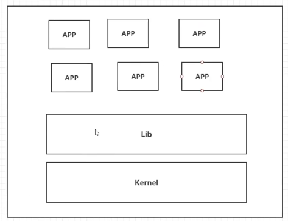
      - 资源占用十分多、十分冗余、启动很慢！
  - 容器化技术：
    - **不是模拟一个完整的操作系统，只需要核心库即可**
    - 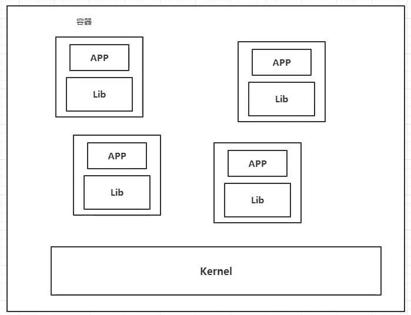
  - Docker和虚拟机的比较：
    - 传统虚拟机：虚拟出一套硬件，运行一个完整的操作系统，然后就在这个系统上安装和运行软件
    - Docker：直接运行在宿主机上，没有自己的内核，也没有虚拟硬件，所以轻便了！
      - 内核级别的虚拟化
      - 每个容器间是相互隔离的，每个容器有一个属于自己的文件系统，互不影响
- DevOps：开发、运维：
  - **应用更快速的交付和部署**
    - 传统：一堆帮助文档，安装程序，环境等
    - Docker：打包镜像，发布测试。一键运行
  - **更便捷的升级和扩缩容** 
    - 使用了Docker之后，我们部罢应用就和搭积木一样！
    - 项目打包为一个镜像,更容易扩展服务器A！服务器B
  - **更简单的系统运维**
    - 在容器化之后，我们的开发，测l试环境都是高度一致的。
  - **更高效的计算资源利用**
    - Docker是内核级别的虚拟化，可以再一个物理机上可以运行很多的容器实例！服务器的性能可以被压榨到极致

# 2. Docker安装

## 2.1 Docker的基本组成

- 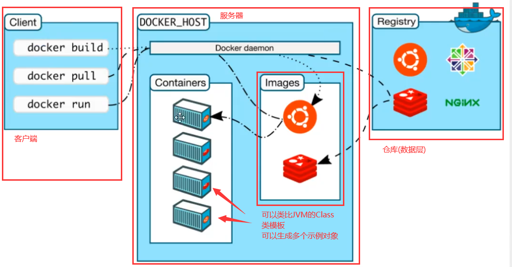
  - Images：镜像：
    - Docker镜像就好比是一个模板，可以通过这个模板来创建容器服务！
    - 如：tomcat镜像=>run=>tomcat01容器提供服务，tomcat02容器提供服务
    - 通过镜像可以创建多个容器，最终服务运行或者项目就是运行在容器中的！
  -  Containers：容器：
    - Docker利用容器技术，可以独立运行或者一组应用，通过镜像来创建
    - 可以：启动、停止、删除、基本命令
    - 目前可以理解为：容器就是一个简易的linux系统
  - Repository：仓库
    - Docker仓库就是存放镜像的地方！
    - 仓库：公有仓库、私有仓库！
      - 国外官方的：DockerHub
      - 国内第三方：阿里云...

## 2.2 安装Docker

- 环境准备：
  - Linux！
  - 使用阿里云的服务器即可
- 环境查看：
  - 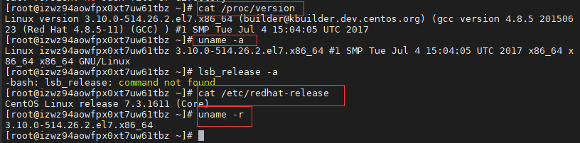
  - 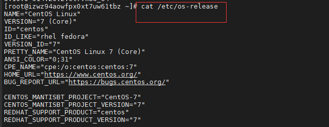

- 安装：主要看官方文档！

  - 1、卸载旧的Docker

    - ```bash
       sudo yum remove docker \
                        docker-client \
                        docker-client-latest \
                        docker-common \
                        docker-latest \
                        docker-latest-logrotate \
                        docker-logrotate \
                        docker-engine
      ```

  - 2、安装需要的安装包

    - ```bash
       sudo yum install -y yum-utils
      ```

  - 3、设置镜像的仓库

    - ```bash
      
      sudo yum-config-manager \
          --add-repo \
          https://download.docker.com/linux/centos/docker-ce.repo # 十分慢，设置国内的
      
      # 设置阿里云的
      yum-config-manager  --add-repo  http://mirrors.aliyun.com/docker-ce/linux/centos/docker-ce.repo
          
      ```

  - 4、安装docker

    - ```bash
      # 更新yum软件索引
      yum makecache fast
      
      # ce：社区版 ee：企业版
      # 也可以指定版本，建议看官方文档即可：https://docs.docker.com/engine/install/centos/
      sudo yum install docker-ce docker-ce-cli containerd.io
      
      # 查看是否安装成功
      docker version
      ```

  - 5、启动docker，测试安装是否成功

    - ```bash
      # 启动docker
      sudo systemctl start docker
      
      # 测试,运行hello-world
      sudo docker run hello-world
      ```

    - 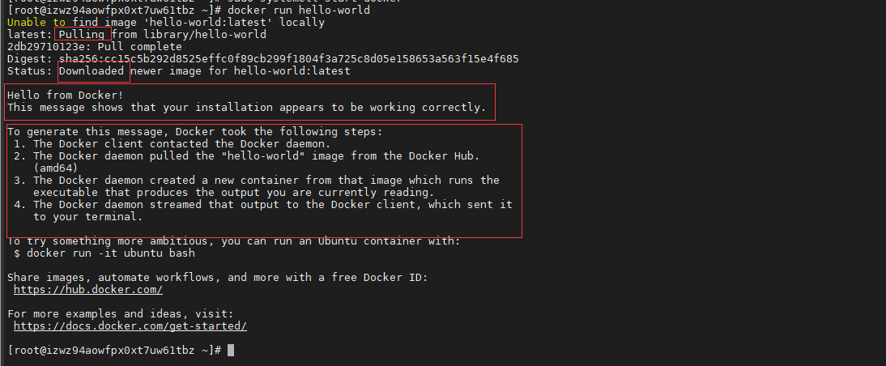

  - 6、查看下载的hello-world镜像

    - ```bash
      docker images
      ```

- 卸载：也看官方文档：https://docs.docker.com/engine/install/centos/

  - ```bash
    # 1.Uninstall the Docker Engine, CLI, and Containerd packages:
    # 卸载依赖
    sudo yum remove docker-ce docker-ce-cli containerd.io
    # 2.mages, containers, volumes, or customized configuration files on your host are not automatically removed. To delete all images, containers, and volumes:
    # 删除目录
    sudo rm -rf /var/lib/docker
    sudo rm -rf /var/lib/containerd
    ```

## 2.3 阿里云镜像加速

- 1、登录阿里云，找镜像加速器即可
  - 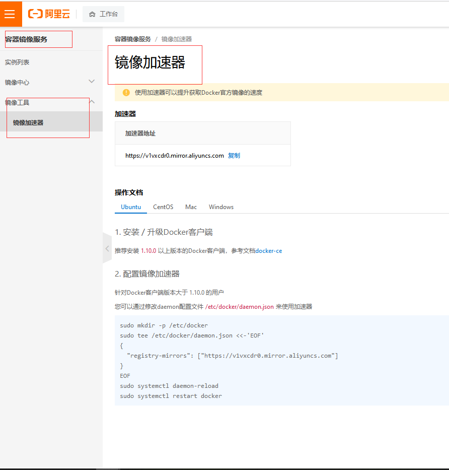
- 配置使用即可

## 2.4 回顾hello-world的运行流程

- 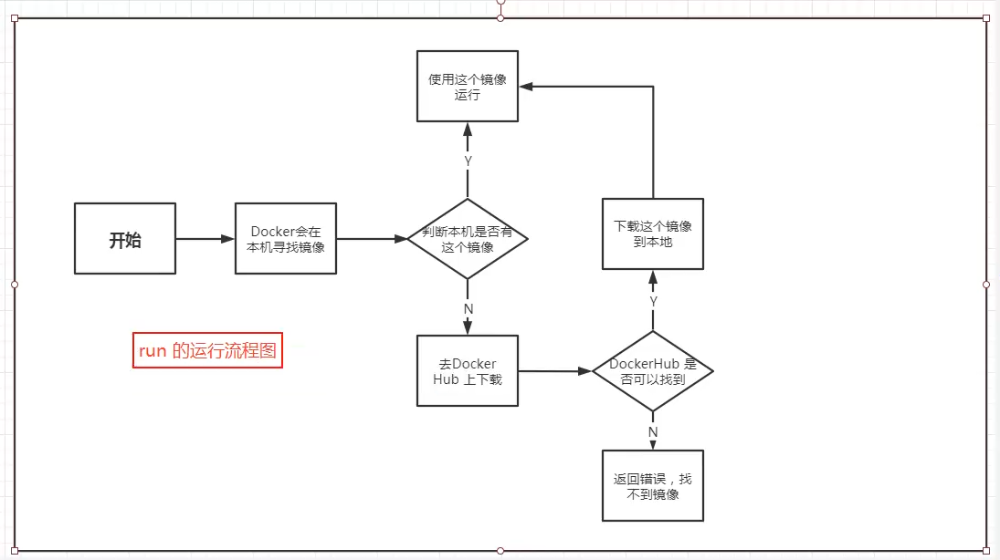

## 2.5 Docker的底层运行原理

- **Docker是怎么工作的？**
  - Docker是一个Client-Server结构的系统！，Docker的守护进程运行在主机上，通过Socker从客户端进行访问
  - Docker Server在接收到Docker Client的指令后，就会执行这个指令（可以回想一下Netty如何实现Redis协议？？？）

- 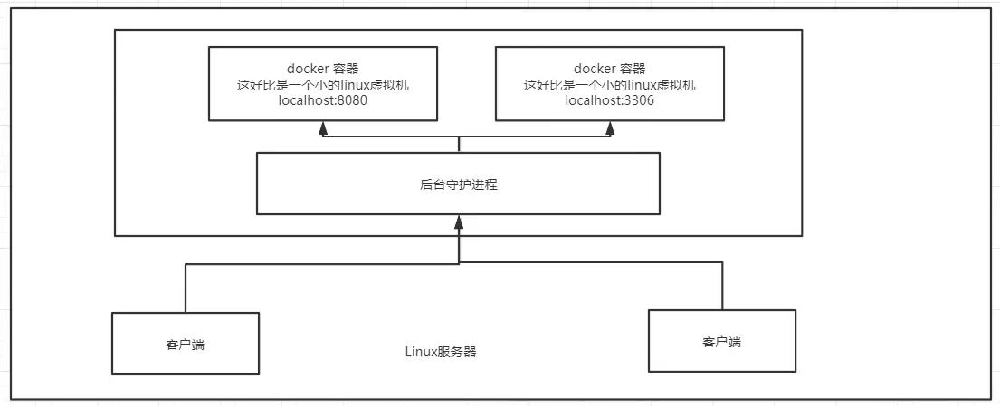
- **Docker为什么比VM快？=》建议直接百度也可**
  - 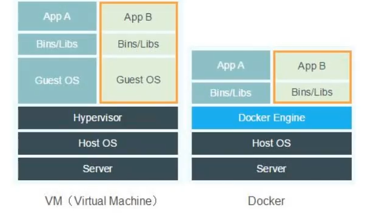
  - Docker有着比虚拟机更少的抽象层
  - Docker利用的是宿主机的内核，VM需要的是Guest OS 
  - 因此：新建一个容器的时候，docker不需要像虚拟机一样重新加载一个操作系统内核，避免引导，虚拟机是加载Guest OS，需要几分钟，而Docker是利用宿主机的内核，省略了这个复杂的过程，只需要几分钟即可

# 3. Docker的常用命令

## 3.1 帮助命令

- 不会也可以直接查官网文档：https://docs.docker.com/engine/reference/run/

```bash
docker version # 显示Docker的版本信息

docker info # 显示docker的更加详细的信息

docker 命令 --help # 帮助命令，万能命令
docker --help
```

## 3.2 镜像命令

- **docker images ：查看所有本机的主机上的镜像,表格形式**
  - ```bash
    docker images --help
    	
    [root@izwz94aowfpx0xt7uw61tbz etc]# docker images
    REPOSITORY    TAG       IMAGE ID       CREATED        SIZE
    hello-world   latest    feb5d9fea6a5   2 months ago   13.3kB
    
    #解释
    REPOSITORY 	# 镜像的仓库源
    TAG 		# 镜像的标签
    IMAGE ID	# 镜像的id
    CREATED		# 镜像的创建时间
    SIZE		# 镜像的大小
    
    #可选项
    -a， --a 	#列出所有镜像
    -q，--quiet	#只显示镜像的id
    ```

- **docker search 搜索镜像**

  - 和在官网的仓库搜索是一样的！

  - ```bash
    [root@izwz94aowfpx0xt7uw61tbz etc]# docker search mysql
    NAME                              DESCRIPTION                                     STARS     OFFICIAL                                AUTOMATED
    mysql                             MySQL is a widely used, open-source relation…   11748     [OK]                                 
    mariadb                           MariaDB Server is a high performing open sou…   4478      [OK]                                 
    #可选项，根据start来过滤
    --filter=5TARS=3000 #搜索出来的镜像就是STAR5大于3000的
    docker search mysql --filter=STARS=3000
    
    ```

  - 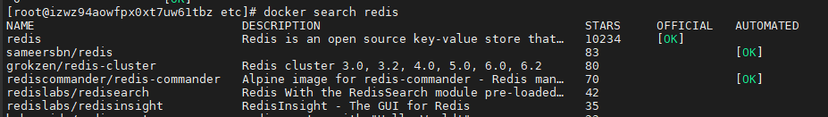

- **docker pull 下载镜像**

  - ```bash
    docker pull --help
    # 下载镜像 docker pull 镜像名
    # 默认下载最新的！
    
    [root@izwz94aowfpx0xt7uw61tbz etc]# docker pull mysql
    Using default tag: latest 	# 如果不写tag，默认就是最新的		
    latest: Pulling from library/mysql 
    a10c77af2613: Pull complete # 分层下载，docker images的核心 联合文件系统
    b76a7eb51ffd: Pull complete
    258223f927e4: Pull complete
    2d2c75386df9: Pull complete
    63e92e4046c9: Pull complete
    f5845c731544: Pull complete
    bd0401123a9b: Pull complete
    3ef07ec35f1a: Pull complete
    c93a31315089: Pull complete
    3349ed800d44: Pull complete
    6d01857ca4c1: Pull complete
    4cc13890eda8: Pull complete
    Digest: sha256:aeecae58035f3868bf4f00e5fc623630d8b438db9d05f4d8c6538deb14d4c31b # 签名
    Status: Downloaded newer image for mysql:latest
    docker.io/library/mysql:latest # 真实地址
    
    
    # 下载指定版本
    [root@izwz94aowfpx0xt7uw61tbz etc]# docker pull mysql:5.7
    5.7: Pulling from library/mysql
    a10c77af2613: Already exists # 因为使用了分层下载，联合文件系统，导致之前下载过的东西无需再次下载，节省内存！
    b76a7eb51ffd: Already exists
    258223f927e4: Already exists
    2d2c75386df9: Already exists
    63e92e4046c9: Already exists
    f5845c731544: Already exists
    bd0401123a9b: Already exists
    2724b2da64fd: Pull complete
    d10a7e9e325c: Pull complete
    1c5fd9c3683d: Pull complete
    2e35f83a12e9: Pull complete
    Digest: sha256:7a3a7b7a29e6fbff433c339fc52245435fa2c308586481f2f92ab1df239d6a29
    Status: Downloaded newer image for mysql:5.7
    docker.io/library/mysql:5.7
    ```

- **docker rmi 删除镜像**

  - ```bash
    docker rmi --help
    
    # 根据IMAGE ID进行删除
    [root@izwz94aowfpx0xt7uw61tbz etc]# docker images -a
    REPOSITORY    TAG       IMAGE ID       CREATED        SIZE
    mysql         5.7       8b43c6af2ad0   12 days ago    448MB
    mysql         latest    b05128b000dd   12 days ago    516MB
    hello-world   latest    feb5d9fea6a5   2 months ago   13.3kB
    [root@izwz94aowfpx0xt7uw61tbz etc]# docker rmi -f 5.7
    Error: No such image: 5.7
    [root@izwz94aowfpx0xt7uw61tbz etc]# docker rmi -f 8b43c6af2ad0
    
    [root@izwz94aowfpx0xt7uw61tbz etc]# docker images -a
    REPOSITORY    TAG       IMAGE ID       CREATED        SIZE
    mysql         latest    b05128b000dd   12 days ago    516MB
    hello-world   latest    feb5d9fea6a5   2 months ago   13.3kB
    
    # 删除多个镜像
    docker rmi -f 镜像id 镜像id 镜像id
    
    # 全部删除(根据命令递归遍历删除)
    [root@izwz94aowfpx0xt7uw61tbz etc]# docker images -a
    REPOSITORY    TAG       IMAGE ID       CREATED        SIZE
    mysql         latest    b05128b000dd   12 days ago    516MB
    hello-world   latest    feb5d9fea6a5   2 months ago   13.3kB
    [root@izwz94aowfpx0xt7uw61tbz etc]# docker rmi -f $(docker images -aq)
    
    [root@izwz94aowfpx0xt7uw61tbz etc]# docker images -a
    REPOSITORY   TAG       IMAGE ID   CREATED   SIZE
    ```

## 3.3 容器命令

- 有了镜像才可以使用容器！

  - 下载一个linux镜像来测试学习

  - ```bash
    docker pull centos
    ```

- **新建容器并且启动**

  - ```bash
    docker run --help
    docker run[可选参数] image
    #参数说明
    --name="Name" 	容器名字tomcat01 tomcat02，用来区分容器
    -d				后台方式运行
    -it				使用交互方式运行，进入容器查看内容
    -p				指定容器的端口-p 8080:8080
    	-p ip:主机端口:容器端口
    	-p 主机端口:容器端口（常用)
    	-p 容器端口
    	容器端口
    -P				随机指定端口
    
    ```

  - ```bash
    # 测试
    # 启动并且进入容器！！！
    [root@izwz94aowfpx0xt7uw61tbz etc]# docker run -it centos /bin/bash
    [root@ef845c470c7e /]# ls # 容器内部的centos系统，基础版本，很多命令都不完善
    bin  etc   lib    lost+found  mnt  proc  run   srv  tmp  var
    dev  home  lib64  media       opt  root  sbin  sys  usr
    [root@ef845c470c7e /]# exit # 退出容器，返回主机
    exit
    [root@izwz94aowfpx0xt7uw61tbz etc]# ;s
    -bash: syntax error near unexpected token `;'
    [root@izwz94aowfpx0xt7uw61tbz etc]# clear
    [root@izwz94aowfpx0xt7uw61tbz etc]# docker run -it centos /bin/bash
    [root@a7b8a45e07be /]# ls
    bin  etc   lib    lost+found  mnt  proc  run   srv  tmp  var
    dev  home  lib64  media       opt  root  sbin  sys  usr
    [root@a7b8a45e07be /]# exit
    exit
    [root@izwz94aowfpx0xt7uw61tbz etc]# ls
    adjtime                  gss                       profile.d
    aliases                  host.conf                 protocols
    aliases.db               hostname                  python
    ```

- **列出所有的运行的容器**

  - ```bash
    docker ps --help
    #docker ps	#列出当前正在运行的容器
    			-a	 #列出当前正在运行的容器+带出历史运行过的容器
    			-n=? #显示最近创建的容器
    			-q 	 #只显示容器的编号
    
    # 查看当前正在运行的容器
    [root@izwz94aowfpx0xt7uw61tbz /]# docker ps
    CONTAINER ID   IMAGE     COMMAND   CREATED   STATUS    PORTS     NAMES
    
    # 查看所有正在运行+运行过的容器
    [root@izwz94aowfpx0xt7uw61tbz /]# docker ps -a
    CONTAINER ID   IMAGE          COMMAND       CREATED             STATUS                         PORTS     NAMES
    a7b8a45e07be   centos         "/bin/bash"   2 minutes ago       Exited (0) 2 minutes ago                 modest_pare
    ef845c470c7e   centos         "/bin/bash"   13 minutes ago      Exited (0) 2 minutes ago                 busy_jackson
    8650a1469b1c   feb5d9fea6a5   "/hello"      About an hour ago   Exited (0) About an hour ago             clever_cohen
    
    ```

- **退出容器**

  - ```bash
    exit #直接容器停止并退出
    Ctrl +P+Q#容器不停止退出
    ```

- **删除容器**

  - 可以对比删除镜像(images)，也就是多了一个i

  - ```bash
    # 删除指定容器,不能删除正在运行的容器，如果要强制删除，使用rm -f
    docker rm 容器id
    # 删除全部容器
    docker rm -f $(docker ps -aq)
    
    # 删除全部容器
    docker ps -a -q | xargs docker rm
    ```

- **启动和停止容器**

  - ```bash
    docker start 容器id(或者名字)
    docker restart 容器id
    docker stop 容器id
    docker kill 容器id
    ```

## 3.4 常用其他命令

- **后台启动容器**

  - ```bash
    [root@izwz94aowfpx0xt7uw61tbz ~]# docker ps
    CONTAINER ID   IMAGE     COMMAND   CREATED   STATUS    PORTS     NAMES
    # 后台启动容器，但是通过ps查看，发现容器停止了，为什么？
    [root@izwz94aowfpx0xt7uw61tbz ~]# docker run -d centos
    9c6605680e9e14005f82cb149e8dbcf8c9d25739776f0ecd80051e9b0f91ce55
    [root@izwz94aowfpx0xt7uw61tbz ~]# docker ps
    CONTAINER ID   IMAGE     COMMAND   CREATED   STATUS    PORTS     NAMES
    
    #问题docker ps，发现centos停止了
    #常见的坑: docker容器使用后台运行，就必须要有要一个前台进程，docker发现没有应用，就会自动停止
    # 如：nginx，容器启动后，发现自己没有提供服务，就会立刻停止，就是没有程序了
    ```

- **查看容器日志**

  - ```bash
    docker logs -f -t --tail 查看的条数, 容器id
    # 如果发现没有日志，是因为容器并没有运行服务，可以写一段shell脚本让它运行
    
    
    [root@izwz94aowfpx0xt7uw61tbz ~]# docker ps
    CONTAINER ID   IMAGE     COMMAND   CREATED   STATUS    PORTS     NAMES
    [root@izwz94aowfpx0xt7uw61tbz ~]# docker run -d centos /bin/sh -c "while true;do echo helloworld;sleep 1;done"
    cbe9286aac0f747e7eafacdb43d1f46edeada67abc3c960ed225946531a98cb4
    [root@izwz94aowfpx0xt7uw61tbz ~]# docker ps
    CONTAINER ID   IMAGE    
    cbe9286aac0f   centos  
    [root@izwz94aowfpx0xt7uw61tbz ~]# docker logs cbe9286aac0f
    helloworld
    helloworld
    helloworld
    helloworld
    helloworld
    
    
    [root@izwz94aowfpx0xt7uw61tbz ~]# docker logs -tf --tail 10 cbe9286aac0f
    2021-12-01T00:17:57.058019361Z helloworld
    2021-12-01T00:17:58.060533911Z helloworld
    2021-12-01T00:17:59.063265440Z helloworld
    
    
    #显示日志
    -tf 			#显示日志详细信息
    --tail number #要显示日志条数
    
    ```

- **查看容器中进程信息**

  - ```bash
    # docker top 容器id
    [root@izwz94aowfpx0xt7uw61tbz ~]# docker top cbe9286aac0f
    UID                 PID                 PPID                C                   STIME               TTY                 TIME                CMD
    root                13428               13381               0                   08:16               ?                   00:00:00            /bin/sh -c while true;do echo helloworld;sleep 1;done
    root                15154               13428               0                   08:19               ?                   00:00:00            /usr/bin/coreutils --coreutils-prog-shebang=sleep /usr/bin/
    ```

- **查看容器的元数据**

  - ```bash
    # 命令
    docker inspect 容器id
    
    # 测试
    [root@izwz94aowfpx0xt7uw61tbz ~]# docker ps
    CONTAINER ID   IMAGE     COMMAND                  CREATED         STATUS         PORTS     NAMES
    cbe9286aac0f   centos    "/bin/sh -c 'while t…"   7 minutes ago   Up 7 minutes             beautiful_khayyam
    [root@izwz94aowfpx0xt7uw61tbz ~]# docker inspect cbe9286aac0f
    [
        {
            "Id": "cbe9286aac0f747e7eafacdb43d1f46edeada67abc3c960ed225946531a98cb4",
            "Created": "2021-12-01T00:16:14.387181879Z",
            "Path": "/bin/sh",
            "Args": [
                "-c",
                "while true;do echo helloworld;sleep 1;done"
            ],
            "State": {
                "Status": "running",
                "Running": true,
                "Paused": false,
                "Restarting": false,
                "OOMKilled": false,
                "Dead": false,
                "Pid": 13428,
                "ExitCode": 0,
                "Error": "",
                "StartedAt": "2021-12-01T00:16:14.800300541Z",
                "FinishedAt": "0001-01-01T00:00:00Z"
            },
            "Image": "sha256:5d0da3dc976460b72c77d94c8a1ad043720b0416bfc16c52c45d4847e53fadb6",
            "ResolvConfPath": "/var/lib/docker/containers/cbe9286aac0f747e7eafacdb43d1f46edeada67abc3c960ed225946531a98cb4/resolv.conf",
            "HostnamePath": "/var/lib/docker/containers/cbe9286aac0f747e7eafacdb43d1f46edeada67abc3c960ed225946531a98cb4/hostname",
            "HostsPath": "/var/lib/docker/containers/cbe9286aac0f747e7eafacdb43d1f46edeada67abc3c960ed225946531a98cb4/hosts",
            "LogPath": "/var/lib/docker/containers/cbe9286aac0f747e7eafacdb43d1f46edeada67abc3c960ed225946531a98cb4/cbe9286aac0f747e7eafacdb43d1f46edeada67abc3c960ed225946531a98cb4-json.log",
            "Name": "/beautiful_khayyam",
            "RestartCount": 0,
            "Driver": "overlay2",
            "Platform": "linux",
            "MountLabel": "",
            "ProcessLabel": "",
            "AppArmorProfile": "",
            "ExecIDs": null,
            "HostConfig": {
                "Binds": null,
                "ContainerIDFile": "",
                "LogConfig": {
                    "Type": "json-file",
                    "Config": {}
                },
                "NetworkMode": "default",
                "PortBindings": {},
                "RestartPolicy": {
                    "Name": "no",
                    "MaximumRetryCount": 0
                },
                "AutoRemove": false,
                "VolumeDriver": "",
                "VolumesFrom": null,
                "CapAdd": null,
                "CapDrop": null,
                "CgroupnsMode": "host",
                "Dns": [],
                "DnsOptions": [],
                "DnsSearch": [],
                "ExtraHosts": null,
                "GroupAdd": null,
                "IpcMode": "private",
                "Cgroup": "",
                "Links": null,
                "OomScoreAdj": 0,
                "PidMode": "",
                "Privileged": false,
                "PublishAllPorts": false,
                "ReadonlyRootfs": false,
                "SecurityOpt": null,
                "UTSMode": "",
                "UsernsMode": "",
                "ShmSize": 67108864,
                "Runtime": "runc",
                "ConsoleSize": [
                    0,
                    0
                ],
                "Isolation": "",
                "CpuShares": 0,
                "Memory": 0,
                "NanoCpus": 0,
                "CgroupParent": "",
                "BlkioWeight": 0,
                "BlkioWeightDevice": [],
                "BlkioDeviceReadBps": null,
                "BlkioDeviceWriteBps": null,
                "BlkioDeviceReadIOps": null,
                "BlkioDeviceWriteIOps": null,
                "CpuPeriod": 0,
                "CpuQuota": 0,
                "CpuRealtimePeriod": 0,
                "CpuRealtimeRuntime": 0,
                "CpusetCpus": "",
                "CpusetMems": "",
                "Devices": [],
                "DeviceCgroupRules": null,
                "DeviceRequests": null,
                "KernelMemory": 0,
                "KernelMemoryTCP": 0,
                "MemoryReservation": 0,
                "MemorySwap": 0,
                "MemorySwappiness": null,
                "OomKillDisable": false,
                "PidsLimit": null,
                "Ulimits": null,
                "CpuCount": 0,
                "CpuPercent": 0,
                "IOMaximumIOps": 0,
                "IOMaximumBandwidth": 0,
                "MaskedPaths": [
                    "/proc/asound",
                    "/proc/acpi",
                    "/proc/kcore",
                    "/proc/keys",
                    "/proc/latency_stats",
                    "/proc/timer_list",
                    "/proc/timer_stats",
                    "/proc/sched_debug",
                    "/proc/scsi",
                    "/sys/firmware"
                ],
                "ReadonlyPaths": [
                    "/proc/bus",
                    "/proc/fs",
                    "/proc/irq",
                    "/proc/sys",
                    "/proc/sysrq-trigger"
                ]
            },
            "GraphDriver": {
                "Data": {
                    "LowerDir": "/var/lib/docker/overlay2/0ef56c3ef451f6e30d6042b13c5ec146a2c9b931c0f08559d5d1c0df382d6323-init/diff:/var/lib/docker/overlay2/358638201a27c4943e7b91a9e54dc5f55dbb86b041848dff05ec72f78ae325ab/diff",
                    "MergedDir": "/var/lib/docker/overlay2/0ef56c3ef451f6e30d6042b13c5ec146a2c9b931c0f08559d5d1c0df382d6323/merged",
                    "UpperDir": "/var/lib/docker/overlay2/0ef56c3ef451f6e30d6042b13c5ec146a2c9b931c0f08559d5d1c0df382d6323/diff",
                    "WorkDir": "/var/lib/docker/overlay2/0ef56c3ef451f6e30d6042b13c5ec146a2c9b931c0f08559d5d1c0df382d6323/work"
                },
                "Name": "overlay2"
            },
            "Mounts": [],
            "Config": {
                "Hostname": "cbe9286aac0f",
                "Domainname": "",
                "User": "",
                "AttachStdin": false,
                "AttachStdout": false,
                "AttachStderr": false,
                "Tty": false,
                "OpenStdin": false,
                "StdinOnce": false,
                "Env": [
                    "PATH=/usr/local/sbin:/usr/local/bin:/usr/sbin:/usr/bin:/sbin:/bin"
                ],
                "Cmd": [
                    "/bin/sh",
                    "-c",
                    "while true;do echo helloworld;sleep 1;done"
                ],
                "Image": "centos",
                "Volumes": null,
                "WorkingDir": "",
                "Entrypoint": null,
                "OnBuild": null,
                "Labels": {
                    "org.label-schema.build-date": "20210915",
                    "org.label-schema.license": "GPLv2",
                    "org.label-schema.name": "CentOS Base Image",
                    "org.label-schema.schema-version": "1.0",
                    "org.label-schema.vendor": "CentOS"
                }
            },
            "NetworkSettings": {
                "Bridge": "",
                "SandboxID": "c7facc5715438323afe2306af5f8556a530873fc1c287c66c7dba49d906ad680",
                "HairpinMode": false,
                "LinkLocalIPv6Address": "",
                "LinkLocalIPv6PrefixLen": 0,
                "Ports": {},
                "SandboxKey": "/var/run/docker/netns/c7facc571543",
                "SecondaryIPAddresses": null,
                "SecondaryIPv6Addresses": null,
                "EndpointID": "df0948757a87a0a0c030b0e2fdd722e8b9e409c648a032969bb70a3a467b75cb",
                "Gateway": "172.17.0.1",
                "GlobalIPv6Address": "",
                "GlobalIPv6PrefixLen": 0,
                "IPAddress": "172.17.0.2",
                "IPPrefixLen": 16,
                "IPv6Gateway": "",
                "MacAddress": "02:42:ac:11:00:02",
                "Networks": {
                    "bridge": {
                        "IPAMConfig": null,
                        "Links": null,
                        "Aliases": null,
                        "NetworkID": "ec804368a646c96a117946d4478e56d4238d87b27dca28852fc62b9d47730e2f",
                        "EndpointID": "df0948757a87a0a0c030b0e2fdd722e8b9e409c648a032969bb70a3a467b75cb",
                        "Gateway": "172.17.0.1",
                        "IPAddress": "172.17.0.2",
                        "IPPrefixLen": 16,
                        "IPv6Gateway": "",
                        "GlobalIPv6Address": "",
                        "GlobalIPv6PrefixLen": 0,
                        "MacAddress": "02:42:ac:11:00:02",
                        "DriverOpts": null
                    }
                }
            }
        }
    ]
    
    ```

- **进入当前正在运行的容器**

  - ```bash
    # 通常容器都是使用后台方式运行的，但是需要进入客器，修改一些配置
    
    # 命令
    docker exec -it 容器id /bin/bash(bashShell)
    
    # 测试
    [root@izwz94aowfpx0xt7uw61tbz ~]# docker ps
    CONTAINER ID   IMAGE     COMMAND                  CREATED          STATUS          PORTS     NAMES
    cbe9286aac0f   centos    "/bin/sh -c 'while t…"   10 minutes ago   Up 10 minutes             beautiful_khayyam
    [root@izwz94aowfpx0xt7uw61tbz ~]# docker exec -it cbe9286aac0f /bin/bash
    [root@cbe9286aac0f /]# ls
    bin  dev  etc  home  lib  lib64  lost+found  media  mnt  opt  proc  root  run  sbin  srv  sys  tmp  usr  var
    [root@cbe9286aac0f /]# ps -ef
    UID        PID  PPID  C STIME TTY          TIME CMD
    root         1     0  0 00:16 ?        00:00:00 /bin/sh -c while true;do echo helloworld;sleep 1;done
    root       678     0  0 00:27 pts/0    00:00:00 /bin/bash
    root       699     1  0 00:27 ?        00:00:00 /usr/bin/coreutils --coreutils-prog-shebang=sleep /usr/bin/sleep 1
    root       700   678  0 00:27 pts/0    00:00:00 ps -ef
    
    # 方式二
    # 命令
    docker attach 容器id
    
    # 区别
    # docker exec
    # 进入容器后开启一个新的终端,可以在里面操作（常用)
    # docker attach#进入容器正在执行的终端，不会启动新的进程!
    
    ```

- **从容器内拷贝文件到主机上**

  - ```bash
    docker cp 容器id:容器内文件路径 当前主机路径
    
    # 测试
    [root@izwz94aowfpx0xt7uw61tbz ~]# docker ps -a
    CONTAINER ID   IMAGE     COMMAND   CREATED   STATUS    PORTS     NAMES
    # 运行一个容器，并且进入容器内部新建一个文件
    [root@izwz94aowfpx0xt7uw61tbz ~]# docker run -it centos /bin/bash
    [root@3980aaa1561b /]#
    [root@3980aaa1561b /]# [root@izwz94aowfpx0xt7uw61tbz ~]#
    [root@izwz94aowfpx0xt7uw61tbz ~]# docker ps
    CONTAINER ID   IMAGE     COMMAND       CREATED          STATUS          PORTS     NAMES
    3980aaa1561b   centos    "/bin/bash"   17 seconds ago   Up 16 seconds             pensive_pasteur
    
    # 进入容器内部新建一个文件
    [root@izwz94aowfpx0xt7uw61tbz ~]# docker attach 3980aaa1561b
    [root@3980aaa1561b /]# ls
    bin  etc   lib    lost+found  mnt  proc  run   srv  tmp  var
    dev  home  lib64  media       opt  root  sbin  sys  usr
    [root@3980aaa1561b /]# cd /home
    [root@3980aaa1561b home]# ls
    [root@3980aaa1561b home]# touch test.java
    [root@3980aaa1561b home]# ls
    test.java
    [root@3980aaa1561b home]# exit
    exit
    [root@izwz94aowfpx0xt7uw61tbz ~]# docker ps
    CONTAINER ID   IMAGE     COMMAND   CREATED   STATUS    PORTS     NAMES
    [root@izwz94aowfpx0xt7uw61tbz ~]# docker ps -a
    CONTAINER ID   IMAGE     COMMAND       CREATED              STATUS                     PORTS     NAMES
    3980aaa1561b   centos    "/bin/bash"   About a minute ago   Exited (0) 9 seconds ago             pensive_pasteur
    
    # 将容器内部的文件拷贝到主机上
    [root@izwz94aowfpx0xt7uw61tbz ~]# docker cp 3980aaa1561b:/home/test.java /home
    [root@izwz94aowfpx0xt7uw61tbz ~]# cd /home
    [root@izwz94aowfpx0xt7uw61tbz home]# ls
    admin  king  test.java
    [root@izwz94aowfpx0xt7uw61tbz home]#
    
    # 拷贝是一个手动过程，未来我们使用-v卷的技术，可以实现自动同步/home /home
    
    ```

## 3.5 小结

- 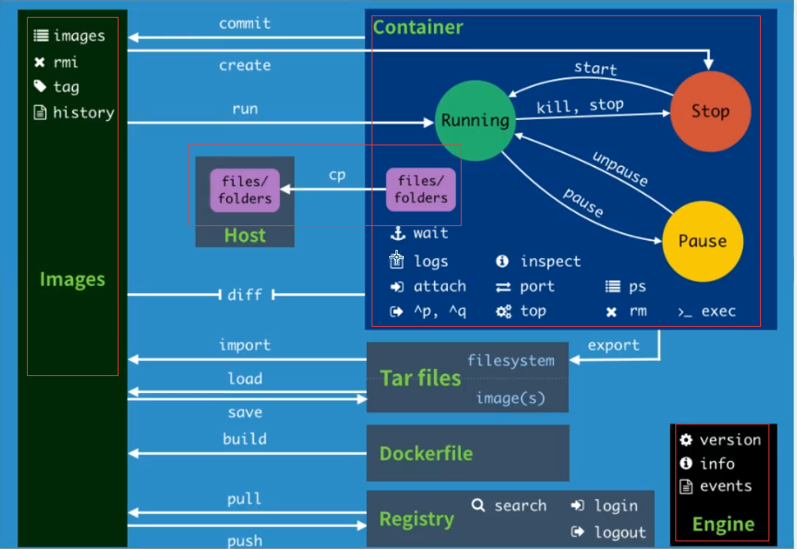
- 未来：
  - 熟悉常用命令、学习Tar files、Dockerfile、Registry

# 4. 简单使用Docker

- 实践后需要了解：以下这些问题的必要性！
  - docker容器和宿主机的端口映射？
  - docker容器中如何修改配置文件？
  - docker容器和宿主机的文件映射？
  - docker容器之间如何进行网络连接？

- 端口暴露概念：
  
- 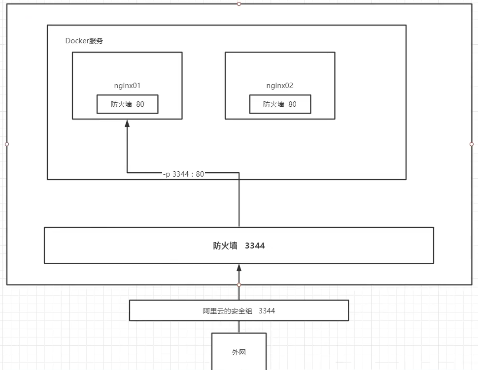
  
- 部署Nginx

  - ```bash
    #1、搜索镜像search 建议大家去docker搜索，因为可以看到更详细帮助文档
    #2、下载镜像pull
    #3、运行测试
    [root@izwz94aowfpx0xt7uw61tbz home]# docker pull nginx
    Using default tag: latest
    latest: Pulling from library/nginx
    eff15d958d66: Pull complete
    1e5351450a59: Pull complete
    2df63e6ce2be: Pull complete
    9171c7ae368c: Pull complete
    020f975acd28: Pull complete
    266f639b35ad: Pull complete
    Digest: sha256:097c3a0913d7e3a5b01b6c685a60c03632fc7a2b50bc8e35bcaa3691d788226e
    Status: Downloaded newer image for nginx:latest
    docker.io/library/nginx:latest
    # 运行容器，并且设置容器名字和映射的端口
    [root@izwz94aowfpx0xt7uw61tbz home]# docker run -d --name nginx01 -p 3344:80 nginx
    ebeba46c283c72baef1b145eaf346dd12dfbc84919d9781af4897a80be7a0914
    
    # 宿主机测试是否可以运行
    [root@izwz94aowfpx0xt7uw61tbz home]# curl localhost:3344
    <!DOCTYPE html>
    <html>
    <head>
    <title>Welcome to nginx!</title>
    <style>
    html { color-scheme: light dark; }
    body { width: 35em; margin: 0 auto;
    font-family: Tahoma, Verdana, Arial, sans-serif; }
    </style>
    </head>
    <body>
    <h1>Welcome to nginx!</h1>
    <p>If you see this page, the nginx web server is successfully installed and
    working. Further configuration is required.</p>
    
    <p>For online documentation and support please refer to
    <a href="http://nginx.org/">nginx.org</a>.<br/>
    Commercial support is available at
    <a href="http://nginx.com/">nginx.com</a>.</p>
    
    <p><em>Thank you for using nginx.</em></p>
    </body>
    </html>
    
    
    # 进入容器：
    [root@izwz94aowfpx0xt7uw61tbz home]# docker exec -it nginx01 /bin/bash
    root@ebeba46c283c:/# whereis nginx
    nginx: /usr/sbin/nginx /usr/lib/nginx /etc/nginx /usr/share/nginx
    
    # 如果要外网访问，需要服务器开启对应的端口和防火墙的端口
    # 阿里云的防火墙要开启对应端口的规则
    # 在服务器内部防火墙开启对应端口(要在docker服务启动之前完成，不然docker会报错)
    # 启动docker服务
    # 启动容器
    ```

- 思考问题：

  - 我们每次改动nginx配置文件，都需要进入容器内部？
  - 十分的麻烦，我要是可以在容器外部提供一个映射路径，达到在主机修改文件，容器内部就可以自动修改?
  - -v数据卷！

- 部署tomcat

  - ```bash
    # 官方的测试案例
    docker run -it --rm tomcat:9.0
    # 我们之前的启动都是后台，停止了容器之后，容器还是可以查到
    # docker run -it --rm，一般用来测试,用完就删除（不建议使用）
    
    # 用常规思路
    # 1.下载镜像
    docker pull tomcat
    
    # 2.创建并且启动容器，如果不删除前面的nginx01，则会造成端口冲突
    [root@izwz94aowfpx0xt7uw61tbz bin]# docker run -d -p 3344:8080 --name tomcat01 tomcat
    a61343f4ef4cdc83cf787c3532a2f93a233afbf999cf591b4bfbe9e7e3e11e36
    
    # 3.本机测试访问：
    [root@izwz94aowfpx0xt7uw61tbz bin]# curl localhost:3344
    <!doctype html><html lang="en"><head><title>HTTP Status 404 – Not Found</title><style type="text/css">body {font-family:Tahoma,Arial,sans-serif;} h1, h2, h3, b {color:white;background-color:#525D76;} h1 {font-size:22px;} h2 {font-size:16px;} h3 {font-size:14px;} p {font-size:12px;} a {color:black;} .line {height:1px;background-color:#525D76;border:none;}</style></head><body><h1>HTTP Status 404 – Not Found</h1><hr class="line" /><p><b>Type</b> Status Report</p><p><b>Description</b> The origin server did not find a current representation for the target resource or is not willing to disclose that one exists.</p><hr class="line" /><h3>Apache Tomcat/10.0.13</h3></body></html>[root@izwz94aowfpx0xt7uw61tbz bin]#
    
    # 发现可以访问，但是404！
    # 进入tomcat01容器查看
    [root@izwz94aowfpx0xt7uw61tbz bin]# docker exec -it tomcat01 /bin/bash
    root@a61343f4ef4c:/usr/local/tomcat# ls
    BUILDING.txt     NOTICE         RUNNING.txt  lib             temp          work
    CONTRIBUTING.md  README.md      bin          logs            webapps
    LICENSE          RELEASE-NOTES  conf         native-jni-lib  webapps.dist
    root@a61343f4ef4c:/usr/local/tomcat# cd webapps
    root@a61343f4ef4c:/usr/local/tomcat/webapps# ls
    
    # 发现问题:
    # 1、1inux命令少了，
    # 2.webapps为空了。阿里云镜像的原因。默认是最小的镜像，所有不必要的都剔除掉。保证最小可运行的环境!
    
    # 如何解决？将webapps.dist中的文件全部拷贝到webapps
    root@a61343f4ef4c:/usr/local/tomcat# cp -r webapps.dist/* webapps
    root@a61343f4ef4c:/usr/local/tomcat# ls
    BUILDING.txt     NOTICE         RUNNING.txt  lib             temp          work
    CONTRIBUTING.md  README.md      bin          logs            webapps
    LICENSE          RELEASE-NOTES  conf         native-jni-lib  webapps.dist
    root@a61343f4ef4c:/usr/local/tomcat# cd webapps
    root@a61343f4ef4c:/usr/local/tomcat/webapps# ls
    ROOT  docs  examples  host-manager  manager
    
    # 再次访问，就可以看到tomcat的常规页面了
    [root@izwz94aowfpx0xt7uw61tbz bin]# curl localhost:3344
    ```

- 思考问题：

  - 我们以后要部署项目，如果每次都要进入容器是不是十分麻烦？
  - 如果可以在容器外部提供一个映射路径，来映射容器内部的webapps，我们在外部放置项目，就自动同步到内部就好了!
  - 也可以防止docker容器删除后，所有的数据都被删除的问题！
  - 如何做？
  - -v 命令的使用，未完待续

- 部署ES+kibana：

  - 等我几天，先学个ES先(2021.12.1)

  - ```bash
    # es暴露的端口很多!
    # es 十分的耗内存
    # es的数据―般需要放置到安全目录!挂载
    #--net somenetwork ?网络配置=>到时候说！
    
    # 创建标签启动elasticsearch
    docker run -d --name elasticsearch -p 9200:9200 -p 9300:9300 -e "discovery.type=single-node" elasticsearch:7.6.2
    
    # 启动了linux就卡住了docker stats查看cpu的状态
    # es是十分耗内存的，1.xG
    # 1核2G!
    
    # 查看docker stats
    [root@izwz94aowfpx0xt7uw61tbz ~]# docker stats
    fatal error: runtime: out of memory
    
    # 测试一下es是否能够成功访问=>太卡可以跳过该测试！
    [root@izwz94aowfpx0xt7uw61tbz ~]# curl localhost:9200
    
    # 赶紧关闭，添加内存的限制
    # -e 修改配置文件
    docker run -d --name elasticsearch02 -p 9200:9200 -p 9300:9300 -e "discovery.type=single-node" -e ES_JAVA_OPTS="-Xms64m -Xmx512m" elasticsearch:7.6.2
    
    # 测试
    [root@izwz94aowfpx0xt7uw61tbz ~]# docker run -d --name elasticsearch02 -p 9200:9200 -p 9300:9300 -e "discovery.type=single-node" -e ES_JAVA_OPTS="-Xms64m -Xmx512m" elasticsearch:7.6.2
    37cf524b8d377f3453bb7a9136f7b23ee9d72d37c7ff5a922b66ed994cf38713
    [root@izwz94aowfpx0xt7uw61tbz ~]# docker ps
    CONTAINER ID   IMAGE                 COMMAND                  CREATED         STATUS         PORTS                                            NAMES
    37cf524b8d37   elasticsearch:7.6.2   "/usr/local/bin/dock…"   3 seconds ago   Up 2 seconds   0.0.0.0:9200->9200/tcp, 0.0.0.0:9300->9300/tcp   elasticsearch02
    # 查看运行状态
    [root@izwz94aowfpx0xt7uw61tbz ~]# docker stats elasticsearch02
    CONTAINER ID   NAME              CPU %     MEM USAGE / LIMIT     MEM %     NET I/O   BLOCK I/O        PIDS
    37cf524b8d37   elasticsearch02   0.86%     383.6MiB / 1.696GiB   22.09%    0B / 0B   87.6MB / 696kB   44
    
    # 测试elasticsearch是否可以正常运行
    [root@izwz94aowfpx0xt7uw61tbz ~]# curl localhost:9200
    {
      "name" : "37cf524b8d37",
      "cluster_name" : "docker-cluster",
      "cluster_uuid" : "hF6Xed6ETNCkHiR7rPBs2A",
      "version" : {
        "number" : "7.6.2",
        "build_flavor" : "default",
        "build_type" : "docker",
        "build_hash" : "ef48eb35cf30adf4db14086e8aabd07ef6fb113f",
        "build_date" : "2020-03-26T06:34:37.794943Z",
        "build_snapshot" : false,
        "lucene_version" : "8.4.0",
        "minimum_wire_compatibility_version" : "6.8.0",
        "minimum_index_compatibility_version" : "6.0.0-beta1"
      },
      "tagline" : "You Know, for Search"
    }
    
    ```

- 思考问题：

  - 使用kibana连接es？思考网络如何才能连接过去？？？
  - 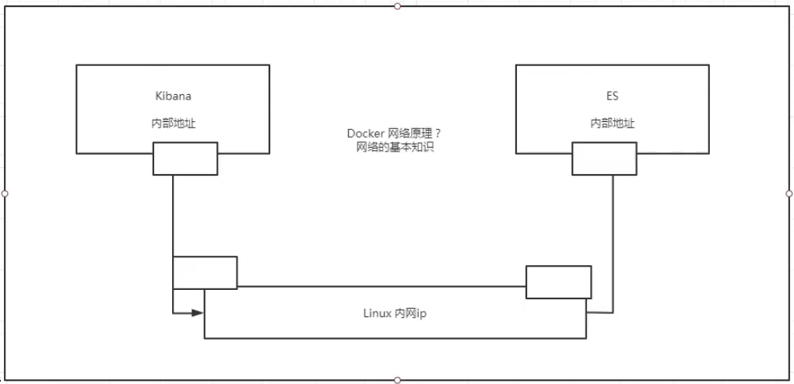

# 5. 可视化

- 什么是portainer？

  - Docker图形化界面管理工具，提供一个后台面版给我们使用！

- 如何使用portainer？

  - ```bash
    docker run -d -p 3344:9000 --restart=always -v /var/run/docker.sock:/var/run/docker.sock --privileged=true portainer/portainer
    
    # 测试
    [root@izwz94aowfpx0xt7uw61tbz ~]# docker ps
    CONTAINER ID   IMAGE     COMMAND   CREATED   STATUS    PORTS     NAMES
    [root@izwz94aowfpx0xt7uw61tbz ~]# docker run -d -p 3344:9000 --restart=always -v /var/run/docker.sock:/var/run/docker.sock --privileged=true portainer/portainer
    Unable to find image 'portainer/portainer:latest' locally
    latest: Pulling from portainer/portainer
    94cfa856b2b1: Pull complete
    49d59ee0881a: Pull complete
    a2300fd28637: Pull complete
    Digest: sha256:fb45b43738646048a0a0cc74fcee2865b69efde857e710126084ee5de9be0f3f
    Status: Downloaded newer image for portainer/portainer:latest
    ca19bfa9648ab0f9f31d3173cd5b41d5730e1e6c207421e7180ec6294df961eb
    [root@izwz94aowfpx0xt7uw61tbz ~]# docker ps
    CONTAINER ID   IMAGE                 COMMAND        CREATED         STATUS         PORTS                    NAMES
    ca19bfa9648a   portainer/portainer   "/portainer"   6 seconds ago   Up 5 seconds   0.0.0.0:3344->9000/tcp   zealous_albattani
    [root@izwz94aowfpx0xt7uw61tbz ~]#
    
    # 检测是否安装成功
    [root@izwz94aowfpx0xt7uw61tbz ~]# curl localhost:3344
    ```

  - 外网访问：

    - 设置账号和密码
    - 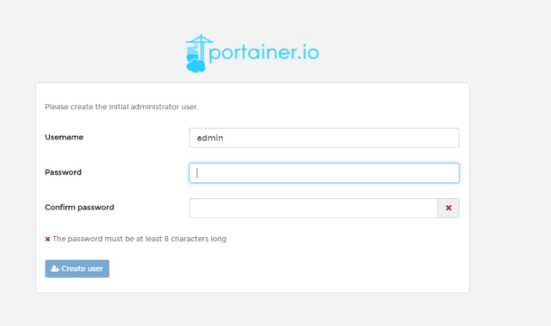
    - 选择本地的Docker environment
    - 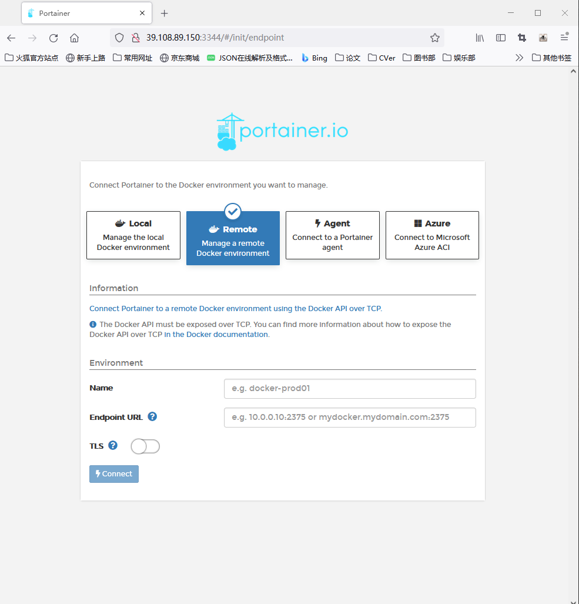
    - 可以进行管理docker
    - 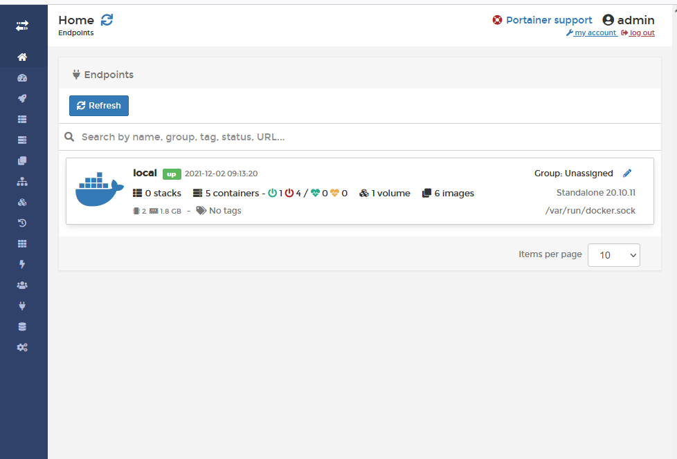

# 6. Docker镜像详解

- 什么是镜像？
  - 镜像是一种轻量级、可执行的独立软件包，用来打包软件运行环境和基于运行环境开发的软件，它包含运行某个钦件所需的所有内容，包括代码、运行时、库、环境变量和配置文件。
  - 所有的应用，直接打包docker镜像，就可以直接跑起来!
- 如何得到镜像？
  - 从远程仓库下载
  - 朋友拷贝
  - 自己制作一个镜像DockerFile

## 6.1 Docker镜像加载原理

- 看完后总结：无需bootfs，只需rootfs=》并且使用UnionFS节省内存

- UnionFS(联合文件系统)
  - 我们下载的时候看到的一层层就是这个!
  - UnionFS(联合文件系统)：Union文件系统(UnionFS )是一种分层、轻量级并且高性能的文件系统，它支持对文件系统的修改作为一次提交来一层层的叠加，同时可以将不同目录挂载到同一个虚拟文件系统下(unite several directories into a single virtual file system)。Union文件系统是Docker镜像的基础。镜像可以通过分层来进行继承，基于基础镜像（没有父镜像），可以制作各种具体的应用镜像。
  - 特性：一次同时加载多个文件系统，但从外面看起来，只能看到一个文件系统，联合加载会把各层文件系统叠加起来，这样最终的文件系统会包含所有底层的文件和目录
- Docker镜像加载原理：
  - docker的镜像实际上由一层一层的文件系统组成，这种层级的文件系统UnionFS
  - bootfs(boot file system)：主要包含bootloader和kernel, bootloader主要是引导加载kernel，Linux刚启动时会加载bootfs文件系统，在Docker镜像的最底层是bootfs，这一层与我们典型的Linux/Unix系统是一样的，包含boot加载器和内核。当boot加载完成之后**整个内核就都在内存中了**，此时内存的使用权已由bootfs转交给内核，此时系统也会卸载bootfs.
    - **想想计算机是如何启动的？**
      - 开机=》bootfs将操作系统内核加载到内存，并且将内存的使用权交给内核，此时内核就拥有计算机的各种资源：内存资源、CPU资源等，我们就可以使用这个计算机了！！！
  - rootfs (root file system)：在bootfs之上。包含的就是典型Linux，系统中的/dev，/proc，/bin，/etc等标准目录和文件。rootfs就是各种不同的操作系统发行版，比如Ubuntu ,Centos等等。 
  - 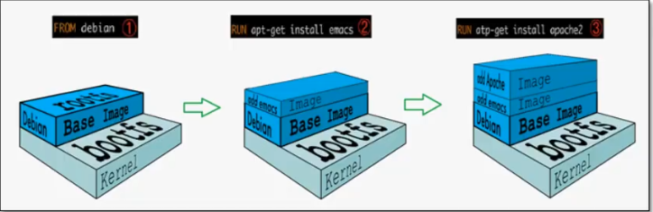
- 什么虚拟机的CentOS是几个G，而Docker这里才200M？
  - 对于一个精简的OS，rootfs 可以很小，只需要包含最基本的命令，工具和程序库就可以了，因为底层直接用Host的kernel ，自己只需要提供rootfs就可以了。由此可见对于不同的linux发行版, bootfs基本是一致的, rootfs会有差别。因此不同的发行版可以公用bootfs。

## 6.2 分层理解

- 分层的镜像：

  - 回忆docker下载镜像的过程！

  - ```bash
    # 查看镜像的详细信息
    docker image inspect tomcat:latest
    
    "RootFS": {
                "Type": "layers",
                "Layers": [
                    "sha256:a36ba9e322f719a0c71425bd832fc905cac3f9faedcb123c8f6aba13f7b0731b",
                    "sha256:5499f2905579e85017f919e25be9e7a50bcc30c61294f12479b289708ebb31fa",
                    "sha256:a4aba4e59b40caa040cc3ccfa42a84bbe64e3da8d1e7e0da69100c837afd215a",
                    "sha256:8a5844586fdb00f07529ad1b3eb20167ba3a176302ecccbae1fbb45620acb89f",
                    "sha256:ab9d251e27cbdd53ed6535ddabeabe3181446f5835c05e13530675308e7ae903",
                    "sha256:47ee2d19f81a629f5636916161325202d5787ee5618731ccad3d3e0bc57d5886",
                    "sha256:a9e4c93435392db432f410bf38dfdd4ac228bad27ef030eb35e6ff50ba86ee4c",
                    "sha256:b87b38d56cd33dc40c6e37b952abfb52761d3e9889dadb5f54ca1b048f245501",
                    "sha256:f2d212e4d5abdacb7ae676f9fea80989878aecaf846c5d2cad292444f3fc3a22",
                    "sha256:cf0d7f22bbdc88e524f6af5bd67c83fd7235d9a63e2ecd5bccf3317026b6fee9"
                ]
            },
    
    ```

- 理解：

  - 所有的Docker镜像都起始于一个基础镜像层，当进行修改或增加新的内容时，就会在当前镜像层之上，创建新的镜像层。
  - 举一个简单的例子，假如基于Ubuntu Linux16.04创建一个新的镜像，这就是新镜像的第一层;如果在该镜像中添加Python包，就会在基础镜像层之上创建第二个镜像层;如果继续添加一个安全补丁，就会创建第三个镜像层。
  - 该镜像当前已经包含3个镜像层，如下图所示（这只是一个用于演示的很简单的例子）。
    - 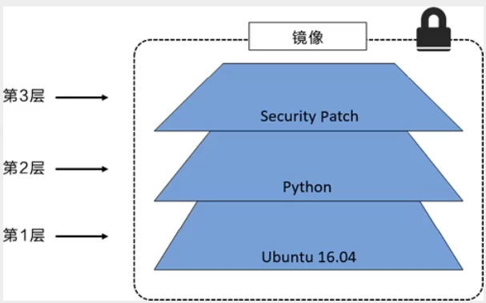
  - 在添加额外的镜像层的同时，**镜像始终保持是当前所有镜像的组合**，理解这一点非常重要。下图中举了一个简单的例子，每个镜像层包含3个文件，而镜像包含了来自两个镜像层的6个文件。
    - 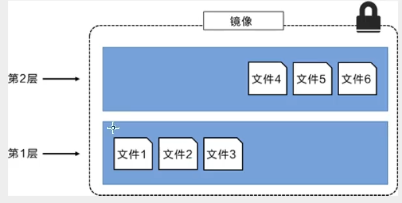
  - 上图中的镜像层跟之前图中的略有区别，主要目的是便于展示文件。下图中展示了一个稍微复杂的三层镜像，在外部看来整个镜像只有6个文件，这是因为最上层中的文件7是文件5的一个更新版本。
    - 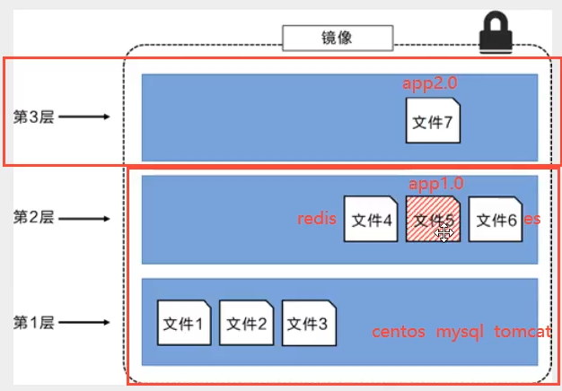
  - 这种情况下，上层镜像层中的文件覆盖了底层镜像层中的文件。这样就使得文件的更新版本作为一个新镜像层添加到镜像当中。Docker通过存储引擎（新版本采用快照机制)的方式来实现镜像层堆栈，并保证多镜像层对外展示为统一的文件系统。
  - Linux上可用的存储引擎有AUFS、Overlay2、Device Mapper、Btrfs以及ZFS。顾名思义，每种存储引擎都基于Linux中对应的文件系统或者块设备技术，并且每种存储引擎都有其独有的性能特点。
  - Docker在Windows上仅支持windowsfilter一种存储引擎，该引擎基于NTFS文件系统之上实现了分层和CoW[1]。下图展示了与系统显示相同的三层镜像。所有镜像层堆叠并合并，对外提供统一的视图。
    - 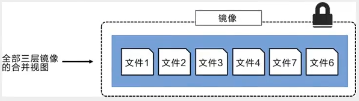

- 特点：

  - Docker镜像都是只读的，当容器启动时，一个新的可写层被加载到镜像的顶部!
  - 这一层就是我们通常说的容器层，容器之下的都叫镜像层!
  - 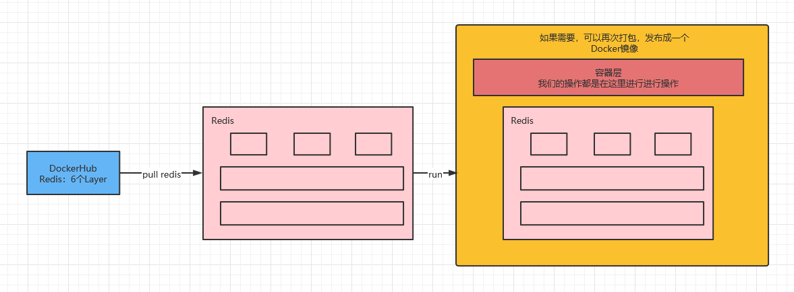

## 6.3 commit镜像

- 如何制作一个自己的镜像？

  - 使用docker commit命令

  - ```bash
    docker commit 提交容器成为一个新的镜像
    
    docker commit -m="提交的描述信息" -a="作者" 容器id 目标镜像名:[TAG]
    ```

  - ```bash
    # 官方下载的tomcat的镜像webapps是为空的，此时我们将webapps.dist拷贝到webapps下，让它有东西！
    [root@izwz94aowfpx0xt7uw61tbz ~]# docker exec -it tomcat01 root@a61343f4ef4c: /bin/bash
    cp -r webapps.dist/* webapps
    root@a61343f4ef4c:/usr/local/tomcat/webapps# ls
    ROOT  docs  examples  host-manager  manager
    root@a61343f4ef4c:/usr/local/tomcat/webapps#
    
    
    # 期望每次都不需要自己拷贝文件，因此想以后就使用这个已经设置好了的容器，
    # 因此可以根据容器，生成自己需要的镜像
    [root@izwz94aowfpx0xt7uw61tbz ~]# docker ps
    CONTAINER ID   IMAGE     COMMAND             CREATED        STATUS         PORTS                    NAMES
    a61343f4ef4c   tomcat    "catalina.sh run"   24 hours ago   Up 4 minutes   0.0.0.0:3344->8080/tcp   tomcat01
    # 制作镜像！
    [root@izwz94aowfpx0xt7uw61tbz ~]# docker commit -a="king" -m="add webapps app" a61343f4ef4c tomcat02:1.0
    sha256:9f94570e00f3de25c5da8faf49fcbf4ebf52c38075ad954066ac999a691f4af7
    [root@izwz94aowfpx0xt7uw61tbz ~]# docker images
    REPOSITORY            TAG       IMAGE ID       CREATED         SIZE
    tomcat02              1.0       9f94570e00f3   6 seconds ago   684MB
    tomcat                9.0       76206e3ba4b1   13 days ago     680MB
    tomcat                latest    904a98253fbf   13 days ago     680MB
    nginx                 latest    ea335eea17ab   2 weeks ago     141MB
    centos                latest    5d0da3dc9764   2 months ago    231MB
    portainer/portainer   latest    580c0e4e98b0   8 months ago    79.1MB
    elasticsearch         7.6.2     f29a1ee41030   20 months ago   791MB
    
    ```

  - 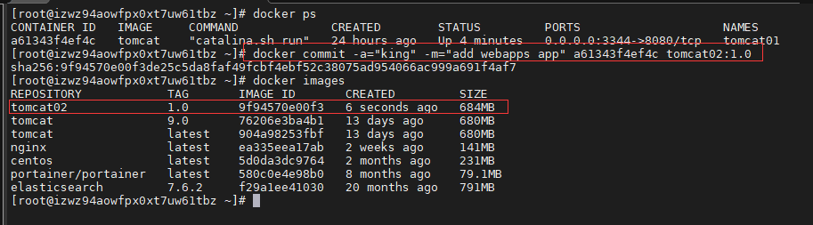

# 7. 容器数据卷

- 什么是容器数据卷？为什么需要？
  - docker的理念回顾：将应用和环境打包成一个镜像!
  - 数据怎么办？
    - 如果数据都在容器中，那么容器删除，数据就会丢失！
    - 需求：数据可以持久化
    - 如：MySQL，容器删了，删库跑路！需求：MySQL数据可以存储在本地!
  - 容器之间需要有一个数据共享的技术！
  - Docker容器中产生的数据，同步到本地！这就是卷技术！
  - 也就是：目录的挂载，将容器内的目录=》挂载到Linux本机上面
  - 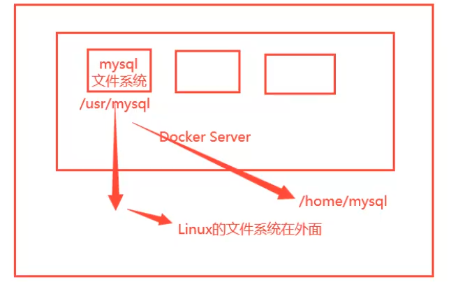
- **也就是期望：容器的持久化和同步操作！容器间也是可以数据共享的！**

## 7.1 使用数据卷

- 方式一：直接使用命令来挂载

  - 优点：以后修改只需要在本地修改即可，容器内会自动同步

  - ```bash
    docker run -it -v 主机目录:容器内目录
    # 就算停止容器，宿主机上修改文件，启动容器后，容器内部的数据依旧是同步的！
    ```

  - ```bash
    # 测试
    [root@izwz94aowfpx0xt7uw61tbz home]# ls
    admin  king  test.java
    [root@izwz94aowfpx0xt7uw61tbz home]# docker run -it -v /home/ceshi:/home centos /bin/bash
    
    # 另一个窗口使用
    [root@izwz94aowfpx0xt7uw61tbz ~]# docker ps
    CONTAINER ID   IMAGE     COMMAND             CREATED              STATUS              PORTS                    NAMES
    33b56cea2e9b   centos    "/bin/bash"         About a minute ago   Up About a minute                            eager_mccarthy
    a61343f4ef4c   tomcat    "catalina.sh run"   25 hours ago         Up 20 minutes       0.0.0.0:3344->8080/tcp   tomcat01
    [root@izwz94aowfpx0xt7uw61tbz ~]# docker inspect 33b56cea2e9b
    # 挂载成功
    "Mounts": [
                {
                    "Type": "bind",
                    "Source": "/home/ceshi",
                    "Destination": "/home",
                    "Mode": "",
                    "RW": true,
                    "Propagation": "rprivate"
                }
            ],
    
    ```

  - 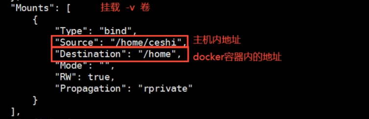

  - 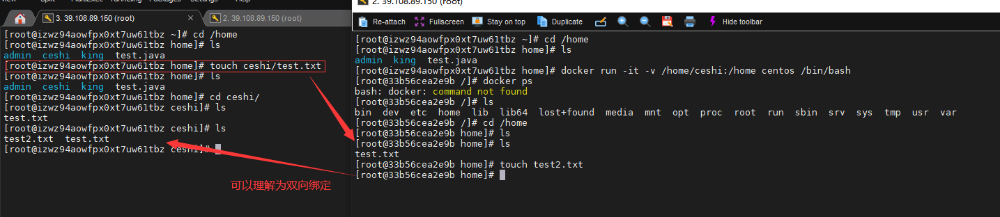

## 7.2 安装MySQL

- MySQL的数据持久化的问题？

- ```bash
  # 获取镜像
  docker pull mysql:5.7
  
  # 创建并且运行容器
  # -d 后台运行
  # -p 端口映射
  # -v 数据集挂载
  # -e 环境配置
  # --name 容器名字
  docker run -d -p 3344:3360 -v /home/mysql/conf:/etc/mysql/cont.d -v /home/mysql/data:/var/lib/mysql -e MYSQL_ROOT_PASSWORD=123456 --name mysql01 mysql:5.7
  
  # 可以测试
  # 1.启动后能否使用，远程连接(要确保服务器开放了端口和防火墙端口)
  # 2.测试修改数据，是否两个文件会同步，
  # 3.测试删除容器后，同步的文件是否还会存在
  ```

- **因此：数据卷可以解决容器数据的持久化功能！**

## 7.3 具名挂载和匿名挂载

- 挂载数据卷的时候的操作，可以方便数据卷的挂载或者查找对应的数据卷

- ```bash
  # 匿名挂载 -v 容器内路径
  # -P : 随机映射端口
  docker run -d -P --name nginx01 -v /etc/nginx nginx
  
  # 查看所有的volume的情况
  docker volume ls
  
  # 发现都是乱码，看不懂，这就是匿名挂载，-v只写了容器内的路径，没有写容器外的路径
  
  # 具名挂载：-v前面不要加/,负责就是绝对路径了！
  docker run -d -P --name -v juming-nginx:/etc/nginx nginx
  docker volume ls
  
  # 此时可以看到这个容器挂载路径的名字，通过这个名字，可以查看挂载在本机的具体哪个路径
  docker volume inspect juming-nginx
  ```

- 所有的docker容器内的卷，没有指定目录的情况下都是挂载在宿主机的/var/lib/docker/volumes/xxx/_data下面

- **通过具名挂载可以方便的找到一个卷在宿主机的位置，大多数情况下使用具名挂载**

- 如何确定是具名挂载还是匿名挂载、指定路径挂载？

  - ```shell
    -v 容器内路径			# 匿名挂载
    -v 卷名:容器内路径			# 具名挂载
    -v /宿主机路径:容器内路径		# 指定路径挂载
    ```

- 拓展：

  - ```bash
    docker run -d -P --name -v juming-nginx:/etc/nginx:ro nginx
    docker run -d -P --name -v juming-nginx:/etc/nginx:rw nginx
    
    # 又加了ro？rw？是什么意思？
    # ro：readonly=>此时只能通过宿主机来修改，容器内是无法修改的
    # rw:readwrite
    ```

## 7.4 初识DockerFile

- 什么是DockerFile？

  - 可以用来构建docker镜像的构建文件，是一系列命令脚本
  - 通过这个脚本可以生成镜像，也是一层一层的构建的，每个命令都是一层

- 方式二：使用DockerFile在生成镜像的时候就指定挂载的数据卷

- ```bash
  # 测试
  [root@izwz94aowfpx0xt7uw61tbz home]# ls
  admin  ceshi  king  mysql  test.java
  [root@izwz94aowfpx0xt7uw61tbz home]# mkdir dockerfiletest
  [root@izwz94aowfpx0xt7uw61tbz home]# ls
  admin  ceshi  dockerfiletest  king  mysql  test.java
  [root@izwz94aowfpx0xt7uw61tbz home]# cd dockerfiletest/
  
  # 创建一个dockerfile文件，并且编写命令
  [root@izwz94aowfpx0xt7uw61tbz dockerfiletest]# touch dockerfile1
  [root@izwz94aowfpx0xt7uw61tbz dockerfiletest]# vim dockerfile1
  [root@izwz94aowfpx0xt7uw61tbz dockerfiletest]# cat dockerfile1
  FROM centos
  
  VOLUME ["volume01","volume02"]
  
  CMD echo "----end----"
  
  CMD /bin/bash
  # 使用docker build构建镜像
  [root@izwz94aowfpx0xt7uw61tbz dockerfiletest]# docker build -f /home/dockerfiletest/dockerfile1 -t king/centos:1.0 .
  Sending build context to Docker daemon  2.048kB
  Step 1/4 : FROM centos
   ---> 5d0da3dc9764
  Step 2/4 : VOLUME ["volume01","volume02"]
   ---> Running in fbc42bd9bec4
  Removing intermediate container fbc42bd9bec4
   ---> c7049b1761db
  Step 3/4 : CMD echo "----end----"
   ---> Running in 4432285f0599
  Removing intermediate container 4432285f0599
   ---> 37711bcc70cb
  Step 4/4 : CMD /bin/bash
   ---> Running in b7f50d00c175
  Removing intermediate container b7f50d00c175
   ---> 8b7ee2a5a650
  Successfully built 8b7ee2a5a650
  Successfully tagged king/centos:1.0
  # 构建成功，查看构建的镜像
  [root@izwz94aowfpx0xt7uw61tbz dockerfiletest]# docker images
  REPOSITORY            TAG       IMAGE ID       CREATED         SIZE
  king/centos           1.0       8b7ee2a5a650   6 seconds ago   231MB
  mysql                 5.7       738e7101490b   14 hours ago    448MB
  tomcat02              1.0       9f94570e00f3   23 hours ago    684MB
  tomcat                9.0       76206e3ba4b1   2 weeks ago     680MB
  tomcat                latest    904a98253fbf   2 weeks ago     680MB
  nginx                 latest    ea335eea17ab   2 weeks ago     141MB
  centos                latest    5d0da3dc9764   2 months ago    231MB
  portainer/portainer   latest    580c0e4e98b0   8 months ago    79.1MB
  elasticsearch         7.6.2     f29a1ee41030   20 months ago   791MB
  
  ```

- 启动查看自己生成的镜像：

  - 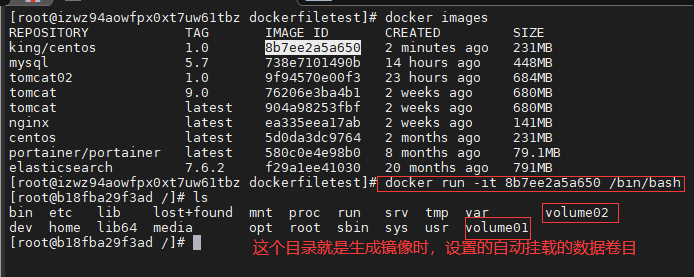
  - 这个卷和宿主机肯定有一个的目录
  - 
  - 是匿名挂载！

- **使用构建镜像的方式进行数据卷的挂载，常用！**

  - 如果构建镜像的时候没有挂载卷，就需要手动镜像挂载-v 卷名:容器内路径！

## 7.5 数据卷容器

- 目的：容器和容器之间的数据交互共享！
- 多个mysql数据如何同步？
  - 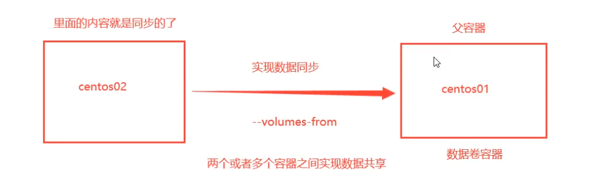
- 测试：
  - 创建多个容器，并且进行数据同步
  - 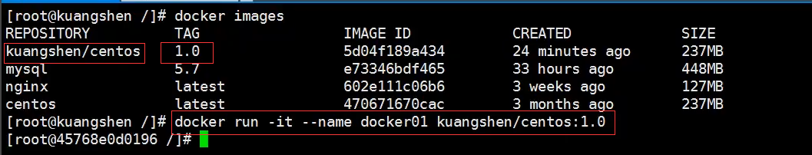
  - 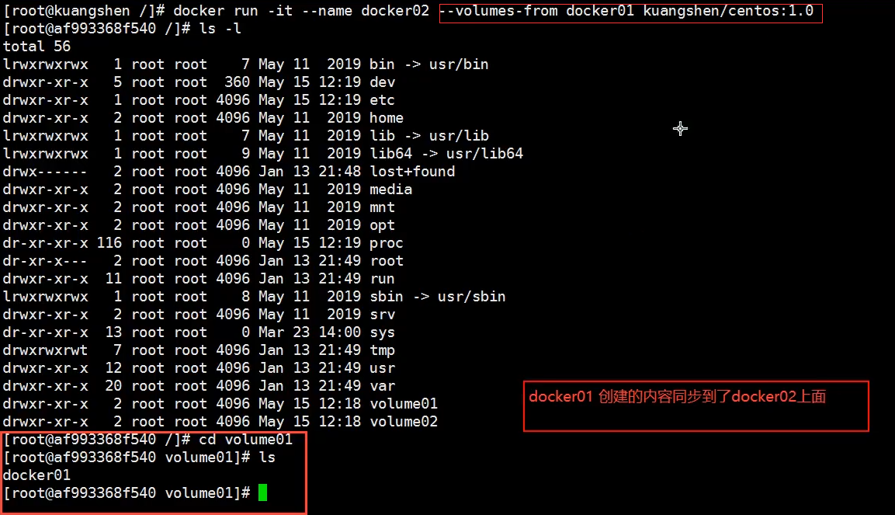
  - 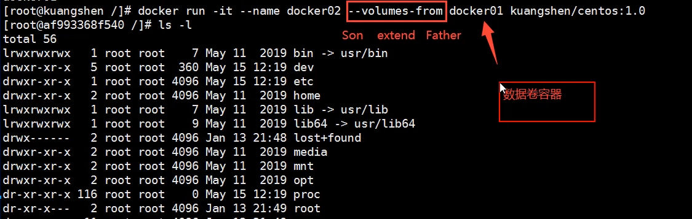
- --volumes -from可以实现容器数据间的共享，并且是拷贝概念的共享，即使其他容器删除了，之前创建的文件在没有删除的容器中仍然可以使用
  - 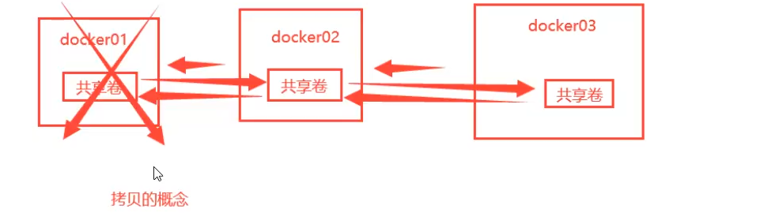
- **结论：**
  - 容器之间配置信息的传递，数据卷容器的生命周期一直持续到没有容器使用为止！但是此时本地还有！
  - 但是如果容器的数据卷挂载到了本地，这个时候本地的数据是不会删除的！

# 8. DockerFile

- 什么是DockerFile？
  - 命令参数的脚本
- DockerFile有什么用？
  - 用来构建docker镜像文件
- 构建步骤：
  1. 编写一个dockerfile文件
  2. docker build 构建成一个镜像
  3. docker run 运行镜像
  4. docker push 发布镜像(DockerHub，阿里云镜像仓库等)
- 参考官方的流程：
  - 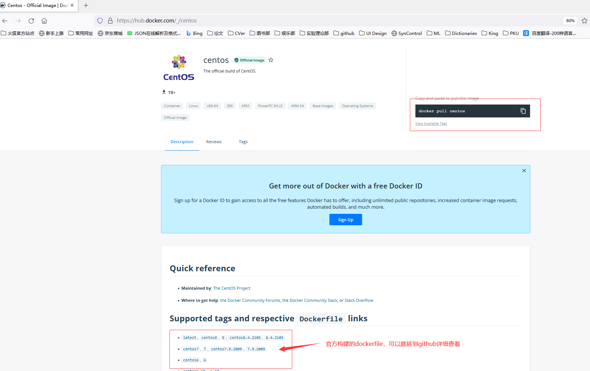
  - 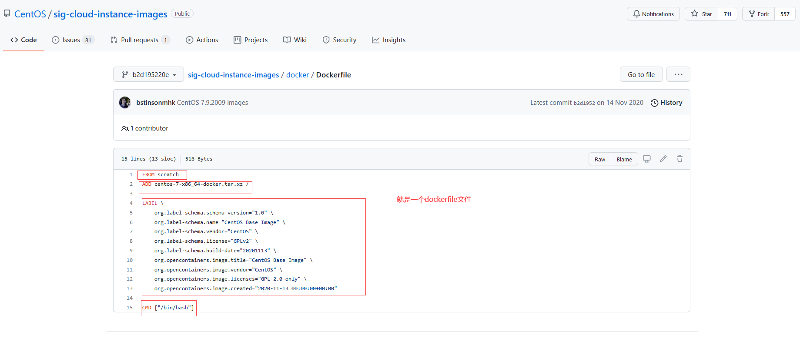
  - 很多官方镜像都是基础包，很多功能没有，通常会自己搭建自己的镜像！
    - 如：centos+jdk+mysql+tomcat

## 8.1 DockerFile构建过程

- **基础知识：**
  - 每个保留关键字（指令）都是必须是大写字母
  - 执行从上到下顺序执行
  - \# 表示注释
  - 每一个指令都会创建提交一个新的镜像层，并提交!
- 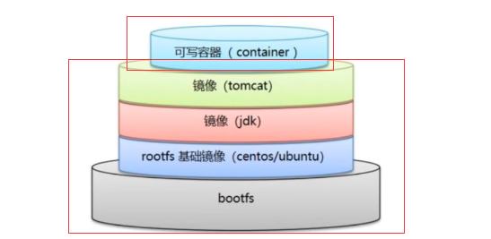
- dockerfile是面向开发的，我们以后要发布项目，做镜像，就需要编写dockerfile文件，这个文件十分简单！Docker镜像逐渐成为企业交付的标准，必须要掌握!
- 步骤：
  - DockerFile ：构建文件，定义了一切的步骤，源代码
  - Dockerlmages：通过DockerFile构建生成的镜像，最终发布和运行的产品!
  - Docker Container：容器就是镜像运行起来提供服务的

## 8.2 DockerFile的指令

- ```bash
  FROM			#基础镜镜像,—切从这里开始构建
  MAINTAINER		#镜像是谁写的,姓名+邮箱
  RUN				#镜像构建的时候需要运行的命令
  ADD				#步骤:tomcat镜像,这个tomcat压缩包!添加内容
  WORKDIR			#镜像的工作目录
  VOLUME			#挂载的目录
  EXPOSE			#保留端口配置
  CMD				#指定这个容器启动的时候要运行的命令,只有最后一个会生效，可被替代
  ENTRYPOINT		#指定这个容器启动的时候要运行的命令,可以追加命令
  ONBUILD			#当构建一个被继承DockerFile，这个时候就会运行ONBUILD 的指令。触发指令。
  COPY			#类似ADD ，将我们文件拷贝到镜像中
  ENV				#构建的时候设置环境变量!
  ```

- 

- 以前是使用别人的，现在知道了这些指令后，可以自己写一个镜像

## 8.3 构建自己的Centos

- 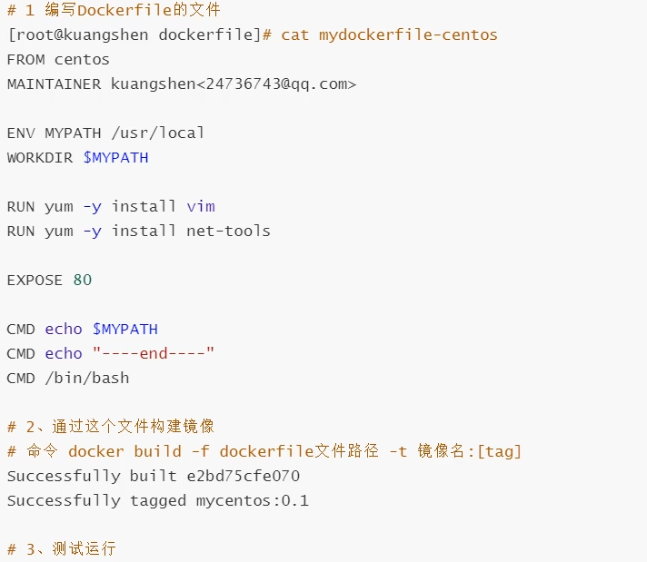

- 对比：

  - 
  - 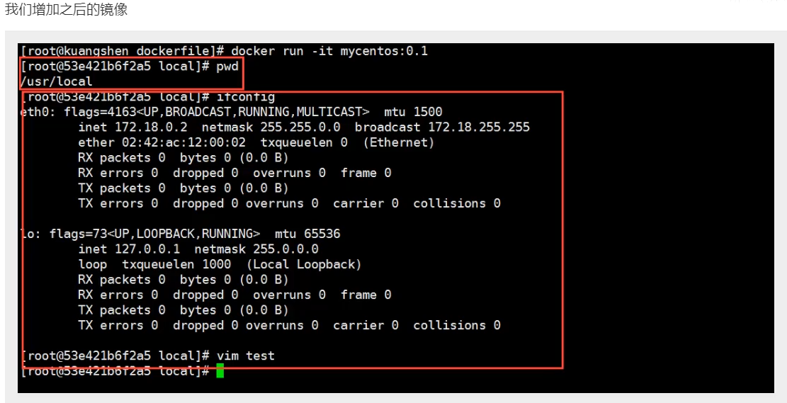

- 通过docker history 镜像id：

  - 查看镜像是如何构建的！

  - ```bash
    [root@izwz94aowfpx0xt7uw61tbz dockerfiletest]# docker images
    REPOSITORY            TAG       IMAGE ID       CREATED             SIZE
    king/centos           1.0       8b7ee2a5a650   About an hour ago   231MB
    mysql                 5.7       738e7101490b   15 hours ago        448MB
    tomcat02              1.0       9f94570e00f3   24 hours ago        684MB
    tomcat                9.0       76206e3ba4b1   2 weeks ago         680MB
    tomcat                latest    904a98253fbf   2 weeks ago         680MB
    nginx                 latest    ea335eea17ab   2 weeks ago         141MB
    centos                latest    5d0da3dc9764   2 months ago        231MB
    portainer/portainer   latest    580c0e4e98b0   8 months ago        79.1MB
    elasticsearch         7.6.2     f29a1ee41030   20 months ago       791MB
    [root@izwz94aowfpx0xt7uw61tbz dockerfiletest]# docker history -H 738e7101490b
    IMAGE          CREATED        CREATED BY                                      SIZE      COMMENT
    738e7101490b   15 hours ago   /bin/sh -c #(nop)  CMD ["mysqld"]               0B
    <missing>      15 hours ago   /bin/sh -c #(nop)  EXPOSE 3306 33060            0B
    <missing>      15 hours ago   /bin/sh -c #(nop)  ENTRYPOINT ["docker-entry…   0B
    <missing>      15 hours ago   /bin/sh -c ln -s usr/local/bin/docker-entryp…   0B
    <missing>      15 hours ago   /bin/sh -c #(nop) COPY file:345a22fe55d3e678…   14.5kB
    <missing>      15 hours ago   /bin/sh -c #(nop)  VOLUME [/var/lib/mysql]      0B
    <missing>      15 hours ago   /bin/sh -c {   echo mysql-community-server m…   313MB
    <missing>      15 hours ago   /bin/sh -c echo 'deb http://repo.mysql.com/a…   55B
    <missing>      15 hours ago   /bin/sh -c #(nop)  ENV MYSQL_VERSION=5.7.36-…   0B
    <missing>      15 hours ago   /bin/sh -c #(nop)  ENV MYSQL_MAJOR=5.7          0B
    <missing>      15 hours ago   /bin/sh -c set -ex;  key='A4A9406876FCBD3C45…   2.61kB
    <missing>      15 hours ago   /bin/sh -c apt-get update && apt-get install…   52.2MB
    <missing>      15 hours ago   /bin/sh -c mkdir /docker-entrypoint-initdb.d    0B
    <missing>      15 hours ago   /bin/sh -c set -eux;  savedAptMark="$(apt-ma…   4.17MB
    <missing>      15 hours ago   /bin/sh -c #(nop)  ENV GOSU_VERSION=1.12        0B
    <missing>      15 hours ago   /bin/sh -c apt-get update && apt-get install…   9.34MB
    <missing>      15 hours ago   /bin/sh -c groupadd -r mysql && useradd -r -…   329kB
    <missing>      24 hours ago   /bin/sh -c #(nop)  CMD ["bash"]                 0B
    <missing>      24 hours ago   /bin/sh -c #(nop) ADD file:70f893355b4ecf317…   69.3MB
    
    ```

## 8.4CMD和ENTRYPOINT区别

- ```bash
  CMD				#指定这个容器启动的时候要运行的命令,只有最后一个会生效，可被替代
  ENTRYPOINT		#指定这个容器启动的时候要运行的命令,可以追加命令
  ```

- 测试cmd：

  - ```bash
    [root@izwz94aowfpx0xt7uw61tbz dockerfiletest]# ls
    dockerfile1
    # 1.编写一个dockerfile
    [root@izwz94aowfpx0xt7uw61tbz dockerfiletest]# vim dockefile-cmd-test
    [root@izwz94aowfpx0xt7uw61tbz dockerfiletest]# cat dockefile-cmd-test
    FROM centos
    CMD ["ls","-a"]
    # 2.构建一个docker images
    [root@izwz94aowfpx0xt7uw61tbz dockerfiletest]# docker build -f dockefile-cmd-test -t cmdtest .
    Sending build context to Docker daemon  3.072kB
    Step 1/2 : FROM centos
     ---> 5d0da3dc9764
    Step 2/2 : CMD ["ls","-a"]
     ---> Running in dc7cb70c9b7f
    Removing intermediate container dc7cb70c9b7f
     ---> 8c339cb98c89
    Successfully built 8c339cb98c89
    Successfully tagged cmdtest:latest
    [root@izwz94aowfpx0xt7uw61tbz dockerfiletest]# docker images
    REPOSITORY            TAG       IMAGE ID       CREATED             SIZE
    cmdtest               latest    8c339cb98c89   14 seconds ago      231MB
    king/centos           1.0       8b7ee2a5a650   About an hour ago   231MB
    mysql                 5.7       738e7101490b   15 hours ago        448MB
    tomcat02              1.0       9f94570e00f3   24 hours ago        684MB
    tomcat                9.0       76206e3ba4b1   2 weeks ago         680MB
    tomcat                latest    904a98253fbf   2 weeks ago         680MB
    nginx                 latest    ea335eea17ab   2 weeks ago         141MB
    centos                latest    5d0da3dc9764   2 months ago        231MB
    portainer/portainer   latest    580c0e4e98b0   8 months ago        79.1MB
    elasticsearch         7.6.2     f29a1ee41030   20 months ago       791MB
    # 3.运行构建的images
    [root@izwz94aowfpx0xt7uw61tbz dockerfiletest]# docker run 8c339cb98c89
    .
    ..
    .dockerenv
    bin
    dev
    etc
    home
    lib
    lib64
    lost+found
    media
    mnt
    opt
    proc
    root
    run
    sbin
    srv
    sys
    tmp
    usr
    var
    # 4.这样运行发现会报错
    [root@izwz94aowfpx0xt7uw61tbz dockerfiletest]# docker run 8c339cb98c89 -l
    docker: Error response from daemon: OCI runtime create failed: container_linux.go:380: starting container process caused: exec: "-l": executable file not found in $PATH: unknown.
    ERRO[0000] error waiting for container: context canceled
    # 5.这样运行就不会报错
    [root@izwz94aowfpx0xt7uw61tbz dockerfiletest]# docker run 8c339cb98c89 ls -al
    total 56
    drwxr-xr-x   1 root root 4096 Dec  3 02:29 .
    drwxr-xr-x   1 root root 4096 Dec  3 02:29 ..
    -rwxr-xr-x   1 root root    0 Dec  3 02:29 .dockerenv
    lrwxrwxrwx   1 root root    7 Nov  3  2020 bin -> usr/bin
    drwxr-xr-x   5 root root  340 Dec  3 02:30 dev
    drwxr-xr-x   1 root root 4096 Dec  3 02:29 etc
    drwxr-xr-x   2 root root 4096 Nov  3  2020 home
    lrwxrwxrwx   1 root root    7 Nov  3  2020 lib -> usr/lib
    lrwxrwxrwx   1 root root    9 Nov  3  2020 lib64 -> usr/lib64
    drwx------   2 root root 4096 Sep 15 14:17 lost+found
    drwxr-xr-x   2 root root 4096 Nov  3  2020 media
    drwxr-xr-x   2 root root 4096 Nov  3  2020 mnt
    drwxr-xr-x   2 root root 4096 Nov  3  2020 opt
    dr-xr-xr-x 105 root root    0 Dec  3 02:30 proc
    dr-xr-x---   2 root root 4096 Sep 15 14:17 root
    drwxr-xr-x  11 root root 4096 Sep 15 14:17 run
    lrwxrwxrwx   1 root root    8 Nov  3  2020 sbin -> usr/sbin
    drwxr-xr-x   2 root root 4096 Nov  3  2020 srv
    dr-xr-xr-x  13 root root    0 Dec  3 02:30 sys
    drwxrwxrwt   7 root root 4096 Sep 15 14:17 tmp
    drwxr-xr-x  12 root root 4096 Sep 15 14:17 usr
    drwxr-xr-x  20 root root 4096 Sep 15 14:17 var
    
    # 为什么？
    # cmd的清理下 -l 替换了CMD ["ls" "-a"]命令，-l又不是命令，所以报错
    ```

- 测试entrypoint：

  - ```bash
    
    [root@izwz94aowfpx0xt7uw61tbz dockerfiletest]# ls
    dockefile-cmd-test  dockerfile1
    # 1.编写dockerfile文件
    [root@izwz94aowfpx0xt7uw61tbz dockerfiletest]# vim dockerfile-cmd-entrypoint
    [root@izwz94aowfpx0xt7uw61tbz dockerfiletest]# cat dockerfile-cmd-entrypoint
    FROM centos
    ENTRYPOINT ["ls","-a"]
    
    # 2.构建docker images
    [root@izwz94aowfpx0xt7uw61tbz dockerfiletest]# docker build -f dockerfile-cmd-entrypoint -t entrypoint-test ,
    unable to prepare context: path "," not found
    [root@izwz94aowfpx0xt7uw61tbz dockerfiletest]# docker build -f dockerfile-cmd-entrypoint -t entrypoint-test .
    Sending build context to Docker daemon  4.096kB
    Step 1/2 : FROM centos
     ---> 5d0da3dc9764
    Step 2/2 : ENTRYPOINT ["ls","-a"]
     ---> Running in 635dd4bbe0a1
    Removing intermediate container 635dd4bbe0a1
     ---> a740127ac955
    Successfully built a740127ac955
    Successfully tagged entrypoint-test:latest
    # 3.创建并且运行dockerfile构建的镜像
    [root@izwz94aowfpx0xt7uw61tbz dockerfiletest]# docker run a740127ac955
    .
    ..
    .dockerenv
    bin
    dev
    etc
    home
    lib
    lib64
    lost+found
    media
    mnt
    opt
    proc
    root
    run
    sbin
    srv
    sys
    tmp
    usr
    var
    # 4.创建并且运行dockerfile构建的镜像，并且追加命令，没有报错！
    [root@izwz94aowfpx0xt7uw61tbz dockerfiletest]# docker run a740127ac955 -l
    total 56
    drwxr-xr-x   1 root root 4096 Dec  3 02:35 .
    drwxr-xr-x   1 root root 4096 Dec  3 02:35 ..
    -rwxr-xr-x   1 root root    0 Dec  3 02:35 .dockerenv
    lrwxrwxrwx   1 root root    7 Nov  3  2020 bin -> usr/bin
    drwxr-xr-x   5 root root  340 Dec  3 02:35 dev
    drwxr-xr-x   1 root root 4096 Dec  3 02:35 etc
    drwxr-xr-x   2 root root 4096 Nov  3  2020 home
    lrwxrwxrwx   1 root root    7 Nov  3  2020 lib -> usr/lib
    lrwxrwxrwx   1 root root    9 Nov  3  2020 lib64 -> usr/lib64
    drwx------   2 root root 4096 Sep 15 14:17 lost+found
    drwxr-xr-x   2 root root 4096 Nov  3  2020 media
    drwxr-xr-x   2 root root 4096 Nov  3  2020 mnt
    drwxr-xr-x   2 root root 4096 Nov  3  2020 opt
    dr-xr-xr-x 105 root root    0 Dec  3 02:35 proc
    dr-xr-x---   2 root root 4096 Sep 15 14:17 root
    drwxr-xr-x  11 root root 4096 Sep 15 14:17 run
    lrwxrwxrwx   1 root root    8 Nov  3  2020 sbin -> usr/sbin
    drwxr-xr-x   2 root root 4096 Nov  3  2020 srv
    dr-xr-xr-x  13 root root    0 Dec  3 02:35 sys
    drwxrwxrwt   7 root root 4096 Sep 15 14:17 tmp
    drwxr-xr-x  12 root root 4096 Sep 15 14:17 usr
    drwxr-xr-x  20 root root 4096 Sep 15 14:17 var
    [root@izwz94aowfpx0xt7uw61tbz dockerfiletest]#
    
    ```

- Dockerfile中很多命令都十分的相似，我们需要了解它们的区别！对比学习

## 8.5 构建自己的Tomcat

- 1、准备镜像文件：tomcat压缩包、jdk的压缩包！

  - 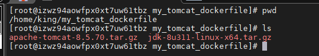

- 2、在相同文件夹下面编写dockerfile文件，官方命名：Dockerfile，在构建时无需指定-f参数对应的文件了！会自动寻找

  - 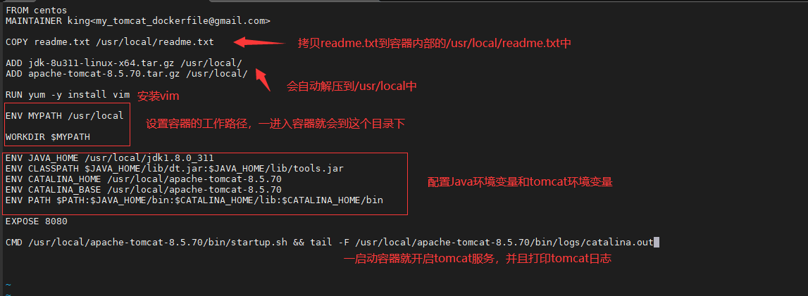

  - ```bash
    FROM centos
    MAINTAINER king<my_tomcat_dockerfile@gmail.com>
    
    COPY readme.txt /usr/local/readme.txt
    
    ADD jdk-8u311-linux-x64.tar.gz /usr/local/
    ADD apache-tomcat-8.5.70.tar.gz /usr/local/
    
    RUN yum -y install vim
    
    ENV MYPATH /usr/local
    
    WORKDIR $MYPATH
    
    ENV JAVA_HOME /usr/local/jdk1.8.0_311
    ENV CLASSPATH $JAVA_HOME/lib/dt.jar:$JAVA_HOME/lib/tools.jar
    ENV CATALINA_HOME /usr/local/apache-tomcat-8.5.70
    ENV CATALINA_BASE /usr/local/apache-tomcat-8.5.70
    ENV PATH $PATH:$JAVA_HOME/bin:$CATALINA_HOME/lib:$CATALINA_HOME/bin
    
    EXPOSE 8080
    
    CMD /usr/local/apache-tomcat-8.5.70/bin/startup.sh && tail -F /usr/local/apache-tomcat-8.5.70/bin/logs/catalina.out
    
    
    ```

- 3、构建镜像

  - ```bash
    docker build -t my_tomcat .
    
    # 构建成功
    [root@izwz94aowfpx0xt7uw61tbz my_tomcat_dockerfile]# docker images
    REPOSITORY            TAG       IMAGE ID       CREATED          SIZE
    my_tomcat             latest    99f8ef6bf519   36 seconds ago   675MB
    
    ```

- 4、创建并且运行容器：

  - ```bash
    [root@izwz94aowfpx0xt7uw61tbz my_tomcat_dockerfile]# docker run -d -p 3344:8080 --name kingtomcat -v /home/king/build/tomcat/test:/usr/local/apache-tomcat-8.5.70/webapps/test -v /home/king/build/tomcat/tomcatlogs/:/usr/local/apache-tomcat-8.5.70/logs my_tomcat
    76e2ce886548c9a1355c5a7f736df967850777813e912a871a24c3a6a328a389
    
    # 进入容器，查看相关文件的位置
    [root@izwz94aowfpx0xt7uw61tbz tomcatlogs]# docker exec -it kingtomcat /bin/bash
    
    # 验证数据卷映射的/的问题！最后一个/无影响！！！
    
    # 1./home/king/testv/test1/ 映射到 /usr/local/apache-tomcat-8.5.70/logs/=》都是将test1文件夹下的文件和logs文件夹下的文件进行映射
    [root@izwz94aowfpx0xt7uw61tbz king]# docker run -d --name testv01 -v /home/king/testv/test1/:/usr/local/apache-tomcat-8.5.70/logs/ my_tomcat
    a00e923a18ce3229711d473af13fe936bc5d2abe9d6137eaa96c270a54f5aa64
    [root@izwz94aowfpx0xt7uw61tbz testv]# cd test1/
    [root@izwz94aowfpx0xt7uw61tbz test1]# ls
    catalina.2021-12-04.log  host-manager.2021-12-04.log  localhost_access_log.2021-12-04.txt
    catalina.out             localhost.2021-12-04.log     manager.2021-12-04.log
    
    
    # 2./home/king/testv/test2 映射到 /usr/local/apache-tomcat-8.5.70/logs/=》都是将test2文件夹下的文件和logs文件夹下的文件进行映射
    [root@izwz94aowfpx0xt7uw61tbz test1]# docker run -d --name testv02 -v /home/king/testv/test2:/usr/local/apache-tomcat-8.5.70/logs/ my_tomcat
    3a3e5b6bd75da1e30c18fc625c95b31db995b3d5c531383c55c6908ae91c0a3e
    [root@izwz94aowfpx0xt7uw61tbz testv]# cd test2
    [root@izwz94aowfpx0xt7uw61tbz test2]# ls
    catalina.2021-12-04.log  host-manager.2021-12-04.log  localhost_access_log.2021-12-04.txt
    catalina.out             localhost.2021-12-04.log     manager.2021-12-04.log
    
    # 3./home/king/testv/test3/ 映射到 /usr/local/apache-tomcat-8.5.70/logs=》都是将test3文件夹下的文件和logs文件夹下的文件进行映射
    [root@izwz94aowfpx0xt7uw61tbz test2]# docker run -d --name testv03 -v /home/king/testv/test3/:/usr/local/apache-tomcat-8.5.70/logs my_tomcat
    46c09274eaf55a7a9085e775e047f32345bbf68e7b399f0572963b152af310fe
    [root@izwz94aowfpx0xt7uw61tbz testv]# cd test3
    [root@izwz94aowfpx0xt7uw61tbz test3]# ls
    catalina.2021-12-04.log  host-manager.2021-12-04.log  localhost_access_log.2021-12-04.txt
    catalina.out             localhost.2021-12-04.log     manager.2021-12-04.log
    
    # 4./home/king/testv/test4/ 映射到 /usr/local/apache-tomcat-8.5.70/logs/=》都是将test4文件夹下的文件和logs文件夹下的文件进行映射
    [root@izwz94aowfpx0xt7uw61tbz test3]# docker run -d --name testv04 -v /home/king/testv/test4:/usr/local/apache-tomcat-8.5.70/logs/ my_tomcat
    f865adcc458bb421e3c37ed85cff33affb50a7b91d65beba8fa17b0f8d47dc8f
    [root@izwz94aowfpx0xt7uw61tbz testv]# cd test4
    [root@izwz94aowfpx0xt7uw61tbz test4]# ls
    catalina.2021-12-04.log  host-manager.2021-12-04.log  localhost_access_log.2021-12-04.txt
    catalina.out             localhost.2021-12-04.log     manager.2021-12-04.log
    ```

- 5、访问测试

  - ```bash
    [root@izwz94aowfpx0xt7uw61tbz test]# curl localhost:3344
    ```

- 6、发布项目：将web项目复制到之前挂载的目录下即可

  - 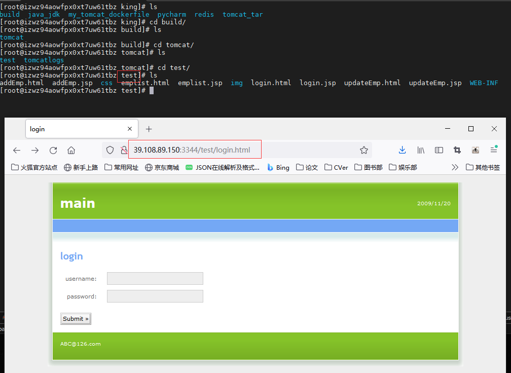
  - 成功部署！！！

- 我们以后开发的步骤：

  - 需要掌握Dokcerfile的编写
  - 一切都是使用docker臆像来发布运行!

## 8.6 发布自己的镜像

> DockerHub

- 1、地址 https://hub.docker.coml注册自己的账号!

- 2、确定这个这账号可以登录

- 3、在我们服务器上提交自己的镜像

  - ```bash
    # 在服务器上登录自己的账号
    [root@izwz94aowfpx0xt7uw61tbz test]# docker login --help
    
    Usage:  docker login [OPTIONS] [SERVER]
    
    Log in to a Docker registry.
    If no server is specified, the default is defined by the daemon.
    
    Options:
      -p, --password string   Password
          --password-stdin    Take the password from stdin
      -u, --username string   Username
    
    [root@izwz94aowfpx0xt7uw61tbz test]# docker login -u ygking
    Password:
    WARNING! Your password will be stored unencrypted in /root/.docker/config.json.
    Configure a credential helper to remove this warning. See
    https://docs.docker.com/engine/reference/commandline/login/#credentials-store
    
    Login Succeeded
    
    ```

- 4、打标签，并且上传到Dockerhub！

  - ```bash
    [root@izwz94aowfpx0xt7uw61tbz tomcat]# docker images
    REPOSITORY            TAG       IMAGE ID       CREATED          SIZE
    my_tomcat             latest    99f8ef6bf519   49 minutes ago   675MB
    entrypoint-test       latest    a740127ac955   24 hours ago     231MB
    cmdtest               latest    8c339cb98c89   24 hours ago     231MB
    king/centos           1.0       8b7ee2a5a650   25 hours ago     231MB
    mysql                 5.7       738e7101490b   39 hours ago     448MB
    tomcat02              1.0       9f94570e00f3   2 days ago       684MB
    tomcat                9.0       76206e3ba4b1   2 weeks ago      680MB
    tomcat                latest    904a98253fbf   2 weeks ago      680MB
    nginx                 latest    ea335eea17ab   2 weeks ago      141MB
    centos                latest    5d0da3dc9764   2 months ago     231MB
    portainer/portainer   latest    580c0e4e98b0   8 months ago     79.1MB
    elasticsearch         7.6.2     f29a1ee41030   20 months ago    791MB
    
    # 需要先打标签！再push上传
    [root@izwz94aowfpx0xt7uw61tbz tomcat]# docker tag 99f8ef6bf519 ygking/tomcat:1.0
    [root@izwz94aowfpx0xt7uw61tbz tomcat]# docker images
    REPOSITORY            TAG       IMAGE ID       CREATED          SIZE
    ygking/tomcat         1.0       99f8ef6bf519   49 minutes ago   675MB
    my_tomcat             latest    99f8ef6bf519   49 minutes ago   675MB
    entrypoint-test       latest    a740127ac955   24 hours ago     231MB
    cmdtest               latest    8c339cb98c89   24 hours ago     231MB
    king/centos           1.0       8b7ee2a5a650   25 hours ago     231MB
    mysql                 5.7       738e7101490b   39 hours ago     448MB
    tomcat02              1.0       9f94570e00f3   2 days ago       684MB
    tomcat                9.0       76206e3ba4b1   2 weeks ago      680MB
    tomcat                latest    904a98253fbf   2 weeks ago      680MB
    nginx                 latest    ea335eea17ab   2 weeks ago      141MB
    centos                latest    5d0da3dc9764   2 months ago     231MB
    portainer/portainer   latest    580c0e4e98b0   8 months ago     79.1MB
    elasticsearch         7.6.2     f29a1ee41030   20 months ago    791MB
    # 上传，记得带版本号！
    [root@izwz94aowfpx0xt7uw61tbz tomcat]# docker push ygking/tomcat:1.0
    The push refers to repository [docker.io/ygking/tomcat]
    804f55d78b01: Pushing  28.09MB/63.98MB
    166265778b09: Pushing  7.028MB/14.75MB
    e01718470c8a: Pushing  17.03MB/365.3MB
    e7d626d77eb8: Pushed
    74ddd0ec08fa: Mounted from library/centos
    ```

- 提交的时候也是根据镜像，一层层的提交！

  - 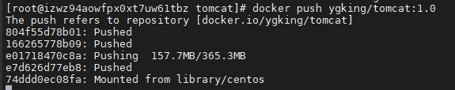

---

> 阿里云镜像服务器

- 1、登录阿里云
- 2、找到容器镜像服务
  - 现在需要先创建实例列表
- 3、创建命名空间
  - 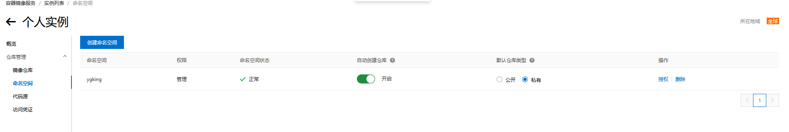
- 4、创建镜像仓库
  - 
- 5、按照阿里云的教程推送即可！
  - 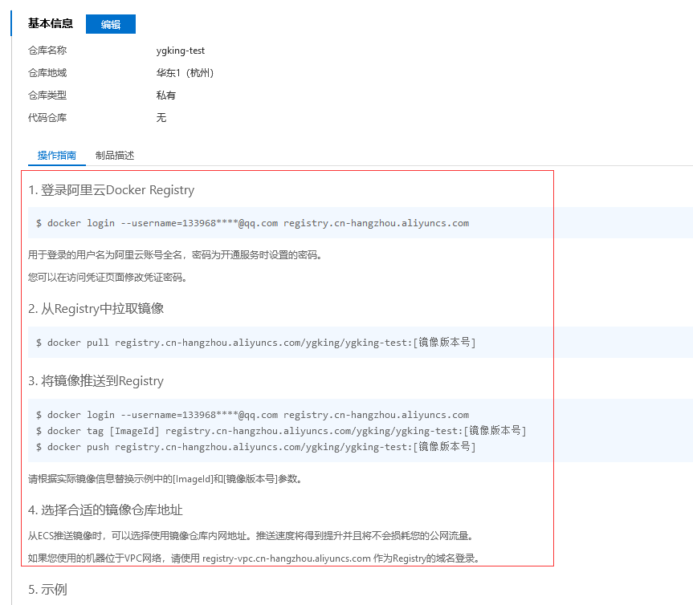

# 9. 小结

- 再次回顾整个Docker的使用！
  - 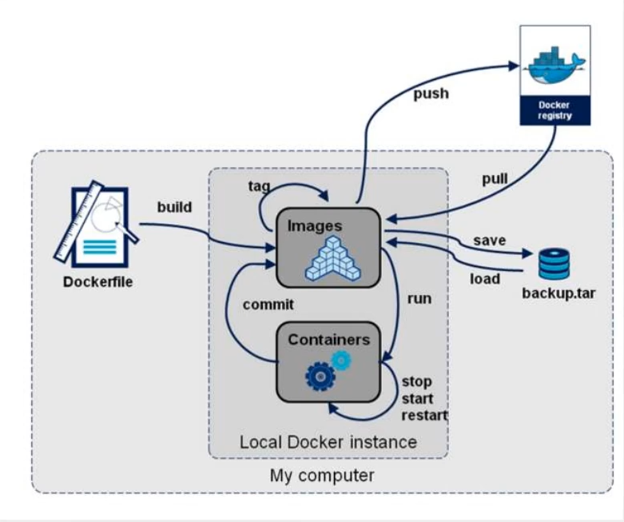

# 10. Docker网络

- 清空所有镜像和容器

## 10.1 Docker0

> - ip addr：查看本机网卡的ip地址和mac等信息

- 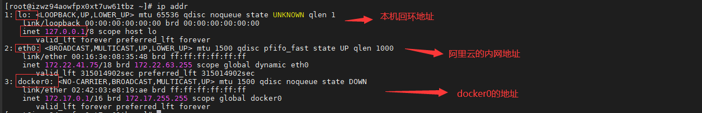
- 有三个网络！
- 问题：docker是如何处理容器网络访问的？？？
  - 

> - 测试docker：
>   - 查看容器内的地址

- ```bash
  # 创建并且运行一个容器
  # 因为默认的dockerhub上的tomcat镜像没有ip addr指令，因此使用8.5自己构建的my_tomcat镜像进行演示！
  
  [root@izwz94aowfpx0xt7uw61tbz king]# docker images
  REPOSITORY   TAG       IMAGE ID       CREATED          SIZE
  my_tomcat    latest    7417e1dccbf7   58 seconds ago   675MB
  tomcat       latest    49842ef82091   35 hours ago     680MB
  centos       latest    5d0da3dc9764   2 months ago     231MB
  
  # 创建并且运行容器
  [root@izwz94aowfpx0xt7uw61tbz king]# docker run -d -P --name tomcat01 my_tomcat
  da482b0ed85b27d7981e2988dacc5284e39303509eaf3db1108e56e427b3cbe6
  
  # 查看容器的IP地址
  [root@izwz94aowfpx0xt7uw61tbz king]# docker exec -it tomcat01 ip addr
  1: lo: <LOOPBACK,UP,LOWER_UP> mtu 65536 qdisc noqueue state UNKNOWN group default qlen 1
      link/loopback 00:00:00:00:00:00 brd 00:00:00:00:00:00
      inet 127.0.0.1/8 scope host lo
         valid_lft forever preferred_lft forever
  84: eth0@if85: <BROADCAST,MULTICAST,UP,LOWER_UP> mtu 1500 qdisc noqueue state UP group default
      link/ether 02:42:ac:11:00:02 brd ff:ff:ff:ff:ff:ff link-netnsid 0
      inet 172.17.0.2/16 brd 172.17.255.255 scope global eth0
         valid_lft forever preferred_lft forever
  
  
  # 查看该容器的内部网络地址 ip addr,发现容器启动的时候会得到一个84: eth0@if85:，是docker分配的！
  
  # 问题：宿主机能不能ping通这个容器！
  [root@izwz94aowfpx0xt7uw61tbz king]# ping 172.17.0.2
  PING 172.17.0.2 (172.17.0.2) 56(84) bytes of data.
  64 bytes from 172.17.0.2: icmp_seq=1 ttl=64 time=0.083 ms
  64 bytes from 172.17.0.2: icmp_seq=2 ttl=64 time=0.087 ms
  # 肯定可以！！！自己ping自己的感觉！
  # linux可以ping通docker内部容器！
  ```

> - 原理简析：

- 1、我们每启动一个docker容器，docker就会给docker容器分配一个ip，我们只要安装了docker，就会有一个网卡docker0桥接模式，使用的技术是veth-pair技术!

  - docker0的ip地址是：172.17.0.1=》0.1也就类似路由器的地址，主要是路由功能！

- 再次查看ip addr：

- ```bash
  # 发现多了容器的ip地址!
  [root@izwz94aowfpx0xt7uw61tbz king]# ip addr
  1: lo: <LOOPBACK,UP,LOWER_UP> mtu 65536 qdisc noqueue state UNKNOWN qlen 1
      link/loopback 00:00:00:00:00:00 brd 00:00:00:00:00:00
      inet 127.0.0.1/8 scope host lo
         valid_lft forever preferred_lft forever
  2: eth0: <BROADCAST,MULTICAST,UP,LOWER_UP> mtu 1500 qdisc pfifo_fast state UP qlen 1000
      link/ether 00:16:3e:08:35:48 brd ff:ff:ff:ff:ff:ff
      inet 172.22.41.75/18 brd 172.22.63.255 scope global dynamic eth0
         valid_lft 315013397sec preferred_lft 315013397sec
  3: docker0: <BROADCAST,MULTICAST,UP,LOWER_UP> mtu 1500 qdisc noqueue state UP
      link/ether 02:42:03:e8:19:ae brd ff:ff:ff:ff:ff:ff
      inet 172.17.0.1/16 brd 172.17.255.255 scope global docker0
         valid_lft forever preferred_lft forever
  85: vethfbcc6ff@if84: <BROADCAST,MULTICAST,UP,LOWER_UP> mtu 1500 qdisc noqueue master docker0 state UP
      link/ether aa:b2:3e:32:b4:ab brd ff:ff:ff:ff:ff:ff link-netnsid 0
  ```

- 2、再启动一个容器测试，发现又多了一对网卡！

- 小结：

  - 我们发现这个容器带来网卡，都是一对对的
  - **veth-pair** 就是一对的虚拟设备接口，他们都是成对出现的，一段连着协议，一段彼此相连
  - 正因为有这个特性，veth-pair充当一个桥梁，连接各种虚拟网络设备的
  - Docker容器之间的连接，ovs的连接，都是使用veth-pair技术

- 3、测试容器和容器之间是否可以ping通！

  - 可以！！！

  - ```bash
    [root@izwz94aowfpx0xt7uw61tbz king]# docker run -d -P --name tomcat02 my_tomcat
    01a672aee568b7868a90ee7f202b9b49c9c66c11b393c7b4e3bc976ac259e170
    
    [root@izwz94aowfpx0xt7uw61tbz king]# docker ps
    CONTAINER ID   IMAGE       COMMAND                  CREATED          STATUS          PORTS                     NAMES
    01a672aee568   my_tomcat   "/bin/sh -c '/usr/lo…"   4 seconds ago    Up 3 seconds    0.0.0.0:49155->8080/tcp   tomcat02
    da482b0ed85b   my_tomcat   "/bin/sh -c '/usr/lo…"   14 minutes ago   Up 14 minutes   0.0.0.0:49154->8080/tcp   tomcat01
    
    [root@izwz94aowfpx0xt7uw61tbz king]# docker exec -it tomcat02 ip addr
    1: lo: <LOOPBACK,UP,LOWER_UP> mtu 65536 qdisc noqueue state UNKNOWN group default qlen 1
        link/loopback 00:00:00:00:00:00 brd 00:00:00:00:00:00
        inet 127.0.0.1/8 scope host lo
           valid_lft forever preferred_lft forever
    86: eth0@if87: <BROADCAST,MULTICAST,UP,LOWER_UP> mtu 1500 qdisc noqueue state UP group default
        link/ether 02:42:ac:11:00:03 brd ff:ff:ff:ff:ff:ff link-netnsid 0
        inet 172.17.0.3/16 brd 172.17.255.255 scope global eth0
           valid_lft forever preferred_lft forever
    
    [root@izwz94aowfpx0xt7uw61tbz king]# docker exec -it tomcat01 ip addr
    1: lo: <LOOPBACK,UP,LOWER_UP> mtu 65536 qdisc noqueue state UNKNOWN group default qlen 1
        link/loopback 00:00:00:00:00:00 brd 00:00:00:00:00:00
        inet 127.0.0.1/8 scope host lo
           valid_lft forever preferred_lft forever
    84: eth0@if85: <BROADCAST,MULTICAST,UP,LOWER_UP> mtu 1500 qdisc noqueue state UP group default
        link/ether 02:42:ac:11:00:02 brd ff:ff:ff:ff:ff:ff link-netnsid 0
        inet 172.17.0.2/16 brd 172.17.255.255 scope global eth0
           valid_lft forever preferred_lft forever
    
    
    [root@izwz94aowfpx0xt7uw61tbz king]# docker exec -it tomcat02 ping 172.17.0.2
    PING 172.17.0.2 (172.17.0.2) 56(84) bytes of data.
    64 bytes from 172.17.0.2: icmp_seq=1 ttl=64 time=0.231 ms
    64 bytes from 172.17.0.2: icmp_seq=2 ttl=64 time=0.099 ms
    64 bytes from 172.17.0.2: icmp_seq=3 ttl=64 time=0.082 ms
    ^C
    --- 172.17.0.2 ping statistics ---
    3 packets transmitted, 3 received, 0% packet loss, time 1999ms
    
    ```

- 容器之间如何进行通信？

  - 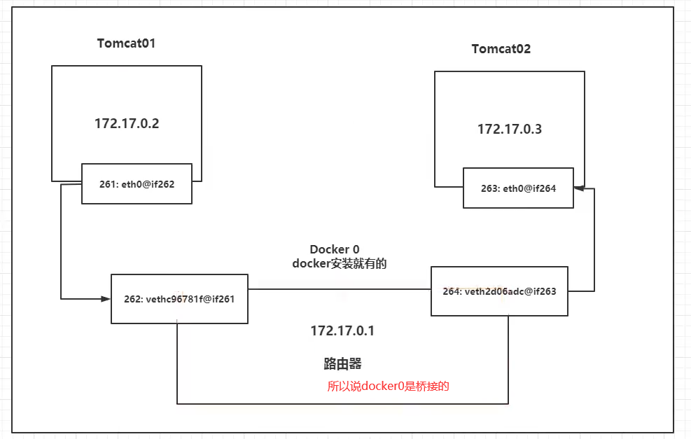
  - 结论: tomcat01和tomcat02是公用的一个路由器,docker0。
  - 所有的容器不指定网络的情况下，都是docker0路由的，docker会给我们的容器分配一个默认的可用IP
    - 一般有多少个可以IP？
    - 需要根据路由掩码计算！
      - 分A、B、C类IP地址
      - 或者采用：无类域间路由CIDR

- 小结：

  - Docker中的所有的网络接口都是虚拟的。虚拟的转发效率高!(内网传递文件! )
  - 只要容器删除，对应网桥的一对就没有了！
  - 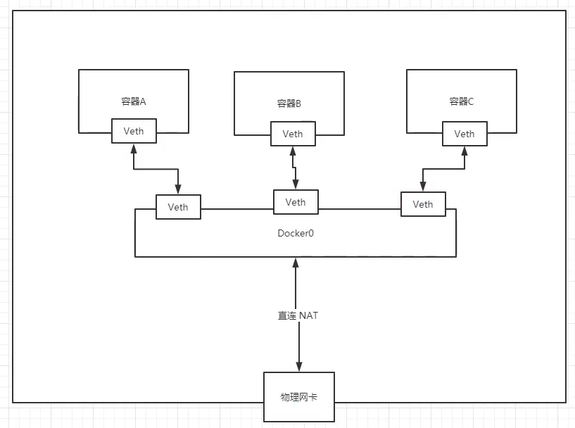

- 思考：

  - 编写了一个微服务，database url=ip:，项目不重启，数据库ip换掉了(容器重新启动或者重新创建)，那么如何连接这个数据库？
    - 希望可以处理这个问题，可以通过名字来进行访问容器？

## 10.2 容器互联--link

- 为了解决上面那个问题：希望通过名字可以访问容器

- ```bash
  [root@izwz94aowfpx0xt7uw61tbz king]# docker ps
  CONTAINER ID   IMAGE       COMMAND                  CREATED          STATUS          PORTS                     NAMES
  01a672aee568   my_tomcat   "/bin/sh -c '/usr/lo…"   17 minutes ago   Up 17 minutes   0.0.0.0:49155->8080/tcp   tomcat02
  da482b0ed85b   my_tomcat   "/bin/sh -c '/usr/lo…"   31 minutes ago   Up 31 minutes   0.0.0.0:49154->8080/tcp   tomcat01
  
  # 一般ping容器名不行
  [root@izwz94aowfpx0xt7uw61tbz king]# docker exec -it tomcat02 ping tomcat01
  ping: tomcat01: Name or service not known
  
  # 使用--link进行容器间的连接
  [root@izwz94aowfpx0xt7uw61tbz king]# docker run -d -P --name tomcat03 --link tomcat02 my_tomcat
  17475d08dd5dda37393f4ada47e6c084ec618b8e82ede961c7fdcd0a60e9ecf8
  
  # tomcat02不能ping通tomcat03!
  [root@izwz94aowfpx0xt7uw61tbz king]# docker exec -it tomcat02 ping tomcat03
  ping: tomcat03: Name or service not known
  
  # 但是tomcat03可以ping通tomcat02
  [root@izwz94aowfpx0xt7uw61tbz king]# docker exec -it tomcat03 ping tomcat02
  PING tomcat02 (172.17.0.3) 56(84) bytes of data.
  64 bytes from tomcat02 (172.17.0.3): icmp_seq=1 ttl=64 time=0.180 ms
  64 bytes from tomcat02 (172.17.0.3): icmp_seq=2 ttl=64 time=0.087 ms
  ^C
  --- tomcat02 ping statistics ---
  2 packets transmitted, 2 received, 0% packet loss, time 1000ms
  rtt min/avg/max/mdev = 0.087/0.133/0.180/0.047 ms
  
  ```

- 探究：

  - ```bash
    # 查看当前的网络
    [root@izwz94aowfpx0xt7uw61tbz king]# docker network ls
    NETWORK ID     NAME      DRIVER    SCOPE
    38b1bdf0e0ea   bridge    bridge    local# 应该就是docker0
    4fc450c4cade   host      host      local
    f441fd1f2c68   none      null      local
    [root@izwz94aowfpx0xt7uw61tbz king]# docker network inspect 38b1bdf0e0ea
    ```

  - 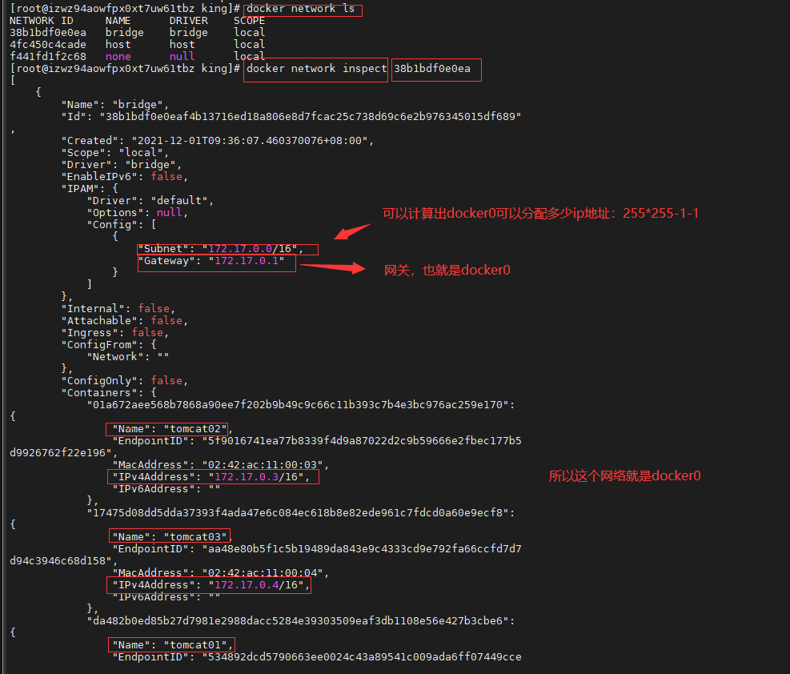

  - ```bash
    [root@izwz94aowfpx0xt7uw61tbz king]# docker ps
    CONTAINER ID   IMAGE       COMMAND                  CREATED          STATUS          PORTS                     NAMES
    17475d08dd5d   my_tomcat   "/bin/sh -c '/usr/lo…"   11 minutes ago   Up 11 minutes   0.0.0.0:49156->8080/tcp   tomcat03
    01a672aee568   my_tomcat   "/bin/sh -c '/usr/lo…"   30 minutes ago   Up 30 minutes   0.0.0.0:49155->8080/tcp   tomcat02
    da482b0ed85b   my_tomcat   "/bin/sh -c '/usr/lo…"   44 minutes ago   Up 44 minutes   0.0.0.0:49154->8080/tcp   tomcat01
    [root@izwz94aowfpx0xt7uw61tbz king]# docker inspect 17475d08dd5d
    [
        {
            "Id": "17475d08dd5dda37393f4ada47e6c084ec618b8e82ede961c7fdcd0a60e9ecf8",
            "Created": "2021-12-05T01:47:35.18080796Z",
            "Path": "/bin/sh",
            "Args": [
                "-c",
                "/usr/local/apache-tomcat-8.5.70/bin/startup.sh && tail -F /usr/local/apache-tomcat-8.5.70/bin/logs/catalina.out"
            ],
            "State": {
                "Status": "running",
                "Running": true,
                "Paused": false,
                "Restarting": false,
                "OOMKilled": false,
                "Dead": false,
                "Pid": 7813,
                "ExitCode": 0,
                "Error": "",
                "StartedAt": "2021-12-05T01:47:35.633346651Z",
                "FinishedAt": "0001-01-01T00:00:00Z"
            },
            "Image": "sha256:7417e1dccbf74b74dffb7e3d5249cbe11f9cd5f1444a81018df1800740ba16ec",
            "ResolvConfPath": "/var/lib/docker/containers/17475d08dd5dda37393f4ada47e6c084ec618b8e82ede961c7fdcd0a60e9ecf8/resolv.conf",
            "HostnamePath": "/var/lib/docker/containers/17475d08dd5dda37393f4ada47e6c084ec618b8e82ede961c7fdcd0a60e9ecf8/hostname",
            "HostsPath": "/var/lib/docker/containers/17475d08dd5dda37393f4ada47e6c084ec618b8e82ede961c7fdcd0a60e9ecf8/hosts",
            "LogPath": "/var/lib/docker/containers/17475d08dd5dda37393f4ada47e6c084ec618b8e82ede961c7fdcd0a60e9ecf8/17475d08dd5dda37393f4ada47e6c084ec618b8e82ede961c7fdcd0a60e9ecf8-json.log",
            "Name": "/tomcat03",
            "RestartCount": 0,
            "Driver": "overlay2",
            "Platform": "linux",
            "MountLabel": "",
            "ProcessLabel": "",
            "AppArmorProfile": "",
            "ExecIDs": null,
            "HostConfig": {
                "Binds": null,
                "ContainerIDFile": "",
                "LogConfig": {
                    "Type": "json-file",
                    "Config": {}
                },
                "NetworkMode": "default",
                "PortBindings": {},
                "RestartPolicy": {
                    "Name": "no",
                    "MaximumRetryCount": 0
                },
                "AutoRemove": false,
                "VolumeDriver": "",
                "VolumesFrom": null,
                "CapAdd": null,
                "CapDrop": null,
                "CgroupnsMode": "host",
                "Dns": [],
                "DnsOptions": [],
                "DnsSearch": [],
                "ExtraHosts": null,
                "GroupAdd": null,
                "IpcMode": "private",
                "Cgroup": "",
                "Links": [
                    "/tomcat02:/tomcat03/tomcat02"
                ],
                "OomScoreAdj": 0,
                "PidMode": "",
                "Privileged": false,
                "PublishAllPorts": true,
                "ReadonlyRootfs": false,
                "SecurityOpt": null,
                "UTSMode": "",
                "UsernsMode": "",
                "ShmSize": 67108864,
                "Runtime": "runc",
                "ConsoleSize": [
                    0,
                    0
                ],
                "Isolation": "",
                "CpuShares": 0,
                "Memory": 0,
                "NanoCpus": 0,
                "CgroupParent": "",
                "BlkioWeight": 0,
                "BlkioWeightDevice": [],
                "BlkioDeviceReadBps": null,
                "BlkioDeviceWriteBps": null,
                "BlkioDeviceReadIOps": null,
                "BlkioDeviceWriteIOps": null,
                "CpuPeriod": 0,
                "CpuQuota": 0,
                "CpuRealtimePeriod": 0,
                "CpuRealtimeRuntime": 0,
                "CpusetCpus": "",
                "CpusetMems": "",
                "Devices": [],
                "DeviceCgroupRules": null,
                "DeviceRequests": null,
                "KernelMemory": 0,
                "KernelMemoryTCP": 0,
                "MemoryReservation": 0,
                "MemorySwap": 0,
                "MemorySwappiness": null,
                "OomKillDisable": false,
                "PidsLimit": null,
                "Ulimits": null,
                "CpuCount": 0,
                "CpuPercent": 0,
                "IOMaximumIOps": 0,
                "IOMaximumBandwidth": 0,
                "MaskedPaths": [
                    "/proc/asound",
                    "/proc/acpi",
                    "/proc/kcore",
                    "/proc/keys",
                    "/proc/latency_stats",
                    "/proc/timer_list",
                    "/proc/timer_stats",
                    "/proc/sched_debug",
                    "/proc/scsi",
                    "/sys/firmware"
                ],
                "ReadonlyPaths": [
                    "/proc/bus",
                    "/proc/fs",
                    "/proc/irq",
                    "/proc/sys",
                    "/proc/sysrq-trigger"
                ]
            },
            "GraphDriver": {
                "Data": {
                    "LowerDir": "/var/lib/docker/overlay2/bd4b7d401be21f92b5315b76068eca918ddc83c51a96d2d330b839c77c2d6323-init/diff:/var/lib/docker/overlay2/dbe286125237115c5706289e85f75490cc978fa5d09072e6ea3b14f8c4ea9061/diff:/var/lib/docker/overlay2/d13d21753127405e15bdd18dc5882db737688768a6502ba82329e0d9d15194b8/diff:/var/lib/docker/overlay2/9d2b9eedd5b3fe46b756ba83b6ec72250aa8e9581ec2f8f35bd0bd8ed24fcaae/diff:/var/lib/docker/overlay2/289f10343eabbc291d03c2e421d32e07be0836d37917948404abc3aeebe1d426/diff:/var/lib/docker/overlay2/2eb5f9a568a4141185f78178ebb39cc9e4524c32226fcca1a01c2ed7722553f1/diff",
                    "MergedDir": "/var/lib/docker/overlay2/bd4b7d401be21f92b5315b76068eca918ddc83c51a96d2d330b839c77c2d6323/merged",
                    "UpperDir": "/var/lib/docker/overlay2/bd4b7d401be21f92b5315b76068eca918ddc83c51a96d2d330b839c77c2d6323/diff",
                    "WorkDir": "/var/lib/docker/overlay2/bd4b7d401be21f92b5315b76068eca918ddc83c51a96d2d330b839c77c2d6323/work"
                },
                "Name": "overlay2"
            },
            "Mounts": [],
            "Config": {
                "Hostname": "17475d08dd5d",
                "Domainname": "",
                "User": "",
                "AttachStdin": false,
                "AttachStdout": false,
                "AttachStderr": false,
                "ExposedPorts": {
                    "8080/tcp": {}
                },
                "Tty": false,
                "OpenStdin": false,
                "StdinOnce": false,
                "Env": [
                    "PATH=/usr/local/sbin:/usr/local/bin:/usr/sbin:/usr/bin:/sbin:/bin:/usr/local/jdk1.8.0_311/bin:/usr/local/apache-tomcat-8.5.70/lib:/usr/local/apache-tomcat-8.5.70/bin",
                    "MYPATH=/usr/local",
                    "JAVA_HOME=/usr/local/jdk1.8.0_311",
                    "CLASSPATH=/usr/local/jdk1.8.0_311/lib/dt.jar:/usr/local/jdk1.8.0_311/lib/tools.jar",
                    "CATALINA_HOME=/usr/local/apache-tomcat-8.5.70",
                    "CATALINA_BASE=/usr/local/apache-tomcat-8.5.70"
                ],
                "Cmd": [
                    "/bin/sh",
                    "-c",
                    "/usr/local/apache-tomcat-8.5.70/bin/startup.sh && tail -F /usr/local/apache-tomcat-8.5.70/bin/logs/catalina.out"
                ],
                "Image": "my_tomcat",
                "Volumes": null,
                "WorkingDir": "/usr/local",
                "Entrypoint": null,
                "OnBuild": null,
                "Labels": {
                    "org.label-schema.build-date": "20210915",
                    "org.label-schema.license": "GPLv2",
                    "org.label-schema.name": "CentOS Base Image",
                    "org.label-schema.schema-version": "1.0",
                    "org.label-schema.vendor": "CentOS"
                }
            },
            "NetworkSettings": {
                "Bridge": "",
                "SandboxID": "93379dd941ff08c8ec2cf3050289b25048678fc5175c9999bd89a9d818d01769",
                "HairpinMode": false,
                "LinkLocalIPv6Address": "",
                "LinkLocalIPv6PrefixLen": 0,
                "Ports": {
                    "8080/tcp": [
                        {
                            "HostIp": "0.0.0.0",
                            "HostPort": "49156"
                        }
                    ]
                },
                "SandboxKey": "/var/run/docker/netns/93379dd941ff",
                "SecondaryIPAddresses": null,
                "SecondaryIPv6Addresses": null,
                "EndpointID": "aa48e80b5f1c5b19489da843e9c4333cd9e792fa66ccfd7d7d94c3946c68d158",
                "Gateway": "172.17.0.1",
                "GlobalIPv6Address": "",
                "GlobalIPv6PrefixLen": 0,
                "IPAddress": "172.17.0.4",
                "IPPrefixLen": 16,
                "IPv6Gateway": "",
                "MacAddress": "02:42:ac:11:00:04",
                "Networks": {
                    "bridge": {
                        "IPAMConfig": null,
                        "Links": null,
                        "Aliases": null,
                        "NetworkID": "38b1bdf0e0eaf4b13716ed18a806e8d7fcac25c738d69c6e2b976345015df689",
                        "EndpointID": "aa48e80b5f1c5b19489da843e9c4333cd9e792fa66ccfd7d7d94c3946c68d158",
                        "Gateway": "172.17.0.1",
                        "IPAddress": "172.17.0.4",
                        "IPPrefixLen": 16,
                        "IPv6Gateway": "",
                        "GlobalIPv6Address": "",
                        "GlobalIPv6PrefixLen": 0,
                        "MacAddress": "02:42:ac:11:00:04",
                        "DriverOpts": null
                    }
                }
            }
        }
    ]
    [root@izwz94aowfpx0xt7uw61tbz king]#
    
    ```

- 发现并不能看到tomcat03是否链接了tomcat02！

  - 用另一种方式查看！

  - 直接查看etc/hosts文件！

  - ```bash
    [root@izwz94aowfpx0xt7uw61tbz king]# docker exec -it tomcat03 cat /etc/hosts
    127.0.0.1       localhost
    ::1     localhost ip6-localhost ip6-loopback
    fe00::0 ip6-localnet
    ff00::0 ip6-mcastprefix
    ff02::1 ip6-allnodes
    ff02::2 ip6-allrouters
    172.17.0.3      tomcat02 01a672aee568
    172.17.0.4      17475d08dd5d
    [root@izwz94aowfpx0xt7uw61tbz king]#
    
    ```

  - 发现：其实这个tomcat03就是在本地配置了tomcat02的配置 ！

    - --link就是在hosts中增加了172.17.0.3      tomcat02 01a672aee568的映射

- 目前已经不推荐使用--link了，

  - 因为只能单向并且麻烦！
  - docker0也存在许多问题！
    - 不支持容器名连接访问！

- 目前：

  - 自定义网络！不适用docker0

## 10.3 容器互联-自定义网络

- 查看所有的docker网络：

  - 

- **网络模式：**

  - bridge：桥接docker(默认，自己创建的也使用bridge模式)
  - none：不配置网络
  - host ：和宿主机共享网络
  - container：容器网络连通!（用的少!局限很大）

- 测试：

  - ```bash
    #我们直接启动的命令--net bridge，而这个就是我们的docker0 
    docker run -d -P --name tomcat01 tomcat
    # 就等同于下面的命令
    docker run -d --name tomcat01 --net bridge tomcat
    
    # docker0特点：默认使用，但是域名(容器名)不能访问. --link可以打通连接!
    
    # 可以自定义一个网络!
    
    docker network --help
    docker network create --help
    
    # --driver bridge：网络模式
    # --subnet 192.168.0.0/16 ：子网地址
    # --gateway 192.168.0.1 ：网关
    [root@izwz94aowfpx0xt7uw61tbz king]# docker network create --driver bridge --subnet 192.168.0.0/16 --gateway 192.168.0.1 mynet
    a911debf469c8227bc55cad14e1725e1137967d6003f9529eaf7bf7bfec68662
    [root@izwz94aowfpx0xt7uw61tbz king]# docker network ls
    NETWORK ID     NAME      DRIVER    SCOPE
    38b1bdf0e0ea   bridge    bridge    local
    4fc450c4cade   host      host      local
    a911debf469c   mynet     bridge    local
    f441fd1f2c68   none      null      local
    
    # 查看我们自己的网络
    [root@izwz94aowfpx0xt7uw61tbz king]# docker network inspect mynet
    [
        {
            "Name": "mynet",
            "Id": "a911debf469c8227bc55cad14e1725e1137967d6003f9529eaf7bf7bfec68662",
            "Created": "2021-12-05T10:28:01.683942514+08:00",
            "Scope": "local",
            "Driver": "bridge",
            "EnableIPv6": false,
            "IPAM": {
                "Driver": "default",
                "Options": {},
                "Config": [
                    {
                        "Subnet": "192.168.0.0/16",
                        "Gateway": "192.168.0.1"
                    }
                ]
            },
            "Internal": false,
            "Attachable": false,
            "Ingress": false,
            "ConfigFrom": {
                "Network": ""
            },
            "ConfigOnly": false,
            "Containers": {},
            "Options": {},
            "Labels": {}
        }
    ]
    
    
    # 容器使用自己定义的网络！
    [root@izwz94aowfpx0xt7uw61tbz king]# docker run -d -P --name tomcat-net-o1 --net mynet my_tomcat
    2cd2709df2d36552cc67f22e18700dc82a9708ea3580a6b6b576291ffb9b87b8
    [root@izwz94aowfpx0xt7uw61tbz king]# docker run -d -P --name tomcat-net-o2 --net mynet my_tomcat
    338522664f0258c8c039ad6bde1a608be6d5a1388348cbd7138f30042f508f40
    
    # 再查看我们自定义的网络的详细信息
    [root@izwz94aowfpx0xt7uw61tbz king]# docker network inspect mynet
    [
        {
            "Name": "mynet",
            "Id": "a911debf469c8227bc55cad14e1725e1137967d6003f9529eaf7bf7bfec68662",
            "Created": "2021-12-05T10:28:01.683942514+08:00",
            "Scope": "local",
            "Driver": "bridge",
            "EnableIPv6": false,
            "IPAM": {
                "Driver": "default",
                "Options": {},
                "Config": [
                    {
                        "Subnet": "192.168.0.0/16",
                        "Gateway": "192.168.0.1"
                    }
                ]
            },
            "Internal": false,
            "Attachable": false,
            "Ingress": false,
            "ConfigFrom": {
                "Network": ""
            },
            "ConfigOnly": false,
            "Containers": {
                "2cd2709df2d36552cc67f22e18700dc82a9708ea3580a6b6b576291ffb9b87b8": {
                    "Name": "tomcat-net-o1",
                    "EndpointID": "5fc1d310a8d35a77034d6105d68fd4bbf4145299d115c043e1b0791ee97f012f",
                    "MacAddress": "02:42:c0:a8:00:02",
                    "IPv4Address": "192.168.0.2/16",
                    "IPv6Address": ""
                },
                "338522664f0258c8c039ad6bde1a608be6d5a1388348cbd7138f30042f508f40": {
                    "Name": "tomcat-net-o2",
                    "EndpointID": "a4d61dadec485098056955881bf5597cc084c10fc6d5c98fbd3a2bc534ae3b3c",
                    "MacAddress": "02:42:c0:a8:00:03",
                    "IPv4Address": "192.168.0.3/16",
                    "IPv6Address": ""
                }
            },
            "Options": {},
            "Labels": {}
        }
    ]
    
    # 测试是否可以相互ping通
    # 不适应--link也可以ping名字了！
    [root@izwz94aowfpx0xt7uw61tbz king]# docker exec -it tomcat-net-o2 ping tomcat-net-o1
    PING tomcat-net-o1 (192.168.0.2) 56(84) bytes of data.
    64 bytes from tomcat-net-o1.mynet (192.168.0.2): icmp_seq=1 ttl=64 time=0.115 ms
    64 bytes from tomcat-net-o1.mynet (192.168.0.2): icmp_seq=2 ttl=64 time=0.120 ms
    ^C
    --- tomcat-net-o1 ping statistics ---
    2 packets transmitted, 2 received, 0% packet loss, time 1000ms
    rtt min/avg/max/mdev = 0.115/0.117/0.120/0.011 ms
    ```

- 我们自定义的网络docker都已经帮我们维护好了对应的关系，推荐我们平时这样使用网络!

- 好处:

  - redis -不同的集群使用不同的网络，保证集群是安全和健康的
  - mysql -不同的集群使用不同的网络，保证集群是安全和健康的

## 10.4 网络连通

- 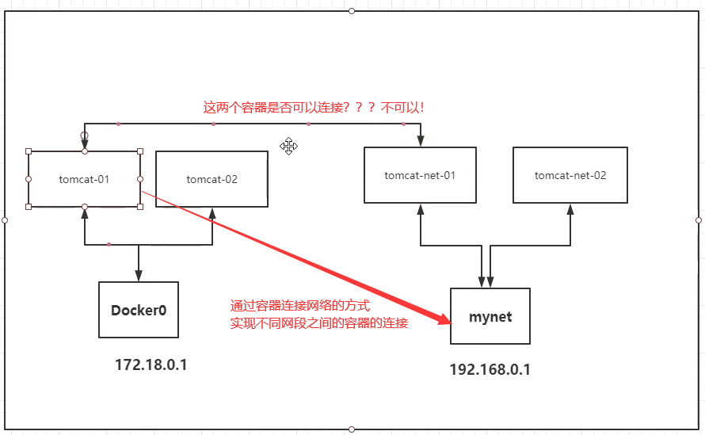

- 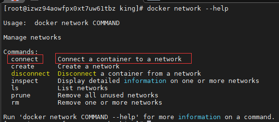

- 测试：

  - ```bash
    [root@izwz94aowfpx0xt7uw61tbz king]# docker run -d -P --name tomcat01 my_tomcat
    eb28eb7bb135eb8ae06a5d41a863b23044f851f7e8c71711cb9822d6b8f74f5b
    [root@izwz94aowfpx0xt7uw61tbz king]# docker run -d -P --name tomcat02 my_tomcat
    6402b5291e4418e6a65df8245f11706146bebfc278effc0740697c74d34f9d90
    [root@izwz94aowfpx0xt7uw61tbz king]# docker ps
    CONTAINER ID   IMAGE       COMMAND                  CREATED         STATUS         PORTS                     NAMES
    6402b5291e44   my_tomcat   "/bin/sh -c '/usr/lo…"   3 seconds ago   Up 2 seconds   0.0.0.0:49160->8080/tcp   tomcat02
    eb28eb7bb135   my_tomcat   "/bin/sh -c '/usr/lo…"   6 seconds ago   Up 5 seconds   0.0.0.0:49159->8080/tcp   tomcat01
    338522664f02   my_tomcat   "/bin/sh -c '/usr/lo…"   8 minutes ago   Up 8 minutes   0.0.0.0:49158->8080/tcp   tomcat-net-o2
    2cd2709df2d3   my_tomcat   "/bin/sh -c '/usr/lo…"   8 minutes ago   Up 8 minutes   0.0.0.0:49157->8080/tcp   tomcat-net-o1
    # 直接ping!不可能ping通！
    [root@izwz94aowfpx0xt7uw61tbz king]# docker exec -it tomcat01 ping tomcat-ne-o1
    ping: tomcat-ne-o1: Name or service not known
    
    ```

- 将容器和网络网卡打通

  - ```bash
    docker network connect --help
    
    # 测试：打通tomcat01到tomcat-net-o1
    [root@izwz94aowfpx0xt7uw61tbz king]# docker network connect mynet tomcat01
    
    # 查看mynet配置！
    # 联通之后，就是将tomcat01的ip信息添加到mynet中！
    [root@izwz94aowfpx0xt7uw61tbz king]# docker network inspect mynet
    [
        {
            "Name": "mynet",
            "Id": "a911debf469c8227bc55cad14e1725e1137967d6003f9529eaf7bf7bfec68662",
            "Created": "2021-12-05T10:28:01.683942514+08:00",
            "Scope": "local",
            "Driver": "bridge",
            "EnableIPv6": false,
            "IPAM": {
                "Driver": "default",
                "Options": {},
                "Config": [
                    {
                        "Subnet": "192.168.0.0/16",
                        "Gateway": "192.168.0.1"
                    }
                ]
            },
            "Internal": false,
            "Attachable": false,
            "Ingress": false,
            "ConfigFrom": {
                "Network": ""
            },
            "ConfigOnly": false,
            "Containers": {
                "2cd2709df2d36552cc67f22e18700dc82a9708ea3580a6b6b576291ffb9b87b8": {
                    "Name": "tomcat-net-o1",
                    "EndpointID": "5fc1d310a8d35a77034d6105d68fd4bbf4145299d115c043e1b0791ee97f012f",
                    "MacAddress": "02:42:c0:a8:00:02",
                    "IPv4Address": "192.168.0.2/16",
                    "IPv6Address": ""
                },
                "338522664f0258c8c039ad6bde1a608be6d5a1388348cbd7138f30042f508f40": {
                    "Name": "tomcat-net-o2",
                    "EndpointID": "a4d61dadec485098056955881bf5597cc084c10fc6d5c98fbd3a2bc534ae3b3c",
                    "MacAddress": "02:42:c0:a8:00:03",
                    "IPv4Address": "192.168.0.3/16",
                    "IPv6Address": ""
                },
                "eb28eb7bb135eb8ae06a5d41a863b23044f851f7e8c71711cb9822d6b8f74f5b": {
                    "Name": "tomcat01",
                    "EndpointID": "0e13207155eba87c2724fcf2f2284b0ada4463ac010ff8cfdab948e547f8109d",
                    "MacAddress": "02:42:c0:a8:00:04",
                    "IPv4Address": "192.168.0.4/16",
                    "IPv6Address": ""
                }
            },
            "Options": {},
            "Labels": {}
        }
    ]
    
    
    ```

  - **也就是容器可以有两个ip地址！！！**

    - ```bash
      # 测试这两个容器可不可以ping通
      [root@izwz94aowfpx0xt7uw61tbz king]# docker exec -it tomcat01 ping tomcat-net-o1
      PING tomcat-net-o1 (192.168.0.2) 56(84) bytes of data.
      64 bytes from tomcat-net-o1.mynet (192.168.0.2): icmp_seq=1 ttl=64 time=0.187 ms
      64 bytes from tomcat-net-o1.mynet (192.168.0.2): icmp_seq=2 ttl=64 time=0.119 ms
      ^C
      --- tomcat-net-o1 ping statistics ---
      2 packets transmitted, 2 received, 0% packet loss, time 1000ms
      rtt min/avg/max/mdev = 0.119/0.153/0.187/0.034 ms
      
      ```

- 结论：假设要跨网络操作别人，就需要使用docker network connect 连通!

# 11. 实战：Redis集群部署

- 建议先回顾：Redis的使用、配置文件的编写、集群的配置等
- 最好参考视频：https://www.bilibili.com/video/BV1og4y1q7M4?p=38
- 整体思路：
  - docker创建启动对应的redis容器，并且将配置文件进行挂载、端口映射、网络配置、ip地址配置等

- 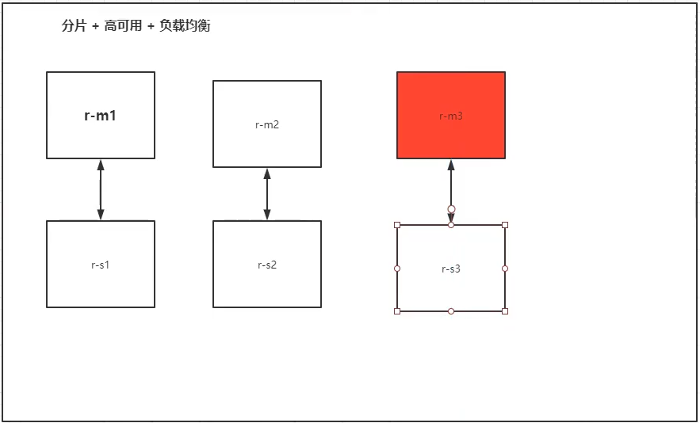

# 12. SpringBoot微服务打包Docker镜像

- 1、构建编写springboot项目（在项目中可以正常运行）：本地自测

  - 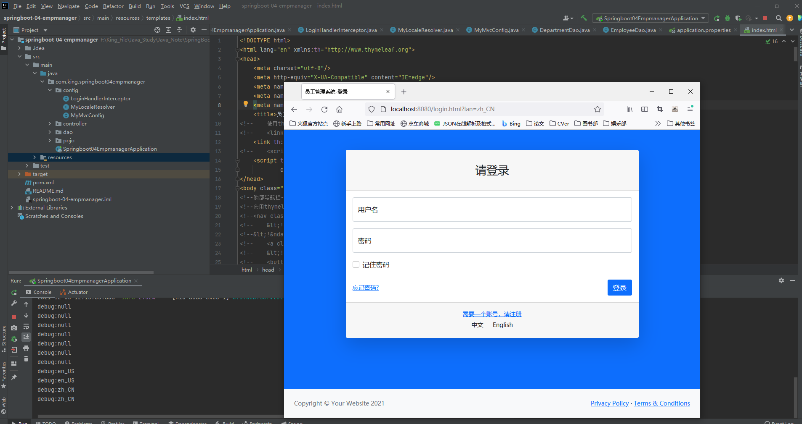

- 2、打包应用：jar自测

  - 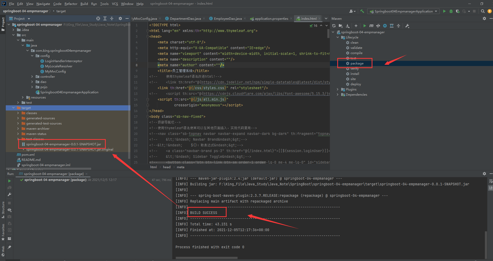
  - 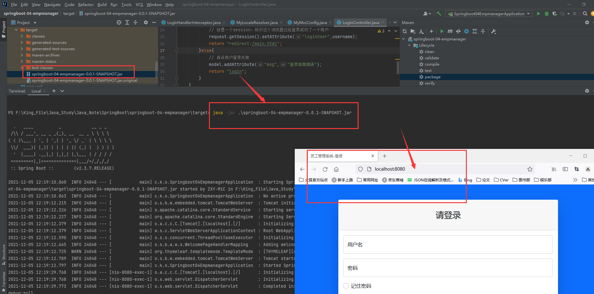

- 3、编写dockerfile

  - 可以在IDEA中下载插件，方便dockerfile的编写
  - 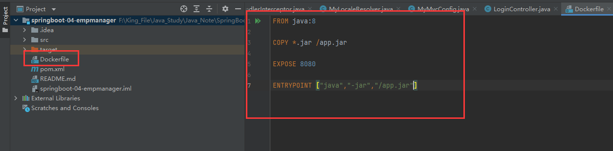

- 4、构建镜像

  - 将jar包和dockerfile拷贝到自己想运行的服务器上即可

  - 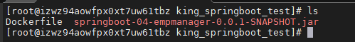

  - ```bash
    [root@izwz94aowfpx0xt7uw61tbz king_springboot_test]# docker build -t springboot_test .
    Sending build context to Docker daemon  20.61MB
    Step 1/4 : FROM java:8
    8: Pulling from library/java
    5040bd298390: Pull complete
    fce5728aad85: Pull complete
    76610ec20bf5: Pull complete
    60170fec2151: Pull complete
    e98f73de8f0d: Pull complete
    11f7af24ed9c: Pull complete
    49e2d6393f32: Pull complete
    bb9cdec9c7f3: Pull complete
    Digest: sha256:c1ff613e8ba25833d2e1940da0940c3824f03f802c449f3d1815a66b7f8c0e9d
    Status: Downloaded newer image for java:8
     ---> d23bdf5b1b1b
    Step 2/4 : COPY *.jar /app.jar
     ---> 0b748ac6c948
    Step 3/4 : EXPOSE 8080
     ---> Running in 04d049445fd1
    Removing intermediate container 04d049445fd1
     ---> ec52ba1b12b2
    Step 4/4 : ENTRYPOINT ["java","-jar","/app.jar"]
     ---> Running in 433473bd9407
    Removing intermediate container 433473bd9407
     ---> b3e594bdf7da
    Successfully built b3e594bdf7da
    Successfully tagged springboot_test:latest
    [root@izwz94aowfpx0xt7uw61tbz king_springboot_test]# docker images
    REPOSITORY        TAG       IMAGE ID       CREATED         SIZE
    springboot_test   latest    b3e594bdf7da   5 seconds ago   664MB
    my_tomcat         latest    7417e1dccbf7   3 hours ago     675MB
    tomcat            latest    49842ef82091   38 hours ago    680MB
    centos            latest    5d0da3dc9764   2 months ago    231MB
    java              8         d23bdf5b1b1b   4 years ago     643MB
    [root@izwz94aowfpx0xt7uw61tbz king_springboot_test]#
    
    ```

- 5、发布运行

  - ```bash
    [root@izwz94aowfpx0xt7uw61tbz king_springboot_test]# docker run -d -p 3344:8080 --name king_springbootweb springboot_test
    c2f761cafde46e589893bb7f9707d94092469405a0ca25a0550a83542efd5f36
    [root@izwz94aowfpx0xt7uw61tbz king_springboot_test]# curl localhost:3344
    <!DOCTYPE html>
    ```

  - 外网访问：

    - 阿里云服务器配置要开启对应端口（阿里云开启一下，服务器里面开启一下）

  - 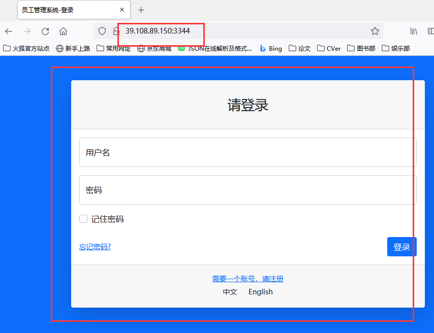

- 问题：
  - 如果有很多镜像怎么办？怎么启动、维护？？？
  - Docker Compose
  - Docker Swarm!

