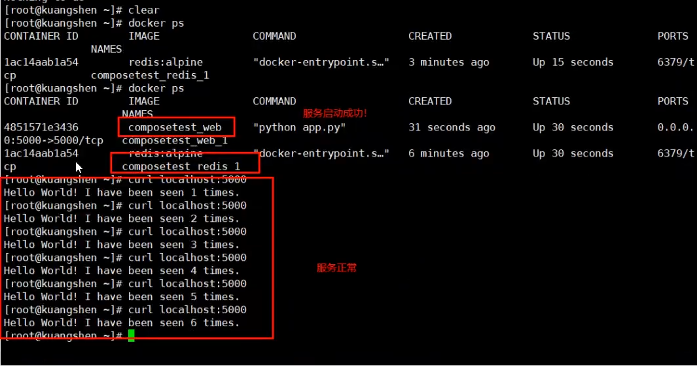
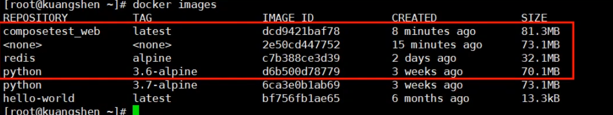
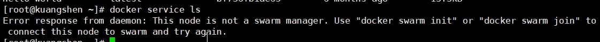
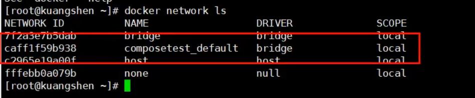
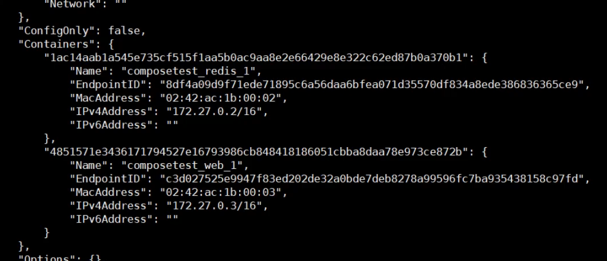
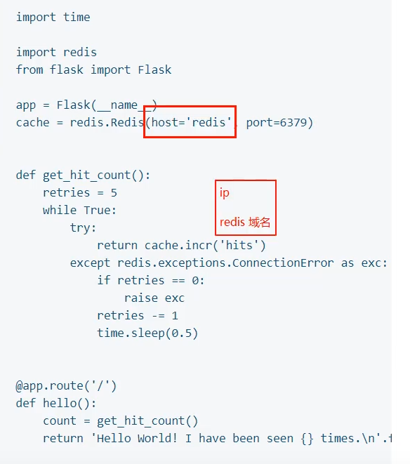
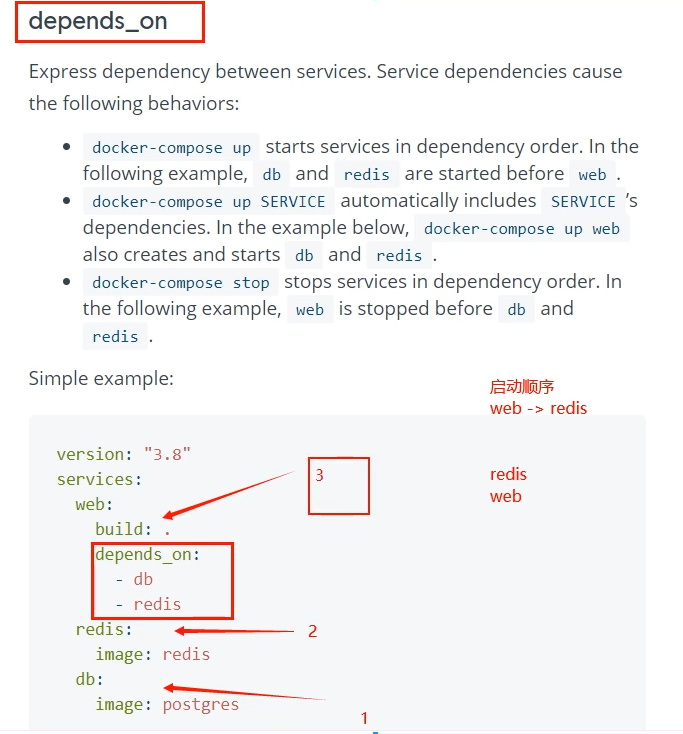
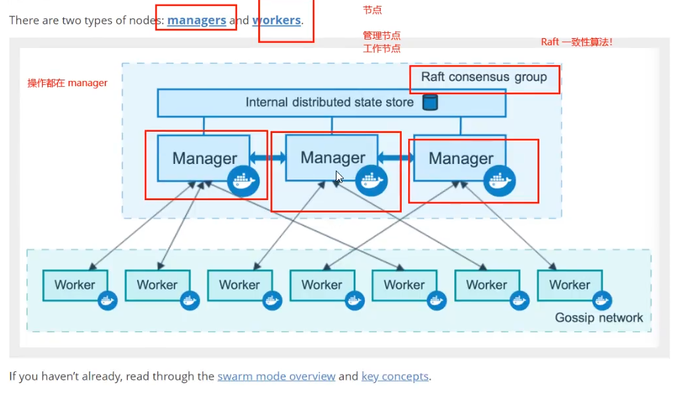
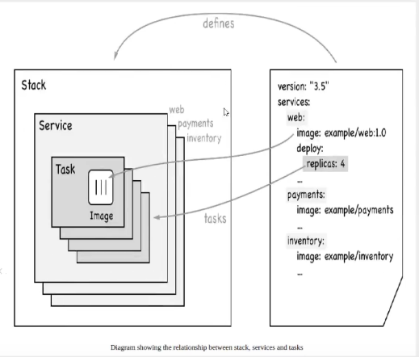

# Docker进阶

- 主要参考自：
  - https://www.bilibili.com/video/BV1kv411q7Qc?spm_id_from=333.999.0.0

# 1. Docker Compose

- 在此之前，我们如何使用Docker？

  - 项目编码完成，编写DockerFile，build镜像，run容器=》都是手动操作，并且是单个容器
  - 如果有100个微服务，并且还有依赖关系，还是这样做的话就会很麻烦！

- Docker Compose？

  - 可以定义运行多个容器，轻松高效的管理容器
  - 批量容器编排

- 如何学习Docker Compose？

  - 建议看官方文档：https://docs.docker.com/compose/

- 如何使用Docker Compose的功能？

  - 定义Dockerfile保证项目可以在任何地方运行
  - 定义一个服务，并且编写docker-compose.yml文件
  - 启动项目 docker-compose up

- 理解Compose？

  - Compose是Dokcer 官网的开源项目，需要安装

  - docker-compose.yml配置文件示例：

  - ```yaml
    version: "3.9"  # optional since v1.27.0
    services:
      web:
        build: .
        ports:
          - "5000:5000"
        volumes:
          - .:/code
          - logvolume01:/var/log
        links:
          - redis
      redis:
        image: redis
    volumes:
      logvolume01: {}
    
    ```

  - 需要理解什么是service？什么是project？

    - service：服务：也就是一个个的容器、应用(web、redis、mysql...)
    - project：项目：一组关联的容器

## 1.1 安装

看官网：https://docs.docker.com/compose/install/

1. 下载compose二进制文件

   - ```bash
     sudo curl -L "https://github.com/docker/compose/releases/download/1.29.2/docker-compose-$(uname -s)-$(uname -m)" -o /usr/local/bin/docker-compose
     
     # 使用国内镜像
     curl -L https://get.daocloud.io/docker/compose/releases/download/1.24.1/docker-compose-`uname -s`-`uname -m` > /usr/local/bin/docker-compose
     ```

2. 授权

   - ```bash
     sudo chmod +x /usr/local/bin/docker-compose
     ```

3. 验证是否安装成功

   - ```bash
     [root@izwz94aowfpx0xt7uw61tbz bin]# docker-compose --version
     docker-compose version 1.24.1, build 4667896b
     ```

## 1.2 快速开始

- 看官网：https://docs.docker.com/compose/gettingstarted/

- 示例：python应用：计数器：本地代码+redis

- 主要步骤：（官网提供的可能有些问题，需要修改一些地方才能正确运行，建议直接百度）

  - 编写应用：app.py

  - 编写Dockerfile 应用打包为镜像

  - docker-compose.yaml文件：定义整个服务需要的环境(web、redis)完整的上线服务：

    - ```yaml
      version: "3"
      services:
        web:
          build: .
          ports:
            - "5000:5000"
        redis:
          image: "redis:alpine"
      
      ```

  - 启动compose项目：docker-compose up

  - 

  - 停止compose：

    - docker-compose down 或者ctrl+c

- docker-compose up流程：

  1. 创建网络
  2. 执行 docker-compose.yml：
     1. 构建docker-compose.yml中的容器(web、redis！)
  3. 启动容器

- **自动的默认规则：**

  - docker images：自动下载，并且build
    - 
  - 默认的服务名(启动的容器名)：
    - 文件名_ 服务名 _num
    - num：副本的数量，因为未来多个服务器，集群，使用相同的服务的多个运行实例=》高可用，高并发
  - docker service ls：未来学习docker swarm时使用！为了服务集群！
    - 
  - docker network：
    - docker compose会自动创建网络，为了方便容器之间的通信(容器互联)，同一网络下就可以通过域名访问，而不是容易变换的ip地址
    - 
    - docker network inspect composetest_default：
      - 
    - 官方代码：
    - 
    - 在同一网络下，可以直接根据域名来进行通信

- 再次理解compose：

  - 以前都是单个docker run启动容器。
  - docker-compose:通过docker-compose编写 yaml配置文件、可以通过compose一键启动所有服务，停止。

## 1.3 小结

- 到目前为止，已经知道：
  - Docker 镜像=>run=>容器
  - DockerFile=>构建镜像(服务打包)
  - docker-compose 启动项目(编排多个微服务、环境)
  - Docker 网络 

## 1.4 ymal规则

- docker-compose.yaml 是核心！

  - 三层！！！
  - 看官网文档：https://docs.docker.com/compose/compose-file/compose-file-v3/

- ```yaml
  # 3层
  
  version: '' #版本
  service: # 服务 就是之前docker的创建镜像、容器的知识
  	服务1: # 如之前的web
  		# 服务配置
  		imgaes
  		build
  		network
  	服务2: # redis
  		...
  	服务3: # redis
  		...
  # 其他配置：网络、数据卷、全局规则
  volumes: # xxx
  networks:  # xx
  config: # xxx
  ```

- 

## 1.5 搭建WordPress博客

- 官方示例：https://docs.docker.com/samples/wordpress/
- compose应用=>一键启动!
  - 下载项目(docker-compose.yaml)
  - 如果需要文件：编写Dcokerfile
  - 文件准备齐全(直接一键启动项目!) docker-compose up
- 前台启动：docker-compose up
- 后台启动：docker-compose up -d

## 1.6 实战

- 建议看：https://www.bilibili.com/video/BV1kv411q7Qc?p=7

- 主要步骤：

  - 编写项目微服务
  - dockerfile构建镜像
  - docker-compose.yml编排项目
  - 放到服务器上运行： docker-compose up

- 小结：

  - 未来项目只要有docker-compose文件，按照这个规则，启动编排容器即可

  - 公司: docker-compose。直接启动。

  - 网上开源项目: docker-compose一键搞定。

  - 假设项目要重新部署打包

    - ```bash
       docker-compose up --build#重新构建!
      ```

- **总结：**

  - compose：整个项目部署过程可以看成：**容器=》服务=》工程**
  - 工程：project
  - 服务：service（images）
  - 容器：运行实例（container）

# 2. Docker Swarm

- 感觉直接看官网文档吧：https://docs.docker.com/engine/swarm/

## 2.1 环境准备

- 至少4台1核2G服务器
  - 可以在阿里云上按时买：看教程：https://www.bilibili.com/video/BV1kv411q7Qc?p=9&spm_id_from=pageDriver
- 服务器都安装好Docker

## 2.2 Swarm集群搭建

- 看官网文档：https://docs.docker.com/engine/swarm/how-swarm-mode-works/nodes/
- 

## 2.3 Raft协议

- 如果此时是 双主双从情况：如果一个节点挂了，其他节点是否可以使用？
- Raft协议（高可用）：保证大多数节点存活才可以使用，只要>1(集群至少要>3台)

## 2.4 体会

- 使用swarm可以实现：高可用！
  - 弹性、动态扩缩容、集群

## 2.5 概念总结

- 什么是swarm？
  - 集群的管理和编排、docker可用初始一个swarm集群，其他节点可用加入
- 什么是node？
  - 就是docker节点，多个节点就组成了网络集群，节点可以分为：管理者、工作者
- 什么是Service？
  - 任务，可以在节点运行，是核心，用户管理、访问的就是它
- 什么是Task？
  - 容器内的命令，用于操作容器运行或者移动
  - 

# 3. Docker Stack

# 4. Docker Secret

# 5. Docker Config

# 6. 扩展到K8S

- 云原生时代！