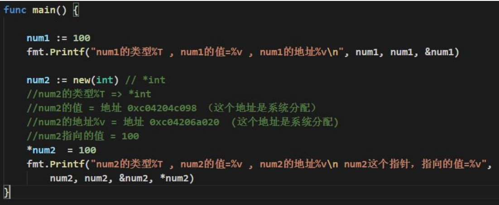
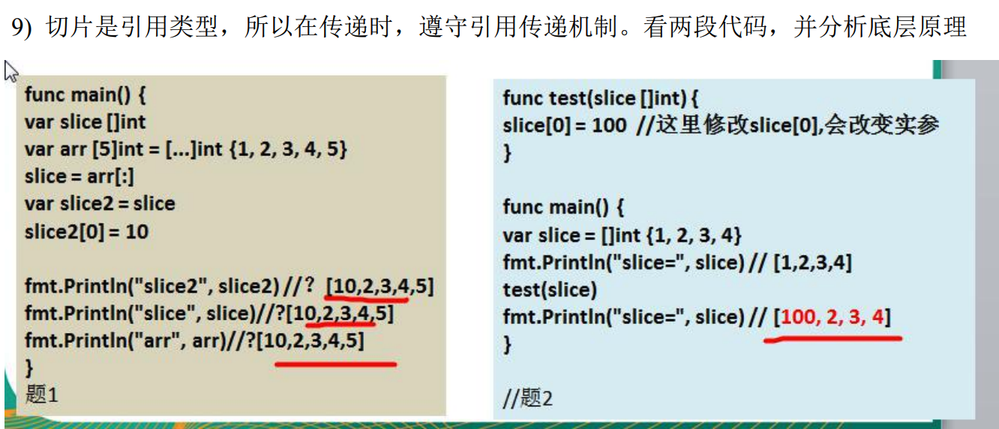
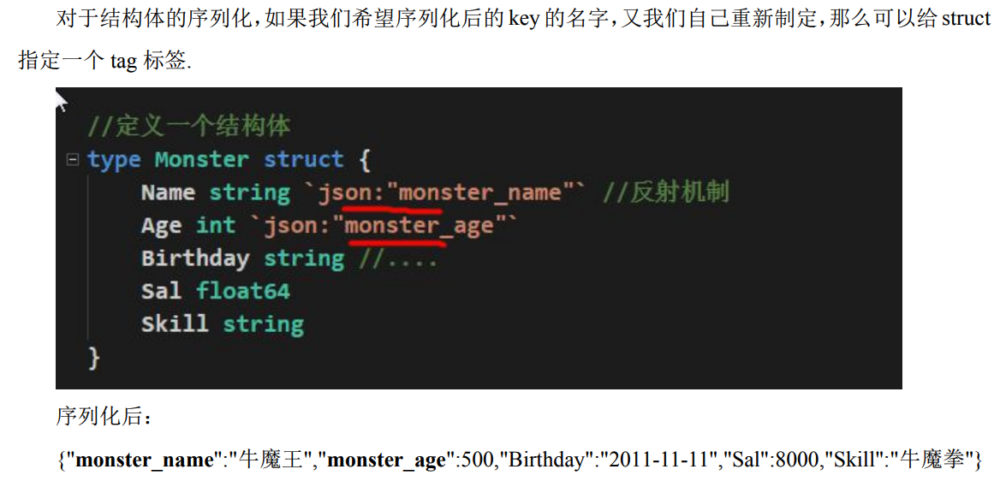
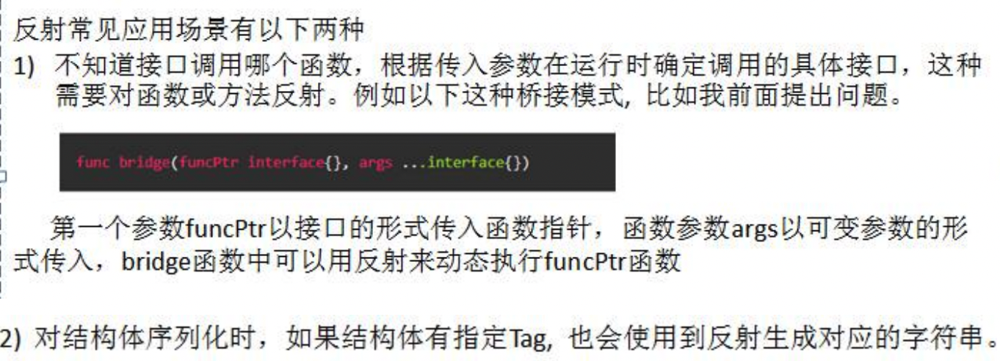

# Golang基础

- 主要参考自：https://www.bilibili.com/video/BV1ME411Y71o?p=7&spm_id_from=333.1007.top_right_bar_window_history.content.click&vd_source=3ba79ba56d08ea906aabe3f4743d3311

- 学习方法：对比Java进行学习！有Python基础

- 总结：语言的学习
  
  - 基本运行：变量、运算、流程控制=>对比Java的异同
  
  - 代码、数据有效复用：函数、包、异常处理、数组、切片、map
  
  - 高内聚低耦合：面向对象
  
  - 数据交互、代码可用：文件、测试

## 1. Go概览

- 是什么？
  
  - 合理利用多核多CPU的语言(C+Python)
  
  - 天然支持高并发+内存管理

- 有什么用？

- 怎么用？

- 注意：
  
  - 使用包的方式来组织程序结构，每个Go语言文件都需要归属于一个包

- 使用vscode编写，命令行编译执行
  
  - 需要安装go的SDK(配好环境)、Vscode
  
  - 命令行编译执行
  
  - go build xxx.go => ./xxx.go
  
  - go run xxx.go

- Go执行流程：
  
  - 
  
  - 可执行文件可以在没有go开发环境的机器上运行
  
  - 
  
  - 一定要有go开发环境

## 2. 变量

- 如何定义变量？如何赋值？初始化？

- 变量基本数据类型
  
  - int(32位系统4byte,64位系统8byte)
  
  - int8(1字节)
  
  - int16(2字节)==> java:short
  
  - int32(4字节)==>java:int
  
  - int64(8字节)==>java:long
  
  - float32==> java:float
  
  - float64==>java:double
  
  - byte(1字节) ==>java:byte =>java:2byte char
  
  - bool(1字节)==>java:int
  
  - string：多个byte组成==>java：多个char、byte组成(java9)

- 复杂数据类型(Java中以对象形式实现)
  
  - 指针
    
    - ```go
      var i int = 10
      var ptr *int = &i;
      // &取地址
      // *ptr取对应地址的值
      ```
  
  - 数组
  
  - 结构体
  
  - 管道
  
  - 函数
  
  - 切片
  
  - 接口
  
  - map

- 类型转换：
  
  - Go需要显式转换、Java会可以自动装包、拆包
  
  - string相互转其他类型都需要对应的方法
    
    - fmt.Sprintf
    
    - strconv

- 值类型和引用类型
  
  - 值类型：可以直接取值的类型，通常在栈中。如基本数据类型、数组、结构体
  
  - 引用类型：直接取值是地址，需要通过*的方式取对应地址的值，通常在堆中。如指针、slice、map、channel、interface

- 变量名、关键字(对比java的public, private)
  
  - 变量名、函数名、常量名
    
    - 首字母大写，可以被其他包访问
    
    - 首字母小写，只能在本包使用

- 访问其他包的变量or方法
  
  - ```go
    // 前置知识
    // GOROOT：Golang的安装路径，安装之后就默认自带了
    // GOPATH：Golang的工作目录
    // 导包运行时出错
    // 查看go的环境配置 go env
    // 方法一：使用go mod模式
    king@kingdeMacBook-Pro main % go env -w GO111MODULE=on   
    king@kingdeMacBook-Pro main % go mod init project01
    king@kingdeMacBook-Pro main % go mod tidy
    // 方法二：不使用go mode模式
    king@kingdeMacBook-Pro main % go env -w GO111MODULE=off
    king@kingdeMacBook-Pro main % go env -w GOPATH=/Users/king/Documents/Go_Study/Go_InitStudy     
    ```

## 3. 运算符

- Go的运算符和python的类似(但是不支持三元运算！)
  
  - 算术运算符
  
  - 赋值运算符
  
  - 比较运算符
  
  - 逻辑运算符 && || !
  
  - 位运算符 & | ^ << >>
  
  - 其他运算符：指针相关的& *

- 键盘输入语句？

- 运算优先级？

## 4. 流程控制

- 语法与Java、Python类似，但是需要大括号
  
  - 顺序控制
  
  - 分支控制
    
    - if、else、
    
    - switch 不用加break，对应了case会自动跳出，
      
      - 并且可以case多个表达式
      
      - fallthrough：switch穿透！
  
  - 循环控制
    
    - for
    
    - while
    
    - do...while
    
    - break、指定标签，退出到指定标签处
    
    - continue、指定标签，跳过指定循环
  
  - goto：调整到指定标签处
  
  - return

## 5. 函数、包、异常处理

- 如何定义函数？
  
  - 

- 函数不支持重载！可以返回多个返回值

- 函数也是一种数据类型，可以赋值给变量调用

- 函数的可变参数？
  
  - 

- 自定义数据类型
  
  - 

- init函数？
  
  - 每个源文件都可以包含一个init函数，在main函数之前执行
  
  - 注意：
    
    - 全局变量定义->init函数->main函数
    
    - init注意完成变量的初始化工作

- 匿名函数？
  
  - 没有名字的函数，一般只调用一次
  
  - 
  
  - 
  
  - 

- 闭包？类似Java中的类(有变量、有方法)！
  
  - 闭包是一个函数和相关的引用环境组合的一个实体
  
  - 
    
    - AddUpper()是一个函数，返回一个函数
    
    - 也可以理解为闭包是一个类，函数是操作，n是字段
  
  - 

- defer？
  
  - 有什么用？为了确保函数执行完能够及时释放资源(数据库、文件资源)
  
  - 
  
  - 在defer将语句放入到栈时，也会将相关的值拷贝入栈

- 函数参数传递方式？
  
  - 值传递：传递值的拷贝
  
  - 引用传递：传递地址的拷贝

- 字符串常用系统函数
  
  - len()
  
  - 返回字符数组：[]rune(str)
  
  - 字符串转整数：strconv.Atoi()
  
  - 整数转字符串：strconv.Itoa()
  
  - 字符串转[]byte：[]byte()
  
  - []byte转字符串：string()
  
  - 进制转换：strconv.FormatInt(value,进制(2,8,16))
  
  - 子串是否在指定字符串中：strings.Contains(str1,str2)
  
  - 字符串中有几个指定的子串：strings.Couunt(str1,str2)
  
  - 不区分大小写的字符串比较：strings.EqualFold(str1,str2)
  
  - 返回子串在字符串第一次出现的index值：strings.Index(str1,str2)
  
  - 返回子串在字符串最后一次出现的index值：strings.LastIndex(str1,str2)
  
  - 将指定子串替换为另一个子串：strings.Replace(str1,str2,str3,n)
  
  - 按照指定的某个字符分割字符串：strings.Split(str1,str2)
  
  - 将字符串字母进行大小写转换：strings.ToLower(str1),strings.ToUpper(str1)
  
  - 将字符串两边的空格去掉：strings.TrimSpace(str1)
  
  - 将字符串两边的指定字符去掉：strings.Trim(str1,str2)
  
  - 判断字符串是否以指定字符串开头：strings.HasPrefix(str1,str2)
  
  - 判断字符串是否以指定字符串结束：strings.HasSuffix(str1,str2)

- 时间和日期相关函数
  
  - time库的使用
  
  - 

- 内置函数
  
  - len()
  
  - new 用来分配内存，主要用来分配值类型
    
    - 
  
  - make用来分配内存，主要用来分配引用类型

- 包？
  
  - 本质是创建不同的文件夹，来存放程序文件
  
  - 作用：区分相同的变量名、函数名、方便管理项目、控制函数变量的作用域

- 包如何使用？
  
  - package打包
  
  - import引入包

- 跨包调用？
  
  - 文件名=包名=小写字母
  
  - import包时一般是从$GOPATH的src开始的
  
  - 希望函数能够被其他包使用，函数、变量名首字母大写！

- 异常处理
  
  - 不支持try...catch...finally...
  
  - 使用的是defer,panic,recover
  
  - Go中可以抛出一个panic异常，然后在defer中通过revocer捕获这个异常，然后正常处理
  
  - 

- 自定义错误
  
  - errors.News("错误说明")，返回一个error类型的值，表示一个错误
  
  - panic内置函数，接收一个interface{}类型的值作为参数，输出错误信息，并且退出函数
  
  - 

## 6. 数组、切片

- 数组定义？遍历？赋值？使用下标(与java、python类似)
  
  - 

- 数组初始化：四种
  
  - 

- 数组遍历
  
  - for+len
  
  - for+range
    
    - 

- 数组定义后
  
  - 类型固定
  
  - 大小固定
  
  - 有默认值
  
  - 函数传递数组大小也要对应一致

- 切片：
  
  - 为什么需要切片？数组不能改变大小
  
  - 切片是什么？
    
    - 是数组的引用，使用和数组类似，长度可以变化

- 如何使用切片？
  
  - 定义一个切片，并且指向一个已经创建好的数组    
    
    - 
  
  - 使用make创建切片
    
    - var 切片名 []type = make([]type,len,[cap])
  
  - 定义一个切片就直接指定一个具体数组，原理和make类似
    
    - var strSlice []string = []string{"a","b"}

- 切片的底层数据结构：
  
  - 
  
  - 是一个指针，保存着对应数据的地址

- 遍历切片和数组一样，for 或者 for range

- 切片可以使用append()追加
  
  - 

- 切片注意：
  
  - 初始化时仍然不可越界
  
  - 定义完后不可使用，因为本身还是空的，需要引用到一个数组或者make一个空间来使用
  
  - 切片还可以切片
  
  - cap是内置函数，统计切片的容量，表示还可以存放多少个元素
  
  - 切片拷贝操作是深拷贝
  
  - 

- string和slice
  
  - string底层也是一个byte数组，所以也可以进行切片处理
  
  - 内存形式
    
    - 
  
  - string不可变，如果要修改字符串，可以先将string->[]byte->修改->重新转换
  
  - 

- 二维数组、内存布局、定义、初始化、遍历

## 7. map

- 什么是map？
  
  - k-v数据结构

- 如何使用？定义？
  
  - var 变量名 map[keytype] valuetype
  
  - 只是声明变量，不会分配内存，需要使用make来分配内存

- keytype可以是什么类型？
  
  - 任何类型
  
  - 除了slice、map、function、因为不可以用==判断

- valuetype可以是什么类型？
  
  - 和keytype一样

- map的三种使用方式
  
  - 
  
  - 
  
  - 

- map的增删改查
  
  - key存在就是改，不存在就是更新
  
  - 删除：delete(map,"key")，存在key就删除，不存在就不删除，也不会报错
  
  - 查：map["key"]

- map遍历：使用for-range形式

- map切片
  
  - 如果切片的数据类型是map，也就是map切片，map的个数就可以动态变化了！
  
  - ```go
    // 声明map切片,类似map的数组
    var mapSlice []map[string]strin
    // 分配空间
    mapSlice = make([]map[string]string,1)
    // 添加元素
    if mapSlice[0]==nil{
        mapSlice[0]=make(map[string]string,2)
        mapSlice[0]["key1"]="value1"
        mapSlice[0]["key2"]="value2"
    
    }
    // 超过切片的空间后，还要添加元素，需要使用append
    newItem := map[string][string]{
        "key3":"value3",
        "key4":"value4"
    }
    mapSlice = append(mapSilce,newItem)
    ```

- map使用细节
  
  - map是引用类型，一个函数在接受map修改后，会直接修改原来的map
  
  - map会自动扩容

## 8. 面向对象编程

- Go也支持OOP，但是不是纯粹的面向对象语言，只是支持面向对象编程特性
  
  - Go没有类，可以使用struct来等同实现
  
  - 所以Go的面向对象十分简洁，没有传统OOP的继承、重栽、构造函数、this指针等
  
  - Go仍然有面向对象的继承、封装、多态的特性

### 8.1 结构体==类

- 是什么？
  
  - 自定义的数据类型，可以代表一类食物
  
  - 结构体变量是具体的

- 如何定义？
  
  - 

- 内存布局？
  
  - 

- 结构体的字段/属性？
  
  - 结构体字段=属性=field，是结构体的组成部分
  
  - 可以是基本类型、数组、引用类型
  
  - 都有默认赋值，引用类型一般默认赋值为nil，如指针、slice、map
  
  - 不同结构体变量的字段是独立的，互不影响，所以也可以说结构体是值类型

- 创建结构体变量和访问结构体字段
  
  - ```go
    type Person struct{
        name string,
        age string
    }
    // 方法一 
    var person Person
    person.name = "aa" 
    person.age = 100
    // 方法二 
    var person2 Person = Person{"aa",100} 
    // 方法三=>结构体指针
    var p3 *Person = new(Preson)
    p3.name = "aa" // 等同于 (*p3).name="aa"
    // 方法四=>结构体指针
    var p4 *Person = &Person{"aa",22}
    ```

- 结构体的内存分配机制
  
  - 和基本类型变量类似，是值类型
  
  - var p2 Person=p1 单纯的=赋值是拷贝，不会同时修改
  
  - var p2 *Person=&p1使用地址赋值是引用，会同时修改
  
  - 结构体的所有字段在内存中是连续的

- 结构体的注意事项
  
  - 如果需要类型转换，需要有完全相同的字段！(名字、个数、类型)
  
  - 结构体的每个字段上可以写上一个tag，可以通过反射机制获取，用于序列号化和反序列化
    
    - 

- 结构体方法？
  
  - Go中的方法是作用在指定的数据类型上的，因此自定义类型都可以有方法
  
  - 
  
  - 表示结构体A有个方法test()
  
  - 
  
  - test方法和Person绑定，只能通过Person类型的变量调用，不能直接调用，也不能使用其他类型变量来调用

- 此时可以明确**函数和方法**的区别！！！

- 方法的调用和传参机制原理
  
  - 与函数类似，不一样的是方法调用是，会调用方法的变量，当作实参传递给方法
  
  - 

- 方法的声明：
  
  - ```go
    func (recevier type)methodName (参数列表) (返回值列表){
        方法体 
        return 返回值
    }
    ```

- 方法的注意事项
  
  - 结构体类型是值类型，在方法调用中是值拷贝传递方式
  
  - 如果希望在方法中改变结构体变量的值，可以通过结构体指针的方式处理
  
  - ```go
    func (recevier *type)methodName (参数列表) (返回值列表){
        方法体 
        return 返回值
    }
    ```
  
  - Go中的方法作用在指定的数据类型上，所以自定义类型都可以有方法，int、float32也可以有方法！
  
  - 方法的访问范围和函数一样！大小写控制包内外访问
  
  - 如果一个类型实现了String()这个方法，fmt.Println默认就会调用这个变量的String()进行输出

### 8.2 工厂模式-构造函数

- 问题：如果结构体名是小写的，如何在其他包使用？

- 工厂模式：专门一个函数来生产类！

- 

- 

- 如果结构体的字段也是小写的怎么办？
  
  - 使用方法来绑定实现
  
  - 

### 8.3 面向对象特性

- 抽象：将一类事务的共有属性、行为抽取出来，形成一个物理模型

- 封装：
  
  - 把抽象的字段和对应字段的操作封装在一起，数据被保护在内部，程序只有通过被授权的操作才能对字段进行操作
  
  - 优点：安全、隐藏实现细节
  
  - 如何体现：结构体属性、方法、包

- 如何实现封装？
  
  - 1、结构体、字段首字母小写
  
  - 2、提供一个首字母大写的工厂模式的函数
  
  - 3、提供一个首字母大写的Set、Get方法

- 继承：
  
  - 用于解决代码复用，提高代码拓展性和维护性
  
  - 当多个结构体存在相同的属性和方法时，可以从结构体中抽象出结构体

- 如何实现继承？
  
  - 一个结构体嵌套另一个匿名结构体，那么该结构体可以直接访问匿名结构体的所有字段和方法(无论是否大小写)，继承特性
  
  - 
  
  - 
  
  - 可以在创建结构体时，直接指定匿名结构体字段的值

- 组合：嵌套有名结构体
  
  - 

- 多重继承
  
  - 一个结构体嵌套了多个匿名结构体！

- 接口？
  
  - interface类型可以定义一组方法，无需实现，并且interface不能包含任何变量。
  
  - 当某个自定义类型要使用时，再根据具体情况把方法实现
  
  - 
  
  - 体现了：多态+高内聚低耦合的思想
  
  - Go中的接口不需要显式实现，只需要一个变量，含有接口类型中的所有方法，这个变量就实现了这个接口

- 接口使用场景：
  
  - 

- 接口注意事项：
  
  - 接口本事不能创建实例，但是可以指向一个实现了该接口的自定义类型的变量
    
    - 
  
  - 一个自定义类型只有实现了某个接口，才能将该自定义类型的变量赋给接口类型
  
  - 只要是自定义数据类型，就可以实现接口，而不仅仅是结构体类型
  
  - 一个自定义类型可以实现多个接口
  
  - 一个接口可以继承多个别的接口
    
    - 
  
  - interface类型默认是一个指针，如果没有初始化就使用，默认是nil
  
  - 空接口interface{}没有任何方法，所以所有类型都实现了空接口，所以外面可以把任何一个变量都赋值给一个空接口
    
    - 

- 接口和继承？
  
  - 接口可以看成对继承的补充
  
  - 继承：解决代码复用性和可维护性，is-a
  
  - 接口：设计好各种规范，like-a，一定程度上实现代码结耦

- 多态：
  
  - 变量具有多种形态
  
  - 在Go中，多态特征是通过接口来实现，可以按照统一的接口来调用不同的实现，这时接口变量就呈现了不同的形态
  
  - 

- 接口体现多态？
  
  - 多态参数(接口参数)
  
  - 多态数组(接口数组)

- 类型断言？
  
  - 为什么需要？考虑如何将一个接口变量赋值给一个自定义变量？
  
  - 
  
  - 何时使用？
    
    - 由于接口是一般类型，不知道具体类型，如果要转成具体类型，就需要使用类型断言
  
  - 

### 8.4 客户管理系统-巩固之前的学习

- 客户信息的增、删、改、查

- 系统架构：model、service、view

- 对象划分：entity、service、view
  
  - Go中的对象实现、方法实现！

## 9. 文件操作

- 什么是文件？
  
  - 数据源的一种

- 输入流和输出流？
  
  - 

- 如何操作文件？
  
  - os.File封装了所有文件相关操作，File是一个结构体

- 基本使用：
  
  - 打开和关闭文件 os.Open()、os.Close()
  
  - 读文件：缓冲区(bufio.NewReader()、.ReaderString()和不带缓冲区(ioutil.ReadFile())
  
  - 写文件：os.OpenFile()、(bufio.NewWriter()、.WriterString()、.Flush()

- 判断文件或者文件夹是否存在？
  
  - os.Stat()
  
  - os.isNotExist()

- 拷贝文件: io.Copy()

- 命令行参数：
  
  - 为什么？运行.exe执行文件时，能够获取命令行输入的参数
  
  - 如何获取命令行参数？
    
    - os.Args：string的切片，用来存储所有的命令行参数
    
    - 
  
  - 使用os.Argas还是比较原生，对解析参数不是特别方便，特别是带有指定参数形式的命令行，所以可以使用flag包来解析命令行参数
  
  - 

- JSON？
  
  - JSON是一种轻量级的数据交换格式，易于阅读编写、机器解析、生成
  
  - 程序再网络传输时会将数据序列化成JSON字符串，接收方接收到后再反序列化恢复成原来的数据类型

- JSON数据格式：
  
  - JSON一般使用健值对的方式保存数据
  
  - key使用双引号包裹，使用：分离，再接着value

- JSON 序列化：结构体、map、切片
  
  - json.Marshal()
  
  - 

- JSON反序列化：
  
  - json.UnMarshal()

## 10. 单元测试

- 传统单元测试的问题：
  
  - 不方便：每次都要修改main函数，
  
  - 不利于管理：测试多个模块时都要写main函数

- 单元测试-testing
  
  - Go中自带的轻量级测试框架testing+自带的go test命令可以实现单元测试和性能测试
  
  - 有什么用？
    
    - 通过单元测试
    
    - 确保每个函数但是可运行的，并且运行结果是正确的
    
    - 确保写出来的代码性能是好的
    
    - 能够及时发现程序的逻辑错误，以及性能指标

- 如何使用？
  
  - 规范测试用例文件名、测试用例函数
  
  - 参数类型固定、测试用例指令
  
  - 日志保存

- 具体实例：
  
  - 

## 11. goroutine、channel

- 进程、线程？
  
  - 进程是程序在计算机中的一次执行过程，是系统进行资源分配和调度的基本单位
  
  - 线程是进程的一个执行实例，是程序执行的最小单元，比进程还要小的能独立运行的基本单元
  
  - 一个进程可以创建销毁多个线程，一个进程中的多个线程可以并发执行

- 并发？并行？

- Go 协程和主线程？
  
  - Go主线程：一个Go线程上，可以起多个协程，协程可以理解为更加轻量级的线程(编译器做优化)
  
  - Go协程：(对比线程！)
    
    - 有独立的栈空间
    
    - 共享程序堆空间
    
    - 调度由用户控制

- goroutine快速使用：
  
  - 
  
  - 主线程是一个物理线程，直接作用在CPU上，是重量级的十分耗费CPU资源
  
  - 协程是从主线程开启的，是轻量级线程、是逻辑态，对资源消耗比较少，可以轻松开启上万个协程

- goroutine调度模型？
  
  - MPG模式？
    
    - M：操作系统的主线程
    
    - P：协程执行需要的上下文
    
    - G：协程
  
  - 
  
  - 

- 设置Golang运行的CPU数量？
  
  - 

- channel？
  
  - 解决不同goroutine如何通信问题！

- 多线程、协程运行会出现什么问题？
  
  - 并发、并行的安全问题！
  
  - 共享资源的竞争

- 不同goroutine之间如何通信？
  
  - 全局变量的互斥锁
    
    - 带来的问题？
    
    - 主线程等待所有goroutine全部完成的时间很难确定
    
    - **如果主线程休眠时间过长会增加等待时间，如果等待时间短了，可能还有goroutine处于工作状态，导致随着主线程的退出而销毁**=>可以利用channel来阻塞主线程，等协程全部运行完了再进行下一步
    
    - 通过全局变量加锁同步来实现通信，不利于多个协程对全局变量的读写操作
  
  - channel(可以类比消息队列)
    
    - 本质就是一个队列
    
    - 多goroutine访问时，不需要加锁，先进先出，线程安全
    
    - channel有类型的，只能放指定类型的数据
    
    - 

- 如何使用channel？
  
  - 定义、声明：var 变量名 chan 数据类型
    
    - channel是引用类型，必须初始化才能写入数据，make...
  
  - 存取数据
  
  - 关闭：
    
    - close(channel)
    
    - 关闭后不能写入数据，但是可以读取
  
  - 读取：for-range
    
    - 如果channel没有关闭，会出现deadlock错误
    
    - 如果channel关闭了，会正常遍历完就退出遍历
  
  - 注意：
    
    - channel数据放满后就不能再放入了，不然会报deadlock
    
    - 没有协程的情况下，channel数据全部取出后，就不能再取了，不然会报deadlock
  
  - channel阻塞就会出现deadlock:
    
    - 
    
    - 如果编译器运行时，发现一个管道只有写，没有读，则该管道就会阻塞报deadlock错误
    
    - 如果写管道和读管道频率不一致，一样可以运行，不会报deadlock错误

- 多协程实现大数据的素数判断
  
  - 自己看文档
  
  - 

- channel使用细节和注意事项
  
  - channel可以定义为只读、或者只写性质，默认是双向读写
  
  - select可以解决从管道中取数据阻塞问题
  
  - goroutine可以使用recover解决协程中出现的panic导致整个程序奔溃问题

## 12. 反射

- 什么是反射？
  
  - 反射可以再运行时动态获取变量的各种信息，如类型、类别等
  
  - 通过反射，可以修改变量的值、调用关联的方法

- 如何使用反射？
  
  - 导入import "reflect"
  
  - 

- 反射的使用场景？
  
  - 

- 反射的相关函数和概念
  
  - 
  
  - 

- 反射的注意事项和细节
  
  - 看文档

## 13. TCP编程

- 网络编程
  
  - TCP socket编程：网络编程的主流，底层基于TCP/IP协议
  
  - B/S结构的HTTP编程：使用浏览器访问服务的编程(Go Web)

- TCP socket编程快速入门
  
  - 服务端处理流程
    
    - 监听端口
    
    - 接收客户端的TCP连接
    
    - 创建goroutine，处理这次连接的请求
  
  - 客户端处理流程
    
    - 建立与服务端的了解
    
    - 发送请求数据，接收服务端返回的数据结果
    
    - 关闭连接
  
  - 代码实现(看文档)

## 14. 海量用户实时通讯系统

- 项目开发流程
  
  - 需求分析、设计阶段、编码实现、测试阶段、实施

- 需求分析：
  
  - 用户注册、登陆、显示在线用户、
  
  - 群聊、点对点聊天、离线留言

- 设计阶段：
  
  - 界面设计

- 编码实现
  
  - 技术选型：Go+Redis

- Redis的基本使用
  
  - 五大常用数据类型:string、list、hash、set、zset

- Golang操作Redis
  
  - 使用第三方开源的redis库
  
  - 再GOPATH路径下执行安装指令：
  
  - ```bash
    (base) king@kingdeMacBook-Pro Go_InitStudy % go get github.com/garyburd/redigo/redis 
    ```
  
  - 使用Golang操作redis：基本数据类型的增删改查
  
  - Golang设置redis连接池

- 具体实现：
  
  - 建议看源码实现
