# JVM

- 主要来自B站：尚硅谷JVM全套教程；https://www.bilibili.com/video/BV1PJ411n7xZ?from=search&seid=14830455083399889246

## 1. JVM历史和不同版本公司的JVM

## 2. JVM Overview

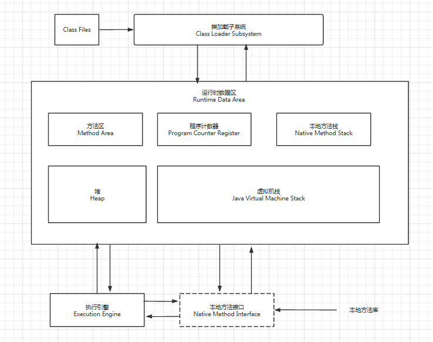

- 更详细的图可以百度！！！

## 3.类加载子系统

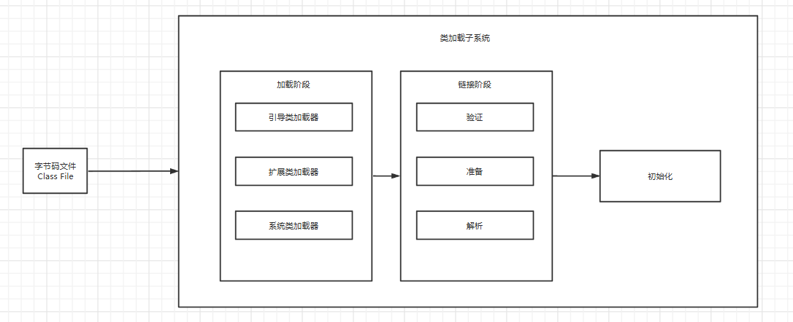 

- 主要功能
  - 从文件系统或者网络中加载Class文件
    - class文件在开头有特定的文件标识
  - 类加载子系统只负责class文件的加载，至于是否可以运行，则由执行引擎决定
  - 加载的类信息存放在运行时数据区的方法区中，可以称为DNA元数据模板
    - 方法区：除了类的相关信息外，方法区还会存放运行时常量池信息(如：字符串字面量、数字常量等(这些常量信息是Class文件中常量池部分的内存映射))
  - .class文件->类加载器->方法区中的元数据模板
    - 类加载器充当快递员的角色，以二进制流的方式运输

### 3.1 加载阶段

- 主要过程
  - 通过一个类的全限定名获取定义此类的二进制字节流
  - 将这个字节流代表的静态存储结构转换为方法区的运行时数据结构
    - 方法区的具体实现
      - jdk1.7及之前：永久代
      - jdk1.8之后：元空间
  - 在内存中生成一个代表这个类的java.lang.Class对象，作为方法区这个类的各种数据的访问入口

### 3.2 链接阶段

- 验证(Verify)
  - 确保class文件的字节流包含信息符合当前虚拟机的要求，确保被加载类的正确性，不会危害虚拟机自身安全
  - 文件格式验证、元数据验证、字节码验证、符号引用验证
- 准备(Prepare)
  - 为类变量(类里面的变量)分配内存并且设置默认初始值(0 or null)
  - final修饰的变量在编译的时候就会分配，因此在准备阶段会显示初始化(已经初始化后，后续直接使用即可)
  - 不会为实例变量(new 类())分配初始化
    - 因为类变量是分配在方法区中，而实例变量会随着对象一起分配到java堆中
- 解析(Resolve)
  - 将常量池中的符号引用转换为直接引用
    - 符号引用：一组符号来描述所引用的目标
    - 直接引用：直接指向目标的指针、相对偏移量、间接定位到目标的句柄
  - 一般伴随着JVM在执行完初始化阶段之后再执行
  - 解析的动作主要针对：类、接口、字段、类方法、接口方法、方法类型、对应常量池中的CONSTANT_Class_info、CONSTANT_Fieldref_info、CONSTANT_Methodref_info等

### 3.3 初始化阶段

- 作用：
  - 执行类构造器方法<clinit>()的过程
    - 类构造器方法无需定义，是javac编译器自动收集类的所有类变量的赋值动作和静态代码块中的语句合并而来
    - 类构造器方法中指令按语句在源文件中顺序执行

```java
public class ClassInitTest{
    private static int num = 1;
    static{
        num = 2;
        number = 20;
        System.out.print(num);
        System.out.print(number);// 会报错：非法的前向引用
    }

    private static int number = 10; // 在链接阶段的准备阶段时。会对number分配内存并且初始化为0；因此在初始化阶段会按源文件顺序执行，因此是先number=20,再赋值为10；
    public static void main(String[] args){
        System.out.println(ClassInitTest.num);// 2
        System.out.println(ClassInitTest.number);//10
    }
}
```

- <clinit>()类构造器方法不同于类的构造器
- 如果该类存在父类，JVM会保证子类的类构造器方法执行前，父类的构造器方法已经执行完毕
- JVM必须保证一个类的类构造器方法在多线程下被同步加锁

### 3.4 加载阶段-类加载器

- JVM分为两种类型的加载器
  - 引导类加载器(Bootstrap ClassLoader)
  - 自定义类加载器(User-Defined ClassLoader)
    - 所有派生于抽象类ClassLoader的类加载器都划分为自定义类加载器
    - 所以：Extension Class Loader、System Class Loader都是用户自定义类加载器

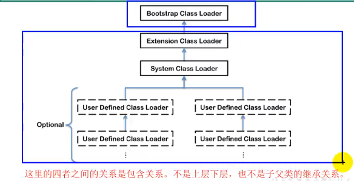

- 对于用户自定义类来说，默认使用系统类加载器进行加载
- 对于String类等Java的核心类库都是使用引导类加载器进行加载

> - 引导类加载器=启动类加载器=Bootstrap ClassLoader
>   - 使用C/C++语言实现，嵌套在JVM内部
>   - 用来加载Java的核心库(JAVA_HOME/jre/lib/rt.jar、resources.jar、sun.boot.class.path路径下的内容)，用于提供JVM自身需要的类
>   - 没有父加载器，不继承自java.lang.ClassLoader
>   - 可以加载扩展类和应用程序类加载器，并且指定为他们的父类加载器
>   - 出于安全的考虑，Bootstrap启动类加载器只加载包名为java、javax、sum等开头的类
> - 扩展类加载器=Extension ClassLoader
>   - 使用Java语言编写，由sun.misc.Launcher$ExtClassLoader内部类实现
>   - 派生于ClassLoader类
>   - 父类加载器为启动类加载器
>   - 从java.ext.dirs系统属性所指定的目录下或者JDK的jre/lib/ext子目录下加载类库。如果用户创建的jar也放在这些目录下，也会被扩展类加载器自动加载
> - 系统类加载器=应用程序类加载器=AppClassLoader
>   - 使用Java语言编写，由sun.misc.Laundcher$AppClassLoader实现
>   - 派生于ClassLoader类
>   - 父类加载器为扩展类加载器 
>   - 负责加载环境变量classpath或者系统属性java.class.path指定路径下的类库
>   - 是程序中默认的类加载器，java应用的类都是由它来完成加载的
>   - 通过ClassLoader.getSystemClassLoader()方法可以获取到该类加载器

```java
public class ClassLoaderTest1 {
    public static void main(String[] args) {
        System.out.println("启动类加载器");
        // 获取BootstrapClassLoader能够加载的api的路径
        URL[] urLs = Launcher.getBootstrapClassPath().getURLs();
        for(URL url:urLs){
            System.out.println(url.toExternalForm());
        }
        // 从上面的路径中随机选择一个类，看看它的加载器是什么
        ClassLoader classLoader = Provider.class.getClassLoader();
        System.out.println(classLoader);


        System.out.println("扩展类加载器");
        String property = System.getProperty("java.ext.dirs");
        for(String path:property.split(";")){
            System.out.println(path);
        }

        // 从上面的路径中随机选择一个类，看看它的加载器是什么
        ClassLoader classLoader1 = CLDRLocaleDataMetaInfo.class.getClassLoader();
        System.out.println(classLoader1);
    }
}
```

#### 3.4.1 用户自定义类加载器

- 为什么需要自定义类加载器？
  - 隔离加载类 
  - 修改类的加载方式
  - 扩展加载源
  - 防止源码泄露
- 如何实现自定义类加载器？
  - 继承抽象类java.lang.ClassLoader类的方式，实现自定义类的加载，以满足一些特殊的需求
  - 在JDK1.2之前，在自定义类加载器时，总会继承ClassLoader类并且重写loadClass方法，从而实现自定义类的加载。在JDK1.2之后，不建议用户去覆盖loadClass()方法，而是建议把自定义类的加载逻辑写在findClass()方法中。
  - 在编写自定义类加载器时，如果没有太过复杂的需求，可以直接继承URLClassLoader类，以避免自己去编写findClass()方法及其获取字节码流的方式，使自定义类加载器编写更加简洁

#### 3.4.2 关于ClassLoader

- ClassLoader类：是一个抽象类，处理引导类加载器，其他所有的类加载器都继承自ClassLoader
- 相关的方法不是抽象方法，是可以直接使用的，具体看源码
- sun.misc.Launcher是JVM的入口应用
- 获取ClassLoader的几种途径

```java
public class ClassLoaderTest2 {
    public static void main(String[] args) {
        try {
            // 1.获取当前类的ClassLoader
            ClassLoader classLoader = Class.forName("java.lang.String").getClassLoader();
            System.out.println(classLoader);

            // 2.获取当前线程上下文的ClassLoader
            ClassLoader contextClassLoader = Thread.currentThread().getContextClassLoader();
            System.out.println(contextClassLoader);

            // 3.获取系统的ClassLoader
            ClassLoader parent = ClassLoader.getSystemClassLoader().getParent();
            System.out.println(parent);

            // 4.获取调用者的ClassLoader
//            DriverManager.getCallerClassLoader()
        } catch (ClassNotFoundException e) {
            e.printStackTrace();
        }
    }
}
```

### 3.5 双亲委派机制

- 为什么需要？
  - JVM对class文件采用的是按需加载的方式，即当需要使用该类时才会将它的class文件加载到内存中生成class对象
  - 加载某个类的class文件时，JVM采用的就是双亲委派机制，即把请求交给父类处理。是一种任务委派模式
- 思考？

> - 自己定义一个java.lang.String的类，然后在静态代码块中打印输出语句=如果这个类会加载，则会打印这条语句，因为静态代码块是在类加载子系统中的初始化阶段由<clinit>方法构造执行
> - 如果会加载到这个类，就意味着程序员写代码需要避开这些核心api的名字和路径等，同时影响项目的安全性等
> - 因此：采用的是双亲委派机制

- 工作原理
  - 如果一个类加载器收到了类加载请求，不会自己先去加载，而是将这个请求委托给父类的加载器去执行
  - 如果这个父类的加载器还有父类加载器，那么继续向上委托，直到达到顶层的启动类加载器
  - 如果启动类加载器可以完成委托，就成功加载并返回，如果不能再不断向下委托加载，也即是子加载器尝试自己去加载

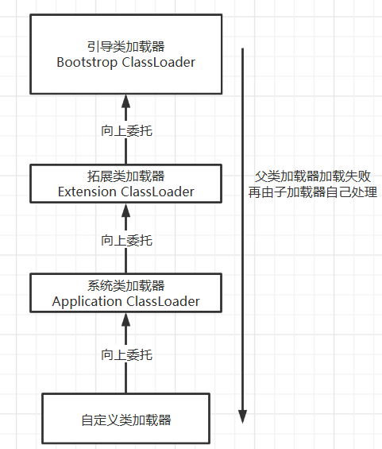

- 如：接口可以由引导类加载器加载，具体接口的实现类可以由系统类加载器加载
- 优点
  - 避免类的重复加载
  - 保护程序安全，防止核心API被随意篡改

### 3.6 沙箱安全机制

- 由上文说到：自定义String类并且编写main方法，但是在加载自定义的String类的时候会先使用引导类加载器加载，而引导类加载器在加载的过程中会先加载jdk自带的文件(rt.jar下面的java/lang/String.class)，因此会报错说没有mian方法，因为加载的是rt.jar包中的String类，这样可以保证对java核心源代码的保护，这就是沙箱安全机制。

### 3.7 一些问题

- 两个class对象是否为同一个类的必要条件
  - 类的完整包名必须一致，包括包名
  - 加载这个类的ClassLoader必须相同
- 也就是说，在JVM中，这两个类对象来源于同一个Class文件，并且被同一个虚拟机加载，但只要加载它们的ClassLoader实例对象不同，那么这两个类的对象也是不相等的。
- 对类加载器的引用
  - JVM必须知道一个类型(DNA元数据模板)是由启动类加载器加载还是由用户自定义类加载器加载的
  - 如果一个类型是由用户类加载器加载，那么JVM会将这个类加载器的一个引用作为类型信息((DNA元数据模板)的一部分保存在方法区中
  - 当解析一个类型到另一个类型的引用时，JVM需要保证这两个类型的类加载器是相同的(待续)
- 类的主动使用和被动使用（待续）
  - 主动使用：分七种情况
    - 创建类的实例
    - 访问某个类或接口的静态变量，或者对静态变量赋值
    - 调用类的静态方法
    - 反射=Class.forName()...
    - 初始化一个类的子类
    - JVM启动时被标明为启动类的类
    - JDK7开始提供的动态语言支持
      - java.lang.invoke.MethodHandle实例的解析结果，REF_getStatic、REF_putStatic、REF_invokeStatic句柄对应的类没有初始化，则初始化
  - 除了以上七种情况，其他使用Java类的方式都被看做是对类的被动使用，都不会导致类的初始化
    - 也即不会导致类加载子系统中的初始化阶段，不会使用<clinit>方法对类的变量和静态代码块进行赋值

## 4. 运行时数据区

- 主要就是如何划分内存，管理内存
- 内存是什么？
  - 非常重要的系统资源，是硬盘和CPU的中间仓库及桥梁，承载着操作系统和应用程序的实时运行
- JVM内存布局规定了Java在运行过程中内存申请、分配、管理的策略，保证JVM的高效稳定运行

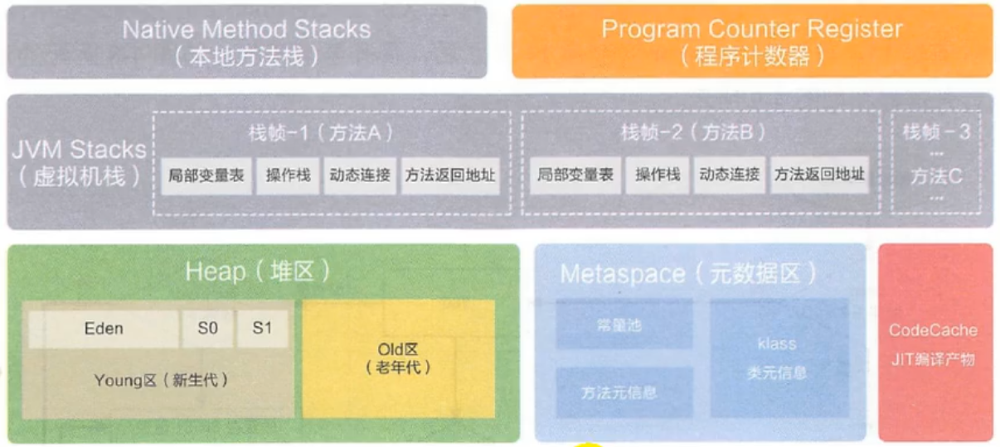

- JVM定义了几种程序运行期间会使用到的运行时数据区
  - 有一些会随着JVM启动而创建，随着JVM退出而销毁（进程）
  - 有一些则是与线程一一对应，随着线程的开始和结束而创建和销毁
- 每个线程：独立包括程序计数器、栈、本地方法栈
- 进程中包含若干个线程，所以线程中共享：堆、堆外内存(元空间(永久代、方法区)、代码缓存)
- Class Runtime
  - 每个JVM只有一个Runtime实例，也就是运行时环境，相对于内存结构中的：运行时数据区

### 4.1 线程

- 线程是程序里的运行单元，JVM允许一个应用有多个线程并行的执行
- 在Hotspot JVM中，每个线程都与操作系统的本地线程直接映射。
  - 当一个Java线程准备好执行以后，此时一个操作系统的本地线程也同时创建，Java线程执行终止后，本地线程也会回收
- 操作系统负责所有线程的安排调度到任何一个可用的CPU上，一旦本地线程初始化成功，就会调用Java线程中的run()方法。
- 在Hotspot JVM中主要的后台系统线程(守护线程)：待续
  - 虚拟机线程：这种线程的操作是需要JVM达到安全点才会出现...
  - 周期任务线程：这种线程是时间周期事件的体现，一般用于周期性操作的调度执行
  - GC线程：这种线程对在JVM里不同种类的垃圾收集行为提供支持
  - 编译线程：这种线程在运行时会将字节码编译成本地代码
  - 信号调度线程：这种线程接收信号并发送给JVM，在它内部通过调用适当的方法进行处理

### 4.2 程序计数器

- JVM中的程序计数寄存器(Program Counter Register)中，Register的命名源于CPU的寄存器，寄存器用于存储指令相关的现场信息，CPU只有把数据装载到寄存器才能够运行
- JVM中的PC寄存器是软件层面的，是对物理PC寄存器的一种抽象模拟
- 作用
  - 用来存储指向下一条指令的地址，也即将要执行的指令代码，由执行引擎读取下条指令

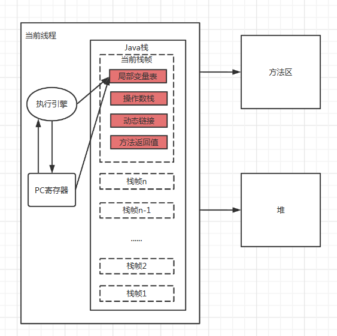

- 所以程序计数器是一块很小的内存空间，几乎可以忽略不计，也是运行速度最快的存储区域
- 每个线程都有自己的程序计数器，是线程私有的，生命周期与线程的生命周期保持一致
- 任何时间一个线程都只有一个方法在执行(当前方法，当前栈帧)，程序计数器会存储当前线程正在执行的Java方法的JVM指令地址，如果在执行native方法，则要调用本地方法栈，因此是未指定值(undefined)
- 也可以说是：程序控制流的指示器，分支、循环、跳转、异常处理、线程恢复等基础功能都需要依赖这个计数器来完成
  - 字节码解释器工作时就是通过改变这个计数器的值来选取下一条需要执行的字节码指令
  - 是唯一一个在JVM中没有规范任何OutOfMemoryError情况的区域
- 代码示例

```java
Class Test{
    public static void main(String[] args){
        int i = 10;
        int j = 20;
        int k = i+j;

        String s = "abc";

        System.out.println(i);
        System.out.println(k);
    }
}
```

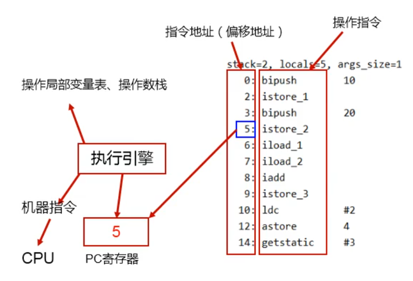

- 使用javap -v name.class查看字节码文件中的main的具体指令可以看到如上所示

> - 两个面试的问题：
> - 使用PC寄存器存储字节码指令有什么用？为什么要使用PC寄存器记录当前线程的执行地址？
>   - 因为CPU需要不停的切换各个线程，这时候切换回来以后，就得知道接着要从哪开始继续执行
>   - JVM的字节码解释器就需要通过改变PC寄存器的值来明确下一条应该执行什么样的字节码指令
> - PC寄存器为什么会被设定为线程私有？
>   - 我们都知道所谓的多个线程在特定时间段内只会执行其中某个线程的方法，CPU会不停的做任务切换，这样必然导致经常中断或回复，如何保证分毫无差呢？
>     - 为了能够准确的记录各个线程正在执行的当前字节码指令地址，最好的办法自然是为每个线程都分配一个PC寄存器，这一来各个线程之间便可以独立计算，从而不会出现相互干扰的情况
> - CPU时间片：
>   - 就是CPU分配给各个程序执行的时间，每个线程被分配一个时间段，称为这个线程的时间片
> - 并行：相比于串行，当系统有一个以上CPU时，当一个CPU执行一个进程时，另一个CPU可以执行另一个进程，两个进程互不抢占CPU资源，可以同时进行，这种方式我们称之为并行(Parallel)。
> - 并发：在操作系统中，指一个时间段中有几个程序都处于已启动运行到运行完毕之间，且这几个程序都是在同一个处理机上运行

### 4.3 栈

- 为什么需要虚拟机栈？
  - 因为不同平台架构不同，所以不能设计为基于寄存器的指令，为了跨平台性的设计，Java的指令都是根据栈来设计
  - 优点：跨平台、指令集小、编译器容易实现
  - 缺点：性能下降、实现同样的功能需要更多的指令
- 栈和堆的区分？
  - 栈是运行时的单位：栈解决程序的运行问题，即程序如何执行，如何处理数据
  - 堆是存储的单位：堆解决的数据存储问题，即数据怎么放、放在哪儿
- 什么是Java虚拟机栈？
  - Java Virtual Machine Stack：早期也叫Java栈，每个线程在创建时都会创建一个虚拟机栈，其内部保存一个个的栈帧(Stack Frame)，对应着一次次的Java方法调用，是线程私有的
  - 生命周期和线程一致
  - 作用：主管Java程序的运行，它保存方法的局部变量（八种数据类型、对象的引用地址）、部分结果、并参与方法的调用和返回。
- 变量的划分：
  - 局部变量 vs 成员变量(类的属性)
  - 基本数据变量 vs 引用类型变量(类、数组、接口)
- 栈的特点：
  - 一种快速有效的分配存储方式，访问速度仅次于程序计数器
  - JVM直接对Java栈的操作只有两个：
    - 每个方法执行，伴随着进栈(入栈、压栈)
    - 执行结束后的出栈工作
  - 对栈来说不存在垃圾回收问题，但是存在OOM问题
- 栈可能出现的异常：
  - JVM允许Java栈的大小是动态或者固定不变的
    - 如果采用固定大小的Java栈，那么每个线程的JVM栈容量可以在线程创建的时候独立选定，如果线程请求分配的栈容量超出栈允许的最大容量，JVM将会抛出一个StackOverflowError异常
    - 如果采用动态扩展的Java栈，在尝试扩展的时候无法申请到足够的内存，或者在创建新的线程时没有足够的内存去创建对应的虚拟机栈，JVM将会抛出一个OutOfMemoryError异常
- 设置栈内存大小
  - 使用参数-Xss来设置线程的最大栈空间，栈的大小直接决定了函数调用的最大可达深度
  - 在idea中的运行配置里的vm optional 中输入-Xss参数即可，具体可看官方文档：https://docs.oracle.com/en/java/javase/11/tools/java.html#GUID-3B1CE181-CD30-4178-9602-230B800D4FAE

#### 4.3.1 栈的存储单位

- 栈中存储着什么？
  - 每个线程都有自己的栈，栈中的数据都是以栈帧(Stack Frame)的格式存在
  - 在这个线程上正在执行的每个方法都各自对应一个栈帧(Stack Frame)
  - 栈帧是一个内存区块，是一个数据集，维系着方法执行的过程和各种数据信息
- 栈的运行原理：
  - JVM直接对Java栈的操作只有两个：对栈帧的压栈和出栈，遵循“先进后出”原则
  - 在一条活动线程中，一个时间点上，只会有一个活动的栈帧。即只有当前正在执行的方法的栈帧(栈顶栈帧)是有效的，这个栈帧被称为当前栈帧(Current Frame)，与当前栈帧对应的方法就是当前方法(Current Method)，定义这个方法的类就是当前类(Current Class)
  - 执行引擎运行的所有字节码指令只针对当前栈帧进行操作。
  - 如果该方法中调用了其他方法，对应的新的栈帧就会被创建出来，放在栈的顶端，成为新的当前栈帧
  - 不同线程中所包含的栈帧是不允许存在相互引用的，即不可能在一个栈帧中引用另一个线程的栈帧
  - 如果当前方法调用了其他方法，方法返回之际，当前栈帧会传会此方法的执行结果给前一个栈帧，接着虚拟机会丢弃当前栈帧，使得前一个栈帧重新成为当前栈帧
  - Java方法有两种返回函数的方式
    - 一种是正常的函数返回，使用return指令
    - 一种是抛出异常
    - 不管哪一种方式，都会导致栈帧被弹出

#### 4.3.2 栈帧的内部结构

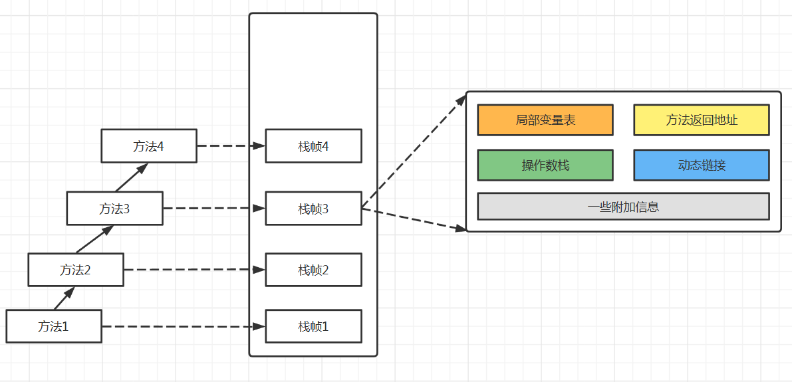

- 局部变量表(Local Variables)
- 操作数栈(Operand Stack)(表达式栈)
- 动态链接(Dynamic Linking)(指向运行时常量池的方法引用)
- 方法返回地址(Return Address)(方法正常退出或异常退出的定义)
- 一些附加信息

> 局部变量表：=局部变量数组=本地变量表
> 
> - 定义为一个数字数组，用于存储方法参数和定义在方法内的局部变量，这些数据类型包括各种基本数据类型、对象引用(reference)，以及returnAddress类型
> - 由于局部变量表是建立在线程的栈上，是线程私有的数据，因此不存在数据安全问题
> - 局部变量表所需的容量大小是在编译期确定下来的，并保存在方法的Code属性的maximun local variables数据项中，在方法运行期间是不会改变局部变量表的大小
> - 局部变量表中的变量只在当前方法调用有效，在方法执行时，JVM通过使用局部变量表完成参数值到参数变量列表的传递过程，当方法调用结束后，随着方法栈帧的销毁，局部变量表也会随之销毁。
> - 关于Slot的理解
>   - 局部变量表最基本的存储单元是Slot（变量槽）
>   - 参数值的存放总是在局部变量数组的index0开始，到数组长度-1的索引结束
>   - 局部变量表中存放编译期可知的各种基本数据类型(8种)、引用类型(reference)、returnAddress类型的变量
>   - 在局部变量表里，32位以内的类型(returnAddress类型)只占一个slot、64位的类型(long、double)占用两个slot
>     - byte、short、char、boolean在存储前会被转换为int,
>   - JVM会为局部变量表中的每一个slot分配一个访问索引，通过这个索引即可成功访问到局部变量表中指定的局部变量的值(占两个slot的一般通过前一个索引来访问)
>   - 当一个实例方法被调用的时候，它的方法参数和方法体内部定义的局部变量将会按照顺序被复制到局部变量表中的每一个slot中
>   - 如果当前帧是由构造方法或者实例方法创建的，那么该对象引用this将会存放在index为0的slot处，其余的参数按照参数表顺序继续排列
>   - Slot的重复利用
>     - 栈帧中的局部变量表的slot是可以重复利用的，如果一个局部变量过了其作用域，那么在其作用域之后申明的新的局部变量就很有可能会复用过期局部变量的槽位，从而达到节省资源的目的。
>   - 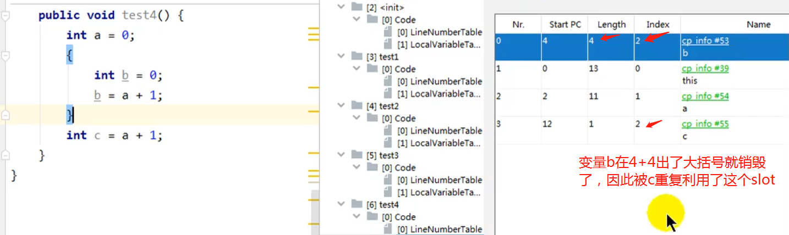
> - 在栈帧中，与性能调优关系最为密切的就是局部变量表
>   - 因为在方法执行时，JVM使用局部变量表完成方法的传递
>   - 局部变量表中的变量也是重要的垃圾回收根节点，只要被局部变量表中直接或间接引用的对象都不会被回收

- 变量的分类
  - 按照数据类型分类：基本数据类型、引用数据类型
  - 按照在类中声明的位置分：
    - 成员变量：在使用前都经历过默认初始化
      - 类变量(static修饰)：链接阶段的准备阶段：会给类变量默认赋值，在初始化阶段：类变量显式赋值，即静态代码块赋值
      - 实例变量：随着对象的创建，会在堆空间中分配实例变量空间，并且进行默认赋值
    - 局部变量：在使用前，必须要进行显示赋值，否则编译不通过

> 操作数栈：=表达式栈(Expression Stack)
> 
> - 在方法执行过程中，根据字节码指令，往栈中写入数据或提取数据，即入栈(push)\出栈(pop)
>   - 某些字节码指令将值压入操作数栈，其余的字节码指令将操作数取出栈，使用它们后再把结果压入栈
>   - 如：复制、交换、求和等操作
> - 作用：
>   - 用于保存计算过程的中间结果，同时作为计算过程中变量临时的存储空间
> - 构成：
>   - 数组结构
> - 操作数栈就是JVM执行引擎的一个工作区，当一个方法刚开始执行的时候，一个新的栈帧也会随之被创建出来，这个方法的操作数栈就空的
> - 每一个操作数栈都会拥有一个明确的栈深度用于存储数值，其所需的最大深度在编译期就定义好了，保存在方法的Code属性中，为max_stack的值
> - 栈中的任何一个元素都是可以任意的Java数据类型
>   - 32bit的类型占用一个栈单位深度
>   - 64bit的类型占用两个栈单位深度
> - 操作数栈并非采用访问索引的方式来进行数据访问的，而是只能通过标准的入栈、出栈操作来完成一次数据访问
> - 如果被调用的方法带有返回值，其返回值将会被压入当前栈帧的操作数栈中，并更新PC寄存器中的下一条需要执行的字节码指令
> - 操作数栈中的元素的数据类型必须与字节码指令的序列严格匹配，这由编译器在编译期间进行验证，同时在类加载过程中的类校验阶段的数据流分析阶段要再次验证
> - JVM的解释引擎是基于栈的执行引擎：栈指的就是操作数栈
> - 代码追踪：了解字节码指令如何操作局部变量表和操作数栈
>   - 更多可以看尚学堂JVM视频P53https://www.bilibili.com/video/BV1PJ411n7xZ?p=54&spm_id_from=pageDriver
>   - 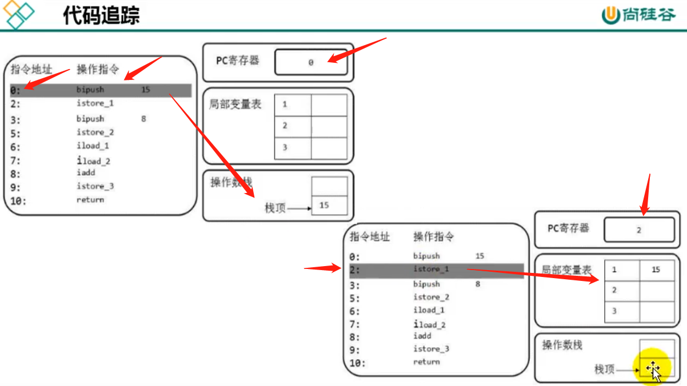

- 栈顶缓存技术
  - 为什么需要这个技术？
    - 零地址指令：无需地址
    - 基于栈式架构的虚拟机使用的是零地址指令，更加紧凑，但完成一项操作的时候必然需要更多的入栈和出栈的指令，就意味着需要更多的指令分派次数和内存读/写次数
    - 由于操作数是存储在内存中的，因此频繁的执行内存读写操作必然会影响执行速度
    - 为了解决这一问题，HotSpot JVM使用栈顶缓存技术，将栈顶元素全部缓存到物理cpu的寄存器中，以降低对内存的读写次数，提升执行引擎的执行效率

> 动态链接：Dynamic Linking（指向运行时常量池的方法引用）
> 
> - 每个栈帧内部都包含一个指向运行时常量池中该栈帧所属方法的引用，包含这个引用的目的就是为了支持当前方法的代码能够实现动态链接
> - 在Java源文件被编译到字节码文件中时，**所有的变量和方法引用**都作为符号引用保存在class文件的常量池中。
>   - 如：描述一个方法调用了另外的其他方法时，就是通过常量池中指向这个方法的符号引用来表示的，
> - 作用：
>   - 动态链接的作用就是为了将这些符号引用转换为调用方法的直接引用
> - 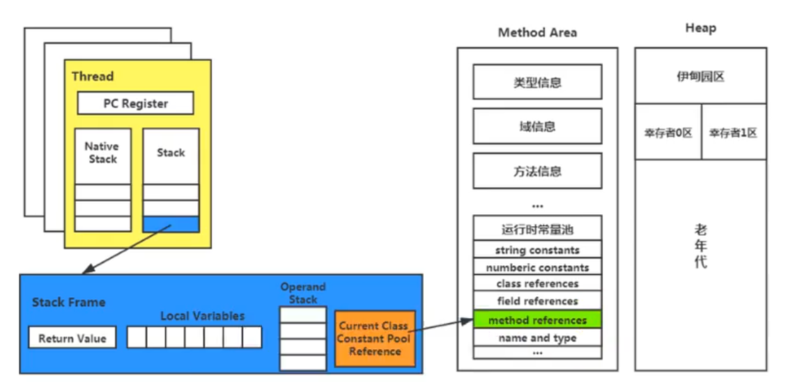

- 为什么需要常量池？
  
  - 为了提供一些符号和常量，便于指令的识别

- 方法的调用
  
  - 在JVM中，将符号引用转换为调用方法的直接引用与方法的绑定机制有关
  
  - 静态链接
    
    - 当一个字节码文件被装载到JVM内部时，如果**被调用的目标方法在编译期可知**，并且运行期保持不变，这种情况下将调用方法的符号引用转换为直接引用的过程称之为静态链接
  
  - 动态链接
    
    - 如果被调用的方法在**编译期无法被确定下来**，也就是说，只能够在程序运行期将调用方法的符号引用转换为直接引用，由于这种引用转换过程具备动态性，就被称之为动态链接
  
  - 对应方法的绑定机制：
    
    - 绑定是一个字段、方法或者类在符号引用被替换为直接引用的过程，仅发生一次
    - 早期绑定(Early Binding)：对应于静态链接
      - 指被调用的目标方法在编译期可知，并且运行期保持不变时，即可将这个方法与所属类型进行绑定，这样一来，由于明确了被调用的目标方法究竟是哪一个，因此也就可以使用静态链接的方式将符号引用转换为直接引用
      - 如：调用父类的构造器：因为父类已经知道了，所以表现为早期绑定
    - 晚期绑定(Late Binding)：对应于动态链接
      - 指如果被调用的方法在编译期无法被确定下来，只能够在程序运行期根据实际的类型绑定相关的方法，这种绑定方式被称之为晚期绑定。
      - 一个方法中调用一个类的方法，由于多态的特性，运行期才能确定是哪个类，因此表现为晚期绑定
  
  - 支持封装、继承、多态等面向对象的特性，就自然得具备早期绑定和晚期绑定两种绑定方式
  
  - Java中任何一个普通的方法其实都具备虚函数的特征，相对于c++的虚函数(c++中需要vitrual显示定义)，如果java程序中不希望某个方法拥有虚函数的特征时，可以使用关键字final来标定这个方法。
  
  - 非虚方法与虚方法
    
    - 如果方法在编译期就确定了具体的调用版本，这个版本在运行时是不可变的，这种方法被称为非虚方法
    - 如：静态方法、私有方法、final方法、实例构造器、父类方法
    - 其他方法就被称之为虚方法
      - 如：子类对象的多态性使用前提：类的继承关系、方法的重写
  
  - JVM提供的方法调用指令
  
  - ```java
    // 普通调用指令
    invokestatic：调用静态方法，解析阶段确定唯一方法版本
    invokespecial：调用<init>方法、私有及父类方法、解析阶段确定唯一方法版本
    invokevirtual：调用所有虚方法，此时调用父类的final方法也有可能使用这个指令，但是事实上是非虚方法
    invokeinterface：调用接口方法
    // 动态调用指令
    invokedynamic：动态解析出需要调用的方法，然后执行
    // 前四条指令固化在JVM内部，方法的调用执行不可人为干预，可invokedynamic指令则支持由用户确定方法版本，其中invokestatic、invokespecial指令调用的方法称之为非虚方法，其他的为虚方法(除final修饰的除外)    
    ```
  
  - 关于invokedynamic指令
    
    - JVM字节码指令集一直比较稳定，一直到java7中才增加一个invokedynamic指令，是为了实现动态类型语言支持而做的改进
    - 但是Java7并没有直接生成invokedynamic指令的方法，需要借助ASM这种底层字节码工具来产生invokedyname指令
    - 直到Java8的Lambda表达式的出现，invokedynamic指令的生成，在java中才有了直接生成的方式
    - Java7中增加的动态语言类型支持的本质是对Java虚拟机规范的修改，而不是对Java语言规则的修改，增加了JVM中的方法调用，直接受益者就是运行在java平台的动态语言的编译器
  
  - 动态类型语言与静态类型语言
    
    - 对类型的检查在编译期进行：静态类型语言
      - 判断变量自身的类型信息
      - 如： String info = "add";
    - 对类型的检查在运行期进行：动态类型语言
      - 判断变量值的类型信息，变量没有类型信息，变量值才有类型信息
      - 如： name = "xxx";
  
  - 虚方法表
    
    - 为什么要虚方法表？
      - 在面向对象的编程中，会很频繁的使用到动态分派，如果在每次动态分派的过程中都要重新在类的方法元数据中搜索合适的目标的话就很可能影响到执行效率，为了提高性能，JVM采用在类的方法区建立一个虚方法表(virtual method table)来实现，使用索引表来代替查找
    - 作用：
      - 每个类都有一个虚方法表，表中存放着各个方法的实际入口
    - 何时创建？
      - 虚方法表会在类的加载的链接阶段被创建并且初始化，类的变量初试值准备完成之后。解析环节，虚方法表也会被初始化完毕

- 方法重写的本质
  
  - 步骤：
  - 1.找到操作数栈顶的第一个元素所执行的对象的实际类型：记为C（应该就是调用这个栈帧对应的方法的对象的类）
  - 2.如果类型C 中找到常量中的描述符合简单名称都相符的方法，则进行访问权限校验，如果通过则返回这个方法的直接引用，查找过程结束，如果不通过，则返回java.lang.IllegalAccessError异常
  - 3.如果没有找到，按照继承关系从下往上依次对C的各个父类进行第2步的搜索和校验过程。
  - 4.如果始终没有找到合适的方法，则抛出java.lang.AbstractMethodError异常
  - 太麻烦，使用虚方法表来改进性能

> - 方法返回地址：(Return Address)
>   - 用于存放调用该方法的pc寄存器的值
>   - 一个方法的结束，有两种方式
>     - 正常执行完成
>     - 出现未处理的异常，非正常退出
>   - 无论哪种方式退出，在方法退出后都返回到该方法被调用的位置。
>     - 方法正常退出时，调用者的pc寄存器的值作为返回地址，即调用该方法的指令的下一条指令的地址
>     - 方法异常退出时，返回地址是要通过异常表来确定，栈帧中一般不会保存这部分信息
>   - 本质上，方法的退出就是当前栈帧出栈的过程。此时，需要恢复上层方法的局部变量表、操作数栈、将返回值压入调用者栈帧的操作数栈、设置PC寄存器的值等，让调用者方法继续执行下去。
>   - 正常完成出口和异常完成出口的区别在于：通过异常完成出口退出的不会给它的上层调用者产生任何的返回值

> - 一些附加信息
>   - 栈帧中还允许携带与Java虚拟机实现相关的一些附加信息，如：对程序调试提供支持的信息

#### 4.3.3 栈相关的面试题

- 举例栈溢出的情况
  - StackOverflowError，可以通过-Xss设置栈的大小
  - OutOfMemorry
- 调整栈大小，就能保证不出现溢出吗？
  - 不能，取决于具体方法的调用、次数。只能保证栈溢出出现的时间延迟
- 垃圾回收是否会涉及到虚拟机栈？
  - 程序计数器：不存在Error、不存在GC
  - 虚拟机栈：存在Error、不存在GC(因为可以直接出栈就销毁了)
  - 本地方法栈：存在Error、不存在GC
  - 堆：存在Error、存在GC
  - 方法区：存在Error、存在GC
- 分配的栈内存越大越好吗？
  - 不是，因为整个内存空间有限，balabala...虽然栈溢出的时间延迟，但是影响其他线程的使用。。。
- 方法中定义的局部变量是否线程安全？
  - 具体问题具体分析
  - 何为线程安全？
    - 如果只有一个线程才可以操作此数据，则必是线程安全的
    - 如果有多个线程操作此数据，则此数据是共享数据，如果不考虑同步机制的话，会存在线程安全问题。如果考虑同步机制，则不存在线程安全
  - 在内部创建，内部销毁的变量，是线程安全的

### 4.4 本地方法接口

- 先跳出运行时数据区，聊聊本地方法接口
- 什么是本地方法？
  - 一个Native Method就是一个Java调用非Java代码的接口，也就是：该方法的实现由非Java语言实现，比如C。
  - 这个特征不是Java所特有，很多其他的编程语言都有这一机制，比如c++中可以用extern "c" 告知C++编译器去调用一个C的函数
  - 在定义一个native method是，并不提供实现体，因为其实现体是由非java语言在外面实现
- 本地方法接口的作用：
  - 融合不同的编程语言为Java所用，初衷是运行c/c++程序
- 标识符native可以与所有其他的java标识符连用，但是abstract除外
- 为什么要使用Native Method?
  - java使用起来非常方便，但是有些层次的任务用java实现起来不容易，或者效率低下
  - 与java环境外交互：
    - 有时Java应用需要与Java外面的环境交互，这是本地方法存在的主要原因。如：操作系统或者某些硬件交换信息时的情况，本地方法正是这种交流机制，可以提供一个非常简洁的接口，而无需了解java应用之外的繁琐细节
  - 与操作系统交互：
    - 因为JVM经常依赖一些底层系统的支持，这些底层系统常常是强大的操作系统，通过使用本地方法，可以用java实现jre的与底层系统的交互，甚至JVM的一些部分都是使用c写的
  - Sun's Java
    - Sun的解释器就是使用c实现的，这使得它能像一些普通的C一样与外部交互。jre大部分都是用java实现的，但是也通过一些本地方法与外界交互，如：类java.lang.Thread的setPriority()方法是用Java实现，但是它实现调用的是该类里的本地方法setPriority0()。这个方法是用C实现的，并被植入JVM内部，在Windows95平台上，这个本地方法最终将调用Win32 SetPriority() API。这是一个本地方法的具体实现由JVM直接提供，更多的情况是本地方法由外部的动态链接库提供，然后被JVM调用
- 现状：
  - 目前该方法使用的越来越少了，除非是与硬件相关的应用。比如通过Java程序驱动打印机或者Java系统管理生产设备等。。。

### 4.5 本地方法栈

- 作用：**Java虚拟机栈用于管理Java方法的调用，而本地方法栈用于管理本地方法的调用**
- 本地方法栈也是线程私有的，允许被实现成固定或者可动态拓展的内存大小
  - StackOverflowError：固定的栈大小
  - OutOfMemoryError：动态扩展但是无法申请到足够内存
- 本地方法是用C语言实现，
- 具体做法：Native Method Stack中登记native方法，在Execution Engine执行时加载本地方法库
- 当某个线程调用一个本地方法时，就进入了一个全新的并且不再受虚拟机限制的世界，拥有和虚拟机同样的权限
  - 本地方法可以通过本地方法接口来访问虚拟机内部的运行时数据区
  - 可以直接使用本地处理器中的寄存器
  - 可以从本地内存的对中分配任意数量的内存
- 并不是所有的JVM都支持本地方法，因此JVM规范没有明确要求本地方法栈使用的语言、具体实现方式、数据结构等。如果JVM产品不打算支持native方法，也可以无需实现本地方法栈
- 在Hotspot JVM中，直接将本地方法栈和虚拟机栈合二为一

### 4.6 堆

- 一个JVM实例（运行时的一份代码）只存在一个堆内存，堆也是Java内存管理的核心区域
  - 代码论证：编写两个线程阻塞的代码，分别配置不同的堆大小运行，然后通过下载的jdk文件下的bin目录下的jvisualvm.exe可以查看当前运行的程序pid、GC信息等
- Java堆区在JVM启动的时候即被创建，其空间大小也确定了，是JVM管理的最大一块内存
  - 堆内存大小可以调节
- 《Java虚拟机规范》规定，堆可以处于物理上不连续的内存空间中，但在逻辑上应该被视为连续的
- 所有线程共享Java堆，这个还可以划分为线程私有的缓冲区(Thread Local Allocation Buffer,TLAB)
- 《Java虚拟机规范》:所有的对象实例以及数组**都应该**在运行时分配在堆上(The heap is the run-time data area from which memory for all class instances and arrays is allocated)
- 数组和对象可能永远不会存储在栈上，因为栈帧中保存引用，这个引用指向对象或者数组在堆中的位置
  - 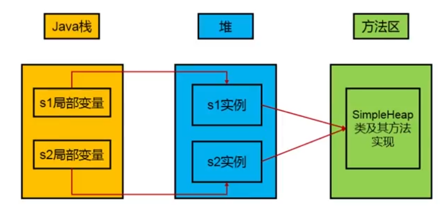
- 方法结束后，堆中的对象不会马上被移除，仅仅是在垃圾收集的时候才会被移除，所以堆是GC(Garbage Collection)执行垃圾回收的重点

#### 4.6.1 堆内存细分

- 现代垃圾收集器大部分都是基于分代收集理论设计，堆空间的堆内存逻辑上细分为：
- 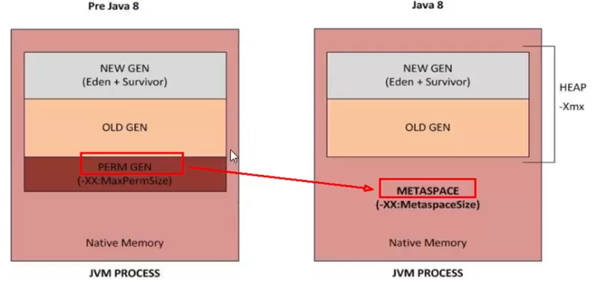
  - Java7及以前：新生区+养老区+永久区
    - Young Generation Space==Young/New
      - 又被分为：Eden区和Survivor区
    - Tenure Generation Space==Old/Tenure
    - Permanent Space==Perm
  - Java8之后：新生区+养老区+元空间
    - Young Generation Space==Young/New
      - 又被分为：Eden区和Survivor区
    - Tenure Generation Space==Old/Tenure
    - Meta Space==Meta
  - 通俗的约定：
    - 新生区==新生代==年轻代
    - 养老区==老年区==老年代
    - 永久区==永久代
    - 逻辑上存在永久区，但是事实上在方法区中实现

#### 4.6.2 设置堆内存大小与OOM

- Java堆区用于存储Java对象实例，堆的大小在启动时就已经设定好了，可以通过-Xms和-Xmx进行设置
  
  - -Xms：用于表示堆区的起始内存，等价于：-XX:InitialHeapSize==设置新生代+老年代的初始内存大小
  - -Xmx：用于表示堆区的最大内存，等价于：-XX:MaxHeapSize==设置新生代+老年代的最大内存大小
  - -X：jvm的运行参数
  - ms：memory start

- 一旦堆区中的内存大小超过-Xmx所指定的最大内存时，将会抛出OutOfMemoryError异常

- 通常会将 -Xms和-Xmx两个参数配置相同的值，目的是为了能够在java垃圾回收机制清理完堆区后不需要重新分隔计算堆区的大小，从而提高性能

- 默认情况下：
  
  - 初始堆区内存大小：物理电脑内存大小/64
  - 最大堆区内存大小：物理电脑内存大小/4

- 查看设置的参数
  
  - jps / jstat -gc 进程id
    - 
  - -XX:+PrintGCDetails：在VM参数中添加这个参数，打印GC过程中的细节
    - 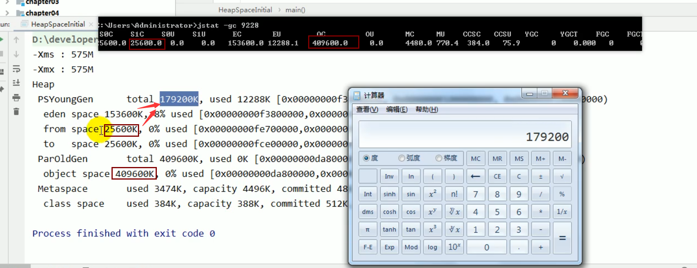

- 代码示例

- ```java
  public class OOMTest {
      public static void main(String[] args) {
          ArrayList<Picture> list=new ArrayList<>();
          while (true){
              try {
                  Thread.sleep(20);
              } catch (InterruptedException e) {
                  e.printStackTrace();
              }
              list.add(new Picture(1024*1024));
          }
      }
  }
  class Picture{
      private byte[] pixels;
      Picture(){
  
      }
      Picture(int length){
          pixels=new byte[length];
      }
  }
  ```

#### 4.6.3 新生代和老年代

- 存储在JVM中的Java对象可以被划分为两类：
  - 一类是生命周期较短的瞬时对象，这类对象的创建和消亡都非常迅速
  - 一类是生命周期非常长的对象，在某些极端环境下还能够与JVM的生命周期保持一致
- Java堆区可以细分为如下：
- 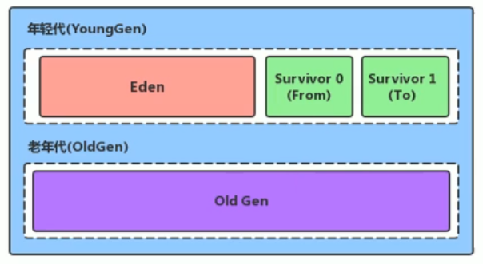
- 设置新生代和老年代在堆中的占比
  - 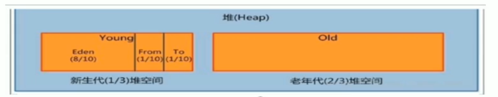
  - 默认-XX:NewRatio=2,表示新生代占1，老年代占2，新生代占整个堆的1/3
  - 可以修改为-XX:NewRatio=4,表示新生代占1，老年代占4，新生代占整个堆的1/5
  - 用命令行查看
  - 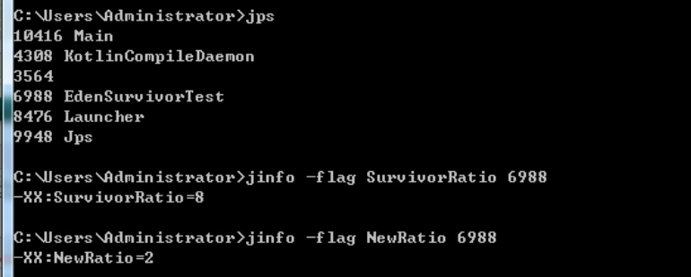
  - 在HotSpot中，Eden空间和另外两个Survivor空间默认的比例是8:1:1(官方也是这样说)；但是事实上并不是，而是6:1:1
  - 也可以通过-XX:SurvivorRatio=8调整这个空间比例，此时才是8:1:1
  - 几乎所有的Java对象都是在Eden区被new出来的
  - 较大部分的Java对象的销毁都在新生代进行
  - 可以通过-Xmn设置新生代最大内存大小，一般使用默认值，优先级比-XX:NewRatio高

#### 4.6.4 对象分配过程

- 概述
  - 为新对象分配内存是一件非常严谨和复杂的任务，JVM的设计者们不仅需要考虑内存如何分配、在哪里分配等问题，并且由于内存分配算法与内存回收算法密切相关，所以还需要考虑GC执行完内存回收后是否会在内存空间中产生内存碎片
  - 1.new的对象先放在Eden区，此区有大小限制
  - 2.当Eden区的空间填满后，程序又要创建对象，JVM的垃圾回收器将Eden区进行垃圾回收(Minor GC)，将Eden区中不再被其他对象所引用的对象进行销毁，再加载新的对象放到Eden区
  - 3.然后将Eden区中剩余的对象移动到幸存者0区。此时1区为空(此时也可以被称为to区)
  - 4.如果再次触发垃圾回收，此时上次幸存下来的放到幸存者0的对象如果没有被回收，就会和Eden区未被回收的对象被放到幸存者1区，此时0区已经清空(此时0区就为to区)
    - 0区和1区也可以被称为from、to，一般to区是指为空的那个幸存者区
  - 5.如果再次经历垃圾回收，此时会重新放回到幸存者0区，然后再去幸存者1区
  - 6.什么时候能去老年区呢？可以设置次数，默认是15次
    - 可以设置参数：-XX:MaxTenuringThreshold=<N>进行设置
  - 7.当老年区内存不足时，触发Major GC，进行老年区的内存清理
  - 8.如果老年区执行了Major GC之后发现仍然无法进行对象的保存，就会产生OOM异常
- 总结
  - 关于幸存者s0、s1区：复制之后有交换、谁空谁是to
  - 关于垃圾回收：频繁在新生区收集(Eden区满之后会触发GC，顺便进行幸存者区的GC和交换，但是Eden区满并不会单纯的触发幸存者区的垃圾回收)，很少在老年区收集，几乎不在永久区/元空间收集
- 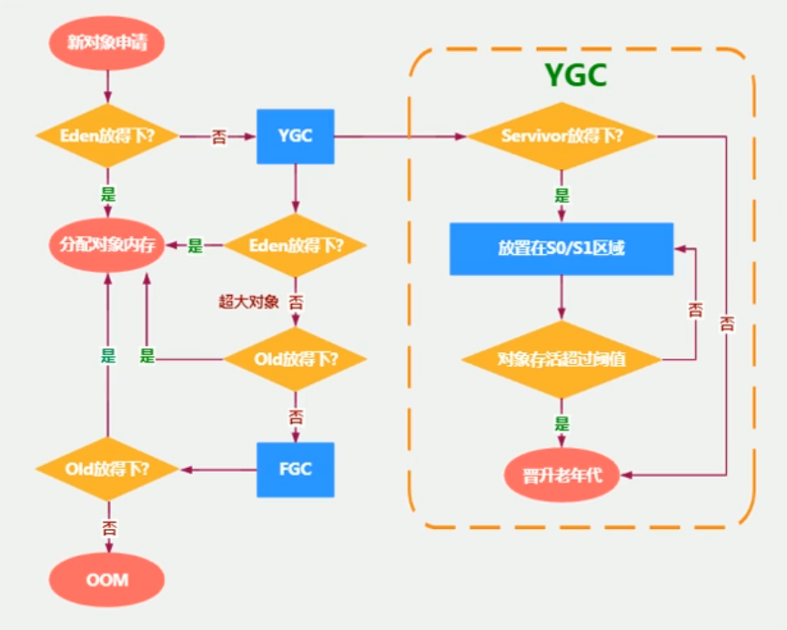

#### 4.6.5 常用性能调优工具

- JDK命令行
- Eclipse:Memory Analyzer Tool
- Jconsole
- VisualVM
- Jprofiler
- Java Flight Recoder
- GCViewer
- GC Easy

#### 4.6.6 Minor GC、Major GC、Full GC

- JVM在进行GC时，并非每次都对新生代(Eden区、幸存者区)、老年代、方法区这三个内存区域一起回收的，大部分回收的都是在新生代
- 针对Hotspot VM的实现，里面的GC按照回收区域又分为两种大类型：
  - 一种是部分收集(Partial GC)
  - 一种是整堆收集(Full GC)
- 部分收集：Partial GC
  - 不是一个完整收集整个Java堆的垃圾收集机制，其中又分为：
    - 新生代收集(Minor GC/Young GC)：只是新生代(Eden区、幸存者区)的垃圾收集
    - 老年代收集(Major GC/Old GC)：只是老年代的垃圾收集
      - 目前只有CMS GC(并发的垃圾回收器)会有单独收集老年代的行为，大部分时候Major GC会和Full GC混淆使用，需要具体分辨是老年代回收回收整堆回收
    - 混合收集(Mixed GC)：收集整个新生代以及部分老年代的垃圾收集
      - 目前只有G1 GC会有这种行为
- 整堆收集：Full GC
  - 收集整个Java堆和方法区的垃圾收集
- 新生代GC(Minor GC)触发机制：
  - 当新生代空间不足时，就会触发Minor GC，这里的新生代满是指Eden区满，幸存者区满并不会触发GC（因为是被动的，等Eden区满了才会一起GC），每次Minor GC都会清理新生代的内存
  - 因为Java对象大部分都具备朝生夕灭的特性，所以Minor GC 非常频繁，一般回收速度也比较快
  - Minor GC 会触发STW，暂停其他用户的线程，等垃圾回收结束，用户线程才恢复运行
- 老年代GC(Major GC/Full GC)触发机制：
  - 指发生在老年代的GC，对象从老年代消失时，我们可以说Major GC或者Full GC发生了
  - 出现Major GC经常会伴随至少一次的Minor GC(但并不是绝对，在Parallel Scavenge收集器的收集策略里就有直接进行Major GC的策略选择过程)
    - 也就是在老年代空间不足时，会先触发Minor GC，如果之后空间还不足，再触发Major GC 
  - **Major GC的速度一般会比Minor GC慢10倍以上，STW的时间更长**
  - 如果Major GC后内存还是不足，就会报OOM
- Full GC触发机制：待续细讲 
  - 触发Full GC执行的情况有如下五种
    - 调用System.gc()时，系统建议执行Full GC，但是不必然执行
    - 老年代空间不足
    - 方法区空间不足
    - 通过Minor GC后进入老年代的平均大小大于老年代可用内存
    - 由Eden区、survivor space0(From Space)区向survivor space1(To Space)区复制时，对象大小大于To Space可用内存，则把对象转存到老年代，且老年代的可用内存小于该对象大小
    - Full GC是开发或者调优中尽量要避免的，这样暂时时间会短一些

#### 4.6.7 堆空间分代思想

- 为什么需要对Java堆进行分代？不分代就不能正常工作了吗？
  
  - 经过研究，发现不同对象的生命周期不同。70-99%的对象是临时对象
  - 新生代：由Eden、两块大小相同的Survivor（from/to）构成，to总为空
  - 老年代：存放新生代中经历多次GC仍然存活的对象
  - 其实不分代也是可以的，分代的唯一理由是**优化GC性能**，如果没有分代，那所有的对象都在一块，GC的时候要找到哪些对象没用就需要对堆中所有的区域进行扫描，浪费时间。而很多对象都是临时对象，如果分代将新创建的对象放到某一地方，当GC的时候先把这块存储着临时对象的对象区域进行回收，就可以清理出很大的空间出来。

- 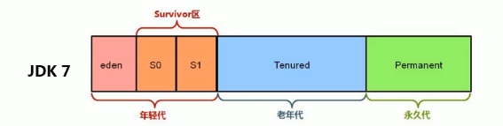

- 

#### 4.6.8 内存分配策略=对象提升规则

- 如果对象在Eden区出生并且经历过一次MinorGC后仍然存活，并且能被Survivor容纳的话，将被移动到Survivor区中，并且设置对象年龄为1。对象在Survivor区中每熬过一次MinorGC，年龄就会增加1，当对象的年龄增加到一定程度时(默认是15，每个JVM略有不同)，就会晋升到老年代中。
- 对象晋升老年代的年龄阈值，可以通过选项 -XX:MaxTenuringThreshold来设置
- 针对不同年龄段的对象分配原则如下：
  - 优先分配到Eden区
  - 大对象直接分配到老年代，如比较大的字符串、数组
    - 尽量避免程序中出现过多的大对象
  - 长期存活的对象分配到老年代
  - 动态对象年龄判断
    - 如果Survivor区中相同年龄的所有对象大小的总和大于Survivor空间的一半，年龄大于等于该年龄的对象可以直接进入老年代，无须等到MaxTenuringThreshold中要求的年龄
  - 空间分配担保：
    - -XX:HandlePromotionFailure

#### 4.6.9 为对象分配内存：TLAB

- 为什么有TLAB（Thread Local Allocation Buffer）？
  - 堆区是线程共享区域(进程中存在多个线程)，任何线程都可以访问到堆区中的共享数据
  - 由于对象实例的创建在JVM中非常频繁，因此在并发环境下从堆区划分内存空间是线程不安全的
  - 为了避免多个线程操作同一地址，需要使用加锁等机制，进而影响分配速度
- 什么是TLAB？
  - 从内存模型而不是垃圾回收的角度，对Eden区域继续进行划分，在Eden空间内JVM为每个线程分配了一个私有缓存区域，
  - 多个线程同时分配内存时，使用TLAB可以避免一系列的线程安全问题，同时还可以提升内存分配的吞吐量。因此我们可以将这种内存分配方式称为：快速分配策略
  - 所有OpenJDK衍生出来的JVM都提供了TLAB的设计
- 再次说明TLAB：
  - 尽管不是所有的对象实例都能够在TLAB中成功分配内存，但JVM确实是将TLAB作为内存分配的首选
  - 在程序中，开发人员可以通过-XX:UseTLAB设置是否开启TALB空间，默认开启
  - 默认情况下：TLAB空间的内存非常小，**仅占整个Eden空间的1%**，可以通过-XX:TLABWasteTargetPrecent设置TLAB空间所占用Eden空间的百分比大小
  - 一旦对象在TLAB空间分配内存失败时，JVM就会尝试通过使用**加锁机制**确保数据操作的原子性，从而直接在Eden空间中分配内存。
- 整体过程
- 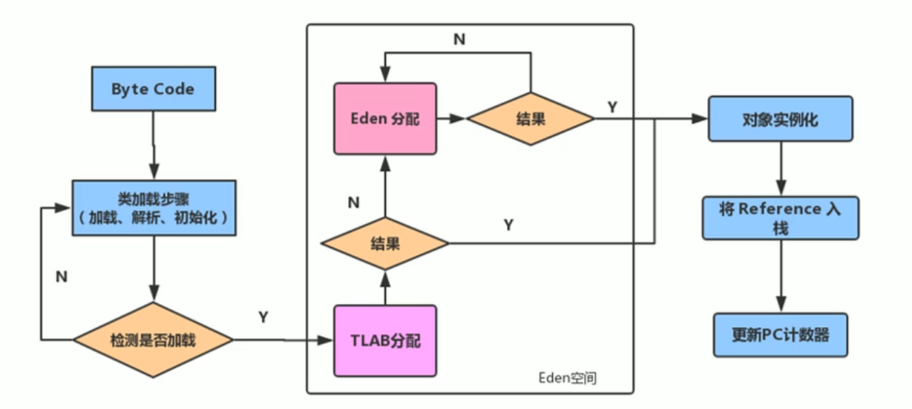

#### 4.6.x 小节-堆空间的参数设置

- 去官网找文档最好！600多个
- -XX:+PrintFlagsInitial：查看所有的参数的默认初始值
- -XX:+PrintFlagsFinal：查看所有参数的最终值(因为可能存在修改)
  - 具体查看某个参数的指令
    - jps：查看当前运行中的进程id
    - jinfo -flag SurvivorRatio 进程id
- -Xms：初始化堆空间内存，默认为物理内存的1/64
- -Xmx：最大堆空间内存，默认为物理内存的1/4
- -Xmn：设置新生代的大小，初始值以及最大值
- -XX:NewRatio：配置新生代与老年代在堆结构的占比
- -XX:SurvivorRatio：配置新生代中Eden和S0/1空间的比例
- -XX:MaxTenuringThreshold：设置新生代垃圾的最大年龄
- -XX:+PrintGCDetails：输出详细的GC处理日志
- -XX:+PrintGC、-verbose:gc：打印GC简要详细
- -XX:HandlePromotionFailure：是否设置空间分配担保
  - 在发生Minor GC之前，虚拟机会检查**老年代最大可用的连续空间是否大于新生代所有对象的总空间**
    - 如果大于，则此次Minor GC是安全的
    - 如果小于，则虚拟机会查看-XX:HandlePromotionFailure设置值是否允许担保失败
      - 如果HandlePromotionFailure=true,那么会**检查老年代最大可用连续空间是否大于历次晋升到老年代的对象的平均大小**
        - 如果大于，则尝试进行一次Minor GC，但这次Minor GC 依然是有风险的
        - 如果小于，则改为进行一次Full GC
      - 如果HandlePromotionFailure=false,则改为一次Full GC
  - 在JDK6 Update24之后，HandlePromotionFailure参数不会再影响到虚拟机的空间分配担保策略，观察OpenJDK的源码变化，虽然源码中还是定义了HandlePromotionFailure参数，但是在代码中已经不会再使用它，JDK6 Update24之后的规则(也就是true)变为**只要老年代的连续空间大于新生代对象总大小或者历次晋升的平均大小就会进行Minor GC**，否则将进行Full GC

### 4.7 代码优化

- 堆是分配对象存储的唯一选择吗？
  
  - 在《深入理解Java虚拟机》中关于Java堆内存有这样一段描述：
    - 随着JIT编译器的发展和**逃逸分析**技术开始成熟，**栈上分配、标量替换优**化技术将导致一些微妙的变化，所有的对象都分配到堆上也开始不那么绝对了
  - 在Java虚拟机中，对象是在Java堆中分配内存的，这是一个普遍的常识。但是有一种特殊的情况，就是：如果经过逃逸分析(Escape Ananlysis)后发现，一个对象并没有逃逸出方法的话，那么就有可能被优化成栈上分配。这样就无需在堆上分配内存，也无需进行垃圾回收了，这是最常见的堆外存储技术
  - 此外，之前提到的基于OpenJDK深度定制的TaoBaoVM，其中创新的GCIH(GC invisible heap)技术实现了off-heap，将生命周期较长的Java对象从heap中移到heap外，并且GC不能管理GCIH内部的Java对象，以此达到降低GC的回收频率和提升GC的回收效率的目的

- 逃逸分析概述
  
  - 如何将堆上的内存分配到栈，需要使用逃逸分析手段
  
  - 这是一种可以有效减少Java程序中同步负载和内存堆分配压力的跨函数全局数据流分析算法
  
  - 通过逃逸分析，Java Hotspot编译器能够分析出一个新的对象的引用的使用范围，从而决定是否要将这个对象分配到堆上
  
  - 逃逸分析的基本行为：就是分析对象动态作用域：
    
    - 当一个对象在方法中被定义后，对象只在方法内部使用，则认为没有发生逃逸
      - 此时该对象可以分配到栈上，随着方法执行的结束，对象随着栈空间的移除而销毁
    - 当一个对象在方法中被定义后，被外部方法所使用，则被认为发生了逃逸，如：作为调用参数传递到了其他地方
  
  - 代码示例
  
  - ```java
    // 对象逃逸了=>不能使用栈上分配
    public static StringBuffer createStringBuffer(String s1,String s2){
        StringBuffer sb = new StringBuffer();
        sb.append(s1);
        sb.append(s2);
        return sb;
    }
    
    // 对象不逃逸=>可以栈上分配
    public static String createStringBuffer(String s1,String s2){
        StringBuffer sb = new StringBuffer();
        sb.append(s1);
        sb.append(s2);
        return sb.toString();
    }
    ```
  
  - 如何快速判断方法中的对象能够发生逃逸分析？
    
    - 就看方法中的对象实例是否可能在方法外被调用
  
  - 参数设置逃逸分析：
    
    - 在JDK 7(6u23)版本之后，Hotspot中默认就已经开启了逃逸分析
    - 如果使用的是较早的版本，可以通过
      - -XX:+DoEscapeAnalysis：显式开启逃逸分析
      - -XX:+PrintEscapeAnalysis：查看逃逸分析的筛选结果
  
  - 结论：
    
    - 开发中能使用局部变量的，就不要使用在方法外定义

- 逃逸分析：代码优化
  
  - 使用逃逸分析，编译器可以对代码做如下优化：
    - 栈上分配：将堆分配转换为栈分配，如果一个对象在子程序中被分配，要使指向该对象的指针永远不会逃逸，对象可能是栈分配的候选，而不是堆分配
    - 同步省略：如果一个对象被发现只能从一个线程被访问到，那么对于这个对象的操作可以不考虑同步
    - 分离对象或标量替换：有的对象可能不需要作为一个连续的内存结构存在，也可以被访问到，那么对象的部分（全部）可以不存储在内存，而是存储在CPU寄存器中

#### 4.7.1 代码优化-栈上分配

- JIT编译器在编译期间根据逃逸分析的结果，发现如果一个对象并没有逃逸出方法的话，就有可能被优化成栈上分配。分配完成后，继续在调用栈内执行，最后线程结束，栈空间被回收，局部变量对象也被回收，这样就无需进行垃圾回收了

- 常见的栈上分配的场景
  
  - 在逃逸分析中已经说明，逃逸出方法：分别是给成员变量赋值，方法返回设置，实例引用传递

- 代码示例

- ```java
  /*
  栈上分配测试
  -Xmx16m -Xms16m -XX:-DoEscapeAnalysis -XX:+PrintGCDetails
  对比
  -Xmx16m -Xms16m -XX:+DoEscapeAnalysis -XX:+PrintGCDetails
   */
  public class StackAllocation {
      public static void main(String[] args) {
          long start = System.currentTimeMillis();
          for (int i = 0; i < 10000000; i++) {
              alloc();
          }
          // 查看执行时间
          long end = System.currentTimeMillis();
          System.out.println("花费的时间为："+(end-start)+"ms");
          // 为了方便查看堆中对象的个数，线程sleep
          try {
              Thread.sleep(100000);
          } catch (InterruptedException e) {
              e.printStackTrace();
          }
      }
      private static void alloc(){
          User user = new User();// 未发生逃逸
      }
      static class User{
  
      }
  }
  ```

#### 4.7.2 代码优化-同步省略

- 线程同步的代价是很高的，同步的后果是降低并发性和性能

- 在动态编译同步块的时候，JIT编译器可以借助逃逸分析来判断同步块所使用的锁对象是否只能被一个线程访问而没有被分布到其他线程。如果没有，那么JIT编译器在编译这个同步块的时候就会取消对这部分代码的同步。这样就能大大提高并发性和性能，这个取消同步的过程就叫**同步省略**，也叫**锁清除**

- 代码示例

- ```java
  /**
   * 同步省略说明
   */
  public class SynchronizedTest {
      // 此时编译成的字节码文件仍然有锁的字节码指令
      // 可是当在JVM运行时，如果开启了逃逸分析，JIT编译器会将其同步代码块去掉
      public void f(){
          Object hollis = new Object();
          synchronized(hollis){
              System.out.println(hollis);
          }
      }
      // 此时如果开启了逃逸分析，可以优化为：
      public void f(){
          Object hollis = new Object();
          System.out.println(hollis);
      }
  }
  ```

#### 4.7.3 代码优化-标量替换(分离对象)

- 标量(Scalar)：指无法再分解成更小的数据的数据，Java中的原始数据类型就是标量
  
  - 相对的，那些还可以被分解的数据叫做聚合量(Aggregate)，Java中的对象就是聚合量，因为他可以分解成其他聚合量和标量

- 在JIT阶段，如果经过逃逸分析，发现一个对象不会 b被外界访问的话，那么经过JIT优化，就会把这个对象拆解成若干个其中包含若干个成员变量来代替，这个过程就叫做**标量替换**

- 代码示例

- ```java
  public static void main(String[] args){
      alloc();
  }
  private static void alloc(){
      Point point = new Point(1,2);
      System.out.println(point.x+point.y);
  }
  class Point{
      private int x;
      private int y;
  }
  
  // 经过标量替换后可以优化为：
  private static void alloc(){
      int x=1;
      int y=2;
      System.out.println(x+y);
  }
  ```

- 可以看到，Point这个聚合量经过逃逸分析后，发现它并没有逃逸，就被替换成两个聚合量

- 标量替换有什么好处？
  
  - 可以大大减少堆内存的占用，因为一旦无需创建对象了，那么就可以不再需要分配堆内存了

- 标量替换为栈上分配提供了很好的基础

- 代码示例

- ```java
  /*
  标量替换测试
  -Xmx16m -Xms16m -XX:+DoEscapeAnalysis -XX:+PrintGCDetails -XX:-EliminateAllocations 设置不进行标量替换
  对比进行标量替换
  -Xmx16m -Xms16m -XX:-DoEscapeAnalysis -XX:+PrintGCDetails -XX:+EliminateAllocations 
   */
  public class ScalarReplace {
      public static void main(String[] args) {
          long start = System.currentTimeMillis();
          for (int i = 0; i < 10000000; i++) {
              alloc();
          }
          // 查看执行时间
          long end = System.currentTimeMillis();
          System.out.println("花费的时间为："+(end-start)+"ms");
          // 为了方便查看堆中对象的个数，线程sleep
          try {
              Thread.sleep(100000);
          } catch (InterruptedException e) {
              e.printStackTrace();
          }
      }
      private static void alloc(){
          User user = new User();// 未发生逃逸
          user.id = 3;
          user.name = "xxx";
      }
      static class User{
          public int id;
          public String name;
      }
  }
  ```

#### 4.7.4 小节

- ```java
  jvm参数
      -server -Xmx100m -Xms100m -XX:+DoEscapeAnalysis -XX:+PrintGC -XX:+EliminateAllocations
  ```

- 参数解释：
  
  - -server：启动server模式，才可以启用逃逸分析，目前安装的64位JDK默认是Server模式
  - -XX:+DoEscapeAnalysis：启用逃逸分析
  - -Xmx10m：指定堆空间的最大为10MB
  - -XX:+PrintGC：打印GC日志
  - -XX:+EliminateAllocations：开启了标量替换(默认打开)，允许将对象打散分配在栈上，作为独立的局部变量进行分配到栈帧的局部变量表的slot中

- 逃逸分析小结：逃逸分析并不成熟
  
  - 在1999年相关论文已经发布，但是jdk 1.6 才有实现，并且仍然不太成熟
  - 根本原因是：无法保证逃逸分析的性能消耗一定高于它的消耗，虽然通过逃逸分析可以做标量替换、栈上分配、和锁消除。但是逃逸分析本身也是需要进行一系列的复杂分析，这些过程都是需要耗费相应的资源
  - 虽然这项技术并不成熟，但是仍然是**JIT编译器优化技术中的一个重要手段**
  - 逃逸分析取决于JVM设计者的选择，Oracle Hotspot JVM中并没有(栈上分配，一般是标量替换)这样做，这一点在逃逸分析相关的文档里已经说明，**明确所有的对象实例都是创建在堆上**

### 4.8 方法区(永久代)(元空间)

#### 4.8.1 栈、堆、方法区之间的交互关系

- 从线程共享与否的角度来看

- 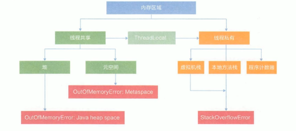

- 从内存分配的角度来看

- 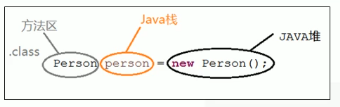

- 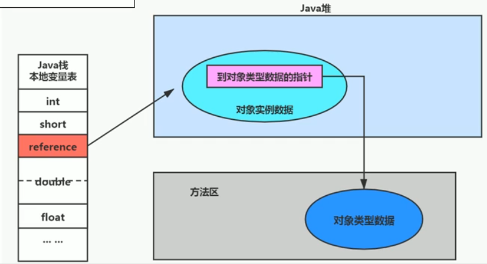
  
  - 本地变量表=局部变量表

#### 4.8.2 方法区的基本理解

- 《Java虚拟机规范》：尽管所有的方法区在逻辑上是属于堆的一部分，但一些简单的实现可能不会选择去进行垃圾回收或者进行压缩。对于HotSpotJVM而言，方法区还有一个别名：Non-Heap(非堆)，目的就是要和堆分开，所以**方法区可以看做是独立于Java堆的内存空间**
- 方法区和堆一样是各个线程共享的内存区域
- 方法区在JVM启动时被创建，并且它的实际物理内存空间和堆一样都可以是不连续的
- 方法区的大小和堆空间一样可以选择固定大小或者可扩展
- 方法区的大小决定了系统可以保存多少个类。如果系统定义了太多的类，导致方法区溢出，JVM同样会抛出内存溢出错误：java.lang.OutOfMemoryError:PermGen space 或者java.lang.OutOfMemoryError:Metaspace
  - 加载大量的第三方jar包：Tomcat部署的工程过多(30-50个)
- 关闭JVM就会释放方法区的内存

#### 4.8.3 HotSpot中方法区的演进

- 在JDK7及以前，习惯把方法区称为永久代，JDK8开始使用元空间取代了永久代
- 本质上，方法区和永久代并不是等价的。仅对hotspot而言方法区==永久代，《Java虚拟机规范》对如何实现方法区不做统一要求，如：BEA JRockit/ IBM J9中不存在永久代的概念
  - 现在来看，当年使用永久代不是一个好的idea，导致Java程序更容易OOM(超过-XX:MaxPermSize上限)
  - 因为使用永久代时仍然使用的是JVM的内存
- 到了JDK8之后，终于完全废弃了永久代的概念，改用了与JRockit、J9一样在本地内存中实现的元空间(Metaspace)来代替
- 元空间的本质和永久代类似，都是对JVM规范中方法区的实现，
  - 其最大的区别在于：**元空间不在虚拟机设置的内存中，而是使用本地内存**
  - 根据《Java虚拟机规范》的规定，如果方法区无法满足新的内存分配需求时，将抛出OOM异常
  - 永久代、元空间二者并不只是名字变了，内存结构也调整了

#### 4.8.4 设置方法区大小和OOM

- 方法区的大小不必是固定的，jvm可以根据应用的需要动态调整
- JDK7及以前：
  - -XX:PermSize=大小：设置永久代初始化分配空间，默认值：20.75M
  - -XX:MaxPermSize=大小：设置永久代最大可分配空间，32位电脑默认为64M，64位电脑默认是82M
  - 当JVM加载类的信息容量超过这个值时，就会报异常OutOfMemoryError:PermGenspace
  - 命令行使用：
    - jinfo -flag PermSize或MaxPermSize 线程id：查看永久代的大小
- JDK8及以后：
  - -XX:MetaspaceSize=和-XX:MaxMetaspaceSize=代替以上两个参数
  - 默认值依赖于平台
    - windows：-XX:MetaSpaceSize是21M，-XX:MaxMetaspaceSize的值-1，没有限制
  - 与永久代不同，如果不指定大小，默认情况的虚拟机会耗尽所有可用的系统内存，如果元空间发生溢出，就会报异常OutOfMemoryError:MetaSpace
  - -XX:MetaspaceSize：设置初始的元空间大小，对于一个64位服务器端的JVM而言，默认的-XX:MetaspaceSize的值为21MB。这个是初始的高水位线，一旦内存到了21M，Full GC就会被触发并卸载没用的列，然后这个高水位线将会重置，大小取决于GC后释放了多少元空间。
    - 如果释放空间不足，那么在不超过MaxMetaspaceSize的情况下，会适当提高该值
    - 如果释放空间过多，则适当降低该值
  - 如果初始化的高水位线设置过低，上述高水位线调整情况会发生多次，通过垃圾回收器的日志可以观察到Full  GC多次调用。为了避免频繁的GC，建议将-XX:MetaspaceSize设置为一个相对较高的值
- 如何解决OOM？
  - 要解决OOM异常或者heap space 异常，一般的手段是首先通过内存映像分析工具对dump出来的堆转储快照进行分析，重点是确认内存中的对象是否是必要的，也就是先分清楚到底是出现了内存泄露(Memory Leak)还是内存溢出(Memory Overflow)
    - 如果是内存泄露，可以进一步通过工具查看泄露对象到GC Roots的引用链，于是就能找到泄露对象是通过怎样的路径与GC Roots相关联并且导致垃圾收集器无法自动回收它们的。掌握了泄露对象的类型信息，以及GC Roots引用链的信息，就能够比较准确的定位出泄露代码的位置
      - 内存泄露是指：有个对象引用一直指向堆中的某个对象实例，但是这个对象引用一直都没有被使用，导致无法进行垃圾回收，但是又在无用的占用堆空间
    - 如果不存在内存泄露，也就是内存中的对象确实都还必须存活着，那就应该检查虚拟机的堆参数(-Xmx -Xms)，与机器物理内存对比看是否还可以调大，从代码上检查是否存在某些对象生命周期过长，持有状态时间过长的情况，尝试减少程序运行期间的内存消耗

#### 4.8.5 方法区的内部结构

- 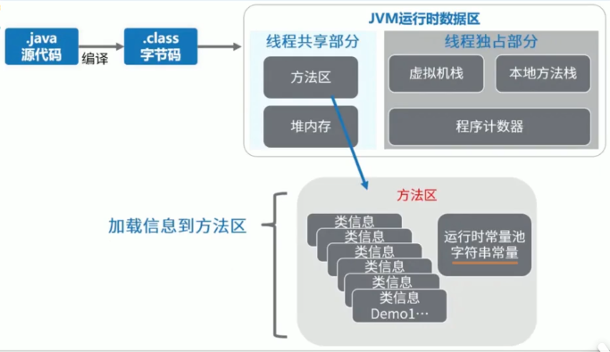
- 方法区存储什么？
  - 《深入理解Java虚拟机》书中对方法区存储的内存描述如下：
    - 方法区用于存储已被虚拟机加载的类型信息、常量、静态变量、即时编译器编译后的代码缓存等
  - 类型信息：看视频有实例讲解最好！https://www.bilibili.com/video/BV1PJ411n7xZ?p=92
    - 对每个加载的类型：类class、接口interface、枚举enum、注解annotation，JVM必须在方法区汇总存储以下类型信息
      - 这个类型的完整有效名称（全名=包名，leim）
      - 这个类型直接父类的完整有效名（对于interface或者是java.lang.Object都没有父类）
      - 这个类型的修饰符(public，abstract、final)
      - 这个类型直接接口的一个有序列表
    - 域信息(Field)
      - JVM必须在方法区中保存类型的所有域的相关信息以及域的声明顺序
      - 域的相关信息包括：域名称、域类型、域修饰符(public private protected stactic final volatile transient的某个子集)
    - 方法信息
      - JVM必须保存所有方法的以下信息，同域信息一样包括声明顺序
        - 方法名称
        - 方法的返回类型
        - 方法参数的数量和类型
        - 方法的修饰符(public private protected static final synchronized native abstract)
        - 方法的字节码（bytecodes）、操作数栈、局部变量表及大小(abstract、native方法除外)
        - 异常表((abstract、native方法除外))
          - 每个异常处理的开始位置、结束位置、代码处理在程序计数器中的偏移地址、被捕获的异常类的常量池索引
    - 通过反编译.class文件可以查看，命令主要是
      - javap -v -p xxx.class：-p是为了把所有的权限的变量、方法都能够解析处理
      - javap -v -p xxx.class >test.txt：反编译的结果可以输出到指定文件中去
  - non-final的类变量(就是没有被final修饰的static)
    - 静态变量和类关联在一起，随着类的加载而加载，它们成为类数据在逻辑上的一部分
    - 类变量(静态变量)被类的所有实例共享，即使没有类实例时也可以访问它
    - 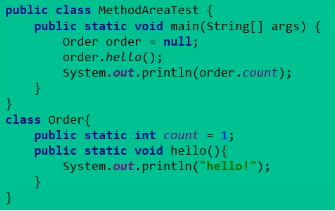
    - 全局常量：static final 
      - 被声明为final的类变量，被称为全局常量，会在编译的时候就分配赋值！而不是在类的加载过程中的链接的准备阶段被默认赋值分配空间，在初始化阶段进行真正的赋值。
- 运行时常量池：在方法区中
- 常量池：在字节码文件中，会被类加载到方法区中，此时被称为运行时常量池
- 要弄清楚方法区，需要理解清楚ClassFile，因为加载类的信息都在方法区中
- 要弄清楚方法区中的运行时常量池，就需要理解清楚ClassFile中的常量池
- 常量池在字节码文件中的位置：
  - 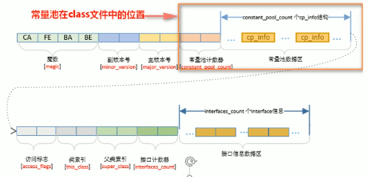
  - 一个有效的字节码文件中除了包含类的版本信息，字段、方法以及接口等描述信息外，还包含一项信息就是常量池表(Constant Pool Table)，包括各种字面量和对类型、域、方法的符号引用
- 为什么需要常量池？
  - 一个java源文件中的类，接口，编译后产生一个字节码文件，而java中的字节码需要数据支持，通常这种数据会很大以至于不能直接存到字节码里。因此将这些数据存在常量池，这个字节码包含了指向常量池的引用，在动态链接的时候直接从运行时常量池加载调用即可
- 常量池中保存什么？
  - 几种在常量池存储的数据类型包括：
    - 数量值
    - 字符串值
    - 类引用
    - 字段引用
    - 方法引用
- 常量池：可以看成一张表，虚拟机指令根据这张常量表找到要执行的类名、方法名、参数类型、字面量等类型
- 运行时常量池：
  - 运行时常量池(Runtime constant pool)是方法区的一部分
  - 常量池表(Constant pool table)是Class文件的一部分，用于存放编译期生成的各种字面量与符号引用，这部分内容将在类加载后存放到方法区的运行时常量池中
  - JVM为每个已加载的类型（类、接口）都维护一个常量池，池中的数据项和数组项一样，都是通过来**索引**访问的
  - 运行时常量池中包含很多不同的常量：包括编译器就已经明确的数值字面量，也包括到运行期解析后才能够获得的方法或者字段引用。此时不再是常量池中的符号地址，而是换成了真实地址
    - 运行时常量池：相对于Class文件常量池而言，更重要的是具有**动态性**
      - 如 String.intern()
  - 运行时常量池类似于传统编程语言中的符号表，但是它所包含的数据比符号表更加丰富
  - 当创建类或者接口的运行时常量池时，如果构造运行时常量池所需的内存空间超过了方法区能够提供的最大值，JVM就会抛OutofMemory
- 代码图示方法区：https://www.bilibili.com/video/BV1PJ411n7xZ?p=96
- 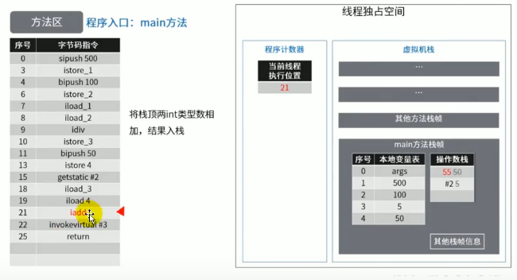

#### 4.8.6 方法区的演进细节

- 只有HotSpot才有永久代，BEA JRockit、IBM J9来说，是不存在永久代的概念的，原则上如何实现方法区属于虚拟机实现细节，不受《Java虚拟机规范》约束，并不要求统一
- HotSpot中方法区的变化
  - jdk1.6以前：有永久代，静态变量存放在永久代上
  - jdk1.7：有永久代，但是已经开始逐步“去永久代”，字符串常量池、静态变量从永久代中移除，保存在堆中
  - jdk1.8：无永久代，类型信息，字段，方法，常量保存在本地内存的元空间中，但是字符串常量池、静态变量仍然在堆中
  - 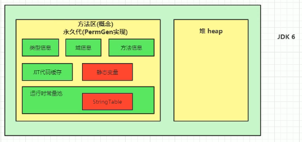
  - 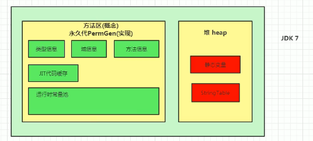
  - 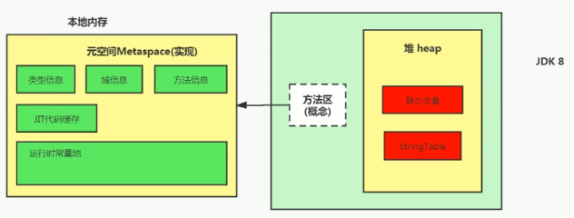
- 永久代为什么被元空间替换？
  - 为永久代设置空间大小是很难确定的，在某些场景下，如果动态加载类过多，容易产生永久代的OOM，而元空间和永久代之间最大的差别在于：元空间并不在虚拟机中，而是使用本地内存，因此在默认情况下，元空间的大小仅受到本地内存的限制
  - 对永久代进行调优是很困难的，因为full GC 也需要占用许多资源
- StringTable为什么要调整？
  - jdk7中将StringTable放到了堆空间中，因为永久代的回收效率很低，在Full GC 的时候才会被触发。而full GC是老年代的空间不足，永久代空间不足时才会触发，这将导致StringTable回收效率不高，而在我们开发中会有大量的字符串被创建，回收效率低，容易导致永久代内存不足。放到堆里能够及时回收内存
- 静态变量存储在哪？
  - 静态变量引用的对象实体始终都存在堆空间(new 的对象都存放在堆空间)
  - 但是new 的对象的前面的静态变量引用存放在哪？
    - jdk6：存放在永久代
    - jdk7及以后：存放在堆

#### 4.8.7 方法区的垃圾回收

- 《java虚拟机规范》对方法区的约束是非常宽松的，提到过可以不要求虚拟机在方法区中实现垃圾回收。
- 方法区的回收效果比较难令人满意，尤其是类型的卸载，条件相当苛刻。但是这部分区域的回收有时确实是必要的，以前Sun公司的Bug列表中，出现过若干个严重的Bug就是由于低版本的Hotspot虚拟机对此区域未完全回收导致内存泄露
- 方法区的垃圾收集主要回收两部分内容：
  - 常量池中废弃的常量
  - 不再使用的类型
- 常量池中主要存放两大类常量：
  - 字面量
    - 字面量比较接近Java语言层次的常量概念，如文本字符串，被声明为final的常量值。
  - 符号引用
    - 符号引用则属于编译原理方面的概念，主要包括：
      - 类和接口的全限定名
      - 字段的名称和描述符
      - 方法的名称和描述符
  - Hotspot虚拟机对常量池的回收策略很明确，只要常量池中的常量没有被任何地方引用，就可以被回收
  - 回收废弃常量与回收Java堆中的对象非常类似
- 判定一个类型是否属于"不再被使用的类"的添加比较苛刻，需要同时满足三个条件：
  - 该类所有的实例都被回收，也就是Java堆中不存在该类以及任何派生子类的实例
  - 加载该类的类加载器已经被回收，这个条件除非是经过精心设计的可替换类加载器的场景(如OSGI，jsp的重载等)，否则很难达成
  - 该类对应的java.lang.Class对象没有在任何地方被引用，无法在任何地方通过反射访问该类的方法
- Java虚拟机被允许对满足上述三个条件的无用类进行回收，但是这仅仅是被允许！，而不是和对象一样，没有引用了就必然回收。关于是否要对类型进行回收，Hotspot提供了-Xnoclassgc参数进行控制，也可以使用-verbose:class以及-XX:+TraceClass-Loading、-XX:+TraceClassUnLoading查看类加载和卸载信息
- 在大量使用反射、动态代理、CGLib等字节码框架，动态生成JSP以及OSGI这类频繁自定义类加载器的场景中，通常都需要Java虚拟机具备类型卸载的能力，以确保不会对方法区造成过大的内存压力

### 4.9 小结

- 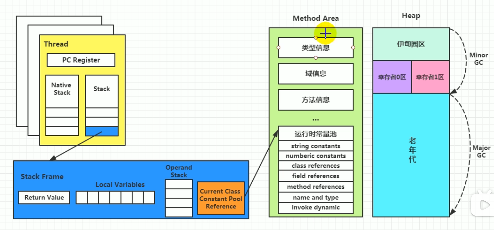

## 5. 对象的实例化、内存布局、访问定位

### 5.1 对象的实例化

- 对象创建的方式

- 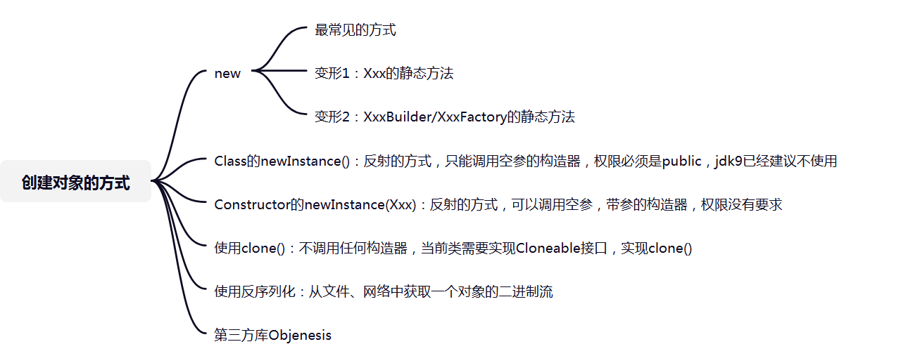

- 从字节码角度了解对象创建过程：
  
  - 字节码指令看mian方法：
  - new ：先判断是否加载类到方法区，再到堆中开辟对应的空间进行临时初始化，在栈帧中再复制一份指向堆中对象的引用(“句柄作用”)；再调用构造器进行实际初始化，最后将对象引用放入栈帧中的局部变量表中

- 从执行步骤的角度了解对象创建过程：
  
  1. 判断对象对应的类是否加载、链接、初始化：=》就是类加载子系统的过程！最后应该完成在方法区中
     - JVM遇到一条new指令，首先会去检测这个指令的参数是否能够在方法区的常量池中定位到一个类的符号引用，并且检测这个符号引用代表的类是否已经被加载、解析和初始化(判断类元信息是否存在)
       - 如果类没有被加载，那么在双亲委派模式下，使用当前类加载器以ClassLoader+包名+类名为key值进行查找对应的.class文件，如果没有找到文件，则抛出ClassNotFoundException异常；如果找到则进行类的加载，并且生成对应的Class类对象
  2. 为对象分配内存：=》对堆空间进行操作
     - 首先计算对象占用空间大小，接着在堆中划分一块内存给新对象，如果实例成员是引用变量，仅分配引用变量空间即可(4个字节大小)
     - 如果内存空间是规整的，那么JVM将采用指针碰撞法来为对象分配内存
       - 指针碰撞法(Bump The Pointer)：所有用过的内存在一边，空闲的内存在另外一边，中间放着一个指针作为分界点的指示器，分配内存就仅仅是把指针向空闲那边移动一段与对象大小相同的距离即可。如果垃圾收集器选择的是Serial、ParNew这种基于压缩的算法，则JVM采用的就是这种分配方式，一般带有compact（整理）过程的收集器时，都是采用的是指针碰撞法
     - 如果内存空间不是规整的，那么JVM需要维护一个空闲列表来为对象分配内存
       - 如果内存空间不是规整的，已经使用的内存和未使用的内存相互交错，那么JVM采用空闲列表法来为对象分配内存：JVM维护一个列表，记录了哪些内存块是可用的，再分配的时候从列表汇总找到一块足够大的空间划分给对象实例，并更新列表上的内容，这种分配方式就是空闲列表(Free List)
     - 现在哪种分配方式由Java堆是否规整决定
     - Java堆是否规整由采用的垃圾收集器是否带有压缩整理功能决定（标记压缩算法）
  3. 处理并发安全问题：=》对堆空间进行操作
     - 可以：采用CAS失败重式、区域加锁保证更新的原子性
     - 也可以：每个线程预先分配一块TLAB；通过-XX:+/- UseTLAB参数来设定
  4. 初始化分配到的空间：=》对堆空间进行操作
     - 所有属性进行设置默认值，保证对象实例字段再不赋值时可以直接使用
     - 重新了解对象属性的赋值操作：
       - 属性的默认初始化（本阶段完成）
       - 显式初始化(之后的都是在第6步完成)
       - 代码块初始化
       - 构造器初始化
  5. 设置对象的对象头：=》方法区中的类元信息和堆空间中的实例对象进行联系标记
     - 将对象的所属类（类的元数据信息）、对象的HashCode和对象的GC信息、锁信息等数据存储在对象的对象头中，这个过程的具体设置方式取决于JVM实现（堆中的对象和方法区的类元信息进行联系连接）
  6. 执行init方法进行初始化：=》栈中的栈帧的局部变量表的对象引用联系到堆中对应的对象上去
     - 在程序员的角度来看：初始化才正式开始，初始化成员变量，执行实例化代码块，调用类的构造器方法，并且把堆内对象的首地址赋值给引用变量
     - 因此一般来说(由字节码汇总是否跟随着invokespecial指令所决定)，new 指令之后会接着执行构造器方法，把对象按照程序员的意愿继续初始化，此时一个真正可用的对象才算是完全创建出来

### 5.2 对象的内存布局

- 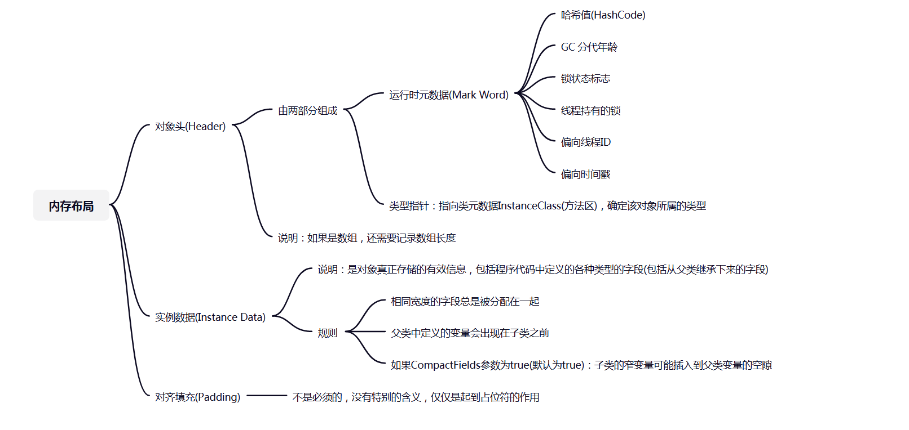
- 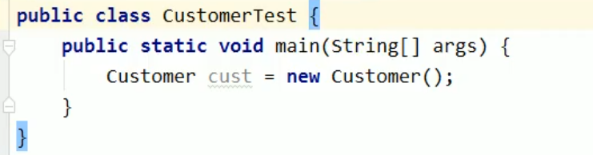
- 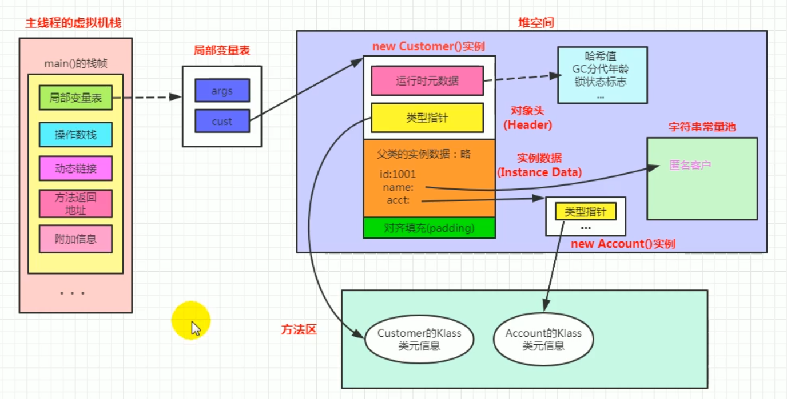

### 5.3 对象的访问定位

- 创建对象的目的就是为了使用该对象，那么JVM是如何通过栈帧中的对象引用访问到其内部的对象实例呢？
  - 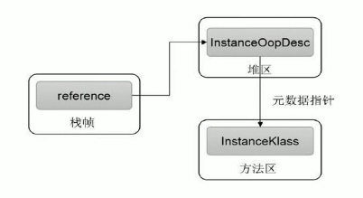
  - 定位，通过栈帧中的局部变量表的reference访问
- 对象访问的方式：
  - 法一：句柄访问：
    - 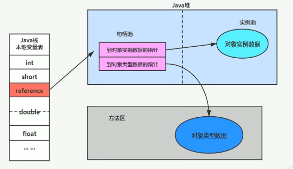
    - 缺点：要开辟句柄池、并且不能直接访问到对象的实例数据，效率低
    - 优点：reference中存储稳定句柄地址，对象被移动(垃圾收集时移动对象很普遍)时只会改变句柄中实例数据的指针即可，reference本身不需要被修改
  - 法二：直接引用：Hotspot采用的就是这种方式
    - 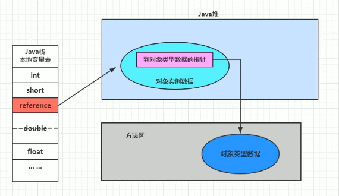
    - 优点：可以直接访问到对象实例数据，节省空间、效率高
    - 缺点：对象移动时需要修改reference

## 6. 直接内存

- 概述
  - 直接内存不是虚拟机运行时数据区的一部分，也不是《Java虚拟机规范》中定义的内存区域
  - 直接内存是Java堆外的，直接向系统申请的内存空间
  - 来源于NIO，通过存在堆中的DirectByteBuffer操作Native内存
    - IO：
      - byte[] / char[]
      - Stream
    - NIO：可以理解为：New IO / Non-Blocking IO
      - Buffer
      - Channel
  - 通常，访问直接内存的速度会优于Java堆，因为读写性能更高
    - 因为：读写文件需要与磁盘交互，需要由用户态切换到内核态，在内核态时，需要内存如下图右图的操作，使用IO，这里需要两份内存存储重复的数据，效率低
    - 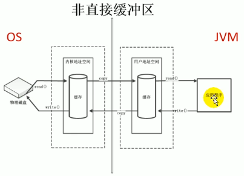
    - 使用NIO时，操作系统划分出的直接缓冲区可以被java代码直接访问，只需要一份内存
    - 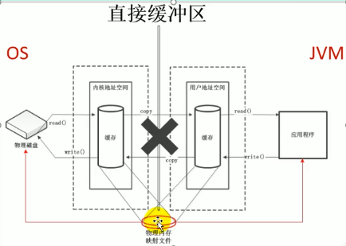
    - 因此，读写频繁的场合可能会考虑使用直接内存
    - Java的NIO库允许Java程序使用直接内存，用于数据缓存区
- 问题：
  - 直接内存也有可能导致OutOfMemoryError异常
    - 由于直接内存在Java堆外，因此大小不会直接受限于-Xmx指定的最大堆大小，但是系统内存是有限的，Java堆和直接内存的总和仍然受限于操作系统能够给出的最大内存
- 缺点：
  - 分配回收成本高
  - 不受JVM内存回收管理
- 直接内存大小可以通过-XX : MaxDirectMemorySize设置
  - 如果不指定，默认与对的最大值-Xmx参数值一致
- 总结图：
- 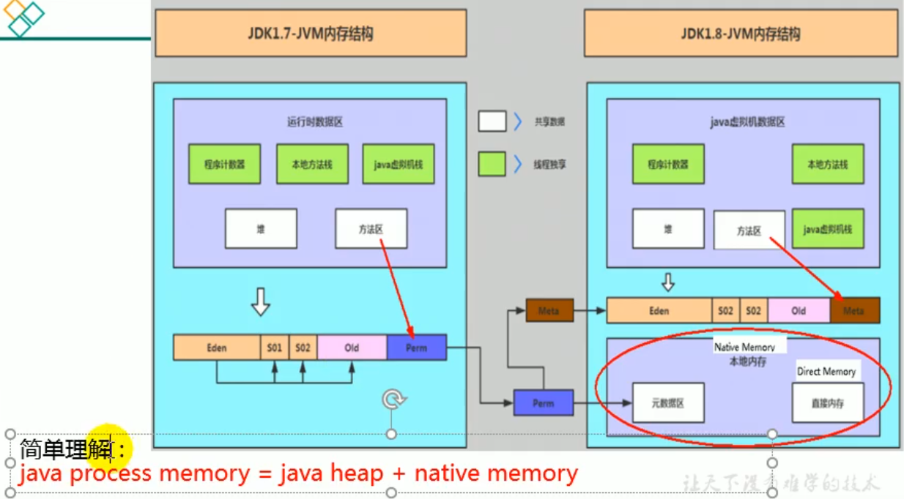

## 7. 执行引擎

### 7.1 概述

- 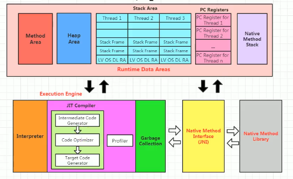
- 执行引擎是]ava虚拟机核心的组成部分之一。
- “虚拟机”是一个相对于“物理机”的概念，这两种机器都有代码执行能力，
  - 其区别是物理机的执行引擎是直接建立在处理器、缓存、指令集和操作系统层面上的
  - 而虚拟机的执行引擎则是由软件自行实现的，因此可以不受物理条件制约地定制指令集与执行引擎的结构体系，能够执行那些不被硬件直接支持的指令集格式。
- JVM主要的任务是负责装载字节码到其内部，但是字节码并不能直接运行在操作系统之上，因为字节码指令并非等价于本地机器指令，它内部包含的仅仅是一些能够被JVM所识别的字节码指令、符号表、以及其他辅助信息
- 要想让一个Java程序运行起来，执行引擎的任务就是将字节码指令解释/编译为对应平台上的本地机器指令才可以，也就是说：JVM中的执行引擎充当了将高级语言翻译为机器语言的工具
  - 此时将字节码指令解释/编译为对应平台上的本地机器指令=》也可以被称为后端编译
  - 将.java文件编译为.class字节码文件=》也可以被称为前端编译
- 执行引擎的工作过程：
  - 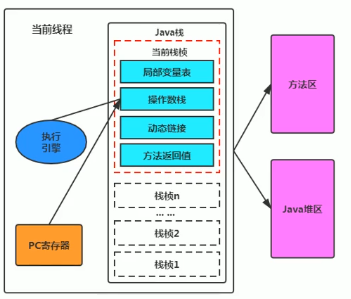
  - 执行引擎在执行过程中要执行什么字节码指令完全依赖于PC寄存器
  - 每当执行完一项指令操作后，PC寄存器就会更新下一条需要被执行的指令地址
  - 方法在执行过程中，执行引擎有可能通过存储在局部变量表中的对象引用准确定位到存储在Java堆区中的对象实例信息，以及通过对象头中的元数据指针定位到目标对象的类型信息
- 从功能上看，所有的JVM的执行引擎输入输出都是一致的：
  - 输入：字节码二进制流
  - 处理过程：字节码解析执行的等效过程
  - 输出：执行结果

### 7.2 Java代码编译和执行的过程

- 大部分的程序代码转换为物理机目标代码或者VM可以执行的指令集之前，都需要经历以下步骤：
  - 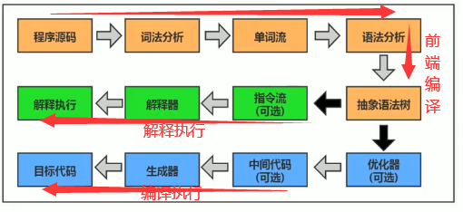
  - 解释执行、编译执行：改为解释过程，编译过程比较合适
- Java代码编译是由：Java源码编译器来完成的：javac xxx.java（应该就是前端编译）
  - 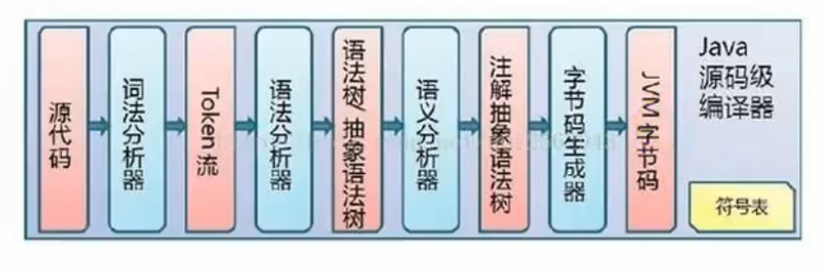
- Java字节码的执行是由JVM执行引擎来完成的：
  - 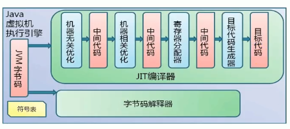
- 什么是解释器？什么是JIT编译器？
  - 解释器：Interpreter：当JVM启动时会根据预定义的规范**对字节码采用逐行解释的方式执行**，将每条字节码文件中的内容“**翻译**”为对应平台的本地机器指令**执行**
  - JIT编译器：Just In Time Compiler：JVM将源代码直接编译成本地机器平台相关的机器语言(只是翻译而不是执行)
- 为什么说Java是半编译半解释型语言？
  - JDK1.0时代，将Java语言定位为“解释执行”比较准确
  - 但是之后，Java也发展出了可以直接生成本地代码的编译器，在执行Java代码的时候，通常都会将解释执行与编译执行两者结合起来进行

### 7.3 机器码、指令、汇编语言

- 机器码：01串
  - 各种用二进制编码方式表示的指令，叫做机器指令码。开始，人们就用它采编写程序，这就是机器语言。
  - 机器语言虽然能够被计算机理解和接受，但和人们的语言差别太大，不易被人们理解和记忆，并且用它编程容易出差错。
  - 用它编写的程序一经输入计算机，cPU直接读取运行，因此和其他语言编的程序相比，执行速度最快。
  - 机器指令与CPU紧密相关，所以不同种类的CPU所对应的机器指令也就不同。
- 指令：01串的组合
  - 由于机器码是有0和1组成的二进制序列，可读性实在太差，于是人们发明了指令。指令就是把机器码中特定的o和1序列，简化成对应的指令（一般为英文简写，如mov,inc等），可读性稍
  - 由于不同的硬件平台，执行同一个操作，对应的机器码可能不同，所以不同的硬件平台的同一种指令(比如mov)，对应的机器码也可能不同。
  - 指令集：
    - 不同的硬件平台，各自支持的指令，是有差别的。因此每个平台所支持的指令，称之为对应平台的指令集。
    - X86指令集,对应的是X86架构的平台
    - ARM指令集，对应的是ARM架构的平台
- 汇编语言：指令的抽象
  - 由于指令的可读性还是太差，于是人们又发明了汇编语言。
  - 在汇编语言中，用助记符（Mnemonics）代替机器指令的操作码，用地址符号(Symbo1）或标号(Labe1)代替指令或操作数的地址。
  - 在不同的硬件平台，汇编语言对应着不同的机器语言指令集，通过汇编过程转换成机器指令。
  - 由于计算机只认识指令码，所以用汇编语言编写的程序还必须翻译成机器指令码，计算机才能识别和执行。
- 高级语言：更加抽象，接近人的理解
  - 为了使计算机用户编程序更容易些，后来就出现了各种高级计算机语言。高级语言比机器语言、汇编语言更接近人的语言
  - 当计算机执行高级语言编写的程序时，仍然需要把程序解释和编译成机器的指令码。完成这个过程的程序就叫做解释程序或编译程序。
- 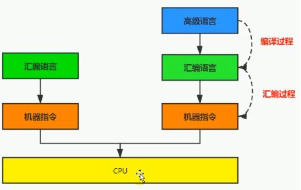
- C、C++源程序执行过程：
  - 编译过程可以分为两个阶段：编译和汇编：
    - 编译过程：读取源程序(字符流)，对其进行词法、语法分析，将高级语言指令转换为功能等效的汇编代码
    - 汇编过程：实际上把汇编语言代码翻译成目标机器指令的过程
  - 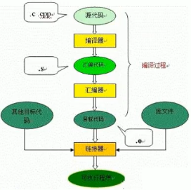
- Java中的字节码？
  - 字节码是一种中间状态(中间码)的二进制代码(文件)，比机器码更加抽象，需要直译器转译后才能成为机器码
  - 字节码主要是为了实现特定软件运行和软件环境，使其与硬件环境无关
  - 字节码的实现方式是通过编译器和虚拟机器。编译器将源码编译成字节码，特定平台上的虚拟机将字节码转译为可以直接执行的指令

### 7.4 解释器

- JVM的初衷仅仅是单纯的为了满足Java程序实现跨平台特性，因此避免采用静态编译的方式直接生成本地机器指令，从而诞生了实现解释器在运行时采用逐行解释字节码执行程序的想法
  - 因为要跨平台，不同的Java源文件生成不同平台的机器指令有点麻烦（每次都要重新编译汇编），不如先生成一个中间文件（统一标准，编译成字节码指令就可以了，再由JVM进行汇编执行），再由不同平台的JVM进行解释执行更加方便快捷
  - 
- 解释器的工作机制：
  - 就是一个运行时“翻译者”，将字节码文件中的内容”翻译“为对应平台的本地机器指令执行
  - 当一条字节码指令被解释执行完成后，再接着根据PC寄存器中记录的下一条需要被执行的字节码指令执行解释操作
- 解释器的分类：
  - 字节码解释器（很早）：在执行时通过纯软件代码模拟字节码的执行，效率非常低下。
  - 模板解释器（现在）：将每一条字节码和一个模板函数相关联，模板函数中直接产生这条字节码执行时的机器码，从而很大程度上提高了解释器的性能。
    - 在HotSpot vM中，解释器主要由Interpreter模块和Code模块构成。
      - Interpreter模块:实现了解释器的核心功能
      - Code模块:用于管理HotSpot VM在运行时生成的本地机器指令
- 现状：
  - 由于解释器在设计和实现上非常简单，因此除了Java语言之外，还有许多高级语言同样也是基于解释器执行的，比如Python、Perl、Ruby等。但是在今天，基于解释器执行已经沦落为低效的代名词，并且时常被一些C/C++程序员所调侃。
  - 为了解决这个问题，JVM平台支持一种叫作即时编译（JIT）的技术。即时编译的目的是避免函数被解释执行，而是将整个函数体编译成为机器码，每次函数执行时，只执行编译后的机器码即可，这种方式可以使执行效率大幅度提升。
  - 不过无论如何，基于解释器的执行模式仍然为中间语言的发展做出了不可磨灭的贡献。

### 7.5 JIT编译器

- HotSpot VM是目前市面上高性能虚拟机的代表作之一，采用解释器与即时编译器并存的架构。在Java虚拟机运行时，解释器和即时编译器能够相互协作，各自取长补短，尽力去选择最合适的方式来权衡编译本地代码的时间和直接解释执行代码的时间

- 目前来说，Java程序的运行性能已经可以达到和c/c++程序一教高下的地步

- 有JIT编译器了还要解释器？
  
  - 当程序启动后，解释器可以马上发挥作用，省去编译的时间，立即执行
  - JIT编译器想发挥作用，把代码编译成本地代码，需要一定的执行时间，但编译为本地代码后，执行效率高
  - 因此：
    - 尽管JRockit VM中程序的执行性能会非常高效，但程序在启动时必然需要花费更长的时间来进行编译。
    - 对于服务端应用来说，启动时间并非是关注重点，
    - 对于那些看中启动时间的应用场景而言，或许就需要采用解释器与即时编译器并存的架构来换取—个平衡点。在此模式下，当Java虚拟器启动时，解释器可以首先发挥作用，而不必等待即时编译器全部编译完成后再执行，这样可以省去许多不必要的编译时间。随着时间的推移，编译器发挥作用，把越来越多的代码编译成本地代码，获得更高的执行效率。
    - 同时，解释执行在编译器进行激进优化不成立的时候，作为编译器的“逃生门”。
    - HotSpot VM：启动的时候，解释器可以首先发挥作用，而不必等待即时编译器全部编译完成再执行，这样可以省去许多不必要的编译时间。并且随着程序运行时间的推移，即时编译器逐渐发挥作用，根据热点探测功能，将有价值的字节码编译为本地机器指令，以换取更高的程序执行效率。

- 案例：
  
  - 注意解释执行与编译执行在线上环境微妙的辩证关系。机器在热机状态可以承受的负载要大于冷机状态。如果以热机状态时的流量进行切流，可能使处于冷机状态的服务器因无法承载流量而假死。
  - 在生产环境发布过程中，以分批的方式进行发布，根据机器数量划分成多个批次，每个批次的机器数至多占到整个集群的1/8。曾经有这样的故障案例:某程序员在发布平台进行分批发布，在输入发布总批数时，误填写成分为两批发布。如果是热机状态，在正常情况下一半的机器可以勉强承载流量，但由于刚启动的JVM均是解释执行，还没有进行热点代码统计和JIT动态编译，导致机器启动之后，当前1/2发布成功的服务器马上全部宕机，此故障说明了JIT 的存在。—阿里团队

- 总结图：
  
  - 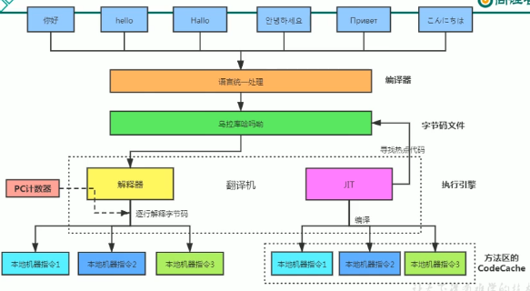

- 编译器详细概念解释：
  
  - Java的编译期其实是一段不确定的操作过程，
    
    - 因为它可能是指一个**前端编译器**(编译器的前端)：把.java文件转换为.class文件的过程
    
    - 也有可能是指JVM的**后端运行期编译器**(JIT编译器，Just In Time Compiler)：把字节码转换为为机器码的过程
    
    - 也有可能是指使用**静态提前编译器**(AOT编译器，Ahead Of Time Compiler)：直接把.java文件编译成本机器代码的过程
    
    - > 前端编译器: sun的 Javac、Eclipse JDT中的增量式编译器（ECJ)。
      > 
      > JIT 编译器:HotSpot VM的c1、c2编译器。
      > 
      > AOT编译器:GNU Compiler for the Java (GCJ)、Excelsior JET.

- 什么时候使用JIT编译器？
  
  - 需要了解热点代码？探测方式？
  - 是否需要启动JIT编译器将字节码直接编译为对应平台的本地机器指令，需要根据代码**被调用执行的频率**而定。
    - 关于那些需要被编译为本地代码的字节码，称之为“**热点代码**”
    - JIT编译器在运行时会针对那些频繁被调用的热点代码做出**深度优化**，将其直接编译为对应平台的本地机器指令，以提升Java程序的执行性能

- 热点代码以及探测方式
  
  - 一个被多次调用的方法，或者是一个方法体内部循环次数较多的循环体都可以被称之为“热点代码”，因此都可以通过JIT编译器编译为本地机器指令。由于这种编译方式发生在方法的执行过程中，因此也被称之为栈上替换，或简称为OSR (on StackReplacement）编译。
  - 一个方法究竟要被调用多少次，或者一个循环体究竟需要执行多少次循环才可以达到这个标准?
    - 必然需要一个明确的阈值，JIT编译器才会将这些“热点代码”编译为本地机器指令执行。这里主要依靠热点探测功能。
    - 目前HotSpot VM所采用的热点探测方式是基于计数器的热点探测。
      - 采用基于计数器的热点探测，HotSpot VM将会为每一个方法都建立2个不同类型的计数器，分别为方法调用计数器(Invocation Counter）和回边计数器(BackEdge Counter) 
        - 方法调用计数器：用于统计方法的调用次数
        - 回边计数器：用于统计循环体执行的循环次数

- 方法调用计数器：
  
  - 用于统计方法被调用的次数，默认阈值在Client模式下是1500次，在Server模式下是10000次，超过这个阈值，就会触发JIT编译
  - 也可以根据虚拟机参数：-XX:CompileThreshold来人为设定
  - 当一个方法被调用时，会先检查该方法是否存在被JIT编译过的版本
    - 如果存在，则优先使用编译后的本地代码执行
    - 如果不存在，则将词方法的调用计数器值+1，然后判断方法调用计数器与回边计数器值之和是否超过方法调用计数器的阈值，如果已经超过阈值，那么将会JIT编译器提交一个该方法的代码编译请求
  - 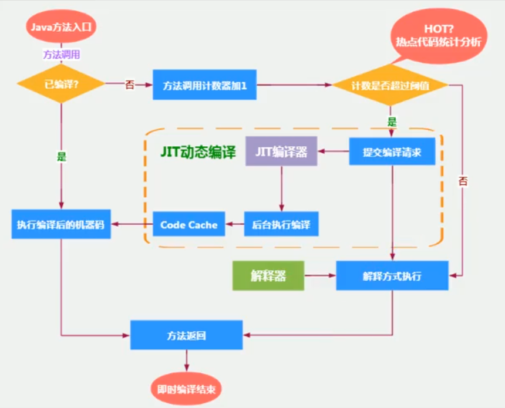
  - 热度衰减：
    - 如果不做任何设置，方法调用计数器统计的并不是方法被调用的绝对次数，而是一个相对的执行频率（一段时间之内方法被调用的次数）。当超过一定的时间间隔，如果方法的调用次数仍然不足以让它提交给JIT编译器编译，那么这个方法的调用计数器就会减少一半，这个过程就称为方法调用计数器热度的**衰减（Counter Decay）**，而这段时间就被称为此方法统计的**半衰周期(Counter Half Life Time)**.
    - 进行热度衰减的动作是在虚拟机进行垃圾收集时顺便进行的，可以使用虚拟机参数-XX: -UseCounterDecay来关闭热度衰减，让方法计数器统计方法调用的绝对次数，这样，只要系统运行时间足够长，绝大部分方法都会被编译成本地代码。
    - 另外，可以使用-XX:CounterHalfLifeTime参数设置半衰周期的时间，单位是秒。

- 回边计数器：
  
  - 它的作用是统计一个方法中循环体代码执行的次数，在字节码中遇到控制流向后跳转的指令称为“回边”(Back Edge）。显然，建立回边计数器统计的目的就是为了触发OSR编译。
  - 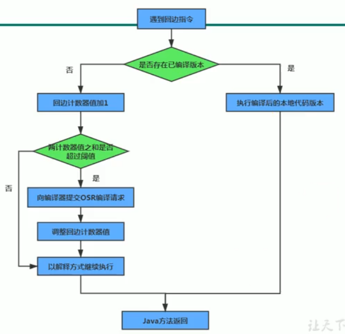

### 7.6 HotSpot VM的程序执行方式

- 默认情况下，HotSpot VM是采用解释器和JIT编译器并存的架构，也可以针对具体场景，通过命令显式的为Java虚拟机指定在运行时到底是完全采用解释器执行还是完全采用即时编译器执行
  - -Xint：完全采用解释器模式执行程序
  - -Xcomp：完全采用即时编译器模式执行程序，如果即时编译器出现问题，解释器会介入执行
  - -Xmixed：采用解释器+即时编译器的混合模式共同执行程序
- HotSpot VM中JIT分类
  - 在Hotspot VM中内嵌有两个JIT编译器，分别为client compiler和server Compiler，但大多数情况下我们简称为C1编译器和C2编译器。开发人员可以通过如下命令显式指定Java虚拟机在运行时到底使用哪一种即时编译器，如下所示:
  - -client：指定Java虚拟机运行在client模式下，并使用c1编译器；c1编译器会对字节码进行简单和可靠的优化，耗时短。以达到更快的编译速度。
  - -server：指定Java虚拟机运行在server模式下，并使用c2编译器。c2进行耗时较长的优化，以及激进优化。但优化的代码执行效率更高。
- C1和C2编译器不同的优化策略∶
  - 在不同的编译器上有不同的优化策略，
  - c1编译器上主要有方法内联，去虚拟化、冗余消除。
    - 方法内联:将引用的函数代码编译到引用点处，这样可以减少栈帧的生成，减少参数传递以及跳转过程
    - 去虚拟化:对唯一的实现类进行内联
    - 冗余消除:在运行期间把一些不会执行的代码折叠掉
  - c2的优化主要是在全局层面，逃逸分析是优化的基础。基于逃逸分析在c2上有如下几种优化:
    - 标量替换:用标量值代替聚合对象的属性值
    - 栈上分配:对于未逃逸的对象分配对象在栈而不是堆
    - 同步消除:清除同步操作，通常指synchronized
- 分层编译策略：
  - 分层编译(Tiered compilation）策略:程序解释执行（不开启性能监控）可以触发c1编译，将字节码编译成机器码，可以进行简单优化，也可以加上性能监控，C2编译会根据性能监控信息进行激进优化。
  - 不过在Java7版本之后，一旦开发人员在程序中显式指定命令“-server”时，默认将会开启分层编译策略，由c1编译器和c2编译器相互协作共同来执行编译任务。
- 小节：
  - JIT编译出来的机器码性能比解释器高
  - c2编译器启动时长比c1编译器慢，系统稳定执行以后，c2编译器执行速度比c1编译器快
- 未来：
  - 自JDK10起，HotSpot又加入一个全新的JIT编译器: Graal编译器。编译效果短短几年时间就追评了C2编译器。未来可期。
  - 目前，带着“实验状态"标签，需要使用开关参数一XX:+UnlockExperimentalvMoptions -XX:+UseJVMCICompiler去激活，才可以使用。

### 7.7 AOT编译器

- jdk9引入了AOT编译器(静态提前编译器，Ahead of Time compiler)
- Java 9 引入了实验性 AOT编译工具jaotc。它借助了Graal 编译器，将所输入的Java类文件转换为机器码，并存放至生成的动态共享库之中。
- 所谓AOT 编译，是与即时编译相对立的一个概念。我们知道，即时编译指的是在程序的运行过程中，将字节码转换为可在硬件上直接运行的机器码，并部署至托管环境中的过程。而AOT编译指的则是，在程序运行之前，便将字节码转换为机器码的过程。
  - .java->.class->.so
- 优点: Java虚拟机加载已经预编译成二进制库，可以直接执行。不必等待即时编译器的预热，减少Java应用给人带来“第一次运行慢”的不良体验。
- 缺点:
  - 破坏了java"一次编译，到处运行”，必须为每个不同硬件、os编译对应的发行包。
  - 降低了Java链接过程的动态性，加载的代码在编译期就必须全部已知。
  - 还需要继续优化中，最初只支持Linux x64 java base

## 8. String Table

### 8.1 String 基本特性

- String：字符串；使用一对“”引起来表示
  
  - 创建：
  
  - ```java
    String s1 = "asd";
    String s2 = new String("asd");
    ```

- String声明为final的类，不可以被继承
  
  - 实现了Serializable接口：表示字符串是支持序列化的
  - 实现了Comparable接口：表示String是可以比较大小的

- String底层存储结构：
  
  - jdk8及之前：final char[] value
  - jdk9：final byte[] value + 编码标记
  - why？
    - 因为String是堆中的主要成分，并且大部分但是存储Latin-1字符，一个byte就可以存储，如果使用char占用两个字节导致一半的内存被浪费
    - 因此将String类型的底层存储改为了byte[]并且提供了编码标识，如果是latin-1/ISO-8850-1就使用一个字节，如果是UFT-16就使用两个字节

- String不可变性：代表不可变的字符序列
  
  - 当对字符串重新赋值时，需要重写指定内存区域赋值，不能使用原有的value进行赋值
  - 当对现有的字符串进行连接操作时，也需要重新指定内存区域赋值，不能使用原有的value进行赋值
  - 当调用String的replace()方法修改指定字符或者字符串时，也需要重新指定内存区域赋值，不能使用原有的value进行赋值
  - 通过字面量的方式(不是new)给字符串赋值，此时的字符串值声明存储在字符串常量池中

- 字符串常量池中不会存储相同内容的字符串！

- String的字符串常量池是一个固定大小的Hashtable,
  
  - jdk6及以前：默认大小长度是1009，如果放进String Pool的String非常多，就会造成Hash冲突严重，导致链表会很长，从而导致当调用String.intern时性能大幅下降
    - intern()：如果字符串常量池中没有对应的字符串的话，则在常量池中生成(需要查找对比耗时)
  - 在jdk7及以后：StringTable的长度默认值是60013，
  - jdk8开始：1009是可设置的最小值，之前无要求
  - -XX:StringTableSize：可设置StringTable的长度

### 8.2 String 内存分配

- 在Java中有8种数据类型和一种比较特殊的类型String，由于这些数据类型经常使用，为了让他们在运行过程中速度更快、更节省内存，都提供了一种常量池的概念
- 常量池就类似一个Java系统级别提供的缓存，8种数据类型的常量池都是系统协调的，String类型的常量池比较特殊，主要使用方法有两种：
  - 直接使用双引号声明出来的String对象会直接存储在常量池中
  - 用new的方式创建的String对象本来就在堆中，字符串字面量存储在常量池中
  - 如果不是用双引号声明的String对象，可以使用String提供的intern()方法
- 字符串常量池位置的演变：
  - jdk6及以前：字符串常量池放在方法区中（也就是永久代）
  - jdk7：对字符串池的逻辑做了很大的改变：将字符串常量池的位置调整到Java堆内
    - 所有的字符串都保存在Heap中，和其他普通对象一样，这样就可以在进行调优应用时，仅需要调整堆大小就可以了
    - 字符串常量池概念原本使用的比较多，这个改动使得我们有足够的理由考虑在jdk1.7 中使用String.intern()
  - jdk8：即是方法区是用本地内存的元空间实现，但是字符串常量池还是在堆内
  - StringTable为什么要调整？
    - permSize默认较小
    - 永久代垃圾回收频率低

### 8.3 String 基本操作

```java
// Java语言规范里要求完全相同的字符串字面量，应该包含同样的Unicode字符序列，并且必须是指向同一个String类实

class Test1{
    public static void mian(String[] arges){
        // debug可以看出内存变化和引用
        System.out.println("1"); // 2294:字符串常量池的元素个数
        System.out.println("2");
        System.out.println("3");
        System.out.println("4");
        System.out.println("5");
        System.out.println("6");
        System.out.println("7");
        System.out.println("8");
        System.out.println("9");
        System.out.println("10");//2303
        // 如下的字符串"1"到“10”不会再次加载到内存
        System.out.println("1");// 2304
        System.out.println("2");// 2304
        System.out.println("3");
        System.out.println("4");
        System.out.println("5");
        System.out.println("6");
        System.out.println("7");
        System.out.println("8");
        System.out.println("9");
        System.out.println("10");

    }

}
```

```java
class Memory{
    public static void main(String[] args){
        int i = 1;
        Object obj = new Object();
        Memory mem = new Memory();
        mem.foo(obj);
    }

    private void foo(Object param){
        // 此时一个字符串被创建在了字符串常量池，并且一个引用也在foo栈帧中被创建并且指向该字符串
        String str = param.toString();
        System.out.println(str);
    }
}
```

- 上份代码对应的图
- 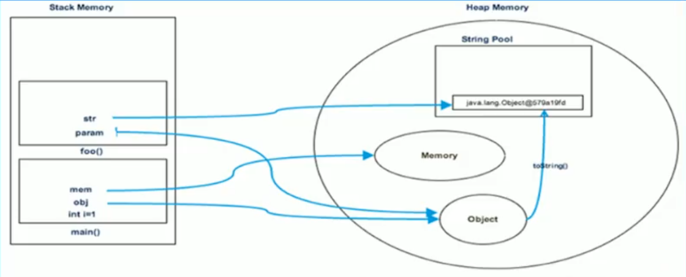

### 8.4 String 拼接

- 常量与常量的拼接结果在常量池，原理是前期 编译期优化
  
  - ```java
    public void test1(){
        String s1 = "a"+"b";// 反编译后看.class文件，发现就等同与"ab"
        String s2 = "ab";// "ab"一定是存放在字符串常量池中，将此地址赋值给s2
        /*
        最终.java文件编译成.class时，就已经是
        String s1 = "ab";
        String s2 = "ab";
        */
        System.out.println(s1==s2);// true
        System.out.println(s1.equals(s2));// true
    }
    ```

- 常量池中不会存在相同内容的常量。

- 只要其中有一个是变量，结果就在堆(对象实例中)中。变量拼接的原理是stringBuilder
  
  - ```java
    public void test2(){
        String s1 = "javaEE";
        String s2 = "hadoop";
    
        String s3 = "javaEEhadoop";
        String s4 = "javaEE"+"hadoop"; // 编译期优化
         // 拼接符号+出现了变量，则需要在堆空间中new String()，具体的内容为拼接的结果
        String s5 = s1+"hadoop";
        String s6 = "javaEE"+s2;
        String s7 = s1+s2;
    
        System.out.println(s3==s4);// true
        System.out.println(s3==s5);// false
        System.out.println(s3==s6);// false
        System.out.println(s3==s7);// false
        System.out.println(s5==s6);// false
        System.out.println(s5==s7);// false
        System.out.println(s6==s7);// false
        // intern()：判断字符串常量池中是否存在 javaEEhadoop
        // 如果存在：则返回常量池中该字符串的地址
        // 如果不存在：则在常量池中加载一份javaEEhadoop.并且返回该字符串的地址
        String s8 = s6.intern();
        System.out.println(s3==s8);// true
    
    }
    ```

- 如果拼接的结果调用intern ()方法，则主动将常量池中还没有的字符串对象放入池中，并返回此对象地址。

- 详解：

- ```java
  public void test3(){
      String s1 = "a";
      String s2 = "b";
      String s3 = "ab";
      /* =>查看编译后的.class 文件可以看到：使用jclasslib查看对应方法的字节码指令即可
          s1+s2的执行细节：
          // jdk5.0之前，使用的是StringBuffer
          1. StringBuilder s = new StringBuilder(); 
          2. s.append("a");
          3. s.append("b");
          4. s.toString() -->类似于 new String("ab");
      */
      String s4 = s1+s2;
      System.out.println(s3==s4);// false
  }
  
  public void test4(){
      // 常量引用
      final String s1 = "a";
      final String s2 = "b";
      String s3 = "ab";
      // 查看字节码文件可以发现，在编译期就优化为了s4 = "ab";
      String s4 = s1+s2;
      System.out.println(s3==s4);// true
  }
  
  /*
  1. 字符串拼接操作不一定使用的是StringBuilder!
      如果拼接符号左右两边都是字符串常量或者常量引用，则仍然是使用编译期优化，即非StringBuilder的方式
  2. 针对于final修饰的类、方法、基本数据类型、引用数据类型的量的结构时，能使用上就使用final
  */
  ```

- +拼接和StringBuilder的append的效率对比

- ```java
  public void method1(int highLevel){
      String src = "";
      for(int i=0;i<highLevel;i++){
          str = str + "a"; // 每次循环都会创建一个StringBuilder，并且调用toString方法
      }
  }
  public void method2(int highLevel){
      StringBuilder sb = new StringBuilder();
      for(int i=0;i<highLevel;i++){
          sb.append("a");
      }
  }
  public void test6(){
      long start = System.currentTimeMillis();
      method1(1000000);//4014
      method2(1000000);//7
      long end = System.currentTimeMillis();
  }
  /*
  通过StringBuilder的append()的方式添加字符串的效率远高于使用String的字符串拼接的方式
  为什么？
      1.StringBUilder的append()的方式：自始至终只创建过一个StringBuilder对象
      使用String字符串拼接的方式：创建过多个StringBuilder和String的对象
      2.使用String字符串拼接的方式：创建过多个StringBuilder和String的对象,内存中由于创建了较多的这些对象，内存占用更大，如果进行GC，需要花费额外的时间
  
  改进空间：
      StringBuilder 可以先确定加入的字符串大小，而不用使用默认的容量
  */
  ```

### 8.5 intern()使用

- 如果不是用双引号声明的String对象(不是使用字符串字面量的方式创建)，都可以使用String提供的intern方法：
  
  - intern方法会从字符串常量池中查询当前字符串是否存在，
  
  - 如果不存在就会将当前字符串放入常量池中
  
  - ```java
    // 如：
    String myInfo = new String("I love xxx").intern();
    ```

- 等价于：
  
  - 如果在任意字符串上调用String.intern()，其返回结果指向的那个类实例，必须和直接以常量形式出现的字符串实例完全相同，因此：以下表达式必定为true
    
    - ```java
      ("a"+"b"+"c").intern()=="abc";
      ```
  
  - 也就是说，Interned String就是确保字符串在内存里只有一份拷贝，这样可以节约内存空间，加快字符串操作任务的执行速度，这个值会被放在字符串内部池(String Intern Pool)

- 问题：如何保证变量s指向的是字符串常量池中的数据，而不是堆空间中对象的实例呢？
  
  - 有两种方式：
  
  - ```java
    // 法一：字面量定义的方式
    String s = "sadasd";
    // 法二：调用intern()方法
    String s = new String("asd").intern();
    String s1 = new StringBuilder("asdsad").toString().intern();...
    ```

### 8.6 new String问题

- ```java
  new String("ab")//会创建几个对象？看字节码!!!
      // 对象1：new 关键字在对中创建的String对象
      // 对象2：字符串常量池中的对象"ab"，对应字节码指令：ldc
  
  new String("a")+new String("b")// 会创建几个对象？
      // 对象1：new StringBuider()
      // 对象2：new String("a")
      // 对象3：常量池中的"a"
      // 对象4：new String("b")
      // 对象5：常量池中的"b"
      // 深入剖析：StringBuilder的toString()：
          // 看字节码之后
          // 对象6：new String("ab");
          // 但是toString()的调用。在字符串常量池中并没有生成"ab"
  ```

### 8.7 intern()面试问题

- 问题的主要来源：
  
  - JDK6以及之前：字符串常量池存放在方法区中
  - JDK7以及之后：字符串常量池存放在堆中

- ```java
  public static void main(String[] args){
      String s = new String("1");
      s.intern();// 调用此方法前，字符串常量池中已经存在"1"了
      String s2 = "1";
      System.out.println(s==s2) // jdk6:false,jdk7:false
  
      // s3变量记录的地址为：new String("11")，不是字符串常量池中的地址
      String s3 = new String("1")+new String("1");
      s3.intern();// 执行完上一行代码，字符串常量池中只存在"1"，不存在"11"，因此intern()会在字符串常量池中生成"11"
      // jdk6：创建了一个新的对象"11"，也就有了新的地址
      // jdk7:此时字符串常量池中并没有创建"11"，因为堆中已经有了一个new String("11")的对象，因此在字符串常量池中创建一个指向堆空间中new String("11")的地址
      String s4 = "11";// s4变量记录的地址：使用的是上一行代码执行时，在常量池中生成的"11"的地址
      System.out.println(s3==s4);// jdk6:false,jdk7:true
  }
  ```

- 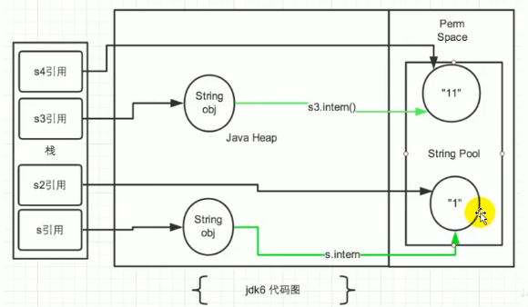

- 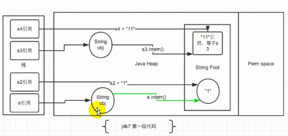

- ```java
  public static void main(String[] args){
  
      String s3 = new String("1")+new String("1");// 此时字符串常量池中不存在"11"
      String s4 = "11";// 此时字符串常量池中存在"11"
      String s5 = s3.intern(); // 此时因为字符串常量池中存在"11"，因此intern()不起作用
      System.out.println(s3==s4);// false
      System.out.println(s4==s5);// true
  }
  ```

- 小节：
  
  - 在JDK1.6以及之前：intern()尝试将这个字符串对象放入字符串常量池中
    - 如果字符串常量池中存在这个字符串，则不会放入，并且返回字符串常量池中已有的字符串对象的地址
    - 如果字符串常量池中不存在这个字符串，则会把该对象复制一份，放入常量池，并且返回字符串常量池中的那个字符串对象地址
  - 在JDK1.7以及之后：intern()尝试将这个字符串对象放入字符串常量池中
    - 如果字符串常量池中存在这个字符串，则不会放入，并且返回字符串常量池中已有的字符串对象的地址
    - 如果字符串常量池中不存在这个字符串，则会把对象的引用地址(String对象的地址)复制一份，放入字符串常量池汇总，并且返回该对象的引用地址(此时该地址也在字符串常量池中)

- 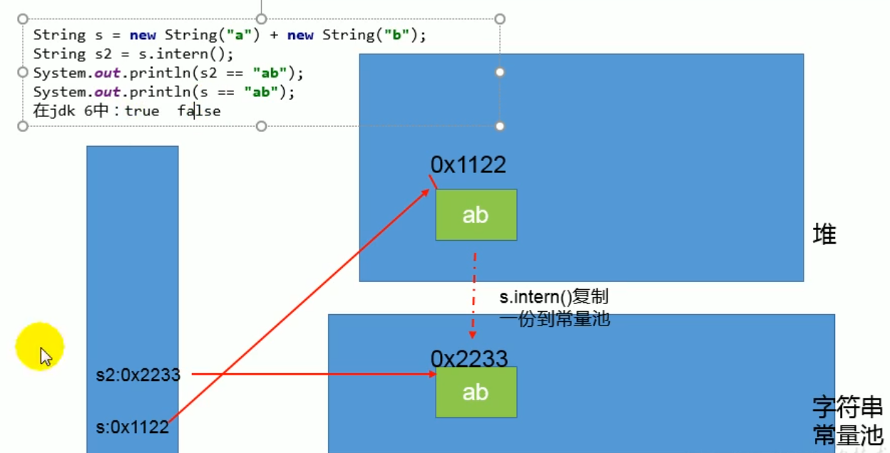

- 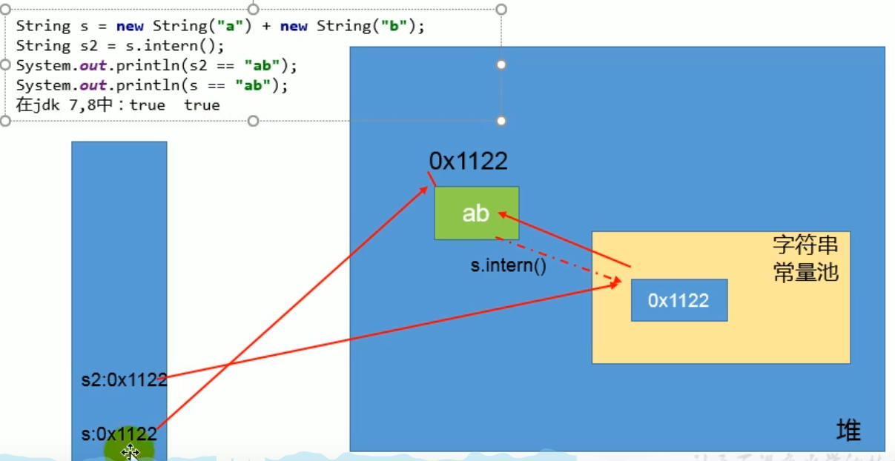

- 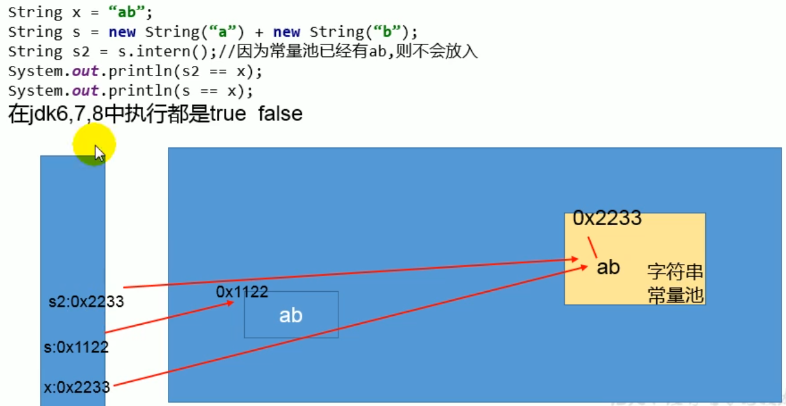

- intern()使用的好处：
  
  - 对于程序汇中大量存在的字符串，并且存在很多重复的字符串时，使用intern()可以节省内存空间和时间

### 8.8 String Table垃圾回收行为

- 实例程序查看详细信息

- ```java
  // 虚拟机参数设置：
  // -Xms15m -Xmx15m -XX:+PrintStringTableStatistics -XX:+PrintGCDetails
  public class StringGCTest{
      public static void main(String[] args){
          for(int i=0;i<10000000;i++){
              String.valueOf(i).intern();
          }
      }
  }
  ```

- G1的String去重操作？
  
  - 为什么要String去重？
    - 背景:对许多Java应用(有大的也有小的）做的测试得出以下结果
      - 堆存活数据集合里面string对象占了25%
      - 堆存活数据集合里面重复的string对象有13.5%string对象的平均长度是45
      - 许多大规模的Java应用的瓶颈在于内存，测试表明，在这些类型的应用里面，Java堆中存活的数据集合差不多25%是string对象。
      - 更进一步，这里面差不多一半string对象是重复的，重复的意思是说:
        string1.equals(string2 ) =true。堆上存在重复的string对象必然是一种内存的浪费。这个项目将在G1垃圾收集器中实现自动持续对重复的string对象进行去重，这样就能避免浪费内存。
  - 怎么String去重？
    - 当垃圾收集器工作的时候，会访问堆上存活的对象。对每一个访问的对象都会检查是否是候选的要去重的string对象。
    - 如果是，把这个对象的一个引用插入到队列中等待后续的处理。一个去重的线程在后台运行，处理这个队列。处理队列的一个元素意味着从队列删除这个元素，然后尝试去重它引用的string对象。
    - 使用一个hashtable来记录所有的被string对象使用的不重复的char数组。
      当去重的时候，会查这个hashtable，来看堆上是否已经存在一个一模一样的char数组。
    - 如果存在，string对象会被调整引用那个数组，释放对原来的数组的引用，最终会被垃圾收集器回收掉。
    - 如果查找失败，char数组会被插入到hashtable，这样以后的时候就可以共
      享这个数组了。
  - 参数设置：
    - 命令行选项
    - UsestringDeduplication (bool):开启string去重，默认是不开启的，需要手动开启。
    - PrintstringDeduplicationstatistics (bool):打印详细的去重统计信息
    - stringDeduplicationAgeThreshold (uintx):达到这个年龄的string对象被认
      为是去重的候选对象

## 9. 垃圾回收

### 9.1 垃圾？

- 关于垃圾收集的经典问题：
  - 哪些内存需要回收？
  - 什么时候回收？
  - 如何回收？
- 什么是垃圾？
  - 垃圾是指在运行程序中**没有任何指针指向的对象**，这个对象就是需要被回收的垃圾。
  - An object is considered garbage when it can no longer be reached from any pointer in the runningprogram.
- 如果不及时对内存中的垃圾进行清理，那么，这些垃圾对象所占的内存空间会一直保留到应用程序结束，被保留的空间无法被其他对象使用。甚至可能导致内存溢出。
- 为什么需要垃圾回收？
  - 对于高级语言来说，一个基本认知是如果不进行垃圾回收，**内存迟早都会被消耗完**，因为不断地分配内存空间而不进行回收，就好像不停地生产生活垃圾而从来不打扫一样。
  - 除了释放没用的对象，垃圾回收也可以清除内存里的记录碎片。碎片整理将所占用的堆内存移到堆的一端，以便**JVM将整理出的内存分配给新的对象**。
  - 随着应用程序所应付的业务越来越庞大、复杂，用户越来越多，**没有GC就不能保证应用程序的正常进行**。而经常造成sTw的Gc又跟不上实际的需求，所以才会不断地尝试对Gc进行优化。
- 早期的垃圾回收：
  - 在早期的C/C++时代，垃圾回收基本上是手工进行的。开发人员可以使用new关键字进行内存申请，并使用delete关键字进行内存释放。
  - 这种方式可以灵活控制内存释放的时间，但是会给开发人员带来频繁申请和释放内存的管理负担。倘若有一处内存区间由于程序员编码的问题忘记被回收，那么就会产生**内存泄漏**,垃圾对象永远无法被清除，随着系统运行时间的不断增长，垃圾对象所耗内存可能持续上升，直到出现内存溢出并造成**应用程序崩溃**。
  - 现在大部分语言：都使用自动垃圾回收的机制
- Java的自动内存管理：
  - 自动内存管理，无需开发人员手动参与内存的分配与回收，这样降低内存泄漏和内存溢出的风险
    - 没有垃圾回收器，java也会和cpp一样，各种悬垂指针，野指针，泄露问题
      让你头疼不已。
  - 自动内存管理机制，将程序员从繁重的内存管理中释放出来，可以更专心地专注于业务开发
  - 对于Java开发人员而言，自动内存管理就像是一个黑匣子，如果过度依赖于“自动”，那么这将会是一场灾难，最严重的就会弱化Java开发人员在程序出现内存溢出时定位问题和解决问题的能力。I
  - 此时，了解JVM的自动内存分配和内存回收原理就显得非常重要，只有在真正了解JVM是如何管理内存后，我们才能够在遇见outOfMemoryError时，快速地根据错误异常日志定位问题和解决问题。
  - 当需要排查各种内存溢出、内存泄漏问题时，当垃圾收集成为系统达到更高并发量的瓶颈时，我们就必须对这些“自动化”的技术实施必要的监控和调节。

### 9.2 垃圾回收算法

#### 9.2.1 标记阶段-找垃圾

- 什么是垃圾标记阶段？
  - 在堆里存放着几乎所有的Java对象实例，在GC执行垃圾回收之前，首先需要区分出内存中哪些是存活对象，哪些是已经死亡的对象。只有被标记为己经死亡的对象，GC才会在执行垃圾回收时，释放掉其所占用的内存空间，因此这个过程我们可以称为垃圾标记阶段。
- 在JVM中究竟是如何标记一个死亡对象呢?
  - 简单来说，当一个对象已经不再被任何的存活对象继续引用时，就可以宣判为已经死亡。
- 判断对象存活的方法？
  - 引用计数算法
  - 可达性分析算法
- 引用计数算法(Reference Counting)：
  - 引用计数算法(Reference Counting)比较简单，对每个对象保存一个整型的引用计数器属性。用于记录对象被引用的情况。
  - 对于一个对象A，只要有任何一个对象引用了A，则A的引用计数器就加1;当引用失效时，引用计数器就减1。只要对象A的引用计数器的值为0，即表示对象A不可能再被使用，可进行回收。
  - 优点：实现简单，垃圾对象便于辨识；判定效率高，回收没有延迟性。
  - 缺点：
    - 它需要单独的字段存储计数器，这样的做法增加了存储空间的开销
    - 每次赋值都需要更新计数器，伴随着加法和减法操作，这增加了时间开销
    - 引用计数器有一个严重的问题，即无法**处理循环引用**的情况。这是一条致命缺陷，导致在**Java的垃圾回收器中没有使用这类算法**。
- 什么是循环引用？
  - 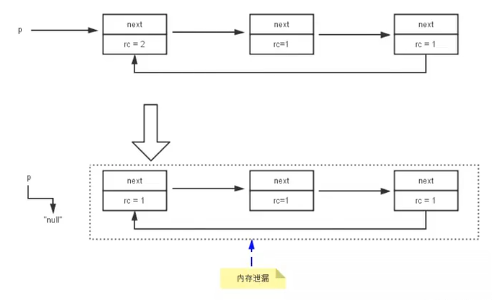
- 引用计数算法的使用：
  - 引用计数算法，是很多语言的资源回收选择，例如因人工智能而更加火热的Python，它更是同时支持引用计数和垃圾收集机制。
  - 具体哪种最优是要看场景的，业界有大规模实践中仅保留引用计数机制，以提高吞吐量的尝试。
  - Java并没有选择引用计数，是因为其存在一个基本的难题，也就是很难处理循环引用关系。
  - Python如何解决循环引用?
    - 手动解除:很好理解，就是在合适的时机，解除引用关系。
    - 使用**弱引用**weakref， weakref是Python提供的标准库，旨在解
      决循环引用。
- **可达性分析算法：（根搜索算法、追踪性垃圾收集）**
  - 相对于引用计数算法而言，可达性分析算法不仅同样具备实现简单和执行高效等特点，更重要的是该算法可以**有效地解决在引用计数算法中循环引用的问题**，防止内存泄漏的发生。
  - 相较于引用计数算法，这里的可达性分析就是Java、c#选择的。这种类型的垃圾收集通常也叫作追踪性垃圾收集（Tracing Garbage Collection) 
  - 基本思路：
    - 可达性分析算法是以根对象集合(GC Roots)为起始点，按照从上至下的方式搜索被根对象集合所连接的目标对象是否可达。
    - 使用可达性分析算法后，内存中的存活对象都会被根对象集合直接或间接连接着，搜索所走过的路径称为引用链(Reference Chain)
    - 如果目标对象没有任何引用链相连，则是不可达的，就意味着该对象己经死亡，可以标记为垃圾对象。
    - 在可达性分析算法中，只有能够被根对象集合直接或者间接连接的对象才是存活对象。
  - 什么是GC Roots根集合？
    - 一组必须活跃的引用
- GC Roots可以是哪些？
  - 虚拟机栈中引用的对象
    - 比如:各个线程被调用的方法中使用到的参数、局部变量等。
  - 本地方法栈内JNI(通常说的本地方法)引用的对象
  - 方法区中类静态属性引用的对象
    - 比如: Java类的引用类型静态变量
  - 方法区中常量引用的对象
    - 比如:字符串常量池（string Table）里的引用
  - 所有被同步锁synchronized持有的对象
  - Java虚拟机内部的引用
    - 基本数据类型对应的class对象，一些常驻的异常对象（如:
      NullPointerException、oOutofMemoryError)，系统类加载器。
  - 反映java虚拟机内部情况的JMXBean、JVMTI中注册的回调、本地代码缓存等。
  - 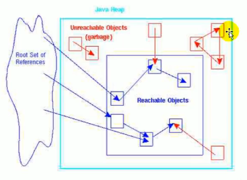
  - 小技巧：由于Root采用栈方式存放变量和指针，所以如果一个指针保存了堆内存中的对象，但是自己又不存放在堆内存里，那么它就是一个Root
  - 除了这些固定的GC Roots集合以外，根据用户所选用的垃圾收集器以及当前回收的内存区域不同，还可以有其他对象“临时性”地加入，共同构成完整GC Roots集合。比如:分代收集和局部回收（Partial GC）。
- 注意：
  - 如果要使用可达性分析算法来判断内存是否可回收，那么分析工作必须在一个能保障一致性的快照中进行。这点不满足的话分析结果的准确性就无法保证。
  - 这点也是导致Gc进行时必须"Stop The world"的一个重要原因。
    - 即使是号称（几乎）不会发生停顿的CMS收集器中，枚举根节点时
      也是必须要停顿的。

#### 9.2.2 对象的finalization机制

- 什么是finalization机制？
  - Java语言提供的对象终止机制(finalization)来允许开发人员提供对象被销毁之前的自定义处理逻辑
  - 当垃圾回收器发现没有引用指向一个对象，即：垃圾回收此对象之前，总会先调用这个对象的finalize()方法
  - finalize()方法允许在子类中被重写，**用于在对象被回收时进行资源的释放**，通常在这个方法中进行一些资源释放和清理工作，如：关闭文件、套接字和数据库连接等
- 如何使用finalize()？
  - 永远不要主动调用某个对象的finalize(任方法，应该交给垃圾回收机制调用。理由包括下面三点:
    - 在finalize ()时可能会导致对象复活。
    - finalize ()方法的执行时间是没有保障的，它完全由GC线程决定，极端情况下,若不发生GC，则finalize ()方法将没有执行机会。
    - 一个糟糕的finalize()会严重影响GC的性能。
  - 从功能上来说，finalize ( )方法与C++中的析构函数比较相似，但是Java采用的是基于垃圾回收器的自动内存管理机制，所以finalize()方法在本质上不同于c++中的析构函数。
- 由于finalize()方法的存在，虚拟机中的对象一般处于三种可能的状态：
  - 如果从所有的根节点都无法访问到某个对象，说明对象己经不再使用了。一般来说，此对象需要被回收。但事实上，也并非是“非死不可”的，这时候它们暂时处于“缓刑”阶段。**一个无法触及的对象有可能在某一个条件下“复活”自己**，如果这样，那么对它的回收就是不合理的，为此，定义虚拟机中的对象可能的三种状态
    - **可触及的：**从根节点开始，可以到达这个对象。
    - **可复活的：**对象的所有引用都被释放，但是对象有可能在finalize( )中复活。
    - **不可触及的：**对象的finalize ()被调用，并且没有复活，那么就会进入不可触
      及状态。不可触及的对象不可能被复活，因为finalize()只会被调用一次。
  - 以上3种状态中，是由于finalize()方法的存在进行的区分。只有在对象不可触及时才可以被回收。
- 对象回收并且是否调用finalize()方法的过程？
  - 判定一个对象objA是否可回收，至少要经历两次标记过程:
    - 如果对象objA到 GC Roots没有引用链，则进行第一次标记。
    - 进行筛选，判断此对象是否有必要执行finalize ()方法
      - 如果对象objA没有重写finalize()方法，或者finalize()方法已经被虚拟机调用过，则虚拟机视为“没有必要执行”，objA被判定为**不可触及**的。
      - 如果对象objA重写了finalize()方法，且还未执行过，那么objA会被插入到F-Queue队列中，由一个虚拟机自动创建的、低优先级的Finalizer线程触发其finalize()方法执行。
    - **finalize()方法是对象逃脱死亡的最后机会**，稍后GC会对F-Queue队列中的对象进行第二次标记。
      - 如果objA在finalize()方法中与引用链上的任何一个对象建立了联系，那么在第二次标记时，objA会被移出“即将回收”集合
        - 如果之后objA再次出现没有引用链存在的情况，finalize()方法不会被再次调用，对象会直接变成不可触及状态，也就是说：一个对象的finalize方法只会被调用一次

#### 9.2.3 使用MAT和JProfile观察GC Roots并且溯源

- 建议直接看视频：
  - https://www.bilibili.com/video/BV1PJ411n7xZ?p=145&spm_id_from=pageDriver
  - https://www.bilibili.com/video/BV1PJ411n7xZ?p=144
- MAT是Memory Analyzer的简称，它是一款功能强大的Java堆内存分析器。用于查找内存泄漏以及查看内存消耗情况。
- MAT是基于Eclipse开发的,是一款免费的性能分析工具。
- 大家可以在http://www.eclipse.org/mat/下载并使用MAT。

#### 9.2.4 清除阶段-标记-清除算法

- 当成功区分出内存中存活对象和死亡对象后，GC接下来的任务就是执行垃圾回收，释放掉无用对象所占用的内存空间，以便有足够的可用内存空间为新对象分配内存。
- 目前在JVM中比较常见的三种垃圾收集算法是
  - 标记-清除算法（ Mark-sweep )、
  - 复制算法（copying )、
  - 标记-压缩算法（Mark-compact ) 
- 标记清除算法：
  - 背景：
    - 标记–清除算法( Mark-sweep )是一种非常基础和常见的垃圾收集算法，该算法被J.McCarthy等人在1960年提出并并应用于Lisp语言。
  - 执行过程：
    - 当堆中的有效内存空间(available memory）被耗尽的时候，就会停止整个程序（也被称为stop the world)，然后进行两项工作，第一项则是标记，第二项则是清除。
      - **标记**：Collector从引用根节点开始遍历，标记所有被引用的对象。一般是在对象的Header中记录为可达对象。
      - **清除**：Collector对堆内存从头到尾进行线性的遍历，如果发现某个对象在其Header中没有标记为可达对象，则将其回收。
    - 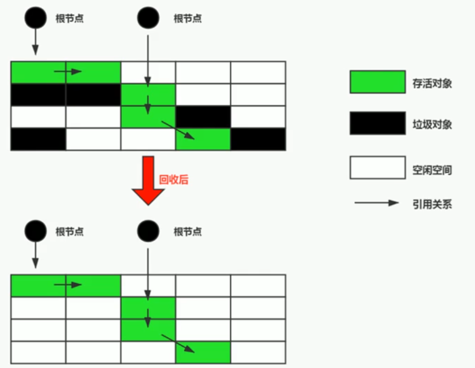
  - 缺点：
    - 效率不算高
    - 在进行GC的时候，需要停止整个应用程序，导致用户体验差
    - 这种方式清理出来的空闲内存是不连续的，产生内存碎片。需要维护一个**空闲列表**
  - **注意∶何为清除?**
    - 这里所谓的清除并不是真的置空，而是把需要清除的对象地址保存在空闲
      的地址列表里。下次有新对象需要加载时，判断垃圾的位置空间是否够，如果够，就存放

#### 9.2.5 清除阶段-复制算法

- 背景：
  - 为了解决标记-清除算法在垃圾收集效率方面的缺陷，M.L.Minsky于1963年发表了著名的论文，“使用双存储区的Lisp语言垃圾收集器CALISP Garbage collector Algorithm using serial secondary storage ) ”。M.L.Minsky在该论文中描述的算法被人们称为复制(copying)算法，它也被M.L.Minsky本人成功地引入到了Lisp语言的一个实现版本中。
- 核心思想：
  - 将活着的内存空间分为两块，每次只使用其中一块，在垃圾回收时将正在使用的内存中的存活对象复制到未被使用的内存块中，之后清除正在使用的内存块中的所有对象，交换两个内存的角色，最后完成垃圾回收。
- 优点：
  - 没有标记和清除过程，实现简单，运行高效
  - 复制过去以后保证空间的连续性，不会出现“碎片”问题
- 缺点：
  - 此算法的缺点也是很明显的，就是需要两倍的内存空间。
  - 对于G1这种分拆成为大量region的GC，复制而不是移动，意味着GC需要维护region之间对象引用关系（因为复制过去后，引用指向的地址也需要发生变化），不管是内存占用或者时间开销也不小。
- 特别的：
  - 如果系统中的垃圾对象很少，复制算法不会很理想，因为复制算法需要复制的存活对象数量太多，导致垃圾没有回收掉多少，开销都花费在了复制和重新引用方面了
- 应用场景：
  - 在新生代，对常规应用的垃圾回收，一次通常可以回收70%-99%的内存空间。回收性价比很高。所以现在的商业虚拟机都是用这种收集算法回收新生代。
  - 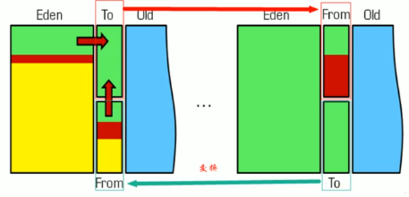

#### 9.2.6 清除阶段-标记-压缩算法

- 背景:
  - 复制算法的高效性是建立在存活对象少、垃圾对象多的前提下的。这种情况在新生代经常发生，但是在老年代，更常见的情况是大部分对象都是存活对象。如果依然使用复制算法，由于存活对象较多，复制的成本也将很高。因此，基于老年代垃圾回收的特性，需要使用其他的算法。
  - 标记-清除算法的确可以应用在老年代中，但是该算法不仅执行效率低下，而且在执行完内存回收后还会产生内存碎片，所以JVM的设计者需要在此基础之上进行改进。标记-压缩(Mark - compact)算法由此诞生。
  - 1970年前后，G. L. Steele 、C. J. Chene和D.S. wise 等研究者发布标记-压缩算法。在许多现代的垃圾收集器中，人们都使用了标记-压缩算法或其改进版本。
- 执行过程:
  - 第一阶段和标记清除算法一样，从根节点开始标记所有被引用对象
  - 第二阶段将所有的存活对象压缩到内存的一端，按顺序排放。
  - 之后，清理边界外所有的空间
  - 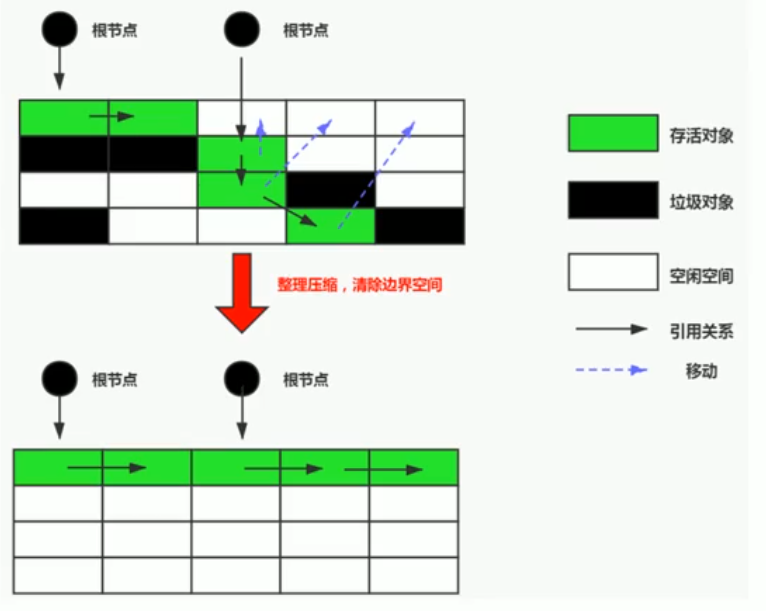
- 标记-压缩算法的最终效果等同于标记-清除算法执行完成后，再进行一次内存碎片整理，因此，也可以把它称为**标记-清除-压缩(Mark-SweepCompact)算法**。
- 二者的本质差异在于标记-清除算法是一种**非移动式的回收算法**，标记-压缩是**移动式的回收算法**。是否移动回收后的存活对象是一项优缺点并存的风险决策。
- 可以看到，标记的存活对象将会被整理，按照内存地址依次排列，而未被标记的内存会被清理掉。如此一来，当我们需要给新对象分配内存时，JVM只需要持有一个内存的起始地址即可，这比维护一个空闲列表显然少了许多开销。
- 优点：
  - 消除了标记-清除算法当中，内存区域分散的缺点，我们需要给新对象分配
    内存时，JVM只需要持有一个内存的起始地址即可。
  - 消除了复制算法当中，内存减半的高额代价。
- 缺点：
  - 从效率上来说，标记-整理算法要低于复制算法。
  - 移动对象的同时，如果对象被其他对象引用，则还需要调整引用的地址。
  - 移动过程中，需要全程暂停用户应用程序。即:STW

#### 9.2.7 小结对比

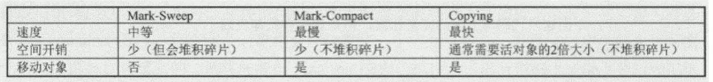

#### 9.2.8 分代收集算法

- 前面所有这些算法中，并没有一种算法可以完全替代其他算法，它们都具有自己独特的优势和特点。分代收集算法应运而生。
- 分代收集算法：是基于这样一个事实:不同的对象的生命周期是不一样的。因此，不同生命周期的对象可以采取不同的收集方式，以便提高回收效率。一般是把Java堆分为新生代和老年代，这样就可以根据各个年代的特点使用不同的回收算法，以提高垃圾回收的效率。
- 在Java程序运行的过程中，会产生大量的对象，其中有些对象是与业务信息相关，比如Http请求中的session对象、线程、socket连接，这类对象跟业务直接挂钩，因此生命周期比较长。但是还有一些对象，主要是程序运行过程中生成的临时变量，这些对象生命周期会比较短，比如:string对象，由于其不变类的特性，系统会产生大量的这些对象，有些对象甚至只用一次即可回收。
- **目前几乎所有的GC都是采用分代收集(Generational collecting)算法执行垃圾回收的。**
- 在Hotspot中，基于分代的概念，GC所使用的内存回收算法必须结合年轻代和老年代各自的特点。
  - 年轻代(Young Gen)
    - 年轻代特点：区域相对老年代较小，对象生命周期短、存活率低，回收频繁。
    - 这种情况复制算法的回收整理，速度是最快的。复制算法的效率只和当前存活对象大小有关，因此很适用于年轻代的回收。而复制算法内存利用率不高的问题，通过HotSpot中的两个survivor的设计得到缓解。
  - 老年代(Tenured Gen)
    - 老年代特点：区域较大，对象生命周期长、存活率高，回收不及年轻代频繁。
    - 这种情况存在大量存活率高的对象，复制算法明显变得不合适。一般是由标记-清除或者是标记-清除与标记-整理的混合实现。
      - Mark阶段的开销与存活对象的数量成正比。
      - Sweep阶段的开销与所管理区域的大小成正相关。=>因为是全部空间线性遍历找垃圾
      - Compact阶段的开销与存活对象的数据成正比。=》因为需要把存活对象给整理一下
- 以HotSpot中的CMS回收器为例，CMS是基于Mark-Sweep实现的，对于对象的回收效率很高。而对于碎片问题，CMS采用基于Mark-compact算法的serial Old回收器作为补偿措施:当内存回收不佳（碎片导致的concurrent Mode Failure时），将采用serial Old执行Full GC以达到对老年代内存的整理。
- 分代的思想被现有的虚拟机广泛使用。几乎所有的垃圾回收器都区分新生代和老年代。

#### 9.2.9 增量收集算法

- 问题：
  - 上述现有的算法，在垃圾回收过程中，应用软件将处于一种stop the world的状态。在stop the world 状态下，应用程序所有的线程都会挂起，暂停一切正常的工作，等待垃圾回收的完成。如果垃圾回收时间过长，应用程序会被挂起很久，将严重影响用户体验或者系统的稳定性。为了解决这个问题，即对实时垃圾收集算法的研究直接导致了增量收集(Incremental collecting)算法的诞生。
- 基本思想：
  - 如果一次性将所有的垃圾进行处理，需要造成系统长时间的停顿，那么就可以让垃圾收集线程和应用程序线程交替执行。每次，垃圾收集线程只收集一小片区域,的内存空间，接着切换到应用程序线程。依次反复，直到垃圾收集完成。
  - 总的来说，增量收集算法的基础仍是传统的标记-清除和复制算法。增量收集算法通过**对线程间（用户线程和垃圾收集线程）冲突的妥善处理，允许垃圾收集线程以分阶段的方式完成标记、清理或复制工作。**
- 缺点：
  - 使用这种方式，由于在垃圾回收过程中，间断性地还执行了应用程序代码，所以能减少系统的停顿时间。但是，因为线程切换和上下文转换的消耗，会使得垃圾回收的总体成本上升，**造成系统吞吐量的下降**。

#### 9.2.10 分区算法

- 一般来说，在相同条件下，堆空间越大，一次GC时所需要的时间就越长，有关GC产生的停顿(STW)也越长。为了更好地控制GC产生的停顿时间，将一块大的内存区域分割成多个小块，根据目标的停顿时间，每次合理地回收若干个小区间，而不是整个堆空间，从而减少一次GC所产生的停顿。
- **分代算法**将按照对象的生命周期长短划分成两个部分，**分区算法**将整个堆空间划分成连续的不同小区间regin。
- 每一个小区间都独立使用，独立回收。这种算法的好处是可以控制一次回收多少个小区间。
- 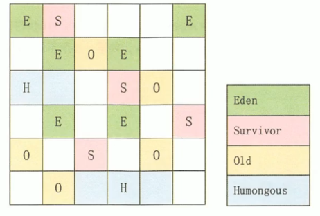
- **注意：**，这些只是基本的算法思路，实际GC实现过程要复杂的多，目前还在发展中的前沿GC都是复合算法，并且并行和并发兼备。

### 9.3 垃圾回收相关概念

#### 9.3.1 System.gc()

- 在默认情况下，通过System.gc()或者Runtime.getRuntime ( ).gc ()的调用，会**显式触发Full GC**，同时对老年代和新生代(也许还可以包括方法区)进行回收，尝试释放被丢弃对象占用的内存。
- 然而System.gc ( )调用附带一个免责声明，无法保证对垃圾收集器的调用。
- JVM实现者可以通过System.gc ( )调用来决定JVM的GC行为。而一般情况下，垃圾回收应该是自动进行的，**无须手动触发，否则就太过于麻烦了**。在一些特殊情况下，如我们正在编写一个性能基准，我们可以在运行之间调用System.gc ( )。
- 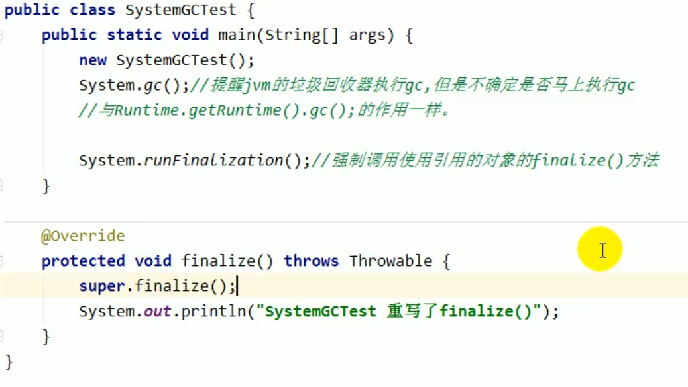
- 另一个代码示例：https://www.bilibili.com/video/BV1PJ411n7xZ?p=156

#### 9.3.2 内存溢出-OOM

- 内存溢出相对于内存泄漏来说，尽管更容易被理解，但是同样的，内存溢出也是引发程序崩溃的罪魁祸首之一。
- 由于GC一直在发展，所有一般情况下，除非应用程序占用的内存增长速度非常快，造成垃圾回收已经跟不上内存消耗的速度，否则不太容易出现OOM的情况。
- 大多数情况下，GC会进行各种年龄段的垃圾回收，实在不行了就放大招，来一次独占式的Full GC操作，这时候会回收大量的内存，供应用程序继续使用。
- javadoc中对OutOfMemoryError的解释是，**没有空闲内存，并且垃圾收集器也无法提供更多内存。**
- 首先说**没有空闲内存**的情况：说明]ava虚拟机的堆内存不够。原因有二：
  - (1) Java虚拟机的堆内存设置不够。
    - 比如:可能存在内存泄漏问题；也很有可能就是堆的大小不合理，比如我们要处理比较可观的数据量，但是没有显式指定JVM堆大小或者指定数值偏小。我们可以通过参数-Xms.-Xmx来调整。
  - (2) 代码中创建了大量大对象，并且长时间不能被垃圾收集器收集（存在被引用)对于老版本的oracle JDK，因为永久代的大小是有限的，并且JVM对永久代垃圾回收(如，常量池回收、卸载不再需要的类型)非常不积极，所以当我们不断添加新类型的时候，永久代出现OutOfMemoryError也非常多见，尤其是在运行时存在大量动态类型生成的场合；类似intern字符串缓存占用太多空间，也会导致OOM问题。对应的异常信息，会标记出来和永久代相关：“java.lang.outofMemoryError: PermGen space"。
    - 随着元数据区的引入，方法区内存已经不再那么窘迫，所以相应的OOM有所改观，出现OOM，异常信息则变成了:“java.lang.outOfMemoryError: Metaspace”。直接内存不足，也会导致OOM。
- 这里面隐含着一层意思是，在抛出OutOfMemoryError之前，通常垃圾收集器会被触发，尽其所能去清理出空间。
  - 例：在引用机制分析中，涉及到VM会去尝试回收软引用指向的对象等。
  - 在java.nio.BIts.reserveMemory()方法中，我们能清楚的看到，System.gc()
    会被调用，以清理空间。
- 当然，也不是在任何情况下垃圾收集器都会被触发的
  - 比如，我们去分配一个超大对象，类似一个超大数组超过堆的最大值，JVM可以判断出垃圾收集并不能解决这个问题（分配担保机制），所以直接抛出OutOfMemoryError。

#### 9.3.3 内存泄露-Memory Leak

- 也称作“存储渗漏”。**严格来说**，只有对象不会再被程序用到了，但是GC又不能回收他们的情况，才叫内存泄漏。
- 但实际情况很多时候一些不太好的实践（或疏忽）会导致对象的生命周期变得很长甚至导致OOM，也可以叫做**宽泛意义**上的“内存泄漏”。
- 尽管内存泄漏并不会立刻引起程序崩溃，但是一旦发生内存泄漏，程序中的可用内存就会被逐步蚕食，直至耗尽所有内存，最终出现OutOfMemory异常，导致程序崩溃。
- 注意，这里的存储空间并不是指物理内存，而是指虚拟内存大小，这个虚拟内存大小取决于磁盘交换区设定的大小。
- 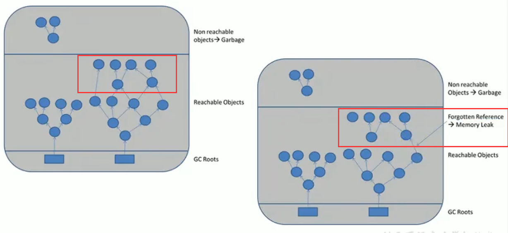
- 举例:
  - 1、单例模式
    - 单例的生命周期和应用程序是一样长的，所以单例程序中，如果持有对外部对象的引用的话，那么这个外部对象是不能被回收的，则会导致内存泄漏的产生。
  - 2、一些提供close的资源未关闭导致内存泄漏
    - 数据库连接(dataSourse.getconnection( ))，网络连接(socket)和io连接必须手动close，否则是不能被回收的。

#### 9.3.4 Stop The World

- Stop-The-World ，简称STW，指的是GC事件发生过程中，会产生应用程序的停顿。**停顿产生时整个应用程序线程都会被暂停，没有任何响应**，有点像卡死的感觉，这个停顿称为STW。
  - 可达性分析算法中枚举根节点（GC Roots）会导致所有Java执行线程停顿。
    - 分析工作必须在一个能确保**一致性**的快照中进行
    - 一致性指整个分析期间整个执行系统看起来像被冻结在某个时间点上
    - 如果出现分析过程中对象引用关系还在不断变化，则分析结果的准确性无法保证
- 被STW中断的应用程序线程会在完成GC之后恢复，频繁中断会让用户感觉像是网速不快造成电影卡带一样，所以我们需要减少STW的发生。
- STW事件和采用哪款GC无关，所有的GC都有这个事件。
- 哪怕是G1也不能完全避免Stop-The-World 情况发生，只能说垃圾回收器越来越优秀，回收效率越来越高，尽可能地缩短了暂停时间。
- STW是JVM在**后台自动发起和自动完成**的。在用户不可见的情况下，把用户正常的工作线程全部停掉。
- 开发中不要用System.gc( )；会导致Stop-The-World的发生。
- 代码示例观察：STW
  - 一个线程进行每个一秒打印每次的当前时间，计算时间间隔
  - 另一个线程进行耗时操作：如：分配大内存，引用指向空，进行垃圾回收
  - 先一个线程运行观察，再两个线程同时观察，再对比查看即可观察出STW

#### 9.3.5 并行和并发

- 并发：Concurrent
  - 在操作系统中，是指一个**时间段**中有几个程序都处于已启动运行到运行完毕之间，且这几个程序都是在同一个处理器上运行。
  - 并发不是真正意义上的“同时进行”，只是CPU把一个时间段划分成几个时间片段(时间区间)，然后在这几个时间区间之间来回切换，由于CPU处理的速度非常快，只要时间间隔处理得当，即可让用户感觉是多个应用程序同时在进行。
  - 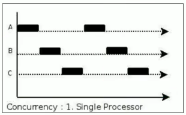
- 并行：Parallel
  - 当系统有一个以上CPu时，当一个CPU执行一个进程时，另一个CPU可以执行另一个进程，两个进程互不抢占CPU资源，可以同时进行，我们称之为并行(Parallel)。
  - 其实决定并行的因素不是CPU的数量，而是CPU的核心数量，比如一个CPU多个核也可以并行。
  - 适合科学计算，后台处理等弱交互场景
  - 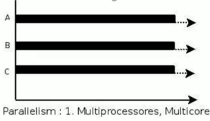
- 并发VS并行：
  - 并发：指的是多个事情，在同一**时间段**内同时发生了。
  - 并行：指的是多个事情,在同一**时间点**上同时发生了。
  - 并发的多个任务之间是互相抢占资源的。
  - 并行的多个任务之间是不互相抢占资源的。
  - 只有在多CPU或者一个CPU多核的情况中，才会发生并行。否则，看似同时发生的事情，其实都是并发执行的。
- 垃圾回收的并发和并行：
  - 并发和并行，在谈论垃圾收集器的上下文语境中，它们可以解释如下
    - 并行（Parallel)：指多条垃圾收集线程并行工作，但此时用户线程仍处于等待状态。如ParNew、Parallel Scavenge、Parallel Old;
    - 串行(Serial)：相较于并行的概念,单线程执行。
      - 如果内存不够，则程序暂停，启动JVM垃圾回收器进行垃圾回收。回收完，再启动程序的线程。
    - 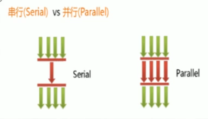
    - 并发(Concurrent)：**用户线程与垃圾收集线程同时执行**(不一定是并行的，不是完全的并行因为STW，可能会交替执行)，垃圾回收线程在执行时不会停顿用户程序的运行
      - 用户程序在继续运行，而垃圾回收程序运行在另一个CPU上
      - 如：CMS、G1
      - 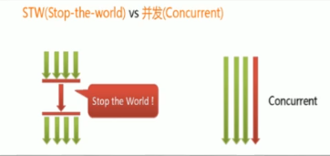

#### 9.3.6 安全点和安全区域

- 安全点(SafePoint)
  - 程序执行时并非在所有地方都能停顿下来开始Gc，只有在特定的位置才能停顿下来开始Gc，这些位置称为“安全点(Safepoint) ”。
  - Safe Point的选择很重要，**如果太少可能导致GC等待的时间太长，如果太频繁可能导致运行时的性能问题。**大部分指令的执行时间都非常短暂，通常会根据“是否具有让程序长时间执行的特征”为标准。比如:选择一些执行时间较长的指令作为Safe Point，如方法调用、循环跳转和异常跳转等。
- 如何在GC发生时，检查所有线程都跑到最近的安全点停顿下来呢?
  - **抢先式中断：**（目前没有虚拟机采用了）
    - 首先中断所有线程。如果还有线程不在安全点，就恢复线程，让线程跑到安全点。
  - **主动式中断：**
    - 设置一个中断标志，各个线程运行到Safe Point的时候主动轮询这个标志，如果中断标志为真，则将自己进行中断挂起。
- 安全区域(Safe Region)
  - Safepoint机制保证了程序执行时，在不太长的时间内就会遇到可进入GC的Safepoint 。但是，程序“ 不执行 ”的时候呢？例如线程处于sleep 状态或Blocked状态，这时候线程无法响应JVM的中断请求，“走”到安全点去中断挂起，JVM也不太可能等待线程被唤醒。对于这种情况，就需要安全区域(Safe Region）来解决。
  - **安全区域是指在一段代码片段中，对象的引用关系不会发生变化，在这个区域中的任何位置开始GC都是安全的**。我们也可以把Safe Region看做是被扩展了的Safepoint。
- 实际执行时:
  - 1、当线程运行到safe Region的代码时，首先标识已经进入了Safe Region,如果这段时间内发生Gc，JVM会忽略标识为Safe Region状态的线程;
  - 2、当线程即将离开Safe Region时，会检查JVM是否已经完成GC，如果完成了，则继续运行，否则线程必须等待，直到收到可以安全离开Safe Region的信号为止

#### 9.3.7 引用

- 问题：希望能描述这样一类对象：当内存空间还足够时，则能保留在内存中；如果内存空间在进行垃圾收集后还是很紧张，则可以抛弃这些对象。类似缓存！！！

- 强引用、软引用、弱引用、虚引用有什么区别?具体使用场景是什么?

- 在JDK 1.2版之后，Java对引用的概念进行了扩充，将引用分为强引用(Strong Reference)、软引用(Soft Reference)、弱引用（Weak Reference）和虚引用(Phantom Reference）4种，这4种引用强度依次逐渐减弱。

- 除强引用外，其他3种引用均可以在java.lang.ref包中找到它们的身影。如下图，显示了这3种引用类型对应的类，开发人员可以在应用程序中直接使用它们。
  
  - 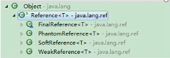

- 强引用(StrongReference)：OOM都不回收
  
  - 最传统的“引用”的定义，是指在程序代码之中普遍存在的引用赋值，即类似“object obj=new object()”这种引用关系。无论任何情况下,只要强引用关系还存在，垃圾收集器就永远不会回收掉被引用的对象。
  - 在Java程序中，最常见的引用类型是强引用（普通系统99%以上都是强引用），也就是我们最常见的普通对象引用，也是默认的引用类型。
  - 当在Java语言中使用new操作符创建一个新的对象，并将其赋值给一个变量的时候，这个变量就成为指向该对象的一个强引用。
  - 强引用的对象是可触及的，垃圾收集器就永远不会回收掉被引用的对象。
  - 对于一个普通的对象，如果没有其他的引用关系，只要超过了引用的作用域或者显式地将相应(强)引用赋值为null，就是可以当做垃圾被收集了，当然具体回收时机还是要看垃圾收集策略。
  - 相对的，软引用、弱引用和虚引用的对象是软可触及、弱可触及和虚可触及的，在一定条件下，都是可以被回收的。所以，**强引用是造成Java内存泄漏的主要原因之一。**
  - 强引用具备以下特点：
    - 强引用可以直接访问目标对象。
    - 强引用所指向的对象在任何时候都不会被系统回收，虚拟机宁愿抛出OOM异常，也不会回收强引用所指向对象。
    - 强引用可能导致内存泄漏。

- 软引用(SoftReference)：内存不足就回收
  
  - 在系统将要发生内存溢出之前，将会把这些对象列入回收范围之中进行第二次回收。如果这次回收后还没有足够的内存，才会抛出内存溢出异常。
  
  - 软引用是用来描述一些还有用，但非必需的对象。只被软引用关联着的对象，在系统将要发生内存溢出异常前，会把这些对象列进回收范围之中进行第二次回收，如果这次回收还没有足够的内存，才会抛出内存溢出异常。
  
  - 软引用通常用来实现内存敏感的缓存。比如：**高速缓存**就有用到软引用。如果还有空闲内存，就可以暂时保留缓存，当内存不足时清理掉，这样就保证了使用缓存的向时，不会耗尽内存。
  
  - 垃圾回收器在某个时刻决定回收软可达的对象的时候，会清理软引用，并可选地把引用存放到一个引用队列(Reference Queue)。
  
  - 类似弱引用，只不过Java虚拟机会尽量让软引用的存活时间长一些，迫不得己才清理。
  
  - ```java
    // 代码实现：JDK1.2之后提供了java.lang.ref.SoftReference类来实现软引用
    
    // Object obj声明强引用
    Object obj = new Object;
    SoftReference<Object> sf = new SoftReference<Object>(obj);
    
    // 销毁强引用
    obj = null;
    ```

- 弱引用(weakReference)：GC就回收
  
  - 只被弱引用关联的对象只能生存到下一次垃圾收集之前。当垃圾收集器工作时，无论内存空间是否足够，都会回收掉被弱引用关联的对象。
  
  - 但是，由于垃圾回收器的线程通常优先级很低，因此，并不一定能很快地发现持有弱引用的对象。在这种情况下，**弱引用对象可以存在较长的时间。**
  
  - 弱引用和软引用一样，在构造弱引用时，也可以指定一个引用队列，当弱引用对象被回收时，就会加入指定的引用队列，通过这个队列可以跟踪对象的回收情况。
  
  - **软引用、弱引用都非常适合来保存那些可有可无的缓存数据**。如果这么做，当系统内存不足时，这些缓存数据会被回收，不会导致内存溢出。而当内存资源充足时，这些缓存数据又可以存在相当长的时间，从而起到加速系统的作用。
  
  - ```java
    // 代码实现：JDK1.2之后提供了java.lang.ref.WeakReference类来实现软引用
    
    // Object obj声明强引用
    Object obj = new Object;
    WeakReference<Object> wk = new WeakReference<Object>(obj);
    
    // 销毁强引用
    obj = null;
    ```
  
  - 弱引用对象与软引用对象的最大不同就在于，当Gc在进行回收时，需要通过算法检查是否回收软引用对象，而对于弱引用对象，GC总是进行回收。弱引用对象更容易、更快被GC回收。
  
  - 面试题:你开发中使用过WeakHashMap吗?
    
    - 看源码，使用了弱引用的Entry

- 虚引用(PhantomReference) ：对象回收跟踪
  
  - 一个对象是否有虚引用的存在，完全不会对其生存时间构成影响，也无法通过虚引用来获得一个对象的实例。为一个对象设置虚引用关联的**唯一目的就是能在这个对象被收集器回收时收到一个系统通知**。
  
  - 也称为“幽灵引用”或者“幻影引用”，是所有引用类型中最弱的一个。
  
  - 一个对象是否有虚引用的存在，完全不会决定对象的生命周期。如果一个对象仅持有虚引用，那么它和没有引用几乎是一样的，随时都可能被垃圾回收器回收。
  
  - 它不能单独使用，也无法通过虚引用来获取被引用的对象。当试图通过虚引用的get()方法取得对象时，总是null。
  
  - **为一个对象设置虚引用关联的唯一目的在于跟踪垃圾回收过程。比如:**
    **能在这个对象被收集器回收时收到一个系统通知。**
  
  - 虚引用必须和引用队列一起使用。虚引用在创建时必须提供一个引用队列作为参数。当垃圾回收器准备回收一个对象时，如果发现它还有虚引用，就会在回收对象后，将这个虚引用加入引用队列，以通知应用程序对象的回收情况。
  
  - **由于虚引用可以跟踪对象的回收时间，因此，也可以将一些资源释放操作放置在虚引用中执行和记录。**
  
  - ```java
    // 代码实现：JDK1.2之后提供了java.lang.ref.PhantomReference类来实现软引用
    
    // Object obj声明强引用
    Object obj = new Object;
    PhatomReference<Object> wk = new PhatomReference<Object>(obj);
    
    // 销毁强引用
    obj = null;
    ```
  
  - 代码示例：建议看视频！：https://www.bilibili.com/video/BV1PJ411n7xZ?p=167&spm_id_from=pageDriver

- 终结器引用(Final reference)
  
  - 它用以实现对象的finalize ()方法，也可以称为终结器引用。
  - 无需手动编码，其内部配合引用队列使用。
  - 在GC时，终结器引用入队。由Finalizer线程通过终结器引用找到被引用对象并调用它的finalize ()方法，第二次GC时才能回收被引用对象。

### 9.4 垃圾回收器

#### 9.4.1 GC分类和性能指标

- 垃圾收集器没有在规范中进行过多的规定，可以由不同的厂商、不同版本的JVM来实现。由于JDK的版本处于高速迭代过程中，因此Java发展至今已经衍生了众多的GC版本。从不同角度分析垃圾收集器，可以将GC分为不同的类型。
- Java不同版本的新特性:
  - 1、语法层面：Lambda表达式. switch、自动装箱、自动拆箱、enum、
  - 2、API层面：Stream API、新的日期时间、Optional、String、集合框架
  - 3、底层优化：JVM的优化，GC的变化、元空间、静态域、字符串常量池等
- 按**线程数**（垃圾回收的线程）分,可以分为串行垃圾回收器和并行垃圾回收器。
  - 
  - 串行回收指的是在同一时间段内只允许有一个CPU用于执行垃圾回收操作，此时工作线程被暂停，直至垃圾收集工作结束。
    - 在诸如单CPU处理器或者较小的应用内存等硬件平台不是特别优越的场合，串行回收器的性能表现可以超过并行回收器和并发回收器。所以，串行回收默认被应用在客户端的client模式下的JVM中
    - 在并发能力比较强的CPU上，并行回收器产生的停顿时间要短于串行回收器。
  - 并行回收可以运用多个CPU同时执行垃圾回收，因此提升了应用的吞吐量，不过并行回收仍然与串行回收一样，采用独占式，使用了“stop-the-world”机制。
- 按照**工作模式**分，可以分为并发式垃圾回收器和独占式垃圾回收器。
  - 并发式垃圾回收器与应用程序线程交替工作，以尽可能减少应用程序的停顿时间。
  - 独占式垃圾回收器(Stop The World)一旦运行，就停止应用程序中的所有用户线程，直到垃圾回收过程完全结束。
  - 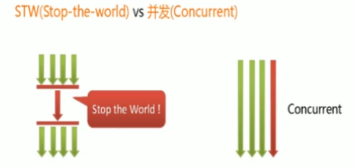
- 按**碎片处理方式**分，可分为压缩式垃圾回收器和非压缩式垃圾回收器。
  - 压缩式垃圾回收器会在回收完成后，对存活对象进行压缩整理，消除回收后的碎片。
  - 非压缩式的垃圾回收器不进行这步操作。
- 按**工作的内存区间**分，又可分为年轻代垃圾回收器和老年代垃圾回收器。
- 评估GC的性能指标：
  - **吞吐量：运行用户代码的时间占总运行时间的比例**
    - 总运行时间:程序的运行时间＋内存回收的时间)
  - 垃圾收集开销：吞吐量的补数，垃圾收集所用时间与总运行时间的比例。
  - **暂停时间(STW)：执行垃圾收集时，程序的工作线程被暂停的时间。**
  - 收集频率：相对于应用程序的执行，收集操作发生的频率。
  - **内存占用：Java堆区所占的内存大小。**
  - 快速： 一个对象从诞生到被回收所经历的时间。
- 这三者共同构成一个“不可能三角”。三者总体的表现会随着技术进步而越来越好。一款优秀的收集器通常最多同时满足其中的两项。
- 这三项里，暂停时间的重要性日益凸显。因为随着硬件发展，内存占用多些越来越能容忍，硬件性能的提升也有助于降低收集器运行时对应用程序的影响，即提高了吞吐量。而内存的扩大，对延迟反而带来负面效果。
- 简单来说，主要抓住两点:
  - 吞吐量
  - 暂停时间
- 吞吐量：throughput
  - 吞吐量就是CPU用于运行用户代码的时间与CPU总消耗时间的比值，即吞吐量=运行用户代码时间/(运行用户代码时间＋垃圾收集时间)。
    - 比如:虚拟机总共运行了100分钟，其中垃圾收集花掉1分钟，那吞
      吐量就是99%。
    - 这种情况下，应用程序能容忍较高的暂停时间，因此，高吞吐量的应用程序有更长的时间基准，快速响应是不必考虑的。
    - 吞吐量优先，意味着在单位时间内，STW 的时间最短:0.2+0.2 = 0.4
  - 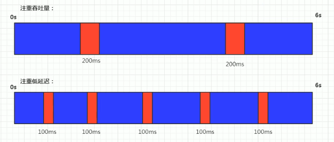
- 暂停时间：pause time
  - “暂停时间”是指一个时间段内应用程序线程暂停，让GC线程执行的状态
    - 如：GC期间100毫秒的暂停时间意味着在这100毫秒期间内没有应用
      程序线程是活动的。
  - 暂停时间优先，意味着尽可能让单次STW的时间最短：0.1 +0.1 + 0.1 +0.1 +0.1 = 0.5
- 吞吐量VS暂停时间：
  - 高吞吐量较好因为这会让应用程序的最终用户感觉只有应用程序线程在做“生产性”工作。直觉上，吞吐量越高程序运行越快。
  - 低暂停时间（低延迟）较好因为从最终用户的角度来看不管是GC还是其他原因导致一个应用被挂起始终是不好的。这取决于应用程序的类型，有时候甚至短暂的28毫秒暂停都可能打断终端用户体验。因此，具有低的暂停时间是非常重要的，特别是对于一个交互式应用程序。
  - 不幸的是”高吞吐量”和”低暂停时间”是一对相互竞争的目标（矛盾）。因为如果选择以吞吐量优先，那么必然需要降低内存回收的执行频率，但是这样会导致GC需要更长的暂停时间来执行内存回收。
  - 相反的，如果选择以低延迟优先为原则，那么为了降低每次执行内存回收时的暂停时间，也只能频繁地执行内存回收，但这又引起了年轻代内存的缩减和导致程序吞吐量的下降。
- 在设计（或使用）GC算法时，我们必须确定我们的目标：一个GC算法只可能针对两个目标之一（即只专注于较大吞吐量或最小暂停时间），或尝试找到一个二者的折衷。
- 现在标准：**在最大吞吐量优先的情况下，降低停顿时间。**

#### 9.4.2 垃圾回收器概述

- 有了虚拟机，就一定需要收集垃圾的机制，这就是Garbage Collection，对应的产品我们称为Garbage Collector。
  - 1999年随JDK1.3.1一起来的是串行方式的Serial GC ，它是第一款GC。ParNew垃圾收集器是Serial收集器的多线程版本
  - 2002年2月26日，Parallel GC和Concurrent Mark Sweep GC跟随JDK1.4.2一起发布
  - Parallel GC在JDK6之后成为HotSpot默认GC
  - 2012年，在JDK1.7u4版本中，G1可用。
  - 2017年，JDK9中G1变成默认的垃圾收集器,以替代CMS.
  - 2018年3月，JDK10中G1垃圾回收器的并行完整垃圾回收，实现并行性来改善最坏情况下的延迟。
  - 2018年9月，JDK11发布。引入Epsilon垃圾回收器，又被称为"No-Op(无操作)"回收器。同时，引入ZGC：可伸缩的低延迟垃圾回收器(Experimental)。
  - 2019年3月，JDK12发布。增强G1，自动返回未用堆内存给操作系统。同时，引入Shenandoah GC：低停顿时间的GC(Experimental)。
  - 2019年9月，JDK13发布。增强ZGC，自动返回未用堆内存给操作系统。
  - 2020年3月，JDK14发布。删除CMS垃圾回收器。扩展ZGC在macos和windows上的应用
- 七种经典的垃圾收集器：
  - 串行回收器：Serial、 Serial Old
  - 并行回收器：ParNew、 Parallel Scavenge、 Parallel Old
  - 并发回收器: CMS、G1
  - 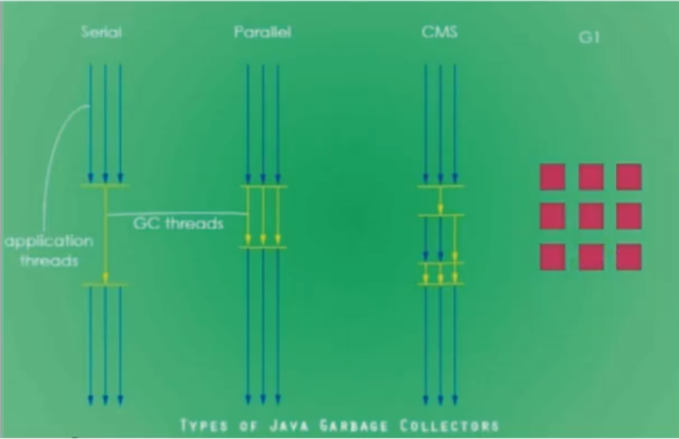
  - 官网：https://www.oracle.com/technetwork/java/javase/tech/memorymanagement-whitepaper-1-150020.pdf
- 七种经典的垃圾收集器与垃圾分代的联系
  - 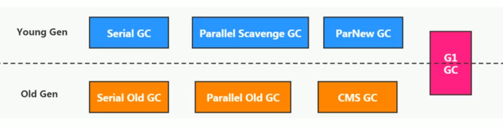
  - 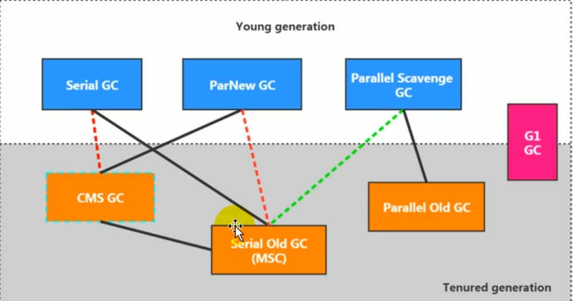
  - 1.两个收集器间有连线，表明它们可以搭配使用:
    - serial/serial old、seria1/CMS、ParNew/Serial old、ParNew/CMS、Parallel Scavenge/Serial old、Parallel Scavenge/Parallel old、G1
  - 2.其中Serial old作为CMS出现"concurrent Mode Failure"失败的后备预案。
  - 3.(红色虚线)由于维护和兼容性测试的成本，在JDK 8时将serial+CMS、ParNew+Serial old这两个组合声明为废弃（JEP 173)，并在JDK 9中完全取消了这些组合的支持（EP214)，即:移除。
  - 4.(绿色虚线)JDK 14中：弃用Parallel scavenge和serial Old GC组合(EP366)
  - 5.(青色虚线)JDK 14中：删除CMS垃圾回收器(EP 363)
- 为什么要有很多收集器，一个不够吗？
  - 因为Java的使用场景很多，移动端，服务器等。所以就需要针对不同的场景，提供不同的垃圾收集器江提高垃圾收集的性能。
  - 虽然我们会对各个收集器进行比较，但并非为了挑选一个最好的收集器出来。没有一种放之四海皆准、任何场景下都适用的完美收集器存在，更加没有万能的收集器。所以我们选择的只是**对具体应用最合适的收集器。**
- 如何查看默认的垃圾收集器？
  - **-XX:+PrintCommandLineFlags：**查看命令行相关参数，包含使用的垃圾收集器
  - **jinfo -flag 相关垃圾回收器参数 进程ID**：使用命令行指令
  - 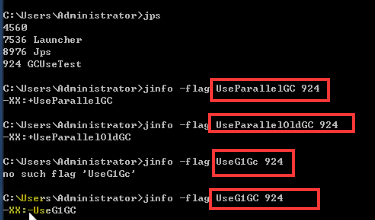

#### 9.4.3 Serial回收器-串行回收

- Serial收集器是最基本、历史最悠久的垃圾收集器了。JDK1.3之前回收新生代唯一的选择。
- Serial收集器作为HotSpot中client模式下的默认新生代垃圾收集器。
- Serial收集器采用**复制算法**、串行回收和"stop-the-world"机制的方式执行内存回收。
- 除了年轻代之外，Serial收集器还提供用于执行老年代垃圾收集的Serial Old收集器。Serial Old 收集器同样也采用了串行回收和"stop the world"机制，只不过内存回收算法使用的是**标记-压缩算法**。
  - Serial Old是运行在client模式下默认的老年代的垃圾回收器
  - Serial Old在server模式下主要有两个用途:
    - 与新生代的Parallel Scavenge配合使用
    - 作为老年代CMS收集器的后备垃圾收集方案
- 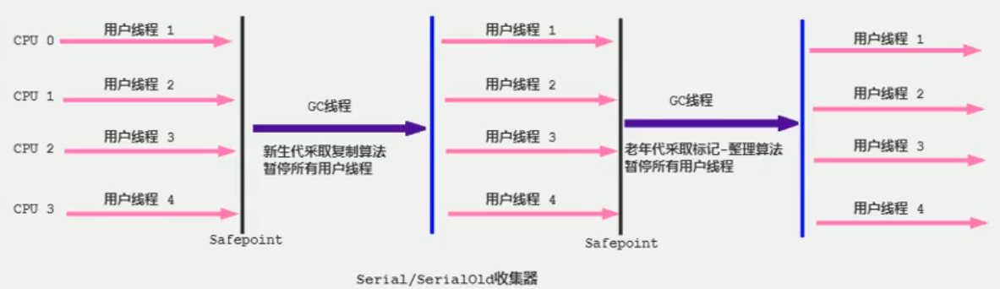
- 这个收集器是一个单线程的收集器，但它的“单线程”的意义并不仅仅说明它只会使**用一个CPU 或一条收集线程去完成垃圾收集工作**，更重要的是在它进行垃圾收集时，**必须暂停其他所有的工作线程**，直到它收集结束(Stop The world）。
- 优势:简单而高效（与其他收集器的单线程比），对于限定单个CPU的环境来说，Serial收集器由于没有线程交互的开销，专心做垃圾收集自然可以获得最高的单线程收集效率。
  - 运行在client模式下的虚拟机是个不错的选择。
- 在用户的桌面应用场景中，可用内存一般不大(几十MB至一两百MB），可以在较短时间内完成垃圾收集（几十ms至一百多ms)，只要不频繁发生，使用串行回收器是可以接受的。
- 在HotSpot虚拟机中，使用-XX:+UseSerialGC参数可以指定年轻代和老年代都使用串行收集器。
  - 等价于新生代用Serial GC，且老年代用Serial Old GC
- 这种垃圾收集器大家了解，现在已经不用串行的了。而且在限定单核cpu才可以用。现在都不是单核的了。
- 对于交互较强的应用而言，这种垃圾收集器是不能接受的。一般在JavaWeb应用程序中是不会采用串行垃圾收集器的。

#### 9.4.4 ParNew回收器-并行回收

- 如果说Serial GC是年轻代中的单线程垃圾收集器，那么ParNew收集器则是Serial收集器的多线程版本。
  - Par是Parallel的缩写，New:只能处理的是新生代。
- ParNew收集器除了采用并行回收的方式执行内存回收外，两款垃圾收集器之间几乎没有任何区别。ParNew收集器在年轻代中同样也是采用复制算法、"Stop-the-world"机制。
- ParNew是很多JVM运行在server模式下新生代的默认垃圾收集器
- 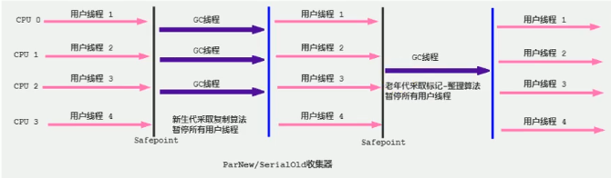
- 对于新生代，回收次数频繁，使用并行方式高效。
- 对于老年代，回收次数少，使用串行方式节省资源。(CPU并行需要切换线程，串行可以省去切换线程的资源)
- 由于ParNew收集器是基于并行回收，那么是否可以断定ParNew收集器的回收效率在任何场景下都会比serial收集器更高效?
  - ParNew收集器运行在多CPU的环境下，由于可以充分利用多CPU、
    多核心等物理硬件资源优势，可以更快速地完成垃圾收集，提升程序的吞吐量。
  - 但是在单个CPU的环境下，ParNew收集器不比Serial收集器更高
    效。虽然serial收集器是基于串行回收，但是由于CPU不需要频繁地做任务切换，因此可以有效避免多线程交互过程中产生的一些额外开销。
  - 因为除Serial外，目前只有ParNew GC能与CMS收集器配合工作
- 在程序中，开发人员可以通过选项"-XX:+UseParNewGC"手动指定使用ParNew收集器执行内存回收任务。它表示年轻代使用并行收集器，不影响老年代。
  - -XX: ParallelGCThreads ：限制线程数量,默认开启和CPU数据相同的线程数。

#### 9.4.5 Parallel回收器-吞吐量优先=>后台运算

- HotSpot的年轻代中除了拥有ParNew收集器是基于并行回收的以外，Parallel scavenge收集器同样也采用了复制算法、并行回收和"stop the world"机制。
- 那么Parallel收集器的出现是否多此一举?
  - 和ParNew收集器不同，Parallel scavenge收集器的目标则是达到一个可控制的吞吐量(Throughput)，它也被称为吞吐量优先的垃圾收集器。
  - 自适应调节策略也是Parallel Scavenge与ParNew一个重要区别。
- 高吞吐量则可以高效率地利用CPU时间，尽快完成程序的运算任务，主要适合在**后台运算而不需要太多交互的任务**。因此，常见在服务器环境中使用。例如，那些执行批量处理、订单处理、工资支付、科学计算的应用程序。
- Parallel 收集器在JDK1.6时提供了用于执行老年代垃圾收集的Parallel Old收集器，用来代替老年代的Serial Old收集器。
- Parallel Old收集器采用了标记-压缩算法，但同样也是基于并行回收和"Stop-The-World"机制。
- 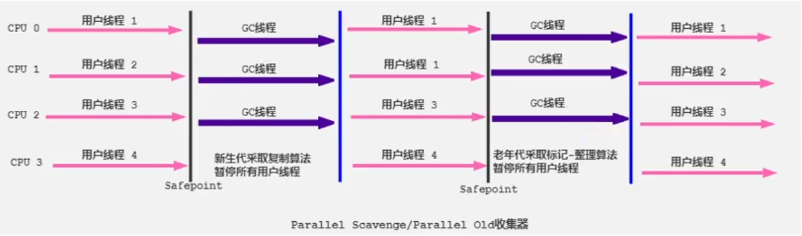
- 在程序吞吐量优先的应用场景中，Parallel 收集器和Parallel Old收集器的组合，在server模式下的内存回收性能很不错。
  - 在Java8中，默认是此垃圾收集器。
- 参数配置:
  - -XX:+UseParallelGC：手动指定年轻代使用Parallel并行收集器执行内存回收任务。
  - -XX :+UseParallelOldGC：手动指定老年代都是使用并行回收收集器
    - 分别适用于新生代和老年代。默认jdk8是开启的。
    - 上面两个参数，默认开启一个，另一个也会被开启。(互相激活)
  - -XX: ParallelGCThreads：设置年轻代并行收集器的线程数。一般地，最好与CPU数量相等，以避免过多的线程数影响垃圾收集性能。
    - 在默认情况下，当CPU数量小于8个，ParallelGCThreads 的值等于CPU数量。
    - 当CPU数量大于8个，ParallelGcThreads 的值等于3+[5*CPU_count]/8]。
  - -XX:MaxGCPauseMillis：设置垃圾收集器最大停顿时间(即STW的时间)。单位是毫秒。**用户体验！！！**
    - 为了尽可能地把停顿时间控制在MaxGCPauseMillis以内，收集器
      工作时会调整Java堆大小或者其他一些参数。
    - 对于用户来讲，停顿时间越短体验越好。但是在服务器端，我们注重的是高并发，整体的吞吐量。所以服务器端适合Parallel，进行控制。
    - 该参数使用需谨慎。
  - -XX:GCTimeRatio：垃圾收集时间占总时间的比例(= 1 / (N+ 1) )。用于衡量吞吐量的大小。**计算资源充分利用！！！**
    - 取值范围（0,100）。默认值99，也就是垃圾回收时间不超过1%
    - 与前一个-XX:MaxGCPauseMillis参数有一定矛盾性。暂停时间越
      长，Radio参数就容易超过设定的比例。
  - -XX :+UseAdaptiveSizePolicy：设置Parallel Scavenge收集器具有自适应调节策略
    - 在这种模式下，年轻代的大小、Eden和survivor的比例、晋升老年
      代的对象年龄等参数会被自动调整，己达到在堆大小、吞吐量和停顿时间之间的平衡点。
    - 在手动调优比较困难的场合，可以直接使用这种自适应的方式，仅指定虚拟机的最大堆、目标的吞吐量（GCTimeRatio）和停顿时间(MaxGCPauseMillis） ，让虚拟机自己完成调优工作。

#### 9.4.6 CMS回收器-低延迟=>用户体验

- 在JDK 1.5 时期，HotSpot推出了一款在强交互应用中几乎可认为有划时代意义的垃圾收集器: CMS (Concurrent-Mark-Sweep)收集器，这款收集器是HotSpot虚拟机中第一款真正意义上的并发收集器，它第一次实现了让垃圾收集线程与用户线程同时工作。
- CMS收集器的关注点是尽可能缩短垃圾收集时用户线程的停顿时间。停顿时间越短（低延迟）就越适合与用户交互的程序，良好的响应速度能提升用户体验。
  - 目前很大一部分的Java应用集中在互联网站或者B/S系统的服务端上，这类应用尤其重视服务的响应速度，希望系统停顿时间最短，以给用户带来较好的体验。CMS收集器就非常符合这类应用的需求。
- CMS的垃圾收集算法采用标记-清除算法，并且也会"stop-the-world"
- 不幸的是，CMS作为老年代的收集器，却无法与JDK 1.4.0中已经存在的新生代收集器Parallel Scavenge 配合工作（因为底层框架不同！），所以在JDK 1.5中使用CMS来收集老年代的时候，新生代只能选择ParNew或者Serial收集器中的一个。
- 在G1出现之前，CMS使用还是非常广泛的。一直到今天，仍然有很多系统使用CMS GC。
- 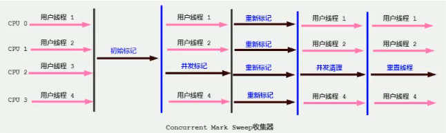
- CMS整个过程比之前的收集器要复杂,整个过程分为4个主要阶段，即初始标记阶段、并发标记阶段、重新标记阶段和并发清除阶段。
  - 初始标记(Initial-Mark)阶段：在这个阶段中，程序中所有的工作线程都将会因为“stop-the-world”机制而出现短暂的暂停，这个阶段的主要任务**仅仅只是标记出GC Roots能直接关联到的对象**。一旦标记完成之后就会恢复之前被暂停的所有应用线程。由于直接关联对象比较小，所以这里的**速度非常快**。
  - 并发标记(Concurrent-Mark)阶段：从GC Roots的**直接关联对象开始遍历整个对象图的过程**，这个过程耗时较长但是不需要停顿用户线程，可以与垃圾收集线程一起并发运行。
  - 重新标记(Remark)阶段：由于在并发标记阶段中，程序的工作线程会和垃圾收集线程同时运行或者交叉运行，因此为了**修正并发标记期间，因用户程序继续运作而导致标记产生变动的那一部分对象的标记记录**，这个阶段的停顿时间通常会比初始标记阶段稍长一些，但也远比并发标记阶段的时间短。
  - 并发清除(Concurrent-Sweep)阶段：此阶段**清理删除掉标记阶段判断的已经死亡的对象，释放内存空间**。由于不需要移动存活对象（因为是标记清除），所以这个阶段也是可以与用户线程同时并发的
- 尽管CMS收集器采用的是并发回收(非独占式)，但是在其初始化标记和再次标记这两个阶段中仍然需要执行“Stop-the-world”机制暂停程序中的工作线程，不过暂停时间并不会太长，因此可以说明目前所有的垃圾收集器都做不到完全不需要“stop-the-world”，只是尽可能地缩短暂停时间。
- **由于最耗费时间的并发标记与并发清除阶段都不需要暂停工作，所以整体的回收是低停顿的。**
- 另外，由于在垃圾收集阶段用户线程没有中断，所以**在CMS回收过程中，还应该确保应用程序用户线程有足够的内存可用**。因此，CMS收集器不能像其他收集器那样等到老年代几乎完全被填满了再进行收集，而是当**堆内存使用率达到某一阈值时，便开始进行回收**，以确保应用程序在CMS工作过程中依然有足够的空间支持应用程序运行。要是CMS运行期间预留的内存无法满足程序需要，就会出现一次“Concurrent Mode Failure”失败，这时虚拟机将启动后备预案：临时启用Serial Old 收集器来重新进行老年代的垃圾收集，这样停顿时间就很长了。
- CMS收集器的垃圾收集算法采用的是标记-清除算法，这意味着每次执行完内存回收后，由于被执行内存回收的无用对象所占用的内存空间极有可能是不连续的一些内存块，不可避免地将会产生一些内存碎片。那么CMS在为新对象分配内存空间时，将无法使用指针碰撞(Bump the Pointer)技术，而只能够选择空闲列表(Free List）执行内存分配。
  - 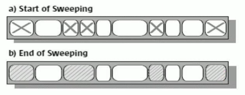
- CMS的优点:
  - 并发收集
  - 低延迟
- CMS的弊端:
  - **会产生内存碎片**，导致并发清除后，用户线程可用的空间不足。在无法分配大对象情况下，不得不提前触发Full GC。
  - **CMS收集器对CPU资源非常敏感**。在并发阶段，它虽然不会导致用户停顿，但是会因为占用了一部分线程而导致应用程序变慢，**总吞吐量会降低**。
  - **CMS收集器无法处理浮动垃圾**。可能出现“concurrent Mode Failure"失败而导致另一次 Full GC 的产生。在并发标记阶段由于程序的工作线程和垃圾收集线程是同时运行或者交叉运行的，那么在**并发标记阶段如果产生新的垃圾对象，CMS将无法对这些垃圾对象进行标记，最终会导致这些新产生的垃圾对象没有被及时回收**，从而只能在下一次执行GC时释放这些之前未被回收的内存空间。
- CMS参数：
  - -XX :+UseConcMarkSweepGC：手动指定使用CMS收集器执行内存回收任务。
    - 开启该参数后会自动将-XX:+UseParNewGC打开。即:ParNew ( Young区
      用)+CMs (Old区用)+Serial Old的组合。
  - -XX: CMSInitiatingOccupanyFraction：设置堆内存使用率的阈值，一旦达到该阈值，便开始进行回收。
    - JDK5及以前版本的默认值为68,即当老年代的空间使用率达到68%时，会执行一次CMS回收。JDK6及以上版本默认值为92%
    - 如果内存增长缓慢，则可以设置一个稍大的值，大的阈值可以有效降低CMS的触发频率，减少老年代回收的次数可以较为明显地改善应用程序性能。反之，如果应用程序内存使用率增长很快，则应该降低这个阈值，以避免频繁触发老年代串行收集器。因此**通过该选项便可以有效降低Full GC的执行次数。**
  - -XX:+UseCMSCompactAtFullCollection：用于指定在执行完Full GC后对内存空间进行压缩整理，以此避免内存碎片的产生。不过由于内存压缩整理过程无法并发执行，所带来的问题就是停顿时间变得更长了。
  - -XX:CMSFullGCsBeforeCompaction：设置在执行多少次Full GC后对内存空间进行压缩整理。
  - -XX : ParallelCMsThreads：设置CMS的线程数量。
    - CMS 默认启动的线程数是(ParallelGCThreads+3)/4，
    - ParallelGCThreads是年轻代并行收集器的线程数（差不多就是CPU的个数）。当CPU资源比较紧张时，受到CMS收集器线程的影响，应用程序的性能在垃圾回收阶段可能会非常糟糕。
- 小结:
  - HotSpot有这么多的垃圾回收器，那么如果有人问，Serial GC、
    Parallel GC、Concurrent Mark Sweep GC这三个GC有什么不同呢?
  - 请记住以下口令:
    - 如果你想要最小化地使用内存和并行开销，请选Serial GC+Serial Old;
    - 如果你想要最大化应用程序的吞吐量，请选Parallel GC+Parallel Old;
    - 如果你想要最小化GC的中断或停顿时间，请选CMS GC+ParNew。
- JDK9新特性：CMS被标记为Deprecate了(EP291)
  - 如果对JDK9及以上版本的HotSpot虚拟机使用参数-XX:+UseconcMarkSweepGc来开启CMS收集器的话，用户会收到一个警告信息，提示CMS未来将会被废弃。
- JDK14新特性：删除CMS垃圾回收器(EP363)
  - 移除了CMS垃圾收集器，如果在JDK14中使用-XX:+UseConcMarkSweepGC的话，JVM不会报错，只是给出一个warning信息，但是不会exit。JVM会自动回退以默认GC方式启动 JVM

#### 9.4.7 G1回收器-区域化分代式=>低延迟的情况下高吞吐量

- 既然我们已经有了前面几个强大的GC，为什么还要发布Garbage First (G1)GC?
  - 原因就在于应用程序所应对的**业务越来越庞大、复杂，用户越来越多**，没有GC就不能保证应用程序正常进行，而经常造成STW的GC又跟不上实际的需求，所以才会不断地尝试对GC进行优化。G1 (Garbage-First）垃圾回收器是在Java7 update 4之后引入的一个新的垃圾回收器，是当今收集器技术发展的最前沿成果之一。
  - 与此同时，为了适应现在**不断扩大的内存和不断增加的处理器数量**，进一步降低暂停时间(pause time） ，同时兼顾良好的吞吐量。
  - 官方给G!设定的目标是在**延迟可控的情况下获得尽可能高的吞吐量**，所以才担当起“全功能收集器”的重任与期望。
- 为什么名字叫做Garbage First (G1）呢?
  - 因为G1是一个并行回收器，它把堆内存分割为很多不相关的区域(Region)（物理上不连续的)。使用不同的Region来表示Eden、幸存者0区，幸存者1区，老年代等。
  - G1 GC有计划地避免在整个Java 堆中进行全区域的垃圾收集。G1跟踪各个Region里面的垃圾堆积的价值大小（回收所获得的空间大小以及回收所需时间的经验值)，在后台维护一个优先列表，**每次根据允许的收集时间，优先回收价值最大的Region。**
  - 由于这种方式的侧重点在于回收垃圾最大量的区间(Region)，所以我们给G1一个名字：垃圾优先(Garbage First) 。
- G1 (Garbage-First）是一款面向服务端应用的垃圾收集器，主要针对配备**多核CPU及大容量内存的机器**，以极高概率满足GC停顿时间的同时，还兼具高吞吐量的性能特征。
- 在JDK1.7版本正式启用，移除了Experimental的标识，是JDK 9以后的默认垃圾回收器，取代了CMS回收器以及Parallel + Parallel Old组合。被Oracle官方称为“全功能的垃圾收集器”。
  - 同时，CMS已经在JDK 9中被标记为废弃（deprecated)。在jdk8中还不是默认的垃圾回收器，需要使用-XX:+UseG1GC来启用。
- G1回收器的优点：
  - **并行与并发**
    - 并行性: G1在回收期间，可以有多个GC线程同时工作，有效利用多核计算能力。此时用户线程STW(CMS只有在重新标记的情况下才会并发，其他都是单线程或者和用户线程并发执行)
    - 并发性: G1拥有与应用程序交替执行的能力，部分工作可以和应用程序同时执行，因此，一般来说，不会在整个回收阶段发生完全阻塞应用程序的情况
  - **分代收集**
    - 从分代上看，G1依然属于分代型垃圾回收器，它会区分年轻代和老年代，年轻代依然有Eden区和survivor区。但从堆的结构上看，它不要求整个Eden区、年轻代或者老年代都是连续的，也不再坚持固定大小和固定数量。
      - 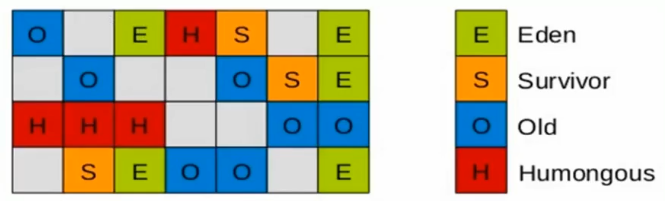
    - 将堆空间分为若干个区域(Region),这些区域中包含了逻辑上的年轻代和老年代
    - 和之前的各类回收器不同，它同时**兼顾年轻代和老年代**。对比其他回收器，或者工作在年轻代，或者工作在老年代;
  - **空间整合**
    - CMS:“标记-清除”算法、内存碎片、若干次GC后进行一次碎片整理
    - G1将内存划分为一个个的region。内存的回收是以region作为基本单位的。
      - **Region之间是复制算法**，但整体上实际可看作是**标记-压缩（Mark-Compact)算法**，两种算法都可以避免内存碎片。这种特性有利于程序长时间运行，分配大对象时不会因为无法找到连续内存空间而提前触发下一次GC。尤其是当Java堆非常大的时候，G1的优势更加明显。
  - **可预测的停顿时间模型（即:软实时soft real-time）**：尽可能确保吞吐量
    - 这是G1相对于CMS 的另一大优势，G1除了追求低停顿外，还能建立可预测的停顿时间模型，能让使用者明确指定在一个长度为M毫秒的时间片段内，消耗在垃圾收集上的时间不得超过N毫秒。
      - 由于分区的原因，G1可以只选取部分区域进行内存回收，这样缩小了回收的范围，因此对于全局停顿情况的发生也能得到较好的控制。
      - G1 跟踪各个 Region里面的垃圾堆积的价值大小(回收所获得的空间大小以及回收所需时间的经验值)），在后台维护一个优先列表，**每次根据允许的收集时间，优先回收价值最大的Region**。保证了G1 收集器在有限的时间内可以**获取尽可能高的收集效率。**
      - 相比于CMS GC，G1未必能做到CMS在最好情况下的延时停顿，但是最差情况要好很多。
- G1回收器的缺点：
  - 相较于CMS，G1还不具备全方位、压倒性优势。比如在用户程序运行过程中，G1无论是为了垃圾收集产生的内存占用(Footprint）还是程序运行时的额外执行负载（overload）都要比CMS要高。10-20%的额外内存占用
  - 从经验上来说，在小内存应用上CMS的表现大概率会优于G1，而G1在大内存应用上则发挥其优势。平衡点在6-8GB之间。
- G1回收器的参数设置：
  - -XX: +UseG1GC：手动指定使用G1收集器执行内存回收任务。
  - -XX:G1HeapRegionSize：设置每个Region的大小。值是2的幂，范围是1MB到32MB之间，目标是根据最小的Java堆大小划分出约2048个区域。默认是堆内存的1/2000。
  - -XX:MaxGCPauseMillis：设置期望达到的最大GC停顿时间指标(JVM会尽力实现，但不保证达到)。默认值是200ms
  - -XX:ParallelGCThread：设置SWT时GC线程数的值。最多设置为8
  - -XX:ConcGCThreads：设置并发标记的线程数。将n设置为并行垃圾回收线程数(ParallelGCThreads)的1/4左右。
  - -XX:InitiatingHeapOccupancyPercent：设置触发并发GC周期的Java堆占用率阈值。超过此值，就触发GC。默认值是45。
- G1回收器的常见操作步骤：
  - G1的设计原则就是简化JVM性能调优，开发人员只需要简单的三步即可完成调优:
  - 第一步:开启G1垃圾收集器
  - 第二步:设置堆的最大内存
  - 第三步:设置最大的停顿时间
  - G1中提供了三种垃圾回收模式: YoungGC、Mixed GC和Full GC，在不同的条件下被触发。
- G1回收器的适用场景：
  - 面向服务端应用，针对具有大内存、多处理器的机器。(在普通大小的堆里表现并不惊喜)
  - 最主要的应用是需要低GC延迟，并具有大堆的应用程序提供解决方案;
    - 如:在堆大小约6GB或更大时，可预测的暂停时间可以低于0.5秒;(G1通过每次只清理一部分而不是全部的Region的增量式清理来保证每次GC停顿时间不会过长)。
  - 用来替换掉JDK1.5中的CMS收集器
    - 在下面的情况时，使用G1可能比CNS好:
      - 超过50%的Java堆被活动数据占用;
      - 对象分配频率或年代提升频率变化很大;
      - GC停顿时间过长(长于0.5至1秒)。
  - HotSpot垃圾收集器里，除了G1以外，其他的垃圾收集器使用内置的JVM线程执行GC的多线程操作，而G1 GC可以**采用应用线程承担后台运行的GC工作**，即当JVM的GC线程处理速度慢时，系统会调用应用程序线程帮助加速垃圾回收过程。
- 分区Region：
  - 使用G1收集器时，它将整个Java堆划分成约2048个大小相同的独立Region块，每个Region块大小根据堆空间的实际大小而定，整体被控制在1MB到32MB之间，且为2的N次幂，即1MB,2MB，4MB,8MB,16MB,32MB。可以通过-
    XX:GlHeapRegionsize设定。所有的Region大小相同，且在JVM生命周期内不会被改变。
  - 虽然还保留有新生代和老年代的概念，但新生代和老年代不再是物理隔离的了，它们都是一部分Region(不需要连续）的集合。通过Region的动态分配方式实现逻辑上的连续。
  - 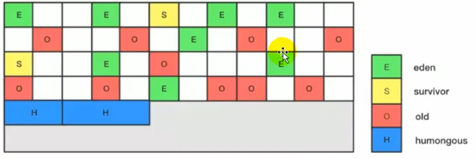
  - 一个region有可能属于Eden，Survivor或者 Old/Tenured 内存区域。但是一个region只可能属于一个角色。图中的E表示该region属于Eden内存区域，s表示属于survivor内存区域，o表示属于old内存区域。图中空白的表示未使用的内存空间。
  - G1垃圾收集器还增加了一种新的内存区域，叫做Humongous内存区域，如图中的H块。主要用于存储大对象，如果超过1.5个region，就放到H。
  - 为什么要新增一种内存区域H区？
    - 对于堆中的大对象，默认直接会被分配到老年代，但是如果它是一个短期存在的大对象就会对垃圾收集器造成负面影响。为了解决这个问题，G1划分了一个Humongous区，它用来专门存放大对象。如果一个H区装不下一个大对象，那么G1会寻找连续的H区来存储。为了能找到连续的H区，有时候不得不启动Full GC。G1的大多数行为都把H区作为老年代的一部分来看待。
  - 每个Region怎么使用？如何使用？
    - 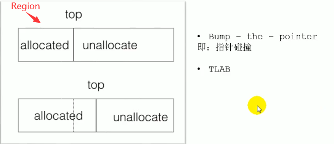

#### 9.4.8 G1回收器垃圾回收过程

- G1 GC的垃圾回收过程主要包括如下三个环节:
  - 年轻代GC(Young GC)
  - 老年代并发标记过程(Concurrent Marking)
  - 混合回收（Mixed GC)
  - (如果需要，单线程、独占式、高强度的Full GC还是继续存在的。它针对GC的评估失败提供了一种失败保护机制，即强力回收)
- 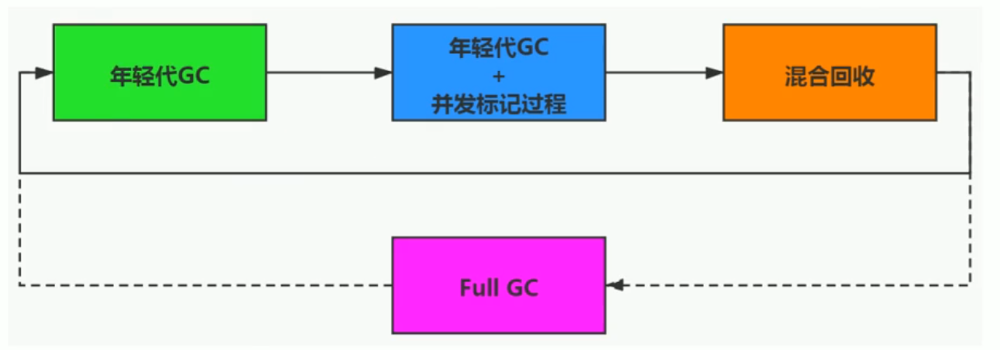
  - 顺时针：Young GC->Young GC+Concurrent Mark->Mixed GC顺序进行垃圾回收
  - 年轻代GC：
    - 应用程序分配内存，当**年轻代的Eden区用尽时开始年轻代回收过程;** G1的年轻代收集阶段是一个**并行**（多个垃圾回收线程）的**独占式**（STW）收集器：在年轻代回收期，G1 GC暂停所有应用程序线程，启动多线程执行年轻代回收。然后从年轻代区间移动存活对象到survivor区间或者老年区间，也有可能是两个区间都会涉及。
  - 年轻代GC+并发标记：
    - 当堆内存使用达到一定值（默认45%）时，开始老年代并发标记过程。
  - 混合回收：
    - 标记完成马上开始混合回收过程。对于一个混合回收期，**G1 GC从老年区间移动存活对象到空闲区间**，这些空闲区间也就成为了老年代的一部分。和年轻代不同，老年代的G1回收器和其他GC不同，**G1的老年代回收器不需要整个老年代被回收，一次只需要扫描/回收一小部分老年代的Region就可以了**。同时，这个老年代Region是和年轻代一起被回收的。
    - 举个例子：一个web服务器，Java进程最大堆内存为4G，每分钟响应1500个请求，每45秒钟会新分配大约2G的内存。G1会每45秒钟进行一次年轻代回收，每31个小时整个堆的使用率会达到45%，会开始老年代并发标记过程，标记完成后开始四到五次的混合回收。
- Remembered Set（记忆集）？
  - 一个对象被不同区域引用的问题
  - 一个Region不可能是孤立的，一个Region中的对象可能被其他任意Region(跨代)中对象引用，判断对象存活时，是否需要扫描整个Java堆才能保证准确?
    - 为什么？思考一下什么可以充当GC Roots？
    - 只要不在垃圾回收Region内部（堆）的对象引用都可能当做GC Roots
    - 所以会导致一个Region中的对象被其他Regio中的引用所连接，导致判断该对象是否是垃圾，是否被GC Roots引用，还需要遍历其他Region才能确定，但是Region又很多，不可能全部扫描吧！
  - 在其他的分代收集器，也存在这样的问题（而G1更突出)回收新生代也不得不同时扫描老年代?
  - 这样的话会降低Minor GC的效率！
  - 解决方法:
  - 无论G1还是其他分代收集器，JVM都是使用Remembered Set来避免全局扫描；每个Region都有一个对应的Remembered set;
  - 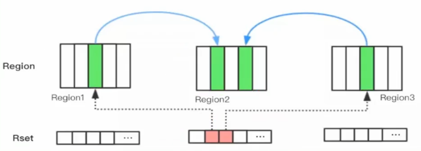
  - 每次Reference类型数据写操作时，都会产生一个Write Barrier暂时中断操作;
  - 然后检查将要写入的引用指向的对象是否和该Reference类型数据在不同的Region(其他收集器:检查老年代对象是否引用了新生代对象）
    - 如果是来自不同的Region，通过CardTable把相关引用信息记录到引用指向对象的所在Region对应的Remembered Set中;
  - 当进行垃圾收集时，在GC根节点的枚举范围加入Remembered Set：就可以保证不进行全局扫描，也不会有遗漏。
- G1垃圾回收具体过程：
  - 年轻代GC：
    - JVM启动时，G1先准备好Eden区，程序在运行过程中不断创建对象到Eden区，当Eden空间耗尽时，G1会启动一次年轻代垃圾回收过程。
    - 年轻代垃圾回收只会回收Eden区和Survivor区。
    - YGC时，首先G1停止应用程序的执行(Stop-The-World） ,G1创建回收集(Collection Set)，**回收集是指需要被回收的内存分段的集合**，年轻代回收过程的回收集包含年轻代Eden区和Survivor区所有的内存分段。
    - 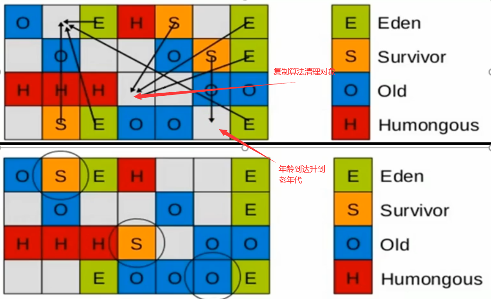
    - 第一阶段，扫描根。
      - 根是指static变量指向的对象，正在执行的方法调用链条上的局部变量等。根引用连同RSet记录的外部引用作为扫描存活对象的入口。
    - 第二阶段，更新RSet。
      - 处理dirty card queue(见备注)中的card，更新RSet。此阶段完成后，**RSet可以准确的反映老年代对所在的内存分段中对象的引用。**
      - 什么是Dirty Card Queue？
        - 对于应用程序的引用赋值语句object.field=object , JVM会在之前和之后执行特殊的操作以在dirty card queue中入队-个保存了对象引用信息的card。在年轻代回收的时候, G1会对Dirty Card Queue中所有的card进行处理，以更新RSet，保证RSet实时准确的反映引用关系。
      - 那为什么不在引用赋值语句处直接更新RSet呢?
        - 这是为了性能的需要，RSet的处理需要线程同步， 开销会很大，使用队列性能会好很多。
    - 第三阶段，处理RSet。
      - 识别被老年代对象指向的Eden中的对象，这些被指向的Eden中的对象被认为是存活的对象。
    - 第四阶段，复制对象。
      - 此阶段，对象树被遍历，Eden区内存段中存活的对象会被复制到survivor区中空的内存分段survivor区内存段中存活的对象如果年龄未达阈值，年龄会加1，达到阀值会被会被复制到old区中空的内存分段。如果survivor空间不够，Eden空间的部分数据会直接晋升到老年代空间。
    - 第五阶段，处理引用。
      - 处理Soft，Weak，Phantom，Final，JNI Weak 等引用。最终Eden空间的数据为空，GC停止工作，而目标内存中的对象都是连续存储的，没有碎片，所以复制过程可以达到内存整理的效果，减少碎片。
  - 并发标记过程：
    - 1.初始标记阶段：标记从根节点直接可达的对象。这个阶段是STW的，并且会触发一次年轻代GC。
    - 2.根区域扫描(Root Region Scanning) : G1 GC扫描Survivor区直接可达的老年代区域对象，并标记被引用的对象。这一过程必须在Young GC之前完成。因为Young GC需要清理Survivor区中的对象了
    - 3.并发标记(Concurrent Marking)：在整个堆中进行并发标记(和应用程序并发执行)，此过程可能被Young GC中断。在并发标记阶段，**若发现区域对象中的所有对象都是垃圾,那这个区域会被立即回收(实时回收)**。同时，并发标记过程中，会计算每个区域的对象活性(区域中存活对象的比例)。
    - 4.再次标记(Remark)：由于应用程序持续进行，需要修正上一次的标记结果。是STW的。G1中采用了比CMS更快的初始快照算法：snapshot-at-the-beginning (SATB)。
    - 5.独占清理(cleanup,STW)：计算各个区域的存活对象和GC回收比例，并进行排序，识别可以混合回收的区域。为下阶段做铺垫。是STW的。
      - 这个阶段并不会实际上去做垃圾的收集
    - 6.并发清理阶段:识别并清理完全空闲的区域。
  - 混合回收：
    - 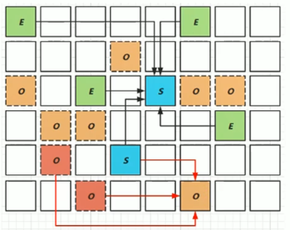
    - 当越来越多的对象晋升到老年代old region时，为了避免堆内存被耗尽，虚拟机会触发一个混合的垃圾收集器,即Mixed GC，该算法并不是一个Old GC，除了回收整个Young Region,还会回收一部分的Old Region。 这里需要注意:是一部分老年代，而不是全部老年代。可以选择哪些Old Region进行收集，从而可以对垃圾回收的耗时时间进行控制。也要注意的是Mixed GC并不是Full GC。
    - 并发标记结束以后，老年代中百分百为垃圾的内存分段被回收了，部分为垃圾的内存分段被计算了出来。默认情况下，这些老年代的内存分段会分8次(可以通过-XX: G1MixedGCCountTarget设置)被回收。
    - 混合回收的回收集(Collection Set) 包括八分之一的老年代内存分段，Eden区内存分段，Survivor区内存分段。混合回收的算法和年轻代回收的算法完全一样， 只是回收集多了老年代的内存分段。具体过程请参考上面的年轻代回收过程。
    - 由于老年代中的内存分段默认分8次回收，G1 会优先回收垃圾多的内存分段。垃圾占内存分段比例越高的，越会被先回收。并且有一个阈值会决定内存分段是否被回收，-XX:G1MixedGCLiveThresholdPercent，默认为65%，意思是垃圾占内存分段比例要达到65%才会被回收。如果垃圾占比太低，意味着存活的对象占比高，在复制的时候会花
      费更多的时间。
    - 混合回收并不一定要进行8次。有一个阈值-XX:G1HeapWastePercent，默认值为10%，意思是允许整个堆内存中有10%的空间被浪费，意味着如果发现可以回收的垃圾占堆内存的比例低于10%，则不再进行混合回收。因为GC会花费很多的时间但是回收到的内存却很少。
  - Full GC：
    - G1的初衷就是要避免Full GC的出现。但是如果上述方式不能正常工作，G1会停止应用程序的执行(Stop-The-World) ，使用单线程的内存回收算法进行垃圾回收，性能会非常差，应用程序停顿时间会很长。
    - 要避免Fu1l GC的发生，一旦发生需要进行调整。什么时候会发生Full GC呢?
      - 比如堆内存太小，当G1在复制存活对象的时候没有空的内存分段可用，则会回退到Full GC，这种情况可以通过增大内存解决。
    - 导致G1 Full GC的原因可能有两个:
      - Evacuation的时候没有足够的to- space来存放晋升的对象;
      - 并发处理过程完成之前空间耗尽。
- 补充：
  - 从Oracle官方透露出来的信息可获知，回收阶段( Evacuation)其实本也有想过设计成与用户程序一起并发执行， 但这件事情做起来比较复杂，考虑到G1只是回收一部分Region, 停顿时间是用户可控制的，所以并不迫切去实现，而选择把这个特性放到了G1之后出现的**低延迟垃圾收集器(即ZGC)中**。另外，还考虑到G1不是仅仅面向低延迟，停顿用户线程能够最大幅度提高垃圾收集效率，为了保证吞吐量所以才选择了完全暂停用户线程的实现方案。
  - 优化建议：
    - 年轻代大小
      - 避免使用-Xmn或-XX: NewRatio等相关选项显式设置年轻代大小. JVM会自动调整！
      - 固定年轻代的大小会覆盖暂停时间目标
    - 暂停时间目标不要太过严苛
      - G1 GC的吞吐量目标是90%的应用程序时间和10%的垃圾回收时间
      - 评估G1 GC的吞吐量时，暂停时间目标不要太严苛。目标太过严苛表示你愿意承受更多的垃圾回收开销，而这些会直接影响到吞吐量。

#### 9.4.9 七种经典垃圾回收器总结

- 截止JDK 1.8，-共有7款不同的垃圾收集器。每一-款不同的垃圾收集器都有不同的特点，在具体使用的时候，需要根据具体的情况选用不同的垃圾收集器。
- 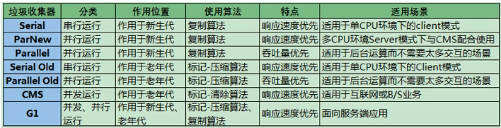
- 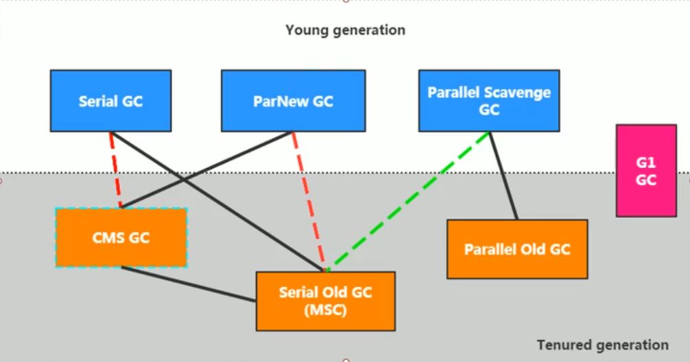
- 如何选择垃圾回收器？
  - Java垃圾收集器的配置对于JVM优化来说是-一个很重要的选择，选择合适的垃圾收集器可以让JVM的性能有一个很大的提升。
  - 怎么选择垃圾收集器?
    - 优先调整堆的大小让JVM自适应完成。
    - 如果内存小于100M，使用串行收集器
    - 如果是单核、单机程序，并且没有停顿时间的要求，串行收集器
    - 如果是多CPU、需要高吞吐量、允许停顿时间超过1秒，选择并行或者JVM自己选择.
    - 如果是多CPU、追求低停顿时间，需快速响应(比如延迟不能超过1秒，如互联网应用)，使用并发收集器官方推荐G1，性能高。**现在互联网的项目，基本都是使用G1。**

### 9.5 GC日志分析

- 内存分配与垃圾回收的参数列表：
  - -XX:+PrintGC：输出GC日志，类似：-verbose:gc
  - -XX:+PrintGCDetails：输出GC的详细日志
  - -XX:+PrintGCTimeStamps：输出GC的时间戳，以基准时间的形式
  - -XX:+PrintGCDateStampes：输出GC的时间戳，以日期的形式
  - -XX:+PrintHeapAtGC：在进行GC的前后打印出堆的信息
  - -Xloggc:../logs/gc.log ：日志文件的输出路径
    - 日志分析工具：**GCViewer、GCEasy**、GCHisto、GCLogViewer、Hpjmeter、garbagecat等
- 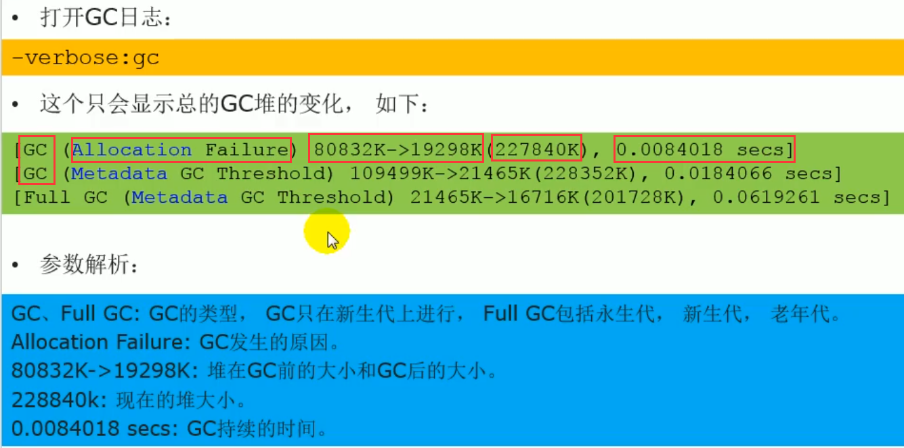
- 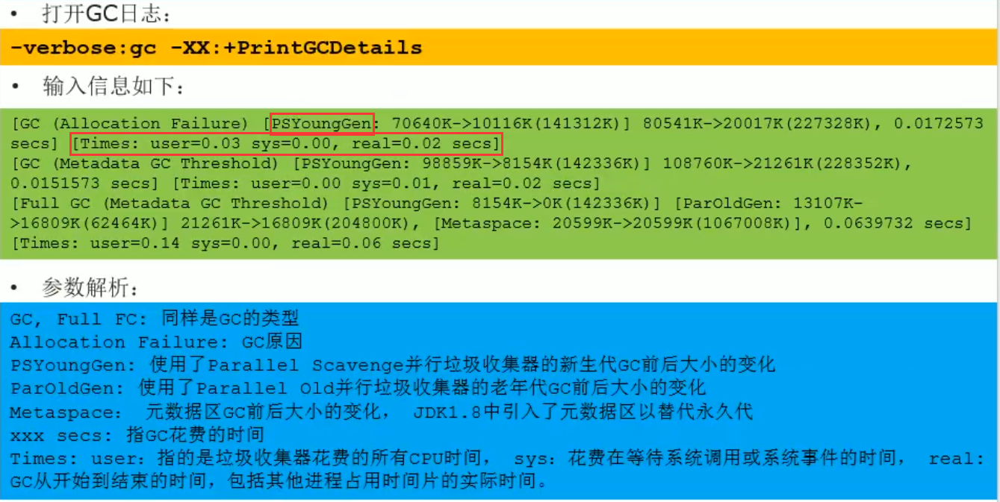
- 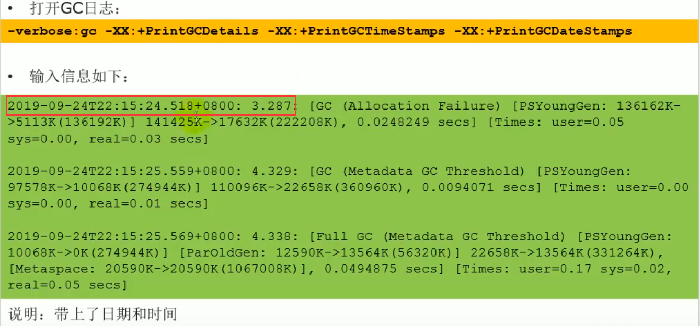
- 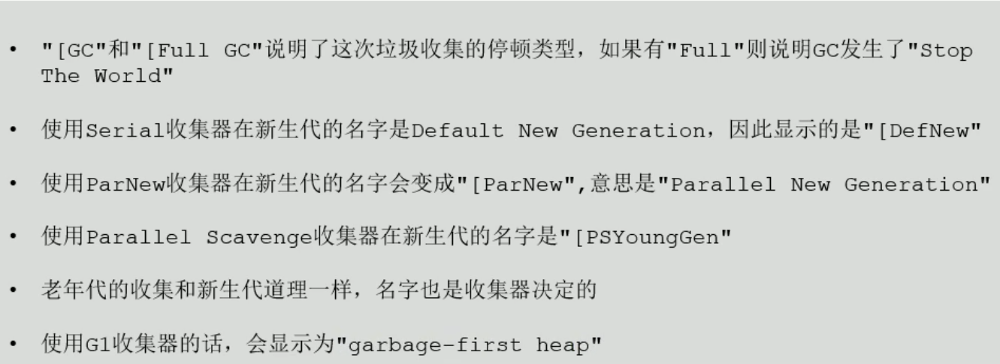
- 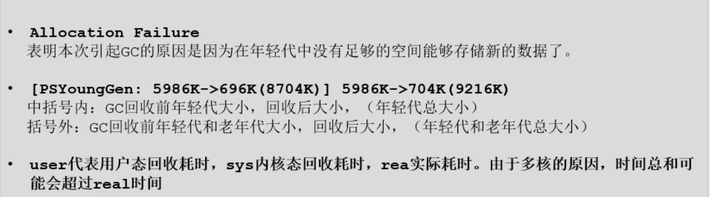
- 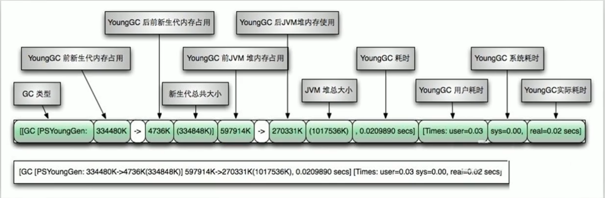
- 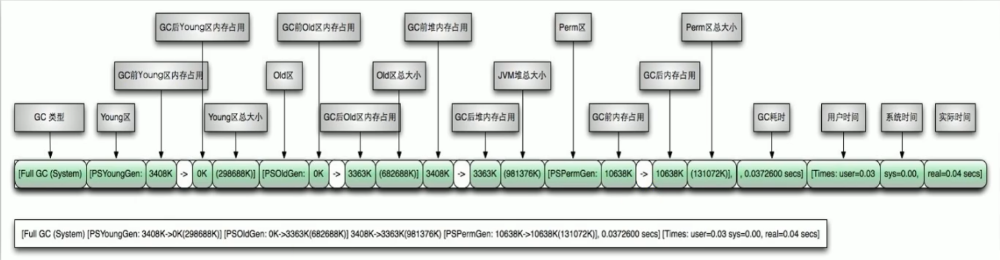
- 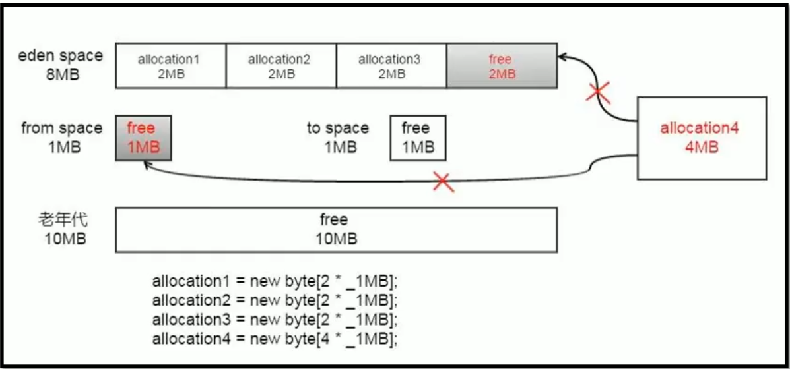
- 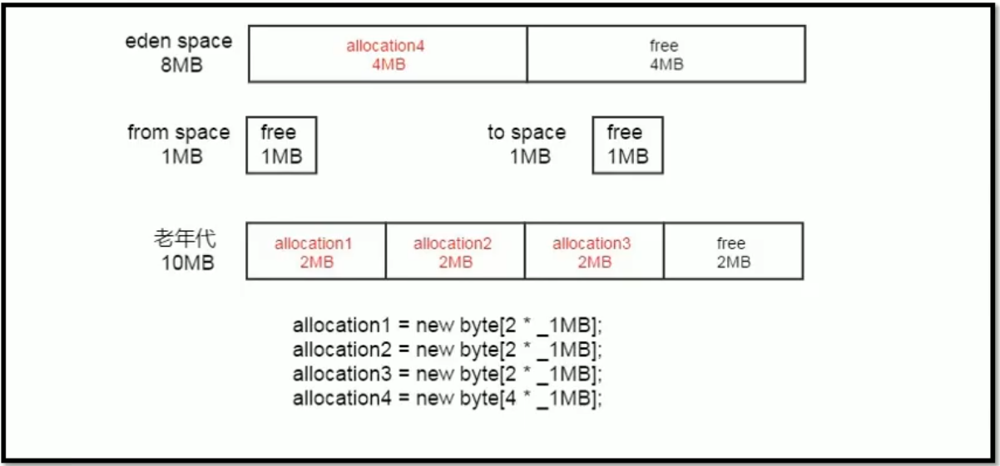

### 9.6 垃圾回收器的新发展

- GC仍然处于飞速发展之中，目前的默认选项G1 GC在不断的进行改进，很多我们原来认为的缺点，例如串行的Full GC、Card Table扫描的低效等，都已经被大幅改进，例如，JDK 10以后，Full GC已经是并行运行，在很多场景下，其表现还略优于Parallel GC的并行Full GC实现。
- 即使是Serial GC，虽然比较古老，但是简单的设计和实现未必就是过时的，它本身的开销，不管是GC相关数据结构的开销，还是线程的开销，都是非常小的，所以随着云计算的兴起，在Serverless等新的应用场景下，Serial GC找到了新的舞台。
- 比较不幸的是CMS GC，因为其算法的理论缺陷等原因，虽然现在还有非常大的用户群体，但在JDK9中已经被标记为废弃，并在JDK14版本中移除。
- 现在G1回收器已成为默认回收器好几年了。
- 
- 我们还看到了引入了两个新的收集器：ZGC ( JDK11出现)和Shenandoah(Open JDK12)
  - 主打特点：低停顿时间
- 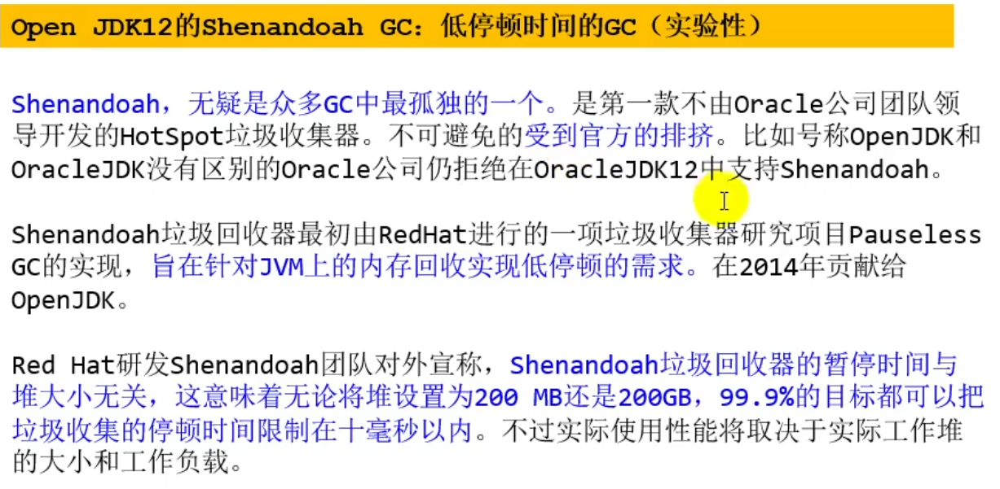
- 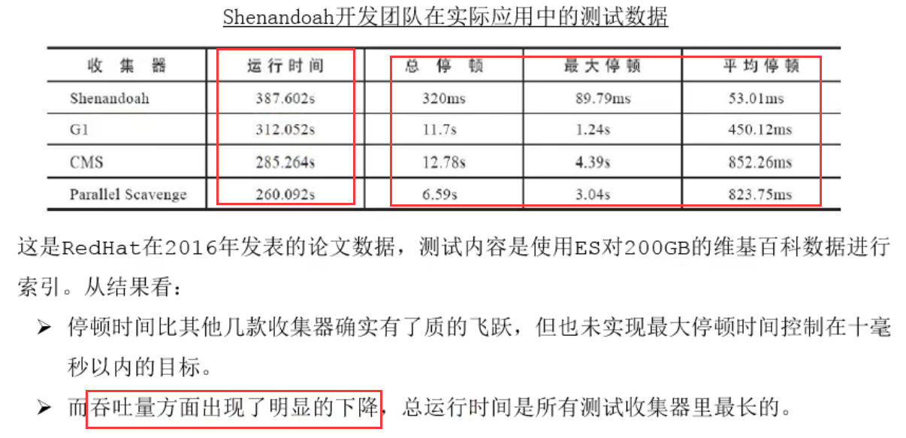
- Shenandoah GC总结：
  - 优点：低延迟时间
  - 缺点：高运行负担下的吞吐量下降
  - 工作过程：大致分为九个阶段！自己看官方文档或者视频！
- 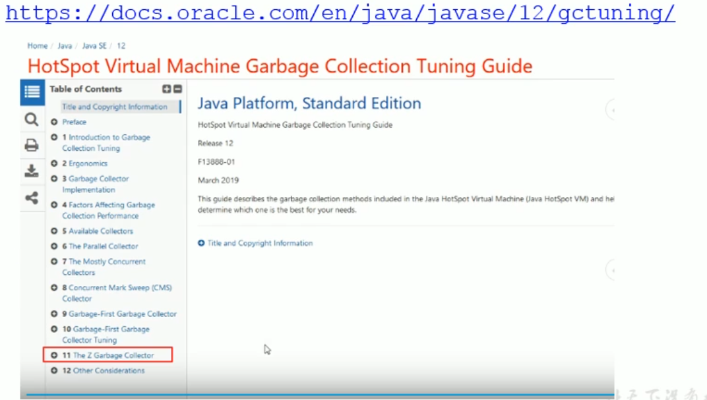
- ZGC与Shenandoah目标高度相似，在**尽可能对吞吐量影响不大的前提下，**
  **实现在任意堆内存大小下都可以把垃圾收集的停顿时间限制在十毫秒以内**
  **的低延迟。**
- 《深入理解Java虚拟机》：一书中这样定义ZGC: ZGC收集器是一款基于Region内存布局的，(暂时)不设分代的，使用了读屏障、染色指针和内存多重映射等技术来实现**可并发的标记-压缩算法**的，以低延迟为首要目标的一款垃圾收集器。
- ZGC的工作过程可以分为4个阶段：**并发标记-并发预备重分配-并发重分配-并发重映射**等。
- ZGC几乎在所有地方并发执行的，除了**初始标记的是STW的**。所以停顿时间几乎就耗费在初始标记上，这部分的实际时间是非常少的。
- 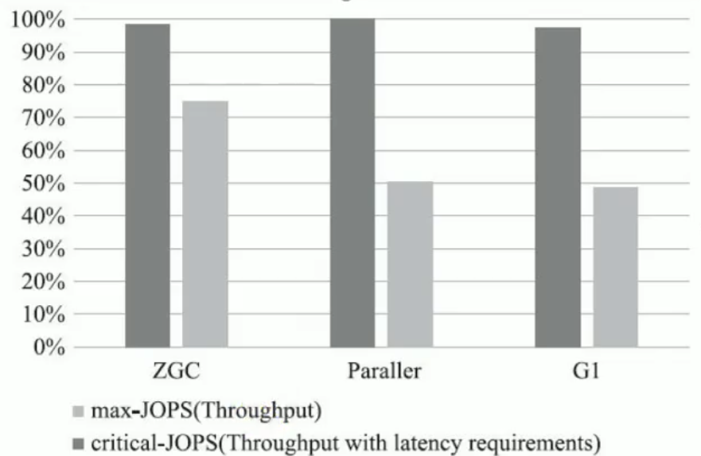
- 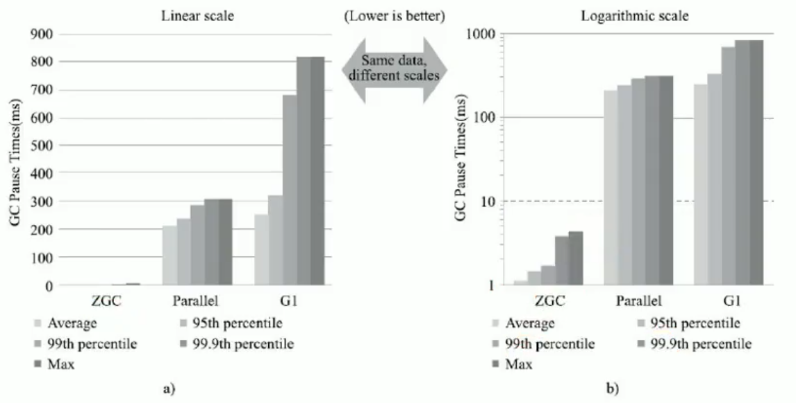
- 虽然ZGC还在试验状态，没有完成所有特性，但此时性能已经相当亮眼，用“令人震惊、革命性”来形容，不为过。
- 未来将在服务端、大内存、低延迟应用的首选垃圾收集器。
- 其他的垃圾回收器：
  - 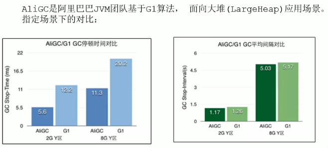
  - 当然，其他厂商也提供了各种独具一格的GC实现，例如比较有名的低延迟GC,Zing (https ://www.nfoq.com/articles/azu1_ gc_ in _detail) ，有兴趣可以参考提供的链接。
