# Java IO理解

- 主要参考自：
  - http://blog.csdn.net/u012250875/article/details/78341874
  - https://blog.csdn.net/lovely_girl1126/article/details/107192096?utm_medium=distribute.pc_relevant.none-task-blog-2~default~baidujs_title~default-5.highlightwordscore&spm=1001.2101.3001.4242.4
  - https://zhuanlan.zhihu.com/p/159276195

## 1. IO?

- 什么是IO？
  - 所谓IO即input和output的缩写，是对数据的流入和流出的一种抽象，编程中很常见的一个概念。
- 什么是流？
  - 动态的，可转移的，从一处到另一处的
  - 水流（静止的水想必没人会叫水流），物流，人流
- 什么是Java IO？
  - java为了我们调用方便，而屏蔽输入/输出源和流动细节，抽象出的用于解决数据流动问题的类体系，这就是java的io流
- 什么是输入输出流？
  - 输入流：用于读取的流、只能用来读、将内存中的数据读出到磁盘、输入到磁盘文件中
  - 输出流：用于写入的流、只能用来写、将磁盘中的数据写入到内存、输出到内存中
  - 输入输出是针对内存来说的！
  - 
- 什么是字节流字符流？
  - 字节流：输入输出流的最小单位是一个字节(8 bit)=》stream结尾
  - 字符流：输出输出流的最小操作单位为一个字符（16bit）=》reader、writer结尾
- 什么是节点流处理流？
  - 节点流偏向实现细节，直接与细节打交道，比如FileInputStream
    - 节点流构造方法则是具体的物理节点
  - 包装（处理）流偏功能，以目标功能为抽象，比如PrintStream
    - 处理流的构造方法中需要另一个流作为参数
    - 包装流使用了装饰器模式
    - 包装流对节点流进行了一系列功能的强化包装，让包装后的流拥有了更多的操作手段或更高的操作效率，而隐藏节点流底层的复杂性
- 什么是普通流缓存流？
  - 普通流：一个一个数据的流动
  - 缓存流：一堆一堆数据的流动
- 什么是BIO、NIO、AIO？
  - BIO：b有两说，一为base，jdk中最早抽象出的io体系；一为block，jdk 1.0 中的io体系是阻塞的。所以两说皆有道理，一般我们认为b取block之意 
  - NIO：n也有两说，一为new，针对base而言；一为non-block，针对block而言。
  - AIO：a为asynchronous，异步的，异步io，aio还有个名字叫：nio2
  - 发展历程：bio(jdk1.0) -> nio(jdk1.4) -> aio(jdk1.7)
- 什么是同步？异步？=》应该是针对用户能否干其他事来判断
  - **同步、异步主要针对io数据读写来定义的，读写数据过程中不阻塞线程称为异步io，否则，称为同步io。**
  - 同步：用户进程触发IO操作并等待或者轮询的去查看IO操作是否完成
  - 异步：用户触发IO操作以后,可以干别的事，IO操作完成以后再通知当前线程继续处理
- 什么是阻塞、非阻塞？=》应该是判断服务端处理客户端的线程能否干其他事来判断
  - **阻塞、非阻塞主要是针对线程发起io请求后，是否立即返回来定义的，立即返回称为非阻塞io，否则称为阻塞io。**
  - 阻塞：当一个线程调用 read() 或 write()时，**该线程被阻塞，直到有一些数据被读取或写入，**该线程在此期间不能执行其他任务
  - 非阻塞：当线程从某通道进行读写数据时，若没有数据可用时，该线程可以进行其他任务。线程通常将非阻塞 IO 的空闲时间用于在其他通道上执行 IO 操作，所以单独的线程可以管理多个输入和输出通道。
- BIO：
  - Java BIO ： 同步并阻塞，服务器实现模式为一个连接一个线程，即客户端有连接请求时服务器端就需要启动一个线程进行处理，如果这个连接不做任何事情会造成不必要的线程开销，当然可以通过线程池机制改善。
  - BIO:线程发起io请求后，一直阻塞(阻塞io)，直到数据就绪后，用户线程将数据写入socket空间，或从socket空间读取数据（同步）。
  - 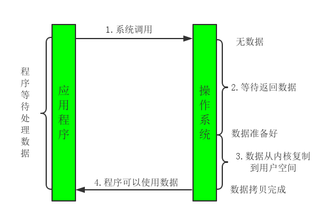
- NIO：
  - Java NIO ： 同步非阻塞，服务器实现模式为一个请求一个线程，即客户端发送的连接请求都会注册到多路复用器上，多路复用器轮询到连接有I/O请求时才启动一个线程进行处理。
  - 线程发起io请求后，立即返回（非阻塞io）。用户线程不阻塞等待，但是，用户线程要定时轮询检查数据是否就绪，当数据就绪后，用户线程将数据从用户空间写入socket空间，或从socket空间读取数据到用户空间（同步）。
  - 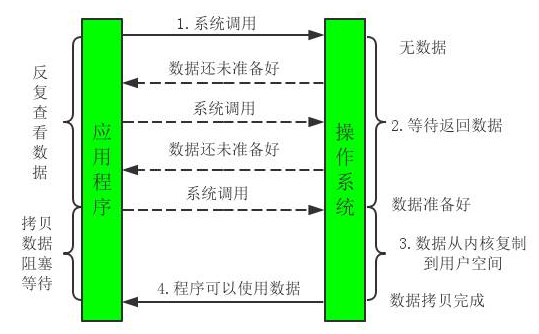
- AIO：
  - AIO:**线程发起io请求后，立即返回（非阻塞io**），当数据读写完成后，**OS通知用户线程（异步）**。这里数据写入socket空间，或从socket空间读取数据到用户空间由OS完成，用户线程无需介入，所以也就不会阻塞用户线程，即异步。

## 2. BIO

- 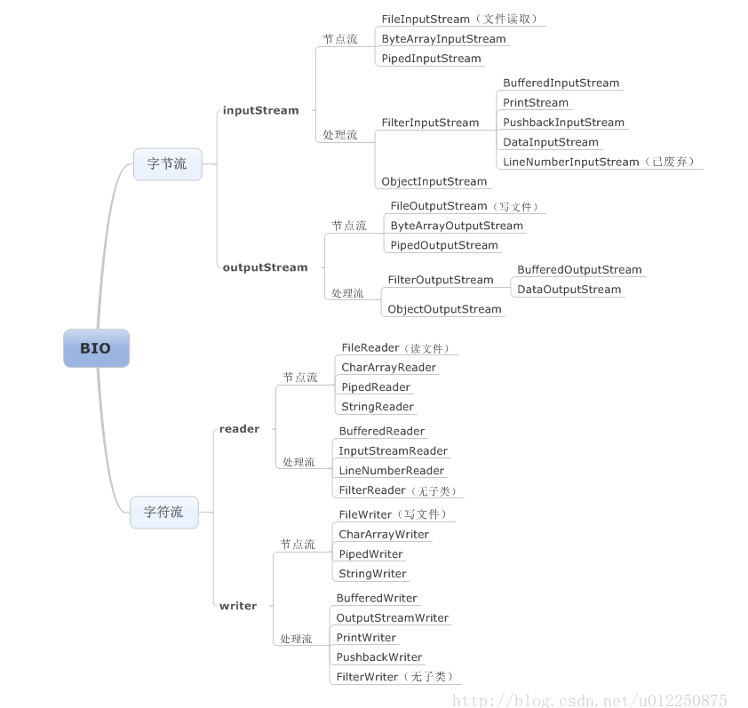

- 什么时候该用输入流，什么时候用输出流？

  - 从流中读取信息使用输入流（xxxInputStream/xxxReader）
  - 写入信息使用输出流（xxxOutputStream/xxxWriter）

- 什么时候该用字节流，什么时候用字符流？

  - 处理纯文本数据时使用字符流（xxxReader/xxxWriter），
  - 处理非纯文本时使用字节流（xxxStream）
  - 最后其实不管什么类型文件都可以用字节流处理，包括纯文本，但会增加一些额外的工作量。所以还是按原则选择最合适的流来处理

-  什么时候该用节点流，什么时候用包装（处理）流？、

  - 不管你用什么包装（处理）流，都需要先使用节点流获取对应节点的数据流，然后根据具体需求来选择相应的包装（处理）流来对节点流进行包装修饰，从而获取相应的功能

-  什么时候该用普通流，什么时候用缓冲流？

  - 一般如果对数据流不做加工处理，而是单纯的读写，如数据转移（拷贝，上传，下载），则需要使用缓冲流来提高性能，当然你也可以自己使用buff数组来提高读写效率。

- 代码实例：拷贝数据：

  - 

  - 因此是先获取一个输入流，再获取一个输出流！

  - ```java
    package BIO.Demo1;
    
    import java.io.*;
    
    public class CopyFile {
        /**
         * 拷贝文件（方法一）
         * @param src 被拷贝的文件
         * @param dest 拷贝到的目的地
         */
        public static void copyByFileStream(File src, File dest) throws IOException {
            FileInputStream fis = null;
            FileOutputStream fos = null;
            long start = System.currentTimeMillis();
            try {
                // 输入流：从内存到磁盘的流
                fis = new FileInputStream(src);
                fos = new FileOutputStream(dest);
                int b = 0;
                while((b = fis.read()) != -1){//一个字节一个字节的读
                    fos.write(b);//一个字节一个字节的写
                }
            } catch (Exception e) {
                e.printStackTrace();
            } finally{
                fos.close();
                fis.close();
            }
            System.out.println("使用FileOutputStream拷贝大小"+(src)+"的文件未使用缓冲数组耗时："+(System.currentTimeMillis()-start)+"毫秒");
        }
    
        /**
         * 拷贝文件（方法二）
         * @param src 被拷贝的文件
         * @param dest 拷贝到的目的地
         * @param size 缓冲数组大小
         */
        public static void copyByFileStream(File src,File dest,int size) throws IOException {
            FileInputStream fis = null;
            FileOutputStream fos = null;
            long start = System.currentTimeMillis();
            try {
                fis = new FileInputStream(src);
                fos = new FileOutputStream(dest);
                int b = 0;
                byte[] buff = new byte[size];//定义一个缓冲数组
                //读取一定量的数据（read返回值表示这次读了多少个数据）放入数组中
                while((b = fis.read(buff)) != -1){
                    fos.write(buff,0,b);//一次将读入到数组中的有效数据（索引[0,b]范围的数据）写入输出流中
                }
            } catch (Exception e) {
                e.printStackTrace();
            } finally{
                fos.close();
                fis.close();
            }
            System.out.println("使用FileOutputStream拷贝大小"+(src)+"的文件使用了缓冲数组耗时："+(System.currentTimeMillis()-start)+"毫秒，生成的目标文件大小为"+(dest));
        }
    
        /**
         * 拷贝文件（方法三）
         * @param src
         * @param dest
         */
        public static void copyByBufferedStream(File src,File dest) throws IOException {
            BufferedInputStream bis = null;
            BufferedOutputStream bos = null;
            long start = System.currentTimeMillis();
            try{
                bis = new BufferedInputStream(new FileInputStream(src));
                bos = new BufferedOutputStream(new FileOutputStream(dest));
                int b = 0;
                while( (b = bis.read())!=-1){
                    bos.write(b);//使用BufferedXXX重写的write方法进行写入数据。该方法看似未缓冲实际做了缓冲处理
                }
                bos.flush();
            }catch(IOException e){
                e.printStackTrace();
            }finally{
                bos.close();
                bis.close();
            }
            System.out.println("使用BufferedXXXStream拷贝大小"+(src)+"的文件使用了缓冲数组耗时："+(System.currentTimeMillis()-start)+"毫秒");
        }
        /**
         * 拷贝文件（方法四）
         * @param src 被拷贝的文件对象
         * @param dest 拷贝目的地文件对象
         * @param size 自定义缓冲区大小
         */
        public static void copyByBufferedStream(File src,File dest,int size) throws IOException {
            BufferedInputStream bis = null;
            BufferedOutputStream bos = null;
            long start = System.currentTimeMillis();
            try{
                bis = new BufferedInputStream(new FileInputStream(src));
                bos = new BufferedOutputStream(new FileOutputStream(dest));
                int b = 0;
                byte[] buff = new byte[size];
                while( (b = bis.read(buff))!=-1){//数据读入缓冲区
                    bos.write(buff,0,b);//将缓存区数据写入输出流中
                }
                bos.flush();
            }catch(IOException e){
                e.printStackTrace();
            }finally{
                bos.close();
                bis.close();
            }
            System.out.println("使用BufferedXXXStream拷贝大小"+(src)+"的文件使用了缓冲数组耗时："+(System.currentTimeMillis()-start)+"毫秒");
        }
        public static void main(String[] args) throws InterruptedException, IOException {
            File src = new File("F:\\King_File\\Java_Study\\Java_Note\\JavaIO\\IODemo\\src\\BIO\\Demo1\\test.png");
            File dest = new File("test_copy.png");
            //无缓冲区
            copyByFileStream(src,dest);
            Thread.sleep(1000);
            //32k缓冲区
            copyByFileStream(src,dest,32);
            Thread.sleep(1000);
            //64k缓冲区
            copyByFileStream(src,dest,64);
            Thread.sleep(1000);
            //BufferedOutputStream缓冲区默认大小为8192字节
            copyByBufferedStream(src, dest);
            Thread.sleep(1000);
            //BufferedOutputStream缓冲区默认大小为8192*2字节
            copyByBufferedStream(src, dest, 8192*2);
        }
    
    }
    ```

### 2.1 相关问题

- 为什么使用缓冲？
  - 提高流读写性能！
- 如何判断文件是否读写完毕？
  - 我们一般在处理文件，一般是一边从输出流中读数据，然后将读出的部分进行处理，最后将处理好的数据写入到输出流中。那么要将一个文件完整的处理完，我们必须知道什么时候已经读到文件的末尾了。
  - 一般来说可以根据read方法返回的值，如果返回了-1表示没有可读取的字节了。
  - 另一种是使用available()方法查看还有多少可供读取的，当输入流每读一个字节，available()返回的值便减小1，这种模式很像游标的模式，
  - 注意：available的适用场景是非阻塞读取，如本地文件读取，如果是网络io使用该方法，可能你拿到的值就不对了。
  - 总的来说一般输入流提供的读取方法是可以获得文件是否结束的标志，比如流默认的read方法，根据返回值是否非负，比如PrintReader和BufferedReader的readLine()方法，根据返回数据是否非空。

### 2.2 BIO网络通信实例

- 采用BIO通信模型的服务端，通常由一个独立的Acceptor线程负责监听客户端的连接，它接收到客户端连接请求之后为每个客户端创建一个新的线程进行链路处理没处理完成后，通过输出流返回应答给客户端，线程销毁。即典型的一请求一应答通信模型。

- 原理：采用同步阻塞，一个连接为一个线程，连接一个客户端就需要启动一个线程进行处理，如果连接未断开且未做任何事，会造成不必要的开销。可以通过线程池优化。

- 缺点：适用于连接数目较小且相对固定的架构，对服务器的要求比较高，对**并发有局限性**。**JDK1.4以前唯一的选择**，简单易理解。

- 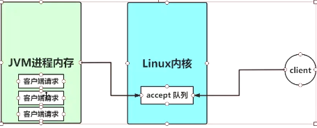

- 服务端：

- ```java
  package BIO.Demo2;
  import java.io.IOException;
  import java.net.Socket;
  import java.io.InputStream;
  import java.net.ServerSocket;
  import java.util.concurrent.ExecutorService;
  import java.util.concurrent.Executors;
  
  /**
   * 客户端线程
   * @author yangtao__anxpp.com
   * 用于处理一个客户端的Socket链路
   */
  public class BIOServer {
  
      public static void main(String[] args) throws IOException {
          /**
           * 1.创建一个线程池
           * 如果有客户端连接了，就创建一个线程与之通信。
           */
          ExecutorService newCachedThreadPool = Executors.newCachedThreadPool();
  
          // 创建ServerSocket
          ServerSocket serverSocket = new ServerSocket(6668);
  
          System.out.println("服务器启动了");
  
          while (true) {
              // 监听，等待客户端连接
              final Socket socket = serverSocket.accept();
              System.out.println("连接到了一个客户端");
              // 使用线程池
              newCachedThreadPool.execute(new Runnable() {
                  @Override
                  public void run() {
                      // 可以和客户端通讯
                      handler(socket);
                  }
              });
          }
      }
  
      // 编写一个handler方法，与客户端通讯
      public static void handler(Socket socket) {
          // 通过socket获取输入流
          try {
              System.out.println("线程信息 id=" + Thread.currentThread().getId() + "线程名字=" + Thread.currentThread().getName());
              InputStream inputStream = socket.getInputStream();
              byte[] bytes = new byte[1024];
  
              // 循环的读取客户端发送的数据
              while (true) {
                  System.out.println("线程信息 id=" + Thread.currentThread().getId() + "线程名字=" + Thread.currentThread().getName());
  
                  int read = inputStream.read(bytes);
                  if (read != -1) {
                      // 输出客户端发送的数据
                      System.out.println(new String(bytes, 0, read));
                  } else {
                      break;
                  }
              }
          } catch (Exception e) {
              e.printStackTrace();
          } finally {
              // 关闭和客户端的连接
              try {
                  socket.close();
              } catch (Exception e) {
                  e.printStackTrace();
              }
          }
      }
  }
  ```

- ```java
  package BIO.Demo2;
  
  import java.io.DataOutputStream;
  import java.io.FileInputStream;
  import java.io.InputStream;
  import java.net.Socket;
  
  public class BIOClient {
      public static void main(String[] args) throws Exception {
          Socket socket = new Socket("localhost", 6668);
  
          String fileName = "test_copy.png";
          InputStream inputStream = new FileInputStream(fileName);
          DataOutputStream dataOutputStream = new DataOutputStream(socket.getOutputStream());
          byte[] buffer = new byte[4096];
          long readCount;
          long total = 0;
  
          long startTime = System.currentTimeMillis();
  
          while ((readCount = inputStream.read(buffer)) >= 0) {
              total += readCount;
              dataOutputStream.write(buffer);
          }
          System.out.println("发送总字节数： " + total + ", 耗时： " + (System.currentTimeMillis() - startTime));
          dataOutputStream.close();
          socket.close();
          inputStream.close();
      }
  }
  ```

### 2.3 BIO的问题

  - 同步阻塞：
    - 同步：客户端进程触发IO操作并等待
    - 阻塞：当服务器创建线程来处理客户端请求时，调用read、write等IO操作时，该线程被阻塞，等待IO操作完毕才能继续执行接下来的操作
  - 每个请求都需要创建独立的线程。
  - 当并发量大时，需要创建大量线程，占用系统资源。
  - 连接建立后，如果当前线程暂时没有数据可读，则线程就阻塞在 Read 操作上，造成线程资源浪费

## 3. NIO

- Java NIO全称（java non-blocking io），从 JDK1.4 开始，Java 提供了一系列改进的输入/输出的新特性，被统称为 NIO(即 New IO)，是同步非阻塞的。
  - 同步：客户端进程触发IO操作并等待
  - 非阻塞：当服务器创建线程来处理客户端请求时，调用read、write等IO操作时，该线程不会被阻塞，而是可以执行其他操作
- NIO 有三大核心部分：Channel(通道)，Buffer(缓冲区), Selector(选择器) 
- Channel一般翻译为通道
  - 既可以从通道中读取数据，又可以写数据到通道
  - FileChannel:从文件中读写数据
  - DatagramChannel:通过UDP读写网络中的数据
  - SocketChannel:通过TCP读写网络中的数据
  - ServerSocketChannel:可以监听新进来的TCP连接,对每一个新进来的连接都会创建一个SocketChannel
- Buffer：
  - 对数据的读取/写入需要使用buffer，buffer本质就是一个数组
  - ByteButter
  - CharBuffer
  - ShortBuffer
  - IntBuffer
  - LongBuffer
  - FloatBuffer
  - DoubleBuffer
- Channel和Buffer的关系？
  - 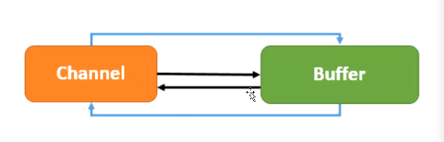
- Buffer中的HeapBuffer和DirectBuffer:
  - 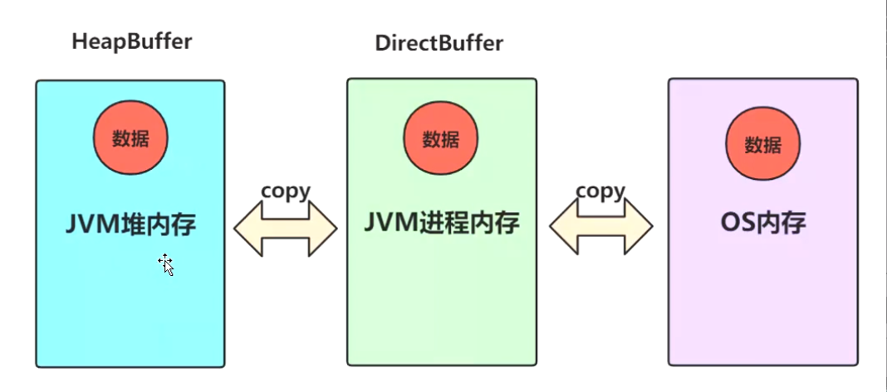
- Buffer中的状态变量：
  - capacity(容量):最大容量
  - position(位置):当前读写的位置
  - limit(上界):缓冲区现存元素的计数
  - Mark(标记):标记postion位置，用于重复读，可以用reset()使mark标记到postion
  - 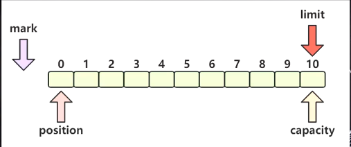
  - 
  - 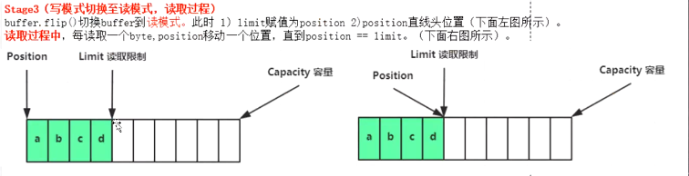
  - 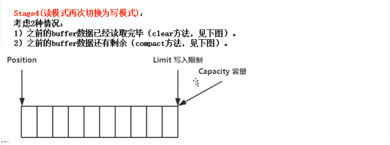
  - 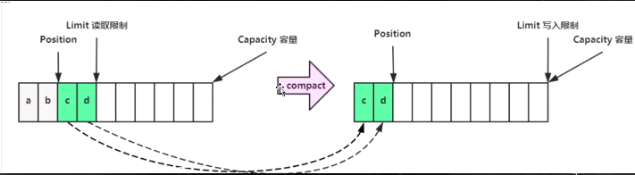
  - 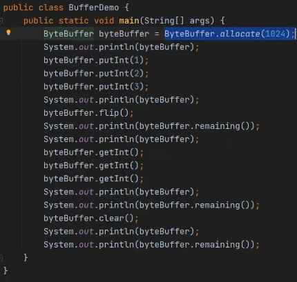

### 3.1 selector

- 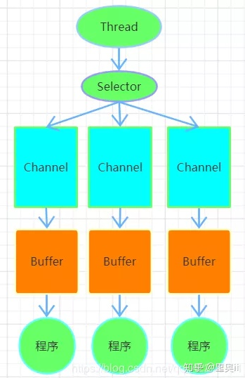


