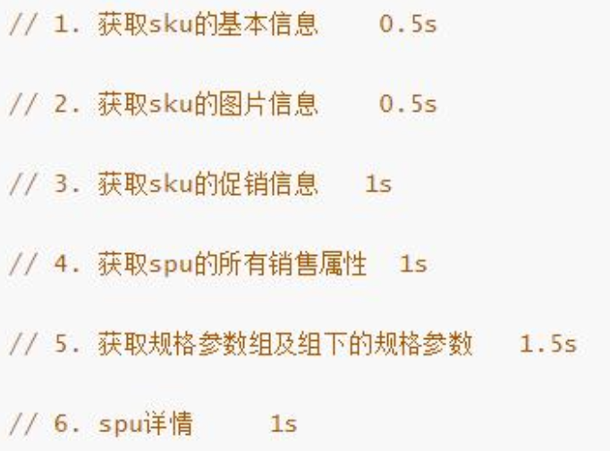
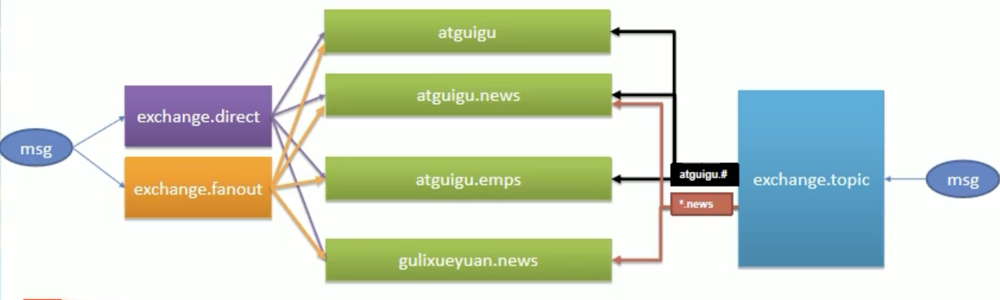
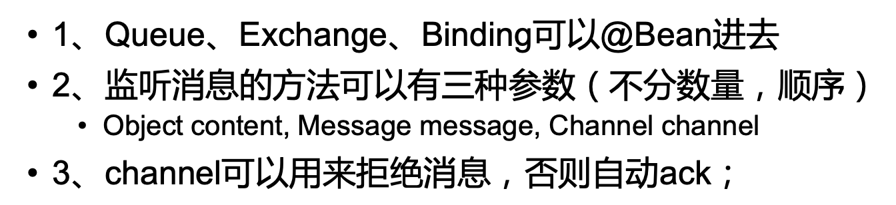
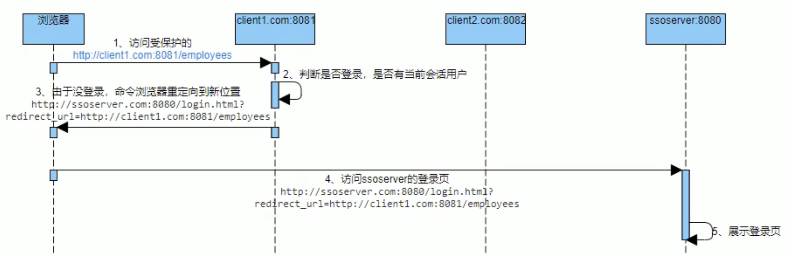

# 整体项目总结思路

- 主要参考自：
  - https://www.bilibili.com/video/BV1np4y1C7Yf?p=101
  - https://www.yuque.com/zhangshuaiyin/guli-mall/wrbzgy
- 整体架构：
  - 
- 微服务划分：
  - 
- 前置知识：
  - 后端：Java、MySQL、SSM、SpringBoot
  - 中间件：Redis
  - 前端：HTML、CSS、Java Script、Vue
  - 服务部署：Docker

# 1. 分布式基础-基本页面、业务开发

- 开发环境配置：
  - docker
  - mysql
  - redis
- 项目创建：
  - 微服务划分
  - 多模块开发
  - 数据库初始化
- 快速开发、逆向工程：
  - 后台管理系统：https://gitee.com/renrenio/renren-fas
  - 后台管理前端：https://gitee.com/renrenio/renren-fast-vue
  - 代码生成器：https://gitee.com/renrenio/renren-generator
- SpringCloud分布式环境配置：
  - 整体分布式：
    - 注册中心：SpringCloud Alibaba Nacos
    - 配置中心：SpringCloud Alibaba Nacos
    - 负载均衡：SpringCloud Ribbon
    - 声明式HTTP客户端：SpringCloud Feign 调用远程服务
    - 服务容错：SpringCloud Alibaba Sentinel 限流、降级、熔断
    - API网关：SpringCloud Gateway webflux 编程模式
    - 调用链路监控：SpringCloud Sleuth
    - 分布式事务：SpringCloud Alibaba Seata 原Fescar
  - Docker安装Nacos
  - Spring Boot中引入
    - SpringCloud Alibaba Feign
    - SpringCloud Alibaba Nacos
    - SpringCloud Gateway
- 正式开发：
  - 人人开源作为后台管理系统的前后端，逆向生成代码
    - MVC
    - POJO、DAO、Service、Controller、Vue
  - 开发遇到的问题？
    - 明确业务流程！思考各种不足，不断测试
    - 确保数据库修改数据的一致性
    - 需要考虑异常、容错机制
    - 前后端数据交互的冗余字段问题？VO？
    - 远程服务调用的数据传输问题？TO？
- SpringCloud Gateway：
  - Vue前端如何发送请求给后端
  - 路由转发如何配置
  - Gateway跨域如何配置
- 跨域？
  - 什么是跨域？
    - 浏览器为了对Java Script施加安全限制，设置了同源策略，使浏览器不能执行其他网站的脚本
  - 什么是同源策略？
    - 协议、域名、端口号都要严格相同
    - 其中有一个不同都会产生跨域
  - 跨域流程？
    - 对于非简单请求(PUT DELETE)等，需要先发送预检请求
    - 
  - 如何解决跨域问题？
    - 法一：使用nginx部署为同一域
      - 
    - 法二：配置单次请求允许跨域
      - 添加响应头
        - Access-Control-Allow-Origin:支持哪些来源的请求跨域
        - Access-Control-Allow-Methods:支持哪些方法跨域
        - Access-Control-Allow-Credentials:跨域请求默认不包含cookie，设置为true可以包含 cookie
        - Access-Control-Expose-Headers:跨域请求暴露的字段
          - CORS请求时，XMLHttpRequest对象的getResponseHeader()方法只能拿到6个基本字段: Cache-Control、Content-Language、Content-Type、Expires、Last-Modified、Pragma。如 果想拿到其他字段，就必须在Access-Control-Expose-Headers里面指定。
        - Access-Control-Max-Age:表明该响应的有效时间为多少秒。在有效时间内，浏览器无 须为同一请求再次发起预检请求。请注意，浏览器自身维护了一个最大有效时间，如果 该首部字段的值超过了最大有效时间，将不会生效。
- 数据校验？
  - 前端输入校验？
  - 后段接收数据校验？JSR303
- 统一返回前端JSON数据？
  - Renren-fast中的R类！全局统一返回
- 统一异常处理？
  - 通常采用ControllerAdvice的方式进行统一处理，简化代码
    - 编写异常处理类，使用@ControllerAdvice。
    - 使用@ExceptionHandler标注方法可以处理的异常。
- 文件如何存储？
  - 普通上传文件在分布式下存在的问题？
  - 文件存储？是自建服务器？云存储？
  - 使用阿里云对象存储！
- 如何使用阿里云对象存储？
  - 服务端签名后直传数据
  - 
- 对象划分？
  - PO：Persistant Object
    - PO 就是对应数据库中某个表中的一条记录，多个记录可以用 PO 的集合。 PO 中应该不包 含任何对数据库的操作。
  - DO：Domain Object
    - 就是从现实世界中抽象出来的有形或无形的业务实体。
  - TO：Transfer Object
    - 不同的应用程序之间传输的对象
  - DTO：Data Transfer Object
    - 这个概念来源于 J2EE 的设计模式，原来的目的是为了 EJB 的分布式应用提供粗粒度的 数据实体，以减少分布式调用的次数，从而提高分布式调用的性能和降低网络负载，但在这 里，泛指用于展示层与服务层之间的数据传输对象。
  - VO： Value Object
    - 通常用于业务层之间的数据传递，和 PO 一样也是仅仅包含数据而已。但应是抽象出 的业务对象 , 可以和表对应 , 也可以不 ,这根据业务的需要 。用 new 关键字创建，由 GC 回收的。
    - 也可以叫View object：视图对象;
      - 接受页面传递来的数据，封装对象
      - 将业务处理完成的对象，封装成页面要用的数据
  - BO：Business Object
    - 从业务模型的角度看 , 见 UML 元件领域模型中的领域对象。封装业务逻辑的 java 对 象 , 通过调用 DAO 方法 , 结合 PO,VO进行业务操作。 business object: 业务对象 主要作 用是把业务逻辑封装为一个对象。这个对象可以包括一个或多个其它的对象。 比如一个简 历，有教育经历、工作经历、社会关系等等。 我们可以把教育经历对应一个 PO ，工作经历对应一个 PO，社会关系对应一个 PO 。 建立一个对应简历的 BO 对象处理简历，每 个 BO 包含这些 PO 。 这样处理业务逻辑时，我们就可以针对 BO 去处理。
  - POJO：Plain Ordinary Java Object
    - 传统意义的 java 对象。就是说在一些 Object/Relation Mapping 工具中，能够做到维护 数据库表记录的 persisent object完全是一个符合 Java Bean 规范的纯 Java 对象，没有增 加别的属性和方法。我的理解就是最基本的 java Bean ，只有属性字段及 setter 和 getter 方法!。
    - POJO 是 DO/DTO/BO/VO 的统称。
  - DAO：Data Access Object
    - 是一个 sun 的一个标准 j2ee 设计模式， 这个模式中有个接口就是 DAO ，它负持久 层的操作。为业务层提供接口。此对象用于访问数据库。通常和 PO 结合使用， DAO 中包含了各种数据库的操作方法。通过它的方法 , 结合 PO 对数据库进行相关的操作。夹在业 务逻辑与数据库资源中间。配合 VO, 提供数据库的 CRUD 操作
- 分布式基础总结：
  - 相关概念？
    - 微服务？
    - 注册中心？配置中心？远程调用？
    - 网关？
  - 基础开发？
    - SpringBoot2.0
    - SpringCloud
    - Mybatis-Plus
    - Vue组件化开发
    - 阿里云对象存储
  - 环境？
    - Linux、Docker、Mysql、Redis
    - 逆向工程？人人开源？
  - 开发规范？
    - 前后端数据校验？
    - 全局异常处理？
    - 全局统一返回？
    - 全局跨域处理？
    - 枚举状态？
    - 业务状态码？
    - VO、TO、PO？
    - 逻辑删除

# 2. 分布式高级-业务开发、性能提升

## 2.1 全文检索-elasticsearch

- Elasticsearch的使用：
  
  - 基本的增删改查
  - 检索进阶、过滤、聚合
  - Mapping、分词
  - 在Spring Boot中的使用

- 检索业务？
  
  - 思考什么数据需要存储在ES中？
  - 如何设计存储结构来保存数据？
    - 时间？
    - 空间？

## 2.2 域名访问-nginx

- nginx反向代理到网关
  
  - 

## 2.3 性能监控、压测、优化

- 性能监控：
  
  - 使用jvisualvm：监控服务的内存泄露、跟踪垃圾回收、运行时内存变化、CPU分析、线程分析等
  
  - 一般可以看的指标：
    
    - GC：GC频率、Full GC频率、平均时长、最大时长、堆的使用率
    - ThreadPool：活动的线程数、处于排队的用户请求个数
    - JDBC等：JDBC的活动连接数
    - SQL
    - 吞吐量
    - 命中率
    - 锁
  
  - JVM调优：主要是确保服务稳定，在复杂的高并发下的服务，必须保证每次GC不会出现性能下降，各种性能指标不会出现波动，GC回收规律并且干净，找到适合的JVM设置。避免Full GC的频率
    
    - 常用工具：
      
      - jstack：查看 jvm 线程运行状态，是否有死锁现象等等信息
      - jinfo ：可以输出并修改运行时的 java 进程的 opts                 
      - jps ： 与 unix 上的 ps 类似，用来显示本地的 java 进程，可以查看本地运行着几个 java 程序，并显示他们的进程号
      - jstat： 一个极强的监视 VM 内存工具。可以用来监视 VM 内存内的各种堆和非堆的大小 及其内存使用量
      - jmap ： 打印出某个 java 进程(使用 pid)内存内的所有'对象'的情况(如:产生那些对象， 及其数量)
    
    - 具体命令建议百度！！！

- 压力测试：
  
  - 压力测试考察当前软硬件环境下系统所能承受的最大负荷并帮助找出系统瓶颈所在。压测都是为了系统在线上的处理能力和稳定性维持在一个标准范围内，做到心中有数。使用压力测试，有希望找到很多种用其他测试方法更难发现的错误。有两种错误类型是: **内存泄漏，并发与同步**。
  - 有效的压力测试系统将应用以下这些关键条件:**重复，并发，量级，随机变化**。
  - 性能指标：
    - 响应时间(Response Time: RT) ：响应时间指用户从客户端发起一个请求开始，到客户端接收到从服务器端返回的响 应结束，整个过程所耗费的时间。
    - HPS(Hits Per Second) :每秒点击次数，单位是次/秒。
    - TPS(Transaction per Second):系统每秒处理交易数，单位是笔/秒。
    - QPS(Query per Second):系统每秒处理查询次数，单位是次/秒。对于互联网业务中，如果某些业务有且仅有一个请求连接，那么 TPS=QPS=HPS，一 般情况下用 TPS 来衡量整个业务流程，用 QPS 来衡量接口查询次数，用 HPS 来表 示对服务器单击请求。
    - 最大响应时间(Max Response Time) 指用户发出请求或者指令到系统做出反应(响应) 的最大时间。
    - 最少响应时间(Mininum ResponseTime)指用户发出请求或者指令到系统做出反应(响 应)的最少时间。
    - 90%响应时间(90% Response Time) 是指所有用户的响应时间进行排序，第 90%的响应时间。
    - 从外部看，性能测试主要关注如下三个指标
      - 吞吐量:每秒钟系统能够处理的请求数、任务数。
      - 响应时间:服务处理一个请求或一个任务的耗时。
      - 错误率:一批请求中结果出错的请求所占比例。
  - 如何进行压力测试？
    - 可以使用jmeter
    - 添加线程组、添加HTTP请求、添加监听器、最后运行查看报告即可
    - 同时进行性能监控
  - 结果分析：
    - 有错误率同开发确认，确定是否允许错误的发生或者错误率允许在多大的范围内;
    - Throughput吞吐量每秒请求的数大于并发数，则可以慢慢的往上面增加;若在压测的机 器性能很好的情况下，出现吞吐量小于并发数，说明并发数不能再增加了，可以慢慢的往下减，找到最佳的并发数;
    - 压测结束，登陆相应的web服务器查看CPU等性能指标，进行数据的分析;
    - 最大的tps，不断的增加并发数，加到tps达到一定值开始出现下降，那么那个值就是最大的 tps。
    - 最大的并发数:最大的并发数和最大的tps是不同的概率，一般不断增加并发数，达到一个值后，服务器出现请求超时，则可认为该值为最大的并发数。
    - 压测过程出现性能瓶颈，若压力机任务管理器查看到的cpu、网络和cpu都正常，未达到 90%以上，则可以说明服务器有问题，压力机没有问题。 
    - 影响性能考虑点包括：数据库、应用程序、中间件(tomact、Nginx)、网络和操作系统等方面
    - 首先考虑自己的应用属于**CPU**密集型还是**IO**密集型

- 在进行压力测试和性能监控的时候，就可以思考如何进行服务性能的提升？
  
  - 中间件的影响？nginx？Gateway？
  - 网页渲染速度？
  - 静态资源？
  - 具体业务？DB？如何优化？

- 动静分离：
  
  - 使用动静分离来对静态资源的获取进行优化
  - 
  - 

## 2.4 优化-缓存、分布式锁

- 缓存：
  
  - 使用缓存来提高系统性能、具体业务的响应速度，DB只负责数据的持久化操作
  - 哪些数据适合放入缓存？
    - 即时性、数据一致性不高的数据
    - 访问量大并且更新频率不高的数据（读多写少）
  - 如何使用缓存？
    - 
  - 注意：凡是放入缓存中的数据都应该指定过期时间，使其可以在系统即使没有主动更新数据也能自动触发数据加载进缓存的流程。避免业务崩溃导致的数据永久不一致问题。

- Spring Boot如何整合Redis？

- 使用缓存在大并发下带来的缓存失效问题？
  
  - 缓存穿透：
    - 大量请求查询一个不存在的数据，由于缓存不命中，将去查询数据库，但是数据库也没有此条记录，这将导致这个不存在的数据每次都要到存储层去查询，失去缓存的意义
    - 如何解决：
      - 缓存空结果、并且设置过期时间
      - 布隆过滤器
  - 缓存击穿：
    - 对于一些设置了过期时间的key，并且是热点数据被大量并发访问。如果这个key在大量请求同时进来前正好失效，那么所有对这个key的数据查询都落到了数据库上，导致持久层需要扛住并发压力
    - 如何解决：
      - 加锁？本地锁？分布式锁？
      - 延长过期时间
  - 缓存雪崩：
    - 热点数据设置了过期时间，并且在同一时刻同时失效，导致请求全部转发到数据库，导致瞬时压力过大雪崩
    - 解决：
      - 设置随机过期时间、数据预热
      - 锁或者队列
      - 设置过期标志，更新缓存
      - 限流降级

- 大并发分布式情况下本地锁的问题？
  
  - 本地锁只能锁住当前线程，不能锁住其他节点提供的服务，最终一样导致多个线程可以到持久层请求数据

- 锁的时序问题？
  
  - 如果确认缓存是否存在、查数据库、结果放入缓存不是原子性操作，一样会导致多个线程可以访问到持久层，进行请求数据！
  - 

- 分布式锁？
  
  - 核心思想：大并发下，都去同一个地方占坑，如果能够占到，就执行逻辑，否则就等待，直到别的线程释放锁，并且自己获取锁
    - 占坑：可以去redis、也可以去数据库，只要是大家都可以访问的地方就可以
    - 等待：可以使用自旋的方式
  - 
  - 
  - 
  - 
  - 

- 分布式锁更加官方全面的实现：Redisson!
  
  - 看文档自己实现
    
    - 有默认阻塞式也有尝试式(tryXxx())
    
    - Java实现的分布式锁工具包：底层都是lua脚本+redis
  
  - 可重入锁
    
    - 不会存在死锁问题，并且还能够自动续期
      
      - 锁自动续期(看门狗机制)：如果业务超长，运行期间会自动给锁续上新的30s,不用担心业务时间长，锁自动过期被删掉
      
      - 加锁的业务只要运行完成，就不会给当前锁续期，即使不手动解锁，锁默认在30s以后自动删除
    
    - 如果自己设置过期时间，则业务执行时间一定要小于过期时间，不然会导致当前线程释放下一个线程的锁的问题！
      
      - 为什么？看redisson的lock源码：
        
        - 1、如果自己设置了过期时间，就直接给redis发送执行脚本，进行占锁，默认超时时间就是我们设置的过期时间
        
        - 2、如果我们没有设置过期时间，就使用方法默认的时间：lockWatchdogTimeout = 30 * 1000 【看门狗默认时间】
          
          - 此时：只要占锁成功，就会启动一个定时任务：每隔10s就会自动进行续期，重新给锁设置过期时间，新的过期时间就是看门狗的默认时间。
          
          - 10s = internaLockLeaseTime=>LockWatchdogTimeout/3
  
  - 公平锁
  
  - 读写锁
    
    - 改数据用写锁，读数据用读锁
    
    - 为了确保一定能够读到最新数据，写锁是排他锁，读锁是共享锁
    
    - 读+读：相当于无锁，并发读，只会在redis中记录好所有当前的读锁。会同时加锁成功
    
    - 写+读：等待写锁释放
    
    - 写+写：阻塞等待
    
    - 读+写：有读锁，写也需要等待
    
    - 只要有写的存在，都必须等待
  
  - 信号量
    
    - 分布式限流
  
  - 闭锁(CountDownLatch)
    
    - 全部线程完成才能够进行下一步操作
    
    - 如：放假，锁门

- Redis分布式锁的粒度：
  
  - 和锁的名字有关，越细越快，指定具体缓存的某个数据

- 缓存数据一致性：最终一致性
  
  - 双写模式：写数据库和写缓存=》会导致脏数据！
    
    - 
    
    - 为什么？
      
      - 因为从写数据库到写缓存中间肯定存在延迟，而在这段延迟时间内就容易产生问题
    
    - 如何解决？
      
      - 加锁
      
      - 不管
  
  - 失效模式：写数据库和删除缓存=》也会导致脏数据
    
    - 
    
    - 为什么？
      
      - 写和读的并发问题
    
    - 如何解决？
      
      - 加锁
  
  - 经常修改的数据应该直接读写数据库！
    
    - 因为使用缓存的话，为了确保数据一致性，仍然需要加锁，影响性能

- 缓存数据一致性：解决方案
  
  - 无论是双写模式还是失效模式，都会导致缓存的不一致问题，怎么办？
    
    - 具体问题具体分析！
    
    - 如果是用户纬度的数据，这种并发机率小，可以不考虑这种问题，缓存数据加上过期时间，每隔一段时间触发读的主动更新即可
    
    - 如果是菜单、商品介绍等基础数据，可以使用canal订阅binlog的方式
    
    - 缓存数据+过期时间一般可以解决大部分业务对于缓存的要求
    
    - 也可以通过加锁保证并发读写
    
    - 
  
  - 总结：
    
    - 放入缓存中的数据本身就不应该是实时性、一致性要求超高的，加上过期时间，保证最终一致性就足够了
    
    - 不应该过度设计、增加系统的复杂性
    
    - 遇到实时性、一致性要求高的数据，就应该查数据库，即使慢点也可以

- Spring Cache：
  
  - 是什么？有什么用？看官网
  
  - 缓存抽象层！使用注解简化开发
  
  - 如何使用？
    
    - 引入依赖、写配置、测试使用
  
  - 可以解决缓存穿透问题：配置中写是否缓存空值
  
  - 缺点？
    
    - 读模式：
      
      - 缓存穿透：查询一个null数据。解决：缓存空数据：cache-null-values=true
      
      - 缓存击穿：大量并发进来同时查询一个正好过期的数据。
        
        - 解决：spring.cache默认不加锁、只有Cacheable(...,sync=true)可以加本地锁，而且只能用于读模式
      
      - 缓存雪崩：大量的key同时过期。解决：加随机时间、过期时间：spring.cache.redis.time-to-live=xxx
    
    - 写模式：缓存数据一致性问题
      
      - 读写锁
      
      - 引入Canal，感知到MySQL的更新去更新缓存
      
      - 读多写多，直接去数据库查询
    
    - 总结：
      
      - 常规数据：读多写少、即时性、一致性要求不高的数据，完全可以使用spring-cache
      
      - 特殊数据：特殊设计

## 2.5 商城业务-检索服务

- 页面准备
  
  - 检索入口链接？检索条件传递？

- 检索条件分析
  
  - 全文检索？排序？过滤？聚合分析？

- 对象准备
  
  - 接收检索条件对象、检索结果对象

- 实现检索方法
  
  - Elasticsearch!=>DSL语句
  
  - 封装

- 整体流程debug、验证结果

## 2.6 商城业务-异步&线程池

- 初始化线程的四种方式？
  
  - 继承Thread、实现Runnable接口、实现Callable接口、线程池

- 为什么要使用线程池？
  
  - 每次new Thread(...).start();耗费资源，尤其在高并发场景下！
  
  - 使用线程池=》可控资源、性能稳定
    
    - 降低资源消耗：
      
      - 通过重复利用已经创建好的线程降低线程的创建和销毁带来的损耗
    
    - 提高响应速度
      
      - 因为线程池中的线程数没有超过线程池的最大上限时，有的线程处于等待分配任务的状态，当任务来时无需创建新的线程就能执行
    
    - 提高线程可管理性
      
      - 线程池会根据当前系统特点对池内的线程进行优化处理，减少创建和销毁线程带来的系统开销。无限的创建和销毁线程不仅消耗系统资源，还降低系统的稳定性，使用线程池进行统一分配
  
  - 如何创建线程池？
    
    - Executors工具类=>三大方法
    
    - ThreadPoolExecutor类=>七大参数、四种拒绝策略
      
      - corePoolSize：核心线程数大小：线程池中一直保持的线程数量，即使线程空闲也会保持下去，除非设置了allowCoreThreadTimeOut
      
      - maximumPoolSize：线程池中允许的最大线程数量
      
      - keepAliveTime：当线程数大于核心线程数时，线程在最大多长时间没有接受到新的任务就会被释放，最终线程池维持在核心线程数大小
      
      - unit：时间单位
      
      - workQueue：阻塞队列，用于存储等待执行的任务，如果当前对线程的需求超过了核心线程的大小，就会放在这里等待空闲线程执行
      
      - threadFactory：创建线程的工厂
      
      - handler：拒绝策略，如果线程池满了，就使用该策略进行处理剩下的业务
  
  - 线程池运行流程：
    
    - 线程池创建，准备好core数量的核心线程，准备接受任务
    
    - 新的任务进来，用 core 准备好的空闲线程执行。
      
      - core满了，就将再进来的任务放入阻塞队列中。空闲的core就会自己去阻塞队列获取任务执行
      
      - 阻塞队列满了，就直接开新线程执行，最大只能开到max指定的数量
      
      - max都执行好了。Max-core数量空闲的线程会在keepAliveTime指定的时间后自动销毁。最终保持到 core 大小
      
      - 如果线程数开到了max的数量，还有新任务进来，就会使用reject指定的拒绝策略进行处理
    
    - 所有的线程创建都是由指定的 factory 创建的。
  
  - 面试题：一个线程池 core 7; max 20 ，queue:50，100 并发进来怎么分配的
    
    - 先有7个可以直接得到执行，接下来50个进入队列排队，再多开13个继续执行。现在70个任务都得到了执行，剩下30个使用拒绝策略处理

- 常见的四种线程池：
  
  - newCachedThreadPool 
    
    - 创建一个可缓存线程池，如果线程池大小超过处理需要，可灵活回收空闲线程，若无可回收，则新建线程
  
  - newFixedThreadPool 
    
    - 创建一个定长线程池，可控制线程最大并发数，超出的线程会在队列中等待。
  
  - newScheduledThreadPool  
    
    - 创建一个定长线程池，支持定时及周期性任务执行。
  
  -  newSingleThreadExecutor  
    
    - 创建一个单线程化的线程池，它只会用唯一的工作线程来执行任务，保证所有任务按照指定顺序(FIFO, LIFO, 优先级)执行。

- CompletableFuture异步编排
  
  - 为什么？
    
    - 多个线程执行的任务存在依赖关系，不能单纯的使用线程池执行
    
    - 具体场景：查询商品详情页的逻辑：
      
      - 
      
      - 如果顺序获取=》5.5s才能完成，太久了！
      
      - 使用多个线程同时完成这六步操作，考虑依赖关系，可能1.5s就可以完成
  
  - 传统多线程处理依赖关系？
    
    - Future是Java 5引入的类，可以描述一个异步计算的结果，可以使用isDone()检查线程执行是否完成，或者使用get()阻塞住调用该线程的程序，直到计算出返回结果，使用cancel()停止任务的执行
    
    - 缺点？
      
      - 对线程执行结果的获取只能通过阻塞、轮询的方式获取
      
      - 阻塞方式：和单线程处理业务逻辑等同
      
      - 轮询方式：耗费CPU资源、也不能及时得到计算结果
    
    - 如何解决？
      
      - 可以使用观察者模式：当计算结果完成后及时通知监听者
  
  - 是什么？
    
    - 在 Java 8 中, 新增加了一个包含 50 个方法左右的类: CompletableFuture，提供了非常强大的 Future 的扩展功能，可以帮助我们简化异步编程的复杂性，提供了函数式编程的能力，可以通过回调的方式处理计算结果，并且提供了转换和组合 CompletableFuture 的方法。
  
  - 怎么用？
    
    - 创建异步对象：四种静态方法
      
      - runXxxx 都是没有返回结果的，supplyXxx 都是可以获取返回结果的
      
      - 可以传入自定义的线程池，否则就用默认的线程池;
    
    - 计算完成时的回调方法：四种方法
      
      - whenComplete 可以处理正常和异常的计算结果exceptionally 处理异常情况。 
      
      - whenComplete 和 whenCompleteAsync 的区别:
        
        - whenComplete:是执行当前任务的线程执行继续执行 whenComplete 的任务
        
        - whenCompleteAsync:是执行把 whenCompleteAsync 这个任务继续提交给线程池来进行执行。
      
      - 方法不以 Async 结尾，意味着 Action 使用相同的线程执行，而 Async 可能会使用其他线程执行(如果是使用相同的线程池，也可能会被同一个线程选中执行)
    
    - handle方法：三种
      
      - 和complete一样，可对结果做最后的处理，可改变返回值
    
    - 线程串行化：九种
      
      - thenApply 方法:当一个线程依赖另一个线程时，获取上一个任务返回的结果，并返回当前任务的返回值。
      
      - thenAccept 方法:消费处理结果。接收任务的处理结果，并消费处理，无返回结果。
      
      - thenRun 方法:只要上面的任务执行完成，就开始执行 thenRun，只是处理完任务后，执行 thenRun 的后续操作
      
      - 带有 Async 默认是异步执行的。同之前。以上都要前置任务成功完成。
  
  - 两任务组合-都完成
    
    - 两个任务必须都完成，触发该任务。
    
    - thenCombine:组合两个 future，获取两个 future 的返回结果，并返回当前任务的返回值
    
    - thenAcceptBoth:组合两个 future，获取两个 future 任务的返回结果，然后处理任务，没有返回值。
    
    - runAfterBoth:组合两个 future，不需要获取 future 的结果，只需两个 future 处理完任务后，处理该任务。
  
  - 两任务组合-一个完成
    
    - 当两个任务中，任意一个 future 任务完成的时候，执行任务。
    
    - applyToEither:两个任务有一个执行完成，获取它的返回值，处理任务并有新的返回值。
    
    - acceptEither:两个任务有一个执行完成，获取它的返回值，处理任务，没有新的返回值。
    
    - runAfterEither:两个任务有一个执行完成，不需要获取 future 的结果，处理任务，也没有返回值。
  
  - 多任务组合：
    
    - allOf:等待所有任务完成 
    
    - anyOf:只要有一个任务完成

## 2.7 商城业务-商品详情

- 环境调通
  
  - 域名访问、页面跳转、动静分离

- 业务逻辑明确
  
  - Controller、Service、DAO
  
  - 页面渲染

- 性能优化
  
  - 异步编排

## 2.8 商城业务-认证服务

- 页面准备
  
  - thymleft、动静分离、controller
  
  - 页面逻辑跳转、

- 主要业务
  
  - 短信验证码：接口防刷、再次校验
  
  - 登录注册：密码加密
  
  - 社交登录：OAuth2.0
  
  - 
  
  - 

- Session共享问题：
  
  - Session不能跨域名共享
  
  - 
  
  - 分布式下Session不同步
  
  - 

- 如何解决？
  
  - Session复制
    
    - 
  
  - 客户端存储
    
    - 
  
  - hash一致性
    
    - 
  
  - 统一存储
    
    - 
  
  - 不同服务，子域session共享
    
    - 

- 具体实现：SpringSession
  
  - 为什么？是什么？怎么用？

- 单点登录：
  
  - 为什么？
    
    - 
  
  - 是什么？
    
    - 一处登录、处处登录
    
    - 一处退出、处处退出
  
  - 怎么实现？
    
    - 先学习：单点登录框架demo：xxl-sso
    
    - 
    
    - 

## 2.9 商城业务-购物车服务

- 环境搭建
  
  - 微服务搭建、页面准备

- 确认业务需求
  
  - 用户购物车=在线购物车
    
    - 登录以后会将离线购物车的数据全部合并过来，并清空离线购物车
  
  - 游客购物车=离线购物车
    
    - 浏览器即使关闭，下次进入，购物车数据仍然存在
  
  - 购物车的增删改查、合并、优惠 、

- 确认业务技术
  
  - 用户购物车数据：
    
    - mysql？读多写多、高并发不可
    
    - redis+持久化策略
  
  - 游客购物车数据：
    
    - 放到客户端：后台不存，无法进行推荐
      
      - localstorage
      
      - cookie
      
      - WebSQL
    
    - 放到redis!
  
  - 确定数据结构 

- 具体业务实现：
  
  - 购物车VO、DAO、Service、Controller
  
  - 判断用户是否登录，以判断为游客购物车还是用户购物车=>之前的认证服务中的session
  
  - 购物车数据唯一标识(京东实现)：无论是用户还是游客，都会在本地存储一个cookie：user-key，有效期为一个月。作为临时用户身份。保存在电脑中，每次浏览器访问都会携带该cookie
  
  - 小结：拦截器实现
    
    - 执行前
    
    - 判断是否登录、不存在user-key还要创建
    
    - 使用UserInfoTo封装用户信息和user-key
    
    - 由于UserInfoTo在后续的业务中经常使用，并且还是在同一线程中使用，为了节省内存资源和加快速度，可以使用ThreadLocal来存储UserInfoTo
    
    - 执行后
    
    - 浏览器添加cookie

- 页面跳转逻辑实现

- 购物车增删改查+页面渲染实现
  
  - 商品添加到购物车
    
    - 考虑需要哪些数据？商品ID、商品数量
    
    - 实现购物车的添加逻辑、Service
    
    - 商品信息保存到redis中：考虑存什么key和value、商品是否本来将存储在redis中？
    
    - 根据商品ID在不同微服务间获取相应的数据
      
      - feign远程调用
      
      - 加速：线程池+异步编排
    
    - 考虑页面重新实现导致购物车商品变多
      
      - 携带数据+重定向
  
  - 获取购物车
    
    - 需要考虑用户购物车和游客购物车的合并！
  
  - 修改购物车项
    
    - js函数+后台controller进行修改redis+重定向
  
  - 删除购物车项
    
    - js函数+后台controller进行修改redis+重定向

## 2.10 RabbitMQ

- 为什么？
  
  - 传统java中的Queue是JVM级别、内存级别，无法跨进程
  
  - 目前分布式下，各个微服务之间也需要交流、取任务=>RibbitMQ

- 有什么用？
  
  - 异步处理
    
    - 
    
    - 
    
    - 
  
  - 应用解耦
    
    - 
    
    - 更好对个个微服务更新升级
  
  - 流量控制
    
    - 

- 是什么？-概述
  
  - 大多数应用中，可以通过消息服务中间件来提高系统的异步通信、扩展解耦能力
  
  - 消息服务中有两个重要概念
    
    - 消息代理
    
    - 目的地
    
    - 当消息发送者发送消息以后，将由消息代理接管，消息代理保证消息传递到指定目的地
  
  - 消息队列主要有两种形式的目的地
    
    - 队列：点对点消息通信
      
      - 消息发送者发送消息，消息代理将其放入一个队列中，消息接收者从队列中获取消息内容
      
      - 消息只有唯一的发送者和接收者
    
    - 主题：发布/订阅消息通信
      
      - 发送者发送消息到主题，多个接收者监听这个主题，在消息到达时同时接收消息
  
  - JMS(Java Message Service):
    
    - 基于JVM消息代理的规范。ActiveMQ、HornetMQ是JMS实现
  
  - AMQP(Advance Message Queuing Protocol)
    
    - 高级消息队列协议，也是一种消息代理的规范，兼容JMS
    
    - RabbitMQ是AMQP的实现
  
  - 
  
  - Spring支持
    
    - spring-jms提供了对JMS的支持
    
    - spring-rabbit提供了对AMQP的支持
    
    - 需要ConnectionFactory的实现来连接消息代理
    
    - 提供JmsTemplate、RabbitTemplate来发送消息
  
  - Spring Boot自动配置
    
    - JmsAutoConfiguration
    
    - RabbitAutoConfiguration
  
  - 市面的MQ产品
    
    - ActiveMQ、RabbitMQ、RocketMQ、Kafka

- RabbitMQ相关概念
  
  - 什么是RabbitMQ？
    
    - 是由erlang开发的AMQP的开源实现
  
  - 核心概念？
    
    - Message：消息，是不具名的(没有名字)，由消息头和消息体组成、消息体是不透明的，消息头是由一系列的可选属性组成，这些属性可以说：路由键(routing-key)、优先权(priority)、是否需要持久性存储(delivery-model)等
    
    - Publisher：消息的生产者，也是一个向交换器发布消息的客户端
    
    - Exchange：交换器，用来接收生产者发送的消息并且将这些消息路由给服务器中的队列，有四种类型:direct、fanout、topic、headers,不同类型的Exchange转发消息的策略有所区别
    
    - Queue：消息队列，用来保存消息直到发送给消费者。是消息的容器，也是消息的终点。一个消息可以投入多个队列，消息一直在队列里面，等待消费者连接到这个队列将其取走
    
    - Binding：绑定，用于消息队列和交换器之间的关联，一个绑定就是基于路由键将交换器和消息队列连接起来的路由规则，所以可以将交换器理解成一个由绑定构成的路由表。交换器和队列的绑定可以是多对多的关系
    
    - Connection：网络连接，如TCP连接
    
    - Channel：信道，多路复用连接中的一条独立的双向数据流通道。信道是建立在真实的TCP连接内的虚拟连接，AMQP命令都是通过信道发送出去，不管是发布消息、订阅队列、接收消息。这些动作都是通过信道完成。因为对于操作系统来说，建立和销毁TCP都是非常昂贵的开销，因此引入信道以复用一条TCP连接
    
    - Consumer：消费者，表示一个从消息队列中取得消息的客户端
    
    - Virtual Host：虚拟主机，表示一批交换器、消息队列和相关对象。虚拟主机是共享相同的身份认证和加密环境的独立服务器域。每个vhost本质上就是一个mini的RabbitMQ服务器，用于自己的消息队列、交换器、绑定和权限机制。vhost是AMQP概念的基础，必须在连接时指定，RabbitMQ默认的vhost是/
    
    - Broker：表示消息队列服务器实体
    
    - 
    
    - 

- RabbitMQ使用？
  
  - docker安装
  
  - 官方文档

- RabbitMQ运行机制
  
  - 

- Exchange类型
  
  - 
  
  - 

- 实践：创建不同的交换机和指定队列的绑定关系
  
  - 
  
  - 创建队列、交换机、绑定关系、发送接收消息

- 实践：RabbitMQ+SpringBoot
  
  - 导入启动器、了解自动配置来什么？
  
  - 配置连接
  
  - Java代码如何创建交换机、队列、绑定关系、发送消息、接收消息？
  
  - 
  
  - 

- 实践：场景：很多消费者监听一个队列，只要接收到消息，队列就删除，并且只能由一个消费者收到此消息
  
  - 订单服务启动多个，同一个消息，只能有一个客户端接收到
  
  - 只有一个消息完全处理完，方法运行结束，才能接收下一个消息

- 消息确认机制-可靠抵达
  
  - 是什么？
    
    - 确保消息不丢失，可靠抵达
    
    - 正确发送、正确接收
  
  - 怎么实现？
    
    - 事务消息，设置Channle是事务模式，只有当消息发送成功，并且MQ消费响应后，才算消息成功=》性能下降250倍
    
    - 确认机制：看官方文档
      
      - 主要考虑publisher、consumer
      
      - 两端处理
  
  - 
  
  - 可靠抵达-confirmCallback
    
    - 
  
  - 可靠抵达-ReturnCallback
    
    - 
  
  - 可靠抵达-Ack消息确认机制
    
    - 

## 2.11 商城业务-订单服务

- 页面准备
  
  - 动静分离、验证页面正确访问

- Session共享
  
  - 因为：订单服务涉及到比较多的页面，需要共享登录状态等信息
  
  - 如何实现？
    
    - 抽取出一个认证中心，session保存在redis的同时，也保存在各个子域下
    
    - SpringSession

- 明确业务流程
  
  - 订单服务涉及信息流、资金流、物流，需要获取多个微服务的数据和信息，同时进行处理后，流向下个环节
  
  - 订单构成：
    
    - 
  
  - 订单状态：
    
    - 待付款=>已付款/待发货=>待收货/已发货=>已完成=>已取消=>售后中
  
  - 订单流程：
    
    - 订单生成=>支付订单=>卖家发货=>确认收货=>交易成功
    
    - 

### 2.11.1 订单结算页-订单数据准备

- 业务逻辑明确，编写代码-数据准备
  
  - 页面跳转、Controller、Service、VO
  
  - 数据准备
    
    - VO：订单需要的数据
      
      - 收货人信息
      
      - 支付方式
      
      - 送货清单=》购物车的选中项
      
      - 优惠
      
      - 防重令牌：防止反复提交
    
    - 远程调用
      
      - 用户服务中获取收货地址信息
      
      - 购物车服务中获取商品信息
        
        - 商品服务中查询最新商品价格
        
        - 库存服务中查询最新商品库存
  
  - Debug验证流程正确性
    
    - 通过购物车服务获取商品信息失败？
      
      - 用户信息保存在浏览器的cookie中，通过浏览器访问购物车服务能够正确获取到用户信息，所以通过openfeign的方式不能正确获取用户信息
      
      - 看源码：
      
      - 
      
      - 
      
      - 通过RequestContextHolder在ThreadLocal获取请求上下文信息
  
  - 优化：获取数据异步编排
    
    - 此时会导致feign无法正确获取老请求的数据，因为线程都不一样了
    
    - 
    
    - 如何解决？
      
      - 在子线程中重新将父线程的RequestContextHolder携带的数据设置进去

- 数据准备完成后-页面渲染出数据
  
  - thymleft的使用

- 细化订单结算页的显示
  
  - 有货无货、
  
  - 收件人信息列表
  
  - 计费：运费、优惠券、应付总额等
  
  - 寄送至？收货人？

### 2.11.2 接口幂等性

- 为什么？
  
  - 防止多次相同操作导致不一样的结果
  
  - 如：支付场景、下单等操作

- 是什么？
  
  - 用户对于同一操作发起的一次请求或者多次请求的结果是一致的

- 防止哪些情况？
  
  - 用户多次点击按钮
  
  - 用户提交后再回退提交
  
  - 微服务相互调用

- 怎么实现？
  
  - token机制
    
    - 核心思想：
      
      - 服务端提供发送token的接口，对于幂等性的业务，在业务执行前，先获取token，服务器同时将token保存到redis中
      
      - 调用业务接口请求时，把token携带过去(一般放在头部)
      
      - 服务端判断token是否在redis中，如果在表示第一次请求，然后删除token，继续执行业务，如果不在，表示重复操作，返回重复标记给客户端
    
    - 缺点？
      
      - 先删除token还是后删除token?
        
        - 先删除可能会导致业务确实没有执行，重试带上之前的token，由于防重设计导致，请求还是不能执行
        
        - 后删除可能导致，业务处理成功，服务闪断，出现超时，没有删除token，第二次继续重试，导致业务执行两遍
        
        - 最好先删除token，如果业务调用失败，可以重新获取token再次请求
      
      - Token获取、比较、删除必须是原子性
        
        - redis.get(token) 、token.equals、redis.del(token)如果这两个操作不是原子，可能导致，高并发下，都 get 到同样的数据，判断都成功，继续业务并发执行
        
        - 可以在redis使用lua脚本完成原子性操作
  
  - 锁机制
    
    - 数据库悲观锁
      
      - 一般和事务一起使用，数据锁定的时间可能会很长，需要根据实际情况选择
      
      - 选择的一定要是主键或者唯一索引，不然会导致锁表的结果，处理起来很麻烦
    
    - 数据库乐观锁
      
      - 通过添加版本号唯一标识的方式，确保只会处理一次
      
      - 一般用于读多写少的问题
    
    - 业务层分布式锁
      
      - 多台服务器在同一时间处理相同的数据，可以使用分布式锁的方式，锁定该数据，处理完成后释放锁。获取到锁的必须先判断这个数据是否被处理过
  
  - 各种唯一约束
    
    - 数据库唯一约束
      
      - 插入数据应该按照唯一索引插入，如订单号，
      
      - 可以在数据库层面防止重复，利用数据库主键唯一的约束，并且要求业务生成的是全局唯一的主键
      
      - 但是在分库分表的情况下，路由规则要保证相同请求下，落到同一个数据库的同一个表中，否则就不起效果了
    
    - redis set防重
      
      - 很多数据需要处理，只能被处理一次，比如我们可以计算数据的 MD5 将其放入 redis 的 set，每次处理数据，先看这个 MD5 是否已经存在，存在就不处理。
  
  - 防重表
    
    - 使用订单号 orderNo 做为去重表的唯一索引，把唯一索引插入去重表，再进行业务操作，且他们在同一个事务中。这个保证了重复请求时，因为去重表有唯一约束，导致请求失败，避免了幂等问题。这里要注意的是，去重表和业务表应该在同一库中，这样就保证了在同一个事务，即使业务操作失败了，也会把去重表的数据回滚。这个很好的保证了数据一致性。
  
  - 全局请求唯一id
    
    - 调用接口时，生成唯一id，redis将数据保存到集合中，存在即处理过

### 2.11.3 订单确认与下订单-订单生成

- 确保订单确认是幂等的！

- 整体流程图：
  
  - 
  - 

- 明确业务逻辑
  
  - 确认提交订单的数据信息=>VO
    
    - 收货地址、支付方式、购物商品(实时在购物车再获取一遍，防止购物车变了订单没有变)、优惠、发票、令牌 、应付价格、用户信息、备注
  
  - 下单：验令牌、创建订单、验价格、保存订单、锁库存
  
  - 下单成功：支付页
  
  - 下单失败：回到订单确认页

- 下单操作逻辑
  
  - VO、Service、Controller
  
  - 验证令牌：获取、对比、删除确保原子性=>lua脚本
  
  - 创建订单：订单VO、填充数据
    
    - 创建订单、设置订单号、订单状态
    
    - 获取提交订单信息：同一线程中的数据传递可以使用ThreadLocal实现。获取收获地址信息、运费信息=>填充进订单
    
    - 获取所有的订单项
      
      - 订单号、商品SPU信息、SKU信息、优惠信息、积分信息
    
    - 计算价格相关
      
      - 应付金额、优惠金额、运费
      
      - 积分信息
    
    - 保存订单数据->事务！
      
      - 保存订单和订单项
      
      - 锁库存，只要有异常就回滚订单数据和库存数据
        
        - 订单号、订单项
        
        - 

- 目前存在的问题？
  
  - 保存订单=>远程锁库存=>远程扣积分
  
  - 
  
  - 本地事务存在的问题：
    
    - 在分布式系统下，只能控制住自己的回滚，控制不了其他服务的回
  
  - 分布式事务存在的问题：
    
    - 网络、分布式机器等原因，导致分布式服务很难回滚

## 2.12 分布式事务

- 本地事务-单体应用
  
  - 事务的基本性质：ACID
  
  - 事务的隔离级别：RU、RC、RR、S
  
  - 事务的传播行为(SpringBoot)
    
    - PROPAGATION_REQUIRED：如果当前没有事务就创建一个新事务，如果当前存在事务，就加入该事物
    
    - PROPAGATION_SUPPORTS：支持当前事务，如果存在当前事务，就加入该食物，如果当前不存在事务，就以非事务执行
    
    - PROPAGATION_MANDATORY：支持当前事务，如果存在当前事务，就加入该事务，如果当前不存在事务，就抛出异常
    
    - PROPAGATION_REQUIRES_NEW：创建新事务，无论当前存不存在事务，都要创建新事物
    
    - PROPAGTAION_NOT_SUPPORTED：以非事务方式操作，如果当前存在失误，就把当前事务挂起
    
    - PROPAGATION_NEVER：以非事务方式执行，如果当前存在事务，则抛出异常
    
    - PROPAGATION_NESTED：如果当前存在事务，则在嵌套事务内执行，如果当前不存在事务，就创建新的事务

- SprintBoot的事务机制
  
  - 同一个对象内事务方法互调默认失效？
    
    - 为什么？因为springBoot的事务是通过代理对象控制的，在同一对象内的方法互调没有使用到代理对象，所以事务会失效
    
    - 怎么解决？使用动态代理！
  
  - 

- 分布式事务
  
  - 为什么？
    
    - 分布式系统中经常出现异常，导致业务无法正确执行下去，需要考虑业务恢复、回滚
    
    - 如：机器宕机、网络异常、消息丢失、消息乱序、数据错误、
  
  - 是什么？
    
    - 在分布式情况下，也能确保事务的某些特性，以推进业务的正确执行
    
    - 分布式事务是企业集成中的一个技术难点，也是每一个分布式系统架构中都会涉及到的一个东西，特别是在微服务架构中，几乎可以说是无法避免。
  
  - 核心原因？
    
    - 节点之间的状态不能同步、数据之间不能相互感知
  
  - 具体实例：目前我们需要实现这个生成订单业务，主要步骤是：保存订单、扣库存、扣减积分等步骤，只有当这三个功能同时调用成功了，这个业务才算完成了。
    
    - 如果在以前的单体应用中，将三个代码都写在一个系统中，并且数据库也是在一个系统中，这样的话用本地事务就可以很方便的实现事务。
    
    - 但是在分布式系统下，业务太大，不可能将所有业务都写进一个项目里面，因此拆分出很多个微服务实现，如订单服务、库存服务、用户服务，每个服务拥有自己的数据库和数据，并且部署在不同机器，要完成整个生成订单业务，就需要采用远程调用的方式来实现
    
    - 因此就很容易带来很多问题：
      
      - 比如当我们保存订单成功、扣件库存成功后，在进行扣减积分的时候，这个用户服务宕机，那么我们就不能感知到这个扣减积分有没有执行成功，是执行成功之前宕机的还是执行成功之后宕机的都不知道。
      
      - 不知道状态就很难进行回滚，就算知道状态，由于网络等很多不可靠因素，也很难将之前远程调用成功的服务进行回滚
    
    - 因此就需要考虑分布式事务！

- CAP定理
  
  - 指在一个分布式系统中，CAP三个性质最多同时实现两点，不可能三者兼顾
  
  - 一致性(Consistency)：在分布式系统中的所有数据备份，在同一时刻是否都是相同的值
  
  - 可用性(Availability)：在集群中一部分节点故障后，集群整体是否还能响应客户端的读写需求
  
  - 分区容错性(Partition tolerance)：大多数分布式系统都分布在多个自网络中，每个子网络就是一个分区。分区容错就是：区间通信可能失败，但是仍然需要能够对外提供服务
  
  - 因为总是需要考虑网络是不可靠的，因此分区容错性是必要的，一般是在一致性和可用性之间做权衡
    
    - 为了保证一致性CP：不能访问未同步完成的节点，也就失去了部分可用性
    
    - 为了保证可用性AP：如果允许所有节点都可以读取数据，就会导致数据可能不一致

- 一致性算法，保证CP！
  
  - Raft：http://thesecretlivesofdata.com/raft/
    
    - 领导选举
      
      - 节点自旋
      
      - 投票选举
      
      - 心跳连接
    
    - 日志复制
      
      - 心跳连接时发送日志
    
    - 分区错误如何处理
  
  - Paxos

- 面临的问题
  
  - 对于多数大型互联网应用场景来说：主机众多、部署分散，而且现在的集群规模越来越大，所以节点故障、网络故障是常态，而且要保证服务可用性达到99.99999%，即保证PA，舍弃C
  
  - 实例：订单服务中的生成订单：主要步骤是下订单、减库存、保存订单、扣减积分
    
    - 如果前面步骤都正确执行了，在去用户账户上进行扣减积分的时候失败了，然后我们可以回滚这个扣减积分的服务，但是因为扣库存是一个远程方法，已经扣了的库存没有办法回滚了，但是无论能不能回滚，我们只要能够发现扣库存无法回滚，那么我们就可以想办法给他人工回滚，加回来，确保最终的一致性

- BASE理论
  
  - 是什么？
    
    - 对CAP理论的延伸，即使无法做到强一致性，也可以适当的采取弱一致性，也即最终一致性
  
  - 具体？BASE？
  
  - 基本可用(Basically Available)
    
    - 是指分布式系统在出现故障的时候，允许损失部分可用性，如：
    
    - 响应时间的损失、功能损失
  
  - 软状态(Soft State)
    
    - **软状态就指的是我们系统存在中间状态**，不像我们的强一致，要么成要么败，我们也可以有一个中间状态。类似正在同步中这样。
    
    - 比如我们保存了一个数据，它要么有，要么没有，但是还有一个正在同步中。我们可以有一个中间状态。
  
  - 最终一致(Eventual Consistency)
    
    - 最终一致指的就是我们这个系统里边的这些数据。经过一段时间后，最终达到业务状态是一致的。

- 如何实现分布式事务？
  
  - 2PC模式
    
    - 2PC 就是我们说的二阶段提交，又叫做 XA Transactions。
    
    - 这个二阶提交协议呢，就是把我们整个分布式事务拆成了两个阶段。
    
    - 
    
    - 每个服务存在一个本地资源管理器，调用微服务的存在一个总的事务管理器，这个事务管理器将我们的事务划分为两个阶段
      
      - 首先是询问每个微服务里面的本地资源管理器，有没有准备好，每个微服务的本地资源管理器就检查当前数据有没有准备好，连接正不正常、能不能提交数据
      
      - 如果每个微服务都准备好了，就差提交了，就通知总事务管理器，总事务管理器收到后就把方法提交给每个微服务执行
      
      - 如果有一个没有准备好，就会要求所有人回滚
    
    - 优点：简单、数据库也支持
    
    - 缺点：不适用于高并发情况下，因为2PC需要占用大量的锁定资源
    
    - 虽然也可以继续扩展为3PC，引入超时机制，但是也很难处理高并发情况下
      
      - 能否提交
      
      - 能否准备好数据
      
      - 提交
  
  - 柔性事务？
    
    - 刚性事务：只要命令过去了，就一起提交过去，都是一致的，遵循ACID原则，强一致性
    
    - 柔性事务就是遵循BASE理论，实现最终一致性即可
  
  - 柔性事务- TCC事务补偿方案
    
    - TCC模式就是开发人员在写每个业务代码的时候，还需要写对应的回调方法，准备让别人回调，以实现数据回滚
    
    - 主要是以下三个阶段
      
      - Try：尝试阶段，预准备一些数据
      
      - Confirm：确认阶段，将准备好的数据提交
      
      - Cancel：取消阶段，回滚提交的数据
    
    - 
    
    - 实例：比如我们的订单服务，和库存服务，都实现了这些接口，订单有自己的Try、Confirm、Cancel逻辑、库存服务也有，
      
      - 那么我们在实现下订单业务的时候，就可以先来执行第一阶段，通知大家准备好数据，调用各种微服务的Try模块，如果大家都执行成功了，就将Try准备好的数据提交，订单服务提交、库存服务提交
      
      - 如果有任何一个服务失败，都可以通过业务管理器来调用各个服务的Cancel模块，来实现回滚
  
  - 柔性事务-最大努力通知方案
    
    - 实例：目前下订单业务需要调用订单服务和库存服务，但是下订单业务之后的逻辑出现问题，失败了，就尽最大努力去通知库存业务、订单服务回滚，不断重试
    
    - 这种方式可以使用消息队列的方式实现，就是说如果下订单业务失败了，就可以向消息队列发送一个信息，订单服务、库存方法都来订阅这个消息，收到这个消息后，就可以根据这个消息进行回滚
    
    - 最大努力通知？
      
      - 主要考虑消息发送出去？对面宕机、收不到？
      
      - 每隔一段时间发送一次，直到接收到消息（可以设置最大通知成熟），并且执行来回滚
    
    - 在后续的订单支付业务的时候，采用的就是这种方案，让支付宝最大努力通知我们自己的微服务，订单到底支付成功没有
  
  - 柔性事务-可靠消息+最终一致性方案（异步确保型）
    
    - 业务处理服务业务事务提交之前，向实时消息服务请求发送消息，实时消息服务只记录消息数据，而不是真正的发送。业务处理服务在业务事务提交之后，向实时消息服务确认发送。只有在得到确认发送指令后，实时消息服务才会真正发送。
    
    - 就是我干完事了，我不用管你的状态，我发一个消息就行了。你在后边，你自己慢慢同步去。所以我们只要希望系统能达到最终的一致就行

- 分布式解决方案总结
  
  - 2PC、3PC模式是交给底层数据库自己实现，使用简单，但是无法应对高并发场景
  
  - TCC模式相当于3PC的手动版，每个微服务自己手动编写TCC模块，让业务管理器来进行执行、回滚
  
  - 最大努力通知方案和可靠消息+最终一致性方案可以处理高并发场景
  
  - 我们自己写业务逻辑，我们可以用这种一失败以后，就立即能帮我们让其它业务都失败的一致性方案。
  
  - 我们也可以利用消息队列完成我们的这些通知型方案，无论是最大努力通知，还是我们失败了，我们就发一个消息，我通知你一下。

## 2.13 Seata

- 是什么？有什么用？怎么用？
  
  - 看官网
  
  - [Seata 是什么](https://seata.io/zh-cn/docs/overview/what-is-seata.html)

- 相关术语
  
  - TC：Transaction Coordinator：事务协调者
    
    - 维护全局和分支事务的状态、驱动全局事务提交或者回滚
    
    - 这个 TC 类似于我们二阶提交协议的那个 Transaction Manager（总事务管理器）
  
  - TM：Transaction Manager：事务管理器
    
    - 定义全局事务的范围：开始全局事务、提交、回滚全局事务
    
    - 相当于我们要做 Business 方法的时候，它要调用三个远程方法。所以 Business 有一个事务管理器，它来负责开启我们的总事务。
  
  - RM:Resource Manager：资源管理器
    
    - 管理分支事务处理的资源，于TC交谈以组册分支事务和报告分支事务的状态，并驱动分支事务提交或回滚
    
    - 相当于我们在 spring 单体模式下使用的`@Transactional`，可以把它称为资源管理器。
  
  - - TC 来负责协调全局。
    - TM 是来控制我们这个大事务。
    - 每一个微服务里边自己的事务是用 RM 这个叫资源管理器来控制的。

- 工作流程：
  
  - 
  
  - 下单业务的TM先通知TC，说它要准备开启一个全局事务
  
  - TC就知道：TM现在可能要跨服务开一个全局事务，要不全部成功，要不全部失败。
  
  - TM通知TC之后，就开始调用第一个微服务的事务方法来，这个时候这个微服务的RM就会在TC注册一下，称为分支，也就是分支事务，RM 会实时向TC汇报它的事务状态，是成功还是失败
  
  - 下单业务接下来继续调用其他微服务，其他微服务一样向TC汇报实时事务状态
  
  - 只要有一个微服务失败了，TC就能够知道，然后命令之前执行成功的事务回滚
  
  - 所以：TM来开启全局事务，TC来协调TM事务中的各个分支事务

- AT 模式：
  
  - 两阶段提交协议的演变：
    
    - 一阶段：业务数据和回滚日志记录在同一个本地事务中提交，释放本地锁和连接资源。
    
    - 二阶段：
      
      - 提交异步化，非常快速地完成。
      - 回滚通过一阶段的回滚日志进行反向补偿。

- 如何使用Seata的AT模式？
  
  - 添加UNDO_LOG表
  
  - 安装Seata
  
  - 导入依赖
  
  - 代理数据源
  
  - 添加配置文件
  
  - 添加注解、启动项目

- 总结：
  
  - 可以使用Seata来控制事务，但是Seata主要是通过锁机制实现，在高并发情况下就变成串行化了，影响系统效率

## 2.14 RabbitMQ延时队列

- 定时任务有什么用？
  
  - 未支付订单在一定时间后，系统自动取消并释放库存
  
  - 

- 如何实现？
  
  - Spring的schedule定时任务轮询数据库
    
    - 缺点：消耗系统内存、增加数据库压力(每个一段时间全盘扫描)、存在较大的时间误差
    
    - 
  
  - rabbitMQ的消息TTL和死信Exchange结合：可以解决时效性问题

- 消息TTL(Time To Live)
  
  - 就是消息的存活时间
  
  - RabbitMQ可以对队列和消息分别设置TTL
    
    - 对队列设置就是队列没有消费者连接的保留时间，也可以对消息设置。超过这个时间，就认为这个消息死了，称为死信，就要丢弃
    
    - 如果队列和消息都设置了，就取小的，所以一个消息如果被路由到了不同的队列中，这个消息死亡的时间有可能死亡时间不一样
    
    - 所以消息的TTL是实现延迟任务的关键，可以设置消息的expiration字段或者x-message-ttl属性设置时间，两者效果一样

- 死信Exchanges(Dead Letter Exchanges,DLX)
  
  - 一个消息在满足如下条件之一就会进入**死信路由**，该路由可以对应多个队列
    
    - 一个消息被Consumer拒收了，并且reject方法的参数里requeue为false
    
    - 消息的TTL到了
    
    - 队列的长度限制满了，排在前面的消息会被丢弃或者进入死信路由
  
  - DLX也是一种普通的exchange，只是在某一个设置DLX队列中有消息过期了，会自动触发消息的转发，发送到DLX中去
  
  - 我们即可以控制消息正在一段时间变成死信，又可以控制变成死信的消息被路由到某个指定的交换机，结合两者，就可以实现一个延时队列

- 如何使用TTL+DLX实现延时队列？
  
  - 
  
  - 
  
  - 总结：
    
    - 队列指定DLX和routing-key，并且设置过期时间
    
    - 队列指定DLX和routing-key，消息设置过气时间
    
    - 这些队列都是没有consumer的！
    
    - 建议给队列设置过期时间，因为RabbitMQ对消息的过期时间是惰性检查机制
      
      - 有1s、2s、5min过期的消息放在队列，服务器检查第一个5min过期的消息，发现5分钟过期，就放回，等5min之后再来转发到DLX，这就意味着其他消息不能正确的过期(本来1s过期，现在也变成5min过期)

- 代码实现：
  
  - 
  
  - 
  
  - SpringBoot使用RabbitMQ实现延时队列
    
    - 

## 2.15 商城业务-订单服务-分布式事务

- 如何解决下订单业务这个高并发里面的事务呢？
  
  - 肯定不使用2PC、TCC-事务补偿方案
  
  - 使用可靠消息+最终一致性的解决方案

- 库存服务如何解锁？回滚？
  
  - 在提交订单业务中，当捕捉到异常时，给库存服务发送一个消息，让库存服务自己将库存解锁，
  
  - 使用消息队列的方式完成自动解锁

- 再次明确锁库存逻辑：
  
  - 
  
  - 调用锁库存服务：
    
    - 先保存库存工作单和库存工作单详情，相当于只要我们想锁库存，就先给数据库里面保存锁库存的详细信息，方便后面的回溯、恢复
    
    - 保存完后就开始正式的锁库存，如果成功就跳出
    
    - 如果失败则需要判断是何种失败？
      
      - 如果是自己锁库存失败了，本身会回滚
      
      - 如果是已经锁库存成功，其他业务失败导致库存需要解锁
    
    - 因此库存解锁就需要考虑到如何获取别的业务执行失败的消息？以及如何根据失败的消息进行解库存？
    
    - 为了处理高并发场景，实现最终一致性就可以，没有必要实现强一致性

- 如何实现库存解锁？
  
  - 每个微服务都有自己的交换器和消息队列
  
  - 
  
  - 在订单创建成功、库存锁定成功，就可以发送一个消息给交换机，这个消息里面包含了订单编号、仓库编号、商品编号、购买数量等信息。
  
  - stock-event-exchange交换机使用Topic模式，绑定了两个队列，一个按照stock.release.#模糊匹配的路由建绑定的stock.release.stock.queue队列和一个stock.delay.queue队列
  
  - 库存锁定成功，发送携带路由键为stock.locket的消息给交换机，交换机将其发送给延时队列，延时队列50分钟后，将该死信发送给stock.release.stock.queue队列。
  
  - 库存服务中的解库存业务监听stock.release.stock.queue队列的消息，进行自动解库存操作

- 业务需求：
  
  - 使用RabbitMQ的延时队列实现：库存的自动解锁
  
  - 何时需要解库存？
    
    - 下订单成功，订单过期没有支付被系统自动取消，或者用户手动取消
    
    - 下订单成功、库存锁定成功，但是接下来的扣减积分等业务调用失败，导致订单回滚、库存解锁

- 具体实现：
  
  - 构建延时队列模型：queue、exchange、binding
  
  - 锁库存？
    
    - 还需要先保存库存工作单、工作单详情
  
  - 解库存？
    
    - 处理stock.release.stock.queue里面的消息
    
    - 根据发送的消息，判断是否需要恢复库存
    
    - 如果此次解锁失败，就需要将消息再次保存回队列，下次继续重试
      
      - 设置RabbitMQ的手动ack机制
    
    - 
  
  - 验证代码正确性

- 如何实现自动取消订单？并且解库存？
  
  - 
  
  - 和锁库存解库存类似，在订单创建成功后，就向订单服务的消息队列中发送一个消息，订单服务的交换机根据路由键将消息发送给延时队列，在一段时间后，将消息发送给order.release.order.queue，订单服务中的取消订单业务监听这个队列里面的消息，并且获取到消息，再到数据库中进行验证，最终实现取消订单业务。
  
  - 问题？
    
    - 虽然订单可以根据消息队列里面的消息进行自动取消，库存业务也会在一定时间后，获取到对应的消息队列中的消息，根据业务逻辑进行解库存(查到这个订单状态是取消的，就继续解库存)
    
    - 订单解释消息因为机器卡顿、消息延迟等问题，导致比库存解锁消息慢，库存解锁就查订单状态，发现是新建状态，就不解锁了，消息消费完了，订单服务才反应过来进行取消订单，导致订单取消，但是库存没解锁的问题。
    
    - 
    
    - 库存解锁比订单取消先完成，导致库存永久被锁住了
  
  - 如何解决？
    
    - 释放订单后，可以向stock.release.stock.queue发送消息，让库存服务再次读取消息，进行解库存
    
    - 需要查询最新状态，防止重复解库存
  
  - 

## 2.16 RabbitMQ可靠消息

- 如何保证消息可靠性？-消息丢失
  
  - 消息发送出去，由于网络问题没有抵达服务器
    
    - 做好容错处理(try catch)，发送消息可能会网络失败，失败后要有重试机制，可以记录到数据库，采用定期扫描重发的方式
    
    - 做好日志记录，每个消息状态是否都被服务器收到都需要记录
    
    - 做好定期重发，如果消息没有发送成功，定期去数据库扫描未成功发送的消息进行重发
  
  - 消息抵达Broker，Broker在将消息写入磁盘时宕机，导致消息丢失
    
    - publisher也必须加入确认回调机制，确认成功的消息，修改数据库消息状态
  
  - 自动ACK状态下，消费者收到消息，但是没有来得及处理消息就宕机
    
    - 开启手动ACK机制，消费成功才移除消息，否则就noAck并且重新入队

- 如何确保消息可靠性？-消息重复
  
  - 消息消费成功，事务已经提交了，ack时，机器宕机了，导致没有ack，broker的消息重新由unack变为了ready，并且发送给其他消费者
  
  - 消息消费失败等....
    
    - 消费者的业务消费接口应该设置为幂等性的
    
    - 可以采用防重表，发送一个消息都有业务的唯一标识，处理过就不用再处理了
    
    - RabbitMQ的每一个消息都有redelivered字段，可以获取是否被重新投递过来的

- 如何确保消息可靠性？-消息积压
  
  - 为什么？
    
    - 消费者宕机积压、消费者消费能力不足积压、发送者发送流量太大
  
  - 怎么解决？
    
    - 上线更多的消费者，进行正常消费
    
    - 上线专门的队列消费服务，将消息先批量抽取出来，记录数据库，离线慢慢处理

## 2.17 支付宝支付

- 支付宝支付：看官网

- 支付宝-沙箱环境

- 对称加密：加密和解密是同一串密钥
  
  - 

- 非对称加密：
  
  - 

- 

## 2.18 内网穿透

- 

- 

- 有什么用？
  
  - 开发测试
  
  - 智慧互联
  
  - 远程控制
  
  - 私有云

## 2.19 商城服务-支付服务

- 导入支付宝的SDK

- 配置对应的内容

- 设置好支付宝需要的数据

- 调用支付，返回数据脚本，渲染页面

- 支付成功，跳到用户的订单列表页

- 用户服务的订单列表页
  
  - 动静分离、页面正确访问
  
  - spring-session、登录拦截器

- 查询所有订单列表即可
  
  - 远程服务：用户服务中获取订单服务中的订单项

- 支付成功后，需要修改订单状态！
  
  - 使用支付宝提供的异步结果通知实现-采用的最大努力通知方案
  - 支付宝异步通知发送的数据？验证防止别人篡改
    - 验签！
    - 保存支付流水，方便以后对账，保存数据：交易号？流水号？订单号？时间？
    - 修改订单状态

- 内网穿透联调
  
  - 

- 

## 2.20 商城服务-秒杀服务

- 主要难点：
  
  - 秒杀具有瞬间高并发的特点，针对这一特点必须要做限流+异步+缓存+独立部署

- 如何限流？
  
  - 前端限流
  
  - nginx限流
  
  - 网关限流
  
  - 分布式信号量
  
  - rabbitmq限流

- 后台上架秒杀商品(优惠服务)
  
  - 场次、关联商品、秒杀价格、秒杀库存、限购

- 秒杀流程
  
  - 

- 定时任务？
  
  - cron表达式
  
  - 整合SpringBoot
  
  - 定时任务不应该阻塞？
    
    - 目前使用@Scheduled会出现当前定时任务会阻塞
  
  - 如何实现不阻塞？
    
    - 让业务以异步+线程池运行
    
    - 支持定时任务线程池，设置spring.task.scheduling（不太好使）
    
    - 让定时任务异步执行
      
      - 

- 秒杀商品上架：定时上架到redis缓存
  
  - 数据库扫描秒杀活动和秒杀活动对应的商品=>需要远程调用优惠服务
  
  - 缓存redis中
    
    - 场次活动消息：活动开始结束时间、相关的商品信息
    
    - 活动关联的商品详细信息商品基础信息、秒杀信息、随机码=>远程调用商品服务
    
    - 为什么要随机码？
      
      - 为了防止有用户在得知秒杀请求时，发送大量请求对商品进行秒杀，我们采取了随机码的方式，即每个要参加秒杀的商品，都有一个随机码，只有通过正常提交请求的流程才可以获取，否则谁都无法得知随机码是多少，**避免了恶意秒杀**
  
  - 设置秒杀商品的分布式信号量：限流
    
    - 库存秒杀不应该是实时去数据库扣库存，因为几百万请求进来的时候，如果都去数据库，那会直接把数据库压垮
    
    - 因此主要考虑如何应对这些高并发的请求？我们知道，当大量请求访问的时候，肯定有些请求是无效的，秒杀不成功的，哪怕放进来一百万个请求，最终也只有一百个请求能够成功的去数据库扣减库存
    
    - 所以可以在redis设置一个信号量(秒杀库存)，专门用来计数，只有请求进来能够获取这个信号量，也就是信号量减1，这个请求才能进行后续的业务，如果不能获取到这个信号量，就阻塞很短时间后将这个请求释放
    
    - 每个请求很快做完，很快释放，才能处理高并发的场景
    
    - 同时只有带了商品随机码的请求才能获取信号量，防止恶意请求

- 幂等性处理
  
  - 已经上架的商品无需上架
  
  - 分布式情况下，多个服务的定时任务也可能存在重复上架问题
  
  - 如何解决？幂等性问题+分布式锁！
  
  - 
  
  - Redisson加分布式锁
  
  - 代码实现幂等性

- 秒杀商品页面展示
  
  - 页面准备
  
  - ajax请求获取秒杀商品信息
    
    - 根据当前时间获取秒杀场次和对应的商品信息
  
  - 根据秒杀商品信息渲染到页面中
  
  - 页面跳转、逻辑、链接

- 秒杀系统设计-需要考虑的问题：8！
  
  - 服务单一职责+独立部署
    
    - 秒杀服务即使自己不能扛住请求压力导致宕机，也不能影响其他服务
    
    - 秒杀服务需要单独部署提取成一个微服务，这样即使自己出现问题，也不会影响别人，并且方便部署
  
  - 秒杀链接加密
    
    - 防止恶意攻击、模拟秒杀请求，防止链接暴露，自己工作人员提前秒杀商品
    
    - 可以对链接进行MD5加密，也可以使用随机码机制，在真正秒杀开始的时候，用户才会得知随机码，其他时间都不会知道
  
  - 库存预热+快速扣减
    
    - 秒杀读多写少，无需每次实时校验库存，可以进行库存预热，放到redis中，用信号量来控制进来的秒杀请求，实现快速扣减
    
    - 如果秒杀走正常的加入购物车流程，然后锁库存，最终去支付，这样流程太慢，在高并发系统下肯定会出现整个级联奔溃的情况
    
    - 应该先做到预热库存，将商品保存到redis中，并且储存对应的信号量，想要秒杀的人进来之后必须要先拿到信号量，才能进行接下来的流程，所以无论有多少个请求进来，即使百万请求，最终也只有400个人能拿到这个信号量的值。
    
    - 但是最大的问题可能是redis扛不住，一台redis单机并发也就2w-3w，如果要想扛住，可以使用redis集群
  
  - 动静分离
    
    - nginx做好动静分离，保证秒杀和商品详情页的动态请求可以打到后端服务集群，可以使用CDN网络分担集群压力
    
    - 可以将静态资源分享到CDN网络，如让阿里云来保存这些静态资源，阿里云会把这些静态资源放到各个服务节点，如果访问这些静态资源阿里云会就近选择一个最快的节点，给我们返回这个静态资源
    
    - 做好动静分离之后，放到后台的请求就很少了，比如首页，60多个请求只有1个是动态请求
  
  - 拦截恶意请求
    
    - 识别非法攻击请求，并且进行拦截，网关层
    
    - 如恶意脚本：可以向服务器每秒发送1000次请求，或者每秒发1000次请求商品数据的请求，但是按照正常用户的流量访问，刷的再快也不可能超过10次，所以这些请求肯定是有脚本在模拟这个访问，应该将其拦截过去
    
    - 如：伪造请求，有很多亲戚需要携带令牌，但是它不带令牌，直接发送请求，也应该拦截下来
    
    - 所以，只要经过网关放给我们后台的整个请求，应该是一个具有正常行为的请求
  
  - 流量错峰
    
    - 使用各种手段，将流量分担到更大宽度的时间点，可以使用验证码、加入购物车等手段
    
    - 假设现在有100w个人来进行秒杀，同时点击了立即抢购，那么瞬间流量就会达到100w，这种时候我们可以采用流量错峰的思想，将流量分散到之后的几秒
    
    - 方案一小米：用户点击立即抢购之后，可以让其输入验证码，进而可以识别这个请求是机器人还是用户，其次输入验证码有快有慢，就相当于把整个流量分散开。最终将这100w的请求分散到各个时间点上
    
    - 方案二京东：使用购物车机制，用户选中这个商品后，加入购物车，再生成订单，锁库存，这些都需要时间，大家操作的快慢不同，这样也可以将流量错开，时期分散到各个时间轴上
  
  - 限流、熔断、降级：尽可能处理有效的请求、尽可能不调用其他业务
    
    - 前端限流+后段限流，限制次数、限制总量，快速失败降级运行，熔断防止雪崩
    
    - 在秒杀系统中，可能也要远程调用其他服务，包括秒杀服务自己进来的流量也很大，所以第一个需要考虑的就是限流，
    
    - 前端限流最典型的就是给按钮设置点击频率，比如点击来一次抢购之后，一秒之后才能点击第二次，或者不能再点了。当然，如果用户知道点了这个按钮发什么请求，用恶意脚本去无限制的访问，前端也限不住。
    
    - 所以前端限流先限制一些请求，请求来到后台时，后台来识别哪些请求是用户正常行为，哪些是恶意行为，然后再给它进行过滤，并且即使是永恒的正常请求，服务器也可以进行限流，比如1秒点击了十几次，只放行一两次
    
    - 假设有100w请求，把不合理的去掉只剩60w，这六十万中有些用户一秒点击了十次，可以只给放过一次，这样十个请求就只放过一个，请求就只剩六万了。通过这样一步步操作，每到达一层，无论是前端还是后端，都给它来做个限流，把不合理的过滤掉，哪怕是合理请求，点击次数太多也可以限制起来，最终后台集群里面收到的流量就会少很多
    
    - 也可以进行限制次数、限制总量。比如我们的秒杀服务现在部署了五个机器，峰值处理能力是十万，我们就可以在网关层做一个总限流，限制给秒杀服务的所有流量不能超过十万，超过十万了，就让用户等上两秒，等上两秒以后，再把请求传到秒杀服务。
    
    - 熔断也十分重要，假设秒杀系统中要调用其他业务，这个业务还要调用其他业务，如果这个业务经常失败，就需要做个断路保护，比如我们知道 B 经常调用失败，那我们下一次就不尝试调 B 了，要不然就会一直在 B 那里阻塞等待。本来我们的请求按照正常调用0.1秒就得到释放了，可以处理下一个请求，但现在一直阻塞了3、5秒后才释放，告诉我们失败，这样就很不合理。
    
    - 加入熔断机制，只要调用链中的任何一个服务出现问题，就可以给它返回快速失败，保证整个调用链快速返回，使其不会影响其他服务
    
    - 降级：如果自己的服务出现问题，比如流量太大，秒杀服务快被压垮了，可以将一部分流量引导到一个降级页面，告知用户当前服务太忙，请稍后访问
  
  - 队列削峰：快速获取、快速创建
    
    - 1w个商品，每个1000件秒杀，所有秒杀成功请求，进入队列，慢慢创建订单，扣件库存
    
    - 比如要秒杀的商品有一百个库存，有一百万个人来抢这一百个库存，我们在 redis 中存储了信号量，所以这一百人去抢信号量，最终这一百万个请求只有一百个人能抢到信号量，信号量的扣减非常快，就是给一个数值减个一，所有用户都在统一的 redis 里边操作，也不可能出现信号量超扣的问题，因为它最多扣到零，这是一个原子操作。
    
    - 接下来把拿到信号量的人，放行给我们的后台，后台可以直接将请求发给一个队列，然后订单服务就来监听这个秒杀队列，订单服务会针对队列里面的数据来创建订单等操作，即使花费5秒，甚至10秒都行，此时我们就可以告诉用户秒杀成功了，五分钟以后看我的订单去支付这个订单即可，所以我们可以引入队列。
    
    - 如果现在是淘宝的双十一，淘宝全网的所有商品，可能有几百万件商品，假设每一个商品都有一百个库存，然后现在用户都来秒杀这些商品，每一个商品放进来一百个请求，一百万个商品就会产生一亿的流量。所以这个时候队列的作用就特别明显，所有请求一进来，只要你能秒杀成功，那我就把这个请求的相关数据放到队列里边，整个后台的订单集群就来监听这个队列，队列里边做好整个集群化，存上几万亿的数据都没任何问题。放进队列里边的那些数据，则交给我们后边的集群慢慢按照自己的能力来进行消费。
    
    - 反正无论怎么消费，一分钟以后肯定能见到结果。所以最终抢到商品的用户可能会出现订单延迟，但是最终都可以支付成功。

- 秒杀登录检查-限流
  
  - 前端判断session.loginUser即可
  
  - 后端拦截器判断请求携带的cookie是否存在sessionId,其包含用户登录的id

- 秒杀流程-方案一：小米京东
  
  - 
  
  - 采用和京东、小米一样的流程，将秒杀当成一个优惠活动，用户秒杀过程还是走正常的下单流程，添加购物车、创建订单、支付等
  
  - 优点：
    
    - 把秒杀当成优惠信息，如果点加入购物车，走这一套流程的话，就直接将流量分散开了
    
    - 并且整个业务统一，数据模型比较好设计，也就比普通商品的数据信息多个秒杀价格、秒杀库存
  
  - 缺点：
    
    - 分散开的流量会级联映射到其他系统里面，本来秒杀请求可能只是秒杀系统抗不住，但是现在大量请求进来，又要在商品详情页展示、然后还要在购物车确认，订单页确认。如果在极限情况下，用户都来访问的话，可能每个页面都扛不住，导致多个微服务宕机

- 秒杀流程-方案二：队列削峰、高响应、高并发
  
  - 
  
  - 用户点击立即抢购后，请求发给秒杀系统，秒杀系统做一系列判断，比如登录、合法性校验、再获取信号量。假设要秒杀的商品库存只有100件，如果抢到了信号量，就是秒杀成功，否则就是秒杀失败
  
  - 在获取到信号量之后，不走以前的下单流程，而是在秒杀服务里面快速生成一个订单号，再把订单号、用户秒杀等信息直接发送给MQ即可，无需访问任何底层数据库。消息发出后，订单服务可以监听这个队列，如何创建这个秒杀订单，并且可以通知前端的用户“秒杀成功，正在为你准备订单”，并且跳转到订单准备页，十秒之后跳转到支付页，支付之前让用户确认收货地址等，用户选择好之后，最终前往支付确认即可
  
  - 优点：
    
    - 从请求一进来，到 Controller，再到 Service，有一堆判断处理，一直到后端给前端用户通知，这期间没有操作过一次数据库，没做过任何一次远程调用，这就是一个非常快的流程，我们只需要校验好所有的合法性就行。因为所有的数据我们都在缓存里边放着。一切正常以后，我们给秒杀订单快速的创建一个单号。然后告诉前端个单号已经准备好了，后台的订单服务，在慢慢的消费。
  
  - 缺点：
    
    - 在极限情况下，订单服务都炸了，用户在秒杀确通知秒杀成功，MQ发出去，一直没有被消费，导致订单的后续信息装备失败，用户支付不成功。所以这一块的容错处理与之前的购物车业务不一样，可能需要加入一些独立的业务处理逻辑

- 秒杀流程：
  
  - 最终选择方案二，如果在单机部署的情况下，单线程20ms就可以处理完秒杀商品到发送消息这一流程。一共花费50ms，相当于每个线程每秒可以容纳20个请求，如果服务器能够接收500并发请求，那么每秒的并发量就可以达到1w了
  
  - 如果换成正常的下单流程，一个线程执行3秒，就算服务能够接收500个并发请求，那么一秒也最多能够处理1/3的请求，相当于每秒的并发量只有200

- 秒杀具体流程：
  
  - 登录判断
  
  - 合法性校验
    
    - 是否存在秒杀商品
    
    - 是否是秒杀时间
    
    - 随机码、商品ID是否正确
    
    - 验证购买商品是否合理
    
    - 是否已经购买过（幂等性处理）
      
      - 防止重复购买
      
      - 使用redis占位，占位成功，从来没有购买过
  
  - 秒杀：获取信号量，和购买数量相同
    
    - 使用tryacquire，设置等待时间，防止一直阻塞
  
  - 快速下单，生成订单号，发送MQ消息
    
    - 流量削峰
    
    - 
    
    - 消息内容：订单号、活动场次、商品id、秒杀价格、购买数量
  
  - 订单服务监听秒杀服务发送的消息
    
    - 创建秒杀单
      
      - 保存订单信息
      
      - 订单项信息
    
    - 不用锁库存，因为秒杀商品已经将库存和信号量绑定了，实现快速扣减

- 秒杀服务-秒杀成功后页面展示
  
  - 根据秒杀订单号创建成功与否，判断跳转到不同的页面

- 

## 2.21 SpringCloud Alibaba-Sentinel

- 之前的秒杀服务只能做到快，但是稳怎么做？能否处理各种异常状况？熔断、限流、降级！

- 什么是熔断？
  
  - 场景：A服务调用B服务，但是由于网络不稳定、B服务卡机，导致功能时间超长。
  
  - 之前：使用Feign远程调用，不断发请求重试，到默认超时时间(1s)后没有返回就会报错。但是事实上不能等待这么久，会造成累计效应，导致请求不断累积，调用链的累积：C等D，B等C...全线卡死、资源不能得到释放，大量请求有在请求，这样循环累积，能力越不行，累积请求越多，累积请求越多，请求的资源就越多，系统奔溃宕机
  
  - 现在：熔断！：直接将B断路来，凡是调用B的直接返回降级数据，不必等待B的超长执行，这样B的故障就不会级联影响A

- 什么是降级？
  
  - 整个网站处于流量高峰期，服务器压力剧增，根据当前业务情况及流量，对一些服务和页面进行有策略的降级（停止服务（如注册服务）），所有的调用直接返回降级数据，以此来缓解服务器的资源压力，保证核心业务的正常执行，同时也保持大部分请求得到正确的响应

- 熔断和降级的异同？
  
  - 同：
  
  - 为了保证集群的大部分可用和可靠，防止奔溃、牺牲小我
  
  - 用户最终体验到的都是某个功能不可用
  
  - 异：
  
  - 熔断是被调用方故障，触发系统的主动规则
  
  - 降级是针对全局考虑，可用人工，停止一些正常服务，释放资源

- 什么是限流？
  
  - 对打入服务的请求流量进行控制，使服务能够承担不超过自己能力的流量压力

- 什么是Sentinel?
  
  - 为了确保服务和服务之间的稳定性！

- 有什么用？
  
  - 以流量为切入点，从流量控制、熔断降级、系统负载保护等多个维度保护服务的稳定性

- 和之前的Hystrix有什么区别？
  
  - 

- 如何使用？
  
  - 看官方API
  
  - 定义资源
  
  - 定义规则
  
  - 验证规则是否生效

- Sentinel整合SpringBoot,看官网
  
  - 
  
  - 
  
  - 

- Sentinel使用
  
  - 流控
  
  - 熔断
  
  - 降级

- Sentinel的网关限流：SpringCloud Gateway
  
  - 看官网

## 2.22 Sleuth+Zipkin

-  为什么？
  
  - 微服务架构是一个分布式架构，按业务划分服务单元，一个分布式系统往往有很多个服务单元。由于服务单元数量众多，业务的复杂性，如果出现了错误和异常，很难去定位。
  
  - 一个请求可能需要调用多个服务，而内部服务的调用复杂性，决定了问题难以定位，所以微服务架构中，必须实现分布链路追踪，去跟进一个请求到底有哪些服务参与，参与的顺序又是怎样的，从而达到每个请求的步骤清晰可见，出了问题，很快定位

- 基本术语：
  
  - span：跨度：基本工作单元，发送一个远程调度服务，就会产生一个Span，Span是一个64位ID唯一标识的，Trace是用另一个64位ID唯一标识的，Span还有其他数据信息，比如摘要、时间戳事件、进度ID等
  
  - Trace：跟踪：一系列Span组成的一个树状结构。请求一个微服务系统的API接口，这个API接口需要调用多个微服务，调用每个微服务都会产生一个新的Span，所有由这个请求产生的Span组成一个Trace
  
  - Annotation：标注：用来及时记录一个事件的，一些核心注解用来定义一个请求的开始和结束
    
    - cs-Client Sent-客户端发送一个请求，这个注解描述了这个Span的开始 
    
    - sr-Server Received-服务端获得请求并准备开始处理它，如果将其sr减去cs时间戳便可得到网络传输的时间。  
    
    - ss - Server Sent (服务端发送响应)–该注解表明请求处理的完成(当请求返回客户端)，如果 ss 的时间戳减去 sr 时间戳，就可以得到服务器请求的时间。  
    
    - cr - Client Received (客户端接收响应)-此时 Span 的结束，如果 cr 的时间戳减去cs 时间戳便可以得到整个请求所消耗的时间。

- 如何使用？
  
  - https://cloud.spring.io/spring-cloud-static/spring-cloud-sleuth/2.1.3.RELEASE/single/spring-cloud-sleuth.html
  
  - 系统模型
  
  - 
  
  - 

- 如何整合到SpringBoot?
  
  - 官方文档

- 使用Zipkin可视化观察
  
  - 官网
  
  - 数据持久化

## 2.23 总结

- 商城具体业务
  - 商品上架(商品服务)
    - Elasticsearch的基本使用：SQL=>Elasticsearch
    - Redis缓存加速：
      - 带来的问题：缓存穿透？缓存击穿？缓存雪崩？缓存数据一致性问题？
      - 如何解决？缓存空值、分布式锁、随机失效时间、限流降级、双写模式、失效模式
  - 商品检索(商品服务)
    - Elasticsearch的高阶使用：设计检索语句、结果封装
  - 商品详情(商品服务)
    - 商品spu(Standard Product Unit)、sku(Stock Keeping Unit)信息获取、展示
    - 提高系统响应速度：缓存、线程池、异步编排
  - 认证服务
    - 社交登录模型
    - Session不能跨域共享、多个系统服务同步问题？
      - Session复制、客户端储存、Hash一致性、统一存储
    - 具体解决：
      - Session共享问题解决：后端使用Redis统一存储Session，=>可以直接使用SpringSession
      - 不同服务，子域Session共享问题解决：浏览器存储Session对应的JSessionID时，指定作用范围是父域名=>可以直接使用SpringSession
      - 
    - 单点登录：统一存储+认证服务的功能
      - 
      - 
      - 
      - 考虑浏览器访问其他服务的请求，已经登陆的服务经过单点登录服务器后，单点登录服务器设置浏览器在单点登录服务域名下留一个记号(cookie:token-uuid)，标记已经有用户通过这个浏览器登陆了这个系统，下次还使用这个浏览器登陆该系统下的其他服务，只要服务转发到这个单点登录服务器，就会携带这个cookie
      - 之后的流程可以参考整体流程！
      - 
  - 购物车(购物车服务)
    - 数据获取、数据存放redis、数据合并唯一标识符
  - 订单(购物车服务)
    - 订单结算页：
      - 数据获取：商品服务获取商品信息，用户服务获取用户信息、地址信息、积分信息，库存服务获取库存信息
      - 遇到的问题：
      - 通过购物车服务调用商品服务失败？Feign远程调用丢失老请求的请求头(cookie)
        - 可以通过RequestContextHolder的ThreadLocal获取
        - 异步编排下如何解决？子线程中加入RequestContextHolder携带的数据
    - 订单确认：
      - 接口幂等性问题：
        - token机制、锁机制、唯一性约束、防重表、全局唯一ID
    - 订单生成：
      - 根据订单结算页获取的数据，进行订单的生成，此时需要考虑商品的最新价格、最新优惠信息
      - 验token，创建订单号、生成订单项、验价格(最新获取商品信息与订单结算页是否一致)、保存订单数据、锁库存、扣减优惠信息
      - 本地事务？分布式事务？CAP理论？BASE理论？
      - 如何解决分布式事务？
        - 两阶段提交：事务管理器+本地资源管理器
        - Seata方案：类似两阶段提交：TC、TM、RM！
        - TCC事务补偿方案：业务+事务协调器(负责提交+回滚)
        - 最大努力通知方案
        - 可靠消息+最终一致性方案
      - RabbitMQ：
        - 有什么用？异步、解耦、流量控制
        - 基本概念：publisher、message、queue、consumer、binding、exchange(direct、fonout、topic、header)、connection、channel、Virutal Host、Broker
        - 可靠消息-可靠抵达
          - p-b：ConfirmCallBack
          - e-q：ReturnCallBack
          - q-c：Ack
        - 延时队列怎么实现？
          - Tiem To Live+Dead Letter Exchanges=>TTL+DLX
          - 为什么不用定时任务？要用延时队列？
        - 库存自动解锁？
          - 消息队列模型？
          - 保存什么数据？库存工作清单、锁库存
          - 发送什么消息？库存工作清单编号、订单号、商品ID、库存量
          - 根据消息判断是否需要解锁库存？
            - 查询是否存在库存工作单？不存在、已经在本地事务回滚，无需解锁库存
            - 存在，查看订单号是否存在？不存在，说明订单号已经自动取消，需要解锁库存
              - 存在订单号，查看订单状态，已取消需要解锁库存、已支付无需解释库存
        - 订单自动解锁？
          - 消息队列模型？
          - 保存什么数据？
          - 发送什么消息？
          - 根据消息判断是否需要解锁库存？
        - 订单释放和库存解锁问题？
          - 库存解锁在订单释放之前，容易导致库存永久锁定
          - 订单释放之后再给库存解锁相关的消息队列发送消息，让库存解锁再次执行即可！
          - 考虑到接口幂等性问题
        - 考虑：消息丢失、消息重复、消息积压
  - 秒杀(秒杀服务)
    - 八个方面考虑：
      - 单一职责、独立部署：
        - 为什么？
        - 怎么做？
          - 独立部署为一个微服务
      - 库存预热、快速扣减：
        - 为什么？
        - 怎么做？
          - 定时任务实现秒杀商品的定时上架
          - 秒杀商品上架到redis中
          - 需要考虑定时任务的阻塞(线程池)？上架商品重复(幂等性+分布式锁)？
          - 使用redis信号量机制实现快速扣减
      - 链接加密
        - 为什么？
        - 怎么做？
          - 上架商品的同时设置每个商品的随机码，只有秒杀开始的时候才能获取随机码，根据随机码获取信号量(秒杀)
      - 动静分离
        - 为什么？
        - 怎么做？
          - nginx
      - 拦截恶意请求
        - 为什么？
        - 怎么做？
          - SpringCloud Gateway
      - 流量错峰
        - 为什么？
        - 怎么做？
          - 秒杀商品看成一种优惠业务，正常的秒杀、购物车结算
          - 添加验证码机制
      - 队列削峰
        - 为什么？
        - 怎么做？
          - RabbitMQ
          - 只要抢到信号量，就执行接下来的业务，生成订单号，发送消息给订单服务进行生成，结算，支付
      - 限流、熔断、降级
        - 前端限流：点击一次之后1秒后才能点击下一次
        - 后端限流：拦截恶意请求、多次点击的请求网关放行一两个、Sentinel
        - 熔断：Sentinel
        - 降级：Sentinel
- 系统开发debug
  - 微服务架构下，调用链复杂、涉及到的微服务众多，如果出现问题，难以定位！
  - 需要实现分布式链路追踪！Sleuth+Zipkin
