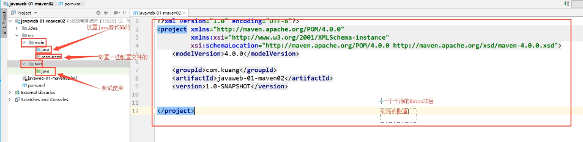
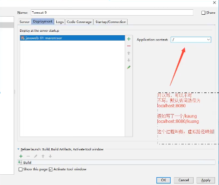
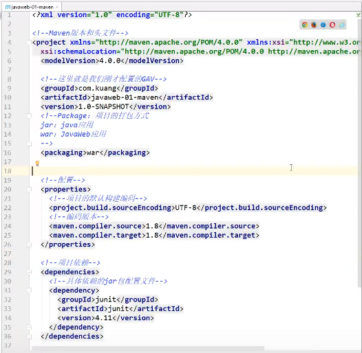
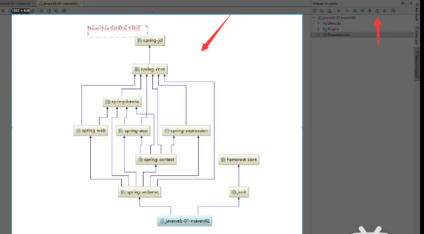
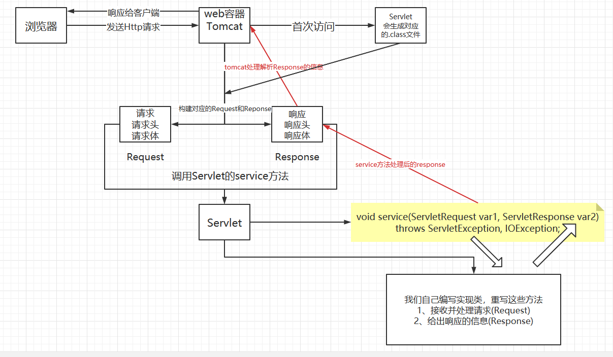
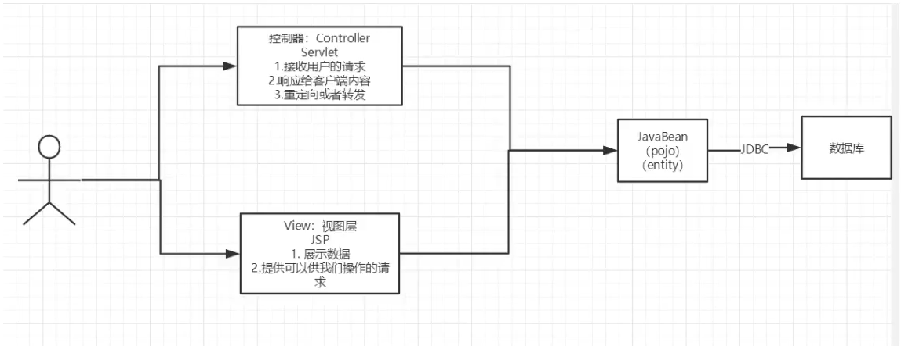
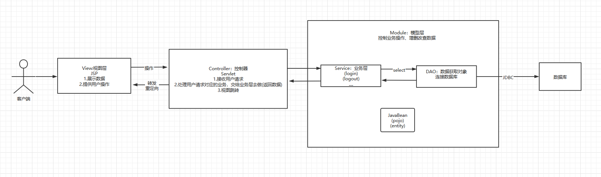

# JavaWeb

## 1. 基本概念

### 1.1 前言

- 静态Web
  - html、css
  - 提供给所有人看的数据始终不会发生变换
- 动态Web
  - 提供个所有人看的数据始终会发生变换，每个人在不同的时间，地点看到的信息各不相同
  - Servlet/JSP、ASP、PHP
- 动态web资源开发的技术统称为JavaWeb

### 1.2 Web应用程序

- 可以提供浏览器访问的程序

  - a.html...多个web资源，可以被外界访问、提供服务

- Web应用的组成

  - html、css、js
  - jsp、servlet
  - java程序
  - jar包
  - 配置文件(Properties)

- web应用程序编写完毕后，要提供给外界访问，就需要一个服务器来统一管理


### 1.3 静态Web

- *.html, *.htm这些都是网页的后缀，如果服务器上存在这些东西，我们可以直接通过请求服务器来获取
- 静态Web的缺点
  - Web页面无法动态更新，所有用户看到的都是同一个页面
    - 轮播图、点击特效：伪动态
    - JavaScript
    - VBScript
  - 无法和数据库交互、数据无法持久化

### 1.4 动态Web

- Web页面展示的效果因人而异
- 缺点
  - 如果服务器的动态Web资源出现了错误，需要重新编写后台程序，重新发布
    - 停机维护
- 优点：解决了静态web的缺点

## 2. Web服务器

### 2.1 相关技术

> ASP
>
> - 微软：国内最早流行的就是ASP
> - 在HTML中嵌入VB的脚本，ASP+COM
> - 在ASP开发中，一个基本的页面都有几千行的业务代码、页面及其混乱，维护成本高
>
> PHP
>
> - 开发速度快、功能很强大、跨平台、代码很简单(70%,WP)
> - 无法承载大访问量的情况(局限性)
>
> JSP/Servlet
>
> - sun公司主推的B/S架构
> - 基于java语言
> - 可以承载三高问题：高可用、高并发、高性能
> - 语法像ASP
>
> ...

### 2.2 相关服务器

> 服务器是一种被动的操作，用来处理用户的一些请求和给用户一些响应信息
>
> IIS
>
> - 微软的，ASP，Windows自带的
>
> Tomcat
>
> - Apache的开源免费项目，技术先进，性能稳定，免费....

## 3. Tomcat

### 3.1 安装

- 官网下载，解压

### 3.2 了解Tomcat目录结构

- 百度去

### 3.3 启动关闭配置

- 百度去
- 可能遇到的问题
  - 1.Java环境变量没有配置
  - 2.闪退问题，需要配置兼容性
  - 3.乱码问题：设置配置文件
- 在解压文件夹下的conf/server.xml可以修改tomcat相关配置
  - 可以配置启动的端口号
    - eg: tomcat：8080，mysql：3306， http：80，https：443
  - 可以配置主机的名称
    - 默认的主机名为：localhost->127.0.1
      - 看下面题目后，所以如果要改localhost为www.king.com还需要在本机的hosts配置文件中添加一个映射：如：127.0.1 www.king.com，
      - 这样不用注册域名也可以访问www.king.com（应该只限制本机，因为在DNS上查不到）
    - 默认网站应用存放的位置为：webapps
  - **面试题：请你谈谈网站如何进行访问的？**
    - 输入一个域名(www.baidu.com)，回车
    - 具体
      - 浏览器会检查本机的C:\Windows\System32\drivers\etc\hosts配置文件下是否存在这个域名的映射
        - 有：直接返回对应的ip地址
        - 没有：去DNS服务器找，找到了就返回对应的web程序，找不到就返回找不到、

### 3.4 发布一个网站

- 不会就模仿！将自己写的网站，放到服务器(Tomcat)中指定的web应用文件夹下面(webapps)就可以访问了
  - localhost:8080/网站的目录名/对应的页面
- 网站应该有的结构

```java
--webapps:Tomcat服务器的web目录
    -ROOT
    -KingTest：网站的目录名(项目名)
    	-WEB-INF
    		- classes：java程序
    		- lib：web应用所依赖的jar包
    		- web.xml：网站的配置文件
    	- index.html：默认的首页
    	- static：一些静态资源
    		-css
    			-style.css
    		-js
    		-img
    	-....
```

## 4. Http

### 4.1 什么是http

- HTTP：超文本传输协议，是一个简单的请求-响应协议，通常运行在TCP之上
  - 文本：html、字符串...
  - 超文本：图片、音乐、视频、定位、地图、...
  - 80
- Https：安全的
  - 443

### 4.2 两个时代

- http1.0
  - HTTP/1.0：客户端可以与web服务器连接后，只能获取一个web资源，然后断开连接
- http2.0
  - HTTP/1.1：客户端可以与web服务器连接后，可以获取多个web资源

### 4.3 Http请求

- 客户端=>发生请求=>服务器
  - 如：www.baidu.com
- 请求行
  - 请求行中的请求方式：GET
  - 请求方式：Get、Post、HEAD、DELETE、PUT...
    - get：请求能够携带的参数比较小，大小有限制，会在浏览器的url地址栏显示数据内容，不安全，但是高效
    - post：请求能够携带的参数和大小无限制，不会在浏览器的url地址栏显示数据内容，安全，但是不高效
```java
// 请求行
Request URL: https://www.baidu.com/ // 请求地址
Request Method: GET					// get方法/post方法
Status Code: 200 OK					// 状态码200 
Remote Address: 183.232.231.174:443 // 远程地址
Referrer Policy: strict-origin-when-cross-origin
```
- 消息头

```java
// 消息头
Accept:  //告诉浏览器，它所支持的数据类型
text/html,application/xhtml+xml,application/xml;q=0.9,image/avif,image/webp,image/apng
Accept-Encoding: gzip, deflate, br  // 支持那种编码格式：GBK、UTF-8
Accept-Language: zh-CN,zh;q=0.9		// 格式浏览器它的语言环境
Cache-Control: max-age=0			// 缓存控制
Connection: keep-alive				// 告诉浏览器请求完成是断开还是保持连接
Cookie: BAIDUID=2A2D8B9703E93FC3AD27914ABB464732:FG=1; BAIDUID_BFESS=2A2D8B9703E93FC3AD27914ABB464732:FG=1; BIDUPSID=2A2D8B9703E93FC3AD27914ABB464732; PSTM=1614610136; __yjs_duid=1_123dadf9844b34934f2b41bc5c997f8e1622169738355; ai_user=mPewvoAM/5IvcOWMy015BE|2021-08-22T08:24:57.407Z; BD_UPN=12314753; BD_HOME=1; H_PS_PSSID=34433_31253_34402_33848_34092_34106_26350_34420_22158_34390; BA_HECTOR=8ka00lak842k00a4r21gi99gt0r
Host: www.baidu.com // 主机
sec-ch-ua: "Chromium";v="92", " Not A;Brand";v="99", "Google Chrome";v="92"
sec-ch-ua-mobile: ?0
Sec-Fetch-Dest: document
Sec-Fetch-Mode: navigate
Sec-Fetch-Site: none
Sec-Fetch-User: ?1
Upgrade-Insecure-Requests: 1
User-Agent: Mozilla/5.0 (Windows NT 10.0; Win64; x64) AppleWebKit/537.36 (KHTML, like Gecko) Chrome/92.0.4515.159 Safari/537.36
```

### 4.4 Http响应

- 服务器=>响应=>客户端

```java
Cache-Control: private		// 缓存控制
Connection: keep-alive		// 连接
Content-Encoding: gzip		// 编码
Content-Type: text/html;charset=utf-8 // 类型
Server: BWS/1.1
Set-Cookie: BDSVRTM=0; path=/
Set-Cookie: BD_HOME=1; path=/
Set-Cookie: H_PS_PSSID=34433_31253_34402_33848_34092_34106_26350_34420_22158_34390; path=/; domain=.baidu.com
Strict-Transport-Security: max-age=172800
Traceid: 1629791787055649767416057547852498392837
Transfer-Encoding: chunked
X-Frame-Options: sameorigin
X-Ua-Compatible: IE=Edge,chrome=1
```

- 响应体：

```java
// 类似消息头
Accept:  //告诉浏览器，它所支持的数据类型
text/html,application/xhtml+xml,application/xml;q=0.9,image/avif,image/webp,image/apng
Accept-Encoding: gzip, deflate, br  // 支持那种编码格式：GBK、UTF-8
Accept-Language: zh-CN,zh;q=0.9		// 格式浏览器它的语言环境
Cache-Control: max-age=0			// 缓存控制
Connection: keep-alive				// 告诉浏览器请求完成是断开还是保持连接
Refresh： // 告诉客户端多久刷新一次
Location： // 让网页重新定位
```

- 响应状态码
  - 200：请求响应成功
  - 3xx：请求重定向
  - 4xx：找不到资源
  - 5xx：
    - 500：服务器代码错误
    - 502：网关错误

## 5. Maven

- 为什么要使用Maven?
  - 在JavaWeb开发中，需要使用大量的jar包，我们需要手动导入，十分麻烦和冗余
  - 因此需要一个工具来帮助我们导入和配置jar包

### 5.1 Maven项目架构管理工具

- 可以方便导入jar包
- Maven核心思想：约定大于配置=有约束，不要去违反
- Maven会规定好你该如何去编写java代码，必须按照这个规范来

### 5.2 下载安装Maven

- 官网下载
- 下载完成后解压即可
- 了解基本目录信息

### 5.3 配置环境变量

- M2_HOME：maven目录下的bin目录=>后面的sprintboot可能要用到
- MAVEN_HOME：maven目录
- 在系统的path中配置：%MAVEN_HOME%\bin
- cmd中通过mvn -version可以检查是否配置成功

### 5.4 修改配置文件

- F:\King_File\Maven\apache-maven-3.5.4-bin\apache-maven-3.5.4\conf\settings.xml
  - 配置镜像：mirrors
    - 加速下载，百度修改即可
    - 国内建议使用阿里云的镜像

### 5.5 本地仓库

- 建立一个本地仓库
- 在seetings.xml中修改localRepository即可，看注释照着写即可

### 5.6 在IDEA中使用Ｍaven

- 在IDEA创建项目时选择Maven，然后不断next,不过创建的时候可以添加项目模板：create from archetype
  - 选择maven-archetype-webapp会自动生成一个简单的javaweb app项目需要的结构和对应的jar包，maven都会自动下载获取
- 在Setting中的Bulid.../Maven中也可以更加详细的改正Maven的相关配置
- 在IDEA创建项目时选择Maven，不使用项目模板生成，能够获取更加完善的项目目录结构！！！
  - 干净的Maven生成的目录结构
  - 
  - Web应用下才有的
  - 

### 5.7 标记文件夹功能

- IDEA可以设置文件夹的颜色以对应相应的功能

- > 看狂神视频也可

### 5.8 在IDEA中配置Tomcat

> - 看狂神视频最好

- 配置Tomcat的注意注意！
- 

- 上面的就是将这个项目映射到tomcat下的webapps中的ROOT文件夹，可以自己打开看看就了解了
- 

### 5.9 pom文件

> - 看狂神视频最好

- pom.xml是Maven的核心配置文件
- 
- Maven由于他的约定大于配置，因此可能会遇到我们写的配置文件无法被导出或者生效
  - 解决方案：
  - 百度一下：Maven资源导出问题？？？可能需要重新配置pom文件
  - 在build中配置resources来防止资源导出失败的问题

### 5.10 IDEA操作

- 可以查看Maven加载的jar包的层次结构
- 

### 5.11 遇到的问题

- Maven 3.6.2 版本问题：
  - 不兼容，降级
- Tomcat闪退
  - java环境要配好，配置好JAVA_HOME
- IDEA中每次都要重复配置Maven
  - 到IDEA的全局配置(Setting)里面设置好Maven的相关配置
- Maven默认web项目中的web.xml版本问题：是web-app_2_3的版本，太老了
  - 建议直接和安装的tomcat的提供的实例一样webapp4.0，所以直接去webapps文件夹下面找几个cv即可

### 5.12 Maven仓库的使用

- 百度一下Maven仓库官网，然后在项目的pom.xml的dependency中cv即可

### 5.13 IDEA怎么把普通项目改为web项目

- 百度：idea怎么把一个项目改成webapp https://blog.csdn.net/qq_44575680/article/details/89449581
- 在对应文件夹创建Webapp文件
- 在project structure中设置Facets添加为Web
- 再修改Moudules中的Web Resource Directiories为自定义的webapp的路径和对应的web.xml
- 最后再Artifacts中添加一个Web Application Exploded 从Modules添加
- 最后在配置tomcat就可以运行了

## 6. Servlet

### 6.1 Servlet简介

- Servlet就是sun公司开发的动态web的一门技术
- Sun公司在这些API中提供一个接口叫做Servlet，如果你想开发一个Servlet程序，只需要完成两个小步骤
  - 编写一个类，实现Servlet接口
  - 把开发好的java类部署到web服务器中
- **把实现了Servlet接口的Java程序就叫做Servlet**

### 6.2 HelloServlet

- 构建一个普通的Maven项目，删掉里面的src目录，以后就可以在这个项目里建立Module，这个空的工程就是Maven主工程

- 关于Maven父子工程的理解

  - 父工程的pom里面会有

  - ```html
        <modules>
            <module>servlet-01</module>
        </modules>
    ```

  - 子工程的pom里面会有

  - ```html
        <parent>
            <artifactId>Demo2</artifactId>
            <groupId>org.example</groupId>
            <version>1.0-SNAPSHOT</version>
        </parent>
    ```

  - 父项目中的java子项目可以直接使用父项目导入的maven的jar包

- Maven环境优化

  - 修改web.xml为最新的
  - 将maven的结构搭建完整

- 编写一个Servlet程序

  - 编写一个普通的类
  - 实现一个Servlet接口，直接继承HttpServlet即可

- 编写Servlet映射

  - 为什么？
    - 因为写的是Java程序，但是要通过浏览器访问，而浏览器需要连接web服务器，所以我们需要在web服务中注册我们写的Servlet，还需要给他一个浏览器能够访问的路径

- 配置Tomcat

  - 配置Deployment之前，可能还需要对项目进行5.13的设置，以便可以在Deployment中添加项目对应的war包

- 启动测试即可

### 6.3 Servlet原理

- Servlet是由Web服务器调用，web服务器在收到浏览器请求后，会
- 

### 6.4 Mapping问题

- 一个Servlet可以指定一个映射路径

```html
<servlet>
    <servlet-name>hello</servlet-name>
    <servlet-class>com.king.servlet.HelloServlet</servlet-class>
  </servlet>
  <servlet-mapping>
    <servlet-name>hello</servlet-name>
    <url-pattern>/hello</url-pattern>
  </servlet-mapping>
```

- 一个servler可以指定多个映射路径

```html
<servlet>
    <servlet-name>hello</servlet-name>
    <servlet-class>com.king.servlet.HelloServlet</servlet-class>
  </servlet>
  <servlet-mapping>
    <servlet-name>hello</servlet-name>
    <url-pattern>/hello</url-pattern>
  </servlet-mapping>
<servlet-mapping>
    <servlet-name>hello</servlet-name>
    <url-pattern>/hello1</url-pattern>
  </servlet-mapping>
<servlet-mapping>
    <servlet-name>hello</servlet-name>
    <url-pattern>/hello2</url-pattern>
  </servlet-mapping>
```

- 一个Servlet可以指定通用映射路径

```html
<servlet>
    <servlet-name>hello</servlet-name>
    <servlet-class>com.king.servlet.HelloServlet</servlet-class>
  </servlet>
  <servlet-mapping>
      // 可以映射到localhost:8080/hello/任意的路径上
    <servlet-name>hello</servlet-name>
    <url-pattern>/hello/*</url-pattern>
      <!--默认的处理请求 /*  =>可以用来处理404错误-->
      // 最好不要直接写为/*,因为优先级较高，会覆盖掉index.jsp
  </servlet-mapping>
```

- 一个Servlet可以自定义后缀请求映射

```html
<servlet>
    <servlet-name>hello</servlet-name>
    <servlet-class>com.king.servlet.HelloServlet</servlet-class>
  </servlet>
  <servlet-mapping>
      // *前面不能加映射路径
      // 只要以king结尾的都可以映射到这个hell的servlet
    <servlet-name>hello</servlet-name>
    <url-pattern>*.king</url-pattern>
  </servlet-mapping>
```

- 优先级问题
  - 指定了固有的映射路径优先级最高，如果找不到就会找默认的处理请求/*

### 6.5 ServletContext

- web容器在启动的时候，会为每个Web程序都创建一个对应的ServletContext对象，它代表了当前的web应用

#### 6.5.1 作用
#### 共享数据
- 在这个Servlet的数据可以放入ServletContext中，因此可以在另一个Servlet中使用和获取
  - 获取初始化参数

  ```java
  		// Servlet中
  		ServletContext servletContext = this.getServletContext();
          String url = (String) servletContext.getInitParameter("url");
          resp.setCharacterEncoding("utf-8");
          resp.setContentType("text/html");
          resp.getWriter().print("url："+url);
  // web.xml中
  <!--  配置一些Web应用的初始化参数-->
    <context-param>
      <param-name>url</param-name>
      <param-value>jdbc:mysql://localhost:3306/mybatis</param-value>
    </context-param>
  ```

#### 请求转发

  ```java
  public class ServletDemo04 extends HttpServlet {
      @Override
      protected void doGet(HttpServletRequest req, HttpServletResponse resp) throws ServletException, IOException {
          System.out.println("进入了ServletDemo4");
          ServletContext servletContext = this.getServletContext();
          // 转发的请求路径
          RequestDispatcher requestDispatcher = servletContext.getRequestDispatcher("/gp");
          // 调用forward实现请求转发
          requestDispatcher.forward(req,resp);
      }
  }
  ```

#### 读取资源文件

  - Properties
      - 在java目录下新建properties
      - 在resources目录下新建properties
- 发现：都被打包到了同一个路径下：classes，我们俗称这个路径为classpath
- 思路：需要一个文件流

```java
    protected void doGet(HttpServletRequest req, HttpServletResponse resp) throws ServletException, IOException {
        System.out.println("PropertiesServlet");
        InputStream resourceAsStream = this.getServletContext().getResourceAsStream("/WEB-INF/classes/db.properties");
        Properties properties = new Properties();
        properties.load(resourceAsStream);
        String username = properties.getProperty("username");
        resp.getWriter().print("username:" + username);
    }
```

### 6.6 HttpServletResponse

- web服务器接收到客户端的http请求，针对这个请求，分别创建一个代表请求的HttpServletRequest对象，和一个代表响应的HttpServletResponse对象
  - 如果要获取客户端请求过来的参数：找HttpServletRequest
  - 如果要给客户端响应一些信息：找HttpServletResponse

#### 6.6.1 简单的分类（看源码）

- 负责向浏览器发送数据的方法
- 负责向浏览器发送响应头的方法
- 响应的状态码

#### 6.6.2 常见应用

- 向浏览器输出消息
- 下载文件
  - 获取下载文件的路径
  - 获取下载的文件名
  - 设置浏览器能够支持下载
  - 获取下载文件的输入流
  - 创建缓冲区
  - 获取OutputStream对象
  - 将FileOutputStream流写入到缓冲区
  - 使用OutputStream将缓冲区的数据输出到客户端

```java
public class FileServlet extends HttpServlet {
    @Override
    protected void doGet(HttpServletRequest req, HttpServletResponse resp) throws ServletException, IOException {
        //- 获取下载文件的路径
//        String realPath = this.getServletContext().getRealPath("F:\\King_File\\Java_Study\\Java_Note\\JavaWeb\\Demo2\\response\\target\\response\\WEB-INF\\classes\\2.jpg");
        String realPath = "F:\\King_File\\Java_Study\\Java_Note\\JavaWeb\\Demo2\\response\\target\\response\\WEB-INF\\classes\\2.jpg";
        System.out.println("下载文件的路径："+realPath);
        //- 获取下载的文件名
        String filename = realPath.substring(realPath.lastIndexOf("\\") + 1);
        //- 设置浏览器能够支持下载
        resp.setHeader("Content-Disposition","attachment;filename="+filename);
        //- 获取下载文件的输入流
        FileInputStream fileInputStream = new FileInputStream(realPath);
        //- 创建缓冲区
        int len = 0;
        byte[] bytes = new byte[1024];
        //- 获取OutputStream对象
        ServletOutputStream outputStream = resp.getOutputStream();
        //- 将FileOutputStream流写入到缓冲区
        //- 使用OutputStream将缓冲区的数据输出到客户端
        while ((len=fileInputStream.read(bytes))>0){
            outputStream.write(bytes,0,len);
        }
        fileInputStream.close();
        outputStream.close();
    }
}
```

- 生成图片

```java
public class ImageServlet extends HttpServlet {
    @Override
    protected void doGet(HttpServletRequest req, HttpServletResponse resp) throws ServletException, IOException {
       // 设置浏览器3秒刷新一次
        resp.setHeader("refresh","3");

        // 在内存中创建一个图片
        BufferedImage bufferedImage = new BufferedImage(80, 80, BufferedImage.TYPE_INT_RGB);
        // 获得图片 这个就是画笔
        Graphics2D graphics = (Graphics2D) bufferedImage.getGraphics();
        // 设置图片的颜色
        graphics.setBackground(Color.BLACK);
        // 给图片写数据
        graphics.setColor(Color.BLUE);
        graphics.setFont(new Font(null,Font.BOLD,20));
        graphics.drawString(makeNum(),20,20);

        // 告诉浏览器，这个请求用图片的方式打开
        resp.setContentType("image/jpeg");
        // 网站存在缓存，设置不让浏览器缓存
        resp.setDateHeader("expires",-1);
        resp.setHeader("Cache-Control","no-cache");
        resp.setHeader("Pragma","no-cache");

        // 把图片写给浏览器
        ImageIO.write(bufferedImage,"jpg",resp.getOutputStream());
    }
    // 生成随机数
    private String makeNum(){
        Random random = new Random();
        String num = random.nextInt(999999)+"";
        System.out.println("Random生成的随机树："+num);
        // 指定位数填充
        StringBuffer stringBuffer = new StringBuffer();
        for (int i = 0; i < 6-num.length(); i++) {
            stringBuffer.append("0");
        }
        num=stringBuffer.toString()+num;
        return num;
    }
}

```

#### 6.6.3 实现重定向

- 概念：一个web资源收到客户端的请求后，通知客户端去访问另一个web资源，这个过程叫做重定向
- 常见场景：
  - 用户登录
- 实例

```java
public class RedirectServlet extends HttpServlet {
    @Override
    protected void doGet(HttpServletRequest req, HttpServletResponse resp) throws ServletException, IOException {
        /*
        重定向的本质操作（可以在浏览器端看响应头可以看出）
        resp.setHeader("Location","/response/image");
        resp.setStatus(302);//设置重定向的状态码
         */
        resp.sendRedirect("/response/image");//重定向
    }
}
```

### 6.7 HttpServletRequest

- HttpServletRequest代表客户端的请求，用户通过Http协议访问服务器，Http请求中的所有信息都会被封装到HttpServletRequest中，通过这个HttpServletRequest的方法，可以获得客户端的所有信息
- 看源码即可

#### 6.7.1 获取前端传递的参数，并且请求转发

```java
public class LoginServlet extends HttpServlet {

    @Override
    protected void doGet(HttpServletRequest req, HttpServletResponse resp) throws ServletException, IOException {
        // 设置后台接收中文乱码问题
        req.setCharacterEncoding("utf-8");
        String username = req.getParameter("username");
        String password = req.getParameter("password");
        String[] hobbys = req.getParameterValues("hobbys");
        System.out.println("==========");
        System.out.println(username);
        System.out.println(password);
        System.out.println(Arrays.toString(hobbys));
        // 重定向
//        resp.sendRedirect("/request/success.jsp");
        // 请求转发
        System.out.println("req.getContextPath():"+req.getContextPath());
        // 这里的/代表当前的Web应用
        req.getRequestDispatcher("/success.jsp").forward(req,resp);
    }
    @Override
    protected void doPost(HttpServletRequest req, HttpServletResponse resp) throws ServletException, IOException {
        doGet(req, resp);
    }
}

```

- 面试题：重定向和转发的区别？
  - 相同点：页面都会跳转
  - 不同点：
    - 请求转发的时候url不会发送变化，状态码是307=>因为是客户端在本次的请求中进入服务器后要求改变请求路径
    - 重定向的时候url会发生变化，状态码是302=>因为客户端在本次请求后进入服务器，服务器响应一个新的请求路径，客户端再重新发送了请求

## 7. Cookie、Session

### 7.1 会话

- **会话**：用户打开一个浏览器，点击了很多超链接，访问了多个web资源，关闭浏览器，这个过程可以称之为会话
- **有状态会话**：eg：一个同学来过教室，下次再来教室，我们会知道这个同学曾经来过，称之为有状态会话
  - 一个网站如何证明你来过？
    - 服务端给客户端一个信件，客户端下次访问服务端带上信件就可以了===cookie
    - 服务器登记你来过了，下次来直接匹配===session

### 7.2 保存会话的两种技术

- cookie
  - 客户端技术（响应，请求）
- session
  - 服务器技术，利用这个技术，可以保存用户的会话信息？我们可以把信息或数据放在session中
- 常见场景：
  - 网站登录后，下次就不用登录可以直接访问了

### 7.3 Cookie

- 从请求中拿到cookie信息
- 服务器响应给客户端cookie
- cookie以键值对的方式进行传输和获取

```java
// 保存用户上次访问的时间
public class CookieDemo1 extends HttpServlet {
    @Override
    protected void doGet(HttpServletRequest req, HttpServletResponse resp) throws ServletException, IOException {
        // 解决中文乱码
        req.setCharacterEncoding("utf-8");
        resp.setCharacterEncoding("utf-8");
        resp.setContentType("text/html");
        PrintWriter out= resp.getWriter();

        // Cookie，服务器要从客户端获取
        Cookie[] cookies = req.getCookies();// 说明Cookie可能存在多个

        // 判断Cookie是否存在
        if(cookies!=null){
            // 存在，获取cookie中的信息
            out.write("你上一次访问的时间是：");
            for (int i = 0; i < cookies.length; i++) {
                Cookie cookie = cookies[i];
                // 获取想要的cookie
                if(cookie.getName().equals("lastLoginTime")){
                    long l = Long.parseLong(cookie.getValue());
                    Date date = new Date(l);
                    out.write(date.toLocaleString());
                }
            }
        }else{
            out.write("这是你第一次访问本站");
        }
        // 服务器给客户端响应一个cookie
        Cookie cookie = new Cookie("lastLoginTime", System.currentTimeMillis()+"");
        // 设置cookie的保存的时间
        cookie.setMaxAge(24*60*60);
        resp.addCookie(cookie);
    }

    @Override
    protected void doPost(HttpServletRequest req, HttpServletResponse resp) throws ServletException, IOException {
        doGet(req, resp);
    }
}

```

- cookie：一般会保存在本地的 用户目录下的appdata中...
- 问题？？？
  - 一个网站cookie是否存在上限？
    - 一个cookie只保存一个信息
    - 一个web服务可以给浏览器发送多个cookie,
    - web服务器最多存放20个cookie
    - 浏览器最多存放300个
    - cookie的大小有限制：4kb
  - 怎么删除cookie?
    - 不设置有效期，关闭浏览器就会自动失效
    - 设置有效期为0，也能删除cookie
- 代码实例

```java
// 删除cookie
public class CookieDemo2 extends HttpServlet {
    @Override
    protected void doGet(HttpServletRequest req, HttpServletResponse resp) throws ServletException, IOException {

        // 服务器给客户端响应一个cookie
        Cookie cookie = new Cookie("lastLoginTime", System.currentTimeMillis()+"");
        // 设置cookie的保存的时间 马上过期
        cookie.setMaxAge(0);
        resp.addCookie(cookie);
    }

    @Override
    protected void doPost(HttpServletRequest req, HttpServletResponse resp) throws ServletException, IOException {
        doGet(req, resp);
    }
}
```

- cookie的编码问题，如果要保存和传输中文的话，最好进行编码和解码操作

```java
// 中文数据传递
public class CookieDemo3 extends HttpServlet {
    @Override
    protected void doGet(HttpServletRequest req, HttpServletResponse resp) throws ServletException, IOException {
        // 解决中文乱码
        req.setCharacterEncoding("utf-8");
        resp.setCharacterEncoding("utf-8");
        resp.setContentType("text/html");
        PrintWriter out= resp.getWriter();
        Cookie[] cookies = req.getCookies();
        if(cookies!=null){
            for (int i = 0; i < cookies.length; i++) {
                Cookie cookie = cookies[i];
                if(cookie.getName().equals("testChinese")){
                    // 解码
                    String value = URLDecoder.decode(cookie.getValue(),"utf-8");
                    System.out.println(value);
                    out.write(value);
                }
            }
        }
        // 服务器给客户端响应一个cookie
        // 编码
        Cookie cookie = new Cookie("testChinese", URLEncoder.encode("哈哈","utf-8"));
        cookie.setMaxAge(60*24);
        resp.addCookie(cookie);
    }

    @Override
    protected void doPost(HttpServletRequest req, HttpServletResponse resp) throws ServletException, IOException {
        doGet(req, resp);
    }
}

```

### 7.4 Session

- 什么是Session?
  - 服务器会给每个用户(浏览器)创建一个Session对象
  - 一个Session独占一个浏览器，只要浏览器没有关闭，这个Session就存在
  - 用户登录之后，整个网站它都可以访问
    - 常用场景：保存用户的信息、保存购物车的信息
- Session和cookie的区别
  - Cookie是把用户的数据写给用户的浏览器，浏览器保存(可以保存多个)
  - Session是把用户的数据写到用户独占的Session中，服务器端保存(保存重要的信息，减少服务器资源的浪费)
  - Session对象由服务器创建
- 使用场景
  - 保存一个登录用户的信息
  - 购物车信息
  - 在整个网站中经常会使用的数据，可以将器保存在Session中

- 使用Session
  - 常用的Session方法
- 代码实例

```java
public class SessionDemo01 extends HttpServlet {
    @Override
    protected void doGet(HttpServletRequest req, HttpServletResponse resp) throws ServletException, IOException {
        // 解决乱码问题
        req.setCharacterEncoding("utf-8");
        resp.setCharacterEncoding("utf-8");
        resp.setContentType("text/html;charset=utf-8");
        // 得到Session
        HttpSession session = req.getSession();
        //给Session保存东西
        session.setAttribute("name","哈哈");
        Person person = new Person("会话", 18);
        session.setAttribute("person",person);

        // 获取Session的ID
        String id = session.getId();

        // 判断Session是不是新创建的
        if(session.isNew()){
            resp.getWriter().write("session创建成功，ID为："+id);
        }else{
            resp.getWriter().write("session已经在服务器中存在了，ID："+id);
        }

        // Session创建的时候做了什么？
//        Cookie cookie = new Cookie("JSESSIONID", id);
//        resp.addCookie(cookie);
    }

    @Override
    protected void doPost(HttpServletRequest req, HttpServletResponse resp) throws ServletException, IOException {
        doGet(req, resp);
    }
}
```

```java
public class SessionDemo02 extends HttpServlet {
    @Override
    protected void doGet(HttpServletRequest req, HttpServletResponse resp) throws ServletException, IOException {
        // 解决乱码问题
        req.setCharacterEncoding("utf-8");
        resp.setCharacterEncoding("utf-8");
        resp.setContentType("text/html;charset=utf-8");
        // 得到Session
        HttpSession session = req.getSession();

//        Object name = session.getAttribute("name");
        Object person = session.getAttribute("person");
        System.out.println(person);
//        System.out.println(name);
    }

    @Override
    protected void doPost(HttpServletRequest req, HttpServletResponse resp) throws ServletException, IOException {
        doGet(req, resp);
    }
}

```

```java
public class SessionDemo03 extends HttpServlet {
    @Override
    protected void doGet(HttpServletRequest req, HttpServletResponse resp) throws ServletException, IOException {
        // 注销Session
        HttpSession session = req.getSession();
        session.removeAttribute("name");
        // 手动注销session
        session.invalidate();
    }

    @Override
    protected void doPost(HttpServletRequest req, HttpServletResponse resp) throws ServletException, IOException {
        doGet(req, resp);
    }
}

```

- Sesssion注销：
  - 可以手动注销，也可以在web.xml中配置自动注销

```xml
<!--  设置Session默认的失效时间-->
  <session-config>
<!--    以分钟为单位-->
    <session-timeout>1</session-timeout>
  </session-config>
```

## 8.JSP

### 8.1 什么是JSP？

- Java Server Pages：Java服务器端页面，和Servlet一样，用于动态Web技术
- 最大的特点：
  - 写JSP就像在写HTML
  - 区别
    - HTML只能给用户提供静态的数据
    - JSP页面可以嵌入JAVA代码，为用户提供动态数据

### 8.2　JSP原理（b站看狂神的视频比较好）

- 思路：JSP到底是怎么执行的？

  - 代码层面没有任何问题

  - 服务器内部工作

    - tomcat中有一个work目录

    - IDEA中使用tomcat的会在IDEA的tomcat中生产一个work目录

    - 可以看出，**浏览器向服务器发送请求，不管访问什么资源，其实都是在访问Servlet!**

    - JSP最终也会被转换成为一个Java类

    - JSP本质上就是一个Servlet(JSP对应的源码)

      - 里面自动内置封装了一些对象

      - ```java
        final javax.servlet.jsp.PageContext pageContext; // 页面上下文
        javax.servlet.http.HttpSession session = null;  // session
        final javax.servlet.ServletContext application; // application == ServletContext
        final javax.servlet.ServletConfig config;	// config
        javax.servlet.jsp.JspWriter out = null;
        final java.lang.Object page = this;
        HttpServletRequset request;
        HttpServletResponse response;
        ```

      - 所以

      - 只要是JAVA代码就会原封不动的编译，输出

      - 是HTML代码就会通过out.write(”<html>\r\n“)转换输出到前端

### 8.3 JSP 基础语法

- JSP作为Java技术的一种应用，拥有一些自己扩充的语法，了解即可，Java所有语法都支持

> - JSP表达式
>
> ```jsp
> <%--jsp表达式
> 作用：用来将程序的输出，输出到客户端
> <%=变量或者表达式%>
> --%>
> <%= new java.util.Date()%>
> ```
>
> - JSP脚本片段
>
> ```jsp
> <%
>     int sum = 0;
>     for (int i = 0; i <100 ; i++) {
>         sum+=i;
>     }
>     out.print("<h1>Sum="+sum+"</h1>");
> %>
> 
> <%
>     for (int i = 0; i < 3; i++) {
> %>
> <h1>Hello world <%=i%>></h1>
> <%
>     }
> %>
> ```
>
> - JSP声明
>
> ```jsp
> <%!
>     static {
>         System.out.println("Loding Servlet!");
>     }
>     private int globalVar = 0;
>     public void king(){
>         System.out.println("进入了方法King()...");
>     }
> %>
> ```

- JSP声明：会被编译到JSP生成的java的类中！其他的会被生成到_jspService方法中！
- JSP的注释不会再客户端显示，HTML的注释可以在客户端显示

> - JSP指令
>
> ```jsp
> <%--定制错误页面--%>
> <%@page errorPage="/error/500.jsp" %>
> <%@include file=""%>
> ```
>
> ```jsp
> <%--会将页面合二为一--%>
> <%--因此可能会产生变量冲突等问题--%>
> <%@include file="common/header.jsp"%>
> <h1>测试JSP指令</h1>
> <%@include file="common/footer.jsp"%>
> <hr>
> 
> <%--拼接页面，本质还是三个--%>
> <%--JSP标签--%>
> <jsp:include page="/common/header.jsp"></jsp:include>
> ```

### 8.4 九大内置对象

- PageContext==>存东西
- Request==>存东西
- Response
- Session==>存东西
- Application == ServletContext==>存东西
- config == ServletConfig
- out
- page 几乎不用
- exception

```jsp
<%--内置对象--%>
<%
    // 保存的数据只在一个页面中有效
    pageContext.setAttribute("name1","1");
    // 保存的数据只在一次请求有效；请求转发也会携带这个数据
    request.setAttribute("name1","2");
    // 保存的数据只在一次会话中有效，从打开浏览器到关闭浏览器
    session.setAttribute("name1","3");
    // 保存的数据只在服务器中有效，从打开服务器到关闭服务器
    application.setAttribute("name1","4");
%>

<%--从pageContext取出，我们通过寻找的方式取--%>
<%
    Object name1 = pageContext.findAttribute("name1");
    Object name11 = request.getAttribute("name1");
    Object name2 = pageContext.findAttribute("name2");
    Object name3 = pageContext.findAttribute("name3");
    Object name4 = pageContext.findAttribute("name4");
    Object name5 = pageContext.findAttribute("name5");
%>

<%--使用EL表达式输出
${} == <%=%>
--%>
${name1}
${name2}
${name3}
${name4}
${name5}
${name11}
<%=name5%>
```

- 使用场景
  - request：客户端向服务器发送请求，产生的数据，用户看完就没有用了，比如：新闻
  - session：客户端向服务器发送请求，产生的数据，用户用完一会还有用，比如：购物车
  - application：客户端向服务器发送请求，产生的数据，用户用完后，另一个用户还可能使用，比如：聊天数据

### 8.5 JSP标签、JSTL标签、EL表达式

- EL表达式：${}
  - 获取数据
  - 执行运算
  - 获取Web开发的常用对象
  - 调用java方法(不常用)
- 导入对应的包

```xml

        <dependency>
            <groupId>javax.servlet.jsp.jstl</groupId>
            <artifactId>javax.servlet.jsp.jstl-api</artifactId>
            <version>1.2.1</version>
        </dependency>

        <dependency>
            <groupId>taglibs</groupId>
            <artifactId>standard</artifactId>
            <version>1.1.2</version>
        </dependency>

```

- JSP标签

```jsp
<jsp:include page="common/header.jsp"></jsp:include>

<%--还可以携带参数
类似于：http://localhost:8080/jsptag.jsp?name=haha&age=12
--%>
<jsp:forward page="jsptag2.jsp">
    <jsp:param name="name" value="haha"/>
    <jsp:param name="age" value="12"/>

</jsp:forward>
```

- JSTL标签
  - JSTL标签库的使用就是为了弥补HTML标签的不足，它自定义了许多标签供我们使用，标签的功能和java代码一样
  - 核心标签
  - 格式化标签
  - SQL标签
  - XML标签

```jsp
<%@ page contentType="text/html;charset=UTF-8" language="java" %>
<%--引入JSTL核心标签库，我们才能使用JSTL标签 c--》core--%>
<%@ taglib prefix="c" uri="http://java.sun.com/jsp/jstl/core" %>
<html>
<head>
    <title>Title</title>
</head>
<body>

<h1>if测试</h1>
<form action="jstl.jsp" method="get">
<%--    EL 表达式获取表单中的数据
        ${param.参数名}
--%>
    <input type="text" name="username" value="${param.username}">
    <input type="submit" value="登录">
</form>

<%--判断如果提交的用户名是管理员，则登录成功--%>
<%--传统jsp写法--%>
<%
if(request.getParameter("username").equals("admin")){
    out.print("是管理远来了");
}
%>

<%--使用jstl标签--%>
<c:if test="${param.username=='admin'}" var="isAdmin" >
    <c:out value="是管理员来了"></c:out>
</c:if>
</body>
</html>
```

```jsp
<%--定义一个变量score,值为85--%>
<c:set var="score" value="85"></c:set>

<c:choose>
    <c:when test="${score>=90}">
        你的成绩为优秀
    </c:when>
    <c:when test="${score>=80}">
        你的成绩为一般
    </c:when>
</c:choose>
```

```jsp
<%
    List<String> people = new ArrayList<>();
    people.add("xx");
    people.add("zz");
    people.add("ll");
    request.setAttribute("list",people);
%>

<%--
var:每一次遍历出来的变量
items:要遍历的对象
--%>
<c:forEach var="people" items="${list}">
    <c:out value="${people}"></c:out>
    <br>

</c:forEach>
```

- JSTL使用步骤：最好即用即查即可
  - 引入对应的taglib
  - 使用其中的方法
  - 在Tomcat也需要引入jstl的包，否则会报错：JSTL解析错误

## 9. JavaBean

- JavaBean一般也叫实体类
- JavaBean有特定的写法
  - 必须要有一个无参构造
  - 属性必须私有化
  - 必须有对应的get/set方法
- 一般用来和数据库的字段做映射 ORM
  - ORM：对象关系映射
    - 表==类
    - 字段==属性
    - 行记录==对象
- JSP也有支持的标签来获取对应的JavaBean对象

```java
<%
    // 与下面方法等价
//    People people = new People();
//    people.setAge(12);
%>

<jsp:useBean id="people" class="com.king.pojo.People" scope="page"></jsp:useBean>
<jsp:setProperty name="people" property="age" value="12"></jsp:setProperty>

<%
<%--<%=people.getAge()%>--%>
<%--与下面方法等价--%>
%>

年龄：<jsp:getProperty name="people" property="age"/>

```

## 10. MVC三层架构

- 什么是MVC：Model View Controller
### 10.1 之前的web开发


- 用户直接访问控制层，控制层直接操作数据库
  - servlet-->CRUD-->数据库
  - 弊端：程序十分臃肿，不利于维护
    - Servlet的代码中：处理请求、响应、视图跳转、处理JDBC、处理业务代码、处理逻辑代码
  - 架构的思想：没有什么是加一层解决不了的！

### 10.2 MVC三层架构

#####

- 解决：
  - Servlet和JSP都可以写java代码，为了易于维护和使用，
    - Servlet专注于处理请求、控制视图跳转
    - JSP专注于显示数据
- Module
  - 业务处理：处理业务逻辑(Service)
  - 数据持久层：CRUD(DAO)
- View
  - 展示数据
  - 提供链接发起Servlet请求(a, form, img...)
- Controller
  - 接收用户的请求(req、Session)
  - 交给业务层处理对应的代码
  - 控制视图的跳转

## 11. Filter

- Filter：过滤器，用来过滤网站的数据
  - 处理中文乱码问题...
  - 登录验证
- filter使用步骤
  - 导包
  - 编写过滤器,实现Filter接口，重写方法
  - 在web.xml中配置Filter

```java
public class ChartEncoding implements Filter {

    // web服务器启动时就开始初始化，随时准备监听
    @Override
    public void init(FilterConfig filterConfig) throws ServletException {
        System.out.println("ChartEncoding过滤器初始化");
    }

    /*
    * chain：链
    * 1.过滤中的所有代码在过滤特定请求的时候都会执行
    * 2.必须要让过滤器继续通行
    * */
    @Override
    public void doFilter(ServletRequest servletRequest, ServletResponse servletResponse, FilterChain filterChain) throws IOException, ServletException {
        servletRequest.setCharacterEncoding("utf-8");
        servletResponse.setCharacterEncoding("utf-8");
        servletResponse.setContentType("text/html;charset=UTF-8");
        System.out.println("ChartEncoding过滤器执行前");
        // 让我们的请求继续走，如果不写，程序到这里就会被拦截停止
        filterChain.doFilter(servletRequest,servletResponse);
        System.out.println("ChartEncoding过滤器执行后");
    }

    // 销毁：web服务器关闭时销毁
    @Override
    public void destroy() {
        System.out.println("ChartEncoding过滤器销毁");
    }
}
```

```jsp
  <filter>
    <filter-name>ChartEncoding</filter-name>
    <filter-class>com.king.filter.ChartEncoding</filter-class>
  </filter>
  <filter-mapping>
    <filter-name>ChartEncoding</filter-name>
<!--    只要是/servlet下的任何请求，都要通过过滤器-->
    <url-pattern>/servlet/*</url-pattern>
  </filter-mapping>
```

## 12. 监听器

- 实现步骤

  - 编写一个监听器

    - 实现监听器的接口

    - ```java
      // 统计网站在线人数：统计session
      public class OnlineCountListener implements HttpSessionListener {
      
          // 创建一个Session监听：查看你的一举一动
          // 一旦创建Session就会触发这次的事件
          @Override
          public void sessionCreated(HttpSessionEvent httpSessionEvent) {
              ServletContext servletContext = httpSessionEvent.getSession().getServletContext();
              Integer onlineCount = (Integer)servletContext.getAttribute("OnlineCount");
              System.out.println(httpSessionEvent.getSession().getId());
              if(onlineCount==null){
                  onlineCount=new Integer(1);
              }else{
                  onlineCount=new Integer(onlineCount.intValue()+1);
              }
              servletContext.setAttribute("OnlineCount",onlineCount);
          }
      
          // 销毁session监听
          // 一旦销毁session就会触发这个事件
          @Override
          public void sessionDestroyed(HttpSessionEvent httpSessionEvent) {
              ServletContext servletContext = httpSessionEvent.getSession().getServletContext();
              Integer onlineCount = (Integer)servletContext.getAttribute("OnlineCount");
              if(onlineCount==null){
                  onlineCount=new Integer(0);
              }else{
                  onlineCount=new Integer(onlineCount.intValue()-1);
              }
              servletContext.setAttribute("OnlineCount",onlineCount);
      
          }
      }
      
      ```

    - web.xml中注册监听器

    - ```jsp
      <!--    注册监听器-->
          <listener>
              <listener-class>com.king.lister.OnlineCountListener</listener-class>
          </listener>
      ```

    - 看起来是否使用

## 13. 过滤器、监听器常见应用

- 监听器：GUI编程中经常使用
- 实现：用户登录之后才能进入主页，用户注销后就不能进入主页了！
  - 1.用户登录之后，向Session中放入用户的数据
  - 2.进入主页的时候要判断用户是否登录（不然知道了Servlet的路径就可以不用登录直接进入主页了！）
    - MVC架构，因此要在过滤器中判断最好
  - 3.登录成功和失败发布跳转到不同的页面，转发(可以保存request中的数据)，重定向(不能保存request中的数据，但是仍然可以获取session中的数据)

## 14.JDBC

- 什么是JDBC：java连接数据库
- 需要jar包的支持
  - java.sql
  - javax.sql
  - mysql-conneter-java...：连接驱动
- 主要步骤

```sql
USE jdbc;
CREATE TABLE users(
	id INT PRIMARY KEY,
	`name` VARCHAR(40),
	`password` VARCHAR(40), 
	email VARCHAR(60),
	birthday DATE
);

INSERT INTO users(id,NAME,PASSWORD,email,birthday)
VALUES(1,'湛山','123456789','zs@qq.com','2000-02-02');

INSERT INTO users(id,NAME,PASSWORD,email,birthday)
VALUES(2,'历史','123456789','ls@qq.com','2000-02-02');

INSERT INTO users(id,NAME,PASSWORD,email,birthday)
VALUES(3,'完全','123456789','wq@qq.com','2000-02-02');

INSERT INTO users(id,NAME,PASSWORD,email,birthday)
VALUES(4,'信息','123456789','xx@qq.com','2000-02-02');


SELECT * FROM users;
```

- 导入数据库依赖

```xml
<dependency>
            <groupId>mysql</groupId>
            <artifactId>mysql-connector-java</artifactId>
            <version>5.1.47</version>
        </dependency>
```

- JDBC固定步骤
  - 加载驱动
  - 连接数据库
  - 获取向数据库发送SQL的对象Statement(也可以获取预编译的对象prepareStatement)
  - 编写sql
  - 执行Sql
  - 关闭连接

```java
public static void main(String[] args) throws Exception {
        // 配置信息
        String url = "jdbc:mysql://localhost:3306/jdbc?useUnicode=true&characterEncoding=utf-8&autoReconnect=true&failOverReadOnly=false&useSSL=false";
        String username = "root";
        String password = "123456";

        // 1.加载驱动
        Class.forName("com.mysql.jdbc.Driver");

        // 2.连接数据库
        Connection connection = DriverManager.getConnection(url, username, password);

        // 3.向数据库发送SQL对象Statement：CRUD
        Statement statement = connection.createStatement();

        // 4.编写SQL
        String sql = "select * from users;";

        // 5.执行SQL
        ResultSet resultSet = statement.executeQuery(sql);

        // 读取结果集
        while (resultSet.next()){
            System.out.println("id+"+resultSet.getObject("id"));
            System.out.println("name+"+resultSet.getObject("name"));
            System.out.println("password+"+resultSet.getObject("password"));
            System.out.println("email+"+resultSet.getObject("email"));
            System.out.println("birthday+"+resultSet.getObject("birthday"));
        }

        // 6.关闭连接，释放资源
        statement.close();
        connection.close();
    }
```

- 事务
  - 要不都成功，要不都失败
  - ACID原则：保证数据的安全

```java
开启事务
    connection.setAutoCommit(false);//false是开启事务
事务提交
    connection.commit();
事务回滚
    connection.rollback();
关闭事务
    connection.close();
```

- Junit单元测试

```xml
依赖
<dependency>
            <groupId>junit</groupId>
            <artifactId>junit</artifactId>
            <version>4.13</version>
</dependency>
```

- @Test注解只有在方法上有效，只要加了这个注解的方法，就可以直接运行！

```java
@Test
public void test(){
        System.out.println("Hello");
}
```

