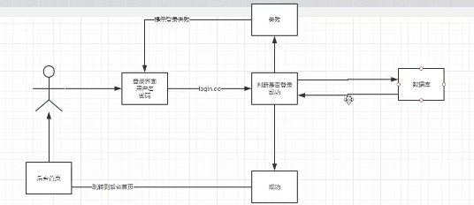
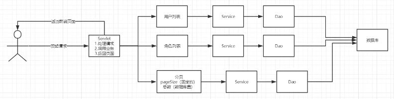

# SMBMS

- 超市管理系统
- 分析项目架构
  - 从页面分析
  - 从数据库的表之间的关系分析
- 项目如何搭建
  - 考虑使不使用Maven?
    - 依赖
    - jar包

## 1. 项目搭建

### 1.1 使用IDEA搭建一个Maven Web项目

- (使用不使用模板都可，后期自己改即可)

### 1.2 搭建Tomcat

### 1.3 测试项目是否能够运行

### 1.4 导入项目中需要用到的jar包

- jsp、Servlet、mysql驱动、jstl、standard、

### 1.5 创建项目包结构

- dao、filter、pojo、service、servlet、util

### 1.6 编写实体类

  - ORM映射：表-类映射

### 1.7 编写基础公共类

  - 数据库配置文件

    - ```java
      driver=com.mysql.jdbc.Driver
      url=jdbc:mysql://localhost:3306/smbms?useSSL=false&useUnicode=true&characterEncoding=utf-8
      username=root
      password=123456
      ```

  - 编写数据库的公共类

    - ```java
      // 操作数据库的公共类
      public class BaseDao {
          private static String driver;
          private static String url;
          private static String username;
          private static String password;
      
          // 静态代码块，类加载时就初始化了
          static {
              Properties properties = new Properties();
              // 通过类加载器的方式读取对应的资源
              InputStream is = BaseDao.class.getClassLoader().getResourceAsStream("db.properties");
      
              try {
                  properties.load(is);
              } catch (IOException e) {
                  e.printStackTrace();
              }
      
              driver = properties.getProperty(driver);
              url = properties.getProperty("url");
              username = properties.getProperty("username");
              password = properties.getProperty("password");
          }
      
          // 获取数据库的连接
          public static Connection getConnection(){
              Connection connection = null;
              try {
                  Class.forName(driver);
                  connection = DriverManager.getConnection(url, username, password);
              } catch (Exception e) {
                  e.printStackTrace();
              }
              return connection;
          }
      
          // 编写查询公共类
          public static ResultSet execute(Connection connection,String sql,Object[] params,ResultSet resultSet,PreparedStatement preparedStatement) throws SQLException {
              // 预编译的sql,在后面直接执行就可以
              preparedStatement = connection.prepareStatement(sql);
              for (int i = 0; i < params.length; i++) {
                  // setObject:占位符从1开始
                  preparedStatement.setObject(i+1,params[i]);
              }
              resultSet = preparedStatement.executeQuery();
              return resultSet;
          }
      
          // 编写增删改公共方法
          // 编写查询公共类
          public static int execute(Connection connection,String sql,Object[] params,int updateRows,PreparedStatement preparedStatement) throws SQLException {
              // 预编译
              preparedStatement = connection.prepareStatement(sql);
              for (int i = 0; i < params.length; i++) {
                  // setObject:占位符从1开始
                  preparedStatement.setObject(i+1,params[i]);
              }
              updateRows = preparedStatement.executeUpdate();
              return updateRows;
          }
      
          // 释放资源
          public static boolean closeResource(Connection connection,PreparedStatement preparedStatement,ResultSet resultSet){
              boolean flag = true;
              if(resultSet!=null){
                  try {
                      resultSet.close();
                      // gc回收
                      resultSet=null;
                  } catch (SQLException e) {
                      e.printStackTrace();
                      flag=false;
                  }
              }
              if(preparedStatement!=null){
                  try {
                      preparedStatement.close();
                      // gc回收
                      preparedStatement=null;
                  } catch (SQLException e) {
                      e.printStackTrace();
                      flag=false;
                  }
              }
              if(connection!=null){
                  try {
                      connection.close();
                      // gc回收
                      connection=null;
                  } catch (SQLException e) {
                      e.printStackTrace();
                      flag=false;
                  }
              }
              return flag;
          }
      }
      
      ```
    
  - 编写字符编码过滤器，并且注册

```java
public class CharacterEncodingFilter implements Filter {
    @Override
    public void init(FilterConfig filterConfig) throws ServletException {

    }

    @Override
    public void doFilter(ServletRequest servletRequest, ServletResponse servletResponse, FilterChain filterChain) throws IOException, ServletException {
        servletRequest.setCharacterEncoding("utf-8");
        servletResponse.setCharacterEncoding("utf-8");
        filterChain.doFilter(servletRequest,servletResponse);
    }

    @Override
    public void destroy() {

    }
}

```

### 1.8 导入静态资源

- 网站需要用到的css、js、html、image、jquery、jsp等

## 2. 实现登录功能



- 编写前端页面
- 设置首页

```xml
<!--    设置欢迎页面-->
    <welcome-file-list>
        <welcome-file>login.jsp</welcome-file>
    </welcome-file-list>
```

- 编写dao层用户登录的接口，从数据库中获取用户信息
- 实现具体的类
- 业务层接口
- 业务层实现类
- 编写Servlet
- 注册Servlet
- 测试页面，确保以上功能可以运行

## 3. 优化登录功能

- 注销功能
  - 去除session
  - 返回到首页
- 登录拦截

## 4. 密码修改

- 导入前端素材
- 自底向上编写代码
  - UserDao接口
  - UserDao接口实现类
  - UserService接口
  - UserService接口实现类
  - 实现对应的Servlet并且注册
  - 实现Servlet的复用：提取出方法，根据前端参数，调用不同的方法即可

## 5. 优化密码修改

- 使用Ajax!!!!

## 6. 实现用户管理



- 导入分页的工具类
- 用户列表等jsp导入
- 获取用户数量
  - UserDao
  - UserDaoImpl
  - UserService
  - UserServiceImpl
- 获取用户列表
  - UserDao
  - UserDaoImpl
  - UserService
  - UserServiceImpl
- 获取角色列表
  - 为了职责方面，需要把角色的操作单独放在一个包中，和pojo类对应
  - RoleDao
  - RoleImpl
  - RoleService
  - RoleServiceImpl
- 用户显示的Servlet
  - 获取用户前端数据(用于查询)
  - 判断请求是否需要执行，看参数的值判断
  - 为了实现分页，需要计算出当前页面和总页面大小
  - 用户列表展示
  - 返回前端