# JUC并发编程

- 主要来自：https://www.bilibili.com/video/BV1B7411L7tE?p=2&spm_id_from=pageDriver

## 1. 什么是JUC？

- 是java.util下面的几个工具包：concurrent、concurrent.atomic、concurrent.locks
- 为什么要使用JUC？
  - 因为在写业务代码时，使用普通的线程Thread类效率低，并且Runnalble：没有返回值、效率相比于Callable相对较低，并且无返回值

## 2. 线程和进程

- 进程：一个代码的执行过程，一个进程可以包含多个进程，至少包含一个！
  
  - Java默认有几个进程？2个：main+GC

- 线程：

- 并发和并行？
  
  - 并发：多线程操作同一个资源
    
    - cpu单核：快速交替
  
  - 并行：多个人一起走
    
    - cpu多核：多个线程可以同时执行：线程池
  
  - ```java
    // 获取CPU的核数
    // CPU密集型、IO密集型未完待续
    System.out.println(Runtime.getRuntime.getRuntime().availableProcessors());
    ```

- 并发编程的本质：充分利用CPU资源

- 线程有几个状态？

- wait和sleep的区别？
  
  - 来自不同的类：
    - wait=>Object
    - sleep=>Thread
  - 关于锁的释放：
    - wait会释放锁
    - sleep不会释放锁
  - 使用范围：
    - wait：只能在同步代码块中使用
    - sleep：可以在任何地方使用
  - 是否需要捕获异常：
    - wait：不需要捕获异常
    - sleep：必须捕获异常

## 3. Lock锁

> 传统的Synchronized

- 真正的多线程开发，线程就是一个单独的资源类，没有任何附属的操作
  
  - 1.属性、方法OOP

- ```java
  public class SaleTicketDemo1 {
      public static void main(String[] args) {
          // 并发：多个线程操作同一个资源类，把资源类放入线程即可
          Ticket ticket=new Ticket();
  //        @FunctionalInterface 函数式接口，可以使用lambda表达式
          new Thread(()->{
              for (int i = 0; i < 60; i++) {
                  ticket.sale();
              }
          },"A").start();
          new Thread(()->{
              for (int i = 0; i < 60; i++) {
                  ticket.sale();
              }
          },"B").start();
          new Thread(()->{
              for (int i = 0; i < 60; i++) {
                  ticket.sale();
              }
          },"C").start();
      }
  }
  // 资源类 OOP
  class Ticket{
      // 属性、方法
      private int number = 50;
      // 买票的方式
      // synchronized 本质：锁+队列
      public synchronized void sale(){
          if(number>0){
              System.out.println(Thread.currentThread().getName()+"卖出了第"+(number--)+"票，剩余："+number+"张票");
          }
      }
  }
  ```

> Lock接口
> 
> - 实现类：
>   - ReentrantLock：可重入锁
>   - ReentrantReadWirteLock.ReadLock：读锁
>   - ReentrantReadWirteLock.WriteLock：写锁

- 简单分析ReentrantLock
  
  - ```java
    // ReentrantLock构造函数源码
    public ReentrantLock() {
            sync = new NonfairSync();
    }
    public ReentrantLock(boolean fair) {
            sync = fair ? new FairSync() : new NonfairSync();
    }
    
    FairSync()：公平锁：十分公平：可以先来后到
    NonFairSync()：非公平锁：十分不公平：可以插队（默认）
    ```

- ```java
  import java.util.concurrent.locks.Lock;
  import java.util.concurrent.locks.ReentrantLock;
  
  public class SaleTicketDemo2 {
      public static void main(String[] args) {
          // 并发：多个线程操作同一个资源类，把资源类放入线程即可
          Ticket2 ticket=new Ticket2();
  //        @FunctionalInterface 函数式接口，可以使用lambda表达式
          new Thread(()->{
              for (int i = 0; i < 60; i++) {
                  ticket.sale();
              }
          },"A").start();
          new Thread(()->{
              for (int i = 0; i < 60; i++) {
                  ticket.sale();
              }
          },"B").start();
          new Thread(()->{
              for (int i = 0; i < 60; i++) {
                  ticket.sale();
              }
          },"C").start();
      }
  }
  
  // Lock三部曲
  // new ReentrantLock()
  // 加锁
  // 业务代码，解锁
  class Ticket2{
      // 属性、方法
      private int number = 50;
      Lock lock = new ReentrantLock();
  
      // 买票的方式
      public synchronized void sale(){
          // 加锁
          lock.lock();
          try {
              // 业务代码
              if(number>0){
                  System.out.println(Thread.currentThread().getName()+"卖出了第"+(number--)+"票，剩余："+number+"张票");
              }
          }catch (Exception e){
              e.printStackTrace();
          }finally {
              // 解锁
              lock.unlock();
          }
  
      }
  }
  ```

> synchronized和Lock的区别：

- synchronized：是内置关键字，Lock是一个Java接口
- synchronized：无法判断获取锁的状态，Lock 可以判断是否获取到锁
- synchronized：会自动释放锁，Lock必须要手动释放锁，如果不释放锁，会造成死锁
- synchronized ：容易造成：线程1=》获得锁，阻塞。线程2=》一直等待，Lock：不一定会等待下去
- synchronized：可重入锁，不可以中断，非公平，Lock：可重入锁，可以判断锁，非公平(自己设置)
- synchronized：适合少量的代码同步问题，Lock适合锁大量的同步代码

## 4. 生产者消费者问题

> 传统：synchronized wait notifyAll

```java
/*
线程间的通信问题：生产者和消费者问题：等待唤醒，通知唤醒
线程交替执行 ： A B 操作同一个变量 num=0
A num+1
B num-1
 */
public class ProduceConsumer {
    public static void main(String[] args) {
        Data data = new Data();
        new Thread(()->{
            for (int i = 0; i < 10; i++) {
                try {
                    data.increment();
                } catch (InterruptedException e) {
                    e.printStackTrace();
                }
            }
            },"A").start();
        new Thread(()->{
            for (int i = 0; i < 10; i++) {
                try {
                    data.decrement();
                } catch (InterruptedException e) {
                    e.printStackTrace();
                }
            }
        },"B").start();
    }
}

// 资源类
// 等待=业务=通知
class Data{
    private int number=0;

    public synchronized void increment() throws InterruptedException {
        if(number!=0){
            // 等待
            this.wait();
        }
        number++;
        // 通知其他线程，+1完毕
        System.out.println(Thread.currentThread().getName()+"=>"+number);
        this.notifyAll();
    }

    public synchronized void decrement() throws InterruptedException {
        if(number==0){
            // 等待
            this.wait();
        }
        number--;
        // 通知其他线程，-1完毕
        System.out.println(Thread.currentThread().getName()+"=>"+number);
        this.notifyAll();
    }

}
```

- 存在问题：如果有多个线程：A B C D 4个线程，怎么解决？=》虚假唤醒问题！(官方文档里面看！)
  
  - 等待应该总是在循环中！
  
  - if 改成 while
  
  - ```java
    /*
    线程间的通信问题：生产者和消费者问题：等待唤醒，通知唤醒
    线程交替执行 ： A B 操作同一个变量 num=0
    A num+1
    B num-1
     */
    public class ProduceConsumer {
        public static void main(String[] args) {
            Data data = new Data();
            new Thread(()->{
                for (int i = 0; i < 10; i++) {
                    try {
                        data.increment();
                    } catch (InterruptedException e) {
                        e.printStackTrace();
                    }
                }
                },"A").start();
            new Thread(()->{
                for (int i = 0; i < 10; i++) {
                    try {
                        data.decrement();
                    } catch (InterruptedException e) {
                        e.printStackTrace();
                    }
                }
            },"B").start();
            new Thread(()->{
                for (int i = 0; i < 10; i++) {
                    try {
                        data.increment();
                    } catch (InterruptedException e) {
                        e.printStackTrace();
                    }
                }
            },"C").start();
            new Thread(()->{
                for (int i = 0; i < 10; i++) {
                    try {
                        data.decrement();
                    } catch (InterruptedException e) {
                        e.printStackTrace();
                    }
                }
            },"D").start();
        }
    }
    
    // 资源类
    // 等待=业务=通知
    class Data{
        private int number=0;
    
        public synchronized void increment() throws InterruptedException {
            while (number!=0){
                // 等待
                this.wait();
            }
            number++;
            // 通知其他线程，+1完毕
            System.out.println(Thread.currentThread().getName()+"=>"+number);
            this.notifyAll();
        }
    
        public synchronized void decrement() throws InterruptedException {
            while (number==0){
                // 等待
                this.wait();
            }
            number--;
            // 通知其他线程，-1完毕
            System.out.println(Thread.currentThread().getName()+"=>"+number);
            this.notifyAll();
        }
    
    }
    ```

> JUC：Lock await signal

- condition下面的await和signal

```java
import java.util.concurrent.locks.Condition;
import java.util.concurrent.locks.Lock;
import java.util.concurrent.locks.ReentrantLock;

/*
线程间的通信问题：生产者和消费者问题：等待唤醒，通知唤醒
线程交替执行 ： A B 操作同一个变量 num=0
A num+1
B num-1
 */
public class ProduceConsumer2 {
    public static void main(String[] args) {
        Data2 data = new Data2();
        new Thread(()->{
            for (int i = 0; i < 10; i++) {
                try {
                    data.increment();
                } catch (InterruptedException e) {
                    e.printStackTrace();
                }
            }
            },"A").start();
        new Thread(()->{
            for (int i = 0; i < 10; i++) {
                try {
                    data.decrement();
                } catch (InterruptedException e) {
                    e.printStackTrace();
                }
            }
        },"B").start();
        new Thread(()->{
            for (int i = 0; i < 10; i++) {
                try {
                    data.increment();
                } catch (InterruptedException e) {
                    e.printStackTrace();
                }
            }
        },"C").start();
        new Thread(()->{
            for (int i = 0; i < 10; i++) {
                try {
                    data.decrement();
                } catch (InterruptedException e) {
                    e.printStackTrace();
                }
            }
        },"D").start();
    }
}

// 资源类
// 等待=业务=通知
class Data2{
    private int number=0;
    Lock lock = new ReentrantLock();
    Condition condition =lock.newCondition();
    public synchronized void increment() throws InterruptedException {
        lock.lock();
        try{
            while (number!=0){
                // 等待
//            this.wait();
                condition.await();
            }
            number++;
            // 通知其他线程，+1完毕
            System.out.println(Thread.currentThread().getName()+"=>"+number);
//        this.notifyAll();
            condition.signalAll();
        }catch (Exception e){
            e.printStackTrace();
        }finally {
            lock.unlock();
        }

    }
    public void decrement() throws InterruptedException {
        lock.lock();
        try{
            while (number==0){
                condition.await();
            }
            number--;
            // 通知其他线程，-1完毕
            System.out.println(Thread.currentThread().getName()+"=>"+number);
            condition.signalAll();
        }catch (Exception e){
            e.printStackTrace();
        }finally {
            lock.unlock();
        }

    }

}
```

> condition实现精准通知和唤醒：期望线程顺序执行：A->B->C

```java
import java.util.concurrent.locks.Condition;
import java.util.concurrent.locks.Lock;
import java.util.concurrent.locks.ReentrantLock;

/*
condition精准唤醒：期望线程按照指定顺序执行 A->B->C
 */
public class ProduceConsumer3 {
    public static void main(String[] args) {
        Data3 data = new Data3();
        new Thread(()->{
            for (int i = 0; i < 10; i++) {
               data.printA();
            }
            },"A").start();
        new Thread(()->{
            for (int i = 0; i < 10; i++) {
                data.printB();
            }
        },"B").start();
        new Thread(()->{
            for (int i = 0; i < 10; i++) {
                data.printC();
            }
        },"C").start();

    }
}

// 资源类
// 等待=业务=通知
class Data3{
    private Lock lock = new ReentrantLock();
    Condition condition1 = lock.newCondition();
    Condition condition2 = lock.newCondition();
    Condition condition3 = lock.newCondition();
    private int number = 1;//1A 2B 3C
    public void printA(){
        lock.lock();
        try {
            while(number!=1){
                // 指定等待哪个？
                condition1.await();
            }
            System.out.println(Thread.currentThread().getName()+"===>AAAA");
            // 指定唤醒哪一个
            number=2;
            condition2.signal();
        }catch (Exception e){
            e.printStackTrace();
        }finally {
            lock.unlock();
        }
    }

    public void printB(){
        lock.lock();
        try {
            while(number!=2){
                condition2.await();
            }
            System.out.println(Thread.currentThread().getName()+"===>BBBB");
            // 指定唤醒哪一个
            number=3;
            condition3.signal();
        }catch (Exception e){
            e.printStackTrace();
        }finally {
            lock.unlock();
        }
    }

    public void printC(){
        lock.lock();
        try {
            while(number!=3){
                condition3.await();
            }
            System.out.println(Thread.currentThread().getName()+"===>cccc");
            // 指定唤醒哪一个
            number=1;
            condition1.signal();
        }catch (Exception e){
            e.printStackTrace();
        }finally {
            lock.unlock();
        }
    }

}
```

## 5. 锁？八锁现象

- 八个问题！

- ```java
  import java.util.concurrent.TimeUnit;
  
  /*
  1.标准情况下：以下两个线程是先打印：发短信还是打电话？
  ans：先发短信！
  2.sendSms延时4秒：以下两个线程是先打印：发短信还是打电话？
  ans：先发短信！
  
  为什么？
  有锁的影响，synchronized 锁的对象：是方法的调用者！
  因此两个方法用的是一把锁，谁先拿到谁执行
   */
  public class EightLock1 {
      public static void main(String[] args) {
          Phone phone = new Phone();
          new Thread(()->{
              phone.sendSms();
          },"A").start();
  
          // 休息1秒
          try {
              TimeUnit.SECONDS.sleep(1);
          } catch (InterruptedException e) {
              e.printStackTrace();
          }
  
          new Thread(()->{
              phone.call();
          },"B").start();
      }
  }
  
  class Phone{
      public synchronized void sendSms(){
          try {
              TimeUnit.SECONDS.sleep(4);
          } catch (InterruptedException e) {
              e.printStackTrace();
          }
          System.out.println("发短信");
      }
  
      public synchronized void call(){
          System.out.println("打电话");
      }
  }
  ```

- ```java
  import java.util.concurrent.TimeUnit;
  
  /*
  3.标准情况下：以下两个线程是先打印：发短信还是hello?
  ans:先hello
  
  为什么？
  hello()方法没有加synchronized关键字，是普通方法，没有加锁，不受锁的影响
   */
  public class EightLock3 {
      public static void main(String[] args) {
          Phone3 phone = new Phone3();
          new Thread(()->{
              phone.sendSms();
          },"A").start();
  
          // 休息1秒
          try {
              TimeUnit.SECONDS.sleep(1);
          } catch (InterruptedException e) {
              e.printStackTrace();
          }
  
          new Thread(()->{
  //            phone.call();
              phone.hello();
          },"B").start();
      }
  }
  
  class Phone3{
      public synchronized void sendSms(){
          try {
              TimeUnit.SECONDS.sleep(4);
          } catch (InterruptedException e) {
              e.printStackTrace();
          }
          System.out.println("发短信");
      }
  
      public synchronized void call(){
          System.out.println("打电话");
      }
  
      public void hello(){
          System.out.println("hello ");
      }
  }
  ```

- ```java
  import java.util.concurrent.TimeUnit;
  
  /*
  4.两个对象：以下两个线程是先打印：发短信还是打电话？
  ans:先打电话
  
  为什么？
  此时有两个对象，两把锁，因为sendSms需要休息4秒。因此先打印打电话
   */
  public class EightLock4 {
      public static void main(String[] args) {
          Phone4 phone = new Phone4();
          Phone4 phone2 = new Phone4();
          new Thread(()->{
              phone.sendSms();
          },"A").start();
  
          // 休息1秒
          try {
              TimeUnit.SECONDS.sleep(1);
          } catch (InterruptedException e) {
              e.printStackTrace();
          }
  
          new Thread(()->{
  //            phone.call();
              phone2.call();
          },"B").start();
      }
  }
  
  class Phone4{
      public synchronized void sendSms(){
          try {
              TimeUnit.SECONDS.sleep(4);
          } catch (InterruptedException e) {
              e.printStackTrace();
          }
          System.out.println("发短信");
      }
  
      public synchronized void call(){
          System.out.println("打电话");
      }
  
      public void hello(){
          System.out.println("hello ");
      }
  }
  ```

- ```java
  import java.util.concurrent.TimeUnit;
  
  /*
  5.增加两个静态的同步代码块，只有一个对象，请问是先打印发短信还是打电话？
  ans:先发短信
  
  为什么？
  static 静态方法：类一加载就有了，而不是要等对象实例化之后才能够使用，是在Class模板里，
  所以：synchronized是锁的Class模板
  
  6. 增加两个静态的同步代码块，两个对象，请问是先打印发短信还是打电话？
  ans:先发短信
  
  为什么？
  static 静态方法：类一加载就有了，而不是要等对象实例化之后才能够使用，是在Class模板里，
  所以：synchronized是锁的Class模板，
   */
  public class EightLock5 {
      public static void main(String[] args) {
          Phone5 phone = new Phone5();
          Phone5 phone2 = new Phone5();
          new Thread(()->{
              phone.sendSms();
          },"A").start();
  
          // 休息1秒
          try {
              TimeUnit.SECONDS.sleep(1);
          } catch (InterruptedException e) {
              e.printStackTrace();
          }
  
          new Thread(()->{
              phone2.call();
          },"B").start();
      }
  }
  
  class Phone5{
      public static synchronized void sendSms(){
          try {
              TimeUnit.SECONDS.sleep(4);
          } catch (InterruptedException e) {
              e.printStackTrace();
          }
          System.out.println("发短信");
      }
  
      public static synchronized void call(){
          System.out.println("打电话");
      }
  
  }
  ```

- ```java
  import java.util.concurrent.TimeUnit;
  
  /*
  7.一个静态同步方法，一个同步方法，只有一个对象，请问是先打印发短信还是打电话？
  ans:先打电话
  
  为什么？
  sendSms()锁的是Class模板
  call()锁的是phone这个方法调用者的对象，两者不是同一把锁，并且sendSms()需要睡眠4秒，因此先打印打电话
  
  8.一个静态同步方法，一个同步方法，只有两个对象，请问是先打印发短信还是打电话？
  ans:先打电话
  
  为什么？
  sendSms()锁的是Class模板
  call()锁的是phone这个方法调用者的对象，两者不是同一把锁，并且sendSms()需要睡眠4秒，因此先打印打电话
   */
  public class EightLock7 {
      public static void main(String[] args) {
          Phone7 phone = new Phone7();
          Phone7 phone2 = new Phone7();
          new Thread(()->{
              phone.sendSms();
          },"A").start();
  
          // 休息1秒
          try {
              TimeUnit.SECONDS.sleep(1);
          } catch (InterruptedException e) {
              e.printStackTrace();
          }
  
          new Thread(()->{
              phone2.call();
  //            phone.call();
          },"B").start();
      }
  }
  
  class Phone7{
      public static synchronized void sendSms(){
          try {
              TimeUnit.SECONDS.sleep(4);
          } catch (InterruptedException e) {
              e.printStackTrace();
          }
          System.out.println("发短信");
      }
  
      public synchronized void call(){
          System.out.println("打电话");
      }
  
  }
  ```

- 小结：
  
  - synchronized到底锁的是什么？
    - new this 具体的一个手机
    - static Class唯一的一个模板

## 6. 集合类不安全

> List不安全：

```java
import java.util.*;
import java.util.concurrent.CopyOnWriteArrayList;

/*
会报：java.util.ConcurrentModificationException ： 并发修改异常
并发下， ArrayList不安全
解决方案：
1.最笨的方法
List<String> list = new Vector<>();=>太老了，就是在add中加了synchronized
2.用Collection方法，添加上synchronized
List<String> list = Collections.synchronizedList(new ArrayList<>());
3.JUC：CopyOnWrite：写入时复制　COW　操作系统中的一种优化策略
多个线程调用list的时候，读取是固定的，写入的时候为了避免覆盖，造成数据问题，采用写入时复制
List<String> list = new CopyOnWriteArrayList<>();

CopyOnWriteArrayList和Vector的区别？
Vector 使用的是synchronized效率低
CopyOnWriteArrayList使用的是Lock，效率高
*/
public class UnsafeList {
   public static void main(String[] args) {

//        List<String> list = new ArrayList<>();
//        List<String> list = new Vector<>();
       List<String> list = Collections.synchronizedList(new ArrayList<>());
//        List<String> list = new CopyOnWriteArrayList<>();
       for (int i = 0; i <10 ; i++) {
           new Thread(()->{
               list.add(UUID.randomUUID().toString().substring(0,5));
               System.out.println(list);
           },String.valueOf(i)).start();
       }
   }
}
```

> Set不安全

```java
import java.util.*;
import java.util.concurrent.CopyOnWriteArraySet;

/*
 会报：java.util.ConcurrentModificationException ： 并发修改异常
并发下， Set不安全
 解决方案：
 1.用Collections的方法,也是转换为synchronized
 Set<String> set = Collections.synchronizedSet(new HashSet<>());
 3.JUC：CopyOnWrite：写入时复制　COW　操作系统中的一种优化策略
 多个线程调用list的时候，读取是固定的，写入的时候为了避免覆盖，造成数据问题，采用写入时复制
Set<String> set = new CopyOnWriteArraySet<>();

 */
public class UnsafeSet {
    public static void main(String[] args) {
//        Set<String> set = new HashSet<>();
//        Set<String> set = Collections.synchronizedSet(new HashSet<>());
        Set<String> set = new CopyOnWriteArraySet<>();
        for (int i = 0; i <10 ; i++) {
            new Thread(()->{
                set.add(UUID.randomUUID().toString().substring(0,5));
                System.out.println(set);
            },String.valueOf(i)).start();
        }
    }
}
```

> HashSet底层是什么？

```java
public HashSet() {
        map = new HashMap<>();
}

public boolean add(E e) {
        return map.put(e, PRESENT)==null;
}

private static final Object PRESENT = new Object();
```

> HashMap不安全

```java
import java.util.*;
import java.util.concurrent.ConcurrentHashMap;

/*
 会报：java.util.ConcurrentModificationException ： 并发修改异常
并发下， HashMap不安全
 解决方案：
 1.用Collections的方法,也是转换为synchronized
 Map<String,String> map = Collections.synchronizedMap(new HashMap<>());
 3.JUC：ConcurrentHashMap=>原理：可以看官方文档！
Map<String,String> map = new ConcurrentHashMap<>();

 */
public class UnsafeMap {
    public static void main(String[] args) {
        // map是这样用的吗？ 不是，工作中不用HashMap
        // 默认等价于什么？ new HashMap<>(16,0.75)，明白初始容量和加载因子！
//        Map<String,String> map = new HashMap<>();
//        Map<String,String> map = Collections.synchronizedMap(new HashMap<>());
        Map<String,String> map = new ConcurrentHashMap<>();
        for (int i = 0; i <100 ; i++) {
            new Thread(()->{
                map.put(UUID.randomUUID().toString().substring(0,5),UUID.randomUUID().toString().substring(0,5));
                System.out.println(map);
            },String.valueOf(i)).start();
        }
    }
}
```

## 7. Callable

- 看官方文档！
  
  - 可以有返回值
  - 可以抛出异常
  - 调用方法不同，从之前的Runable的run()变为了call()

- Thread怎么调用Callable方法？
  
  - 通过Thread、Runnable、RunnableFuture、FutureTask、Callable之间的关系！
  - 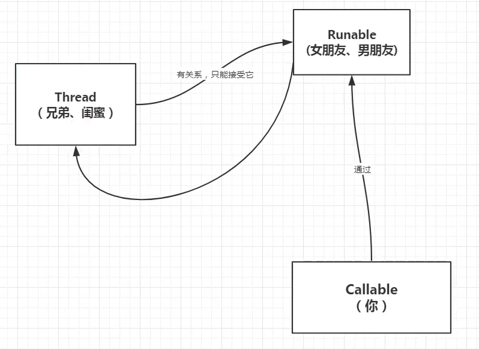

- ```java
  import java.util.concurrent.Callable;
  import java.util.concurrent.ExecutionException;
  import java.util.concurrent.FutureTask;
  
  public class CallableTest {
      public static void main(String[] args) throws ExecutionException, InterruptedException {
          // 传统方法，不建议用
          // new Thread(new MyThread()).start();
  
          // Thread怎么使用Callable?
  //        new Thread(new Runnable).start()
  //        new Thread(new FutureTask<V>()).start()
  //        new Thread(new FutureTast<V>(Callable )).start()
  
          MyThread2 myThread2 =new MyThread2();
          // 适配类
          FutureTask futureTask = new FutureTask(myThread2);
          // 至此可以放入Thread中执行=>执行两个，只会输出一个，因为有缓存！
          new Thread(futureTask,"A").start();
          new Thread(futureTask,"B").start();
  
          // 获取Callable的返回结果，可能会产生阻塞，一般放到最后，或者异步通信
          String o = (String) futureTask.get();
          System.out.println(o);
      }
  
  }
  
  // 传统多线程方法
  class MyThread implements Runnable{
      @Override
      public void run() {
  
      }
  }
  
  // 使用Callable方法
  class MyThread2 implements Callable<String>{
      @Override
      public String call() throws Exception {
          System.out.println("call");
          return "call()";
      }
  }
  ```

- 注意：
  
  - Callable有缓存，结果可能需要等待，会阻塞！

## 8.常用辅助类

### 8.1 CountDownLatch

- 看官方文档+代码示例

- ```java
  import java.util.concurrent.CountDownLatch;
  
  // 减法计数器
  /*
  原理：
  每次有线程调用countDown()，数量就会-1，如果计数器变为0，countDownLatch.await()就会被唤醒，继续执行！
   */
  public class CountDownLatchTest {
      public static void main(String[] args) throws InterruptedException {
  //        设置总数是6，必须要执行任务的时候可以使用
          CountDownLatch countDownLatch = new CountDownLatch(6);
          for (int i = 0; i < 6; i++) {
              new Thread(()->{
                  System.out.println(Thread.currentThread().getName()+"go out");
                  // 进行-1操作
                  countDownLatch.countDown();
              },String.valueOf(i)).start();
          }
          // 等待计数器归0后，才能往下执行，如果没有这个代码，则在多线程下面，下面的代码也会争取cpu时间片来运行
          countDownLatch.await();
          System.out.println("close door");
      }
  }
  ```

### 8.2 CyclicBarrier

- 看官方文档+代码实例

- ```java
  import java.util.concurrent.BrokenBarrierException;
  import java.util.concurrent.CyclicBarrier;
  
  public class CyclicBarrierTest {
      public static void main(String[] args) {
          // 集齐7课龙族召唤神龙
          CyclicBarrier cyclicBarrier = new CyclicBarrier(7,()->{
              System.out.println("召唤神龙成功！");
          });
          for (int i = 0; i < 7; i++) {
  
              // lambda表达式里面可以获取这个i吗？不可以，因为lambda表达式类似于一个匿名内部类，不可以访问外界变量
              // 可以使用final传递
              final int temp = i;
              new Thread(()->{
                  System.out.println(Thread.currentThread().getName()+"收集了第"+temp+"课龙珠");
                  try {
                      // 等待
                      cyclicBarrier.await();
                  } catch (InterruptedException e) {
                      e.printStackTrace();
                  } catch (BrokenBarrierException e) {
                      e.printStackTrace();
                  }
              }).start();
          }
      }
  }
  ```

### 8.3 Semaphore

- Semaphore：信号量

- 官方文档+代码示例

- ```java
  import java.util.concurrent.Semaphore;
  import java.util.concurrent.TimeUnit;
  
  /*
  原理：
  acquire()获得信号量-1，如果已经满了，就等待，等待被释放为止
  release()释放，会将当前信号量释放+1，然后唤醒等待的线程
  作用：
  多个共享资源互斥的使用
  并发限流，控制最大的线程数
   */
  public class SemaphoreTest {
      public static void main(String[] args) {
          // 线程数量：停车位，一般限流的时候可以使用
          Semaphore semaphore = new Semaphore(3);
          for (int i = 0; i < 10; i++) {
              new Thread(()->{
                  try {
                      // 得到
                      semaphore.acquire();
                      System.out.println(Thread.currentThread().getName()+"抢到了车位");
                      // 停一定时间
                      TimeUnit.SECONDS.sleep(3);
                      System.out.println(Thread.currentThread().getName()+"离开了车位");
  
                  } catch (InterruptedException e) {
                      e.printStackTrace();
                  }finally {
                      // 释放
                      semaphore.release();
                  }
              }).start();
          }
      }
  }
  ```

## 9. 读写锁

### 9.1 ReadWriteLock

- 看官方文档！

- ```java
  import java.util.HashMap;
  import java.util.Map;
  import java.util.concurrent.locks.Lock;
  import java.util.concurrent.locks.ReentrantReadWriteLock;
  
  /*
  独占锁==排他锁==写锁：一次只能被一个线程占有
  共享锁==读锁：多个线程可以同时占有
  ReadWriteLock
  读-读：可以共存
  读-写：不可共存
  写-写：不能共存
   */
  public class ReadWriteLockTest {
      public static void main(String[] args) {
  //        MyChache myChache = new MyChache();
          MyChacheLock myChache = new MyChacheLock();
          // 写入
          for (int i = 0; i < 10; i++) {
              final int temp = i;
              new Thread(
                      ()->myChache.put(temp+"",temp+"")
              ).start();
          }
  
          // 读取
          for (int i = 0; i < 10; i++) {
              final int temp = i;
              new Thread(
                      ()->myChache.get(temp+"")
              ).start();
          }
      }
  }
  
  // 加锁
  class MyChacheLock{
      private volatile Map<String,Object> map = new HashMap<>();
      // 读写锁，更加细粒度的控制
      private ReentrantReadWriteLock reentrantReadWriteLock = new ReentrantReadWriteLock();
  
      // 存，写：只希望同时只有一个线程写入
      public void put(String key,Object value){
          // 加写锁
          reentrantReadWriteLock.writeLock().lock();
          try{
              System.out.println(Thread.currentThread().getName()+"写入："+key);
              map.put(key,value);
              System.out.println(Thread.currentThread().getName()+"写入完毕");
          }catch (Exception e){
              e.printStackTrace();
          }finally {
              // 解锁
              reentrantReadWriteLock.writeLock().unlock();
          }
  
      }
  
      // 取，读：希望所有人都可以读
      public void get(String key){
          // 加读锁
          reentrantReadWriteLock.readLock().lock();
          try {
              System.out.println(Thread.currentThread().getName()+"读取"+key);
              Object o = map.get(key);
              System.out.println(Thread.currentThread().getName()+"读取完毕");
          }catch (Exception e){
              e.printStackTrace();
          }finally {
              // 解锁
              reentrantReadWriteLock.readLock().unlock();
          }
  
      }
  }
  ```

  // 自定义缓存。模拟读写操作
  class MyChache{
      private volatile Map<String,Object> map = new HashMap<>();

      // 存，写
      public void put(String key,Object value){
          System.out.println(Thread.currentThread().getName()+"写入："+key);
          map.put(key,value);
          System.out.println(Thread.currentThread().getName()+"写入完毕");
      }
    
      // 取，读
      public void get(String key){
          System.out.println(Thread.currentThread().getName()+"读取"+key);
          Object o = map.get(key);
          System.out.println(Thread.currentThread().getName()+"读取完毕");
      }

  }

```
## 10. 阻塞队列、同步队列

### 10.1 阻塞队列

- 阻塞？队列：

- 写入：如果队列满了，就必须阻塞等待读取
- 读取：如果队列是空的，就必须阻塞等待写入

- BlockingQueue 接口：

- 看官方文档+实现类
- 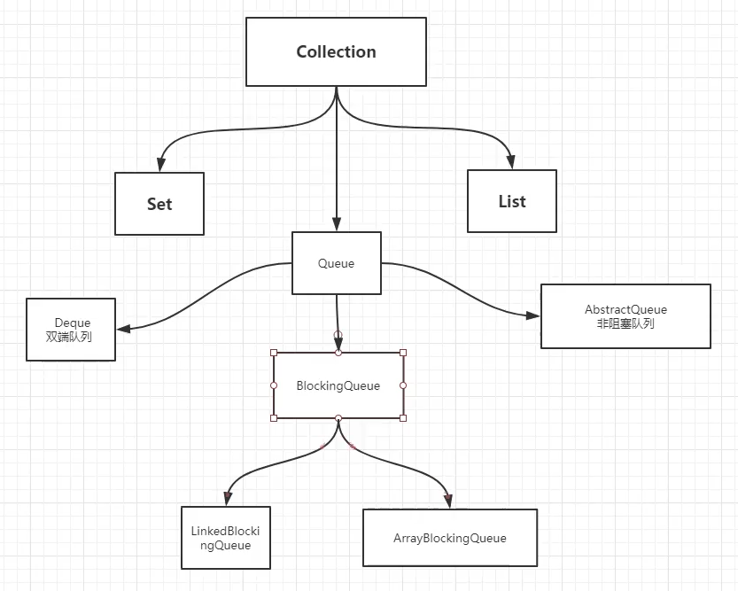

- 什么时候会使用到阻塞队列？

- 多线程并发、线程池

- 学习使用：

- 四组API：

  - 抛出异常
  - 不会抛出异常
  - 阻塞等待
  - 超时等待

- | 方式     | 抛出异常  | 无异常有返回值 | 阻塞等待 | 超时等待 |
  | -------- | --------- | -------------- | -------- | -------- |
  | 添加     | add()     | offer()        | put()    | offer()  |
  | 删除     | remove()  | poll()         | take()   | poll()   |
  | 获取队首 | element() | peek()         | 无       | 无       |

- ```java
import java.util.concurrent.ArrayBlockingQueue;
import java.util.concurrent.TimeUnit;

public class BlockingQueueTest {
    public static void main(String[] args) throws InterruptedException {
//        test1();
//        test2();
//        test3();
        test4();
    }

    // 抛出异常
    public static void test1() {
        // 要设置队列的大小
        ArrayBlockingQueue<Object> blockingQueue = new ArrayBlockingQueue<>(3);
        // 抛出异常：java.util.NoSuchElementException
//        System.out.println(blockingQueue.remove());

        System.out.println(blockingQueue.add("a"));
        System.out.println(blockingQueue.add("b"));
        System.out.println(blockingQueue.add("c"));

        // 查看队首元素
        System.out.println(blockingQueue.element());

        // 抛出异常：java.lang.IllegalStateException: Queue full
//        System.out.println(blockingQueue.add("d"));
    }

    // 不抛出异常，有返回值
    public static void test2() {
        // 要设置队列的大小
        ArrayBlockingQueue<Object> blockingQueue = new ArrayBlockingQueue<>(3);
        // 不会抛出异常！但是会返回null
        System.out.println(blockingQueue.poll());

        System.out.println(blockingQueue.offer("a"));
        System.out.println(blockingQueue.offer("b"));
        System.out.println(blockingQueue.offer("c"));

        // 查看队首元素
        System.out.println(blockingQueue.peek());

        // 不会抛出异常！但是会返回false
        System.out.println(blockingQueue.offer("d"));
    }

    // 阻塞：一直等待
    public static void test3() throws InterruptedException {
        // 要设置队列的大小
        ArrayBlockingQueue<Object> blockingQueue = new ArrayBlockingQueue<>(3);

        // 没有元素，也会一直阻塞
//        System.out.println(blockingQueue.take());

        blockingQueue.put("a");
        blockingQueue.put("b");
        blockingQueue.put("c");

        // 队列没有位置了，一直阻塞
        blockingQueue.put("d");

    }

    // 阻塞：等待超时
    public static void test4() throws InterruptedException {
        // 要设置队列的大小
        ArrayBlockingQueue<Object> blockingQueue = new ArrayBlockingQueue<>(3);

        blockingQueue.poll(2,TimeUnit.SECONDS);
        System.out.println("已经超时不取了");

        blockingQueue.offer("a");
        blockingQueue.offer("b");
        blockingQueue.offer("c");
        // 等待2秒后超时退出
        blockingQueue.offer("d",2, TimeUnit.SECONDS);
        System.out.println("已经超时退出了");

    }
}
```

### 10.2 同步队列

- 同步队列：没有容量，进去一个元素就必须等待取出来之后才可以继续往里面放，主要使用put、take

- ```java
  import java.util.concurrent.BlockingQueue;
  import java.util.concurrent.SynchronousQueue;
  import java.util.concurrent.TimeUnit;
  
  /*
  同步队列：
  和其他的BlockingQueue不一样，SynchronousQueue不存储元素
  put了一个元素，就必须要take之后才能再put，不然会阻塞不能再put进去，等待take后才会继续put
   */
  public class SynchronousQueueTest {
      public static void main(String[] args) {
          BlockingQueue<String> synchronousQueue = new SynchronousQueue<>();
  
          new Thread(()->{
              try {
                  System.out.println(Thread.currentThread().getName()+":put 1");
                  synchronousQueue.put("1");
                  System.out.println(Thread.currentThread().getName()+":put 2");
                  synchronousQueue.put("2");
                  System.out.println(Thread.currentThread().getName()+":put 3");
                  synchronousQueue.put("3");
              } catch (InterruptedException e) {
                  e.printStackTrace();
              }
          }).start();
  
          new Thread(()->{
              try {
                  TimeUnit.SECONDS.sleep(3);
                  System.out.println(Thread.currentThread().getName()+":take "+synchronousQueue.take());
  
                  TimeUnit.SECONDS.sleep(3);
                  System.out.println(Thread.currentThread().getName()+":take "+synchronousQueue.take());
  
                  TimeUnit.SECONDS.sleep(3);
                  System.out.println(Thread.currentThread().getName()+":take "+synchronousQueue.take());
              } catch (InterruptedException e) {
                  e.printStackTrace();
              }
          }).start();
  
      }
  }
  ```

## 11. 线程池

> 池化技术：
> 
> - 程序运行就会占用资源=》优化资源的使用=》池化技术！
> - 线程池、连接池、内存池、对象池...=>这些里面元素的创建、消耗都十分消耗资源
> - 池化技术：事先准备好一些资源，有人要用就到池里面获取，用完后放回线程池
> - 优点：
>   - 降低资源消耗
>   - 提高响应速度
>   - 方便管理
>   - 线程的复用，可以控制最大并发数，管理线程

### 11.1 三大方法

- 阿里巴巴开发手册：

- 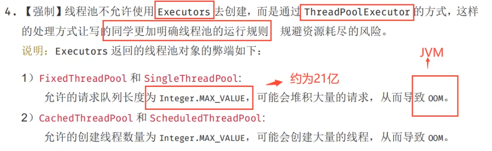

- ```java
  import java.util.concurrent.ExecutorService;
  import java.util.concurrent.Executors;
  
  public class ExecutorsTest1 {
      // Executors 工具类：三大方法
      public static void main(String[] args) {
          // 创建只有一个线程的线程池
  //        ExecutorService service = Executors.newSingleThreadExecutor();
          // 创建有固定大小的线程池
  //        ExecutorService service = Executors.newFixedThreadPool(5);
          // 创建自适应大小的线程池:遇强则强。。。
          ExecutorService service = Executors.newCachedThreadPool();
  
          try {
              for (int i = 0; i < 10; i++) {
                  // 使用了Executors，执行线程的方法也不一样了
                  service.execute(()->{
                      System.out.println(Thread.currentThread().getName()+"执行了...");
                  });
              }
          }catch (Exception e ){
              e.printStackTrace();
          }finally {
              // 程序关闭时，线程池也要关闭！
              service.shutdown();
          }
  ```

      }

  }

```
### 11.2 七大参数

- 看源码分析：

- ```java
public static ExecutorService newSingleThreadExecutor() {
        return new FinalizableDelegatedExecutorService
            (new ThreadPoolExecutor(1, 1,
                                    0L, TimeUnit.MILLISECONDS,
                                    new LinkedBlockingQueue<Runnable>()));
}

public static ExecutorService newFixedThreadPool(int nThreads) {
        return new ThreadPoolExecutor(nThreads, nThreads,
                                      0L, TimeUnit.MILLISECONDS,
                                      new LinkedBlockingQueue<Runnable>());
}

public static ExecutorService newCachedThreadPool() {
    return new ThreadPoolExecutor(0, Integer.MAX_VALUE,
                                  60L, TimeUnit.SECONDS,
                                  new SynchronousQueue<Runnable>());
}

// 可以发现 三大方法的本质都是：ThreadPoolExecutor()
public ThreadPoolExecutor(int corePoolSize, // 核心线程池大小
                          int maximumPoolSize, // 最大线程池大小
                          long keepAliveTime, // 保持连接时间，超时了多少会释放资源
                          TimeUnit unit,// 超时单位
                          BlockingQueue<Runnable> workQueue, // 阻塞队列
                          ThreadFactory threadFactory, // 线程工厂，创建线程的，一般不用懂
                          RejectedExecutionHandler handler) { // 拒绝策略
    if (corePoolSize < 0 ||
        maximumPoolSize <= 0 ||
        maximumPoolSize < corePoolSize ||
        keepAliveTime < 0)
        throw new IllegalArgumentException();
    if (workQueue == null || threadFactory == null || handler == null)
        throw new NullPointerException();
    this.acc = System.getSecurityManager() == null ?
        null :
    AccessController.getContext();
    this.corePoolSize = corePoolSize;
    this.maximumPoolSize = maximumPoolSize;
    this.workQueue = workQueue;
    this.keepAliveTime = unit.toNanos(keepAliveTime);
    this.threadFactory = threadFactory;
    this.handler = handler;
}
```

- 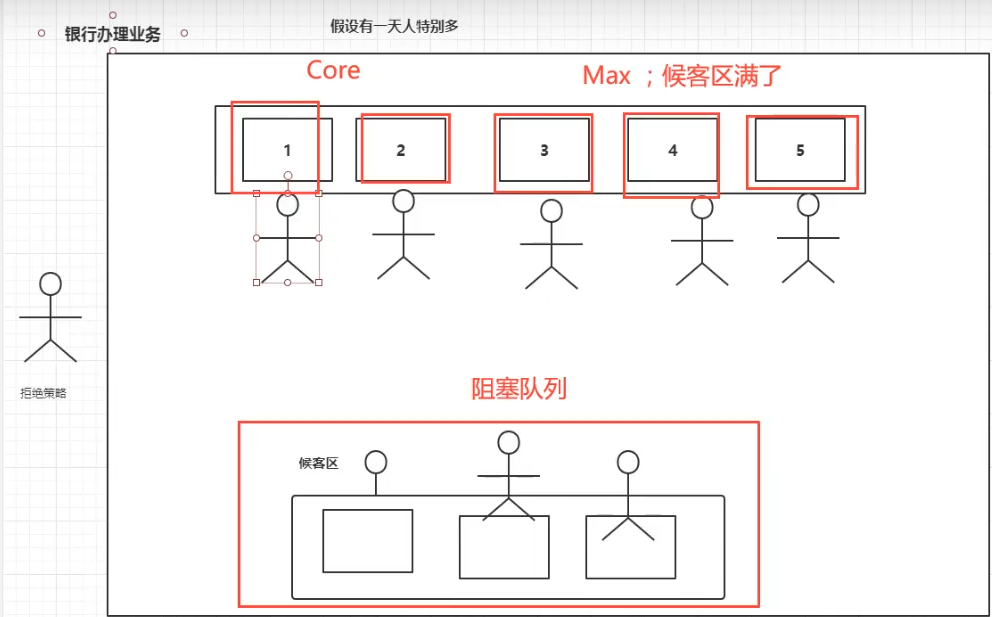

### 11.3 四大拒绝策略

- 四个实现RejectedExecutionHandler接口的类

- 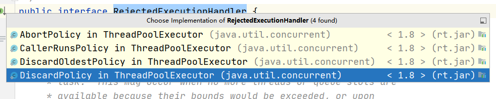

- ```java
  import java.util.concurrent.Executors;
  import java.util.concurrent.LinkedBlockingDeque;
  import java.util.concurrent.ThreadPoolExecutor;
  import java.util.concurrent.TimeUnit;
  
  /*
  new ThreadPoolExecutor.AbortPolicy()// 拒绝策略：阻塞队列满了，还希望调用线程，不处理，并且抛出异常
  new ThreadPoolExecutor.CallerRunsPolicy() // 拒绝策略：阻塞队列满了，哪里来的回哪里去：mian线程发起的，回main线程执行
  new ThreadPoolExecutor.DiscardPolicy() // 拒绝策略：阻塞队列满了，丢掉业务，不会抛出异常
  new ThreadPoolExecutor.DiscardOldestPolicy() // 拒绝策略：阻塞队列满了，尝试和最早开启的线程竞争，如果最早的线程已经回归到线程池，则执行调用，如果没有，则丢掉业务，不抛出异常
   */
  public class ThreadPoolExecutorTest {
      public static void main(String[] args) {
          // 自定义线程池：工作中经常使用！
  
          // 如何定义最大线程数量？
          // 1. CPU密集型：电脑是几核就用几，可以保持CPU的效率最高
          // 2. IO 密集型：判断程序中十分消耗IO的线程，因为IO十分消耗资源，因此一般消耗IO线程的2倍即可
  
          // 获取CPU的核数
          int cpuNum = Runtime.getRuntime().availableProcessors();
          ThreadPoolExecutor threadPoolExecutor = new ThreadPoolExecutor(
                  2,// 核心线程个数：一般只创建两个
                  5,// 最大线程个数：当阻塞队列满了后，会开启到最多5个线程
                  3,// 3秒后无操作会释放该线程资源
                  TimeUnit.SECONDS,// 上一个参数的单位
                  new LinkedBlockingDeque<>(3),// 设置阻塞队列的大小为3
                  new ThreadPoolExecutor.DiscardOldestPolicy() // 拒绝策略：阻塞队列满了，尝试和最早开启的线程竞争，如果最早的线程已经回归到线程池，则执行调用，如果没有，则丢掉业务，不抛出异常
          );
          for (int i = 1; i <= 90; i++) {
              // i<=2 期望创建的线程数<=corePoolSize,只会创建两个线程
              // i<=5 只有两个线程，因为有阻塞队列，没有触发最大线程
              // i<=6 有三个线程了，最大线程被触发了一个
              // i<=7 ...
              // i<=8 已经触发了最大线程的全部线程：5个，再扩大就要看拒绝策略了
              // 所以线程池的最大承载大小是：队列大小+最大线程数
              threadPoolExecutor.execute(()->{
                  System.out.println(Thread.currentThread().getName()+"running");
              });
        }
          threadPoolExecutor.shutdown();
  
      }
  }
  ```

- 小结：
  
  - 选择最大线程数：调优
    - CPU密集型
    - IO密集型

## 12. 四大函数式接口

- lambda表达式、链式编程、函数式接口、Stream流式计算

- 只有一个方法的接口

- ```java
  @FunctionalInterface
  public interface Runnable {
      public abstract void run();
  }
  
  // 可以简化编程模型，在新版本的框架底层大量应用
  // eg:foreach(消费者类的函数式接口)
  ```

> Function函数型接口：
> 
> - 看源码！

```java
import java.util.function.Function;

public class FunctionTest {
    /*
    Function函数型接口：有一个输入参数，有一个输出
    只要是函数式接口，就可以使用lambda简化
     */
    public static void main(String[] args) {
//        Function<String, String> function = new Function<String, String>() {
//            @Override
//            public String apply(String s) {
//                return s + "xxx";
//            }
//        };

        // lambda表达式简化
        Function<String, String> function=(s)->{return s+"xxxx";};
        System.out.println(function.apply("asdd"));
    }
}
```

> Predicate 断定型接口：
> 
> - 看源码

```java
import java.util.function.Predicate;

public class PredicateTest {
    /*
    Predicate 断定型接口：有一个输入参数，返回boolean类型的输出
     */
    public static void main(String[] args) {
        // 判断字符串是否为空
//        Predicate<String> predicate = new Predicate<String>() {
//            @Override
//            public boolean test(String s) {
//                return s.isEmpty();
//            }
//        };

        // lambda表达式简化
        Predicate<String> predicate = s->s.isEmpty();
        System.out.println(predicate.test("xxx"));
        System.out.println(predicate.test(""));

    }
}
```

> Consumer 消费型接口：
> 
> - 看源码

```java
import java.util.function.Consumer;

public class ConsumerTest {
    /*
    Consumner 消费型接口：有一个输入参数，无返回值
     */
    public static void main(String[] args) {
//        Consumer<String> consumer = new Consumer<String>() {
//            @Override
//            public void accept(String o) {
//                System.out.println("消费了："+o);
//            }
//        };

        // 使用lambda表达式简化
        Consumer<String> consumer = (o)->{
            System.out.println("消费了："+o);
        };
        consumer.accept("xxxx");
    }
}
```

> Supplier 供给型接口
> 
> - 看源码

```java
import java.util.function.Supplier;

public class SupllierTest {
    /*
    Supplier 供给型接口：无输入参数，只有返回值
     */
    public static void main(String[] args) {
//        Supplier<String> supplier = new Supplier<String>() {
//            @Override
//            public String get() {
//                return "我生产了...";
//            }
//        };
//
        // 使用lambda简化
        Supplier<String> supplier = ()->{return "我生产了...";};
        System.out.println(supplier.get());
    }
}
```

## 13. Stream流式计算

- 什么是Stream流式计算？

- 大数据：存储+计算
  
  - 存储：集合、MySQL
  - 计算：交给流来做即可

- ```java
  import java.util.Arrays;
  import java.util.List;
  
  public class StreamTest {
      /*
      题目要求:一分钟内完成此题,只能用一行代码实现!
          现在有5个用户!筛选:
              1、ID必须是偶数
              2、年龄必须大于23岁
              3、用户名转为大写字母
              4、用户名字母倒着排序
              5、只输出一个用户!
      */
      public static void main(String[] args) {
          User user1 = new User(1, 21, "a");
          User user2 = new User(2, 22, "b");
          User user3 = new User(3, 23, "c");
          User user4 = new User(4, 24, "d");
          User user5 = new User(6, 25, "e");
  
          // 转换为集合=》存储
          List<User> list = Arrays.asList(user1,user2,user3,user4,user5);
  
          // 开始计算：Stream计算
          list.stream()
                  // 断定型接口=>1、ID必须是偶数
                  .filter(u->{return u.getId()%2==0;})
                  // 2、年龄必须大于23岁
                  .filter(u->{return u.getAge()>23;})
                  // Function 函数型接口=>3.用户名转为大写字母
                  .map(u->{return u.getName().toUpperCase();})
                  // Comparetor接口=>4.用户名字母倒着排序
                  .sorted(((o1, o2) -> {return o2.compareTo(o1);}))
                  //  5、只输出一个用户!
                  .limit(1)
                  // 消费者接口
                  .forEach(u->{
                      System.out.println(u);
                  });
      }
  ```

  }
  class User{
      private int id;
      private int age;
      private String name;

      public User(int id, int age, String name) {
          this.id = id;
          this.age = age;
          this.name = name;
      }
    
      public int getId() {
          return id;
      }
    
      public void setId(int id) {
          this.id = id;
      }
    
      public int getAge() {
          return age;
      }
    
      public void setAge(int age) {
          this.age = age;
      }
    
      public String getName() {
          return name;
      }
    
      public void setName(String name) {
          this.name = name;
      }
    
      @Override
      public String toString() {
          return "User{" +
                  "id=" + id +
                  ", age=" + age +
                  ", name='" + name + '\'' +
                  '}';
      }

  }

```
## 14. ForkJoin

- 建议自行百度or看别人的笔记（未完待续）

- 什么是ForkJoin?
- ForJoin是在JDK1.7发布，并行执行任务！大数据量下：提高效率
- 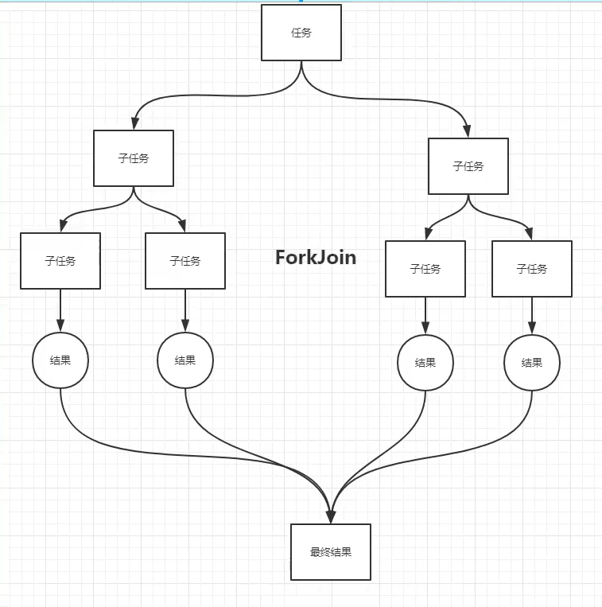
- ForkJoin特点：
- 工作窃取
- 里面维护的都是双端队列
- 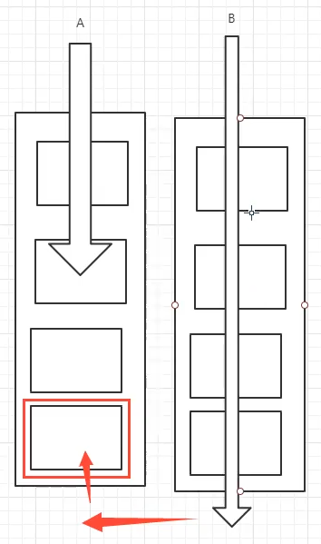

## 15. 异步回调

- Future设计的初衷：对未来的某个事件的结果进行建模

- 看源码+继承关系+代码示例

- ```java
import java.util.concurrent.CompletableFuture;
import java.util.concurrent.ExecutionException;
import java.util.concurrent.TimeUnit;

public class CompletableFutureTest {
    /*
    异步调用：CompletableFuture
        主要就是：
            异步执行
            成功回调
            失败回调
     */
    public static void main(String[] args) throws ExecutionException, InterruptedException {
        // 没有返回值的runAsync异步回调
//        CompletableFuture<Void> voidCompletableFuture = CompletableFuture.runAsync(()->{
//            try {
//                TimeUnit.SECONDS.sleep(2);
//            } catch (InterruptedException e) {
//                e.printStackTrace();
//            }
//            System.out.println(Thread.currentThread().getName()+"这是一个没有返回值的异步调用任务");
//        });
//
//        System.out.println("main");
//        // 获取阻塞执行结果
//        voidCompletableFuture.get();

        // 有返回值的supplyAsync异步回调
        // 类似与ajax，成功和失败的返回
        CompletableFuture<Integer> integerCompletableFuture = CompletableFuture.supplyAsync(() -> {
            System.out.println(Thread.currentThread().getName() + "这是一个有防护值的异步任务");
            int i = 10 / 0;
            return 1024;
        });

        // 获取返回结果
        Integer integer = integerCompletableFuture.whenComplete((t, u) -> { // 当任务完成时返回
            System.out.println("t:" + t);// 正常的返回结果
            System.out.println("u:" + u);// 错误信息
        }).exceptionally((e) -> { // 当执行出错时也返回
            System.out.println(e.getMessage());
            return 233;// 可以获取错误的返回结果，类似于ajax的error code
        }).get();
        System.out.println(integer);


    }

}
```

## 16. JMM

- 也可以看看其他人的解释

- 别人的解释：https://www.cnblogs.com/null-qige/p/9481900.html

- 什么是JMM？
  
  - JMM即为JAVA 内存模型（java memory  model）。因为在不同的硬件生产商和不同的操作系统下，内存的访问逻辑有一定的差异，结果就是当你的代码在某个系统环境下运行良好，并且线程安全，但是换了个系统就出现各种问题。Java内存模型，就是为了屏蔽系统和硬件的差异，让一套代码在不同平台下能到达相同的访问结果。JMM从java 5开始的JSR-133发布后，已经成熟和完善起来。

- 内存划分
  
  - JMM规定了内存主要划分为主内存和工作内存两种。此处的主内存和工作内存跟JVM内存划分（堆、栈、方法区）是在不同的层次上进行的，如果非要对应起来，主内存对应的是Java堆中的对象实例部分，工作内存对应的是栈中的部分区域，从更底层的来说，主内存对应的是硬件的物理内存，工作内存对应的是寄存器和高速缓存。
  
  - 
  
  - JVM在设计时候考虑到，如果JAVA线程每次读取和写入变量都直接操作主内存，对性能影响比较大，所以每条线程拥有各自的工作内存，工作内存中的变量是主内存中的一份拷贝，线程对变量的读取和写入，直接在工作内存中操作，而不能直接去操作主内存中的变量。但是这样就会出现一个问题，当一个线程修改了自己工作内存中变量，对其他线程是不可见的，会导致线程不安全的问题。因为JMM制定了一套标准来保证开发者在编写多线程程序的时候，能够控制什么时候内存会被同步给其他线程。

- 内存交互操作
  
  - 内存交互操作有8种，虚拟机实现必须保证每一个操作都是原子的，不可在分的（对于double和long类型的变量来说，load、store、read和write操作在某些平台上允许例外）
  
  - - lock   （锁定）：作用于主内存的变量，把一个变量标识为线程独占状态
    
    - unlock （解锁）：作用于主内存的变量，它把一个处于锁定状态的变量释放出来，释放后的变量才可以被其他线程锁定
    
    - read  （读取）：作用于主内存变量，它把一个变量的值从主内存传输到线程的工作内存中，以便随后的load动作使用
    
    - load   （载入）：作用于工作内存的变量，它把read操作从主存中变量放入工作内存中
    
    - use   （使用）：作用于工作内存中的变量，它把工作内存中的变量传输给执行引擎，每当虚拟机遇到一个需要使用到变量的值，就会使用到这个指令
    
    - assign （赋值）：作用于工作内存中的变量，它把一个从执行引擎中接受到的值放入工作内存的变量副本中
    
    - store  （存储）：作用于主内存中的变量，它把一个从工作内存中一个变量的值传送到主内存中，以便后续的write使用
    
    - write 　（写入）：作用于主内存中的变量，它把store操作从工作内存中得到的变量的值放入主内存的变量中

- JMM对这八种指令的使用，制定了如下规则：
  
  - - 不允许read和load、store和write操作之一单独出现。即使用了read必须load，使用了store必须write
    - 不允许线程丢弃他最近的assign操作，即工作变量的数据改变了之后，必须告知主存
    - 不允许一个线程将没有assign的数据从工作内存同步回主内存
    - 一个新的变量必须在主内存中诞生，不允许工作内存直接使用一个未被初始化的变量。就是怼变量实施use、store操作之前，必须经过assign和load操作
    - 一个变量同一时间只有一个线程能对其进行lock。多次lock后，必须执行相同次数的unlock才能解锁
    - 如果对一个变量进行lock操作，会清空所有工作内存中此变量的值，在执行引擎使用这个变量前，必须重新load或assign操作初始化变量的值
    - 如果一个变量没有被lock，就不能对其进行unlock操作。也不能unlock一个被其他线程锁住的变量
    - 对一个变量进行unlock操作之前，必须把此变量同步回主内存

- Volatile是什么？
  
  - 是Java虚拟机提供的**轻量级同步机制**
  - 特点：
    - 保证可见性
    - **不保证原子性**
    - 禁止指令重排

- 什么是JMM？
  
  - Java内存模型，不存在的东西，概念，约定

- **关于JMM的一些同步约定：**
  
  - 线程解锁前：必须把共享变量**立刻**刷回主存
  - 线程加锁前：必须读取主存中的最新值到工作内存中！
  - 加锁和解锁是同一把锁

- 主要是：线程、工作内存、主内存中的约定！

- 八种操作
  
  - 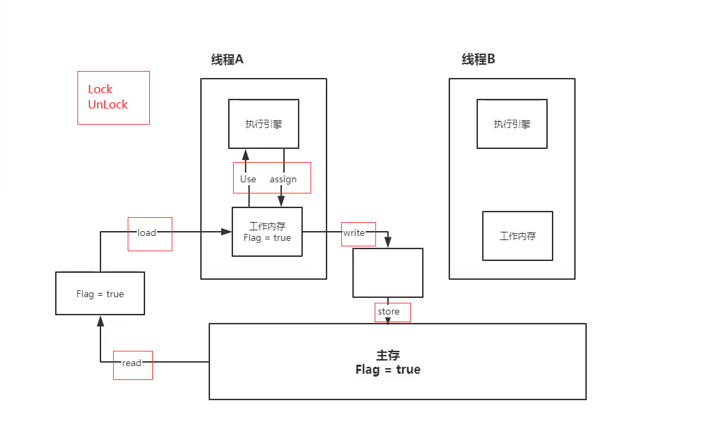
  - 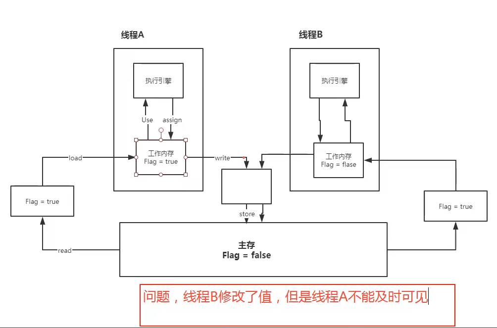

- 问题实例

- ```java
  import java.sql.Time;
  import java.util.concurrent.TimeUnit;
  
  public class JMMTest1 {
      private static int num=0;
      public static void main(String[] args) {
          new Thread(()->{
              while(num==0){
  
              }
          }).start();
  
          try {
              TimeUnit.SECONDS.sleep(1);
          } catch (InterruptedException e) {
              e.printStackTrace();
          }
  
          num=1;
          System.out.println(num);
      }
  }
  ```

- 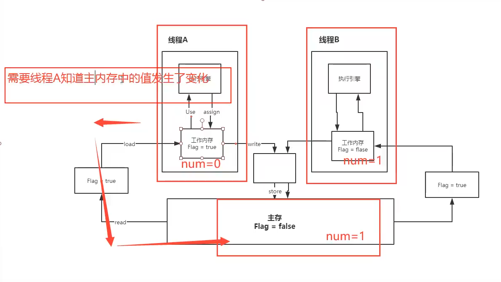

- 目前的问题：程序不知道当前的值已经被修改过了！

## 17. volatile

- > 保证可见性

- ```java
  import java.sql.Time;
  import java.util.concurrent.TimeUnit;
  
  public class JMMTest1 {
      // 加了volatile，可以保证num的可见性
      private volatile static int num=0;
      public static void main(String[] args) {
          new Thread(()->{
              while(num==0){ // 线程1对主内存的变化不可见
                  System.out.println("num:"+num);
              }
          }).start();
  
          try {
              TimeUnit.SECONDS.sleep(1);
          } catch (InterruptedException e) {
              e.printStackTrace();
          }
  
          num=1;
          System.out.println(num);
      }
  }
  ```

- > 不保证原子性
  
  - 原子性：不可分割

- ```java
  public class AotumicTest {
      // volatile不保证原子性
      private volatile static int num = 0;
      public static void add(){
          num++;
      }
  
      public static void main(String[] args) {
  
          // 理论上num的结果应该为2万
          for (int i = 0; i < 20; i++) {
              new Thread(()->{
                  for (int j = 0; j < 1000; j++) {
                      add();
                  }
              }).start();
          }
  
          // 判断线程是否执行完成
          // 2: main gc
          while(Thread.activeCount()>2){
              Thread.yield();
          }
  
          System.out.println(Thread.currentThread().getName()+"=>"+num);
      }
  }
  ```

- 如果不加lock和synchronized怎么保证原子性？
  
  - num++不是原子性操作！
  - 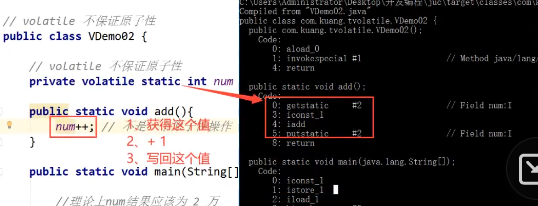
  - 使用原子类来保证原子性！

- ```java
  import java.util.concurrent.atomic.AtomicInteger;
  
  public class AotumicTest {
      // volatile不保证原子性
      // 使用原子类的Integer
      private volatile static AtomicInteger num = new AtomicInteger();
      public static void add(){
  //        num++;
          num.getAndIncrement(); // AtomicInteger的加一方法 CAS实现！
      }
  
      public static void main(String[] args) {
  
          // 理论上num的结果应该为2万
          for (int i = 0; i < 20; i++) {
              new Thread(()->{
                  for (int j = 0; j < 1000; j++) {
                      add();
                  }
              }).start();
          }
  
          // 判断线程是否执行完成
          // 2: main gc
          while(Thread.activeCount()>2){
              Thread.yield();
          }
  
          System.out.println(Thread.currentThread().getName()+"=>"+num);
      }
  }
  ```

- 原子类为什么这么高级？
  
  - 这些类的底层都直接和操作系统相关，十分高效，在内存种修改值！Unsafe类是一个很特殊的存在

- > 禁止指令重排

- 什么是指令重排？
  
  - 你写的程序，计算机并不是按照你写的顺序去执行的！
  
  - 源代码-》编译器优化的重排=》指令并行也有可能重排=》内存系统也会重排=》执行
  
  - 处理器在处理指令重排的时候，需要考虑：数据之间的依赖性
  
  - 否则容易出现以下结果：
  
  - ```java
    // a,b,x,y默认都是0
    // 线程A                线程B
    // x=a                 y=b
    // b=1                 a=2
    // 正常输出：x=0,y=0，但是由于指令重排，可能会出现
    // 线程A                线程B
    // b=1                 a=2
    // x=a                 y=b
    // 指令重排导致诡异的结果：x=2,y=1
    ```

- volatile怎么避免指令重排？
  
  - 内存屏障==CPU指令的作用：
    - 保证特定操作的执行顺序
    - 保证某些变量的内存可见性

- volatile在哪里用的多？
  
  - 单例模式！

## 18.单例模式

- ```java
  public class Hungry {
      // 饿汉式单例==>问题：可能会浪费空间
  
      private byte[] data1 = new byte[1024*1024];
      private byte[] data2 = new byte[1024*1024];
      private byte[] data3 = new byte[1024*1024];
  
      // 构造器私有，确保其他不能new这个对象
      private Hungry(){
  
      }
  
      private final static Hungry HUNGRY = new Hungry();
  
      public static Hungry getInstance(){
          return HUNGRY;
      }
  }
  ```

- ```java
  public class LazyMan {
      // 懒汉式单例：使用时才创建
  
      private LazyMan(){
          System.out.println(Thread.currentThread().getName()+"实例化了LazyMan()");
      }
  
      private volatile static LazyMan lazyMan;
  
      // 单线程下没问题，多线程下有问题
      // 解决：加锁
  //    public static LazyMan getInstance(){
  //        if(lazyMan==null){
  //            lazyMan=new LazyMan();
  //        }
  //        return lazyMan;
  //    }
  
      // 加锁，两次判断：双重检测锁模式的懒汉式单例，DCL懒汉式
      // 但是还是可能会存在问题：因为new LazyMan不是原子性操作
  //    public static LazyMan getInstance(){
  //
  //        if(lazyMan==null){
  //            synchronized (LazyMan.class) {
  //                if(lazyMan==null){
  //                    lazyMan = new LazyMan();
  //                    /**
  //                     * 1.分配内存空间
  //                     * 2.执行构造方法，初始化对象
  //                     * 3.把这个对指向这个空间
  //                     *
  //                     * 指令重排！！！
  //                     * 132 线程AA
  //                     *此时线程B会直接return ，但是lazyMan还没有完成构造(2步骤)
  //                     */
  //                }
  //            }
  //        }
  //        return lazyMan;
  //    }
  
      // 防止指令重排+原子性,在lazyMan中添加volatile
      public static LazyMan getInstance(){
  
          if(lazyMan==null){
              synchronized (LazyMan.class) {
                  if(lazyMan==null){
                      lazyMan = new LazyMan();
                      /**
                       * 1.分配内存空间
                       * 2.执行构造方法，初始化对象
                       * 3.把这个对指向这个空间
                       *
                       * 指令重排！！！
                       * 132 线程AA
                       *此时线程B会直接return ，但是lazyMan还没有完成构造(2步骤)
                       */
                  }
              }
          }
          return lazyMan;
      }
  
      public static void main(String[] args) {
          for (int i = 0; i < 20; i++) {
              new Thread(()->{
                  LazyMan.getInstance();
              }).start();
          }
      }
  }
  ```

- ```java
  public class Holder {
      // 静态内部类-单例模式
      private Holder(){
  
      }
      public static class InnerClass{
          private static final Holder HOLDER=new Holder();
      }
      public static Holder getInstance(){
          return InnerClass.HOLDER;
      }
  }
  ```

- 反射破坏DCL单例

- ```java
  import java.lang.reflect.Constructor;
  import java.lang.reflect.InvocationTargetException;
  
  public class LazyManRecf {
      // 懒汉式单例：使用时才创建
  
      private LazyManRecf(){
          System.out.println(Thread.currentThread().getName()+"实例化了LazyMan()");
      }
  
      private volatile static LazyManRecf lazyMan;
  
      // 防止指令重排+原子性,在lazyMan中添加volatile
      public static LazyManRecf getInstance(){
  
          if(lazyMan==null){
              synchronized (LazyManRecf.class) {
                  if(lazyMan==null){
                      lazyMan = new LazyManRecf();
                      /**
                       * 1.分配内存空间
                       * 2.执行构造方法，初始化对象
                       * 3.把这个对指向这个空间
                       *
                       * 指令重排！！！
                       * 132 线程AA
                       *此时线程B会直接return ，但是lazyMan还没有完成构造(2步骤)
                       */
                  }
              }
          }
          return lazyMan;
      }
  
      public static void main(String[] args) throws NoSuchMethodException, IllegalAccessException, InvocationTargetException, InstantiationException {
          // 反射破解单例模式
          LazyManRecf instance = LazyManRecf.getInstance();
          Constructor<LazyManRecf> declaredConstructor = LazyManRecf.class.getDeclaredConstructor(null);
          // 无视私有构造器
          declaredConstructor.setAccessible(true);
          // 反射创建对象
          LazyMan instance2 = declaredConstructor.newInstance();
  
          System.out.println(instance);
          System.out.println(instance2);
  
      }
  }
  ```

- ```java
  import java.lang.reflect.Constructor;
  import java.lang.reflect.InvocationTargetException;
  
  public class LazyManRecf {
      // 懒汉式单例：使用时才创建
  
      // 一共三层检测防止单例被反射破解
      private LazyManRecf(){
          synchronized (LazyMan.class){
              if(lazyMan!=null){
                  throw new RuntimeException("不要试图使用反射来破坏异常");
              }
          }
  //        System.out.println(Thread.currentThread().getName()+"实例化了LazyMan()");
      }
  
      private volatile static LazyManRecf lazyMan;
  
      // 防止指令重排+原子性,在lazyMan中添加volatile
      public static LazyManRecf getInstance(){
  
          if(lazyMan==null){
              synchronized (LazyManRecf.class) {
                  if(lazyMan==null){
                      lazyMan = new LazyManRecf();
                      /**
                       * 1.分配内存空间
                       * 2.执行构造方法，初始化对象
                       * 3.把这个对指向这个空间
                       *
                       * 指令重排！！！
                       * 132 线程AA
                       *此时线程B会直接return ，但是lazyMan还没有完成构造(2步骤)
                       */
                  }
              }
          }
          return lazyMan;
      }
  
      public static void main(String[] args) throws NoSuchMethodException, IllegalAccessException, InvocationTargetException, InstantiationException {
          // 反射破解单例模式
          LazyManRecf instance = LazyManRecf.getInstance();
          Constructor<LazyManRecf> declaredConstructor = LazyManRecf.class.getDeclaredConstructor(null);
          // 无视私有构造器
          declaredConstructor.setAccessible(true);
          // 反射创建对象
          LazyManRecf instance2 = declaredConstructor.newInstance();
  
          System.out.println(instance);
          System.out.println(instance2);
  
      }
  }
  ```

- 再使用反射破解三层检测的懒汉式单例

- ```java
  import java.lang.reflect.Constructor;
  import java.lang.reflect.InvocationTargetException;
  
  public class LazyManRecf {
      // 懒汉式单例：使用时才创建
  
      private LazyManRecf(){
          synchronized (LazyMan.class){
              if(lazyMan!=null){
                  throw new RuntimeException("不要试图使用反射来破坏异常");
              }
          }
  //        System.out.println(Thread.currentThread().getName()+"实例化了LazyMan()");
      }
  
      private volatile static LazyManRecf lazyMan;
  
      // 防止指令重排+原子性,在lazyMan中添加volatile
      public static LazyManRecf getInstance(){
  
          if(lazyMan==null){
              synchronized (LazyManRecf.class) {
                  if(lazyMan==null){
                      lazyMan = new LazyManRecf();
                      /**
                       * 1.分配内存空间
                       * 2.执行构造方法，初始化对象
                       * 3.把这个对指向这个空间
                       *
                       * 指令重排！！！
                       * 132 线程AA
                       *此时线程B会直接return ，但是lazyMan还没有完成构造(2步骤)
                       */
                  }
              }
          }
          return lazyMan;
      }
  
      public static void main(String[] args) throws NoSuchMethodException, IllegalAccessException, InvocationTargetException, InstantiationException {
          // 反射破解单例模式
  //        LazyManRecf instance = LazyManRecf.getInstance();
          Constructor<LazyManRecf> declaredConstructor = LazyManRecf.class.getDeclaredConstructor(null);
          // 无视私有构造器
          declaredConstructor.setAccessible(true);
          // 反射创建对象
  
          // 使用反射去创建对象，一样破坏了三层检测的懒汉式单例
          LazyManRecf instance = declaredConstructor.newInstance();
          LazyManRecf instance2 = declaredConstructor.newInstance();
  
          System.out.println(instance);
          System.out.println(instance2);
  
      }
  }
  ```

- ```java
  import java.lang.reflect.Constructor;
  import java.lang.reflect.InvocationTargetException;
  
  public class LazyManRecf {
      // 懒汉式单例：使用时才创建
  
      // 使用一个标志位来确保反射不会破解三层单例
      private static boolean xx = false;
  
      private LazyManRecf(){
          synchronized (LazyMan.class){
              if(xx==false){
                  xx=true;
              }else{
                  throw new RuntimeException("不要试图使用反射来破坏异常");
              }
  
          }
  //        System.out.println(Thread.currentThread().getName()+"实例化了LazyMan()");
      }
  
      private volatile static LazyManRecf lazyMan;
  
      // 防止指令重排+原子性,在lazyMan中添加volatile
      public static LazyManRecf getInstance(){
  
          if(lazyMan==null){
              synchronized (LazyManRecf.class) {
                  if(lazyMan==null){
                      lazyMan = new LazyManRecf();
                      /**
                       * 1.分配内存空间
                       * 2.执行构造方法，初始化对象
                       * 3.把这个对指向这个空间
                       *
                       * 指令重排！！！
                       * 132 线程AA
                       *此时线程B会直接return ，但是lazyMan还没有完成构造(2步骤)
                       */
                  }
              }
          }
          return lazyMan;
      }
  
      public static void main(String[] args) throws NoSuchMethodException, IllegalAccessException, InvocationTargetException, InstantiationException {
          // 反射破解单例模式
  //        LazyManRecf instance = LazyManRecf.getInstance();
          Constructor<LazyManRecf> declaredConstructor = LazyManRecf.class.getDeclaredConstructor(null);
          // 无视私有构造器
          declaredConstructor.setAccessible(true);
          // 反射创建对象
  
          LazyManRecf instance = declaredConstructor.newInstance();
          LazyManRecf instance2 = declaredConstructor.newInstance();
  
          System.out.println(instance);
          System.out.println(instance2);
  
      }
  }
  ```

- 再使用反射破坏三层检测+标志位的懒汉式单例

- ```java
  import java.lang.reflect.Constructor;
  import java.lang.reflect.Field;
  import java.lang.reflect.InvocationTargetException;
  
  public class LazyManRecf {
      // 懒汉式单例：使用时才创建
  
      // 使用一个标志位来确保反射不会破解三层单例=》
      // 但是如果已经知道了这个标志位，则依旧可以使用反射去破坏单例！
  
      private static boolean xx = false;
      private LazyManRecf(){
          synchronized (LazyMan.class){
              if(xx==false){
                  xx=true;
              }else{
                  throw new RuntimeException("不要试图使用反射来破坏异常");
              }
  
          }
  //        System.out.println(Thread.currentThread().getName()+"实例化了LazyMan()");
      }
  
      private volatile static LazyManRecf lazyMan;
  
      // 防止指令重排+原子性,在lazyMan中添加volatile
      public static LazyManRecf getInstance(){
  
          if(lazyMan==null){
              synchronized (LazyManRecf.class) {
                  if(lazyMan==null){
                      lazyMan = new LazyManRecf();
                      /**
                       * 1.分配内存空间
                       * 2.执行构造方法，初始化对象
                       * 3.把这个对指向这个空间
                       *
                       * 指令重排！！！
                       * 132 线程AA
                       *此时线程B会直接return ，但是lazyMan还没有完成构造(2步骤)
                       */
                  }
              }
          }
          return lazyMan;
      }
  
      public static void main(String[] args) throws Exception, IllegalAccessException, InvocationTargetException, InstantiationException {
          // 反射破解单例模式
  //        LazyManRecf instance = LazyManRecf.getInstance();
  
          // 破坏有标志位的三层检测的单例
          Field xx = LazyManRecf.class.getDeclaredField("xx");
          xx.setAccessible(true);
          Constructor<LazyManRecf> declaredConstructor = LazyManRecf.class.getDeclaredConstructor(null);
          // 无视私有构造器
          declaredConstructor.setAccessible(true);
          // 反射创建对象
  
          // 使用反射去创建对象，破坏加标志位的三层检测的懒汉式单例
          LazyManRecf instance = declaredConstructor.newInstance();
          xx.set(instance,false);
  
          LazyManRecf instance2 = declaredConstructor.newInstance();
  
          System.out.println(instance);
          System.out.println(instance2);
  
      }
  }
  ```

- 真正防止反射破解：使用枚举类！

- ```java
  import java.lang.reflect.Constructor;
  
  public enum  EnumSingle {
      // 枚举是什么？本身也是一个类
      INSTANCE;
      public EnumSingle getInstance(){
          return INSTANCE;
      }
  }
  
  class EnumSingleTest{
      public static void main(String[] args) throws Exception {
          EnumSingle instance = EnumSingle.INSTANCE;
          // 反射获取类，尝试使用反射破解单例
  //        Constructor<EnumSingle> declaredConstructor = EnumSingle.class.getDeclaredConstructor(null);
  //        declaredConstructor.setAccessible(true);
  //
  //        EnumSingle instance2 = declaredConstructor.newInstance();
  //        // java.lang.NoSuchMethodException: EnumSingle.<init>()
  //        // 报没有这个空参的构造方法？？使用javap -p反编译.class结果明明有这个空参构造器呀？
  //        // 工具不行，用另一个jad反编译，发现真的没有空参构造方法，但是有一个有参的，
  //        // 再次尝试使用反射破解
  //        System.out.println(instance);
  //        System.out.println(instance2);
          Constructor<EnumSingle> declaredConstructor = EnumSingle.class.getDeclaredConstructor(String.class,int.class);
          declaredConstructor.setAccessible(true);
  
          EnumSingle instance2 = declaredConstructor.newInstance();
          // 报错：Cannot reflectively create enum object
          //至此，反射确实不能破坏枚举类型的单例模式！
          System.out.println(instance);
          System.out.println(instance2);
  ```

      }

  }

```
## 19. 深入理解CAS

- 什么是CAS？

- Compare And Set

- 什么是unsafe类：

- Java可以通过这个类来操作内存！

- 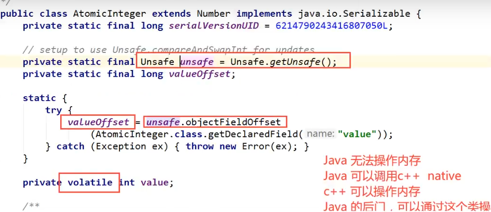

- 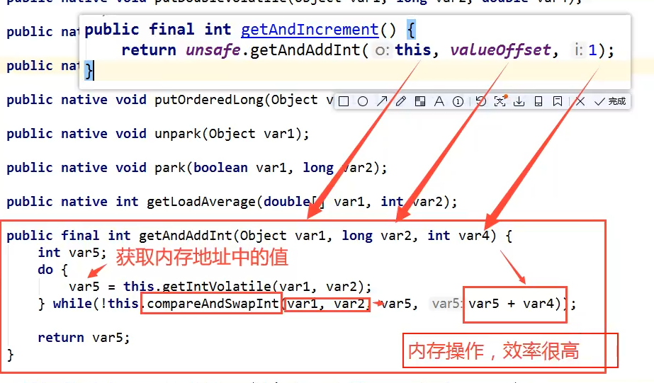

- 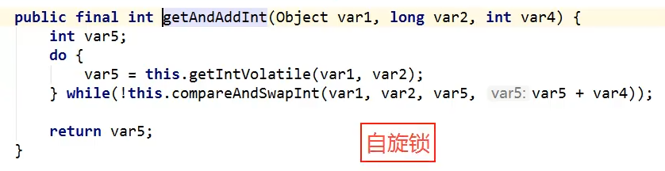

- ```java
  import java.util.concurrent.atomic.AtomicInteger;

  public class CASTest1 {
      // CAS :compareAndSet=》是CPU的并发原语
      public static void main(String[] args) {
          AtomicInteger atomicInteger = new AtomicInteger(2020);
          //  public final boolean compareAndSet(int expect, int update)
          // 期望，更新
          // 如果是期望的值，则更新为更新的值，否则不更新！
          System.out.println(atomicInteger.compareAndSet(2020, 2021));
          System.out.println(atomicInteger.get());

          atomicInteger.getAndIncrement();

          // 此时修改失败
          System.out.println(atomicInteger.compareAndSet(2020, 2021));
          System.out.println(atomicInteger.get());
      }
  }

  ```

- CAS：

- 比较当前工作内存中的值和主内存中的值，
  - 如果这个值是期望的，则执行操作
  - 如果不是，则一直循环

- 缺点：

- 循环会耗时
- 一次性只能保证一个共享变量的原子性
- 会存在ABA问题

- ABA问题？

## 20. ABA问题

- 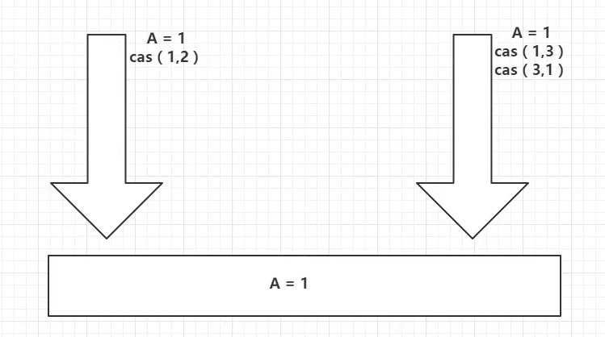

- ```java
import java.util.concurrent.atomic.AtomicInteger;

public class CASTest2 {
    // CAS :compareAndSet=》是CPU的并发原语
    public static void main(String[] args) {
        AtomicInteger atomicInteger = new AtomicInteger(2020);
        // MySQL中如何解决：乐观锁！
        // 期望，更新
        // 如果是期望的值，则更新为更新的值，否则不更新！
        // 捣乱的线程=====================
        System.out.println(atomicInteger.compareAndSet(2020, 2021));
        System.out.println(atomicInteger.get());
        System.out.println(atomicInteger.compareAndSet(2021, 2020));
        System.out.println(atomicInteger.get());

        // 期望的线程=====================
        System.out.println(atomicInteger.compareAndSet(2020, 6666));
        System.out.println(atomicInteger.get());
    }
}
```

- 如何解决？
  
  - 带版本号的原子操作 =》原子引用

## 20. 原子引用

- 解决ABA问题

- 使用原子引用=》对应的思想：乐观锁

- ```java
  import java.util.concurrent.TimeUnit;
  import java.util.concurrent.atomic.AtomicInteger;
  import java.util.concurrent.atomic.AtomicStampedReference;
  
  public class CASTest3 {
      // CAS :compareAndSet=》是CPU的并发原语
      public static void main(String[] args) {
          AtomicStampedReference<Integer> integerAtomicStampedReference = new AtomicStampedReference<>(1, 1);
  
          new Thread(
                  ()->{
                   int stamp = integerAtomicStampedReference.getStamp();// 获得版本号
                      System.out.println("A：开始的版本号为："+stamp);
                      try {
                          TimeUnit.SECONDS.sleep(1);
                      } catch (InterruptedException e) {
                          e.printStackTrace();
                      }
  
                      boolean b = integerAtomicStampedReference.compareAndSet(1, 2, integerAtomicStampedReference.getStamp(), integerAtomicStampedReference.getStamp() + 1);
                      System.out.println("A：将1改为2成功？"+b);
                      System.out.println("A：将1改为2后，版本号为："+integerAtomicStampedReference.getStamp());
  
                      boolean b1 = integerAtomicStampedReference.compareAndSet(2, 1, integerAtomicStampedReference.getStamp(), integerAtomicStampedReference.getStamp() + 1);
                      System.out.println("A：将2改为1后，版本号为："+integerAtomicStampedReference.getStamp());
                      System.out.println("A：将2改为1成功？"+b1);
                  }
          ,"A").start();
  ```

          new Thread(
                  ()->{
                      int stamp = integerAtomicStampedReference.getStamp();// 获得版本号
                      System.out.println("B：开始的版本号为："+stamp);
                      boolean b = integerAtomicStampedReference.compareAndSet(1, 666, stamp, stamp + 1);
                      System.out.println("B：将1改为666后，版本号为："+integerAtomicStampedReference.getStamp());
                      System.out.println("B：将1改为666成功？"+b);
                  }
                  ,"B").start();
      }

  }

```
- 注意：
- 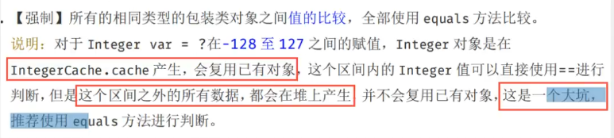
- Integer使用了对象缓存机制，默认范围是-128-127，推荐使用静态工厂方法valueOf来获取对象实例，而不是new，因为valueOf使用缓存，而new一定会创建新的对象分配内存空间

## 21. 各种锁

### 21.1 公平锁、非公平锁

- 公平锁：非常公平，不能插队，必须先来后到

- 非公平锁：非常不公平，可以插队（默认都是非公平的。因为两个任务 3h 3s的处理）

- ```java
// 看ReentrantLock()的源码
// 设置非公平锁
Lock lock = new ReentrantLock();
// 设置公平锁
Lock lock = new ReentrantLock(true);
```

### 21.2 可重入锁

- 可重入锁==递归锁
  
  - 是指拿到了外面的锁之后，也就意味着拿到了里面的锁（自动获得 ）

- 代码实例

- ```java
  // 传统的synchronized
  public class ReentrantLockDemo1 {
      public static void main(String[] args) {
          Phone1 phone1 = new Phone1();
          new Thread(()->{
              phone1.sms();
          },"A").start();
  
          new Thread(()->{
              phone1.sms();
          },"B").start();
      }
  }
  ```

  class Phone1{
      public synchronized void sms(){
          System.out.println(Thread.currentThread().getName()+"sms");
          call();
      }
      public synchronized void call(){
          System.out.println(Thread.currentThread().getName()+"call");
      }
  }

```
- ```java
import java.util.concurrent.locks.Lock;
import java.util.concurrent.locks.ReentrantLock;

// lock锁
public class ReentrantLockDemo2 {
    public static void main(String[] args) {
        Phone6 phone1 = new Phone6();
        new Thread(()->{
            phone1.sms();
        },"A").start();

        new Thread(()->{
            phone1.sms();
        },"B").start();
    }
}


class Phone6{
    Lock lock =new ReentrantLock();
    public  void sms(){
        lock.lock(); // 细节问题：lock.lock()，lock.unlock();// lock必须配对，不然会存在死锁问题
        lock.lock();
        try{
            System.out.println(Thread.currentThread().getName()+"sms");
            call();
        }catch (Exception e){
            e.getMessage();
        }finally {
            lock.unlock();
            lock.unlock();

        }

    }
    public void call(){

        lock.lock();
        try{
            System.out.println(Thread.currentThread().getName()+"call");
        }catch (Exception e){
            e.getMessage();
        }finally {
            lock.unlock();
        }

    }
}
```

### 21.3 自旋锁(SpinLock)

- ```java
  // AtomicInteger.java下的
   public final int getAndIncrement() {
          return unsafe.getAndAddInt(this, valueOffset, 1);
  }
  
  public final int getAndAddInt(Object var1, long var2, int var4) {
          int var5;
          do {
              var5 = this.getIntVolatile(var1, var2);
          } while(!this.compareAndSwapInt(var1, var2, var5, var5 + var4));
  
          return var5;
      }
  ```

- ```java
  import java.util.concurrent.TimeUnit;
  import java.util.concurrent.atomic.AtomicReference;
  
  public class SpinLockTest {
      // 自定义自旋锁
      // 基本数据类型：默认是..
      // 引用类型：默认是null
      // 初始为null
      AtomicReference<Thread> atomicReference =new AtomicReference<>();
  
      // 加锁
      public void myLock(){
          Thread thread = Thread.currentThread();
          System.out.println(Thread.currentThread().getName()+"==>mylock");
          // 自旋锁
          // 如果期待的线程是null，则更新为thread，返回true，跳出循环
          // 如果期待的线程不是null，则不更新，返回flase,进行循环判断
          while(!atomicReference.compareAndSet(null,thread)){
              System.out.println(Thread.currentThread().getName()+"自旋等待获得锁");
          }
          System.out.println(Thread.currentThread().getName()+"获得锁");
      }
  
      // 解锁
      public void myUnLock(){
          Thread thread = Thread.currentThread();
          System.out.println(Thread.currentThread().getName()+"==>myUnlock");
          atomicReference.compareAndSet(thread,null);
      }
  
      public static void main(String[] args) {
          // 测试自己写的自旋锁
          SpinLockTest spinLockTest = new SpinLockTest();
          new Thread(
                  ()->{
                      spinLockTest.myLock();
                      try {
                          TimeUnit.SECONDS.sleep(1);
                      }catch (Exception e){
                          e.getMessage();
                      }finally {
                          spinLockTest.myUnLock();
                      }
                  },"T1"
          ).start();
  
  //        try {
  //            TimeUnit.SECONDS.sleep(3);
  //        }catch (Exception e){
  //            e.getMessage();
  //        }
  
          new Thread(
                  ()->{
                      spinLockTest.myLock();
                      try {
                          TimeUnit.SECONDS.sleep(3);
                      }catch (Exception e){
                          e.getMessage();
                      }finally {
                          spinLockTest.myUnLock();
                      }
                  },"T2"
          ).start();
  ```

      }

  }

```
### 21.4 死锁

- 死锁是什么？

- 两者共同争取同一资源

- ```java
import java.util.concurrent.TimeUnit;

public class DeadLockTest {
    public static void main(String[] args) {
        String lockA = "lockA";
        String lockB = "lockB";

        new Thread(new MyThread1(lockA,lockB),"A").start();
        new Thread(new MyThread1(lockB,lockA),"B").start();
    }
}

class MyThread1 implements Runnable{
    private String lockA;
    private String lockB;

    public MyThread1(String lockA, String lockB) {
        this.lockA = lockA;
        this.lockB = lockB;
    }

    @Override
    public void run() {
        synchronized (lockA){
            System.out.println(Thread.currentThread().getName()+"锁住了"+lockA+"继续想要获取"+lockB);
            try {
                TimeUnit.SECONDS.sleep(1);
            } catch (InterruptedException e) {
                e.printStackTrace();
            }
            synchronized (lockB){
                System.out.println(Thread.currentThread().getName()+"锁住了"+lockB);

            }
        }
    }
}
```

- 如何解决死锁？
  
  - 使用 jps -l 定位进程ID
  - 使用 jstack 进程ID 打印堆栈信息，找到死锁问题
