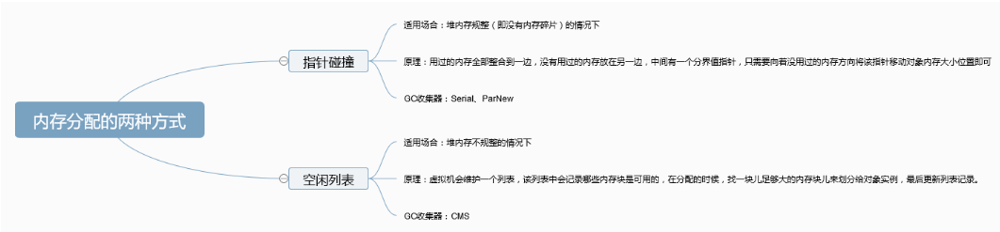

# JVM问答

- 主要参考自：https://snailclimb.gitee.io/javaguide-interview/#/./docs/b-4jvm

## 1.Java 内存区域

- JVM在执行Java程序的过程中会将它管理的内存划分为若干个不同的数据区域：
- 
- ​    
- 线程私有：程序计数器、虚拟机栈、本地方法栈
- 线程共享：堆、方法区、直接内存

### 1.1 程序计数器

- 程序计数器是一块较小的内存空间，可以看作是当前线程所执行的字节码的行号指示器。**字节码解释器工作时通过改变这个计数器的值来选取下一条需要执行的字节码指令，分支、循环、跳转、异常处理、线程恢复等功能都需要依赖这个计数器来完成。**
- 为什么程序计数器是私有的？
  - 为了线程切换后能够恢复到正确的执行位置，每条线程都需要一个独立的程序计数器，各线程之间计数器应该互不影响，独立存储
- 主要作用：存放字节码指令，告诉执行引擎下一条将要执行的语句！
  - 字节码解释器(执行引擎)通过改变程序计数器来依次读取指令，从而实现对代码流程的控制
  - 在多线程的情况下，程序计数器用于记录当前线程执行的位置，从而当线程被切换回来的时候能够知道该线程上次运行到哪了？
- **注意：程序计数器是唯一一个不会出现 `OutOfMemoryError` 的内存区域，它的生命周期随着线程的创建而创建，随着线程的结束而死亡。**

### 1.2 Java虚拟机栈

- **Java 虚拟机栈也是线程私有的，它的生命周期和线程相同，描述的是 Java 方法执行的内存模型，每次方法调用的数据都是通过栈传递的。**
- **Java 内存可以粗糙的区分为堆内存（Heap）和栈内存 (Stack),其中栈就是现在说的虚拟机栈，或者说是虚拟机栈中局部变量表部分。**
- Java虚拟机栈：
  - 由栈帧构成，每一个栈帧就对应一个方法
  - 每个栈帧：局部变量表、操作数栈、方法返回地址、动态链接和一些附加信息
- **局部变量表主要存放了编译期可知的各种数据类型**
  - （boolean、byte、char、short、int、float、long、double）、
  - **对象引用**（reference 类型，它不同于对象本身，可能是一个指向对象起始地址的引用指针，也可能是指向一个代表对象的句柄或其他与此对象相关的位置）。
- Java虚拟机栈可能会出现两种错误：**`StackOverFlowError` 和 `OutOfMemoryError`。**？？？未完待续
  - **`StackOverFlowError`：** 若 Java 虚拟机栈的内存大小不允许动态扩展，那么当线程请求栈的深度超过当前 Java 虚拟机栈的最大深度的时候，就抛出 StackOverFlowError 错误。
  - **`OutOfMemoryError`：** 若 Java 虚拟机堆中没有空闲内存，并且垃圾回收器也无法提供更多内存的话。如果虚拟机在扩展栈时无法申请到足够的内存空间，则抛出OutOfMemoryError异常。
- Java 虚拟机栈也是线程私有的，每个线程都有各自的 Java 虚拟机栈，而且随着线程的创建而创建，随着线程的死亡而死亡。
- 方法/函数如何调用？
  - 每一次函数调用都会有一个对应的栈帧被压入Java栈，每一个函数调用结束后，都会有一个栈帧被弹出

### 1.3 本地方法栈

- Java虚拟机栈为虚拟机执行Java方法服务(也就是为字节码服务)
- 本地方法栈则是为虚拟机使用到的Native方法服务(也就是为c++、c)
- HotSpot虚拟机中Java虚拟机栈和本地方法栈是一起的
- 本地方法被执行的时候，在本地方法栈也会创建一个栈帧，用于存放该本地方法的局部变量表、操作数栈、动态链接、出口信息。
- 方法执行完毕后相应的栈帧也会出栈并释放内存空间，也会出现 `StackOverFlowError` 和 `OutOfMemoryError` 两种错误。

### 1.4 堆

- Java虚拟机所管理的内存中的最大的一块，Java堆是所有线程共享的一块区域
- 在JVM启动的时候就会被创建，**此内存区域的唯一目的就是存放对象实例，几乎所有的对象实例以及数组都在这里分配内存。**
- 为什么是几乎？
  - 因为随着JIT编译器和逃逸分析技术的成熟
  - 栈上分配、标量替换将导致对象实例可以在栈中存储
    - **如果某些方法中的对象引用没有被返回或者未被外面使用（也就是未逃逸出去），那么对象可以直接在栈上分配内存。**
- Java堆是垃圾收集器管理的主要区域，因此也被称作**GC 堆（Garbage Collected Heap）**.
- 从垃圾回收的角度，由于现在大部分垃圾收集器基本都采用分代垃圾收集算法，所以Java堆也可以被细分为：
  - 新生代：
    - Eden区
    - 幸存者0区
    - 幸存者1区
  - 老年代
  - 永久代(jdk1.2之后，元空间)
  - 目的是为了：更好的进行垃圾回收，或者分配内存
- 大部分情况，对象都会首先在 Eden 区域分配，在一次新生代垃圾回收后，如果对象还存活，则会进入 s0 或者 s1，并且对象的年龄还会加   1(Eden 区->Survivor 区后对象的初始年龄变为 1)，当它的年龄增加到一定程度（默认为 15  岁），就会被晋升到老年代中。对象晋升到老年代的年龄阈值，可以通过参数 `-XX:MaxTenuringThreshold` 来设置。
  - 也会进行动态年龄计算：“Hotspot遍历所有对象时，按照年龄从小到大对其所占用的大小进行累积，当累积的某个年龄大小超过了survivor区的一半时，取这个年龄和MaxTenuringThreshold中更小的一个值，作为新的晋升年龄阈值”。
- 堆最容易出现OutOfMemoryError错误：
  - OutOfMemoryError：GC Overhead Limit Exceeded：当JVM花太多时间执行垃圾回收并且只能回收很少的堆空间时，就会发生此错误
  - java.lang.OutOfMemoryError:Java heap space：假如在创建新的对象时, 堆内存中的空间不足以存放新创建的对象, 就会引发`java.lang.OutOfMemoryError: Java heap space` 错误。(和本机物理内存无关，和你配置的内存大小有关！)

### 1.5 方法区

- 方法区和堆一样是各个线程共享的内存区域，虽然 **Java 虚拟机规范把方法区描述为堆的一个逻辑部分**，但是它却有一个别名叫做 **Non-Heap（非堆）**，目的应该是与 Java 堆区分开来。

- 主要用于：存储已被虚拟机加载的**类信息、常量、静态变量、即时编译器编译后的代码**等数据

- 方法区和永久代？
  
  - **方法区和永久代的关系很像 Java 中接口和类的关系，类实现了接口，而永久代就是 HotSpot 虚拟机对虚拟机规范中方法区的一种实现方式。**
  - 方法区是 Java 虚拟机规范中的定义，是一种规范
  - 永久代是HotSpot 虚拟机对方法区的一种实现

- 虚拟机参数：
  
  - ```java
    // JDK1.8之前，永久代没有被元空间取代
    -XX:PermSize=N //方法区 (永久代) 初始大小
    -XX:MaxPermSize=N //方法区 (永久代) 最大大小,超过这个值将会抛出 OutOfMemoryError 异常:java.lang.OutOfMemoryError: PermGen
    
    // JDK1.8及之后，永久代被元空间取代
    -XX:MetaspaceSize=N //设置 Metaspace 的初始（和最小大小）
    -XX:MaxMetaspaceSize=N //设置 Metaspace 的最大大小 
    ```

- 一般来说，垃圾收集行为在这个区域是比较少出现的！

- 为什么要将永久代替换为元空间？
  
  - 永久代受JVM本身固定大小的限制，无法进行较大的调整，而元空间使用的是直接内存，主要受本机可用内存的限制，虽然元空间仍旧可能溢出，但是比原来出现的几率会更小。
  - 元空间里面存放的是类的元数据，这样加载多少类的元数据就不由 `MaxPermSize` 控制了, 而由系统的实际可用空间来控制，这样能加载的类就更多了。
  - 在 JDK8，合并 HotSpot 和 JRockit 的代码时, JRockit 从来没有一个叫永久代的东西, 合并之后就没有必要额外的设置这么一个永久代的地方了。

- 当你元空间溢出时会得到如下错误： `java.lang.OutOfMemoryError: MetaSpace`

### 1.6 运行时常量池(在方法区中)

- 运行时常量池：是属于方法区的一部分！
- 主要存储：常量池表（用于存放编译期生成的各种字面量和符号引用）
- **JDK1.7之前运行时常量池逻辑包含字符串常量池存放在方法区, 此时hotspot虚拟机对方法区的实现为永久代**
- **JDK1.7 字符串常量池被从方法区拿到了堆中, 这里没有提到运行时常量池,也就是说字符串常量池被单独拿到堆,运行时常量池剩下的东西还在方法区, 也就是hotspot中的永久代** 。
- **JDK1.8 hotspot移除了永久代用元空间(Metaspace)取而代之, 这时候字符串常量池还在堆, 运行时常量池还在方法区, 只不过方法区的实现从永久代变成了元空间(Metaspace)** 

### 1.7 直接内存(元空间使用)

- 直接内存不是JVM运行时数据区的一部分，也不是虚拟机规范中定义的内存区域，可以理解为元空间具体的存储位置
- **因此这部分内存也被频繁地使用。而且也可能导致 OutOfMemoryError 错误出现。**
- JDK1.4 中新加入的 **NIO(New Input/Output) 类**，引入了一种基于**通道（Channel）** 与**缓存区（Buffer）** 的 I/O 方式，它可以直接使用 Native 函数库直接分配堆外内存，然后通过一个存储在 Java 堆中的 DirectByteBuffer 对象作为这块内存的引用进行操作。这样就能在一些场景中显著提高性能，因为**避免了在 Java 堆和 Native 堆之间来回复制数据**。
- 本机直接内存的分配不会受到 Java 堆的限制，但是，既然是内存就会受到本机总内存大小以及处理器寻址空间的限制。

## 2. Java对象创建过程


### 2.1 Step1：类加载检查

- 主要是检查是否已经加载过了：是否已经执行了类加载过程！
- 具体过程：JVM遇到一条new指令的时候
  - 首先去检查这个指令的参数是否能在常量池中定位到这个类的符号引用，并且经常这个符号引用对应的类是否已经被加载、解析、初始化过？
  - 如果没有，就必须先执行对应的类加载过程

### 2.2 Step2：分配内存

- 主要是在堆中开辟一块内存空间给该对象
- 具体过程：
  - 在类加载检查之后，虚拟机将为新生对象分配内存，因为对象所需的内存大小在类加载完成后就可以确定，因此对象的内存分配就等同于从堆中划分出一块确定大小的内存
- 如何从堆中划分内存？内存的分配策略？
  - 指针碰撞：在堆内存规整，没有内存碎片的情况下，将用过的内存放一边，没有用过的放另一边，中间有一个分界值指针，只需要向没有用过的内存方向将该指针移动对象内存大小位置即可
  - 空闲列表：在堆内存不规整情况下，虚拟机会维护一个列表，列表中记录哪些内存块是可用的，在分配的时候，找一块足够大的内存块划分给对象，最后更新列表记录即可
  - 
- 由于内存分配策略又受堆内存是否规整的影响，所以堆内存是否规整？
  - Java 堆内存是否规整，取决于 GC 收集器的算法是"标记-清除"，还是"标记-整理"（也称作"标记-压缩"）
  - 待续！
- 内存分配的并发问题？
  - 在创建对象的时候有一个很重要的问题，就是线程安全，因为在实际开发过程中，创建对象是很频繁的事情，作为虚拟机来说，必须要保证线程是安全的，通常来讲，虚拟机采用两种方式来保证线程安全：
  - **CAS+失败重试：乐观锁+失败重试** CAS 是乐观锁的一种实现方式。所谓乐观锁就是，每次不加锁而是假设没有冲突而去完成某项操作，如果因为冲突失败就重试，直到成功为止。**虚拟机采用 CAS 配上失败重试的方式保证更新操作的原子性。**
  - **TLAB(Thread Local Allocation Buffer)：** 线程本地分配缓存是线程私有的，也就是在线程初始化时为每一个线程预先在 Eden 区分配一块内存，如果线程需要分配内存，就在自己的空间上分配，这样就不存在竞争的情况，可以大大提升分配效率。JVM 在给线程中的对象分配内存时，首先在 TLAB 分配，当对象大于 TLAB 中的剩余内存或 TLAB 的内存已用尽时，再采用上述的 CAS 进行内存分配

### 2.3 Step3：初始化类变量

- 主要是：对象实例初始化，确保对象实例无需赋初始值就可用直接使用
- 具体过程：内存分配完成后，虚拟机需要将分配到的内存空间都初始化为零值，确保对象的实例字段在Java代码中可用不赋初始值就可用直接使用，程序能够访问到这些字段的数据类型对应的零值

### 2.4 Step4：设置对象头

- 主要是：确保能够知道这个对象是怎么来的？谁带来的？唯一编号是什么？已经活多久了？
- 具体过程：初始化零值之后，虚拟机要对对象进行必要的设置，确保能够识别出：这个对象是哪个类的实例、如何才能找到这个类的元数据信息、对象的哈希码、对象的GC分代年龄等。这些信息都存放在对象头中，另外，根据虚拟机当前运行状态的不同，如是否启用偏向锁等，对象头会有不同的设置方式。

### 2.5 Step5：执行init方法

- 主要是：执行构造器，构造出程序员真正需要的对象实例
- 具体过程：
  - 在上面工作都完成之后，从虚拟机的视角来看，一个新的对象已经产生了
  - 但从 Java 程序的视角来看，对象创建才刚开始，`<init>` 方法还没有执行，所有的字段都还为零。所以一般来说，执行 new 指令之后会接着执行 `<init>` 方法，把对象按照程序员的意愿进行初始化，这样一个真正可用的对象才算完全产生出来。

## 3. 对象的访问定位有哪些方式？

- 创建对象就是为了使用对象，Java程序通过栈上的reference数据来操作堆上的具体对象。对象的访问方式由虚拟机具体实现而定，目前主流的访问方式：
  - 使用句柄
  - 直接指针
- 使用句柄：Java堆中会划分出一块内存来作为句柄池，reference中存储对象的句柄地址，而句柄中包含了对象实例数据与类型数据各自的具体地址信息
  - 
- 直接指针：Java堆的对象布局就需要考虑如何放置访问类型数据的相关信息，reference中存储的直接就是对象的地址
  - 
- 优缺点：
  - 使用句柄来访问：reference中存储的是稳定的句柄地址，在对象被移动时只会改变句柄中的实例数据指针，而reference本身不需要修改
  - 使用直接指针来访问：速度快，节省了一次指针定位的时间开销

## 4. JVM内存分配与回收？

- Java的自动内存管理主要是针对对象内存的回收和对象内存的分配，同时，Java自动内存管理最核心的功能就是：堆内存中对象的分配与回收

- Java堆是垃圾收集器管理的主要区域，因此也被称为：GC堆(Garbage Collected Heap)。从垃圾回收的角度，由于现在收集器基本采用分代收集算法，所以Java堆还可以分为：
  
  - 新生代：
    - Eden区
    - 幸存者0区
    - 幸存者1区
  - 老年代
  - 目的：进一步划分内存，更好的回收、分配内存

- 

- 对象分配过程：
  
  - new的对象先放在Eden区，因此此区有大小限制
  - 当Eden区满后，程序又要创建对象，JVM的垃圾回收器将Eden区进行垃圾回收Minor GC，将Eden区中不再被其他对象引用的对象进行销毁，再加载新的对象放到Eden区
  - 然后将Eden区中剩余的对象移动到幸存者0区，此时1区为空(to区)
  - 如果再次触发垃圾回收，此时上次幸存下来的放到幸存者0区的对象如果没有被回收，就会和Eden区未被回收的对象放到幸存者1区，此时0区情况
  - 如果再次经历垃圾回收，此时会重新放回到幸存者0区，然后再去幸存者1去
  - 当对象年龄达到15时，对象就进入老年区！
  - 当老年区内存不足时（此时应该是先进行了Minor GC，将新生代对象放置到老年代，但是发现内存不足），触发Major GC，进行老年垃圾回收
  - 如果老年代执行了Major GC后发现仍然无法进行对象的报错，就会产生OOM异常

- 分配与回收？
  
  - 大部分情况下，对象首先会在Eden区域分配，在一次新生代垃圾回收后(Minor GC)，如果对象还存在，则会进入s0或者s1区，并且对象的年龄还会+1.当年龄到达一定程度时(默认是15岁)，就会晋升到老年代。
  
  - 经过这次的垃圾回收(Minor GC)后，Eden区和From区已经清空，这个时候，From会和To交换角色，
  
  - 对象晋升到老年代的年龄阈值，可以通过参数 `-XX:MaxTenuringThreshold` 来设置。也就是新的"To"就是上次 GC 前的“From”，新的"From"就是上次 GC 前的"To"。不管怎样，都会保证名为 To 的 Survivor 区域是空的。
  
  - Minor GC会一直重复这样的过程，直到To区被填满之后，就会将所有对象移动到老年代中
  
  - > 修正（[issue552](https://github.com/Snailclimb/JavaGuide/issues/552)）：“Hotspot 遍历所有对象时，按照年龄从小到大对其所占用的大小进行累积，当累积的某个年龄大小超过了 survivor 区的一半时，取这个年龄和 MaxTenuringThreshold 中更小的一个值，作为新的晋升年龄阈值”。

## 5.堆内存中的对象分配策略

- 对象优先在Eden区分配
- 大对象直接进入老年代
- 长期存活的对象进入老年代

### 5.1 对象优先在Eden区分配

- 大多数情况下，对象在新生代Eden区分配，当Eden区没有足够空间进行分配时，JVM将发起一次Minor GC

- ```java
  // JVM 参数：-XX:+PrintGCDetails
  public class GCTest {
  
      public static void main(String[] args) {
          byte[] allocation1, allocation2;
          allocation1 = new byte[30900*1024];
          allocation2 = new byte[900*1024];
      }
  }
  ```

- 因为给 allocation2 分配内存的时候 eden 区内存几乎已经被分配完了，当 Eden  区没有足够空间进行分配时，虚拟机将发起一次 Minor GC。

- Minor GC 期间虚拟机又发现 allocation1 无法存入 Survivor  空间，所以只好通过 **分配担保机制** 把新生代的对象提前转移到老年代中去，老年代上的空间足够存放 allocation1，所以不会出现 Full GC。执行 Minor GC 后，后面分配的对象如果能够存在 eden 区的话，还是会在 eden 区分配内存

- **分配担保机制：**JDK6之前
  
  - 在发生Minor GC 之前，虚拟机会检查老年代最大可用的连续空间是否大于新生代所有对象空间的总和：
    - 如果大于：此次Minor GC 是安全的
    - 如果小于：则虚拟机会查看-XX:HandlePromotionFailure设置值是否允许担保失败
      - 如果-XX:HandlePromotionFailure=ture；则会继续检查老年代最大可用连续空间是否大于历次晋升到老年代的对象平均大小
        - 如果最大可用连续空间大于历次晋升老年代对象平均大小，则尝试进行一次Minor GC，但是这次Minor GC是有风险的
      - 如果-XX:HandlePromotionFailure=false；则改为进行一次Full GC

- **分配担保策略：JDK6之后：**
  
  - 只要老年代的连续空间大于新生代对象的总大小、或者大于历次晋升的平均大小就会进行Minor GC
  - 负责进行Full GC

### 5.2 大对象直接进入老年代

- 什么是大对象？
  - 需要连续内存空间的对象，如：字符串、数组
- 为什么大对象可以直接进入老年代？
  - 为了避免为大对象分配内存时由于分配担保机制带来的复制而降低效率

### 5.3 长期存活的对象将进入老年代

- 因为JVM采用了分代收集的思想来管理内存，那么内存回收时就必须能识别哪些对象应该放在新生代，哪些对象应该放在老年代，为了做到这一点，虚拟机给每个对象添加了一个对象年龄计数器
- 如果对象在Eden区出生，并且经过第一次Minor GC后仍然能够存活，并且能被Survivor容纳的话，就会被移动到Survivor区中，并且将对象年龄设置为1，对象在Survivor中每经历一次Minor GC，年龄就会增加1岁，当年龄到达老年代的年龄阈值时，就会被晋升到老年代
  - 可以通过参数 `-XX:MaxTenuringThreshold` 来设置

### 5.4 动态年龄判定

- 大多数情况下，对象首先会在Eden区域分配，在一次新生代垃圾回收后，如果对象还存活，就会进入survivor区，并且对象年龄+1，当它的年龄增加到一定程度（默认为 15 岁），就会被晋升到老年代中。对象晋升到老年代的年龄阈值，可以通过参数 `-XX:MaxTenuringThreshold` 来设置。
- HostSopt遍历所有对象时，按照年龄从小到大对其占用的大小进行累计，当累计的某个年龄大小超过了survivor区的一半时，取这个年龄和MaxTenuringThreshold中更小的一个值，作为新的晋升年龄阈值
- **关于默认的晋升年龄是 15，这个说法的来源大部分都是《深入理解 Java 虚拟机》这本书。** 如果你去 Oracle 的官网阅读[相关的虚拟机参数](https://docs.oracle.com/javase/8/docs/technotes/tools/unix/java.html)，你会发现`-XX:MaxTenuringThreshold=threshold`这里有个说明：**默认晋升年龄并不都是 15，这个是要区分垃圾收集器的，CMS 就是 6.**

### 5.5 根据收集区域分类GC

- 对于HotSpot VM的实现，GC主要分为两大类：
  - 部分收集：Partial GC
    - 新生代收集：Minor GC/Young GC：只对新生代进行垃圾收集
    - 老年代收集：Major GC/Old GC：只对老年代进行垃圾收集，Major GC在有的语境中也用于指代整堆收集
    - 混合收集：Mixed GC：对整个新生代和部分老年代进行垃圾收集
  - 整堆收集：Full GC
    - 收集整个Java堆内存和方法区

## 6. 如何判断对象是否死亡

- 由于堆内存中几乎存放着所有对象实例，对堆垃圾回收时，第一步就是要判断哪些是垃圾？（哪些对象已经死亡？）

### 6.1 引用计数法

- 给对象中添加一个引用计数器，每当有一个地方引用了这个对象，计数器就+1。当引用失效，计数器就-1。当计数器为0的对象，就是不可能再被使用的对象，就是垃圾

### 6.2 可达性分析算法

- 基本思想：通过一系列 GC Roots的对象作为起点，从这些起点开始向下搜索，节点所走过的路径称为引用链。当一个对象到GC Roots没有任何引用链相连的话，则证明该对象是不可用的


## 7. 强引用？软引用？弱引用？虚引用？

- 无论是使用引用计数法判断对象被引用的数量，还是通过可达性分析法判断对象的引用链是否可达，判定对象的存活都与“引用”有关。
- 因此引用是什么？
  - JDK1.2之前：引用的定义：如果reference类型的数据存储的数值代表的是另一块内存的起始地址，那么就称这块内存代表一个引用
  - JDK1.2之后：将引用进行了扩充：强引用、软引用、弱引用、虚引用

### 7.1 强引用(Strong Reference)

- 是使用最普遍的引用，如果一个对象具有强引用，就类似于**必不可少的生活用品**，垃圾回收区绝不会回收它！
- 当内存空间不足时，JVM 宁愿抛出OutOfMemoeryError错误，使程序异常终止，也不会靠随意回收具有强引用的对象来解决内存不足的问题

### 7.2 软引用(Soft Reference)

- 如果一个对象只具有软引用，就类似于**可有可无的生活用品**。
- 当内存空间足够时，垃圾回收区就不会回收它
- 当内存空间不足时，垃圾回收器就会回收它。
- 只要垃圾回收器没有回收它，该对象就可以被程序使用。软引用可用来实现内存敏感的高速缓存。
- 软引用可用和一个引用队列(Reference Queue)联合使用：如果软引用所引用的对象被垃圾回收，JVM就会把这个软引用加入到相关联的引用队列中

### 7.3 弱引用(Weak Reference)

- 如果一个对象只具有弱引用，那就类似于**可有可无的生活用品**。
- 弱引用和软引用的区别：
  - 只有弱引用的对象拥有更短暂的生命周期，在垃圾回收器线程扫描它所管辖的内存区域的过程中，一旦发现了只具有弱引用的对象，不管当前内存空间足够与否，都会回收弱引用的内存。
  - 不过，由于垃圾回收器是一个优先级很低的线程， 因此不一定会很快发现那些只具有弱引用的对象。 
- 弱引用可以和一个引用队列（ReferenceQueue）联合使用，如果弱引用所引用的对象被垃圾回收，Java虚拟机就会把这个弱引用加入到与之关联的引用队列中。

### 7.4 虚引用(Phantom Reference)

- "虚引用"顾名思义，就是形同虚设，与其他几种引用都不同，虚引用并不会决定对象的生命周期。如果一个对象仅持有虚引用，那么它就和没有任何引用一样，在任何时候都可能被垃圾回收。
- 虚引用主要是用来跟踪对象被垃圾回收的活动
- 虚引用和软引用和弱引用的区别：
  - 虚引用必须和引用队列（ReferenceQueue）联合使用。
  - 当垃 圾回收器准备回收一个对象时，如果发现它还有虚引用，就会在回收对象的内存之前，把这个虚引用加入到与之关联的引用队列中。
  - 程序可以通过判断引用队列中是 否已经加入了虚引用，来了解被引用的对象是否将要被垃圾回收。
  - 程序如果发现某个虚引用已经被加入到引用队列，那么就可以在所引用的对象的内存被回收之前采取必要的行动。
- 一般来说，很少使用弱引用和虚引用，使用软引用的情况比较多，这是因为软引用可用加速JVM对垃圾内存的回收速度，可用维护系统的运行安全，防止内存溢出(OutOfMemory)等问题的产生

## 8. 如何判断一个常量是废弃常量？-方法区中的垃圾回收

- 方法区中的运行时常量池中主要的垃圾是废弃的常量，那么如何判断一个常量被废弃了呢？
- 字符串处理池：在jdk7之后就已经被移动到堆区了
- 假如在常量池中存在字符串 "abc"，
  - 如果当前没有任何String对象引用该字符串常量的话，就说明常量 "abc" 就是废弃常量，
  - 如果这时发生内存回收的话而且有必要的话，"abc" 就会被系统清理出常量池。

## 9. 如何判断一个类是无用类？-方法区中的垃圾回收

- 方法区中其次回收的是无用的类，那么如何判断一个类是无用的类呢？
- 判断一个类是不是无用的，条件比较苛刻，需要同时满足三个条件才可以算是**无用的类：**
  - 该类的所有实例都已经被回收，也就是堆中不存在该类的任何实例
  - 加载该类的 ClassLoader已经被回收
  - 该类对应的 java.lang.Class对象没有在任何地方被用于，无法在任何地方通过反射访问该类的方法
- JVM可以对满足上述 3 个条件的无用类进行回收，这里说的仅仅是“**可以**”，而并不是和对象一样不使用了就会必然被回收。

## 10. 垃圾收集有哪些算法？

### 10.1 标记-清除算法

- 主要思想：分为标记和清除两个阶段
  - 标记：标记出所有不需要回收的对象
  - 清除：在标记完成后，统一回收所有没有被标记的对象
- 是最基础的收集算法，后续都是对它的改进
- 存在的问题：
  - 效率问题
  - 空间问题：标记清除后会产生大量不连续的碎片
- 

### 10.2 复制算法

- 为了解决效率问题：复制算法
- 主要思想：将内存分为大小相同的两块，每次使用其中的一块，
  - 当这一块内存使用完后，就将还存活的对象复制到另一块空内存中，
  - 然后再把使用的空间一次清理掉=》没有标记过程！
  - 这样每次内存的回收都是对内存空间的一半进行回收
- 

### 10.3 标记-整理算法

- 根据老年代的特点提出的一种标记算法：
- 主要思想：
  - 标记：标记过程和标记清除算法一样
  - 整理：让所有存活的对象向一端移动，然后直接清理掉端边界以外的内存
- 

### 10.4 分代收集算法

- 几乎所有的虚拟机都使用这种收集算法：
- 主要思想：根据对象存活周期不同将内存分为几块，然后根据各个年代的特点选择合适的垃圾收集算法
- 在新生代中：每次收集都有大量对象死去，所以可以选择：复制算法。只需要付出少量对象的复制成本就可以完成每次的垃圾收集
- 在老年代中：**老年代的对象存活几率是比较高的，而且没有额外的空间对它进行分配担保，所以我们必须选择“标记-清除”或“标记-整理”算法进行垃圾收集。**

## 11. HotSpot为什么要分为新生代和老年代？

- 主要是为了提升GC效率，根据不同年代的特点使用不同的垃圾收集算法，可以提升垃圾收集的效率！

## 12. 垃圾收集器？

- 可以参考：https://my.oschina.net/hosee/blog/644618

- 什么是垃圾收集器？
  
  - 垃圾收集算法是内存回收的方法论！
  - 垃圾收集器是内存回收的具体实现！

- 垃圾收集器的分类：
  
  - Serial收集器
  - ParNew收集器
  - Parallel Scavenge 收集器
  - CMS收集器
  - G1收集器

- 因为知道现在为止还没有最好的垃圾收集器出现，更加没有万能的垃圾收集器，**我们能做的就是根据具体应用场景选择适合自己的垃圾收集器**。

### 12.1 Serial收集器

- Serial收集器：串行收集器，是最基本，最悠久的垃圾收集器

- Serial收集器：单线程的收集器，
  
  - 单线程：指只会使用一条垃圾收集线程去完成垃圾收集过程，而且在进行垃圾收集工作的生活必须暂停所有的工作线程(Stop The World)，直到收集结束
  - 新生代：采用复制算法=》串行回收
  - 老年代：标记-整理算法=》串行回收

- ```java
  // JVM参数：
  -XX:+UseSerialGC
  ```

- 

- 

- 优点：
  
  - 和其他收集器的单线程相比简单高效！没有线程交互的开销！
  - 对于运行在 Client 模式下的虚拟机来说是个不错的选择。

### 12.2 ParNew 收集器

- ParNew 收集器：Serial收集器新生代的并行版本，除了使用多线程进行垃圾回收外，其余行为和Serial收集器完全一样：如：控制参数、收集算法、回收策略
  
  - 新生代：使用复制算法=》并行回收
  - 老年代：使用标记-整理算法=》串行回收
  - 需要多核支持

- ```java
  // JVM参数
  -XX:ParalleGCThreads
  ```

- 

- 并行：Parallel
  
  - 指多条垃圾收集线程并行工作，此时用户线程仍然处于等待状态

- 并发：Concurrent
  
  - 指用户线程和垃圾收集线程同时执行(交替执行)，用户线程在继续执行，而垃圾收集器运行在另一个CPU上

- ParNew收集器是许多运行在 Server 模式下的虚拟机的首要选择

- 除了 Serial 收集器外，只有它能与 CMS 收集器（真正意义上的并发收集器，后面会介绍到）配合工作。

### 12.3 Parallel Scavenge收集器

- Parallel Scavenge收集器：也是使用复制算法的多线程收集器，但是重点关注的吞吐量(**高效率的利用CPU**)
  
  - 新生代：使用复制算法=》并行回收
  - 老年代：标记-整理算法=》可选择
  - **CMS 等垃圾收集器的关注点更多的是用户线程的停顿时间（提高用户体验）**

- 吞吐量：**CPU 中用于运行用户代码的时间与 CPU 总消耗时间的比值**

- Parallel Scavenge  收集器提供了很多参数供用户找到最合适的停顿时间或最大吞吐量，如果对于收集器运作不太了解，手工优化存在困难的时候，使用 Parallel  Scavenge 收集器配合自适应调节策略，把内存管理优化交给虚拟机去完成也是一个不错的选择。

- ```java
  -XX:+UseParallelGC // 使用 Parallel 收集器+ 老年代串行
  
  -XX:+UseParallelOldGC// 使用 Parallel 收集器+ 老年代并行
  
  -XX:MaxGCPauseMills
      //最大停顿时间，单位毫秒
      //GC尽力保证回收时间不超过设定值
  
  -XX:GCTimeRatio
      //0-100的取值范围
      //垃圾收集时间占总时间的比
      //默认99，即最大允许1%时间做GC
  ```

- JDK8：
  
  - ```java
    java -XX:+PrintCommandLineFlags -version
    
    -XX:InitialHeapSize=262921408 -XX:MaxHeapSize=4206742528 -XX:+PrintCommandLineFlags -XX:+UseCompressedClassPointers -XX:+UseCompressedOops -XX:+UseParallelGC
    java version "1.8.0_211"
    Java(TM) SE Runtime Environment (build 1.8.0_211-b12)
    Java HotSpot(TM) 64-Bit Server VM (build 25.211-b12, mixed mode)  
    ```
  
  - JDK1.8 默认使用的是 Parallel Scavenge + Parallel Old，如果指定了-XX:+UseParallelGC  参数，则默认指定了-XX:+UseParallelOldGC，可以使用-XX:-UseParallelOldGC 来禁用该功能

### 12.4 Serial Old收集器

- Serial Old收集器：也就是Serial 收集器的老年代版本！同样是单线程收集器，
- 主要用途：
  - JDK1.5及以前：Serial Old收集器与Parallel Scavenge 收集器搭配使用
  - 作为CMS收集器的后背方案

### 12.5 Parallel Old收集器

- Parallel Old收集器：也就是Parallel Scavenge收集器的老年代版本，使用多线程+标记整理算法。
- 在注重吞吐量和CPU资源的情况下，都可以优先考虑 Parallel Scavenge 收集器和 Parallel Old 收集器

### 12.6 CMS收集器-老年代收集器

- CMS收集器：Concurrent Mark Sweep收集器，是HotSpot JVm第一款真正意义上的并发收集器（JDK1.5），第一次实现让垃圾收集器线程和用户线程同时工作(基本上！)，并发标记清除（应用程序线程和GC线程交替执行）
  
  - 新生代：使用ParNew=》并行回收
  - 老年代：标记-清除算法=》(CMS)并发回收

- ```jaa
  XX:+UseConcMarkSweepGC
  ```

- CMS主要目标：
  
  - 最短回收停顿时间，因此**非常符合在注重用户体验的应用上使用。**
  - 发阶段会降低吞吐量（停顿时间减少，吞吐量降低）

- 主要实现：如名：是一种标记-清除算法的实现

- 主要运行过程：
  
  - **初始标记：**全局停顿
    - 暂停所有的其他线程，并记录下直接与 root 相连的对象，速度很快 ；
  - **并发标记：** 和用户线程一起
    - 同时开启 GC 和用户线程，用一个闭包结构去记录可达对象。但在这个阶段结束，这个闭包结构并不能保证包含当前所有的可达对象。因为用户线程可能会不断的更新引用域，所以 GC 线程无法保证可达性分析的实时性。所以这个算法里会跟踪记录这些发生引用更新的地方。
  - **重新标记：** 全局停顿
    - 重新标记阶段就是为了修正并发标记期间因为用户程序继续运行而导致标记产生变动的那一部分对象的标记记录，这个阶段的停顿时间一般会比初始标记阶段的时间稍长，远远比并发标记阶段时间短
  - **并发清除：** 和用户线程一起
    - 开启用户线程，同时 GC 线程开始对未标记的区域做清扫。

- 

- 为什么使用标记-清除算法？
  
  - 因为标记压缩，需要多对象的内存位置进行改变，导致用户程序很难继续执行

- 优点：并发收集，低停顿

- 缺点：
  
  - 对CPU资源敏感，会影响系统整体吞吐量和性能
    - 在用户线程运行过程中，分一半CPU去做GC，系统性能在GC阶段，反应速度就下降一半
  - 无法处理浮动垃圾
  - 使用 标记-清除算法 会导致收集结束后会有大量空间碎片产生
  - 清理不彻底：
    - 因为在清理阶段，用户线程还在运行，会产生新的垃圾，无法清理

### 12.7 G1收集器

- G1收集器：Garbage-First收集器，主要是面向服务器的垃圾收集器，主要针对配备了多课CPU他以及大容量内存的集群，以极高概率满足GC停顿时间的同时，还具备搞吞吐量性能
- 是JDK1.7中的一个重要进化调整
  - 并行与并发：
    - 并行：G1能够使用多个CPU来缩短Stop-The-World停顿时间。
    - 并发：部分其他收集器原本需要停顿Java线程执行GC动作，G1收集器可以通过并发的方式让Java程序继续执行
  - 分代收集：虽然 G1 可以不需要其他收集器配合就能独立管理整个 GC 堆，但是还是保留了分代的概念。
    - 将整个Java堆划分为多个大小相等的独立区域（Region），虽然还保留有新生代和老年代的概念，但新生代和老年代不再是物理隔阂了，它们都是一部分（可以不连续）Region的集合。 
  - 空间整合：与CMS的”标记-清除“不同，
    - G1整体上：基于标记-整理算法实现收集器
    - G1局部上：基于复制算法的实现
  - 可预测的停顿：
    - 降低停顿时间是G1和CMS共同关注的
    - G1能够建立可预测的停顿时间模型，能让使用者明确指定在一个长度为M秒的时间片段内
- G1的新生代收集跟ParNew类似，当新生代占用达到一定比例的时候，开始出发收集。 
- G1收集器的运行：
  - **初始标记**
  - **并发标记**
  - **最终标记**
  - **筛选回收**
- G1 收集器在后台维护了一个优先列表，每次根据允许的收集时间，优先选择回收价值最大的 Region(这也就是它的名字 Garbage-First 的由来)。这种使用 Region 划分内存空间以及有优先级的区域回收方式，保证了 G1  收集器在有限时间内可以尽可能高的收集效率（把内存化整为零）。

### 12.8 ZGC收集器

- ZGC收集器：与CMS中的ParNew 和G1类似，也是采用 标记-复制算法，不过做了改进，
  - 在ZGC中出现STW的情况会更少
