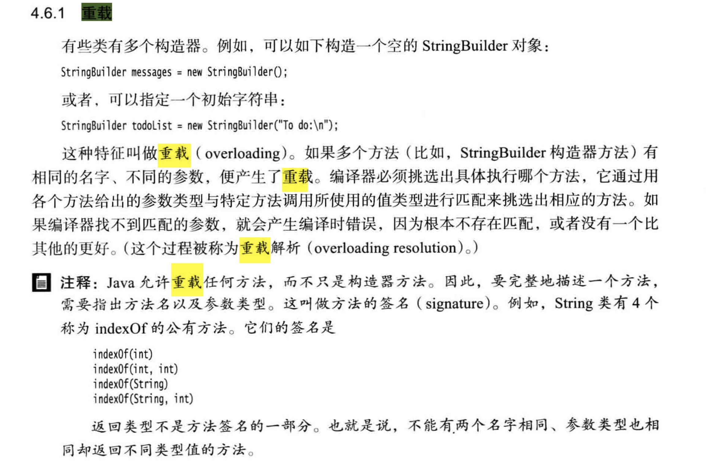

# Java基础问答

- 主要参考自：https://snailclimb.gitee.io/javaguide-interview/#/./docs/b-1%E9%9D%A2%E8%AF%95%E9%A2%98%E6%80%BB%E7%BB%93-Java%E5%9F%BA%E7%A1%80

## 1. 面向对象和面向过程的区别？

- 面向过程：
  - 优点：面向过程性能闭面向对象高。因为类调用时需要实例化，开销比较大，比较耗费资源。所以当性能是最重要的考量因素的时候，比如：单片机、嵌入式开发、Linux等一般采用面向过程开发。
  - 缺点：面向过程没有面向对象易维护、易复用、易拓展
- 面向对象：
  - 优点：面向对象易维护、易复用、易拓展。因为面向对象有封装、继承、多态的特性，所以可以设计出高内聚、低耦合的系统，使系统更加灵活、更加易于维护。
  - 缺点：面向对象的性能比面向过程低
- 面向对象的性能比面向过程的低也需要具体场景具体分析！
  - Java性能差的主要原因不是它是面向对象语言，而是半编译语言，最终代码不是机械码指令。可以一次编译，到处执行，需要配置相关的JVM才可以执行

## 2. Java语言有哪些优点？

- 简单易学、面向对象、平台无关、可靠安全、支持网络编程并且很方便、编译与解释并存

## 3. JVM？JDK？JRE?

### 3.1 JVM

- Java虚拟机是运行Java字节码的虚拟机，针对不同的系统有特定的实现，以使得可以一次编译，到处运行，只要使用相同的字节码，就能够运行出相同的结果

- 什么是字节码？采用字节码的好处是什么？

  - JVM可以理解的代码就叫做字节码(扩展名为：.class的文件)。它不面向任何特定的处理器和系统，只面向虚拟机。Java语言通过字节码的方式，在一定程度上解决了传统解释型语言执行效率低的问题，同时又保留了解释型语言可移植性的特点。由于字节码并不针对一种特定的机器，因此Java程序无需重新编译就可以在多种不同的操作系统的计算机上运行

- Java程序从源代码到运行一般有以下3步：

  - 

  - .class到机器码：

    - 类加载器首先加载字节码文件，然后通过解释器解释执行，这种方式的执行速度会相对较慢，而且有些方法和代码块是经常需要被调用的(也可以称为是热点代码)。所以后续引进了JIT编译器，当JIT编译器完成第一次编译后，会将字节码对应的机器码保存下来，下次可以直接使用。
    - 机器码的运行效率高于Java解释器，这也是为什么说Java是编译与解释共存的语言

  - > JIT：
    >
    > - HotSpot 采用了惰性评估(Lazy  Evaluation)的做法，根据二八定律，消耗大部分系统资源的只有那一小部分的代码（热点代码），而这也就是 JIT 所需要编译的部分。
    >
    > - JVM  会根据代码每次被执行的情况收集信息并相应地做出一些优化，因此执行的次数越多，它的速度就越快。
    > - JDK 9 引入了一种新的编译模式  AOT(Ahead of Time Compilation)，它是直接将字节码编译成机器码，这样就避免了 JIT 预热等各方面的开销。JDK  支持分层编译和 AOT 协作使用。但是 ，AOT 编译器的编译质量是肯定比不上 JIT 编译器的

- 总结：

  - Java虚拟机是运行Java字节码的虚拟机，JVM针对不同系统有特定的实现，目的是使用相同的字节码运行，都可以得到相同的结果，字节码和JVM是实现Java语言：一次编译，到处运行 的关键所在。

### 3.2 JDK、JRE

- JDK：Java Development Kit，是功能齐全的Java SDK。它拥有JRE所拥有的一起，还有编译器(javac)和工具(如：javadoc、jdb)。能够创建和编译程序
- JRE：Java Runtime Enviroment，是Java运行时环境。它是运行已编译Java程序所需的所有内容的集合，主要包括：JVM、Java类库、Java命令和一些其他基础构件。但是它不能创建新程序
- 如果只需要运行Java程序的话，只需要安装JRE就可以了
- 如果需要进行Java编程方面的工作，需要安装JDK，但是这不是绝对的，如果计算机需要使用JSP部署Web应用程序，那么也要安装JDK，因为应用程序服务器会将JSP转换为Java Servlet，并且需要使用JDK来编译Servlet

### 3.3 Oracle JDK和Open JDK

- 对于 Java 7，没什么关键的地方。OpenJDK 项目主要基于 Sun 捐赠的 HotSpot 源代码。此外，OpenJDK 被选为  Java 7 的参考实现，由 Oracle 工程师维护。关于 JVM，JDK，JRE 和 OpenJDK 之间的区别，Oracle 博客帖子在  2012 年有一个更详细的答案：

- > 问：OpenJDK 存储库中的源代码与用于构建 Oracle JDK 的代码之间有什么区别？
  >
  > 答：非常接近 - 我们的  Oracle JDK 版本构建过程基于 OpenJDK 7 构建，只添加了几个部分，例如部署代码，其中包括 Oracle 的 Java 插件和  Java WebStart 的实现，以及一些封闭的源代码派对组件，如图形光栅化器，一些开源的第三方组件，如  Rhino，以及一些零碎的东西，如附加文档或第三方字体。展望未来，我们的目的是开源 Oracle JDK  的所有部分，除了我们考虑商业功能的部分。

- Oracle JDK 大概每 6 个月发一次主要版本，而 OpenJDK 版本大概每三个月发布一次。

- OpenJDK 是一个参考模型并且是完全开源的，而 Oracle JDK 是 OpenJDK 的一个实现，并不是完全开源的；

- Oracle JDK 比 OpenJDK 更稳定。OpenJDK 和 Oracle JDK 的代码几乎相同，但 Oracle JDK  有更多的类和一些错误修复。因此，如果您想开发企业/商业软件，我建议您选择 Oracle  JDK，因为它经过了彻底的测试和稳定。某些情况下，有些人提到在使用 OpenJDK 可能会遇到了许多应用程序崩溃的问题，但是，只需切换到  Oracle JDK 就可以解决问题；

- 在响应性和 JVM 性能方面，Oracle JDK 与 OpenJDK 相比提供了更好的性能；

- Oracle JDK 不会为即将发布的版本提供长期支持，用户每次都必须通过更新到最新版本获得支持来获取最新版本；

- Oracle JDK 根据二进制代码许可协议获得许可，而 OpenJDK 根据 GPL v2 许可获得许可。

## 4. Java和C++的区别？

- 都是面向对象语言，支持封装、继承、多态
- Java不提供指针来直接访问内存，程序内存更加安全
- Java的类是多继承的，C++支持多继承，Java接口是多继承的
- Java有自动内存管理机制，不需要程序员手动释放内存
- 在C语言中，字符串或者字符数组最后都有一个额外的字符'\0'来表示结束，但是Java语言中没有结束符这个概念。具体解释：https://blog.csdn.net/sszgg2006/article/details/49148189。Java面向对象，无需浪费一个内存空间去保存结束符

## 5. 字符型常量和字符串常量？

- 字符型常量(char)：单个引号引起的字符，相当于与一个整型数值(ASCII值)，可以参加表达式运算，只占两个字节

- 字符串常量(String)：双引号引起的字符，代表一个地址值，指向该字符串在堆中的存放位置，占若干个字节

- > - java 编程思想第四版：2.2.2 节
  > - 

## 6. 重载和重写？

- 重载(Overload)：同样一个方法，可以根据输入数据的不同，做出不同的处理

  - 发生在同一个类中，方法名必须相同，参数类型不同、个数不同、顺序不同，方法返回值和访问修饰符可以不同。
  - 《Java 核心技术》对重载这个概念的介绍：
  - 
  - 重载就是同一个类中多个同名方法根据不同的传参来执行不同的逻辑处理。

- 重写(Override)：当子类继承父类的相同方法时，输入数据一样，但是要做出有别于父类的响应时，就需要覆盖父类方法

  - 重写发生在运行期，是子类对父类的允许访问的方法的实现过程进行重新编写。
    - 返回值类型、方法名、参数列表必须相同，抛出的异常范围小于等于父类，访问修饰符范围大于等于父类。
    - 如果父类方法访问修饰符为 `private/final/static` 则子类就不能重写该方法，但是被 static 修饰的方法能够被再次声明。
    - 构造方法无法被重写
  - 重写就是子类对父类方法的重新改造，外部样子不能改变，内部逻辑可以改变

- 区别：

- | 区别点     | 重载方法 | 重写方法                                                     |
  | ---------- | -------- | ------------------------------------------------------------ |
  | 发生范围   | 同一个类 | 子类                                                         |
  | 参数列表   | 必须修改 | 一定不能修改                                                 |
  | 返回类型   | 可修改   | 子类方法返回值类型应比父类方法返回值类型更小或相等           |
  | 异常       | 可修改   | 子类方法声明抛出的异常类应比父类方法声明抛出的异常类更小或相等； |
  | 访问修饰符 | 可修改   | 一定不能做更严格的限制（可以降低限制）                       |
  | 发生阶段   | 编译期   | 运行期                                                       |

- 构造器Constructor是否可以被Override?
  
  - 构造器不能被重写，但是可以被重载。就是一个类中可以有多个构造函数

## 7. 面向对象三大特性

### 7.1 封装

- 把一个对象的属性私有化，同时提供一些可以被外界访问属性的方法。如果属性不想被外界访问，可以不提供方法给外界访问，但是如果一个类没有提供给外界访问的方法，那么这个类也就没有什么意义了！

### 7.2 继承

- 继承是使用已经存在的类的定义作为基础建立新类的技术，新类的定义可以增加新的数据或新的功能，也可以用父类的功能，但是不能选择性的继承父类。通过使用继承能够非常方便的复用以前的代码
- 子类继承父类：
  - 子类拥有父类对象所有的属性和方法，但是父类中的私有属性和方法子类是无法访问的，只是**拥有**
  - 子类可以拥有自己的属性和方法，即可以对父类进行扩展
  - 子类可以用自己的方式实现父类的方法

### 7.3 多态

- 多态是指程序中定义的引用变量所指向的具体类型，和通过该引用变量发出的方法调用在编程时并不确定，而是在程序运行期间才能确定。即一个引用变量到底会指向哪个类的示例对象，该引用变量发出的方法调用是哪个类的实现方法，必须在程序运行期间才能决定
- Java中有两种形式可以实现多态：
  - 继承：多个子类对同一个方法的重写
  - 接口：实现接口并覆盖接口中的同一方法

## 8. String、StringBuffer、StringBuilder

- 可变性：
  - String类中使用final关键字修饰字符数组来保持字符串，也即：private final char[] value，所以String对象是不可变的
    - java9之后：String、StringBuffer、StringBuilder的实现改用了byte[]存储字符串，即：private final byte[] value
  - StringBuilder和StringBuffer但是继承AbstractStringBuilder类，是使用char[] value，但是没有使用final关键字修饰，因此可变
    - StringBuilder和StringBuffer的构造方法都是调用AbstractStringBuilder的构造方法实习的
- 线程安全性：
  - String：中的对象是不可变的，是常量、线程安全
  - StringBuffer：对方法加了同步锁或者对调用的方法加了同步锁，线程安全
  - StringBuilder：没有对方法进行加同步锁，是线程不安全的
- 性能：
  - String：每次对String类型进行改变的时候，都会生成一个新的String对象，然后将指针指向新的String对象
  - StringBuffer：每次都是对StringBuffer本身进行操作，而不是生成新的对象并且改变对象引用
  - StringBuilder：StringBuilder相比使用StringBuffer可以获得10-15%的性能提升，但是需要冒多线程不安全的风险
- 使用总结：
  - 操作少量的数据：使用String
  - 单线程操作大量数据：StringBuilder
  - 多线程操作大量数据：StringBuffer

## 9. 自动装箱和拆箱

- 装箱：将基本类型用它们对应的引用类型包装起来
- 拆箱：将包装类型转换为基本数据类型
- 具体可看：https://www.cnblogs.com/dolphin0520/p/3780005.html
- 拆箱和装箱如何实现？
  - 装箱的时候自动调用的是对应引用类型的valueOf(int)方法
  - 拆箱的时候自动调用的是对应引用类型的intValue()方法
  - 装箱过程是通过调用包装器的valueOf方法实现的，而拆箱过程是通过调用包装器的 xxxValue方法实现的。（xxx代表对应的基本数据类型）
- Integer类的valueOf方法的具体实现：如果数值在[-128,127]之间，便返回指向IntegerCache.cache中已经存在的对象的引用；否则创建一个新的Integer对象。
- Double类的valueOf方法会采用与Integer类的valueOf方法不同的实现。很简单：在某个范围内的整型数值的个数是有限的，而浮点数却不是
- Integer、Short、Byte、Character、Long这几个类的valueOf方法的实现是类似的。Double、Float的valueOf方法的实现是类似的。
- 当 "=="运算符的两个操作数都是 包装器类型的引用，则是比较指向的是否是同一个对象，而如果其中有一个操作数是表达式（即包含算术运算）则比较的是数值（即会触发自动拆箱的过程）

## 10. 在静态方法中调用一个非静态成员变量为什么是非法的？

- 由于静态方法可以不通过对象进行访问，因此在静态方法里，不能调用其他非静态变量，也不可以访问非静态变量成员
- 也可以从JVM类加载方面进行描述

## 11. 为什么要在Java中定义一个空并且没有参数的构造方法？

- Java 程序在执行子类的构造方法之前，如果没有用 `super()`来调用父类特定的构造方法，则会调用父类中“没有参数的构造方法”。
- 而如果父类中只定义了有参数的构造方法，而在子类的构造方法中又没有用 `super()`来调用父类中特定的构造方法，则编译时将发生错误，因为 Java 程序在父类中找不到没有参数的构造方法可供执行。解决办法是在父类里加上一个不做事且没有参数的构造方法。

## 12. 接口和抽象类的区别是什么？

- 方法：
  - 接口的默认方法是`public`，所有方法在接口中不能有实现(java8 开始接口方法可以有默认实现)
  - 抽象类中可以有非抽象方法
- 变量：
  - 接口中除了static、final变量，不能有其他变量
  - 抽象类中不一定
- 类：
  - 一个类可以实现多个接口，但是只能实现一个抽象类
  - 接口本身可以使用`extends`关键字扩展多个接口
- 方法修饰符：
  - 接口方法默认的修饰符：`public`
    - JDK 1.8以前，接口中的方法必须是public的
    -  JDK 1.8时，接口中的方法可以是public的，也可以是default的
    -  JDK 1.9时，接口中的方法可以是private的
  - 抽象方法可以使用：`public`、`protected`、`default`这些修饰符，因为抽象方法就是为了被重写的，因此不可以使用`private`关键字来修饰
    - JDK 1.8以前，抽象类的方法默认访问权限为protected
    -  JDK 1.8时，抽象类的方法默认访问权限变为default
- 设计层面：
  - 抽象是对类的抽象，是一种模板设计
  - 接口是对行为的抽象，是一种行为的规范

> 备注：
>
> 1. 在 JDK8 中，接口也可以定义静态方法，可以直接用接口名调用。实现类和实现是不可以调用的。如果同时实现两个接口，接口中定义了一样的默认方法，则必须重写，不然会报错。(详见 issue:https://github.com/Snailclimb/JavaGuide/issues/146。
> 2. jdk9 的接口被允许定义私有方法 。

- 总结：
  - 在 jdk 7 或更早版本中，接口里面只能有常量变量和抽象方法。这些接口方法必须由选择实现接口的类实现。
  - jdk 8 的时候接口可以有默认方法和静态方法功能。
  - Jdk 9 在接口中引入了私有方法和私有静态方法。

## 13. 成员变量和局部变量的区别？

- 语法形式：
  - 成员变量属于类，成员变量可以被`public`,`private`,`static` 等修饰符所修饰
  - 局部变量在方法中，局部变量不能上面的修饰符修饰
  - 但是成员变量和局部变量都可以使用fianl修饰
- 存储方式：
  - 成员变量：
    - 如果使用static修饰：则这个成员变量属于类的
    - 如果没有使用static修饰：则这个成员变量属于实例
    - 成员变量存储在堆内存中
  - 局部变量：
    - 如果为基本数据类型：存放在栈内存中的方法对应的栈帧的局部变量表中
    - 如果为引用数据类型：其引用存放在栈内存中的方法对应的栈帧的局部变量表中，4个字节，引用指向堆内存对象或者常量池中的地址
- 生命周期：
  - 成员变量是对象的一部分，随着对象的创建而存在，随着对象的销毁而消亡
  - 局部变量随着方法的调用而自动销毁
- 赋值：
  - 成员变量如果没有被赋初值：则会自动以类型的默认值而赋值(被 `final` 修饰的成员变量必须显式地赋值)
  - 局部变量不会自动赋值

## 14. 怎么创建对象？对象实体与对象引用有何不同？

- new 运算符创建对象实例
- 对象实例在堆内存中，对象引用指向对象实例（对象实例存放在栈内存中栈帧的局部变量表中）
- 一个对象引用可以指向0个或者1个对象
- 一个对象实例可以被n个对象引用指向

## 15. 什么是方法的返回值？有什么用？

- 方法的返回值：某个方法体中的代码执行后产生的结果
- 返回值的作用：接收抛出结果，使得可以用于其他操作

## 16.构造方法的作用、特性、子类父类构造方法？

- 构造器方法作用：主要完成对类对象的初始化构造
- 一个类如果没有声明构造方法，可以执行，因为会有默认的不带参数的构造方法
- 特性：
  - 名字与类相同
  - 没有返回值，不能使用void声明构造函数
  - 生成类的对象时自动执行，无需调用
- 在调用子类构造方法前会调用父类没有参数的构造方法，其目的是？
  - 帮助子类做初始化工作

## 17.静态方法和实例方法有何不同？

- 调用方式：
  - 调用静态方法可以使用："类名.方法名"的方式，也可以使用"对象名.方法名"的方式，调用静态方法无需创建对象
  - 调用实例方法只能使用："对象名.方法名"
- 访问变量：
  - 静态方法：访问本类的成员变量时，只允许访问静态成员(静态成员变量和静态方法)，不允许访问实例成员变量和方法
  - 实例方法：无以上限制

## 18. ==与equals？对象相等于引用相等？

- 对象相等：对比内存中存放的内容是否相同

- 引用相等：对比它们指向的内存地址是否相同

- ==：作用是判断两个对象的地址是不是相等。也即是：判断两个对象是不是同一个对象

  - 基本数据类型：==是比较两个值是不是相同
  - 引用数据类型：==是比较内存地址

- equals()：作用是判断两个对象是否相等，但是一般分为两种使用情况

  - 情况1：类没有覆盖equals()方法。通过比较equals()比较该类的两个对象时，等价于使用==比较这两个对象，也即比较指向实例对象的内存地址
  - 情况2：类覆盖了equals()方法。期望能够覆盖 equals() 方法来比较两个对象的内容是否相等；若它们的内容相等，则返回 true (即，认为这两个对象相等)。也即是：期望能够使用==在基本数据类型时候的功能：判断内容相同而不是地址

- ```java
  public class test1 {
      public static void main(String[] args) {
          String a = new String("ab"); // a 为一个引用
          String b = new String("ab"); // b为另一个引用,对象的内容一样
          String aa = "ab"; // 放在常量池中
          String bb = "ab"; // 从常量池中查找
          if (aa == bb) // true
              System.out.println("aa==bb");
          if (a == b) // false，非同一对象
              System.out.println("a==b");
          if (a.equals(b)) // true
              System.out.println("aEQb");
          if (42 == 42.0) { // true
              System.out.println("true");
          }
      }
  }
  ```

- 说明：

  - String 中的 equals 方法是被重写过的，因为 object 的 equals 方法是比较的对象的内存地址，而 String 的 equals 方法比较的是对象的值。
  - 当创建 String 类型的对象时，虚拟机会在常量池中查找有没有已经存在的值和要创建的值相同的对象，如果有就把它赋给当前引用。如果没有就在常量池中重新创建一个 String 对象。

## 19. hashCode与equals

- 可以看这个链接：https://www.cnblogs.com/skywang12345/p/3324958.html

- 什么是hashCode()？
  - `hashCode()`的作用是获取哈希码，也就是散列码，实际上是返回一个int整数。可以用来确定该对象在哈希表中的索引位置。
  - `hashCode()`定义在JDK的`Object`类中，意味着Java中的任何类都包含该方法，并且`Object`的`hashCode()`是本地方法，也就是使用c或者c++实现的，该方法通常用来将对象的内存地址转换为整数之后返回
  - 哈希表存储的是键值对，特点是可以根据：键快速的检索出对应的值，因此可以快速的找到所需的对象
- 为什么要有hashCode()？
  - 因为：可以大大减少了 equals 的次数，相应就大大提高了执行速度。
  - 以HashSet为例：当你把对象加入 `HashSet` 时，`HashSet` 会先计算对象的 hashcode 值来判断对象加入的位置，同时也会与其他已经加入的对象的 hashcode 值作比较，如果没有相符的 hashcode，`HashSet` 会假设对象没有重复出现。但是如果发现有相同 hashcode 值的对象，这时会调用 `equals()` 方法来检查 hashcode 相等的对象是否真的相同。如果两者相同，`HashSet` 就不会让其加入操作成功。如果不同的话，就会重新散列到其他位置。
- 为什么重写equals时必须要重写hashCode方法？
  - 因为如果两个对象相等，则hashCode一定相同
  - 但是两个对象有相同的hashCode值，则两个对象不一定相等
  - 因此重写equals方法时，hashCode方法也要被重写！
  - `hashCode()`的默认行为是对堆上的对象产生独特值。如果没有重写 `hashCode()`，则该 class 的两个对象无论如何都不会相等（即使这两个对象指向相同的数据）
- 为什么两个对象有相同的hashCode值，它们也不一定是相等的？（在会创建类对应的散列表时！）
  - 因为在散列表中，hashCode()相等，即两个键值对的哈希值相等。然而哈希值相等，并不一定能得出键值对相等。补充说一句：“两个不同的键值对，哈希值相等”，这就是哈希冲突。

## 20. 为什么Java中只有值传递？

- **按值调用(call by value)表示方法接收的是调用者提供的值，**

- **按引用调用（call by reference)表示方法接收的是调用者提供的变量地址。**

- **一个方法可以修改传递引用所对应的变量值，而不能修改传递值调用所对应的变量值**

- **Java 程序设计语言总是采用按值调用。也就是说，方法得到的是所有参数值的一个拷贝，也就是说，方法不能修改传递给它的任何参数变量的内容。**

- ```java
      public static void main(String[] args) {
          int[] arr = { 1, 2, 3, 4, 5 };
          System.out.println(arr[0]);
          change(arr);
          System.out.println(arr[0]);
      }
  
      public static void change(int[] array) {
          // 将数组的第一个元素变为0
          array[0] = 0;
      }
  //结果：
  1
  0
  // 方法得到的是对象引用的拷贝，对象引用及其他的拷贝同时引用同一个对象。
  ```

- ```java
  public class Test {
  
      public static void main(String[] args) {
          // TODO Auto-generated method stub
          Student s1 = new Student("小张");
          Student s2 = new Student("小李");
          Test.swap(s1, s2);
          System.out.println("s1:" + s1.getName());
          System.out.println("s2:" + s2.getName());
      }
  
      public static void swap(Student x, Student y) {
          Student temp = x;
          x = y;
          y = temp;
          System.out.println("x:" + x.getName());
          System.out.println("y:" + y.getName());
      }
  }
  
  // 输出结果：
  x:小李
  y:小张
  s1:小张
  s2:小李
  ```

- 

- 

-  **方法并没有改变存储在变量 s1 和 s2 中的对象引用。swap 方法的参数 x 和 y 被初始化为两个对象引用的拷贝，这个方法交换的是这两个拷贝**

- 总结：

  - Java程序涉及语言对 对象采用的不是引用调用，而是对象引用是按值传递的
  - 因此：
    - 一个方法不能修改基本数据类型的参数
    - 一个方法可以改变一个对象参数的状态=》改变这个引用对象里面的属性等，但是不够改变这个引用去指向另一个引用
    - 一个方法不可以让对象参数引用一个新的对象

## 21. 线程？进程？程序？关系？

- 线程：与进程类似，但是线程是一个比进程更小的执行单位，一个进程在执行过程中产生多个线程。
  - 与进程不同：同类的多个线程是共享一块内存空间和一组系统资源，所以系统在执行一个线程或者在各个线程之间切换工作时，负担比进程小很多，这也是为什么被称为：轻量级进程
- 程序：包含指令和数据的文件，被存储在磁盘或者其他数据存储设备中，程序是静态的代码
- 进程：程序的一次执行过程，是系统运行程序的基本单位，所以说进程是动态的。
  - 系统运行一个程序即是一个进程从创建，运行到消亡的过程。
  - 一个进程就是一个执行中的程序，它在计算机中一个指令接着一个指令地执行着，同时，每个进程还占有某些系统资源如 CPU  时间，内存空间，文件，输入输出设备的使用权等等。换句话说，当程序在执行时，将会被操作系统载入内存中。 线程是进程划分成的更小的运行单位。线程和进程最大的不同在于基本上各进程是独立的，而各线程则不一定，因为同一进程中的线程极有可能会相互影响。从另一角度来说，进程属于操作系统的范畴，主要是同一段时间内，可以同时执行一个以上的程序，而线程则是在同一程序内几乎同时执行一个以上的程序段。

## 22. 线程的基本状态？

- Java线程在运行的生命周期中的某一时刻只可能是出于某一种状态：有以下六种：
  - 
- 线程的状态随着代码的执行在不同状态之间切换
  - 
  - 由上图可知：线程创建之后将处于NEW状态，调用`start()`方法后开始运行，线程此时处于READY(可运行状态)，可运行状态的线程如果获得了CPU时间片就处于RUNNING(运行)状态
    - 操作系统隐藏 Java 虚拟机（JVM）中的 READY 和 RUNNING 状态，它只能看到 RUNNABLE 状态
      - ref：https://howtodoinjava.com/java/multi-threading/java-thread-life-cycle-and-thread-states/
    - 所以 Java 系统一般将这两个状态统称为 **RUNNABLE（运行中）** 状态 
  - 当线程执行 `wait()`方法之后，线程进入 **WAITING（等待）**状态。进入等待状态的线程需要依靠其他线程的通知才能够返回到运行状态，而 **TIME_WAITING(超时等待)** 状态相当于在等待状态的基础上增加了超时限制，比如通过 `sleep（long millis）`方法或 `wait（long millis）`方法可以将 Java 线程置于 TIMED WAITING 状态。当超时时间到达后 Java 线程将会返回到 RUNNABLE 状态。当线程调用同步方法时，在没有获取到锁的情况下，线程将会进入到 **BLOCKED（阻塞）** 状态。线程在执行 Runnable 的`run()`方法之后将会进入到 **TERMINATED（终止）** 状态。

## 23. final关键字？

- final关键字主要用在三个地方：
  - 变量：
    - 如果基本数据类型的变量使用了final修饰，则其数值一旦在初始化之后便不能更改
    - 如果是引用类型的变量使用了final修饰，则其初始化之后便不能指向另一个对象
  - 方法：
    - 使用final修饰方法：
      - 可以把方法锁定，防止任何继承类修改它的含义
      - 可以提升效率：在早期的 Java 实现版本中，会将 final 方法转为内嵌调用。但是如果方法过于庞大，可能看不到内嵌调用带来的任何性能提升（现在的 Java 版本已经不需要使用 final 方法进行这些优化了）。类中所有的 private 方法都隐式地指定为 final。
  - 类：
    - 使用final修饰类时，表明这个类不能被继承，final类中的所有成员变量都会被隐式的指定为final方法

## 24. Java中的异常处理

### 24.1 Java异常类层次结构

- 
- 
- 在Java中，所有的异常都有一个共同的祖先：java.lang.Throwable类，
- Throwable类有两个重要的子类：Exception和Error
  - Exception能够被程序本身处理(try catch)
  - Error是无法使用程序本身进行处理，只能尽量避免
- Exception：程序本身可以处理的异常，可以通过catch来进行捕获
  - Exception又分为：受检查异常(必须处理)和不受检查异常(可以不处理)
- Error：程序无法处理的异常，无法通过catch来进行捕获
  - 如：Virtual MachineError、OutOfMemoryError、NoClassDefFoundError
  - 这些错误发生时，JVM一般会选择线程终止
- 受检查异常：Exception中的一种：
  - Java 代码在编译过程中，如果受检查异常没有被 `catch`/`throw` 处理的话，就没办法通过编译 。
  - 除了`RuntimeException`及其子类以外
  - 其他的`Exception`类及其子类都属于检查异常 。常见的受检查异常有： IO 相关的异常、`ClassNotFoundException` 、`SQLException`...。
- 不受检查异常：Exception的一种：
  - Java 代码在编译过程中 ，我们即使不处理不受检查异常也可以正常通过编译。
  - `RuntimeException` 及其子类都统称为非受检查异常，
  - 例如：`NullPointerException`、`NumberFormatException`（字符串转换为数字）、`ArrayIndexOutOfBoundsException`（数组越界）、`ClassCastException`（类型转换错误）、`ArithmeticException`（算术错误）等。

### 24.2 Throwable类常用方法

- **`public string getMessage()`**:返回异常发生时的简要描述
- **`public string toString()`**:返回异常发生时的详细信息
- **`public string getLocalizedMessage()`**:返回异常对象的本地化信息。使用 `Throwable` 的子类覆盖这个方法，可以生成本地化信息。如果子类没有覆盖该方法，则该方法返回的信息与 `getMessage（）`返回的结果相同
- **`public void printStackTrace()`**:在控制台上打印 `Throwable` 对象封装的异常信息

### 24.3 异常处理总结

- try块：用于捕获异常，其后可以接0个或者多个catch块，如果没有catch块，则必须跟一个finally块。
- catch块：用于处理try捕获到的异常
- finally块：无论是否捕获或者处理异常，finally块里面的语句都会被指向，finally语句块将在方法返回之前被指向
- 以上三种特殊情况finally块不会被执行：
  - 在 `try` 或 `finally `块中用了 `System.exit(int)`退出程序。但是，如果 `System.exit(int)` 在异常语句之后，`finally` 还是会被执行
  - 程序所在的线程死亡
  - 关闭CPU
- **注意：** 当 try 语句和 finally 语句中都有 return 语句时，在方法返回之前，finally 语句的内容将被执行，并且 finally 语句的返回值将会覆盖原始的返回值

## 25. Java序列化

- 对于不想进行序列化的变量，可以使用transient关键字修饰！
- transient关键字的作用：阻止实例中那些用此关键字修饰的变量序列化，当对象被反序列化时，被transient修饰的变量值不会被持久化和恢复，transient只能修饰变量，不能修饰类和方法

## 26. 获取键盘输入的两种方法

- 法一：通过Scanner

  - ```java
    Scanner input = new Scanner(System.in);
    String s = input.nextLine();
    input.close();
    ```

- 法二：通过BufferedReader

  - ```java
    BufferedReader input = new BUfferedReader(new InputStreamReader(System.in));
    String s = input.readLine();
    ```

## 27. Java中的IO流

### 27.1 IO流的分类：

- 按照流的流向分类：
  - 输入流
  - 输出流
- 按照操作的基本单元分类：
  - 字节流：byte
  - 字符流：char
- 按照流的角色分类：
  - 节点流
  - 处理流
- Java IO流都是冲四个抽象基类中派生出来的：
  - InputStream/Reader：所有输入流的基类：前者是：字节输入流，后者是：字符输入流
  - OutputStram/Writer：所有输出流的基类：前者是：字节输出流，后者是：字符输出流
- 按操作方式分类：
  - 
- 按操作对象分类：
  - 

### 27.2 有字节流为什么还要字符流？

- 字符流是由JVM将字节装为字符得到的！但是这个过程十分耗时，并且如果不知道编码类型就很容易出现乱码问题
- 因此：IO流就提供了一个直接操作字符的接口，方便对字符进行流操作
- 音频、图片等媒体文件使用：字节流比较好
- 涉及到字符的话使用：字符流比较好

### 27.3　BIO、NIO、AIO？

- BIO（Blocking I/O）：**同步阻塞IO模式**。数据的读取写入必须阻塞在一个线程内等待其完成。在活动连接数不受特别高的情况下(小于单机1000)。这种模型性能不错。
  - 可以让每个连接专注于自己的I/O并且编程模型简单，不用过多考虑系统的过载、限流等问题
  - 线程池本身就是一个天然的漏斗，可以缓冲一些系统处理不了的连接或者请求。但是，当面对十万甚至百万级连接的时候，传统的 BIO 模型是无能为力的。因此，我们需要一种更高效的 I/O 处理模型来应对更高的并发量
- NIO（Non-blocking/New I/O）：NIO 是一种**同步非阻塞**的 I/O 模型，在 Java 1.4 中引入了 NIO 框架，对应 java.nio 包，提供了 Channel ,  Selector，Buffer 等抽象。
  - IO 中的 N 可以理解为 Non-blocking，不单纯是 New。它支持面向缓冲的，基于通道的  I/O 操作方法。
  - NIO 提供了与传统 BIO 模型中的 `Socket` 和 `ServerSocket` 相对应的 `SocketChannel` 和 `ServerSocketChannel`  两种不同的套接字通道实现,两种通道都支持阻塞和非阻塞两种模式。
  - 阻塞模式使用就像传统中的支持一样，比较简单，但是性能和可靠性都不好；
  - 非阻塞模式正好与之相反。对于低负载、低并发的应用程序，可以使用同步阻塞 I/O 来提升开发速率和更好的维护性；对于高负载、高并发的（网络）应用，应使用 NIO 的非阻塞模式来开发
- AIO（Asynchronous I/O）：AIO 也就是 NIO 2。
  - 在 Java 7 中引入了 NIO 的改进版 NIO 2,它是异步非阻塞的 IO 模型。异步 IO  是基于事件和回调机制实现的，也就是应用操作之后会直接返回，不会堵塞在那里，当后台处理完成，操作系统会通知相应的线程进行后续的操作。
  - AIO 是异步 IO 的缩写，虽然 NIO 在网络操作中，提供了非阻塞的方法，但是 NIO 的 IO 行为还是同步的。对于 NIO 来说，我们的业务线程是在  IO 操作准备好时，得到通知，接着就由这个线程自行进行 IO 操作，IO 操作本身是同步的。
  - 查阅网上相关资料，发现就目前来说 AIO  的应用还不是很广泛，Netty 之前也尝试使用过 AIO，不过又放弃了。

## 28. 深拷贝？浅拷贝？

- 浅拷贝：对基本数据类型进行值传递，对引用数据类型进行引用传递的拷贝
- 深拷贝：对基本数据类型进行值传递，对引用数据类型则创建一个新的对象，并复制其内容
- 


