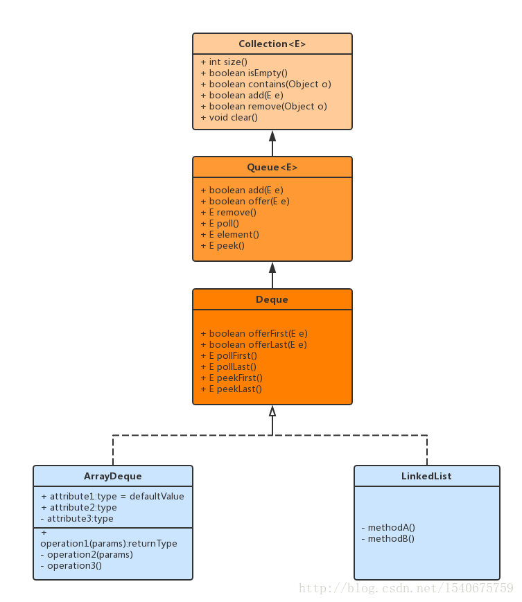
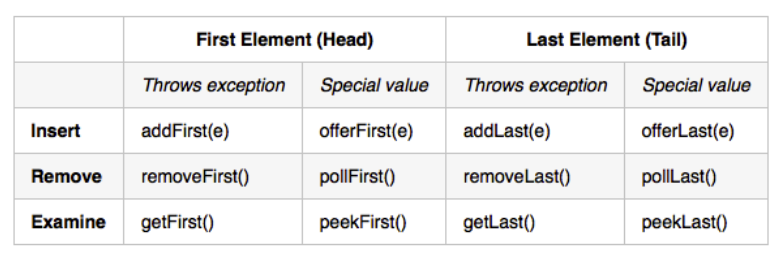
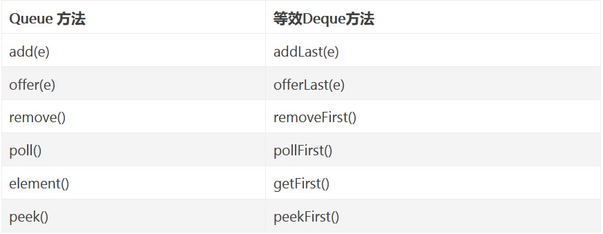
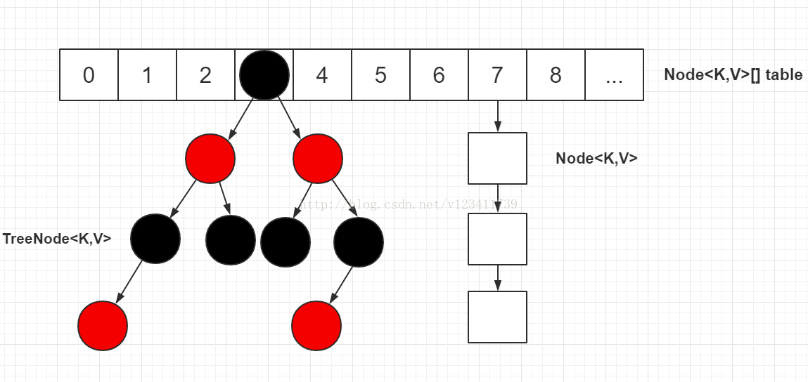
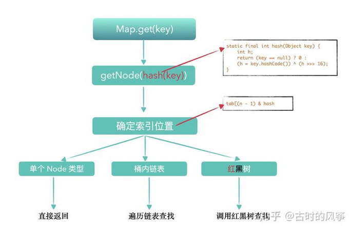
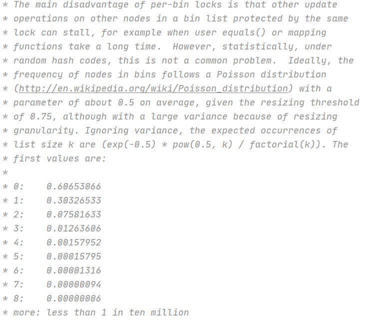

# Java的具体数据结构实现

- 主要参考自：
  - https://www.jianshu.com/p/d78a7c982edb
  - https://blog.csdn.net/v123411739/article/details/78996181
  - https://www.cnblogs.com/baolingye/p/11667717.html
  - https://zhuanlan.zhihu.com/p/150177782

## 1. Deque

- 

- 线性集合，支持两端的元素插入和移除。

- Deque是`double ended queue`的简称，习惯上称之为双端队列。

- 大多数Deque 实现对它们可能包含的元素的数量没有固定的限制，但是该接口支持容量限制的deques以及没有固定大小限制的deque。

- 不支持索引访问元素。

- **Deque的使用场景**
   在一般情况，不涉及到并发的情况下，有两个实现类，可根据其自身的特性进行选择，分别是：
  
  - LinkedList 大小可变的链表双端队列，允许元素为插入null。
  - ArrayDeque 大下可变的数组双端队列，不允许插入null。
  - ConcurrentLinkedDeque 大小可变且线程安全的链表双端队列，非阻塞，不允许插入null。
  - LinkedBlockingDeque 为线程安全的双端队列，在队列为空的情况下，获取操作将会阻塞，直到有元素添加。

- 两组方法：
  
  - 抛出异常
  - 抛出返回值
  - 

- Deque当作队列使用：
  
  - 以下方法都可使用：
  - 

- Deque当成栈使用：
  
  - 

## 2. HashMap

- JDK1.7及之前：数组+链表
- JDK1.8：数组+链表+红黑树
- 问题：为什么数组的长度必须是2的指数次幂，为什么HashMap的加载因子要设置为0.75，为什么链表长度大于等于8时转成了红黑树？
- 

### 2.1 类成员变量

```java
// 默认容量16
static final int DEFAULT_INITIAL_CAPACITY = 1 << 4; 

// 最大容量
static final int MAXIMUM_CAPACITY = 1 << 30;    

// 默认负载因子0.75
static final float DEFAULT_LOAD_FACTOR = 0.75f; 
// 阈值 = 容量 x 负载因子，假设当前 HashMap的容量是 16，负载因子是默认值 0.75，那么当 size 到达 16 x 0.75= 12 的时候，就会触发扩容。

// 链表节点转换红黑树节点的阈值, 9个节点转
static final int TREEIFY_THRESHOLD = 8; 

// 红黑树节点转换链表节点的阈值, 6个节点转
static final int UNTREEIFY_THRESHOLD = 6;   

// 转红黑树时, table的最小长度
static final int MIN_TREEIFY_CAPACITY = 64; 

// 链表节点, 继承自Entry
static class Node<K,V> implements Map.Entry<K,V> {  
    final int hash;
    final K key;
    V value;
    Node<K,V> next;

    // ... ...
}

// 红黑树节点
static final class TreeNode<K,V> extends LinkedHashMap.Entry<K,V> {
    TreeNode<K,V> parent;  // red-black tree links
    TreeNode<K,V> left;
    TreeNode<K,V> right;
    TreeNode<K,V> prev;    // needed to unlink next upon deletion
    boolean red;

    // ...
}
```

### 2.2 hash()

- 无论是增删改查，都需要先确定key对应的hash值是多少，才能找到key在hashmap中的位置！

- hash值期望的效果？
  
  - 元素位置尽量分布均匀些，尽量使得每个位置上的元素数量只有一个，那么当我们用 hash 算法求得这个位置的时候，马上就可以知道对应位置的元素就是我们要的，不用遍历链表/红黑树，大大优化了查询的效率。

- hash源码：

- ```java
  // 代码1
  static final int hash(Object key) { // 计算key的hash值
      int h;
      // 1.先拿到key的hashCode值; 2.将hashCode的高16位参与运算
      return (key == null) ? 0 : (h = key.hashCode()) ^ (h >>> 16);
  }
  // 代码2
  int n = tab.length;
  // 将(tab.length - 1) 与 hash值进行&运算
  int index = (n - 1) & hash;
  ```
  
  - 拿到key的hashCode值
  - 将hashCode的高位参与与运算，重新计算hash值
  - 最后再和table.length-1进行于运算，获取索引值

- 索引的模运算的改进：
  
  - 前提是数组长度为2的n次方
  - (table.length -1) & h” 来得到该对象的索引位置，这个优化是基于以下公式：x mod 2^n = x & (2^n - 1)。

- 计算hash为什么高16位也要参加运算？
  
  - 散列更加均匀，减少hash冲突

### 2.3 get()

- ```java
  public V get(Object key) {
      Node<K,V> e;
      return (e = getNode(hash(key), key)) == null ? null : e.value;
  }
  
  final Node<K,V> getNode(int hash, Object key) {
      Node<K,V>[] tab; Node<K,V> first, e; int n; K k;
      // 1.对table进行校验：table不为空 && table长度大于0 && 
      // table索引位置(使用table.length - 1和hash值进行位与运算)的节点不为空
      if ((tab = table) != null && (n = tab.length) > 0 &&
          (first = tab[(n - 1) & hash]) != null) {
          // 2.检查first节点的hash值和key是否和入参的一样，如果一样则first即为目标节点，直接返回first节点
          if (first.hash == hash && // always check first node
              ((k = first.key) == key || (key != null && key.equals(k))))
              return first;
          // 3.如果first不是目标节点，并且first的next节点不为空则继续遍历
          if ((e = first.next) != null) {
              if (first instanceof TreeNode)
                  // 4.如果是红黑树节点，则调用红黑树的查找目标节点方法getTreeNode
                  return ((TreeNode<K,V>)first).getTreeNode(hash, key);
              do {
                  // 5.执行链表节点的查找，向下遍历链表, 直至找到节点的key和入参的key相等时,返回该节点
                  if (e.hash == hash &&
                      ((k = e.key) == key || (key != null && key.equals(k))))
                      return e;
              } while ((e = e.next) != null);
          }
      }
      // 6.找不到符合的返回空
      return null;
  }
  ```
  
  // ====================
  final TreeNode<K,V> getTreeNode(int h, Object k) {
  
      // 1.首先找到红黑树的根节点；2.使用根节点调用find方法
      return ((parent != null) ? root() : this).find(h, k, null);
  
  }
  
  // ==================
  /**
* 从调用此方法的节点开始查找, 通过hash值和key找到对应的节点

* 此方法是红黑树节点的查找, 红黑树是特殊的自平衡二叉查找树

* 平衡二叉查找树的特点：左节点<根节点<右节点
  */
  final TreeNode<K,V> find(int h, Object k, Class<?> kc) {
   // 1.将p节点赋值为调用此方法的节点，即为红黑树根节点
   TreeNode<K,V> p = this;
   // 2.从p节点开始向下遍历
   do {
  
       int ph, dir; K pk;
       TreeNode<K,V> pl = p.left, pr = p.right, q;
       // 3.如果传入的hash值小于p节点的hash值，则往p节点的左边遍历
       if ((ph = p.hash) > h)
           p = pl;
       else if (ph < h) // 4.如果传入的hash值大于p节点的hash值，则往p节点的右边遍历
           p = pr;
       // 5.如果传入的hash值和key值等于p节点的hash值和key值,则p节点为目标节点,返回p节点
       else if ((pk = p.key) == k || (k != null && k.equals(pk)))
           return p;
       else if (pl == null)    // 6.p节点的左节点为空则将向右遍历
           p = pr;
       else if (pr == null)    // 7.p节点的右节点为空则向左遍历
           p = pl;
       // 8.将p节点与k进行比较
       else if ((kc != null ||
                 (kc = comparableClassFor(k)) != null) && // 8.1 kc不为空代表k实现了Comparable
                (dir = compareComparables(kc, k, pk)) != 0)// 8.2 k<pk则dir<0, k>pk则dir>0
           // 8.3 k<pk则向左遍历(p赋值为p的左节点), 否则向右遍历
           p = (dir < 0) ? pl : pr;
       // 9.代码走到此处, 代表key所属类没有实现Comparable, 直接指定向p的右边遍历
       else if ((q = pr.find(h, k, kc)) != null) 
           return q;
       // 10.代码走到此处代表“pr.find(h, k, kc)”为空, 因此直接向左遍历
       else
           p = pl;
  
   } while (p != null);
   return null;
  }
  
  // ==========================
  static Class<?> comparableClassFor(Object x) {
   // 1.判断x是否实现了Comparable接口
   if (x instanceof Comparable) {
  
       Class<?> c; Type[] ts, as; Type t; ParameterizedType p;
       // 2.校验x是否为String类型
       if ((c = x.getClass()) == String.class) // bypass checks
           return c;
       if ((ts = c.getGenericInterfaces()) != null) {
           // 3.遍历x实现的所有接口
           for (int i = 0; i < ts.length; ++i) {
               // 4.如果x实现了Comparable接口，则返回x的Class
               if (((t = ts[i]) instanceof ParameterizedType) &&
                   ((p = (ParameterizedType)t).getRawType() ==
                    Comparable.class) &&
                   (as = p.getActualTypeArguments()) != null &&
                   as.length == 1 && as[0] == c) // type arg is c
                   return c;
           }
       }
  
   }
   return null;
  }
  
  ```
  
  ```
- 

### 2.4 put()

- ```java
  public V put(K key, V value) {
      return putVal(hash(key), key, value, false, true);
  }
  
  final V putVal(int hash, K key, V value, boolean onlyIfAbsent,
                 boolean evict) {
      Node<K,V>[] tab; Node<K,V> p; int n, i;
      // 1.校验table是否为空或者length等于0，如果是则调用resize方法进行初始化
      if ((tab = table) == null || (n = tab.length) == 0)
          n = (tab = resize()).length;
      // 2.通过hash值计算索引位置，将该索引位置的头节点赋值给p，如果p为空则直接在该索引位置新增一个节点即可
      if ((p = tab[i = (n - 1) & hash]) == null)
          tab[i] = newNode(hash, key, value, null);
      else {
          // table表该索引位置不为空，则进行查找
          Node<K,V> e; K k;
          // 3.判断p节点的key和hash值是否跟传入的相等，如果相等, 则p节点即为要查找的目标节点，将p节点赋值给e节点
          if (p.hash == hash &&
              ((k = p.key) == key || (key != null && key.equals(k))))
              e = p;
          // 4.判断p节点是否为TreeNode, 如果是则调用红黑树的putTreeVal方法查找目标节点
          else if (p instanceof TreeNode)
              e = ((TreeNode<K,V>)p).putTreeVal(this, tab, hash, key, value);
          else {
              // 5.走到这代表p节点为普通链表节点，则调用普通的链表方法进行查找，使用binCount统计链表的节点数
              for (int binCount = 0; ; ++binCount) {
                  // 6.如果p的next节点为空时，则代表找不到目标节点，则新增一个节点并插入链表尾部
                  if ((e = p.next) == null) {
                      p.next = newNode(hash, key, value, null);
                      // 7.校验节点数是否超过8个，如果超过则调用treeifyBin方法将链表节点转为红黑树节点，
                      // 减一是因为循环是从p节点的下一个节点开始的
                      if (binCount >= TREEIFY_THRESHOLD - 1)
                          treeifyBin(tab, hash);
                      break;
                  }
                  // 8.如果e节点存在hash值和key值都与传入的相同，则e节点即为目标节点，跳出循环
                  if (e.hash == hash &&
                      ((k = e.key) == key || (key != null && key.equals(k))))
                      break;
                  p = e;  // 将p指向下一个节点
              }
          }
          // 9.如果e节点不为空，则代表目标节点存在，使用传入的value覆盖该节点的value，并返回oldValue
          if (e != null) {
              V oldValue = e.value;
              if (!onlyIfAbsent || oldValue == null)
                  e.value = value;
              afterNodeAccess(e); // 用于LinkedHashMap
              return oldValue;
          }
      }
      ++modCount;
      // 10.如果插入节点后节点数超过阈值，则调用resize方法进行扩容
      if (++size > threshold)
          resize();
      afterNodeInsertion(evict);  // 用于LinkedHashMap
      return null;
  }
  
  // ============
  /**
   * 红黑树的put操作，红黑树插入会同时维护原来的链表属性, 即原来的next属性
   */
  final TreeNode<K,V> putTreeVal(HashMap<K,V> map, Node<K,V>[] tab,
                                 int h, K k, V v) {
      Class<?> kc = null;
      boolean searched = false;
      // 1.查找根节点, 索引位置的头节点并不一定为红黑树的根节点
      TreeNode<K,V> root = (parent != null) ? root() : this;
      // 2.将根节点赋值给p节点，开始进行查找
      for (TreeNode<K,V> p = root;;) {
          int dir, ph; K pk;
          // 3.如果传入的hash值小于p节点的hash值，将dir赋值为-1，代表向p的左边查找树
          if ((ph = p.hash) > h)
              dir = -1;
          // 4.如果传入的hash值大于p节点的hash值， 将dir赋值为1，代表向p的右边查找树
          else if (ph < h)
              dir = 1;
          // 5.如果传入的hash值和key值等于p节点的hash值和key值, 则p节点即为目标节点, 返回p节点
          else if ((pk = p.key) == k || (k != null && k.equals(pk)))
              return p;
          // 6.如果k所属的类没有实现Comparable接口 或者 k和p节点的key相等
          else if ((kc == null &&
                    (kc = comparableClassFor(k)) == null) ||
                   (dir = compareComparables(kc, k, pk)) == 0) {
              // 6.1 第一次符合条件, 从p节点的左节点和右节点分别调用find方法进行查找, 如果查找到目标节点则返回
              if (!searched) {
                  TreeNode<K,V> q, ch;
                  searched = true;
                  if (((ch = p.left) != null &&
                       (q = ch.find(h, k, kc)) != null) ||
                      ((ch = p.right) != null &&
                       (q = ch.find(h, k, kc)) != null))
                      return q;
              }
              // 6.2 否则使用定义的一套规则来比较k和p节点的key的大小, 用来决定向左还是向右查找
              dir = tieBreakOrder(k, pk); // dir<0则代表k<pk，则向p左边查找；反之亦然
          }
  
          TreeNode<K,V> xp = p;   // xp赋值为x的父节点,中间变量,用于下面给x的父节点赋值
          // 7.dir<=0则向p左边查找,否则向p右边查找,如果为null,则代表该位置即为x的目标位置
          if ((p = (dir <= 0) ? p.left : p.right) == null) {
              // 走进来代表已经找到x的位置，只需将x放到该位置即可
              Node<K,V> xpn = xp.next;    // xp的next节点
              // 8.创建新的节点, 其中x的next节点为xpn, 即将x节点插入xp与xpn之间
              TreeNode<K,V> x = map.newTreeNode(h, k, v, xpn);
              // 9.调整x、xp、xpn之间的属性关系
              if (dir <= 0)   // 如果时dir <= 0, 则代表x节点为xp的左节点
                  xp.left = x;
              else        // 如果时dir> 0, 则代表x节点为xp的右节点
                  xp.right = x;
              xp.next = x;    // 将xp的next节点设置为x
              x.parent = x.prev = xp; // 将x的parent和prev节点设置为xp
              // 如果xpn不为空,则将xpn的prev节点设置为x节点,与上文的x节点的next节点对应
              if (xpn != null)
                  ((TreeNode<K,V>)xpn).prev = x;
              // 10.进行红黑树的插入平衡调整
              moveRootToFront(tab, balanceInsertion(root, x));
              return null;
          }
      }
  }
  
  // ===================
  // 用于不可比较或者hashCode相同时进行比较的方法, 只是一个一致的插入规则，用来维护重定位的等价性。
  static int tieBreakOrder(Object a, Object b) {  
      int d;
      if (a == null || b == null ||
          (d = a.getClass().getName().
           compareTo(b.getClass().getName())) == 0)
          d = (System.identityHashCode(a) <= System.identityHashCode(b) ?
               -1 : 1);
      return d;
  }
  
  // ===========================
  /**
   * 将链表节点转为红黑树节点
   */
  final void treeifyBin(Node<K,V>[] tab, int hash) {
      int n, index; Node<K,V> e;
      // 1.如果table为空或者table的长度小于64, 调用resize方法进行扩容
      if (tab == null || (n = tab.length) < MIN_TREEIFY_CAPACITY)
          resize();
      // 2.根据hash值计算索引值，将该索引位置的节点赋值给e，从e开始遍历该索引位置的链表
      else if ((e = tab[index = (n - 1) & hash]) != null) {
          TreeNode<K,V> hd = null, tl = null;
          do {
              // 3.将链表节点转红黑树节点
              TreeNode<K,V> p = replacementTreeNode(e, null);
              // 4.如果是第一次遍历，将头节点赋值给hd
              if (tl == null)    // tl为空代表为第一次循环
                  hd = p;
              else {
                  // 5.如果不是第一次遍历，则处理当前节点的prev属性和上一个节点的next属性
                  p.prev = tl;    // 当前节点的prev属性设为上一个节点
                  tl.next = p;    // 上一个节点的next属性设置为当前节点
              }
              // 6.将p节点赋值给tl，用于在下一次循环中作为上一个节点进行一些链表的关联操作（p.prev = tl 和 tl.next = p）
              tl = p;
          } while ((e = e.next) != null);
          // 7.将table该索引位置赋值为新转的TreeNode的头节点，如果该节点不为空，则以以头节点(hd)为根节点, 构建红黑树
          if ((tab[index] = hd) != null)
              hd.treeify(tab);
      }
  }
  
  // ================
  /**
   * 构建红黑树
   */
  final void treeify(Node<K,V>[] tab) {
      TreeNode<K,V> root = null;
      // 1.将调用此方法的节点赋值给x，以x作为起点，开始进行遍历
      for (TreeNode<K,V> x = this, next; x != null; x = next) {
          next = (TreeNode<K,V>)x.next;   // next赋值为x的下个节点
          x.left = x.right = null;    // 将x的左右节点设置为空
          // 2.如果还没有根节点, 则将x设置为根节点
          if (root == null) {
              x.parent = null;    // 根节点没有父节点
              x.red = false;  // 根节点必须为黑色
              root = x;   // 将x设置为根节点
          }
          else {
              K k = x.key;    // k赋值为x的key
              int h = x.hash;    // h赋值为x的hash值
              Class<?> kc = null;
              // 3.如果当前节点x不是根节点, 则从根节点开始查找属于该节点的位置
              for (TreeNode<K,V> p = root;;) {
                  int dir, ph;
                  K pk = p.key;
                  // 4.如果x节点的hash值小于p节点的hash值，则将dir赋值为-1, 代表向p的左边查找
                  if ((ph = p.hash) > h)
                      dir = -1;
                  // 5.如果x节点的hash值大于p节点的hash值，则将dir赋值为1, 代表向p的右边查找
                  else if (ph < h)
                      dir = 1;
                  // 6.走到这代表x的hash值和p的hash值相等，则比较key值
                  else if ((kc == null && // 6.1 如果k没有实现Comparable接口 或者 x节点的key和p节点的key相等
                            (kc = comparableClassFor(k)) == null) ||
                           (dir = compareComparables(kc, k, pk)) == 0)
                      // 6.2 使用定义的一套规则来比较x节点和p节点的大小，用来决定向左还是向右查找
                      dir = tieBreakOrder(k, pk);
  
                  TreeNode<K,V> xp = p;   // xp赋值为x的父节点,中间变量用于下面给x的父节点赋值
                  // 7.dir<=0则向p左边查找,否则向p右边查找,如果为null,则代表该位置即为x的目标位置
                  if ((p = (dir <= 0) ? p.left : p.right) == null) {
                      // 8.x和xp节点的属性设置
                      x.parent = xp;  // x的父节点即为最后一次遍历的p节点
                      if (dir <= 0)   // 如果时dir <= 0, 则代表x节点为父节点的左节点
                          xp.left = x;
                      else    // 如果时dir > 0, 则代表x节点为父节点的右节点
                          xp.right = x;
                      // 9.进行红黑树的插入平衡(通过左旋、右旋和改变节点颜色来保证当前树符合红黑树的要求)
                      root = balanceInsertion(root, x);
                      break;
                  }
              }
          }
      }
      // 10.如果root节点不在table索引位置的头节点, 则将其调整为头节点
      moveRootToFront(tab, root);
  }
  
  // ===============
  /**
   * 将root放到头节点的位置
   * 如果当前索引位置的头节点不是root节点, 则将root的上一个节点和下一个节点进行关联,
   * 将root放到头节点的位置, 原头节点放在root的next节点上
   */
  static <K,V> void moveRootToFront(Node<K,V>[] tab, TreeNode<K,V> root) {
      int n;
      // 1.校验root是否为空、table是否为空、table的length是否大于0
      if (root != null && tab != null && (n = tab.length) > 0) {
          // 2.计算root节点的索引位置
          int index = (n - 1) & root.hash;
          TreeNode<K,V> first = (TreeNode<K,V>)tab[index];
          // 3.如果该索引位置的头节点不是root节点，则该索引位置的头节点替换为root节点
          if (root != first) {
              Node<K,V> rn;
              // 3.1 将该索引位置的头节点赋值为root节点
              tab[index] = root;
              TreeNode<K,V> rp = root.prev;   // root节点的上一个节点
              // 3.2 和 3.3 两个操作是移除root节点的过程
              // 3.2 如果root节点的next节点不为空，则将root节点的next节点的prev属性设置为root节点的prev节点
              if ((rn = root.next) != null)
                  ((TreeNode<K,V>)rn).prev = rp;
              // 3.3 如果root节点的prev节点不为空，则将root节点的prev节点的next属性设置为root节点的next节点
              if (rp != null)
                  rp.next = rn;
              // 3.4 和 3.5 两个操作将first节点接到root节点后面
              // 3.4 如果原头节点不为空, 则将原头节点的prev属性设置为root节点
              if (first != null)
                  first.prev = root;
              // 3.5 将root节点的next属性设置为原头节点
              root.next = first;
              // 3.6 root此时已经被放到该位置的头节点位置，因此将prev属性设为空
              root.prev = null;
          }
          // 4.检查树是否正常
          assert checkInvariants(root);
      }
  }
  
  // ===================
  /**
   * Recursive invariant check
   */
  static <K,V> boolean checkInvariants(TreeNode<K,V> t) { // 一些基本的校验
      TreeNode<K,V> tp = t.parent, tl = t.left, tr = t.right,
          tb = t.prev, tn = (TreeNode<K,V>)t.next;
      if (tb != null && tb.next != t)
          return false;
      if (tn != null && tn.prev != t)
          return false;
      if (tp != null && t != tp.left && t != tp.right)
          return false;
      if (tl != null && (tl.parent != t || tl.hash > t.hash))
          return false;
      if (tr != null && (tr.parent != t || tr.hash < t.hash))
          return false;
      if (t.red && tl != null && tl.red && tr != null && tr.red)  // 如果当前节点为红色, 则该节点的左右节点不能同时为红色
          return false;
      if (tl != null && !checkInvariants(tl))
          return false;
      if (tr != null && !checkInvariants(tr))
          return false;
      return true;
  }
  ```

### 2.5 resize()

- ```java
  final Node<K,V>[] resize() {
      Node<K,V>[] oldTab = table;
      int oldCap = (oldTab == null) ? 0 : oldTab.length;
      int oldThr = threshold;
      int newCap, newThr = 0;
      // 1.老表的容量不为0，即老表不为空
      if (oldCap > 0) {
          // 1.1 判断老表的容量是否超过最大容量值：如果超过则将阈值设置为Integer.MAX_VALUE，并直接返回老表,
          // 此时oldCap * 2比Integer.MAX_VALUE大，因此无法进行重新分布，只是单纯的将阈值扩容到最大
          if (oldCap >= MAXIMUM_CAPACITY) {
              threshold = Integer.MAX_VALUE;
              return oldTab;
          }
          // 1.2 将newCap赋值为oldCap的2倍，如果newCap<最大容量并且oldCap>=16, 则将新阈值设置为原来的两倍
          else if ((newCap = oldCap << 1) < MAXIMUM_CAPACITY &&
                   oldCap >= DEFAULT_INITIAL_CAPACITY)
              newThr = oldThr << 1; // double threshold
      }
      // 2.如果老表的容量为0, 老表的阈值大于0, 是因为初始容量被放入阈值，则将新表的容量设置为老表的阈值
      else if (oldThr > 0)
          newCap = oldThr;
      else {
          // 3.老表的容量为0, 老表的阈值为0，这种情况是没有传初始容量的new方法创建的空表，将阈值和容量设置为默认值
          newCap = DEFAULT_INITIAL_CAPACITY;
          newThr = (int)(DEFAULT_LOAD_FACTOR * DEFAULT_INITIAL_CAPACITY);
      }
      // 4.如果新表的阈值为空, 则通过新的容量*负载因子获得阈值
      if (newThr == 0) {
          float ft = (float)newCap * loadFactor;
          newThr = (newCap < MAXIMUM_CAPACITY && ft < (float)MAXIMUM_CAPACITY ?
                    (int)ft : Integer.MAX_VALUE);
      }
      // 5.将当前阈值设置为刚计算出来的新的阈值，定义新表，容量为刚计算出来的新容量，将table设置为新定义的表。
      threshold = newThr;
      @SuppressWarnings({"rawtypes","unchecked"})
      Node<K,V>[] newTab = (Node<K,V>[])new Node[newCap];
      table = newTab;
      // 6.如果老表不为空，则需遍历所有节点，将节点赋值给新表
      if (oldTab != null) {
          for (int j = 0; j < oldCap; ++j) {
              Node<K,V> e;
              if ((e = oldTab[j]) != null) {  // 将索引值为j的老表头节点赋值给e
                  oldTab[j] = null; // 将老表的节点设置为空, 以便垃圾收集器回收空间
                  // 7.如果e.next为空, 则代表老表的该位置只有1个节点，计算新表的索引位置, 直接将该节点放在该位置
                  if (e.next == null)
                      newTab[e.hash & (newCap - 1)] = e;
                  // 8.如果是红黑树节点，则进行红黑树的重hash分布(跟链表的hash分布基本相同)
                  else if (e instanceof TreeNode)
                      ((TreeNode<K,V>)e).split(this, newTab, j, oldCap);
                  else { // preserve order
                      // 9.如果是普通的链表节点，则进行普通的重hash分布
                      Node<K,V> loHead = null, loTail = null; // 存储索引位置为:“原索引位置”的节点
                      Node<K,V> hiHead = null, hiTail = null; // 存储索引位置为:“原索引位置+oldCap”的节点
                      Node<K,V> next;
                      do {
                          next = e.next;
                          // 9.1 如果e的hash值与老表的容量进行与运算为0,则扩容后的索引位置跟老表的索引位置一样
                          if ((e.hash & oldCap) == 0) {
                              if (loTail == null) // 如果loTail为空, 代表该节点为第一个节点
                                  loHead = e; // 则将loHead赋值为第一个节点
                              else
                                  loTail.next = e;    // 否则将节点添加在loTail后面
                              loTail = e; // 并将loTail赋值为新增的节点
                          }
                          // 9.2 如果e的hash值与老表的容量进行与运算为非0,则扩容后的索引位置为:老表的索引位置＋oldCap
                          else {
                              if (hiTail == null) // 如果hiTail为空, 代表该节点为第一个节点
                                  hiHead = e; // 则将hiHead赋值为第一个节点
                              else
                                  hiTail.next = e;    // 否则将节点添加在hiTail后面
                              hiTail = e; // 并将hiTail赋值为新增的节点
                          }
                      } while ((e = next) != null);
                      // 10.如果loTail不为空（说明老表的数据有分布到新表上“原索引位置”的节点），则将最后一个节点
                      // 的next设为空，并将新表上索引位置为“原索引位置”的节点设置为对应的头节点
                      if (loTail != null) {
                          loTail.next = null;
                          newTab[j] = loHead;
                      }
                      // 11.如果hiTail不为空（说明老表的数据有分布到新表上“原索引+oldCap位置”的节点），则将最后
                      // 一个节点的next设为空，并将新表上索引位置为“原索引+oldCap”的节点设置为对应的头节点
                      if (hiTail != null) {
                          hiTail.next = null;
                          newTab[j + oldCap] = hiHead;
                      }
                  }
              }
          }
      }
      // 12.返回新表
      return newTab;
  }
  
  // =======================
  /**
   * 扩容后，红黑树的hash分布，只可能存在于两个位置：原索引位置、原索引位置+oldCap
   */
  final void split(HashMap<K,V> map, Node<K,V>[] tab, int index, int bit) {
      TreeNode<K,V> b = this;    // 拿到调用此方法的节点
      TreeNode<K,V> loHead = null, loTail = null; // 存储索引位置为:“原索引位置”的节点
      TreeNode<K,V> hiHead = null, hiTail = null; // 存储索引位置为:“原索引+oldCap”的节点
      int lc = 0, hc = 0;
      // 1.以调用此方法的节点开始，遍历整个红黑树节点
      for (TreeNode<K,V> e = b, next; e != null; e = next) {    // 从b节点开始遍历
          next = (TreeNode<K,V>)e.next;   // next赋值为e的下个节点
          e.next = null;  // 同时将老表的节点设置为空，以便垃圾收集器回收
          // 2.如果e的hash值与老表的容量进行与运算为0,则扩容后的索引位置跟老表的索引位置一样
          if ((e.hash & bit) == 0) {
              if ((e.prev = loTail) == null)  // 如果loTail为空, 代表该节点为第一个节点
                  loHead = e; // 则将loHead赋值为第一个节点
              else
                  loTail.next = e;    // 否则将节点添加在loTail后面
              loTail = e; // 并将loTail赋值为新增的节点
              ++lc;   // 统计原索引位置的节点个数
          }
          // 3.如果e的hash值与老表的容量进行与运算为非0,则扩容后的索引位置为:老表的索引位置＋oldCap
          else {
              if ((e.prev = hiTail) == null)  // 如果hiHead为空, 代表该节点为第一个节点
                  hiHead = e; // 则将hiHead赋值为第一个节点
              else
                  hiTail.next = e;    // 否则将节点添加在hiTail后面
              hiTail = e; // 并将hiTail赋值为新增的节点
              ++hc;   // 统计索引位置为原索引+oldCap的节点个数
          }
      }
      // 4.如果原索引位置的节点不为空
      if (loHead != null) {   // 原索引位置的节点不为空
          // 4.1 如果节点个数<=6个则将红黑树转为链表结构
          if (lc <= UNTREEIFY_THRESHOLD)
              tab[index] = loHead.untreeify(map);
          else {
              // 4.2 将原索引位置的节点设置为对应的头节点
              tab[index] = loHead;
              // 4.3 如果hiHead不为空，则代表原来的红黑树(老表的红黑树由于节点被分到两个位置)
              // 已经被改变, 需要重新构建新的红黑树
              if (hiHead != null)
                  // 4.4 以loHead为根节点, 构建新的红黑树
                  loHead.treeify(tab);
          }
      }
      // 5.如果索引位置为原索引+oldCap的节点不为空
      if (hiHead != null) {   // 索引位置为原索引+oldCap的节点不为空
          // 5.1 如果节点个数<=6个则将红黑树转为链表结构
          if (hc <= UNTREEIFY_THRESHOLD)
              tab[index + bit] = hiHead.untreeify(map);
          else {
              // 5.2 将索引位置为原索引+oldCap的节点设置为对应的头节点
              tab[index + bit] = hiHead;
              // 5.3 loHead不为空则代表原来的红黑树(老表的红黑树由于节点被分到两个位置)
              // 已经被改变, 需要重新构建新的红黑树
              if (loHead != null)
                  // 5.4 以hiHead为根节点, 构建新的红黑树
                  hiHead.treeify(tab);
          }
      }
  }
  
  // ====================
  /**
   * 将红黑树节点转为链表节点, 当节点<=6个时会被触发
   */
  final Node<K,V> untreeify(HashMap<K,V> map) {
      Node<K,V> hd = null, tl = null; // hd指向头节点, tl指向尾节点
      // 1.从调用该方法的节点, 即链表的头节点开始遍历, 将所有节点全转为链表节点
      for (Node<K,V> q = this; q != null; q = q.next) {
          // 2.调用replacementNode方法构建链表节点
          Node<K,V> p = map.replacementNode(q, null);
          // 3.如果tl为null, 则代表当前节点为第一个节点, 将hd赋值为该节点
          if (tl == null)
              hd = p;
          // 4.否则, 将尾节点的next属性设置为当前节点p
          else
              tl.next = p;
          tl = p; // 5.每次都将tl节点指向当前节点, 即尾节点
      }
      // 6.返回转换后的链表的头节点
      return hd;
  }
  ```

### 2.6 remove()

- ```java
  /**
   * 移除某个节点
   */
  public V remove(Object key) {
      Node<K,V> e;
      return (e = removeNode(hash(key), key, null, false, true)) == null ?
          null : e.value;
  }
  
  final Node<K,V> removeNode(int hash, Object key, Object value,
                             boolean matchValue, boolean movable) {
      Node<K,V>[] tab; Node<K,V> p; int n, index;
      // 1.如果table不为空并且根据hash值计算出来的索引位置不为空, 将该位置的节点赋值给p
      if ((tab = table) != null && (n = tab.length) > 0 &&
          (p = tab[index = (n - 1) & hash]) != null) {
          Node<K,V> node = null, e; K k; V v;
          // 2.如果p的hash值和key都与入参的相同, 则p即为目标节点, 赋值给node
          if (p.hash == hash &&
              ((k = p.key) == key || (key != null && key.equals(k))))
              node = p;
          else if ((e = p.next) != null) {
              // 3.否则将p.next赋值给e，向下遍历节点
              // 3.1 如果p是TreeNode则调用红黑树的方法查找节点
              if (p instanceof TreeNode)
                  node = ((TreeNode<K,V>)p).getTreeNode(hash, key);
              else {
                  // 3.2 否则，进行普通链表节点的查找
                  do {
                      // 当节点的hash值和key与传入的相同,则该节点即为目标节点
                      if (e.hash == hash &&
                          ((k = e.key) == key ||
                           (key != null && key.equals(k)))) {
                          node = e;    // 赋值给node, 并跳出循环
                          break;
                      }
                      p = e;  // p节点赋值为本次结束的e，在下一次循环中，e为p的next节点
                  } while ((e = e.next) != null); // e指向下一个节点
              }
          }
          // 4.如果node不为空(即根据传入key和hash值查找到目标节点)，则进行移除操作
          if (node != null && (!matchValue || (v = node.value) == value ||
                               (value != null && value.equals(v)))) {
              // 4.1 如果是TreeNode则调用红黑树的移除方法
              if (node instanceof TreeNode)
                  ((TreeNode<K,V>)node).removeTreeNode(this, tab, movable);
              // 4.2 如果node是该索引位置的头节点则直接将该索引位置的值赋值为node的next节点，
              // “node == p”只会出现在node是头节点的时候，如果node不是头节点，则node为p的next节点
              else if (node == p)
                  tab[index] = node.next;
              // 4.3 否则将node的上一个节点的next属性设置为node的next节点,
              // 即将node节点移除, 将node的上下节点进行关联(链表的移除)
              else
                  p.next = node.next;
              ++modCount;
              --size;
              afterNodeRemoval(node); // 供LinkedHashMap使用
              // 5.返回被移除的节点
              return node;
          }
      }
      return null;
  }
  
  // ================
  /**
   * 红黑树的节点移除
   */
  final void removeTreeNode(HashMap<K,V> map, Node<K,V>[] tab,
                            boolean movable) {
      // --- 链表的处理start ---
      int n;
      // 1.table为空或者length为0直接返回
      if (tab == null || (n = tab.length) == 0)
          return;
      // 2.根据hash计算出索引的位置
      int index = (n - 1) & hash;
      // 3.将索引位置的头节点赋值给first和root
      TreeNode<K,V> first = (TreeNode<K,V>)tab[index], root = first, rl;
      // 4.该方法被将要被移除的node(TreeNode)调用, 因此此方法的this为要被移除node节点,
      // 将node的next节点赋值给succ节点，prev节点赋值给pred节点
      TreeNode<K,V> succ = (TreeNode<K,V>)next, pred = prev;
      // 5.如果pred节点为空，则代表要被移除的node节点为头节点，
      // 则将table索引位置的值和first节点的值赋值为succ节点(node的next节点)即可
      if (pred == null)
          tab[index] = first = succ;
      else
          // 6.否则将pred节点的next属性设置为succ节点(node的next节点)
          pred.next = succ;
      // 7.如果succ节点不为空，则将succ的prev节点设置为pred, 与前面对应
      if (succ != null)
          succ.prev = pred;
      // 8.如果进行到此first节点为空，则代表该索引位置已经没有节点则直接返回
      if (first == null)
          return;
      // 9.如果root的父节点不为空, 则将root赋值为根节点
      if (root.parent != null)
          root = root.root();
      // 10.通过root节点来判断此红黑树是否太小, 如果是则调用untreeify方法转为链表节点并返回
      // (转链表后就无需再进行下面的红黑树处理)
      if (root == null || root.right == null ||
          (rl = root.left) == null || rl.left == null) {
          tab[index] = first.untreeify(map);  // too small
          return;
      }
      // --- 链表的处理end ---
  
      // --- 以下代码为红黑树的处理 ---
      // 11.将p赋值为要被移除的node节点，pl赋值为p的左节点，pr赋值为p 的右节点
      TreeNode<K,V> p = this, pl = left, pr = right, replacement;
      // 12.如果p的左节点和右节点都不为空时
      if (pl != null && pr != null) {
          // 12.1 将s节点赋值为p的右节点
          TreeNode<K,V> s = pr, sl;
          // 12.2 向左一直查找，跳出循环时,s为没有左节点的节点
          while ((sl = s.left) != null)
              s = sl;
          // 12.3 交换p节点和s节点的颜色
          boolean c = s.red; s.red = p.red; p.red = c;
          TreeNode<K,V> sr = s.right; // s的右节点
          TreeNode<K,V> pp = p.parent;    // p的父节点
          // --- 第一次调整和第二次调整：将p节点和s节点进行了位置调换 ---
          // 12.4 第一次调整
          // 如果p节点的右节点即为s节点，则将p的父节点赋值为s，将s的右节点赋值为p
          if (s == pr) {
              p.parent = s;
              s.right = p;
          }
          else {
              // 将sp赋值为s的父节点
              TreeNode<K,V> sp = s.parent;
              // 将p的父节点赋值为sp
              if ((p.parent = sp) != null) {
                  // 如果s节点为sp的左节点，则将sp的左节点赋值为p节点
                  if (s == sp.left)
                      sp.left = p;
                  // 否则s节点为sp的右节点，则将sp的右节点赋值为p节点
                  else
                      sp.right = p;
              }
              // s的右节点赋值为p节点的右节点
              if ((s.right = pr) != null)
                  // 如果pr不为空，则将pr的父节点赋值为s
                  pr.parent = s;
          }
          // 12.5 第二次调整
          // 将p的左节点赋值为空，pl已经保存了该节点
          p.left = null;
          // 将p节点的右节点赋值为sr，如果sr不为空，则将sr的父节点赋值为p节点
          if ((p.right = sr) != null)
              sr.parent = p;
          // 将s节点的左节点赋值为pl，如果pl不为空，则将pl的父节点赋值为s节点
          if ((s.left = pl) != null)
              pl.parent = s;
          // 将s的父节点赋值为p的父节点pp
          // 如果pp为空，则p节点为root节点, 交换后s成为新的root节点
          if ((s.parent = pp) == null)
              root = s;
          // 如果p不为root节点, 并且p是pp的左节点，则将pp的左节点赋值为s节点
          else if (p == pp.left)
              pp.left = s;
          // 如果p不为root节点, 并且p是pp的右节点，则将pp的右节点赋值为s节点
          else
              pp.right = s;
          // 12.6 寻找replacement节点，用来替换掉p节点
          // 12.6.1 如果sr不为空，则replacement节点为sr，因为s没有左节点，所以使用s的右节点来替换p的位置
          if (sr != null)
              replacement = sr;
          // 12.6.1 如果sr为空，则s为叶子节点，replacement为p本身，只需要将p节点直接去除即可
          else
              replacement = p;
      }
      // 13.承接12点的判断，如果p的左节点不为空，右节点为空，replacement节点为p的左节点
      else if (pl != null)
          replacement = pl;
      // 14.如果p的右节点不为空,左节点为空，replacement节点为p的右节点
      else if (pr != null)
          replacement = pr;
      // 15.如果p的左右节点都为空, 即p为叶子节点, replacement节点为p节点本身
      else
          replacement = p;
      // 16.第三次调整：使用replacement节点替换掉p节点的位置，将p节点移除
      if (replacement != p) { // 如果p节点不是叶子节点
          // 16.1 将p节点的父节点赋值给replacement节点的父节点, 同时赋值给pp节点
          TreeNode<K,V> pp = replacement.parent = p.parent;
          // 16.2 如果p没有父节点, 即p为root节点，则将root节点赋值为replacement节点即可
          if (pp == null)
              root = replacement;
          // 16.3 如果p不是root节点, 并且p为pp的左节点，则将pp的左节点赋值为替换节点replacement
          else if (p == pp.left)
              pp.left = replacement;
          // 16.4 如果p不是root节点, 并且p为pp的右节点，则将pp的右节点赋值为替换节点replacement
          else
              pp.right = replacement;
          // 16.5 p节点的位置已经被完整的替换为replacement, 将p节点清空, 以便垃圾收集器回收
          p.left = p.right = p.parent = null;
      }
      // 17.如果p节点不为红色则进行红黑树删除平衡调整
      // (如果删除的节点是红色则不会破坏红黑树的平衡无需调整)
      TreeNode<K,V> r = p.red ? root : balanceDeletion(root, replacement);
  
      // 18.如果p节点为叶子节点, 则简单的将p节点去除即可
      if (replacement == p) {
          TreeNode<K,V> pp = p.parent;
          // 18.1 将p的parent属性设置为空
          p.parent = null;
          if (pp != null) {
              // 18.2 如果p节点为父节点的左节点，则将父节点的左节点赋值为空
              if (p == pp.left)
                  pp.left = null;
              // 18.3 如果p节点为父节点的右节点， 则将父节点的右节点赋值为空
              else if (p == pp.right)
                  pp.right = null;
          }
      }
      if (movable)
          // 19.将root节点移到索引位置的头节点
          moveRootToFront(tab, r);
  }
  ```

### 2.7 为什么HashMap长度要为2的幂次方？

- ```java
  // 通过一系列的无符号右移+或操作
  // 来实现：返回一个大于cap并且是最近的2的整数次幂的数
  static final int tableSizeFor(int cap) {
      int n = cap - 1;
      n |= n >>> 1;
      n |= n >>> 2;
      n |= n >>> 4;
      n |= n >>> 8;
      n |= n >>> 16;
      return (n < 0) ? 1 : (n >= MAXIMUM_CAPACITY) ? MAXIMUM_CAPACITY : n + 1;
  }
  ```

- 为什么要一定要把数组长度赋值为2的幂次方？
  
  - 先看put()方法！

- 添加元素时索引的下标是通过取模运算获得，但是我们知道计算机的运行效率：加法(减法)>乘法>除法>取模，取模的效率是最低的。=》取模计算效率低

- 又因为在HashMap中要通过取模去定位索引，并且HashMap是在不停的扩容，**数组一旦达到容量的阈值的时候就需要对数组进行扩容。那么扩容就意味着要进行数组的移动，数组一旦移动，每移动一次就要重回记算索引，这个过程中牵扯大量元素的迁移，就会大大影响效率。**=》取模在计算索引和扩容时又是必要的！

- 想办法将取模运算改成更加有效的计算！
  
  - **与运算**`(n-1) & hash`取代**取模运算**`hash%length`
  - 公式：x mod 2^n = x & (2^n - 1)。

- 并且保证能取到数组的每一位，减少哈希碰撞，不浪费大量的数组资源

- 总结：
  
  - 常规的hash设计是：桶的大小设置为素数，因为相对来说：素数导致哈希冲突的概率是要小于合数的
  - HashTable采用的就是素数，但是不能保证扩容后还是素数，因此导致扩容后原来的元素位置很大可能会发生变化，需要元素移动，影响效率
  - HashMap采用2的n次方，主要是为了取模和扩容时优化！
    - 位运算可以取代模运算=》提高计算效率
    - 扩容时=》索引位置大部分不会发生变化，无需移动元素，就算要移动也是根据位运算来代替取模运算！
      - 索引位置：=》看resize()
        - 原索引位置
        - 原索引位置+oldCap接口
    - 为了减少哈希冲突：对hashCode进行了改进，使高位也参加与运算，使hash值分布更加均匀

### 2.8 为什么加载因子是0.75？

- 加载因子有什么用?
  - 阈值 = 容量 x 加载因子，假设当前 HashMap的容量是 16，负载因子是默认值 0.75，那么当 size 到达 16 x 0.75= 12 的时候，就会触发扩容。
- 如果加载因子为1：
  - 就意味着数组的每个空位都需要填满，即达到理想状态，不产生链表，但实际是不可能达到这种理想状态，如果一直等数组填满才扩容，虽然达到了最大的数组空间利用率，但会产生大量的哈希碰撞，同时产生更多的链表
- 如果加载因子为0.5：
  - 这样一来保证了数组空间很充足，减少了哈希碰撞，这种情况下查询效率很高，但消耗了大量空间。
  - 因此，我们就需要在时间和空间上做一个折中，选择最合适的负载因子以保证最优化，取到了0.75

### 2.9 为什么链表长度>=8时才转换成红黑树？

- 泊松分布：
  - 单位时间内：随机事件发生的次数！
- 
- 意思就是HashMap节点分布遵循泊松分布，按照泊松分布的计算公式计算出了链表中元素个数和概率的对照表，可以看到**链表中元素个数为8时的概率已经非常小**。
- **红黑树平均查找长度是log(n)，长度为8的时候，平均查找长度为3，如果继续使用链表，平均查找长度为8/2=4，这才有转换为树的必要**。链表长度如果是小于等于6，6/2=3，虽然速度也很快的，但是链表和红黑树之间的转换也很耗时。
- 虽然在hashmap底层有这种红黑树的结构，但是我们要知道能产生这种结构的概率也不大，所以我们知道在 JDK1.7 到 JDK1.8 这其中HashMap的性能也只提高了7%~8% 左右

### 2.10 HashMap和Hashtable的区别

- HashMap允许key和value为null，Hashtable不允许
- HahMapt的默认初始容量为16，Hashtable为11
- HashMap扩容为原来的2倍，Hashtable扩容为原来的2倍+1
- HashMap是非线程安全的，Hashtable是线程安全的
- HashMap的hash值是重新计算过的，Hashtable直接使用hashCode
- HashMap去掉了Hashtable中的contains方法
- HashMap继承自AbstractMap类，Hashtable继承自Dictionary类

### 2.11 总结

- HashMap 的底层是个 Node 数组（Node<K,V>[] table），在数组的具体索引位置，如果存在多个节点，则可能是以链表或红黑树的形式存在。
- 增加、删除、查找键值对时，定位到哈希桶数组的位置（index）是很关键的一步，源码中是通过下面3个操作来完成这一步：
  - 1）拿到 key 的 hashCode 值；
  - 2）将 hashCode 的高位参与运算，重新计算 hash 值；
  - 3）将计算出来的 hash 值与 “table.length - 1” 进行 & 运算。
- HashMap 的默认初始容量（capacity）是 16，capacity 必须为 2 的幂次方；默认负载因子（load factor）是 0.75；实际能存放的节点个数（threshold，即触发扩容的阈值）= capacity * load factor。
- HashMap 在触发扩容后，阈值会变为原来的 2 倍，并且会对所有节点进行重 hash 分布，重 hash 分布后节点的新分布位置只可能有两个：“原索引位置” 或 “原索引+oldCap位置”。例如 capacity 为16，索引位置 5 的节点扩容后，只可能分布在新表 “索引位置5” 和 “索引位置21（5+16）”。
  - 导致 HashMap 扩容后，同一个索引位置的节点重 hash 最多分布在两个位置的根本原因是：
    - 1）table的长度始终为 2 的 n 次方；
    - 2）索引位置的计算方法为 “(table.length - 1) & hash”。
    - HashMap 扩容是一个比较耗时的操作，定义 HashMap 时尽量给个初始容量值。
- HashMap 有 threshold 属性和 loadFactor 属性，但是没有 capacity 属性。初始化时，如果传了初始化容量值，该值是存在 threshold 变量，并且 Node 数组是在第一次 put 时才会进行初始化，初始化时会将此时的 threshold 值作为新表的 capacity 值，然后用 capacity 和 loadFactor 计算新表的真正 threshold 值。
- 当同一个索引位置的节点在增加后达到 9 个时，并且此时数组的长度大于等于 64，则会触发链表节点（Node）转红黑树节点（TreeNode），转成红黑树节点后，其实链表的结构还存在，通过 next 属性维持。链表节点转红黑树节点的具体方法为源码中的 treeifyBin 方法。而如果数组长度小于64，则不会触发链表转红黑树，而是会进行扩容。
- 当同一个索引位置的节点在移除后达到 6 个时，并且该索引位置的节点为红黑树节点，会触发红黑树节点转链表节点。红黑树节点转链表节点的具体方法为源码中的 untreeify 方法。
- HashMap 在 JDK 1.8 之后不再有死循环的问题，JDK 1.8 之前存在死循环的根本原因是在扩容后同一索引位置的节点顺序会反掉。
- HashMap 是非线程安全的，在并发场景下使用 ConcurrentHashMap 来代替。
