# Netty基础

- 主要参考自：
  - https://blog.csdn.net/Youth_lql/article/details/115524052
- 前提知识：
  - Java相关知识
  - 操作系统IO相关知识：阻塞IO、非阻塞IO、异步IO、零拷贝等=》主要为了理解NIO的实现思想
- 学完后应该理解：
  - Java BIO、NIO、AIO的基本结构
  - NIO的三大组件：Buffer、Channel、Selector=》感觉也可以理解为在BIO的基础上加了一层并且拆解为三个组件
  - 传统IO模型=》Reactor模式
  - Netty结构设计
  - Netty的几大组件：NioEventLoopGroup、Bootstrap、Channel、ChannelHandler、ChannelPipeline、ChannelHandlerContext、ChannelFuture、UnPooled等，有机会需要阅读源码，加深理解！
  - Netty的使用：心跳检测、TCP拆包粘包、RPC简单实现

# 1.Netty简介

## 1.1 什么是Netty?

- Netty 是由 JBOSS 提供的一个 Java 开源框架，现为 Github 上的独立项目。
- Netty 是一个**异步的、基于事件驱动的网络应用框架**，用以快速开发高性能、高可靠性的网络 IO 程序。
- Netty 主要针对在 **TCP 协议**下，面向 Client 端的高并发应用，或者 Peer-to-Peer 场景下的大量数据持续传输的应用。
- Netty 本质是一个 **NIO 框架**，适用于服务器通讯相关的多种应用场景。
- 要透彻理解 Netty，需要先学习 NIO，这样我们才能阅读 Netty 的源码。
- 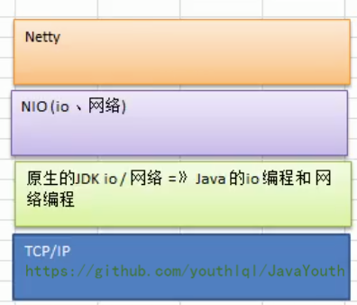

## 1.2 Netty有什么用？

- 核心用来：数据交互、通信使用！！！

- 互联网行业
  - 互联网行业：在分布式系统中，各个节点之间需要远程服务调用，高性能的 RPC 框架必不可少，Netty 作为**异步高性能的通信框架**，往往作为基础通信组件被这些 RPC 框架使用。
  - 典型的应用有：阿里分布式服务框架 Dubbo 的 RPC 框 架使用 Dubbo 协议进行节点间通信，Dubbo 协议默认使用 Netty 作为基础通信组件，用于实现各进程节点之间的内部通信。
-  游戏行业
  1. 无论是手游服务端还是大型的网络游戏，`Java` 语言得到了越来越广泛的应用。
  2. `Netty` 作为高性能的基础通信组件，提供了 `TCP/UDP` 和 `HTTP` 协议栈，方便定制和开发私有协议栈，账号登录服务器。
  3. 地图服务器之间可以方便的通过 `Netty` 进行高性能的通信。
- 大数据领域
  1. 经典的 `Hadoop` 的高性能通信和序列化组件 `Avro` 的 `RPC` 框架，默认采用 `Netty` 进行跨界点通信。
  2. 它的 `NettyService` 基于 `Netty` 框架二次封装实现。

## 1.3 如何学习Netty？

- 本系列学完后，可以参考几本书开始进阶，也可直接学习想学的知识点
  - 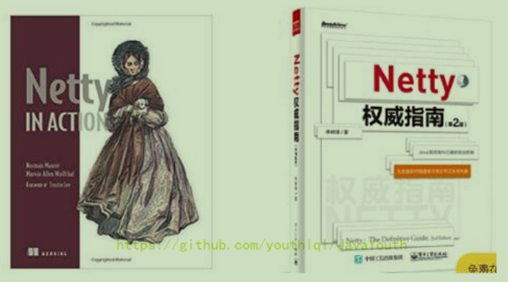

# 2. IO模型

- I/O 模型：就是用什么样的通道或者说是**通信模式和架构**进行数据的传输和接收，很大程度上决定了程序通信的性能，
- Java 共支持 3 种网络编程的/IO 模型：**BIO、NIO、AIO**
-  Java BIO
  - 同步并阻塞(传统阻塞型)，服务器实现模式为一个连接一个线程，即**客户端有连接请求时服务器端就需要启动一个线程进行处理**，如果这个连接不做任何事情会造成不必要的线程开销 
  - 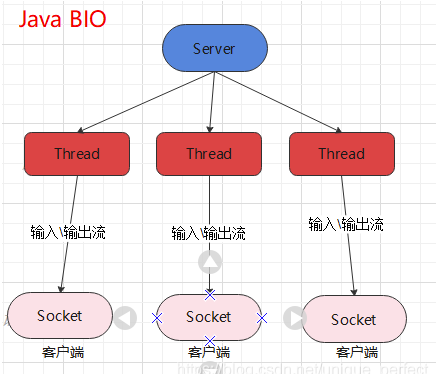
- **Java NIO ：可以认为是在BIO的基础上加了一层实现非阻塞**
  -  同步非阻塞，服务器实现模式为一个线程处理多个请求(连接)，即客户端发送的连接请求都会注册到多路复用器上，多路复用器轮询到连接有 I/O 请求就进行处理 
  - 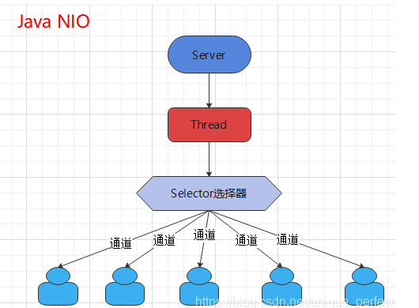
- Java AIO(NIO.2) ：联想操作系统的AIO，两阶段都有操作系统内核完成！
  -  异步非阻塞，服务器实现模式为一个有效请求一个线程，客户端的I/O请求都是由OS先完成了再通知服务器应用去启动线程进行处理，
  - 一般适用于连接数较多且连接时间较长的应用
  - 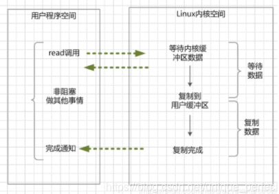
- 使用场景：
  - BIO：因为对服务器资源要求过高，并且并发局限于中，适用于连接数目小并且固定的架构，`JDK1.4` 以前的唯一选择，但程序简单易理解
  - NIO：适用于连接数目多且连接比较短（轻操作）的架构，比如聊天服务器，弹幕系统，服务器间通讯等。编程比较复杂，`JDK1.4` 开始支持。
    - 为什么适用连接较短的应用？如果连接较长，会导致selector一直只能选择处理较长的连接，其他连接还是需要等待、阻塞中
  - AIO：适用于连接数目多且连接比较长（重操作）的架构，比如相册服务器，充分调用 `OS` 参与并发操作，编程比较复杂，`JDK7` 开始支持。

# 3. Java BIO

- `Java BIO` 就是传统的 `Java I/O` 编程，其相关的类和接口在 `java.io`。

  - 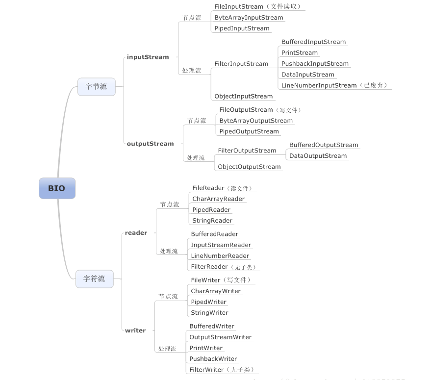
  - 

- `BIO(BlockingI/O)`：同步阻塞，服务器实现模式为一个连接一个线程，即客户端有连接请求时服务器端就需要启动一个线程进行处理，如果这个连接不做任何事情会造成不必要的线程开销，可以通过线程池机制改善

- **虽然BIO可以适用缓冲区来提高IO的读写性能，但是仍然不能改变BIO是同步阻塞的！**

- `BIO` 方式适用于连接数目比较小且固定的架构，这种方式对服务器资源要求比较高，并发局限于应用中，`JDK1.4` 以前的唯一选择，程序简单易理解。

- BIO工作机制：

  - 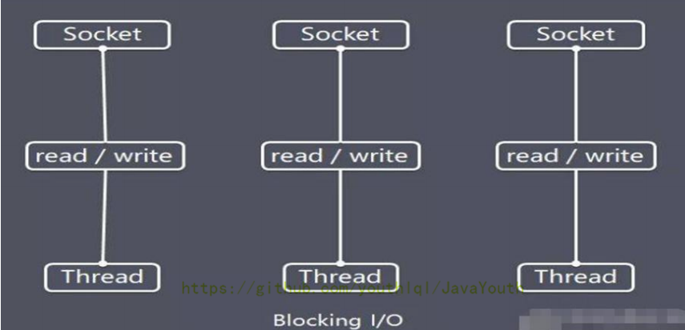
  - 主要流程：
    - 服务器端启动一个 `ServerSocket`。
    - 客户端启动 `Socket` 对服务器进行通信，默认情况下服务器端需要对每个客户建立一个线程与之通讯。
    - 客户端发出请求后，先咨询服务器是否有线程响应，如果没有则会等待，或者被拒绝。
    - 如果有响应，客户端线程会等待请求结束后，再继续执行。

- BIO 代码实例：

  - 使用 `BIO` 模型编写一个服务器端，监听 `6666` 端口，当有客户端连接时，就启动一个线程与之通讯。

  - 要求使用线程池机制改善，可以连接多个客户端。

  - 服务器端可以接收客户端发送的数据（`telnet` 方式即可）。

  - ```java
    package com.king.bio;
    
    import java.io.IOException;
    import java.io.InputStream;
    import java.net.ServerSocket;
    import java.net.Socket;
    import java.util.concurrent.ExecutorService;
    import java.util.concurrent.Executors;
    
    public class BIOServer {
        public static void main(String[] args) throws IOException {
            // 线程池
            ExecutorService executorService = Executors.newCachedThreadPool();
    
            // 创建一个服务器的socket，监听客户端
            ServerSocket serverSocket = new ServerSocket(6666);
            System.out.println("服务器启动了");
            while(true){
                System.out.println("线程信息id = " + Thread.currentThread().getId() + "名字 = " + Thread.currentThread().getName());
                // 获取一个客户端的socket
                //监听，等待客户端连接
                System.out.println("等待连接....");
                //会阻塞在accept()
                final Socket socket = serverSocket.accept();
                // 为什么可以使用final？
                // 每一次循环后final变量出了这个块的作用域范围就会失效，那么下次循环的时候就又可以使用这个final变量了
                // 为什么要使用final？
                // 假如传递到匿名内部类的局部变量，不加final修饰，那么意味着局部变量可以改变，这就意味着匿名内部类里面值的变更和外部的变量的变更不能同步，
                // 虽然内部类持有的是局部变量值的拷贝，但是语义应该保持一致，语义保持一致的前提是值要能同步，
                // 因为java编译器的设计无法提供两边同步变更的机制，所以直接锁死，不允许内外变更~
                System.out.println("连接到一个客户端");
                System.out.println("此时的客户端socket:"+socket);
                System.out.println("此时的客户端socket:"+socket.hashCode());
                // 开辟一个线程，来执行客户端的请求
                executorService.execute(new Runnable() {
                    @Override
                    public void run() {
                        // 处理客户端消息
                        handler(socket);
                    }
                });
            }
        }
        public static void handler(Socket socket){
    
            try {
                System.out.println("线程信息id = " + Thread.currentThread().getId() + "名字 = " + Thread.currentThread().getName());
                // 获取socket的输入流
                InputStream inputStream = socket.getInputStream();
                // 读取输入流
                byte[] bytes = new byte[1024];
                while(true){
                    // 只要客户端socket没有关闭，就一直会在这个循环里面
                    // 这里也会阻塞
                    System.out.println("线程信息id = " + Thread.currentThread().getId() + "名字 = " + Thread.currentThread().getName());
                    System.out.println("read....");
                    int read = inputStream.read(bytes);
                    if(read!=-1){
                        String temp = new String(bytes,0,read);
                        System.out.println(temp);
                    }else{
                        // read==-1，表示已经接收完一条socket消息
                        break;
                    }
                }
            } catch (IOException e) {
                e.printStackTrace();
            }finally {
                System.out.println("关闭和客户端的连接");
                // 关闭资源
                try {
                    socket.close();
                } catch (IOException e) {
                    e.printStackTrace();
                }
            }
    
        }
    
    }
    
    ```

  - 使用window的telnet来充当客户端：

    - cmd中输入：telnet 127.0.0.1 6666连接到服务器端
    - cmd中输入：ctril+]可以启动telnet的命令

  - 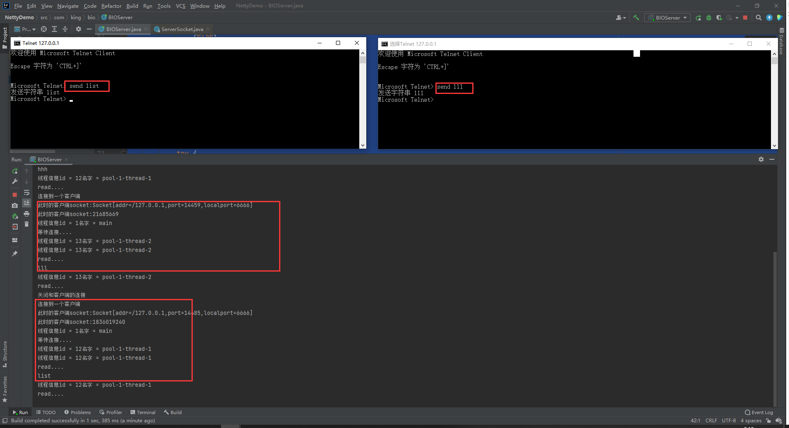

- 存在的问题：

  - 服务器端接收客户端请求也是**阻塞**的！
  - 每个请求都需要创建独立的线程
    - 与对应的客户端进行数据 `Read`=》业务处理=》数据 `Write`。
    - 读写操作都是**阻塞**的！
  - 当并发数较大时，需要创建大量线程来处理连接，系统资源占用较大。

# 4. Java NIO

- 什么是NIO？
  - Java NIO（New IO）也有人称之为 java non-blocking IO是从Java 1.4版本开始引入的一个新的IO API，可以替代标准的Java IO API。NIO与原来的IO有同样的作用和目的，但是使用的方式完全不同，NIO支持面**向缓冲区**的、基于**通道**的IO操作。NIO将以更加高效的方式进行文件的读写操作。NIO可以理解为非阻塞IO,传统的IO的read和write只能阻塞执行，线程在读写IO期间不能干其他事情，比如调用socket.read()时，如果服务器一直没有数据传输过来，线程就一直阻塞，而NIO中可以配置socket为非阻塞模式。
  - NIO 相关类都被放在 java.nio 包及子包下，并且对原 java.io 包中的很多类进行改写。
  - NIO 有三大核心部分：**Channel( 通道) ，Buffer( 缓冲区), Selector( 选择器)**
  - Java NIO 的非阻塞模式，使一个线程从某通道发送请求或者读取数据，但是它仅能得到目前可用的数据，如果目前没有数据可用时，就什么都不会获取，而不是保持线程阻塞，所以直至数据变的可以读取之前，该线程可以继续做其他的事情。 非阻塞写也是如此，一个线程请求写入一些数据到某通道，但不需要等待它完全写入，这个线程同时可以去做别的事情。
  - 通俗理解：NIO 是可以做到用一个线程来处理多个操作的。假设有 1000 个请求过来,根据实际情况，可以分配20 或者 80个线程来处理。不像之前的阻塞 IO 那样，非得分配 1000 个。
- NIO和BIO的区别？
  - BIO 以流的方式处理数据，而 NIO 以块的方式处理数据，块 I/O 的效率比流 I/O 高很多。
  - BIO 是阻塞的，NIO 则是非阻塞的。
  - BIO 基于字节流和字符流进行操作，而 NIO 基于 Channel（通道）和 Buffer（缓冲区）进行操作，数据总是从通道读取到缓冲区中，或者从缓冲区写入到通道中。Selector（选择器）用于监听多个通道的事件（比如：连接请求，数据到达等），因此使用单个线程就可以监听多个客户端通道。
  - Buffer和Channel之间的数据流向是双向的
- 再次理解NIO？
  - 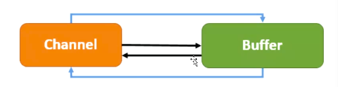
  - BIO通过流来读写：但是流是单向的！
  - **要想做到能够双向读取，并且不阻塞=》NIO思想：加两层**
    - Channel操作方向
    - Buffer操作数据
    - 来实现双向读取
    - Selector实现不阻塞！
- NIO三大核心的关系：
  - 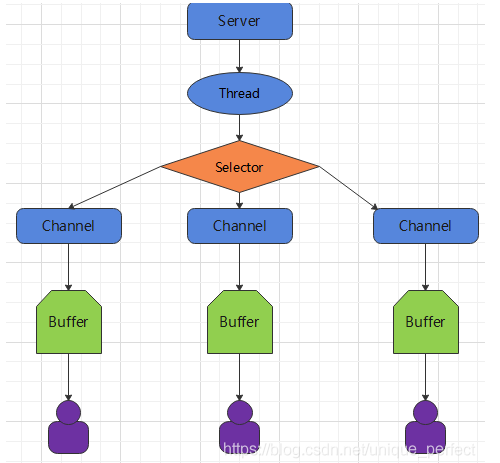
  - 每个 `Channel` 都会对应一个 `Buffer`。
  - `Selector` 对应一个线程，一个线程对应多个 `Channel`（连接）。
  - 该图反应了有三个 `Channel` 注册到该 `Selector` 程序
  - Server切换到哪个 `Channel` 是由事件(selector根据事件选择)决定的，`Event` 就是一个重要的概念。
  - `Selector` 会根据不同的事件，在各个通道上切换。
  - `Buffer` 就是一个内存块，底层是有一个数组
    - 数据的读取写入是通过 Buffer完成的 , BIO 中要么是输入流，或者是输出流, 不能双向，但是 NIO 的 Buffer 是可以读也可以写。需要 `flip` 方法切换， `Channel` 是双向的，可以返回底层操作系统的情况，比如 `Linux`，底层的操作系统通道就是双向的。
  - Java NIO系统的核心在于：通道(Channel)和缓冲区 (Buffer)。通道表示打开到 IO 设备(例如：文件、 套接字)的连接。若需要使用 NIO 系统，需要获取 用于连接 IO 设备的通道以及用于容纳数据的缓冲区。然后操作缓冲区，对数据进行处理。简而言之，Channel 负责传输， Buffer 负责存取数据

## 4.1 Buffer

- 缓冲区（Buffer）：缓冲区本质上是一个可以读写数据的内存块，可以理解成是一个容器对象（含数组），该对象提供了一组方法，可以更轻松地使用内存块，缓冲区对象内置了一些机制，能够跟踪和记录缓冲区的状态变化情况。Channel 提供从文件、网络读取数据的渠道，但是读取或写入的数据都必须经由 Buffer

  - 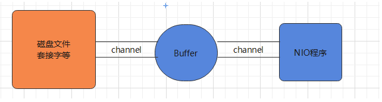

- Buffer类以及子类：以下建议直接看源码

  - 在 `NIO` 中，`Buffer` 是一个顶层父类，它是一个抽象类，

  - **Buffer** 就像一个数组，可以保存多个相同类型的数据。根 据数据类型不同 ，有以下 Buffer 常用子类： 

    * ByteBuffer 
    * CharBuffer 
    * ShortBuffer 
    * IntBuffer 
    * LongBuffer 
    * FloatBuffer 
    * DoubleBuffer 

  - 上述 Buffer 类 他们都采用相似的方法进行管理数据，只是各自 管理的数据类型不同而已。都是通过如下方法获取一个 Buffer 对象：

  - ```java
    static XxxBuffer allocate(int capacity) : 创建一个容量为capacity 的 XxxBuffer 对象
    ```

- Buffer基本属性(类变量、域)：

  - **容量 (capacity)** ：作为一个内存块，Buffer具有一定的固定大小，也称为"容量"，缓冲区容量不能为负，并且创建后不能更改。 
  - **限制 (limit)**：表示缓冲区中可以操作数据的大小（limit 后数据不能进行读写）。缓冲区的限制不能为负，并且不能大于其容量。 **写入模式，限制等于buffer的容量。读取模式下，limit等于写入的数据量**。
  - **位置 (position)**：下一个要读取或写入的数据的索引。缓冲区的位置不能为 负，并且不能大于其限制 
  - **标记 (mark)与重置 (reset)**：标记是一个索引，通过 Buffer 中的 mark() 方法 指定 Buffer 中一个特定的 position，之后可以通过调用 reset() 方法恢复到这 个 position.
    **标记、位置、限制、容量遵守以下不变式： 0 <= mark <= position <= limit <= capacity**
  - **图示:**
  - 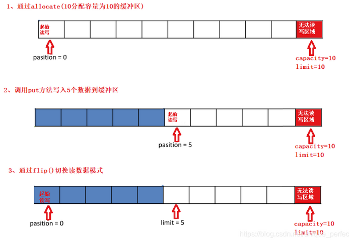

- Buffer常用方法：

  - ```java
    Buffer clear() 清空缓冲区并返回对缓冲区的引用
    Buffer flip() 为 将缓冲区的界限设置为当前位置，并将当前位置充值为 0
    int capacity() 返回 Buffer 的 capacity 大小
    boolean hasRemaining() 判断缓冲区中是否还有元素
    int limit() 返回 Buffer 的界限(limit) 的位置
    Buffer limit(int n) 将设置缓冲区界限为 n, 并返回一个具有新 limit 的缓冲区对象
    Buffer mark() 对缓冲区设置标记
    int position() 返回缓冲区的当前位置 position
    Buffer position(int n) 将设置缓冲区的当前位置为 n , 并返回修改后的 Buffer 对象
    int remaining() 返回 position 和 limit 之间的元素个数
    Buffer reset() 将位置 position 转到以前设置的 mark 所在的位置
    Buffer rewind() 将位置设为为 0， 取消设置的 mark
    ```

  - ```java
    // Buffer 所有子类提供了两个用于数据操作的方法：get()put() 方法
    // 取获取 Buffer中的数据
    get() ：读取单个字节
    get(byte[] dst)：批量读取多个字节到 dst 中
    get(int index)：读取指定索引位置的字节(不会移动 position)
        
    // 放入数据到 Buffer 中 
    put(byte b)：将给定单个字节写入缓冲区的当前位置
    put(byte[] src)：将 src 中的字节写入缓冲区的当前位置
    put(int index, byte b)：将指定字节写入缓冲区的索引位置(不会移动 position)
    ```

- 如何使用Buffer？

  - **使用Buffer读写数据一般遵循以下四个步骤：**

    * 1.写入数据到Buffer
    * 2.调用flip()方法，转换为读取模式
    * 3.从Buffer中读取数据
    * 4.调用buffer.clear()方法或者buffer.compact()方法清除缓冲区

- 代码实例：

  - ```java
    package com.king.nio.buffer;
    
    import java.nio.ByteBuffer;
    import java.nio.charset.StandardCharsets;
    
    public class BufferTest {
            public static void main(String[] args) {
                ByteBuffer buffer = ByteBuffer.allocate(1024);
                // 查看使用的存储方式是什么？
                System.out.println(buffer.isDirect());
                String str1 = "itheima";
                System.out.println("存储前的各个属性值：");
                System.out.println(buffer);
                // 存储
                buffer.put(str1.getBytes());
                System.out.println("存储后的各个属性值：");
                System.out.println(buffer);
                // 读取
                buffer.flip();
                byte[] dst1 = new byte[buffer.limit()];
                buffer.get(dst1, 0, 2);
                System.out.println(new String(dst1, 0, 2));
                System.out.println("读取后的各个属性值：");
                System.out.println(buffer);
    
                //mark() : 标记
                buffer.mark();
                System.out.println("标记后的各个属性值：");
                System.out.println(buffer);
                buffer.get(dst1, 2, 2);
                System.out.println(new String(dst1, 2, 2));
                System.out.println("读取后的各个属性值：");
                System.out.println(buffer);
    
                //reset() : 恢复到 mark 的位置
                buffer.reset();
                System.out.println("reset后的各个属性值：");
                System.out.println(buffer);
    
                //判断缓冲区中是否还有剩余数据
                if(buffer.hasRemaining()){
                    //获取缓冲区中可以操作的数量
                    System.out.println(buffer.remaining());
                }
    
    
                String str = "itheima";
                //1. 分配一个指定大小的缓冲区
                ByteBuffer buf = ByteBuffer.allocate(1024);
                System.out.println("-----------------allocate()----------------");
                System.out.println(buf.position());
                System.out.println(buf.limit());
                System.out.println(buf.capacity());
    
                //2. 利用 put() 存入数据到缓冲区中
                buf.put(str.getBytes());
                System.out.println("-----------------put()----------------");
                System.out.println(buf.position());
                System.out.println(buf.limit());
                System.out.println(buf.capacity());
    
                //3. 切换读取数据模式
                buf.flip();
                System.out.println("-----------------flip()----------------");
                System.out.println(buf.position());
                System.out.println(buf.limit());
                System.out.println(buf.capacity());
    
                //4. 利用 get() 读取缓冲区中的数据
                byte[] dst = new byte[buf.limit()];
                buf.get(dst);
                System.out.println(new String(dst, 0, dst.length));
    
                System.out.println("-----------------get()----------------");
                System.out.println(buf.position());
                System.out.println(buf.limit());
                System.out.println(buf.capacity());
                //5. rewind() : 可重复读
                buf.rewind();
                System.out.println("-----------------rewind()----------------");
                System.out.println(buf.position());
                System.out.println(buf.limit());
                System.out.println(buf.capacity());
    
                //6. clear() : 清空缓冲区. 但是缓冲区中的数据依然存在，但是处于“被遗忘”状态,下次在Put数据直接覆盖即可
                buf.clear();
                System.out.println("-----------------clear()----------------");
                System.out.println(buf.position());
                System.out.println(buf.limit());
                System.out.println(buf.capacity());
                System.out.println((char)buf.get());
    
    
    
        }
    }
    
    ```

- **Buffer使用总结：看源码即可知道原理**

  - 底层数据存储使用final修饰对应的数据类型的数组
  - 数据的增删改查使用：四个标志(四个指针)来实现

- **直接缓冲区和非直接缓冲区**

  - `bytebuffer`可以是两种类型，
    - 一种是基于直接内存（也就是非堆内存）；
    - 另一种是非直接内存（也就是堆内存）。
    - 对于直接内存来说，JVM将会在IO操作上具有更高的性能，因为它直接作用于本地系统的IO操作。
      - 也就是：本地IO-->直接内存-->本地IO
    - 而非直接内存，也就是堆内存中的数据，如果要作IO操作，会先从本进程内存复制到直接内存，再利用本地IO处理。
      - 也就是：本地IO-->直接内存-->非直接内存(Java堆)-->直接内存-->本地IO
  - 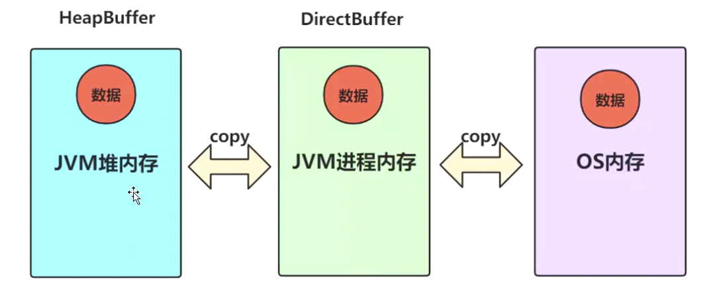
    - 有点类似JVM中的元空间的引入：就可以直接放在直接内存
  - 很明显，在做IO处理时，比如网络发送大量数据时，直接内存会具有更高的效率。直接内存使用allocateDirect创建，但是它比申请普通的堆内存需要耗费更高的性能。不过，这部分的数据是在JVM之外的，因此它不会占用应用的内存。所以呢，**当你有很大的数据要缓存，并且它的生命周期又很长**，那么就比较适合使用直接内存。
  - 只是一般来说，如果不是能带来很明显的性能提升，还是推荐直接使用堆内存。字节缓冲区是直接缓冲区还是非直接缓冲区可通过调用其 isDirect()  方法来确定。
  - **使用场景**
    - 1 有很大的数据需要存储，它的生命周期又很长
    - 2 适合频繁的IO操作，比如网络并发场景

## 4.2 Channel

- 通道（Channel）：由 java.nio.channels 包定义。 Channel 类似于传统的“流”。只不过 Channel 本身不能直接访问数据，Channel 只能与 Buffer 进行交互。

  - 
  -  NIO 的通道类似于流，但有些区别如下：

    * 通道可以同时进行读写，而流只能读或者只能写
    * 通道可以实现异步读写数据
    * 通道可以从缓冲读数据，也可以写数据到缓冲
    * Channel 在 NIO 中是一个接口
    * 流在BIO中是一个抽象类

  - BIO 中的 stream 是单向的，例如 FileInputStream 对象只能进行读取数据的操作，而 NIO 中的通道(Channel)  是双向的，可以读操作，也可以写操作。

- Channel的实现类：

  - 一般都是实现Channel接口，并且继承xxxChannel抽象类，一般使用都是使用抽象类的实现类：如：FileChannel的使用是真正调用FileChannelIml实现类
  - FileChannel：用于读取、写入、映射和操作文件的通道。
  - DatagramChannel：通过 UDP 读写网络中的数据通道。
  - SocketChannel：通过 TCP 读写网络中的数据。
  - ServerSocketChannel：可以监听新进来的 TCP 连接，对每一个新进来的连接都会创建一个 SocketChannel。 
    - 【ServerSocketChanne 类似 ServerSocket , SocketChannel 类似 Socket】

- 如何获取Channel？

  - Channel和IO流是组合关系=》装饰者模式！
  - 常用的IO操作的类里面组合了Channel，通过getChannel() 方法就可以获取
    - FileInputStream=》获取的channel只可以用来read到内存中
    - FileOutputStream=》获取的channel只可以用来write到文件中
    - RandomAccessFile=》获取的channel可以指定可读可写都可以用
    - DatagramSocket
  - 获取Channel的其他方式是使用 Files 类的静态方法newByteChannel() 获取字节通道。或者通过Channel的静态方法 open() 打开并返回指定通道

- FileChannel类：

  - FileChannel 主要用来对本地文件进行 IO 操作，常见的方法有

  - ```java
    int read(ByteBuffer dst) 从  Channel 中读取数据到  ByteBuffer
    long  read(ByteBuffer[] dsts)  将  Channel 到 中的数据“分散”到  ByteBuffer[]
    int  write(ByteBuffer src) 将  ByteBuffer 到 中的数据写入到  Channel
    long write(ByteBuffer[] srcs) 将  ByteBuffer[] 到 中的数据“聚集”到  Channel
    long position() 返回此通道的文件位置
    FileChannel position(long p) 设置此通道的文件位置
    long size() 返回此通道的文件的当前大小
    FileChannel truncate(long s) 将此通道的文件截取为给定大小
    void force(boolean metaData) 强制将所有对此通道的文件更新写入到存储设备中
    ```

  - 

- **代码示例1：数据写入到本地文件！**

  - 思路：数据=》Buffer=》Channel=》本地文件

  - 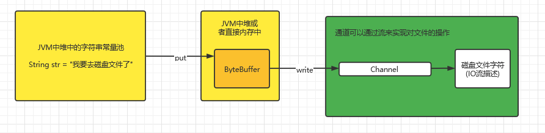

  - ```java
    package com.king.nio.channel;
    
    import java.io.FileNotFoundException;
    import java.io.FileOutputStream;
    import java.io.IOException;
    import java.nio.ByteBuffer;
    import java.nio.channels.FileChannel;
    import java.nio.charset.StandardCharsets;
    
    public class ChannelTest {
        public static void main(String[] args) throws IOException {
            // 1.从JVM堆内存中将数据存储到磁盘文件中
    
            String str = "我要去磁盘文件了";
    
            // 创建一个输出流
            FileOutputStream fileOutputStream = new FileOutputStream("./file.text");
            // 从文件输出流中获取对应的文件通道
            // 这个fileOutputStreamChannel实际类型是：FileChannel
            FileChannel fileOutputStreamChannel = fileOutputStream.getChannel();
    
            // 创建一个缓冲区
            ByteBuffer byteBuffer = ByteBuffer.allocate(1024);
    
            // 将字符串数据放入缓冲区
            byteBuffer.put(str.getBytes(StandardCharsets.UTF_8));
    
            // 转换模式，读取缓冲区里面的数据
            byteBuffer.flip();
    
            // 将缓冲区里面的数据通过通道写入到文件中
            fileOutputStreamChannel.write(byteBuffer);
            fileOutputStream.close();
    
        }
    }
    
    ```

- **代码示例2：本地文件读取数据**

  - 思路：本地文件=》channel=》Buffer=》数据

  - 

  - ```java
    package com.king.nio.channel;
    
    import java.io.*;
    import java.nio.ByteBuffer;
    import java.nio.channels.FileChannel;
    import java.nio.charset.StandardCharsets;
    
    public class ChannelTest {
        public static void main(String[] args) throws IOException {
            // 1.从JVM堆内存中将数据存储到磁盘文件中
    
            String str = "我要去磁盘文件了\n";
    
            // 创建一个输出流
            FileOutputStream fileOutputStream = new FileOutputStream("./file.text");
            // 从文件输出流中获取对应的文件通道
            // 这个fileOutputStreamChannel实际类型是：FileChannel
            FileChannel fileOutputStreamChannel = fileOutputStream.getChannel();
    
            // 创建一个缓冲区
            ByteBuffer byteBuffer = ByteBuffer.allocate(1024);
    
            // 将字符串数据放入缓冲区
            byteBuffer.put(str.getBytes(StandardCharsets.UTF_8));
    
            // 转换模式，读取缓冲区里面的数据
            byteBuffer.flip();
    
            // 将缓冲区里面的数据通过通道写入到文件中
            fileOutputStreamChannel.write(byteBuffer);
            fileOutputStream.close();
    
            // 创建文件输入流
            File file = new File("./file.text");
            FileInputStream fileInputStream = new FileInputStream(file);
            // 从文件输入流中获取对应的文件通道
            // 这个fileInputStreamChannel实际类型是：FileChannel
            FileChannel fileInputStreamChannel = fileInputStream.getChannel();
    
            // 创建一个缓存区来对接通道
            ByteBuffer fileBuffer = ByteBuffer.allocate((int) file.length());
    
            // 将通道中的数据读入到Buffer中（此时Buffer数据已经在JVM内存中了）
            fileInputStreamChannel.read(fileBuffer);
    
            // 将buffer中的数据读转换位String并且显示出来
            String temp = new String(fileBuffer.array());
            System.out.println(temp);
            // 关闭资源
            fileInputStream.close();
    
    
    
        }
    }
    ```

- **代码示例3：使用一个buffer完成文件读取和写入**

  - 思路：文件数据=》Channel=》Buffer=》Channel=》文件数据

  - 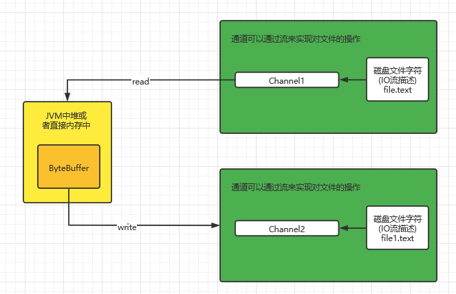

  - ```java
    package com.king.nio.channel;
    
    import java.io.FileInputStream;
    import java.io.FileNotFoundException;
    import java.io.FileOutputStream;
    import java.nio.ByteBuffer;
    import java.nio.channels.FileChannel;
    
    public class ChannelTest2 {
        public static void main(String[] args) throws Exception {
            // 获取文件输入输出流和对应的channel
            FileInputStream fileInputStream = new FileInputStream("./file.text");
            FileChannel fileInputStreamChannel = fileInputStream.getChannel();
    
            FileOutputStream fileOutputStream = new FileOutputStream("./file1.text");
            FileChannel fileOutputStreamChannel = fileOutputStream.getChannel();
    
            // 创建一个Buffer用来对接Channel，进行读取操作
            ByteBuffer byteBuffer = ByteBuffer.allocate(512);
    
            // 循环读取
            while(true){
                // 从channel中读取数据，需要先clear buffer，清空缓冲区
                byteBuffer.clear();
                // 将数据读取到缓冲区中
                int read = fileInputStreamChannel.read(byteBuffer);
                System.out.println("此时：read:"+read);
                if(read==-1){
                    // 全部读取到了缓存区
                    break;
                }
                // 将缓存区中的数据写入到另一个文件中
                byteBuffer.flip();
                fileOutputStreamChannel.write(byteBuffer);
            }
    
            // 关闭对应的流
            fileInputStream.close();
            fileOutputStream.close();
    
        }
    }
    
    ```

- **代码示例4：拷贝文件**

  - 使用transferFrom()或者transferTo()实现文件拷贝操作=》更加方便快捷

    - 内置使用还是一样使用了buffer来实现

  - ```java
    package com.king.nio.channel;
    
    import java.io.FileInputStream;
    import java.io.FileNotFoundException;
    import java.io.FileOutputStream;
    import java.nio.channels.FileChannel;
    
    public class ChannelTest3 {
        public static void main(String[] args) throws Exception {
            // 获取对应的channel
            FileInputStream fileInputStream = new FileInputStream("./file.text");
            FileChannel fileInputStreamChannel = fileInputStream.getChannel();
    
            FileOutputStream fileOutputStream = new FileOutputStream("./copy.text");
            FileChannel fileOutputStreamChannel = fileOutputStream.getChannel();
    
            // 复制：
            // transferFrom:从fileInputStreamChannel中读取数据到fileOutputStreamChannel
    //        fileOutputStreamChannel.transferFrom(fileInputStreamChannel,fileInputStreamChannel.position(),fileInputStreamChannel.size());
    
    
    
            //复制；
            // transferTo：从fileInputStreamChannel中读取数据到fileOutputStreamChannel
            fileInputStreamChannel.transferTo(fileInputStreamChannel.position(),fileInputStreamChannel.size(),fileOutputStreamChannel);
    
            fileInputStream.close();
            fileOutputStream.close();
    
        }
    }
    
    ```

## 4.3 Buffer与Channel注意

- `ByteBuffer` 支持类型化的 `put` 和 `get`，`put` 放入的是什么数据类型，`get` 就应该使用相应的数据类型来取出，否则可能有`BufferUnderflowException` 异常。【举例说明】

  - ```java
    public class NIOByteBufferPutGet {
    
        public static void main(String[] args) {
            
            //创建一个 Buffer
            ByteBuffer buffer = ByteBuffer.allocate(64);
    
            //类型化方式放入数据
            buffer.putInt(100);
            buffer.putLong(9);
            buffer.putChar('尚');
            buffer.putShort((short) 4);
    
            //取出
            buffer.flip();
            
            System.out.println();
            
            System.out.println(buffer.getInt());
            System.out.println(buffer.getLong());
            System.out.println(buffer.getChar());
            System.out.println(buffer.getShort());
        }
    }
    ```

- 可以将一个普通 `Buffer` 转成只读 `Buffer`【举例说明】

  - ```java
    public class ReadOnlyBuffer {
    
        public static void main(String[] args) {
    
            //创建一个 buffer
            ByteBuffer buffer = ByteBuffer.allocate(64);
    
            for (int i = 0; i < 64; i++) {
                buffer.put((byte) i);
            }
    
            //读取
            buffer.flip();
    
            //得到一个只读的 Buffer
            ByteBuffer readOnlyBuffer = buffer.asReadOnlyBuffer();
            System.out.println(readOnlyBuffer.getClass());
    
            //读取
            while (readOnlyBuffer.hasRemaining()) {
                System.out.println(readOnlyBuffer.get());
            }
    
            readOnlyBuffer.put((byte) 100); //ReadOnlyBufferException
        }
    }
    ```

- `NIO` 还提供了 `MappedByteBuffer`，可以让文件直接在内存（堆外的内存）中进行修改，而无需同步到文件由 `NIO` 来完成。【举例说明】

  - ```java
    /**
     * 说明 1.MappedByteBuffer 可让文件直接在内存（堆外内存）修改,操作系统不需要拷贝一次
     */
    public class MappedByteBufferTest {
    
        public static void main(String[] args) throws Exception {
    
            RandomAccessFile randomAccessFile = new RandomAccessFile("1.txt", "rw");
            //获取对应的通道
            FileChannel channel = randomAccessFile.getChannel();
    
            /**
             * 参数 1:FileChannel.MapMode.READ_WRITE 使用的读写模式
             * 参数 2：0：可以直接修改的起始位置
             * 参数 3:5: 是映射到内存的大小（不是索引位置），即将 1.txt 的多少个字节映射到内存
             * 可以直接修改的范围就是 0-5
             * 实际类型 DirectByteBuffer
             */
            MappedByteBuffer mappedByteBuffer = channel.map(FileChannel.MapMode.READ_WRITE, 0, 5);
    
            mappedByteBuffer.put(0, (byte) 'H');
            mappedByteBuffer.put(3, (byte) '9');
            mappedByteBuffer.put(5, (byte) 'Y');//IndexOutOfBoundsException
    
            randomAccessFile.close();
            System.out.println("修改成功~~");
        }
    }
    ```

- `NIO` 还支持通过多个 `Buffer`（即 `Buffer`数组）完成读写操作，即 `Scattering` 和 `Gathering`【举例说明】

  - ```java
    //分散和聚集
    @Test
    public void test() throws IOException{
    		RandomAccessFile raf1 = new RandomAccessFile("1.txt", "rw");
    	//1. 获取通道
    	FileChannel channel1 = raf1.getChannel();
    	
    	//2. 分配指定大小的缓冲区
    	ByteBuffer buf1 = ByteBuffer.allocate(100);
    	ByteBuffer buf2 = ByteBuffer.allocate(1024);
    	
    	//3. 分散读取
    	ByteBuffer[] bufs = {buf1, buf2};
    	channel1.read(bufs);
    	
    	for (ByteBuffer byteBuffer : bufs) {
    		byteBuffer.flip();
    	}
    	
    	System.out.println(new String(bufs[0].array(), 0, bufs[0].limit()));
    	System.out.println("-----------------");
    	System.out.println(new String(bufs[1].array(), 0, bufs[1].limit()));
    	
    	//4. 聚集写入
    	RandomAccessFile raf2 = new RandomAccessFile("2.txt", "rw");
    	FileChannel channel2 = raf2.getChannel();
    	
    	channel2.write(bufs);
    }
    ```

  - ```java
    /**
     * Scattering：将数据写入到 buffer 时，可以采用 buffer 数组，依次写入 [分散]
     * Gathering：从 buffer 读取数据时，可以采用 buffer 数组，依次读
     */
    public class ScatteringAndGatheringTest {
    
        public static void main(String[] args) throws Exception {
            
            //使用 ServerSocketChannel 和 SocketChannel 网络
            ServerSocketChannel serverSocketChannel = ServerSocketChannel.open();
            InetSocketAddress inetSocketAddress = new InetSocketAddress(7000);
    
            //绑定端口到 socket，并启动
            serverSocketChannel.socket().bind(inetSocketAddress);
    
            //创建 buffer 数组
            ByteBuffer[] byteBuffers = new ByteBuffer[2];
            byteBuffers[0] = ByteBuffer.allocate(5);
            byteBuffers[1] = ByteBuffer.allocate(3);
    
            //等客户端连接 (telnet)
            SocketChannel socketChannel = serverSocketChannel.accept();
    
            int messageLength = 8; //假定从客户端接收 8 个字节
    
            //循环的读取
            while (true) {
                int byteRead = 0;
    
                while (byteRead < messageLength) {
                    long l = socketChannel.read(byteBuffers);
                    byteRead += l; //累计读取的字节数
                    System.out.println("byteRead = " + byteRead);
                    //使用流打印,看看当前的这个 buffer 的 position 和 limit
                    Arrays.asList(byteBuffers).stream().map(buffer -> "position = " + buffer.position() + ", limit = " + buffer.limit()).forEach(System.out::println);
                }
    
                //将所有的 buffer 进行 flip
                Arrays.asList(byteBuffers).forEach(buffer -> buffer.flip());
                //将数据读出显示到客户端
                long byteWirte = 0;
                while (byteWirte < messageLength) {
                    long l = socketChannel.write(byteBuffers);//
                    byteWirte += l;
                }
                
                //将所有的buffer进行clear
                Arrays.asList(byteBuffers).forEach(buffer -> {
                    buffer.clear();
                });
                
                System.out.println("byteRead = " + byteRead + ", byteWrite = " + byteWirte + ", messagelength = " + messageLength);
            }
        }
    }
    ```


## 4.4 Selector

- 选择器（Selector）： 是 SelectableChannle 对象的多路复用器，Selector 可以同时监控多个 SelectableChannel 的 IO 状况，也就是说，利用 Selector可使一个单独的线程管理多个 Channel。Selector 是非阻塞 IO 的核心

  - Selector 能够检测多个注册的通道上是否有事件发生（注意：多个 Channel 以事件的方式可以注册到同一个 Selector），如果有事件发生，便获取事件然后针对每个事件进行相应的处理。这样就可以只用一个单线程去管理多个通道，也就是管理多个连接和请求。
  - 只有在连接/通道真正有读写事件发生时，才会进行读写，就大大地减少了系统开销，并且不必为每个连接都创建一个线程，不用去维护多个线程。
  - 避免了多线程之间的上下文切换导致的开销。
  - 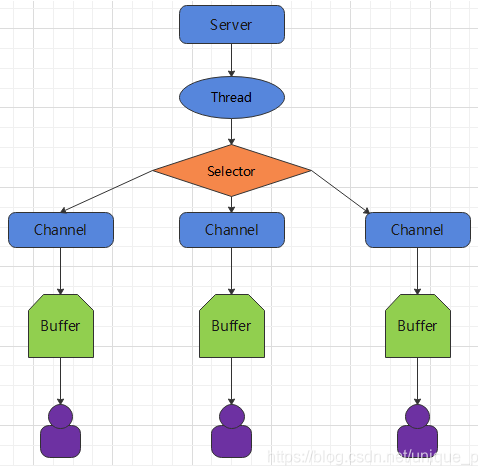
    - Netty的IO线程NioEventLoop聚合了Selector(选择器，也可以叫多路复用器)，可以同时并发处理很多个客户端连接
    - 当线程从某客户端 Socket 通道进行读写数据时，若没有数据可用时，该线程可以进行其他任务。线程通常将非阻塞 IO 的空闲时间用于在其他通道上执行 IO 操作，所以单独的线程可以管理多个输入和输出通道。
    - 由于读写操作都是非阻塞的，这就可以充分提升 IO 线程的运行效率，避免由于频繁 I/O 阻塞导致的线程挂起。
    - 一个 `I/O` 线程可以并发处理 `N` 个客户端连接和读写操作，这从根本上解决了传统同步阻塞 `I/O` 一连接一线程模型，架构的性能、弹性伸缩能力和可靠性都得到了极大的提升

- Selector类相关方法

  - Selector是一个抽象类

    - ```java
      public abstract class Selector implements Closeable {
      
          protected Selector() { }
      	// 得到一个选择器对象
          public static Selector open() throws IOException {
              return SelectorProvider.provider().openSelector();
          }
          public abstract boolean isOpen();
      
          public abstract SelectorProvider provider();
      
        
          public abstract Set<SelectionKey> keys();
       	// 从内部集合中得到所有的selectionKey()
          public abstract Set<SelectionKey> selectedKeys();
      
          
          public abstract int selectNow() throws IOException;
          // 监控所有注册的通道，当有IO操作可以进行时，将对应的SelectKey加入到内部集合中，并且返回，参数可以设置超时时间
          public abstract int select(long timeout)
              throws IOException;
          
          public abstract int select() throws IOException;
          public abstract Selector wakeup();
          public abstract void close() throws IOException;
      
      }
      ```

  - NIO 中的 ServerSocketChannel 功能类似 ServerSocket、SocketChannel 功能类似 Socket。

  - Selector 相关方法说明

    - selector.select(); //阻塞
    - selector.select(1000); //阻塞 1000 毫秒，在 1000 毫秒后返回
    - selector.wakeup(); //唤醒 selector
    - selector.selectNow(); //不阻塞，立马返还

- NIO非阻塞模型网络编程原理分析图：

  - `NIO` 非阻塞网络编程相关的（`Selector`、`SelectionKey`、`ServerScoketChannel` 和 `SocketChannel`）关系梳理图
  - 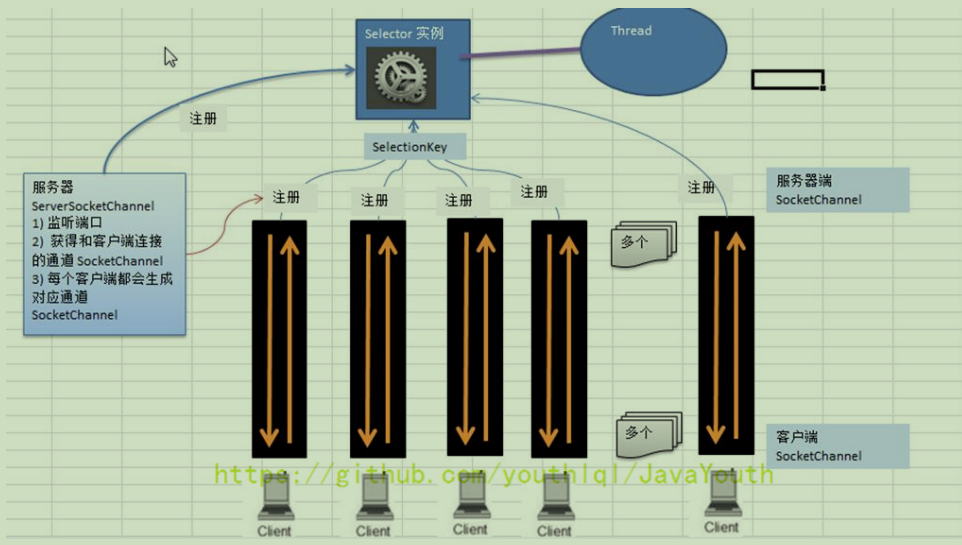
    - 当客户端连接时，会通过 ServerSocketChannel 得到 SocketChannel。
    - Selector 进行监听 select 方法，返回有事件发生的通道的个数。
    - 将 socketChannel 注册到 Selector 上，register(Selector sel, int ops)，一个 Selector 上可以注册多个 SocketChannel。
    - 注册后返回一个 SelectionKey，会和该 Selector 关联（集合）。
      进一步得到各个 SelectionKey（有事件发生）。
    - 在通过 SelectionKey 反向获取 SocketChannel，方法 channel()。
    - 可以通过得到的 channel，完成业务处理。

- 代码示例：NIO实现非阻塞服务端和客户端数据传输

  - ```java
    package com.king.nio.selector;
    
    import java.io.IOException;
    import java.net.InetSocketAddress;
    import java.nio.ByteBuffer;
    import java.nio.channels.SelectionKey;
    import java.nio.channels.Selector;
    import java.nio.channels.ServerSocketChannel;
    import java.nio.channels.SocketChannel;
    import java.util.Iterator;
    import java.util.Set;
    
    public class NIOServer {
        public static void main(String[] args) throws Exception {
            // 创建ServerSocketChannel=>等同于BIO中的ServerSocket
            ServerSocketChannel serverSocketChannel = ServerSocketChannel.open();
    
            /// 得到一个selector对象
            Selector selector = Selector.open();
    
            // 服务器端绑定一个端口，并且监听
            serverSocketChannel.socket().bind(new InetSocketAddress(6666));
            // 设置为非阻塞
            serverSocketChannel.configureBlocking(false);
    
            // 把通道注册到选择器上，并且指定监听事件为OP_ACCEPT
            serverSocketChannel.register(selector, SelectionKey.OP_ACCEPT);
    
            System.out.println("注册后的selectionkey 数量=" + selector.keys().size()); // 1
    
            // 循环等待客户端连接
            while(true){
                // 此时等待一秒。如果没有事件发生就返回循环，继续等待
                if(selector.select(1000)==0){// 表示没有事件发生
                    System.out.println("服务器等待了1秒，无新的连接");
                    continue;
                }else{
                    // 有事件发生，获取相关的selectionKey集合=》对应的关注的事件
                    Set<SelectionKey> selectionKeys = selector.selectedKeys();
                    System.out.println("selectionKeys 数量 = " + selectionKeys.size());
    
                    // 通过selectionKeys反向获取通道
                    Iterator<SelectionKey> keyIterator = selectionKeys.iterator();
                    while(keyIterator.hasNext()){
                        // 获取到selectionKey
                        SelectionKey key = keyIterator.next();
                        // 根据key的事件，对应通道发生的事件，并且做出处理
                        if(key.isAcceptable()){
                            // 如果是OP_ACCEPT，表示有新的客户端连接
                            SocketChannel socketChannel = serverSocketChannel.accept();
                            System.out.println("客户端连接成功 生成了一个 socketChannel " + socketChannel.hashCode());
                            //将  SocketChannel 设置为非阻塞
                            socketChannel.configureBlocking(false);
                            //将socketChannel 注册到selector, 关注事件为 OP_READ， 同时给socketChannel关联一个Buffer
                            socketChannel.register(selector, SelectionKey.OP_READ, ByteBuffer.allocate(1024));
    
                            System.out.println("客户端连接后 ，注册的selectionkey 数量=" + selector.keys().size()); //2,3,4..
                        }
                        if(key.isReadable()) {  //发生 OP_READ
    
                            //通过key 反向获取到对应channel
                            SocketChannel channel = (SocketChannel)key.channel();
    
                            //获取到该channel关联的buffer
                            ByteBuffer buffer = (ByteBuffer)key.attachment();
                            channel.read(buffer);
                            System.out.println("form 客户端 " + new String(buffer.array()));
    
                        }
                        //手动从集合中移动当前的selectionKey, 防止重复操作
                        keyIterator.remove();
    
                    }
    
                }
    
    
            }
    
        }
    }
    
    ```

  - ```java
    package com.king.nio.selector;
    
    
    import java.net.InetSocketAddress;
    import java.nio.ByteBuffer;
    import java.nio.channels.SocketChannel;
    import java.text.SimpleDateFormat;
    import java.util.Scanner;
    
    public class NIOClient {
        public static void main(String[] args) throws Exception{
    
            //得到一个网络通道
            SocketChannel socketChannel = SocketChannel.open();
            //设置非阻塞
            socketChannel.configureBlocking(false);
            //提供服务器端的ip 和 端口
            InetSocketAddress inetSocketAddress = new InetSocketAddress("127.0.0.1", 6666);
            //连接服务器
            if (!socketChannel.connect(inetSocketAddress)) {
    
                while (!socketChannel.finishConnect()) {
                    System.out.println("因为连接需要时间，客户端不会阻塞，可以做其它工作..");
                }
            }
            // 连接成功服务器，分配一个指定大小的缓冲区
            ByteBuffer buf = ByteBuffer.allocate(1024);
            // 发生数据给服务端
            Scanner scan = new Scanner(System.in);
            while(scan.hasNext()){
                String str = scan.nextLine();
                buf.put((new SimpleDateFormat("yyyy/MM/dd HH:mm:ss").format(System.currentTimeMillis())
                        + "\n" + str).getBytes());
                buf.flip();
                // 将缓存区中的数据写入到通道中
                socketChannel.write(buf);
                buf.clear();
            }
            //关闭通道
            socketChannel.close();
        }
    }
    
    ```

- **SelectionKey：**

  - SelectionKey，表示 Selector 和网络通道的注册关系，共四种：

    ```java
    int OP_ACCEPT：有新的网络连接可以 accept，值为 16
    int OP_CONNECT：代表连接已经建立，值为 8
    int OP_READ：代表读操作，值为 1
    int OP_WRITE：代表写操作，值为 4
    ```

  - `SelectionKey` 相关方法

    - 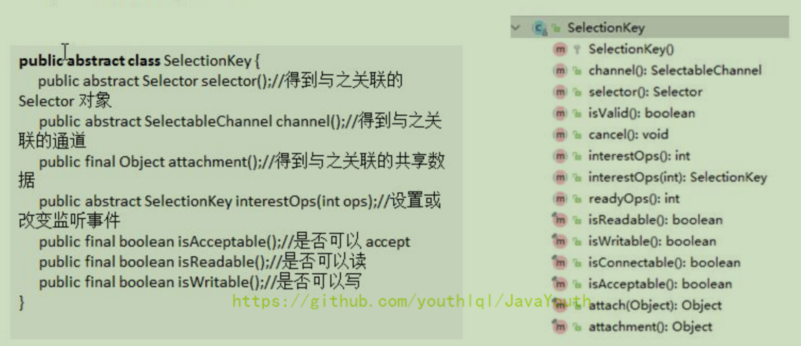

- **ServerSocketChannel：**

  - ServerSocketChannel在服务器端监听新的客户端Socket的连接，**只负责监听，不负责实际的读写操作**
  - ServerSocketChannel相关方法：
    - 

## 4.5 NIO实例-群聊系统

- 实例要求：

  - 编写一个 NIO 群聊系统，实现服务器端和客户端之间的数据简单通讯（非阻塞）实现多人群聊
  - 服务器端：可以监测用户上线，离线，并实现消息转发功能
  - 客户端：通过 Channel 可以无阻塞发送消息给其它所有用户，同时可以接受其它用户发送的消息（有服务器转发得到）
  - 目的：进一步理解 NIO 非阻塞网络编程机制

- 示意图分析和代码

  - 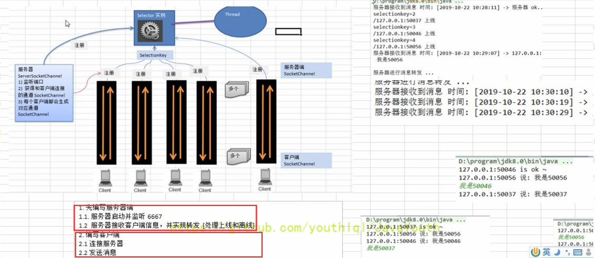

  - 

  - ```java
    package com.king.nio.groupchat;
    
    import java.io.IOException;
    import java.net.InetSocketAddress;
    import java.nio.ByteBuffer;
    import java.nio.channels.*;
    import java.util.Iterator;
    import java.util.Set;
    
    public class GroupChatServer {
        // 定义属性
        private Selector selector;
        private ServerSocketChannel listenChannel;
    
        private  static  final int PORT = 6667;
    
        // 构造器
        public GroupChatServer(){
            try {
                // 得到一个选择器
                selector = Selector.open();
                // 得到一个服务器通道
                 listenChannel= ServerSocketChannel.open();
                 // 将该服务器通道绑定到对应的接口
                listenChannel.socket().bind(new InetSocketAddress(PORT));
                listenChannel.configureBlocking(false);
                // 将该服务器通道注册到选择器中=>当该通道发生有新的网络连接请求时(OP_ACCEPT事件发生)，
                // selector可以获取该事件，进行处理
                // 如果没有发生指定的事件，则该线程继续处理其他业务
                listenChannel.register(selector, SelectionKey.OP_ACCEPT);
            } catch (IOException e) {
                e.printStackTrace();
            }
        }
    
        public void listen(){
            try{
                // 循环监听
                while(true){
                    System.out.println("selector在监听...select()不加时间就是阻塞式监听");
                    // 监听所有组成的通道，如果通道上有对应的事件发生，就返回对应事件发生的数量，进行处理
                    int count = selector.select();
                    if(count>0){// selector中有事件发生
                        // 获取selectionKey集合=>获取所有在selector中发生事件的通道的key
                        Iterator<SelectionKey> iterator = selector.selectedKeys().iterator();
                        // 循环查看发生了什么事件
                        while (iterator.hasNext()){
                            SelectionKey key = iterator.next();
                            // 判断是什么事件发生
                            // 如果OP_ACCEPT事件，那肯定服务器通道发生接收新的客户群请求事件，需要将客户端的通道注册到选择器中
                            if(key.isAcceptable()){
                                SocketChannel socketChannel = listenChannel.accept();
                                socketChannel.configureBlocking(false);
                                socketChannel.register(selector,SelectionKey.OP_READ);
                                // 提示
                                System.out.println(socketChannel.getRemoteAddress()+"上线");
                            }
                            if(key.isReadable()){
                                // 通道发生了read事件，也就是通道是可读的=》那肯定是客户端的通道的事件
                                // 处理对应的业务
                                readData(key);
                            }
                            // 将当前的key删除，防止下一次slector中还是存在这个key，重复处理
                            iterator.remove();
                        }
                    }else{
                        System.out.println("selector循环等待事件发生....");
                    }
                }
            }catch (Exception e){
                e.printStackTrace();
            }finally {
    
            }
        }
    
        // 读取客户端消息
        public void readData(SelectionKey key){
            SocketChannel channel = null;
            try{
                // 获取客户端的通道
                channel = (SocketChannel) key.channel();
                // 开始接收客户端通道的数据
                ByteBuffer byteBuffer = ByteBuffer.allocate(1024);
                // 将通道中数据读取的缓存区中
                int count = channel.read(byteBuffer);
                if(count>0){
                    // 把缓存区中的数据转成字符串
    
                    String msg = new String(byteBuffer.array());
                    // 输出到控制台
                    System.out.println("form客户端："+msg);
                    System.out.println("byteBuffer："+byteBuffer);
                    // 并且向其他客户端转发消息
                    sendInfoToOtherClients(msg,channel);
                }
            }catch (Exception e){
                try {
                    System.out.println(channel.getRemoteAddress()+"离线了...");
                    // 注销注册
                    key.cancel();
                    // 关闭通道
                    channel.close();
                }catch (Exception e2){
                    e2.printStackTrace();
                }
            }
        }
    
        // 转发消息给其他客户通道
        private void sendInfoToOtherClients(String msg,SocketChannel self) throws IOException {
            System.out.println("服务器转发消息中...");
            // 遍历所有组成到selector中的客户端通道，并且排除自己
            for(SelectionKey key: selector.keys()){
                // 通过key获取对应的SocketChannel
                Channel channel = key.channel();
                // 排除自己
                if(channel instanceof SocketChannel&&channel!=self){
                    // 类型转换
                    SocketChannel dest = (SocketChannel)channel;
                    // 将msg存储到buffer中
                    ByteBuffer byteBuffer = ByteBuffer.wrap(msg.getBytes());
                    // 将buffer中的数据写入到通道中
                    dest.write(byteBuffer);
                }
            }
        }
    
        public static void main(String[] args) {
            // 创建服务器对象
            GroupChatServer groupChatServer = new GroupChatServer();
            // 开始监听服务
            groupChatServer.listen();
        }
    }
    
    ```

  - ```java
    package com.king.nio.groupchat;
    
    import java.net.InetSocketAddress;
    import java.nio.ByteBuffer;
    import java.nio.channels.SelectableChannel;
    import java.nio.channels.SelectionKey;
    import java.nio.channels.Selector;
    import java.nio.channels.SocketChannel;
    import java.util.Iterator;
    import java.util.Scanner;
    
    public class GroupChatClient {
        // 定义相关属性
        // 服务器的IP地址
        private final String HOST = "127.0.0.1";
        // 服务器的端口号
        private final int PORT = 6667;
        private Selector selector;
        private SocketChannel socketChannel;
        private String username;
    
        // 完成初始化工作
        public GroupChatClient() {
            try {
                selector = Selector.open();
                // 连接到服务器
                socketChannel = SocketChannel.open(new InetSocketAddress(HOST, PORT));
                // 设置非阻塞
                socketChannel.configureBlocking(false);
                // 将channel注册到select
                socketChannel.register(selector, SelectionKey.OP_READ);
                // 得到username
                username = socketChannel.getLocalAddress().toString();
                System.out.println(username + "已经开始登录");
            } catch (Exception e) {
                e.printStackTrace();
            }
        }
    
        // 向服务器发送消息
        public void sendInfo(String info) {
            info = username + "说：" + info;
            try {
                // 将缓存区中的数据写入到通道中
                socketChannel.write(ByteBuffer.wrap(info.getBytes()));
            } catch (Exception e) {
                e.printStackTrace();
            }
        }
    
        // 读取从服务器端回复的消息
        public void readInfo() {
            try {
                int readChannles = selector.select();
                if (readChannles > 0) {// 监听到事件(通道发生了事件)
                    Iterator<SelectionKey> iterator = selector.selectedKeys().iterator();
                    while (iterator.hasNext()) {
                        // 获取哪些通道发生了事件，
                        SelectionKey next = iterator.next();
                        if (next.isReadable()) {
                            // 得到相关的通道
                            SocketChannel channel = (SocketChannel) next.channel();
                            // 得到一个BUffer
                            ByteBuffer allocate = ByteBuffer.allocate(1024);
                            // 将通道中的数据读取到缓冲区中
                            channel.read(allocate);
                            /// 将缓冲区中的数据转换为字符串，并且在控制台打印
    
                            String s = new String(allocate.array());
    
                            System.out.println("from服务端：" + s);
                            System.out.println("buffer:" + allocate);
                        }
                    }
                    iterator.remove();
    
                } else {
                    System.out.println("服务器没有发生回数据，没有可用的信道");
                }
            } catch (Exception e) {
                e.printStackTrace();
            }
        }
    
        public static void main(String[] args) {
            // 启动客户端
            GroupChatClient groupChatClient = new GroupChatClient();
            // 启动一个线程，读取从服务器发生的数据
            new Thread(new Runnable() {
                @Override
                public void run() {
                    while (true) {
                        groupChatClient.readInfo();
                        try {
                            Thread.sleep(3000);
                        } catch (InterruptedException e) {
                            e.printStackTrace();
                        }
                    }
                }
            }).start();
    
            // 发生数据给服务器端
            Scanner scanner = new Scanner(System.in);
            while (!scanner.hasNext("!")) {
                String s = scanner.nextLine();
                groupChatClient.sendInfo(s);
            }
        }
    
    }
    
    ```

# 5. 再次理解NIO和零拷贝

- 主要理解：
  - 什么是零拷贝？=》操作系统级别的内存优化
    - 零拷贝从操作系统角度，是没有 `cpu` 拷贝
  - Java NIO中如何使用零拷贝？
- 什么是零拷贝？
  - 建议去看计算机基础下面的操作系统相关的笔记
  - 简单来说：就是为了不让CPU去完成内核空间数据拷贝到用户进程空间，而是通过其他方式来实现数据拷贝，节省CPU资源
    - mmap：内存映射：mmap就是实现内存映射的接口，使用地址指针的方式实现拷贝，等到实际需要使用时，再让CPU拷贝
    - sendFile：完全不用CPU，使用DMA完成数据传输
      - DMA：**DMA**：`direct memory access` 直接内存拷贝（不使用 `CPU`）

## 5.1 BIO数据读写

- ```java
  File file = new File("test.txt");
  RandomAccessFile raf = new RandomAccessFile(file, "rw");
  
  byte[] arr = new byte[(int) file.length()];
  raf.read(arr);
  
  Socket socket = new ServerSocket(8080).accept();
  socket.getOutputStream().write(arr);
  ```

- 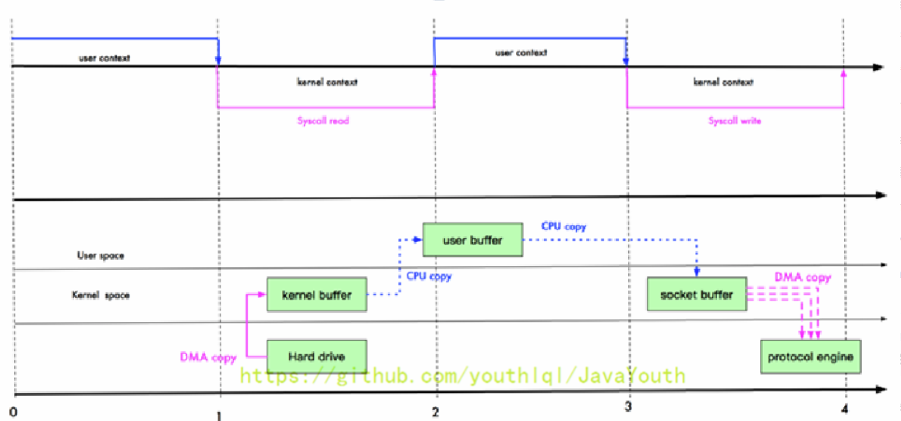

## 5.2 mmap优化

- `mmap` 通过内存映射，将文件映射到内核缓冲区，同时，用户空间可以共享内核空间的数据。这样，在进行网络传输时，就可以减少内核空间到用户空间的拷贝次数。如下图
- `mmap` 示意图
- 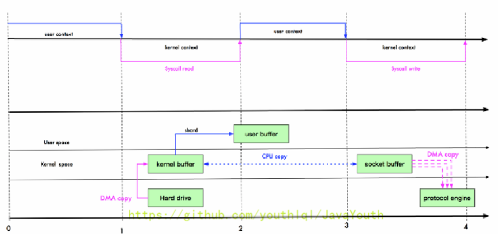

## 5.3 sendFile优化

- `Linux2.1` 版本提供了 `sendFile` 函数，其基本原理如下：数据根本不经过用户态，直接从内核缓冲区进入到 `SocketBuffer`，同时，由于和用户态完全无关，就减少了一次上下文切换
- 示意图
- 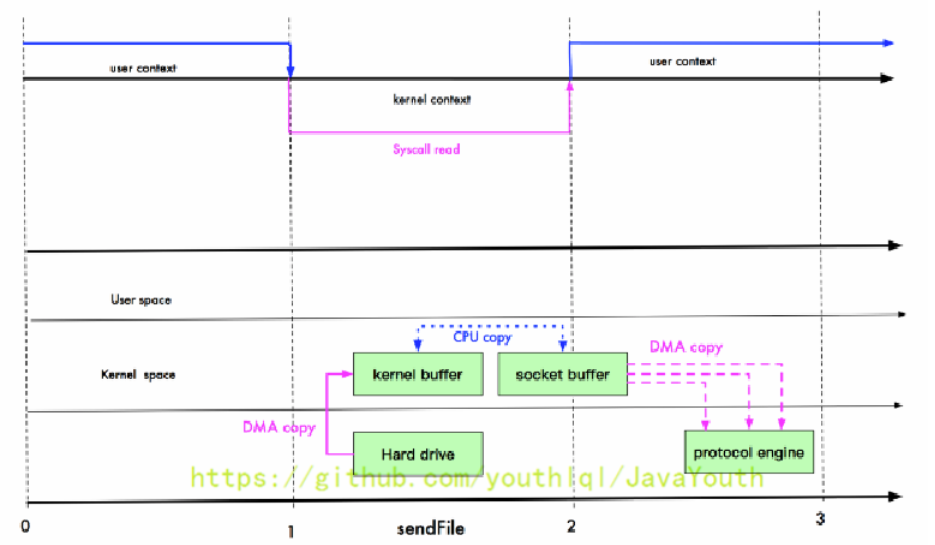
- `Linux在2.4` 版本中，做了一些修改，避免了从内核缓冲区拷贝到 `Socketbuffer` 的操作，直接拷贝到协议栈，从而再一次减少了数据拷贝。具体如下图：
- 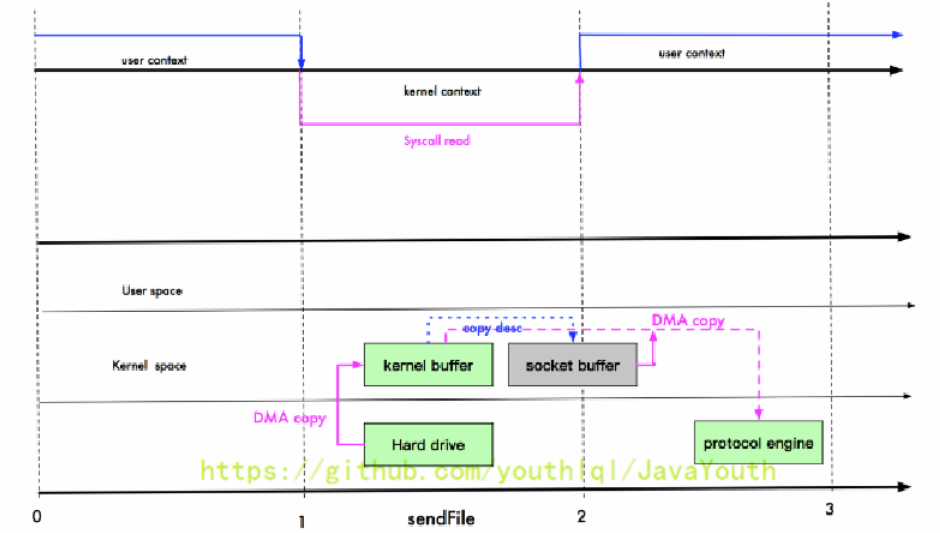
- 这里其实有一次 `cpu` 拷贝 `kernel buffer` -> `socket buffer` 但是，拷贝的信息很少，比如 `lenght`、`offset` 消耗低，可以忽略

## 5.4 小结

- 什么是零拷贝？

  - 从操作系统的角度来说的。因为内核缓冲区之间，没有数据是重复的（只有 `kernel buffer` 有一份数据）。
  - 零拷贝不仅仅带来更少的数据复制，还能带来其他的性能优势，例如更少的上下文切换，更少的 `CPU` 缓存伪共享以及无 `CPU` 校验和计算。

- mmap和sendFile的区别？

  - mmap 适合小数据量读写，sendFile 适合大文件传输。
  - mmap 需要 4 次上下文切换，3 次数据拷贝；sendFile 需要 3 次上下文切换，最少 2 次数据拷贝。
  - sendFile 可以利用 DMA 方式，减少 CPU 拷贝，mmap 则不能（必须从内核拷贝到 Socket缓冲区）。

- 代码示例：

  - 使用传统的 `IO` 方法传递一个大文件

  - 使用 `NIO` 零拷贝方式传递（`transferTo`）一个大文件

  - 看看两种传递方式耗时时间分别是多少

  - ```java
    //服务器
    public class NewIOServer {
    
        public static void main(String[] args) throws Exception {
            InetSocketAddress address = new InetSocketAddress(7001);
            ServerSocketChannel serverSocketChannel = ServerSocketChannel.open();
            ServerSocket serverSocket = serverSocketChannel.socket();
            serverSocket.bind(address);
    
            //创建buffer
            ByteBuffer byteBuffer = ByteBuffer.allocate(4096);
    
            while (true) {
                SocketChannel socketChannel = serverSocketChannel.accept();
                int readcount = 0;
                while (-1 != readcount) {
                    try {
                        readcount = socketChannel.read(byteBuffer);
                    } catch (Exception ex) {
                        // ex.printStackTrace();
                        break;
                    }
                    //
                    byteBuffer.rewind(); //倒带 position = 0 mark 作废
                }
            }
        }
    }
    ```

  - ```java
    public class NewIOClient {
    
        public static void main(String[] args) throws Exception {
            SocketChannel socketChannel = SocketChannel.open();
            socketChannel.connect(new InetSocketAddress("localhost", 7001));
            String filename = "protoc-3.6.1-win32.zip";
            //得到一个文件channel
            FileChannel fileChannel = new FileInputStream(filename).getChannel();
            //准备发送
            long startTime = System.currentTimeMillis();
            //在 linux 下一个 transferTo 方法就可以完成传输
            //在 windows 下一次调用 transferTo 只能发送 8m, 就需要分段传输文件,而且要主要
            //传输时的位置=》课后思考...
            //transferTo 底层使用到零拷贝
            long transferCount = fileChannel.transferTo(0, fileChannel.size(), socketChannel);
            System.out.println("发送的总的字节数 = " + transferCount + " 耗时: " + (System.currentTimeMillis() - startTime));
    
            //关闭
            fileChannel.close();
        }
    }
    ```

# 6. Java AIO

- JDK7 引入了Asynchronous I/O，在进行IO编程中，常用到两种模式：`Reactor` 和 `Proactor`。`Java` 的 `NIO` 就是 `Reactor`，当有事件触发时，服务器端得到通知，进行相应的处理
- `AIO` 即 `NIO2.0`，叫做异步不阻塞的 `IO`。`AIO` 引入异步通道的概念，采用了 `Proactor` 模式，简化了程序编写，有效的请求才启动线程，它的特点是先由操作系统完成后才通知服务端程序启动线程去处理，一般适用于连接数较多且连接时间较长的应用
- 目前 `AIO` 还没有广泛应用，`Netty` 也是基于 `NIO`，而不是 `AIO`，因此我们就不详解 `AIO` 了，有兴趣的同学可以参考[《Java新一代网络编程模型AIO原理及Linux系统AIO介绍》](http://www.52im.net/thread-306-1-1.html)

# 7. Java BIO、NIO、AIO小结

- **BIO、NIO、AIO：**

  - Java BIO ： **同步并阻塞**，服务器实现模式为一个连接一个线程，即客户端有连接请求时服务器端就需要启动一个线程进行处理，如果这个连接不做任何事情会造成不必要的线程开销，当然可以通过线程池机制改善。
  - Java NIO ： **同步非阻塞**，服务器实现模式为一个请求一个线程，即客户端发送的连接请求都会注册到多路复用器上，多路复用器轮询到连接有I/O请求时才启动一个线程进行处理。
  - Java AIO(NIO.2) ： **异步非阻塞**，服务器实现模式为一个有效请求一个线程，客户端的I/O请求都是由OS先完成了再通知服务器应用去启动线程进行处理。

- **BIO、NIO、AIO适用场景分析:**

  - BIO方式适用于连接数目比较小且固定的架构，这种方式对服务器资源要求比较高，并发局限于应用中，JDK1.4以前的唯一选择，但程序直观简单易理解。
  - NIO方式适用于连接数目多且连接比较短（轻操作）的架构，比如聊天服务器，并发局限于应用中，编程比较复杂，JDK1.4开始支持。
  - AIO方式使用于连接数目多且连接比较长（重操作）的架构，比如相册服务器，充分调用OS参与并发操作，编程比较复杂，JDK7开始支持。Netty!

- |          | BIO      | NIO                    | AIO        |
  | -------- | -------- | ---------------------- | ---------- |
  | IO模型   | 同步阻塞 | 同步非阻塞（多路复用） | 异步非阻塞 |
  | 编程难度 | 简单     | 复杂                   | 复杂       |
  | 可靠性   | 差       | 好                     | 好         |
  | 吞吐量   | 低       | 高                     | 高         |

- 举例：

  - 同步阻塞：到理发店理发，就一直等理发师，直到轮到自己理发。
  - 同步非阻塞：到理发店理发，发现前面有其它人理发，给理发师说下，先干其他事情，一会过来看是否轮到自己，
  - 异步非阻塞：给理发师打电话，让理发师上门服务，自己干其它事情，理发师自己来家给你理发

# 8. Netty概述

- 为什么会有Netty？
  - NIO 的类库和 API 繁杂，使用麻烦：需要熟练掌握 Selector、ServerSocketChannel、SocketChannel、ByteBuffer等。
  - 需要具备其他的额外技能：要熟悉 Java 多线程编程，因为 NIO 编程涉及到 Reactor 模式，你必须对多线程和网络编程非常熟悉，才能编写出高质量的 NIO 程序。
  - 开发工作量和难度都非常大：例如客户端面临断连重连、网络闪断、半包读写、失败缓存、网络拥塞和异常流的处理等等。
  - JDK NIO 的 Bug：例如臭名昭著的 Epoll Bug，它会导致 Selector 空轮询，最终导致 CPU100%。直到 JDK1.7 版本该问题仍旧存在，没有被根本解决。
- 什么是Netty？
  - Netty is an asynchronous event-driven network application framework for rapid development of maintainable high performance protocol servers and clients
  - 官网：https://netty.io/
  - 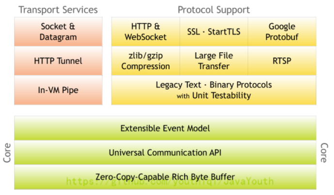
- Netty有什么优点？
  - Netty 对 JDK 自带的 NIO 的 API 进行了封装，解决了上述问题。
    - 设计优雅：适用于各种传输类型的统一 API 阻塞和非阻塞 Socket；基于灵活且可扩展的事件模型，可以清晰地分离关注点；高度可定制的线程模型-单线程，一个或多个线程池。
    - 使用方便：详细记录的 Javadoc，用户指南和示例；没有其他依赖项，JDK5（Netty3.x）或 6（Netty4.x）就足够了。
    - 高性能、吞吐量更高：延迟更低；减少资源消耗；最小化不必要的内存复制。
    - 安全：完整的 SSL/TLS 和 StartTLS 支持。
    - 社区活跃、不断更新：社区活跃，版本迭代周期短，发现的 Bug 可以被及时修复，同时，更多的新功能会被加入。
- Netty版本说明：
  - Netty 版本分为 Netty 3.x 和 Netty 4.x、Netty 5.x
  - 因为 Netty 5 出现重大 bug，已经被官网废弃了，目前推荐使用的是 Netty 4.x的稳定版本
  - 目前在官网可下载的版本 Netty 3.x、Netty 4.0.x 和 Netty 4.1.x
  - 在本套课程中，我们讲解 Netty4.1.x 版本
  - Netty 下载地址：https://bintray.com/netty/downloads/netty/

# 9. Netty架构设计

## 9.1 线程模型介绍

- 不同的线程模式，对程序的性能有很大影响

- 目前流行的线程模型：
  - 传统阻塞IO服务模型
  - **Reactor模型：没有什么是加一层解决不了的**
    - 单Reactor单线程
    - 单Reactor多线程
    - 主从Reactor多线程
- Netty线程模式：主要基于主从Reactor多线程模式做了一定的改进！

## 9.2 传统阻塞IO服务模型

- 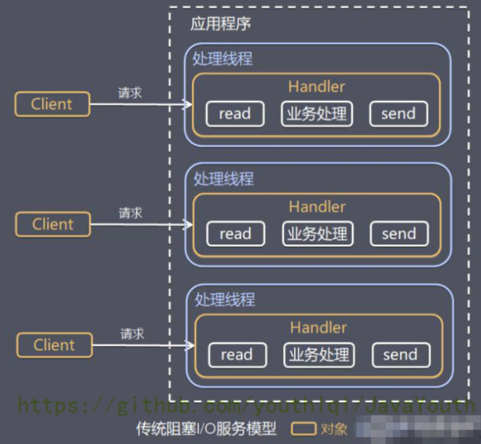
- 工作原理图：
  - 黄色的框表示对象
  - 蓝色的框表示线程
  - 白色的框表示方法（`API`）
- 模型特点：
  - 采用阻塞IO模式获取输入的数据
  - 每个客户端连接都需要独立的线程完成数据的输入、业务处理、数据返回
- 存在的问题：
  - 当很多的客户端同时访问时，就会创建大量的线程，占用大量的系统资源
  - 连接创建后，如果当前线程暂时没有数据可读，该线程就会阻塞在Handler对象中的read操作，导致处理线程资源的浪费

## 9.2 Reactor模式

- 也可以称为：反应器模式、分发者模式(Dispatcher)、通知者模式(Notifier)

- 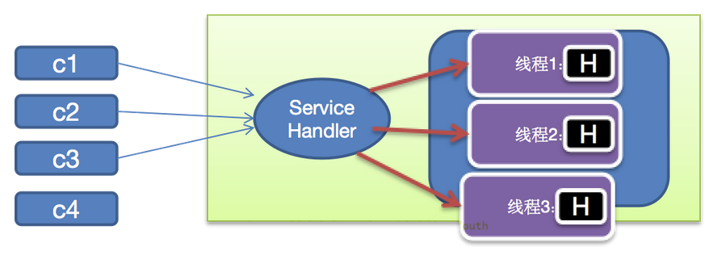

- 由于传统阻塞IO服务模型的缺点：
  - 线程阻塞在数据读取阶段=》导致线程资源浪费
  - 每个客户端都需要一个线程进行处理=》导致无法处理高并发情况
- 提出的改进：
  - 基于 I/O 复用模型：=>解决了线程资源浪费
    - 多个客户端进行连接，先把连接请求给ServiceHandler。多个连接共用一个阻塞对象ServiceHandler。假设，当C1连接没有数据要处理时，C1客户端只需要阻塞于ServiceHandler，C1之前的处理线程便可以处理其他有数据的连接，不会造成线程资源的浪费。当C1连接再次有数据时，ServiceHandler根据线程池的空闲状态，将请求分发给空闲的线程来处理C1连接的任务。
  - 基于线程池复用线程资源：=>解决了当并发数很大时，会创建大量线程，占用很大系统资源
    - 不必再为每个连接创建线程，将连接完成后的业务处理任务分配给线程进行处理，一个线程可以处理多个连接的业务。
- 总的来说：Reactor模式的基本设计思想就是：IO复用+线程池
  - **没有什么是加一层解决不了的**
  - 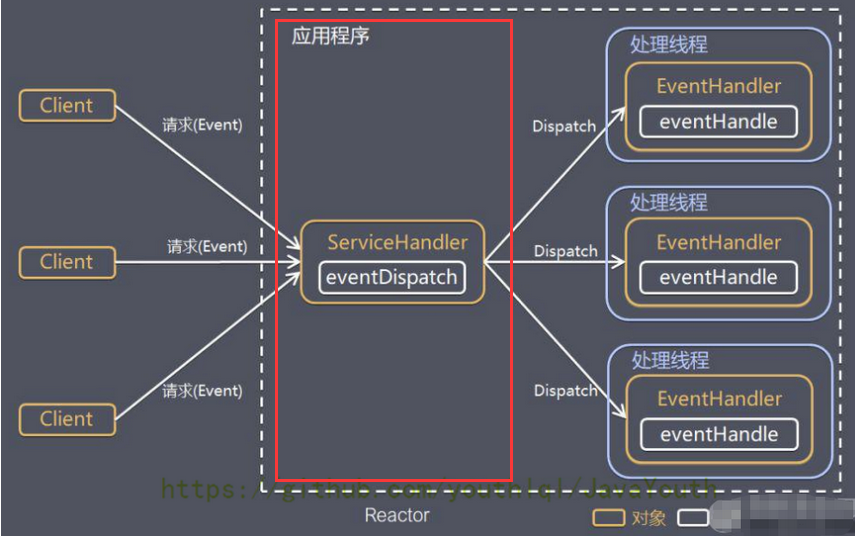
  - Reactor模式：通过一个或者多个输入同时传递给服务处理器(ServiceHandler)的模式
  - 服务器端程序处理传入的多个请求，并将它们同步分派到相应的处理线程
    - 使用IO复用监听事件，收到事件后分发给某个线程
  - 原来：多个Handler阻塞
  - 现在：使用一个ServiceHandler阻塞
- **Reactor模式的核心组成：**
  - Reactor（也就是ServiceHandler）：Reactor在一个单独的线程中运行，负责监听和分发事件，分发给适当的处理线程来对IO事件做出反应
    - 就像公司的电话接线员，它接听来自客户的电话并将线路转移到适当的联系人
  - Handlers（也就是处理线程EventHandler）：处理线程执行IO事件要完成的实际实际
    - 类似于客户想要与之交谈的公司中的人员
  - Reactor通过调度适当的处理线程来响应IO事件，处理程序，执行非阻塞操作
- Reactor模式的分类：
  - 主要从Reactor数量、Handler是否采用线程池、以及线程池数量分类
  - 单 `Reactor` 单线程
  - 单 `Reactor` 多线程
  - 主从 `Reactor` 多线程

### 9.2.1 单Reactor单线程

- 可以类似于：上面4.5写的NIO的群聊系统：
  - 服务器端用一个线程通过多路复用搞定所有的 `IO` 操作（包括连接，读、写等），编码简单，清晰明了，但是如果客户端连接数量较多，将无法支撑

- 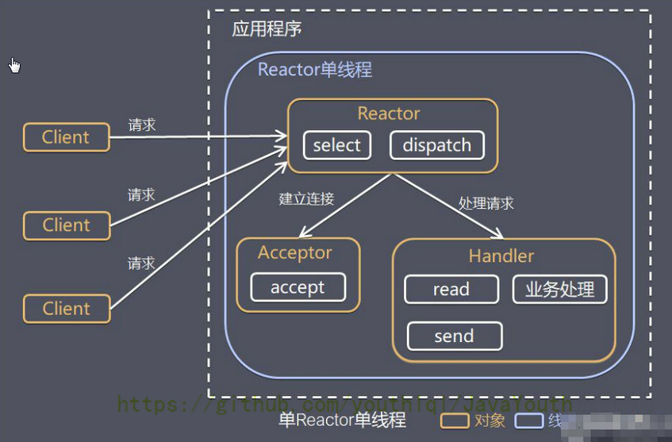
  - `Select` 是前面 `I/O` 复用模型介绍的标准网络编程 `API`，可以实现应用程序通过一个阻塞对象监听多路连接请求
  - Reactor 对象通过 Select 监控客户端请求事件，收到事件后，通过 Dispatch 进行分发
  - 如果是建立连接请求，则由 Acceptor 通过 accept 处理连接请求，然后创建一个 Handler 对象处理完成连接后的各种事件
  - 如果不是连接请求，则由 Reactor 分发调用连接对应的 handler 来处理（也就是说连接已经建立，后续客户端再来请求，那基本就是数据请求了，直接调用之前为这个连接创建好的handler来处理）
  - `Handler` 会完成 `Read` → 业务处理 → `Send` 的完整业务流程
- 优缺点：
  - 优点：
    - 模型简单、没有多线程、进程通信、资源竞争的问题，全部都在一个线程中完成
  - 缺点：
    - 性能不高：只有一个线程，无法充分发挥CPU性能，Handler在处理某个连接上的业务时，整个进程无法处理其他的客户端连接请求，容易达到性能瓶颈
    - 可靠性问题：线程意外终止，或者进入死循环，就会导致整个系统通信模块不可用，不能结束和处理请求，导致节点故障
- 使用场景：
  - 客户端数量有限、业务处理快速

### 9.2.2 单Reactor多线程

- **没有什么是加一层解决不了的，如果有就是你没有加对位置**
- 单Reactor单线程中有handler读取数据=>处理业务=>响应客户端：此时这个阶段中处理业务是最耗时的
- 因此：单Reactor多线程：从handler出发，将handler中处理业务这一块抽取出来让另外的线程处理

- 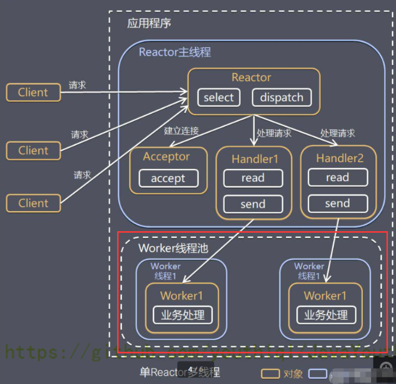
  - Reactor 对象通过 Select 监控客户端请求事件，收到事件后，通过 Dispatch 进行分发
  - 如果是建立连接请求，则由 Acceptor 通过 accept 处理连接请求，然后创建一个 Handler 对象处理完成连接后的各种事件
  - 如果不是连接请求，则由 Reactor 分发调用连接对应的 handler 来处理（也就是说连接已经建立，后续客户端再来请求，那基本就是数据请求了，直接调用之前为这个连接创建好的handler来处理）
  - handler 只负责响应事件，不做具体的业务处理（使handler不会阻塞太久），通过 read 读取数据后，会分发给后面的 worker 线程池的某个线程处理业务。**(业务处理是最费时的，所以将业务处理交给线程池去执行)**
    - worker 线程池会分配独立线程完成真正的业务，并将结果返回给 handler
  - handler收到响应后，通过send将结果响应会客户端client
- 优缺点：
  - 优点：
    - 充分利用多核cpu的处理能力
  - 缺点：
    - 要处理多线程数据共享和访问
    - Reactor需要承担所有的事件监听和分发，但是Reactor又是单线程运行的，在高并发场景下也很容易出现性能瓶颈

### 9.2.3 主从Reactor多线程

- **没有什么是加一层解决不了的，如果有就是你没有加对位置**
- 在单Reactor多线程模型中，Reactor既要处理监听、注册、分发，在高并发下很容易达到瓶颈
- 因此：主从Reactor多线程：从Reactor的出发，将Reactor的功能抽取一块处理，让另外的线程来处理
- 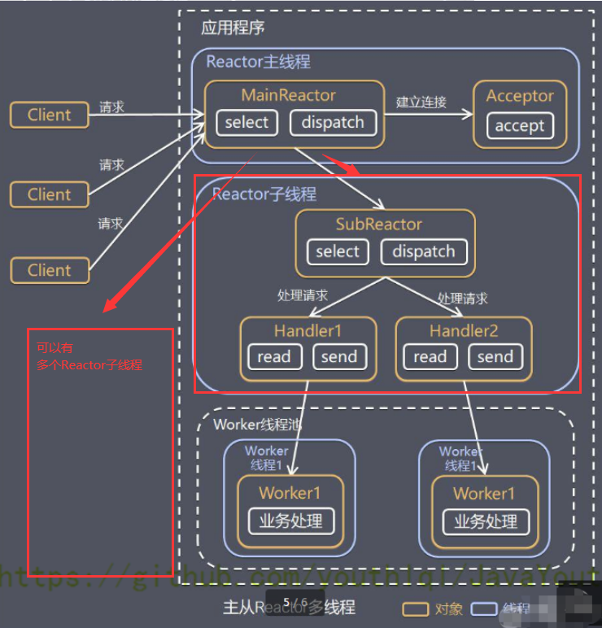

  - SubReactor是可以有多个的，如果只有一个SubReactor的话那和单Reactor多线程就没什么区别了。
  - `Reactor` 主线程 `MainReactor` 对象通过 `select` 监听连接事件，收到事件后，通过 `Acceptor` 处理连接事件
  - 当 `Acceptor` 处理连接事件后，`MainReactor` 将连接分配给 `SubReactor`
    - `Reactor` 主线程可以对应多个 `Reactor` 子线程，即 `MainRecator` 可以关联多个 `SubReactor`
  - `subreactor` 将连接加入到连接队列进行监听，并创建 `handler` 进行各种事件处理
  - 当有新事件发生时，`subreactor` 就会调用对应的 `handler` 处理
  - `handler` 通过 `read` 读取数据，分发给后面的 `worker` 线程处理
  - `worker` 线程池分配独立的 `worker` 线程进行业务处理，并返回结果
  - `handler` 收到响应的结果后，再通过 `send` 将结果返回给 `client`
- 书目推荐：

  - Scalable IO in Java 对 Multiple Reactors 的原理图解
- 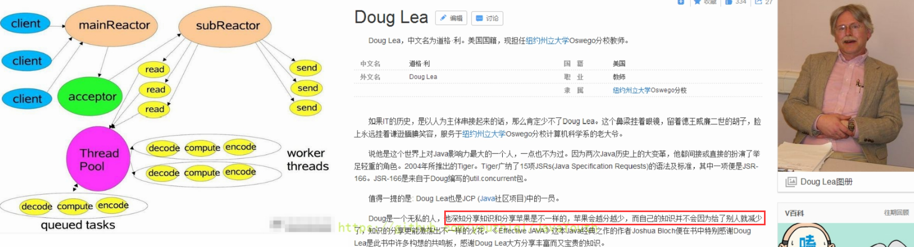
- 优缺点：
  - 优点：
    - 父线程(MainReactor)和子线程(SubReactor)的数据交互简单、职责明确
      - 父线程：只需要接收新的连接，`Reactor` 主线程只需要把新连接传给子线程
      - 子线程：完成后续的业务处理
  - 缺点：
    - 编程复杂度高！
- 使用场景：
  - 这种模型在许多项目中广泛使用，包括 `Nginx` 主从 `Reactor` 多进程模型，`Memcached` 主从多线程，`Netty` 主从多线程模型的支持

### 9.2.4 小结

- 三种模式的生活案例理解：
  - 单 `Reactor` 单线程，前台接待员和服务员是同一个人，全程为顾客服务
  - 单 `Reactor` 多线程，`1` 个前台接待员，多个服务员，接待员只负责接待
  - 主从 `Reactor` 多线程，多个前台接待员，多个服务生
- Reactor模式的优点：
  - 响应快：
    - 不会在被单个客户端阻塞，虽然Reactor是同步的，但是可以分发给其他的SubReactor去处理客户端请求
  - 最大程度避免：复杂的多线程以及同步问题，避免多个线程/进程的上下文切换
  - 扩展性好：很容易的通过增加Reactor实例个数来充分利用CPU资源
  - 复用性好：Reactor模型与具体事件处理逻辑无关，有很高的复用性

# 10. Netty模型

- 工作原理-简单：
  - 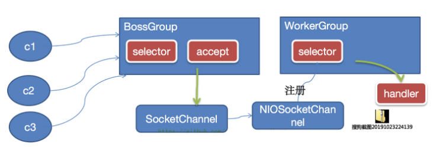
  - BossGroup 线程维护 Selector，只关注 Accecpt
  - 当接收到 Accept 事件，获取到对应的 SocketChannel，封装成 NIOScoketChannel 并注册到 Worker 线程（事件循环），并进行维护
  - 当 Worker 线程监听到 Selector 中通道发生自己感兴趣的事件后，就分发给handler进行处理，注意 handler 已经加入到通道
- 工作原理-进阶：
  - 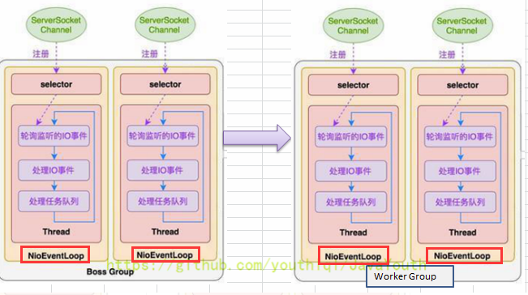
  - `BossGroup`有点像主`Reactor` 可以有多个：里面包含多个MainReactor
    - 主Reactor应该就是里面的：NioEventLoop
  - `WorkerGroup`则像`SubReactor`一样可以有多个：里面包含多个SubReactor
    - SubReactor应该就是里面的：NioEvnetLoop
- 工作原理-详细：
  - 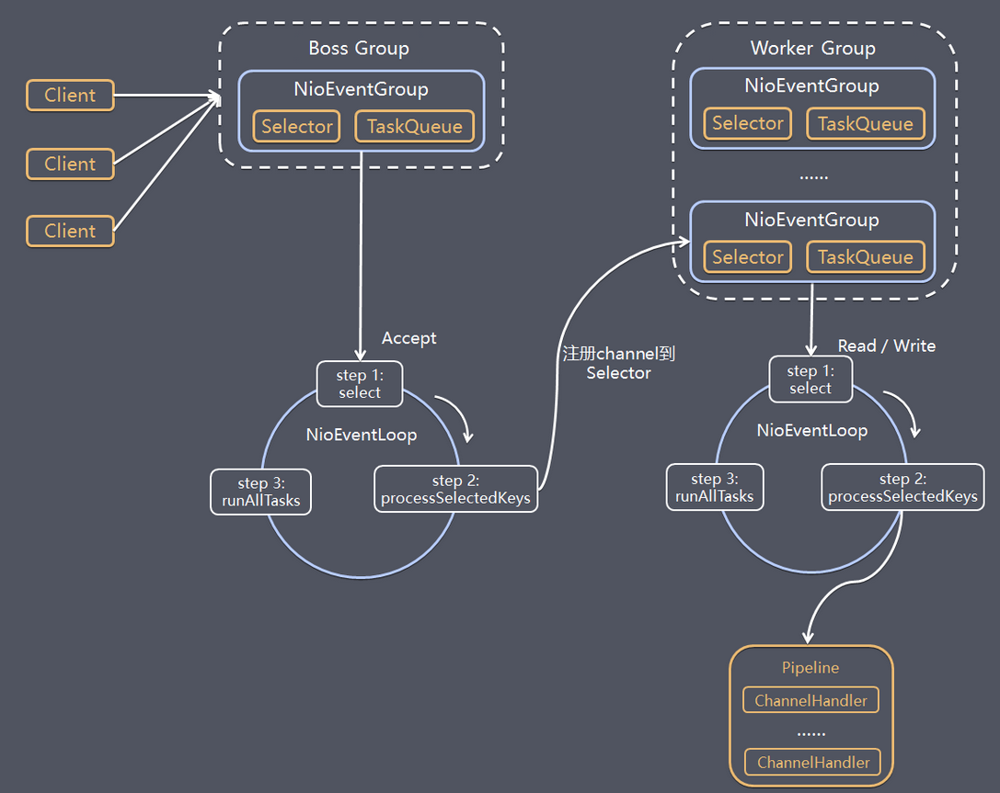
  - 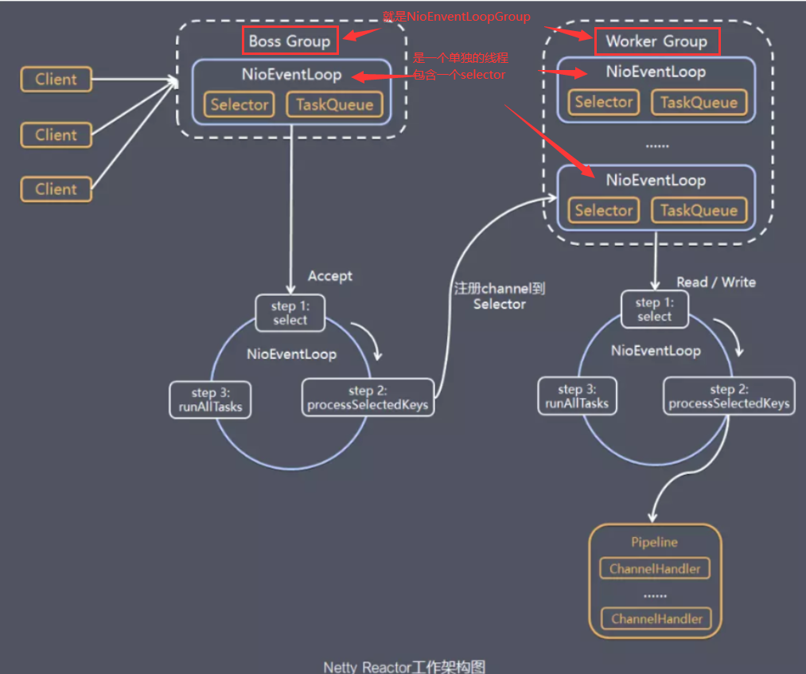
  - Netty抽象出两组线程池：
    - BossGroup专门负责接收客户端的连接
    - WorkerGroup专门负责网络的读写
  - BossGroup和WorkerGroup的类型都是：NioEventLoopGroup
    - NioEventLoopGroup：一个事件循环线程组，可以包含多个事件循环线程
    - NioEventLoop：一个事件循环线程，可以不断循环的执行处理任务的线程(也就是一个线程)，包含一个Selector，可以监听对应的socket网络通讯
  - 每个BossGroup的NioEventLoop执行：
    - 轮询accept事件
    - 处理accept事件，与client建立连接，生成NioSocketChannel，并且将其注册到某个workGroup NioEventLoop上的Selector上
    - 继续处理任务队列的任务：runAllTasks
  - 每个WorkerGroup的NioEnventLoop执行：
    - 轮询监听的NioSocketChannel是否发生read、write事件
    - 处理IO事件(read、write)，在对应的NioSocketChannel进行处理
    - 继续处理任务队列的任务：runAllTasks
  - 每个Worker NioEventLoop处理业务时，会使用pipeline，pipeline包含channel，也就是通过pipeline可以获取到对应的通道（后面详细的说）

## 10.1 Netty 快速入门示例-TCP服务

- 实例要求：使用 IDEA 创建 Netty 项目

  - Netty 服务器在 6668 端口监听，客户端能发送消息给服务器"hello,服务器~"~
  - 服务器可以回复消息给客户端"hello,客户端~"
  - 目的：对 Netty 线程模型有一个初步认识，便于理解 Netty 模型理论
  - 代码步骤：
    - 说明：创建 Maven 项目，并引入 Netty 包
    - 编写服务端
    - 编写客户端
    - 对 netty 程序进行分析，看看 netty 模型特点

- NettyServer端：

  - ```java
    package com.king.netty.simple;
    
    import io.netty.bootstrap.ServerBootstrap;
    import io.netty.channel.*;
    import io.netty.channel.nio.NioEventLoopGroup;
    import io.netty.channel.socket.SocketChannel;
    import io.netty.channel.socket.nio.NioServerSocketChannel;
    
    
    public class NettyServer {
        public static void main(String[] args) throws Exception {
    
    
            //创建BossGroup 和 WorkerGroup
            //说明
            //1. 创建两个线程组 bossGroup 和 workerGroup
            //2. bossGroup 只是处理连接请求 , 真正的和客户端业务处理，会交给 workerGroup完成
            //3. 两个都是无限循环
            //4. bossGroup 和 workerGroup 含有的子线程(NioEventLoop)的个数=>有多少个线程都有各自的selector监听
            //   默认实际 cpu核数 * 2
            EventLoopGroup bossGroup = new NioEventLoopGroup(1);
            EventLoopGroup workerGroup = new NioEventLoopGroup(3);
    
    
    
            try {
                //创建服务器端的启动对象，配置参数
                ServerBootstrap bootstrap = new ServerBootstrap();
    
                //使用链式编程来进行设置
                bootstrap.group(bossGroup, workerGroup) //设置两个线程组
                        .channel(NioServerSocketChannel.class) //使用NioSocketChannel 作为服务器的通道实现
                        .option(ChannelOption.SO_BACKLOG, 128) // 设置线程队列等待连接个数
                        .childOption(ChannelOption.SO_KEEPALIVE, true) //设置保持活动连接状态
    //                    .handler(null) // 该 handler对应 bossGroup , childHandler 对应 workerGroup
                        .childHandler(new ChannelInitializer<SocketChannel>() {//创建一个通道初始化对象(匿名对象)
                            //给pipeline 设置处理器
                            @Override
                            protected void initChannel(SocketChannel ch) throws Exception {
                                System.out.println("客户socketchannel hashcode=" + ch.hashCode()); //可以使用一个集合管理 SocketChannel， 再推送消息时，可以将业务加入到各个channel 对应的 NIOEventLoop 的 taskQueue 或者 scheduleTaskQueue
                                ch.pipeline().addLast(new NettyServerHandler());
                            }
                        }); // 给我们的workerGroup 的 EventLoop 对应的管道设置处理器
    
                System.out.println(".....服务器 is ready...");
    
                //绑定一个端口并且同步,生成了一个 ChannelFuture 对象（也就是立马返回这样一个对象）
                //启动服务器(并绑定端口)
                ChannelFuture cf = bootstrap.bind(6668).sync();
    
                //给cf 注册监听器，监控我们关心的事件
    
                cf.addListener(new ChannelFutureListener() {
                    @Override
                    public void operationComplete(ChannelFuture future) throws Exception {
                        if (cf.isSuccess()) {
                            System.out.println("监听端口 6668 成功");
                        } else {
                            System.out.println("监听端口 6668 失败");
                        }
                    }
                });
    
    
                //对关闭通道事件  进行监听
                cf.channel().closeFuture().sync();
            }finally {
                bossGroup.shutdownGracefully();
                workerGroup.shutdownGracefully();
            }
    
        }
    
    }
    
    ```

  - ```java
    package com.king.netty.simple;
    
    import io.netty.buffer.ByteBuf;
    import io.netty.buffer.Unpooled;
    import io.netty.channel.Channel;
    import io.netty.channel.ChannelHandlerContext;
    import io.netty.channel.ChannelInboundHandlerAdapter;
    import io.netty.channel.ChannelPipeline;
    import io.netty.util.CharsetUtil;
    
    import java.util.concurrent.TimeUnit;
    
    /*
    说明
    1. 我们自定义一个Handler 需要继承netty 规定好的某个HandlerAdapter(规范)
    2. 这时我们自定义一个Handler , 才能称为一个handler
     */
    public class NettyServerHandler extends ChannelInboundHandlerAdapter {
    
        //读取数据事件(这里我们可以读取客户端发送的消息)
        /*
        1. ChannelHandlerContext ctx:上下文对象, 含有 管道pipeline , 通道channel, 地址
        2. Object msg: 就是客户端发送的数据 默认Object
         */
        @Override
        public void channelRead(ChannelHandlerContext ctx, Object msg) throws Exception {
            System.out.println("服务器读取线程 " + Thread.currentThread().getName() + " channle =" + ctx.channel());
            System.out.println("server ctx =" + ctx);
            System.out.println("看看channel 和 pipeline的关系");
            Channel channel = ctx.channel();
            ChannelPipeline pipeline = ctx.pipeline(); //本质是一个双向链表
    
    
            //将 msg 转成一个 ByteBuf
            //ByteBuf 是 Netty 提供的，不是 NIO 的 ByteBuffer.
            ByteBuf buf = (ByteBuf) msg;
            System.out.println("客户端发送消息是:" + buf.toString(CharsetUtil.UTF_8));
            System.out.println("客户端地址:" + channel.remoteAddress());
        }
    
        //数据读取完毕
        @Override
        public void channelReadComplete(ChannelHandlerContext ctx) throws Exception {
    
            //writeAndFlush 是 write + flush
            //将数据写入到缓存，并刷新
            //一般讲，我们对这个发送的数据进行编码
            ctx.writeAndFlush(Unpooled.copiedBuffer("hello, 客户端~(>^ω^<)喵1", CharsetUtil.UTF_8));
        }
    
        //发生异常后, 一般是需要关闭通道
    
        @Override
        public void exceptionCaught(ChannelHandlerContext ctx, Throwable cause) throws Exception {
            ctx.close();
        }
    }
    
    ```

- NettyClient端：

  - ```java
    package com.king.netty.simple;
    
    
    import io.netty.bootstrap.Bootstrap;
    import io.netty.channel.ChannelFuture;
    import io.netty.channel.ChannelInitializer;
    import io.netty.channel.EventLoopGroup;
    import io.netty.channel.nio.NioEventLoopGroup;
    import io.netty.channel.socket.SocketChannel;
    import io.netty.channel.socket.nio.NioSocketChannel;
    
    public class NettyClient {
        public static void main(String[] args) throws Exception {
    
            //客户端需要一个事件循环组
            EventLoopGroup group = new NioEventLoopGroup();
    
    
            try {
                //创建客户端启动对象
                //注意客户端使用的不 是 ServerBootstrap 而是 Bootstrap
                Bootstrap bootstrap = new Bootstrap();
    
                //设置相关参数
                bootstrap.group(group) //设置线程组
                        .channel(NioSocketChannel.class) // 设置客户端通道的实现类(反射)
                        .handler(new ChannelInitializer<SocketChannel>() {
                            @Override
                            protected void initChannel(SocketChannel ch) throws Exception {
                                ch.pipeline().addLast(new NettyClientHandler()); //加入自己的处理器
                            }
                        });
    
                System.out.println("客户端 ok..");
    
                //启动客户端去连接服务器端
                //关于 ChannelFuture 要分析，涉及到netty的异步模型
                ChannelFuture channelFuture = bootstrap.connect("127.0.0.1", 6668).sync();
                //对关闭通道事件  进行监听
                channelFuture.channel().closeFuture().sync();
            }finally {
    
                group.shutdownGracefully();
    
            }
        }
    }
    
    ```

  - ```java
    package com.king.netty.simple;
    
    
    import io.netty.buffer.ByteBuf;
    import io.netty.buffer.Unpooled;
    import io.netty.channel.ChannelHandlerContext;
    import io.netty.channel.ChannelInboundHandlerAdapter;
    import io.netty.util.CharsetUtil;
    
    public class NettyClientHandler extends ChannelInboundHandlerAdapter {
    
        //当通道就绪就会触发该方法
        @Override
        public void channelActive(ChannelHandlerContext ctx) throws Exception {
            System.out.println("client " + ctx);
            ctx.writeAndFlush(Unpooled.copiedBuffer("hello, server: (>^ω^<)喵", CharsetUtil.UTF_8));
        }
    
        //当通道有读取事件时，会触发
        @Override
        public void channelRead(ChannelHandlerContext ctx, Object msg) throws Exception {
    
            ByteBuf buf = (ByteBuf) msg;
            System.out.println("服务器回复的消息:" + buf.toString(CharsetUtil.UTF_8));
            System.out.println("服务器的地址： "+ ctx.channel().remoteAddress());
        }
    
        @Override
        public void exceptionCaught(ChannelHandlerContext ctx, Throwable cause) throws Exception {
            cause.printStackTrace();
            ctx.close();
        }
    }
    
    
    ```

- 源码剖析+Netty模型图：

  - 更好理解源码是如何实现Netty模型，并且具体过程是如何实现的？
  - 建议Debug一步步分析
  - 
  - 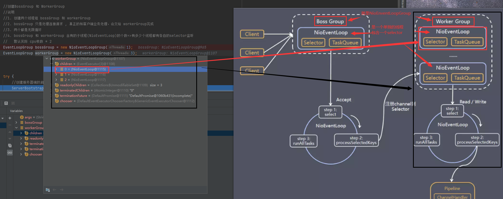
  - 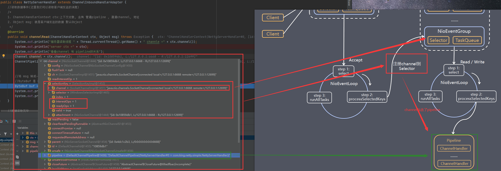
  - 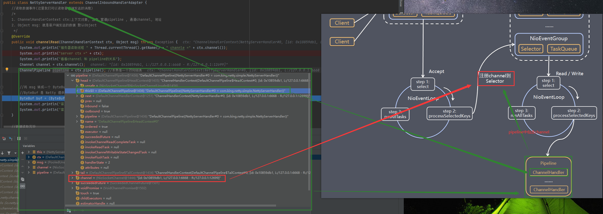
  - 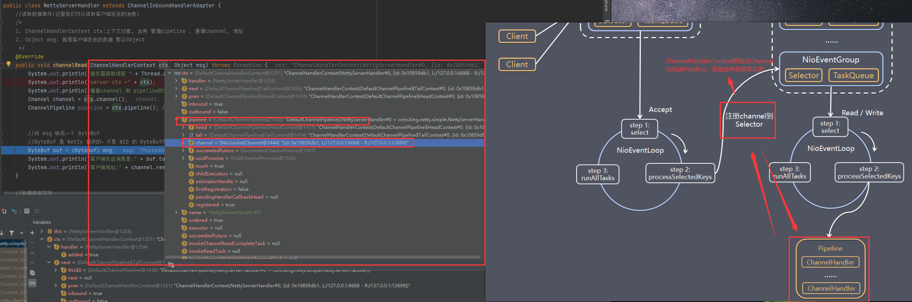

## 10.2 任务队列中的Task的使用场景

- 问题：当Pipeline中的ChannelHandler需要处理十分耗时的操作时，怎么办？

  - 不可能让该Channel对应的NioEventLoop阻塞在这里等待执行，
  - 可以将这个耗时的业务提交到该Channel对应的NioEventLoop中的TaskQueue去异步执行！

- 如何使用TaskQueue中的任务？

  - 1、用户程序自定义的普通任务

  - 2、用户自定义定时任务

  - 3、当前 Reactor 线程调用 Channel 的各种方法

    - 例如在推送系统的业务线程里面，根据用户的标识，找到对应的 Channel 引用，然后调用 Write 类方法向该用户推送消息，就会进入到这种场景。最终的 Write 会提交到任务队列中后被异步消费

    - 重点是如何获取每个用户的channel？

      - 在NettyServer中，维护一个用户Channel的集合，如：childHandler中的方法的处理

      - ```java
         //使用链式编程来进行设置
                    bootstrap.group(bossGroup, workerGroup) //设置两个线程组
                            .channel(NioServerSocketChannel.class) //使用NioSocketChannel 作为服务器的通道实现
                            .option(ChannelOption.SO_BACKLOG, 128) // 设置线程队列等待连接个数
                            .childOption(ChannelOption.SO_KEEPALIVE, true) //设置保持活动连接状态
        //                    .handler(null) // 该 handler对应 bossGroup , childHandler 对应 workerGroup
                            .childHandler(new ChannelInitializer<SocketChannel>() {//创建一个通道初始化对象(匿名对象)
                                //给pipeline 设置处理器
                                @Override
                                protected void initChannel(SocketChannel ch) throws Exception {
                                    //可以使用一个集合管理 SocketChannel， 再推送消息时，
                                    // 可以将业务加入到各个channel 对应的 NIOEventLoop 的 taskQueue 或者 scheduleTaskQueue
                                    System.out.println("客户socketchannel hashcode=" + ch.hashCode());
                                    ch.pipeline().addLast(new NettyServerHandler());
                                }
                            }); // 给我们的workerGroup 的 EventLoop 对应的管道设置处理器
        ```

- 1、2情况代码举例：在10.1的代码的基础上修改：NettyServerHandler

  - ```java
    package com.king.netty.simple;
    
    
    import io.netty.buffer.Unpooled;
    import io.netty.channel.ChannelHandlerContext;
    import io.netty.channel.ChannelInboundHandlerAdapter;
    import io.netty.util.CharsetUtil;
    
    import java.util.concurrent.TimeUnit;
    
    /**
     * 说明
     * 1. 我们自定义一个Handler 需要继续netty 规定好的某个HandlerAdapter(规范)
     * 2. 这时我们自定义一个Handler , 才能称为一个handler
     */
    public class NettyServerHandler extends ChannelInboundHandlerAdapter {
    
        //读取数据实际(这里我们可以读取客户端发送的消息)
    
        /**
         * 1. ChannelHandlerContext ctx:上下文对象, 含有 管道pipeline , 通道channel, 地址
         * 2. Object msg: 就是客户端发送的数据 默认Object
         */
        @Override
        public void channelRead(ChannelHandlerContext ctx, Object msg) throws Exception {
    
            // 比如这里我们有一个非常耗时长的业务-> 异步执行 -> 提交该channel 对应的
    
            // NIOEventLoop 的 taskQueue中,
    
            // 解决方案1 用户程序自定义的普通任务
    
            ctx.channel().eventLoop().execute(new Runnable() {
                @Override
                public void run() {
    
                    try {
                        Thread.sleep(5 * 1000);
                        ctx.writeAndFlush(Unpooled.copiedBuffer("hello, 客户端~(>^ω^<)喵2", CharsetUtil.UTF_8));
                        System.out.println("channel code=" + ctx.channel().hashCode());
                    } catch (Exception ex) {
                        System.out.println("发生异常" + ex.getMessage());
                    }
                }
            });
    
            ctx.channel().eventLoop().execute(new Runnable() {
                @Override
                public void run() {
    
                    try {
                        Thread.sleep(5 * 1000);
                        ctx.writeAndFlush(Unpooled.copiedBuffer("hello, 客户端~(>^ω^<)喵3", CharsetUtil.UTF_8));
                        System.out.println("channel code=" + ctx.channel().hashCode());
                    } catch (Exception ex) {
                        System.out.println("发生异常" + ex.getMessage());
                    }
                }
            });
    
            //解决方案2 : 用户自定义定时任务 -》 该任务是提交到 scheduleTaskQueue中
    
            ctx.channel().eventLoop().schedule(new Runnable() {
                @Override
                public void run() {
    
                    try {
                        Thread.sleep(5 * 1000);
                        ctx.writeAndFlush(Unpooled.copiedBuffer("hello, 客户端~(>^ω^<)喵4", CharsetUtil.UTF_8));
                        System.out.println("channel code=" + ctx.channel().hashCode());
                    } catch (Exception ex) {
                        System.out.println("发生异常" + ex.getMessage());
                    }
                }
            }, 5, TimeUnit.SECONDS);
    
            System.out.println("go on ...");
    
    //        System.out.println("服务器读取线程 " + Thread.currentThread().getName() + " channle =" + ctx.channel());
    //        System.out.println("server ctx =" + ctx);
    //        System.out.println("看看channel 和 pipeline的关系");
    //        Channel channel = ctx.channel();
    //        ChannelPipeline pipeline = ctx.pipeline(); //本质是一个双向链接, 出站入站
    //
    //        //将 msg 转成一个 ByteBuf
    //        //ByteBuf 是 Netty 提供的，不是 NIO 的 ByteBuffer.
    //        ByteBuf buf = (ByteBuf) msg;
    //        System.out.println("客户端发送消息是:" + buf.toString(CharsetUtil.UTF_8));
    //        System.out.println("客户端地址:" + channel.remoteAddress());
        }
    
        //数据读取完毕
        @Override
        public void channelReadComplete(ChannelHandlerContext ctx) throws Exception {
            //writeAndFlush 是 write + flush
            //将数据写入到缓存，并刷新
            //一般讲，我们对这个发送的数据进行编码
            ctx.writeAndFlush(Unpooled.copiedBuffer("hello, 客户端~(>^ω^<)喵1", CharsetUtil.UTF_8));
        }
    
        //处理异常, 一般是需要关闭通道
        @Override
        public void exceptionCaught(ChannelHandlerContext ctx, Throwable cause) throws Exception {
            ctx.close();
        }
    }
    
    ```

  - 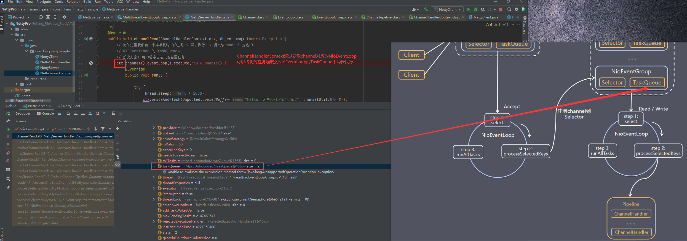

- 再次理解Netty模型：

  - Netty抽象出两组线程池：
    - BossGroup专门负责接收客户端连接，包含多个NioEventLoop
    - WorkerGroup专门负责网络读写请求，包含多个NioEventLoop
  - NioEventLoop：一个不断循环执行处理任务的线程，每个NioEventLoop都有一个Selector，用于监听绑定在其上的socket channel
    - NioEventLoop：内部采用串行化设计，从消息的读取=》解码=》处理=》编码=》发送。始终由IO线程NioEventLoop处理
  - BossGroup、WorkerGroup就是NioEventLoopGroup，包含多个线程，也就是NioEventLoop
  - NioEventLoop就是NioEventGroup，包含一个Selector、taskQueue
    - 一个Selector可以注册监听多个NioChannel
    - 每个NioChannel只会绑定唯一的一个NioEventLoop上
    - 每个NioChannel都有自己的ChannelPipeline

## 10.3 异步模型

- 什么是异步？

  - 相对于同步，是当一个异步过程调用发出后，调用者不能立刻得到结果。而是处理这个调用的组件在完成后，通过状态、通知或者回调来通知调用者

- `Netty` 中的 `I/O` 操作是异步的，包括 `Bind、Write、Connect` 等操作会首先简单的返回一个 `ChannelFuture`。

- 调用者并不能立刻获得结果，而是通过 `Future-Listener` 机制，用户可以方便的主动获取或者通过通知机制获得 `IO` 操作结果。

- Netty 的异步模型是建立在 future 和 callback 的之上的。

  - callback 就是回调。 
  - future的核心思想是：假设一个方法 fun，计算过程可能非常耗时，等待 fun 返回显然不合适。那么可以在调用 fun 的时候，立马返回一个 Future，后续可以通过 Future 去监控方法 fun 的处理过程（即：Future-Listener 机制）

- 什么是future？

  - FutureTask是Future的实现类
  - 思考callable接口的运行原理
    - 通过callable接口定义一个带返回值的线程任务
    - 通过线程池的submit方法将callable对象提交给线程池
    - submit方法构造一个FutureTask交给线程池执行，同时发挥FutureTask用于结果的获取
    - 线程池将FutureTask交给线程执行
    - 线程执行FutureTask的run方法
    - **FutureTask的run()执行callable对象的call方法，并且将结果保持在outcome中**
    - 通过返回的FutureTask获取outcome中的执行结果
  - **就有点像FutureTask是真正的任务调用的执行者，并且用了几种状态来维护任务是否完成，以提供方法。**
  - **可以理解成在callable外面包装一了一层其他业务逻辑，用来维护callable的运行状态(有点像代理模式，或者包装者模式吧)**

- Future说明：（不懂可以百度 java future!）

  - 表示异步的执行结果,可以通过它提供的方法来检测执行是否完成，比如检索计算等等。
  - `ChannelFuture` 是一个接口：`public interface ChannelFuture extends Future<Void>` 我们可以添加监听器，当监听的事件发生时，就会通知到监听器。
  - 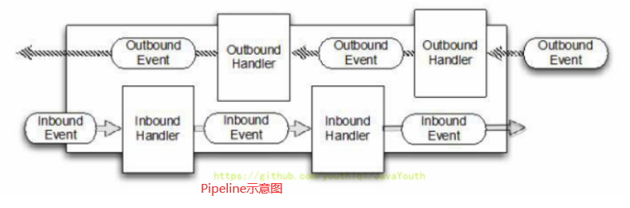
  - 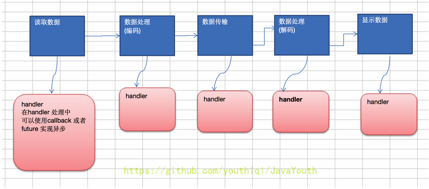
    - 在使用 `Netty` 进行编程时，拦截操作和转换出入站数据只需要您提供 `callback` 或利用 `future` 即可。这使得链式操作简单、高效，并有利于编写可重用的、通用的代码。
    - `Netty` 框架的目标就是让你的业务逻辑从网络基础应用编码中分离出来、解脱出来。

- Future-Listener机制：

  - 当 Future 对象刚刚创建时，处于非完成状态，调用者可以通过返回的 ChannelFuture 来获取操作执行的状态，注册监听函数来执行完成后的操作。

  - 常见有如下操作

    - 通过 isDone 方法来判断当前操作是否完成；
    - 通过 isSuccess 方法来判断已完成的当前操作是否成功；
    - 通过 getCause 方法来获取已完成的当前操作失败的原因；
    - 通过 isCancelled 方法来判断已完成的当前操作是否被取消；
    - 通过 addListener 方法来注册监听器，当操作已完成（isDone方法返回完成），将会通知指定的监听器；如果 Future 对象已完成，则通知指定的监听器

  - 代码示例：

    - 绑定端口是异步操作，当绑定操作处理完，就会调用相应的监听器进行处理

    - ```java
      //绑定一个端口并且同步,生成了一个ChannelFuture对象
      //启动服务器(并绑定端口)
      ChannelFuture cf = bootstrap.bind(6668).sync();
      //给cf注册监听器，监控我们关心的事件
      cf.addListener(new ChannelFutureListener() {
         @Override
         public void operationComplete (ChannelFuture future) throws Exception {
            if (cf.isSuccess()) {
               System.out.println("监听端口6668成功");
            } else {
               System.out.println("监听端口6668失败");
            }
         }
      });
      
      ```

## 10.4 Netty快速入门示例-HTTP服务

- 目标：

  - Netty 服务器在 6668 端口监听，浏览器发出请求 http://localhost:6668/
  - 服务器可以回复消息给客户端"Hello!我是服务器5",并对特定请求资源进行过滤。
  - 理解：Netty 可以做 Http 服务开发，并且理解 Handler 实例和客户端及其请求的关系

- TestServer：

  - 初始化BossGroup、WorkerGroup、和配置启动器、绑定端口、监听端口通道

  - ```java
    package com.king.netty.http;
    
    import io.netty.bootstrap.ServerBootstrap;
    import io.netty.channel.ChannelFuture;
    import io.netty.channel.nio.NioEventLoopGroup;
    import io.netty.channel.socket.nio.NioServerSocketChannel;
    
    public class TestServer {
        public static void main(String[] args) throws InterruptedException {
    
            // 创建两个线程池组
            NioEventLoopGroup bossGroup = new NioEventLoopGroup(1);
            NioEventLoopGroup workerGroup = new NioEventLoopGroup(3);
    
            try{
                // 设置启动器
                ServerBootstrap serverBootstrap = new ServerBootstrap();
                // 配置启动器
                serverBootstrap.group(bossGroup,workerGroup)
                        .channel(NioServerSocketChannel.class)
                        .childHandler(new TestServerInitializer());
    
                // 开始异步监听socket端口
                ChannelFuture channelFuture = serverBootstrap.bind(8081).sync();
    
                channelFuture.channel().closeFuture().sync();
    
    
    
    
            }finally {
                bossGroup.shutdownGracefully();
                workerGroup.shutdownGracefully();
            }
    
        }
    }
    
    ```

- TestServerInitializer：

  - 用来初始化workerGroup的处理器：每次有一个新的channel被监听到，都会按序执行对应pipeline对应的handler

  - ```java
    package com.king.netty.http;
    
    import io.netty.channel.ChannelInitializer;
    import io.netty.channel.ChannelPipeline;
    import io.netty.channel.socket.SocketChannel;
    import io.netty.handler.codec.http.HttpServerCodec;
    
    public class TestServerInitializer extends ChannelInitializer<SocketChannel> {
    
    
        @Override
        protected void initChannel(SocketChannel socketChannel) throws Exception {
            // 向管道加入处理器
            ChannelPipeline pipeline = socketChannel.pipeline();
    
            // 1.加入一个netty提供的httpServerCodec
            // httpServerCodec：是netty提供的处理http的 解码编码器
            pipeline.addLast("MyHttpServerCodec",new HttpServerCodec());
            // 2.增加一个自定义的handler
            pipeline.addLast("MyTestHttpServerHandler",new TestHttpServerHandler());
            System.out.println("initChannel() is ok,,,");
        }
    }
    
    ```

- TestHttpServerHandler：

  - channel进入通道后需要进行的处理器操作:具体顺序和实现待续！

  - ```java
    package com.king.netty.http;
    
    import io.netty.buffer.ByteBuf;
    import io.netty.buffer.Unpooled;
    import io.netty.channel.ChannelHandlerContext;
    import io.netty.channel.SimpleChannelInboundHandler;
    import io.netty.handler.codec.http.*;
    import io.netty.util.CharsetUtil;
    
    import java.net.URI;
    
    /*
    说明
    1. SimpleChannelInboundHandler 是 ChannelInboundHandlerAdapter=>在通道进入pipeline时，会使用该处理器对加入的通道进行处理
    2. HttpObject 客户端和服务器端相互通讯的数据被封装成 HttpObject
     */
    public class TestHttpServerHandler extends SimpleChannelInboundHandler<HttpObject> {
    
    
        //channelRead0 读取客户端数据
        @Override
        protected void channelRead0(ChannelHandlerContext ctx, HttpObject msg) throws Exception {
            System.out.println("======================新进入pipeline的channel开始进行：channelRead0()方法======================");
    
            System.out.println("对应的channel=" + ctx.channel() + " pipeline=" + ctx
                    .pipeline() + " 通过pipeline获取channel" + ctx.pipeline().channel());
    
            System.out.println("当前ctx的handler=" + ctx.handler());
    
            //判断 msg 是不是 httprequest请求
            if(msg instanceof HttpRequest) {
    
                System.out.println("ctx 类型="+ctx.getClass());
                System.out.println("ctx hashcode="+ctx.hashCode());
    
                System.out.println("pipeline hashcode" + ctx.pipeline().hashCode() + " TestHttpServerHandler hash=" + this.hashCode());
    
                System.out.println("msg 类型=" + msg.getClass());
                System.out.println("客户端地址" + ctx.channel().remoteAddress());
    
                //获取到
                HttpRequest httpRequest = (HttpRequest) msg;
                //获取uri, 过滤指定的资源
                URI uri = new URI(httpRequest.uri());
                if("/favicon.ico".equals(uri.getPath())) {
                    System.out.println("请求了 favicon.ico, 不做响应");
                    return;
                }
                //回复信息给浏览器 [http协议]
                ByteBuf content = Unpooled.copiedBuffer("hello, 我是服务器", CharsetUtil.UTF_8);
    
                //构造一个http的相应，即 httpresponse
                FullHttpResponse response = new DefaultFullHttpResponse(HttpVersion.HTTP_1_1, HttpResponseStatus.OK, content);
    
                response.headers().set(HttpHeaderNames.CONTENT_TYPE, "text/plain");
                response.headers().set(HttpHeaderNames.CONTENT_LENGTH, content.readableBytes());
    
                //将构建好 response返回
                ctx.writeAndFlush(response);
    
            }
        }
    
    }
    
    
    ```

- 测试：

  - 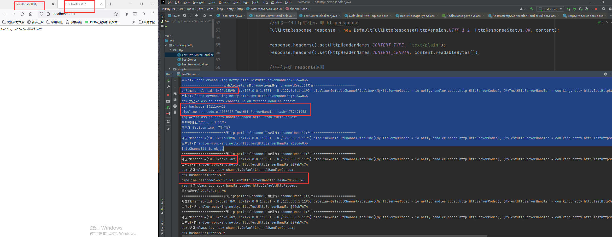
  - 因为http协议是无状态连接+短连接，所以每次在浏览器打开一个新的窗口请求或者刷新，服务器都会给对应的连接重新分配ChannelHandlerContext、Channel、Pipeline

# 11. Netty核心模块组件

- 建议和主从Reactor多线程模型一一对应更好理解！！！
- Netty就是使用NIO实现的异步、基于事件的网络应用框架！！！
- 目的：异步、基于事件、高性能
- 使用：框架=》直接知道功能方法、直接使用即可！

## 11.1 Bootstrap、ServerBootstrap-配置整个模型

- `Bootstrap` 意思是引导，一个 `Netty` 应用通常由一个 `Bootstrap` 开始，主要作用是配置整个 `Netty` 程序，串联各个组件，`Netty` 中 `Bootstrap` 类是**客户端**程序的启动引导类，`ServerBootstrap` 是**服务端**启动引导类。

- 常用的方法：

  - ```java
    // 该方法用于服务器端，用来设置两个 EventLoopGroup:BossGtoup、WorkerGroup
    public ServerBootstrap group(EventLoopGroup parentGroup, EventLoopGroup childGroup)
    
    // 该方法用于客户端，用来设置一个 EventLoop
    public B group(EventLoopGroup group)
        
    public B channel(Class<? extends C> channelClass)// 该方法用来设置一个服务器端的通道实现
        
    public <T> B option(ChannelOption<T> option, T value)//用来给 ServerChannel 添加配置
        
    public <T> ServerBootstrap childOption(ChannelOption<T> childOption, T value)//用来给接收到的通道添加配置
    
    public ServerBootstrap childHandler(ChannelHandler childHandler)//该方法用来设置业务处理类（自定义的handler）
    
    public ChannelFuture bind(int inetPort)//该方法用于服务器端，用来设置占用的端口号
    
    public ChannelFuture connect(String inetHost, int inetPort)// 该方法用于客户端，用来连接服务器端
    ```

## 11.2 Future、ChannelFuture-异步获取结果

- `Netty` 中所有的 `IO` 操作都是异步的，不能立刻得知消息是否被正确处理。但是可以过一会等它执行完成或者直接注册一个监听，具体的实现就是通过 `Future` 和 `ChannelFutures`，他们可以注册一个监听，当操作执行成功或失败时监听会自动触发注册的监听事件

- 常用的方法：

  - ```java
    Channel channel()//返回当前正在进行 IO 操作的通道
    ChannelFuture sync()//等待异步操作执行完毕
    ```

## 11.3 Channel-事件传输通道

- Netty 网络通信的组件，能够用于执行网络 I/O 操作。
- 通过 Channel 可获得当前网络连接的通道的状态
- 通过 Channel 可获得网络连接的配置参数（例如接收缓冲区大小）
- Channel 提供异步的网络 I/O 操作(如建立连接，读写，绑定端口)，异步调用意味着任何 I/O 调用都将立即返回，并且不保证在调用结束时所请求的 I/O 操作已完成
- 调用立即返回一个 ChannelFuture 实例，通过注册监听器到 ChannelFuture 上，可以 I/O 操作成功、失败或取消时回调通知调用方
- 支持关联 I/O 操作与对应的处理程序
- 不同协议、不同的阻塞类型的连接都有不同的 Channel 类型与之对应，常用的 Channel 类型：
  - NioSocketChannel，异步的客户端 TCP Socket 连接。
  - NioServerSocketChannel，异步的服务器端 TCP Socket 连接。
  - NioDatagramChannel，异步的 UDP 连接。
  - NioSctpChannel，异步的客户端 Sctp 连接。
  - NioSctpServerChannel，异步的 Sctp 服务器端连接，这些通道涵盖了 UDP 和 TCP 网络 IO 以及文件 IO。

## 11.4 Selector-事件监听

- Netty 基于 Selector 对象实现 I/O 多路复用，通过 Selector 一个线程可以监听多个连接的 Channel 事件。
- 当向一个 Selector 中注册 Channel 后，Selector 内部的机制就可以自动不断地查询（Select）这些注册的 Channel 是否有已就绪的 I/O 事件（例如可读，可写，网络连接完成等），这样程序就可以很简单地使用一个线程高效地管理多个 Channel

## 11.5 ChannelHandler-事件处理器

- ChannelHandler 是一个接口，处理 I/O 事件或拦截 I/O 操作，并将其转发到其 ChannelPipeline（业务处理链）中的下一个处理程序。
- ChannelHandler 本身并没有提供很多方法，因为这个接口有许多的方法需要实现，方便使用期间，可以继承它的子类
- ChannelHandler 及其实现类：
  - 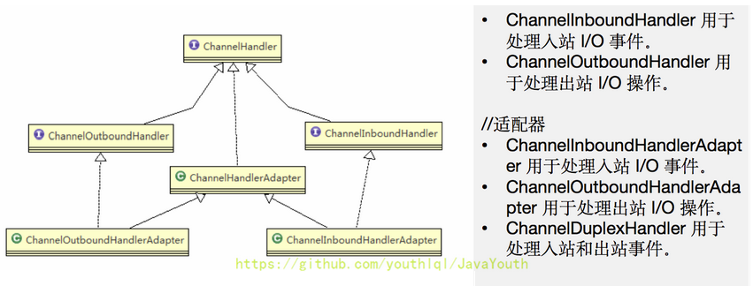
- 经常需要自定义一个 `Handler` 类去继承 `ChannelInboundHandlerAdapter`，然后通过重写相应方法实现业务逻辑，我们接下来看看一般都需要重写哪些方法
  - 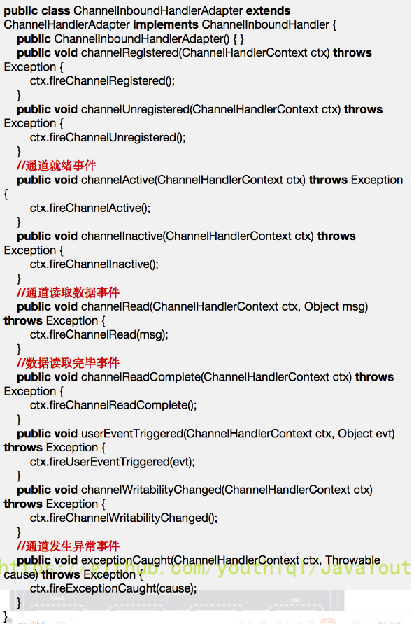

## 11.6 Pipeline-事件处理管道

- ChannelPipeline ：

  - ChannelPipeline 是一个 Handler 的集合，它负责处理和拦截 inbound 或者 outbound 的事件和操作，相当于一个贯穿 Netty 的链。（也可以这样理解：ChannelPipeline 是保存 ChannelHandler 的 List，用于处理或拦截 Channel 的入站事件和出站操作）
  - ChannelPipeline 实现了一种高级形式的拦截过滤器模式，使用户可以完全控制事件的处理方式，以及 Channel 中各个的 ChannelHandler 如何相互交互
  - 在 Netty 中每个 Channel 都有且仅有一个 ChannelPipeline 与之对应，它们的组成关系如下
    - 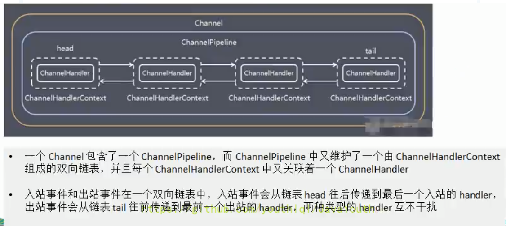

- 常用方法：

  - ```java
    ChannelPipeline addFirst(ChannelHandler... handlers)// 把一个业务处理类（handler）添加到链中的第一个位置ChannelPipeline 
        
    addLast(ChannelHandler... handlers)// 把一个业务处理类（handler）添加到链中的最后一个位置
    ```

- 一般来说事件从客户端往服务器走我们称为出站，反之则是入站。

## 11.7 ChannelHandlerContext-事件处理上下文

- 保存 Channel 相关的所有上下文信息，同时关联一个 ChannelHandler 对象

- 即 ChannelHandlerContext 中包含一个具体的事件处理器 ChannelHandler，同时 ChannelHandlerContext 中也绑定了对应的 pipeline 和 Channel 的信息，方便对 ChannelHandler 进行调用。

- 常用方法：

  - ```java
    ChannelFuture close()// 关闭通道
        
    ChannelOutboundInvoker flush()//刷新
        
    ChannelFuture writeAndFlush(Object msg)//将数据写到 ChannelPipeline 中当前 ChannelHandler 的下一个 ChannelHandler 开始处理（出站）
    ```

## 11.8 ChannelOption-事件通道的配置

- `Netty` 在创建 `Channel` 实例后，一般都需要设置 `ChannelOption` 参数。
- `ChannelOption` 参数如下：
  - 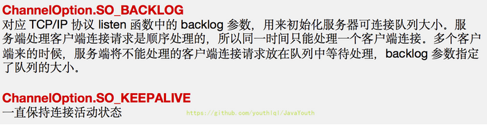

## 11.9 EventLoopGroup-事件监听分发器

- EventLoopGroup 是一组 EventLoop 的抽象，Netty 为了更好的利用多核 CPU 资源，一般会有多个 EventLoop 同时工作，每个 EventLoop 维护着一个 Selector 实例。

- EventLoopGroup 提供 next 接口，可以从组里面按照一定规则获取其中一个 EventLoop 来处理任务。在 Netty 服务器端编程中，我们一般都需要提供两个 EventLoopGroup，例如：BossEventLoopGroup 和 WorkerEventLoopGroup。

- 通常一个服务端口即一个 ServerSocketChannel 对应一个 Selector 和一个 EventLoop 线程。BossEventLoop 负责接收客户端的连接并将 SocketChannel 交给 WorkerEventLoopGroup 来进行 IO 处理，如下图所示

  - 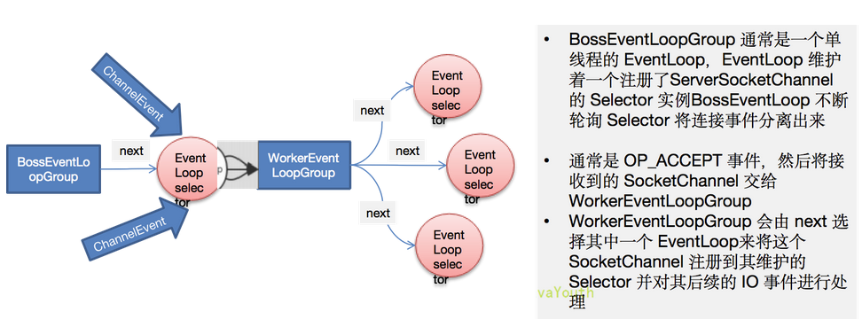

- 常用方法：

  - ```java
    public NioEventLoopGroup() //构造方法
    public Future<?> shutdownGracefully() // 断开连接，关闭线程
    ```

## 11.10 Unpooled类-数据处理

- `Netty` 提供一个专门用来操作缓冲区（即 `Netty` 的数据容器）的工具类

- 常用方法：

  - ```java
    // 通过给定的数据和字符编码返回一个ByteBuf对象
    public static ByteBuf copiedBuffer(CharSequence string,Charset charset);
    ```

- 代码示例：

  - ```java
    import io.netty.buffer.ByteBuf;
    import io.netty.buffer.Unpooled;
    
    public class NettyByteBuf01 {
    
        public static void main(String[] args) {
            
            //创建一个ByteBuf
            //说明
            //1. 创建 对象，该对象包含一个数组arr , 是一个byte[10]
            //2. 在netty 的buffer中，不需要使用flip 进行反转
            //   底层维护了 readerindex 和 writerIndex
            //3. 通过 readerindex 和  writerIndex 和  capacity， 将buffer分成三个区域
            // 0---readerindex 已经读取的区域
            // readerindex---writerIndex ， 可读的区域
            // writerIndex -- capacity, 可写的区域
            ByteBuf buffer = Unpooled.buffer(10);
    
            for (int i = 0; i < 10; i++) {
                buffer.writeByte(i);
            }
    
            System.out.println("capacity=" + buffer.capacity());//10
            //输出
    //        for(int i = 0; i<buffer.capacity(); i++) {
            	  //这个方法readerindex不会变
    //            System.out.println(buffer.getByte(i));
    //        }
            for (int i = 0; i < buffer.capacity(); i++) {
                //这个方法readerindex会变
                System.out.println(buffer.readByte());
            }
            System.out.println("执行完毕");
        }
    }
    
    ```

  - ```java
    import io.netty.buffer.ByteBuf;
    import io.netty.buffer.Unpooled;
    
    import java.nio.charset.Charset;
    
    public class NettyByteBuf02 {
        
        public static void main(String[] args) {
    
            //创建ByteBuf
            ByteBuf byteBuf = Unpooled.copiedBuffer("hello,world!", Charset.forName("utf-8"));
    
            //使用相关的方法
            if (byteBuf.hasArray()) { // true
    
                byte[] content = byteBuf.array();
    
                //将 content 转成字符串
                System.out.println(new String(content, Charset.forName("utf-8")));
    
                System.out.println("byteBuf=" + byteBuf);
    
                System.out.println(byteBuf.arrayOffset()); // 0
                System.out.println(byteBuf.readerIndex()); // 0
                System.out.println(byteBuf.writerIndex()); // 12
                System.out.println(byteBuf.capacity()); // 36
    
                //System.out.println(byteBuf.readByte()); //
                System.out.println(byteBuf.getByte(0)); // 104
    
                int len = byteBuf.readableBytes(); //可读的字节数  12
                System.out.println("len=" + len);
    
                //使用for取出各个字节
                for (int i = 0; i < len; i++) {
                    System.out.println((char) byteBuf.getByte(i));
                }
    
                //按照某个范围读取
                System.out.println(byteBuf.getCharSequence(0, 4, Charset.forName("utf-8")));
                System.out.println(byteBuf.getCharSequence(4, 6, Charset.forName("utf-8")));
            }
        }
    }
    
    ```

# 12. Netty应用实例-群聊系统

- 实例要求：

  - 编写一个 Netty 群聊系统，实现服务器端和客户端之间的数据简单通讯（非阻塞）实现多人群聊
  - 服务器端：可以监测用户上线，离线，并实现消息转发功能
  - 客户端：通过 channel 可以无阻塞发送消息给其它所有用户，同时可以接受其它用户发送的消息（由服务器转发得到）
  - 目的：进一步理解 Netty 非阻塞网络编程机制

- GroupChatServer：

  - ```java
    package com.king.netty.groupchat;
    
    
    import io.netty.bootstrap.ServerBootstrap;
    import io.netty.channel.*;
    import io.netty.channel.nio.NioEventLoopGroup;
    import io.netty.channel.socket.SocketChannel;
    import io.netty.channel.socket.nio.NioServerSocketChannel;
    import io.netty.handler.codec.string.StringDecoder;
    import io.netty.handler.codec.string.StringEncoder;
    
    public class GroupChatServer {
    
        private int port; //监听端口
    
    
        public GroupChatServer(int port) {
            this.port = port;
        }
    
        //编写run方法，处理客户端的请求
        public void run() throws  Exception{
    
            //创建两个线程组
            EventLoopGroup bossGroup = new NioEventLoopGroup(1);
            EventLoopGroup workerGroup = new NioEventLoopGroup(); //8个NioEventLoop
    
            try {
                ServerBootstrap b = new ServerBootstrap();
    
                b.group(bossGroup, workerGroup)
                        .channel(NioServerSocketChannel.class)
                        .option(ChannelOption.SO_BACKLOG, 128)
                        .childOption(ChannelOption.SO_KEEPALIVE, true)
                        .childHandler(new ChannelInitializer<SocketChannel>() {
    
                            @Override
                            protected void initChannel(SocketChannel ch) throws Exception {
    
                                //获取到pipeline
                                ChannelPipeline pipeline = ch.pipeline();
                                //向pipeline加入解码器
                                pipeline.addLast("decoder", new StringDecoder());
                                //向pipeline加入编码器
                                pipeline.addLast("encoder", new StringEncoder());
                                //加入自己的业务处理handler
                                pipeline.addLast(new GroupChatServerHandler());
    
                            }
                        });
    
                System.out.println("netty 服务器启动");
                ChannelFuture channelFuture = b.bind(port).sync();
    
                //监听关闭
                channelFuture.channel().closeFuture().sync();
            }finally {
                bossGroup.shutdownGracefully();
                workerGroup.shutdownGracefully();
            }
    
        }
    
        public static void main(String[] args) throws Exception {
    
            new GroupChatServer(7000).run();
        }
    }
    ```

- GroupChatServerHandler：

  - ```java
    package com.king.netty.groupchat;
    
    
    import io.netty.channel.Channel;
    import io.netty.channel.ChannelHandlerContext;
    import io.netty.channel.SimpleChannelInboundHandler;
    import io.netty.channel.group.ChannelGroup;
    import io.netty.channel.group.DefaultChannelGroup;
    import io.netty.util.concurrent.GlobalEventExecutor;
    
    import java.text.SimpleDateFormat;
    import java.util.ArrayList;
    import java.util.HashMap;
    import java.util.List;
    import java.util.Map;
    
    public class GroupChatServerHandler extends SimpleChannelInboundHandler<String> {
    
        //这样写还要自己遍历Channel
        //public static List<Channel> channels = new ArrayList<Channel>();
    
        //使用一个hashmap 管理私聊（私聊本案例并未实现，只是提供个思路）
        //public static Map<String, Channel> channels = new HashMap<String,Channel>();
    
        //定义一个channle 组，管理所有的channel
        //GlobalEventExecutor.INSTANCE) 是全局的事件执行器，是一个单例
        private static ChannelGroup  channelGroup = new DefaultChannelGroup(GlobalEventExecutor.INSTANCE);
        SimpleDateFormat sdf = new SimpleDateFormat("yyyy-MM-dd HH:mm:ss");
    
    
        //handlerAdded 表示连接建立，一旦连接，第一个被执行
        //将当前channel 加入到  channelGroup
        @Override
        public void handlerAdded(ChannelHandlerContext ctx) throws Exception {
            Channel channel = ctx.channel();
            //将该客户加入聊天的信息推送给其它在线的客户端
    
            //该方法会将 channelGroup 中所有的channel 遍历，并发送消息，我们不需要自己遍历
    
            channelGroup.writeAndFlush("[客户端]" + channel.remoteAddress() + " 加入聊天" + sdf.format(new java.util.Date()) + " \n");
            channelGroup.add(channel);
    
            //私聊如何实现
    //         channels.put（"userid100",channel）;
    
    
        }
    
        //断开连接, 将xx客户离开信息推送给当前在线的客户
        @Override
        public void handlerRemoved(ChannelHandlerContext ctx) throws Exception {
    
            Channel channel = ctx.channel();
            channelGroup.writeAndFlush("[客户端]" + channel.remoteAddress() + " 离开了\n");
            System.out.println("channelGroup size" + channelGroup.size());
    
        }
    
        //表示channel 处于活动状态, 提示 xx上线
        @Override
        public void channelActive(ChannelHandlerContext ctx) throws Exception {
            //这个是给服务端看的，客户端上面已经提示xxx加入群聊了
            System.out.println(ctx.channel().remoteAddress() + " 上线了~");
        }
    
        //表示channel 处于不活动状态, 提示 xx离线了
        @Override
        public void channelInactive(ChannelHandlerContext ctx) throws Exception {
    
            System.out.println(ctx.channel().remoteAddress() + " 离线了~");
        }
    
        //读取数据，转发给在线的每一个客户端
        @Override
        protected void channelRead0(ChannelHandlerContext ctx, String msg) throws Exception {
    
            //获取到当前channel
            Channel channel = ctx.channel();
            //这时我们遍历channelGroup, 根据不同的情况，回送不同的消息
    
            channelGroup.forEach(ch -> {
                if(channel != ch) { //不是当前的channel,转发消息
                    ch.writeAndFlush("[客户]" + channel.remoteAddress() + " 发送了消息" + msg + "\n");
                }else {//回显自己发送的消息给自己
                    ch.writeAndFlush("[自己]发送了消息" + msg + "\n");
                }
            });
        }
    
        @Override
        public void exceptionCaught(ChannelHandlerContext ctx, Throwable cause) throws Exception {
            //关闭通道
            ctx.close();
        }
    }
    ```

- GroupChatClient

  - ```java
    package com.king.netty.groupchat;
    
    
    import io.netty.bootstrap.Bootstrap;
    import io.netty.channel.*;
    import io.netty.channel.nio.NioEventLoopGroup;
    import io.netty.channel.socket.SocketChannel;
    import io.netty.channel.socket.nio.NioSocketChannel;
    import io.netty.handler.codec.string.StringDecoder;
    import io.netty.handler.codec.string.StringEncoder;
    
    import java.util.Scanner;
    
    
    public class GroupChatClient {
    
        //属性
        private final String host;
        private final int port;
    
        public GroupChatClient(String host, int port) {
            this.host = host;
            this.port = port;
        }
    
        public void run() throws Exception{
            EventLoopGroup group = new NioEventLoopGroup();
    
            try {
    
    
                Bootstrap bootstrap = new Bootstrap()
                        .group(group)
                        .channel(NioSocketChannel.class)
                        .handler(new ChannelInitializer<SocketChannel>() {
    
                            @Override
                            protected void initChannel(SocketChannel ch) throws Exception {
    
                                //得到pipeline
                                ChannelPipeline pipeline = ch.pipeline();
                                //加入相关handler
                                pipeline.addLast("decoder", new StringDecoder());
                                pipeline.addLast("encoder", new StringEncoder());
                                //加入自定义的handler
                                pipeline.addLast(new GroupChatClientHandler());
                            }
                        });
    
                ChannelFuture channelFuture = bootstrap.connect(host, port).sync();
                //得到channel
                Channel channel = channelFuture.channel();
                System.out.println("-------" + channel.localAddress()+ "--------");
                //客户端需要输入信息，创建一个扫描器
                Scanner scanner = new Scanner(System.in);
                while (scanner.hasNextLine()) {
                    String msg = scanner.nextLine();
                    //通过channel 发送到服务器端
                    channel.writeAndFlush(msg + "\r\n");
    //                channel.write(msg+"我没有flush" + "\r\n");
                }
            }finally {
                group.shutdownGracefully();
            }
        }
    
        public static void main(String[] args) throws Exception {
            new GroupChatClient("127.0.0.1", 7000).run();
        }
    }
    ```

- GroupChatClientHandler：

  - ```java
    package com.king.netty.groupchat;
    
    import io.netty.channel.ChannelHandlerContext;
    import io.netty.channel.SimpleChannelInboundHandler;
    
    public class GroupChatClientHandler extends SimpleChannelInboundHandler<String> {
    
        //从服务器拿到的数据
        @Override
        protected void channelRead0(ChannelHandlerContext ctx, String msg) throws Exception {
            System.out.println(msg.trim());
        }
    }
    ```

- 测试：

  - 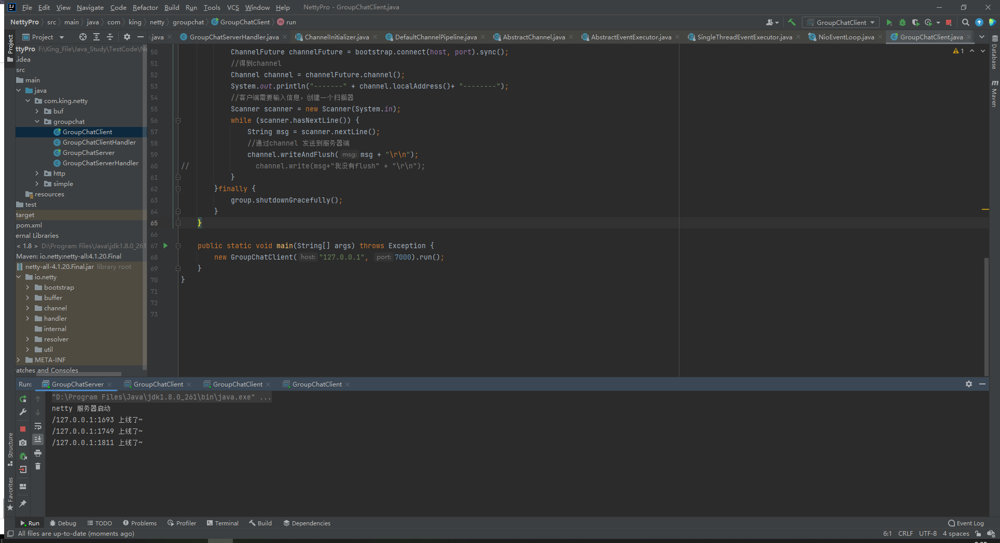
  - 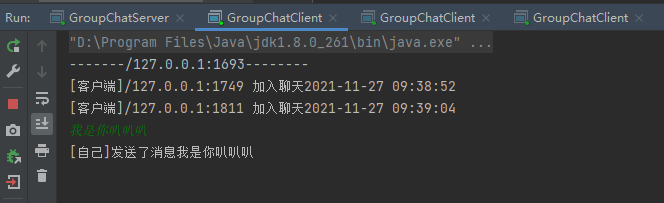
  - 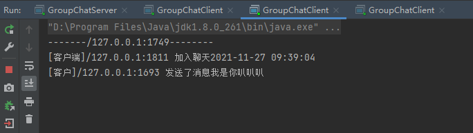
  - 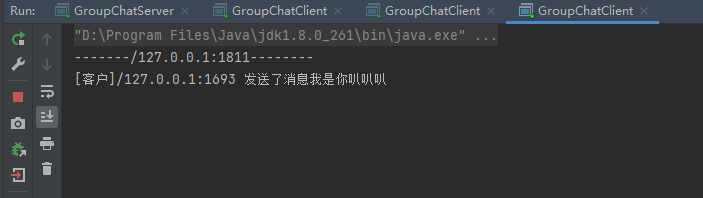

# 13. Netty心跳检测机制-应用实例

- 为什么需要心跳检测机制？
  - 考虑一种情况：某台服务器因为某些原因导致负载超高，CPU 100%，无法响应任何业务请求，但是使用 TCP  探针则仍旧能够确定连接状态，这就是典型的客户端活着但服务端已死的状态，对客户端而言，这时的最好选择就是断线后重新连接其他服务器，而不是一直认为当前服务器是可用状态，然后一直向当前服务器发送些必然会失败的请求。浪费资源
  - 因此此时就可以使用心跳检测机制！
- 什么是心跳检测机制？
  - TCP KeepAlive可以用于检测连接的死活，但是不能确定通讯双方可以处理业务
  - 因此心跳检测机制：可以检测通讯双方的存活状态
- 什么时候使用心跳检测机制？
  
- 心跳检测一般存在于建立长连接 或者 需要保活的场景。
  
- 实例要求：

  1. 编写一个 `Netty` 心跳检测机制案例,当服务器超过 `3` 秒没有读时，就提示读空闲
  2. 当服务器超过 `5` 秒没有写操作时，就提示写空闲
  3. 实现当服务器超过 `7` 秒没有读或者写操作时，就提示读写空闲

- MyServer

  - ```java
    package com.king.netty.heartbeat;
    
    
    import io.netty.bootstrap.ServerBootstrap;
    import io.netty.channel.ChannelFuture;
    import io.netty.channel.ChannelInitializer;
    import io.netty.channel.ChannelPipeline;
    import io.netty.channel.EventLoopGroup;
    import io.netty.channel.nio.NioEventLoopGroup;
    import io.netty.channel.socket.SocketChannel;
    import io.netty.channel.socket.nio.NioServerSocketChannel;
    import io.netty.handler.logging.LogLevel;
    import io.netty.handler.logging.LoggingHandler;
    import io.netty.handler.timeout.IdleStateHandler;
    
    import java.util.concurrent.TimeUnit;
    
    public class MyServer {
        public static void main(String[] args) throws Exception{
    
    
            //创建两个线程组
            EventLoopGroup bossGroup = new NioEventLoopGroup(1);
            EventLoopGroup workerGroup = new NioEventLoopGroup(); //8个NioEventLoop
            try {
    
                ServerBootstrap serverBootstrap = new ServerBootstrap();
    
                serverBootstrap.group(bossGroup, workerGroup);
                serverBootstrap.channel(NioServerSocketChannel.class);
                //在bossGroup增加一个日志处理器
                serverBootstrap.handler(new LoggingHandler(LogLevel.INFO));
                serverBootstrap.childHandler(new ChannelInitializer<SocketChannel>() {
    
                    @Override
                    protected void initChannel(SocketChannel ch) throws Exception {
                        ChannelPipeline pipeline = ch.pipeline();
                        //加入一个netty 提供 IdleStateHandler
                        /*
                        说明
                        1. IdleStateHandler 是netty 提供的处理空闲状态的处理器
                        2. long readerIdleTime : 表示多长时间没有读, 就会发送一个心跳检测包检测是否连接
                        3. long writerIdleTime : 表示多长时间没有写, 就会发送一个心跳检测包检测是否连接
                        4. long allIdleTime : 表示多长时间没有读写, 就会发送一个心跳检测包检测是否连接
    
                        5. 文档说明
                        triggers an {@link IdleStateEvent} when a {@link Channel} has not performed
                       read, write, or both operation for a while.
                        6. 当 IdleStateEvent 触发后 , 就会传递给管道 的下一个handler去处理，通过调用(触发)
                       下一个handler 的 userEventTiggered , 在该方法中去处理 IdleStateEvent(读空闲，写空闲，读写空闲)
                        7.handlerRemoved有时候是无法感知连接断掉，所以还是需要心跳包的检测来判断连接是否还有效
                         */
                        pipeline.addLast(new IdleStateHandler(3,5,7, TimeUnit.SECONDS));
                        //加入一个对空闲检测进一步处理的handler(自定义)
                        pipeline.addLast(new MyServerHandler());
                    }
                });
    
                //启动服务器
                ChannelFuture channelFuture = serverBootstrap.bind(7000).sync();
                channelFuture.channel().closeFuture().sync();
    
            }finally {
                bossGroup.shutdownGracefully();
                workerGroup.shutdownGracefully();
            }
        }
    }
    ```

- MyServerHandler

  - ```java
    package com.king.netty.heartbeat;
    
    
    import io.netty.channel.ChannelHandlerContext;
    import io.netty.channel.ChannelInboundHandlerAdapter;
    import io.netty.handler.timeout.IdleStateEvent;
    
    public class MyServerHandler extends ChannelInboundHandlerAdapter {
    
        /**
         *
         * @param ctx 上下文
         * @param evt 事件
         * @throws Exception
         */
        @Override
        public void userEventTriggered(ChannelHandlerContext ctx, Object evt) throws Exception {
    
            if(evt instanceof IdleStateEvent) {
    
                //将  evt 向下转型 IdleStateEvent
                IdleStateEvent event = (IdleStateEvent) evt;
                String eventType = null;
                switch (event.state()) {
                    case READER_IDLE:
                        eventType = "读空闲";
                        break;
                    case WRITER_IDLE:
                        eventType = "写空闲";
                        break;
                    case ALL_IDLE:
                        eventType = "读写空闲";
                        break;
                }
                System.out.println(ctx.channel().remoteAddress() + "--超时时间--" + eventType);
                System.out.println("服务器做相应处理..");
    
                //如果发生空闲，我们关闭通道
                // ctx.channel().close();
            }
        }
    }
    ```

# 14. Netty应用实例-WebSocket长连接

- 实例要求：

  - Http 协议是无状态的，浏览器和服务器间的请求响应一次，下一次会重新创建连接。
  - 要求：实现基于 WebSocket 的长连接的全双工的交互
  - 改变 Http 协议多次请求的约束，实现长连接了，服务器可以发送消息给浏览器
  - 客户端浏览器和服务器端会相互感知，比如服务器关闭了，浏览器会感知，同样浏览器关闭了，服务器会感知

- 什么是WebSocket协议？-待续

  - 带百度续！！！

- MyServer

  - ```java
    package com.king.netty.websocket;
    
    
    import io.netty.bootstrap.ServerBootstrap;
    import io.netty.channel.ChannelFuture;
    import io.netty.channel.ChannelInitializer;
    import io.netty.channel.ChannelPipeline;
    import io.netty.channel.EventLoopGroup;
    import io.netty.channel.nio.NioEventLoopGroup;
    import io.netty.channel.socket.SocketChannel;
    import io.netty.channel.socket.nio.NioServerSocketChannel;
    import io.netty.handler.codec.http.HttpObjectAggregator;
    import io.netty.handler.codec.http.HttpServerCodec;
    import io.netty.handler.codec.http.websocketx.WebSocketServerProtocolHandler;
    import io.netty.handler.logging.LogLevel;
    import io.netty.handler.logging.LoggingHandler;
    import io.netty.handler.stream.ChunkedWriteHandler;
    import io.netty.handler.timeout.IdleStateHandler;
    
    import java.util.concurrent.TimeUnit;
    
    public class MyServer {
        public static void main(String[] args) throws Exception{
    
    
            //创建两个线程组
            EventLoopGroup bossGroup = new NioEventLoopGroup(1);
            EventLoopGroup workerGroup = new NioEventLoopGroup(); //8个NioEventLoop
            try {
    
                ServerBootstrap serverBootstrap = new ServerBootstrap();
    
                serverBootstrap.group(bossGroup, workerGroup);
                serverBootstrap.channel(NioServerSocketChannel.class);
                serverBootstrap.handler(new LoggingHandler(LogLevel.INFO));
                serverBootstrap.childHandler(new ChannelInitializer<SocketChannel>() {
    
                    @Override
                    protected void initChannel(SocketChannel ch) throws Exception {
                        ChannelPipeline pipeline = ch.pipeline();
    
                        //因为基于http协议，使用http的编码和解码器
                        pipeline.addLast(new HttpServerCodec());
                        //http是以块方式写，添加ChunkedWriteHandler处理器
                        pipeline.addLast(new ChunkedWriteHandler());
    
                        /*
                        说明
                        1. http数据在传输过程中是分段, HttpObjectAggregator ，就是可以将多个段聚合
                        2. 这就就是为什么，当浏览器发送大量数据时，就会发出多次http请求
                         */
                        pipeline.addLast(new HttpObjectAggregator(8192));
                        /*
                        说明
                        1. 对应websocket ，它的数据是以 帧(frame) 形式传递
                        2. 可以看到WebSocketFrame 下面有六个子类
                        3. 浏览器请求时 ws://localhost:7000/hello 表示请求的uri
                        4. WebSocketServerProtocolHandler 核心功能是将 http协议升级为 ws协议 , 保持长连接
                        5. 是通过一个 状态码 101
                         */
                        pipeline.addLast(new WebSocketServerProtocolHandler("/hello"));
    
                        //自定义的handler ，处理业务逻辑
                        pipeline.addLast(new MyTextWebSocketFrameHandler());
                    }
                });
    
                //启动服务器
                ChannelFuture channelFuture = serverBootstrap.bind(7000).sync();
                channelFuture.channel().closeFuture().sync();
    
            }finally {
                bossGroup.shutdownGracefully();
                workerGroup.shutdownGracefully();
            }
        }
    }
    ```

- MyTextWebSocketFrameHandler

  - ```java
    package com.king.netty.websocket;
    
    
    import io.netty.channel.ChannelHandlerContext;
    import io.netty.channel.SimpleChannelInboundHandler;
    import io.netty.handler.codec.http.websocketx.TextWebSocketFrame;
    
    import java.time.LocalDateTime;
    
    //这里 TextWebSocketFrame 类型，表示一个文本帧(frame)
    public class MyTextWebSocketFrameHandler extends SimpleChannelInboundHandler<TextWebSocketFrame>{
        @Override
        protected void channelRead0(ChannelHandlerContext ctx, TextWebSocketFrame msg) throws Exception {
    
            System.out.println("服务器收到消息 " + msg.text());
    
            //回复消息
            ctx.channel().writeAndFlush(new TextWebSocketFrame("服务器时间" + LocalDateTime.now() + " " + msg.text()));
        }
    
        //当web客户端连接后， 触发方法
        @Override
        public void handlerAdded(ChannelHandlerContext ctx) throws Exception {
            //id 表示唯一的值，LongText 是唯一的 ShortText 不是唯一
            System.out.println("handlerAdded 被调用" + ctx.channel().id().asLongText());
            System.out.println("handlerAdded 被调用" + ctx.channel().id().asShortText());
        }
    
    
        @Override
        public void handlerRemoved(ChannelHandlerContext ctx) throws Exception {
    
            System.out.println("handlerRemoved 被调用" + ctx.channel().id().asLongText());
        }
    
        @Override
        public void exceptionCaught(ChannelHandlerContext ctx, Throwable cause) throws Exception {
            System.out.println("异常发生 " + cause.getMessage());
            ctx.close(); //关闭连接
        }
    }
    
    
    
    ```

- hello.html

  - ```html
    <!DOCTYPE html>
    <html lang="en">
    <head>
        <meta charset="UTF-8">
        <title>Title</title>
    </head>
    <body>
    <script>
        var socket;
        //判断当前浏览器是否支持websocket
        if(window.WebSocket) {
            //go on
            socket = new WebSocket("ws://localhost:7000/hello");
            //相当于channelReado, ev 收到服务器端回送的消息
            socket.onmessage = function (ev) {
                var rt = document.getElementById("responseText");
                rt.value = rt.value + "\n" + ev.data;
            }
    
            //相当于连接开启(感知到连接开启)
            socket.onopen = function (ev) {
                var rt = document.getElementById("responseText");
                rt.value = "连接开启了.."
            }
    
            //相当于连接关闭(感知到连接关闭)
            socket.onclose = function (ev) {
    
                var rt = document.getElementById("responseText");
                rt.value = rt.value + "\n" + "连接关闭了.."
            }
        } else {
            alert("当前浏览器不支持websocket")
        }
    
        //发送消息到服务器
        function send(message) {
            if(!window.socket) { //先判断socket是否创建好
                return;
            }
            if(socket.readyState == WebSocket.OPEN) {
                //通过socket 发送消息
                socket.send(message)
            } else {
                alert("连接没有开启");
            }
        }
    </script>
    <form onsubmit="return false">
        <textarea name="message" style="height: 300px; width: 300px"></textarea>
        <input type="button" value="发生消息" onclick="send(this.form.message.value)">
        <textarea id="responseText" style="height: 300px; width: 300px"></textarea>
        <input type="button" value="清空内容" onclick="document.getElementById('responseText').value=''">
    </form>
    </body>
    </html>
    
    ```

- 测试：

  - 

# 15. TODO

- 理解：channel=>pipeline=>handler执行顺序、如何调用？
- 了解：Sctp协议、WebSocket协议！

# 16. 编码解码

- 什么是编码解码？为什么需要编码解码？
  - 编写网络应用程序时，因为数据在网络中传输的都是二进制字节码数据，在发送数据时就需要编码，接收数据时就需要解码
  - codec（编解码器）的组成部分有两个：decoder（解码器）和 encoder（编码器）
  - encoder 负责把业务数据转换成字节码数据，decoder 负责把字节码数据转换成业务数据
  - 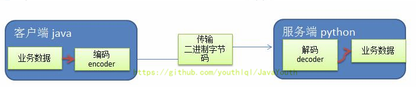
- Netty提供的编码解码器？有何缺陷？
  - Netty 自身提供了一些 codec(编解码器)
    - StringEncoder：对字符串数据进行编码。
    - ObjectEncoder：对Java对象进行编码。
    - StringDecoder,对字符串数据进行解码
    - ObjectDecoder，对 Java 对象进行解码
  - Netty 本身自带的 ObjectDecoder 和 ObjectEncoder 可以用来实现 POJO 对象或各种业务对象的编码和解码，底层使用的仍是Java序列化技术，而Java序列化技术本身效率就不高，存在如下问题：
    - 无法跨语言
    - 序列化后的体积太大，是二进制编码的5倍多。
    - 序列化性能太低
- 如何解决Netty自带的编码解码器的不足？
  - 第三方工具包：[`Google` 的 `Protobuf`]

## 16.1 Protobuf

- Protobuf是什么？
  - Protobuf 是 Google 发布的开源项目，全称 Google Protocol Buffers，是一种轻便高效的**结构化数据存储格式**，可以用于结构化数据串行化，或者说序列化。它很适合做数据存储或 RPC [远程过程调用 remote procedure call ]数据交换格式。目前很多公司 从http + json 转向tcp + protobuf，效率会更高。
  - 参考文档：https://developers.google.com/protocol-buffers/docs/proto 语言指南
  - Protobuf 是以 message 的方式来管理数据的.
  - 支持跨平台、跨语言，即[客户端和服务器端可以是不同的语言编写的]（支持目前绝大多数语言，例如 C++、C#、Java、python 等）
  - 高性能，高可靠性
- Protobuf的主要思想？
  - 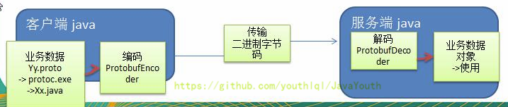

- 如何使用Protobuf？
  - 使用 protobuf 编译器能自动生成代码，Protobuf 是将类的定义使用 .proto 文件进行描述。说明，在 idea 中编写 .proto 文件时，会自动提示是否下载 .ptoto 编写插件.可以让语法高亮。
  - 然后通过 protoc.exe 编译器根据 .proto 自动生成 .java 文件
- **建议直接看视频或者官网手册，这里就不赘述了，只是为了知道是存在这些工具的可以方便编码解码使用！**
  - 推荐视频和博客：
    - https://blog.csdn.net/Youth_lql/article/details/116015820?spm=1001.2014.3001.5501
    - https://www.bilibili.com/video/BV1DJ411m7NR?p=79

# 17. Handler调用机制

- 在前面的学习中，已经知道Netty的核心组件：Channel、EventLoop、ChannelFuture、ChannelHandler、ChannelPipe
- ChannelHandler 充当了处理入站和出站数据的处理业务逻辑的容器。
  - 例如，实现 ChannelInboundHandler 接口（或 ChannelInboundHandlerAdapter）的ChannelHandler，就可以接收入站事件和数据，这些数据会被ChannelHandler里面对应的方法接收并且进行业务逻辑处理。当要给客户端发送响应时，也会从 ChannelInboundHandler 冲刷数据。业务逻辑通常写在一个或者多个 ChannelInboundHandler 中。
  - ChannelOutboundHandler 原理一样，只不过它是用来处理出站数据的
- ChannelPipeline 提供了 ChannelHandler 链的容器。
  - 以客户端应用程序为例，如果事件的运动方向是从客户端到服务端的，那么我们称这些事件为出站的，即客户端发送给服务端的数据会通过 pipeline 中的一系列 ChannelOutboundHandler，并被这些 Handler 处理，反之则称为入站的
  - 也可以理解为：
    - 数据格式=》发送通道(字节码格式)：是要通过pipeline的出站
    - 发送通道(字节码格式)=》数据格式：是要通过pipeline的入站
- 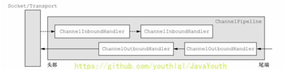
- 如果还不好理解，建议直接看代码实例！

## 17.1 编码解码器的实现逻辑

- 当 Netty 发送或者接受一个消息的时候，就将会发生一次数据转换。入站消息会被解码：从字节转换为另一种格式（比如 java 对象）；如果是出站消息，它会被编码成字节。
- Netty 提供一系列实用的编解码器，他们都实现了 ChannelInboundHadnler 或者 ChannelOutboundHandler 接口。在这些类中，channelRead 方法已经被重写了。
  - 以入站为例，对于每个从入站 Channel 读取的消息，这个方法会被调用。随后，它将调用由解码器所提供的 decode() 方法进行解码，并将已经解码的字节转发给 ChannelPipeline 中的下一个 ChannelInboundHandler。
- 如：ByteToMessageDecoder：
  - 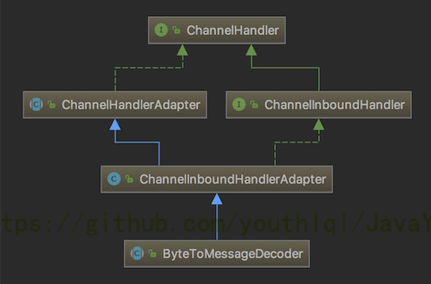
  - 由于不可能知道远程节点是否会一次性发送一个完整的信息，`tcp` 有可能出现粘包拆包的问题，这个类会对入站数据进行缓冲，直到它准备好被处理.【后面有说TCP的粘包和拆包问题】
  - 一个关于 `ByteToMessageDecoder` 实例分析
    - 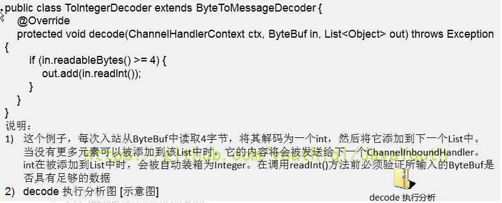

## 17.2 Netty的Handler链的调用机制-代码示例

- 使用自定义的编码器和解码器来说明 `Netty` 的 `handler` 调用机制

  - 客户端发送 `long` -> 服务器
  - 服务端发送 `long` -> 客户端

- 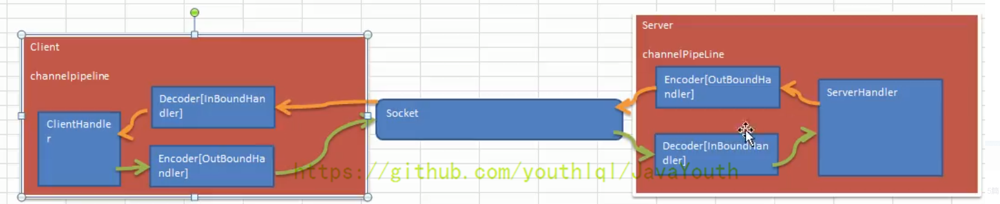

- MyServer：

  - ```java
    package com.king.netty.inboundhandlerandoutboundhandler;
    
    import io.netty.bootstrap.ServerBootstrap;
    import io.netty.channel.ChannelFuture;
    import io.netty.channel.EventLoopGroup;
    import io.netty.channel.nio.NioEventLoopGroup;
    import io.netty.channel.socket.nio.NioServerSocketChannel;
    
    public class MyServer {
        public static void main(String[] args) throws Exception{
    
            EventLoopGroup bossGroup = new NioEventLoopGroup(1);
            EventLoopGroup workerGroup = new NioEventLoopGroup();
    
            try {
    
                ServerBootstrap serverBootstrap = new ServerBootstrap();
                serverBootstrap.group(bossGroup,workerGroup).channel(NioServerSocketChannel.class).childHandler(new MyServerInitializer()); //自定义一个初始化类
    
    
                ChannelFuture channelFuture = serverBootstrap.bind(7000).sync();
                channelFuture.channel().closeFuture().sync();
    
            }finally {
                bossGroup.shutdownGracefully();
                workerGroup.shutdownGracefully();
            }
    
        }
    }
    
    
    ```

- MyServerInitializer:

  - ```java
    package com.king.netty.inboundhandlerandoutboundhandler;
    
    
    
    import io.netty.channel.ChannelInitializer;
    import io.netty.channel.ChannelPipeline;
    import io.netty.channel.socket.SocketChannel;
    
    
    public class MyServerInitializer extends ChannelInitializer<SocketChannel> {
    
        @Override
        protected void initChannel(SocketChannel ch) throws Exception {
            ChannelPipeline pipeline = ch.pipeline();//一会下断点
    
            //入站的handler进行解码 MyByteToLongDecoder
            pipeline.addLast(new MyByteToLongDecoder());
            //出站的handler进行编码
            pipeline.addLast(new MyLongToByteEncoder());
            //自定义的handler 处理业务逻辑
            pipeline.addLast(new MyServerHandler());
            System.out.println("xx");
        }
    }
    ```

- MyServerHandler：

  - ```java
    package com.king.netty.inboundhandlerandoutboundhandler;
    
    
    import io.netty.channel.ChannelHandlerContext;
    import io.netty.channel.SimpleChannelInboundHandler;
    
    public class MyServerHandler extends SimpleChannelInboundHandler<Long> {
        @Override
        protected void channelRead0(ChannelHandlerContext ctx, Long msg) throws Exception {
    
            System.out.println("从客户端" + ctx.channel().remoteAddress() + " 读取到long " + msg);
    
            //给客户端发送一个long
            ctx.writeAndFlush(98765L);
        }
    
        @Override
        public void exceptionCaught(ChannelHandlerContext ctx, Throwable cause) throws Exception {
            cause.printStackTrace();
            ctx.close();
        }
    }
    
    
    ```

- MyByteToLongDecoder:

  - ```java
    package com.king.netty.inboundhandlerandoutboundhandler;
    
    import io.netty.channel.ChannelHandler;
    import io.netty.util.concurrent.EventExecutorGroup;
    
    
    import io.netty.buffer.ByteBuf;
    import io.netty.channel.ChannelHandlerContext;
    import io.netty.handler.codec.ByteToMessageDecoder;
    
    import java.util.List;
    
    public class MyByteToLongDecoder extends ByteToMessageDecoder {
        /**
         *
         * decode 会根据接收的数据，被调用多次, 直到确定没有新的元素被添加到list
         * , 或者是ByteBuf 没有更多的可读字节为止
         * 如果list out 不为空，就会将list的内容传递给下一个 channelinboundhandler处理,
         * 该处理器的方法也会被调用多次
         *
         * @param ctx 上下文对象
         * @param in 入站的 ByteBuf
         * @param out List 集合，将解码后的数据传给下一个handler
         * @throws Exception
         */
        @Override
        protected void decode(ChannelHandlerContext ctx, ByteBuf in, List<Object> out) throws Exception {
    
            System.out.println("MyByteToLongDecoder 被调用");
            //因为 long 8个字节, 需要判断有8个字节，才能读取一个long
            if(in.readableBytes() >= 8) {
                out.add(in.readLong());
            }
        }
    }
    
    
    ```

- MyLongToByteEncoder：

  - ```java
    package com.king.netty.inboundhandlerandoutboundhandler;
    
    import io.netty.channel.ChannelHandler;
    import io.netty.util.concurrent.EventExecutorGroup;
    
    import io.netty.buffer.ByteBuf;
    import io.netty.channel.ChannelHandlerContext;
    import io.netty.handler.codec.MessageToByteEncoder;
    
    public class MyLongToByteEncoder extends MessageToByteEncoder<Long> {
        //编码方法
        @Override
        protected void encode(ChannelHandlerContext ctx, Long msg, ByteBuf out) throws Exception {
    
            System.out.println("MyLongToByteEncoder encode 被调用");
            System.out.println("msg=" + msg);
            out.writeLong(msg);
    
        }
    }
    
    
    ```

- MyClient：

  - ```java
    package com.king.netty.inboundhandlerandoutboundhandler;
    
    import io.netty.bootstrap.Bootstrap;
    import io.netty.channel.ChannelFuture;
    import io.netty.channel.EventLoopGroup;
    import io.netty.channel.nio.NioEventLoopGroup;
    import io.netty.channel.socket.nio.NioSocketChannel;
    
    public class MyClient {
        public static void main(String[] args)  throws  Exception{
    
            EventLoopGroup group = new NioEventLoopGroup();
    
            try {
    
                Bootstrap bootstrap = new Bootstrap();
                bootstrap.group(group).channel(NioSocketChannel.class)
                        .handler(new MyClientInitializer()); //自定义一个初始化类
    
                ChannelFuture channelFuture = bootstrap.connect("localhost", 7000).sync();
    
                channelFuture.channel().closeFuture().sync();
    
            }finally {
                group.shutdownGracefully();
            }
        }
    }
    ```

- MyClientInitializer：

  - ```java
    package com.king.netty.inboundhandlerandoutboundhandler;
    
    
    import io.netty.channel.ChannelInitializer;
    import io.netty.channel.ChannelPipeline;
    import io.netty.channel.socket.SocketChannel;
    
    
    public class MyClientInitializer extends ChannelInitializer<SocketChannel> {
        @Override
        protected void initChannel(SocketChannel ch) throws Exception {
    
            ChannelPipeline pipeline = ch.pipeline();
    
            //加入一个出站的handler 对数据进行一个编码
            pipeline.addLast(new MyLongToByteEncoder());
    
            //这时一个入站的解码器(入站handler )
            pipeline.addLast(new MyByteToLongDecoder());
            //加入一个自定义的handler ， 处理业务
            pipeline.addLast(new MyClientHandler());
    
    
        }
    }
    ```

- MyClientHandler：

  - ```java
    package com.king.netty.inboundhandlerandoutboundhandler;
    
    import io.netty.channel.ChannelHandler;
    import io.netty.util.concurrent.EventExecutorGroup;
    
    import io.netty.buffer.Unpooled;
    import io.netty.channel.ChannelHandlerContext;
    import io.netty.channel.SimpleChannelInboundHandler;
    import io.netty.util.CharsetUtil;
    
    import java.nio.charset.Charset;
    
    public class MyClientHandler  extends SimpleChannelInboundHandler<Long> {
        @Override
        protected void channelRead0(ChannelHandlerContext ctx, Long msg) throws Exception {
    
            System.out.println("服务器的ip=" + ctx.channel().remoteAddress());
            System.out.println("收到服务器消息=" + msg);
    
        }
    
        //重写channelActive 发送数据
    
        @Override
        public void channelActive(ChannelHandlerContext ctx) throws Exception {
            System.out.println("MyClientHandler 发送数据");
            //ctx.writeAndFlush(Unpooled.copiedBuffer(""))
            ctx.writeAndFlush(123456L); //发送的是一个long
        }
    }
    ```

- 测试结果：

  - 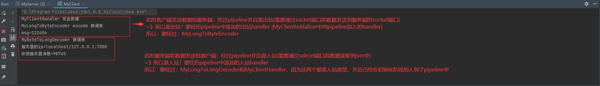
  - 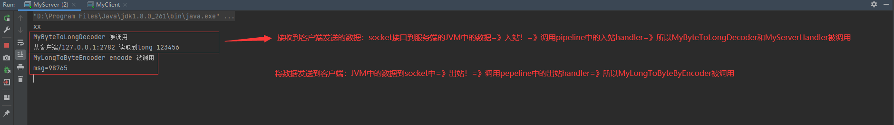
  - **上图使用JVM中的数据表述可能不太正确，但是对其理解出入站的概念有所帮助！**
  - 因此下面给出Netty官网对出入站的示意图：
    - 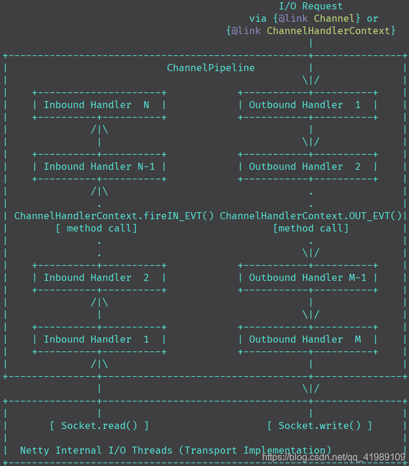

- 再次理解出入站：**站在数据出发和流向的角度来看（可以类比之前NIO中的Buffer和Channel的写入关系来看）**

  - 客户端有出站入站，服务端也有出站入站
  - 以客户端为例，如果有服务端传送的数据到达客户端，那么对于客户端来说就是入站；
    - 如果客户端传送数据到服务端，那么对于客户端来说就是出站；
    - 同理，对于服务端来说，也是一样的，有数据来就是入站，有数据输出就是出站
  - 为什么服务端和客户端的ServerHandler都是继承SimpleChannelInboundHandler，而没有ChannelOutboundHandler出站类？但是却可以处理出站的业务？
    - 实际上当我们在handler中调用ctx.writeAndFlush()方法后，就会将数据交给ChannelOutboundHandler进行出站处理，只是我们没有去定义出站类而已，若有需求可以自己去实现ChannelOutboundHandler出站类
  - 总结：
    - **服务端发数据给客户端：**服务端—>出站—>Socket通道—>入站—>客户端
    -  **客户端发数据给服务端：**客户端—>出站—>Socket通道—>入站—>服务端

## 17.3 ByteToMessageDecoder源码小解析

- ```java
  @Override
      public void write(ChannelHandlerContext ctx, Object msg, ChannelPromise promise) throws Exception {
          ByteBuf buf = null;
          try {
              //这里会判断当前msg 是不是应该处理的类型，如果是就处理，不是就跳过encode
              if (acceptOutboundMessage(msg)) {
                  @SuppressWarnings("unchecked")
                  I cast = (I) msg;
                  buf = allocateBuffer(ctx, cast, preferDirect);
                  try {
                      encode(ctx, cast, buf);
                  } finally {
                      ReferenceCountUtil.release(cast);
                  }
  
                  if (buf.isReadable()) {
                      ctx.write(buf, promise);
                  } else {
                      buf.release();
                      ctx.write(Unpooled.EMPTY_BUFFER, promise);
                  }
                  buf = null;
              } else {
                  ctx.write(msg, promise);
              }
          } catch (EncoderException e) {
              throw e;
          } catch (Throwable e) {
              throw new EncoderException(e);
          } finally {
              if (buf != null) {
                  buf.release();
              }
          }
      }
  
  ```

- 当我们以这样的形式发送数据

  - ```java
    ctx.writeAndFlush(Unpooled.copiedBuffer("abcdabcdabcdabcd",CharsetUtil.UTF_8));
    ```

- 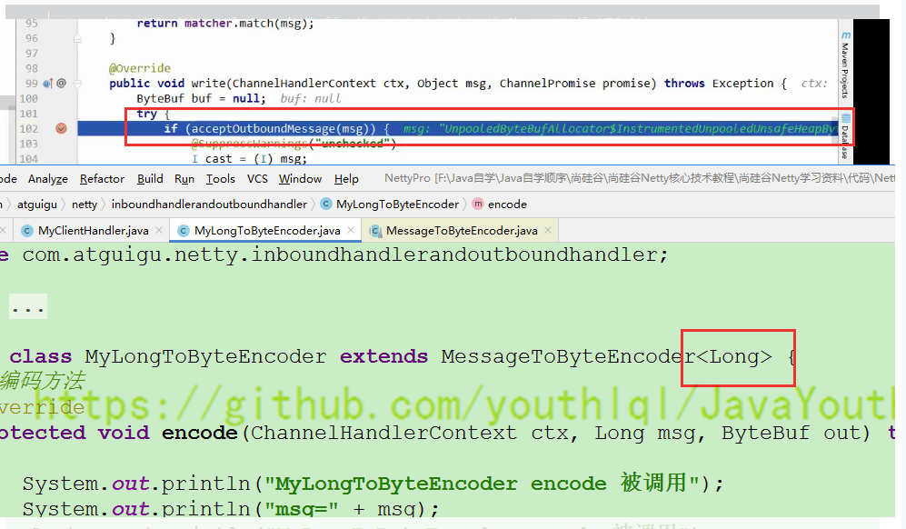

- 这两个类型并不匹配，也就不会走编码器。因此我们编写 Encoder 是要注意传入的数据类型和处理的数据类型一致

- 结论：

  - 不论解码器 `handler` 还是编码器 `handler` 即接收的消息类型必须与待处理的消息类型一致，否则该 `handler` 不会被执行
  - 在解码器进行数据解码时，需要判断缓存区（`ByteBuf`）的数据是否足够，否则接收到的结果会期望结果可能不一致。

## 17.4 其他解码器的使用

- 建议直接看官方文档或者源码！

- ReplayingDecoder：

  - `ReplayingDecoder` 扩展了 `ByteToMessageDecoder` 类，使用这个类，我们不必调用 `readableBytes()` 方法，也就不用判断还有没有足够的数据来读取。参数 `S` 指定了用户状态管理的类型，其中 `Void` 代表不需要状态管理

  - 应用实例：使用 `ReplayingDecoder` 编写解码器，对前面的案例进行简化[案例演示]

  - ```java
    package com.king.netty.inboundhandlerandoutboundhandler;
    
    import io.netty.buffer.ByteBuf;
    import io.netty.channel.ChannelHandlerContext;
    import io.netty.handler.codec.ReplayingDecoder;
    
    import java.util.List;
    
    public class MyByteToLongDecoder2 extends ReplayingDecoder<Void> {
        
        @Override
        protected void decode(ChannelHandlerContext ctx, ByteBuf in, List<Object> out) throws Exception {
            System.out.println("MyByteToLongDecoder2 被调用");
            //在 ReplayingDecoder 不需要判断数据是否足够读取，内部会进行处理判断
            out.add(in.readLong());
        }
    }
    
    ```

  - ReplayingDecoder 使用方便，但它也有一些局限性：

    - 并不是所有的 ByteBuf 操作都被支持，如果调用了一个不被支持的方法，将会抛出一个 UnsupportedOperationException。
    - ReplayingDecoder 在某些情况下可能稍慢于 ByteToMessageDecoder，例如网络缓慢并且消息格式复杂时，消息会被拆成了多个碎片，速度变慢

- LineBasedFrameDecoder：这个类在 Netty 内部也有使用，它使用行尾控制字符（\n或者\r\n）作为分隔符来解析数据。

- DelimiterBasedFrameDecoder：使用自定义的特殊字符作为消息的分隔符。

- HttpObjectDecoder：一个 HTTP 数据的解码器

- LengthFieldBasedFrameDecoder：通过指定长度来标识整包消息，这样就可以自动的处理黏包和半包消息。

# 18. TCP粘包和拆包

- TCP粘包和拆包的由来？
  - TCP 是面向连接的，面向流的，提供高可靠性服务。收发两端（客户端和服务器端）都要有成对的 socket，因此，发送端为了将多个发给接收端的包更有效的发给对方，使用了优化方法（Nagle 算法），将多次间隔较小且数据量小的数据，合并成一个大的数据块，然后进行封包。这样做虽然提高了效率，但是接收端就难于分辨出完整的数据包了，因为**面向流的通信是无消息保护边界的**
  - 由于 `TCP` 无消息保护边界,需要在接收端处理消息边界问题，也就是我们所说的粘包、拆包问题
- TCP粘包和拆包？
  - 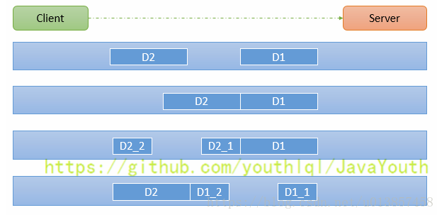
  - 服务端分两次读取到了两个独立的数据包，分别是 D1 和 D2，没有粘包和拆包
  - 服务端一次接受到了两个数据包，D1 和 D2 粘合在一起，称之为 TCP 粘包
  - 服务端分两次读取到了数据包，第一次读取到了完整的 D1 包和 D2 包的部分内容，第二次读取到了 D2 包的剩余内容，这称之为 TCP 拆包
  - 服务端分两次读取到了数据包，第一次读取到了 D1 包的部分内容 D1_1，第二次读取到了 D1 包的剩余部分内容 D1_2 和完整的 D2 包。

## 18.1 TCP粘包和拆包现象实例

- MyServer

  - ```java
    package com.king.netty.tcp;
    import io.netty.bootstrap.ServerBootstrap;
    import io.netty.channel.ChannelFuture;
    import io.netty.channel.EventLoopGroup;
    import io.netty.channel.nio.NioEventLoopGroup;
    import io.netty.channel.socket.nio.NioServerSocketChannel;
    
    public class MyServer {
        public static void main(String[] args) throws Exception{
    
            EventLoopGroup bossGroup = new NioEventLoopGroup(1);
            EventLoopGroup workerGroup = new NioEventLoopGroup();
    
            try {
    
                ServerBootstrap serverBootstrap = new ServerBootstrap();
                serverBootstrap.group(bossGroup,workerGroup).channel(NioServerSocketChannel.class).childHandler(new MyServerInitializer()); //自定义一个初始化类
    
    
                ChannelFuture channelFuture = serverBootstrap.bind(7000).sync();
                channelFuture.channel().closeFuture().sync();
    
            }finally {
                bossGroup.shutdownGracefully();
                workerGroup.shutdownGracefully();
            }
    
        }
    }
    ```

- MyServerInitializer：

  - ```java
    package com.king.netty.tcp;
    import io.netty.channel.ChannelInitializer;
    import io.netty.channel.ChannelPipeline;
    import io.netty.channel.socket.SocketChannel;
    
    
    public class MyServerInitializer extends ChannelInitializer<SocketChannel> {
    
        @Override
        protected void initChannel(SocketChannel ch) throws Exception {
            ChannelPipeline pipeline = ch.pipeline();
    
            pipeline.addLast(new MyServerHandler());
        }
    }
    ```

- MyServerHandler：

  - ```java
    package com.king.netty.tcp;
    import io.netty.buffer.ByteBuf;
    import io.netty.buffer.Unpooled;
    import io.netty.channel.ChannelHandlerContext;
    import io.netty.channel.SimpleChannelInboundHandler;
    
    import java.nio.charset.Charset;
    import java.util.UUID;
    
    public class MyServerHandler extends SimpleChannelInboundHandler<ByteBuf>{
        private int count;
    
        @Override
        public void exceptionCaught(ChannelHandlerContext ctx, Throwable cause) throws Exception {
            //cause.printStackTrace();
            ctx.close();
        }
    
        @Override
        protected void channelRead0(ChannelHandlerContext ctx, ByteBuf msg) throws Exception {
    
            byte[] buffer = new byte[msg.readableBytes()];
            msg.readBytes(buffer);
    
            //将buffer转成字符串
            String message = new String(buffer, Charset.forName("utf-8"));
    
            System.out.println("服务器接收到数据 " + message);
            System.out.println("服务器接收到消息量=" + (++this.count));
    
            //服务器回送数据给客户端, 回送一个随机id ,
            ByteBuf responseByteBuf = Unpooled.copiedBuffer(UUID.randomUUID().toString() + " ", Charset.forName("utf-8"));
            ctx.writeAndFlush(responseByteBuf);
    
        }
    }
    ```

- MyClient：

  - ```java
    package com.king.netty.tcp;
    import io.netty.bootstrap.Bootstrap;
    import io.netty.channel.ChannelFuture;
    import io.netty.channel.EventLoopGroup;
    import io.netty.channel.nio.NioEventLoopGroup;
    import io.netty.channel.socket.nio.NioSocketChannel;
    
    public class MyClient {
        public static void main(String[] args)  throws  Exception{
    
            EventLoopGroup group = new NioEventLoopGroup();
    
            try {
    
                Bootstrap bootstrap = new Bootstrap();
                bootstrap.group(group).channel(NioSocketChannel.class)
                        .handler(new MyClientInitializer()); //自定义一个初始化类
    
                ChannelFuture channelFuture = bootstrap.connect("localhost", 7000).sync();
    
                channelFuture.channel().closeFuture().sync();
    
            }finally {
                group.shutdownGracefully();
            }
        }
    }
    ```

- MyClientInitializer：

  - ```java
    package com.king.netty.tcp;
    import io.netty.channel.ChannelInitializer;
    import io.netty.channel.ChannelPipeline;
    import io.netty.channel.socket.SocketChannel;
    
    
    public class MyClientInitializer extends ChannelInitializer<SocketChannel> {
        @Override
        protected void initChannel(SocketChannel ch) throws Exception {
    
            ChannelPipeline pipeline = ch.pipeline();
            pipeline.addLast(new MyClientHandler());
        }
    }
    ```

- MyClientHandler：

  - ```java
    package com.king.netty.tcp;
    import io.netty.buffer.ByteBuf;
    import io.netty.buffer.Unpooled;
    import io.netty.channel.ChannelHandlerContext;
    import io.netty.channel.SimpleChannelInboundHandler;
    
    import java.nio.charset.Charset;
    
    public class MyClientHandler extends SimpleChannelInboundHandler<ByteBuf> {
    
        private int count;
        @Override
        public void channelActive(ChannelHandlerContext ctx) throws Exception {
            //使用客户端发送10条数据 hello,server 编号
            for(int i= 0; i< 10; ++i) {
                ByteBuf buffer = Unpooled.copiedBuffer("hello,server " + i+",", Charset.forName("utf-8"));
                ctx.writeAndFlush(buffer);
            }
        }
    
        @Override
        protected void channelRead0(ChannelHandlerContext ctx, ByteBuf msg) throws Exception {
            byte[] buffer = new byte[msg.readableBytes()];
            msg.readBytes(buffer);
    
            String message = new String(buffer, Charset.forName("utf-8"));
            System.out.println("客户端接收到消息=" + message);
            System.out.println("客户端接收消息数量=" + (++this.count));
    
        }
    
        @Override
        public void exceptionCaught(ChannelHandlerContext ctx, Throwable cause) throws Exception {
            cause.printStackTrace();
            ctx.close();
        }
    }
    ```

- 运行测试：

  - 第一次运行：
    - 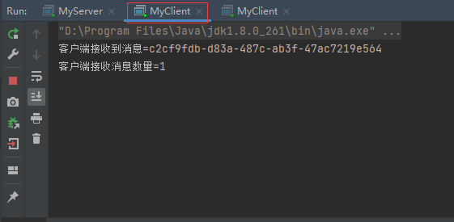
    - 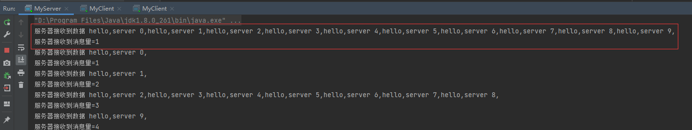
  - 第二次运行client：
    - 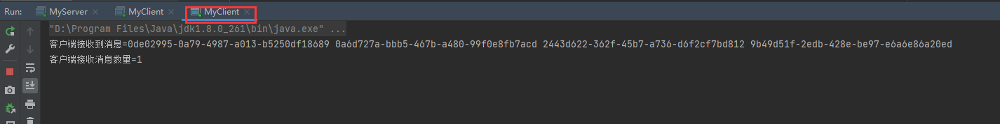
    - 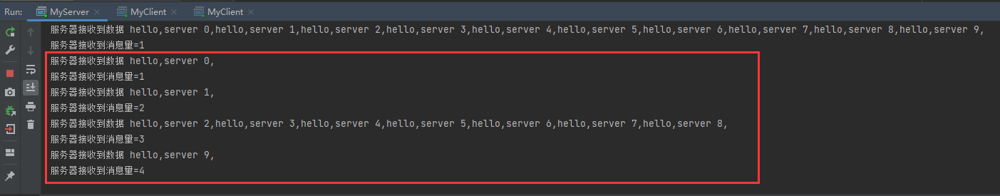

- 小结：

  - 第一次运行时，服务器一次性将10个数据都接收了
  - 第二次运行时，分了4次接收
  - 很明显有TCP的粘包现象

## 18.2 TCP粘包和拆包解决方案

- 关键就是要解决服务器端每次读取数据长度的问题，这个问题解决，就不会出现服务器多读或少读数据的问题，从而避免的 `TCP` 粘包、拆包。

- 常用方案：使用自定义协议+编解码器来解决

- **代码实例**

  1. 要求客户端发送 `5` 个 `Message` 对象，客户端每次发送一个 `Message` 对象
  2. 服务器端每次接收一个 `Message`，分 `5` 次进行解码，每读取到一个 `Message`，会回复一个 `Message` 对象给客户端。

- 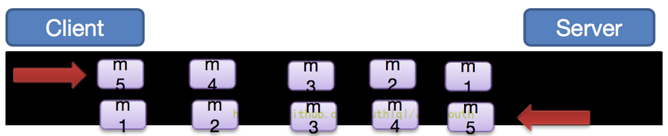

- MessageProtocol：

  - ```java
    package com.king.netty.protocoltcp;
    //协议包
    public class MessageProtocol {
        private int len; //关键
        private byte[] content;
    
        public int getLen() {
            return len;
        }
    
        public void setLen(int len) {
            this.len = len;
        }
    
        public byte[] getContent() {
            return content;
        }
    
        public void setContent(byte[] content) {
            this.content = content;
        }
    }
    
    
    ```

- MyMessageEncoder：

  - ```java
    package com.king.netty.protocoltcp;
    import io.netty.buffer.ByteBuf;
    import io.netty.channel.ChannelHandlerContext;
    import io.netty.handler.codec.MessageToByteEncoder;
    
    public class MyMessageEncoder extends MessageToByteEncoder<MessageProtocol> {
        @Override
        protected void encode(ChannelHandlerContext ctx, MessageProtocol msg, ByteBuf out) throws Exception {
            System.out.println("MyMessageEncoder encode 方法被调用");
            out.writeInt(msg.getLen());
            out.writeBytes(msg.getContent());
        }
    }
    ```

- MyMessageDecoder：

  - ```java
    package com.king.netty.protocoltcp;
    import io.netty.buffer.ByteBuf;
    import io.netty.channel.ChannelHandlerContext;
    import io.netty.handler.codec.ReplayingDecoder;
    import java.util.List;
    
    public class MyMessageDecoder extends ReplayingDecoder<Void> {
        @Override
        protected void decode(ChannelHandlerContext ctx, ByteBuf in, List<Object> out) throws Exception {
            System.out.println();
            System.out.println();
            System.out.println("MyMessageDecoder decode 被调用");
            //需要将得到二进制字节码-> MessageProtocol 数据包(对象)
            int length = in.readInt();
    
            byte[] content = new byte[length];
            in.readBytes(content);
    
            //封装成 MessageProtocol 对象，放入 out， 传递下一个handler业务处理
            MessageProtocol messageProtocol = new MessageProtocol();
            messageProtocol.setLen(length);
            messageProtocol.setContent(content);
    
            //放入out传给下一个hanlder进行处理
            out.add(messageProtocol);
    
        }
    }
    ```

- MyServer：

  - ```java
    package com.king.netty.protocoltcp;
    import io.netty.bootstrap.ServerBootstrap;
    import io.netty.channel.ChannelFuture;
    import io.netty.channel.EventLoopGroup;
    import io.netty.channel.nio.NioEventLoopGroup;
    import io.netty.channel.socket.nio.NioServerSocketChannel;
    
    public class MyServer {
        public static void main(String[] args) throws Exception{
    
            EventLoopGroup bossGroup = new NioEventLoopGroup(1);
            EventLoopGroup workerGroup = new NioEventLoopGroup();
    
            try {
    
                ServerBootstrap serverBootstrap = new ServerBootstrap();
                serverBootstrap.group(bossGroup,workerGroup).channel(NioServerSocketChannel.class).childHandler(new MyServerInitializer()); //自定义一个初始化类
    
    
                ChannelFuture channelFuture = serverBootstrap.bind(7000).sync();
                channelFuture.channel().closeFuture().sync();
    
            }finally {
                bossGroup.shutdownGracefully();
                workerGroup.shutdownGracefully();
            }
    
        }
    }
    ```

- MyServerInitializer：

  - ```java
    package com.king.netty.protocoltcp;
    import io.netty.channel.ChannelInitializer;
    import io.netty.channel.ChannelPipeline;
    import io.netty.channel.socket.SocketChannel;
    public class MyServerInitializer extends ChannelInitializer<SocketChannel> {
    
        @Override
        protected void initChannel(SocketChannel ch) throws Exception {
            ChannelPipeline pipeline = ch.pipeline();
    
            pipeline.addLast(new MyMessageDecoder());//解码器
            pipeline.addLast(new MyMessageEncoder());//编码器
            pipeline.addLast(new MyServerHandler());
        }
    }
    ```

- MyServerHandler：

  - ```java
    package com.king.netty.protocoltcp;
    import io.netty.buffer.ByteBuf;
    import io.netty.buffer.Unpooled;
    import io.netty.channel.ChannelHandlerContext;
    import io.netty.channel.SimpleChannelInboundHandler;
    import java.nio.charset.Charset;
    import java.util.UUID;
    
    //处理业务的handler
    public class MyServerHandler extends SimpleChannelInboundHandler<MessageProtocol>{
        private int count;
    
        @Override
        public void exceptionCaught(ChannelHandlerContext ctx, Throwable cause) throws Exception {
            //cause.printStackTrace();
            ctx.close();
        }
    
        @Override
        protected void channelRead0(ChannelHandlerContext ctx, MessageProtocol msg) throws Exception {
    
            //接收到数据，并处理
            int len = msg.getLen();
            byte[] content = msg.getContent();
    
            System.out.println("服务器接收到信息如下");
            System.out.println("长度=" + len);
            System.out.println("内容=" + new String(content, Charset.forName("utf-8")));
    
            System.out.println("服务器接收到消息包数量=" + (++this.count));
    
            //回复消息
            System.out.println("服务端开始回复消息------");
            String responseContent = UUID.randomUUID().toString();
            int responseLen = responseContent.getBytes("utf-8").length;
            byte[]  responseContent2 = responseContent.getBytes("utf-8");
            //构建一个协议包
            MessageProtocol messageProtocol = new MessageProtocol();
            messageProtocol.setLen(responseLen);
            messageProtocol.setContent(responseContent2);
    
            ctx.writeAndFlush(messageProtocol);
    
    
        }
    }
    ```

- MyClient：

  - ```java
    package com.king.netty.protocoltcp;
    import io.netty.bootstrap.Bootstrap;
    import io.netty.channel.ChannelFuture;
    import io.netty.channel.EventLoopGroup;
    import io.netty.channel.nio.NioEventLoopGroup;
    import io.netty.channel.socket.nio.NioSocketChannel;
    
    public class MyClient {
        public static void main(String[] args)  throws  Exception{
    
            EventLoopGroup group = new NioEventLoopGroup();
    
            try {
    
                Bootstrap bootstrap = new Bootstrap();
                bootstrap.group(group).channel(NioSocketChannel.class)
                        .handler(new MyClientInitializer()); //自定义一个初始化类
    
                ChannelFuture channelFuture = bootstrap.connect("localhost", 7000).sync();
    
                channelFuture.channel().closeFuture().sync();
    
            }finally {
                group.shutdownGracefully();
            }
        }
    }
    ```

- MyClientInitializer：

  - ```java
    package com.king.netty.protocoltcp;
    import io.netty.channel.ChannelInitializer;
    import io.netty.channel.ChannelPipeline;
    import io.netty.channel.socket.SocketChannel;
    public class MyClientInitializer extends ChannelInitializer<SocketChannel> {
        @Override
        protected void initChannel(SocketChannel ch) throws Exception {
    
            ChannelPipeline pipeline = ch.pipeline();
            pipeline.addLast(new MyMessageEncoder()); //加入编码器
            pipeline.addLast(new MyMessageDecoder()); //加入解码器
            pipeline.addLast(new MyClientHandler());
        }
    }
    
    
    ```

- MyClientHandler：

  - ```java
    package com.king.netty.protocoltcp;
    import io.netty.buffer.ByteBuf;
    import io.netty.buffer.Unpooled;
    import io.netty.channel.ChannelHandlerContext;
    import io.netty.channel.SimpleChannelInboundHandler;
    import java.nio.charset.Charset;
    
    public class MyClientHandler extends SimpleChannelInboundHandler<MessageProtocol> {
    
        private int count;
        @Override
        public void channelActive(ChannelHandlerContext ctx) throws Exception {
            //使用客户端发送10条数据 "今天天气冷，吃火锅" 编号
    
            for(int i = 0; i< 5; i++) {
                String mes = "今天天气冷，吃火锅";
                byte[] content = mes.getBytes(Charset.forName("utf-8"));
                int length = mes.getBytes(Charset.forName("utf-8")).length;
    
                //创建协议包对象
                MessageProtocol messageProtocol = new MessageProtocol();
                messageProtocol.setLen(length);
                messageProtocol.setContent(content);
                ctx.writeAndFlush(messageProtocol);
    
            }
    
        }
    
        //    @Override
        protected void channelRead0(ChannelHandlerContext ctx, MessageProtocol msg) throws Exception {
    
            int len = msg.getLen();
            byte[] content = msg.getContent();
    
            System.out.println("客户端接收到消息如下");
            System.out.println("长度=" + len);
            System.out.println("内容=" + new String(content, Charset.forName("utf-8")));
    
            System.out.println("客户端接收消息数量=" + (++this.count));
    
        }
    
        @Override
        public void exceptionCaught(ChannelHandlerContext ctx, Throwable cause) throws Exception {
            System.out.println("异常消息=" + cause.getMessage());
            ctx.close();
        }
    }
    ```

- 代码测试：

  - Client输出：

    - ```bash
      MyMessageEncoder encode 方法被调用
      MyMessageEncoder encode 方法被调用
      MyMessageEncoder encode 方法被调用
      MyMessageEncoder encode 方法被调用
      MyMessageEncoder encode 方法被调用
      
      
      //下面是客户端开始一个一个的收到服务端的回复
      MyMessageDecoder decode 被调用
      客户端接收到消息如下
      长度=36
      内容=1b5286dd-0fc2-4f62-9bf7-d5fad84179b5
      客户端接收消息数量=1
      
      
      MyMessageDecoder decode 被调用
      客户端接收到消息如下
      长度=36
      内容=653d18cb-ab72-4163-8b95-09c94ecac873
      客户端接收消息数量=2
      
      
      MyMessageDecoder decode 被调用
      客户端接收到消息如下
      长度=36
      内容=3be6e403-91bb-4437-ada8-6cdb9eb7ef00
      客户端接收消息数量=3
      
      
      MyMessageDecoder decode 被调用
      客户端接收到消息如下
      长度=36
      内容=94c8f306-fd9c-455a-956c-16698ce4150b
      客户端接收消息数量=4
      
      
      MyMessageDecoder decode 被调用
      客户端接收到消息如下
      长度=36
      内容=7890de9c-0fa2-4317-8de1-1d464315fa1b
      客户端接收消息数量=5
      
      
      ```

  - Server输出：

    - ```java
      MyMessageDecoder decode 被调用
      服务器接收到信息如下
      长度=27
      内容=今天天气冷，吃火锅
      服务器接收到消息包数量=1
      服务端开始回复消息------
      MyMessageEncoder encode 方法被调用
      
      
      MyMessageDecoder decode 被调用
      服务器接收到信息如下
      长度=27
      内容=今天天气冷，吃火锅
      服务器接收到消息包数量=2
      服务端开始回复消息------
      MyMessageEncoder encode 方法被调用
      
      
      MyMessageDecoder decode 被调用
      服务器接收到信息如下
      长度=27
      内容=今天天气冷，吃火锅
      服务器接收到消息包数量=3
      服务端开始回复消息------
      MyMessageEncoder encode 方法被调用
      
      
      MyMessageDecoder decode 被调用
      服务器接收到信息如下
      长度=27
      内容=今天天气冷，吃火锅
      服务器接收到消息包数量=4
      服务端开始回复消息------
      MyMessageEncoder encode 方法被调用
      
      
      MyMessageDecoder decode 被调用
      服务器接收到信息如下
      长度=27
      内容=今天天气冷，吃火锅
      服务器接收到消息包数量=5
      服务端开始回复消息------
      MyMessageEncoder encode 方法被调用
      ```

- 无论运行几次，Server都是分5次接收的，这样就解决了TCP粘包问题。

# 19. Netty实现简单的RPC

- 什么是RPC？
  - `RPC（Remote Procedure Call）`—远程过程调用，是一个计算机通信协议。该协议允许运行于一台计算机的程序调用另一台计算机的子程序，而程序员无需额外地为这个交互作用编程
  - 两个或多个应用程序都分布在不同的服务器上，它们之间的调用都像是本地方法调用一样(如图)
  - 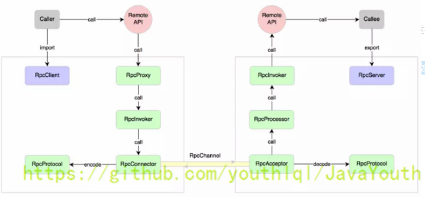
  - 过程：
    - 调用者(Caller)，调用远程API(Remote API)
    - 调用远程API会通过一个RPC代理(RpcProxy)
    - RPC代理再去调用RpcInvoker(这个是PRC的调用者)
    - RpcInvoker通过RPC连接器(RpcConnector)
    - RPC连接器用两台机器规定好的PRC协议(RpcProtocol)把数据进行编码
    - 接着RPC连接器通过RpcChannel通道发送到对方的PRC接收器(RpcAcceptor)
    - PRC接收器通过PRC协议进行解码拿到数据
    - 然后将数据传给RpcProcessor
    - RpcProcessor再传给RpcInvoker
    - RpcInvoker调用Remote API
    - 最后推给被调用者(Callee)
    - 常见的 RPC 框架有：比较知名的如阿里的 Dubbo、Google 的 gRPC、Go 语言的 rpcx、Apache 的 thrift，Spring 旗下的 SpringCloud。
- RPC调用流程图：感觉和计算机网络的传输很像！
  - 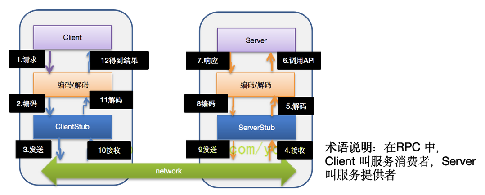
  - RPC 调用流程说明
    1. 服务消费方（client）以本地调用方式调用服务
    2. client stub 接收到调用后负责将方法、参数等封装成能够进行网络传输的消息体
    3. client stub 将消息进行编码并发送到服务端
    4. server stub 收到消息后进行解码
    5. server stub 根据解码结果调用本地的服务
    6. 本地服务执行并将结果返回给 server stub
    7. server stub 将返回导入结果进行编码并发送至消费方
    8. client stub 接收到消息并进行解码
    9. 服务消费方（client）得到结果
  - 小结：RPC 的目标就是将 2 - 8 这些步骤都封装起来，用户无需关心这些细节，可以像调用本地方法一样即可完成远程服务调用

## 19.1 简单实现Dubbo RPC

- 需求说明：

  - `Dubbo` 底层使用了 `Netty` 作为网络通讯框架，要求用 `Netty` 实现一个简单的 `RPC` 框架
  - 模仿 `Dubbo`，消费者和提供者约定接口和协议，消费者远程调用提供者的服务，提供者返回一个字符串，消费者打印提供者返回的数据。底层网络通信使用 `Netty 4.1.20`

- 设计说明：

  - 创建一个接口，定义抽象方法。用于消费者和提供者之间的约定。
  - 创建一个提供者，该类需要监听消费者的请求，并按照约定返回数据。
  - 创建一个消费者，该类需要透明的调用自己不存在的方法，内部需要使用 `Netty` 请求提供者返回数据
  - 开发的分析图
  - 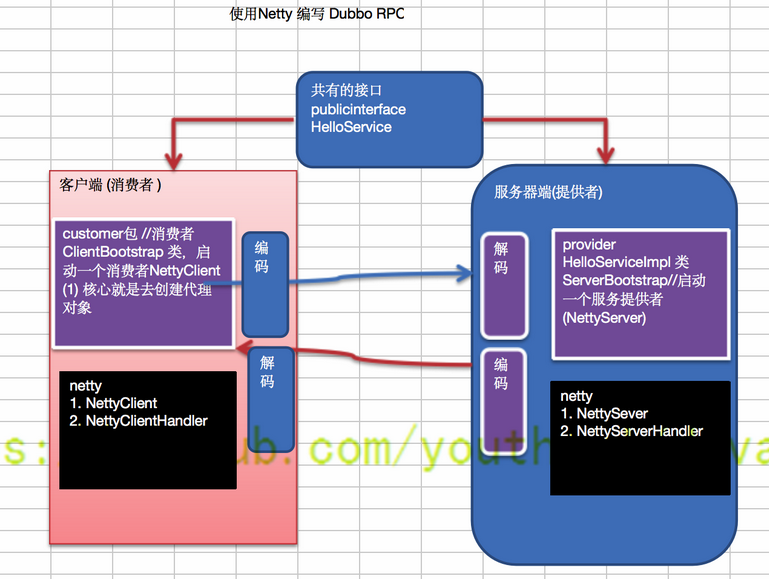

- 代码示例：

  - 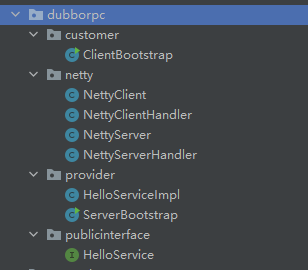
  - 前置知识：动态代理的基本实现和使用！

- NettyServer：

  - ```java
    package com.king.netty.dubborpc.netty;
    import io.netty.bootstrap.ServerBootstrap;
    import io.netty.channel.ChannelFuture;
    import io.netty.channel.ChannelInitializer;
    import io.netty.channel.ChannelPipeline;
    import io.netty.channel.EventLoopGroup;
    import io.netty.channel.nio.NioEventLoopGroup;
    import io.netty.channel.socket.SocketChannel;
    import io.netty.channel.socket.nio.NioServerSocketChannel;
    import io.netty.handler.codec.string.StringDecoder;
    import io.netty.handler.codec.string.StringEncoder;
    
    public class NettyServer {
    
    
        public static void startServer(String hostName, int port) {
            startServer0(hostName,port);
        }
    
        //编写一个方法，完成对NettyServer的初始化和启动
    
        private static void startServer0(String hostname, int port) {
    
            EventLoopGroup bossGroup = new NioEventLoopGroup(1);
            EventLoopGroup workerGroup = new NioEventLoopGroup();
    
            try {
    
                ServerBootstrap serverBootstrap = new ServerBootstrap();
    
                serverBootstrap.group(bossGroup,workerGroup)
                        .channel(NioServerSocketChannel.class)
                        .childHandler(new ChannelInitializer<SocketChannel>() {
                                          @Override
                                          protected void initChannel(SocketChannel ch) throws Exception {
                                              ChannelPipeline pipeline = ch.pipeline();
                                              pipeline.addLast(new StringDecoder());
                                              pipeline.addLast(new StringEncoder());
                                              pipeline.addLast(new NettyServerHandler()); //业务处理器
    
                                          }
                                      }
    
                        );
    
                ChannelFuture channelFuture = serverBootstrap.bind(hostname, port).sync();
                System.out.println("服务提供方开始提供服务~~");
                channelFuture.channel().closeFuture().sync();
    
            }catch (Exception e) {
                e.printStackTrace();
            }
            finally {
                bossGroup.shutdownGracefully();
                workerGroup.shutdownGracefully();
            }
    
        }
    }
    ```

- NettyServerHandler：

  - ```java
    package com.king.netty.dubborpc.netty;
    
    import com.king.netty.dubborpc.customer.ClientBootstrap;
    import com.king.netty.dubborpc.provider.HelloServiceImpl;
    import io.netty.channel.ChannelHandlerContext;
    import io.netty.channel.ChannelInboundHandlerAdapter;
    
    //服务器这边handler比较简单
    public class NettyServerHandler extends ChannelInboundHandlerAdapter {
    
        @Override
        public void channelRead(ChannelHandlerContext ctx, Object msg) throws Exception {
            System.out.println("---服务端开始收到来自客户单的消息---");
            //获取客户端发送的消息，并调用服务
            System.out.println("原始消息：" + msg);
    
            /*
             1.客户端在调用服务器的api 时，我们需要定义一个协议，比如我们要求 每次发消息是都
             必须以某个字符串开头 "HelloService#hello#你好"
             2.Dubbo注册在Zookeeper里时，这种就是类的全路径字符串，你用IDEA的zookeeper插件
             就可以清楚地看到
             */
            if(msg.toString().startsWith(ClientBootstrap.providerName)) {
    
                String result = new HelloServiceImpl().hello(msg.toString().substring(msg.toString().lastIndexOf("#") + 1));
                ctx.writeAndFlush(result);
            }
        }
    
        @Override
        public void exceptionCaught(ChannelHandlerContext ctx, Throwable cause) throws Exception {
            ctx.close();
        }
    }
    ```

- NettyClient：

  - ```java
    package com.king.netty.dubborpc.netty;
    import io.netty.bootstrap.Bootstrap;
    import io.netty.channel.ChannelInitializer;
    import io.netty.channel.ChannelOption;
    import io.netty.channel.ChannelPipeline;
    import io.netty.channel.nio.NioEventLoopGroup;
    import io.netty.channel.socket.SocketChannel;
    import io.netty.channel.socket.nio.NioSocketChannel;
    import io.netty.handler.codec.string.StringDecoder;
    import io.netty.handler.codec.string.StringEncoder;
    
    import java.lang.reflect.Proxy;
    import java.util.concurrent.ExecutorService;
    import java.util.concurrent.Executors;
    
    public class NettyClient {
    
        //创建线程池
        private static ExecutorService executor = Executors.newFixedThreadPool(Runtime.getRuntime().availableProcessors());
    
        private static NettyClientHandler client;
        private int count = 0;
    
        //编写方法使用代理模式，获取一个代理对象
    
        public Object getBean(final Class<?> serivceClass, final String providerName) {
    
            return Proxy.newProxyInstance(Thread.currentThread().getContextClassLoader(),
                    new Class<?>[]{serivceClass}, (proxy, method, args) -> {
    
    //                    System.out.println("(proxy:"+proxy+", method:"+method+", args:"+args+") 进入...." + (++count) + " 次");
                        System.out.println("(proxy, method, args) 进入...." + (++count) + " 次");
                        //{}  部分的代码，客户端每调用一次 hello, 就会进入到该代码
                        if (client == null) {
                            initClient();
                        }
    
                        //设置要发给服务器端的信息
                        //providerName：协议头，args[0]：就是客户端要发送给服务端的数据
                        client.setPara(providerName + args[0]);
    
                        //
                        return executor.submit(client).get();
    
                    });
        }
    
        //初始化客户端
        private static void initClient() {
            client = new NettyClientHandler();
            //创建EventLoopGroup
            NioEventLoopGroup group = new NioEventLoopGroup();
            Bootstrap bootstrap = new Bootstrap();
            bootstrap.group(group)
                    .channel(NioSocketChannel.class)
                    .option(ChannelOption.TCP_NODELAY, true)
                    .handler(
                            new ChannelInitializer<SocketChannel>() {
                                @Override
                                protected void initChannel(SocketChannel ch) throws Exception {
                                    ChannelPipeline pipeline = ch.pipeline();
                                    pipeline.addLast(new StringDecoder());
                                    pipeline.addLast(new StringEncoder());
                                    pipeline.addLast(client);
                                }
                            }
                    );
    
            try {
                bootstrap.connect("127.0.0.1", 7000).sync();
            } catch (Exception e) {
                e.printStackTrace();
            }
        }
    }
    ```

- NettyClientHandler：

  - ```java
    package com.king.netty.dubborpc.netty;
    
    import io.netty.channel.ChannelHandlerContext;
    import io.netty.channel.ChannelInboundHandlerAdapter;
    
    import java.util.concurrent.Callable;
    
    public class NettyClientHandler extends ChannelInboundHandlerAdapter implements Callable {
    
        private ChannelHandlerContext context;//上下文
        private String result; //返回的结果
        private String para; //客户端调用方法时，传入的参数
    
    
        //与服务器的连接创建后，就会被调用, 这个方法是第一个被调用(1)
        @Override
        public void channelActive(ChannelHandlerContext ctx) throws Exception {
            System.out.println(" channelActive 被调用  ");
            context = ctx; //因为我们在其它方法会使用到 ctx
        }
    
        //收到服务器的数据后，调用方法 (4)
        //
        @Override
        public synchronized void channelRead(ChannelHandlerContext ctx, Object msg) throws Exception {
            System.out.println(" channelRead 被调用  ");
            result = msg.toString();
            notify(); //唤醒等待的线程
        }
    
        @Override
        public void exceptionCaught(ChannelHandlerContext ctx, Throwable cause) throws Exception {
            ctx.close();
        }
    
        //被代理对象调用, 发送数据给服务器，-> wait -> 等待被唤醒(channelRead) -> 返回结果 (3)-》5
        @Override
        public synchronized Object call() throws Exception {
            System.out.println(" call1 被调用  ");
            context.writeAndFlush(para);
            //进行wait
            wait(); //等待channelRead 方法获取到服务器的结果后，唤醒
            System.out.println(" call2 被调用  ");
            return  result; //服务方返回的结果
    
        }
        //(2)
        void setPara(String para) {
            System.out.println(" setPara  ");
            this.para = para;
        }
    }
    ```

- HelloService：

  - ```java
    package com.king.netty.dubborpc.publicinterface;
    //这个是接口，是服务提供方和 服务消费方都需要
    public interface HelloService {
    
        String hello(String mes);
    }
    ```

- HelloServiceImpl：

  - ```java
    package com.king.netty.dubborpc.provider;
    import com.king.netty.dubborpc.publicinterface.HelloService;
    
    public class HelloServiceImpl implements HelloService {
    
        private static int count = 0;
        //当有消费方调用该方法时， 就返回一个结果
        @Override
        public String hello(String mes) {
            System.out.println("收到客户端消息=" + mes);
            System.out.println();
            //根据mes 返回不同的结果
            if(mes != null) {
                return "你好客户端, 我已经收到你的消息。消息为：[" + mes + "] ，第" + (++count) + " 次 \n";
            } else {
                return "你好客户端, 我已经收到你的消息 ";
            }
        }
    }
    
    
    
    ```

- ServerBootstrap

  - ```java
    package com.king.netty.dubborpc.provider;
    
    
    import com.king.netty.dubborpc.netty.NettyServer;
    
    //ServerBootstrap 会启动一个服务提供者，就是 NettyServer
    public class ServerBootstrap {
        public static void main(String[] args) {
    
            //代码代填..
            NettyServer.startServer("127.0.0.1", 7000);
        }
    }
    ```

- ClientBootstrap：

  - ```java
    package com.king.netty.dubborpc.customer;
    
    
    import com.king.netty.dubborpc.netty.NettyClient;
    import com.king.netty.dubborpc.publicinterface.HelloService;
    
    public class ClientBootstrap {
    
    
        //这里定义协议头
        public static final String providerName = "HelloService#hello#";
    
        public static void main(String[] args) throws  Exception{
    
            //创建一个消费者
            NettyClient customer = new NettyClient();
    
            //创建代理对象
            HelloService service = (HelloService) customer.getBean(HelloService.class, providerName);
    
            for (int i=0;i<3;i++ ) {
                Thread.sleep(2 * 1000);
                //通过代理对象调用服务提供者的方法(服务)
                System.out.println("通过代理对象调用远程服务：");
                String res = service.hello("你好 dubbo~"+i);
                System.out.println("调用的结果 res= " + res);
            }
        }
    }
    
    
    ```

- 主要过程：

  1. ServerBootstrap启动远程调用服务

  2. ClientBootstrap#main发起请求调用远程服务：

     1. ```java
         HelloService service = (HelloService) customer.getBean(HelloService.class, providerName);
        ```

     2. 调用NettyClient#getBean，在此方法里与服务端建立链接

     3. 于是就执行NettyClientHandler#channelActive，获取该Channel的上下文

     4. 接着回到NettyClient#getBean调用NettyClientHandler#setPara，设置要发给服务器端的信息，请求调用哪个远程服务？

     5. 调用完之后再回到NettyClient#getBean，用线程池提交任务

     6. 因为用线程池提交了任务，就准备执行NettyClientHandler#call线程任务

        1. 在NettyClientHandler#call中发送数据给服务提供者

           1. ```java
              context.writeAndFlush(para);
              ```

           2. 由于还没收到服务提供者的数据结果，所以wait住

  3. 此时来到服务提供者这边，从Socket通道中收到了数据，所以执行NettyServerHandler#channelRead，然后因为此方法中执行了

     1. ```java
        String result = new HelloServiceImpl().hello(msg.toString().substring(msg.toString().lastIndexOf("#") + 1));
        ```

     2. 调用了消费者想要的远程服务，开始执行远程服务的逻辑：

        1. HelloServiceImpl#hello中执行业务逻辑，返回数据给NettyServerHandler#channelRead，
        2. NettyServerHandler#channelRead再把数据发给客户端

  4. NettyClientHandler#channelRead收到服务提供者发来的数据，唤醒之前wait的线程

     1. 之前wait的线程从NettyClientHandler#call苏醒，返回result给NettyClient#getBean

  5. NettyClient#getBean get()到数据，ClientBootstrap#main中的此函数调用返回，得到服务端提供的数据。

     1. ```java
         String res = service.hello("你好 dubbo~")
        ```

  6. 至此，一次RPC调用结束。

- 代码效果：

  - **ClientBootstrap**:

    - ```java
      通过代理对象调用远程服务：
      (proxy, method, args) 进入....1 次
       channelActive 被调用  
       setPara  
       call1 被调用  
       channelRead 被调用  
       call2 被调用  
      调用的结果 res= 你好客户端, 我已经收到你的消息。消息为：[你好 dubbo~0] ，第1 次 
      
      通过代理对象调用远程服务：
      (proxy, method, args) 进入....2 次
       setPara  
       call1 被调用  
       channelRead 被调用  
       call2 被调用  
      调用的结果 res= 你好客户端, 我已经收到你的消息。消息为：[你好 dubbo~1] ，第2 次 
      
      通过代理对象调用远程服务：
      (proxy, method, args) 进入....3 次
       setPara  
       call1 被调用  
       channelRead 被调用  
       call2 被调用  
      调用的结果 res= 你好客户端, 我已经收到你的消息。消息为：[你好 dubbo~2] ，第3 次 
      
      ```

  - **ServerBootstrap**

    - ```java
      服务提供方开始提供服务~~
      ---服务端开始收到来自客户单的消息---
      原始消息：HelloService#hello#你好 dubbo~0
      收到客户端消息=你好 dubbo~0
      
      ---服务端开始收到来自客户单的消息---
      原始消息：HelloService#hello#你好 dubbo~1
      收到客户端消息=你好 dubbo~1
      
      ---服务端开始收到来自客户单的消息---
      原始消息：HelloService#hello#你好 dubbo~2
      收到客户端消息=你好 dubbo~2
      ```


