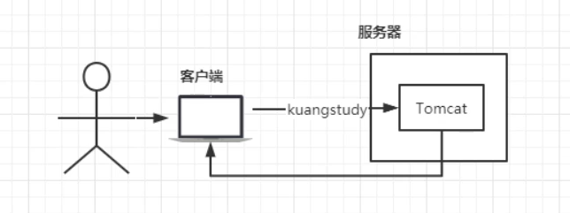
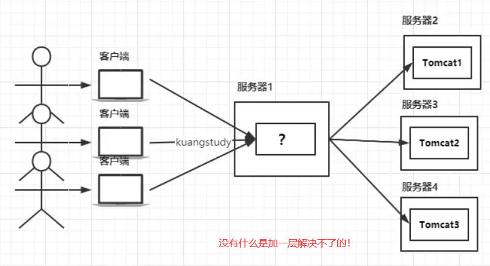
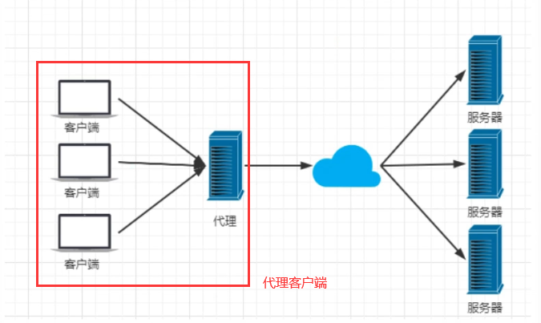
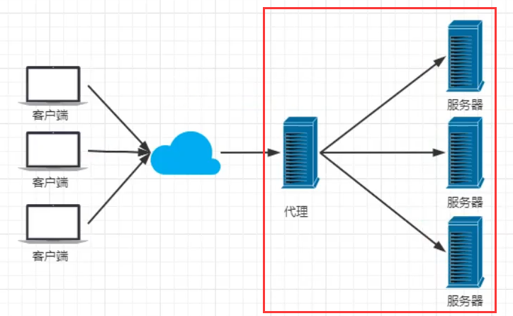
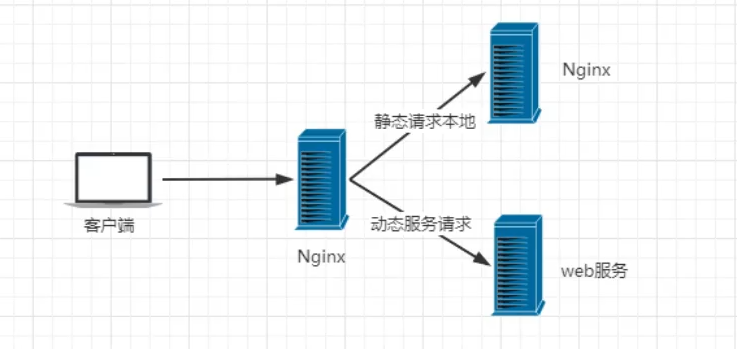
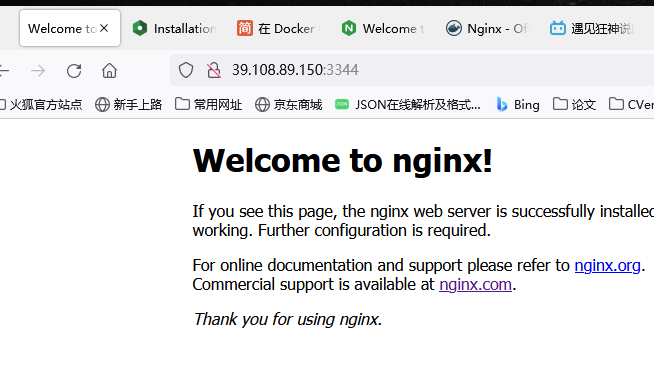
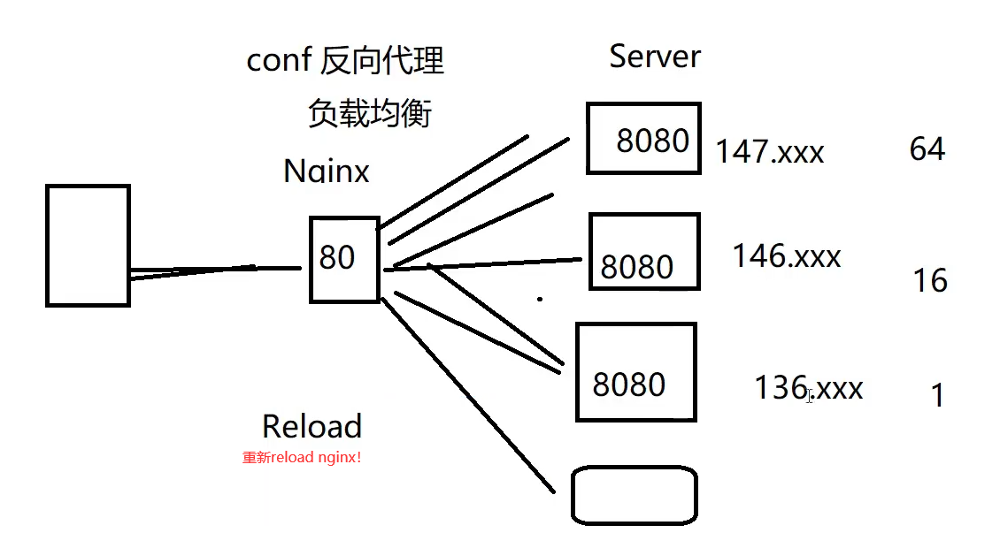

# Nginx基础

- 主要参考自：https://www.bilibili.com/video/BV1F5411J7vK?spm_id_from=333.999.0.0

# 1. Nginx简介

- 为什么用使用Nginx？
  - 项目刚刚上线的时候，并发量小，用户使用的少，所以在低并发的情况下，一个jar包启动应用就够了，然后内部tomcat返回内容给用户。
    - 
  - 平台的用户越来越多了，并发量慢慢增大了，这时候一台服务器满足不了我们的需求了。
    - 多添加几个服务器！
    - 希望这个代理服务器可以帮助我们接收用户的请求，然后将用户的请求按照规则帮我们转发到不同的服务器节点之上。这个过程用户是无感知的，用户并不知道是哪个服务器返回的结果，我们还希望他可以按照服务器的性能提供不同的权重选择。保证最佳体验!所以我们使用了Nginx,
    - 
- 什么是Nginx？
  - Nginx (engine x)是一个高性能的HTP和反向代理web服务器，同时也提供了IMAP/POP3/5MTP服务。Ngink是由伊戈尔赛索耶夫为俄罗斯访问量第二的Ramberru站点开发的，第一个公开版本0.1.0发布于2004年10月4日。2011年6月1日，nginx 1.0.4发布。
  - 其特点是占有内存少，并发能力强，事实上nginx的并发能力在同类型的网页服务器中表现较好，中国大陆使用nginx网站用户有：百度、京东、新浪、网易、腾讯、淘宝等。在全球活跃的网站中有12.18%的使用比率，大约为2220万个网站。
  - Nginx是一个安装非常的简单、配置文件非常简洁(还能够支持perh语法)、Bug非常少的服务。Nginx启动特别容易，并且几乎可以做到7*24不间断运行，即使运行数个月也不需要重新启动。你还能够不间断服务的情况下进行软件版本的升级。
  - Nginx代码完全用C语言从头写成。官方数据测试表明能够支持高达50,000个并发连接数的响应。
- 什么是正向、反向代理？
  - 正向代理：代理客户端发送请求
    - 
  - 反向代理：代理服务端接收请求，并且分发给服务器
    - 
- Nginx的作用：
  - 反向代理
  - 负载均衡
    - Nginx提供的负载均衡策略有2种:
    - 内置策略：轮询，加权轮询，lp hash。
    - 扩展策略：就天马行空，只有你想不到的没有他做不到的。
  - 动静分离：
    - 有些请求是需要后台处理的，有些请求是不需要经过后台处理的(如: css、 html.jpg.js等等文件)，这些不需要经过后台处理的文件称为静态文件。让动态网站里的动态网页根据一定规则把不变的资源和经常变的资源区分开来，动静资源做好了拆分以后，我们就可以根据静态资源的特点将其做缓存操作。提高资源响应的速度。
    - 

# 2. 安装Nginx

- 安装软件：

  - 去官网下
  - 了解配置文件
  - 启动测试即可！

- Windows安装：建议直接看视频

- Linux安装：建议直接看视频：https://www.bilibili.com/video/BV1F5411J7vK?p=5&spm_id_from=pageDriver

  - 本章这里尝试使用dokcer！

  - ```bash
    [root@izwz94aowfpx0xt7uw61tbz nginx.conf]# docker run -d -v /home/king/test_nginx/nginx.conf:/etc/nginx/nginx.conf -d --name test_nginx -p 3344:80  nginx
    
    # docker的nginx
    # 不支持直接挂载文件，只能挂载文件夹
    # 想要挂载文件，必须宿主机也要有对应的同名文件
    
    # 因此，可以：
    # 可以先不挂载 nginx.conf
    # 先从容器中复制 nginx.conf 出来
    # 然后可以自行修改 nginx.conf，自定义配置项
    # 创建正式使用的 nginx 容器
    
    # 主要步骤：
    # 创建一个临时nginx容器，用来拷贝出配置文件，拷贝完这个临时容器可以删除
    [root@izwz94aowfpx0xt7uw61tbz king]# docker run --name temp -d nginx
    d52f4f27a25dfc33b33e8cea85e5e59e87a0fdc6ef06fe65b1709580378a8b04
    [root@izwz94aowfpx0xt7uw61tbz king]# docker cp temp:/etc/nginx/nginx.conf /home/king/test_nginx/
    no such directory
    [root@izwz94aowfpx0xt7uw61tbz king]# mkdir /home/king/test_nginx
    [root@izwz94aowfpx0xt7uw61tbz king]# ls
    build     king_springboot_test  pycharm  test_nginx
    java_jdk  my_tomcat_dockerfile  redis    tomcat_tar
    [root@izwz94aowfpx0xt7uw61tbz king]# docker cp temp:/etc/nginx/nginx.conf /home/king/test_nginx/
    
    # 再进行真正需要使用的nginx进行挂载
    [root@izwz94aowfpx0xt7uw61tbz test_nginx]# docker run -d -p 3344:80 -v /home/king/test_nginx/nginx.conf:/etc/nginx/nginx.conf --name test_nginx nginx
    552248dea9417e854b4477312db418bbbbe18d75ec18d2f8f905741f9d135166
    
    [root@izwz94aowfpx0xt7uw61tbz test_nginx]# docker ps
    CONTAINER ID   IMAGE     COMMAND                  CREATED         STATUS         PORTS                  NAMES
    552248dea941   nginx     "/docker-entrypoint.…"   6 seconds ago   Up 5 seconds   0.0.0.0:3344->80/tcp   test_nginx
    
    
    ```

  - 

# 3. 常用命令

- ```bash
  cd /usr/local/nginx/sbin/
  ./nginx 启动
  ./nginx -s stop 停止
  ./nginx -s quit 安全退出
  ./ nginx -s relod 重新加载配置文件
  ps aux|grep nginx查看nginx进程
  
  ```

# 4. 实战

- 主要是修改：nginx.conf配置文件！！
  - 设置负载均衡
  - 设置反向代理
  - 建议百度配置文件各个模块的作用即可！
- 
- 

