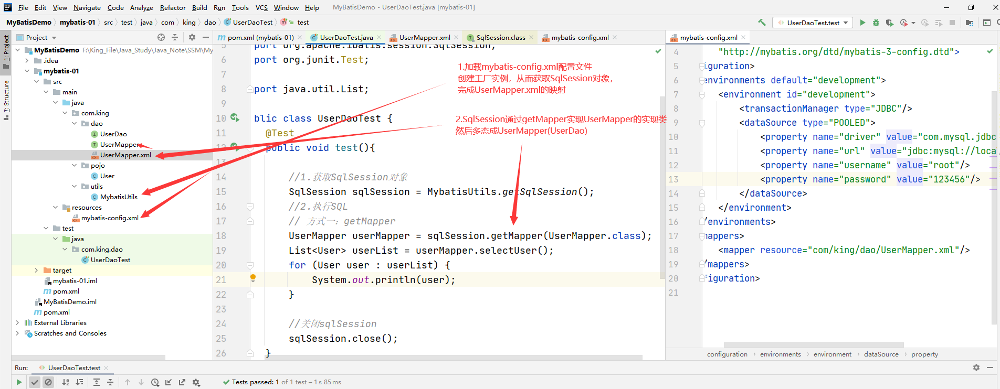
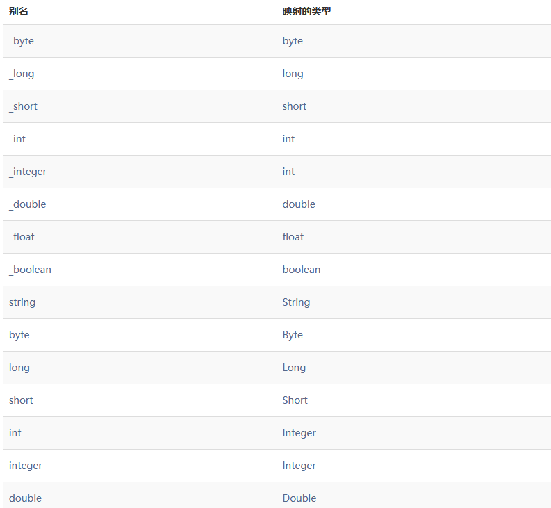
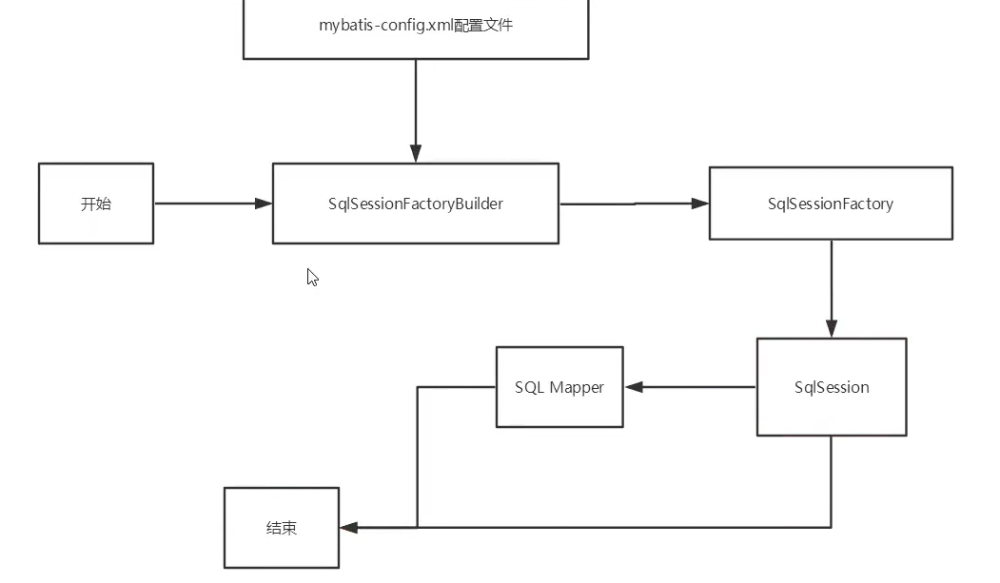
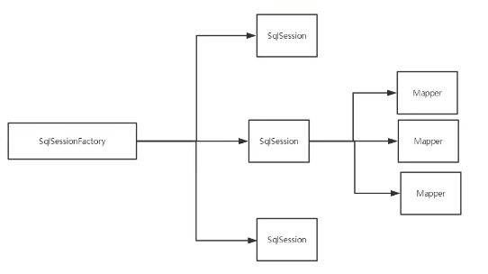
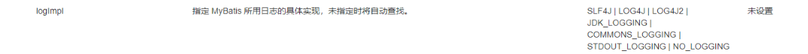
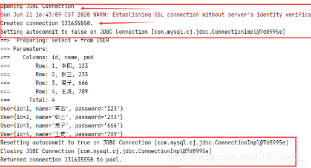
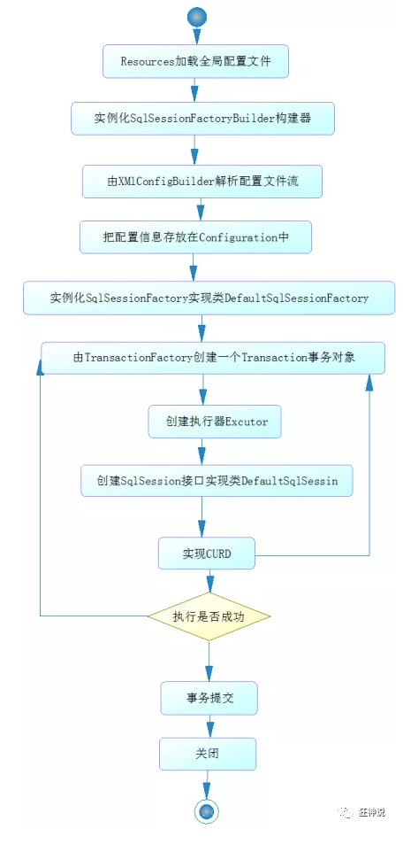
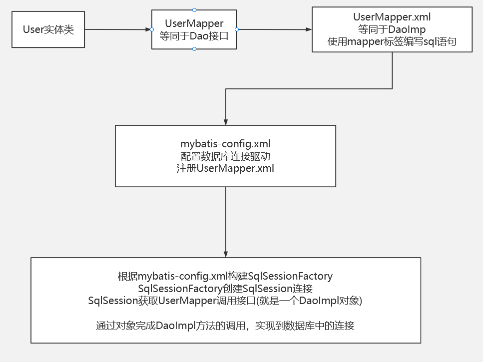
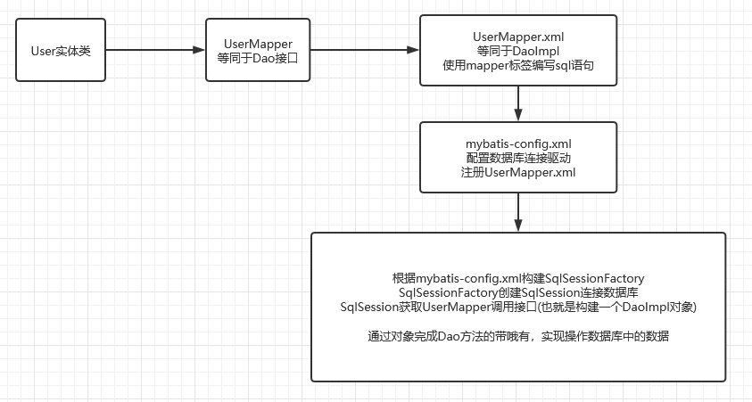

# MyBatis基础

- 主要参考自：
  - https://www.bilibili.com/video/BV1NE411Q7Nx
  - https://www.cnblogs.com/renxuw/p/13047424.html

## 1. MyBatis概述

### 1.1 MyBaits是什么？

- MyBatis 是一款优秀的**持久层框架**
- MyBatis 避免了几乎所有的 JDBC 代码和手动设置参数以及获取结果集的过程
- MyBatis 可以使用简单的 XML 或注解来配置和映射原生信息，将接口和 Java 的 实体类 【Plain Old Java Objects,普通的 Java对象】映射成数据库中的记录。
- MyBatis 本是apache的一个开源项目ibatis, 2010年这个项目由apache 迁移到了google code，并且改名为MyBatis 。
- 2013年11月迁移到**Github** .
- 如何获取：
  - Maven
  - Mybatis官方文档 : http://www.mybatis.org/mybatis-3/zh/index.html
  - GitHub : https://github.com/mybatis/mybatis-3

### 1.2 持久化

- **持久化是将程序数据在持久状态和瞬时状态间转换的机制。**
  - 即把数据（如内存中的对象）保存到可永久保存的存储设备中（如磁盘）。持久化的主要应用是将内存中的对象存储在数据库中，或者存储在磁盘文件中、XML数据文件中等等。
  - JDBC就是一种持久化机制。文件IO也是一种持久化机制。
  - 在生活中 : 将鲜肉冷藏，吃的时候再解冻的方法也是。将水果做成罐头的方法也是。
- **为什么需要持久化服务呢？那是由于内存本身的缺陷引起的**
  - 内存断电后数据会丢失，但有一些对象是无论如何都不能丢失的，比如银行账号等，遗憾的是，人们还无法保证内存永不掉电。
  - 内存过于昂贵，与硬盘、光盘等外存相比，内存的价格要高2~3个数量级，而且维持成本也高，至少需要一直供电吧。所以即使对象不需要永久保存，也会因为内存的容量限制不能一直呆在内存中，需要持久化来缓存到外存。

### 1.3 持久层

- **什么是持久层？**=》想想系统架构，为什么加层？
  - 完成持久化工作的代码块 .  ---->  dao层 【DAO (Data Access Object)  数据访问对象】
- 大多数情况下特别是企业级应用，数据持久化往往也就意味着将内存中的数据保存到磁盘上加以固化，而持久化的实现过程则大多通过各种**关系数据库**来完成。
- 不过这里有一个字需要特别强调，也就是所谓的“层”。对于应用系统而言，数据持久功能大多是必不可少的组成部分。也就是说，我们的系统中，已经天然的具备了“持久层”概念？也许是，但也许实际情况并非如此。
- 之所以要独立出一个“持久层”的概念,而不是“持久模块”，“持久单元”，也就意味着，我们的系统架构中，应该有一个相对独立的逻辑层面，专注于数据持久化逻辑的实现.
- 与系统其他部分相对而言，这个层面应该具有一个较为清晰和严格的逻辑边界。【说白了就是用来操作数据库存在的！】

### 1.4 为什么使用Mybatis

- Mybatis就是帮助程序猿将数据存入数据库中 , 和从数据库中取数据 .
- 传统的jdbc操作 , 有很多重复代码块 .比如 : 数据取出时的封装 , 数据库的建立连接等等... , 通过框架可以减少重复代码,提高开发效率 .
- MyBatis 是一个半自动化的**ORM框架 (Object Relationship Mapping) -->对象关系映射**
- 所有的事情，不用Mybatis依旧可以做到，只是用了它，所有实现会更加简单！**技术没有高低之分，只有使用这个技术的人有高低之别**
- MyBatis的优点
- - 简单易学：本身就很小且简单。没有任何第三方依赖，最简单安装只要两个jar文件+配置几个sql映射文件就可以了，易于学习，易于使用，通过文档和源代码，可以比较完全的掌握它的设计思路和实现。
  - 灵活：mybatis不会对应用程序或者数据库的现有设计强加任何影响。sql写在xml里，便于统一管理和优化。通过sql语句可以满足操作数据库的所有需求。
  - 解除sql与程序代码的耦合：通过提供DAO层，将业务逻辑和数据访问逻辑分离，使系统的设计更清晰，更易维护，更易单元测试。sql和代码的分离，提高了可维护性。
  - 提供xml标签，支持编写动态sql。
  - .......
- 最重要的一点，使用的人多！公司需要！

## 2. MyBatis入门

- 思路：搭建环境=》导入MyBatis=》编写代码=》测试

### 2.1 搭建实验数据库

```mysql
CREATE DATABASE `mybatis`;

USE `mybatis`;

DROP TABLE IF EXISTS `user`;

CREATE TABLE `user` (
`id` int(20) NOT NULL,
`name` varchar(30) DEFAULT NULL,
`pwd` varchar(30) DEFAULT NULL,
PRIMARY KEY (`id`)
) ENGINE=InnoDB DEFAULT CHARSET=utf8;

insert  into `user`(`id`,`name`,`pwd`) values (1,'狂神','123456'),(2,'张三','abcdef'),(3,'李四','987654');

```

### 2.2 创建项目搭建环境

- 直接创建一个空的maven项目，

- 删除src目录，就可以把此工程当做父工程了，然后创建子工程

- 导入maven依赖

- ```xml
  <?xml version="1.0" encoding="UTF-8"?>
  <project xmlns="http://maven.apache.org/POM/4.0.0"
           xmlns:xsi="http://www.w3.org/2001/XMLSchema-instance"
           xsi:schemaLocation="http://maven.apache.org/POM/4.0.0 http://maven.apache.org/xsd/maven-4.0.0.xsd">
      <modelVersion>4.0.0</modelVersion>
  <!--父工程-->
      <groupId>org.example</groupId>
      <artifactId>MyBatisDemo</artifactId>
      <version>1.0-SNAPSHOT</version>
  <!--导入依赖-->
      <!--导入依赖-->
      <dependencies>
          <!--mysqlq驱动-->
          <dependency>
              <groupId>mysql</groupId>
              <artifactId>mysql-connector-java</artifactId>
              <version>8.0.12</version>
          </dependency>
          <!--mybatis-->
          <dependency>
              <groupId>org.mybatis</groupId>
              <artifactId>mybatis</artifactId>
              <version>3.5.4</version>
          </dependency>
          <!--junit-->
          <dependency>
              <groupId>junit</groupId>
              <artifactId>junit</artifactId>
              <version>4.12</version>
              <scope>test</scope>
          </dependency>
      </dependencies>
  
  </project>
  ```

### 2.3 创建Moudle进行实操

- 创建一个Module

- 编写mybatis核心配置文件src/resources/mybatis-config.xml=》官方文档有！

- ```xml
  <?xml version="1.0" encoding="UTF-8" ?>
  <!DOCTYPE configuration
          PUBLIC "-//mybatis.org//DTD Config 3.0//EN"
          "http://mybatis.org/dtd/mybatis-3-config.dtd">
  <configuration>
      <environments default="development">
          <environment id="development">
              <transactionManager type="JDBC"/>
              <dataSource type="POOLED">
                  <property name="driver" value="com.mysql.jdbc.Driver"/>
                  <property name="url" value="jdbc:mysql://localhost:3306/mybatis?useSSL=true&amp;useUnicode=true&amp;characterEncoding=utf8"/>
                  <property name="username" value="root"/>
                  <property name="password" value="123456"/>
              </dataSource>
          </environment>
      </environments>
  </configuration>
  
  ```

- 实现Mybatis工具类，获取Mybatis实现的sqlSessionFactory对象，这个工厂对象可用生产SqlSession实例对象，SqlSession可用提供在数据库中执行SQL命令所需要的所有方法

- ```java
  package com.king.utils;
  
  import org.apache.ibatis.io.Resources;
  import org.apache.ibatis.session.SqlSession;
  import org.apache.ibatis.session.SqlSessionFactory;
  import org.apache.ibatis.session.SqlSessionFactoryBuilder;
  
  import java.io.IOException;
  import java.io.InputStream;
  
  //sqlSessionFactory --> sqlSession
  public class MybatisUtils {
  
      static SqlSessionFactory sqlSessionFactory = null;
  
      static {
          try {
              //使用Mybatis第一步 ：获取sqlSessionFactory对象
              String resource = "mybatis-config.xml";
              InputStream inputStream = Resources.getResourceAsStream(resource);
              sqlSessionFactory = new SqlSessionFactoryBuilder().build(inputStream);
          } catch (IOException e) {
              e.printStackTrace();
          }
      }
  
      //既然有了 SqlSessionFactory，顾名思义，我们可以从中获得 SqlSession 的实例.
      // SqlSession 提供了在数据库执行 SQL 命令所需的所有方法。
      public static SqlSession getSqlSession(){
          return sqlSessionFactory.openSession();
      }
  }
  
  
  ```

### 2.4 编写代码操作数据库

- 之前的JDBC和JavaWeb的实现过程：

  - JDBC封装：
    - 注册驱动
    - 获取连接数据库对象
    - 释放资源
  - 实现ORM：实现对象关系映射，将数据库中的表创建成java中对应的类
  - 实现DAO：实现数据访问对象层次
    - 实现BaseDAO类：完成JDBC的封装+一些公共的执行SQL的方法：给定SQL字符串即可执行
    - DAO接口：Dao
      - 定义给定ORM对象中需要执行的操作的接口
    - DAO实现类：DaoImpl
      - 根据Base DAO和DAO接口实现操作对应数据库表的操作
  - 实现Service：实现服务层
    - 根据需要提供的服务，创建对应的Service接口和实现类
  - 实现Controler：实现控制层：
    - 前端数据+Servlet：根据给定的前端数据，提供Service服务即可

- 总结：MVC:

  - M：业务处理+数据持久：Service+Dao(+ORM)
  - V：展示数据，发送请求，jsp、html
  - C：接收请求、转发给M层计算运行，返回给V层显示响应

- Mybatis就是为了简化DaoImpl的！！！

- 创建实体类：

- ```java
  public class User {
     
     private int id;  //id
     private String name;   //姓名
     private String pwd;   //密码
     
     //构造,有参,无参
     //set/get
     //toString()
     
  }
  
  ```

- 编写Mapper接口类，也就是Dao接口

- ```java
  package com.king.dao;
  import com.king.pojo.User;
  import java.util.List;
  
  public interface UserDao {
      List<User> selectUser();
  }
  
  //==================
  package com.king.dao;
  import com.king.pojo.User;
  import java.util.List;
  
  public interface UserMapper {
      List<User> selectUser();
  }
  
  ```

- 编写Mapper.xml配置文件！就是UserMapper的实现类，也就是UserDaoImpl

- ```xml
  <?xml version="1.0" encoding="UTF-8" ?>
  <!DOCTYPE mapper
          PUBLIC "-//mybatis.org//DTD Mapper 3.0//EN"
          "http://mybatis.org/dtd/mybatis-3-mapper.dtd">
  <!--namespace=绑定一个指定的Dao/Mapper接口-->
  <mapper namespace="com.king.dao.UserMapper">
  <!--    id：接口名-->
  <!--    resultType：返回结果类型-->
      <select id="selectUser" resultType="com.king.pojo.User">
          select * from user
      </select>
  </mapper>
  
  ```

### 2.5 测试代码

- junit测试

- 注意：

  - 需要在mybatis-config.xml核心配置文件中注册mappers

  - ```xml
        <mappers>
            <mapper resource="com/king/dao/UserMapper.xml"/>
        </mappers>
    ```

  - 因为注册的xml文件不在resources目录下，因此需要开启Maven的静态资源过滤，在pom.xml中添加

  - **记住：不要用IDEA自带的Maven！！！在File/Setting/Build Tools成自己的，不然下面配置的没有用！！！**

  - ```xml
        <build>
            <resources>
                <resource>
                    <directory>src/main/java</directory>
                    <includes>
                        <include>**/*.properties</include>
                        <include>**/*.xml</include>
                    </includes>
                    <filtering>false</filtering>
                </resource>
                <resource>
                    <directory>src/main/resources</directory>
                    <includes>
                        <include>**/*.properties</include>
                        <include>**/*.xml</include>
                    </includes>
                    <filtering>false</filtering>
                </resource>
            </resources>
        </build>
    ```

  - ```java
    package com.king.dao;
    
    import com.king.pojo.User;
    import com.king.utils.MybatisUtils;
    import org.apache.ibatis.session.SqlSession;
    import org.junit.Test;
    
    import java.util.List;
    
    public class UserDaoTest {
        @Test
        public void test(){
    
            //1.获取SqlSession对象
            SqlSession sqlSession = MybatisUtils.getSqlSession();
            //2.执行SQL
            // 方式一：getMapper
            UserMapper userMapper = sqlSession.getMapper(UserMapper.class);
            List<User> userList = userMapper.selectUser();
            for (User user : userList) {
                System.out.println(user);
            }
    
            //关闭sqlSession
            sqlSession.close();
        }
    
    
    }
    
    ```

- 图解运行过程！！！

- 

## 3. CURD

- namespace：配置文件中namespace中的名称为对应Mapper接口或者Dao接口的完整包名,必须一致！

- select标签：选择，查询语句；

  - id：就是对应的namespace中的方法名；
  - resultType : Sql语句执行的返回值；
  - parameterType : 参数类型；

- insert、update、delete都类似，只是执行的时候需要提交事务！

- 定义接口，配置xml,实现语句即可

- ```java
  package com.king.dao;
  import com.king.pojo.User;
  import java.util.List;
  
  public interface UserMapper {
      List<User> selectUser();
      User getUserByID(int id);
      int addUser(User user);
  
  }
  
  ```

- ```xml
  <?xml version="1.0" encoding="UTF-8" ?>
  <!DOCTYPE mapper
          PUBLIC "-//mybatis.org//DTD Mapper 3.0//EN"
          "http://mybatis.org/dtd/mybatis-3-mapper.dtd">
  <!--namespace=绑定一个指定的Dao/Mapper接口-->
  <mapper namespace="com.king.dao.UserMapper">
  <!--    id：接口名-->
  <!--    resultType：返回结果类型-->
      <select id="selectUser" resultType="com.king.pojo.User">
          select * from user
      </select>
  
      <select id="getUserByID" resultType="com.king.pojo.User" parameterType="int">
          select * from user where id=#{id};
      </select>
  
      <insert id="addUser" parameterType="com.king.pojo.User">
          insert into user (id,name,pwd) values (#{id},#{name},#{pwd});
      </insert>
  </mapper>
  
  ```

- 常见错误：

  - 标签不要匹配错
  - resource绑定mapper是使用/的路径
  - 程序配置文件必须规范
  - NullPointerExeception没有注册到资源

## 4. Map和模糊查询

- 万能的Map：如果我们的实体类或者数据库中的表，字段或者参数过多，可用考虑使用Map!

- **在Mapper.xml中获取接口的输入的参数：parameterType**

  - 如果是基本数据类型：#{接口方法中的形参名称}=>parameterType="int"
  - 如果是实体类型：#{实体类型的属性名即可(成员变量名)}=>parameterType="com.king.pojo.User"
  - 如果是map类型：#{map的key即可}，会根据key自动获取map中的value=>parameterType="map" 
  - 多个参数：使用map或者注解！

- ```java
  // 接口方法
  User selectUserByNP2(Map<String,Object> map);
  // xml接口实现Mapper
  <select id="selectUserByNP2" parameterType="map" resultType="com.kuang.pojo.User">
  select * from user where name = #{username} and pwd = #{pwd}
  </select>
  
  // 测试类
  Map<String, Object> map = new HashMap<String, Object>();
  map.put("username","小明");
  map.put("pwd","123456");
  User user = mapper.selectUserByNP2(map);
  
  ```

- 模糊查询怎么写？

  - Java代码执行的时候，传递通配符%%
  - 在sql拼接中使用通配符，容易引起Sql注入问题

## 5. 配置文件解析

### 5.1 核心配置文件

- mybatis-config.xml系统核心配置文件：MyBatis 的配置文件包含了会深深影响 MyBatis 行为的设置和属性信息。

- ```xml
  configuration（配置）
  properties（属性）
  settings（设置）
  typeAliases（类型别名）
  typeHandlers（类型处理器）
  objectFactory（对象工厂）
  plugins（插件）
  environments（环境配置）
  environment（环境变量）
  transactionManager（事务管理器）
  dataSource（数据源）
  databaseIdProvider（数据库厂商标识）
  mappers（映射器）
  <!-- 注意元素节点的顺序！顺序不对会报错 -->
  ```

### 5.2 environments

- ```xml
  <environments default="development">
   <environment id="development">
     <transactionManager type="JDBC">
       <property name="..." value="..."/>
     </transactionManager>
     <dataSource type="POOLED">
       <property name="driver" value="${driver}"/>
       <property name="url" value="${url}"/>
       <property name="username" value="${username}"/>
       <property name="password" value="${password}"/>
     </dataSource>
   </environment>
  </environments>
  ```

- 配置MyBatis的多套运行环境，将SQL映射到多个不同的数据库上，必须指定其中一个为默认运行环境（通过default指定）**尽管可以配置多个环境，但每个 SqlSessionFactory 实例只能选择一种环境**

- MyBatis默认的事务管理器就是JDBC ，连接池：POOLED

- ```xml
  具体的一套环境，通过设置id进行区别，id保证唯一！
  <environment id="development">
      
  <transactionManager type="[ JDBC | MANAGED ]"/>
  	这两种事务管理器类型都不需要设置任何属性。
  <dataSource type="POOLED">
      元素使用标准的 JDBC 数据源接口来配置 JDBC 连接对象的资源。
  	数据源是必须配置的。
      有三种内建的数据源类型
  	type="[UNPOOLED|POOLED|JNDI]"）
  		unpooled：这个数据源的实现只是每次被请求时打开和关闭连接。
  		pooled：这种数据源的实现利用“池”的概念将 JDBC 连接对象组织起来 , 这是一种使得并发 Web 应用快速响应请求的流行处理方式。
  		jndi：这个数据源的实现是为了能在如 Spring 或应用服务器这类容器中使用，容器可以集中或在外部配置数据源，然后放置一个 JNDI 上下文的引用。
  	数据源也有很多第三方的实现，比如dbcp，c3p0，druid等等....
  
  ```

### 5.3 properties

- 可以通过properties属性来实现引用配置文件

- 这些属性可以在外部进行配置，并可以进行动态替换。你既可以在典型的 Java 属性文件中配置这些属性，也可以在 properties 元素的子元素中设置。【db.poperties】

- ```java
  
  // 编写一个配置文件 db.properties
  driver=com.mysql.cj.jdbc.Driver
  url=jdbc:mysql://localhost:3306/mybatis?userSSL=true&useUnicode=true&characterEncoding=UTF-8&serverTimezone=UTC
  username=root
  password=root
  ```

- ```xm
  在mybatis-config.xml中配置：
  既可以引入配置文件中的数据，也可以自己自定义属性：key-value
  如果两个文件有同一个字段，优先使用外部配置文件的
  
  <!--引用外部配置文件-->
  <properties resource="db.properties">
      <property name="username" value="root"/>
      <property name="password" value="root"/>
  </properties>
  <environments default="development">
   <environment id="development">
     <transactionManager type="JDBC">
       <property name="..." value="..."/>
     </transactionManager>
     <dataSource type="POOLED">
       <property name="driver" value="${driver}"/>
       <property name="url" value="${url}"/>
       <property name="username" value="${username}"/>
       <property name="password" value="${password}"/>
     </dataSource>
   </environment>
  </environments>
  ```

### 5.4 typeAliases

- 类型别名可为 Java 类型(实体类或者其他类)设置一个缩写名字。 它仅用于 XML 配置.

- 目的：是降低冗余的全限定类名书写。在之后的Mapper.xml中使用别名即可！

- 法一：直接写全限定类名的映射

- ```xml
  <!--可以给实体类起别名-->
  <typeAliases>
      <typeAlias type="com.king.pojo.User" alias="User"/>
  </typeAliases>
  
  ```

- 法二：写全限定类名(Java Bean)对应的包，

  - 在没有注解的情况下会自动使用：Bean 的首字母小写的非限定类名来作为它的别名
  - 若有注解，则别名为其注解值

- ```xml
  <typeAliases>
      <package name="com.king.pojo"/>
  </typeAliases>
  # 在Mapper中使用的时候，会自动扫描类名，作为别名，如果有注解，则别名为其注解值
  
  @Alias("author")
  public class Author {
      ...
  }
  ```

- 总结：

  - 在实体类比较少的时候，使用第一种方式。
  - 如果实体类十分多，建议用第二种扫描包的方式。
  - 第一种可以DIY别名，第二种不行，如果非要改，需要在实体上增加注解。

### 5.4 setting

- 这是 MyBatis 中极为重要的调整设置，它们会改变 MyBatis 的运行时行为。

- 建议看官方文档，贼多！

- 主要了解：

  - 懒加载
  - 日志实现
  - 缓存开启关闭

- ```xml
  <settings>
   <setting name="cacheEnabled" value="true"/>
   <setting name="lazyLoadingEnabled" value="true"/>
   <setting name="multipleResultSetsEnabled" value="true"/>
   <setting name="useColumnLabel" value="true"/>
   <setting name="useGeneratedKeys" value="false"/>
   <setting name="autoMappingBehavior" value="PARTIAL"/>
   <setting name="autoMappingUnknownColumnBehavior" value="WARNING"/>
   <setting name="defaultExecutorType" value="SIMPLE"/>
   <setting name="defaultStatementTimeout" value="25"/>
   <setting name="defaultFetchSize" value="100"/>
   <setting name="safeRowBoundsEnabled" value="false"/>
   <setting name="mapUnderscoreToCamelCase" value="false"/>
   <setting name="localCacheScope" value="SESSION"/>
   <setting name="jdbcTypeForNull" value="OTHER"/>
   <setting name="lazyLoadTriggerMethods" value="equals,clone,hashCode,toString"/>
  </settings>
  
  ```

### 5.5 其他配置

- [typeHandlers（类型处理器）](https://mybatis.org/mybatis-3/zh/configuration.html#typeHandlers)
- [objectFactory（对象工厂）](https://mybatis.org/mybatis-3/zh/configuration.html#objectFactory)
- plugins 插件   
  - mybatis-generator-core
  - mybatis-plus
  - 通用mapper

### 5.6 mapper

- 映射器：MapperRegistry，也就是注册绑定我们的Mapper文件(我们用来代替之前DaoImpl的XxxMapper.xml的文件)

- 法一：推荐使用

- ```xml
  <!--每一个Mapper.xml都需要在MyBatis核心配置文件中注册-->
  <mappers>
      <mapper resource="com/king/dao/UserMapper.xml"/>
  </mappers>
  
  ```

- 法二：使用class文件绑定注册

- ```xml
  <!--每一个Mapper.xml都需要在MyBatis核心配置文件中注册-->
  <mappers>
      <mapper class="com.king.dao.UserMapper"/>
  </mappers>
  ```

  - 接口(Dao)和对应的Mapper配置文件必须同名
  - 接口(Dao)和对应的的Mapper配置文件必须在同一个包下

- 法三：使用包扫描进行注入

- ```xml
  <mappers>
      <package name="com.king.dao"/>
  </mappers>
  ```

  - 接口(Dao)和对应的Mapper配置文件必须同名
  - 接口(Dao)和对应的的Mapper配置文件必须在同一个包下
  
- parameterType的取值：也就是一种类型别名的获取

  - Mybatis为常见的 Java 类型内建的类型别名。它们都是不区分大小写的，注意，为了应对原始类型的命名重复，采取了特殊的命名风格。
  - 

## 6. 作用域和生命周期



- 理解生命周期和作用域是至关重要的，因为错误的使用会导致非常严重的**并发问题**。
- **SqlSessionFactoryBuilder:**
  - SqlSessionFactoryBuilder一旦创建了SqlSessionFactory，就不再需要它了
  - SqlSessionFactoryBuilder应该是局部变量
- **SqlSessionFactory:**
  - 可以想象为：数据库连接池
  - SqlSessionFactory一旦被创建就应该在应用的运行期间一直存在，**没有任何理由丢弃它或重新创建一个实例。**
  - 因此SqlSessionFactory的最佳作用域是应用作用域（ApplocationContext）。
  - 最简单的就是使用单例模式或静态单例模式。
- **SqlSession：**
  - 连接到连接池的一个请求
  - SqlSession 的实例不是线程安全的，因此是不能被共享的，所以它的最佳的作用域是请求或方法作用域。
  - 用完之后需要赶紧关闭，否则资源被占用！
- 
- **Mapper：**
  - 相当于一个具体的业务！

## 7. 如何解决实体类属性名和数据库字段名不一致问题？

- 法一：在SQL语句中设置：as 别名：使数据库中的字段名和实体类属性名一致

- ```xml
  <select id="getUserById" resultType="com.king.pojo.User">
      select id,name,pwd as password from USER where id = #{id}
  </select>
  
  ```

- 上述语句只是简单地将所有的列映射到 `HashMap` 的键上，这由 `resultType` 属性指定。

- 虽然在大部分情况下都够用，但是 HashMap 不是一个很好的模型。你的程序更可能会使用 JavaBean 或 POJO（Plain Old Java Objects，普通老式 Java 对象）作为模型。

- `ResultMap` 最优秀的地方在于，虽然你已经对它相当了解了，但是根本就不需要显式地用到他们。

  - **也就是说，如果字段名和属性名一致，resultType和resultMap功能一样！**

  - 所以功能和resultType一样，并且功能还可以比其更强，为什么不用呢？

  - ```xml
    <select id="getUserById" resultType="com.king.pojo.User">
        select id,name,pwd from USER where id = #{id}
    </select>
    
    等同于
    <resultMap id = "UserMap" type="com.king.pojo.User">
    </resultMap>
    <select id="getUserById" resultMap="UserMap">
        select id,name,pwd from USER where id = #{id}
    </select>
    
    ```

- 法二：使用结果集映射！**resultMap**

- ```xml
  <!--结果集映射-->
  <resultMap id="UserMap" type="User">
      <!--column数据库中的字段，property实体类中的属性-->
      <result column="id" property="id"></result>
      <result column="name" property="name"></result>
      <result column="pwd" property="password"></result>
  </resultMap>
  
  <select id="getUserList" resultMap="UserMap">
      select * from USER
  </select>
  ```

  - `resultMap` 元素是 MyBatis 中最重要最强大的元素。它可以让你从 90% 的 JDBC `ResultSets` 数据提取代码中解放出来。
  - 实际上，在为一些比如连接的复杂语句编写映射代码的时候，一份 `resultMap` 能够代替实现同等功能的长达数千行的代码。
  - resultMap 的设计思想是，对简单的语句做到零配置，对于复杂一点的语句，只需要描述语句之间的关系就行了。相同的无需map，不同的在配置即可！
  - `ResultMap` 的优秀之处——你完全可以不用显式地配置它们

## 8. 日志

### 8.1 日志工厂

- 如果一个数据库操作，出现了异常，我们需要排错，日志就是最好的助手！

  - 曾经：sout、debug
  - 现在：日志工厂

- 

  - SLF4J
  - LOG4J 【掌握】
  - LOG4J2
  - JDK_LOGGING
  - COMMONS_LOGGING
  - STDOUT_LOGGING 【掌握】
  - NO_LOGGING

- 在MyBatis中具体使用哪一个日志实现，在设置中设定

- MyBatis中使用：**STDOUT_LOGGING**日志

  - 在mybatis-config.xml中配置如下标签即可：

  - ```xml
    <settings>
        <setting name="logImpl" value="STDOUT_LOGGING"/>
    </settings>
    ```

- 

### 8.2 Log4j

- 什么是Log4j？

  - Log4j是Apache的一个开源项目，通过使用Log4j，可以控制日志信息输送的目的地是控制台、文件、GUI组件；
  - 我们也可以控制每一条日志的输出格式；
  - 通过定义每一条日志信息的级别，我们能够更加细致地控制日志的生成过程；
  - 最令人感兴趣的就是，这些可以通过一个配置文件来灵活地进行配置，而不需要修改应用的代码。

- 如何使用？

  - maven中导入依赖
  - 配置log4j的配置文件：log4j.properties
  - 在mybatis-config.xml中配置settings为log4j
  - 测试运行

- ```xml
  # maven中导入依赖
  <dependency>
      <groupId>log4j</groupId>
      <artifactId>log4j</artifactId>
      <version>1.2.17</version>
  </dependency>
  
  ```

- ```properties
  # 配置log4j的配置文件：log4j.properties
  
  #将等级为DEBUG的日志信息输出到console和file这两个目的地，console和file的定义在下面的代码
  log4j.rootLogger=DEBUG,console,file
  #控制台输出的相关设置
  log4j.appender.console = org.apache.log4j.ConsoleAppender
  log4j.appender.console.Target = System.out
  log4j.appender.console.Threshold=DEBUG
  log4j.appender.console.layout = org.apache.log4j.PatternLayout
  log4j.appender.console.layout.ConversionPattern=[%c]-%m%n
  #文件输出的相关设置
  log4j.appender.file = org.apache.log4j.RollingFileAppender
  log4j.appender.file.File=./log/rzp.log
  log4j.appender.file.MaxFileSize=10mb
  log4j.appender.file.Threshold=DEBUG
  log4j.appender.file.layout=org.apache.log4j.PatternLayout
  log4j.appender.file.layout.ConversionPattern=[%p][%d{yy-MM-dd}][%c]%m%n
  #日志输出级别
  log4j.logger.org.mybatis=DEBUG
  log4j.logger.java.sql=DEBUG
  log4j.logger.java.sql.Statement=DEBUG
  log4j.logger.java.sql.ResultSet=DEBUG
  log4j.logger.java.sq1.PreparedStatement=DEBUG
  
  ```

- 简单使用：

  1. 需要配置log4j.properties文件，否则会报错

  2. 在要使用Log4j的类中，导入包 import org.apache.log4j.Logger

  3. 构建日志对象，参数为当前类的class对象

     1. ```java
        Logger logger = Logger.getLogger(UserDaoTest.class);
        ```

  4. 设置要输出的日志级别

     1. ```java
        logger.info("info: 测试log4j");
        logger.debug("debug: 测试log4j");
        logger.error("error:测试log4j");
        ```

## 9. 分页

- 为什么要分页？
  - 减少数据的处理量！

### 9.1 Limit实现分页

- ```mysql
  SELECT * from user limit startIndex,pageSize 
  ```

- **使用MyBatis实现分页：**

  - 法一：修改SQL语句，传入指定参数
  - 法二：使用RobBounds分页
  - 法三：使用MyBatis相关的分页插件

- 法一：

- ```java
  // 接口：
  //分页
  List<User> getUserByLimit(Map<String,Integer> map);
  
  // Mapper.XML
  <!--分页查询-->
  <select id="getUserByLimit" parameterType="map" resultMap="UserMap">
      select * from user limit #{startIndex},#{pageSize}
  </select>
  
  // 测试代码
  @Test
  public void getUserByLimit(){
      SqlSession sqlSession = MybatisUtils.getSqlSession();
      UserMapper mapper = sqlSession.getMapper(UserMapper.class);
      HashMap<String, Integer> map = new HashMap<String, Integer>();
      map.put("startIndex",1);
      map.put("pageSize",2);
      List<User> list = mapper.getUserByLimit(map);
      for (User user : list) {
          System.out.println(user);
      }
  }
  ```

### 9.2 RowBounds分页

- 使用RowBounds类实现=》现在已经不太推荐

  - 主要是代码封装层面实现！

- ```java
  // 接口：
  //分页2
  List<User> getUserByRowBounds();
  
  // Mapper.xml文件
  <!--分页查询2-->
  <select id="getUserByRowBounds">
      select * from user limit #{startIndex},#{pageSize}
  </select>
  
  // 测试类：
  public void getUserByRowBounds(){
        SqlSession sqlSession = MybatisUtils.getSqlSession();
        //RowBounds实现
         RowBounds rowBounds = new RowBounds(1, 2);
          //通过Java代码层面实现分页
         List<User> userList = sqlSession.selectList("com.kaung.dao.UserMapper.getUserByRowBounds", null, rowBounds);
          for (User user : userList) {
              System.out.println(user);
          }
          sqlSession.close();
      }
  
  ```

### 9.3 分页插件

- 使用MyBatis分页插件实现：搜索 MyBatis PageHelper即可

## 10. 注解开发

### 10.1 面向接口编程

- 大家之前都学过面向对象编程，也学习过接口，但在真正的开发中，很多时候我们会选择面向接口编程
- **根本原因 :  解耦 , 可拓展 , 提高复用 , 分层开发中 , 上层不用管具体的实现 , 大家都遵守共同的标准 , 使得开发变得容易 , 规范性更好**
- 在一个面向对象的系统中，系统的各种功能是由许许多多的不同对象协作完成的。在这种情况下，各个对象内部是如何实现自己的,对系统设计人员来讲就不那么重要了；
- 而各个对象之间的协作关系则成为系统设计的关键。小到不同类之间的通信，大到各模块之间的交互，在系统设计之初都是要着重考虑的，这也是系统设计的主要工作内容。面向接口编程就是指按照这种思想来编程。
- **关于接口的理解**
  - 接口从更深层次的理解，应是定义（规范，约束）与实现（名实分离的原则）的分离。
  - 接口的本身反映了系统设计人员对系统的抽象理解。
  - 接口应有两类：
    - 第一类是对一个个体的抽象，它可对应为一个抽象体(abstract class)；
    - 第二类是对一个个体某一方面的抽象，即形成一个抽象面（interface）；
  - 一个体有可能有多个抽象面。抽象体与抽象面是有区别的。
- **三个面向区别**
  - 面向对象是指，我们考虑问题时，以对象为单位，考虑它的属性及方法 .
  - 面向过程是指，我们考虑问题时，以一个具体的流程（事务过程）为单位，考虑它的实现 .
  - 接口设计与非接口设计是针对复用技术而言的，与面向对象（过程）不是一个问题.更多的体现就是对系统整体的架构

### 10.2 使用注解开发

- **mybatis最初配置信息是基于 XML ,映射语句(SQL)也是定义在 XML 中的。而到MyBatis 3提供了新的基于注解的配置。不幸的是，Java 注解的的表达力和灵活性十分有限。最强大的 MyBatis 映射并不能用注解来构建**

- sql 类型主要分成 :

  - @select ()
  - @update ()
  - @Insert ()
  - @delete ()

- **注意：**利用注解开发就不需要mapper.xml映射文件了 .

- 步骤

- ```java
  // 1.在我们的接口中添加注解
  //查询全部用户
  @Select("select id,name,pwd password from user")
  public List<User> getAllUser();
  
  
  // 2.在mybatis的核心配置文件中注入
  <!--使用class绑定接口-->
  <mappers>
     <mapper class="com.king.mapper.UserMapper"/>
  </mappers>
  
  
  // 3.测试
  @Test
  public void testGetAllUser() {
     SqlSession session = MybatisUtils.getSession();
     //本质上利用了java的动态代理机制
     UserMapper mapper = session.getMapper(UserMapper.class);
  
     List<User> users = mapper.getAllUser();
     for (User user : users){
         System.out.println(user);
    }
  
     session.close();
  }
  
  
  ```

- 注解的本质是：反射机制的实现

- 注解的底层使用的是：动态代理技术

### 10.3 注解增删改

- ```java
  // 1.改造MybatisUtils工具类的getSession( ) 方法，重载实现:自动提交事务
    //获取SqlSession连接
  public static SqlSession getSession(){
      return getSession(true); //事务自动提交
  }
  
  public static SqlSession getSession(boolean flag){
      return sqlSessionFactory.openSession(flag);
  }
  
  // 2.在mybatis的核心配置文件中判定接口
  <!--使用class绑定接口-->
  <mappers>
     <mapper class="com.king.mapper.UserMapper"/>
  </mappers>
  
  // 3. 接口使用注解
  //根据id查询用户
  @Select("select * from user where id = #{id}")
  User selectUserById(@Param("id") int id);
  
  //添加一个用户
  @Insert("insert into user (id,name,pwd) values (#{id},#{name},#{pwd})")
  int addUser(User user);
  
  //修改一个用户
  @Update("update user set name=#{name},pwd=#{pwd} where id = #{id}")
  int updateUser(User user);
  
  //根据id删除用
  @Delete("delete from user where id = #{id}")
  int deleteUser(@Param("id")int id);
  
  
  
  // 4. 测试
  @Test
  public void testSelectUserById() {
     SqlSession session = MybatisUtils.getSession();
     UserMapper mapper = session.getMapper(UserMapper.class);
  
     User user = mapper.selectUserById(1);
     System.out.println(user);
  
     session.close();
  }
  
  @Test
  public void testAddUser() {
     SqlSession session = MybatisUtils.getSession();
     UserMapper mapper = session.getMapper(UserMapper.class);
  
     User user = new User(6, "秦疆", "123456");
     mapper.addUser(user);
  
     session.close();
  }
  
  
  @Test
  public void testUpdateUser() {
     SqlSession session = MybatisUtils.getSession();
     UserMapper mapper = session.getMapper(UserMapper.class);
  
     User user = new User(6, "秦疆", "zxcvbn");
     mapper.updateUser(user);
  
     session.close();
  }
  
  @Test
  public void testDeleteUser() {
     SqlSession session = MybatisUtils.getSession();
     UserMapper mapper = session.getMapper(UserMapper.class);
  
     mapper.deleteUser(6);
     
     session.close();
  }
  
  
  ```

- 关于@Param

  - 基本类型的参数或者String类型，需要加上
  - 引用类型不需要加
  - 如果只有一个基本类型的话，可以忽略，但是建议大家都加上
  - 我们在SQL中引用的就是我们这里的@Param()中设定的属性名

- \#{}和${}的区别：

  - \#{}等同于：JDBC的PreparedStatement ，可以防止SQL注入
  - ${}等同于：JDBC的Statement，不能防止SQL注入

## 11. Mybatis执行流程

- 建议自行百度！
- 

## 12. Lombok

- 是什么？干什么？

  - Lombok项目是一个Java库，它会自动插入编辑器和构建工具中，Lombok提供了一组有用的注释，用来消除Java类中的大量样板代码。仅五个字符(@Data)就可以替换数百行代码从而产生干净，简洁且易于维护的Java类。

- 使用步骤：

  - 1.在IDEA中安装Lombok插件

  - 2.在项目中导入lombok的jar包

    - ```xml
      <dependency>
          <groupId>org.projectlombok</groupId>
          <artifactId>lombok</artifactId>
          <version>1.18.10</version>
          <scope>provided</scope>
      </dependency>
      ```

  - 3.在程序上加注解：百度或者实战都可理解注解含义!

    - ```java
      @Getter and @Setter
      @FieldNameConstants
      @ToString
      @EqualsAndHashCode
      @AllArgsConstructor, @RequiredArgsConstructor and @NoArgsConstructor
      @Log, @Log4j, @Log4j2, @Slf4j, @XSlf4j, @CommonsLog, @JBossLog, @Flogger, @CustomLog
      @Data
      @Builder
      @SuperBuilder
      @Singular
      @Delegate
      @Value
      @Accessors
      @Wither
      @With
      @SneakyThrows
      @val
      
      ```

## 13. 多对一处理

## 14. 一对多处理

## 15. 动态SQL

## 16. 缓存

## 17. 总结

- Mybatis主要流程：
  - 
  - 

