# Spring基础

- 主要参考自：https://www.bilibili.com/video/BV1WE411d7Dv?spm_id_from=333.999.0.0
- https://www.cnblogs.com/renxuw/p/12994080.html

## 1. Spring

### 1.1 简介

- Spring : 春天 --->给软件行业带来了春天
- 2002年，Rod Jahnson首次推出了Spring框架雏形interface21框架。
- 2004年3月24日，Spring框架以interface21框架为基础，经过重新设计，发布了1.0正式版。
- 很难想象Rod Johnson的学历 , 他是悉尼大学的博士，然而他的专业不是计算机，而是音乐学。
- Spring理念 : 使现有技术更加实用 . 本身就是一个大杂烩 , 整合现有的框架技术
- 官网 : http://spring.io/
- 官方下载地址 : https://repo.spring.io/libs-release-local/org/springframework/spring/
- GitHub : https://github.com/spring-projects

### 1.2 优点

- Spring是一个开源免费的框架 、容器  
- Spring是一个轻量级的框架 , 非侵入式的 .
- **控制反转 IoC  , 面向切面 Aop**
- 对事物的支持 , 对框架的支持
- .......
- 一句话概括：**Spring是一个轻量级的控制反转(IoC)和面向切面(AOP)的容器（框架）。**

### 1.3 组成

- 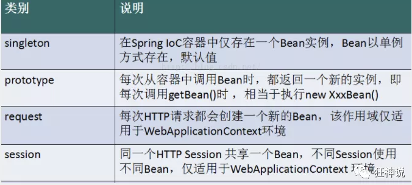
- **核心容器**：核心容器提供 Spring 框架的基本功能。核心容器的主要组件是 BeanFactory，它是工厂模式的实现。BeanFactory 使用*控制反转*（IOC） 模式将应用程序的配置和依赖性规范与实际的应用程序代码分开。
- **Spring 上下文**：Spring 上下文是一个配置文件，向 Spring 框架提供上下文信息。Spring 上下文包括企业服务，例如 JNDI、EJB、电子邮件、国际化、校验和调度功能。
- **Spring AOP**：通过配置管理特性，Spring AOP 模块直接将面向切面的编程功能 ,  集成到了 Spring 框架中。所以，可以很容易地使 Spring 框架管理任何支持 AOP的对象。Spring AOP 模块为基于  Spring 的应用程序中的对象提供了事务管理服务。通过使用 Spring AOP，不用依赖组件，就可以将声明性事务管理集成到应用程序中。
- **Spring DAO**：JDBC DAO  抽象层提供了有意义的异常层次结构，可用该结构来管理异常处理和不同数据库供应商抛出的错误消息。异常层次结构简化了错误处理，并且极大地降低了需要编写的异常代码数量（例如打开和关闭连接）。Spring DAO 的面向 JDBC 的异常遵从通用的 DAO 异常层次结构。
- **Spring ORM**：Spring 框架插入了若干个 ORM 框架，从而提供了 ORM 的对象关系工具，其中包括 JDO、Hibernate 和 iBatis SQL Map。所有这些都遵从 Spring 的通用事务和 DAO 异常层次结构。
- **Spring Web 模块**：Web 上下文模块建立在应用程序上下文模块之上，为基于 Web 的应用程序提供了上下文。所以，Spring 框架支持与 Jakarta Struts 的集成。Web 模块还简化了处理多部分请求以及将请求参数绑定到域对象的工作。
- **Spring MVC 框架**：MVC 框架是一个全功能的构建 Web 应用程序的 MVC 实现。通过策略接口，MVC 框架变成为高度可配置的，MVC 容纳了大量视图技术，其中包括 JSP、Velocity、Tiles、iText 和 POI。

### 1.4 拓展

- **Spring Boot与Spring Cloud**
  - Spring Boot 是 Spring 的一套快速配置脚手架，可以基于Spring Boot 快速开发单个微服务;
  - Spring Cloud是基于Spring Boot实现的；
  - Spring Boot专注于快速、方便集成的单个微服务个体，Spring Cloud关注全局的服务治理框架；
  - Spring Boot使用了**约束优于配置的理念**，很多集成方案已经帮你选择好了，能不配置就不配置 , Spring Cloud很大的一部分是**基于Spring Boot来实现**，**Spring Boot可以离开Spring Cloud独立使用开发项目**，**但是Spring Cloud离不开Spring Boot，属于依赖的关系**。
  - SpringBoot在SpringClound中起到了承上启下的作用，如果你要学习SpringCloud必须要学习SpringBoot。
- 

## 2. IOC思想原型

- 环境准备：Maven项目

- ```xml
  <!-- https://mvnrepository.com/artifact/org.springframework/spring-webmvc -->
  <dependency>
      <groupId>org.springframework</groupId>
      <artifactId>spring-webmvc</artifactId>
      <version>5.2.0.RELEASE</version>
  </dependency>
  
  <dependency>
      <groupId>org.springframework</groupId>
      <artifactId>spring-jdbc</artifactId>
      <version>5.2.0.RELEASE</version>
  </dependency>
  
  ```

### 2.1 原来的MVC实现

- 定义UserDao接口
- 实现UserDaoImpl实现类
- 定义UserService接口
- 实现UserServiceImpl实现类
- 测试调用即可

```java
package com.king.dao;

public interface UserDao {
    public void getUser();
}

package com.king.dao;

public class UserDaoImpl implements UserDao{
    public void getUser() {
        System.out.println("默认实现类获取数据");
    }
}

package com.king.service;

public interface UserService {
    public void getUserService();
}

package com.king.service;

import com.king.dao.UserDao;
import com.king.dao.UserDaoImpl;

public class UserServiceImpl implements UserService{
    private UserDao userDao = new UserDaoImpl();

    // 服务层调用Dao实现类即可
    public void getUserService() {
        userDao.getUser();
    }
}

package com.king;

import com.king.service.UserService;
import com.king.service.UserServiceImpl;

public class mytest {
    public static void main(String[] args) {
        UserService userService = new UserServiceImpl();
        userService.getUserService();
    }
}

```

- 如果此时我们需要新增Dao实现类，如从Mysql、Oracle中获取数据
  - 添加一个UserDaoMySQLImpl和UserDaoOracleImpl
- 增加后，如果ServiceImpl要调用这些Dao的实现类，需要在Service中去修改对应的实现！每次变动，都要修改大量代码！耦合性太高了！！！

### 2.2 如何解决？

- 如何解决？

  - 不去实现限定死的对象，而是留出一个接口，利用Set把权限交给其他人

- ```java
  package com.king.service;
  
  import com.king.dao.UserDao;
  import com.king.dao.UserDaoImpl;
  
  public class UserServiceImpl implements UserService{
  //    private UserDao userDao = new UserDaoImpl();
      private UserDao userDao;
  
      public void setUserDao(UserDao userDao) {
          this.userDao = userDao;
      }
  
      // 服务层调用Dao实现类即可
      public void getUserService() {
          userDao.getUser();
      }
  }
  
  
  @Test
  public void test(){
     UserServiceImpl service = new UserServiceImpl();
     service.setUserDao( new UserDaoMySqlImpl() );
     service.getUser();
     //那我们现在又想用Oracle去实现呢
     service.setUserDao( new UserDaoOracleImpl() );
     service.getUser();
  }
  
  ```

- 分析：

  - 以前所有的东西都是由程序去进行控制创建
  - 现在：可以由我们自行控制创建对象，把主动权交给了调用者。程序不用管怎么去创建，怎么实现，只负责提供一个接口！！！

- 这种思想从本质上解决了问题，无需再去管理对象的创建，更多的应该去关注业务的实现，极大降低了耦合性！这也是IOC的原型

- 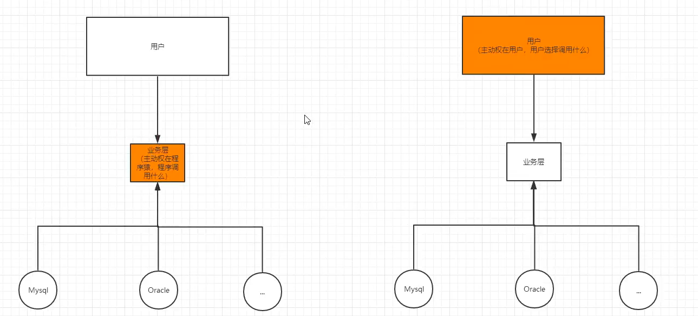

## 3. IoC本质

- IoC：Inversion of Control ：是一种设计思想，在使用面向对象的编程思想时，对象的创建与对象间的依赖关系完全硬编码在程序中，对象的创建由程序自己控制。而使用IOC则是期望能够：控制反转后将对象的创建转移给第三方进行控制，也就是依赖对象的方式发生反转
- 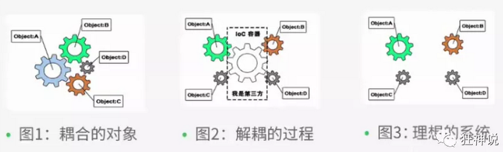
- IoC是Spring框架的核心内容，使用多种方式完美实现了IoC
  - XML配置文件实现IoC
  - 注释实现IoC
  - 自动实现IoC
- Spring实现IoC的基本思路：
  - Spring容器在初始化时就先读取配置文件，根据配置文件或者元数据创建与组织对象存入容器种，程序使用时再从IoC容器种取出需要的对象
  - 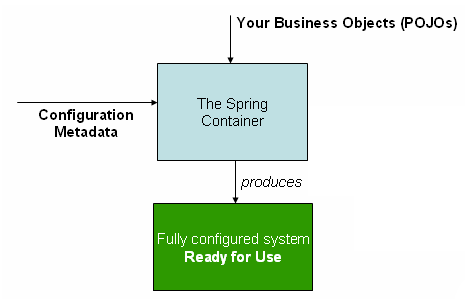
  - 采用XML方式配置Bean的时候，Bean的定义信息和实现是分离的
  - 采用注解的方式可以把Bean的定义和实现合并，Bean的定义信息直接以注解的形式定义在实现类中，从而达到了零配置的目的。
- Spring实现控制反转：通过描述(XML、注解)并且通过第三方去生产(获取)特定对象的方式。
  - Spring实现IoC的是：IoC容器
  - 实现方法是：依赖注入(Dependency Injection)

## 4. Hello Spring

- 创建实体类

  - ```java
    package com.king;
    
    public class Hello {
        private String name;
    
        public String getName() {
            return name;
        }
        public void setName(String name) {
            this.name = name;
        }
    
        public void show(){
            System.out.println("Hello,"+ name );
        }
    }
    ```

- 编写Spring文件

  - ```xml
    <?xml version="1.0" encoding="UTF-8"?>
    <beans xmlns="http://www.springframework.org/schema/beans"
           xmlns:xsi="http://www.w3.org/2001/XMLSchema-instance"
           xsi:schemaLocation="http://www.springframework.org/schema/beans
            https://www.springframework.org/schema/beans/spring-beans.xsd">
    	<!--
    	id=“hello” class=".."等同于程序中的 Hello hello = new Hello()
    	property类似与使用hello.set去设置方法
    	-->
        <bean id="hello" class="com.king.Hello">
            <property name="name" value="hello spring"/>
        </bean>
    
    </beans>
    ```

- 测试

  - ```java
    package com.king;
    
    import org.springframework.context.ApplicationContext;
    import org.springframework.context.support.ClassPathXmlApplicationContext;
    
    public class hellotest {
        public static void main(String[] args) {
            // 解析beans.xml文件，生成管理对应的Bean对象
            ApplicationContext context = new ClassPathXmlApplicationContext("beans.xml");
    
            // 从Spring容器中获取xml希望创建的对象
            Hello hello = (Hello) context.getBean("hello");
            hello.show();
        }
    }
    
    ```

- 问题？

  - Hello对象是谁创建的？
  - Hello对象的属性是怎么设置的？

- 解答：

  - Hello hello对象是由Spring容器创建的
  - hello对象的属性是由Spring容器设置的

- 以上的过程就可以称为：控制反转：

  - 控制：谁来控制对象的创建，
    - 传统应用程序的对象由程序本身来控制创建
    - 使用Spring后，对象的创建是由Spring创建
  - 反转：程序本身不创建对象，而变成被动的接收对象

- 依赖注入：利用set方法进行数据的注入，或者对象的注入

- IoC：由主动的创建变为被动的接收

### 4.1 重新解决2.1传统MVC的实现

- 配置Spring的配置文件，让Spring管理对象

```java
<?xml version="1.0" encoding="UTF-8"?>
<beans xmlns="http://www.springframework.org/schema/beans"
       xmlns:xsi="http://www.w3.org/2001/XMLSchema-instance"
       xsi:schemaLocation="http://www.springframework.org/schema/beans
        https://www.springframework.org/schema/beans/spring-beans.xsd">

    <bean id="MysqlImpl" class="com.king.dao.UserDaoMySqlImpl"></bean>
    <bean id="DefaultImpl" class="com.king.dao.UserDaoImpl"></bean>

    <bean id="ServiceImpl" class="com.king.service.UserServiceImpl">
<!--
        因为此时name="userDao"不是基本数据类型，而是一个对象引用，因此使用ref
        引用另一个bean，使用ref
        value：直接赋值，基本数据类型
-->
        <property name="userDao" ref="DefaultImpl"></property>
    </bean>

</beans>
```

- 测试：

```java
public class mytestspring {
    public static void main(String[] args) {
        ApplicationContext context = new ClassPathXmlApplicationContext("beans.xml");

        UserService serviceImpl = (UserServiceImpl)context.getBean("ServiceImpl");
        // 如果要修改底层的DaoImpl，在Spring 的beans.xml配置文件即可！
        serviceImpl.getUserService();

    }
}

```

- 此时，如果要修改ServiceImpl中调用什么服务实现的DaoImpl。无需对代码进行任何改动，只需要在xml配置文件中进行修改
- IoC：对象由Spring来创建、管理、装配！

## 5. IoC创建对象的方式

- 对象的创建都分为：
  - 无参构造器构造
  - 有参构造器构造
- 同样的IoC也提供了这两种不同方式的对象创建

### 5.1 无参构造

- ```java
  // 实体类
  public class User {
  
     private String name;
  
     public User() {
         System.out.println("user无参构造方法");
    }
  
     public void setName(String name) {
         this.name = name;
    }
  
     public void show(){
         System.out.println("name="+ name );
    }
  
  }
  ```

- ```xml
  // beans.xml文件
  <?xml version="1.0" encoding="UTF-8"?>
  <beans xmlns="http://www.springframework.org/schema/beans"
        xmlns:xsi="http://www.w3.org/2001/XMLSchema-instance"
        xsi:schemaLocation="http://www.springframework.org/schema/beans
         http://www.springframework.org/schema/beans/spring-beans.xsd">
  
     <bean id="user" class="com.kuang.pojo.User">
     </bean>
  
  </beans>
  ```

- ```java
  @Test
  public void test(){
     ApplicationContext context = new ClassPathXmlApplicationContext("beans.xml");
     //在执行getBean的时候, user已经创建好了 , 通过无参构造
     User user = (User) context.getBean("user");
     //调用对象的方法 .
     user.show();
  }
  ```

### 5.2 有参构造

- ```xml
  <!-- 第一种根据index参数下标设置 -->
  <bean id="userT" class="com.kuang.pojo.UserT">
     <!-- index指构造方法的参数 , 下标从0开始 -->
     <constructor-arg index="0" value="kuangshen2"/>
  </bean>
  ```

- ```xml
  <!-- 第二种根据参数名字设置 -->
  <bean id="userT" class="com.kuang.pojo.UserT">
     <!-- name指参数名 -->
     <constructor-arg name="name" value="kuangshen2"/>
  </bean>
  ```

- ```xml
  <!-- 第三种根据参数类型设置 -->
  <bean id="userT" class="com.kuang.pojo.UserT">
     <constructor-arg type="java.lang.String" value="kuangshen2"/>
  </bean>
  ```

- ```java
  @Test
  public void testT(){
     ApplicationContext context = new ClassPathXmlApplicationContext("beans.xml");
     UserT user = (UserT) context.getBean("userT");
     user.show();
  }
  ```

- 小结：

  - 一般都采用第二种：指定参数名的方式进行构造
  - 第三种：如果构造函数中存在多种相同的数据类型，可能会出错

## 6. Spring配置

- 详细解读Spring xml文件可以配置的节点

> alias：为bean设置别名，可以设置多个别名
>
> - 一般无用，因为bean里面也可以设置别名！

```xml
<!--设置别名：在获取Bean的时候可以使用别名获取-->
<alias name="userT" alias="userNew"/>
```

> bean：创建对象
>
> - 最常用和重要的节点

```xml
<!--bean就是java对象,由Spring创建和管理-->

<!--
   id 是bean的标识符,要唯一,如果没有配置id,name就是默认标识符
   如果配置id,又配置了name,那么name是别名
   name可以设置多个别名,可以用逗号,分号,空格隔开
   如果不配置id和name,可以根据applicationContext.getBean(.class)获取对象;

class是bean的全限定名=包名+类名
-->
<bean id="hello" name="hello2 h2,h3;h4" class="com.kuang.pojo.Hello">
   <property name="name" value="Spring"/>
</bean>
```

> import：导入不同的xml文件
>
> - 团队开发使用，可以导入不同的bean的xml

```xml
<import resource="{path}/beans.xml"/>
```

## 7. DI-bean节点详解

- DI：Dependency Injection：依赖注入

- 什么是依赖注入？

  - 依赖：bean对象的创建依赖于容器(Spring IoC容器)
  - 注入：bean对象种的所有属性，可以由容器注入

- 怎么依赖注入？

  - xml的bean节点的使用
  - 之前已经知道如何使用bean进行构建无参、有参对象，现在的问题就是如何设置属性的问题了！

- 依赖注入的前提：

  - 实体类至少需要实现set方法：
  - set方法的方法名由set + 属性首字母大写 , 如果属性是boolean类型 , 没有set方法 , 是 is .

- 代码实例

- ```java
  // Address自定义实体类
  public class Address {
   
       private String address;
   
       public String getAddress() {
           return address;
      }
   
       public void setAddress(String address) {
           this.address = address;
      }
   }
  
  public class Student {
   
       private String name;
       private Address address;
       private String[] books;
       private List<String> hobbys;
       private Map<String,String> card;
       private Set<String> games;
       private String wife;
       private Properties info;
   
       public void setName(String name) {
           this.name = name;
      }
   
       public void setAddress(Address address) {
           this.address = address;
      }
   
       public void setBooks(String[] books) {
           this.books = books;
      }
   
       public void setHobbys(List<String> hobbys) {
           this.hobbys = hobbys;
      }
   
       public void setCard(Map<String, String> card) {
           this.card = card;
      }
   
       public void setGames(Set<String> games) {
           this.games = games;
      }
   
       public void setWife(String wife) {
           this.wife = wife;
      }
   
       public void setInfo(Properties info) {
           this.info = info;
      }
   
       public void show(){
           System.out.println("name="+ name
                   + ",address="+ address.getAddress()
                   + ",books="
          );
           for (String book:books){
               System.out.print("<<"+book+">>\t");
          }
           System.out.println("\n爱好:"+hobbys);
   
           System.out.println("card:"+card);
   
           System.out.println("games:"+games);
   
           System.out.println("wife:"+wife);
   
           System.out.println("info:"+info);
   
      }
   }
  ```

- ```xml
  <?xml version="1.0" encoding="UTF-8"?>
  <beans xmlns="http://www.springframework.org/schema/beans"
         xmlns:xsi="http://www.w3.org/2001/XMLSchema-instance"
         xsi:schemaLocation="http://www.springframework.org/schema/beans
          https://www.springframework.org/schema/beans/spring-beans.xsd">
  	<!--
  	1. 基本数据类型注入
  	-->
       <bean id="student" class="com.kuang.pojo.Student">
           <property name="name" value="小明"/>
       </bean>
      <!--
  	2. 引用数据类型注入
  	-->
      <bean id="addr" class="com.kuang.pojo.Address">
      	 <property name="address" value="重庆"/>
  	 </bean>
       <bean id="student" class="com.kuang.pojo.Student">
           <property name="name" value="小明"/>
           <property name="address" ref="addr"/>
  	 </bean>
      <!--
  	3. 数组数据类型注入
  	4. List数据类型注入
  	5. map数据类型注入
  	6. set数据类型注入
  	7. Null注入
  	8.Properties类型注入
  	-->
       <bean id="student" class="com.kuang.pojo.Student">
           <property name="name" value="小明"/>
           <property name="address" ref="addr"/>
           <property name="books">
               <array>
                   <value>西游记</value>
                   <value>红楼梦</value>
                   <value>水浒传</value>
               </array>
       	</property>
           <property name="hobbys">
               <list>
                   <value>听歌</value>
                   <value>看电影</value>
                   <value>爬山</value>
               </list>
  	 	</property>
            <property name="card">
               <map>
                   <entry key="中国邮政" value="456456456465456"/>
                   <entry key="建设" value="1456682255511"/>
               </map>
           </property>
            <property name="games">
               <set>
                   <value>LOL</value>
                   <value>BOB</value>
                   <value>COC</value>
               </set>
           </property>
           <property name="wife"><null/></property>
           <property name="info">
               <props>
                   <prop key="学号">20190604</prop>
                   <prop key="性别">男</prop>
                   <prop key="姓名">小明</prop>
               </props>
           </property>
  	 </bean>
  </beans>
  ```

- 其他注入方式：

  - p命名：加入约束=》可以使用p命名空间来注入属性properties
  - c命名：加入约束=》可以使用c命名空间来注入构造器参数constructor

- 代码实例

- ```xml
  导入约束 : xmlns:p="http://www.springframework.org/schema/p"
   
   <!--P(属性: properties)命名空间 , 属性依然要设置set方法-->
   <bean id="user" class="com.kuang.pojo.User" p:name="狂神" p:age="18"/>
  
   导入约束 : xmlns:c="http://www.springframework.org/schema/c"
   <!--C(构造: Constructor)命名空间 , 属性依然要设置set方法-->
   <bean id="user" class="com.kuang.pojo.User" c:name="狂神" c:age="18"/>
  ```

- bean的scope

  - 在Spring中，那些组成应用程序的主体及由Spring IoC容器所管理的对象，被称之为bean。简单地讲，bean就是由IoC容器初始化、装配及管理的对象 .
  - 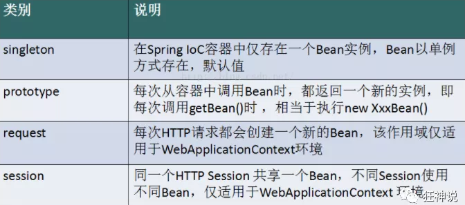

- Singleton：

  - 当一个bean的作用域为Singleton，那么Spring IoC容器中只会存在一个共享的bean实例，并且所有对bean的请求，只要id与该bean定义相匹配，则只会返回bean的同一实例。Singleton是单例类型，就是在创建起容器时就同时自动创建了一个bean的对象，不管你是否使用，他都存在了，每次获取到的对象都是同一个对象。

  - 注意，Singleton作用域是Spring中的缺省作用域。要在XML中将bean定义成singleton，可以这样配置：

  - ```xml
     <bean id="ServiceImpl" class="cn.csdn.service.ServiceImpl" scope="singleton">
    ```

-  Prototype

  - 当一个bean的作用域为Prototype，表示一个bean定义对应多个对象实例。Prototype作用域的bean会导致在每次对该bean请求（将其注入到另一个bean中，或者以程序的方式调用容器的getBean()方法）时都会创建一个新的bean实例。

  - Prototype是原型类型，它在我们创建容器的时候并没有实例化，而是当我们获取bean的时候才会去创建一个对象，而且我们每次获取到的对象都不是同一个对象。

  - 根据经验，对有状态的bean应该使用prototype作用域，而对无状态的bean则应该使用singleton作用域。在XML中将bean定义成prototype，可以这样配置：

  - ```xml
     <bean id="account" class="com.foo.DefaultAccount" scope="prototype"/>  
      或者
     <bean id="account" class="com.foo.DefaultAccount" singleton="false"/> 
    ```

- 其余两个Request和Session在学SpringMVC时再续！

## 8. 自动装配对象

- 在之前已经可以通过xml配置文件的方式使Spring自动构建对象、注入数据等操作，可以更加方便呢？？？
- Spring中bean有三种装配机制：
  - 在xml中显式配置；
  - 在java中显式配置；
  - 隐式的bean发现机制和自动装配。
- 自动装配：就是期望spring能够在应用上下文中为某个bean寻址其依赖的bean,自动完成装配
- Spring的自动装配实现：
  - 组件扫描(component scanning)：spring会自动发现应用上下文中所创建的bean；
  - 自动装配(autowiring)：spring自动满足bean之间的依赖，也就是我们说的IoC/DI
- 优点：
  - 由于在手动配置xml过程中，常常发生字母缺漏和大小写等错误，而无法对其进行检查，使得开发效率降低。采用自动装配将避免这些错误，并且使配置简单化

### 8.1 xml自动装配

- 代码示例

- 常规方法：

- ```java
  public class Cat {
     public void shout() {
         System.out.println("miao~");
    }
  }
  
  public class Dog {
     public void shout() {
         System.out.println("wang~");
    }
  }
  
  public class User {
     private Cat cat;
     private Dog dog;
     private String str;
  }
  ```

- ```xml
  <?xml version="1.0" encoding="UTF-8"?>
  <beans xmlns="http://www.springframework.org/schema/beans"
        xmlns:xsi="http://www.w3.org/2001/XMLSchema-instance"
        xsi:schemaLocation="http://www.springframework.org/schema/beans
         http://www.springframework.org/schema/beans/spring-beans.xsd">
  
     <bean id="dog" class="com.kuang.pojo.Dog"/>
     <bean id="cat" class="com.kuang.pojo.Cat"/>
  
     <bean id="user" class="com.kuang.pojo.User">
         <property name="cat" ref="cat"/>
         <property name="dog" ref="dog"/>
         <property name="str" value="qinjiang"/>
     </bean>
  </beans>
  ```

- ```java
  public class MyTest {
     @Test
     public void testMethodAutowire() {
         ApplicationContext context = new ClassPathXmlApplicationContext("beans.xml");
         User user = (User) context.getBean("user");
         user.getCat().shout();
         user.getDog().shout();
    }
  }
  ```

- 按属性名称自动装配：

- ```xml
  <?xml version="1.0" encoding="UTF-8"?>
  <beans xmlns="http://www.springframework.org/schema/beans"
        xmlns:xsi="http://www.w3.org/2001/XMLSchema-instance"
        xsi:schemaLocation="http://www.springframework.org/schema/beans
         http://www.springframework.org/schema/beans/spring-beans.xsd">
  
     <bean id="dog" class="com.kuang.pojo.Dog"/>
     <bean id="cat" class="com.kuang.pojo.Cat"/>
  
      <bean id="user" class="com.kuang.pojo.User" autowire="byName">
         <property name="str" value="qinjiang"/>
      </bean>
  </beans>
  ```

- 结果：

  - 修改bean配置，增加一个属性  autowire="byName"
  - 再次测试，结果依旧成功输出！
  - 将 cat 的bean id修改为 catXXX
  - 再次测试， 执行时报空指针java.lang.NullPointerException。因为按byName规则找不对应set方法，真正的setCat就没执行，对象就没有初始化，所以调用时就会报空指针错误。

- 小结：当一个bean节点带有 autowire byName的属性时。

  - 将查找其类中所有的set方法名，例如setCat，获得将set去掉并且首字母小写的字符串，即cat。
  - 去spring容器中寻找是否有此字符串名称id的对象。
  - 如果有，就取出注入；如果没有，就报空指针异常。

- 按类型自动装配：

- ```xml
  <?xml version="1.0" encoding="UTF-8"?>
  <beans xmlns="http://www.springframework.org/schema/beans"
        xmlns:xsi="http://www.w3.org/2001/XMLSchema-instance"
        xsi:schemaLocation="http://www.springframework.org/schema/beans
         http://www.springframework.org/schema/beans/spring-beans.xsd">
  
     <bean id="dog" class="com.kuang.pojo.Dog"/>
     <bean id="cat" class="com.kuang.pojo.Cat"/>
  
      <bean id="user" class="com.kuang.pojo.User" autowire="byType">
         <property name="str" value="qinjiang"/>
      </bean>
  </beans>
  ```

- 结果：

  - 将user的bean配置修改一下 ： autowire="byType"
  - 测试，正常输出
  - 再注册一个cat2 的bean对象=》id不同，class相同的bean即可
  - 测试，报错：NoUniqueBeanDefinitionException
  - 删掉cat2，然后将cat的bean名称改掉！测试！
  - 因为是按类型装配，所以并不会报异常，也不影响最后的结果。甚至将id属性去掉，也不影响结果。

- 小结：当一个bean节点带有 autowire byType的属性时

  - 需要保证：同一类型的对象，在spring容器中唯一。如果不唯一，会报不唯一的异常。
  - 是根据类型进行自动查找、装配、注入对象

### 8.2 注解自动装配

- dk1.5开始支持注解，spring2.5开始全面支持注解。

- 需要先在spring xml文件中引入context文件头，并且开启属性注解支持

- ```xml
  
  
  <?xml version="1.0" encoding="UTF-8"?>
  <beans xmlns="http://www.springframework.org/schema/beans"
      xmlns:xsi="http://www.w3.org/2001/XMLSchema-instance"
      xmlns:context="http://www.springframework.org/schema/context"
      xsi:schemaLocation="http://www.springframework.org/schema/beans
          https://www.springframework.org/schema/beans/spring-beans.xsd
          http://www.springframework.org/schema/context
          https://www.springframework.org/schema/context/spring-context.xsd">
  
      <context:annotation-config/>
  
  </beans>
  
  
  ```

#### 8.2.1 @Autowired

- @Autowired是按类型自动装配的，不支持id匹配

  - 也就是类似于：xml自动装配的autowire="byType"

- 需要导入 spring-aop的包！

- 代码示例

- ```java
  public class User {
     //如果允许对象为null，设置required = false,默认为true
  	@Autowired(required = false)
     private Cat cat;
     @Autowired
     private Dog dog;
     private String str;
  
     public Cat getCat() {
         return cat;
    }
     public Dog getDog() {
         return dog;
    }
     public String getStr() {
         return str;
    }
  }
  ```

- ```java
  <context:annotation-config/>
  
  <bean id="dog" class="com.kuang.pojo.Dog"/>
  <bean id="cat" class="com.kuang.pojo.Cat"/>
  <bean id="user" class="com.kuang.pojo.User"/>
  ```

- @Qualifier

  - @Autowired是根据类型自动装配的，加上@Qualifier则可以根据byName的方式自动装配
  - @Qualifier不能单独使用！

- 代码示例

- ```xml
  <bean id="dog1" class="com.kuang.pojo.Dog"/>
  <bean id="dog2" class="com.kuang.pojo.Dog"/>
  <bean id="cat1" class="com.kuang.pojo.Cat"/>
  <bean id="cat2" class="com.kuang.pojo.Cat"/>
  ```

- 此时如果只使用@Autowired，则会直接报错，因为Autowired是通过类型来自动装配的，当bean里面有多个相同类型的对象时，就会报错！

- 在实体类中加上@Qualifier注解

- ```java
  @Autowired
  @Qualifier(value = "cat2")
  private Cat cat;
  @Autowired
  @Qualifier(value = "dog2")
  private Dog dog;
  ```

- 测试成功输出

#### 8.2.2 @Resource

- @Resource如有指定的name属性，先按该属性进行byName方式查找装配；

- 其次再进行默认的byName方式进行装配；

- 如果以上都不成功，则按byType的方式自动装配。

- 都不成功，则报异常。

- 代码示例

- ```java
  public class User {
     //如果允许对象为null，设置required = false,默认为true
     @Resource(name = "cat2")
     private Cat cat;
     @Resource
     private Dog dog;
     private String str;
  }
  ```

- ```xml
  <bean id="dog" class="com.kuang.pojo.Dog"/>
  <bean id="cat1" class="com.kuang.pojo.Cat"/>
  <bean id="cat2" class="com.kuang.pojo.Cat"/>
  
  <bean id="user" class="com.kuang.pojo.User"/>
  ```

- 测试结果正常

- 此时删除id='cat2'的bean，实体类只保留原始的@Resource

  - ```xml
    <bean id="dog" class="com.kuang.pojo.Dog"/>
    <bean id="cat1" class="com.kuang.pojo.Cat"/>
    ```

  - ```xml
    @Resource
    private Cat cat;
    @Resource
    private Dog dog;
    ```

- 测试结果仍然正常

- 小结：

  - 先进行byName(默认)查找，失败；再进行byType查找，成功。

#### 8.2.3 异同

- @Autowired与@Resource都可以用来装配bean。都可以写在字段上，或写在setter方法上。
- @Autowired默认按类型装配（属于spring规范），默认情况下必须要求依赖对象必须存在，如果要允许null 值，可以设置它的required属性为false，如：@Autowired(required=false) ，如果我们想使用名称装配可以结合@Qualifier注解进行使用
- @Resource（属于J2EE复返），默认按照名称进行装配，名称可以通过name属性进行指定。如果没有指定name属性，当注解写在字段上时，默认取字段名进行按照名称查找，如果注解写在setter方法上默认取属性名进行装配。当找不到与名称匹配的bean时才按照类型进行装配。但是需要注意的是，如果name属性一旦指定，就只会按照名称进行装配。
- 它们的作用相同都是用注解方式注入对象，但执行顺序不同。@Autowired先byType，@Resource先byName。

## 9. 使用注解开发

- 在之前的学习中：

  - IoC思想控制对象创建、管理、
  - xml配置文件实现：对象的创建、属性的注入、对象的自动装配、属性的注入
  - 使用注解实现：xml中已经存在的bean对象注入到实体类中的引用数据类型中
    - @Autowired
    - @Resource

- 存在的问题：

  - 还是要在xml中使用bean节点进行bean的注入，太麻烦了
  - 并且如何将属性注入值？

- 使用注解：可以解决以上问题

- 环境准备：

  - 在spring4之后，想要使用注解形式，必须得要引入aop的包
  - 在配置文件当中，还得要引入一个context约束

- ```xml
  <?xml version="1.0" encoding="UTF-8"?>
  <beans xmlns="http://www.springframework.org/schema/beans"
        xmlns:xsi="http://www.w3.org/2001/XMLSchema-instance"
        xmlns:context="http://www.springframework.org/schema/context"
        xsi:schemaLocation="http://www.springframework.org/schema/beans
         http://www.springframework.org/schema/beans/spring-beans.xsd
         http://www.springframework.org/schema/context
         http://www.springframework.org/schema/context/spring-context.xsd">
  	<!--指定注解扫描包-->
  	<context:component-scan base-package="com.kuang.pojo"/>
  <!--
      作用：
      进行注解驱动注册，从而使注解生效
      用于激活那些已经在spring容器里注册过的bean上面的注解，也就是显式的向Spring注册
      如果不扫描包，就需要手动配置bean
      如果不加注解驱动，则注入的值为null！
  -->
      <context:annotation-config/> 
      
  </beans>
  ```

- 代码示例：

> 对象装配=》@Component取代<bean>节点

- ```java
  @Component("user")
  // 相当于配置文件中 <bean id="user" class="当前注解的类"/>
  public class User {
     public String name = "秦疆";
  }
  ```

- ```java
  @Test
  public void test(){
     ApplicationContext applicationContext =
         new ClassPathXmlApplicationContext("beans.xml");
     User user = (User) applicationContext.getBean("user");
     System.out.println(user.name);
  }
  ```

> 属性注入=》@Value取代<bead><property name="xxx" value="xxx">

- ```java
  @Component("user")
  // 相当于配置文件中 <bean id="user" class="当前注解的类"/>
  public class User {
     @Value("秦疆")
     // 相当于配置文件中 <property name="name" value="秦疆"/>
     public String name;
  }
  ```

- ```java
  @Component("user")
  public class User {
  
     public String name;
     // 如果提供了set方法，在set方法上添加@value("值");
     @Value("秦疆")
     public void setName(String name) {
         this.name = name;
    }
  }
  ```

> 衍生注解：
>
> - **@Component三个衍生注解**：为了更好的进行分层，Spring可以使用其它三个注解，功能一样，目前使用哪一个功能都一样。
>   - @Controller：web层
>   - @Service：service层
>   - @Repository：dao层

> 作用域设置=》@scope等同于<bean scope="xxx">
>
> - singleton：默认的，Spring会采用单例模式创建这个对象。关闭工厂 ，所有的对象都会销毁。
> - prototype：多例模式。关闭工厂 ，所有的对象不会销毁。内部的垃圾回收机制会回收

- ```java
  @Controller("user")
  @Scope("prototype")
  public class User {
     @Value("秦疆")
     public String name;
  }
  ```

- 小结：

  - @Component等同于@Controller等同于@Service等同于@Respository
    - 作用：取代xml文件中的<bean>节点的配置
  - @Value：
    - 作用：取代xml文件中的<bean>节点的属性设置
  - @scope：
    - 作用：取代xml文件中的<bean scope>节点作用域的设置

- **XML与注解比较**

  - XML可以适用任何场景 ，结构清晰，维护方便
  - 注解不是自己提供的类使用不了，开发简单方便

- **xml与注解整合开发** ：推荐最佳实践

  - xml管理Bean
  - 注解完成属性注入
  - 使用过程中， 可以不用扫描，扫描是为了类上的注解

### 9.1 基于Java类进行配置

- JavaConfig 原来是 Spring 的一个子项目，它通过 Java 类的方式提供 Bean 的定义信息，在 Spring4 的版本， JavaConfig 已正式成为 Spring4 的核心功能 。

- 代码示例：

- ```java
  // 编写一个实体类，Dog
  @Component  //将这个类标注为Spring的一个组件，放到容器中！
  // 这个会显式的扫描com.xx.xx下的@Component ，所以无需在Config中显式注册
  // 相当于<context:component-scan base-package="com.xx.xx"/>
  public class Dog {
     public String name = "dog";
  }
  ```

- ```java
  // 新建一个config配置包，编写一个MyConfig配置类
  @Configuration  //代表这是一个配置类
  public class MyConfig {
  
     @Bean //通过方法注册一个bean，这里的返回值就Bean的类型，方法名就是bean的id！
     public Dog dog(){
         return new Dog(name="xxx");
    }
    /* @Bean相当于如下的xml配置
        <bean id="dog" class="com.xx.xx">
            <property name="name" value="xxx"/>
        </bean>
       */
  
  }
  ```

- ```java
  @Test
  public void test2(){
     ApplicationContext applicationContext =
             new AnnotationConfigApplicationContext(MyConfig.class);
     Dog dog = (Dog) applicationContext.getBean("dog");
     System.out.println(dog.name);
  }
  ```

- 导入其他的java配置类

- ```java
  @Configuration  //代表这是一个配置类
  public class MyConfig2 {
  }
  ```

- ```java
  @Configuration
  @Import(MyConfig2.class)  //导入合并其他配置类，类似于配置文件中的 inculde 标签
  public class MyConfig {
  
     @Bean
     public Dog dog(){
         return new Dog();
    }
  
  }
  ```

## 10. 代理模式

- 为什么要学习代理模式？
  - Spring AOP的底层
- 代理模式的分类：
  - 静态代理
  - 动态代理

- 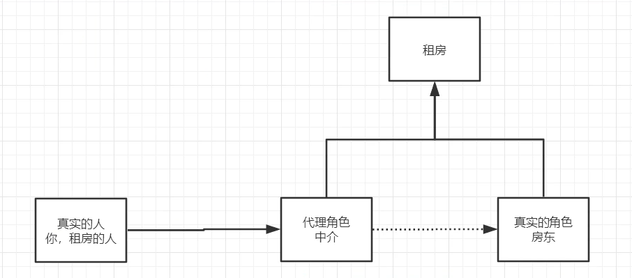

### 10.1 静态代理

- 角色分析：

  - 抽象角色：一般会使用接口或者抽象类来实现
  - 真实角色：被代理的角色
  - 代理角色：代理真实角色，处理一些附属操作
  - 客户：访问代理对象的角色

- 实现步骤：

  - 接口
  - 真实角色
  - 代理角色
  - 客户端访问代理角色

- 代码示例

- ```java
  package demo1;
  
  public interface Rent {
      public void rent();
  }
  
  package demo1;
  
  // 房东要出租房子
  public class Host implements Rent{
      public void rent() {
          System.out.println("房东要出租房子了！");
      }
  }
  
  package demo1;
  
  // 代理
  public class Proxy implements Rent{
      private Host host;
  
      public Proxy(Host host) {
          this.host = host;
      }
  
      public Proxy() {
      }
  
      // 代理帮房东出租房子
      public void rent() {
          fare();
          seeHouse();
          host.rent();
      }
  
      public void seeHouse(){
          System.out.println("中介带你去看房");
      }
      public void fare(){
          System.out.println("中介收你中介费");
      }
  }
  
  package demo1;
  
  // 客人想要租房
  public class Clien {
      public static void main(String[] args) {
          // 最早：直接找房东
          Host host = new Host();
          host.rent();
          // 使用代理进行：代理可以帮房东做一些其他工作：看房，交中介费
          Proxy proxy = new Proxy(host);
          proxy.rent();
      }
  }
  
  ```

- 优点：

  - 可以使真实角色的操作更加纯粹，不用去关注一些公共的业务
  - 公共业务交给代理角色去执行，实现业务的分工
  - 公共业务发生拓展时，方便集中管理=》在不改变原有代码的情况下提供一些新的公共业务

- 缺点：

  - 一个真实角色就会产生一个代理角色，多个真实角色就需要多个代理角色，代码量翻倍，开发效率更低

- 代码示例2：

- ```java
  package demo2;
  
  public interface UserService {
      public void add();
      public void delete();
      public void update();
      public void query();
  }
  
  package demo2;
  
  public class UserServiceImpl implements UserService{
      public void add() {
          System.out.println("新增数据");
      }
  
      public void delete() {
          System.out.println("删除数据");
      }
  
      public void update() {
          System.out.println("更新数据");
      }
  
      public void query() {
          System.out.println("查询数据");
      }
  }
  
  package demo2;
  
  public class Proxy implements UserService{
      private UserServiceImpl userService;
  
      public Proxy() {
      }
  
      public Proxy(UserServiceImpl userService) {
          this.userService = userService;
      }
  
      public void setUserService(UserServiceImpl userService) {
          this.userService = userService;
      }
      public void log(String msg){
          System.out.println("[Log] : 调用了"+msg+"方法");
      }
      public void add() {
          log("add");
          userService.add();
      }
  
      public void delete() {
          log("delete");
          userService.delete();
      }
  
      public void update() {
          log("update");
          userService.update();
      }
  
      public void query() {
          log("query");
          userService.query();
      }
  }
  
  package demo2;
  
  public class Client {
      public static void main(String[] args) {
          // 以前的控制层的实现
          UserServiceImpl userService = new UserServiceImpl();
          userService.add();
          // 如果此时需要统计调用了什么方法的日志信息，如何实现？
          // 法一：在UserServiceImpl中的每个方法添加语句=》不行！改变了原有的业务代码。要是其他的ServiceImpl还是使用这种方法？太繁琐了！
          // 法二：静态代理！用代理去完成这些公共的额外操作
          Proxy proxy = new Proxy(userService);
          proxy.add();
      }
  }
  
  ```

- 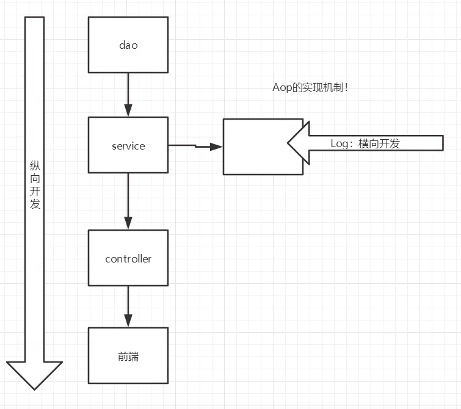

### 10.2 动态代理

- 静态代理的问题：

  - 一个真实角色就会产生一个代理角色，多个真实角色就需要多个代理角色，代码量翻倍，开发效率更低

- 动态代理：角色和静态代理一样

  - 但是代理类是可以动态生成的，而不是像静态代理那样需要set指定的真实角色

- 动态代理分类：

  - 基于接口的动态代理：JDK动态代理
  - 基于类的动态代理：cglib、java字节码实现：javasist

- 需要了解两个类：反射包下面的：建议百度可能更好一点

  - Proxy：代理类
  - InvocationHandler：调用处理程序接口

- 代码示例：

- ```java
  package demo3;
  
  public interface Rent {
      public void rent();
  }
  
  package demo3;
  
  // 房东要出租房子
  public class Host implements Rent {
      public void rent() {
          System.out.println("房东要出租房子了！");
      }
  }
  
  
  package demo3;
  
  import java.lang.reflect.InvocationHandler;
  import java.lang.reflect.Method;
  import java.lang.reflect.Proxy;
  
  // 使用这个类来：自动生成代理类
  public class ProxyInvocationHandler implements InvocationHandler {
      // 被代理的接口
  
      private Rent rent;
      public void setRent(Rent rent){
          this.rent=rent;
      }
  
      // 生成以获得代理类
      public Object getProxy(){
  //        loader: 用哪个类加载器去加载代理对象
  //        interfaces:动态代理类需要实现的接口
  //        h:动态代理方法在执行时，会调用h里面的invoke方法去执行
          return Proxy.newProxyInstance(this.getClass().getClassLoader(), rent.getClass().getInterfaces(),this);
      }
  
  //    proxy：就是代理对象，newProxyInstance方法的返回对象
  //    method：调用的方法
  //    args: 方法中的参数
      public Object invoke(Object proxy, Method method, Object[] args) throws Throwable {
          seeHouse();
          // 动态代理的本质：使用反射机制实现
          Object result = method.invoke(rent, args);
          fare();
          return result;
      }
  
      public void seeHouse(){
          System.out.println("中介带看房子");
      }
      public void fare(){
          System.out.println("收中介费");
      }
  }
  
  package demo3;
  
  public class Client {
      public static void main(String[] args) {
          // 真实角色
          Host host = new Host();
          // 代理角色：现在没有！
          ProxyInvocationHandler pxi = new ProxyInvocationHandler();
          // 通过调用程序处理角色来处理我们需要调用的接口对象
          pxi.setRent(host);
          //动态生成一个代理类
          Rent proxy = (Rent) pxi.getProxy();
          proxy.rent();
  
      }
  }
  
  ```

- 代码示例2

- ```java
  package demo4;
  
  public interface UserService {
      public void add();
      public void delete();
      public void update();
      public void query();
  }
  
  package demo4;
  
  public class UserServiceImpl implements UserService {
      public void add() {
          System.out.println("新增数据");
      }
  
      public void delete() {
          System.out.println("删除数据");
      }
  
      public void update() {
          System.out.println("更新数据");
      }
  
      public void query() {
          System.out.println("查询数据");
      }
  }
  
  
  package demo4;
  
  import demo2.Proxy;
  
  public class Client {
      public static void main(String[] args) {
          // 以前的控制层的实现
          UserServiceImpl userService = new UserServiceImpl();
          userService.add();
          // 如果此时需要统计调用了什么方法的日志信息，如何实现？
          // 法一：在UserServiceImpl中的每个方法添加语句=》不行！改变了原有的业务代码。要是其他的ServiceImpl还是使用这种方法？太繁琐了！
          // 法二：静态代理！用代理去完成这些公共的额外操作
  //        Proxy proxy = new Proxy(userService);
  //        proxy.add();
  
          // 使用动态代理的方式创建代理
          ProxyInvocationHandler pih = new ProxyInvocationHandler();
          pih.setTarget(userService);
          // 使用invocationHadnler生成一个动态代理类
          UserService proxy = (UserService)pih.getProxy();
          proxy.add();
      }
  }
  
  ```

- 优点：

  - 可以使真实角色的操作更加纯粹，不用去关注一些公共的业务
  - 公共业务交给代理角色去执行，实现业务的分工
  - 公共业务发生拓展时，方便集中管理=》在不改变原有代码的情况下提供一些新的公共业务
  - 一个动态代理类代理的是一个接口，一般就是对应的一类任务
  - 一个动态代理类可以代理实现了同一接口的多个类

## 11. AOP

- 什么是AOP？：Aspect Oriented Programming

  - 面向切面编程，通过预编译方式和运行期动态代理的方式实现程序功能的统一维护的一种技术
  - 是OOP的延续，是Spring框架中的一个重要内容，是函数式编程的一种衍生泛型

- AOP的好处？

  - 可以对业务逻辑的各个部分进行隔离，从而使业务逻辑各个部分之间的耦合度降低，提高程序的可用性和开发效率

- 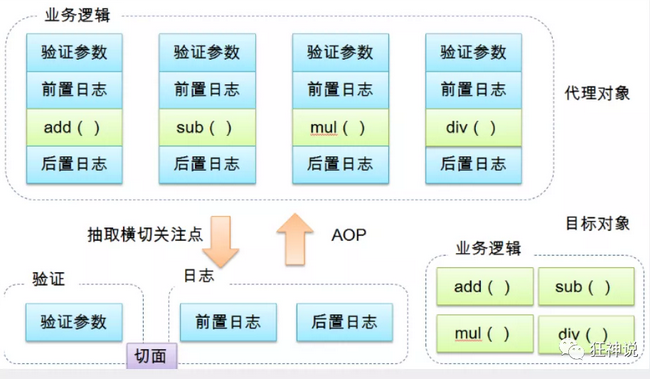

- AOP在Spring中的作用：

  - **提供声明式事务；允许用户自定义切面**

- 相关名词：看图对应比较好

  - 横切关注点：
    - 跨越应用程序多个模块的方法或功能。
    - 即是，与我们业务逻辑无关的，但是我们需要关注的部分，就是横切关注点。如日志 , 安全 , 缓存 , 事务等等 ....
  - 切面：ASPECT
    - 横切关注点 被模块化 的特殊对象。即，它是一个类。
  - 通知：Advice
    - 切面必须要完成的工作。即，它是类中的一个方法。
  - 目标：Target
    - 被通知对象。
  - 代理：Proxy
    - 向 **目标对象**  应用**通知**之后创建的对象。
  - 切入点：PointCut
    - **切面通知** 执行的 “地点”的定义。
  - 连接点：JointPoint
    - 与**切入点**匹配的执行点

- 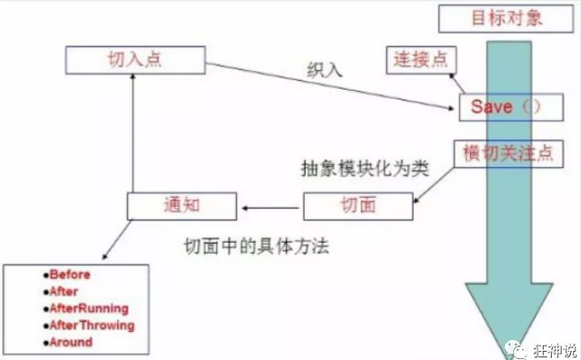

- SpringAOP中，通过Advice定义横切逻辑，Spring中支持5种类型的Advice：

  - 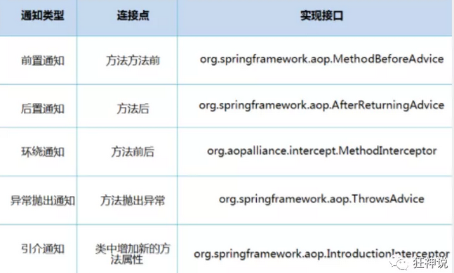

- AOP作用：

  - 在不改变原来代码的情况下，去增加新的功能

- Spring中使用AOP：

  - 使用AOP，要导入一个依赖包：

  - ```xml
    <!-- https://mvnrepository.com/artifact/org.aspectj/aspectjweaver -->
    <dependency>
       <groupId>org.aspectj</groupId>
       <artifactId>aspectjweaver</artifactId>
       <version>1.9.4</version>
    </dependency>
    ```

### 11.1 Spring API实现AOP

- 步骤：

  - 接口
  - 实现类
  - 实现Spring API接口
  - Spring xml中注册：实现aop配置：切入点，通知(横切逻辑)

- ```java
  public interface UserService {
  
     public void add();
  
     public void delete();
  
     public void update();
  
     public void search();
  
  }
  ```

- ```java
  public class UserServiceImpl implements UserService{
  
     @Override
     public void add() {
         System.out.println("增加用户");
    }
  
     @Override
     public void delete() {
         System.out.println("删除用户");
    }
  
     @Override
     public void update() {
         System.out.println("更新用户");
    }
  
     @Override
     public void search() {
         System.out.println("查询用户");
    }
  }
  ```

- ```java
  public class Log implements MethodBeforeAdvice {
  
     //method : 要执行的目标对象的方法
     //objects : 被调用的方法的参数
     //Object : 目标对象
     @Override
     public void before(Method method, Object[] objects, Object o) throws Throwable {
         System.out.println( o.getClass().getName() + "的" + method.getName() + "方法被执行了");
    }
  }
  
  public class AfterLog implements AfterReturningAdvice {
     //returnValue 返回值
     //method被调用的方法
     //args 被调用的方法的对象的参数
     //target 被调用的目标对象
     @Override
     public void afterReturning(Object returnValue, Method method, Object[] args, Object target) throws Throwable {
         System.out.println("执行了" + target.getClass().getName()
         +"的"+method.getName()+"方法,"
         +"返回值："+returnValue);
    }
  }
  ```

- ```xml
  <?xml version="1.0" encoding="UTF-8"?>
  <beans xmlns="http://www.springframework.org/schema/beans"
        xmlns:xsi="http://www.w3.org/2001/XMLSchema-instance"
        xmlns:aop="http://www.springframework.org/schema/aop"
        xsi:schemaLocation="http://www.springframework.org/schema/beans
         http://www.springframework.org/schema/beans/spring-beans.xsd
         http://www.springframework.org/schema/aop
         http://www.springframework.org/schema/aop/spring-aop.xsd">
  <!--上面记得导入aop约束：xmlns:aop....-->
     <!--注册bean-->
     <bean id="userService" class="com.kuang.service.UserServiceImpl"/>
     <bean id="log" class="com.kuang.log.Log"/>
     <bean id="afterLog" class="com.kuang.log.AfterLog"/>
  
     <!--aop的配置-->
     <aop:config>
         <!--切入点 expression:表达式匹配要执行的方法-->
         <aop:pointcut id="pointcut" expression="execution(* com.kuang.service.UserServiceImpl.*(..))"/>
         <!--执行环绕; advice-ref执行方法 . pointcut-ref切入点-->
         <aop:advisor advice-ref="log" pointcut-ref="pointcut"/>
         <aop:advisor advice-ref="afterLog" pointcut-ref="pointcut"/>
     </aop:config>
  
  </beans>
  ```

- ```java
  public class MyTest {
     @Test
     public void test(){
         ApplicationContext context = new ClassPathXmlApplicationContext("beans.xml");
         UserService userService = (UserService) context.getBean("userService");
         userService.search();
    }
  }
  ```

- Spring的Aop就是将公共的业务 (日志 , 安全等) 和领域业务结合起来 , 当执行领域业务时 , 将会把公共业务加进来 . 实现公共业务的重复利用 . 领域业务更纯粹 , 程序猿专注领域业务 , 其本质还是动态代理 . 

### 11.2 自定义类实现AOP

- 步骤：

  - 自定义切入类
  - Spring xml配置：注册bean(切面)、切入点、通知(横切逻辑)

- ```java
  public class DiyPointcut {
  
     public void before(){
         System.out.println("---------方法执行前---------");
    }
     public void after(){
         System.out.println("---------方法执行后---------");
    }
     
  }
  ```

- ```xml
  <!--第二种方式自定义实现-->
  <!--注册bean-->
  <bean id="diy" class="com.kuang.config.DiyPointcut"/>
  
  <!--aop的配置-->
  <aop:config>
     <!--第二种方式：使用AOP的标签实现-->
     <aop:aspect ref="diy">
         <aop:pointcut id="diyPonitcut" expression="execution(* com.kuang.service.UserServiceImpl.*(..))"/>
         <aop:before pointcut-ref="diyPonitcut" method="before"/>
         <aop:after pointcut-ref="diyPonitcut" method="after"/>
     </aop:aspect>
  </aop:config>
  ```

- ```java
  public class MyTest {
     @Test
     public void test(){
         ApplicationContext context = new ClassPathXmlApplicationContext("beans.xml");
         UserService userService = (UserService) context.getBean("userService");
         userService.add();
    }
  }
  ```

### 11.3 注解实现AOP

- 步骤：

  - 注解实现一个切入类：实现一个增强类(横切逻辑)
  - Spring xml中注册bean，并且自己支持注解配置

- ```java
  package com.kuang.config;
  
  import org.aspectj.lang.ProceedingJoinPoint;
  import org.aspectj.lang.annotation.After;
  import org.aspectj.lang.annotation.Around;
  import org.aspectj.lang.annotation.Aspect;
  import org.aspectj.lang.annotation.Before;
  
  @Aspect
  public class AnnotationPointcut {
     @Before("execution(* com.kuang.service.UserServiceImpl.*(..))")
     public void before(){
         System.out.println("---------方法执行前---------");
    }
  
     @After("execution(* com.kuang.service.UserServiceImpl.*(..))")
     public void after(){
         System.out.println("---------方法执行后---------");
    }
  
     @Around("execution(* com.kuang.service.UserServiceImpl.*(..))")
     public void around(ProceedingJoinPoint jp) throws Throwable {
         System.out.println("环绕前");
         System.out.println("签名:"+jp.getSignature());
         //执行目标方法proceed
         Object proceed = jp.proceed();
         System.out.println("环绕后");
         System.out.println(proceed);
    }
  }
  ```

- ```xml
  <!--第三种方式:注解实现-->
  <bean id="annotationPointcut" class="com.kuang.config.AnnotationPointcut"/>
  <aop:aspectj-autoproxy/>
  <!--
  通过aop命名空间的<aop:aspectj-autoproxy />声明自动为spring容器中那些配置@aspectJ切面的bean创建代理，织入切面。当然，spring 在内部依旧采用AnnotationAwareAspectJAutoProxyCreator进行自动代理的创建工作，但具体实现的细节已经被<aop:aspectj-autoproxy />隐藏起来了
  
  <aop:aspectj-autoproxy />有一个proxy-target-class属性，默认为false，表示使用jdk动态代理织入增强，当配为<aop:aspectj-autoproxy  poxy-target-class="true"/>时，表示使用CGLib动态代理技术织入增强。不过即使proxy-target-class设置为false，如果目标类没有声明接口，则spring将自动使用CGLib动态代理。
  -->
  ```


## 12. Spring+Mybatis

### 12.1 Mybatis

- MyBatis如何使用？

  - 实体类=》ORM=》POJO
  - mybatis配置文件=》配置数据库驱动、绑定Mapper
  - 定义实体类数据访问接口=》DAO
  - 实现DAO对应的Mapper.xml文件=》DaoImpl
  - 根据mybatis配置文件获取对应的sqlSession，并且获取对应Mapper，就可以调用对应的方法！

- ```java
  package com.king.pojo;
  
  
  public class User {
      private int id;  //id
      private String name;   //姓名
      private String pwd;   //密码
  }
  
  ```

- ```xml
  <?xml version="1.0" encoding="UTF8" ?>
  <!DOCTYPE configuration
          PUBLIC "-//mybatis.org//DTD Config 3.0//EN"
          "http://mybatis.org/dtd/mybatis-3-config.dtd">
  <configuration>
  
  <!--    自动给com.king.pojo中的bean设置一个别名，默认为类名，可以直接在mapper文件中使用-->
      <typeAliases>
          <package name="com.king.pojo"/>
      </typeAliases>
  
      <environments default="development">
          <environment id="development">
              <transactionManager type="JDBC"/>
              <dataSource type="POOLED">
                  <property name="driver" value="com.mysql.jdbc.Driver"/>
                  <property name="url" value="jdbc:mysql://localhost:3306/mybatis"/>
                  <property name="username" value="root"/>
                  <property name="password" value="123456"/>
              </dataSource>
          </environment>
      </environments>
  
      <mappers>
  <!--        采用报扫描注册：只要在com.king.dao中的UserMapper.java和UserMapper.xml同名即可-->
          <package name="com.king.dao"/>
  <!--        <mapper resource="com/king/dao/UserMapper.xml"></mapper>-->
      </mappers>
  
  
  </configuration>
  ```

- ```java
  package com.king.dao;
  
  import com.king.pojo.User;
  
  import java.util.List;
  
  public interface UserMapper {
      public List<User> selectUser();
  }
  
  ```

- ```xml
  <?xml version="1.0" encoding="UTF8" ?>
  <!DOCTYPE mapper
          PUBLIC "-//mybatis.org//DTD Mapper 3.0//EN"
          "http://mybatis.org/dtd/mybatis-3-mapper.dtd">
  <mapper namespace="com.king.dao.UserMapper">
  <!--    因为有了别名，直接使用User即可！-->
      <select id="selectUser" resultType="user">
          select * from user
      </select>
  
  </mapper>
  ```

- ```java
  package com.king.dao;
  
  import com.king.pojo.User;
  import org.apache.ibatis.io.Resources;
  import org.apache.ibatis.session.SqlSession;
  import org.apache.ibatis.session.SqlSessionFactory;
  import org.apache.ibatis.session.SqlSessionFactoryBuilder;
  import org.junit.Test;
  
  import java.io.IOException;
  import java.io.InputStream;
  import java.util.List;
  
  public class UserTest {
      @Test
      public void test1() throws IOException {
          String resource = "mybatis-config.xml";
          InputStream resourceAsStream = Resources.getResourceAsStream(resource);
          SqlSessionFactory build = new SqlSessionFactoryBuilder().build(resourceAsStream);
          SqlSession sqlSession = build.openSession();
          UserMapper mapper = sqlSession.getMapper(UserMapper.class);
          List<User> userList = mapper.selectUser();
          System.out.println(userList);
  
      }
  }
  
  ```

- 

### 12.2 Spring整合Mybatis-方式一

- 什么是mybatis-spring?

  - MyBatis-Spring 会帮助你将 MyBatis 代码无缝地整合到 Spring 中。
  - 去其官网查看对应的版本信息！

- 怎么使用mybatis-sprint?

  - 看以下代码即可

- 前提jar包

- ```xml
  <dependency>
     <groupId>junit</groupId>
     <artifactId>junit</artifactId>
     <version>4.12</version>
  </dependency>
  
  <dependency>
     <groupId>org.mybatis</groupId>
     <artifactId>mybatis</artifactId>
     <version>3.5.2</version>
  </dependency>
  
  <dependency>
     <groupId>mysql</groupId>
     <artifactId>mysql-connector-java</artifactId>
     <version>5.1.47</version>
  </dependency>
  
  <dependency>
     <groupId>org.springframework</groupId>
     <artifactId>spring-webmvc</artifactId>
     <version>5.1.10.RELEASE</version>
  </dependency>
  <dependency>
     <groupId>org.springframework</groupId>
     <artifactId>spring-jdbc</artifactId>
     <version>5.1.10.RELEASE</version>
  </dependency>
  
  <!-- https://mvnrepository.com/artifact/org.aspectj/aspectjweaver -->
  <dependency>
     <groupId>org.aspectj</groupId>
     <artifactId>aspectjweaver</artifactId>
     <version>1.9.4</version>
  </dependency>
  
  <dependency>
     <groupId>org.mybatis</groupId>
     <artifactId>mybatis-spring</artifactId>
     <version>2.0.2</version>
  </dependency>
  
  // 配置Maven静态资源过滤问题！
  
  <build>
     <resources>
         <resource>
             <directory>src/main/java</directory>
             <includes>
                 <include>**/*.properties</include>
                 <include>**/*.xml</include>
             </includes>
             <filtering>true</filtering>
         </resource>
     </resources>
  </build>
  ```

- 代码示例

  - 主要将mybatis-config.xml中的配置移到spring中的beans.xml中，
    - 并且在beans.xml中完成数据源、SqlSessionFactory、SqlSession的实例化，
    - 如果要使用还需要实现一个UserDaoImpl通过依赖注入的方式调用SqlSession.getMapper来使用对应的接口方法
  - 此时的mybatis-config.xml只需要专心设置一些基础配置即可，连注册mapper都交给spring来做都可以

- mybatis-config.xml文件

- ```xml
  <?xml version="1.0" encoding="UTF8" ?>
  <!DOCTYPE configuration
          PUBLIC "-//mybatis.org//DTD Config 3.0//EN"
          "http://mybatis.org/dtd/mybatis-3-config.dtd">
  <configuration>
  
  <!--    自动给com.king.pojo中的bean设置一个别名，默认为类名，可以直接在mapper文件中使用-->
      <typeAliases>
          <package name="com.king.pojo"/>
      </typeAliases>
  
  <!--    <environments default="development">-->
  <!--        <environment id="development">-->
  <!--            <transactionManager type="JDBC"/>-->
  <!--            <dataSource type="POOLED">-->
  <!--                <property name="driver" value="com.mysql.jdbc.Driver"/>-->
  <!--                <property name="url" value="jdbc:mysql://localhost:3306/mybatis"/>-->
  <!--                <property name="username" value="root"/>-->
  <!--                <property name="password" value="123456"/>-->
  <!--            </dataSource>-->
  <!--        </environment>-->
  <!--    </environments>-->
  
  <!--    <mappers>-->
  <!--&lt;!&ndash;        采用报扫描注册：只要在com.king.dao中的UserMapper.java和UserMapper.xml同名即可&ndash;&gt;-->
  <!--        <package name="com.king.dao"/>-->
  <!--&lt;!&ndash;        <mapper resource="com/king/dao/UserMapper.xml"></mapper>&ndash;&gt;-->
  <!--    </mappers>-->
  
  
  </configuration>
  ```

- beans.xml文件！重点！

- ```xml
  <?xml version="1.0" encoding="UTF-8"?>
  <beans xmlns="http://www.springframework.org/schema/beans"
         xmlns:xsi="http://www.w3.org/2001/XMLSchema-instance"
         xsi:schemaLocation="http://www.springframework.org/schema/beans
         http://www.springframework.org/schema/beans/spring-beans.xsd">
  
      <!--1.配置数据源：数据源有非常多，可以使用第三方的，也可使使用Spring的-->
  <!--    配置数据源代替 mybatis-config.xml里面的environments-->
      <bean id="dataSource" class="org.springframework.jdbc.datasource.DriverManagerDataSource">
          <property name="driverClassName" value="com.mysql.jdbc.Driver"/>
          <property name="url" value="jdbc:mysql://localhost:3306/mybatis?useSSL=false"/>
          <property name="username" value="root"/>
          <property name="password" value="123456"/>
      </bean>
  
  
  
      <!--2.配置SqlSessionFactory-->
      <!--    关联mybatis-config.xml和UserMapper.xml-->
      <bean id="sqlSessionFactory" class="org.mybatis.spring.SqlSessionFactoryBean">
          <property name="dataSource" ref="dataSource"/>
  <!--        关联Mybatis 此时mybatis-config.xml不能注册com/king/dao/下面的mapper,全部交给spring来做-->
          <property name="configLocation" value="classpath:mybatis-config.xml"/>
          <property name="mapperLocations" value="classpath*:com/king/dao/*.xml"/>
      </bean>
  
  <!--    3.构建获取SqlSession-->
      <!--注册sqlSessionTemplate , 关联sqlSessionFactory-->
  <!--    SqlSessionTemplate就等同于mybatis中的SqlSession-->
      <bean id="sqlSession" class="org.mybatis.spring.SqlSessionTemplate">
          <!--利用构造器注入-->
          <constructor-arg index="0" ref="sqlSessionFactory"/>
      </bean>
  
  <!--    4.实例化UserDaoImpl，就等同于之前Mybatis中的sqlSession.getMapper(UserMapper.class)!-->
      <bean id="userDao" class="com.king.dao.UserDaoImpl">
          <property name="sqlSession" ref="sqlSession"/>
      </bean>
  
  </beans>
  ```

- 真正使用UserDao

- ```java
  package com.king.dao;
  
  import com.king.pojo.User;
  import org.mybatis.spring.SqlSessionTemplate;
  
  import java.util.List;
  
  public class UserDaoImpl implements UserMapper {
  
      //sqlSession不用我们自己创建了，Spring来管理
      private SqlSessionTemplate sqlSession;
  
      public void setSqlSession(SqlSessionTemplate sqlSession) {
          this.sqlSession = sqlSession;
      }
  
      public List<User> selectUser() {
          UserMapper mapper = sqlSession.getMapper(UserMapper.class);
          return mapper.selectUser();
      }
  
  }
  ```

- ```java
  @Test
      public void test2(){
          ApplicationContext context = new ClassPathXmlApplicationContext("beans.xml");
          UserMapper mapper = (UserMapper) context.getBean("userDao");
          List<User> user = mapper.selectUser();
          System.out.println(user);
      }
  ```

- 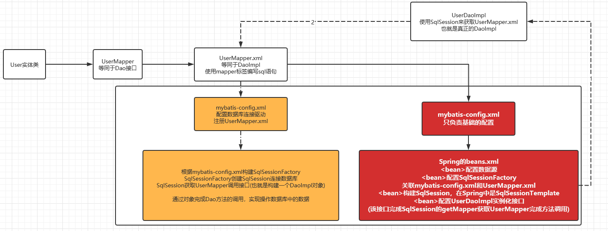

### 12.3 Spring整合Mybatis-方式二

- 方式一中：

  - UserDaoImpl需要获取SqlSessionTemplate，并且通过SqlSessionTemplate来进行getMapper()，调用相应的方法
  - 因此：需要在beans.xml中进行SqlSessionTemplate的注入

- 方式二：

  - UserDaoImpl继承SqlSessionDaoSupport，可以直接获取SqlSessionTemplate，不用再beans.xml中注入，
  - 因为继承的SqlSessioinDaoSupport的构造方法可以获取sqlSessionFactory，再通过sqlSessionFactory获取SqlSessionTemplate
  - 因此：需要再beans.xml中进行SqlSessionFactory的构造器注入！
  - 也就相当于在方式一的基础上加了一层，其实都差不多！

- 代码示例

- UserDaoImpl改为：

- ```java
  public class UserDaoImpl extends SqlSessionDaoSupport implements UserMapper {
     public List<User> selectUser() {
         UserMapper mapper = getSqlSession().getMapper(UserMapper.class);
         return mapper.selectUser();
    }
  }
  ```

- beans.xml中改为：

- ```xml
  <?xml version="1.0" encoding="UTF-8"?>
  <beans xmlns="http://www.springframework.org/schema/beans"
         xmlns:xsi="http://www.w3.org/2001/XMLSchema-instance"
         xsi:schemaLocation="http://www.springframework.org/schema/beans
         http://www.springframework.org/schema/beans/spring-beans.xsd">
  
      <!--1.配置数据源：数据源有非常多，可以使用第三方的，也可使使用Spring的-->
  <!--    配置数据源代替 mybatis-config.xml里面的environments-->
      <bean id="dataSource" class="org.springframework.jdbc.datasource.DriverManagerDataSource">
          <property name="driverClassName" value="com.mysql.jdbc.Driver"/>
          <property name="url" value="jdbc:mysql://localhost:3306/mybatis?useSSL=false"/>
          <property name="username" value="root"/>
          <property name="password" value="123456"/>
      </bean>
  
  
  
      <!--2.配置SqlSessionFactory-->
      <!--    关联mybatis-config.xml和UserMapper.xml-->
      <bean id="sqlSessionFactory" class="org.mybatis.spring.SqlSessionFactoryBean">
          <property name="dataSource" ref="dataSource"/>
  <!--        关联Mybatis 此时mybatis-config.xml不能注册com/king/dao/下面的mapper,全部交给spring来做-->
          <property name="configLocation" value="classpath:mybatis-config.xml"/>
          <property name="mapperLocations" value="classpath*:com/king/dao/*.xml"/>
      </bean>
  
  <!--&lt;!&ndash;    3.构建获取SqlSession&ndash;&gt;-->
  <!--    &lt;!&ndash;注册sqlSessionTemplate , 关联sqlSessionFactory&ndash;&gt;-->
  <!--&lt;!&ndash;    SqlSessionTemplate就等同于mybatis中的SqlSession&ndash;&gt;-->
  <!--    <bean id="sqlSession" class="org.mybatis.spring.SqlSessionTemplate">-->
  <!--        &lt;!&ndash;利用构造器注入&ndash;&gt;-->
  <!--        <constructor-arg index="0" ref="sqlSessionFactory"/>-->
  <!--    </bean>-->
  
  <!--&lt;!&ndash;    4.实例化UserDaoImpl，就等同于之前Mybatis中的sqlSession.getMapper(UserMapper.class)!&ndash;&gt;-->
  <!--    <bean id="userDao" class="com.king.dao.UserDaoImpl">-->
  <!--        <property name="sqlSession" ref="sqlSession"/>-->
  <!--    </bean>-->
      <bean id="userDao" class="com.king.dao.UserDaoImpl">
          <property name="sqlSessionFactory" ref="sqlSessionFactory" />
      </bean>
  
  </beans>
  ```

## 13. 声明式事务

- 什么是事务？

  - 事务就是把一系列的动作当成一个独立的工作单元，这些动作要么全部完成，要么全部不起作用。

- **事务四个属性ACID**

  1. 原子性（atomicity）

  2. - 事务是原子性操作，由一系列动作组成，事务的原子性确保动作要么全部完成，要么完全不起作用

  3. 一致性（consistency）

  4. - 一旦所有事务动作完成，事务就要被提交。数据和资源处于一种满足业务规则的一致性状态中

  5. 隔离性（isolation）

  6. - 可能多个事务会同时处理相同的数据，因此每个事务都应该与其他事务隔离开来，防止数据损坏

  7. 持久性（durability）

  8. - 事务一旦完成，无论系统发生什么错误，结果都不会受到影响。通常情况下，事务的结果被写到持久化存储器中

- 为什么要事务？举例：

  - 在之前的代码中的UserMapper中新定义两个：增加、删除(有误，会报错)用户的方法
  - 并且在selectUser中调用这两个方法
  - 在接口中实现UserMapper这些方法，并且调用selectUser!
  - 发现：在删除方法之前对数据库的修改会生效，之后就会报错！
  - 但是：selectUser应该是一个事务，要不全部成功，要不全部失败！

- 怎么办？

  - Spring AOP有用！！！

- 代码示例：

- ```java
  package com.king.dao;
  
  import com.king.pojo.User;
  
  import java.util.List;
  
  public interface UserMapper {
      public List<User> selectUser();
  
      //添加一个用户
      int addUser(User user);
  
      //根据id删除用户
      int deleteUser(int id);
  }
  
  ```

- ```java
  package com.king.dao;
  
  import com.king.pojo.User;
  import org.mybatis.spring.SqlSessionTemplate;
  import org.mybatis.spring.support.SqlSessionDaoSupport;
  
  import java.util.List;
  
  public class UserDaoImpl extends SqlSessionDaoSupport implements UserMapper {
      //增加一些操作
      public List<User> selectUser() {
          User user = new User(5,"小明","123456");
          UserMapper mapper = getSqlSession().getMapper(UserMapper.class);
          mapper.addUser(user);
          mapper.deleteUser(4);
          return mapper.selectUser();
      }
  
      //新增
      public int addUser(User user) {
          UserMapper mapper = getSqlSession().getMapper(UserMapper.class);
          return mapper.addUser(user);
      }
      //删除
      public int deleteUser(int id) {
          UserMapper mapper = getSqlSession().getMapper(UserMapper.class);
          return mapper.deleteUser(id);
      }
  
  }
  ```

- ```java
  @Test
  public void test2(){
     ApplicationContext context = new ClassPathXmlApplicationContext("beans.xml");
     UserMapper mapper = (UserMapper) context.getBean("userDao");
     List<User> user = mapper.selectUser();
     System.out.println(user);
  }
  ```

- 报错：sql异常，delete写错了

- 结果 ：插入成功！

- 没有进行事务的管理；我们想让他们都成功才成功，有一个失败，就都失败，我们就应该需要**事务！**

- 以前我们都需要自己手动管理事务，十分麻烦！

- 但是Spring给我们提供了事务管理，我们只需要配置即可

### 13.1 Spring的事务管理

- Spring在不同的事务管理API之上定义了一个抽象层，使得开发人员不必了解底层的事务管理API就可以使用Spring的事务管理机制。Spring支持编程式事务管理和声明式的事务管理。

- **编程式事务管理**

  - 将事务管理代码嵌到业务方法中来控制事务的提交和回滚
  - 缺点：必须在每个事务操作业务逻辑中包含额外的事务管理代码

- **声明式事务管理**
  - 一般情况下比编程式事务好用。
  - 将事务管理代码从业务方法中分离出来，以声明的方式来实现事务管理。
  - 将事务管理作为横切关注点，通过aop方法模块化。Spring中通过Spring AOP框架支持声明式事务管理。

- 使用：

- 代码示例：

- 1.在beans.xml中导入头文件的约束

- ```xml
  xmlns:tx="http://www.springframework.org/schema/tx"
  
  http://www.springframework.org/schema/tx
  http://www.springframework.org/schema/tx/spring-tx.xsd">
  ```

- 2.设置事务管理器

  - **事务管理器**

    - 无论使用Spring的哪种事务管理策略（编程式或者声明式）事务管理器都是必须的。
    - 就是 Spring的核心事务管理抽象，管理封装了一组独立于技术的方法。

  - ```xml
    // 使用jdbc的事务管理器
    <bean id="transactionManager" class="org.springframework.jdbc.datasource.DataSourceTransactionManager">
           <property name="dataSource" ref="dataSource" />
    </bean>
    ```

- 3.**配置好事务管理器后我们需要去配置事务的通知**

- ```java
  <!--配置事务通知-->
  <tx:advice id="txAdvice" transaction-manager="transactionManager">
     <tx:attributes>
         <!--配置哪些方法使用什么样的事务,配置事务的传播特性-->
         <tx:method name="add" propagation="REQUIRED"/>
         <tx:method name="delete" propagation="REQUIRED"/>
         <tx:method name="update" propagation="REQUIRED"/>
         <tx:method name="search*" propagation="REQUIRED"/>
         <tx:method name="get" read-only="true"/>
         <tx:method name="*" propagation="REQUIRED"/>
     </tx:attributes>
  </tx:advice>
  ```

- **spring事务传播特性：**

  事务传播行为就是多个事务方法相互调用时，事务如何在这些方法间传播。spring支持7种事务传播行为：

  - propagation_requierd：如果当前没有事务，就新建一个事务，如果已存在一个事务中，加入到这个事务中，这是最常见的选择。
  - propagation_supports：支持当前事务，如果没有当前事务，就以非事务方法执行。
  - propagation_mandatory：使用当前事务，如果没有当前事务，就抛出异常。
  - propagation_required_new：新建事务，如果当前存在事务，把当前事务挂起。
  - propagation_not_supported：以非事务方式执行操作，如果当前存在事务，就把当前事务挂起。
  - propagation_never：以非事务方式执行操作，如果当前事务存在则抛出异常。
  - propagation_nested：如果当前存在事务，则在嵌套事务内执行。如果当前没有事务，则执行与propagation_required类似的操作

- Spring 默认的事务传播行为是 PROPAGATION_REQUIRED，它适合于绝大多数的情况。

- 假设 ServiveX#methodX() 都工作在事务环境下（即都被 Spring 事务增强了），假设程序中存在如下的调用链：Service1#method1()->Service2#method2()->Service3#method3()，那么这 3 个服务类的 3 个方法通过 Spring 的事务传播机制都工作在同一个事务中。

- 就好比，我们刚才的几个方法存在调用，所以会被放在一组事务当中！

- 4.**配置AOP**

- ```xml
  <!--配置aop织入事务-->
  <aop:config>
     <aop:pointcut id="txPointcut" expression="execution(* com.king.dao.*.*(..))"/>
     <aop:advisor advice-ref="txAdvice" pointcut-ref="txPointcut"/>
  </aop:config>
  ```

- 5.测试：

- ```java
  @Test
  public void test2(){
     ApplicationContext context = new ClassPathXmlApplicationContext("beans.xml");
     UserMapper mapper = (UserMapper) context.getBean("userDao");
     List<User> user = mapper.selectUser();
     System.out.println(user);
  ```

- 完整beans.xml代码

- ```xml
  <?xml version="1.0" encoding="UTF-8"?>
  <beans xmlns="http://www.springframework.org/schema/beans"
         xmlns:aop="http://www.springframework.org/schema/aop" xmlns:tx="http://www.springframework.org/schema/tx"
         xmlns:xsi="http://www.w3.org/2001/XMLSchema-instance"
         xsi:schemaLocation="http://www.springframework.org/schema/beans http://www.springframework.org/schema/beans/spring-beans-4.2.xsd
         http://www.springframework.org/schema/aop http://www.springframework.org/schema/aop/spring-aop-4.2.xsd
      http://www.springframework.org/schema/tx http://www.springframework.org/schema/tx/spring-tx-4.2.xsd">
  
      <!--1.配置数据源：数据源有非常多，可以使用第三方的，也可使使用Spring的-->
  <!--    配置数据源代替 mybatis-config.xml里面的environments-->
      <bean id="dataSource" class="org.springframework.jdbc.datasource.DriverManagerDataSource">
          <property name="driverClassName" value="com.mysql.jdbc.Driver"/>
          <property name="url" value="jdbc:mysql://localhost:3306/mybatis?useSSL=false"/>
          <property name="username" value="root"/>
          <property name="password" value="123456"/>
      </bean>
  
  
  
      <!--2.配置SqlSessionFactory-->
      <!--    关联mybatis-config.xml和UserMapper.xml-->
      <bean id="sqlSessionFactory" class="org.mybatis.spring.SqlSessionFactoryBean">
          <property name="dataSource" ref="dataSource"/>
  <!--        关联Mybatis 此时mybatis-config.xml不能注册com/king/dao/下面的mapper,全部交给spring来做-->
          <property name="configLocation" value="classpath:mybatis-config.xml"/>
          <property name="mapperLocations" value="classpath*:com/king/dao/*.xml"/>
      </bean>
  
  <!--&lt;!&ndash;    3.构建获取SqlSession&ndash;&gt;-->
  <!--    &lt;!&ndash;注册sqlSessionTemplate , 关联sqlSessionFactory&ndash;&gt;-->
  <!--&lt;!&ndash;    SqlSessionTemplate就等同于mybatis中的SqlSession&ndash;&gt;-->
  <!--    <bean id="sqlSession" class="org.mybatis.spring.SqlSessionTemplate">-->
  <!--        &lt;!&ndash;利用构造器注入&ndash;&gt;-->
  <!--        <constructor-arg index="0" ref="sqlSessionFactory"/>-->
  <!--    </bean>-->
  
  <!--&lt;!&ndash;    4.实例化UserDaoImpl，就等同于之前Mybatis中的sqlSession.getMapper(UserMapper.class)!&ndash;&gt;-->
  <!--    <bean id="userDao" class="com.king.dao.UserDaoImpl">-->
  <!--        <property name="sqlSession" ref="sqlSession"/>-->
  <!--    </bean>-->
      <bean id="userDao" class="com.king.dao.UserDaoImpl">
          <property name="sqlSessionFactory" ref="sqlSessionFactory" />
      </bean>
  
  <!--1.JDBC事务-->
      <bean id="transactionManager" class="org.springframework.jdbc.datasource.DataSourceTransactionManager">
          <property name="dataSource" ref="dataSource" />
      </bean>
  
  <!--    2.配置好事务管理器后我们需要去配置事务的通知-->
      <!--配置事务通知-->
      <tx:advice id="txAdvice" transaction-manager="transactionManager">
          <tx:attributes>
              <!--配置哪些方法使用什么样的事务,配置事务的传播特性-->
              <tx:method name="add" propagation="REQUIRED"/>
              <tx:method name="delete" propagation="REQUIRED"/>
              <tx:method name="update" propagation="REQUIRED"/>
              <tx:method name="search*" propagation="REQUIRED"/>
              <tx:method name="get" read-only="true"/>
              <tx:method name="*" propagation="REQUIRED"/>
          </tx:attributes>
      </tx:advice>
  
  
  <!--    需要导入aop的头文件！-->
      <!--配置aop织入事务-->
      <aop:config>
          <aop:pointcut id="txPointcut" expression="execution(* com.king.dao.*.*(..))"/>
          <aop:advisor advice-ref="txAdvice" pointcut-ref="txPointcut"/>
      </aop:config>
  
  </beans>
  ```

- 