# SpringBoot基础

- 主要参考自：https://www.bilibili.com/video/BV1PE411i7CV?spm_id_from=333.999.0.0
- 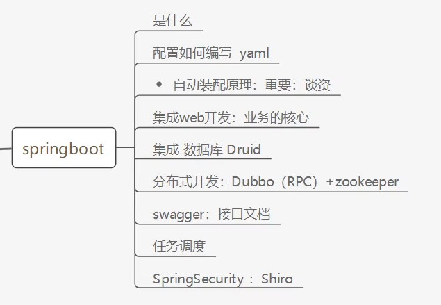
- 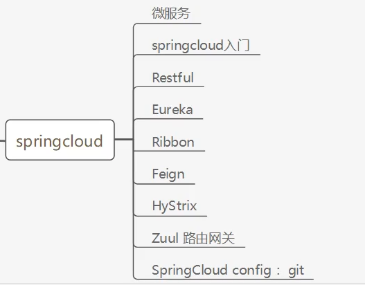
- 整理路线：
  - JavaSE：主要理解OOP思想
  - MySQL：用于持久化
  - HTML+CSS+JS+jQuery+框架：用于视图
  - JavaWeb：独立开发原始：MVC三层架构
  - SSM：框架简化开发流程、配置复杂=》war包+tomcat运行
  - SpringBoot：再简化SSM，配置简单=》jar包+内嵌tomcat=》微服务架构

## 1. 什么是微服务架构？

- 类似MVC三层架构、MVVM、微服务也是一种架构
- 业务＝》单独模块
- 什么是微服务？
  - 微服务是一种架构风格，它要求我们在开发一个应用的时候，这个应用必须构建成一系列小服务的组合;可以通过http的方式进行互通。要说微服务架构，先得说说过去我们的单体应用架构。
- 单体应用架构：
  - 所谓单休应用架构（all in one)是指，我们将一个应用的中的所有应用服务都封装在一个应用中。
    无论是ERP、CRM或是其他什么系统，你都把数据库访问,web访问，等等各个功能放到一个war包内。
  - 这样做的好处是：易于开发和测试;也十分方便部署;当需要扩展时，只需要将war复制多份，然后放到多个服务器上，再做个负载均衡就可以了。
  - 单体应用架构的缺点是：哪怕我要修改一个非常小的地方，我都需要停掉整个服务，重新打包、部署这个应用war包。特别是对于一个大型应用，我们不可能吧所有内容都放在一个应用里面，我们如何维护、如何分工合作都是问题。
- 微服务架构：
  - all in one的架构方式，我们把所有的功能单元放在一个应用里面。然后我们把整个应用部署到服务器上。如果负载能力不行，我们将整个应用进行水平复制，进行扩展，然后在负载均衡。
  - 所谓微服务架构，就是打破之前all in one的架构方式，把每个功能元素独立出来。把独立出来的功能元素的动态组合，需要的功能元素才去拿来组合，需要多一些时可以整合多个功能元素。所以微服务架构是对功能元素进行复制，而没有对整个应用进行复制。
  - 这样做的好处是:
    - 1.节省了调用资源。
    - 2.每个功能元素的服务都是一个可替换的、可独立升级的软件代码。
  - 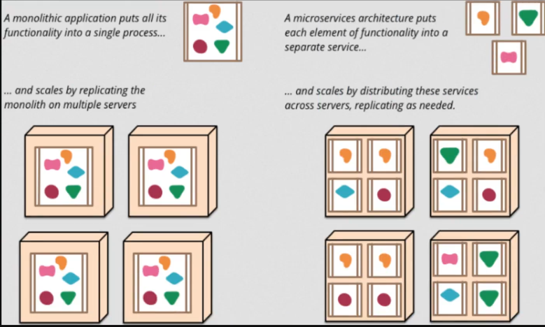
  - 原文地址:https://www.martinfowler.com/articles/microservices.html
  - 翻译:https://www.cnblogs.com/liuning8023/p/4493156.html
- 如何构建微服务？
  - 一个大型系统的微服务架构，就像一个复杂交织的神经网络，每一个神经元就是一个功能元素，它们各白完成自己的功能，然后通过http相互请求调用。比如一个电商系统，查缓存、连数据库、浏览页面、结账、支付等服务都是一个个独立的功能服务，都被微化了，它们作为一个个微服务共同构建了一个庞大的系统。如果修改其中的一个功能，只需要更新升级其中一个功能服务单元即可。
  - 但是这种庞大的系统架构给部署和运维带来被大的难度。于是, spring为我们带来了构建大型分布式微服务的全套、全程产品:
    - 构建一个个功能独立的微版务应用单元，可以使用springboot，可以帮我们快速构建一个应用;
    - 大型分布式网络服务的调用，这部分由spring cloud来完成，实现分布式
    - 在分布式中间，进行流式数据计算、批处理，我们有spring cloud data flow
    - spring为我们想清楚了整个从开始构建应用到大型分布式应用全流程方案。
  - 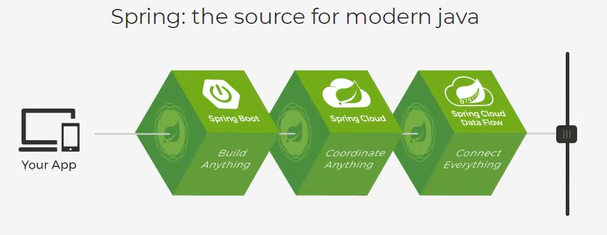

## 2.Hello SpringBoot

- 什么是Spring?
  - Spring是一个开源框架，2003 年兴起的一个轻量级的Java 开发框架，作者：Rod Johnson  
  - **Spring是为了解决企业级应用开发的复杂性而创建的，简化开发。**
- Spring如何简化Java开发？
  - 为了降低Java开发的复杂性，Spring采用了以下4种关键策略：
    - 1、基于POJO的轻量级和最小侵入性编程，所有东西都是bean；
    - 2、通过IOC，依赖注入（DI）和面向接口实现松耦合；
    - 3、基于切面（AOP）和惯例进行声明式编程；
    - 4、通过切面和模版减少样式代码，RedisTemplate，xxxTemplate；
  - 完成这些策略都需要Spring的配置文件来实现完成：beans.xml、xxxx
- 什么是SpringBoot？
  - 学过javaweb的同学就知道，开发一个web应用，从最初开始接触Servlet结合Tomcat, 跑出一个Hello Wolrld程序，是要经历特别多的步骤；后来就用了框架Struts，再后来是SpringMVC，到了现在的SpringBoot，过一两年又会有其他web框架出现；你们有经历过框架不断的演进，然后自己开发项目所有的技术也在不断的变化、改造吗？建议都可以去经历一遍；
  - 言归正传，什么是SpringBoot呢，就是一个javaweb的开发框架，和SpringMVC类似，对比其他javaweb框架的好处，官方说是简化开发，约定大于配置，  you can "just run"，能迅速的开发web应用，几行代码开发一个http接口。
  - 所有的技术框架的发展似乎都遵循了一条主线规律：从一个复杂应用场景 衍生 一种规范框架，人们只需要进行各种配置而不需要自己去实现它，这时候强大的配置功能成了优点；发展到一定程度之后，人们根据实际生产应用情况，选取其中实用功能和设计精华，重构出一些轻量级的框架；之后为了提高开发效率，嫌弃原先的各类配置过于麻烦，于是开始提倡“约定大于配置”，进而衍生出一些一站式的解决方案。
  - 是的这就是Java企业级应用->J2EE->spring->springboot的过程。
  - 随着 Spring 不断的发展，涉及的领域越来越多，项目整合开发需要配合各种各样的文件，慢慢变得不那么易用简单，违背了最初的理念，甚至人称配置地狱。Spring Boot 正是在这样的一个背景下被抽象出来的开发框架，目的为了让大家更容易的使用 Spring 、更容易的集成各种常用的中间件、开源软件；
  - Spring Boot 基于 Spring 开发，Spirng Boot 本身并不提供 Spring 框架的核心特性以及扩展功能，只是用于快速、敏捷地开发新一代基于 Spring 框架的应用程序。也就是说，它并不是用来替代 Spring 的解决方案，而是和 Spring 框架紧密结合用于提升 Spring 开发者体验的工具。Spring Boot 以**约定大于配置的核心思想**，默认帮我们进行了很多设置，多数 Spring Boot 应用只需要很少的 Spring 配置。同时它集成了大量常用的第三方库配置（例如 Redis、MongoDB、Jpa、RabbitMQ、Quartz 等等），Spring Boot 应用中这些第三方库几乎可以零配置的开箱即用。
  - 简单来说就是SpringBoot其实不是什么新的框架，它默认配置了很多框架的使用方式，就像maven整合了所有的jar包，spring boot整合了所有的框架 。
  - Spring Boot 出生名门，从一开始就站在一个比较高的起点，又经过这几年的发展，生态足够完善，Spring Boot 已经当之无愧成为 Java 领域最热门的技术。
- **Spring Boot的主要优点：**
  - 为所有Spring开发者更快的入门
  - **开箱即用**，提供各种默认配置来简化项目配置
  - 内嵌式容器简化Web项目
  - 没有冗余代码生成和XML配置的要求

### 2.1 代码示例

- 准备工作：

  - 将学习如何快速的创建一个Spring Boot应用，并且实现一个简单的Http请求处理。通过这个例子对Spring Boot有一个初步的了解，并体验其结构简单、开发快速的特性。
  - 环境准备：
    - java version "1.8.0_181"
    - Maven-3.6.1
    - SpringBoot 2.x 最新版
  - 开发工具：
    - IDEA

- **项目创建方式一：**使用Spring Initializr 的 Web页面创建项目

  - Spring官方提供了非常方便的工具让我们快速构建应用
  - Spring Initializr：https://start.spring.io/
  - 1、打开  https://start.spring.io/
  - 2、填写项目信息
  - 3、点击”Generate Project“按钮生成项目；下载此项目
  - 4、解压项目包，并用IDEA以Maven项目导入，一路下一步即可，直到项目导入完毕。
  - 5、如果是第一次使用，可能速度会比较慢，包比较多、需要耐心等待一切就绪。

- **项目创建方式二：**使用 IDEA 直接创建项目

  - 1、创建一个新项目
  - 2、选择spring initalizr ， 可以看到默认就是去官网的快速构建工具那里实现
  - 3、填写项目信息
  - 4、选择初始化的组件（初学勾选 Web 即可）
  - 5、填写项目路径
  - 6、等待项目构建成功

- **项目结构分析：**

  - 通过上面步骤完成了基础项目的创建。就会自动生成以下文件。
  - 1、程序的主启动类:xxxx.xxx.xxxAppliaction！
  - 2、一个 application.properties 配置文件
  - 3、一个 测试类
  - 4、一个 pom.xml

-  pom.xml 分析

  - 打开pom.xml，看看Spring Boot项目的依赖：

  - ```xml
    <!-- 父依赖 -->
    <parent>
        <groupId>org.springframework.boot</groupId>
        <artifactId>spring-boot-starter-parent</artifactId>
        <version>2.2.5.RELEASE</version>
        <relativePath/>
    </parent>
    
    <dependencies>
        <!-- web场景启动器 -->
        <dependency>
            <groupId>org.springframework.boot</groupId>
            <artifactId>spring-boot-starter-web</artifactId>
        </dependency>
        <!-- springboot单元测试 -->
        <dependency>
            <groupId>org.springframework.boot</groupId>
            <artifactId>spring-boot-starter-test</artifactId>
            <scope>test</scope>
            <!-- 剔除依赖 -->
            <exclusions>
                <exclusion>
                    <groupId>org.junit.vintage</groupId>
                    <artifactId>junit-vintage-engine</artifactId>
                </exclusion>
            </exclusions>
        </dependency>
    </dependencies>
    
    <build>
        <plugins>
            <!-- 打包插件 -->
            <plugin>
                <groupId>org.springframework.boot</groupId>
                <artifactId>spring-boot-maven-plugin</artifactId>
            </plugin>
        </plugins>
    </build>
    ```

-  编写一个http接口

  - 1、在主程序的同级目录下，新建一个controller包，一定要在同级目录下，否则识别不到

  - 2、在包中新建一个HelloController类

    - ```java
      @RestController
      public class HelloController {
          @RequestMapping("/hello")
          public String hello() {
              return "Hello World";
          }
          
      }
      ```

  - 3、编写完毕后，从主程序启动项目，浏览器发起请求，看页面返回；控制台输出了 Tomcat 访问的端口号！

    - 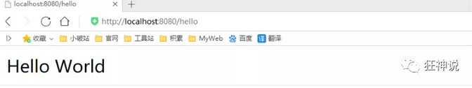

- 简单几步，就完成了一个web接口的开发，SpringBoot就是这么简单。所以我们常用它来建立我们的微服务项目！

### 2.2 项目打包

-  将项目打成jar包，点击 maven的 package

- 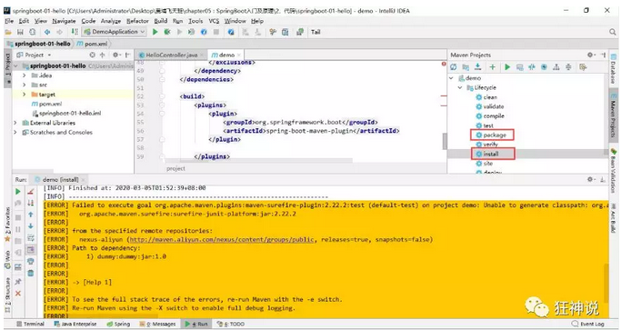

- 如果遇到以上错误，可以配置打包时 跳过项目运行测试用例，在pom.xlm中配置：

  - ```xml
    <!--
        在工作中,很多情况下我们打包是不想执行测试用例的
        可能是测试用例不完事,或是测试用例会影响数据库数据
        跳过测试用例执
        -->
    <plugin>
        <groupId>org.apache.maven.plugins</groupId>
        <artifactId>maven-surefire-plugin</artifactId>
        <configuration>
            <!--跳过项目运行测试用例-->
            <skipTests>true</skipTests>
        </configuration>
    </plugin>
    ```

- 如果打包成功，则会在target目录下生成一个 jar 包

- 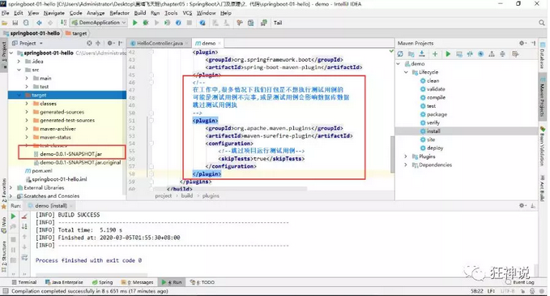

- 打成了jar包后，就可以在任何地方运行了！OK

  - java -jar xxx.jar即可

- 如何更改启动时显示的字符拼成的字母，SpringBoot呢？也就是 banner 图案；

  - 只需一步：到项目下的 resources 目录下新建一个banner.txt 即可。
  - 图案可以到：https://www.bootschool.net/ascii 这个网站生成，然后拷贝到文件中即可！

## 3. 运行原理初探

- SpringBoot的核心：简化配置！！！因此在后面肯定做了很多自动配置的事情

### 3.1 pom.xml

-  父依赖

  - 其中它主要是依赖一个父项目，主要是管理项目的资源过滤及插件！

  - ```xml
    <parent>
        <groupId>org.springframework.boot</groupId>
        <artifactId>spring-boot-starter-parent</artifactId>
        <version>2.2.5.RELEASE</version>
        <relativePath/> <!-- lookup parent from repository -->
    </parent>
    ```

  - 点进去，发现还有一个父依赖

  - ```xml
    <parent>
        <groupId>org.springframework.boot</groupId>
        <artifactId>spring-boot-dependencies</artifactId>
        <version>2.2.5.RELEASE</version>
        <relativePath>../../spring-boot-dependencies</relativePath>
    </parent>
    ```

  - 这里才是真正管理SpringBoot应用里面所有依赖版本的地方，SpringBoot的版本控制中心；

  - **因此我们导入依赖默认是不需要写版本；但是如果导入的包没有在依赖中管理着就需要手动配置版本了**

### 3.2 spring-boot-starter

- ```xml
  <dependency>
      <groupId>org.springframework.boot</groupId>
      <artifactId>spring-boot-starter-web</artifactId>
  </dependency>
  ```

- **springboot-boot-starter-xxx**：就是spring-boot的场景启动器

- **spring-boot-starter-web**：帮我们导入了web模块正常运行所依赖的组件；

- SpringBoot将所有的功能场景都抽取出来，做成一个个的starter （启动器），只需要在项目中引入这些starter即可，所有相关的依赖都会导入进来 ， 我们要用什么功能就导入什么样的场景启动器即可 ；我们未来也可以自己自定义 starter

### 3.3 主启动类-@SpringBootApplication

- 默认的主启动类

- ```java
  //@SpringBootApplication 来标注一个主程序类
  //说明这是一个Spring Boot应用
  @SpringBootApplication
  public class SpringbootApplication {
  
     public static void main(String[] args) {
       //以为是启动了一个方法，没想到启动了一个服务
        SpringApplication.run(SpringbootApplication.class, args);
     }
  
  }
  ```

- **一个简单的启动类并不简单！**我们来分析一下这些注解都干了什么

-  **@SpringBootApplication**

  - 作用：标注在某个类上说明这个类是SpringBoot的主配置类 ， SpringBoot就应该运行这个类的main方法来启动SpringBoot应用；

  - 进入这个注解：可以看到上面还有很多其他注解！

  - ```java
    @SpringBootConfiguration
    @EnableAutoConfiguration
    @ComponentScan(
        excludeFilters = {@Filter(
        type = FilterType.CUSTOM,
        classes = {TypeExcludeFilter.class}
    ), @Filter(
        type = FilterType.CUSTOM,
        classes = {AutoConfigurationExcludeFilter.class}
    )}
    )
    public @interface SpringBootApplication {
        // ......
    }
    ```

-  **@ComponentScan**

  - 这个注解在Spring中很重要 ,它对应XML配置中的元素。
  - 作用：自动扫描并加载符合条件的组件或者bean ， 将这个bean定义加载到IOC容器中

- **@SpringBootConfiguration**

  - 作用：SpringBoot的配置类 ，标注在某个类上 ， 表示这是一个SpringBoot的配置类；

  - 我们继续进去这个注解查看

  - ```java
    // 点进去得到下面的 @Component
    @Configuration
    public @interface SpringBootConfiguration {}
    
    @Component
    public @interface Configuration {}
    ```

  - 这里的 @Configuration，说明这是一个配置类 ，配置类就是对应Spring的xml 配置文件；

  - 里面的 @Component 这就说明，启动类本身也是Spring中的一个组件而已，负责启动应用！

- 我们回到 SpringBootApplication 注解中继续看。

- **@EnableAutoConfiguration**

  - **开启自动配置功能：**以前我们需要自己配置的东西，而现在SpringBoot可以自动帮我们配置 ；@EnableAutoConfiguration告诉SpringBoot开启自动配置功能，这样自动配置才能生效；

  - 点进注解接续查看：

  - **@AutoConfigurationPackage ：自动配置包**

  - ```xml
    @Import({Registrar.class})
    public @interface AutoConfigurationPackage {
    }
    ```

  - **@import** ：Spring底层注解@import ， 给容器中导入一个组件

  - Registrar.class 作用：将主启动类的所在包及包下面所有子包里面的所有组件扫描到Spring容器 ；

  - 这个分析完了，退到上一步，继续看

  - **@Import({AutoConfigurationImportSelector.class}) ：给容器导入组件 ；**

    - AutoConfigurationImportSelector ：自动配置导入选择器，那么它会导入哪些组件的选择器呢？我们点击去这个类看源码：

    - 1、这个类中有一个这样的方法

    - ```java
      // 获得候选的配置
      protected List<String> getCandidateConfigurations(AnnotationMetadata metadata, AnnotationAttributes attributes) {
          //这里的getSpringFactoriesLoaderFactoryClass（）方法
          //返回的就是我们最开始看的启动自动导入配置文件的注解类；EnableAutoConfiguration
          List<String> configurations = SpringFactoriesLoader.loadFactoryNames(this.getSpringFactoriesLoaderFactoryClass(), this.getBeanClassLoader());
          Assert.notEmpty(configurations, "No auto configuration classes found in META-INF/spring.factories. If you are using a custom packaging, make sure that file is correct.");
          return configurations;
      }
      ```

    - 2、这个方法又调用了  SpringFactoriesLoader 类的静态方法！我们进入SpringFactoriesLoader类loadFactoryNames() 方法

    - ```java
      public static List<String> loadFactoryNames(Class<?> factoryClass, @Nullable ClassLoader classLoader) {
          String factoryClassName = factoryClass.getName();
          //这里它又调用了 loadSpringFactories 方法
          return (List)loadSpringFactories(classLoader).getOrDefault(factoryClassName, Collections.emptyList());
      }
      ```

    - 3、我们继续点击查看 loadSpringFactories 方法

    - ```java
      private static Map<String, List<String>> loadSpringFactories(@Nullable ClassLoader classLoader) {
          //获得classLoader ， 我们返回可以看到这里得到的就是EnableAutoConfiguration标注的类本身
          MultiValueMap<String, String> result = (MultiValueMap)cache.get(classLoader);
          if (result != null) {
              return result;
          } else {
              try {
                  //去获取一个资源 "META-INF/spring.factories"
                  Enumeration<URL> urls = classLoader != null ? classLoader.getResources("META-INF/spring.factories") : ClassLoader.getSystemResources("META-INF/spring.factories");
                  LinkedMultiValueMap result = new LinkedMultiValueMap();
      
                  //将读取到的资源遍历，封装成为一个Properties
                  while(urls.hasMoreElements()) {
                      URL url = (URL)urls.nextElement();
                      UrlResource resource = new UrlResource(url);
                      Properties properties = PropertiesLoaderUtils.loadProperties(resource);
                      Iterator var6 = properties.entrySet().iterator();
      
                      while(var6.hasNext()) {
                          Entry<?, ?> entry = (Entry)var6.next();
                          String factoryClassName = ((String)entry.getKey()).trim();
                          String[] var9 = StringUtils.commaDelimitedListToStringArray((String)entry.getValue());
                          int var10 = var9.length;
      
                          for(int var11 = 0; var11 < var10; ++var11) {
                              String factoryName = var9[var11];
                              result.add(factoryClassName, factoryName.trim());
                          }
                      }
                  }
      
                  cache.put(classLoader, result);
                  return result;
              } catch (IOException var13) {
                  throw new IllegalArgumentException("Unable to load factories from location [META-INF/spring.factories]", var13);
              }
          }
      }
      ```

    - 4、发现一个多次出现的文件：spring.factories，全局搜索它

      - 我们根据源头打开spring.factories ， 看到了很多自动配置的文件；这就是自动配置根源所在！
      - 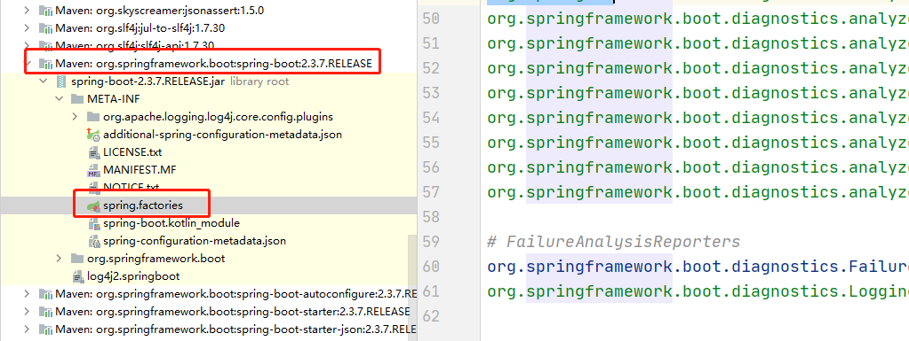

    - 我们在上面的自动配置类随便找一个打开看看，比如 ：WebMvcAutoConfiguration

    - 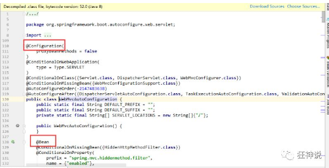

    - 可以看到这些一个个的都是JavaConfig配置类，而且都注入了一些Bean，可以找一些自己认识的类，看着熟悉一下！

    - 所以，自动配置真正实现是从classpath中搜寻所有的META-INF/spring.factories配置文件 ，并将其中对应的 org.springframework.boot.autoconfigure. 包下的配置项，通过反射实例化为对应标注了 @Configuration的JavaConfig形式的IOC容器配置类 ， 然后将这些都汇总成为一个实例并加载到IOC容器中。

- **结论：**

  1. SpringBoot在启动的时候从类路径下的META-INF/spring.factories中获取EnableAutoConfiguration指定的值
  2. 将这些值作为自动配置类导入容器 ， 自动配置类就生效 ， 帮我们进行自动配置工作；
  3. 整个J2EE的整体解决方案和自动配置都在springboot-autoconfigure的jar包中；
  4. 它会给容器中导入非常多的自动配置类 （xxxAutoConfiguration）, 就是给容器中导入这个场景需要的所有组件 ， 并配置好这些组件 ；
  5. 有了自动配置类 ， 免去了我们手动编写配置注入功能组件等的工作；

### 3.4 主启动类-run方法

- ```java
  @SpringBootApplication
  public class SpringbootApplication {
      public static void main(String[] args) {
          SpringApplication.run(SpringbootApplication.class, args);
      }
  }
  ```

- **SpringApplication**

  - **这个类主要做了以下四件事情：**

    - 1、推断应用的类型是普通的项目还是Web项目
    - 2、查找并加载所有可用初始化器 ， 设置到initializers属性中
    - 3、找出所有的应用程序监听器，设置到listeners属性中
    - 4、推断并设置main方法的定义类，找到运行的主类

  - ```java
    // SpringApplication构造器：
    public SpringApplication(ResourceLoader resourceLoader, Class... primarySources) {
        // ......
        this.webApplicationType = WebApplicationType.deduceFromClasspath();
        this.setInitializers(this.getSpringFactoriesInstances();
        this.setListeners(this.getSpringFactoriesInstances(ApplicationListener.class));
        this.mainApplicationClass = this.deduceMainApplicationClass();
    }
    ```

- **run方法执行流程**：

- 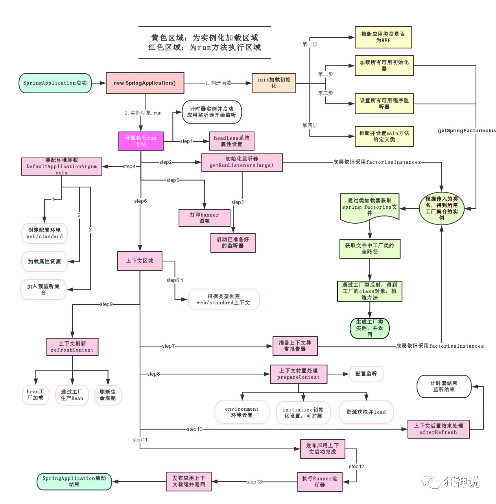

## 4. yaml配置

- SpringBoot的配置文件：

  - 使用一个全局的配置文件 ， 配置文件名称是固定的
    - application.properties
      - 语法结构 ：key=value
    - application.yml
      - 语法结构 ：key：空格 value

- 配置文件的作用？

  - 修改SpringBoot自动配置的默认值，因为SpringBoot在底层都给我们自动配置好了；

  - 比如我们可以在配置文件中修改Tomcat 默认启动的端口号！测试一下！

    - ```properties
      server.port=8081
      ```

- 什么是yaml？

  - YAML是 "YAML Ain't a Markup Language" （YAML不是一种标记语言）的递归缩写。在开发的这种语言时，YAML 的意思其实是："Yet Another Markup Language"（仍是一种标记语言）
  - **这种语言以数据作为中心，而不是以标记语言为重点！**

- 为什么需要yaml？

  - 以前的配置文件，大多数都是使用xml来配置；比如一个简单的端口配置，我们来对比下yaml和xml

  - 传统xml配置：

    - ```xml
      <server>
          <port>8081<port>
      </server>
      ```

  - yaml配置：

    - ```yaml
      server:
      	port: 8081
      ```

### 4.1 yaml基本语法

- 1、空格不能省略

- 2、以缩进来控制层级关系，只要是左边对齐的一列数据都是同一个层级的。

- 3、属性和值的大小写都是十分敏感的。

- **字面量：普通的值  [ 数字，布尔值，字符串  ]**

  - 字面量直接写在后面就可以 ， 字符串默认不用加上双引号或者单引号；

  - ```yaml
    k: v
    ```

  - 注意：

    - “ ” 双引号，不会转义字符串里面的特殊字符 ， 特殊字符会作为本身想表示的意思；
      - 比如 ：name: "kuang \n shen"  输出 ：kuang  换行  shen
    - '' 单引号，会转义特殊字符 ， 特殊字符最终会变成和普通字符一样输出
      - 比如 ：name: ‘kuang \n shen’  输出 ：kuang  \n  shen

- **对象、Map（键值对）**

  - ```yaml
    
    #对象、Map格式
    k: 
        v1:
        v2:
        
    student:
        name: qinjiang
        age: 3
    # 行内写法
    student: {name: qinjiang,age: 3}
    ```

- **数组（ List、set ）**

  - 用 - 值表示数组中的一个元素,比如：

  - ```yaml
    pets:
     - cat
     - dog
     - pig
    
    # 行内写法
    pets: [cat,dog,pig]
    ```

### 4.2 yaml注入实体类

- **yaml可以直接给实体类直接注入匹配值！**

- 1、在springboot项目中的resources目录下新建一个文件 application.yml

- 2、编写一个实体类 Dog；

- ```java
  package com.kuang.springboot.pojo;
  
  @Component  //注册bean到容器中
  public class Dog {
      private String name;
      private Integer age;
      
      //有参无参构造、get、set方法、toString()方法  
  }
  ```

- 3、对比原来是如何给bean注入属性值的！@Value，给狗狗类测试一下：

- ```java
  @Component //注册bean
  public class Dog {
      @Value("阿黄")
      private String name;
      @Value("18")
      private Integer age;
  }
  ```

- 4、在SpringBoot的测试类下注入狗狗输出一下；

- ```java
  @SpringBootTest
  class DemoApplicationTests {
  
      @Autowired //将狗狗自动注入进来
      Dog dog;
  
      @Test
      public void contextLoads() {
          System.out.println(dog); //打印看下狗狗对象
      }
  
  }
  ```

- 结果成功输出，@Value注入成功，这是原来的办法

- 5、再编写一个复杂一点的实体类：Person 类

- ```java
  @Component //注册bean到容器中
  public class Person {
      private String name;
      private Integer age;
      private Boolean happy;
      private Date birth;
      private Map<String,Object> maps;
      private List<Object> lists;
      private Dog dog;
      
      //有参无参构造、get、set方法、toString()方法  
  }
  ```

- 6、来使用yaml配置的方式进行注入，大家写的时候注意区别和优势，我们编写一个yaml配置！

- ```java
  person:
    name: qinjiang
    age: 3
    happy: false
    birth: 2000/01/01
    maps: {k1: v1,k2: v2}
    lists:
     - code
     - girl
     - music
    dog:
      name: 旺财
      age: 1
  ```

- 7、我们刚才已经把person这个对象的所有值都写好了，我们现在来注入到我们的类中！

- ```java
  /*
  @ConfigurationProperties作用：
  将配置文件中配置的每一个属性的值，映射到这个组件中；
  告诉SpringBoot将本类中的所有属性和配置文件中相关的配置进行绑定
  参数 prefix = “person” : 将配置文件中的person下面的所有属性一一对应
  */
  @Component //注册bean
  @ConfigurationProperties(prefix = "person")
  public class Person {
      private String name;
      private Integer age;
      private Boolean happy;
      private Date birth;
      private Map<String,Object> maps;
      private List<Object> lists;
      private Dog dog;
  }
  ```

- 8、IDEA 提示，springboot配置注解处理器没有找到，让我们看文档，我们可以查看文档，找到一个依赖！

- 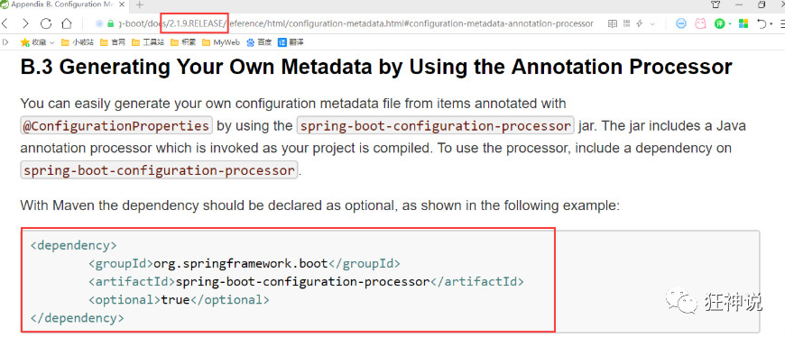

- ```java
  <!-- 导入配置文件处理器，配置文件进行绑定就会有提示，需要重启 -->
  <dependency>
    <groupId>org.springframework.boot</groupId>
    <artifactId>spring-boot-configuration-processor</artifactId>
    <optional>true</optional>
  </dependency>
  ```

- 9、确认以上配置都OK之后，我们去测试类中测试一下：

- ```java
  @SpringBootTest
  class DemoApplicationTests {
  
      @Autowired
      Person person; //将person自动注入进来
  
      @Test
      public void contextLoads() {
          System.out.println(person); //打印person信息
      }
  
  }
  ```

- 结果：所有值全部注入成功！

- 配置文件还可以编写占位符生成随机数

- ```yaml
  person:
      name: qinjiang${random.uuid} # 随机uuid
      age: ${random.int}  # 随机int
      happy: false
      birth: 2000/01/01
      maps: {k1: v1,k2: v2}
      lists:
        - code
        - girl
        - music
      dog:
        name: ${person.hello:other}_旺财
        age: 1
  ```

### 4.3加载指定配置文件

- **@PropertySource ：**加载指定的配置文件；并且需要使用@Value来注入值

- **@ConfigurationProperties**：默认从全局配置文件(application.xxx)中获取值；并且自动注入

- 1、我们去在resources目录下新建一个**person.properties**文件(yaml文件也是类似)

- ```yaml
  name=kuangshen
  ```

- 2、然后在我们的代码中指定加载person.properties文件(yaml文件也是类似)

- ```java
  @PropertySource(value = "classpath:person.properties")
  @Component //注册bean
  public class Person {
  
      @Value("${name}")
      private String name;
  
      ......  
  }
  ```

- 3、再次输出测试一下：指定配置文件绑定成功！

- 【注意】properties配置文件在写中文的时候，会有乱码 ， 我们需要去IDEA中设置编码格式为UTF-8；

  - settings-->FileEncodings 中配置；
  - 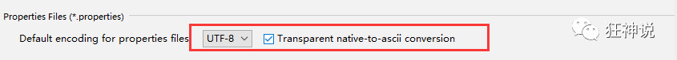

- 1、新建一个实体类User

- ```java
  @Component //注册bean
  public class User {
      private String name;
      private int age;
      private String sex;
  }
  ```

- 2、编辑配置文件 user.properties

- ```properties
  user1.name=kuangshen
  user1.age=18
  user1.sex=男
  ```

- 3、我们在User类上使用@Value来进行注入！

- ```java
  @Component //注册bean
  @PropertySource(value = "classpath:user.properties")
  public class User {
      //直接使用@value
      @Value("${user.name}") //从配置文件中取值
      private String name;
      @Value("#{9*2}")  // #{SPEL} Spring表达式
      private int age;
      @Value("男")  // 字面量
      private String sex;
  }
  ```

- 4、Springboot测试

- ```java
  @SpringBootTest
  class DemoApplicationTests {
  
      @Autowired
      User user;
  
      @Test
      public void contextLoads() {
          System.out.println(user);
      }
  
  }
  ```

- 结果正常输出

### 4.4 小结

- 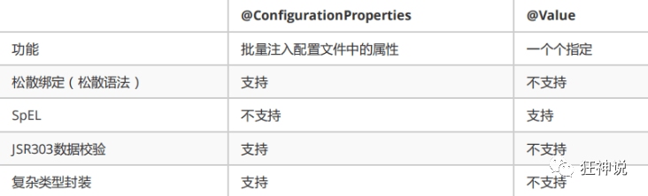
- 1、@ConfigurationProperties只需要写一次即可 ， @Value则需要每个字段都添加
- 2、松散绑定：这个什么意思呢? 比如我的yml中写的last-name，这个和lastName是一样的， - 后面跟着的字母默认是大写的。这就是松散绑定。可以测试一下
- 3、JSR303数据校验 ， 这个就是我们可以在字段是增加一层过滤器验证 ， 可以保证数据的合法性
- 4、复杂类型封装，yml中可以封装对象 ， 使用value就不支持
- **结论：**
  - 配置yml和配置properties都可以获取到值 ， 强烈推荐 yml；
  - 如果我们在某个业务中，只需要获取配置文件中的某个值，可以使用一下 @value；
  - 如果说，我们专门编写了一个JavaBean来和配置文件进行一一映射，就直接@configurationProperties，不要犹豫！

## 5. JSR303数据校验

- 如何使用？

  - Springboot中可以用@validated来校验数据，如果数据异常则会统一抛出异常，方便异常中心统一处理。我们这里来写个注解让我们的name只能支持Email格式；

  - ```java
    @Component //注册bean
    @ConfigurationProperties(prefix = "person")
    @Validated  //数据校验
    public class Person {
    
        @Email(message="邮箱格式错误") //name必须是邮箱格式
        private String name;
    }
    ```

  - 运行结果 ：default message [不是一个合法的电子邮件地址];

  - 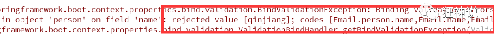

- 为什么要使用JSR303数据校验？

  - **使用数据校验，可以保证数据的正确性；** 

- 常见参数：

  - ```java
    @NotNull(message="名字不能为空")
    private String userName;
    @Max(value=120,message="年龄最大不能查过120")
    private int age;
    @Email(message="邮箱格式错误")
    private String email;
    
    空检查
    @Null       验证对象是否为null
    @NotNull    验证对象是否不为null, 无法查检长度为0的字符串
    @NotBlank   检查约束字符串是不是Null还有被Trim的长度是否大于0,只对字符串,且会去掉前后空格.
    @NotEmpty   检查约束元素是否为NULL或者是EMPTY.
        
    Booelan检查
    @AssertTrue     验证 Boolean 对象是否为 true  
    @AssertFalse    验证 Boolean 对象是否为 false  
        
    长度检查
    @Size(min=, max=) 验证对象（Array,Collection,Map,String）长度是否在给定的范围之内  
    @Length(min=, max=) string is between min and max included.
    
    日期检查
    @Past       验证 Date 和 Calendar 对象是否在当前时间之前  
    @Future     验证 Date 和 Calendar 对象是否在当前时间之后  
    @Pattern    验证 String 对象是否符合正则表达式的规则
    
    .......等等
    除此以外，我们还可以自定义一些数据校验规则
    ```

## 6. 多环境切换

- 什么是多环境切换？

  - 因为想让同一份SpringBoot代码能够在不同环境运行起来！

- 怎么进行多环境切换？

  - 多配置文件
  - yaml多文档块

- **多配置文件：**

  - 我们在主配置文件编写的时候，在和application.properties同一文件夹下，文件名可以是 application-{profile}.properties/yml , 用来指定多个环境版本；

  - 例如：

    - application-test.properties 代表测试环境配置
    - application-dev.properties 代表开发环境配置

  - 但是Springboot并不会直接启动这些配置文件，它**默认使用application.properties主配置文件**；

  - 我们需要通过一个配置来选择需要激活的环境：

  - ```properties
    #比如在配置文件中指定使用dev环境，我们可以通过设置不同的端口号进行测试；
    #我们启动SpringBoot，就可以看到已经切换到dev下的配置了；
    spring.profiles.active=dev
    ```

- **yaml的多文档块**

  - 和properties配置文件中一样，但是使用yml去实现不需要创建多个配置文件，更加方便了 !

  - ```yaml
    server:
      port: 8081
    #选择要激活那个环境块
    spring:
      profiles:
        active: prod
    
    ---
    server:
      port: 8083
    spring:
      profiles: dev #配置环境的名称
    
    
    ---
    
    server:
      port: 8084
    spring:
      profiles: prod  #配置环境的名称
    ```

  - **注意：如果yml和properties同时都配置了端口，并且没有激活其他环境 ， 默认会使用properties配置文件的！**

- **配置文件的加载位置？**

  - **外部加载配置文件的方式十分多，我们选择最常用的即可，在开发的资源文件中进行配置！**

  - 官方外部配置文件说明参考文档

  - 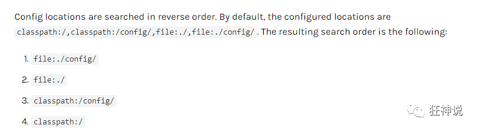

  - springboot 启动会扫描以下位置的application.properties或者application.yml文件作为Spring boot的默认配置文件：

  - ```bash
    优先级1：项目路径下的config文件夹配置文件
    优先级2：项目路径下配置文件
    优先级3：资源路径下的config文件夹配置文件 resources/config/application.properties
    优先级4：资源路径下配置文件
    ```

  - 优先级由高到底，高优先级的配置会覆盖低优先级的配置；

  - **SpringBoot会从这四个位置全部加载主配置文件；互补配置；**

  - 我们在最低级的配置文件中设置一个项目访问路径的配置来测试互补问题；

    - ```properties
      #配置项目的访问路径
      server.servlet.context-path=/kuang
      ```

  - 我们还可以通过spring.config.location来改变默认的配置文件位置

  - 项目打包好以后，我们可以使用命令行参数的形式，启动项目的时候来指定配置文件的新位置；这种情况，一般是后期运维做的多，相同配置，外部指定的配置文件优先级最高

  - ```bash
    java -jar spring-boot-config.jar --spring.config.location=F:/application.properties
    ```

## 7. 自动装配原理

- 配置文件到底能写什么？怎么写？

  - SpringBoot官方文档中有大量的配置，我们无法全部记住

- 分析自动配置原理：以**HttpEncodingAutoConfiguration（Http编码自动配置）**为例解释自动配置原理；

- ```java
  //表示这是一个配置类，和以前编写的配置文件一样，也可以给容器中添加组件；
  @Configuration 
  
  //启动指定类的ConfigurationProperties功能；
    //进入这个HttpProperties查看，将配置文件中对应的值和HttpProperties绑定起来；
    //并把HttpProperties加入到ioc容器中
  @EnableConfigurationProperties({HttpProperties.class}) 
  
  //Spring底层@Conditional注解
    //根据不同的条件判断，如果满足指定的条件，整个配置类里面的配置就会生效；
    //这里的意思就是判断当前应用是否是web应用，如果是，当前配置类生效
  @ConditionalOnWebApplication(
      type = Type.SERVLET
  )
  
  //判断当前项目有没有这个类CharacterEncodingFilter；SpringMVC中进行乱码解决的过滤器；
  @ConditionalOnClass({CharacterEncodingFilter.class})
  
  //判断配置文件中是否存在某个配置：spring.http.encoding.enabled；
    //如果不存在，判断也是成立的
    //即使我们配置文件中不配置pring.http.encoding.enabled=true，也是默认生效的；
  @ConditionalOnProperty(
      prefix = "spring.http.encoding",
      value = {"enabled"},
      matchIfMissing = true
  )
  
  public class HttpEncodingAutoConfiguration {
      //他已经和SpringBoot的配置文件映射了
      private final Encoding properties;
      //只有一个有参构造器的情况下，参数的值就会从容器中拿
      public HttpEncodingAutoConfiguration(HttpProperties properties) {
          this.properties = properties.getEncoding();
      }
      
      //给容器中添加一个组件，这个组件的某些值需要从properties中获取
      @Bean
      @ConditionalOnMissingBean //判断容器没有这个组件？
      public CharacterEncodingFilter characterEncodingFilter() {
          CharacterEncodingFilter filter = new OrderedCharacterEncodingFilter();
          filter.setEncoding(this.properties.getCharset().name());
          filter.setForceRequestEncoding(this.properties.shouldForce(org.springframework.boot.autoconfigure.http.HttpProperties.Encoding.Type.REQUEST));
          filter.setForceResponseEncoding(this.properties.shouldForce(org.springframework.boot.autoconfigure.http.HttpProperties.Encoding.Type.RESPONSE));
          return filter;
      }
      //。。。。。。。
  }
  ```

- **一句话总结 ：根据当前不同的条件判断，决定这个配置类是否生效！**

  - 一但这个配置类生效；这个配置类就会给容器中添加各种组件；
  - 这些组件的属性是从对应的properties类中获取的，这些类里面的每一个属性又是和配置文件绑定的；
  - 所有在配置文件中能配置的属性都是在xxxxProperties类中封装着；
  - 配置文件能配置什么就可以参照某个功能对应的xxxxProperties类

- ```java
  //从配置文件中获取指定的值和bean的属性进行绑定
  @ConfigurationProperties(prefix = "spring.http") 
  public class HttpProperties {
      // .....
  }
  ```

- 我们去配置文件里面试试前缀，看提示！

- 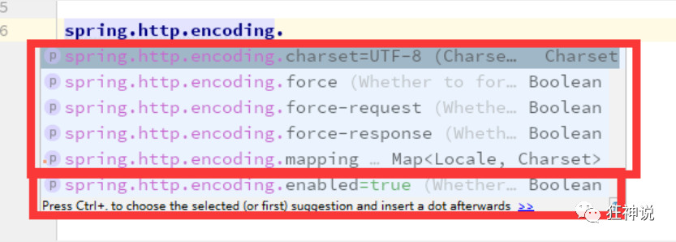

- 小总结：

  - 1、SpringBoot启动会加载大量的自动配置类

  - 2、我们看我们需要的功能有没有在SpringBoot默认写好的自动配置类当中；

  - 3、我们再来看这个自动配置类中到底配置了哪些组件；（只要我们要用的组件存在在其中，我们就不需要再手动配置了）

  - 4、给容器中自动配置类添加组件的时候，会从properties类中获取某些属性。我们只需要在配置文件中指定这些属性的值即可；

  - **xxxxProperties:封装配置文件中相关属性；**

    - 一般都有这个注解：

      ```java
      @ConfigurationProperties(
          prefix = "spring.transaction"
      )
      ```

      - 从Application.properties或者.yaml中读取指定spring.transaction下面的数据，

  - **xxxxAutoConfigurartion：自动配置类；**给容器中添加组件

    - 一般都有这个注解：

      - ```java
        @EnableConfigurationProperties({TransactionProperties.class})
        ```

      - 将Application.propertiest或者.yaml中xxxxProperties类指定的前缀的数据自动装配到这个xxxxProperties这个对象中，并且往Spring容器中实例化这个配置类！

- 了解：@Conditional：

  - **自动配置类必须在一定的条件下才能生效；**
  - *@Conditional派生注解（Spring注解版原生的@Conditional作用）**
  - 作用：必须是@Conditional指定的条件成立，才给容器中添加组件，配置配里面的所有内容才生效；

- 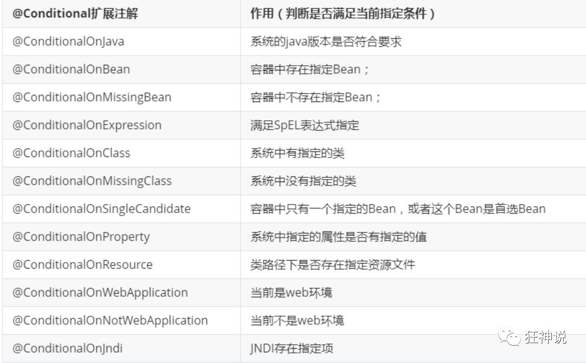

- **那么多的自动配置类，必须在一定的条件下才能生效；也就是说，我们加载了这么多的配置类，但不是所有的都生效了。**

- 我们怎么知道哪些自动配置类生效？

  - **我们可以通过启用 debug=true属性；来让控制台打印自动配置报告，这样我们就可以很方便的知道哪些自动配置类生效；**

  - ```properties
    #开启springboot的调试类
    debug=true
    ```

  - **Positive matches:（自动配置类启用的：正匹配）**

  - **Negative matches:（没有启动，没有匹配成功的自动配置类：负匹配）**

  - **Unconditional classes: （没有条件的类）**

- 此时再次回顾3.运行原理初探，重新理解：
  - AutoConfigurationImportSelector.class这个类的作用，可能能够更加明白这些注解的使用！
  - 注解是什么？
    - 就是一种方便指定配置参数的一种方式、数据结构、
    - 可以通过反射来获取类上面注解的值，然后进行处理！

## 8. SpringBoot Web开发

- SpringBoot只是进行了自动装配，那么webapp写在哪里？
- SpringBoot到底帮我们配置了什么？怎么进行修改？能修改什么东西？能不能拓展？
- 现在需要解决的问题？
  - 如何导入静态资源？
  - 首页？
  - jsp、模板引擎？
  - 装配、扩展SpringMVC？
  - 增删改查？
  - 拦截器？
  - 国际化？

### 8.1 静态资源处理

- **首先，我们搭建一个普通的SpringBoot项目，回顾一下HelloWorld程序！**

  - 写请求非常简单，那我们要引入我们前端资源，我们项目中有许多的静态资源，比如css，js等文件，这个SpringBoot怎么处理呢？
  - 如果我们是一个web应用，我们的main下会有一个webapp，我们以前都是将所有的页面导在这里面的，对吧！但是我们现在的pom呢，打包方式是为jar的方式，那么这种方式SpringBoot能不能来给我们写页面呢？当然是可以的，但是SpringBoot对于静态资源放置的位置，是有规定的！

- **静态资源映射规则：**

  - SpringBoot中，SpringMVC的web配置都在 WebMvcAutoConfiguration 这个配置类里面；

  - 我们可以去看看 WebMvcAutoConfigurationAdapter 中有很多配置方法；

  - 有一个方法：addResourceHandlers 添加资源处理

  - ```java
    @Override
    public void addResourceHandlers(ResourceHandlerRegistry registry) {
        if (!this.resourceProperties.isAddMappings()) {
            // 已禁用默认资源处理
            logger.debug("Default resource handling disabled");
            return;
        }
        // 缓存控制
        Duration cachePeriod = this.resourceProperties.getCache().getPeriod();
        CacheControl cacheControl = this.resourceProperties.getCache().getCachecontrol().toHttpCacheControl();
        // webjars 配置
        if (!registry.hasMappingForPattern("/webjars/**")) {
            customizeResourceHandlerRegistration(registry.addResourceHandler("/webjars/**")
                                                 .addResourceLocations("classpath:/META-INF/resources/webjars/")
                                                 .setCachePeriod(getSeconds(cachePeriod)).setCacheControl(cacheControl));
        }
        // 静态资源配置
        String staticPathPattern = this.mvcProperties.getStaticPathPattern();
        if (!registry.hasMappingForPattern(staticPathPattern)) {
            customizeResourceHandlerRegistration(registry.addResourceHandler(staticPathPattern)
                                                 .addResourceLocations(getResourceLocations(this.resourceProperties.getStaticLocations()))
                                                 .setCachePeriod(getSeconds(cachePeriod)).setCacheControl(cacheControl));
        }
    }
    ```

  - 读一下源代码：比如所有的 /webjars/** ， 都需要去 classpath:/META-INF/resources/webjars/ 找对应的资源；

- 什么是webjars？

  - Webjars本质就是以jar包的方式引入我们的静态资源 ， 我们以前要导入一个静态资源文件，直接导入即可。

  - 使用SpringBoot需要使用Webjars，我们可以去搜索一下：

  - 网站：https://www.webjars.org 

  - 要使用jQuery，我们只要要引入jQuery对应版本的pom依赖即可！

  - ```java
    <dependency>
        <groupId>org.webjars</groupId>
        <artifactId>jquery</artifactId>
        <version>3.4.1</version>
    </dependency>
    ```

  - 导入完毕，查看webjars目录结构，并访问Jquery.js文件！

  - 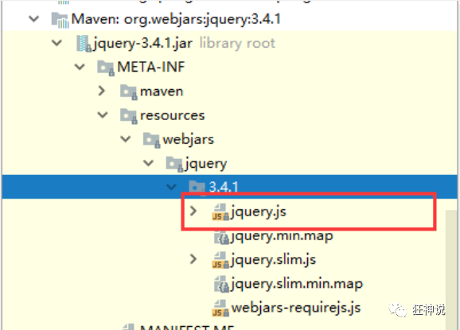

  - 访问：只要是静态资源，SpringBoot就会去对应的路径寻找资源，我们这里访问：http://localhost:8080/webjars/jquery/3.4.1/jquery.js

  - 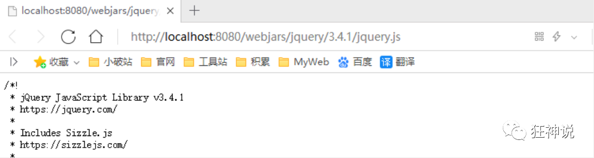

-  **第二种静态资源映射规则**

  - 那我们项目中要是使用自己的静态资源该怎么导入呢？我们看下一行代码；

  - 我们去找staticPathPattern发现第二种映射规则 ：/** , 访问当前的项目任意资源，它会去找 resourceProperties 这个类继承了Resources这个类，我们可以点进去看一下分析：

  - ```java
    // 进入方法
    public String[] getStaticLocations() {
        return this.staticLocations;
    }
    // 找到对应的值
    private String[] staticLocations = CLASSPATH_RESOURCE_LOCATIONS;
    // 找到路径
    private static final String[] CLASSPATH_RESOURCE_LOCATIONS = { 
        "classpath:/META-INF/resources/",
      "classpath:/resources/", 
        "classpath:/static/", 
        "classpath:/public/" 
    };
    ```

  - ResourceProperties 可以设置和我们静态资源有关的参数；这里面指向了它会去寻找资源的文件夹，即上面数组的内容。

  - 所以得出结论，以下四个目录存放的静态资源可以被我们识别：

  - ```bash
    "classpath:/META-INF/resources/"
    "classpath:/resources/"
    "classpath:/static/"
    "classpath:/public/"
    ```

  - 我们可以在resources根目录下新建对应的文件夹，都可以存放我们的静态文件；

  - 比如我们访问 http://localhost:8080/1.js , 他就会去这些文件夹中寻找对应的静态资源文件；

- **自定义静态资源路径:**

  - 我们也可以自己通过配置文件来指定一下，哪些文件夹是需要我们放静态资源文件的，在application.properties中配置；(不同版本配置可能不一样，看源码配置即可！！！)

  - ```bash
    spring.web.resources.static-locations=classpath:/coding/,classpath:/kuang/
    ```

  - 一旦自己定义了静态文件夹的路径，原来的自动配置就都会失效了！

### 8.2 首页处理

- 继续看WebMvcAutoConfiguration.class源码，可以看到一个欢迎页的映射，就是我们的首页！

- ```java
  @Bean
  public WelcomePageHandlerMapping welcomePageHandlerMapping(ApplicationContext applicationContext,
                                                             FormattingConversionService mvcConversionService,
                                                             ResourceUrlProvider mvcResourceUrlProvider) {
      WelcomePageHandlerMapping welcomePageHandlerMapping = new WelcomePageHandlerMapping(
          new TemplateAvailabilityProviders(applicationContext), applicationContext, getWelcomePage(), // getWelcomePage 获得欢迎页
          this.mvcProperties.getStaticPathPattern());
      welcomePageHandlerMapping.setInterceptors(getInterceptors(mvcConversionService, mvcResourceUrlProvider));
      return welcomePageHandlerMapping;
  }
  ```

- ```java
  rivate Optional<Resource> getWelcomePage() {
      String[] locations = getResourceLocations(this.resourceProperties.getStaticLocations());
      // ::是java8 中新引入的运算符
      // Class::function的时候function是属于Class的，应该是静态方法。
      // this::function的funtion是属于这个对象的。
      // 简而言之，就是一种语法糖而已，是一种简写
      return Arrays.stream(locations).map(this::getIndexHtml).filter(this::isReadable).findFirst();
  }
  // 欢迎页就是一个location下的的 index.html 而已
  private Resource getIndexHtml(String location) {
      return this.resourceLoader.getResource(location + "index.html");
  }
  ```

- 欢迎页，静态资源文件夹下的所有 index.html 页面；被 /** 映射。

- 比如我访问  http://localhost:8080/ ，就会找静态资源文件夹下的 index.html

- 新建一个 index.html ，在我们上面的3个目录中任意一个；然后访问测试  http://localhost:8080/  看结果！

- Spring Boot也可以改变网站图标，建议自己百度

### 8.3 Thymeleaf模板引擎

- 什么是模板引擎？

  - 前端交给我们的页面，是html页面。如果是我们以前开发，我们需要把他们转成jsp页面，jsp好处就是当我们查出一些数据转发到JSP页面以后，我们可以用jsp轻松实现数据的显示，及交互等。
  - jsp支持非常强大的功能，包括能写Java代码，但是呢，我们现在的这种情况，SpringBoot这个项目首先是以jar的方式，不是war，像第二，我们用的还是嵌入式的Tomcat，所以呢，**他现在默认是不支持jsp的**。
  - 那不支持jsp，如果我们直接用纯静态页面的方式，那给我们开发会带来非常大的麻烦，那怎么办呢？
  - **SpringBoot推荐你可以来使用模板引擎：**
  - 模板引擎，我们其实大家听到很多，其实jsp就是一个模板引擎，还有用的比较多的freemarker，包括SpringBoot给我们推荐的Thymeleaf，模板引擎有非常多，但再多的模板引擎，他们的思想都是一样的，什么样一个思想呢我们来看一下这张图：
  - 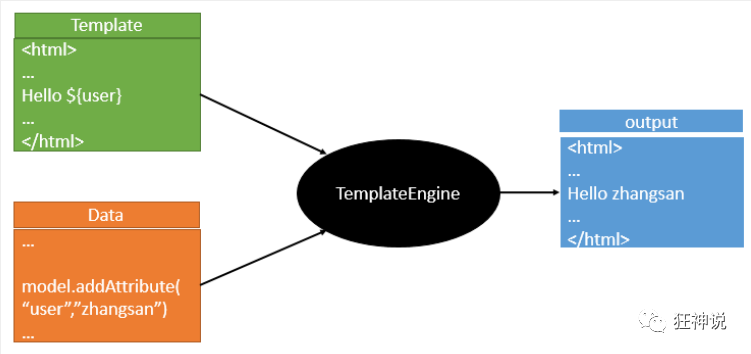
  - 模板引擎的作用就是我们来写一个页面模板，比如有些值呢，是动态的，我们写一些表达式。而这些值，从哪来呢，就是我们在后台封装一些数据。然后把这个模板和这个数据交给我们模板引擎，模板引擎按照我们这个数据帮你把这表达式解析、填充到我们指定的位置，然后把这个数据最终生成一个我们想要的内容给我们写出去，这就是我们这个模板引擎，不管是jsp还是其他模板引擎，都是这个思想。只不过呢，就是说不同模板引擎之间，他们可能这个语法有点不一样。其他的我就不介绍了，我主要来介绍一下SpringBoot给我们推荐的Thymeleaf模板引擎，这模板引擎呢，是一个高级语言的模板引擎，语法更简单。而且功能更强大。

- 怎么导入Thymeleaf？

  - Thymeleaf 官网：https://www.thymeleaf.org/

  - Thymeleaf 在Github 的主页：https://github.com/thymeleaf/thymeleafSpring官方文档：找到我们对应的版本https://docs.spring.io/spring-boot/docs/2.2.5.RELEASE/reference/htmlsingle/#using-boot-starter 

  - 找到对应的pom依赖：可以适当点进源码看下本来的包！

  - ```java
    <!--thymeleaf-->
    <dependency>
        <groupId>org.springframework.boot</groupId>
        <artifactId>spring-boot-starter-thymeleaf</artifactId>
    </dependency>
    ```

  - Maven会自动下载jar包，可以去看下下载的包的源码

- 如何使用Thymeleaf？

  - 首先得按照SpringBoot的自动配置原理看一下我们这个Thymeleaf的自动配置规则，在按照那个规则，我们进行使用。

  - 去找一下Thymeleaf的自动配置类：ThymeleafProperties

  - ```java
    @ConfigurationProperties(
        prefix = "spring.thymeleaf"
    )
    public class ThymeleafProperties {
        private static final Charset DEFAULT_ENCODING;
        public static final String DEFAULT_PREFIX = "classpath:/templates/";
        public static final String DEFAULT_SUFFIX = ".html";
        private boolean checkTemplate = true;
        private boolean checkTemplateLocation = true;
        private String prefix = "classpath:/templates/";
        private String suffix = ".html";
        private String mode = "HTML";
        private Charset encoding;
    }
    ```

  - 我们可以在其中看到默认的前缀和后缀！

  - 我们只需要把我们的html页面放在类路径下的templates下，thymeleaf就可以帮我们自动渲染了。

  - 使用thymeleaf什么都不需要配置，只需要将他放在指定的文件夹下即可

- 测试：

  - 1、编写一个TestController

  - ```java
    @Controller
    public class TestController {
        
        @RequestMapping("/t1")
        public String test1(){
            //classpath:/templates/test.html
            return "test";
        }
        
    }
    ```

  - 2、编写一个测试页面  test.html 放在 templates 目录下

  - ```html
    <!DOCTYPE html>
    <html lang="en">
    <head>
        <meta charset="UTF-8">
        <title>Title</title>
    </head>
    <body>
    <h1>测试页面</h1>
    
    </body>
    </html>
    ```

  - 3、启动项目请求测试

- Thymeleaf语法学习：

  - 参考官网文档最为准确，我们找到对应的版本看一下；

  - Thymeleaf 官网：https://www.thymeleaf.org/ ， 简单看一下官网！我们去下载Thymeleaf的官方文档！

  - **我们做个最简单的练习 ：我们需要查出一些数据，在页面中展示**

  - 1、修改测试请求，增加数据传输；

  - ```java
    @RequestMapping("/t1")
    public String test1(Model model){
        //存入数据
        model.addAttribute("msg","Hello,Thymeleaf");
        //classpath:/templates/test.html
        return "test";
    }
    ```

  - 2、我们要使用thymeleaf，需要在html文件中导入命名空间的约束，方便提示。

  - 我们可以去官方文档的#3中看一下命名空间拿来过来：

  - ```java
    xmlns:th="http://www.thymeleaf.org"
    ```

  - 3、我们去编写下前端页面

  - ```html
    <!DOCTYPE html>
    <html lang="en" xmlns:th="http://www.thymeleaf.org">
    <head>
        <meta charset="UTF-8">
        <title>狂神说</title>
    </head>
    <body>
    <h1>测试页面</h1>
    
    <!--th:text就是将div中的内容设置为它指定的值，和之前学习的Vue一样-->
    <div th:text="${msg}"></div>
    </body>
    </html>
    ```

  - 4、启动测试！

  - 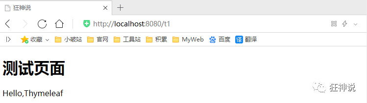

- **认真研习一下Thymeleaf的使用语法！**

  - **1、我们可以使用任意的 th:attr 来替换Html中原生属性的值！**

    - 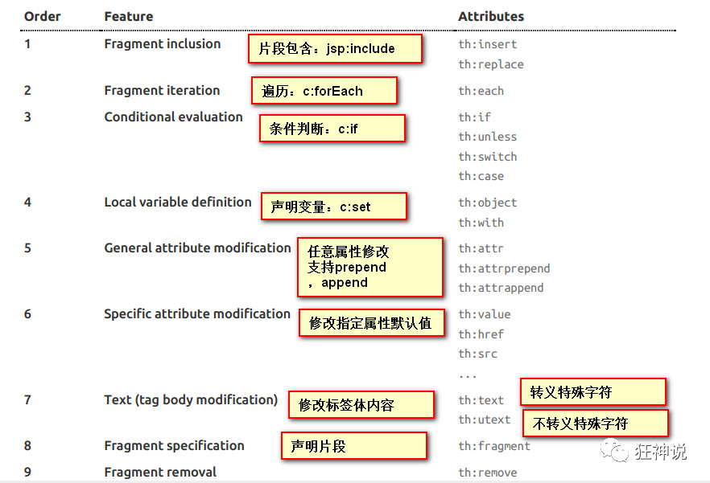

  - **2、能写哪些表达式呢？**

  - ```bash
    
    Simple expressions:（表达式语法）
    Variable Expressions: ${...}：获取变量值；OGNL；
        1）、获取对象的属性、调用方法
        2）、使用内置的基本对象：#18
             #ctx : the context object.
             #vars: the context variables.
             #locale : the context locale.
             #request : (only in Web Contexts) the HttpServletRequest object.
             #response : (only in Web Contexts) the HttpServletResponse object.
             #session : (only in Web Contexts) the HttpSession object.
             #servletContext : (only in Web Contexts) the ServletContext object.
    
        3）、内置的一些工具对象：
    　　　　　　#execInfo : information about the template being processed.
    　　　　　　#uris : methods for escaping parts of URLs/URIs
    　　　　　　#conversions : methods for executing the configured conversion service (if any).
    　　　　　　#dates : methods for java.util.Date objects: formatting, component extraction, etc.
    　　　　　　#calendars : analogous to #dates , but for java.util.Calendar objects.
    　　　　　　#numbers : methods for formatting numeric objects.
    　　　　　　#strings : methods for String objects: contains, startsWith, prepending/appending, etc.
    　　　　　　#objects : methods for objects in general.
    　　　　　　#bools : methods for boolean evaluation.
    　　　　　　#arrays : methods for arrays.
    　　　　　　#lists : methods for lists.
    　　　　　　#sets : methods for sets.
    　　　　　　#maps : methods for maps.
    　　　　　　#aggregates : methods for creating aggregates on arrays or collections.
    ==================================================================================
    
    Selection Variable Expressions: *{...}：选择表达式：和${}在功能上是一样；
    Message Expressions: #{...}：获取国际化内容
    Link URL Expressions: @{...}：定义URL；
    Fragment Expressions: ~{...}：片段引用表达式
    
    Literals（字面量）
          Text literals: 'one text' , 'Another one!' ,…
          Number literals: 0 , 34 , 3.0 , 12.3 ,…
          Boolean literals: true , false
          Null literal: null
          Literal tokens: one , sometext , main ,…
          
    Text operations:（文本操作）
        String concatenation: +
        Literal substitutions: |The name is ${name}|
        
    Arithmetic operations:（数学运算）
        Binary operators: + , - , * , / , %
        Minus sign (unary operator): -
        
    Boolean operations:（布尔运算）
        Binary operators: and , or
        Boolean negation (unary operator): ! , not
        
    Comparisons and equality:（比较运算）
        Comparators: > , < , >= , <= ( gt , lt , ge , le )
        Equality operators: == , != ( eq , ne )
        
    Conditional operators:条件运算（三元运算符）
        If-then: (if) ? (then)
        If-then-else: (if) ? (then) : (else)
        Default: (value) ?: (defaultvalue)
        
    Special tokens:
        No-Operation: _
    ```

- **测试：**

  - 1、 我们编写一个Controller，放一些数据

  - ```jade
    @RequestMapping("/t2")
    public String test2(Map<String,Object> map){
        //存入数据
        map.put("msg","<h1>Hello</h1>");
        map.put("users", Arrays.asList("qinjiang","kuangshen"));
        //classpath:/templates/test.html
        return "test";
    }
    ```

  - 2、测试页面取出数据

  - ```html
    <!DOCTYPE html>
    <html lang="en" xmlns:th="http://www.thymeleaf.org">
    <head>
        <meta charset="UTF-8">
        <title>狂神说</title>
    </head>
    <body>
    <h1>测试页面</h1>
    
    <div th:text="${msg}"></div>
    <!--不转义-->
    <div th:utext="${msg}"></div>
    
    <!--遍历数据-->
    <!--th:each每次遍历都会生成当前这个标签：官网#9-->
    <h4 th:each="user :${users}" th:text="${user}"></h4>
    
    <h4>
        <!--行内写法：官网#12-->
        <span th:each="user:${users}">[[${user}]]</span>
    </h4>
    
    </body>
    </html>
    ```

  - 3、启动项目测试！

- **我们看完语法，很多样式，我们即使现在学习了，也会忘记，所以我们在学习过程中，需要使用什么，根据官方文档来查询，才是最重要的，要熟练使用官方文档！**

### 8.4 MVC自动配置原理

- SpringBoot对我们的SpringMVC还做了哪些配置，包括如何扩展，如何定制？

  - 途径一：源码分析
  - 途径二：官方文档！https://docs.spring.io/spring-boot/docs/2.2.5.RELEASE/reference/htmlsingle/#boot-features-spring-mvc-auto-configuration

- ```bash
  Spring MVC Auto-configuration
  // Spring Boot为Spring MVC提供了自动配置，它可以很好地与大多数应用程序一起工作。
  Spring Boot provides auto-configuration for Spring MVC that works well with most applications.
  // 自动配置在Spring默认设置的基础上添加了以下功能：
  The auto-configuration adds the following features on top of Spring’s defaults:
  // 包含视图解析器
  Inclusion of ContentNegotiatingViewResolver and BeanNameViewResolver beans.
  // 支持静态资源文件夹的路径，以及webjars
  Support for serving static resources, including support for WebJars 
  // 自动注册了Converter：
  // 转换器，这就是我们网页提交数据到后台自动封装成为对象的东西，比如把"1"字符串自动转换为int类型
  // Formatter：【格式化器，比如页面给我们了一个2019-8-10，它会给我们自动格式化为Date对象】
  Automatic registration of Converter, GenericConverter, and Formatter beans.
  // HttpMessageConverters
  // SpringMVC用来转换Http请求和响应的的，比如我们要把一个User对象转换为JSON字符串，可以去看官网文档解释；
  Support for HttpMessageConverters (covered later in this document).
  // 定义错误代码生成规则的
  Automatic registration of MessageCodesResolver (covered later in this document).
  // 首页定制
  Static index.html support.
  // 图标定制
  Custom Favicon support (covered later in this document).
  // 初始化数据绑定器：帮我们把请求数据绑定到JavaBean中！
  Automatic use of a ConfigurableWebBindingInitializer bean (covered later in this document).
  
  /*
  如果您希望保留Spring Boot MVC功能，并且希望添加其他MVC配置（拦截器、格式化程序、视图控制器和其他功能），则可以添加自己
  的@configuration类，类型为webmvcconfiguer，但不添加@EnableWebMvc。如果希望提供
  RequestMappingHandlerMapping、RequestMappingHandlerAdapter或ExceptionHandlerExceptionResolver的自定义
  实例，则可以声明WebMVCregistrationAdapter实例来提供此类组件。
  */
  If you want to keep Spring Boot MVC features and you want to add additional MVC configuration 
  (interceptors, formatters, view controllers, and other features), you can add your own 
  @Configuration class of type WebMvcConfigurer but without @EnableWebMvc. If you wish to provide 
  custom instances of RequestMappingHandlerMapping, RequestMappingHandlerAdapter, or 
  ExceptionHandlerExceptionResolver, you can declare a WebMvcRegistrationsAdapter instance to provide such components.
  
  // 如果您想完全控制Spring MVC，可以添加自己的@Configuration，并用@EnableWebMvc进行注释。
  If you want to take complete control of Spring MVC, you can add your
  ```

- 我们来仔细对照，看一下它怎么实现的，它告诉我们SpringBoot已经帮我们自动配置好了SpringMVC，然后自动配置了哪些东西呢？

-  **ContentNegotiatingViewResolver 内容协商视图解析器：**

  - 自动配置了ViewResolver，就是我们之前学习的SpringMVC的视图解析器；

    - 即根据方法的返回值取得视图对象（View），然后由视图对象决定如何渲染（转发，重定向）

  - 我们去看看这里的源码：我们找到 WebMvcAutoConfiguration ， 然后搜索ContentNegotiatingViewResolver。找到如下方法！

  - ```java
    @Bean
    @ConditionalOnBean(ViewResolver.class)
    @ConditionalOnMissingBean(name = "viewResolver", value = ContentNegotiatingViewResolver.class)
    public ContentNegotiatingViewResolver viewResolver(BeanFactory beanFactory) {
        ContentNegotiatingViewResolver resolver = new ContentNegotiatingViewResolver();
        resolver.setContentNegotiationManager(beanFactory.getBean(ContentNegotiationManager.class));
        // ContentNegotiatingViewResolver使用所有其他视图解析器来定位视图，因此它应该具有较高的优先级
        resolver.setOrder(Ordered.HIGHEST_PRECEDENCE);
        return resolver;
    }
    ```

  - ```java
    @Nullable // 注解说明：@Nullable 即参数可为null
    public View resolveViewName(String viewName, Locale locale) throws Exception {
        RequestAttributes attrs = RequestContextHolder.getRequestAttributes();
        Assert.state(attrs instanceof ServletRequestAttributes, "No current ServletRequestAttributes");
        List<MediaType> requestedMediaTypes = this.getMediaTypes(((ServletRequestAttributes)attrs).getRequest());
        if (requestedMediaTypes != null) {
            // 获取候选的视图对象
            List<View> candidateViews = this.getCandidateViews(viewName, locale, requestedMediaTypes);
            // 选择一个最适合的视图对象，然后把这个对象返回
            View bestView = this.getBestView(candidateViews, requestedMediaTypes, attrs);
            if (bestView != null) {
                return bestView;
            }
        }
        // .....
    }
    ```

  - 我们继续点进去看，他是怎么获得候选的视图的呢？

    - getCandidateViews中看到他是把所有的视图解析器拿来，进行while循环，挨个解析！

    - ```java
      Iterator var5 = this.viewResolvers.iterator();
      ```

  - 所以得出结论：**ContentNegotiatingViewResolver 这个视图解析器就是用来组合所有的视图解析器的** 

  - 我们再去研究下他的组合逻辑，看到有个属性viewResolvers，看看它是在哪里进行赋值的！

  - ```java
    protected void initServletContext(ServletContext servletContext) {
        // 这里它是从beanFactory工具中获取容器中的所有视图解析器
        // ViewRescolver.class 把所有的视图解析器来组合的
        Collection<ViewResolver> matchingBeans = BeanFactoryUtils.beansOfTypeIncludingAncestors(this.obtainApplicationContext(), ViewResolver.class).values();
        ViewResolver viewResolver;
        if (this.viewResolvers == null) {
            this.viewResolvers = new ArrayList(matchingBeans.size());
        }
        // ...............
    }
    ```

  - 既然它是在容器中去找视图解析器，我们是否可以猜想，我们就可以去实现一个视图解析器了呢？

  - 我们可以自己给容器中去添加一个视图解析器；这个类就会帮我们自动的将它组合进来；**我们去实现一下**

  - 1、我们在我们的主程序中去写一个视图解析器来试试；

  - ```java
    package com.king.config;
    
    import org.springframework.context.annotation.Bean;
    import org.springframework.context.annotation.Configuration;
    import org.springframework.web.servlet.View;
    import org.springframework.web.servlet.ViewResolver;
    
    import java.util.Locale;
    
    @Configuration
    public class myConfig {
        @Bean //放到bean中
        public ViewResolver myViewResolver(){
            return new MyViewResolver();
        }
    
        //我们写一个静态内部类，视图解析器就需要实现ViewResolver接口
        private static class MyViewResolver implements ViewResolver {
            @Override
            public View resolveViewName(String s, Locale locale) throws Exception {
                return null;
            }
        }
    }
    
    ```

  - 2、怎么看我们自己写的视图解析器有没有起作用呢？

    - 我们给 DispatcherServlet 中的 doDispatch方法 加个断点进行调试一下，因为所有的请求都会走到这个方法中

  - 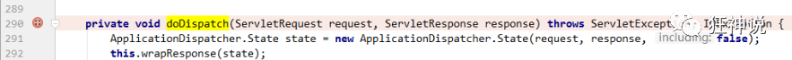

  - 3、我们启动我们的项目，然后随便访问一个页面，看一下Debug信息；找到this

  - 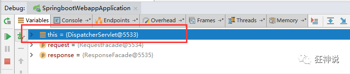

  - 找到视图解析器，我们看到我们自己定义的就在这里了；

  - 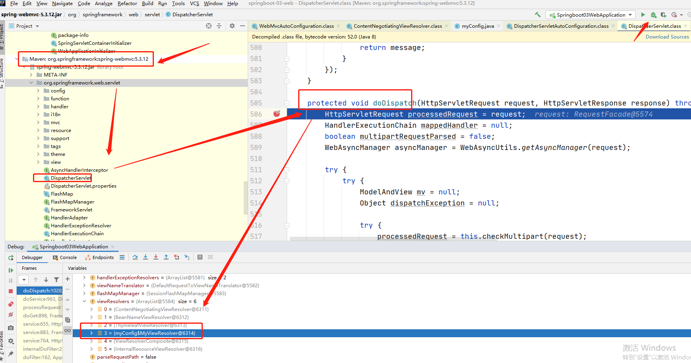

  - 所以说，我们如果想要使用自己定制化的东西，我们只需要给容器中添加这个组件就好了！剩下的事情SpringBoot就会帮我们做了！

- **转换器和格式化器：**

  - 在WebMvcAutoConfiguration.class中找到格式化转换器：

  - ```java
    
    @Bean
    @Override
    public FormattingConversionService mvcConversionService() {
        // 拿到配置文件中的格式化规则
        WebConversionService conversionService = 
            new WebConversionService(this.mvcProperties.getDateFormat());
        addFormatters(conversionService);
        return conversionService;
    }
    ```

  - ```java
    public String getDateFormat() {
        return this.dateFormat;
    }
    
    /**
    * Date format to use. For instance, `dd/MM/yyyy`. 默认的
     */
    private String dateFormat;
    ```

  - 可以看到在我们的Properties文件中，我们可以进行自动配置它！

  - 如果配置了自己的格式化方式，就会注册到Bean中生效，我们可以在配置文件中配置日期格式化的规则：

  - 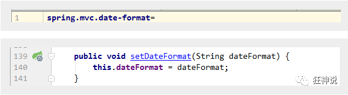

- **修改SpringBoot的默认配置**

  - 这么多的自动配置，原理都是一样的，通过这个WebMVC的自动配置原理分析，我们要学会一种学习方式，通过源码探究，得出结论；这个结论一定是属于自己的，而且一通百通。

  - SpringBoot的底层，大量用到了这些设计细节思想，所以，没事需要多阅读源码！得出结论；

  - SpringBoot在自动配置很多组件的时候，先看容器中有没有用户自己配置的（如果用户自己配置@bean），如果有就用用户配置的，如果没有就用自动配置的；

    - @ConditionalOnXXX的设置！！！！

  - 如果有些组件可以存在多个，比如我们的视图解析器，就将用户配置的和自己默认的组合起来！

  - If you want to keep Spring Boot MVC features and you want to add additional MVC configuration (interceptors, formatters, view controllers, and other features), you can add your own @Configuration class of type WebMvcConfigurer but without @EnableWebMvc. If you wish to provide custom instances of RequestMappingHandlerMapping, RequestMappingHandlerAdapter, or ExceptionHandlerExceptionResolver, you can declare a WebMvcRegistrationsAdapter instance to provide such components.

  - 我们要做的就是编写一个@Configuration注解类，并且类型要为WebMvcConfigurer，还不能标注@EnableWebMvc注解；我们去自己写一个；我们新建一个包叫config，写一个类MyMvcConfig；

  - ```java
    //应为类型要求为WebMvcConfigurer，所以我们实现其接口
    //可以使用自定义类扩展MVC的功能
    @Configuration
    public class MyMvcConfig implements WebMvcConfigurer {
    
        @Override
        public void addViewControllers(ViewControllerRegistry registry) {
            // 浏览器发送/test ， 就会跳转到test页面；
            registry.addViewController("/test").setViewName("test");
        }
    }
    ```

  - 去浏览器访问一下：**确实也跳转过来了！所以说，我们要扩展SpringMVC，官方就推荐我们这么去使用，既保SpringBoot留所有的自动配置，也能用我们扩展的配置！**

  - 可以去分析一下原理：

    - 1、WebMvcAutoConfiguration 是 SpringMVC的自动配置类，里面有一个类WebMvcAutoConfigurationAdapter

    - 2、这个类上有一个注解，在做其他自动配置时会导入：@Import(EnableWebMvcConfiguration.class)

    - 3、我们点进EnableWebMvcConfiguration这个类看一下，它继承了一个父类：DelegatingWebMvcConfiguration

    - 这个父类中有这样一段代码：

    - ```java
      
      public class DelegatingWebMvcConfiguration extends WebMvcConfigurationSupport {
          private final WebMvcConfigurerComposite configurers = new WebMvcConfigurerComposite();
          
        // 从容器中获取所有的webmvcConfigurer
          @Autowired(required = false)
          public void setConfigurers(List<WebMvcConfigurer> configurers) {
              if (!CollectionUtils.isEmpty(configurers)) {
                  this.configurers.addWebMvcConfigurers(configurers);
              }
          }
      }
      ```

    - 4、我们可以在这个类中去寻找一个我们刚才设置的viewController当做参考，发现它调用了一个

    - ```java
      protected void addViewControllers(ViewControllerRegistry registry) {
          this.configurers.addViewControllers(registry);
      }
      ```

    - 5、我们点进去看一下

    - ```java
      
      public void addViewControllers(ViewControllerRegistry registry) {
          Iterator var2 = this.delegates.iterator();
      
          while(var2.hasNext()) {
              // 将所有的WebMvcConfigurer相关配置来一起调用！包括我们自己配置的和Spring给我们配置的
              WebMvcConfigurer delegate = (WebMvcConfigurer)var2.next();
              delegate.addViewControllers(registry);
          }
      
      }
      ```

    - 所以得出结论：所有的WebMvcConfiguration都会被作用，不止Spring自己的配置类，我们自己的配置类当然也会被调用；

- **全面接管SpringMVC：**

  - 官方文档：

  - ```java
    If you want to take complete control of Spring MVC
    you can add your own @Configuration annotated with @EnableWebMvc.
    ```

  - 全面接管即：SpringBoot对SpringMVC的自动配置不需要了，所有都是我们自己去配置！

  - 只需在我们的配置类中要加一个@EnableWebMvc。

  - 我们看下如果我们全面接管了SpringMVC了，我们之前SpringBoot给我们配置的静态资源映射一定会无效，我们可以去测试一下；

  - 不加注解之前，访问首页：

    - 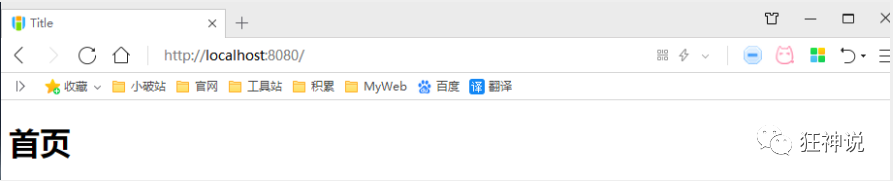

  - 给配置类加上注解：@EnableWebMvc

    - 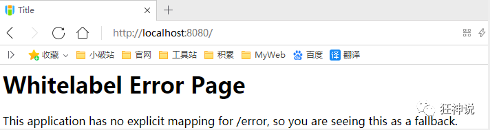

  - 我们发现所有的SpringMVC自动配置都失效了！回归到了最初的样子；

    - **当然，我们开发中，不推荐使用全面接管SpringMVC**

- 思考问题？为什么加了一个注解，自动配置就失效了！

  - 我们看下源码：

    - 1、这里发现它是导入了一个类，我们可以继续进去看

    - ```java
      @Import({DelegatingWebMvcConfiguration.class})
      public @interface EnableWebMvc {
      }
      ```

    - 2、它继承了一个父类 WebMvcConfigurationSupport

    - ```java
      
      public class DelegatingWebMvcConfiguration extends WebMvcConfigurationSupport {
        // ......
      }
      ```

    - 3、我们来回顾一下Webmvc自动配置类

    - ```java
      
      @Configuration(proxyBeanMethods = false)
      @ConditionalOnWebApplication(type = Type.SERVLET)
      @ConditionalOnClass({ Servlet.class, DispatcherServlet.class, WebMvcConfigurer.class })
      // 这个注解的意思就是：容器中没有这个组件的时候，这个自动配置类才生效
      @ConditionalOnMissingBean(WebMvcConfigurationSupport.class)
      @AutoConfigureOrder(Ordered.HIGHEST_PRECEDENCE + 10)
      @AutoConfigureAfter({ DispatcherServletAutoConfiguration.class, TaskExecutionAutoConfiguration.class,
          ValidationAutoConfiguration.class })
      public class WebMvcAutoConfiguration {
          
      }
      ```

    - 总结一句话：@EnableWebMvc将WebMvcConfigurationSupport组件导入进来了

  - 而导入的WebMvcConfigurationSupport只是SpringMVC最基本的功能！

  - **在SpringBoot中会有非常多的扩展配置，只要看见了这个，我们就应该多留心注意~**

## 9. 项目实例

- 项目目的：实现业务简单的CRUD
- 前端页面模板：https://startbootstrap.com/blog-news；自己下！
- 建议看视频再理解比较好，这里的笔记尽可能完整！！！
- https://www.bilibili.com/video/BV1PE411i7CV?p=22

### 9.1 ORM、DAO

- 创建一个初始的springboot项目

- 构建对应的对象关系映射和数据访问层

- ```java
  package com.king.springboot04empmanager.pojo;
  
  // 部门表
  
  import lombok.AllArgsConstructor;
  import lombok.Data;
  import lombok.NoArgsConstructor;
  
  @Data
  @AllArgsConstructor
  @NoArgsConstructor
  public class Department {
      private Integer id;
      private String departmentName;
  }
  
  ```

- ```java
  package com.king.springboot04empmanager.pojo;
  
  import lombok.AllArgsConstructor;
  import lombok.Data;
  import lombok.NoArgsConstructor;
  
  import java.util.Date;
  
  // 员工表
  @Data
  @AllArgsConstructor
  @NoArgsConstructor
  public class Employee {
  
      private  Integer id;
      private String lastName;
      private String email;
      private Integer gender;
  
      private Department department;
      private Date brith;
  }
  
  ```

- ```java
  package com.king.springboot04empmanager.dao;
  
  import com.king.springboot04empmanager.pojo.Department;
  import org.springframework.stereotype.Repository;
  
  import java.util.Collection;
  import java.util.HashMap;
  import java.util.Map;
  
  // 部门DAO
  @Repository
  public class DepartmentDao {
  
      private static Map<Integer, Department> departmentMap=null;
      // 模拟数据库中的数据
      static {
          // 创建一个部门表
          departmentMap = new HashMap<>();
          departmentMap.put(101,new Department(101,"教学部"));
          departmentMap.put(102,new Department(102,"市场部"));
          departmentMap.put(103,new Department(103,"教研部"));
          departmentMap.put(104,new Department(104,"运营部"));
          departmentMap.put(105,new Department(105,"后勤部"));
      }
  
  
      // 获得所有部门信息
      public Collection<Department> getDepartments(){
          return departmentMap.values();
      }
  
      // 通过id获取部门
      public Department getDepartmentById(Integer id){
          return departmentMap.get(id);
      }
  }
  
  ```

- ```java
  package com.king.springboot04empmanager.dao;
  
  import com.king.springboot04empmanager.pojo.Department;
  import com.king.springboot04empmanager.pojo.Employee;
  import org.springframework.beans.factory.annotation.Autowired;
  import org.springframework.stereotype.Repository;
  
  import java.util.Collection;
  import java.util.Date;
  import java.util.HashMap;
  import java.util.Map;
  
  @Repository
  public class EmployeeDao {
  
      private static Map<Integer, Employee> employeeMap=null;
      // 模拟数据库中的数据
      // 员工有所属部门
      @Autowired
      private DepartmentDao departmentDao;
      static {
          // 创建一个员工表
          employeeMap = new HashMap<>();
          employeeMap.put(1001,new Employee(1001,"AA","A1222222@qq.com",0,new Department(101,"教学部"),new Date()));
          employeeMap.put(1002,new Employee(1002,"BB","B1222222@qq.com",1,new Department(102,"市场部"),new Date()));
          employeeMap.put(1003,new Employee(1003,"CC","C1222222@qq.com",0,new Department(103,"教研部"),new Date()));
          employeeMap.put(1004,new Employee(1004,"DD","D222222@qq.com",1,new Department(104,"运营部"),new Date()));
          employeeMap.put(1005,new Employee(1005,"EE","E222222@qq.com",1,new Department(105,"后勤部"),new Date()));
      }
  
      // 主键自增
      private static Integer initId = 1006;
      public void add(Employee employee){
          if(employee.getId()==null){
              employee.setId(initId++);
          }
          employeeMap.put(employee.getId(),employee);
      }
  
      // 查询全部员工信息
      public Collection<Employee> getAll(){
          return employeeMap.values();
      }
  
      // 通过id查询员工
      public Employee getEmployeeById(Integer id){
          return employeeMap.get(id);
      }
  
      // 删除员工
      public void delete(Integer id){
          employeeMap.remove(id);
      }
  }
  
  ```

### 9.2 首页映射

- 将url路径映射到对应的html页面：将下载的前端页面模板放入到对应文件夹中

  - 因为页面都是使用thymeleaf引擎渲染
  - 因此html页面资源放入：templates文件夹
  - 其他静态资源放入：statis文件夹

- ```java
  package com.king.springboot04empmanager.config;
  
  import org.springframework.context.annotation.Configuration;
  import org.springframework.web.servlet.config.annotation.ViewControllerRegistry;
  import org.springframework.web.servlet.config.annotation.WebMvcConfigurer;
  
  @Configuration
  public class MyMvcConfig implements WebMvcConfigurer {
      // 自己配置首页映射
      // 也可以在controller中的@RestMapping(value={"/","/login.html"})中配置
      @Override
      public void addViewControllers(ViewControllerRegistry registry) {
          registry.addViewController("/").setViewName("login");
          registry.addViewController("/login.html").setViewName("index");
      }
  }
  
  ```

- 修改html页面，使之符合thymeleaf语法：可以对照官网，因为所有静态资源都需要thymeleaf接管

  - 添加约束：xmlns:th="http://www.thymeleaf.org"
  - url都使用@{}接收

- 其他html页面都类似，反正要符合thymeleaf语法即可！

- ```java
  <!DOCTYPE html>
  <html lang="en" xmlns:th="http://www.thymeleaf.org">
  <head>
      <meta charset="utf-8"/>
      <meta http-equiv="X-UA-Compatible" content="IE=edge"/>
      <meta name="viewport" content="width=device-width, initial-scale=1, shrink-to-fit=no"/>
      <meta name="description" content=""/>
      <meta name="author" content=""/>
      <title>员工管理系统-登录</title>
  <!--    看thymeleaf官方文档，把html的相应的标签改为thymeleaf语法格式-->
  <!--    如：所有链接为@{xxx}-->
  <!--    @{/css/styles.css}:springboot会自动去扫描：static、public包下面的/css/styles.css!!!-->
  <!--    @{/css/styles.css}:前面这个/是当前下面路径，意味着无论spring.mvc.servlet.path="/king"改成什么样，都可以找到对应资源目录下的文件-->
      <link th:href="@{/css/styles.css}" rel="stylesheet"/>
  <!--    下载到本地-->
  <!--    <script th:src="@{https://cdnjs.cloudflare.com/ajax/libs/font-awesome/5.15.3/js/all.min.js}"-->
      <script th:src="@{/js/all.min.js}"
              crossorigin="anonymous"></script>
  </head>
  <body class="bg-primary">
  <div id="layoutAuthentication">
      <div id="layoutAuthentication_content">
          <main>
              <div class="container">
                  <div class="row justify-content-center">
                      <div class="col-lg-5">
                          <div class="card shadow-lg border-0 rounded-lg mt-5">
                              <div class="card-header"><h3 class="text-center font-weight-light my-4">Login</h3></div>
                              <div class="card-body">
                                  <form>
                                      <div class="form-floating mb-3">
                                          <input class="form-control" id="inputEmail" type="email"
                                                 placeholder="name@example.com"/>
                                          <label for="inputEmail">Email address</label>
                                      </div>
                                      <div class="form-floating mb-3">
                                          <input class="form-control" id="inputPassword" type="password"
                                                 placeholder="Password"/>
                                          <label for="inputPassword">Password</label>
                                      </div>
                                      <div class="form-check mb-3">
                                          <input class="form-check-input" id="inputRememberPassword" type="checkbox"
                                                 value=""/>
                                          <label class="form-check-label" for="inputRememberPassword">Remember
                                              Password</label>
                                      </div>
                                      <div class="d-flex align-items-center justify-content-between mt-4 mb-0">
                                          <a class="small" href="password.html">Forgot Password?</a>
                                          <a class="btn btn-primary" href="index.html">Login</a>
                                      </div>
                                  </form>
                              </div>
                              <div class="card-footer text-center py-3">
                                  <div class="small"><a href="register.html">Need an account? Sign up!</a></div>
                              </div>
                          </div>
                      </div>
                  </div>
              </div>
          </main>
      </div>
      <div id="layoutAuthentication_footer">
          <footer class="py-4 bg-light mt-auto">
              <div class="container-fluid px-4">
                  <div class="d-flex align-items-center justify-content-between small">
                      <div class="text-muted">Copyright &copy; Your Website 2021</div>
                      <div>
                          <a href="#">Privacy Policy</a>
                          &middot;
                          <a href="#">Terms &amp; Conditions</a>
                      </div>
                  </div>
              </div>
          </footer>
      </div>
  </div>
  <script th:src="@{/js/all.min.js}"
          crossorigin="anonymous"></script>
  <script th:src="@{/js/scripts.js}"></script>
  </body>
  </html>
  
  ```

### 9.3 页面国际化

- 配置i18n文件

  - 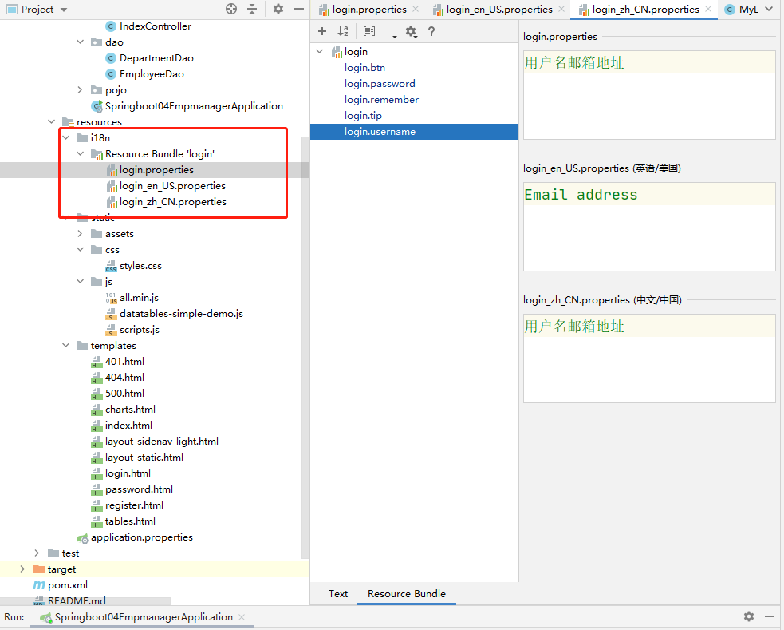
  - 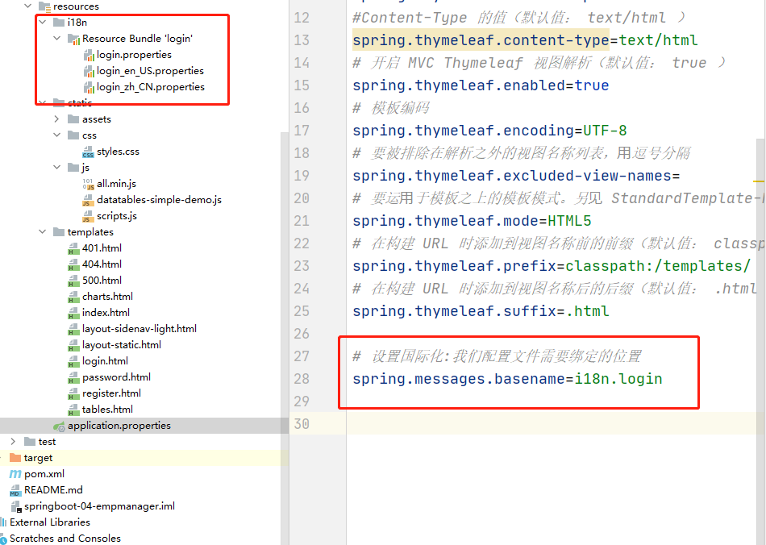

- 如果需要在项目中进行按钮自动切换，需要自定义一个组件 LocaleResolver

  - 为什么自定义有用？看源码！

  - ```java
    package com.king.springboot04empmanager.config;
    
    import org.springframework.util.StringUtils;
    import org.springframework.web.servlet.LocaleResolver;
    
    import javax.servlet.http.HttpServletRequest;
    import javax.servlet.http.HttpServletResponse;
    import java.util.List;
    import java.util.Locale;
    
    // 自己实现地区解析器=》实现国际化
    // 类似于WebMvcAutoConfiguration.class中的 AcceptHeaderLocaleResolver 的实现
    
    public class MyLocaleResolver implements LocaleResolver {
        // 解析请求
        @Override
        public Locale resolveLocale(HttpServletRequest httpServletRequest) {
            // 获取请求中的语言参数
            String language = httpServletRequest.getParameter("lan");
            System.out.println("debug:"+language);
            // 按照AcceptHeaderLocaleResolver实现
            // 如果没有就使用默认的
            Locale defaultLocale = Locale.getDefault();
            // 如果请求的链接携带了国际化的参数
            if(!StringUtils.isEmpty(language)){
                // 分割。获取字符串
                // 国家、地区
                String[] s = language.split("_");
                defaultLocale=new Locale(s[0],s[1]);
            }
            return defaultLocale;
        }
    
        @Override
        public void setLocale(HttpServletRequest httpServletRequest, HttpServletResponse httpServletResponse, Locale locale) {
    
        }
    }
    
    ```

- 然后将组件注册配置到spring容器中：@Bean

  - ```java
    package com.king.springboot04empmanager.config;
    
    import org.springframework.context.annotation.Bean;
    import org.springframework.context.annotation.Configuration;
    import org.springframework.web.servlet.LocaleResolver;
    import org.springframework.web.servlet.config.annotation.ViewControllerRegistry;
    import org.springframework.web.servlet.config.annotation.WebMvcConfigurer;
    
    @Configuration
    public class MyMvcConfig implements WebMvcConfigurer {
        // 自己配置首页映射
        // 也可以在controller中的@RestMapping(value={"/","/login.html"})中配置
        @Override
        public void addViewControllers(ViewControllerRegistry registry) {
            registry.addViewController("/").setViewName("login");
            registry.addViewController("/login.html").setViewName("login");
        }
    
        // 注入自己写的国际化解析组件
        @Bean
        public LocaleResolver localeResolver(){
            return new MyLocaleResolver();
        }
    }
    
    ```

- 页面修改为符合thymeleaf语法！

  - \#{xxx}：获取国际化信息

  - ```html
    <!DOCTYPE html>
    <html lang="en" xmlns:th="http://www.thymeleaf.org">
    <head>
        <meta charset="utf-8"/>
        <meta http-equiv="X-UA-Compatible" content="IE=edge"/>
        <meta name="viewport" content="width=device-width, initial-scale=1, shrink-to-fit=no"/>
        <meta name="description" content=""/>
        <meta name="author" content=""/>
        <title>员工管理系统-登录</title>
    <!--    看thymeleaf官方文档，把html的相应的标签改为thymeleaf语法格式-->
    <!--    如：所有链接为@{xxx}-->
    <!--    @{/css/styles.css}:springboot会自动去扫描：static、public包下面的/css/styles.css!!!-->
    <!--    @{/css/styles.css}:前面这个/是当前下面路径，意味着无论spring.mvc.servlet.path="/king"改成什么样，都可以找到对应资源目录下的文件-->
        <link th:href="@{/css/styles.css}" rel="stylesheet"/>
    <!--    下载到本地-->
    <!--    <script th:src="@{https://cdnjs.cloudflare.com/ajax/libs/font-awesome/5.15.3/js/all.min.js}"-->
        <script th:src="@{/js/all.min.js}"
                crossorigin="anonymous"></script>
    </head>
    <body class="bg-primary">
    <div id="layoutAuthentication">
        <div id="layoutAuthentication_content">
            <main>
                <div class="container">
                    <div class="row justify-content-center">
                        <div class="col-lg-5">
                            <div class="card shadow-lg border-0 rounded-lg mt-5">
                                <div class="card-header"><h3 class="text-center font-weight-light my-4" th:text="#{login.tip}">Login</h3></div>
                                <div class="card-body">
                                    <form>
                                        <div class="form-floating mb-3">
                                            <input class="form-control" id="inputEmail" type="email"
                                                   placeholder="name@example.com"/>
                                            <label for="inputEmail" th:text="#{login.username}">Email address</label>
                                        </div>
                                        <div class="form-floating mb-3">
                                            <input class="form-control" id="inputPassword" type="password"
                                                   th:placeholder="#{login.password}"/>
                                            <label for="inputPassword" th:text="#{login.password}" >Password</label>
                                        </div>
                                        <div class="form-check mb-3">
                                            <input class="form-check-input" id="inputRememberPassword" type="checkbox"
                                                   value=""/>
                                            <label class="form-check-label" for="inputRememberPassword" >[[#{login.remember}]]</label>
                                        </div>
                                        <div class="d-flex align-items-center justify-content-between mt-4 mb-0">
                                            <a class="small" href="password.html">Forgot Password?</a>
                                            <a class="btn btn-primary" th:href="@{/index.html}" >[[#{login.btn}]]</a>
                                        </div>
                                    </form>
                                </div>
                                <div class="card-footer text-center py-3">
                                    <div class="small"><a href="register.html">Need an account? Sign up!</a></div>
    <!--                                thymeleaf的链接携带参数使用()-->
                                    <a class="btn btn-sm" th:href="@{/login.html(lan='zh_CN')}">中文</a>
                                    <a class="btn btn-sm" th:href="@{/login.html(lan='en_US')}">English</a>
                                </div>
                            </div>
                        </div>
                    </div>
                </div>
            </main>
        </div>
        <div id="layoutAuthentication_footer">
            <footer class="py-4 bg-light mt-auto">
                <div class="container-fluid px-4">
                    <div class="d-flex align-items-center justify-content-between small">
                        <div class="text-muted">Copyright &copy; Your Website 2021</div>
                        <div>
                            <a href="#">Privacy Policy</a>
                            &middot;
                            <a href="#">Terms &amp; Conditions</a>
                        </div>
                    </div>
                </div>
            </footer>
        </div>
    </div>
    <script th:src="@{/js/all.min.js}"
            crossorigin="anonymous"></script>
    <script th:src="@{/js/scripts.js}"></script>
    </body>
    </html>
    
    ```

### 9.4 登录功能实现

- 修改前端页面的数据提交地址、设置显示登录失败信息

- 实现登录controller确定跳转

- 实现登录拦截功能，防止没有登录就可以加入主页

- 1.修改前端登录页面：

- ```html
  <!DOCTYPE html>
  <html lang="en" xmlns:th="http://www.thymeleaf.org">
  <head>
      <meta charset="utf-8"/>
      <meta http-equiv="X-UA-Compatible" content="IE=edge"/>
      <meta name="viewport" content="width=device-width, initial-scale=1, shrink-to-fit=no"/>
      <meta name="description" content=""/>
      <meta name="author" content=""/>
      <title>员工管理系统-登录</title>
  <!--    看thymeleaf官方文档，把html的相应的标签改为thymeleaf语法格式-->
  <!--    如：所有链接为@{xxx}-->
  <!--    @{/css/styles.css}:springboot会自动去扫描：static、public包下面的/css/styles.css!!!-->
  <!--    @{/css/styles.css}:前面这个/是当前下面路径，意味着无论spring.mvc.servlet.path="/king"改成什么样，都可以找到对应资源目录下的文件-->
      <link th:href="@{/css/styles.css}" rel="stylesheet"/>
  <!--    下载到本地-->
  <!--    <script th:src="@{https://cdnjs.cloudflare.com/ajax/libs/font-awesome/5.15.3/js/all.min.js}"-->
      <script th:src="@{/js/all.min.js}"
              crossorigin="anonymous"></script>
  </head>
  <body class="bg-primary">
  <div id="layoutAuthentication">
      <div id="layoutAuthentication_content">
          <main>
              <div class="container">
                  <div class="row justify-content-center">
                      <div class="col-lg-5">
                          <div class="card shadow-lg border-0 rounded-lg mt-5">
                              <div class="card-header">
                                  <h3 class="text-center font-weight-light my-4" th:text="#{login.tip}">Login</h3>
  <!--                                添加登录失败信息-->
  <!--                                如果msg不为空才显示-->
                                  <p class="text-center font-weight-light my-4" style="color: red" th:text="${msg}" th:if="${not #strings.isEmpty(msg)}"></p>
                              </div>
                              <div class="card-body">
                                  <form method="post" th:action="@{/user/login}">
                                      <div class="form-floating mb-3">
                                          <input class="form-control" id="inputEmail" type="text" name="username"
                                                 placeholder="name@example.com"/>
                                          <label for="inputEmail" th:text="#{login.username}">Email address</label>
                                      </div>
                                      <div class="form-floating mb-3">
                                          <input class="form-control" id="inputPassword" type="password" name="password"
                                                 th:placeholder="#{login.password}"/>
                                          <label for="inputPassword" th:text="#{login.password}" >Password</label>
                                      </div>
                                      <div class="form-check mb-3">
                                          <input class="form-check-input" id="inputRememberPassword" type="checkbox"
                                                 value=""/>
                                          <label class="form-check-label" for="inputRememberPassword" >[[#{login.remember}]]</label>
                                      </div>
                                      <div class="d-flex align-items-center justify-content-between mt-4 mb-0">
                                          <a class="small" href="password.html" th:text="#{login.forgot}">Forgot Password?</a>
  <!--                                        <a class="btn btn-primary" th:href="@{/user/login}" >[[#{login.btn}]]</a>-->
                                          <button class="btn btn-primary" type="submit" >[[#{login.btn}]]</button>
                                      </div>
                                  </form>
                              </div>
                              <div class="card-footer text-center py-3">
                                  <div class="small"><a href="register.html" th:text="#{login.singup}">Need an account? Sign up!</a></div>
  <!--                                thymeleaf的链接携带参数使用()-->
                                  <a class="btn btn-sm" th:href="@{/login.html(lan='zh_CN')}">中文</a>
                                  <a class="btn btn-sm" th:href="@{/login.html(lan='en_US')}">English</a>
                              </div>
                          </div>
                      </div>
                  </div>
              </div>
          </main>
      </div>
      <div id="layoutAuthentication_footer">
          <footer class="py-4 bg-light mt-auto">
              <div class="container-fluid px-4">
                  <div class="d-flex align-items-center justify-content-between small">
                      <div class="text-muted">Copyright &copy; Your Website 2021</div>
                      <div>
                          <a href="#">Privacy Policy</a>
                          &middot;
                          <a href="#">Terms &amp; Conditions</a>
                      </div>
                  </div>
              </div>
          </footer>
      </div>
  </div>
  <script th:src="@{/js/all.min.js}"
          crossorigin="anonymous"></script>
  <script th:src="@{/js/scripts.js}"></script>
  </body>
  </html>
  
  ```

- 2.实现登录的controller

- ```java
  package com.king.springboot04empmanager.controller;
  
  import org.springframework.stereotype.Controller;
  import org.springframework.ui.Model;
  import org.springframework.util.StringUtils;
  import org.springframework.web.bind.annotation.RequestMapping;
  import org.springframework.web.bind.annotation.RequestParam;
  import org.springframework.web.bind.annotation.ResponseBody;
  
  import javax.servlet.http.HttpServletRequest;
  
  @Controller
  public class LoginController {
  
      @RequestMapping("/user/login")
      public String login(
              @RequestParam("username") String username,
              @RequestParam("password") String password,
              Model model,
              HttpServletRequest request){
  
          // 具体的业务
          if(!StringUtils.isEmpty(username)&&"123456".equals(password)){
              // 放置一个session，标识这个浏览器已经登录成功了一个用户
              request.getSession().setAttribute("loginUser",username);
              return "redirect:/main.html";
          }else{
              // 告诉用户登录失败
              model.addAttribute("msg","登录信息错误");
              return "login";
          }
      }
  }
  
  ```

- 3.跳转的主页：

- ```html
  <!DOCTYPE html>
  <html lang="en" xmlns:th="http://www.thymeleaf.org">
  <head>
      <meta charset="utf-8"/>
      <meta http-equiv="X-UA-Compatible" content="IE=edge"/>
      <meta name="viewport" content="width=device-width, initial-scale=1, shrink-to-fit=no"/>
      <meta name="description" content=""/>
      <meta name="author" content=""/>
      <title>员工管理系统</title>
  <!--    使用thymeleaf语法改进html!-->
  <!--    <link th:href="@{https://cdn.jsdelivr.net/npm/simple-datatables@latest/dist/style.css}" rel="stylesheet"/>-->
      <link th:href="@{/css/styles.css}" rel="stylesheet"/>
  <!--    <script th:src="@{https://cdnjs.cloudflare.com/ajax/libs/font-awesome/5.15.3/js/all.min.js}"-->
      <script th:src="@{/js/all.min.js}"
              crossorigin="anonymous"></script>
  </head>
  <body class="sb-nav-fixed">
  <nav class="sb-topnav navbar navbar-expand navbar-dark bg-dark">
      <!-- Navbar Brand-->
  <!--    ${}：取表达式-->
      <a class="navbar-brand ps-3" th:href="@{/index.html}">[[${session.loginUser}]]</a>
      <!-- Sidebar Toggle-->
      <button class="btn btn-link btn-sm order-1 order-lg-0 me-4 me-lg-0" id="sidebarToggle" href="#!"><i
              class="fas fa-bars"></i></button>
      <!-- Navbar Search-->
      <form class="d-none d-md-inline-block form-inline ms-auto me-0 me-md-3 my-2 my-md-0">
          <div class="input-group">
              <input class="form-control" type="text" placeholder="Search for..." aria-label="Search for..."
                     aria-describedby="btnNavbarSearch"/>
              <button class="btn btn-primary" id="btnNavbarSearch" type="button"><i class="fas fa-search"></i></button>
          </div>
      </form>
      <!-- Navbar-->
      <ul class="navbar-nav ms-auto ms-md-0 me-3 me-lg-4">
          <li class="nav-item dropdown">
              <a class="nav-link dropdown-toggle" id="navbarDropdown" href="#" role="button" data-bs-toggle="dropdown"
                 aria-expanded="false"><i class="fas fa-user fa-fw"></i></a>
              <ul class="dropdown-menu dropdown-menu-end" aria-labelledby="navbarDropdown">
                  <li><a class="dropdown-item" href="#!">Settings</a></li>
                  <li><a class="dropdown-item" href="#!">Activity Log</a></li>
                  <li>
                      <hr class="dropdown-divider"/>
                  </li>
                  <li><a class="dropdown-item" href="#!">Logout</a></li>
              </ul>
          </li>
      </ul>
  </nav>
  <div id="layoutSidenav">
      <div id="layoutSidenav_nav">
          <nav class="sb-sidenav accordion sb-sidenav-dark" id="sidenavAccordion">
              <div class="sb-sidenav-menu">
                  <div class="nav">
                      <div class="sb-sidenav-menu-heading">Core</div>
                      <a class="nav-link" href="index.html">
                          <div class="sb-nav-link-icon"><i class="fas fa-tachometer-alt"></i></div>
                          Dashboard
                      </a>
                      <div class="sb-sidenav-menu-heading">Interface</div>
                      <a class="nav-link collapsed" href="#" data-bs-toggle="collapse" data-bs-target="#collapseLayouts"
                         aria-expanded="false" aria-controls="collapseLayouts">
                          <div class="sb-nav-link-icon"><i class="fas fa-columns"></i></div>
                          Layouts
                          <div class="sb-sidenav-collapse-arrow"><i class="fas fa-angle-down"></i></div>
                      </a>
                      <div class="collapse" id="collapseLayouts" aria-labelledby="headingOne"
                           data-bs-parent="#sidenavAccordion">
                          <nav class="sb-sidenav-menu-nested nav">
                              <a class="nav-link" href="layout-static.html">Static Navigation</a>
                              <a class="nav-link" href="layout-sidenav-light.html">Light Sidenav</a>
                          </nav>
                      </div>
                      <a class="nav-link collapsed" href="#" data-bs-toggle="collapse" data-bs-target="#collapsePages"
                         aria-expanded="false" aria-controls="collapsePages">
                          <div class="sb-nav-link-icon"><i class="fas fa-book-open"></i></div>
                          Pages
                          <div class="sb-sidenav-collapse-arrow"><i class="fas fa-angle-down"></i></div>
                      </a>
                      <div class="collapse" id="collapsePages" aria-labelledby="headingTwo"
                           data-bs-parent="#sidenavAccordion">
                          <nav class="sb-sidenav-menu-nested nav accordion" id="sidenavAccordionPages">
                              <a class="nav-link collapsed" href="#" data-bs-toggle="collapse"
                                 data-bs-target="#pagesCollapseAuth" aria-expanded="false"
                                 aria-controls="pagesCollapseAuth">
                                  Authentication
                                  <div class="sb-sidenav-collapse-arrow"><i class="fas fa-angle-down"></i></div>
                              </a>
                              <div class="collapse" id="pagesCollapseAuth" aria-labelledby="headingOne"
                                   data-bs-parent="#sidenavAccordionPages">
                                  <nav class="sb-sidenav-menu-nested nav">
                                      <a class="nav-link" href="login.html">Login</a>
                                      <a class="nav-link" href="register.html">Register</a>
                                      <a class="nav-link" href="password.html">Forgot Password</a>
                                  </nav>
                              </div>
                              <a class="nav-link collapsed" href="#" data-bs-toggle="collapse"
                                 data-bs-target="#pagesCollapseError" aria-expanded="false"
                                 aria-controls="pagesCollapseError">
                                  Error
                                  <div class="sb-sidenav-collapse-arrow"><i class="fas fa-angle-down"></i></div>
                              </a>
                              <div class="collapse" id="pagesCollapseError" aria-labelledby="headingOne"
                                   data-bs-parent="#sidenavAccordionPages">
                                  <nav class="sb-sidenav-menu-nested nav">
                                      <a class="nav-link" href="401.html">401 Page</a>
                                      <a class="nav-link" href="404.html">404 Page</a>
                                      <a class="nav-link" href="500.html">500 Page</a>
                                  </nav>
                              </div>
                          </nav>
                      </div>
                      <div class="sb-sidenav-menu-heading">Addons</div>
                      <a class="nav-link" href="charts.html">
                          <div class="sb-nav-link-icon"><i class="fas fa-chart-area"></i></div>
                          Charts
                      </a>
                      <a class="nav-link" href="tables.html">
                          <div class="sb-nav-link-icon"><i class="fas fa-table"></i></div>
                          Tables
                      </a>
                  </div>
              </div>
              <div class="sb-sidenav-footer">
                  <div class="small">Logged in as:</div>
                  Start Bootstrap
              </div>
          </nav>
      </div>
      <div id="layoutSidenav_content">
          <main>
              <div class="container-fluid px-4">
                  <h1 class="mt-4">Dashboard</h1>
                  <ol class="breadcrumb mb-4">
                      <li class="breadcrumb-item active">Dashboard</li>
                  </ol>
                  <div class="row">
                      <div class="col-xl-3 col-md-6">
                          <div class="card bg-primary text-white mb-4">
                              <div class="card-body">Primary Card</div>
                              <div class="card-footer d-flex align-items-center justify-content-between">
                                  <a class="small text-white stretched-link" href="#">View Details</a>
                                  <div class="small text-white"><i class="fas fa-angle-right"></i></div>
                              </div>
                          </div>
                      </div>
                      <div class="col-xl-3 col-md-6">
                          <div class="card bg-warning text-white mb-4">
                              <div class="card-body">Warning Card</div>
                              <div class="card-footer d-flex align-items-center justify-content-between">
                                  <a class="small text-white stretched-link" href="#">View Details</a>
                                  <div class="small text-white"><i class="fas fa-angle-right"></i></div>
                              </div>
                          </div>
                      </div>
                      <div class="col-xl-3 col-md-6">
                          <div class="card bg-success text-white mb-4">
                              <div class="card-body">Success Card</div>
                              <div class="card-footer d-flex align-items-center justify-content-between">
                                  <a class="small text-white stretched-link" href="#">View Details</a>
                                  <div class="small text-white"><i class="fas fa-angle-right"></i></div>
                              </div>
                          </div>
                      </div>
                      <div class="col-xl-3 col-md-6">
                          <div class="card bg-danger text-white mb-4">
                              <div class="card-body">Danger Card</div>
                              <div class="card-footer d-flex align-items-center justify-content-between">
                                  <a class="small text-white stretched-link" href="#">View Details</a>
                                  <div class="small text-white"><i class="fas fa-angle-right"></i></div>
                              </div>
                          </div>
                      </div>
                  </div>
                  <div class="row">
                      <div class="col-xl-6">
                          <div class="card mb-4">
                              <div class="card-header">
                                  <i class="fas fa-chart-area me-1"></i>
                                  Area Chart Example
                              </div>
                              <div class="card-body">
                                  <canvas id="myAreaChart" width="100%" height="40"></canvas>
                              </div>
                          </div>
                      </div>
                      <div class="col-xl-6">
                          <div class="card mb-4">
                              <div class="card-header">
                                  <i class="fas fa-chart-bar me-1"></i>
                                  Bar Chart Example
                              </div>
                              <div class="card-body">
                                  <canvas id="myBarChart" width="100%" height="40"></canvas>
                              </div>
                          </div>
                      </div>
                  </div>
                  <div class="card mb-4">
                      <div class="card-header">
                          <i class="fas fa-table me-1"></i>
                          DataTable Example
                      </div>
                      <div class="card-body">
                          <table id="datatablesSimple">
                              <thead>
                              <tr>
                                  <th>Name</th>
                                  <th>Position</th>
                                  <th>Office</th>
                                  <th>Age</th>
                                  <th>Start date</th>
                                  <th>Salary</th>
                              </tr>
                              </thead>
                              <tfoot>
                              <tr>
                                  <th>Name</th>
                                  <th>Position</th>
                                  <th>Office</th>
                                  <th>Age</th>
                                  <th>Start date</th>
                                  <th>Salary</th>
                              </tr>
                              </tfoot>
                              <tbody>
                              <tr>
                                  <td>Tiger Nixon</td>
                                  <td>System Architect</td>
                                  <td>Edinburgh</td>
                                  <td>61</td>
                                  <td>2011/04/25</td>
                                  <td>$320,800</td>
                              </tr>
                              <tr>
                                  <td>Garrett Winters</td>
                                  <td>Accountant</td>
                                  <td>Tokyo</td>
                                  <td>63</td>
                                  <td>2011/07/25</td>
                                  <td>$170,750</td>
                              </tr>
                              <tr>
                                  <td>Ashton Cox</td>
                                  <td>Junior Technical Author</td>
                                  <td>San Francisco</td>
                                  <td>66</td>
                                  <td>2009/01/12</td>
                                  <td>$86,000</td>
                              </tr>
                              <tr>
                                  <td>Cedric Kelly</td>
                                  <td>Senior Javascript Developer</td>
                                  <td>Edinburgh</td>
                                  <td>22</td>
                                  <td>2012/03/29</td>
                                  <td>$433,060</td>
                              </tr>
                              <tr>
                                  <td>Airi Satou</td>
                                  <td>Accountant</td>
                                  <td>Tokyo</td>
                                  <td>33</td>
                                  <td>2008/11/28</td>
                                  <td>$162,700</td>
                              </tr>
                              <tr>
                                  <td>Brielle Williamson</td>
                                  <td>Integration Specialist</td>
                                  <td>New York</td>
                                  <td>61</td>
                                  <td>2012/12/02</td>
                                  <td>$372,000</td>
                              </tr>
                              <tr>
                                  <td>Herrod Chandler</td>
                                  <td>Sales Assistant</td>
                                  <td>San Francisco</td>
                                  <td>59</td>
                                  <td>2012/08/06</td>
                                  <td>$137,500</td>
                              </tr>
                              <tr>
                                  <td>Rhona Davidson</td>
                                  <td>Integration Specialist</td>
                                  <td>Tokyo</td>
                                  <td>55</td>
                                  <td>2010/10/14</td>
                                  <td>$327,900</td>
                              </tr>
                              <tr>
                                  <td>Colleen Hurst</td>
                                  <td>Javascript Developer</td>
                                  <td>San Francisco</td>
                                  <td>39</td>
                                  <td>2009/09/15</td>
                                  <td>$205,500</td>
                              </tr>
                              <tr>
                                  <td>Sonya Frost</td>
                                  <td>Software Engineer</td>
                                  <td>Edinburgh</td>
                                  <td>23</td>
                                  <td>2008/12/13</td>
                                  <td>$103,600</td>
                              </tr>
                              <tr>
                                  <td>Jena Gaines</td>
                                  <td>Office Manager</td>
                                  <td>London</td>
                                  <td>30</td>
                                  <td>2008/12/19</td>
                                  <td>$90,560</td>
                              </tr>
                              <tr>
                                  <td>Quinn Flynn</td>
                                  <td>Support Lead</td>
                                  <td>Edinburgh</td>
                                  <td>22</td>
                                  <td>2013/03/03</td>
                                  <td>$342,000</td>
                              </tr>
                              <tr>
                                  <td>Charde Marshall</td>
                                  <td>Regional Director</td>
                                  <td>San Francisco</td>
                                  <td>36</td>
                                  <td>2008/10/16</td>
                                  <td>$470,600</td>
                              </tr>
                              <tr>
                                  <td>Haley Kennedy</td>
                                  <td>Senior Marketing Designer</td>
                                  <td>London</td>
                                  <td>43</td>
                                  <td>2012/12/18</td>
                                  <td>$313,500</td>
                              </tr>
                              <tr>
                                  <td>Tatyana Fitzpatrick</td>
                                  <td>Regional Director</td>
                                  <td>London</td>
                                  <td>19</td>
                                  <td>2010/03/17</td>
                                  <td>$385,750</td>
                              </tr>
                              <tr>
                                  <td>Michael Silva</td>
                                  <td>Marketing Designer</td>
                                  <td>London</td>
                                  <td>66</td>
                                  <td>2012/11/27</td>
                                  <td>$198,500</td>
                              </tr>
                              <tr>
                                  <td>Paul Byrd</td>
                                  <td>Chief Financial Officer (CFO)</td>
                                  <td>New York</td>
                                  <td>64</td>
                                  <td>2010/06/09</td>
                                  <td>$725,000</td>
                              </tr>
                              <tr>
                                  <td>Gloria Little</td>
                                  <td>Systems Administrator</td>
                                  <td>New York</td>
                                  <td>59</td>
                                  <td>2009/04/10</td>
                                  <td>$237,500</td>
                              </tr>
                              <tr>
                                  <td>Bradley Greer</td>
                                  <td>Software Engineer</td>
                                  <td>London</td>
                                  <td>41</td>
                                  <td>2012/10/13</td>
                                  <td>$132,000</td>
                              </tr>
                              <tr>
                                  <td>Dai Rios</td>
                                  <td>Personnel Lead</td>
                                  <td>Edinburgh</td>
                                  <td>35</td>
                                  <td>2012/09/26</td>
                                  <td>$217,500</td>
                              </tr>
                              <tr>
                                  <td>Jenette Caldwell</td>
                                  <td>Development Lead</td>
                                  <td>New York</td>
                                  <td>30</td>
                                  <td>2011/09/03</td>
                                  <td>$345,000</td>
                              </tr>
                              <tr>
                                  <td>Yuri Berry</td>
                                  <td>Chief Marketing Officer (CMO)</td>
                                  <td>New York</td>
                                  <td>40</td>
                                  <td>2009/06/25</td>
                                  <td>$675,000</td>
                              </tr>
                              <tr>
                                  <td>Caesar Vance</td>
                                  <td>Pre-Sales Support</td>
                                  <td>New York</td>
                                  <td>21</td>
                                  <td>2011/12/12</td>
                                  <td>$106,450</td>
                              </tr>
                              <tr>
                                  <td>Doris Wilder</td>
                                  <td>Sales Assistant</td>
                                  <td>Sidney</td>
                                  <td>23</td>
                                  <td>2010/09/20</td>
                                  <td>$85,600</td>
                              </tr>
                              <tr>
                                  <td>Angelica Ramos</td>
                                  <td>Chief Executive Officer (CEO)</td>
                                  <td>London</td>
                                  <td>47</td>
                                  <td>2009/10/09</td>
                                  <td>$1,200,000</td>
                              </tr>
                              <tr>
                                  <td>Gavin Joyce</td>
                                  <td>Developer</td>
                                  <td>Edinburgh</td>
                                  <td>42</td>
                                  <td>2010/12/22</td>
                                  <td>$92,575</td>
                              </tr>
                              <tr>
                                  <td>Jennifer Chang</td>
                                  <td>Regional Director</td>
                                  <td>Singapore</td>
                                  <td>28</td>
                                  <td>2010/11/14</td>
                                  <td>$357,650</td>
                              </tr>
                              <tr>
                                  <td>Brenden Wagner</td>
                                  <td>Software Engineer</td>
                                  <td>San Francisco</td>
                                  <td>28</td>
                                  <td>2011/06/07</td>
                                  <td>$206,850</td>
                              </tr>
                              <tr>
                                  <td>Fiona Green</td>
                                  <td>Chief Operating Officer (COO)</td>
                                  <td>San Francisco</td>
                                  <td>48</td>
                                  <td>2010/03/11</td>
                                  <td>$850,000</td>
                              </tr>
                              <tr>
                                  <td>Shou Itou</td>
                                  <td>Regional Marketing</td>
                                  <td>Tokyo</td>
                                  <td>20</td>
                                  <td>2011/08/14</td>
                                  <td>$163,000</td>
                              </tr>
                              <tr>
                                  <td>Michelle House</td>
                                  <td>Integration Specialist</td>
                                  <td>Sidney</td>
                                  <td>37</td>
                                  <td>2011/06/02</td>
                                  <td>$95,400</td>
                              </tr>
                              <tr>
                                  <td>Suki Burks</td>
                                  <td>Developer</td>
                                  <td>London</td>
                                  <td>53</td>
                                  <td>2009/10/22</td>
                                  <td>$114,500</td>
                              </tr>
                              <tr>
                                  <td>Prescott Bartlett</td>
                                  <td>Technical Author</td>
                                  <td>London</td>
                                  <td>27</td>
                                  <td>2011/05/07</td>
                                  <td>$145,000</td>
                              </tr>
                              <tr>
                                  <td>Gavin Cortez</td>
                                  <td>Team Leader</td>
                                  <td>San Francisco</td>
                                  <td>22</td>
                                  <td>2008/10/26</td>
                                  <td>$235,500</td>
                              </tr>
                              <tr>
                                  <td>Martena Mccray</td>
                                  <td>Post-Sales support</td>
                                  <td>Edinburgh</td>
                                  <td>46</td>
                                  <td>2011/03/09</td>
                                  <td>$324,050</td>
                              </tr>
                              <tr>
                                  <td>Unity Butler</td>
                                  <td>Marketing Designer</td>
                                  <td>San Francisco</td>
                                  <td>47</td>
                                  <td>2009/12/09</td>
                                  <td>$85,675</td>
                              </tr>
                              <tr>
                                  <td>Howard Hatfield</td>
                                  <td>Office Manager</td>
                                  <td>San Francisco</td>
                                  <td>51</td>
                                  <td>2008/12/16</td>
                                  <td>$164,500</td>
                              </tr>
                              <tr>
                                  <td>Hope Fuentes</td>
                                  <td>Secretary</td>
                                  <td>San Francisco</td>
                                  <td>41</td>
                                  <td>2010/02/12</td>
                                  <td>$109,850</td>
                              </tr>
                              <tr>
                                  <td>Vivian Harrell</td>
                                  <td>Financial Controller</td>
                                  <td>San Francisco</td>
                                  <td>62</td>
                                  <td>2009/02/14</td>
                                  <td>$452,500</td>
                              </tr>
                              <tr>
                                  <td>Timothy Mooney</td>
                                  <td>Office Manager</td>
                                  <td>London</td>
                                  <td>37</td>
                                  <td>2008/12/11</td>
                                  <td>$136,200</td>
                              </tr>
                              <tr>
                                  <td>Jackson Bradshaw</td>
                                  <td>Director</td>
                                  <td>New York</td>
                                  <td>65</td>
                                  <td>2008/09/26</td>
                                  <td>$645,750</td>
                              </tr>
                              <tr>
                                  <td>Olivia Liang</td>
                                  <td>Support Engineer</td>
                                  <td>Singapore</td>
                                  <td>64</td>
                                  <td>2011/02/03</td>
                                  <td>$234,500</td>
                              </tr>
                              <tr>
                                  <td>Bruno Nash</td>
                                  <td>Software Engineer</td>
                                  <td>London</td>
                                  <td>38</td>
                                  <td>2011/05/03</td>
                                  <td>$163,500</td>
                              </tr>
                              <tr>
                                  <td>Sakura Yamamoto</td>
                                  <td>Support Engineer</td>
                                  <td>Tokyo</td>
                                  <td>37</td>
                                  <td>2009/08/19</td>
                                  <td>$139,575</td>
                              </tr>
                              <tr>
                                  <td>Thor Walton</td>
                                  <td>Developer</td>
                                  <td>New York</td>
                                  <td>61</td>
                                  <td>2013/08/11</td>
                                  <td>$98,540</td>
                              </tr>
                              <tr>
                                  <td>Finn Camacho</td>
                                  <td>Support Engineer</td>
                                  <td>San Francisco</td>
                                  <td>47</td>
                                  <td>2009/07/07</td>
                                  <td>$87,500</td>
                              </tr>
                              <tr>
                                  <td>Serge Baldwin</td>
                                  <td>Data Coordinator</td>
                                  <td>Singapore</td>
                                  <td>64</td>
                                  <td>2012/04/09</td>
                                  <td>$138,575</td>
                              </tr>
                              <tr>
                                  <td>Zenaida Frank</td>
                                  <td>Software Engineer</td>
                                  <td>New York</td>
                                  <td>63</td>
                                  <td>2010/01/04</td>
                                  <td>$125,250</td>
                              </tr>
                              <tr>
                                  <td>Zorita Serrano</td>
                                  <td>Software Engineer</td>
                                  <td>San Francisco</td>
                                  <td>56</td>
                                  <td>2012/06/01</td>
                                  <td>$115,000</td>
                              </tr>
                              <tr>
                                  <td>Jennifer Acosta</td>
                                  <td>Junior Javascript Developer</td>
                                  <td>Edinburgh</td>
                                  <td>43</td>
                                  <td>2013/02/01</td>
                                  <td>$75,650</td>
                              </tr>
                              <tr>
                                  <td>Cara Stevens</td>
                                  <td>Sales Assistant</td>
                                  <td>New York</td>
                                  <td>46</td>
                                  <td>2011/12/06</td>
                                  <td>$145,600</td>
                              </tr>
                              <tr>
                                  <td>Hermione Butler</td>
                                  <td>Regional Director</td>
                                  <td>London</td>
                                  <td>47</td>
                                  <td>2011/03/21</td>
                                  <td>$356,250</td>
                              </tr>
                              <tr>
                                  <td>Lael Greer</td>
                                  <td>Systems Administrator</td>
                                  <td>London</td>
                                  <td>21</td>
                                  <td>2009/02/27</td>
                                  <td>$103,500</td>
                              </tr>
                              <tr>
                                  <td>Jonas Alexander</td>
                                  <td>Developer</td>
                                  <td>San Francisco</td>
                                  <td>30</td>
                                  <td>2010/07/14</td>
                                  <td>$86,500</td>
                              </tr>
                              <tr>
                                  <td>Shad Decker</td>
                                  <td>Regional Director</td>
                                  <td>Edinburgh</td>
                                  <td>51</td>
                                  <td>2008/11/13</td>
                                  <td>$183,000</td>
                              </tr>
                              <tr>
                                  <td>Michael Bruce</td>
                                  <td>Javascript Developer</td>
                                  <td>Singapore</td>
                                  <td>29</td>
                                  <td>2011/06/27</td>
                                  <td>$183,000</td>
                              </tr>
                              <tr>
                                  <td>Donna Snider</td>
                                  <td>Customer Support</td>
                                  <td>New York</td>
                                  <td>27</td>
                                  <td>2011/01/25</td>
                                  <td>$112,000</td>
                              </tr>
                              </tbody>
                          </table>
                      </div>
                  </div>
              </div>
          </main>
          <footer class="py-4 bg-light mt-auto">
              <div class="container-fluid px-4">
                  <div class="d-flex align-items-center justify-content-between small">
                      <div class="text-muted">Copyright &copy; Your Website 2021</div>
                      <div>
                          <a href="#">Privacy Policy</a>
                          &middot;
                          <a href="#">Terms &amp; Conditions</a>
                      </div>
                  </div>
              </div>
          </footer>
      </div>
  </div>
  <!--<script src="https://cdn.jsdelivr.net/npm/bootstrap@5.1.3/dist/js/bootstrap.bundle.min.js"-->
  <script th:src="@{/js/bootstrap.bundle.min.js}"
          crossorigin="anonymous"></script>
  <script th:src="@{js/scripts.js}"></script>
  <!--<script th:src="https://cdnjs.cloudflare.com/ajax/libs/Chart.js/2.8.0/Chart.min.js" crossorigin="anonymous"></script>-->
  <script th:src="@{js/Chart.min.js}" crossorigin="anonymous"></script>
  <script th:src="@{/assets/demo/chart-area-demo.js}"></script>
  <script th:src="@{assets/demo/chart-bar-demo.js}"></script>
  <!--<script src="https://cdn.jsdelivr.net/npm/simple-datatables@latest" crossorigin="anonymous"></script>-->
  <script th:src="@{/js/simple-datatables-latest.js}" crossorigin="anonymous"></script>
  <script th:src="@{js/datatables-simple-demo.js}"></script>
  </body>
  </html>
  
  ```

- 4.自定义登录拦截器：

- ```java
  package com.king.springboot04empmanager.config;
  
  import org.springframework.web.servlet.HandlerInterceptor;
  
  import javax.servlet.http.HttpServletRequest;
  import javax.servlet.http.HttpServletResponse;
  
  // 自定义实现登录页面拦截器
  public class LoginHandlerInterceptor implements HandlerInterceptor {
  
  
      @Override
      public boolean preHandle(HttpServletRequest request, HttpServletResponse response, Object handler) throws Exception {
          // 登录成功之后，应该会有用户的session
          Object loginUser = request.getSession().getAttribute("loginUser");
          if(loginUser==null){
              // 没有登录
              request.setAttribute("msg","没有权限，请先登录");
              // 转发回登录页面
              request.getRequestDispatcher("/login.html").forward(request,response);
              return false;
          }else{
              // 放行
              return true;
          }
      }
  }
  
  ```

- 5.配置到spring容器中生效

- ```java
  package com.king.springboot04empmanager.config;
  
  import org.springframework.context.annotation.Bean;
  import org.springframework.context.annotation.Configuration;
  import org.springframework.web.servlet.LocaleResolver;
  import org.springframework.web.servlet.config.annotation.InterceptorRegistry;
  import org.springframework.web.servlet.config.annotation.ViewControllerRegistry;
  import org.springframework.web.servlet.config.annotation.WebMvcConfigurer;
  
  @Configuration
  public class MyMvcConfig implements WebMvcConfigurer {
      // 自己配置首页映射
      // 也可以在controller中的@RestMapping(value={"/","/login.html"})中配置
      @Override
      public void addViewControllers(ViewControllerRegistry registry) {
          registry.addViewController("/").setViewName("login");
          registry.addViewController("/login.html").setViewName("login");
          registry.addViewController("/main.html").setViewName("index");
          registry.addViewController("/index.html").setViewName("index");
      }
  
  
      // 配置拦截器
      @Override
      public void addInterceptors(InterceptorRegistry registry) {
          registry.addInterceptor(new LoginHandlerInterceptor())
                  .addPathPatterns("/**")
                  .excludePathPatterns("/login.html","/","/user/login","/css/*","/assets/**","/js/*");
      }
  
      // 注入自己写的国际化解析组件
      @Bean
      public LocaleResolver localeResolver(){
          return new MyLocaleResolver();
      }
  
  }
  
  ```

### 9.5 员工页面展示

- 提取前端的公共页面：如：导航栏等！

  - 使用thymeleaf语法实现！！！=》建议看视频！

    - ```
      # 在公共页面设置，或者index.html中设置
      th:fragment="topnav"
      ```

    - ```
      <!--使用index.html中顶部导航栏实现复用-->
      <div th:insert="~{index::topnav}"></div>
      
      <!--        抽取出公共代码，使用replace来插入-->
      <div th:replace="~{common/commons::sidenav}"></div>
      ```

    - 如果要传递参数，可以使用（）传递参数，接收判断即可
  
- 展示员工数据
  - 使用thymeleaf语法实现！！！=》建议看视频！

    - 获取后端传入的数据，并且显示

    - 也就是列表循环展示！

    - ```html
       <tbody>
           <tr th:each="emp:${emps}">
               <td th:text="${emp.getId()}"></td>
               <td th:text="${emp.getLastName()}"></td>
               <td th:text="${emp.getEmail()}"></td>
               <td th:text="${emp.getGender()==0?'女':'男'}"></td>
               <td th:text="${emp.getDepartment().getDepartmentName()}"></td>
               <td th:text="${#dates.format(emp.getBrith(),'yyyy-MM-dd HH:mm:ss')}"></td>
               <td>
                   <button class="btn btn-sm btn-primary">编辑</button>
                   <button class="btn btn-sm btn-danger">删除</button>
               </td>
           </tr>
      </tbody>
      ```

- 添加员工

  - 按钮提交

    - ```html
      <h2><a class="btn btn-sm btn-success" th:href="@{/emp}" >添加员工</a></h2>
      ```

  - 跳转添加页面

    - ```html
      <form method="post" th:action="@{/emp}">
          <div class="form-group">
              <label>LastName</label>
              <input type="text" name="lastName" class="form-control" placeholder="阿斯顿">
          </div>
          <div class="form-group">
              <label>Email</label>
              <input type="email" name="email" class="form-control" placeholder="123456@qq.com">
          </div>
          <div class="form-group">
              <label>Gender</label>
              <div class="form-check form-check-inline">
                  <input class="form-check-input" type="radio" name="gender" value="1">
                  <label class="form-check-label">男</label>
              </div>
              <div class="form-check form-check-inline">
                  <input class="form-check-input" type="radio" name="gender" value="0">
                  <label class="form-check-label">女</label>
              </div>
          </div>
          <div class="form-group">
              <label>department</label>
              <select class="form-control" name="department.id">
                  <option th:each="dept:${departments}" th:text="${dept.getDepartmentName()}" th:value="${dept.getId()}"></option>
      
              </select>
          </div>
          <div class="form-group">
              <label>Birth</label>
              <input type="text" name="brith" class="form-control" placeholder="2010/1/1">
          </div>
          <button type="submit" class="btn btn-primary" >添加</button>
      
      </form>
      ```

    - 添加员工成功

    - 返回首页

    - ```java
      // 展示用户
      @RequestMapping("/emps")
          public String list(Model model){
              Collection<Employee> all = employeeDao.getAll();
              model.addAttribute("emps",all);
              return "emp/lists";
      
      }
      
      // 处理添加用户
      @GetMapping("/emp")
      public String toAddpage(Model model){
          // 需要查出所有部门的信息，因为前端要用！
          Collection<Department> departments = departmentDao.getDepartments();
          model.addAttribute("departments",departments);
          // 跳转到添加用户页面
          return "emp/add";
      }
      
      // 添加用户
      @PostMapping("/emp")
      public String addEmp(Employee employee){
          System.out.println("addEmp:"+employee);
          // 添加的操作
          employeeDao.add(employee);
          return "redirect:/emps";
      }
      ```

- 修改员工信息

  - 修改员工按钮

    - ```html
      <a class="btn btn-sm btn-primary" th:href="@{/emp/}+${emp.getId()}">编辑</a>
      ```

  - 跳转到修改员工页面

    - ```java
      // 处理修改用户
      @GetMapping("/emp/{id}")
      public String toUpdatepage(@PathVariable("id") Integer id, Model model){
          // 获取员工ID
          System.out.println("toUpdatepage:"+id);
          Employee employee = employeeDao.getEmployeeById(id);
          model.addAttribute("emp",employee);
          // 需要查出所有部门的信息，因为前端要用！
          Collection<Department> departments = departmentDao.getDepartments();
          model.addAttribute("departments",departments);
          // 跳转到添加用户页面
          return "emp/update";
      }
      ```

  - 修改员工页面

    - ```html
      <form method="post" th:action="@{/updateEmp}">
          <input type="hidden" name="id" th:value="${emp.getId()}">
          <div class="form-group">
              <label>LastName</label>
              <input type="text" th:value="${emp.getLastName()}" name="lastName" class="form-control" placeholder="阿斯顿">
          </div>
          <div class="form-group">
              <label>Email</label>
              <input type="email" th:value="${emp.getEmail()}" name="email" class="form-control" placeholder="123456@qq.com">
          </div>
          <div class="form-group">
              <label>Gender</label>
              <div class="form-check form-check-inline">
                  <input th:checked="${emp.getGender()==1}" class="form-check-input" type="radio" name="gender" value="1">
                  <label class="form-check-label">男</label>
              </div>
              <div class="form-check form-check-inline">
                  <input th:checked="${emp.getGender()==0}" class="form-check-input" type="radio" name="gender" value="0">
                  <label class="form-check-label">女</label>
              </div>
          </div>
          <div class="form-group">
              <label>department</label>
              <select class="form-control" name="department.id">
                  <option th:selected="${dept.getId()==emp.getDepartment().getId()}" th:each="dept:${departments}" th:text="${dept.getDepartmentName()}" th:value="${dept.getId()}"></option>
      
              </select>
          </div>
          <div class="form-group">
              <label>Birth</label>
              <!--                            springboot的配置文件的时间格式也需要统一！-->
              <input th:value="${#dates.format(emp.getBrith(),'yyyy-MM-dd HH:mm:ss')}" type="text" name="brith" class="form-control" placeholder="2010/1/1">
              <!--                            <input th:value="${emp.getBrith()}" type="text" name="brith" class="form-control" placeholder="2010/1/1">-->
          </div>
          <button type="submit" class="btn btn-primary" >修改</button>
      
      </form>
      ```

  - 修改员工信息，并且处理

    - 返回显示员工页面

    - ```java
      // 真正修改用户
      // 添加用户
      @PostMapping("/updateEmp")
      public String updateEmp(Employee employee){
          System.out.println("updateEmp:"+employee);
          // 添加的操作
          employeeDao.add(employee);
          return "redirect:/emps";
      }
      ```

- 删除员工：

  - 删除员工按钮

    - ```html
      <a class="btn btn-sm btn-danger" th:href="@{/emp/delete/}+${emp.getId()}">删除</a>
      ```

  - 提交到controller处理

    - ```java
      // 删除用户
      @GetMapping("/emp/delete/{id}")
      public String deleteEmp(@PathVariable("id") Integer id, Model model){
          // 获取员工ID
          System.out.println("deleteEmp Emp id:"+id);
          employeeDao.delete(id);
          return "redirect:/emps";
      }
      ```

- 错误页面：

  - 只需要在templates文件夹下面创建error文件夹，放入404、400.html等页面，springboot会自动跳转到这些页面！

- 总结：

  - 如何搭建一个网站？

    - 前端搞定：页面长什么样子？数据怎么展示？数据怎么传递？
    - 设计数据库
    - 前端自动运行、独立化工程
    - 数据接口如何对接？json？对象？
    - 前后端联调测试
- 工作：
  
  - 有一套自己熟悉的后台模板！x-admin
    - 前端界面：至少可以通过前端框架组合出来一个网站页面
    - 独立运行！
  

## 10. SpringData

- 什么是SpringData？
  - 对于数据访问层，无论是 SQL(关系型数据库) 还是 NOSQL(非关系型数据库)，Spring Boot 底层都是采用 Spring Data 的方式进行统一处理。
  - Spring Boot 底层都是采用 Spring Data 的方式进行统一处理各种数据库，Spring Data 也是 Spring 中与 Spring Boot、Spring Cloud 等齐名的知名项目。
  - Sping Data 官网：https://spring.io/projects/spring-data
  - 数据库相关的启动器 ：可以参考官方文档：https://docs.spring.io/spring-boot/docs/2.2.5.RELEASE/reference/htmlsingle/#using-boot-starter

### 10.1 整合JDBC

- 什么是数据源？

  - 数据源是对数据库以及对数据库交互操作的抽象，它**封装了目标源的位置信息，验证信息和建立与关闭连接的操作**。数据源可以看做程序中一个组件，它把传统中需要在代码里编写配置信息和获取连接等操作抽象出一个规范或者接口，这样不同的第三方可以自行实现该接口提供不同的策略。这样，数据源就是对应用程序是透明的，开发者只需为应用程序配置特定的数据源即可与数据库进行连接等操作。当需要更换数据库服务器或者更换数据库种类时，只需修改配置中信息即可，无需修改程序代码。 

- 数据源的分类？

  - 不提供连接池的数据源：即数据库驱动自带的数据源

    - 普通数据源采用直连数据库的方式，调用 getConnection()  获取连接时，实际上底层仍是调用 DriverManager.getConnection(url, user, password);  来获取连接；关闭连接时，就是实实在在地关闭连接，释放资源。

    - ```java
      MysqlDataSource mysqlDataSource = new MysqlDataSource();
      Connection connection = mysqlDataSource.getConnection();
      ```

  - 提供连接池的数据源：druid、Hikari、C3P0....

    - 连接池是在服务器上创建一个连接池，预先建立一些数据库连接，放在连接池中，调用 getConnection()  获取连接时，只是从连接池中取出一个连接，调用close()关闭连接时，并不是真的关闭连接，是由连接池回收连接，下次还可以接着用。创建数据库连接是很花时间的，使用连接池减少了时间开销。

- 什么是JDBC？

  - java database connectivity standard 是一套规范的面向应用程序的接口，通过它可以访问各类关系数据库。各个数据库会实现该接口作为驱动如jtds.jar，当然可以自己写实现。
  - 要通过JDBC来存取某一特定的数据库，必须有相应的JDBC driver，它往往是由生产数据库的厂家提供，是连接JDBC API与具体数据库之间的桥梁。JDBC driver 是用于特定数据库的一套实施了JDBC接口的类集。
  - 给JDBC装载了driver，就可以进行对指定的数据库进行：建立连接，发送sql语句，处理结果

- 获取数据源后，使用**原生的JDBC**进行数据库操作！
- 代码实例：
- 1、新建一个项目测试：springboot-data-jdbc ; 引入相应的模块！基础模块
- 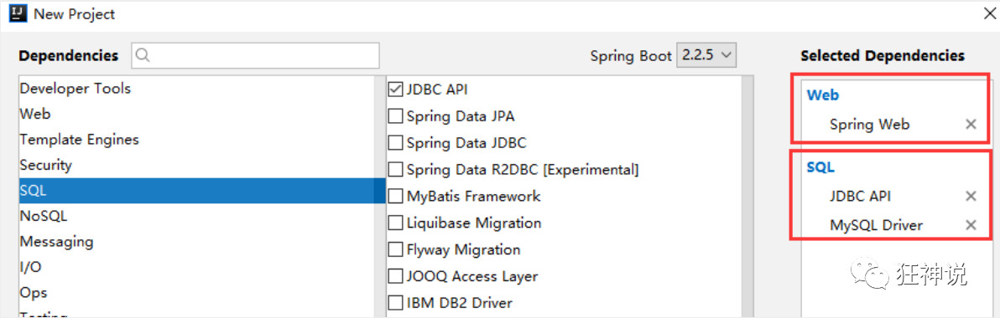

- 2、项目建好之后，发现自动帮我们导入了如下的启动器：

  - ```xml
    <dependency>
        <groupId>org.springframework.boot</groupId>
        <artifactId>spring-boot-starter-jdbc</artifactId>
    </dependency>
    <dependency>
        <groupId>mysql</groupId>
        <artifactId>mysql-connector-java</artifactId>
        <scope>runtime</scope>
    </dependency>
    ```

- 3、编写application.yaml配置文件连接数据库；

  - ```yaml
    spring:
      datasource:
        username: root
        password: 123456
        #?serverTimezone=UTC解决时区的报错
        url: jdbc:mysql://localhost:3306/springboot?serverTimezone=UTC&useUnicode=true&characterEncoding=utf-8
        driver-class-name: com.mysql.cj.jdbc.Driver
    ```

- 4、配置完这一些东西后，我们就可以直接去使用了，因为SpringBoot已经默认帮我们进行了自动配置；去测试类测试一下

  - ```java
    @SpringBootTest
    class SpringbootDataJdbcApplicationTests {
    
        //DI注入数据源
        @Autowired
        DataSource dataSource;
    
        @Test
        public void contextLoads() throws SQLException {
            //看一下默认数据源
            System.out.println(dataSource.getClass());
            //获得连接
            Connection connection =   dataSource.getConnection();
            System.out.println(connection);
            //关闭连接
            connection.close();
        }
    }
    ```

- 结果：我们可以看到他默认给我们配置的数据源为 : class com.zaxxer.hikari.HikariDataSource ， 我们并没有手动配置

- 我们来全局搜索一下，找到数据源的所有自动配置都在 ：DataSourceAutoConfiguration文件：

  - ```java
    @Import(
        {Hikari.class, Tomcat.class, Dbcp2.class, Generic.class, DataSourceJmxConfiguration.class}
    )
    protected static class PooledDataSourceConfiguration {
        protected PooledDataSourceConfiguration() {
        }
    }
    ```

- 这里导入的类都在 DataSourceConfiguration 配置类下，可以看出 Spring Boot 2.2.5 默认使用HikariDataSource 数据源，而以前版本，如 Spring Boot 1.5 默认使用 org.apache.tomcat.jdbc.pool.DataSource 作为数据源；

- **HikariDataSource 号称 Java WEB 当前速度最快的数据源，相比于传统的 C3P0 、DBCP、Tomcat jdbc 等连接池更加优秀；**

- **可以使用 spring.datasource.type 指定自定义的数据源类型，值为 要使用的连接池实现的完全限定名。**

- 关于数据源我们并不做介绍，有了数据库连接，显然就可以 CRUD 操作数据库了。

- 1、有了数据源(com.zaxxer.hikari.HikariDataSource)，然后可以拿到数据库连(java.sql.Connection)，有了连接，就可以使用原生的 JDBC 语句来操作数据库；

- 2、即使不使用第三方第数据库操作框架，如 MyBatis等，Spring 本身也对原生的JDBC 做了轻量级的封装，即JdbcTemplate。

- 3、数据库操作的所有 CRUD 方法都在 JdbcTemplate 中。

- 4、Spring Boot 不仅提供了默认的数据源，同时默认已经配置好了 JdbcTemplate 放在了容器中，程序员只需自己注入即可使用

- 5、JdbcTemplate 的自动配置是依赖 org.springframework.boot.autoconfigure.jdbc 包下的 JdbcTemplateConfiguration 类

- **JdbcTemplate主要提供以下几类方法：**

  - execute方法：可以用于执行任何SQL语句，一般用于执行DDL语句；
  - update方法及batchUpdate方法：update方法用于执行新增、修改、删除等语句；batchUpdate方法用于执行批处理相关语句；
  - query方法及queryForXXX方法：用于执行查询相关语句；
  - call方法：用于执行存储过程、函数相关语句。

- 编写一个Controller，注入 jdbcTemplate，编写测试方法进行访问测试；

- ```java
  @RestController
  @RequestMapping("/jdbc")
  public class JdbcController {
  
      /**
       * Spring Boot 默认提供了数据源，默认提供了 org.springframework.jdbc.core.JdbcTemplate
       * JdbcTemplate 中会自己注入数据源，用于简化 JDBC操作
       * 还能避免一些常见的错误,使用起来也不用再自己来关闭数据库连接
       */
      @Autowired
      JdbcTemplate jdbcTemplate;
  
      //查询employee表中所有数据
      //List 中的1个 Map 对应数据库的 1行数据
      //Map 中的 key 对应数据库的字段名，value 对应数据库的字段值
      @GetMapping("/list")
      public List<Map<String, Object>> userList(){
          String sql = "select * from employee";
          List<Map<String, Object>> maps = jdbcTemplate.queryForList(sql);
          return maps;
      }
      
      //新增一个用户
      @GetMapping("/add")
      public String addUser(){
          //插入语句，注意时间问题
          String sql = "insert into employee(last_name, email,gender,department,birth)" +
                  " values ('狂神说','24736743@qq.com',1,101,'"+ new Date().toLocaleString() +"')";
          jdbcTemplate.update(sql);
          //查询
          return "addOk";
      }
  
      //修改用户信息
      @GetMapping("/update/{id}")
      public String updateUser(@PathVariable("id") int id){
          //插入语句
          String sql = "update employee set last_name=?,email=? where id="+id;
          //数据
          Object[] objects = new Object[2];
          objects[0] = "秦疆";
          objects[1] = "24736743@sina.com";
          jdbcTemplate.update(sql,objects);
          //查询
          return "updateOk";
      }
  
      //删除用户
      @GetMapping("/delete/{id}")
      public String delUser(@PathVariable("id") int id){
          //插入语句
          String sql = "delete from employee where id=?";
          jdbcTemplate.update(sql,id);
          //查询
          return "deleteOk";
      }
      
  }
  ```

  - 测试请求，结果正常；
  - 到此，CURD的基本操作，使用 JDBC 就搞定了。

- 问题：JDBC加载驱动违背了双亲委派机制！？

  - 为什么要违背？
    - 类加载器加载类的范围是有限的：Boostrap加载器、扩展类加载器都是只可以加载指定包下面的类，
    - JDBC的DRiver接口定义在JDK中，但是事实上需要各个数据库服务商来提供，DriverManager 类中要加载各个实现了Driver接口的类，然后进行管理，但是DriverManager位于  $JAVA_HOME中jre/lib/rt.jar 包，由BootStrap类加载器加载，而其Driver接口的实现类是位于服务商提供的 Jar 包，**根据类加载机制，当被装载的类引用了另外一个类的时候，虚拟机就会使用装载第一个类的类装载器装载被引用的类。**也就是说BootStrap类加载器还要去加载jar包中的Driver接口的实现类。
    - 但是事实上我们需要由子类加载器去加载Driver实现，这就破坏了双亲委派模型。
  - 如何违背？
    - 查看DriverManager类的源码，看到在使用DriverManager的时候会触发其静态代码块，调用  loadInitialDrivers() 方法，并调用ServiceLoader.load(Driver.class)  加载所有在META-INF/services/java.sql.Driver 文件里边的类到JVM内存，完成驱动的自动加载。
  - JDBC4.0之前使用Class.forName("")方式加载驱动是不会破坏双亲委派的。
  - JDBC4.0之后使用spi机制才会破坏双亲委派机制。
  - 还违背了**全盘负责委托机制**中A类调用B类,B类则由A类加载器加载的原则

### 10.2 集成Druid

- 什么是Druid？

  - Java程序很大一部分要操作数据库，为了提高性能操作数据库的时候，又不得不使用数据库连接池。
  - Druid 是阿里巴巴开源平台上一个数据库连接池实现，结合了 C3P0、DBCP 等 DB 池的优点，同时加入了日志监控。
  - Druid 可以很好的监控 DB 池连接和 SQL 的执行情况，天生就是针对监控而生的 DB 连接池。
  - Druid已经在阿里巴巴部署了超过600个应用，经过一年多生产环境大规模部署的严苛考验。
  - Spring Boot 2.0 以上默认使用 Hikari 数据源，可以说 Hikari 与 Driud 都是当前 Java Web 上最优秀的数据源，我们来重点介绍 Spring Boot 如何集成 Druid 数据源，如何实现数据库监控。
  - Github地址：https://github.com/alibaba/druid/

- 如何使用？

  - **com.alibaba.druid.pool.DruidDataSource 基本配置参数如下：**
  - 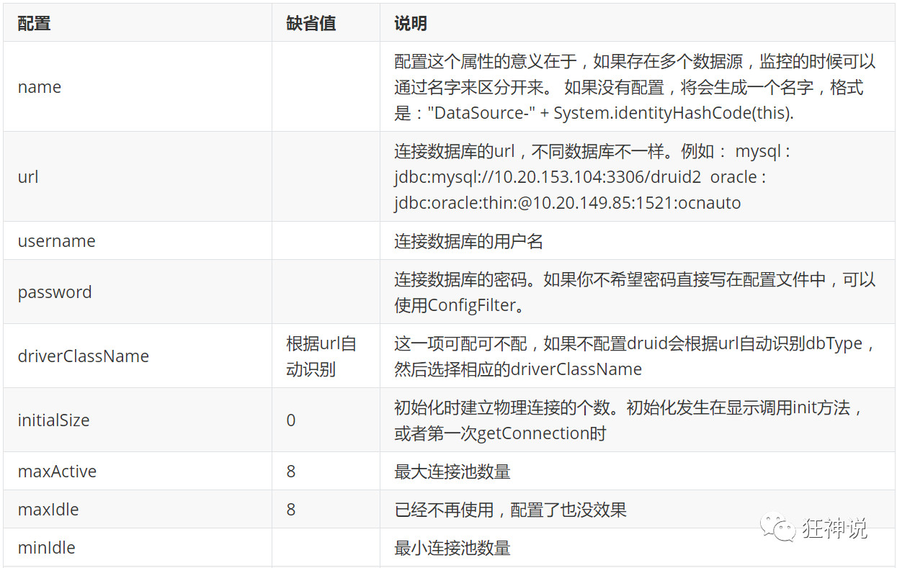

- **配置数据源：**

- 1、添加上 Druid 数据源依赖。

- ```java
  <!-- https://mvnrepository.com/artifact/com.alibaba/druid -->
  <dependency>
      <groupId>com.alibaba</groupId>
      <artifactId>druid</artifactId>
      <version>1.1.21</version>
  </dependency>
  ```

- 2、切换数据源；之前已经说过 Spring Boot 2.0 以上默认使用 com.zaxxer.hikari.HikariDataSource 数据源，但可以 通过 spring.datasource.type 指定数据源。

- ```yaml
  spring:
    datasource:
      username: root
      password: 123456
      url: jdbc:mysql://localhost:3306/springboot?serverTimezone=UTC&useUnicode=true&characterEncoding=utf-8
      driver-class-name: com.mysql.cj.jdbc.Driver
      type: com.alibaba.druid.pool.DruidDataSource # 自定义数据源
  ```

- 3、数据源切换之后，在测试类中注入 DataSource，然后获取到它，输出一看便知是否成功切换；

- 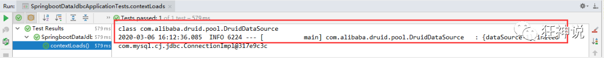

- 4、切换成功！既然切换成功，就可以设置数据源连接初始化大小、最大连接数、等待时间、最小连接数 等设置项；可以查看源码

- ```java
  spring:
    datasource:
      username: root
      password: 123456
      #?serverTimezone=UTC解决时区的报错
      url: jdbc:mysql://localhost:3306/springboot?serverTimezone=UTC&useUnicode=true&characterEncoding=utf-8
      driver-class-name: com.mysql.cj.jdbc.Driver
      type: com.alibaba.druid.pool.DruidDataSource
  
      #Spring Boot 默认是不注入这些属性值的，需要自己绑定
      #druid 数据源专有配置
      initialSize: 5
      minIdle: 5
      maxActive: 20
      maxWait: 60000
      timeBetweenEvictionRunsMillis: 60000
      minEvictableIdleTimeMillis: 300000
      validationQuery: SELECT 1 FROM DUAL
      testWhileIdle: true
      testOnBorrow: false
      testOnReturn: false
      poolPreparedStatements: true
  
      #配置监控统计拦截的filters，stat:监控统计、log4j：日志记录、wall：防御sql注入
      #如果允许时报错  java.lang.ClassNotFoundException: org.apache.log4j.Priority
      #则导入 log4j 依赖即可，Maven 地址：https://mvnrepository.com/artifact/log4j/log4j
      filters: stat,wall,log4j
      maxPoolPreparedStatementPerConnectionSize: 20
      useGlobalDataSourceStat: true
      connectionProperties: druid.stat.mergeSql=true;druid.stat.sl
  ```

- 5、导入Log4j 的依赖

- ```xml
  
  <!-- https://mvnrepository.com/artifact/log4j/log4j -->
  <dependency>
      <groupId>log4j</groupId>
      <artifactId>log4j</artifactId>
      <version>1.2.17</version>
  </dependency>
  ```

- 6、现在需要程序员自己为 DruidDataSource 绑定全局配置文件中的参数，再添加到容器中，而不再使用 Spring Boot 的自动生成了；我们需要 自己添加 DruidDataSource 组件到容器中，并绑定属性；

- ```java
  @Configuration
  public class DruidConfig {
  
      /*
         将自定义的 Druid数据源添加到容器中，不再让 Spring Boot 自动创建
         绑定全局配置文件中的 druid 数据源属性到 com.alibaba.druid.pool.DruidDataSource从而让它们生效
         @ConfigurationProperties(prefix = "spring.datasource")：作用就是将 全局配置文件中
         前缀为 spring.datasource的属性值注入到 com.alibaba.druid.pool.DruidDataSource 的同名参数中
       */
      @ConfigurationProperties(prefix = "spring.datasource")
      @Bean
      public DataSource druidDataSource() {
          return new DruidDataSource();
      }
  
  }
  ```

- 7、去测试类中测试一下；看是否成功！

- ```java
  @SpringBootTest
  class SpringbootDataJdbcApplicationTests {
  
      //DI注入数据源
      @Autowired
      DataSource dataSource;
  
      @Test
      public void contextLoads() throws SQLException {
          //看一下默认数据源
          System.out.println(dataSource.getClass());
          //获得连接
          Connection connection =   dataSource.getConnection();
          System.out.println(connection);
  
          DruidDataSource druidDataSource = (DruidDataSource) dataSource;
          System.out.println("druidDataSource 数据源最大连接数：" + druidDataSource.getMaxActive());
          System.out.println("druidDataSource 数据源初始化连接数：" + druidDataSource.getInitialSize());
  
          //关闭连接
          connection.close();
      }
  }
  ```

- 输出结果 ：可见配置参数已经生效！

- 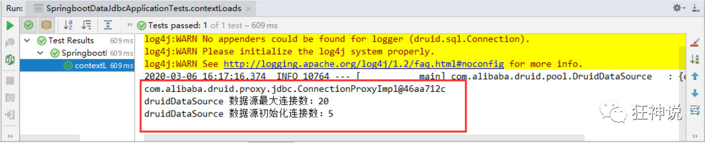

- **配置Druid数据源监控：**

- Druid 数据源具有监控的功能，并提供了一个 web 界面方便用户查看，类似安装 路由器 时，人家也提供了一个默认的 web 页面。

- 1、所以第一步需要设置 Druid 的后台管理页面，比如 登录账号、密码 等；配置后台管理；

- ```java
  //配置 Druid 监控管理后台的Servlet；
  //内置 Servlet 容器时没有web.xml文件，所以使用 Spring Boot 的注册 Servlet 方式
  @Bean
  public ServletRegistrationBean statViewServlet() {
      ServletRegistrationBean bean = new ServletRegistrationBean(new StatViewServlet(), "/druid/*");
  
      // 这些参数可以在 com.alibaba.druid.support.http.StatViewServlet 
      // 的父类 com.alibaba.druid.support.http.ResourceServlet 中找到
      Map<String, String> initParams = new HashMap<>();
      initParams.put("loginUsername", "admin"); //后台管理界面的登录账号
      initParams.put("loginPassword", "123456"); //后台管理界面的登录密码
  
      //后台允许谁可以访问
      //initParams.put("allow", "localhost")：表示只有本机可以访问
      //initParams.put("allow", "")：为空或者为null时，表示允许所有访问
      initParams.put("allow", "");
      //deny：Druid 后台拒绝谁访问
      //initParams.put("kuangshen", "192.168.1.20");表示禁止此ip访问
  
      //设置初始化参数
      bean.setInitParameters(initParams);
      return bean;
  }
  ```

- 配置完毕后，我们可以选择访问 ：http://localhost:8080/druid/login.html

- 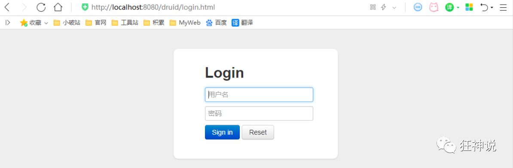

- 进入之后

- 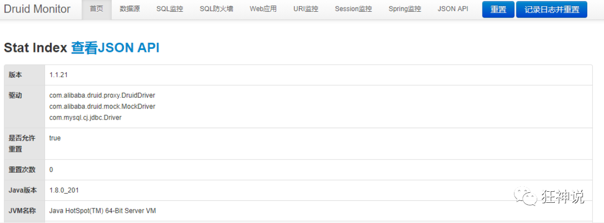

- **配置 Druid web 监控 filter 过滤器**

- ```java
  //配置 Druid 监控 之  web 监控的 filter
  //WebStatFilter：用于配置Web和Druid数据源之间的管理关联监控统计
  @Bean
  public FilterRegistrationBean webStatFilter() {
      FilterRegistrationBean bean = new FilterRegistrationBean();
      bean.setFilter(new WebStatFilter());
  
      //exclusions：设置哪些请求进行过滤排除掉，从而不进行统计
      Map<String, String> initParams = new HashMap<>();
      initParams.put("exclusions", "*.js,*.css,/druid/*,/jdbc/*");
      bean.setInitParameters(initParams);
  
      //"/*" 表示过滤所有请求
      bean.setUrlPatterns(Arrays.asList("/*"));
      return bean;
  }
  ```

### 10.3 整合MyBatis

- 官方文档：http://mybatis.org/spring-boot-starter/mybatis-spring-boot-autoconfigure/

- Maven仓库地址：https://mvnrepository.com/artifact/org.mybatis.spring.boot/mybatis-spring-boot-starter/2.1.1

- 1、导入 MyBatis 所需要的依赖

- ```xml
  <dependency>
      <groupId>org.mybatis.spring.boot</groupId>
      <artifactId>mybatis-spring-boot-starter</artifactId>
      <version>2.1.1</version>
  </dependency>
  ```

- 2、配置数据库连接信息（不变）

- ```java
  spring:
    datasource:
      username: root
      password: 123456
      #?serverTimezone=UTC解决时区的报错
      url: jdbc:mysql://localhost:3306/springboot?serverTimezone=UTC&useUnicode=true&characterEncoding=utf-8
      driver-class-name: com.mysql.cj.jdbc.Driver
      type: com.alibaba.druid.pool.DruidDataSource
  
      #Spring Boot 默认是不注入这些属性值的，需要自己绑定
      #druid 数据源专有配置
      initialSize: 5
      minIdle: 5
      maxActive: 20
      maxWait: 60000
      timeBetweenEvictionRunsMillis: 60000
      minEvictableIdleTimeMillis: 300000
      validationQuery: SELECT 1 FROM DUAL
      testWhileIdle: true
      testOnBorrow: false
      testOnReturn: false
      poolPreparedStatements: true
  
      #配置监控统计拦截的filters，stat:监控统计、log4j：日志记录、wall：防御sql注入
      #如果允许时报错  java.lang.ClassNotFoundException: org.apache.log4j.Priority
      #则导入 log4j 依赖即可，Maven 地址：https://mvnrepository.com/artifact/log4j/log4j
      filters: stat,wall,log4j
      maxPoolPreparedStatementPerConnectionSize: 20
      useGlobalDataSourceStat: true
      connectionProperties: druid.stat.mergeSql=true;druid.stat.slowSqlMillis=500
  ```

- **3、测试数据库是否连接成功！**

- **4、创建实体类，导入 Lombok！**

- ```java
  package com.kuang.pojo;
  
  import lombok.AllArgsConstructor;
  import lombok.Data;
  import lombok.NoArgsConstructor;
  
  @Data
  @NoArgsConstructor
  @AllArgsConstructor
  public class Department {
  
      private Integer id;
      private String departmentName;
  
  }
  ```

- **5、创建mapper目录以及对应的 Mapper 接口**

- ```java
  //@Mapper : 表示本类是一个 MyBatis 的 Mapper,表名注册！
  @Mapper
  @Repository
  public interface DepartmentMapper {
  
      // 获取所有部门信息
      List<Department> getDepartments();
  
      // 通过id获得部门
      Department getDepartment(Integer id);
  
  }
  ```

- **6、对应的Mapper映射文件**

  - 在application.properties中设置mybatis的别名设置！

- ```properties
  mybatis.type-aliases-package=com.king.pojo
  ```

- ```xml
  <?xml version="1.0" encoding="UTF-8" ?>
  <!DOCTYPE mapper
          PUBLIC "-//mybatis.org//DTD Mapper 3.0//EN"
          "http://mybatis.org/dtd/mybatis-3-mapper.dtd">
  
  <mapper namespace="com.kuang.mapper.DepartmentMapper">
  
      <select id="getDepartments" resultType="Department">
         select * from department;
      </select>
  
      <select id="getDepartment" resultType="Department" parameterType="int">
         select * from department where id = #{id};
      </select>
  
  </mapper>
  ```

- **7、maven配置资源过滤问题**

  - 记得IDEA默认使用的Maven是自己安装下载，而不是IDEA默认的，否则无用！

- ```xml
  <resources>
      <resource>
          <directory>src/main/java</directory>
          <includes>
              <include>**/*.xml</include>
          </includes>
          <filtering>true</filtering>
      </resource>
  </resources>
  ```

- **8、编写部门的 DepartmentController 进行测试！**

- ```java
  @RestController
  public class DepartmentController {
      
      @Autowired
      DepartmentMapper departmentMapper;
      
      // 查询全部部门
      @GetMapping("/getDepartments")
      public List<Department> getDepartments(){
          return departmentMapper.getDepartments();
      }
  
      // 查询全部部门
      @GetMapping("/getDepartment/{id}")
      public Department getDepartment(@PathVariable("id") Integer id){
          return departmentMapper.getDepartment(id);
      }
      
  }
  ```

- **启动项目访问进行测试！**

- 代码示例：

- 1、新建一个pojo类 Employee ；

- ```java
  @Data
  @AllArgsConstructor
  @NoArgsConstructor
  public class Employee {
  
      private Integer id;
      private String lastName;
      private String email;
      //1 male, 0 female
      private Integer gender;
      private Integer department;
      private Date birth;
  
      private Department eDepartment; // 冗余设计
  
  }
  ```

- 2、新建一个 EmployeeMapper 接口

- ```java
  //@Mapper : 表示本类是一个 MyBatis 的 Mapper
  @Mapper
  @Repository
  public interface EmployeeMapper {
  
      // 获取所有员工信息
      List<Employee> getEmployees();
  
      // 新增一个员工
      int save(Employee employee);
  
      // 通过id获得员工信息
      Employee get(Integer id);
  
      // 通过id删除员工
      int delete(Integer id);
  
  }
  ```

- 3、编写 EmployeeMapper.xml 配置文件

- ```java
  <?xml version="1.0" encoding="UTF-8" ?>
  <!DOCTYPE mapper
          PUBLIC "-//mybatis.org//DTD Mapper 3.0//EN"
          "http://mybatis.org/dtd/mybatis-3-mapper.dtd">
  
  <mapper namespace="com.kuang.mapper.EmployeeMapper">
  
      <resultMap id="EmployeeMap" type="Employee">
          <id property="id" column="eid"/>
          <result property="lastName" column="last_name"/>
          <result property="email" column="email"/>
          <result property="gender" column="gender"/>
          <result property="birth" column="birth"/>
          <association property="eDepartment"  javaType="Department">
              <id property="id" column="did"/>
              <result property="departmentName" column="dname"/>
          </association>
      </resultMap>
  
      <select id="getEmployees" resultMap="EmployeeMap">
          select e.id as eid,last_name,email,gender,birth,d.id as did,d.department_name as dname
          from department d,employee e
          where d.id = e.department
      </select>
  
      <insert id="save" parameterType="Employee">
          insert into employee (last_name,email,gender,department,birth)
          values (#{lastName},#{email},#{gender},#{department},#{birth});
      </insert>
  
      <select id="get" resultType="Employee">
          select * from employee where id = #{id}
      </select>
  
      <delete id="delete" parameterType="int">
          delete from employee where id = #{id}
      </delete>
  
  </mapper>
  ```

- 4、编写EmployeeController类进行测试

- ```java
  @RestController
  public class EmployeeController {
  
      @Autowired
      EmployeeMapper employeeMapper;
  
      // 获取所有员工信息
      @GetMapping("/getEmployees")
      public List<Employee> getEmployees(){
          return employeeMapper.getEmployees();
      }
  
      @GetMapping("/save")
      public int save(){
          Employee employee = new Employee();
          employee.setLastName("kuangshen");
          employee.setEmail("qinjiang@qq.com");
          employee.setGender(1);
          employee.setDepartment(101);
          employee.setBirth(new Date());
          return employeeMapper.save(employee);
      }
  
      // 通过id获得员工信息
      @GetMapping("/get/{id}")
      public Employee get(@PathVariable("id") Integer id){
          return employeeMapper.get(id);
      }
  
      // 通过id删除员工
      @GetMapping("/delete/{id}")
      public int delete(@PathVariable("id") Integer id){
          return employeeMapper.delete(id);
      }
  
  }
  ```

- 测试结果完成，搞定收工！

## 11. Spring Security

- 为什么需要安全？
  - 在 Web 开发中，安全一直是非常重要的一个方面。安全虽然属于应用的非功能性需求，但是应该在应用开发的初期就考虑进来。如果在应用开发的后期才考虑安全的问题，就可能陷入一个两难的境地：一方面，应用存在严重的安全漏洞，无法满足用户的要求，并可能造成用户的隐私数据被攻击者窃取；另一方面，应用的基本架构已经确定，要修复安全漏洞，可能需要对系统的架构做出比较重大的调整，因而需要更多的开发时间，影响应用的发布进程。因此，从应用开发的第一天就应该把安全相关的因素考虑进来，并在整个应用的开发过程中。
  - 市面上存在比较有名的：Shiro，Spring Security ！
  - 这里需要阐述一下的是，每一个框架的出现都是为了解决某一问题而产生了，那么Spring Security框架的出现是为了解决什么问题呢？
- 什么是Spring Security？
  - Spring Security是一个功能强大且高度可定制的身份验证和访问控制框架。它实际上是保护基于spring的应用程序的标准。
  - Spring Security是一个框架，侧重于为Java应用程序提供身份验证和授权。与所有Spring项目一样，Spring安全性的真正强大之处在于它可以轻松地扩展以满足定制需求
  - 从官网的介绍中可以知道这是一个权限框架。想我们之前做项目是没有使用框架是怎么控制权限的？对于权限 一般会细分为功能权限，访问权限，和菜单权限。代码会写的非常的繁琐，冗余。
  - 怎么解决之前写权限代码繁琐，冗余的问题，一些主流框架就应运而生而Spring Scecurity就是其中的一种。
  - Spring 是一个非常流行和成功的 Java 应用开发框架。Spring Security 基于 Spring 框架，提供了一套 Web 应用安全性的完整解决方案。一般来说，Web 应用的安全性包括用户认（Authentication）和用户授权（Authorization）两个部分。用户认证指的是验证某个用户是否为系统中的合法主体，也就是说用户能否访问该系统。用户认证一般要求用户提供用户名和密码。系统通过校验用户名和密码来完成认证过程。用户授权指的是验证某个用户是否有权限执行某个操作。在一个系统中，不同用户所具有的权限是不同的。比如对一个文件来说，有的用户只能进行读取，而有的用户可以进行修改。一般来说，系统会为不同的用户分配不同的角色，而每个角色则对应一系列的权限。
  - 对于上面提到的两种应用情景，Spring Security 框架都有很好的支持。在用户认证方面，Spring Security 框架支持主流的认证方式，包括 HTTP 基本认证、HTTP 表单验证、HTTP 摘要认证、OpenID 和 LDAP 等。在用户授权方面，Spring Security 提供了基于角色的访问控制和访问控制列表（Access Control List，ACL），可以对应用中的领域对象进行细粒度的控制。
- 如何使用Spring Security？
  - Spring Security 是针对Spring项目的安全框架，也是Spring Boot底层安全模块默认的技术选型，他可以实现强大的Web安全控制，对于安全控制，我们仅需要引入 spring-boot-starter-security 模块，进行少量的配置，即可实现强大的安全管理！
  - 记住几个类：
    - WebSecurityConfigurerAdapter：自定义Security策略
    - AuthenticationManagerBuilder：自定义认证策略
    - @EnableWebSecurity：开启WebSecurity模式
- Spring Security的两个主要目标是 “认证” 和 “授权”（访问控制）。
  - **“认证”（Authentication）**
    - 身份验证是关于验证您的凭据，如用户名/用户ID和密码，以验证您的身份。
    - 身份验证通常通过用户名和密码完成，有时与身份验证因素结合使用。
  -  **“授权” （Authorization）**
    - 授权发生在系统成功验证您的身份后，最终会授予您访问资源（如信息，文件，数据库，资金，位置，几乎任何内容）的完全权限。
- 这个概念是通用的，而不是只在Spring Security 中存在。
- 如何使用Spring Security？
  - 建议官网文档：参考官网：https://spring.io/projects/spring-security 
  - 建议视频也可：https://www.bilibili.com/video/BV1PE411i7CV?p=38

## 12. Shrio

- 建议百度、官网学习！
- 或者其他人的笔记：https://blog.csdn.net/weixin_44635198/article/details/107701061

## 14. Swagger

- 为什么需要Swagger？
  - **前后端分离**
    - 前端 -> 前端控制层、视图层
    - 后端 -> 后端控制层、服务层、数据访问层
    - 前后端通过API进行交互
    - 前后端相对独立且松耦合
  - **产生的问题**
    - 前后端集成，前端或者后端无法做到“及时协商，尽早解决”，最终导致问题集中爆发
  - **解决方案**
    - 首先定义schema [ 计划的提纲 ]，并实时跟踪最新的API，降低集成风险
- Swagger有什么用？
  - 号称世界上最流行的API框架
  - Restful Api 文档在线自动生成器 => **API 文档 与API 定义同步更新**
  - 直接运行，在线测试API
  - 支持多种语言 （如：Java，PHP等）
  - 官网：https://swagger.io/

### 14.1 SpringBoot集成Swagger

- **SpringBoot集成Swagger** => **springfox**，两个jar包

  - **Springfox-swagger2**
  - swagger-springmvc

- **使用Swagger**

  - 要求：jdk 1.8 + 否则swagger2无法运行

- 步骤：

- 1、新建一个SpringBoot-web项目

- 2、添加Maven依赖

- ```xml
  <!-- https://mvnrepository.com/artifact/io.springfox/springfox-swagger2 -->
  <dependency>
     <groupId>io.springfox</groupId>
     <artifactId>springfox-swagger2</artifactId>
     <version>2.9.2</version>
  </dependency>
  <!-- https://mvnrepository.com/artifact/io.springfox/springfox-swagger-ui -->
  <dependency>
     <groupId>io.springfox</groupId>
     <artifactId>springfox-swagger-ui</artifactId>
     <version>2.9.2</version>
  </dependency>
  ```

- 3、编写HelloController，测试确保运行成功！

- 4、要使用Swagger，我们需要编写一个配置类-SwaggerConfig来配置 Swagger

- ```java
  @Configuration //配置类
  @EnableSwagger2// 开启Swagger2的自动配置
  public class SwaggerConfig {  
  }
  ```

- 5、访问测试 ：http://localhost:8080/swagger-ui.html ，可以看到swagger的界面；

- 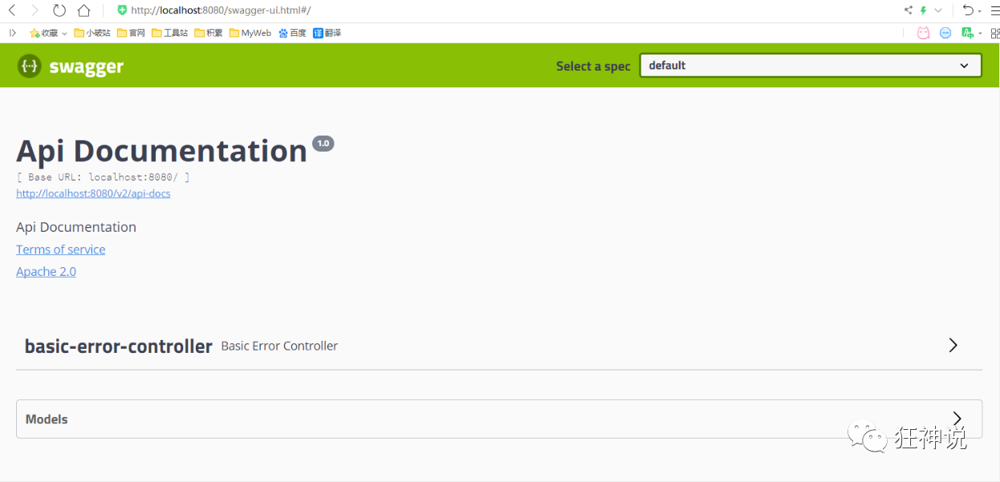

### 14.2 配置Swagger

- 1、Swagger实例Bean是Docket，所以通过配置Docket实例来配置Swaggger。

- ```java
  @Bean //配置docket以配置Swagger具体参数
  public Docket docket() {
     return new Docket(DocumentationType.SWAGGER_2);
  }
  ```

- 2、可以通过apiInfo()属性配置文档信息

- ```java
  //配置文档信息
  private ApiInfo apiInfo() {
     Contact contact = new Contact("联系人名字", "http://xxx.xxx.com/联系人访问链接", "联系人邮箱");
     return new ApiInfo(
             "Swagger学习", // 标题
             "学习演示如何配置Swagger", // 描述
             "v1.0", // 版本
             "http://terms.service.url/组织链接", // 组织链接
             contact, // 联系人信息
             "Apach 2.0 许可", // 许可
             "许可链接", // 许可连接
             new ArrayList<>()// 扩展
    );
  }
  ```

- 3、Docket 实例关联上 apiInfo()

- ```java
  @Bean
  public Docket docket() {
     return new Docket(DocumentationType.SWAGGER_2).apiInfo(apiInfo());
  }
  ```

- 4、重启项目，访问测试 http://localhost:8080/swagger-ui.html  看下效果；

### 14.3 配置扫描接口

- 1、构建Docket时通过select()方法配置怎么扫描接口。

- ```java
  @Bean
  public Docket docket() {
     return new Docket(DocumentationType.SWAGGER_2)
        .apiInfo(apiInfo())
        .select()// 通过.select()方法，去配置扫描接口,RequestHandlerSelectors配置如何扫描接口
        .apis(RequestHandlerSelectors.basePackage("com.kuang.swagger.controller"))
        .build();
  }
  ```

- 2、重启项目测试，由于我们配置根据包的路径扫描接口，所以我们只能看到一个类

- 3、除了通过包路径配置扫描接口外，还可以通过配置其他方式扫描接口，这里注释一下所有的配置方式：

- ```java
  any() // 扫描所有，项目中的所有接口都会被扫描到
  none() // 不扫描接口
  // 通过方法上的注解扫描，如withMethodAnnotation(GetMapping.class)只扫描get请求
  withMethodAnnotation(final Class<? extends Annotation> annotation)
  // 通过类上的注解扫描，如.withClassAnnotation(Controller.class)只扫描有controller注解的类中的接口
  withClassAnnotation(final Class<? extends Annotation> annotation)
  basePackage(final String basePackage) // 根据包路径扫描接口
  ```

- 4、除此之外，我们还可以配置接口扫描过滤：

- ```java
  @Bean
  public Docket docket() {
     return new Docket(DocumentationType.SWAGGER_2)
        .apiInfo(apiInfo())
        .select()// 通过.select()方法，去配置扫描接口,RequestHandlerSelectors配置如何扫描接口
        .apis(RequestHandlerSelectors.basePackage("com.kuang.swagger.controller"))
         // 配置如何通过path过滤,即这里只扫描请求以/kuang开头的接口
        .paths(PathSelectors.ant("/kuang/**"))
        .build();
  }
  ```

- 5、这里的可选值还有

- ```java
  any() // 任何请求都扫描
  none() // 任何请求都不扫描
  regex(final String pathRegex) // 通过正则表达式控制
  ant(final String antPattern) // 通过ant()控制
  ```

### 14.4 配置Swagger开关

- 1、通过enable()方法配置是否启用swagger，如果是false，swagger将不能在浏览器中访问了

- ```java
  @Bean
  public Docket docket() {
     return new Docket(DocumentationType.SWAGGER_2)
        .apiInfo(apiInfo())
        .enable(false) //配置是否启用Swagger，如果是false，在浏览器将无法访问
        .select()// 通过.select()方法，去配置扫描接口,RequestHandlerSelectors配置如何扫描接口
        .apis(RequestHandlerSelectors.basePackage("com.kuang.swagger.controller"))
         // 配置如何通过path过滤,即这里只扫描请求以/kuang开头的接口
        .paths(PathSelectors.ant("/kuang/**"))
        .build();
  }
  ```

- 2、如何动态配置当项目处于test、dev环境时显示swagger，处于prod时不显示？

- ```java
  @Bean
  public Docket docket(Environment environment) {
     // 设置要显示swagger的环境
     Profiles of = Profiles.of("dev", "test");
     // 判断当前是否处于该环境
     // 通过 enable() 接收此参数判断是否要显示
     boolean b = environment.acceptsProfiles(of);
     
     return new Docket(DocumentationType.SWAGGER_2)
        .apiInfo(apiInfo())
        .enable(b) //配置是否启用Swagger，如果是false，在浏览器将无法访问
        .select()// 通过.select()方法，去配置扫描接口,RequestHandlerSelectors配置如何扫描接口
        .apis(RequestHandlerSelectors.basePackage("com.kuang.swagger.controller"))
         // 配置如何通过path过滤,即这里只扫描请求以/kuang开头的接口
        .paths(PathSelectors.ant("/kuang/**"))
        .build();
  }
  ```

- 3、可以在项目中增加一个dev的配置文件（application-dev.properties）查看效果！\

- 

### 14.5 配置API分组

- 1、如果没有配置分组，默认是default。通过groupName()方法即可配置分组：

- ```java
  @Bean
  public Docket docket(Environment environment) {
     return new Docket(DocumentationType.SWAGGER_2).apiInfo(apiInfo())
        .groupName("hello") // 配置分组
         // 省略配置....
  }
  ```

- 2、重启项目查看分组

- 3、如何配置多个分组？配置多个分组只需要配置多个docket即可：

- ```java
  @Bean
  public Docket docket1(){
     return new Docket(DocumentationType.SWAGGER_2).groupName("group1");
  }
  @Bean
  public Docket docket2(){
     return new Docket(DocumentationType.SWAGGER_2).groupName("group2");
  }
  @Bean
  public Docket docket3(){
     return new Docket(DocumentationType.SWAGGER_2).groupName("group3");
  }
  ```

- 4、重启项目查看即可

### 14.6 实体配置

- 1、新建一个实体类

- ```java
  @ApiModel("用户实体")
  public class User {
     @ApiModelProperty("用户名")
     public String username;
     @ApiModelProperty("密码")
     public String password;
  }
  ```

- 2、只要这个实体在**请求接口**的返回值上（即使是泛型），都能映射到实体项中：

- ```java
  @RequestMapping("/getUser")
  public User getUser(){
     return new User();
  }
  ```

- 3、重启查看测试

- 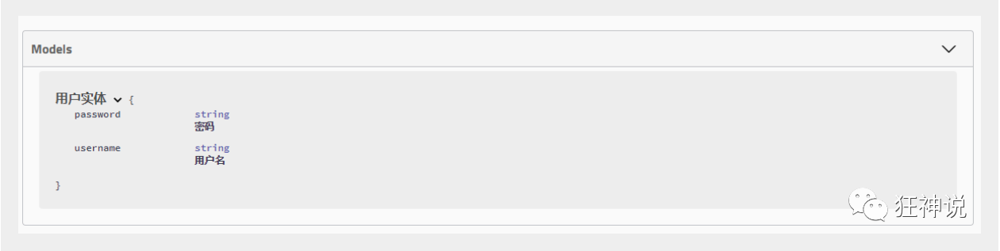

- 注：并不是因为@ApiModel这个注解让实体显示在这里了，而是只要出现在接口方法的返回值上的实体都会显示在这里，而@ApiModel和@ApiModelProperty这两个注解只是为实体添加注释的。

  - @ApiModel为类添加注释
  - @ApiModelProperty为类属性添加注释

- 常用注解：

  - Swagger的所有注解定义在io.swagger.annotations包下

  - 也可以给请求的接口配置一些注释

  - ```java
    @ApiOperation("狂神的接口")
    @PostMapping("/kuang")
    @ResponseBody
    public String kuang(@ApiParam("这个名字会被返回")String username){
       return username;
    }
    ```

- 这样的话，可以给一些比较难理解的属性或者接口，增加一些配置信息，让人更容易阅读！

- 相较于传统的Postman或Curl方式测试接口，使用swagger简直就是傻瓜式操作，不需要额外说明文档(写得好本身就是文档)而且更不容易出错，只需要录入数据然后点击Execute，如果再配合自动化框架，可以说基本就不需要人为操作了。

- Swagger是个优秀的工具，现在国内已经有很多的中小型互联网公司都在使用它，相较于传统的要先出Word接口文档再测试的方式，显然这样也更符合现在的快速迭代开发行情。当然了，提醒下大家在正式环境要记得关闭Swagger，一来出于安全考虑二来也可以节省运行时内存。

## 15. 任务

- 为什么需要异步任务？定时任务？邮件任务？
  - 在我们的工作中，常常会用到异步处理任务，比如我们在网站上发送邮件，后台会去发送邮件，此时前台会造成响应不动，直到邮件发送完毕，响应才会成功，所以我们一般会采用多线程的方式去处理这些任务。还有一些定时任务，比如需要在每天凌晨的时候，分析一次前一天的日志信息。还有就是邮件的发送，微信的前身也是邮件服务呢？这些东西都是怎么实现的呢？其实SpringBoot都给我们提供了对应的支持，我们上手使用十分的简单，只需要开启一些注解支持，配置一些配置文件即可！

### 15.1 异步任务

- 1、创建一个service包

- 2、创建一个类AsyncService

  - 异步处理还是非常常用的，比如我们在网站上发送邮件，后台会去发送邮件，此时前台会造成响应不动，直到邮件发送完毕，响应才会成功，所以我们一般会采用多线程的方式去处理这些任务。

  - 编写方法，假装正在处理数据，使用线程设置一些延时，模拟同步等待的情况；

  - ```java
    @Service
    public class AsyncService {
    
       public void hello(){
           try {
               Thread.sleep(3000);
          } catch (InterruptedException e) {
               e.printStackTrace();
          }
           System.out.println("业务进行中....");
      }
    }
    ```

- 3、编写controller包

- 4、编写AsyncController类

  - ```java
    @RestController
    public class AsyncController {
    
       @Autowired
       AsyncService asyncService;
    
       @GetMapping("/hello")
       public String hello(){
           asyncService.hello();
           return "success";
      }
    
    }
    ```

- 5、访问http://localhost:8080/hello进行测试，3秒后出现success，这是同步等待的情况。

  - 问题：我们如果想让用户直接得到消息，就在后台使用多线程的方式进行处理即可，但是每次都需要自己手动去编写多线程的实现的话，太麻烦了，我们只需要用一个简单的办法，在我们的方法上加一个简单的注解即可，如下：

- 6、给hello方法添加@Async注解；

  - ```java
    //告诉Spring这是一个异步方法
    @Async
    public void hello(){
       try {
           Thread.sleep(3000);
      } catch (InterruptedException e) {
           e.printStackTrace();
      }
       System.out.println("业务进行中....");
    }
    ```

  - SpringBoot就会自己开一个线程池，进行调用！但是要让这个注解生效，我们还需要在主程序上添加一个注解@EnableAsync ，开启异步注解功能；

  - ```java
    @EnableAsync //开启异步注解功能
    @SpringBootApplication
    public class SpringbootTaskApplication {
    
       public static void main(String[] args) {
           SpringApplication.run(SpringbootTaskApplication.class, args);
      }
    
    }
    ```

- 7、重启测试，网页瞬间响应，后台代码依旧执行！

### 15.2 定时任务

- 项目开发中经常需要执行一些定时任务，比如需要在每天凌晨的时候，分析一次前一天的日志信息，Spring为我们提供了异步执行任务调度的方式，提供了两个接口。

  - TaskExecutor接口
  - TaskScheduler接口

- 两个注解：

  - @EnableScheduling
  - @Scheduled

- **cron表达式：**自己百度语法即可！

- 代码示例：

- 1、创建一个ScheduledService

  - 我们里面存在一个hello方法，他需要定时执行，怎么处理呢？

  - ```java
    @Service
    public class ScheduledService {
       
       //秒   分   时     日   月   周几
       //0 * * * * MON-FRI
       //注意cron表达式的用法；
       @Scheduled(cron = "0 * * * * 0-7")
       public void hello(){
           System.out.println("hello.....");
      }
    }
    ```

- 2、这里写完定时任务之后，我们需要在主程序上增加@EnableScheduling 开启定时任务功能

- ```java
  @EnableAsync //开启异步注解功能
  @EnableScheduling //开启基于注解的定时任务
  @SpringBootApplication
  public class SpringbootTaskApplication {
  
     public static void main(String[] args) {
         SpringApplication.run(SpringbootTaskApplication.class, args);
    }
  
  }
  ```

- 3、我们来详细了解下cron表达式；http://www.bejson.com/othertools/cron/

### 15.3 邮件任务

- 邮件发送，在我们的日常开发中，也非常的多，Springboot也帮我们做了支持

  - 邮件发送需要引入spring-boot-start-mail
  - SpringBoot 自动配置MailSenderAutoConfiguration
  - 定义MailProperties内容，配置在application.yml中
  - 自动装配JavaMailSender
  - 测试邮件发送

- 代码示例：

- 1、引入pom依赖

- ```xml
  <dependency>
     <groupId>org.springframework.boot</groupId>
     <artifactId>spring-boot-starter-mail</artifactId>
  </dependency>
  ```

  - 看它引入的依赖，可以看到 jakarta.mail

  - ```xml
    <dependency>
       <groupId>com.sun.mail</groupId>
       <artifactId>jakarta.mail</artifactId>
       <version>1.6.4</version>
       <scope>compile</scope>
    </dependency>
    ```

- 2、查看自动配置类：MailSenderAutoConfiguration

  - 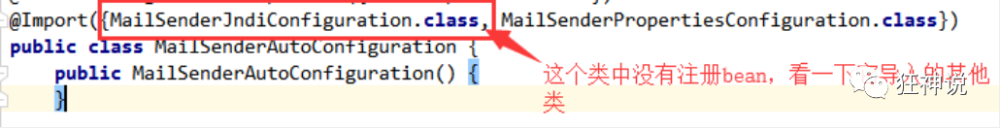

  - 这个类中存在bean，JavaMailSenderImpl

  - 

  - 然后我们去看下配置文件

  - ```java
    @ConfigurationProperties(
       prefix = "spring.mail"
    )
    public class MailProperties {
       private static final Charset DEFAULT_CHARSET;
       private String host;
       private Integer port;
       private String username;
       private String password;
       private String protocol = "smtp";
       private Charset defaultEncoding;
       private Map<String, String> properties;
       private String jndiName;
    }
    ```

- 3、配置文件：

  - ```xml
    spring.mail.username=24736743@qq.com
    spring.mail.password=你的qq授权码
    spring.mail.host=smtp.qq.com
    # qq需要配置ssl
    spring.mail.properties.mail.smtp.ssl.enable=true
    ```

  - 获取授权码：在QQ邮箱中的设置->账户->开启pop3和smtp服务

  - 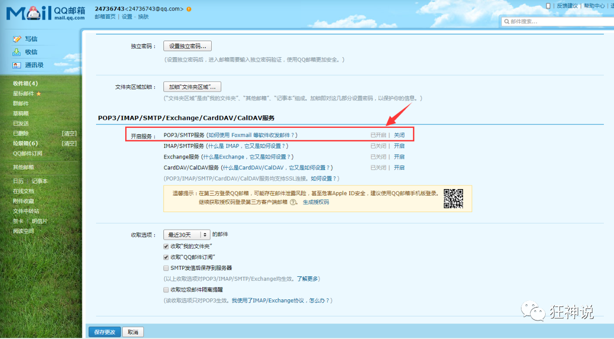

- 4、Spring单元测试

  - ```java
    @Autowired
    JavaMailSenderImpl mailSender;
    
    @Test
    public void contextLoads() {
       //邮件设置1：一个简单的邮件
       SimpleMailMessage message = new SimpleMailMessage();
       message.setSubject("通知-明天来狂神这听课");
       message.setText("今晚7:30开会");
    
       message.setTo("24736743@qq.com");
       message.setFrom("24736743@qq.com");
       mailSender.send(message);
    }
    
    @Test
    public void contextLoads2() throws MessagingException {
       //邮件设置2：一个复杂的邮件
       MimeMessage mimeMessage = mailSender.createMimeMessage();
       MimeMessageHelper helper = new MimeMessageHelper(mimeMessage, true);
    
       helper.setSubject("通知-明天来狂神这听课");
       helper.setText("<b style='color:red'>今天 7:30来开会</b>",true);
    
       //发送附件
       helper.addAttachment("1.jpg",new File(""));
       helper.addAttachment("2.jpg",new File(""));
    
       helper.setTo("24736743@qq.com");
       helper.setFrom("24736743@qq.com");
    
       mailSender.send(mimeMessage);
    }
    ```

- 查看邮箱，邮件接收成功！

- 我们只需要使用Thymeleaf进行前后端结合即可开发自己网站邮件收发功能了！

## 16. 富文本编辑器

- 问题：平时在博客园，或者CSDN等平台进行写作的时候，有同学思考过他们的编辑器是怎么实现的吗？
- 在博客园后台的选项设置中，可以看到一个文本编辑器的选项：
- 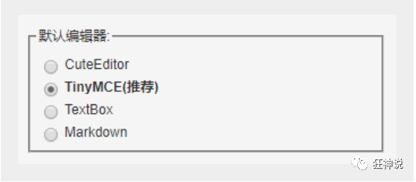
- 其实这个就是富文本编辑器，市面上有许多非常成熟的富文本编辑器，比如：

  - **Editor.md**——功能非常丰富的编辑器，左端编辑，右端预览，非常方便，完全免费

  - - 官网：https://pandao.github.io/editor.md/

  - **wangEditor**——基于javascript和css开发的 Web富文本编辑器， 轻量、简洁、界面美观、易用、开源免费。

  - - 官网：http://www.wangeditor.com/

  - **TinyMCE**——TinyMCE是一个轻量级的基于浏览器的所见即所得编辑器，由JavaScript写成。它对IE6+和Firefox1.5+都有着非常良好的支持。功能齐全，界面美观，就是文档是英文的，对开发人员英文水平有一定要求。

  - - 官网：https://www.tiny.cloud/docs/demo/full-featured/
    - 博客园

  - **百度ueditor**——UEditor是由百度web前端研发部开发所见即所得富文本web编辑器，具有轻量，功能齐全，可定制，注重用户体验等特点，开源基于MIT协议，允许自由使用和修改代码，缺点是已经没有更新了

  - - 官网：https://ueditor.baidu.com/website/onlinedemo.html

  - **kindeditor**——界面经典。

  - - 官网：http://kindeditor.net/demo.php

  - **Textbox**——Textbox是一款极简但功能强大的在线文本编辑器，支持桌面设备和移动设备。主要功能包含内置的图像处理和存储、文件拖放、拼写检查和自动更正。此外，该工具还实现了屏幕阅读器等辅助技术，并符合WAI-ARIA可访问性标准。

  - - 官网：https://textbox.io/

  - **CKEditor**——国外的，界面美观。

  - - 官网：https://ckeditor.com/ckeditor-5/demo/

  - **quill**——功能强大，还可以编辑公式等

  - - 官网：https://quilljs.com/

  - **simditor**——界面美观，功能较全。

  - - 官网：https://simditor.tower.im/

  - **summernote**——UI好看，精美

  - - 官网：https://summernote.org/

  - **jodit**——功能齐全

  - - 官网：https://xdsoft.net/jodit/

  - **froala Editor**——界面非常好看，功能非常强大，非常好用（非免费）

  - - 官网：https://www.froala.com/wysiwyg-editor
- 总之，目前可用的富文本编辑器有很多......这只是其中的一部分
- 建议自己百度学习、自己找博客项目实现即可！

## 17. 分布式

- 什么是分布式系统？
  - 在《分布式系统原理与范型》一书中有如下定义：“分布式系统是若干独立计算机的集合，这些计算机对于用户来说就像单个相关系统”；
  - 分布式系统是由一组通过网络进行通信、为了完成共同的任务而协调工作的计算机节点组成的系统。分布式系统的出现是为了用廉价的、普通的机器完成单个计算机无法完成的计算、存储任务。其目的是**利用更多的机器，处理更多的数据**。
  - 分布式系统（distributed system）是建立在网络之上的软件系统。
- 为什么需要分布式架构？
  - 首先需要明确的是，只有当单个节点的处理能力无法满足日益增长的计算、存储任务的时候，且硬件的提升（加内存、加磁盘、使用更好的CPU）高昂到得不偿失的时候，应用程序也不能进一步优化的时候，我们才需要考虑分布式系统。因为，分布式系统要解决的问题本身就是和单机系统一样的，而由于分布式系统多节点、通过网络通信的拓扑结构，会引入很多单机系统没有的问题，为了解决这些问题又会引入更多的机制、协议，带来更多的问题。。。
- 单一应用架构：
  - 当网站流量很小时，只需一个应用，将所有功能都部署在一起，以减少部署节点和成本。此时，用于简化增删改查工作量的数据访问框架(ORM)是关键。
  - 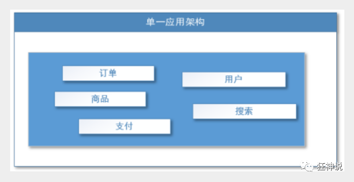
  - 适用于小型网站，小型管理系统，将所有功能都部署到一个功能里，简单易用。
  - **缺点：**
    - 1、性能扩展比较难
    - 2、协同开发问题
    - 3、不利于升级维护
- 垂直应用架构：
  - 当访问量逐渐增大，单一应用增加机器带来的加速度越来越小，将应用拆成互不相干的几个应用，以提升效率。此时，用于加速前端页面开发的Web框架(MVC)是关键。
  - 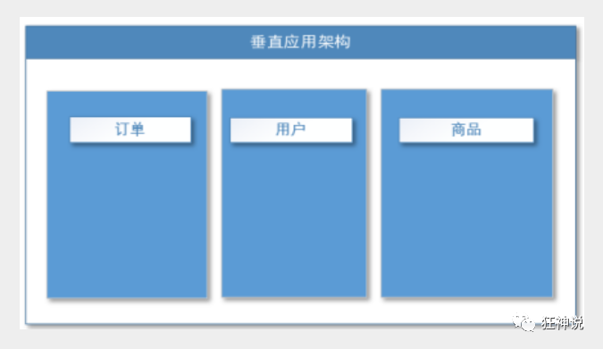
  - 通过切分业务来实现各个模块独立部署，降低了维护和部署的难度，团队各司其职更易管理，性能扩展也更方便，更有针对性。
  - 缺点：公用模块无法重复利用，开发性的浪费
- 分布式服务架构：
  - 当垂直应用越来越多，应用之间交互不可避免，将核心业务抽取出来，作为独立的服务，逐渐形成稳定的服务中心，使前端应用能更快速的响应多变的市场需求。此时，用于提高业务复用及整合的**分布式服务框架(RPC)**是关键。
  - 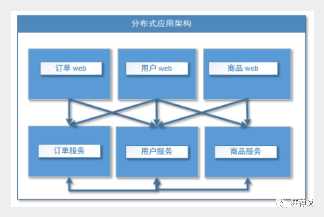
- 流动计算架构：
  - 当服务越来越多，容量的评估，小服务资源的浪费等问题逐渐显现，此时需增加一个调度中心基于访问压力实时管理集群容量，提高集群利用率。此时，用于**提高机器利用率的资源调度和治理中心**(SOA)[ Service Oriented Architecture]是关键
  - 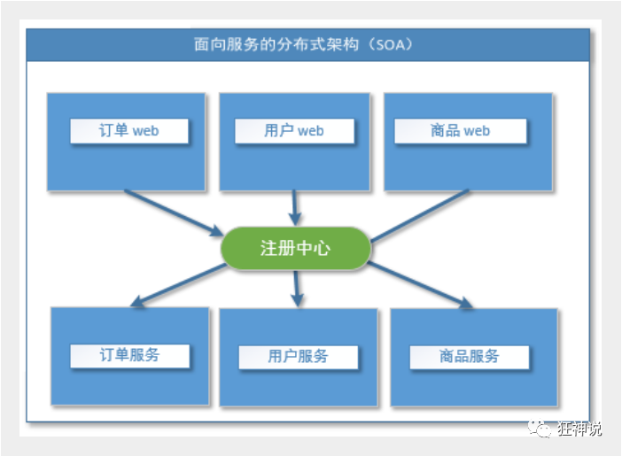
- 什么是RPC？
  - RPC【Remote Procedure Call】是指远程过程调用，是一种进程间通信方式，他是一种技术的思想，而不是规范。它允许程序调用另一个地址空间（通常是共享网络的另一台机器上）的过程或函数，而不用程序员显式编码这个远程调用的细节。即程序员无论是调用本地的还是远程的函数，本质上编写的调用代码基本相同。
  - 也就是说两台服务器A，B，一个应用部署在A服务器上，想要调用B服务器上应用提供的函数/方法，由于不在一个内存空间，不能直接调用，需要通过网络来表达调用的语义和传达调用的数据。为什么要用RPC呢？就是无法在一个进程内，甚至一个计算机内通过本地调用的方式完成的需求，比如不同的系统间的通讯，甚至不同的组织间的通讯，由于计算能力需要横向扩展，需要在多台机器组成的集群上部署应用。RPC就是要像调用本地的函数一样去调远程函数；
  - 推荐阅读文章：https://www.jianshu.com/p/2accc2840a1b
- **RPC基本原理**
  - 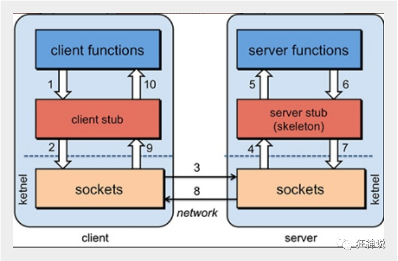
  - **步骤解析：**
  - 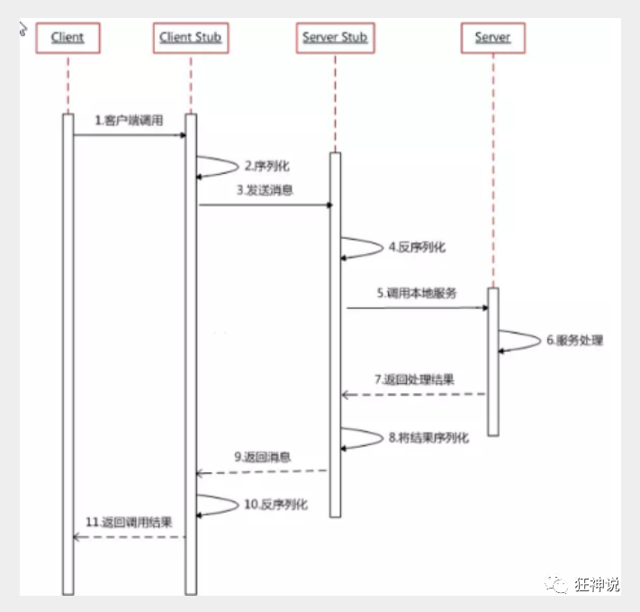
- **RPC两个核心模块：通讯，序列化。**
- 什么是Dubbo？
  - RPC的具体实现框架！
  - Apache Dubbo |ˈdʌbəʊ| 是一款高性能、轻量级的开源Java RPC框架，它提供了三大核心能力：面向接口的远程方法调用，智能容错和负载均衡，以及服务自动注册和发现。
  - dubbo官网 http://dubbo.apache.org/zh-cn/index.html
    - 1.了解Dubbo的特性
    - 2.查看官方文档
  - 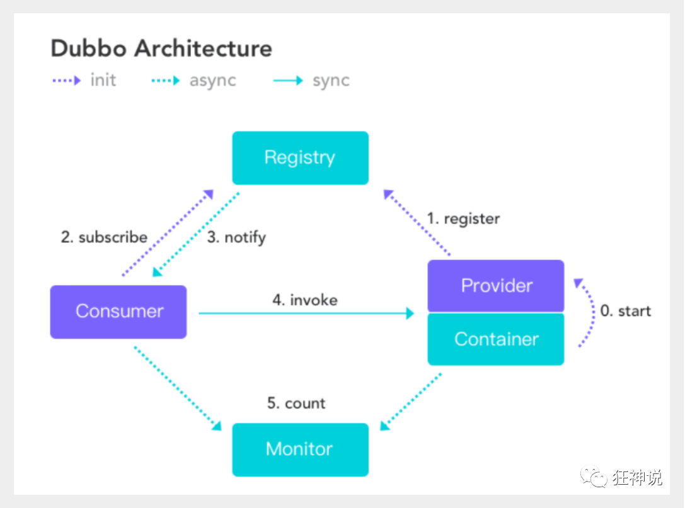
  - **服务提供者**（Provider）：暴露服务的服务提供方，服务提供者在启动时，向注册中心注册自己提供的服务
  - **服务消费者**（Consumer）：调用远程服务的服务消费方，服务消费者在启动时，向注册中心订阅自己所需的服务，服务消费者，从提供者地址列表中，基于软负载均衡算法，选一台提供者进行调用，如果调用失败，再选另一台调用。
  - **注册中心**（Registry）：注册中心返回服务提供者地址列表给消费者，如果有变更，注册中心将基于长连接推送变更数据给消费者
  - **监控中心**（Monitor）：服务消费者和提供者，在内存中累计调用次数和调用时间，定时每分钟发送一次统计数据到监控中心
  - **调用关系说明**
    - l 服务容器负责启动，加载，运行服务提供者。
    - l 服务提供者在启动时，向注册中心注册自己提供的服务。
    - l 服务消费者在启动时，向注册中心订阅自己所需的服务。
    - l 注册中心返回服务提供者地址列表给消费者，如果有变更，注册中心将基于长连接推送变更数据给消费者。
    - l 服务消费者，从提供者地址列表中，基于软负载均衡算法，选一台提供者进行调用，如果调用失败，再选另一台调用。
    - l 服务消费者和提供者，在内存中累计调用次数和调用时间，定时每分钟发送一次统计数据到监控中心。
- 如何使用Dubbo？
  - 自己看官网、视频、博客等！！！
  - Dubbo和Zookeeper注册中心配合使用
  - SpringBoot也可以整合Dubbo、Zookeeper！

## 18. 总结概括！

- Java开发：总结！
- **三层架构：**MVC=》解耦！
  - 使用框架：**约定大于配置**
    - Spring：解决企业开发的复杂性问题
      - IOC：控制反转：将对象的创建交给用户来实现，想用就从容器中获取就行！
      - AOP：切面，本质是动态代理
        - 不影响业务本来的情况下，实现动态增加功能，
        - 一般用于在日志、事务等
      - 问题：配置复杂！
    - SpringBoot：新一代JavaEE的开发标准
      - 解决了Spring的配置复杂问题，开箱即用，自动装配
- **微服务架构：**分布式、、、=》模块化、功能化！
  - 用户越来越多！=》一台服务器解决不了=》再增加服务器：横向扩展！
    - 每个服务器占用的资源不相同=》负载均衡
    - 每个服务器都要运行完整项目，但是每个单体应用中：一些服务经常使用，另一些服务又经常不使用！
    - 问题：每个功能业务占用的资源不同！
  - 将原理的整体项目分成模块化！=》独立出来分成不同的项目，因此项目之间需要解决很多新的问题：
- **微服务(分布式)架构问题？**四个核心问题？
  - 这么多服务，客户端如何去访问？
  - 这么多服务，服务之间如何进行通信？
  - 这么多服务，如何治理？
  - 服务宕机怎么办？
- **解决方案：**
  - SpringCloud：一套生态，解决以上分布式架构的问题！
    - SpringCloud是基于SpringBoot的！！！
  - Spring Cloud NetFlix：提出了一套解决方案！
    - 客户端访问：API网关：Zuul组件
    - 服务通信：Feign(基于HTTP的通信方式)
    - 服务治理：服务注册、发现：Eureka
    - 服务安全：熔断机制：Hystrix
    - **2018年：已经停止维护！**生态不再维护、就会脱节！
  - Apache Dubbo zookeeper：第二套解决方案
    - 客户端访问：API网关：没有！自己去找第三方、或者自己写
    - 服务通信：Dubbo：高性能的基于Java实现的RPC通信框架
    - 服务治理：服务注册、发现：Zookeeper：动物园管理者(Hadoop、Hive)
    - 服务安全：熔断机制：没有！！！借助Hystrix
    - 因此不完善！在不断改进！Dubbo 3.XXX
  - Spring Cloud Alibaba：第三套解决方案，
- 未来：
  - 下一代微服务标准：服务网格！
  - 代表解决方案：istio！
- 总结：
  - 仍然是为了解决分布式带来的问题！！！
  - API网关=》服务路由
  - HTTP、RPC框架=》异步调用
  - 服务注册和发现=》高可用
  - 熔断机制=》服务降级
- 为什么要解决这些问题？
  - 网络不可靠！！！

