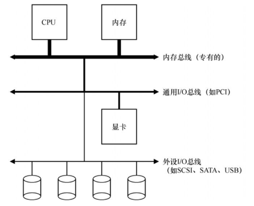
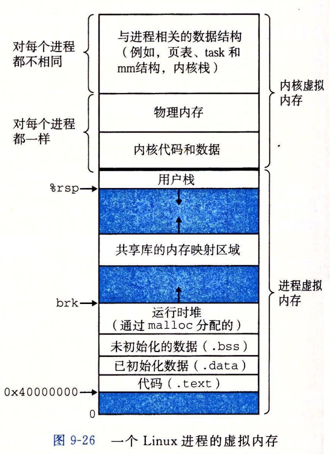
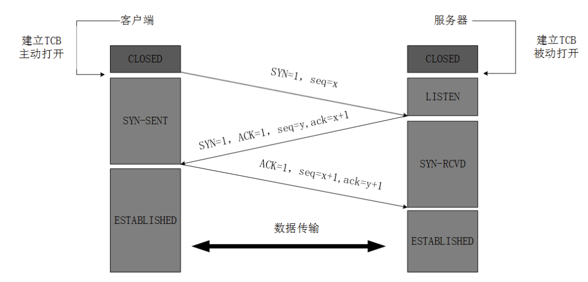
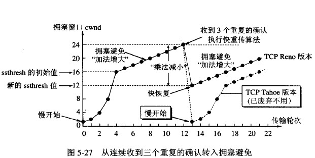
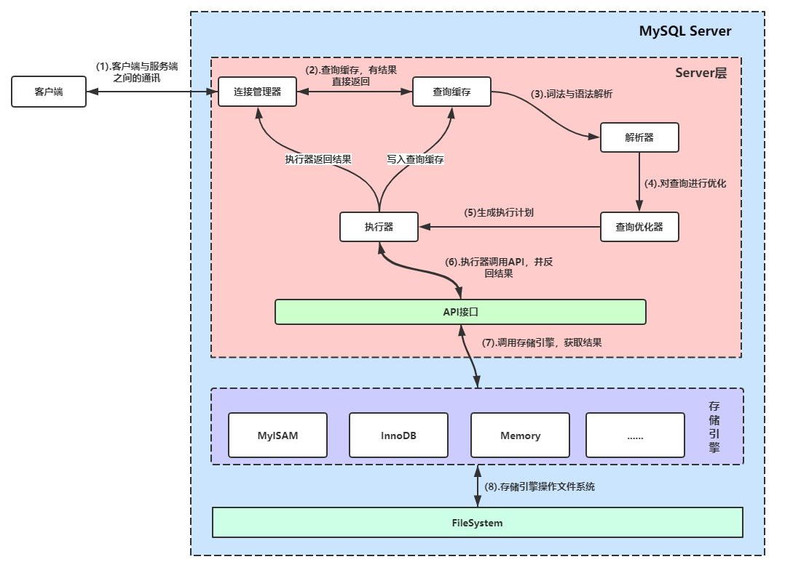

# 计算机概览

- 建议有计算机组成原理、计算机网络、操作系统、数据结构等基础！
- 主要以问答的方式引发深入的思考！
- 主要思考：
  - 计算机有什么用？计算？通信？存储？
  - 计算机如何进行计算？如何读取数据？如何处理数据？数据如何通信？数据如何保存？数据保存在哪？

# 0. 常用数据结构和算法

- 可以参考：
  
  - 算法目录
  - [13_树数据结构](./算法/13_树数据结构.md)
  - [12_排序算法](./算法/12_排序算法.md)

- 浏览后将要明白：
  
  - 数据结构是干嘛的？组织和管理数据？
  - 有哪些常用的数据结构？优缺点？基本的排序算法？优缺点？

- 数组、链表、栈、队列

- 哈希表
  
  - 什么是哈希表？有什么用？
  - 什么是哈希函数？有哪些哈希函数？
  - 如何解决哈希冲突？

- 树
  
  - 什么是二叉搜索树？优点？缺点？
  - 什么是平衡二叉树？优点？缺点？
  - 什么是红黑树？优点？缺点？
  - 什么是B树？优点？缺点？
  - 什么是B+树？优点？缺点？

- 图

- 排序算法？
  
  - 直接插入排序？假设前面排序，后面无序要插入，稳定
  - 直接选择排序？根据位置不断找第i小的数，不稳定
  - 冒泡排序？不断上浮到最后的位置，稳定
  - 堆排序？自下而上构建堆，自上而下排序，不稳定
  - 归并排序？分治合并，稳定
  - 快速排序？基准归位，不稳定

- 回溯？贪心？动态规划？单调栈？字符串匹配？前缀树？

# 1.操作系统

- 可以参考：
  
  - [操作系统](./计算机基础/操作系统.md)
  - [1_操作系统IO](./计算机基础/1_操作系统IO.md)
  - [2_操作系统零拷贝](./计算机基础/2_操作系统零拷贝.md)
  - [3_操作系统再概览](./计算机基础/3_操作系统再概览.md)
  - [4_操作系统Linux](./计算机基础/4_操作系统Linux.md)

- 浏览后将要明白：
  
  - 什么是操作系统？操作系统有什么用？
  - 进程线程？区别？调度？同步？死锁？通信？
  - 内存如何管理？如何映射？如何中断？如何置换？
  - IO如何进行？IO模型？IO多路复用？底层的优化？

- 什么是操作系统？操作系统有什么用？
  
  - 如何管理计算机资源？
  - 硬件：计算资源、存储资源、设备资源
  - 软件：文件、应用程序

- 什么是系统调用？
  
  - 用户态？内核态？
  - 用户态如果要使用内核态的部分操作怎么办？系统调用！
  - 系统调用主要：内存、文件、设备、进程控制、进程通信

- 操作系统架构：
  
  - 

- 什么是标准设备？（针对设备本身）
  
  - CPU使用设备的标准设备模型，是一种协议、规范，让CPU能够更好的调用设备
  - 标准设备：接口+内部

- 什么是标准协议？（针对CPU使用设备）
  
  - CPU使用设备的标准使用协议，是一种协议、规范
  - 一般是4步：轮询设备、IO读取、执行命令、轮询设备

- 存在的问题：
  
  - CPU如何调用设备？轮询=》浪费CPU
  - 如何降低管理设备的CPU开销？=》加一层！

- 什么是中断？（减少CPU开销）
  
  - CPU对系统发送某些事件的一种反应：CPU暂停并且保存当前程序，去执行另一个程序，执行完后再返回中断处继续执行
  - 此时：就可以将一些工作交给其他设备去完成，完成后给CPU发送中断请求即可，CPU无需轮询
  - 类别：根据是否是CPU引起的分为：外中断、内中断
  - 存在的问题：仍然需要CPU将磁盘缓存区的数据读取到内核空间的页缓存中！

- 什么是DMA？（优化数据存取）
  
  - DMA：Direct Memory Access：可以协调完成内存和设备之间的数据传递，无需CPU介入

## 1.1 进程线程

- 进程和线程？
  - 什么是进程？运行的程序，用来管理和调度计算机资源来执行相应的任务
  - 区别？
    - 单位上：进程是系统运行程序的基本单位，线程是独立调度的基本单位
    - 资源上：进程是资源分配的基本单位，线程不拥有资源，同类线程共享进程的资源
    - (上下文切换)调度上：同一进程的线程切换不会引起进程的切换
    - 系统开销：进程编程调试简单，资源开销大。线程编程调试复杂，资源开销小
    - 通信角度：线程间可以通过写同一进程中的数据进行通信，进程则需要借助内核才可以进行通信
  - 状态？
    - 进程：new、ready、running、waiting、terminated
    - 线程：new、runnable、blocked、waiting、time_waiting、terminate
- 进程间如何通信？
  - 原理：专门开辟内核缓存区进行交换数据
  - 通信方式：管道、有名管道、信号、消息队列、信号量、共享内存、套接字
- 线程同步方式？
  - 什么是线程同步？一种解决资源共享的机制
  - 如何进行线程同步？
    - 互斥量(synchronized)、信号量(Semophers)、事件(通知+优先级)
- 进程调度？
  - 为什么需要进程调度？整个计算机资源要充分利用(CPU、memory)
  - 进程调度算法：
    - FCFS(First Come First Server)：先来先服务
    - SJF(Shortest Job First)：短作业优先
    - RR(Round Robin)：时间片轮询
    - PS(Priority Scheduling)：优先级调度
    - RRMF(Round Robin with Multiple Feedback)：多级反馈队列
    - HRRN(Highest Response Ratio Next)：高响应比优先
- 多线程并发下产生的死锁问题？
  - 什么是死锁？
    - 多线程都在互相等待某个共享资源的释放，导致程序无法正常执行下去
  - 为什么会产生死锁？
    - 互斥条件
    - 请求与保持条件
    - 不可剥夺条件
    - 循环等待条件
  - 如何避免死锁？如何破坏四个条件？
    - 分配共享资源时，让线程一次性申请全部的资源=》破坏请求与等待条件
    - 让线程在申请不到其他资源的时候，放弃自己的资源=》破坏不可剥夺条件
    - 按照一定的顺序获取资源，释放资源则反序释放=》破坏循环等待条件
- Hello World的一生？
  - CSAPP YYDS！
  - 预处理=》编译=》汇编=》链接=》运行=》销毁
- 什么是孤儿进程？什么是僵尸进程？
  - 孤儿进程：父进程退出，但是子进程还在运行，此时子进程就是孤儿进程，会被init进程收养
  - 僵尸进程：子进程退出，但是父进程没有用wait、waitpid获取的子进程信息进行释放，导致子进程的进程描述符仍然保存在系统中，浪费系统资源，会导致系统不能产生新的进程，
    - 如何解决？kill 父进程，僵尸进程就会被init进程给收养处理

## 1.2 内存管理

- 内存如何分配、如何回收、虚拟地址？
- 内存管理方式：提高内存利用率、避免内存碎片
  - 块式管理(连续)、页式管理(离散)
  - 段式管理：代码段、数据段、堆栈段等
  - 段页式管理
- 局部性原理？虚拟内存的基石、虚拟地址存在的根本原因
  - 程序加载时加载部分就可以开始执行，其他部分可以留在外存等待执行时中断加载
  - 时间局部性
  - 空间局部性
- 虚拟内存？
  - 内存管理的一种技术，定义的一个连续的虚拟地址空间，为每个进程提供一个一致私有的地址空间，独享内存的错觉
  - 原理：局部性原理=>主存可以看做硬盘的高速缓存
- 逻辑地址？物理地址？
- 虚拟地址？虚拟寻址？
  - 虚拟地址就是逻辑地址：使内存相互隔离、可以访问大于可用物理内存的缓冲区，便于管理
  - 虚拟寻址：如何将虚拟地址转换为实际的物理地址？内存管理单元(MMU)
- 虚拟空间越大？页表越大？
  - 如何解决：多级页表
- 虚拟地址转为物理地址时间消耗？
  - 越快越好！=>加一层缓存的思想
  - 快表(TLB)：页表的缓存，一种高速缓存存储器(Cache)
- 虚拟内存的具体实现？
  - 请求分页管理
  - 请求分段管理
  - 请求段页式管理
  - 为什么要加请求两个字？
    - 因为并不是一次性将整个代码数据加载到内存中，而是使用局部性原理，先加载一部分，那就意味着剩下的部分需要按需加载！所以要请求！
  - 此时就需要：
    - 缺页中断机制
    - 页面置换算法
- 页面置换算法？
  - OPT：最佳页面置换算法
  - FIFO：先进先出页面置换算法
  - LRU：最近最久未被使用页面置换算法
  - LFU：最少使用页面置换算法
- 

## 1.3 I/O

- 主要从数据**从外部读取到用户可用状态**理解分析，而不是从硬件角度理解
- 用户态如何获取可用数据？
  - 阶段一：内核态等待从外部读取数据
  - 阶段二：CPU将数据从内核态缓存空间拷贝到用户态缓存空间给用户使用
- IO模型？一种IO规范(协议)
  - 用户进程如何读取数据？什么时候读取数据？
  - 如何更好的合理利用CPU资源和进程资源？
- IO模型分类？
  - 阻塞IO模型：两阶段用户进程都等待
  - 非阻塞IO模型：阶段一轮询(要监听多个socker只能多线程)，阶段二等待
  - IO多路复用模型：阶段一系统调用做轮询(可用监听多个socket)，阶段二等待
  - 信号驱动IO模型：阶段一等别人通知，阶段二等待
  - 异步IO模型：阶段一，阶段二都无需等待，内核全部完成后直接通知用户态操作即可
- 直接IO？非直接IO？
  - 直接IO：不经过页缓存，直接从文件系统读取磁盘数据
  - 非直接IO：从内核页缓存中读取数据
- 缓冲IO？非缓冲IO？再加一层
  - 缓冲IO：使用标准库的缓存实现文件数据的加速访问，减少系统调用
  - 非缓冲IO：直接使用系统调用访问文件数据，频繁的系统调用
- IO多路复用？
  - 寝室打水和阿姨通知的例子
  - select？微秒=》实时，其他的都是毫秒，移植性好
  - poll？没有最大描述符的限制，select有数量限制
  - epoll？大量描述符并且长连接！

## 1.4 数据存取-零拷贝

- 传统文件IO：**四次上下文切换，四次数据拷贝**
  - 拷贝：DMA：磁盘数据到内核缓存区
  - 拷贝：CPU：内核缓冲区到用户态缓冲区
  - 拷贝：CPU：用户态缓冲区到内核Socket缓冲区
  - 拷贝：DMA：内核Socket缓冲区到协议栈(网卡)
- mmap()：系统调用：使用指针完成IO的存在，将文件的一段数据映射到内存中；**四次上下文切换，三次数据拷贝**
  - 拷贝：DMA：磁盘数据到内核缓存区
  - 拷贝：通过mmap()的方式实现数据映射，无需CPU介入
  - 拷贝：CPU：用户态缓冲区到内核Socket缓冲区
  - 拷贝：DMA：内核Socket缓冲区到协议栈
- sendfile()：系统调用：直接从内核缓冲区将数据拷贝到socket缓冲区；**两次上下文切换，三次数据拷贝**
  - 拷贝：DMA：磁盘数据到内核缓存区
  - 拷贝：CPU：内核缓冲区到内核Socket缓冲区
  - 拷贝：DMA：内核Socket缓冲区到协议栈
- 零拷贝：
  - 改进senfile()：直接从内核缓冲区到协议栈(网卡)；**两次上下文切换，两次数据拷贝**
  - 拷贝：DMA：磁盘数据到内核缓存区
  - 拷贝：DMA：内核缓冲区到协议栈

# 2.计算机网络

- 可以参考：
  - [计算机网络](./计算机基础/计算机网络.md)
  - [1_计算机网络概览](./计算机基础/1_计算机网络概览.md)
  - [2_计算机网络HTTP](./计算机基础/2_计算机网络HTTP.md)
  - [3_计算机网络Socket](./计算机基础/3_计算机网络Socket.md)
- 浏览后将要明白：
  - 什么是计算机网络？计算机网络有什么用？
  - 七层模型的基本功能？常用协议的默认端口？
  - HTTP？HTTPS？GET？POST？Cookie？Session？
  - TCP？UDP？连接？
  - 拥塞控制？流量控制？地址转换？数据校验？可靠数据传输如何保证？
  - IP？如何保证数据可靠交付？路由器有什么用？RIP？OSPF？
  - URL的后半生？

## 2.1 概览

- OSI？TCP/IP协议？七层？五层？
  - 应用层：应用进程之间的交互
    - DNS：53、根域名解析服务器、顶级域名解析服务器、二级域名解析服务器
    - FTP：控制连接(21)+数据连接(20)
    - DHCP：67/68
    - 电子邮件协议：用户代理+邮件服务器+邮件协议(SMTP、POP3、IMAP)
      - SMTP：25、ASCII=>MIME添加邮件主体结构，可以有非ASCII
      - POP3：110、从服务器读邮件，可以选择是否读后删除，
      - IMAP：143、客户端和服务器邮件保存同步，只能手动删除
  - 传输层：两台主机进程之间的通信，提供通用的数据传输服务
    - 如：TCP、UDP
    - 如何保证可靠传输？ARQ协议
    - 如何保证流量控制？滑动窗口协议
    - 如何确保稳定传输？拥塞控制：拥塞窗口+慢开始、拥塞避免、快重传、快恢复
  - 网络层：选择网间路由、交换节点，确保数据及时传输
    - 数据如何传输？IP
    - 数据传输到哪？IP地址、分类、子网划分、CIDR(无类域间路由)
    - 根据IP地址怎么找主机？ARP协议
    - 数据传输是否可达？是否可以成功？ICMP协议(网际控制报文协议)
    - IP地址紧缺怎么办？
      - VPN：虚拟专用网
      - NAT：网络地址转换：IP转IP
    - 路由器的功能？
      - 路由选择：RIP、OSPF、BGR
      - 分组转发：IP分组
  - 数据链路层：为主机的多条链路提供数据传输服务
    - 如何封装数据？帧
    - 如何透明传输？定界符+转义符
    - 如何差错检测？CRC
    - 如何数据传输？如何利用信道？
      - 广播、点对点
      - 频分、时分、波分、码分
    - 何时发送数据？避免冲突？
      - 信道复用协议、CSMA/CD协议(载波监听多点接入/碰撞检测协议)
    - 如何标识主机？
      - MAC地址，一般笔记本有两个：一个无线网络适配器的，一个有线网络适配器的
  - 物理层：相邻节点之间的比特流传输
    - 数字信号转换为模拟信号

## 2.2 具体某层的关键

- TCP连接：三次握手
  - 发送了什么？保持了什么状态？
  - 
  - 为什么要三次？
  - 为什么要传回SYN？
  - 为什么要传回ACK？
  - 为什么不能两次？
- TCP断开：四次挥手
  - 发送了什么？保持了什么状态？
  - 
  - 为什么建立连接只需要三次？而释放连接需要四次？
  - 为什么客户端需要等待2MSL？
- TCP？UDP？
- TCP如何保证可靠传输？
  - 数据传输、差错控制、重复数据、流量控制、拥塞控制、确认机制、重传机制
- ARQ？
  - 自动重传请求协议，保证发送数据的可靠
  - 停止等待ARQ、连续ARQ、
- 滑动窗口协议？
  - 保证收发双方的流量控制，确保接收方来得及接收
  - 停止等待协议、后退N帧协议、选择重传协议
- 拥塞控制？
  - 防止过多的数据发送到网络，导致过载，全局性考虑！
  - 如何实现：
    - TCP发送方维护一个拥塞窗口，会动态变换
    - 采用：慢开始、拥塞避免、快重传、快恢复来实现拥塞窗口的动态变换，实现拥塞控制
    - 
- HTTP协议是什么？有什么用？
- GET和POST的区别？
  - 作用上、参数上、可见性上、历史上、服务器安全上、幂等性上、可缓存上、大小上、发送请求的方式上
- cookie和session的区别？
  - 位置上、生命周期上、安全上、性能上、大小上、保存的数据类型上、访问路径上
- HTTP1.0？1.1？2.0？
  - HTTP1.0：短连接
  - HTTP1.1：长连接+非流水线/流水线
  - HTTP2.0：
    - 双向数据流，提高并发和缩短延迟，设置有效的资源优先级
    - 首部压缩，减少不必要的网络流量
    - 服务端推送
- HTTP和HTTPS？
  - HTTP：明文通信、不验证对方、不能区别报文完整性
  - HTTPS：HTTP+SSL/TLS：非对称加密(CA)+对称加密：防监听、防伪装、防篡改

## 2.3 应用角度思考

- 浏览器URL的具体过程？
  - 解析URL：判断合法？
  - 查询缓存：判断是否存在缓存网页？
  - DNS查询URL的IP地址？
  - 建立TCP连接？
  - 浏览器如何根据IP地址向Web服务器发送HTTP请求？
    - 应用层、传输层、网络层、数据链路层、物理层
  - 服务器接收请求、处理请求、响应请求？
    - 物理层、数据链路层、网络层、传输层、应用层、根据传输
    - 根据参数、cookies处理请求，生成HTML响应
    - 应用层、传输层、网络层、数据链路层、物理层
  - 浏览器解析、渲染显示页面
  - 断开连接

# 3.MySQL

- 可以参考：
  - [1_mysql基础](./数据库/MySQL/1_mysql基础.md)
  - [2_mysql进阶](./数据库/MySQL/1_mysql进阶.md)
  - [3_mysql事务](./数据库/MySQL/1_mysql事务.md)
  - [4_mysql锁](./数据库/MySQL/4_mysql锁.md)
  - [5_mysqMVCC](./数据库/MySQL/5_mysqlMVCC.md)
  - [6_mysq索引](./数据库/MySQL/6_mysq索引.md)
  - [7_mysq再学MVCC](./数据库/MySQL/7_mysq再学MVCC.md)
  - [8_mysq再概览](./数据库/MySQL/7_mysq再概览.md)
  - [MySQL问答](./面试问答/MySQL问答.md)
- 浏览后将要明白：
  - 什么是MySQL？MySQL有什么用？
  - MySQL的基本操作？
  - MySQL在多线程高并发情况下，如何确保事务的ACID？
  - MySQL如何加速数据查找？索引底层原理？如何进行SQL语句的索引优化？
  - MySQL在大数据情况下如何确保性能？切分？读写分离？主从复制？

## 3.1 MySQL基础

- DQL、DML、DDL、DCL、TCL、数据类型
- MySQL编程？
  - 变量
  - 流程控制结构
  - 存储过程
  - 函数

## 3.2 MySQL优化

- MySQL的基础结构？一条SQL语句的一生？
  - 
- 什么是事务？事务的特性？
  - 满足ACID特性的就是事务
  - 什么是ACID？
  - ACID之间的关系？
    - ACID是相互交织的，无多线程并发情况下，隔离性天然成立，原子性满足就一定满足一致性，多线程并发情况下，要满足原子性和隔离性才能满足一致性
- 并发一致性产生的问题？为什么会产生并发一致性问题？
  - 因为隔离性很难保证，因此会产生问题
  - 脏读？丢失修改？不可重复读？幻读？
- MySQL如何解决并发一致性问题？
  - 锁协议+锁机制
  - 有哪些锁协议？一、二、三级锁协议、两阶段锁协议
  - 有哪些锁？行级锁、表级锁、读写锁、意向锁、
- SQL如何真正解决并发一致性问题？
  - 提供不同的隔离级别！
  - 读未提交RU
  - 读已提交RC
  - 可重复读RR
  - 可串行化
  - 不同的执行引擎的隔离级别的实现都不同
- MyISAM和InnoDB的区别？
  - 是否支持行级锁？
  - 是否支持事务？
  - 是否支持崩溃后安全恢复？
  - 是否支持外键？
  - 是否支持MVCC？
- MVCC？
  - 什么是MVCC？MVCC有什么用？
  - 如何实现MVCC？
    - 什么是快照？什么是版本号？什么是Undo log？什么是ReadView？
  - 不同隔离级别下(RC、RR)MVCC为什么会不同？
    - 什么是快照读？什么是当前读？
    - 为什么RC级别下会产生不可重复读？而RR级别下不会产生？RR级别下的MVCC为什么可以部分避免幻读？
      - MVCC的ReadView生成时机不同！
      - RC级别下：每次快照读都会生成一个新的ReadView
      - RR级别下：第一次快照读的时候生成ReadView，后续复用，当中间有当前读时，会重新生成，因此可能导致幻读
- InnoDB如何在RR级别下防止幻读？
  - 快照读依靠MVCC
  - 当前读要使用Next-Key Lock，负责只依靠MVCC只能解决部分幻读问题
- MySQL如何优化数据存储？查找？什么是索引？索引有什么用？
  - 索引有哪些种类？普通索引、唯一索引、联合索引、全文索引、空间索引
  - 什么是聚集索引？（应该也可以称为聚簇索引）
    - 索引项的排列方式和表中的数据排列方式一致的索引，会降低增加和更新的性能
    - 是一种数据存储方式，数据行和相邻的键值存储在一块，
    - InnoDB的数据文件就是索引文件，主键索引就是聚集索引，B+树的叶子节点是数据记录
  - 什么是非聚集索引？
    - 索引顺序和数据的物理存储顺序不同
    - MyISAM的数据文件和索引文件是分开的，因此B+树的叶子节点是数据记录的地址(指针)
  - 索引的底层数据结构？
    - Hash索引、B+树
  - 什么是B树？什么是B+树？为什么要使用B+树？
  - 什么是红黑树？
- InnoDB索引和MyISAM索引的区别？
  - 存储结构：
    - InnoDB的数据文件本身就是主索引文件，树的叶子节点保存了完整的数据记录，所以这种也叫做聚集索引，因此辅助索引的叶子节点保存的主键！
    - MyISAM的数据文件和索引文件是分开存储的，叶子节点存储的是指向对应数据文件数据行的指针
- MySQL如何优化SQL语句？如何使用索引进行优化？
  - 开启慢查询日志，找到有哪些慢SQL？
  - 使用explain+慢SQL具体分析？
    - 主要看：
      - 数据读取采用的什么操作？select_type：simple、primary、subquery、
      - 数据的访问类型？type：system>const>eq_ref>ref>range>index>ALL
      - 哪些索引实际被使用？key
      - 查询了多少行？rows
      - 额外信息？extra：using filesort、using temporary、using index
  - 进行索引优化？
    - 全值匹配我最爱、最左前缀要遵守
    - 带头大哥不能死、中间兄弟不能断
    - 索引列上少计算、范围之后全失效
    - like百分写最右、索引覆盖不写星
    - 不等空值还有or、索引失效要少用
    - var引号不能丢、SQL高级也不难！
  - 再使用show profile查看具体的资源消耗情况？
    - 查看IO块开销、上下文切换开销、CPU开销、内存开销、交换次数开销、是否开辟了临时表？
  - DBA或者运维来对SQL数据库服务器进行参数调优
- 大数据情况下，如何使用MySQL？
  - 切分？水平切分？垂直切分？水平切分情况下ID唯一性问题？事务问题？
  - 如何缓解数据查询压力？
    - 主从复制？binlog线程？IO线程？SQL线程？
    - 读写分离？

# 4. Redis

- 可以参考：
  - [1_Redis基础](./数据库/Redis/1_Redis基础.md)
  - [2_Redis再概览](./数据库/Redis/2_Redis再概览.md)
  - [Redis问答](./面试问答/Redis问答.md)
- 浏览后将要明白：
  - 什么是Redis？Redis有什么用？
  - Redis的数据类型、底层数据结构？
  - Redis持久化？
  - Redis设置过期时间？内存淘汰策略？
  - Redis事务？事件？单线程？多线程？
  - Redis主从复制？哨兵？集群？高可用？
  - Redis缓存击穿、穿透、雪崩？分布式锁？

## 4.1 Redis基础

- 什么是Redis？Redis有什么用？
- Redis有哪些数据类型？底层是什么数据结构？(待续)
  - string
  - list
  - set
  - hash
  - zset
  - geosptial
  - hyperloglog
  - bitmaps
- Redis单线程？多线程？事件驱动？
  - Redis单线程？Reactor模式？事件处理模型？
  - 为什么引入Redis多线程？提供网络IO读写性能
- Redis数据过期时间？过期时间有什么用？为什么要过期时间？
  - 如何判断数据是否过期？过期字典
  - 如何删除过期数据？惰性删除+定期删除？
- Redis内存满了怎么办？内存淘汰策略？类似操作系统的页面置换？
  - volatile-lru、volatile-ttl、volatile-random、volatile-lfu
  - allkeys-lru、allkeys-ttl、allkeys-random、allkeys-lfu
  - no-eviction
- Redis持久化？为什么要持久化？
  - 什么是RDB？原理？优缺点？
  - 什么是AOF？原理？优缺点？
- Redis事务？如何实现事务？
  - Redis不支持原子性和持久性、不支持roll back
  - 如何实现事务？multi开启事务，输入命令，执行事务exec，放弃事务discard
  - 如何实现乐观锁？
    - 设定version，并且使用watch、unwatch监控即可
- Redis使用场景？
  - 发布订阅、计数器、缓存、查找表、消息队列、会话缓存、分布式锁、排行榜等
- Redis和Memcached的区别？
  - 相同点？
  - 不同点？
    - 数据类型、持久化、容灾恢复、内存溢出、集群、多线程、
- Redis主从复制是什么？如何进行复制？为什么要主从复制？
  - 主从如何进行复制？全量复制+增量复制、主从链
- 什么是Redis 哨兵(Sentinel)？有什么用？
- Redis的典型问题？
  - 缓存穿透？怎么办？
    - 查询超多不存在的数据，先查Redsi再查Mysql，直接穿透了Redis打到了MySQL上，对持久层数据库造成很大压力
    - 布隆过滤器、缓存空对象
  - 缓存击穿？怎么办？
    - 大并发集中对一个热点key进行访问，当这个key失效的瞬间，全部访问都打到了MySQL上，导致数据库瞬间压力过大
    - 设置热点数据不过期、加互斥锁、分布式锁
  - 缓存雪崩？怎么办？
    - 缓存再同一时间大面积失效(双11零点后)，后面的大量请求都直接落到了数据库上，导致数据库短时间内压力大
    - Redis集群(高可用)、限流降级、设置缓存不过期、数据预热(均匀的设置不同的过期时间)
  - 分布式锁？
    - 任意时刻只能有一个客户端持有锁：setnx
    - 避免死锁：设置过期时间
    - 谁上锁谁解锁！
      - 唯一标识+原子性操作

# 5. Java

- 可以参考：
  - [1_Java再概览](./Java/1_Java再概览.md)
  - [Java基础问答](./Java问答/Java基础问答.md)
  - [Java集合问答](./Java问答/Java集合问答.md)
  - [Java数据结构](./Java问答/Java数据结构.md)
  - [Java多线程问答](./Java问答/Java多线程问答.md)
  - [1_多线程](./Java多线程/1_多线程.md)
  - [2_JUC](./Java多线程/2_JUC.md)
  - [1_JavaIO(了解即可)](./JavaIO/1_JavaIO.md)
  - [2_JavaBNA(详细最好看Netty)](./JavaIO/2_JavaBNA.md)
  - [JVM问答](./Java问答/JVM问答.md)
  - [最全JVM](./JVM/JVM.md)
- 浏览后将要明白：
  - 什么是Java？JVM？JDK？JRE？面向对象？数据类型？常用类？方法？关键字？
  - 接口和抽象类？重载和重写？反射？注解？泛型？异常？
  - Java如何保存数据？保存对象？操作对象？底层原理？容器？
  - Collection和Map？ArrayList? LinkedList? Vector? HashSet? TreeSet? LinkedSet? HashMap? HashTable? TreeMap? LinkedHashMap? CopyAndWriteArrayList? ConcurrentHashMap? 增删改查的基本原理？源码实现？为什么是这样做？
  - java如何实现多线程？线程池机制？线程运行状态？线程协作？线程同步机制？Sychronized？ReentratLock？Volatile? JMM?  CAS? JUC？AQS？ThreadLocal？
  - Java IO？BIO？NIO？AIO？
  - JVM组成部分？类加载子系统？类加载器？类加载过程？双亲委派机制？JVM内存模型？如何标定垃圾？如何收集垃圾？垃圾收集器？垃圾收集策略？对象的创建过程？对象的内存分配？执行引擎？解释器？JIT编译器？
- 浏览后可以思考？
  - java高级语言的设计？数据计算？数据处理？数据存储？异常机制？如何充分使用计算机资源？如何读取数据？如何平台无关？如何自动分配内存？如何自动垃圾回收？如何加速编译执行？

## 5.1 Java基础

- 面向过程和面向对象？
  
  - OOP：把类、对象作为基本单元来组织代码的，并且使用封装、继承、多态来作为代码设计的指导，数据和操作是在一起的，职责清晰，划分明确，高内聚，低耦合，重用性和可维护性更高，
  - OO：以过程中为基本单元来组织代码的，数据和操作是相分离的，符合人类面对复杂事物时的思考方式：抽象，建模，分类，不易维护，不易拓展

- Java的优点？

- 面向对象三大特性？

- Java的数据类型？
  
  - Byte char short int float long double boolean
  - 对应的包装类型？
  - 自动装箱和拆箱？
  - 缓存池？

- Java的String类？具体实现？StringBuffer? StringBuilder?

- Java的运算？参数传递方式？类型转换？Switch？

- Java的关键字？
  
  - final：修饰变量(不可变常量) 修饰方法(不可重写) 修饰类(不可继承)
  - static：修饰变量 修饰方法 修饰语句块 修饰内部类
    - 初始化顺序：静态变量 静态语句块 构造函数

- Object类方法？
  
  - equals()：自反性 对称性 传递性 一致性 与null比较
  - hashCode()：返回哈希值，覆盖equals()时一般都要覆盖hashCode方法
  - toString()
  - clone()：原型模式，浅拷贝，深拷贝？

- 抽象类和接口？区别？
  
  - 继承和实现？
  - 设计层面？模板设计is a，行为规范like a

- 重载(方法)和重写(子类)？

- 成员变量和局部变量？
  
  - 语法形式？存储方式？生命周期？初始化值？

- ==和equals?

- 反射？优点？缺点？
  
  - ```java
    // 获取一个Class对象，就是JVM中的唯一的类元信息，存储在方法区中
    Class.forName("xxx.ccc")
    ```
  
  - 反射可以提供运行时的类信息

- Java的异常？
  
  - Error：OutOfMemoryError StackOverflowError 
  - Exception：
    - 受检查异常：IO、SQL
    - 不受检查异常：RuntimeException，`NullPointerException`、`NumberFormatException`（字符串转换为数字）、`ArrayIndexOutOfBoundsException`（数组越界）、`ClassCastException`（类型转换错误）、`ArithmeticException`（算术错误）等。

- try{}catch{}finally{}？return谁？

- Java泛型？参数化类型？
  
  - 编译时校验，运行时搽除

- Java的注解？编译运行时解析，起说明 配置作用

- Java和C++的区别？
  
  - 面向对象？面向过程？
  - JVM跨平台
  - 指针？垃圾回收？继承？

- JVM？JRE？JDK？

## 5.2 Java容器

- Java容器有哪些？
  - Collection：存储对象的集合
  - Map：K-V映射表，可以理解为存储两个对象的集合
- Collection具体组成？需要源码剖析！
  - Set：
    - TreeSet：红黑树实现，支持有序性操作
    - HashSet：基于HashMap实现，支持快速查找，不支持有序性
    - LinkedHashSet：具有HashSet的查找效率，基于HashMap和双向链表维护元素的插入顺序
  - List：
    - ArrayList：Object数组
      - 默认大小：10
      - 扩容方式：grow()：oldCapacity+oldCapacity>>1 使用Arrays.copyOf()
      - 删除元素：System.arraycopy
    - Vector：线程安全的Object数组
      - 扩容方式：默认2倍，可以设置
    - CopyOnWriterArrayList：线程安全的List！
      - 复制数组，读写分离，写后需要将原始数组指向新的复制数组，因此可能导致数据不一致，不可重复读？幻读？
    - LinkedList：Node双向链表
  - Queue：
    - LinkedList：
    - PriorityQueue：基于堆实现的优先队列
- Map具体组成？需要源码剖析！
  - TreeMap：基于红黑树实现
  - HashMap：基于哈希表实现
    - Entry(Node)：存储K-V,并且是一个节点，可以组成链表
    - 存储结构：Entry类型的数组（桶）
    - 默认大小：16
    - 如何计算哈希值？如何确定桶的下标？
      - hash()获取哈希值，如何尽可能均匀？高位移动+与运算
      - 哈希值h&(n-1)取模：确定桶的下标
    - 何时扩容？如何扩容？
      - threshold默认为0.75！
      - 使用resize()扩容，复制移动重新插入，此时需要重新计算每个key对应的下标，2的倍数的优点！移动少，取模计算快
    - 如何解决哈希冲突？
      - 拉链法
    - 何时变为红黑树？为什么要变成红黑树？
      - 拉链法解决哈希冲突产生的链表长度大于等于8时
      - 红黑树的优点？平均查找长度
  - HashTable：线程安全的基于哈希表的实现
    - 如何实现同步？synchronized
    - 默认大小：11
    - 如何扩容？2n+1
  - HashMap和HashTable的区别？
    - 线程安全？效率？null？初始容量？扩容大小？底层数据结构？哈希值计算？
    - 传统哈希表？素数？2的倍数？优缺点？
  - ConcurrentHashMap：线程安全的HashMap
    - 与HashMap类似
    - 如何实现同步？
      - JDK1.7：ReentrantLock=>分段锁
      - JDK1.8：CAS+synchronized=>锁首节点
  - LinkedHashMap：使用双向链表维护了元素顺序
    - 继承了HashMap，维护了一个双向链表用来维护插入顺序或者LRU顺序
    - 可以用来实现LRU缓存

## 5.3 Java并发

- 为什么要使用多线程？

- Java如何使用线程？
  
  - Runnable接口 Callable接口 继承Thread类
  - 如何选择？区别？
  - execute()? submit()?

- Java线程池机制？三大方法？七大参数？四种拒绝策略？
  
  - Executor？CachedThreadPool? FixedTreadPool? SingleTreadExecutor?
  - ThreadPoolExecutor？七大参数？四种拒绝策略？
  - 原理？源码剖析？运行过程？
    - 核心线程满=>阻塞队列满=>才调用到最大线程数量=>拒绝策略

- 什么是守护线程？什么是非守护线程？

- sleep？yield？

- Java的线程中断？
  
  - Interrupted()
  - Executor的shutdown()

- **Java的互斥同步机制？**
  
  - synchronized：JVM层面
    - 同步：代码块，方法，静态方法，类
    - 底层原理？monitorenter? monitorexit? ACC_SYCHRONIZED?
    - JVM对synchronized进行的优化？如何减少开销？
      - 自旋锁？
      - 锁清除？逃逸分析？
      - 锁粗化？
      - 轻量级锁？偏向锁？重量级锁？
        - 对象头的内存布局+状态
  - ReentrantLock：具体代码，AQS实现
  - 比较：
    - 实现方式？性能？等待可中断？公平锁？
  - volatile和synchronized?
    - 互补？轻量级实现？主要确保可见性？

- Java的线程协作？
  
  - join() wait() notify() notifyAll() =>同步方法或者代码块中使用
  - wait()和sleep()的区别？
    - 方法：wait()是Object的方法，sleep是Thread方法，使用范围？
    - 是否释放锁
  - await() signal() signalAll()=>juc提供的，通过Condition来调用即可

- Java线程状态？
  
  - new runable blocked waiting timed_waitting terminated

- JUC的Atomic类？
  
  - 原子四大类？
  - CAS？ABA问题？乐观锁？悲观锁？
    - CAS：多线程不安全？加锁耗资源？硬件层面将比较和交换操作封装成一个指令，确保原子性

- JUC的AQS？
  
  - 有什么用？
  
  - 核心思想？state+CLH队列
  
  - 怎么用？AQS为资源的共享方式？
    
    - Exclusive？公平锁？非公平锁？
    
    - Share？
    
    - 组合式？
    
    - 模板方法模式？
    
    - ```java
      isHeldExclusively()//该线程是否正在独占资源。只有用到condition才需要去实现它。
      tryAcquire(int)//独占方式。尝试获取资源，成功则返回true，失败则返回false。
      tryRelease(int)//独占方式。尝试释放资源，成功则返回true，失败则返回false。
      tryAcquireShared(int)//共享方式。尝试获取资源。负数表示失败；0表示成功，但没有剩余可用资源；正数表示成功，且有剩余资源。
      tryReleaseShared(int)//共享方式。尝试释放资源，成功则返回true，失败则返回false。
      ```
  
  - 实例？
    
    - CountDownLatch、CyclicBarrier、Semaphore、ReadWriteLock

- JUC的BlockingQueue?
  
  - FIFO队列：LinkedBlockingQueue, ArrayBlockingQueue
  - 优先级队列：PriorityBlockingQueue

- JUC的ForkJoin?

- JMM？
  
  - 是什么？有什么用？
  - 具体概念？工作内存？主内存？这两个内存如何交互？
  - 三大特性？原子性？可见性？有序性？如何实现？

- ThreadLocal？
  
  - 有什么用？
  - 怎么使用？
  - 源码剖析？
  - ThreadLocalMap？里面的Entity的key弱引用带来的问题？

- Java线程安全？
  
  - 什么是线程安全？
  - 如何实现线程安全？不可变？互斥同步(阻塞同步)？非阻塞同步(CAS，乐观锁)？无同步(线程本地存储)？

## 5.4 Java IO

- IO类别？
  - 磁盘操作：File
  - 字节操作：InputStream OutputStream
  - 字符操作：Reader Writer
  - 对象操作：Serializable
  - 网络操作：Socket
  - 非阻塞IO：NIO
- BIO？NIO？AIO？
- BIO？NIO？
  - BIO以流的方式处理数据，NIO以块的方式处理数据
  - BIO通过字节流或者字符流进行操作，NIO通过Channel和Buffer进行操作
  - NIO双向读取不阻塞？加了两层？
    - Channel操作方向
    - Buffer操作数据？capacity? Limit? Position? Mark?
    - Select实现不阻塞！

## 5.5 JVM

- 类的加载机制？
  - 加载、链接、初始化、使用、卸载
- 类的加载过程？
  - 加载：获取二进制字节流
  - 链接：
    - 验证？
    - 准备？类变量(分清楚实例变量)分配内存，设置初始值
    - 解析？符号引用=>直接引用？
  - 初始化：clinit()
- 类的初始化时机？
  - 主动引用？被动引用？
- 类相等？完整包名一致，加载器一致
- 类加载器？
  - Bootstrap ClassLoader
  - Extension ClassLoader
  - Systems ClassLoader
  - 用户自定义加载器？继承ClassLoader类，并且重写loadClass方法。或者重写findClass()方法
- 双亲委派机制？优点？
- JVM内存模型？
  - 程序计数器？
  - Java虚拟机栈？栈帧？局部变量表？操作数栈？方法返回地址？动态链接？
  - 本地方法栈？
  - 堆？新生代？老年代？
  - 方法区？运行常量池？
    - 永久代？元空间？
  - 直接内存？
- Java对象创建过程？
  - 类加载检查？
  - 分配内存？指针碰撞法？空闲列表法？
    - 产生的并发问题如何解决？TLAB、CAS+失败重试
  - 初始化类变量？
  - 设置对象头？那个类的实例？唯一编号(hash值)？GC分代年龄？是否加锁？
  - 执行init()方法
- 对象的访问定位方式？
  - 句柄？直接指针？
- 垃圾收集？
  - 如何找垃圾？
    - 引用计数法？优点？缺点
    - 可达性分析算法？什么可以是GC Roots?
  - finalize()？对象复活？
  - 对象引用类型？强引用？软引用？弱引用？虚引用？
  - 垃圾收集算法？
    - 标记清除算法？优点？缺点？
    - 标记整理算法？优点？缺点？
    - 复制算法？优点？缺点？
    - 分代收集算法？优点？缺点？
    - 增量收集算法？优点？缺点？
  - 垃圾收集器？
    - Serial：单GC线程+复制算法
    - ParNew：多GC线程(并行)+复制算法
    - Parallel Scavenge：多GC线程+吞吐量优先(自适应调节策略)
    - Serial Old：单GC线程+标记整理算法
    - Parallel Old：多GC线程+标记整理算法
    - CMS？优点？缺点？
      - 并发+多GC线程+低延迟(STW)
      - 初始标记 并发标记 重新标记 并发清除
    - G1？优点？缺点？
      - 并行+并发+复制算法+标记整理算法=>低延迟下的高吞吐量！
      - 可预测的停顿时间模型
      - 初始标记 并发标记 最终标记 筛选回收
    - ZGC？
- 垃圾回收策略？内存回收策略？
  - Minor GC？何时调用？
  - Major GC？何时调用？
  - Full GC：包括了方法区的垃圾收集？何时调用
- 对象如何在JVM堆内存中分配？
  - 一般对象Eden区
  - 大对象，长期存活对象老年代=>数组，字符串
  - 动态年龄判断？某个年龄大小超过了幸存者0区的一半，就可以作为新的晋升年龄的阈值
  - 空间分配担保？何时使用空间分配担保？
    - Eden区满，要把对象移到老年代
    - Jdk6之前：
      - Minor GC之前，老年代最大可用连续空间>新生代所有对象空间的和？Minor GC是否安全
      - 否则判断是否进行空间分配担保机制？是否>历次晋升到老年代对象的平均大小？是否使用Full GC
    - JDK6之后：
      - Minor GC之前，只要老年代的连续空间大于新生代对象的总大小、或者大于历次晋升的平均大小就会进行Minor GC
      - 否则进行Full GC
- JVM的执行引擎？
  - 解释器？
  - 即时(JIT)编译器？机器码？热点代码？
  - 解释器和JIT编译器的优劣？
  - 01？机器指令？汇编语言？高级语言？
  - AOT编译器？

# 6. 设计模式

- 可以参考：
  
  - [3_设计模式全面学习](./设计模式/3_设计模式全面学习.md)

- 浏览后应该明白？
  
  - 设计模式是什么？有什么用？如何理解设计模式？
  - 七大原则？23种设计模式？如何划分？如何体现七大原则？

- 设计模式六+一原则？
  
  - 高内聚：单一职责原则
  - 低耦合：迪米特法则
  - 抽象，面向接口编程：依赖倒置原则
  - 减少代码冗余：接口隔离原则
  - 面向对象正确使用继承：里氏替换原则
  - 对修改关闭，对拓展开放：开闭原则
  - 尽可能不使用继承：合成复用原则

- 23种设计模式？
  
  - 创建型模式：考虑如何创建对象？以提高代码的可复用性和灵活性
    - 单例模式
    - 工厂模式
    - 抽象工厂模式
    - 原型模式
    - 建造者模式
  - 结构型模式：考虑对象、类如何协调组织？以提高代码结构的灵活性和高效性
    - 适配器模式
    - 桥接模式
    - 装饰者模式
    - 组合模式
    - 外观模式
    - 享元模式
    - 代理模式
  - 行为型模式：考虑对象、类如何进行高效沟通？职责委派？
    - 模板方法模式
    - 命令模式
    - 访问者模式
    - 迭代器模式
    - 观察者模式
    - 中介者模式
    - 备忘录模式
    - 解释器模式
    - 策略模式
    - 状态模式
    - 职责链模式

# 7. 面试技巧

- 反问：
  
  - 面对HR：侧重岗位发展、晋升体系、福利待遇等
    
    - 对于这个岗位的晋升路径是怎样的?
    
    - 贵公司对校招生的培养机制? ( 常规问题一般公司都会有一个培训机制)
    
    - 该岗位的团队规模大概是多大?
      (了解团队规模判断自己的岗位重要性)
    
    - 往届校招生目前在公司大概处于怎样的水平?(通过往届情况了解公司实际上升机会、企业文化和团队氛围)
    
    - 应届生入职后有带教mentor吗?
    
    - 公司对员工成长有哪些培训体系和资源？
    
    - 每年的涨薪机制是如何的?
    
    - 了解下面试部门的具体架构，汇报对象是?
    
    - 五险一金是都全额缴纳，缴纳比例是多少?
  
  - 面对直属领导/业务负责人：侧重业务情况、岗位具体方向、岗位能力
    
    - 您对于岗位候选人比较看重哪些能力特质?(了解用人风格)对
    
    - 新人来说，您觉得会面临哪些挑战呢?如何应对挑战?
    
    - 团队目前的成员配置以及分工是怎样的呢?
    
    - 您对于岗位的后期规划是怎样的呢?
    
    - 您希望短期内我为团队解决什么问题?
    
    - 咱们团队平时利用哪些方法来提升工效呢?
  
  - 面对高管/CEO：侧重公司规划、宏观角度
    
    - 公司业务模块未来是怎么规划的呢?
    
    - 公司短期及长期的战略目标是怎样的呢?
    
    - 您对于其他竞品的商业模式或业务怎么看
    
    - 对于刚进入职场的新人，您有什么宝贵的经验分享吗?
    
    - 刚刚您说到的这个问题，我自己思考有限，如果是您，您会怎么处理呢?
  
  - 业务面反问：业务面的面试官很有可能是自己未来的上司，因此可以从反问中了解到上级的领导格和业务的具体情况。
    
    - 这个岗位一天的工作画像是?
      (通过该问题了解该岗位的基本的工作内容。)
    
    - 有幸加入到公司后，入职前有哪些需要提升的地方? (潜台词表明自己很想加入且兴趣浓厚)
    
    - 您认为在这一岗位表现优异的员工主要具备哪些特质? ( 了解领导风格，表现自己上进心)

- 为什么选择这个岗位？这个公司？
  
  - 专业合适：我的专业非常适合这个岗位，因此我有信心能够胜任这个岗位，此外，我本身也是期望能够往这个方向发展
  
  - 看好公司：贵公司在XX领域也是扎根了很久，我认为贵公司发展前景也非常广阔，我觉得我个人在这里能够得到很好的发展，自己也能够给公司创造出很多价值，这也是我来应聘该岗位的原因。
  
  - 对岗位有兴趣：贵公司这个岗位非常符合我自身的性格和兴趣，而且在这个岗位上，我认为我自己能够发挥出自己的优势，去为贵公司做出更大的贡献，因此这就是我选择来贵公司应聘该岗位的原因。
