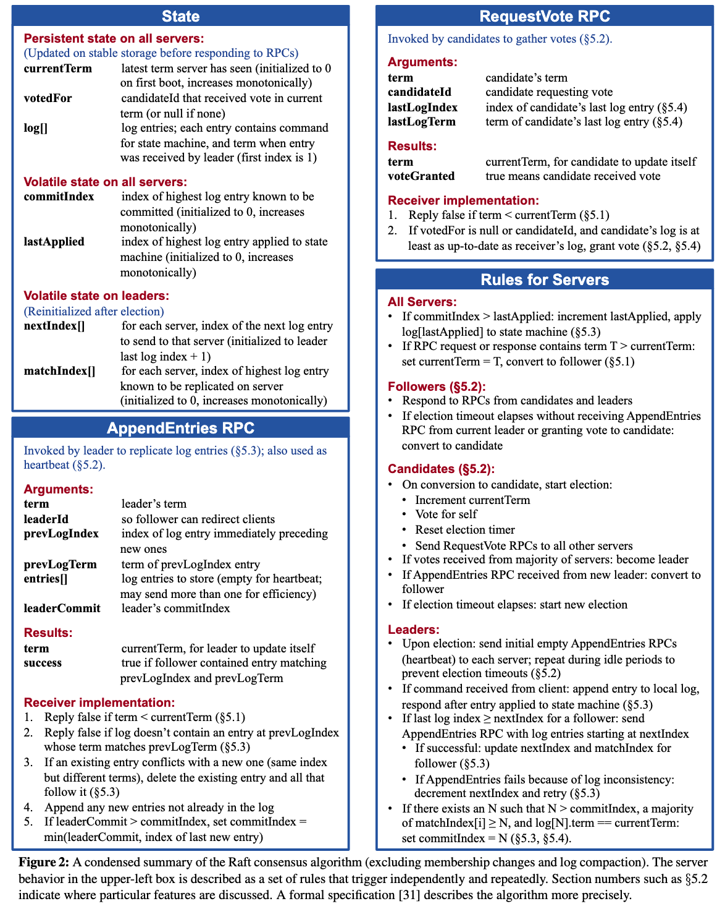
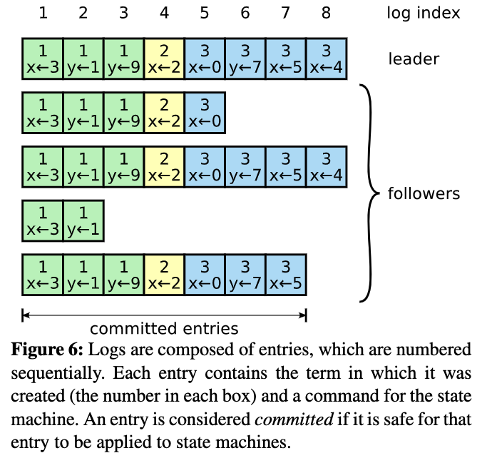

---

---

# 分布式基础

- 主要参考自：https://pdos.csail.mit.edu/6.824/schedule.html

## 1. 简介

- 本节概览：
  - 什么是分布式系统？
  - 分布式系统的历史发展？
  - 课程的结构？
  - 课程的关注点？
  - 课程主要主题？
  - MapReduce？
- 什么是分布式系统？
  - multiple networked cooperating  computer
- 为什么需要使用分布式系统？
  - Connect physically separated machines
  - Increase capacity through parallelism
  - Tolerate faults
  - Achieve security / via isolate
- 分布式系统的历史发展？
  - local area netoworks=1980s
    - DNS+ Email、AFS
  - Data Centers、Big Website=1990s
    - Web search、shopping=》need data storage, index=>Data Centers
  - Cloud Computing=2000s
    - 从内部服务使用到拓展到给外部用户使用
    - 将日常计算移到别人的数据中心(亚马逊，谷歌，微软等)=》云计算
    - 提供商需要构建大量的基础设施系统去支持这些：高性能，高可用，大数据的应用，并且能够灵活拓展给别人使用
  - Current state：
    - 是一个非常活跃的领域！
- 分布式系统为什么困难？挑战？复杂性？
  - many concurrent parts
  - must be deal with partial failure
  - tricky to realize the performance benifits
- 为什么要学习 6.824？
  - Interesting: hard problems but powerful solutions
  - used in the real world
  - active area of research
- 课程结构？
  - Lecture: big ideal
  - Papers: case study
  - Labs: 
    - mapreduce
    - replication using raft
    - Replicate k/v services
    - Shared k/v services
- 课程主要关注？
  - Infrasture！基础结构！
  - Storage、Computate、Communication
- 课程主要主题？CAP?
  - Fault tolerance：
    - Availabiliy=>replication
    - Recoverability=>logging/transanction、durable storage
  - Consistency：
    - Think: get() return the value of the last put()?
  - Performance：
    - throughput
    - latency
  - Implementation!

## 2. MapReduce

- 论文链接：https://pdos.csail.mit.edu/6.824/papers/mapreduce.pdf
- 为什么？解决了什么问题？
- 是什么？有什么用？
- 如何解决？还需要考虑什么？
- 未来的改进方向是什么？
- Lab1

## 3. RPC and Threads

- 为什么使用Go?
  
  - 对thread、rpc有很好的支持
  
  - GC
  
  - 类型安全
  
  - 简单
  
  - 编译器

- 线程？
  
  - 线程的执行？
    
    - 有自己的pc、stack、register、
    
    - 共享进程内存
  
  - 需要考虑的问题？
    
    - 阻塞？
  
  - 为什么需要线程？
    
    - 并发！concurrency
      
      - IO并发
      
      - 多核并行
      
      - 便利Convenience，如：定时任务
  
  - 线程的挑战？
    
    - 资源的竞争
    
    - 协调 Coordination，线程通信
    
    - 死锁
  
  - 如何解决资源竞争？
    
    - 避免共享资源
    
    - 加锁，同步
  
  - 如何解决线程通信？
    
    - channels
    
    - condition variables
  
  - 如何解决死锁？
    
    - go   能够检测到
    
    - 死锁条件

- Go如何解决线程面临的挑战？
  
  - channels，适用于不共享内存的情况下
  
  - lock+condition variables，适用于共享内存的情况下

- 一个投票程序：
  
  - 考虑会出现的问题：变量共享
  
  - 使用go run -race来检测是否存在资源的竞争
  
  - 使用锁来改进该代码
  
  - 锁哪里？
    
    - 锁在最后计数后判断上？
    
    - 锁在每次投票计数上？
    
    - 锁后再睡一段时间？
    
    - 使用条件变量？sync.NewCond？每个协程都有自己的锁
    
    - 使用channel?

- 一个爬虫程序：
  
  - 考虑会出现的问题：
    
    - 循环链接，导致不断爬取之前爬过的网页
    
    - IO并发
    
    - 并行
  
  - 串行方案
  
  - 互斥锁方案
  
  - 通道方案

- RPC：remote procedural call
  
  - 目标是什么？RPC == PC，but RPC!=PC，最终差异是针对调用失败的处理上！
  
  - 如何实现？基本流程？
  
  - 调用失败后如何处理？
    
    - 至少调用一次：会出现幂等性问题
    
    - 最多执行一次：防止重复
    
    - 只执行一次：很难实现

- 一个kv程序，使用RPC
  
  - 基本功能：远程调用，实现获取kv

## 4. GFS

- 论文链接：https://pdos.csail.mit.edu/6.824/papers/gfs.pdf

### 4.1 论文阅读

- Abstract
  
  - GFS 是什么？有什么用？和之前的文件系统有什么不同？
    
    - 可拓展的分布式文件系统
    
    - 用于大型分布式数据密集型的应用程序
    
    - 通过普通机器+容错处理实现分布式的高性能和高可用

- Introduction
  
  - GFS的目标？如何设计的？
    
    - 分布式文件系统的目标：性能、可拓展性、可靠性、可用性
    
    - 通过程序工作的观察+负载+技术环境来设计实现
  
  - 观察到哪些实际的关键点？
    
    - 组件故障是正常的而不是意外？为什么？所以呢？
      
      - 因为文件系统由多台廉价的存储机构成
      
      - 恒定监控、错误检测、容错、自动恢复必不可少
    
    - 存储文件大部分都是庞大的？所以呢？
      
      - 重新设计存储块大小、参数、IO操作必不可少
    
    - 庞大的文件修改是通常是通过追加新数据而不是覆盖原有数据实现？所以呢？
      
      - 无需考虑客户端的数据缓存
      
      - 专注大文件下的追加操作来实现性能优化和原子性
    
    - 协同设计程序和文件系统API的灵活性？所以呢？
      
      - 提高灵活性使整个系统获益
      
      - 实现弱一致性的文件系统：relaxed consistency,简化系统和程序负担
      
      - 实现原子性的追加操作来提高写并发
  
  - 目前GFS已经成功部署了多个目的的集群，并且运行良好

- Design Overview
  
  - Assumptions
    
    - 因为系统部署在廉价的商品机器上奔溃失败很正常，必须拥有监控、检测、容错、恢复等功能
    
    - 因为系统需要存储大量文件，可以设计每个文件的存储大小，进行有效管理，同时也支持小文件
    
    - 工作负载主要包括：大型流读和小型随机读取
    
    - 工作负载还需要考虑：大量顺序写入的append操作，数据量与读操作相当，且一旦写入很少会进行修改。
    
    - 系统需要有效地实现定义良好的语义来支持多客户端的并发操作。其重点是使用最少的同步开销来保证操作原子性。
    
    - 相比于低延迟，持续的高带宽更重要。
  
  - Interface
    
    - GFS虽然没有实现标准的API接口，但是也实现了一下通常的操作
    
    - 除了一般的create/open/read/write/close/delete 外，还支持snapshot和atomic record append操作
  
  - Architecture
    
    - 
    - 系统主要由一个master结点和多个chunkserver组成，数据文件被切分成了固定大小的chunk，并且由一个64bit的chunk handle唯一表示，同时每个chunk会保留3份副本来保证高可用性！
  
  - Single Master
    
    - 单个主节点能够简化整个集群的设计，主节点能够完成所有的决策工作(维护namespace、访问控制信息、文件到块的映射、垃圾回收、与chunkserve的chunk迁移、心跳机制、监听状态)。
    
    - 为了保证主节点不会成为性能瓶颈，需要考虑：
      
      - master节点从不负责数据传输，只负责控制协议，即告知client请求的chunk在哪个chunk server上。
      
      - client对同一个chunk的请求只需要一次和master的交互，之后会缓存chunk的信息直到过期。
      
      - client可以一次请求多个chunk信息。
      
      - master也可以返回请求chunk之后紧跟着的chunk信息给client，减少client和master节点的交互。
    
    - 就是从高内聚、局部性考虑！
  
  - Chunk
    
    - 为了能够处理大型数据，保存数据的chunk 大小也是一个关键参数
    
    - chunk大小为64MB，远高于传统的文件系统。
      
      - 适用于大数据应用的场景
      
      - 减少了client和master、chunk server的交互。
      
      - chunk的位置信息和元数据也更少，client更容易缓存，master也更容易存储。
    
    - chunk存储采用惰性空间分配，尽可能避免碎片。
    
    - 如果一份文件比较小，只占用几个或只有一个chunk，同时又是一个热点文件时，会造成存储这份文件的几个chunk server负载过重，如何解决？
      
      - 快速的解决方案是增加热点文件的副本数量，分散client的读取。
      
      - 更长期的解决方案，是允许一个client从其它client上读取热点数据。
  
  - Metadata
    
    - 主节点保存了所有的元数据。
    
    - 元数据包括file和chunk的namespace、file到chunk的映射关系、以及各个chunk所在节点的信息。为了保障整个集群的高可用性，对metadata有以下特殊处理：
    
    - In-Memory Data Structures：所有的metadata均保存在master节点的内存中。这里再次显示出大chunk设计的优势，每个chunk通常不到64 bytes的metadata。如果数据量进一步增加，只需要再增加master节点的内存即可。
    
    - Chunk Locations：master节点并不会持久化存储chunk server存储的chunk副本信息，而是在启动时，以及chunk server加入集群时向chunk server查询。同时通过监控和心跳包时刻保持信息更新。原因则是chunk server是很有可能出现故障的，实际的chunk位置信息也可能会因为各种原因产生改变。
    
    - Operation Log：是GFS的核心，包含关键元数据的变化历史记录，不仅是元数据的唯一持久记录，并且还是定义并发操作顺序的逻辑时间线。file、chunk、version都是由log创建的逻辑时间唯一并且永久标识。
      
      - 操作日志通常会保留多个远程副本，只有在所有副本都同步后才会响应metadata的修改操作。
      
      - 同时当master节点宕机时也会通过重复操作日志来恢复，master节点会在操作日志达到一定大小时在本地保存checkpoint，每次恢复从上一个checkpoint开始重复执行有限的操作。checkpoint是一个压缩B树，可以方便的映射到内存。
  
  - Consistency Model
    
    - GFS的relaxed consistency model需要确保什么？对于应用程序来说代表什么？如何具体实现？
    
    - Guarantees By GFS：
      
      - 数据将会如何做出修改？突变？writes、record appends
      
      - 数据突变后对于客户端来说会发生什么?是什么状态？
      
      - GFS如何确保客户端不会读取到旧的数据？
        
        - 所有副本按相同顺序修改、版本号检查、旧数据成为垃圾被回收
      
      - 客户端如何确保不会缓存旧的数据？
        
        - 超时时间+下次访问重新请求
      
      - 数据修改后，chunk server奔溃宕机怎么办？
        
        - master和chunk server的常规握手机制、检测服务器状态、检测数据损坏
        
        - 数据损坏可以从之前的备份中恢复
    
    - Implications for Applications
      
      - GFS实现其他目的的技术也可以适应于relaxed consistency model：
        
        - 使用appends而不是overwrites
        
        - checkpointing
        
        - writring self-validating、self-identifying records
      
      - 解释为什么这些为了其他目的实现的计算也可以适应于松一致性模型

- System Interactions
  
  - GFS主要是为了尽可能减少master在所有操作中的参与，在之前已经描述了系统的目的和每个模块的基本功能和目标
  
  - 现在主要描述client、master、chunk server如何交互以实现数据修改、原子记录追加、快照等功能
  
  - Leases and Mutation Order
    
    - 再次明确什么是mutation? 实现mutation需要实现什么？如何确保需要实现的mutation?
      
      - mutation：修改chunk或者元数据的内容
      
      - 因此每次mutation都应该反映到所有的副本上
      
      - 使用leases(协议)来实现所有副本的一致mutation的顺序
    
    - leases功能？如何确保所有副本的一致性顺序？
      
      - master可以将leases授权给chunk的一个副本，称为primary，这个primary可以为这个chunk的所有mutation操作选择一个串行顺序，因此所有的副本都按照这个顺序执行mutation
    
    - leases的优点？如何实现？如何授权给chunk?
      
      - 减少master的管理开销
    
    - 写入数据后的数据流程：
      
      - 
      
      - 0.在一个chunk的多个副本中，有一个副本作为“primary”副本。primary副本会整合对chunk的所有写操作，形成一个线性序列
      
      - 1.client询问master节点持有chunk lease的副本以及其它chunk副本的位置。如果还没有分配lease，则由master节点进行分配。
      
      - 2.master节点回复primary和其它副本的位置信息，client会缓存这些信息。
      
      - 3.client将修改推送到所有副本。每个chunk server会将修改缓存到LRU的缓冲区，直到被消费或过期。图中可以看到数据流和控制流进行了解耦，使得数据流的流向可以根据拓扑决定，例如图中副本A离Client更近，数据再由副本A发往primary副本。primary副本再发到副本B，是一条根据最近原则构成的转发链。
      
      - 4.当所有副本都收到修改数据后，client向primary副本发送一个写请求，primary副本会对类似的所有client发来的请求进行排序，并按顺序执行。
      
      - 5.primary副本再通知其它副本按照同样的顺序执行修改。
      
      - 6.其它副本修改完后就告知primary副本。
      
      - 7.primary副本将修改结果告知client。
      
      - 如果这其中有任何的错误，client都会重试步骤3-7若干次。此时如上一章所述，文件区域是“inconsistent”的
      
      - 如果一次修改涉及到多个chunk，那么client就会把它分解为对应各个chunk的若干个单独修改。此时如果还有其它client在并发修改，那么文件区域就处于“consistent”但不“defined”状态。各个分片上的数据是一致的，但修改是混合的。
  
  - Data Flow
    
    - 为了充分利用每台机器的网络带宽，避免网络瓶颈和高延迟的连接，将数据流从控制流中分离出来，充分利用网络！
    
    - 链式发送而不是树形发送=》尽可能传输快
    
    - 根据IP地址估算距离实现优先传输最近机器=》避免网络瓶颈和高延迟连接
    
    - 使用TCP连接、全双工连接的交换网络=》最大程度减少延迟
  
  - Atomic Record Appends
    
    - append的数据流与数据修改基本一致。不同点在于，primary在接到写请求后，会计算写的起始和结束位置，并告知其它副本一模一样的位置。而此时并发的其它写操作，则会在排序后在上一个写操作之后的高地址进行。操作间不会写同一块文件区域。也因此append操作是原子的，且文件区域是“defined”。
    
    - 需要注意的是，当append操作失败时，同样会进行重试，而此时重试会发生在新的高地址中。也因此chunk中会包含一条record的重复数据。此时需要消费端通过记录的校验和和唯一标识等进行判断。
      
      - 为什么不设计成在原地址上进行重试呢？：在原址上进行重试就变成了overwrite而不是append操作了。实际上append操作要比overwrite高效很多，因为它不必考虑过多的分布式锁等问题。那么可以看到，GFS在这里宁愿多浪费存储空间，也要使用append操作提升性能。
  
  - Snapshot
    
    - GFS创建快照应用了已有的copy-on-write技术。顾名思义，这种方法在拷贝时会首先创建新的虚拟空间指向原空间，在有写改动时再进行实际的复制。
    
    - 在GFS中，当创建快照的请求到来时，master会先收回所有待拷贝的chunk租约，保证后续的写请求会先通过和master节点交互。收回租约后就复制原有chunk的metadata，此时新的chunk其实仍然指向旧的空间。接着当一个新的写请求到来时，需要向master询问primary chunk信息，master会挑选一个新的chunk持有租约，并通知所有chunk原来位置的chunk server本地复制chunk，得到新的chunk并开始正常的写操作。

- Master Operation
  
  - Master的功能？负责所有namespace的操作、管理整个系统的备份、放置决策、创建新的块、协调各种活动范围、负载均衡、垃圾回收
  
  - Namespace Management and Locking
    
    - GFS不会像传统文件系统一样对每个目录产生详细的数据结构，而是将每个文件和它前面完整的目录前缀映射到metadata中。例如“/d1/d2/.../dn/leaf”，作为一个完整的文件路径进行映射。
    
    - 为了支持并发操作，文件的读操作会依目录顺序依次申请各级目录的读锁：“/d1”、“/d1/d2”、“/d1/d2/.../dn/”、“/d1/d2/.../dn/leaf”，而写操作则会依次申请各级目录的写锁，和最终写文件的写锁“/d1/d2/.../dn/leaf”。
    
    - 这种机制在保证并发操作正确性的情况下，提供了很好的并发性能。
  
  - Replica Placement
    
    - 为什么需要设置chunk replica放置策略？
      
      - 最大化数据可靠性和可用性
      
      - 最大程度上提高网络带宽利用率
  
  - Creation，Re-replication，Rebalancing
    
    - 什么时候会进行chunk replicas?
    
    - 在创建chunk副本时，master主机会考虑：
      
      - 将chunk放在磁盘负载低于平均水平的机器上，保证负载均衡。
      
      - 限制每台主机最近新增的chunk数量，保证写操作能够分散。
      
      - 将多个副本放在多个机架多个机房的主机上，能够容灾以及在读操作时最大限度利用带宽（当然写操作时也增加了带宽，是一个trade off）。
    
    - 什么时候chunk replicas会失效？
      
      - 错误、损坏、过期、禁用、奔溃
    
    - 当chunk副本数量低于预期时，master会重新复制这个chunk，对需要恢复的chunk进行排序，然后就像新建chunk一样申请新的位置并从还剩下的valid chunk中复制数据。排序主要遵循以下几点：
      
      - 副本少于期望的数量越多，优先级越高。
      
      - 依然存在的chunk优于文件已经被删除的chunk
      
      - 阻塞了客户端进程，也即正在使用的chunk优先级更高。
    
    - master节点也会定期进行系统的rebalance，而不是新增一台chunk server后就把所有新的chunk创建在这台机器上。这会造成短时间内的写入峰值。
  
  - Garbage Collection
    
    - GFS实行定期垃圾回收机制，已删除的文件会被master标记（按特殊格式重命名），在常规扫描中发现存在了三天以上的这种文件就会被删除，它的metadata也会被相应清除。扫描中还会清除不再被任何文件指向的chunk。这些信息master会和chunk
       server在心跳包中交互，此时chunk server可删除对应的chunk。
  
  - Stale Replica Detection
    
    - Master节点还会为chunk存储version信息，用于检测已经过时的chunk副本并进行垃圾回收。由于垃圾回收是定时的，因此master在返回给client对应的chunk信息时也会带上版本，防止client访问到过时副本。

- Fault tolerance and Diagnosis
  
  - High Availability：
    
    - 为了保障系统的高可用性，GFS的两大策略是快速恢复和使用副本。
    
    - 所有服务器都能快速地保存状态并在几秒钟内重启。而如果硬件故障，不管是chunk server还是master节点都有副本可以快速恢复。master节点的“影子节点”还可以充当只读节点，提供稍微滞后于主节点的信息，提高系统的读性能。
  
  - Data Integrity
    
    - 为了保证数据一致性，数据不会在多个副本之间进行比较，而是通过校验和进行本地校验：
      
      - 在收到读请求时，chunk会在计算检查校验和后再发出数据。
      
      - 在append操作时，会对最后一块数据校验和进行添加，并计算产生的新数据块的校验和，即使原本最后一块数据已经有问题，那么在下一次读的时候依然能发现。
      
      - 对应随机write操作，则必须先读取并检查写操作所覆盖的第一片和最后一片数据的校验和，然后进行写入，最后再重新计算校验和进行更新。否则新的校验和会覆盖已经产生的数据错误。
      
      - 为什么append不需要先读取并检查校验和，write需要？
        
        - append操作对应的位置其实是空的，可以增量式添加校验和。write本质是覆盖写，需要重新计算校验和。如果不预先检查，则会覆盖原来已经和数据不一致的校验和。
      
      - 而由于大部分校验和检查发生在读数据时，系统也会定时检查那些不活跃的分块，以免在长时间不活动后失效分片越来越多。
  
  - Diagnostic Tools
    
    - 整个系统的诊断工具，最主要依靠的就是各服务器详细地打印出日志。顺序并异步地打印日志不会造成什么性能损失，但是可以用于分析整个系统的流程和性能。

- Measurements
  
  - 介绍GFS系统的实验情况

- Experiences
  
  - 在构建和部署GFS遇到的一些问题和解决方案

- Related Work

- Conclusion

- **读后总结：**
  
  - 什么是GFS？为什么要有GFS？GFS是如何实现的？
    
    - GFS是Google的一个分布式文件系统
    
    - GFS可以使用廉价的商品机来实现分布式文件系统的可靠性、可拓展性、可用性以及尽可能提升性能
    
    - 根据实际的业务需求观察到的关键点设计实现，主要更偏向于工程实现，解决某一类具体问题。使用master来协调调度分布式集群，集群上使用Chunk Server实际与client和data交互
  
  - GFS有什么优点？有什么缺点？
    
    - 整个系统构建在廉价的服务器之上，GFS+MapReduce可以实现大量的廉价服务器代替超级计算机
    
    - 严格限制了使用场景，很多设计和优化都是根据场景来进行的，比如：对读写场景的限制：顺序读、顺序写。并且只有在一定规模上的系统才能充分体现优势，否则就容易过度设计
    
    - 使用master结点代替纯分布式设计，可能容易导致master单点瓶颈
  
  - GFS的使用场景？
    
    - 低成本的硬件=》解决高可用、容错处理
    
    - 大文件存储=》chunk size
    
    - 流式读取=》而不是随机读取
    
    - 顺序写入=》append而少修改
    
    - 支持高并发=》原子性操作实现
    
    - 支持持续高带宽，而非低延时
  
  - GFS的关键点？
    
    - Master？Chunk Server？
      
      - 如何实现数据读？数据写？并发下一致性如何保证？如何实现高可用(fault tolenrance)？
      
      - 备份数据放在哪？如何均衡备份数据？如何确保数据一致性？如何处理过期数据？
  
  - 技术的底层原理和关键实现？
    
    - 模型交互？并发下的锁实现？
    
    - 数据备份？通过软件控制的方式使用磁盘来进行备份，实现其高可用性，单纯的磁盘相较于磁盘阵列要更加简单，也更加便宜。其中最主要的关键实现就是数据流的控制和数据一致性的保证。

### 4.2 Lecture3

- 存储系统？如何构建一个容错的存储系统？
  
  - 应用程序=>无状态
  
  - 存储系统=>应该需要保存一致性的状态

- 构建一个容错的分布式存储系统为什么难？需要权衡C和P！！！
  
  - 高性能=>减少数据服务？
  
  - 很多机器=>错误、失败是常见的
  
  - 容错=>复制、备份
  
  - 复制=>潜在的不一致性
  
  - 强一致性=>降低性能

- Ideal Consistency？
  
  - 表现和单机系统一致
  
  - 并发：需要考虑一致性！
  
  - 如何确保并发下的数据一致性？锁！

- GFS？目标是什么？是什么？
  
  - 高性能=>需要考虑：复制、容错、一致性！
  
  - 一个成功的系统，可以部署在1000+台廉价机器上，但是并不是一个标准：
    
    - 因为只有一个master，因为单点故障？
    
    - 会出现不一致性！因为采用的是relaxed cosistency model

- GFS：是MapReduce的文件系统
  
  - 重新看MapReduce论文：
  
  - 
  
  - 每秒1000+MB的吞吐量是极其难得的！

- GFS关键字？
  
  - Big ： large data set
  
  - Fast: automatic sharting
  
  - Global：所有应用程序都是看见相同的文件系统
  
  - Fault tolerant：automic

- GFS的设计？
  
  - 

- GFS的master？
  
  - 需要有：都需要稳定存储！
    
    - file name到chunk handle数组的映射
    
    - chunk handle的version number！、list of chunk services、primary、secondaries、lease time
    
    - operation log+checkpoints=>都需要稳定的存储！

- GFS：Read a file
  
  - 客户端发送file name和chunk index给master
  
  - master回复客户端chunk handle和chunk locations、version number
  
  - 客户端缓存这些消息(尽可能减少client、master负载)
  
  - 客户端向最近的chunkserver读取chunk data(最小化网络流量)
  
  - chunkserver验证version number，正确就发送数据（检查数据是否过时）

- GFS：Write a file：append
  
  - 为什么append如此重要？考虑MapReduce的文件读写场景，大部分都是追加，而不是覆盖写
  
  - 
  
  - 2、master给client发送primary、secondary chunkserver，master如何选择一个primary chunk server？选择primary chunkserver需要哪些信息？
    
    - 可以随便选择一个作为primary，需要发送lease、lease time、version number
    
    - 然后发送primary和secondary
  
  - 3、client按照距离push数据到chunkserve，并且是线性推送，因此能够有很高的吞吐量
  
  - 如何知道数据推送成功？
  
  - 4、client向primary发送一条附加消息，primary检查lease和版本号，成功后追加数据，
  
  - 5、primary向secondary发送消息(使用偏移量即可)，要求他们写入数据
  
  - 6、secondary写入成功后，响应消息给primary
  
  - 7、primary向client响应消息：数据写入成功
  
  - 如果中间失败？
    
    - primary会向client发送失败消息
    
    - 通常client会请求重试(at least one)，不同的偏移量！(不同于通常的文件系统！！！)

- GFS：Consistency
  
  - Master 和 Chunkserver有心跳机制，确保master可以选择处一个正确的primary 

- 如何获得强一致性？
  
  - update all P+S or none

- 再次讨论GFS的一致性：
  
  - 当我们追加数据时，面对Chunk的三个副本，当客户端发送了一个追加数据的请求，要将数据A追加到文件末尾，所有的三个副本，包括一个Primary和两个Secondary，都成功的将数据追加到了Chunk，所以Chunk中的第一个记录是A。
    
    - 
  
  - 假设第二个客户端加入进来，想要追加数据B，但是由于网络问题发送给某个副本的消息丢失了。所以，追加数据B的消息只被两个副本收到，一个是Primary，一个是Secondary。这两个副本都在文件中追加了数据B，所以，现在我们有两个副本有数据B，另一个没有。
    
    - 
  
  - 之后，第三个客户端想要追加数据C，并且第三个客户端记得下图中左边第一个副本是Primary。Primary选择了偏移量，并将偏移量告诉Secondary，将数据C写在Chunk的这个位置。三个副本都将数据C写在这个位置。
    
    - 
  
  - 对于数据B来说，客户端会收到写入失败的回复，客户端会重发写入数据B的请求。所以，第二个客户端会再次请求追加数据B，或许这次数据没有在网络中丢包，并且所有的三个副本都成功追加了数据B。现在三个副本都在线，并且都有最新的版本号。
    
    - 
  
  - 之后，如果一个客户端读文件，读到的内容取决于读取的是Chunk的哪个副本。客户端总共可以看到三条数据，但是取决于不同的副本，读取数据的顺序是不一样的。如果读取的是第一个副本，那么客户端可以读到A、B、C，然后是一个重复的B。如果读取的是第三个副本，那么客户端可以读到A，一个空白数据，然后是C、B。所以，如果读取前两个副本，B和C的顺序是先B后C，如果读的是第三个副本，B和C的顺序是先C后B。**所以，不同的读请求可能得到不同的结果。**
  
  - 或许最坏的情况是，一些客户端写文件时，因为其中一个Secondary未能成功执行数据追加操作，客户端从Primary收到写入失败的回复。在客户端重新发送写文件请求之前，客户端就故障了。所以，你有可能进入这种情形：数据D出现在某些副本中，而其他副本则完全没有。
    
    - 
  
  - 在GFS的这种工作方式下，如果Primary返回写入成功，那么一切都还好，如果Primary返回写入失败，就不是那么好了。Primary返回写入失败会导致不同的副本有完全不同的数据。

> - 学生提问：客户端重新发起写入的请求时从哪一步开始重新执行的？
> 
> - Robert教授：根据我从论文中读到的内容，（当写入失败，客户端重新发起写入数据请求时）客户端会从整个流程的最开始重发。客户端会再次向Master询问文件最后一个Chunk是什么，因为文件可能因为其他客户端的数据追加而发生了改变。
> 
> - 学生提问：为什么GFS要设计成多个副本不一致？
> 
> - Robert教授：我不明白GFS设计者为什么要这么做。GFS可以设计成多个副本是完全精确同步的，你们在lab2和lab3会设计一个系统，其中的副本是同步的。并且你们也会知道，为了保持同步，你们要使用各种各样的技术。如果你们想要让副本保持同步，其中一条规则就是你们不能允许这种只更新部分服务器的不完整操作。这意味着，你必须要有某种机制，即使客户端挂了，系统仍然会完成请求。如果这样的话，GFS中的Primary就必须确保每一个副本都得到每一条消息。
> 
> - 学生提问：如果第一次写B失败了，C应该在B的位置吧？
> 
> - Robert教授：实际上并没有。实际上，Primary将C添加到了Chunk的末尾，在B第一次写入的位置之后。我认为这么做的原因是，当写C的请求发送过来时，Primary实际上可能不知道B的命运是什么。因为我们面对的是多个客户端并发提交追加数据的请求，为了获得高性能，你会希望Primary先执行追加数据B的请求，一旦获取了下一个偏移量，再通知所有的副本执行追加数据C的请求，这样所有的事情就可以并行的发生。
> 
> - 也可以减慢速度，Primary也可以判断B已经写入失败了，然后再发一轮消息让所有副本撤销数据B的写操作，但是这样更复杂也更慢。

- GFS这样设计的理由是足够的简单，但是同时也给应用程序暴露了一些奇怪的数据。这里希望为应用程序提供一个相对简单的写入接口，但应用程序需要容忍读取数据的乱序。如果应用程序不能容忍乱序，应用程序要么可以通过在文件中写入序列号，这样读取的时候能自己识别顺序，要么如果应用程序对顺序真的非常敏感那么对于特定的文件不要并发写入。例如，对于电影文件，你不会想要将数据弄乱，当你将电影写入文件时，你可以只用一个客户端连续顺序而不是并发的将数据追加到文件中。

- 再次考虑如何实现强一致性？
  
  - 如何将这里的设计转变成强一致的系统，从而与我们前面介绍的单服务器模型更接近，也不会产生一些给人“惊喜”的结果。实际上我不知道怎么做，因为这需要完全全新的设计。目前还不清楚如何将GFS转变成强一致的设计。但是，如果你想要将GFS升级成强一致系统，我可以为你列举一些你需要考虑的事情
  
  - 你可能需要让Primary来探测重复的请求，这样第二个写入数据B的请求到达时，Primary就知道，我们之前看到过这个请求，可能执行了也可能没执行成功。Primay要尝试确保B不会在文件中出现两次。所以首先需要的是探测重复的能力。
  
  - 对于Secondary来说，如果Primay要求Secondary执行一个操作，Secondary必须要执行而不是只返回一个错误给Primary。对于一个严格一致的系统来说，是不允许Secondary忽略Primary的请求而没有任何补偿措施的。所以我认为，Secondary需要接受请求并执行它们。如果Secondary有一些永久性故障，例如磁盘被错误的拔出了，你需要有一种机制将Secondary从系统中移除，这样Primary可以与剩下的Secondary继续工作。但是GFS没有做到这一点，或者说至少没有做对。
  
  - 当Primary要求Secondary追加数据时，直到Primary确信所有的Secondary都能执行数据追加之前，Secondary必须小心不要将数据暴露给读请求。所以对于写请求，你或许需要多个阶段。在第一个阶段，Primary向Secondary发请求，要求其执行某个操作，并等待Secondary回复说能否完成该操作，这时Secondary并不实际执行操作。在第二个阶段，如果所有Secondary都回复说可以执行该操作，这时Primary才会说，好的，所有Secondary执行刚刚你们回复可以执行的那个操作。这是现实世界中很多强一致系统的工作方式，这被称为两阶段提交（Two-phase commit）
  
  - 另一个问题是，当Primary崩溃时，可能有一组操作由Primary发送给Secondary，Primary在确认所有的Secondary收到了请求之前就崩溃了。当一个Primary崩溃了，一个Secondary会接任成为新的Primary，但是这时，新Primary和剩下的Secondary会在最后几个操作有分歧，因为部分副本并没有收到前一个Primary崩溃前发出的请求。所以，新的Primary上任时，需要显式的与Secondary进行同步，以确保操作历史的结尾是相同的。
  
  - 最后，时不时的，Secondary之间可能会有差异，或者客户端从Master节点获取的是稍微过时的Secondary。系统要么需要将所有的读请求都发送给Primary，因为只有Primary知道哪些操作实际发生了，要么对于Secondary需要一个租约系统，就像Primary一样，这样就知道Secondary在哪些时间可以合法的响应客户端。

- 总结GFS：
  
  - 总的来说，它取得了巨大的成功，许多许多Google的应用都使用了它，许多Google的基础架构，例如BigTable和MapReduce是构建在GFS之上，所以GFS在Google内部广泛被应用。它最严重的局限可能在于，它只有一个Master节点，会带来以下问题：
    
    - Master节点必须为每个文件，每个Chunk维护表单，随着GFS的应用越来越多，这意味着涉及的文件也越来越多，最终Master会耗尽内存来存储文件表单。你可以增加内存，但是单台计算机的内存也是有上限的。所以，这是人们遇到的最早的问题。
    
    - 除此之外，单个Master节点要承载数千个客户端的请求，而Master节点的CPU每秒只能处理数百个请求，尤其Master还需要将部分数据写入磁盘，很快，客户端数量超过了单个Master的能力。
    
    - 另一个问题是，应用程序发现很难处理GFS奇怪的语义（本节最开始介绍的GFS的副本数据的同步，或者可以说不同步）。
    
    - 最后一个问题是，从我们读到的GFS论文中，Master节点的故障切换不是自动的。GFS需要人工干预来处理已经永久故障的Master节点，并更换新的服务器，这可能需要几十分钟甚至更长的而时间来处理。对于某些应用程序来说，这个时间太长了。

## 5. Primary-Backup Replication

- 阅读论文：https://pdos.csail.mit.edu/6.824/papers/vm-ft.pdf

- 可以参考：[《The Design of a Practical System for Fault-Tolerant Virtual Machines》论文研读 - BrianLeeLXT - 博客园](https://www.cnblogs.com/brianleelxt/p/13245754.html)

### 5.1 论文阅读

- Abstract：
  
  - 提出了什么？如何实现？有什么用？
    
    - 一个可提供容错虚拟机的商业级企业系统
    
    - 核心思想：通过另一台服务器上的备份虚拟机来复制主虚拟机的操作来实现容错机制
    
    - 易于使用、能够运行在商用服务器、对真实应用程序性能降低低于10%、带宽可低于20%
    
    - 为了更加方便使用，还设计了其他许多组件和解决了许多实际会遇到的问题

- Introduction：
  
  - 常见实现容错服务器的方法？核心思想？具体实施？
    
    - 主/备份方法：backup状态和primary保持相同，当primary故障时，使用backup进行接管。
    
    - 实现方法一：`State transfer`：**primary** 持续地将所有状态（ 包括 *CPU*、内存和 *I/O* 设备 ）变化发送给 **backup** 。这种方法所需带宽非常大
    
    - 实现方法二：`Replicated state machine`：将服务器抽象为确定性状态机 。让 **primary** 和 **backup** 按照相同的顺序执接收相同的输入请求，对于不确定的操作使用额外的协调来保证主备状态一致 。这种方法实现复杂，但是所需带宽较小 。
      
      - 确定性状态机：多台状态机从相同的初始状态开始、按照相同的顺序执行相同的操作，则它们的最终状态是一致的 。状态机方法允许 **primary** 和 **backup** 进行更大的物理分离 。
  
  - 为什么需要协调器？协调器有什么用？在哪个层面实现协调器？
    
    - 大多数服务器或者服务都可能会有一些不确定性的操作
    
    - 所以需要协调器来确保主服务器和备份服务器的同步
    
    - 在真实物理机上实现协调器来确保服务器的确定性很难！
    
    - 由于虚拟机的特性，在虚拟机上实现协调器更加容易！
      
      - **虚拟机 ( virtual machine )** 不是通过硬件来启动操作系统，而是在硬件之上会调用一个 **Hypervisor** ，**Hypervisor** 的工作实际上就是在硬件上模拟多个虚拟计算机 。**Hypervisor** 上执行着 **GuestOS** ，再上面是应用程序 。
      
      - **Hypervisor** 即 **virtual machine monitor** ( **VMM** )
        
        **GuestOS** 即运行在虚拟机中的操作系统，与之对应的是 **HostOS** ，指物理机里的操作系统
      
      - 
    
    - 在物理机上确保确定性执行是困难的，因为其会接收到很多不确定输入（ 如定时器中断 ），因此可以采用虚拟机，**Hypervisor** 对硬件进行模拟和控制，可以捕获到这些不确定输入的所有相关信息，使得 **backup** 可以重放这些不确定输入 。
  
  - 本文做了什么？如何做的？
    
    - 使用主/备份方法在VMware vSphere4.0上实现了容错虚拟机
    
    - 为什么使用这个系统？我们还做了什么其他工作？
  
  - 基本的FT- VM的模型？与本文方法的异同？
    
    - 

- Basic FT Design
  
  - 
  
  - **Primary VM** 和 **Backup VM** 运行在同一网络环境中的不同物理机上，两者可以访问同一个 **Disk Server** ，即论文当中的 **Shared Disk** 。只有 **Primary VM** 向外界通知自己的存在，因此所有网络输入或其他输入（磁盘、鼠标、键盘）都进入 **Primary VM** 。
  
  - **Primary VM** 接收的所有输入都通一个称为 **Logging Channel** 的网络连接发送到 **Backup VM** ，以保证两者状态相同 。**Backup VM** 的指令执行结果与 **Primary VM** 的结果相同，但只有 **Primary VM** 返回给 **client** 结果，**Backup VM** 的结果会被 **Hypervisor** 丢弃 。
  
  - 系统使用 **Primary VM** 和 **Backup VM** 之间的心跳包和 **Logging Channel** 上的流量监控来检测 **Primary VM** 或 **Backup VM** 是否是失效 。此外，必须确保 **Primary VM** 和 **Backup VM** 中只有一个接管执行 。
  
  - Deterministic Replay Implementation
    
    - **VM-FT** 建模为确定性状态机的复制 。对于一系列输入，对 **primary** 的执行进行记录并确保 **backup** 以相同方式执行的基本技术称为 **确定性重放** 。
    
    - **primary** 的操作中包含了 `确定性操作` 和 `不确定性操作` 。确定性操作在 **primary** 和 **backup** 上的执行结果是相同的，不确定性操作包括：
      
      - 来自 **client** 的输入，这些输入可能在任何时候到达(会在logging Channel中传送)
      - 非确定性指令，如随机数生成指令、在不同时间获得时间的指令、生成设备唯一 *ID* 的指令等(会在logging Channel中传送)
      - 多核并发，服务中的指令会在不同的核上何以某种方式交错执行，执行顺序不可预测（ 本论文中的方法只针对单核处理器，不解决此问题
    
    - 确定性重放：记录 **primary** 的输入和 **primary** 执行相关的所有可能的不确定性，记录在 **log entry** 流中，发送给 **backup** 并使其重放 ：
      
      - 对于不确定的操作，将记录足够的信息，确保其在 **backup** 上重新执行能够得到相同的状态和输出
      - 对于不确定的事件，如定时器或 *IO* 完成中断，事件发生的确切指令会被记录下来，重放时，**backup** 会在指令流中相同的位置重放这些事件
    
    - **log entry** ：
      
      - 事件发生时的指令号
      - 类型，指明是网络输入还是其他指令
      - 数据：数据包里的数据，若是不确定性指令，则此数据是该指令在 **primary** 的执行结果，所以 **backup** 就可以对该指令提供与 **primary** 相同的执行结果
    
    - 不确定性指令执行过程： 即使 **primary** 和 **backup** 在同一状态，执行不确定性指令后也会产生不同结果 
    
    - **primary**：
      
      - **Hypervisor** 在 **primary** 执行指令时设置中断
      - **Hypervisor** 执行指令并记录结果
      - 发送结果和指令序号到 **backup**
    
    - **backup**：
      
      - **Hypervisor** 读 **log entry** ，在该指令序号处设置中断
      - **Hypervisor** 应用从 **primary** 执行得到的结果，自己产生的结果被丢弃，从而保证主备一致
  
  - FT Protocol
    
    - 必须声明在logging channel上严格的FT protocol去确保fault tolerance
    
    - `输出要求`：若 **primary** 发生故障后且 **backup** 接管后，**backup** 必须以一种与原 **primary** 已发送到外部的输出完全一致的方式运行 。
      
      - 只要满足了输出要求，故障转移就不会丢失外部可见的状态或数据，**client** 也不会注意到 **server** 服务中断或有不一致
      
      - 可能有一种特殊情况会发生：如果 **primary** 在执行输出操作后立即故障，**backup** 在完成接管之前，可能还未执行到同样的输出操作，就被其他不确定事件所影响（ 如计时中断 ），这样 **backup** 就无法以与 **primary** 发生故障时的相同状态上线，为此提出了 **输出规则** 。
    
    - `输出规则`：**primary** 必须延后将输出发送到外部世界的动作，直到 **backup** 已经接收并确认与产生该输出的操作相关 的 **log entry** 。
    
    - 基于输出规则，**primary** 和 **backup** 的交互如下图所示：
      
      - 
      
      - **primary** 等待来自 **backup** 的 `ACK` 时，不会停止执行，只需要延迟输出的发送 （ 异步执行 ）。
      
      - 比如具体情况：
        
        - 如果 **primary** 在收到 **ACK** 之前故障，它不会返回结果给 **client** ，由于 **backup** 的输出会被丢弃，所以两者在 **client** 看来是一致的，即未收到 **server** 回复 。
        
        - 如果 **primary** 在发送输出后故障，**backup** 在接管后也执行发送，**client** 会收到两次输出 。但是这种情况不会造成不良后果，因为对于 *TCP* 连接来说，它会处理重复的数据包；对于磁盘来说，会对同一块存储区覆盖写入 。
  
  - Detecting and Responding to Failure
    
    - 两种 **VM** 都有可能发生故障：
      
      - 如果是 **backup** 故障，**primary** 将停止在 **logging channel** 上发送 **log entry** ，并继续执行
      - 如果是 **primary** 故障，**backup** 会继续重放 **log entries** ，重放结束后 **上线** 成为 **primary** ，此时，它可以向外界生成输出 。
    
    - **VM-FT** 检测故障
      
      - *UDP* 心跳检测
      
      - 监控 **logging channel** 中的流量
      
      -  **backup** 发送给 **primary** 的 **ACK** 。
      
      - 若心跳或日志流量停止的时间超过了特定超时时间（ 大约几秒 ），就会声明故障 。
    
    - 这样的故障检测方法，在有网络故障时，容易遇到 **split-brain** 问题：即 **primary** 和 **backup** 之间通信断开，但此时 **primary** 还在运行，若 **backup** 此时上线，会造成两者同时执行的问题，可能会导致数据损坏 。
    
    - 为解决 **split-brain** 问题，使 **Disk Server** 支持 **atomic test-and-set** 测试，即在 **Disk Server** 上维护一个 **flag** ，第一个访问此 **flag** 的 **VM** 会成为 **primary** ，第二个访问此 **flag** 的 **VM** 不会上线 。（ 类似于锁 ）

- Practical Implementation Of FT
  
  - Starting and Restarting FT VMs
    
    - **primary** 发生故障，**backup** 上线时，在新的物理机上建立 **backup** ，恢复冗余，继续进入到容错状态 。
    
    - **VM vSephere** 实现了一个集群服务，用于维护管理和资源信息。当发生故障时，集群服务根据资源使用情况和其他约束来确定新的 **backup** 的最佳服务器，并将其复制成为 **backup** 。其结果是，**VM-FT** 通常可以在服务器发生故障后几分钟内重新建立冗余，而在执行容错转移时不会产生任何明显的中断
  
  - Managing the Logging Channel
    
    - **Hypervisor** 为 **primary** 和 **backup** 分别维护了一个 **log buffer** ，如下图所示：
      
      - 
      
      - **primary** 执行时，会将 **log entry** 生成到 **log buffer** 当中
      
      - **primary** 的 **log buffer** 会尽快将内容清除到 **logging channel**
      
      - **log entry** 一到达 **logging channel** 就会被读到 **backup** 的 **log buffer**
      
      - **backup** 发送 **ACK** 给 **primary**
    
    - 若 **primary** 的 **log buffer** 已满，**primary** 会等待；若 **backup** 的 **log buffer** 已空，**backup** 会等待 。
    
    - 另外，为了防止 **backup** 的重放落后太多，在发送和确认 **log entry** 的协议中，会发送附加信息来确定 **primary** 和 **backup** 之间的 `实时执行延迟` ，通常小于 *100ms* 。若 **backup** 出现明显的延迟，**VM-FT** 会通知调度器给它分配更少的 *CPU* 资源，从而降低 **primary** 的速度；若 **backup** 追起来了，逐渐增加 **primary** 的速度 。
  
  - Operation on FT VMs
    
    - 需要考虑如何处理在primary VM的各种控制操作
  
  - Implementation Issues for Disk IOs
    
    - 需要考虑如何处理磁盘IO问题？
    
    - 如：磁盘的并行操作？内存访问竞争？磁盘未保存成功数据就被backup接管？
  
  - Implementation Issues for Network IO
    
    - VMware VSphere提供了许多针对VM网络的优化，同时也增加了许多不确定性！导致primary和backup的执行的不同
    
    - 为了实现FT- VM，将禁用异步网络优化！
    
    - 其次为了减少传输包的延迟：重点就是减少向backup发送日志消息以及获得ACK的时间，可以使用TCP栈实现

- Design Alternatives
  
  - 一些FT- VM的替换方案！
  
  - Shared vs. No-shared Disk
    
    - 本文默认使用的是Shared Disk
    
    - No-shared Disk需要同步Primary 磁盘的内容：
      
      - 
  
  - Executing Disk Reads on the Backup VM
    
    - 本文的backup VM 从来不读取自己的virtual disk，由于磁盘读取被认为是一个输入，因此很自然地会通过日志记录通道将磁盘读取的结果发送到backup VM。
    
    - 如果要执行读取backup vm上的磁盘，则需要考虑一系列读取失败等的情况，额外处理

- Performance Evaluation

- Related Work

- Conclusion And Future Work

- 总结：
  
  - FT-VM是什么？为什么使用VM而不是真实物理机器？
  
  - 常见的FT- VM的实现方案？primary/backup？state transfer？replicated state machine?
  
  - 使用replicated state machine需要考虑什么？如何获取确定性指令？不确定指令？
  
  - 本文中的FT- VM实现方案？Primary？Backup？如何同步状态？logging channel？log entry？log buffer？
  
  - 如何确保primary在backup上的确定性重放？
  
  - 如何确保primary宕机后，backup可以接管？强一致性？输出要求？输出规则？
  
  - 如何知道primary故障？backup故障？UDP心跳检测？logging channel流量监控？ACK检测？
  
  - priamry故障，backup接管后，还需要重新创建backup吗？
  
  - 还需要考虑primary、backup共享磁盘出现的问题？资源竞争？

### 5.2 Lecture4

- 错误？容错？为了高可用？如何实现高可用？复制？

- failures：如何处理failures？这些错误可以使用复制来解决？
  
  - fail-stop-failures：只要出现failures，就停止计算机
    
    - 优点？简单、可以应对大部分的错误、异常
    
    - 缺点？不能很好的处理逻辑错误，因为很难复现
  
  - primary backup

- 复制可以解决fail-stop故障！
  
  - 但是不能处理软件和硬件中的逻辑错误
  
  - 不能处理primary backup相关联的错误

- 采用复制方案来实现容错真的值得吗？

- 构建一个primary backup system需要考虑什么？challenge?
  
  - 如何判断primary failed？
    
    - 网络问题导致的误判？=>导致网络恢复后，出现两个primary，并且数据一致性存在分歧
    
    - 如何解决？split-brian system？
  
  - 如何保持primary/backup同步？
    
    - apply changes in order
    
    - non-determinison=>需要考虑不确定性
  
  - fail over？
    
    - primary失败后，应该怎么做？

- 两种primary backup方法？
  
  - state transfer：Primary将自己完整状态，比如说内存中的内容，拷贝并发送给Backup。Backup会保存收到的最近一次状态，所以Backup会有所有的数据。
  
  - replicated state machine(RSM)：想复制的大部分的服务或者计算机软件都有一些确定的内部操作，不确定的部分是外部的输入。如果它们从相同的状态开始，并且它们以相同的顺序，在相同的时间，看到了相同的输入，那么它们会一直互为副本，并且一直保持一致。
    
    - 需要考虑确定性操作？不确定性操作？
  
  - state transfer和replicated state machine的区别？
    
    - 状态转移传输的是可能是内存，而复制状态机会将来自客户端的操作或者其他外部事件，从Primary传输到Backup。
  
  - 为什么更倾向使用replicated state machine？
    
    - 通常来说，外部操作或者事件比服务的状态要小。

- 应用复制的级别？
  
  - 应用级复制？像GFS？只操作应用层面的状态，不涉及具体底层寄存器、内存
    
    - `应用级复制` 即 **primary** 仅发送 **high-level** 操作给 **backup** 。如数据库，同步的状态仅为数据库内容，不是所有的内存内容，操作仅为数据库命令（ **get** 、**put** 之类 ），没有网络包或中断 。**GFS** 使用的也是应用级复制 。
    
    - 优点：更少的细粒度同步、更低的开销
    
    - 缺点：应用程序必须理解系统的容灾
  
  - 机器级复制？
    
    - `机器级复制` 即复制了内存中和寄存器中的所有内容 。
    
    - 如何实现？可以在虚拟机层面实现！当然也可以在硬件层面实现
    
    - 优点：可以在 **VM-FT** 上运行任何软件
    
    - 缺点：不够高效

- VM FT？
  
  - 在虚拟机上实现primary backup以实现机器级的复制=>对应用程序透明，可以运行各种程序
  
  - 是一个已经商用的企业级方案，但是是单核的，目前商用的已经可以实现多核情况下的primary backup replication

- VM FT - Overview？
  
  - VM FT在整体计算机系统的层级？
  
  - VM Monitor的作用？
    
    - 某些我们服务的客户端，向Primary发送了一个请求，这个请求以网络数据包的形式发出。
    
    - 这个网络数据包产生一个中断，之后这个中断送到了VMM。VMM可以发现这是一个发给我们的多副本服务的一个输入，所以这里VMM会做两件事情：
      
      - 在虚拟机的guest操作系统中，模拟网络数据包到达的中断，以将相应的数据送给应用程序的Primary副本。
      
      - 除此之外，因为这是一个多副本虚拟机的输入，VMM会将网络数据包拷贝一份，并通过网络送给Backup虚机所在的VMM。
      
      - Backup虚机所在的VMM知道这是发送给Backup虚机的网络数据包，它也会在Backup虚机中模拟网络数据包到达的中断，以将数据发送给应用程序的Backup。所以现在，Primary和Backup都有了这个网络数据包，它们有了相同的输入，再加上许多细节，它们将会以相同的方式处理这个输入，并保持同步。
  
  - 应用程序写入的数据在哪？primary、backup都是在同一个storage serve存储？
  
  - primary如何确定是否已经crash？如果是假的crash，怎么进行仲裁？
    
    - 当Primary因为故障停止运行时，FT（Fault-Tolerance）就开始工作了。从Backup的角度来说，它将不再收到来自于Log Channel上的Log条目。实际中，Backup每秒可以收到很多条Log，其中一个来源就是来自于Primary的定时器中断。每个Primary的定时器中断都会生成一条Log条目并发送给Backup，这些定时器中断每秒大概会有100次。所以，如果Primary虚机还在运行，Backup必然可以期望从Log Channel收到很多消息。
  
  - repair plan？backup成为primary后，可以进行第二次的backup？

- VM FT - Divergence Source?
  
  - 不确定性指令！如：时间中断(timer interrupts)？input packet？多核？
  
  - 想办法将不确定性指令 构建 为确定的？
  
  - 学生提问：随机数生成器这种操作怎么在Primary和Backup做同步？
  
  - Robert教授：VMware FT的设计者认为他们找到了所有类似的操作，对于每一个操作，Primary执行随机数生成，或者某个时间点生成的中断（依赖于执行时间点的中断）。而Backup虚机不会执行这些操作，Backup的VMM会探测这些指令，拦截并且不执行它们。VMM会让Backup虚机等待来自Log Channel的有关这些指令的指示，比如随机数生成器这样的指令，之后VMM会将Primary生成的随机数发送给Backup。

- VM FT - Interrupts？

- VM FT - Non-Deterministic
  
  - 对于非确定性问题，就需要使用到logging channel来确保primary和backup的一致性

- VM FT运行时会遇到的一些问题？非确定性事件？
  
  - 正常执行客户端请求的流程？
  
  - 如果primary通过logging channel发送log entry给backup时失败怎么办？backup的Ack机制？output rule！
  
  - 客户端输入。假设有一个来自于客户端的输入，这个输入随时可能会送达，所以它是不可预期的。客户端请求何时送达，会有什么样的内容，并不取决于服务当前的状态。我们讨论的系统专注于通过网络来进行交互，所以这里的系统输入的唯一格式就是网络数据包。所以当我们说输入的时候，我们实际上是指接收到了一个网络数据包。而一个网络数据包对于我们来说有两部分，一个是数据包中的数据，另一个是提示数据包送达了的中断。当网络数据包送达时，通常网卡的DMA（Direct Memory Access）会将网络数据包的内容拷贝到内存，之后触发一个中断。操作系统会在处理指令的过程中消费这个中断。对于Primary和Backup来说，这里的步骤必须看起来是一样的，否则它们在执行指令的时候就会出现不一致。所以，这里的问题是，中断在什么时候，具体在指令流中的哪个位置触发？对于Primary和Backup，最好要在相同的时间，相同的位置触发，否则执行过程就是不一样的，进而会导致它们的状态产生偏差。所以，我们不仅关心网络数据包的内容，还关心中断的时间。
  
  - 有一些指令在不同的计算机上的行为是不一样的，这一类指令称为怪异指令，比如说：
    
    - 随机数生成器
    
    - 获取当前时间的指令，在不同时间调用会得到不同的结果
    
    - 获取计算机的唯一ID
  
  - 所有的事件都需要通过Log Channel，从Primary同步到Backup。有关日志条目的格式在论文中没有怎么描述，但是（Robert教授）猜日志条目中有三样东西：
    
    - 事件发生时的指令序号。因为如果要同步中断或者客户端输入数据，最好是Primary和Backup在相同的指令位置看到数据，所以我们需要知道指令序号。这里的指令号是自机器启动以来指令的相对序号，而不是指令在内存中的地址。比如说，我们正在执行第40亿零79条指令。所以日志条目需要有指令序号。对于中断和输入来说，指令序号就是指令或者中断在Primary中执行的位置。对于怪异的指令（Weird instructions），比如说获取当前的时间来说，这个序号就是获取时间这条指令执行的序号。这样，Backup虚机就知道在哪个指令位置让相应的事件发生。
    
    - 日志条目的类型，可能是普通的网络数据输入，也可能是怪异指令。
    
    - 最后是数据。如果是一个网络数据包，那么数据就是网络数据包的内容。如果是一个怪异指令，数据将会是这些怪异指令在Primary上执行的结果。这样Backup虚机就可以伪造指令，并提供与Primary相同的结果。
  
  - 举个例子，Primary和Backup两个虚机内部的guest操作系统需要在模拟的硬件里有一个定时器，能够每秒触发100次中断，这样操作系统才可以通过对这些中断进行计数来跟踪时间。因此，这里的定时器必须在Primary和Backup虚机的完全相同位置产生中断，否则这两个虚机不会以相同的顺序执行指令，进而可能会产生分歧。所以，在运行了Primary虚机的物理服务器上，有一个定时器，这个定时器会计时，生成定时器中断并发送给VMM。在适当的时候，VMM会停止Primary虚机的指令执行，并记下当前的指令序号，然后在指令序号的位置插入伪造的模拟定时器中断，并恢复Primary虚机的运行。之后，VMM将指令序号和定时器中断再发送给Backup虚机。虽然Backup虚机的VMM也可以从自己的物理定时器接收中断，但是它并没有将这些物理定时器中断传递给Backup虚机的guest操作系统，而是直接忽略它们。当来自于Primary虚机的Log条目到达时，Backup虚机的VMM配合特殊的CPU特性支持，会使得物理服务器在相同的指令序号处产生一个定时器中断，之后VMM获取到这个中断，并伪造一个假的定时器中断，并将其送入Backup虚机的guest操作系统，并且这个定时器中断会出现在与Primary相同的指令序号位置。

- VM FT的Test And Set服务？
  
  - 场景：Primary和Backup都在运行，但是它们之间的网络出现了问题，同时它们各自又能够与一些客户端通信。这时，它们都会以为对方挂了，自己需要上线并接管服务。所以现在，我们对于同一个服务，有两个机器是在线的。因为现在它们都不向彼此发送Log条目，它们自然就出现了分歧。它们或许会因为接收了不同的客户端请求，而变得不一样。
  
  - 因为涉及到了计算机网络，那就可能出现上面的问题，而不仅仅是机器故障。如果我们同时让Primary和Backup都在线，那么我们现在就有了脑裂（Split Brain）。这篇论文解决这个问题的方法是，向一个外部的第三方权威机构求证，来决定Primary还是Backup允许上线。这里的第三方就是Test-and-Set服务。
  
  - Test-and-Set服务不运行在Primary和Backup的物理服务器上，VMware FT需要通过网络支持Test-and-Set服务。这个服务会在内存中保留一些标志位，当你向它发送一个Test-and-Set请求，它会设置标志位，并且返回旧的值。Primary和Backup都需要获取Test-and-Set标志位，这有点像一个锁。为了能够上线，它们或许会同时发送一个Test-and-Set请求，给Test-and-Set服务。当第一个请求送达时，Test-and-Set服务会说，这个标志位之前是0，现在是1。第二个请求送达时，Test-and-Set服务会说，标志位已经是1了，你不允许成为Primary。对于这个Test-and-Set服务，我们可以认为运行在单台服务器。当网络出现故障，并且两个副本都认为对方已经挂了时，Test-and-Set服务就是一个仲裁官，决定了两个副本中哪一个应该上线。
  
  - 学生提问：只有在网络故障的时候才需要询问Test-and-Set服务吗？
  
  - Robert教授：即使没有网络分区，在所有情况下，两个副本中任意一个觉得对方挂了，哪怕对方真的挂了，想要上线的那个副本仍然需要获得Test-and-Set服务的锁。在6.824这门课程中，有个核心的规则就是，你无法判断另一个计算机是否真的挂了，你所知道的就是，你无法从那台计算机收到网络报文，你无法判断是因为那台计算机挂了，还是因为网络出问题了导致的。所以，Backup看到的是，我收不到来自Primary的网络报文，或许Primary挂了，或许还活着。Primary或许也同时看不到Backup的报文。所以，如果存在网络分区，那么必然要询问Test-and-Set服务。但是实际上没人知道现在是不是网络分区，所以每次涉及到主从切换，都需要向Test-and-Set服务进行查询。所以，当副本想要上线的时候，Test-and-Set服务必须要在线，因为副本需要获取这里的Test-and-Set锁。现在Test-and-Set看起来像是个单点故障（Single-Point-of-Failure）。虽然VMware FT尝试构建一个复制的容错的系统，但是最后，主从切换还是依赖于Test-and-Set服务在线，这有点让人失望。我强烈的认为，Test-and-Set服务本身也是个复制的服务，并且是容错的。几乎可以肯定的是，VMware非常乐意向你售卖价值百万的高可用存储系统，系统内使用大量的复制服务。因为这里用到了Test-and-Set服务，我猜它也是复制的。

- VM FT的性能？
  
  - 使用了primary backup会影响带宽！因为输出规则，primary要等到backup的响应之后，才会向客户端响应
  
  - 

## 6. Raft

- 论文链接：https://pdos.csail.mit.edu/6.824/papers/raft-extended.pdf

### 6.1 论文阅读

- Abstract
  
  - Raft是什么？有什么用？如何实现？与之前相比优势是什么？
    
    - Raft是一个用于管理replicated log的consensus algorithm
    
    - Raft效果等同于Paxos，并且比Paxos更易理解，更易构建实用系统的基础
    
    - 通过分离关键点来提高可理解性：leader election、log replication、safety、强一致性来减少需要考虑的状态

- Introduction
  
  - 一致性算法有什么用？之前的一致性算法？
    
    - 一致性算法能够使一系列机器作为一个整体，当某些机器故障时，也可以继续运行。
    
    - 是构建可靠的大规模软件系统的关键技术
    
    - Paxos算法是经典的一致性算法，不仅难以理解，并且难以实施，需要考虑复杂的情况才得以支持实际系统
  
  - 本文的工作？目标？
    
    - 提出一种新的一致性算法：Raft
    
    - 更易理解、更易部署、并且知其所以然
  
  - Raft核心思想？为了更易理解如何实现？
    
    - 分解：leader election、log replication、safety
    
    - 减少状态空间
  
  - 相比与之前的一致性算法？异同？
    
    - 大部分相同，但是也有不同
    
    - Strong leader：log entry只允许leader流向其他服务，以简化管理和提高理解
    
    - Leader election：通过随机时间片的机制来选举领导，通过增加心跳检测的附加数据，来快速简单的解决冲突
    
    - Membership changes：改变集群中的服务器使用新的联合一致性方法，使得集群再改变配置时也能够持续工作

- Replicated state machines
  
  - 复制状态机的思想？与一致性算法的关系？有什么用？
    
    - 一组服务器集群系统状态下的相同副本，从而实现即使一些服务器宕机，这组服务器仍然可以继续提供服务
    
    - 一致性算法通常应用在复制状态机中，用来保存**复制日志的一致性**
    
    - 复制状态机通常用于解决分布式系统中的各种fault tolerance
  
  - 复制状态级的架构：
    
    - 
    
    - 0、每个服务器存储一个包含一系列命令的日志，和按顺序执行日志的状态机。每个服务器的日志都是相同的，所以每个状态机处理相同的命令序列。因为状态机是确定性的，所以每个服务器都是计算相同的状态，输出相同的序列
    
    - 1、服务器的一致性模块接收客户端的命令
    
    - 2、将其添加到log中，并且与其他服务器的一致性模块通信，确保每个日志最终都是以相同顺序包含相同请求
    
    - 3、一旦正确复制了log，每个服务器的状态机就根据日志顺序进行处理
    
    - 4、处理完成后，返回给客户端
    
    - 这样服务器集群就是一台高可靠的状态机
  
  - 实际系统中一致性算法的特性？
    
    - 确保所有非拜占庭条件下的安全性(从不返回错误的结果)。如：网络延迟、分区、包丢失、重复、重排
    
    - 只要大多数服务器可用，并可与彼此、客户端交互，就是可用的。如：个服务器的典型群集可以忍受任何两台服务器的故障。假定服务器因停止而失败；他们稍后可能会在稳定存储中从状态中恢复并重新加入集群。
    
    - 不依赖时间来确保日志的一致性，因为最坏情况下：时钟和外部消息的错误会导致可用性问题
    
    - 只要大多数服务器可用回复，命令就可以立即完成，少数慢的服务器不会影响整体系统

- What's wrong with Paxos?
  
  - Paxos是什么？
    
    - 最近十年最常见的一致性算法，第一个定义了单决策(single-decree)的一致性协议。能够确保安全性和活动性，并支持集群关系的更改。
  
  - Paxos有什么缺点？
    
    - 因为没有完全的解释，导致很难理解
      
      - 本文假设：Paxos的难以理解主要是选择了single-decree subset作为基础，没有直观的解释，无法独立理解。我们认为可以使用其他更加直接和显著的方式来实现一致性算法
    
    - 没有为构建实际系统提供一个很好的基础，因为single decree Paxos虽然有描述，但是multi-Paxos仍然有许多方法，并且尚未公开
    
    - 由于singe-decree的原因，Paxos架构也比较难，阐述具体问题
  
  - 实际系统的实现与Paxos几乎没有相似之处，虽然起源与Paxos，但是由于实施困难和不同的架构，导致实现耗时并且易错。Paxos公式虽然可能是证明正确性定理的好方法，但是由于实现困难，导致其实际价值很小
  
  - 所以Paxos既不能为实际系统提供良好的基础，也不能为学习教育提高基础，因此我们设计了Raft，一种比Paxos更好一致性算法

- Designing for understandability
  
  - 本文如何设计Raft？以实现可理解性？目标是什么？
    
    - 能够为系统构建提供一个完整而实用的基础，以减少开发人员的工作量
    
    - 在所有条件下都是安全的
    
    - 能够让大众都理解这个算法，并且容易扩展
  
  - 这种设计的难点？
    
    - 解释该替代方案？状况空间有多复杂？完全了解该方法和效果？
    
    - 以上问题都具有很强的主观性
  
  - 我们如何实现？两种通常的技术？
    
    - 问题分解：尽可能分解问题、解释相对独立的组件
      
      - leader election、log replication、safety、membership change
    
    - 简化状态空间：使系统更加连贯，并且尽可能消除不确定性
      
      - 不允许log存在holes，残缺
      
      - 使用随机化简化leader election，虽然在一定程度上也是不确定性的

- The Raft consensus algorithm
  
  - 
  
  - > - 运行的状态信息：
    >   
    >   - 所有节点都会持有的持久化状态信息（在响应 RPC 前会先将更新写入到持久存储）
    >     
    >     - `currentTerm`：当前 Term ID（初值为 `0`）
    >     
    >     - `votedFor`: 该 Term 中已接收到来自该节点的选票的 Candidate ID
    >     
    >     - `log[]`: 日志记录。第一个日志记录的 index 值为 `1`
    >   
    >   - 所有节点都会持有的易失性状态信息：
    >     
    >     - `commitIndex`: 最后一个已提交日志记录的 index（初值为 `0`）
    >     
    >     - `lastApplied`: 最后一个已应用至上层状态机的日志记录的 index（初值为 `0`）
    >   
    >   - Leader 才会持有的易失性状态信息（会在每次选举完成后初始化）：
    >     
    >     - `nextIndex[]`: 每个节点即将为其发送的下一个日志记录的 index（初值均为 Leader 最新日志记录 index 值 + 1）
    >     
    >     - `matchIndex[]`: 每个节点上已备份的最后一条日志记录的 index（初值均为 `0`）
    > 
    > - 节点间的交互：用于日志备份的 AppendEntries：
    >   
    >   - **AppendEntries RPC**：由 Leader 进行调用，用于将日志记录备份至 Follower，同时还会被用来作为心跳信息
    >   
    >   - 参数：
    >     
    >     - `term`: Leader 的 Term ID
    >     
    >     - `leaderId`: Leader 的 ID
    >     
    >     - `prevLogIndex`: 在正在备份的日志记录之前的日志记录的 index 值
    >     
    >     - `revLogTerm`: 在正在备份的日志记录之前的日志记录的 Term ID
    >     
    >     - `entries[]`: 正在备份的日志记录
    >     
    >     - `leaderCommmit`: Leader 已经提交的最后一条日志记录的 index 值
    >   
    >   - 返回值：
    >     
    >     - `term`: 接收方的当前 Term ID
    >     
    >     - `success`: 当 Follower 能够在自己的日志中找到 index 值和 Term ID 与 `prevLogIndex` 和 `prevLogTerm` 相同的记录时为 `true`
    >   
    >   - 接收方在接收到该 RPC 后会进行以下操作：
    >     
    >     - 若 `term < currentTerm`，返回 `false`
    >     
    >     - 若日志中不包含index 值和 Term ID 与 `prevLogIndex` 和 `prevLogTerm` 相同的记录，返回 `false`
    >     
    >     - 如果日志中存在与正在备份的日志记录相冲突的记录（有相同的 index 值但 Term ID 不同），删除该记录以及之后的所有记录
    >     
    >     - 在保存的日志后追加新的日志记录
    >     
    >     - 若 `leaderCommit > commitIndex`，令 `commitIndex` 等于 `leaderCommit` 和最后一个新日志记录的 index 值之间的最小值
    > 
    > - 节点间的交互：用于 Leader 选举的 RequestVote：
    >   
    >   - **RequestVote RPC**：由 Candidate 调起以拉取选票
    >   
    >   - 参数：
    >     
    >     - `term`：Candidate 的 Term ID
    >     
    >     - `candidateId`: Candidate 的 ID
    >     
    >     - `lastLogIndex`: Candidate 所持有的最后一条日志记录的 index
    >     
    >     - `lastLogTerm`: Candidate 所持有的最后一条日志记录的 Term ID
    >   
    >   - 返回值：
    >     
    >     - `term`：接收方的 Term ID
    >     
    >     - `voteGranted`：接收方是否同意给出选票
    >   
    >   - 接收方在接收到该 RPC 后会进行以下操作：
    >     
    >     - 若 `term < currentTerm`，返回 `false`
    >     
    >     - 若 `votedFor == null` 且给定的日志记录信息可得出对方的日志和自己的相同甚至更新，返回 `true`
    > 
    > - 遵循的规则：
    >   
    >   - 对于所有节点：
    >     
    >     - 若 `commitIndex > lastApplied`，则对 `lastApplied` 加 1，并将 `log[lastApplied]` 应用至上层状态机
    >     
    >     - 若 RPC 请求或相应内容中携带的 `term > currentTerm`，则令 `currentTerm = term`，且 Leader 降级为 Follower
    >   
    >   - 对于 Follower：
    >     
    >     - 负责响应 Candidate 和 Leader 的 RPC
    >     
    >     - 如果在 Election Timeout 之前没能收到来自当前 Leader 的 AppendEntries RPC 或将选票投给其他 Candidate，则进入 Candidate 角色
    >   
    >   - 对于 Candidate：
    >     
    >     - 在进入 Candidate 角色时，发起 Leader 选举：
    >       
    >       - `currentTerm` 加 1
    >       
    >       - 将选票投给自己
    >       
    >       - 重置 Election Timeout 计时器
    >       
    >       - 发送 RequestVote RPC 至其他所有节点
    >     
    >     - 如果接收到来自其他大多数节点的选票，则进入 Leader 角色
    >     
    >     - 若接收到来自其他 Leader 的 AppendEntries RPC，则进入 Follower 角色
    >     
    >     - 若再次 Election Timeout，那么重新发起选举
    >   
    >   - 对于 Leader：
    >     
    >     - 在空闲时周期地向 Follower 发起空白的 AppendEntries RPC（作为心跳信息），以避免 Follower 发起选举
    >     
    >     - 若从客户端处接收到新的命令，则将该命令追加到所存储的日志中，并在顺利将该命令应用至上层状态机后返回响应
    >     
    >     - 如果最新一条日志记录的 index 值大于等于某个 Follower 的 `nextIndex` 值，则通过 AppendEntries RPC 发送在该 `nextIndex` 值之后的所有日志记录：
    >       
    >       - 如果备份成功，那么就更新该 Follower 对应的 `nextIndex` 和 `matchIndex` 值
    >       
    >       - 否则，对 `nextIndex` 减 1 并重试
    >     
    >     - 果存在一个值 `N`，使得 `N > commitIndex`，且大多数的 `matchIndex[i] >= N`，且 `log[N].term == currentTerm`，令 `commitIndex = N`
  
  - Rarf算法实现流程：
    
    - 选举出一个leader
    
    - 赋予leader全部的管理复制日志的权限
    
    - leader从客户端接收log entries，在其他服务器上复制它们，并且通知服务器何时安全的将log entries运行到状态级上
  
  - 使用leader来简化replicated log的管理
    
    - leader可以决定是否添加log entries而无需与其他服务器商量
    
    - 数据流只是从leader流向其他服务器
    
    - 如果leader失败或者断开，可以选举一个新的leader继续维持系统运行
  
  - Raft可以分解为三个相对独立子问题：
    
    - Leader election：当leader失效时，必须选举出一个新的leader
    
    - Log replication：leader必须从客户端接收log entries，并且复制到其他服务器中
    
    - Safety：如果有一个服务器已经在一个index存放log entries，并且状态机已经运行，则没有任何一台服务器在相同index上存放不同的log entries
      
      - 
  
  - Raft basics
    
    - 集群服务器一般是几个？为什么？
      
      - 5个，可以容忍两个服务器宕机
      
      - n/2 + 1
    
    - 每个服务器都可以是什么状态？分别有什么特性？
      
      - 一般情况下上一个leader，多个follower
      
      - leader：收发client消息，管理replicate log，并且负责同步到其他服务器上
      
      - follower：消极的，从不发送请求，只是响应leader、candidate的请求
      
      - candidate：用来选举出新的leader
    
    - Raft划分时间为terms(任期)？为什么？
      
      - 
      
      - 将时间划分为任意长度的terms，所以terms是一串连续的数字
      
      - 方便选举？防止出现leader掉线？防止存在两个leader？充当logical clock?可以检测过时的消息(leader)？
      
      - 如果一个服务器的current term小于其他的，则会更新为当前current term的最大值
      
      - 如果一个candidate or leader发现自己的term已经过期，就会立即变为follower
      
      - 如果服务器收到过气term的请求，则会拒绝
    
    - Raft servers怎么进行通信？一般需要几个RPC服务？
      
      - 使用RPC进行通信(回顾一下：使用通信的方式来实现共享内存，而不是使用共享内存的方式实现通信)
      
      - RequestVote RPCs：candidate 选举leader使用
      
      - AppendEntries RPCs：leader复制log entries和提供心跳检测使用
      
      - a third RPC：服务器之间传输快照使用
  
  - Leader election：状态变化？
    
    - 在初次启动时，节点首先会进入 Follower 角色。只要它能够一直接收到来自其他 Leader 节点发来的 RPC 请求，它就会一直处于 Follower 状态。如果接收不到来自 Leader 的通信，Follower 会等待一个称为 Election Timeout（选举超时）的超时时间，然后便会开始发起新一轮选举。
    
    - Follower 发起选举时会对自己存储的 Term ID 进行自增，并进入 Candidate状态。随后，它会将自己的一票投给自己，并向其他节点并行地发出 RequestVote RPC 请求。其他节点在接收到该类 RPC 请求时，会以先到先得的原则投出自己在该 Term 中的一票。
    
    - 当 Candidate 在某个 Term 接收到来自集群中大多数节点发来的投票时，它便会成为 Leader，然后它便会向其他节点进行通信，确保其他节点知悉它是 Leader 而不会发起又一轮投票。每个节点在指定 Term 内只会投出一票，而只有接收到大多数节点发来的投票才能成为 Leader 的性质确保了在任意 Term 内都至多会有一个 Leader。由此我们实现了前面提及的 Eleaction Safety 性质。
    
    - Candidate 在投票过程中也有可能收到来自其他 Leader 的 AppendEntries RPC 调用，这意味着有其他节点成为了该 
      Term 的 Leader。如果该 RPC 中携带的 Term ID 大于等于 Candidate 当前保存的 Term ID，那么 Candidate 便会认可其为 Leader，并进入 Follower 状态，否则它会拒绝该 RPC 并继续保持其 Candidate 身份。
    
    - 除了上述两种情况以外，选举也有可能发生平局的情况：若干节点在短时间内同时发起选举，导致集群中没有任何一个节点能够收到来自集群大多数节点的投票。此时，节点同样会在等待
       Election Timeout 后发起新一轮的选举，但如果不加入额外的应对机制，这样的情况有可能持续发生。为此，Raft 为 
      Election Timeout 的取值引入了随机机制：节点在进入新的 Term 时，会在一个固定的区间内（如150~300ms）随机选取自己在该 Term 所使用的 Election Timeout。通过随机化来错开各个节点进入 Candidate 状态的时机便能有效避免这种情况的重复发生。
  
  - Log replication：如何追加？如何确保log一致性？
    
    - 在选举出一个 Leader 后，Leader 便能够开始响应来自客户端的请求了。客户端请求由需要状态机执行的命令所组成：Leader 会将接收到的命令以日志记录的形式追加到自己的记录里，并通过 AppendEntries RPC 备份到其他节点上；当日志记录被安全备份后，Leader 就会将该命令应用于位于自己上层的状态机，并向客户端返回响应；无论Leader 已响应客户端与否，Leader 都会不断重试AppendEntries RPC 调用，直到所有节点都持有该日志记录的备份。
    
    - 日志由若干日志记录组成：每条记录中都包含一个需要在状态机上执行的命令，以及其对应的 index 值；除外，日志记录还会记录自己所属的 Term ID。
      
      - 
    
    - 当某个日志记录顺利备份到集群大多数节点上后，Leader 
      便会认为该日志记录“已提交”（Committed），即该日志记录已可被安全的应用到上层状态机上。Raft 可以保证一个日志记录一旦被提交，那么它最终就会被所有仍可用的状态机所应用。除外，一条日志记录的提交也意味着位于其之前的所有日志记录也进入“已提交”状态。Leader会保存其已知的最新的已提交日志的 index 值，并在每次进行AppendEntries RPC 调用时附带该信息；Follower 在接收到该信息后即可将对应的日志记录应用在位于其上层的状态机上。
    
    - 在运行时，Raft 能为系统提供如下两点性质，这两点性质共同构成了 Log Matching 性质：
      
      - 对于两份日志中给定的 index 处，如果该处两个日志记录的 Term ID 相同，那么它们存储的状态机命令相同
      
      - 如果两份日志中给定 index 处的日志记录有相同的 Term ID 值，那么位于它们之前的日志记录完全相同
      
      - 第一条性质很容易得出，考虑到 Leader 在一个 Term 中只会在一个 index处创建一条日志记录，而且日志的位置不会发生改变。为了提供上述第二个性质，Leader 在进行AppendEntries RPC 调用时会同时携带在其自身的日志存储中位于该新日志记录之前的日志记录的 index 值及 Term ID；如果 Follower 在自己的日志存储中没有找到这条日志记录，那么 Follower 就会拒绝这条新记录。由此，每一次 AppendEntries RPC 调用的成功返回都意味着 Leader 可以确定该 Follower 存储的日志直到该 index 处均与自己所存储的日志相同。
    
    - 为什么需要通过AppendEntries RPC检查日志的一致性？
      
      - AppendEntries RPC 的日志一致性检查是必要的，因为 Leader 的崩溃会导致新 Leader 存储的日志可能和 Follower 不一致。
      
      - 
      
      - 对于给定的 Leader 日志，Follower 有可能缺失部分日志（a、b 情形）、有可能包含某些未提交的日志（c、d 情形）、或是两种情况同时发生（e、f 情形）。
      
      - 对于不一致的 Follower 日志，Raft 会强制要求Follower 与 Leader 的日志保持一致。为此，Leader 
        会尝试确定它与各个 Follower 所能相互统一的最后一条日志记录的 index 值，然后就会将 Follower 在该index 之后的所有日志删除，再将自身存储的日志记录备份到 Follower 上。具体而言：
        
        - 1、Leader 会为每个 Follower 维持一个 `nextIndex` 变量，代表 Leader 即将通过 AppendEntries RPC 调用发往该 Follower 的日志的 index 值
        
        - 2、在刚刚被选举为一个 Leader 时，Leader 会将每个 Follower 的 `nextIndex` 置为其所保存的最新日志记录的 index 之后
        
        - 3、当有 Follower 的日志与 Leader 不一致时，Leader 的 AppendEntries RPC 调用会失败，Leader 便对该 Follower 的 `nextIndex` 值减 1 并重试，直到 AppendEntries 成功
        
        - 4、Follower 接收到合法的 AppendEntries 后，便会移除其在该位置上及以后存储的日志记录，并追加上新的日志记录
        
        - 5、如此，在 AppendEntries 调用成功后，Follower 便会在该 Term 接下来的时间里与 Leader 保持一致
      
      - 由此，实现了Leader Append-Only 和 Log Matching 性质。
  
  - Safety：
    
    - 之前所提及的 Leader election及log replication，实际上是不足以确保所有状态机都能按照相同的顺序执行相同的命令的。例如，在集群运行的过程中，某个Follower 可能会失效，而 Leader 继续在集群中提交日志记录；当这个Follower 恢复后，有可能会被选举为 Leader，而它实际上缺少了一些已经提交的日志记录。
    
    - 为了确保所有状态机都可以按照相同的顺序执行系统的命令，还需要给服务器添加其他约束，确保leader在任何trem内都可以正确运行
    
    - Election restriction：确保leader最终会持有所有已提交的日志记录
      
      - 其他的基于 Leader 架构的共识算法都会保证 Leader 最终会持有所有已提交的日志记录。一些算法（如 Viewstamped Replication）允许节点在不持有所有已提交日志记录的情况下被选举为 Leader，并通过其他机制将缺失的日志记录发送至新 Leader。而这种机制实际上会为算法引入额外的复杂度。为了简化算法，Raft 限制了日志记录只会从 Leader 流向 Follower，同时Leader 绝不会覆写它所保存的日志。
      
      - 在这样的前提下，要提供相同的保证，Raft 就需要限制哪些 Candidate 可以成为 Leader。因为Candidate 为了成为 Leader 需要获得集群内大多数节点的选票，而一个日志记录被提交同样要求它已经被备份到集群内的大多数节点上，那么如果一个 Candidate 能够成为 Leader，投票给它的节点中必然存在节点保存有所有已提交的日志记录。Candidate 在发送 RequestVote RPC 调用进行拉票时，它还会附带上自己的日志中最后一条记录的 index 值和 Term ID 值：其他节点在接收到后会与自己的日志进行比较，如果发现对方的日志落后于自己的日志（首先由 Term ID 决定大小，在 Term ID 相同时由index 决定大小），就会拒绝这次 RPC 调用。如此一来，Raft 就能确保被选举为 Leader 的节点必然包含所有已经提交的日志。
    
    - Committing entries from previous terms
      
      - Leader 在备份当前 Term 的日志记录时，在成功备份至集群大多数节点上后 Leader 即可认为该日志记录已提交。但如果 Leader 在日志记录备份至大多数节点之前就崩溃了，后续的 Leader 会尝试继续备份该日志。然而，此时的 Leader 即使在将该日志备份至大多数节点上后都无法立刻得出该日志已提交的结论。
      
      - 
        
        - 在时间点 (a) 时，S1 是 Leader，并把`(TermID=2, index=2)` 的日志记录备份到了 S2 上。
        
        - 时间点 (b) 时，S1 崩溃，S5 收到 S3、S4、S5 的选票，被选为 Leader，并从客户端处接收到日志记录 `(TermID=3, index=2)`。
        
        - 在时间点 (c) 时，S5 崩溃，S1 重启，被选举为 Leader，并继续将先前没有备份的日志记录 `(TermID=2, index=2)` 备份到其他节点上。即便此时 S1 顺利把该日志记录备份到集群大多数节点上，它仍然不能认为该日志记录已被安全提交。考虑此时 S1 崩溃，S5 将可以收到来自 S2、S3、S4、S5 的选票，成为 Leader（其最后一个日志记录的 Term ID 是 3，大于 2）
        
        - 在时间点(d)时，此时 S5 会继续把日志记录 `(TermID=3, index=2)` 备份到其他节点上，覆盖掉原本已经备份至大多数节点的日志记录 `(TermID=2, index=2)`。
        
        - 时间点(e)，果在时间点 (c) S1 成为 Leader 后，同样将当前 Term 的最新日志记录 `(TermID=4, index=3)` 备份出去并提交，就会进入情形 (e)，此时 S5 便无法再被选举为 Leader。
    
    - Safety argument：
      
      - 因此，解决该问题的关键在于在备份旧 Term 的日志时也要把当前 Term 最新的日志一并分发出去。Raft 只会在备份当前 Term 的日志记录时才会通过计数的方式来判断该日志记录是否已被提交；一旦该日志记录完成提交，根据前面提及的 Log Matching 性质，Leader 就能得出之前的日志记录也已被提交。由此，我们便实现了前面提及的 Leader Completeness 性质。
      
      - 最后一条 State Machine Safety 性质也可证得：当节点将日志记录应用于其上层状态机时，该日志记录及其之前的所有日志记录必然已经提交。某些节点执行命令的进度可能落后，我们考虑所有节点目前已执行日志记录的 index 值的最小值：Log Completeness 性质保证了未来的所有 Leader 都会持有该日志记录，因此在之后的 Term 中其他节点应用位于该 index 处的日志记录时，该日志记录保存的必然是相同的命令。
    
    - Follower and candidate crashes：
      
      - 对于 Candidate 和 Follower 而言，它们分别是 RequestVote 和 AppendEntries RPC 调用的接收方：当 Candidate 或 Follower 崩溃后，RPC 调用会失败；Raft RPC 失败时会不断重试 RPC，直至 RPC成功；除外，RPC 调用也有可能已经生效，但接收方在响应前就已失效，为此 Raft 保证 RPC 的幂等性，在节点重启后收到重复的 RPC调用也不会有所影响。
    
    - Timing and availability
      
      - 为了提供合理的可用性，集群仍需满足一定的时序要求，具体如下：
      
      - 
      
      - 其中 broadcastTime即一个节点并发地发送 RPC 请求至集群中其他节点并接收请求的平均时,electionTimeout即节点的选举超时时间; MTBF即单个节点每次失效的平均间隔时间（Mean Time Between Failures）。
      
      - broadcastTime需要小于一个数量级，确保正常leader心疼间隔不会导致Follower超时并发起选举。同时考虑到electionTimeout会随机选出，该不等式还能确保leader选举时，平局局面不会频繁出现。此外，electionTimeout应该比MTBF小几个数量级，防止频繁的在Leader失效时停止服务。
      
      - 在该不等式中，broadcastTime以及MTBF由集群架构决定，electionTimeout则由运维人员自行配置。

- Cluster Membership Changes：
  
  - 直到目前为止，我们的讨论都假设集群的成员配置是一成不变的，然而这在系统的正常运维中是不常见的：系统总是可能需要做出变更，例如移除一些节点或增加一些节点。
  
  - 当然，集群可以被全部关闭后，调整配置文件，再全部重启，这样也能完成集群配置变更，但这样会导致系统出现一段时间的不可用。而 Raft 则引入了额外的机制来允许集群在运行中变更自己的成员配置。
  
  - 在进行配置变更时，直接从旧配置切换至新配置是不可行的，源于不同的节点不可能原子地完成配置切换，而这之间可能会有一些时间间隙使得集群存在两个不同的“大多数”。
  
  - 
    
    - 集群逐渐地从旧配置切换至新配置，那么在箭头标记的位置就出现了两个不同的“大多数”：S1、S2 构成 Cold的大多数。S3、S4、S5构成Cnew的大多数。在这一时间间隔内，处于两个配置的节点可能会选出各自的 Leader，引入 Split-Brain 问题。问题的关键在于，在这段时间间隔中Cold 和 Cnew都能够独立地做出决定。
  
  - 为了解决这个问题，Raft 采用二阶段的方式来完成配置切换：
    
    - 在Cold和Cnew之间，引入Joint Consensus的特殊配置Cold,new作为迁移状态
    
    - Cold,new的性质：
      
      - 日志记录会被备份到Cold和Cnew节点上
      
      - 两份配置中的任意机器都能成为 Leader
      
      - 选举或提交日志记录要求得到来自Cold和Cnew的两个不同的大多数的同意
    
    - 
      
      - 切换时，Leader 会创建特殊的配置切换日志，并利用先前提到的日志备份机制通知其他节点进行配置切换。对于这种特殊的配置切换日志，节点在接收到时就会立刻切换配置，不会等待日志提交，因此 Leader 会首先进入Cold,new配置
      
      - 同时运用这份配置来判断配置切换的日志是否成功提交。如此，如果 Leader 在完成提交这份日志之前崩溃，新的Leader只会处于Cold或者Cold,new配置，在该日志记录完成提交前，Cnew便无法独立做出决定
      
      - 在Cold,new的配置变更日志完成提交后，Cold也不能独立做出决定了，并且且 Leader Completeness 性质保证了此时选举出的 Leader 必然处于Cold,new配置。此时，Leader 就能开始重复上述过程，切换到Cnew配置。在Cnew配置日志完成提交后，这个过程中被移出集群的节点就能顺利关闭了。
    
    - 除此以外，仍有三个问题需要去解决：
      
      - 首先，配置变更可能会引入新的节点，这些节点不包含之前的日志记录，完成日志备份可能会需要较长的时间，而这段时间可能导致集群无法提交日志，引入一段时间的服务不可用。为此，Raft在节点变更配置之前还引入了一个额外的阶段：此时节点会以不投票成员的形式加入集群，开始备份日志，Leader 在计算“大多数”时也不会考虑它们；等到它们完成备份后，它们就能回到正常状态，完成配置切换
      
      - 此外，集群的 Leader 有可能不属于Cnew。在这种情况下，Leader 在完成Cnew的配置变更日志提交后才能变更自己的配置并关闭。也就是说，在 Leader 提交C new的日志时，那段时间里它会需要管理一个不包含自己的集群：它会把日志记录备份出去，但不会把自己算入“大多数”。直到C new日志完成提交，C new才能够独立做出决定，才能够在原 Leader 降级后在C new集群中选择出新的Leader，在那之前，来自C old的节点有可能被选为Leader
      
      - 最后，那些从集群中被移除出去的节点可能会在配置切换完成后干扰新集群的运行。这些节点不会再接收到 Leader 的心跳，于是它们就会超时并发起选举。这时它们会发起 RequestVote RPC 调用，其中包含新的 Term ID，而这可能导致新的 Leader 自动降级为 Follower，导致服务不可用。最终新集群会选出一个新的 Leader，但被移除的节点依旧不会接收到心跳信息，它们会再次超时，再次发起选举，如此循环往复。
      
      - 为解决此问题，节点在其“确信” Leader 仍存活时会拒绝 RequestVote RPC 调用：如果距离节点上一次接收到 Leader 心跳信息过去的时间小于 Election Timeout 的最小值，那么节点便会“确信” Leader 仍然存活。考虑前面提到的时序要求，这确实能够在大多数情况下避免该问题。

- Log compaction：
  
  - 随着 Raft 集群的不断运行，节点上的日志体积会不断增大，这会逐渐占用节点的磁盘资源，此外过长的日志也会延长节点重放日志的耗时，引入服务可用性问题。为此，集群需要对过往的日志进行压缩。
  
  - 快照是进行日志压缩最简便的方案。在进行快照时，状态机当前的完整状态会被写入到持久存储中，而后就能够安全地把直到该时间点以前的日志记录移除了。完成快照后，Raft也会在快照中记录其所覆盖到的最新日志记录的 index 和 Term ID，以便后面的日志记录能够被继续追加。为了兼容前面提到的集群成员配置变更，快照同样需要记录下当前的集群成员配置。
  
  - 
  
  - 对于 Raft 来说，每个节点会独立地生成快照。相比起只由 Leader 生成快照，这样的设计避免了 Leader 频繁向其他 Follower 传输快照而占用网络带宽，况且 Follower 也持有着足以独立生成快照的数据。
  
  - 尽管如此，当某个 Follower 落后太多或是集群加入了新节点时，Leader 仍然会需要将自己持有的快照传输给 Follower。为此，Raft 提供了专门的 InstallSnapshot RPC 接口。
    
    - 

- Client interaction：
  
  - 首先，客户端需要能够得知目前 Raft 集群的 Leader 是谁。在一开始，客户端会与集群中任意的一个节点进行通信：如果该节点不是 Leader，那么它会把上一次接收到的 AppendEntries RPC 调用中携带的 Leader ID 返回给客户端；如果客户端无法连接至该节点，那么客户端就会再次随机选取一个节点进行重试。
  
  - Raft 的目标之一是为上层状态机提供日志记录的 exactly-once 语义，但如果 Leader 在完成日志提交后、向客户端返回响应之前崩溃，客户端就会重试发送该日志记录。为此，客户端需要为自己的每一次通信赋予独有的序列号，而上层状态机则需要为每个客户端记录其上一次通信所携带的序列号以及对应的响应内容，如此一来当收到重复的调用时状态机便可在不执行该命令的情况下返回响应。
  
  - 对于客户端的只读请求，Raft 集群可以在不对日志进行任何写入的情况下返回响应。然而，这有可能让客户端读取到过时的数据，源于当前与客户端通信的 “Leader” 可能已经不是集群的实际 Leader，而它自己并不知情。为了解决此问题，Raft 必须提供两个保证。首先，Leader 持有关于哪个日志记录已经成功提交的最新信息。基于前面提到的 Leader Completeness 性质，节点在成为 Leader 后会立刻添加一个空白的 no-op 日志记录；此外，Leader 还需要知道自己是否已经需要降级，为此 Leader 在处理只读请求前需要先与集群大多数节点完成心跳通信，以确保自己仍是集群的实际 Leader。

- Implementation and evaluation
  
  - 具体实现和评估指标：可理解性、正确性、性能

- Related work

- Conclusion

- 读后总结：
  
  - Raft是什么？有什么用？目标是什么？
  
  - 如何划分？如何实现？如何处理错误、极端情况？
  
  - leader election? log replication? safety? cluster membership change? log compaction