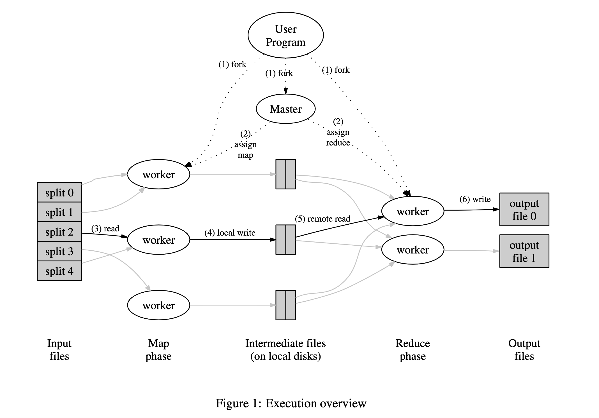
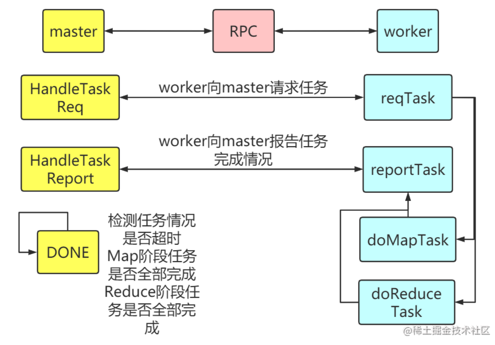

# Lab1详细解析

- 实验官网链接：[6.824 Lab 1: MapReduce](https://pdos.csail.mit.edu/6.824/labs/lab-mr.html)

- 论文链接：https://pdos.csail.mit.edu/6.824/papers/mapreduce.pdf

- 代码参考：[分布式计算模型MapReduce——Go语言实现【MIT 6.824 Lab1】 - 掘金](https://juejin.cn/post/6865679367398227981)

## 1. 论文理解

- Abstract：
  
  - MapReduce是什么？有什么用？如何实现？优点？
    
    - 一种编程模型
    
    - 用于处理和生成大数据集
    
    - 使用用户自定义的Map和Reduce实现
    
    - 没有任何并发和分布式系统经验的程序员也能很好的利用分布式系统资源

- Introduction：
  
  - 为什么会有MapReduce？介绍最近几年面临的问题：需要处理大量的原始数据
    
    - Web请求日志、URL访问频率、倒排索引、分布式排序
  
  - MapReduce的优点？
    
    - 屏蔽并行、容错、分布式数据、负载均衡等相关问题
    
    - 用户只需要专注编写核心map和reduce即可

- Programming Model：
  
  - MapReduce的抽象模型？
    
    - 输入可以切分为一个个的逻辑记录(record)
    
    - 每个记录可以执行某中映射(map)，以生产一些中间结果=>kv键值对
    
    - 相同key的中间结果可以在子集上进行规约(reduce，排序、统计、最值等)

- Implementation：
  
  - 
    
    - 0、Map()、Redice()实现，中间结果键值对的分区数量R指定好，用于切分中间结果的哈希函数指定好。worker运算程序，master程序调度者
    
    - 1、输入文件会被分割为M份，每份大小通常[16,64]MB 
    
    - 2、整个执行过程中包含M个Map任务和R个Reduce任务。Master会在空闲的Worker选择并且分配Map和Reduce任务
    
    - 3、收到Map任务的Worker开始读自己对应的文件，将输入内容解析为Map输入格式，并且调用Map函数，生成的中间结果键值对暂时存放在缓存中
    
    - 4、在Map任务执行的同时，根据用户指定的Partition函数(hash(key) mod R)将产生的中间结果分为R个部分保持到自己的磁盘中，任务完成后，将中间结果的存放位置报告给Master
    
    - 5、Master将Map的中间结果位置转发给Reduce，Reduce通过RPC读取存储在Map本地磁盘上属于对应Partition的中间结果，读取完毕后，将读取到的数据进行排序，令相同键的kv对能够连续分布(相同键进行聚合)
    
    - 6、开始执行Reduce逻辑，Reduce执行结果放到对应的Reduce Partition中
  
  - master如何调度？应该是什么结构？
  
  - 容错性？
    
    - worker失败？如何检测worker失败？失败后怎么办？
      
      - 心跳检测
      
      - 重试
    
    - master失败？失败怎么办？
      
      - 保存点(checkpoint)=>快照+日志
      
      - 主从备份
      
      - 状态外存
  
  - 其他考虑？
    
    - 局部性：网络带宽很宝贵！尽可能保存到本地磁盘上运行
    
    - 任务粒度：M和R的选择也需要人工配置
    
    - 任务备份：straggler、木桶效应、长尾效应

- Refinements：
  
  - Partitioner：对于Map输出的中间结构的划分，在不同任务上也可以进行优化
  
  - Combiner：中间结果的Reduce操作满足结合律，可以提高运行效率，如单词计数，Map上进行计数和Reduce上进行计数都是一样的结果，所以可以先在Map上计数，再到Reduce计数，中间传输的数据量就会小很多
  
  - Reader/Writer：本质是系统和现实业务之间的适配器，可以根据业务需要进行定制
  
  - 副作用
  
  - 跳过坏记录
  
  - 单机执行：更加方便的进行调试
  
  - 状态信息：任务进度信息的可视化界面
  
  - 全局计数器

- Performance：
  
  - 性能测试

- Experience：
  
  - 实验指标

## 2. 代码理解-非分布式实现

- ```go
  cd src/main
  go build -buildmode=plugin ../mrapps/wc.go
  
  rm mr-out*
  go run mrsequential.go wc.so pg*.txt
  
  more mr-out-0
  ```

- 阅读源码(确实都不难)

- ```go
  // 1.阅读 mrapps/wc.go
  // 理解每个函数的功能和具体实现
  // 2.阅读 main/mrsequential.go
  // 理解每个函数的功能和具体事项
  ```

## 3.代码理解-分布式实现

- 

- 核心理解：master可以调度worker，根据阶段的不同，分配不同的任务(map、reduce)给worker

- 需要考虑？
  
  - master需要做什么任务？任务如何分配？(将master看成一个类！)
    
    - 定义任务状态
    
    - 定义Master结构：任务队列、输入文件、map、reduce数目、任务阶段、任务状态、互斥锁、完成状态
    
    - master初始化、监听worker
  
  - master如何将定义好的任务分配给worker？
    
    - 定义消息报文：请求任务报文、响应请求任务报文、报告任务报文、响应报告任务报文
    
    - 根据监听worker发送过来的报文，给worker分配不同阶段的任务
  
  - worker如何向master请求报文？根据返回的报文如何处理？
    
    - 循环使用RPC远程调用master提供的方法，获取响应请求任务报文
    
    - 根据响应请求任务报文，执行相应的任务
      
      - map任务，处理数据、保存中间结果(hash(key))决定保存的位置
      
      - reduce任务，读取数据、排序、计算最终结果、保存数据
    
    - 任务处理完成后向master发送报告任务报文
  
  - master如何判断任务队列都已完成？
    
    - 每隔一段时间循环调用Done()遍历任务队列中的任务状态(记得加锁！)
    
    - 需要考虑正在运行的任务(straggler)是否需要超时重新计算
    
    - 是否存在运行错误的任务，如果有也需要重新计算

- 改进？
  
  - 目前的coordinator中只有当全部的map任务执行完毕后，才能执行reduce任务？也就是Map、Reduce的调度问题
  
  - worker似乎是不断for循环请求任务，执行任务，报告任务的，可以尝试使用go协程的方式进行调度，
    
    - 但是需要考虑所有任务都完成的情况，不然容易导致main方法结束，而go协程还在运行导致被中断的情况
  
  - 考虑worker失败和straggler的情况，但是没有考虑到master失败的情况？

- 具体编码流程：
  
  - ```go
    src/main/mrcoordinator.go // 主要用来启动一个master，等待给worker分配任务，并且不断判断自身任务是否都执行完毕
    
    // 主要用来加载map、reduce，并且启动一个worker执行响应的任务
    // 后续可以考虑使用协程的方式多开几个worker，
    // 但是需要考虑资源同步问题和main销毁，协程也会销毁的问题
    src/main/mrworker.go 
    
    // 用来定义master和worker交互的报文，已经任务状态、结构等
    src/mr/rpc.go
    
    // 用来定义一个真正的master(coordinator)
    // 需要考虑任务初始化、监听worker请求、分配worker任务、worker的容错处理
    src/mr/coordinator.go
    
    // 用来定义一个真正worker
    // 需要考虑如何向master请求任务、运行任务、报告任务等
    src/mr/worker.go
    ```

- 具体运行：

```goag-0-1g6ne04poag-1-1g6ne04po
(base) king@kingdeMacBook-Pro main % go run mrcoordinator.go pg*.txt 
(base) king@kingdeMacBook-Pro main % go build -buildmode=plugin ../mrapps/wc.go
(base) king@kingdeMacBook-Pro main % go run mrworker.go wc.so  
```

- 具体代码

```go
src/main/mrcoordinator.go


package main

//
// start the coordinator process, which is implemented
// in ../mr/coordinator.go
//
// go run mrcoordinator.go pg*.txt
//
// Please do not change this file.
//

import (
    "fmt"
    "os"
    "time"

    "6.824/mr"
)

func main() {
    if len(os.Args) < 2 {
        fmt.Fprintf(os.Stderr, "Usage: mrcoordinator inputfiles...\n")
        os.Exit(1)
    }

    m := mr.MakeCoordinator(os.Args[1:], 10)
    // m := mr.MakeMaster(os.Args[1:], 10)
    for m.Done() == false {
        time.Sleep(time.Second)
    }

    time.Sleep(time.Second)
}


src/main/mrworker.go


package main

//
// start a worker process, which is implemented
// in ../mr/worker.go. typically there will be
// multiple worker processes, talking to one coordinator.
//
// go run mrworker.go wc.so
//
// Please do not change this file.
//

import (
    "fmt"
    "log"
    "os"
    "plugin"
    "time"

    "6.824/mr"
)

func main() {
    if len(os.Args) != 2 {
        fmt.Fprintf(os.Stderr, "Usage: mrworker xxx.so\n")
        os.Exit(1)
    }

    mapf, reducef := loadPlugin(os.Args[1])

    go mr.Worker(mapf, reducef)
    time.Sleep(time.Second * 100000)
}

//
// load the application Map and Reduce functions
// from a plugin file, e.g. ../mrapps/wc.so
//
func loadPlugin(filename string) (func(string, string) []mr.KeyValue, func(string, []string) string) {
    p, err := plugin.Open(filename)
    if err != nil {
        log.Fatalf("cannot load plugin %v", filename)
    }
    xmapf, err := p.Lookup("Map")
    if err != nil {
        log.Fatalf("cannot find Map in %v", filename)
    }
    mapf := xmapf.(func(string, string) []mr.KeyValue)
    xreducef, err := p.Lookup("Reduce")
    if err != nil {
        log.Fatalf("cannot find Reduce in %v", filename)
    }
    reducef := xreducef.(func(string, []string) string)

    return mapf, reducef
}


src/mr/rpc.go


package mr

//
// RPC definitions.
//
// remember to capitalize all names.
//

import (
    "os"
    "strconv"
    "time"
)

//
// example to show how to declare the arguments
// and reply for an RPC.
//

type ExampleArgs struct {
    X int
}

type ExampleReply struct {
    Y int
}

// Add your RPC definitions here.

// Cook up a unique-ish UNIX-domain socket name
// in /var/tmp, for the coordinator.
// Can't use the current directory since
// Athena AFS doesn't support UNIX-domain sockets.
func coordinatorSock() string {
    s := "/var/tmp/824-mr-"
    s += strconv.Itoa(os.Getuid())
    return s
}

// ======定义RPC请求结构：任务报文、请求任务报文、报告任务报文、======
type TaskStatus string
type TaskPhase string
type TimeDuration time.Duration

// 任务状态常量
const (
    // 就绪
    TaskStatusReady TaskStatus = "ready"
    // 队列中
    TaskStatusQueue TaskStatus = "queue"
    // 执行中
    TaskStatusRunning TaskStatus = "running"
    // 已完成
    TaskStatusFinish TaskStatus = "finish"
    // 任务错误
    TaskStatusErr TaskStatus = "error"
)

//任务阶段常量
const (
    MapPhase    TaskPhase = "map"
    ReducePhase TaskPhase = "reduce"
)

// 任务定义
type Task struct {
    // 操作阶段：map/reduce
    TaskPhase TaskPhase
    // map个数
    MapNum int
    // reduce个数
    ReduceNum int
    // 任务序号
    TaskIndex int
    // 文件名
    FileName string
    // 是否完成
    IsDone bool
}

// 请求任务参数
type ReqTaskArgs struct {
    // 当前worker存活,可以执行任务
    WorkerStatus bool
}

// 请求任务返回值
type ReqTaskReply struct {
    // 返回一个任务
    Task Task
    // 是否完成所有任务
    TaskDone bool
}

// 报告任务参数
type ReportTaskArgs struct {
    // 当前worker存活,可以执行任务
    WorkerStatus bool
    // 任务序号
    TaskIndex int
    // 是否完成
    IsDone bool
}

// 报告任务返回值
type ReportTaskReply struct {
    // master响应是否处理成功
    MasterAck bool
}


src/mr/coordinator.go
package mr

import (
    "errors"
    "fmt"
    "log"
    "net"
    "net/http"
    "net/rpc"
    "os"
    "sync"
    "time"
)

// ========lab源码
// type Coordinator struct {
//     // Your definitions here.

// }

// // Your code here -- RPC handlers for the worker to call.

// //
// // an example RPC handler.
// //
// // the RPC argument and reply types are defined in rpc.go.
// //
// func (c *Coordinator) Example(args *ExampleArgs, reply *ExampleReply) error {
//     reply.Y = args.X + 1
//     return nil
// }

// //
// // start a thread that listens for RPCs from worker.go
// //
// func (c *Coordinator) server() {
//     rpc.Register(c)
//     rpc.HandleHTTP()
//     //l, e := net.Listen("tcp", ":1234")
//     sockname := coordinatorSock()
//     os.Remove(sockname)
//     l, e := net.Listen("unix", sockname)
//     if e != nil {
//         log.Fatal("listen error:", e)
//     }
//     go http.Serve(l, nil)
// }

// //
// // main/mrcoordinator.go calls Done() periodically to find out
// // if the entire job has finished.
// //
// func (c *Coordinator) Done() bool {
//     ret := false

//     // Your code here.

//     return ret
// }

// //
// // create a Coordinator.
// // main/mrcoordinator.go calls this function.
// // nReduce is the number of reduce tasks to use.
// //
// func MakeCoordinator(files []string, nReduce int) *Coordinator {
//     c := Coordinator{}

//     // Your code here.

//     c.server()
//     return &c
// }

// =======具体实现======
// 任务状态定义
type TaskState struct {
    // 状态
    Status TaskStatus
    // 开始执行时间
    StartTime time.Time
}

// Master结构定义
type Coordinator struct {
    // 任务队列
    TaskChan chan Task
    // 输入文件
    Files []string
    // map数目
    MapNum int
    // reduce数目
    ReduceNum int
    // 任务阶段
    TaskPhase TaskPhase
    // 任务状态
    TaskState []TaskState
    // 互斥锁
    Mutex sync.Mutex
    // 是否完成
    IsDone bool
}

// 启动Master
func MakeCoordinator(files []string, nReduce int) *Coordinator {

    // 定义一个Coordinator结构
    coordinator := Coordinator{}

    // 初始化 Cooridnator
    coordinator.IsDone = false
    coordinator.Files = files
    coordinator.MapNum = len(files)
    coordinator.ReduceNum = nReduce
    coordinator.TaskPhase = MapPhase
    // 任务状态结构体初始化
    // 包含任务状态和任务开始时间
    coordinator.TaskState = make([]TaskState, coordinator.MapNum)
    // 任务队列初始化：
    // Task包含：操作阶段、map个数、reduce个数、任务序号、文件名、是否完成
    coordinator.TaskChan = make(chan Task, 10)
    // 赋值任务状态
    for k := range coordinator.TaskState {
        coordinator.TaskState[k].Status = TaskStatusReady
    }

    // 开启线程监听
    coordinator.server()

    return &coordinator
}

// 启动一个线程监听worker.go的RPC请求
func (coordinator *Coordinator) server() {
    // 将Master结构体和对应的方法注册到rpc中
    rpc.Register(coordinator)
    // 通过HandleHTTP()把Master提供的服务注册到HTTP协议上，方便调用者利用http的方式进行数据传递
    rpc.HandleHTTP()
    // 不同主机之间的进程通信可以选择tcp进行调用
    //l, e := net.Listen("tcp", "127.0.0.1:1234")

    // 同一台主机的进程通信可以使用 unix domain socket取代tcp
    // 注意同tcp方式不同在于，这里的地址不再是一个类似127.0.0.1:xxx这样的端口号,而是一个.sock文件的地址，文件地址可以自己选定。
    // 设定地址和sock文件名后，服务端启动成功后会在对应目录生成该sock文件。
    //由于已经存在该文件，服务会启动失败，因此在每次启动前都应该先移除该文件
    // 删除mr-socket文件
    os.Remove("mpreduce-socket")
    // fmt.Println("删除 mr-socket文件")
    l, e := net.Listen("unix", "mpreduce-socket")
    if e != nil {
        log.Fatal("listen error:", e)
    }
    // 开启协程监听这个mr-socket
    go http.Serve(l, nil)
}

// 循环调用 Done() 来判定任务是否完成
func (coordinator *Coordinator) Done() bool {
    ret := false

    finished := true
    coordinator.Mutex.Lock()
    defer coordinator.Mutex.Unlock()
    for key, ts := range coordinator.TaskState {
        switch ts.Status {
        case TaskStatusReady:
            // 任务就绪，将任务放到任务队列中
            finished = false
            coordinator.addTask(key)
        case TaskStatusQueue:
            // 任务队列中
            finished = false
        case TaskStatusRunning:
            // 任务执行中
            finished = false
            // 验证是否超时，超时重新计算
            coordinator.checkTask(key)
        case TaskStatusFinish:
            // 任务已完成
        case TaskStatusErr:
            // 任务错误
            finished = false
            coordinator.addTask(key)
        default:
            panic("任务状态异常...")
        }
    }
    // 任务完成
    if finished {
        // 判断阶段
        // 如果每个TaskState都已经完成了，并且是MapPhase阶段，表示coordinator都已经处理完了map阶段，可以进行reduce阶段
        if coordinator.TaskPhase == MapPhase {
            coordinator.initReduceTask()
        } else {
            coordinator.IsDone = true
            close(coordinator.TaskChan)
        }
    } else {
        // 如果是reduce阶段，则整个任务结束
        coordinator.IsDone = false
    }
    ret = coordinator.IsDone
    return ret
}

// 初始化reduce阶段
func (coordinator *Coordinator) initReduceTask() {
    coordinator.TaskPhase = ReducePhase
    coordinator.IsDone = false
    coordinator.TaskState = make([]TaskState, coordinator.ReduceNum)
    for k := range coordinator.TaskState {
        coordinator.TaskState[k].Status = TaskStatusReady
    }
}

// 根据给定的任务序号，将任务放入coordinator的任务队列中
// 如果coordinator还是在map阶段，则任务的文件路径为coordinator的输入文件路径
func (coordinator *Coordinator) addTask(taskIndex int) {
    // 构造任务信息
    coordinator.TaskState[taskIndex].Status = TaskStatusQueue
    task := Task{
        FileName:  "",
        MapNum:    len(coordinator.Files),
        ReduceNum: coordinator.ReduceNum,
        TaskIndex: taskIndex,
        TaskPhase: coordinator.TaskPhase,
        IsDone:    false,
    }
    if coordinator.TaskPhase == MapPhase {
        task.FileName = coordinator.Files[taskIndex]
    }
    // 放入任务队列
    coordinator.TaskChan <- task
}

// 检查任务处理是否超时
func (coordinator *Coordinator) checkTask(taskIndex int) {
    MaxTaskRunTime := time.Second * 60000
    timeDuration := time.Now().Sub(coordinator.TaskState[taskIndex].StartTime)
    if timeDuration > MaxTaskRunTime {
        // 任务超时重新加入队列
        coordinator.addTask(taskIndex)
    }
}

// 处理任务请求
//     worker发送任务请求，coordinator收到这个请求后进行处理
// 定义 请求任务参数 结构体 ReqTaskArgs:包含该worker是否存活的信息
//      请求任务返回值 结构体 ReqTaskReply:返回一个Task(任务操作阶段、map个数、reduce个数、任务序号、文件名、是否完成),和是否完成所有任务表舒服
func (coordinator *Coordinator) HandleTaskReq(args *ReqTaskArgs, reply *ReqTaskReply) error {
    fmt.Println("开始处理任务请求...")
    if !args.WorkerStatus {
        return errors.New("当前worker已下线")
    }
    // 从coordinator中的任务队列中获取一个任务，分配给worker
    task, ok := <-coordinator.TaskChan
    if ok == true {
        // 因为传入的是引用类型，所以修改该值也会反应到原来地址上
        reply.Task = task
        // 调整coordinator中对应任务的状态，任务状态置为执行中,
        coordinator.TaskState[task.TaskIndex].Status = TaskStatusRunning
        // 记录任务开始执行时间
        coordinator.TaskState[task.TaskIndex].StartTime = time.Now()
    } else {
        // 若队列中已经没有任务，则任务全部完成，结束
        reply.TaskDone = true
    }
    return nil
}

// 处理任务报告
// 类似HandleTaskReq()...
// 根据worker的任务报告，来改变coordinator中的TaskState(每个任务的状态)
func (coordinator *Coordinator) HandleTaskReport(args *ReportTaskArgs, reply *ReportTaskReply) error {
    fmt.Println("开始处理任务报告...")
    if !args.WorkerStatus {
        reply.MasterAck = false
        return errors.New("当前worker已下线")
    }
    if args.IsDone == true {
        // 任务已完成
        coordinator.TaskState[args.TaskIndex].Status = TaskStatusFinish
    } else {
        // 任务执行错误
        coordinator.TaskState[args.TaskIndex].Status = TaskStatusErr
    }
    // 响应worker我已经接收到了
    reply.MasterAck = true
    return nil
}


src/mr/worker.go

package mr

import (
    "encoding/json"
    "errors"
    "fmt"
    "hash/fnv"
    "io/ioutil"
    "log"
    "net/rpc"
    "os"
    "sort"
    "strconv"
)

// //
// // Map functions return a slice of KeyValue.
// //
// type KeyValue struct {
//     Key   string
//     Value string
// }

// //
// // use ihash(key) % NReduce to choose the reduce
// // task number for each KeyValue emitted by Map.
// //
// func ihash(key string) int {
//     h := fnv.New32a()
//     h.Write([]byte(key))
//     return int(h.Sum32() & 0x7fffffff)
// }

// //
// // main/mrworker.go calls this function.
// //
// func Worker(mapf func(string, string) []KeyValue,
//     reducef func(string, []string) string) {

//     // Your worker implementation here.

//     // uncomment to send the Example RPC to the coordinator.
//     // CallExample()

// }

// //
// // example function to show how to make an RPC call to the coordinator.
// //
// // the RPC argument and reply types are defined in rpc.go.
// //
// func CallExample() {

//     // declare an argument structure.
//     args := ExampleArgs{}

//     // fill in the argument(s).
//     args.X = 99

//     // declare a reply structure.
//     reply := ExampleReply{}

//     // send the RPC request, wait for the reply.
//     // the "Coordinator.Example" tells the
//     // receiving server that we'd like to call
//     // the Example() method of struct Coordinator.
//     ok := call("Coordinator.Example", &args, &reply)
//     if ok {
//         // reply.Y should be 100.
//         fmt.Printf("reply.Y %v\n", reply.Y)
//     } else {
//         fmt.Printf("call failed!\n")
//     }
// }

// //
// // send an RPC request to the coordinator, wait for the response.
// // usually returns true.
// // returns false if something goes wrong.
// //
// func call(rpcname string, args interface{}, reply interface{}) bool {
//     // c, err := rpc.DialHTTP("tcp", "127.0.0.1"+":1234")
//     sockname := coordinatorSock()
//     c, err := rpc.DialHTTP("unix", sockname)
//     if err != nil {
//         log.Fatal("dialing:", err)
//     }
//     defer c.Close()

//     err = c.Call(rpcname, args, reply)
//     if err == nil {
//         return true
//     }

//     fmt.Println(err)
//     return false
// }

// =========具体实现========

type KeyValue struct {
    Key   string
    Value string
}

// use ihash(key) % NReduce to choose the reduce
// task number for each KeyValue emitted by MapPhase.
func ihash(key string) int {
    h := fnv.New32a()
    h.Write([]byte(key))
    return int(h.Sum32() & 0x7fffffff)
}

// Worker 主线程,循环请求任务以及报告任务
func Worker(mapf func(string, string) []KeyValue, reducef func(string, []string) string) {

    for {
        // 请求任务
        reply := ReqTaskReply{}
        // 调用请求任务，获取Coordinator的返回值
        reply = reqTask()
        if reply.TaskDone {
            break
        }
        // 执行任务
        // 根据返回的任务，执行相应的任务
        err := doTask(mapf, reducef, reply.Task)
        if err != nil {
            reportTask(reply.Task.TaskIndex, false)
        }
        // 报告任务结果
        reportTask(reply.Task.TaskIndex, true)
    }
    return
}

// 请求任务
func reqTask() ReqTaskReply {
    // 声明参数并赋值
    args := ReqTaskArgs{}
    args.WorkerStatus = true

    reply := ReqTaskReply{}

    // RPC调用Coordinator的HandleTaskReq服务
    if ok := call("Coordinator.HandleTaskReq", &args, &reply); !ok {
        log.Fatal("请求任务失败...")
    }

    return reply
}

// 报告任务结果
func reportTask(taskIndex int, isDone bool) ReportTaskReply {
    // 声明参数并赋值
    args := ReportTaskArgs{}
    args.IsDone = isDone
    args.TaskIndex = taskIndex
    args.WorkerStatus = true

    reply := ReportTaskReply{}

    // RPC调用
    if ok := call("Coordinator.HandleTaskReport", &args, &reply); !ok {
        log.Fatal("报告任务失败...")
    }
    return reply

}

// 执行任务
// 根据Coordinattor分配的任务阶段，调用不同的任务
func doTask(mapf func(string, string) []KeyValue, reducef func(string, []string) string, task Task) error {
    if task.TaskPhase == MapPhase {
        err := DoMapTask(mapf, task.FileName, task.TaskIndex, task.ReduceNum)
        return err
    } else if task.TaskPhase == ReducePhase {
        err := DoReduceTask(reducef, task.MapNum, task.TaskIndex)
        return err
    } else {
        log.Fatal("请求任务的任务阶段返回值异常...")
        return errors.New("请求任务的任务阶段返回值异常")
    }
    return nil
}

// 执行map任务
func DoMapTask(mapf func(string, string) []KeyValue, fileName string, mapTaskIndex int, reduceNum int) error {

    fmt.Println("开始处理Map任务...")
    // 打开文件
    file, err := os.Open(fileName)
    if err != nil {
        log.Fatalf("cannot open %v", fileName)
        return err
    }
    // 读取文件内容
    content, err := ioutil.ReadAll(file)
    if err != nil {
        log.Fatalf("cannot read %v", fileName)
        return err
    }
    file.Close()
    // 输入map程序
    kva := mapf(fileName, string(content))
    for i := 0; i < reduceNum; i++ {
        // 中间输出文件名mr-X-Y
        intermediateFileName := intermediateName(mapTaskIndex, i)
        fmt.Printf("doMap文件名%s创建\n", intermediateFileName)
        // 创建中间输出文件,并存储为JSON格式
        file, _ := os.Create(intermediateFileName)
        enc := json.NewEncoder(file)
        for _, kv := range kva {
            if ihash(kv.Key)%reduceNum == i {
                enc.Encode(&kv)
            }
        }
        file.Close()
    }
    return nil
}

// 执行reduce任务
func DoReduceTask(reducef func(string, []string) string, mapNum int, reduceTaskIndex int) error {
    fmt.Println("开始处理Reduce任务...")
    // map:string->[]string
    res := make(map[string][]string)
    for i := 0; i < mapNum; i++ {
        // 打开中间文件
        intermediateFileName := intermediateName(i, reduceTaskIndex)
        file, err := os.Open(intermediateFileName)
        if err != nil {
            log.Fatalf("cannot open %v", intermediateFileName)
            return err
        }
        // 反序列化JSON格式文件
        dec := json.NewDecoder(file)
        // 读取文件内容
        for {
            var kv KeyValue
            err := dec.Decode(&kv)
            if err != nil {
                break
            }
            _, ok := res[kv.Key]
            if !ok {
                res[kv.Key] = make([]string, 0)
            }
            res[kv.Key] = append(res[kv.Key], kv.Value)
        }
        file.Close()
    }
    // 提取key值,用于排序
    var keys []string
    for k := range res {
        keys = append(keys, k)
    }
    // key值排序
    sort.Strings(keys)
    outputFileName := outputName(reduceTaskIndex)
    fmt.Printf("doReduce输出%s文件名\n", outputFileName)
    outputFile, _ := os.Create(outputFileName)
    for _, k := range keys {
        output := reducef(k, res[k])
        // 输出reduce的结果到mr-out-X文件中
        fmt.Fprintf(outputFile, "%v %v\n", k, output)
    }
    outputFile.Close()

    return nil
}

//
// send an RPC request to the master, wait for the response.
// usually returns true.
// returns false if something goes wrong.
//
func call(rpcname string, args interface{}, reply interface{}) bool {
    // windows & mac RPC config
    // c, err := rpc.DialHTTP("tcp", "127.0.0.1"+":1234")
    // linux RPC config
    c, err := rpc.DialHTTP("unix", "mpreduce-socket")
    if err != nil {
        log.Fatal("dialing:", err)
    }
    defer c.Close()

    err = c.Call(rpcname, args, reply)
    if err == nil {
        return true
    }

    fmt.Println(err)
    return false
}

// 中间文件名
func intermediateName(mapTaskIndex int, reduceTaskIndex int) string {

    var fileName string
    fileName = "mr" + "-" + strconv.Itoa(mapTaskIndex) + "-" + strconv.Itoa(reduceTaskIndex)
    return fileName
}

// 输出文件名
func outputName(reduceTaskIndex int) string {
    var fileName string
    fileName = "mr-out-" + strconv.Itoa(reduceTaskIndex)
    return fileName
}
```
