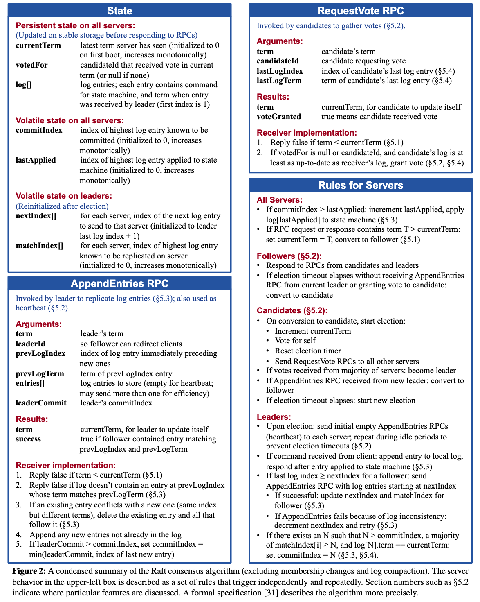
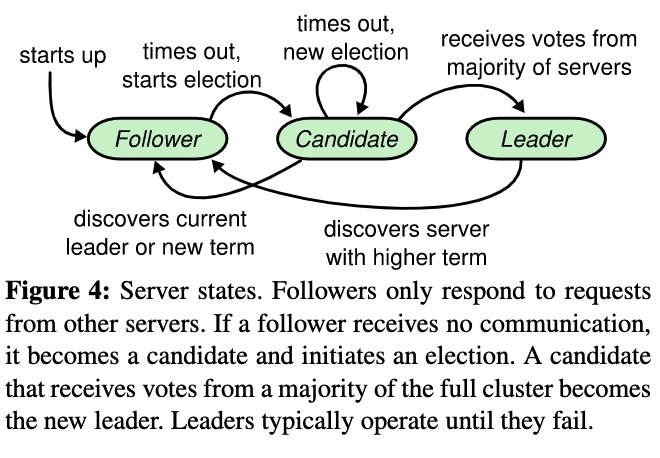
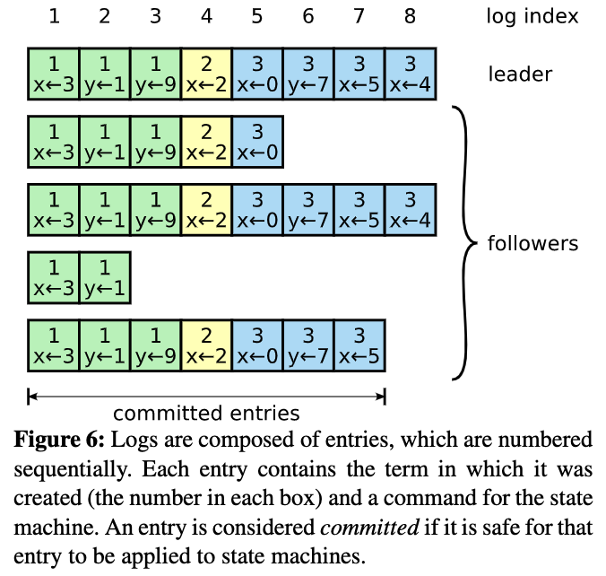
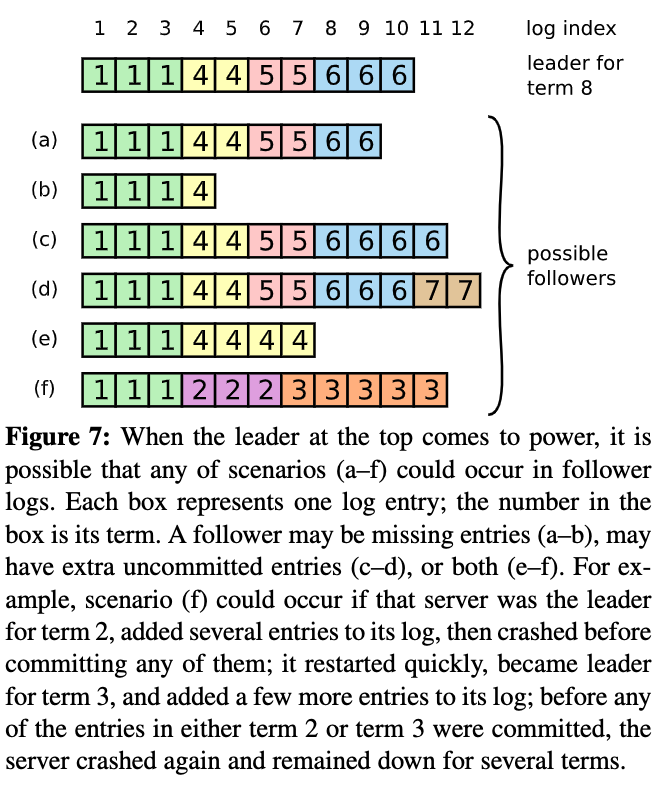

# Lab2详细解析

- 实验官方链接：https://pdos.csail.mit.edu/6.824/labs/lab-raft.html

- 论文链接：
  
  - 中文：https://yuerblog.cc/wp-content/uploads/raft-zh_cn.pdf
  
  - 英文：https://pdos.csail.mit.edu/6.824/papers/raft-extended.pdf

- 代码参考：
  
  - https://yuerblog.cc/2020/08/13/mit-6-824-distributed-systems-%e5%ae%9e%e7%8e%b0raft-lab2a/

## Lab2A

- 目标：实现Raft算法中的Leader Election

- 论文回顾：Leader Election
  
  - 
    
    - Raft结点的状态信息：
      
      - 所有结点都需要持久化的状态信息：
        
        - currentTerm：当前的Term ID(初始化为0)
        
        - votedFor：在currentTerm中已经将票投给了Candidate的ID
        
        - log[]：当前结点的日志记录(初始化为0)
      
      - 所有结点运行时需要的状态信息：
        
        - commitIndex：最后一个已经提交的日志记录的index(初始化为0)
        
        - lastApplied：最后一个已经应用到状态机的日志记录index(初始化为0)
      
      - Leader结点运行时需要的状态信息：
        
        - nextIndex[]：Leader需要为每个节点即将发送的下一个日志记录的index(初值为Leader最新日志记录index值+1)
        
        - matchIndex[]：每个节点上已经备份的最后一条日志记录的index(初值为0)
    
    - Raft结点间的交互：用于日志备份的AppendEntries：
      
      - AppendEntries RPC：由Leader进行调用，用于将日志记录备份至Follower，同时还可以用来当作心跳检测的信息
      
      - 参数：
        
        - term：Leader的TermID
        
        - leaderId：Leader的ID
        
        - prevLogIndex：正在备份的日志记录之前的日志记录的index值
        
        - revLogTerm：prevLogIndex的Term ID
        
        - entries[]：正在备份的日志记录
        
        - leaderCommit：Leader已经提交的最后一条的日志的index值
      
      - 返回值：
        
        - term：接收方当前的TermID
        
        - success：党Follower能够在自己的日志中找到index、TermID 与prevLogIndex和prevLogTerm 相同的记录时为true
      
      - 接收方接收到AppendEntries进行的操作：
        
        - 如果term<currentTerm，返回false
        
        - 如果日志中不包含index、TermID与prevLogIndex、prevLogTerm相同的记录，返回false
        
        - 如果正在备份的entries[]存在与接收方日志中冲突的记录(index相同，TermID不同)，则删除该记录以及之后的所有记录
        
        - 在保存的日志后追加新的日子记录(entries[])
        
        - 如果leaderCommit>commitIndex，令commitIndex等于leaderCommit和最后一个新日志记录的index之间的最小值
    
    - Raft结点间的交互：用于Leader Election的RequestVote：
      
      - RequestVote RPC：由Candidate调用以拉取投票
      
      - 参数：
        
        - term：Candidate的TermID
        
        - candidateId：Candidate的ID
        
        - lastLogIndex：Candidate所持有的最后一条日志记录的index
        
        - LastLogTerm：Candidate所持有的最后一条日志记录的TermID
      
      - 返回值：
        
        - term：接收方的TermID
        
        - voteGranted：接收方是否同意给Candidate投票
      
      - 接收方在接收到RequestVote RPC后会进行的操作：
        
        - 如果term<currentTerm，返回false
        
        - 如果votedFor==null并且给定的日志记录信息与自己的相同或者更新，返回true
    
    - 遵循的规则：
      
      - 所有节点：
        
        - 如果commitIndex>lastApplied，则lastApplied++,并且将log[lastApplied]运行到状态机上
        
        - 如果RPC请求携带的term>currentTerm，则cuurentTerm=term，并且如果是Leader，则降级为Follower
      
      - 对于Follower：
        
        - 负责响应Candidate和Leader的RPC
        
        - 如果在Election Timeout之前没有收到Leader的AppendEntries RPC、没有将票投给其他Candidate，则升级为Candidate角色
      
      - 对于Candidate：
        
        - 在加入Candidate时，发起Leader Election：
          
          - currentTerm++
          
          - 先给自己投一票
          
          - 重置Election Timeout
          
          - 发送ReqeustVote RPC给其他所有节点
          
          - 如果收到来自其他大多数节点的投票，则升级为Leader
          
          - 如果收到其他Leader的AppendEntries RPC则Candidate变为Follower
          
          - 如果再次Election Timeout，则重新发起选举
      
      - 对于Leader：
        
        - 在空闲时，周期的向Follower发起空白的AppendEntries RPC作为心跳检测，防止Folllower发起选举
        
        - 如果从客户端收到新的命令，则将命令追加到存储的日志中，并顺利将命令应用到状态机后返回响应(这里似乎没有考虑到其他节点，未完待续)
        
        - 如果最新的日志记录的index>=某个Follower的nextIndex，则通过AppendEntries RPC发送nextIndex之后的所有日志记录
          
          - 如果备份成功，则更新该Follower对应的nextIndex和matchIndex
          
          - 如果备份失败，则对nextIndex--并重试
        
        - 如果存在一个值N，有N>commitIndex,并且大多数matchIndex[i]>=N,log[N].term==currentTerm,则令commitIndex=N
  
  - Raft算法实现流程：
    
    - 选举出一个Leader。结点有哪些信息？哪些状态？状态如何转换？结点间如何交互？如何选举？
    
    - Leader具有全部的复制日志权限。
    
    - Leader从客户端接收log entries，并且在其他服务器复制，同时通知服务器何时安全的将log entries运行到状态机上。Leader如何接收客户端命令？如何操作日志？如何发生日志？如何维护Leader？
  
  - Raft基础：
    
    - Raft结点个数？结点状态？不同状态的作用？状态转换？划分的term？结点通信？
  
  - Leader Election：
    
    - 
    
    - 在初次启动时，所有结点都是follower状态的。
      
      - 如果可以一直收到Leader结点发送来的RPC请求，则就会一直处于follower状态
      
      - 如果接收不到Leader结点发送来的RPC请求，则在等待一个Election Timeout后，就发起一轮选举
    
    - follower发起选举：currentTerm自增，进入Candidate状态，投票给自己，向其他节点发送RequestVote RPC请求。其他节点接收到后，会以先来先服务方式投票
    
    - 当Candidate在某个Term接收到来自集群中大多数节点发来的投票时，就会成为Leader，并且向其他节点进行通信，确保其他节点知道它已经是Leader，防止重新发起Leader Election。
      
      - 每个节点在指定的Term中只会投出一票，而只有接收到大多数节点发来的投票才能成为Leader，确保任意Term中至多只会有一个Leader。也就是确保Election Safety性质
    
    - Candidate在投票过程中也有可能受到其他Leader的AppendEntries RPC调用，也就意味着有其他节点成为了该Term的Leader
      
      - 如果AppendEntries携带的term大于等于当前的Candidate的currentTerm，则Candidate就认可该Leader，进入Follower状态
      
      - 否则会拒绝该RPC并且继续保持其Candidate
    
    - 如果Leader Election发送平局：若干个结点在短时间内同时发起选举，导致集群中没有任何一个结点可与接收到来自集群大多数节点的投票。
      
      - 此时会重新等待Election Timeout后发起新一轮的选举
      
      - 但是如果不加入额外的限制，则很容易发生平局，因此在Election Timout使用随机值，当结点进入新的Term时，就会在一个固定的区间内随机选取该Term使用的Election Timeout，通过随机化来错开结点进入Candidate状态的时机，来避免平局的重复发生
  
  - Election Restriction：
    
    - 如何确保Leader最终会持有所有已提交的日志记录？
    
    - 日志记录只会从Leader流向Follower，同时Leader不会覆盖已经保存的日志！
    
    - 为什么？
      
      - 因为一个Candidate成为Leader需要集群大多数节点同意，而一个日志记录被提交也需要已经备份到大多数节点上。如果一个Candidate能够成为Leader，投票给它的结点必然存在保存所有已提交的日志记录。
      
      - 在Candidate在发送RequestVote RPC时，会附带自己的日志最后一条记录的index和TermID(LastLogIndex，LastLogTerm)，其他节点在接收到这些参数后，会与自己的日志进行比较
        
        - 如果Candidate的日志落后与自己的日志(LastLogTerm比较后，再比较LastLogIndex)，就会拒绝投票
      
      - 这样就能够确保被选举的Leader必然包含所有已经提交的日志

- 具体代码实现：raft.go中

- 1、定义Fig2对应的结构体、消息传递参数

```go
// =========结构体定义==============
// logEntries定义
type LogEntry struct{
    Command interface{}
    Term int // 表示当前log entries所属的时间片序号
}

// Raft节点状态定义
const ROLE_LEADER = "Leader"
const ROLE_FOLLOWER = "Follower"
const ROLE_CANDIDATES = "Candidates"

// Raft节点(Server)定义
type Raft struct {
    // 锁，用于防止资源冲突
    mu        sync.Mutex          // Lock to protect shared access to this peer's state
    // Raft节点与其他节点的RPC通信节点
    peers     []*labrpc.ClientEnd // RPC end points of all peers
    // Raft节点需要保存的持久化信息
    persister *Persister          // Object to hold this peer's persisted state
    // Raft节点在Raft集群中的ID，也就是索引
    me        int                 // this peer's index into peers[]
    // 是否宕机标识
    dead      int32               // set by Kill()

    // 根据论文Fig 2, Raft节点需要的状态
    // 针对所有节点：服务器的持久化状态
    currentTerm int  // 该服务器当前任期
    votedFor int    // 在currentTerm时投票给了哪个Raft服务器
    log []*LogEntry    // 该服务器的logEntries数组

    // 针对所有节点：服务器的运行状态
    commitIndex int // 已经提交的最大索引值
    lastApplied int // 已经应用到状态机的最大索引值

    // 针对Leader节点：服务器的运行状态
    nextIndex []int  // Leader要向每个follower发送的日志记录的LogEntriesIndex,每个follower的log同步起点索引
    matchIndex []int // Leader向每个follower已经备份了的最后一条记录的index，每个follower的log同步进度

    // 所有节点的状态信息
    role String // 标识是什么状态
    leaderId int // 在currentTerm的Leader的ID

    // 具体实现
    // 时间戳：用于定时任务和Election Timeout
    lastActiveTime time.Time // 上次活跃时间(主要用来确定刷新时机，如收到leader心跳、给其他candidate投票、请求其他节点投票)
    lastBroadcastTime time.Time // 作为leader的上次广播时间，用来发送心跳检测消息
}


// 对应RequestVote RPC需要发送的数据参数
// 一般是Candidate节点调用
type RequestVoteArgs struct {
    Term int // 标识调用该RPC的Raft节点的Term
    CandidateId int // 标识调用该RPC的Raft节点的ID
    LastLogIndex int // 标识调用该RPC的Raft节点的最后已提交的LogEntries的索引值
    LastLogTerm int // 标识调用该RPC的Raft节点的最后已提交的LogEntries的Term

}

// RequestVote RPC返回数据
type RequestVoteReply struct {
    Term int // 被调用RPC方的TermID，也就是接收方的TermID
    voteGranted bool // 被调用RPC方是否同意投调用方一票
}


// AppendEntries RPC需要传输的参数
// 一般是Leader节点调用
type AppendEntriesArgs struct{
    Term int // 标识调用该RPC的Raft节点的TermID
    LeaderId int // 标识调用该RPC的Raft节点的LeaderID
    PrevLogIndex int // 标识正在备份的的logEntries(应该就是这个Entries)之前的LogEntries的Index
    RevLogTerm int //标识PrevLogIndex这条logEntries的TermID
    Entries []*LogEntry // 正在备份的logEntries
    LeaderCommit int // 标识Leader已经提交的最后一条logEntries的Index
}

// AppendEntries RPC需要返回的参数
type AppendEntriesReply struct{
    Term int // 接收方的term
    Success bool // 是否成功追加到接收方
}


// Test需要使用到，判断是否存在leader
func (rf *Raft) GetState() (int, bool) {
    var term int
    var isleader bool
    // 根据定义的数据结构，进行回去raft节点的状态

    term = rf.currentTerm
    isleader = rf.role == ROLE_LEADER
    return term, isleader
}
```

- 2、Raft的Leader Election
  
  - 每个Raft节点循环+sleep实现定时监听Election Timeout
  
  - 考虑超过Election Timeout后，节点变为Candidate
  
  - 节点状态变为Candidate后，进行Vote。需要考虑时间戳变化、currentTerm变化、voteFor变化
  
  - 并发调用其他节点的RequestVote RPC获取投票结果(其他节点需要加锁)
    
    - 需要判断请求方和接收方的term
      
      - 小就直接拒绝投票
      
      - 大就改变接收方的状态为Follower
    
    - 继续判断，只投一次票，并且请求方的LastLogIndex和LastLogTerm大于接收方的，才能够投票给请求方
    
    - 最后更新接收方的lastActiveTime（也就是更新Election Timeout）
  
  - 投票结果结束or超过半数
    
    - 判断状态、判断任期、判断投票结果
    
    - 最终判断是否变为leader
    
    - 变为leader后需要更新lastBroadcastTime来确保定时心跳检测
  
  - 修改Raft节点或者判断状态，都需要加锁！

```go
// 用于创建一个Raft结点
// peers：多个Raft结点之间的通信端点、
// me：当前创建Raft结点的ID
// persister：当前创建Raft需要持久化的数据
// applyCh：未知待续
func Make(peers []*labrpc.ClientEnd, me int,
    persister *Persister, applyCh chan ApplyMsg) *Raft {
    rf := &Raft{}
    rf.peers = peers
    rf.persister = persister
    rf.me = me

    // Your initialization code here (2A, 2B, 2C).
    // 需要初始化Raft结点状态
    rf.role = ROLE_FOLLOWER
    rf.leaderId = -1
    rf.votedFor = -1
    rf.lastActiveTime = time.Now()
    // initialize from state persisted before a crash
    rf.readPersist(persister.ReadRaftState())

    // 使用协程 开始Leader Election
    go rf.electionLoop()

    // Leader Election后，就可以进行Leader的心跳检测
    // 向其他结点发送logEntries
    go rf.appendEntriesLoop()

    // 日志打印
    DPrintf("RaftNode[%d]启动成功...",me)

    return rf
}

// 通过循环+time.Sleep实现单个Raft结点的定时检测，并且Leader Election
func (rf *Raft) electionLoop(){
    DPrintf("RaftNode[%d]开始进行electionLoop()...",rf.me)
    for !rf.killed() {
        time.Sleep(1*time.Millisecond) // 每隔1毫秒进行检测是否需要Leader Election
        func(){
            rf.mu.Lock()
            defer rf.mu.Unlock()

            now := time.Now()
            // 设置一个随机化超时时间 Election Timeout
            timeout := time.Duration(200+rand.Int31n(150))*time.Millisecond
            // 判断从上次活跃时间开始，已经过去了多久
            elapses := now.Sub(rf.lastActiveTime)
            // 如果当前结点是follwer，并且超过了Election Timeout，则可以变为Candidate
            if rf.role == ROLE_FOLLOWER{
                if elapses >= timeout{
                    rf.role = ROLE_CANDIDATES
                    DPrintf("RaftNode[%d] Follower=>Candidate",rf.me)
                }
            }

            // 如果当前结点是Candidate,并且超过了Elecion Timeout
            // 则进行Leader Election 
            if rf.role==ROLE_CANDIDATES && elapses>=timeout{
                // 重置下次选举时间(保存当前操作时间戳，确保下次活跃时间)
                rf.lastActiveTime = now
                // 自身结点在Leader Election的变化
                rf.currentTerm += 1
                rf.votedFor = rf.me
                rf.persist()

                // 构造RequestVote RPC的参数
                args := RequestVoteArgs{
                    Term : rf.currentTerm,
                    CandidateId: rf.me,
                    LastLogIndex: len(rf.log),
                }
                if len(rf.log)!=0{
                    args.LastLogTerm = rf.log[len(rf.log)-1].Term

                }

                // 为什么要在这里解锁？
                // RPC的时候不可以加锁，会影响性能
                rf.mu.Unlock()

                DPrintf("RaftNode[%d] RequestVote starts, Term[%d] LastLogIndex[%d] LastLogTerm[%d]", rf.me, args.Term,
                args.LastLogIndex, args.LastLogTerm)

                // 构造RequestVote RPC的返回结果集
                type VoteResult struct{
                    peerId int
                    resp *RequestVoteReply
                }
                // 开始发起投票，并且收集结果
                voteCount :=1
                finishCount := 1
                // 构造一个和Raft结点集群数量相同的通道，来收集投票结果
                VoteResultChan := make(chan *VoteResult,len(rf.peers))
                for peerId:=0;peerId<len(rf.peers);peerId++{
                    // 开启协程来并发投票
                    go func(id int){
                        // 因为如果加锁了，这里就变成串行化了
                        if id==rf.me{
                            return 
                        }
                        resp := RequestVoteReply{}
                        if ok:= rf.sendRequestVote(id,&args,&resp); ok{
                            VoteResultChan <- &VoteResult{
                                peerId: id,
                                resp: &resp,
                            }
                        }else{
                            VoteResultChan <- &VoteResult{
                                peerId: id,
                                resp: nil,
                            }
                        }
                    }(peerId)
                }

                // 收集投票结果
                // 记录最大的maxTerm，判断是否已经存在Leader了
                maxTerm :=0
                for{
                    select{
                    case VoteResult:= <- VoteResultChan:
                        finishCount +=1
                        if VoteResult.resp !=nil{
                            if VoteResult.resp.VoteGranted{
                                voteCount+=1
                            }
                            if VoteResult.resp.Term >maxTerm{
                                maxTerm = VoteResult.resp.Term
                            }

                        }
                        // 得到全部投票或者大多数后，就可以结束了
                        if finishCount == len(rf.peers) || voteCount > len(rf.peers)/2 {
                            goto VOTE_END
                        }
                    }
                }

                VOTE_END:
                    // 这里再加锁，是使用RCP之后锁住进行state变化
                    rf.mu.Lock()
                    defer func() {
                        DPrintf("RaftNode[%d] RequestVote ends, finishCount[%d] voteCount[%d] Role[%s] maxTerm[%d] currentTerm[%d]", rf.me, finishCount, voteCount,
                            rf.role, maxTerm, rf.currentTerm)
                    }()

                    // 判断投票结果
                    // 角色改变，忽略本次投票结果
                    if rf.role != ROLE_CANDIDATES{
                        return 
                    }
                    // 发现更高的任期，切换回follower
                    if maxTerm>rf.currentTerm{
                        rf.role = ROLE_FOLLOWER
                        rf.leaderId = -1
                        rf.currentTerm = maxTerm
                        rf.votedFor = -1
                        rf.persist()
                        return 
                    }
                    // 获得大多数投票，成为Leader
                    if voteCount>len(rf.peers)/2{
                        rf.role = ROLE_LEADER
                        rf.leaderId = rf.me
                        rf.lastBroadcastTime = time.Unix(0,0)
                        return 
                    }
            }

        }()

    }
}


func (rf *Raft) sendRequestVote(server int, args *RequestVoteArgs, reply *RequestVoteReply) bool {
    ok := rf.peers[server].Call("Raft.RequestVote", args, reply)
    return ok
}  

// 实现RequestVote RPC
func (rf *Raft) RequestVote(args *RequestVoteArgs, reply *RequestVoteReply) {
    // 加锁投票，确保先来先服务
    rf.mu.Lock()
    defer rf.mu.Unlock()

    // 构造响应数据
    reply.Term = rf.currentTerm
    reply.VoteGranted = false

    // 打印Debug日志
    DPrintf("RaftNode[%d] Handle RequestVote, CandidatesId[%d] Term[%d] CurrentTerm[%d] LastLogIndex[%d] LastLogTerm[%d] votedFor[%d]",
    rf.me, args.CandidateId, args.Term, rf.currentTerm, args.LastLogIndex, args.LastLogTerm, rf.votedFor)
    defer func() {
        DPrintf("RaftNode[%d] Return RequestVote, CandidatesId[%d] VoteGranted[%v] ", rf.me, args.CandidateId, reply.VoteGranted)
    }()
    // 要票的term都没有接收方的term大，直接拒绝投票
    if args.Term < rf.currentTerm{
        return 
    }

    // 要票的term大于接收方的term，接收方就变为了Follower Fig 4 中的状态转换
    if args.Term > rf.currentTerm{
        rf.currentTerm = args.Term
        rf.role = ROLE_FOLLOWER
        rf.votedFor = -1
        rf.leaderId = -1
        // 继续投票
    }

    // 只能投一次票
    if rf.votedFor == -1||rf.votedFor==args.CandidateId{
        // candidate的日志必须比接收方的新
        lastLogTerm :=0
        if len(rf.log)!=0{
            lastLogTerm = rf.log[len(rf.log)-1].Term
        }
        if args.LastLogTerm<lastLogTerm||args.LastLogIndex<len(rf.log){
            // 不投票，拒绝
            return
        }
        rf.votedFor = args.CandidateId
        reply.VoteGranted = true
        // 为其他人投票也需要重置自己的下次投票时间
        rf.lastActiveTime = time.Now();

    }
    rf.persist()


}
```

- 3、Raft的心跳机制，简单的AppendEntries RPC
  
  - 循环+定时实现广播机制
  
  - 判断是否是Leader
  
  - 并发的向其他节点发送AppendEntries RPC调用(接收方需要加锁)
    
    - 判断接收方和发送方的term大小
      
      - 小：改变接收方状态，currentTerm，role变为follower，leaderId变为LeaderId，lastActiveTime为now
      
      - 大：返回，要求改变发送方状态
  
  - 如果发现接收方的term大于当前调用方，则Leader降级为Follower，并且改变其他状态信息

```go
// Leader想其他Raft结点发送心跳包，先不考虑Log同步
func (rf *Raft) appendEntriesLoop(){
    for !rf.killed(){
        time.Sleep(1*time.Millisecond)// 每个1毫秒向其他服务器发送数据

        func(){
            rf.mu.Lock()
            defer rf.mu.Unlock()

            // 只有leader向外发送广播
            if rf.role!=ROLE_LEADER{
                return 
            }

            // 100ms发送异常广播
            now := time.Now()
            if now.Sub(rf.lastBroadcastTime)<100*time.Millisecond{
                return 
            }
            rf.lastBroadcastTime = time.Now()

            // 并发发送RPC心跳
            // 构建AppenedEntries RPC的响应数据集
            type AppendResult struct{
                peerId int
                resp *AppendEntriesReply
            }

            for peerId:=0;peerId < len(rf.peers);peerId++{
                if peerId ==rf.me{
                    continue
                }
                // 构建AppendEntries RPC的参数
                args := AppendEntriesArgs{}
                args.Term = rf.currentTerm
                args.LeaderId = rf.me
                // 并发进行心跳检测
                go func(id int, args1 *AppendEntriesArgs){
                    DPrintf("RaftNode[%d] appendEntries starts, myTerm[%d] peerId[%d]", rf.me, args1.Term, id)
                    // 构建响应数据
                    reply := AppendEntriesReply{}
                    if ok:= rf.sendAppendEntries(id,args1,&reply);ok{
                        rf.mu.Lock()
                        defer rf.mu.Unlock()
                        // Leader结点过期，降级为Follower
                        if reply.Term > rf.currentTerm{
                            rf.role = ROLE_FOLLOWER
                            rf.leaderId = -1
                            rf.currentTerm = reply.Term
                            rf.votedFor = -1
                            rf.persist()
                        }
                        DPrintf("RaftNode[%d] appendEntries ends, peerTerm[%d] myCurrentTerm[%d] myRole[%s]", rf.me, reply.Term, rf.currentTerm, rf.role)
                    }
                }(peerId,&args)
            }
        }()
    }
}


// 向指定Raft结点发送AppendEntries 请求
func (rf *Raft) sendAppendEntries(server int, args *AppendEntriesArgs, reply *AppendEntriesReply) bool {
    ok := rf.peers[server].Call("Raft.AppendEntries", args, reply)
    return ok
}


// AppendEntries请求
func (rf *Raft) AppendEntries(args *AppendEntriesArgs, reply *AppendEntriesReply) {
    rf.mu.Lock()
    defer rf.mu.Unlock()

    DPrintf("RaftNode[%d] Handle AppendEntries, LeaderId[%d] Term[%d] CurrentTerm[%d] role=[%s]",
        rf.me, args.LeaderId, args.Term, rf.currentTerm, rf.role)
    defer func() {
        DPrintf("RaftNode[%d] Return AppendEntries, LeaderId[%d] Term[%d] CurrentTerm[%d] role=[%s]",
            rf.me, args.LeaderId, args.Term, rf.currentTerm, rf.role)
    }()

    reply.Term = rf.currentTerm
    reply.Success = false

    if args.Term < rf.currentTerm {
        return
    }

    // 发现更大的任期，则转为该任期的follower
    if args.Term > rf.currentTerm {
        rf.currentTerm = args.Term
        rf.role = ROLE_FOLLOWER
        rf.votedFor = -1
        rf.leaderId = -1
        // 继续向下走
    }

    // 认识新的leader
    rf.leaderId = args.LeaderId
    // 刷新活跃时间
    rf.lastActiveTime = time.Now()

    // 日志操作lab-2A不实现
    rf.persist()
}
```

- 运行测试代码是否成功：
  
  - 可以在raft/util.go里面配置是否开启Deubg日志
  - 测试运行：在raft文件夹下面运行命令go test -run 2A即可
  - ```go
    (base) king@kingdeMacBook-Pro raft % go test -run 2A                   
    Test (2A): initial election ...
      ... Passed --   3.1  3   62   15012    0
    Test (2A): election after network failure ...
      ... Passed --   5.5  3  136   27368    0
    Test (2A): multiple elections ...
      ... Passed --   7.4  7  534  108216    0
    PASS
    ok      6.824/raft      16.546s
    ```

- 小节：
  
  - 加锁保护好Raft结点的状态，RPC期间释放锁，RPC结束后注意状态二次判定
  
  - request/response都要先判断term > currentTerm，转换follower
  
  - 一个currentTerm只能voteFor其他节点1次
  
  - 注意candidates请求vote的时间随机性
  
  - 注意requestVote得到大多数投票后立即结束等待剩余RPC
  
  - 注意成为leader后尽快appendEntries心跳，否则其他节点又会成为candidates
  
  - 注意几个刷新选举超时时间的逻辑点
    
    - Raft节点初始化
    
    - Raft节点从Follower变为Candidate(请求Vote时)
    
    - 心跳检测时，接收方term<args.term时，接收方节点变为Follower
    
    - Leader结点会自己循环+定时检测判断是否超过Election Timeout，并且重新Leader Election（应该是错误的！）
    
    - Leader节点通过心跳检测发现其他节点已经更新了term，那么就意味着之前Leader term的时间片已经运行完成了，需要进行下一轮选举了，所以Leader会被降级为follower
      
      - RequestVote RPC中Leader也可以是接收方，如果此时Leader.term<args.term，则也会进行降级为Follower，并且进行投票

## Lab2B

- 目标：实现Raft算法中的Log Replication

- 论文回顾：Log Replication：如何追加？如何确保log一致性？
  
  - 在选举出一个 Leader 后，Leader 就能够开始响应来自客户端的请求。客户端请求由需要状态机执行的命令所组成。Leader 将接收到的命令以日志记录的形式追加到自己的记录里，并通过 AppendEntries RPC 备份到其他节点上；当日志记录被安全备份后，Leader 就会将该命令应用于位于自己上层的状态机，并向客户端返回响应；无论Leader 已响应客户端与否，Leader 都会不断重试AppendEntries RPC 调用，直到所有节点都持有该日志记录的备份。
  
  - 日志由若干日志记录组成：每条记录中都包含一个需要在状态机上执行的命令，以及其对应的 index 值；除外，日志记录还会记录自己所属的 Term ID。
    
    - 
  
  - 当某个日志记录顺利备份到集群大多数节点上后，Leader 
    便会认为该日志记录“已提交”（Committed），即该日志记录已可被安全的应用到上层状态机上。Raft 可以保证一个日志记录一旦被提交，那么它最终就会被所有仍可用的状态机所应用。除外，一条日志记录的提交也意味着位于其之前的所有日志记录也进入“已提交”状态(可以回顾Raft节点 State需要保存的状态！)。Leader会保存其已知的最新的已提交日志的 index 值，并在每次进行AppendEntries RPC 调用时附带该信息；Follower 在接收到该信息后即可将对应的日志记录应用在位于其上层的状态机上。
  
  - 在运行时，Raft 能为系统提供如下两点性质，这两点性质共同构成了 Log Matching 性质：
    
    - 对于两份日志中给定的 index 处，如果该处两个日志记录的 Term ID 相同，那么它们存储的状态机命令相同
    
    - 如果两份日志中给定 index 处的日志记录有相同的 Term ID 值，那么位于它们之前的日志记录完全相同
    
    - 第一条性质很容易得出，考虑到 Leader 在一个 Term 中只会在一个 index处创建一条日志记录，而且日志的位置不会发生改变。为了提供上述第二个性质，Leader 在进行AppendEntries RPC 调用时会同时携带在其自身的日志存储中位于该新日志记录之前的日志记录的 index 值及 Term ID；如果 Follower 在自己的日志存储中没有找到这条日志记录，那么 Follower 就会拒绝这条新记录。由此，每一次 AppendEntries RPC 调用的成功返回都意味着 Leader 可以确定该 Follower 存储的日志直到该 index 处均与自己所存储的日志相同。
  
  - 为什么需要通过AppendEntries RPC检查日志的一致性？
    
    - AppendEntries RPC 的日志一致性检查是必要的，因为 Leader 的崩溃会导致新 Leader 存储的日志可能和 Follower 不一致。
    
    - 
    
    - 对于给定的 Leader 日志，Follower 有可能缺失部分日志（a、b 情形）、有可能包含某些未提交的日志（c、d 情形）、或是两种情况同时发生（e、f 情形）。
    
    - 对于不一致的 Follower 日志，Raft 会强制要求Follower 与 Leader 的日志保持一致。为此，Leader 
      会尝试确定它与各个 Follower 所能相互统一的最后一条日志记录的 index 值，然后就会将 Follower 在该index 之后的所有日志删除，再将自身存储的日志记录备份到 Follower 上。具体而言：
      
      - 1、Leader 会为每个 Follower 维持一个 `nextIndex` 变量，代表 Leader 即将通过 AppendEntries RPC 调用发往该 Follower 的日志的 index 值
      
      - 2、在刚刚被选举为一个 Leader 时，Leader 会将每个 Follower 的 `nextIndex` 置为其所保存的最新日志记录的 index 之后
      
      - 3、当有 Follower 的日志与 Leader 不一致时，Leader 的 AppendEntries RPC 调用会失败，Leader 便对该 Follower 的 `nextIndex` 值减 1 并重试，直到 AppendEntries 成功
      
      - 4、Follower 接收到合法的 AppendEntries 后，便会移除其在该位置上及以后存储的日志记录，并追加上新的日志记录
      
      - 5、如此，在 AppendEntries 调用成功后，Follower 便会在该 Term 接下来的时间里与 Leader 保持一致
    
    - 由此，实现了Leader Append-Only 和 Log Matching 性质。

- 具体代码实现：raft.go中

- 1、重新给Raft结构体添加一些额外辅助变量、修改一些数据结构（[]*变为[]），并且在变为Leader节点后需要初始化

```go
// 客户端的消息实体
type ApplyMsg struct {
    CommandValid bool
    Command      interface{}
    CommandIndex int
    CommandTerm  int

    // For 2D:
    SnapshotValid bool
    Snapshot      []byte
    SnapshotTerm  int
    SnapshotIndex int
}


// Raft节点(Server)定义
type Raft struct {
    // 锁，用于防止资源冲突
    mu sync.Mutex // Lock to protect shared access to this peer's state
    // Raft节点与其他节点的RPC通信节点
    peers []*labrpc.ClientEnd // RPC end points of all peers
    // Raft节点需要保存的持久化信息
    persister *Persister // Object to hold this peer's persisted state
    // Raft节点在Raft集群中的ID，也就是索引
    me int // this peer's index into peers[]
    // 是否宕机标识
    dead int32 // set by Kill()

    // 根据论文Fig 2, Raft节点需要的状态
    // 针对所有节点：服务器的持久化状态
    currentTerm int        // 该服务器当前任期
    votedFor    int        // 在currentTerm时投票给了哪个Raft服务器
    log         []LogEntry // 该服务器的logEntries数组

    // 针对所有节点：服务器的运行状态
    commitIndex int // 已经提交的最大索引值
    lastApplied int // 已经应用到状态机的最大索引值

    // 针对Leader节点：服务器的运行状态
    nextIndex  []int // 每个follower的log同步起点索引（初始为leader log的最后一项）,Leader要向每个follower发送的日志记录的LogEntriesIndex,每个follower的log同步起点索引
    matchIndex []int // Leader向每个follower已经备份了的最后一条记录的index，每个follower的log同步进度

    // 所有节点的状态信息
    role     string // 标识是什么状态
    leaderId int    // 在currentTerm的Leader的ID

    // 具体实现
    // 时间戳：用于定时任务和Election Timeout
    lastActiveTime    time.Time // 上次活跃时间(主要用来确定刷新时机，如收到leader心跳、给其他candidate投票、请求其他节点投票)
    lastBroadcastTime time.Time // 作为leader的上次广播时间，用来发送心跳检测消息
    lastIncludedIndex int       // snapshot最后1个logEntry的index，没有snapshot则为0
    lastIncludedTerm  int       // snapthost最后1个logEntry的term，没有snaphost则无意义

}


// 对应RequestVote RPC需要发送的数据参数
// 一般是Candidate节点调用
type RequestVoteArgs struct {
    Term         int // 标识调用该RPC的Raft节点的Term
    CandidateId  int // 标识调用该RPC的Raft节点的ID
    LastLogIndex int // 标识调用该RPC的Raft节点的最后已提交的LogEntries的索引值
    LastLogTerm  int // 标识调用该RPC的Raft节点的最后已提交的LogEntries的Term

}

// RequestVote RPC返回数据
type RequestVoteReply struct {
    Term        int  // 被调用RPC方的TermID，也就是接收方的TermID
    VoteGranted bool // 被调用RPC方是否同意投调用方一票
}

// AppendEntries RPC需要传输的参数
// 一般是Leader节点调用
type AppendEntriesArgs struct {
    Term         int        // 标识调用该RPC的Raft节点的TermID
    LeaderId     int        // 标识调用该RPC的Raft节点的LeaderID
    PrevLogIndex int        // 标识正在备份的的logEntries(应该就是这个Entries)之前的LogEntries的Index
    PrevLogTerm  int        //标识PrevLogIndex这条logEntries的TermID
    Entries      []LogEntry // 正在备份的logEntries
    LeaderCommit int        // 标识Leader已经提交的最后一条logEntries的Index
}

// AppendEntries RPC需要返回的参数
type AppendEntriesReply struct {
    Term    int  // 接收方的term
    Success bool // 是否成功追加到接收方
}


// 用于创建一个Raft结点
// peers：多个Raft结点之间的通信端点、
// me：当前创建Raft结点的ID
// persister：当前创建Raft需要持久化的数据
// applyCh：未知待续
func Make(peers []*labrpc.ClientEnd, me int,
    persister *Persister, applyCh chan ApplyMsg) *Raft {
    rf := &Raft{}
    rf.peers = peers
    rf.persister = persister
    rf.me = me

    // Your initialization code here (2A, 2B, 2C).
    // 需要初始化Raft结点状态
    rf.role = ROLE_FOLLOWER
    rf.leaderId = -1
    rf.votedFor = -1
    rf.lastActiveTime = time.Now()
    rf.lastIncludedIndex = 0
    rf.lastIncludedTerm = 0

    // initialize from state persisted before a crash
    rf.readPersist(persister.ReadRaftState())

    // 使用协程 开始Leader Election
    go rf.electionLoop()

    // Leader Election后，就可以进行Leader的心跳检测
    // 应该就是心跳检测
    go rf.appendEntriesLoop()

    // Leader接收客户端消息，并且发送到其他Raft节点上
    // 其他Raft节点成功备份后，此时Leader接收的客户端消息(logEntries)变为Commit状态
    // 提交到上层状态机运行
    go rf.applyLogLoop(applyCh)

    // 日志打印
    DPrintf("RaftNode[%d]启动成功...", me)

    return rf
}


// 通过循环+time.Sleep实现单个Raft结点的定时检测，并且Leader Election
func (rf *Raft) electionLoop() {
    DPrintf("RaftNode[%d]开始进行electionLoop()...", rf.me)
    for !rf.killed() {
        time.Sleep(1 * time.Millisecond) // 每隔1毫秒进行检测是否需要Leader Election
        func() {
            rf.mu.Lock()
            defer rf.mu.Unlock()

            now := time.Now()
            // 设置一个随机化超时时间 Election Timeout
            timeout := time.Duration(200+rand.Int31n(150)) * time.Millisecond
            // 判断从上次活跃时间开始，已经过去了多久
            elapses := now.Sub(rf.lastActiveTime)
            // 如果当前结点是follwer，并且超过了Election Timeout，则可以变为Candidate
            if rf.role == ROLE_FOLLOWER {
                if elapses >= timeout {
                    rf.role = ROLE_CANDIDATES
                    DPrintf("RaftNode[%d] Follower=>Candidate", rf.me)
                }
            }

            // 如果当前结点是Candidate,并且超过了Elecion Timeout
            // 则进行Leader Election
            if rf.role == ROLE_CANDIDATES && elapses >= timeout {
                // 重置下次选举时间(保存当前操作时间戳，确保下次活跃时间)
                rf.lastActiveTime = now
                // 自身结点在Leader Election的变化
                rf.currentTerm += 1
                rf.votedFor = rf.me
                rf.persist()

                // 构造RequestVote RPC的参数
                args := RequestVoteArgs{
                    Term:         rf.currentTerm,
                    CandidateId:  rf.me,
                    LastLogIndex: len(rf.log),
                }
                if len(rf.log) != 0 {
                    args.LastLogTerm = rf.log[len(rf.log)-1].Term

                }

                // 为什么要在这里解锁？
                // RPC的时候不可以加锁，会影响性能
                rf.mu.Unlock()

                DPrintf("RaftNode[%d] RequestVote starts, Term[%d] LastLogIndex[%d] LastLogTerm[%d]", rf.me, args.Term,
                    args.LastLogIndex, args.LastLogTerm)

                // 构造RequestVote RPC的返回结果集
                type VoteResult struct {
                    peerId int
                    resp   *RequestVoteReply
                }
                // 开始发起投票，并且收集结果
                voteCount := 1
                finishCount := 1
                // 构造一个和Raft结点集群数量相同的通道，来收集投票结果
                VoteResultChan := make(chan *VoteResult, len(rf.peers))
                for peerId := 0; peerId < len(rf.peers); peerId++ {
                    // 开启协程来并发投票
                    go func(id int) {
                        // 因为如果加锁了，这里就变成串行化了
                        if id == rf.me {
                            return
                        }
                        resp := RequestVoteReply{}
                        if ok := rf.sendRequestVote(id, &args, &resp); ok {
                            VoteResultChan <- &VoteResult{
                                peerId: id,
                                resp:   &resp,
                            }
                        } else {
                            VoteResultChan <- &VoteResult{
                                peerId: id,
                                resp:   nil,
                            }
                        }
                    }(peerId)
                }

                // 收集投票结果
                // 记录最大的maxTerm，判断是否已经存在Leader了
                maxTerm := 0
                for {
                    select {
                    case VoteResult := <-VoteResultChan:
                        finishCount += 1
                        if VoteResult.resp != nil {
                            if VoteResult.resp.VoteGranted {
                                voteCount += 1
                            }
                            if VoteResult.resp.Term > maxTerm {
                                maxTerm = VoteResult.resp.Term
                            }

                        }
                        // 得到全部投票或者大多数后，就可以结束了
                        if finishCount == len(rf.peers) || voteCount > len(rf.peers)/2 {
                            goto VOTE_END
                        }
                    }
                }

            VOTE_END:
                // 这里再加锁，是使用RCP之后锁住进行state变化
                rf.mu.Lock()
                defer func() {
                    DPrintf("RaftNode[%d] RequestVote ends, finishCount[%d] voteCount[%d] Role[%s] maxTerm[%d] currentTerm[%d]", rf.me, finishCount, voteCount,
                        rf.role, maxTerm, rf.currentTerm)
                }()

                // 判断投票结果
                // 角色改变，忽略本次投票结果
                if rf.role != ROLE_CANDIDATES {
                    return
                }
                // 发现更高的任期，切换回follower
                if maxTerm > rf.currentTerm {
                    rf.role = ROLE_FOLLOWER
                    rf.leaderId = -1
                    rf.currentTerm = maxTerm
                    rf.votedFor = -1
                    rf.persist()
                    return
                }
                // 获得大多数投票，成为Leader
                if voteCount > len(rf.peers)/2 {
                    rf.role = ROLE_LEADER
                    DPrintf("RaftNode[%d] become Leader,start init!", rf.me)
                    rf.nextIndex = make([]int, len(rf.peers))
                    for i := 0; i < len(rf.peers); i++ {
                        rf.nextIndex[i] = rf.lastIncludedIndex + len(rf.log) + 1
                    }
                    rf.matchIndex = make([]int, len(rf.peers))
                    for i := 0; i < len(rf.peers); i++ {
                        rf.matchIndex[i] = 0
                    }
                    rf.leaderId = rf.me
                    rf.lastBroadcastTime = time.Unix(0, 0)
                    return
                }
            }

        }()

    }
}
```

- 2、在AppendEntries RPC 中实现log replication

```go
// Leader想其他Raft结点发送心跳包，先不考虑Log同步
func (rf *Raft) appendEntriesLoop() {
    for !rf.killed() {
        time.Sleep(10 * time.Millisecond) // 每个1毫秒向其他服务器发送数据

        func() {
            rf.mu.Lock()
            defer rf.mu.Unlock()

            // 只有leader向外发送广播
            if rf.role != ROLE_LEADER {
                return
            }

            // 100ms发送异常广播
            now := time.Now()
            if now.Sub(rf.lastBroadcastTime) < 100*time.Millisecond {
                return
            }
            rf.lastBroadcastTime = time.Now()

            // 并发发送RPC心跳
            // 构建AppenedEntries RPC的响应数据集
            type AppendResult struct {
                peerId int
                resp   *AppendEntriesReply
            }

            for peerId := 0; peerId < len(rf.peers); peerId++ {
                if peerId == rf.me {
                    continue
                }
                // 构建AppendEntries RPC的参数
                args := AppendEntriesArgs{}
                args.Term = rf.currentTerm
                args.LeaderId = rf.me
                // Leader已经提交的最后一条LogEntries的index
                args.LeaderCommit = rf.commitIndex

                // 这里实现追加日志逻辑
                // 封装请求参数
                // 需要备份的logEntries
                args.Entries = make([]LogEntry, 0)

                // 每个follower的log同步起点index
                args.PrevLogIndex = rf.nextIndex[peerId] - 1
                if args.PrevLogIndex > 0 {
                    args.PrevLogTerm = rf.log[args.PrevLogIndex-1].Term
                }

                // 加载需要备份的logEntries
                // rf.log中args.PrevLogIndex到最新的log
                args.Entries = append(args.Entries, rf.log[rf.nextIndex[peerId]-1:]...)

                // Debug日志
                DPrintf("RaftNode[%d] appendEntries starts,  currentTerm[%d] peer[%d] logIndex=[%d] nextIndex[%d] matchIndex[%d] args.Entries[%d] commitIndex[%d]",
                    rf.me, rf.currentTerm, peerId, len(rf.log), rf.nextIndex[peerId], rf.matchIndex[peerId], len(args.Entries), rf.commitIndex)

                // 并发进行心跳检测和log replication
                go func(id int, args1 *AppendEntriesArgs) {
                    // DPrintf("RaftNode[%d] appendEntries starts, myTerm[%d] peerId[%d]", rf.me, args1.Term, id)
                    // 构建响应数据
                    reply := AppendEntriesReply{}
                    if ok := rf.sendAppendEntries(id, args1, &reply); ok {
                        rf.mu.Lock()
                        defer rf.mu.Unlock()
                        defer func() {
                            DPrintf("RaftNode[%d] appendEntries ends,  currentTerm[%d]  peer[%d] logIndex=[%d] nextIndex[%d] matchIndex[%d] commitIndex[%d]",
                                rf.me, rf.currentTerm, id, len(rf.log), rf.nextIndex[id], rf.matchIndex[id], rf.commitIndex)
                        }()

                        // 如果当前RPC节点不在Leader的term，则无需做任何事情
                        if rf.currentTerm != args1.Term {
                            return
                        }
                        // Leader结点过期，降级为Follower
                        if reply.Term > rf.currentTerm {
                            rf.role = ROLE_FOLLOWER
                            rf.leaderId = -1
                            rf.currentTerm = reply.Term
                            rf.votedFor = -1
                            rf.persist()
                        }

                        // 同步日志成功
                        if reply.Success {
                            // 更新Leader中对应Raft节点的nextIndex和matchIndex
                            rf.nextIndex[id] += len(args.Entries)
                            rf.matchIndex[id] = rf.nextIndex[id] - 1

                            // 数字N, 让peer[i]的大多数>=N
                            // peer[0]' index=2
                            // peer[1]' index=2
                            // peer[2]' index=1
                            // 1,2,2
                            // 更新Leader中的commitIndex, 就是找中位数
                            sortedMatchIndex := make([]int, 0)
                            sortedMatchIndex = append(sortedMatchIndex, len(rf.log))
                            for i := 0; i < len(rf.peers); i++ {
                                if i == rf.me {
                                    continue
                                }
                                sortedMatchIndex = append(sortedMatchIndex, rf.matchIndex[i])
                            }
                            sort.Ints(sortedMatchIndex)
                            newCommitIndex := sortedMatchIndex[len(rf.peers)/2]
                            // 已经提交的log索引大于当前索引，并且term相同，则进行更新
                            if newCommitIndex > rf.commitIndex && rf.log[newCommitIndex-1].Term == rf.currentTerm {
                                rf.commitIndex = newCommitIndex
                            }
                        } else {
                            // 同步不成功，更新Leader中的nextIndex,等到下次发送
                            rf.nextIndex[id] -= 1
                            if rf.nextIndex[id] < 1 {
                                rf.nextIndex[id] = 1
                            }
                        }
                    }
                }(peerId, &args)
            }
        }()
    }
}


// 向指定Raft结点发送AppendEntries 请求
func (rf *Raft) sendAppendEntries(server int, args *AppendEntriesArgs, reply *AppendEntriesReply) bool {
    ok := rf.peers[server].Call("Raft.AppendEntries", args, reply)
    return ok
}

// AppendEntries请求
// 需要发送Entries,实现非Leader节点的日志备份
func (rf *Raft) AppendEntries(args *AppendEntriesArgs, reply *AppendEntriesReply) {
    rf.mu.Lock()
    defer rf.mu.Unlock()

    DPrintf("RaftNode[%d] Handle AppendEntries, LeaderId[%d] Term[%d] CurrentTerm[%d] role=[%s]",
        rf.me, args.LeaderId, args.Term, rf.currentTerm, rf.role)
    defer func() {
        DPrintf("RaftNode[%d] Return AppendEntries, LeaderId[%d] Term[%d] CurrentTerm[%d] role=[%s]",
            rf.me, args.LeaderId, args.Term, rf.currentTerm, rf.role)
    }()

    reply.Term = rf.currentTerm
    reply.Success = false

    if args.Term < rf.currentTerm {
        return
    }

    // 发现更大的任期，则转为该任期的follower
    if args.Term > rf.currentTerm {
        rf.currentTerm = args.Term
        rf.role = ROLE_FOLLOWER
        rf.votedFor = -1
        rf.leaderId = -1
        // 继续向下走
    }

    // 认识新的leader
    rf.leaderId = args.LeaderId
    // 刷新活跃时间
    rf.lastActiveTime = time.Now()

    // 进行日志操作

    // 如果Raft节点本地没有一个日志的话，则返回false
    if len(rf.log) < args.PrevLogIndex {
        return
    }

    // 如果Raft节点本地有前一个日志的话，并且term相同，否则返回false
    if args.PrevLogIndex > 0 && rf.log[args.PrevLogIndex-1].Term != args.PrevLogTerm {
        return
    }

    // 追加日志
    for i, logEntry := range args.Entries {
        index := args.PrevLogIndex + i + 1
        if index > len(rf.log) {
            rf.log = append(rf.log, logEntry)
        } else {
            // 存在log重叠的部分，也就是Raft节点和Leader节点在相同的index上，log Entries不同，需要覆盖掉
            if rf.log[index-1].Term != logEntry.Term {
                // 删除当前以及后续所有的log
                rf.log = rf.log[:index-1]
                // 把新的log添加进来
                rf.log = append(rf.log, logEntry)
            }
        }
    }

    rf.persist()

    // 更新提交的下标
    if args.LeaderCommit > rf.commitIndex {
        rf.commitIndex = args.LeaderCommit
        if len(rf.log) < rf.commitIndex {
            rf.commitIndex = len(rf.log)
        }
    }
    reply.Success = true
}


// 日志提交协程
// 将已经提交好的日志，应用到状态机中，等待状态机从队列里面读取命令并运行
func (rf *Raft) applyLogLoop(applyCh chan ApplyMsg) {
    for !rf.killed() {
        time.Sleep(10 * time.Millisecond)
        var appliedMsgs = make([]ApplyMsg, 0)
        func() {
            rf.mu.Lock()
            defer rf.mu.Unlock()

            for rf.commitIndex > rf.lastApplied {
                rf.lastApplied += 1
                appliedMsgs = append(appliedMsgs, ApplyMsg{
                    CommandValid: true,
                    Command:      rf.log[rf.lastApplied-1].Command,
                    CommandIndex: rf.lastApplied,
                    CommandTerm:  rf.log[rf.lastApplied-1].Term,
                })
                DPrintf("RaftNode[%d] applyLog, currentTerm[%d] lastApplied[%d] commitIndex[%d]", rf.me, rf.currentTerm, rf.lastApplied, rf.commitIndex)

            }
        }()
        // 锁外提交给应用层
        for _, msg := range appliedMsgs {
            applyCh <- msg
        }
    }
}
```

- 测试运行：
  
  - 似乎存在一些bug，未完待续

- ```go
  (base) king@kingdeMacBook-Pro raft % go test -run 2B
  Test (2B): basic agreement ...
    ... Passed --   1.1  3   22    5086    3
  Test (2B): RPC byte count ...
    ... Passed --   2.5  3   48  113014   11
  Test (2B): agreement after follower reconnects ...
    ... Passed --   4.6  3   96   24587    7
  Test (2B): no agreement if too many followers disconnect ...
    ... Passed --   3.6  5  160   37470    4
  Test (2B): concurrent Start()s ...
    ... Passed --   0.7  3   12    3106    6
  Test (2B): rejoin of partitioned leader ...
  --- FAIL: TestRejoin2B (11.94s)
      config.go:609: one(104) failed to reach agreement
  Test (2B): leader backs up quickly over incorrect follower logs ...
  --- FAIL: TestBackup2B (26.30s)
      config.go:609: one(3085308949401388437) failed to reach agreement
  Test (2B): RPC counts aren't too high ...
    ... Passed --   2.1  3   42   11226   12
  FAIL
  exit status 1
  FAIL    6.824/raft      53.210s
  ```

- 小结：
  
  - nextIndex：follower的下一个日志写入的下标，是每个follower的同步起点索引值，是leader对follower日志同步进度的猜测
    
    - Leader在不断调整某个follower的nextIndex过程中，不要让nextIndex减小到1以下，因为nextIndex的语义是follower的下一个日志写入下标。
  
  - matchIndex：是实际获取到的同步进度
    
    - leader需要不断的appendEntries来和follower进行反复校对，直到prevLogIndex、prevLogTerm符合Raft论文的约束
    
    - prevLogIndex = nextIndex[peerId]-1
  
  - Leader更新commitIndex需要计算大多数节点拥有的日志范围，通过对mathcIndex排序找到中位数的index，就是大多数节点都拥有的日志范围，将其设置为commitIndex
  
  - Follower收到appendEntries时，需要在处理完log写入后，再更新commitIndex，因为论文中要求Follower的commitIndex是 min(local log index, leaderCommitIndex)
  
  - requestVote接收端，一定要严格根据论文判定发起方的lastLogIndex和lastLogTerm是否符合条件，这里很容易写错
  
  - appendEntries接收端，一定要严格遵从prevLogIndex和prevLogTerm的论文校验逻辑，首先看一下prevLogIndex处是否有本地日志（prevLogIndex==0除外，相当于从头同步日志），没有的话则还需要leader来继续回退nextIndex直到prevLogIndex位置有日志。在prevLogIndex有日志的前提下，还需要进一步判断prevLogIndex位置的Term是否一样。
  
  - appendEntries接收端返回success=true的前提必须是将leader传来的日志处理完了并且更新了commitIndex之后。
  
  - appendEntries接收端，要做好日志冲突时的后续全部截断逻辑。
  
  - 注意当log、voteFor、commitIndex三个状态变化后，返回RPC前一定要persist()持久化一下（Lab2B并不要求persist，但是Lab3C要求，所以在这里先做好，免得Lab2C回头加）
  
  - 日志提交通过一个独立的goroutine实现就行，定期判断lastApplied和commitIndex之间的有日志就提交即可，注意提交效率（copy出来释放掉锁，然后往应用层推）
