# MySQL-进阶

- 主要来自：https://www.bilibili.com/video/BV1KW411u7vy?from=search&seid=11072136302213382777&spm_id_from=333.337.0.0
- Overview：
  - mysql架构
  - 索引优化分析
  - 查询截取分析
  - mysql索机制
  - 主从复制

## 1. MySQL架构

- MySQL是一种关系型数据库语言，由瑞典MySQL AB公司开发，目前属于Oracle公司
- MySQL是一种关联数据库管理系统，将数据保存在不同的表中，而不是将所有数据放在一个大仓库中，这样就能够增加速度并提高灵活性
- MySQL支持大型数据库，支持5000万条记录的数据仓库，32位系统表文件最大可支持4GB，64位系统支持最大表文件8TB
- MySQL是可定制的，采用了GPL协议，可以修改源码来开发自己的MySQL系统
- 高级MySQL：易学难精
  - mysql内核
  - sql优化
  - mysql服务器优化
  - 各种参数常量设定
  - 查询语句优化
  - 主从复制
  - 软硬件升级
  - 容灾备份
  - sql编程

### 1.1 MySQL在Linux下的安装使用

- MySQL5.5:https://downloads.mysql.com/archives/community/

- Linux安装第三方软件放到opt目录下即可

  - ```shell
    # 1.查看是否安装过myslq
    rpm -qa|grep -i mysql
    # 2.安装mysql rpm包
    rpm -ivh MySQL-server-5.5.48-1.linux2.6.x86_64.rpm
    rpm -ivh MySQL-client-5.5.48-1.linux2.6.x86_64.rpm
    
    # 3.查看当前线程中mysql是否运行
    ps -ef|grep mysql
    
    # 4.查看mysql是否安装好了
    # 法1：
    cat /etc/passwd|grep mysql
    cat /etc/group|grep mysql
    # 法2：
    mysqladmin --version
    
    # 5.以服务的方式后台启动mysql
    service mysql start
    ps -ef|grep mysql
    # 关闭mysql
    service mysql stop
    
    # 6.安装后首次连接直接输入mysql,即可连接到mysql,不安全需要设置密码
    mysql
    # 根据之前的安装命令的提示，修改密码
    /usr/bin/mysqladmin -u root password 123456
    # 然后登录即可
    mysql -u root -p 123456
    
    # 7.设置开机自启动
    chkconfig mysql on
    # 查看是否设置成功
    chkconfig --list|grep mysql
    
    # 8.mysql的数据库的存放位置（安装时的默认位置）
    cd /var/lib/mysql
    
    # 相关目录解释
     ps -ef|grep mysql
     # /var/lib/mysql/ mysql数据库文件的存放路径
     # /usr/share/mysql 配置文件目录，mysql.server命令以及配置文件
     # /usr/bin 相关命令目录
     # /etc/init.d/mysql 启动停止相关脚本
    # 如： /etc/init.d/mysql stop
    
    # 9.备份配置文件
    # mysql 5.5版本
    cp /usr/share/mysql/my-huge.cnf /etc/my.cnf
    # mysql 5.6版本
    cp /usr/share/mysql/my-default.cnf /etc/my.cnf
    
    # 10.查看数据库采用字符集
    show variables like '%char%';
    
    # 11.修改字符集编码=》修改备份的配置文件
    cd /etc
    vim my.cof
    # :set nu 添加行号
    # 在[client]节点添加
    default-character-set=utf8
    # 在[mysqld]节点添加
    character_set_server=utf8
    character_set_client=utf8
    collation-server=utf8_general_ci
    # 在[mysql]节点添加
    default-characetr-set=utf8
    
    # 重新启动mysql服务，并且尝试在数据表中插入中文，查看是否会乱码
    # 在修改配置文件的字符编码前建立的数据库，仍然会采用之前的编码格式
    # 因此在修改配置文件之后，最好重新建立数据库和数据表
    # 此时也可以再次查看mysql的字符集编码
    ```

- mysql的配置文件

  - 主要配置文件：
    - 如何配置：在以下文件中修改对应参数和目录即可
      - window：my.ini文件
      - linux：/etc/my.cnf文件
    - 二进制日志：log-bin：主要用于主从复制
    - 错误日志：log-error
      - 默认是关闭的，记录严重的警告和错误信息，每次启动和关闭的详细信息等
    - 查询日志：log
      - 默认是关闭的，记录查询的sql语句，如果开启会减低mysql的整体性能，因为记录日志也是要消耗系统资源的
    - 数据文件：
      - 不同的系统存放的位置不一样
        - windows：对应mysql安装路径下的data目录下库目录
        - linux：默认路径 /var/lib/mysql的库目录
      - frm文件：存放表结构
      - myd文件：存放表数据
      - myi文件：存放表索引

### 1.2MySQL逻辑架构

- 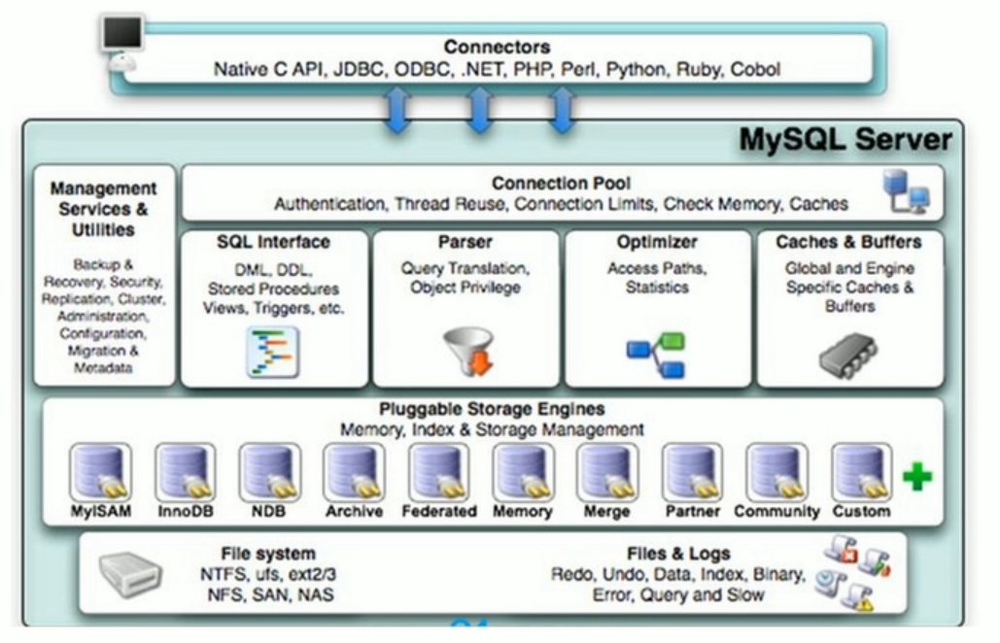
- 分层架构！优点主要体现再存储引擎的架构上：**插件式的存储引擎将查询处理和其他的系统任务以及数据的存储提取分离**，这种架构可以根据业务的需求和实际需要选择合适的存储引擎
- 连接层：
  - 最上层是一些客户端和连接服务，包含本地sock通信和大部分基于B/S根据实现的类似于TCP/IP 的通信，主要完成一些类似于连接处理、授权认证以及相关的安全方案。在该层上引入了线程池的功能，为通过认证安全接入的客户端提高线程。同样的可以在该层上实现SSL的安全连接，服务器也会为安全接入的每个客户验证它所具有的操作权限
- 服务层：
  - 主要完成大多数的核心服务功能，如SQL接口、并且完成缓存的查询、SQL的分析和优化以及内部函数的执行。所有跨存储引擎的功能也在这一层实现，如：过程、函数等。
  - 在该层服务器会解析查询并创建相应的内部解析树，完成相应的优化(如确定查询表的顺序、是否使用索引等)，最后生成相应的执行操作。如果是select语句，服务器还会查询内部缓存，来优化读操作的性能
- 引擎层：
  - 存储引擎真正负责MySQL中数据的存储和提取，服务器通过API与存储引擎进行通信，不同的存储引擎具有不同的功能，可以根据实际需要进行选取，如：MyISAM、InnoDB
- 存储层：
  - 主要是将数据存储在运行于设备的文件系统之上，完成于存储引擎的交互

### 1.3 MySQL存储引擎

- 如何查看当前MySQL使用的存储引擎？

  - ```mysql
    # 查看当前mysl提供了哪些存储引擎
    show engines;
    # 查看当前mysql使用的存储引擎
    show variables like '%storage_engine%';
    ```

- MyISAM和InnoDB的区别？

  - |          |              MyISAM              | InnoDB                                                       |
    | -------- | :------------------------------: | ------------------------------------------------------------ |
    | 主外键   |              不支持              | 支持                                                         |
    | 事务     |              不支持              | 支持                                                         |
    | 行表锁   | 表锁：操作一条记录也会锁住整个表 | 行锁：操作一条记录只会锁住对应的行，不会对其他行有影响，因此适合高并发的操作 |
    | 缓存     |    只缓存索引，不缓存真实数据    | 不仅缓存索引还缓存真实数据，对内存要求较搞，并且内存大小对性能有决定性影响 |
    | 表空间   |                小                | 大                                                           |
    | 关注点   |               性能               | 事务                                                         |
    | 默认安装 |               YES                | YES                                                          |

- 阿里用的存储引擎？

  - Percona为Mysql数据库服务器进行了改进，在功能和性能上有了明显提升，主要提升了高负载情况下的InnoDB的性能，为DBA提供一些非常有用的诊断工具和更多的参数命令控制服务器行为
  - xtradb：完全可以替代innodb，并且在性能和并发上做的更好
  - 阿里大部分msyql数据库使用的是percona的原型修改版：AliSql+AliRedis

## 2. 索引优化分析

- 性能下降SQL变慢？

  - 先判断是哪出现了问题？服务器内存？SQL语句？可复现？

  - 一般变慢：执行时间长、等待时间长

  - 原因：

    - 查询语句写的太烂

    - 索引失效

      - 索引分为单值索引和复合索引

      - ```mysql
        create table user(
        	id int not null,
            name varchar(20),
            email varchar(20),
            weixinNumber int
        );
        
        select * from user where name='';
        # 建立对应的单值索引，可以加快查询
        create index idx_user_name on user(name);
        
        select * from user where name='' and email='';
        # 建立对应的复合索引，可以加快查询
        create index idx_user_nameEmail on user(name,email);
        ```

    - 关联查询太多的join（设计缺陷或者不得已的需求）

    - 服务器调优以及各项参数设置(缓存、线程数)不合理等

### 2.1 Join查询

- SQL执行顺序：

  - 语句：

  - ```mysql
    SELECT DISTINCT 
    	<select_list>
    FROM <left_table> <join_type> JOIN <right_table> ON <join_condition>
    WHERE <where_condition>
    GROUP BY <group_by_list>
    HAVING <having_condition>
    ORDER BY <order_by_condition>
    LIMIT <limit_number>;
    ```

  - MySQL解析顺序

  - ```mysql
    FROM <left_table> <join_type> JOIN <right_table> ON <join_condition>
    WHERE <where_condition>
    GROUP BY <group_by_list>
    HAVING <having_condition>
    SELECT DISTINCT 
    	<select_list>
    ORDER BY <order_by_condition>
    LIMIT <limit_number>;
    ```

  - 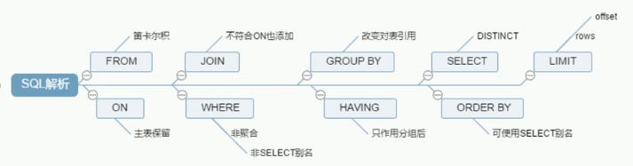

- Join查询总结：

  - ```mysql
    # A∩B
    SELECT <select_list>
    FROM TableA A INNER JOIN TableB B ON A.key=B.key;
    
    # A
    SELECT <select_list>
    FROM TableA A LEFT JOIN TableB B ON A.key=B.key;
    
    # B
    SELECT <select_list>
    FROM TableA A RIGHT JOIN TableB B ON A.key=B.key;
    
    # A-A∩B
    SELECT <select_list>
    FROM TableA A LEFT JOIN TableB B ON A.key=B.key
    WHERE B.key IS NULL;
    
    # B-A∩B
    SELECT <select_list>
    FROM TableA A RIGHT JOIN TableB B ON A.key=B.key
    WHERE A.key IS NULL;
    
    # A∪B # Orcal 的SQL可以使用该语法，MySQL使用union实现
    SELECT <select_list>
    FROM TableA A FULL OUTER JOIN TableB B ON A.key=B.key;
    
    # A∪B-A∩B
    SELECT <select_list>
    FROM TableA A FULL OUTER JOIN TableB B ON A.key=B.key;
    WHERE A.key IS NULL OR B.key IS NULL;
    ```

  - ```mysql
    # 实例
    CREATE TABLE `tbl_emp` (
    `id` int(11) NOT NULL AUTO_INCREMENT,
    `name` varchar(20) DEFAULT NULL,
    `deptId` int(11) DEFAULT NULL,
    PRIMARY KEY (`id`) ,
    KEY `fk_dept_id`(`deptId`)
    )ENGINE = InnoDB AUTO_INCREMENT = 1 CHARACTER SET = utf8;
    
    CREATE TABLE `tbl_dept` (
    `id` int(11) NOT NULL AUTO_INCREMENT,
    `deptName` varchar(30) DEFAULT NULL,
    `locAdd` varchar(40) DEFAULT NULL,
    PRIMARY KEY (`id`)
    ) ENGINE = InnoDB AUTO_INCREMENT = 1 CHARACTER SET = utf8;
    
    insert into tbl_dept(deptName,locAdd) values('RD',11);
    insert into tbl_dept(deptName,locAdd) values('HR',12);
    insert into tbl_dept(deptName,locAdd) values('MK',13);
    insert into tbl_dept(deptName,locAdd) values('MIS',14);
    insert into tbl_dept(deptName,locAdd) values('FD',15);
    
    insert into tbl_emp(NAME,deptId) values('z3',1);
    insert into tbl_emp(NAME,deptId) values('z4',1);
    insert into tbl_emp(NAME,deptId) values('z5',1);
    insert into tbl_emp(NAME,deptId) values('w5',2);
    insert into tbl_emp(NAME,deptId) values('w6',2);
    insert into tbl_emp(NAME,deptId) values('s7',3);
    insert into tbl_emp(NAME,deptId) values('s8',4);
    insert into tbl_emp(NAME,deptId) values('s9',51);
    
    # 笛卡尔积
    select * from tbl_emp,tbl_dept;
    
    # A∩B
    select * from tbl_emp a inner join tbl_dept b on a.deptId=b.id;
    
    # A
    select * from tbl_emp a left join tbl_dept b on a.deptId=b.id;
    
    # B
    select * from tbl_emp a right join tbl_dept b on a.deptId=b.id;
    
    # A-A∩B
    select * from tbl_emp a left join tbl_dept b on a.deptId=b.id where b.id is NULL;
    
    # B-A∩B
    select * from tbl_emp a right join tbl_dept b on a.deptId=b.id where a.deptId is NULL;
    
    
    # A∪B
    select * from tbl_emp a left join tbl_dept b on a.deptId=b.id
    union
    select * from tbl_emp a right join tbl_dept b on a.deptId=b.id;
    
    
    # A∪B-A∩B
    select * from tbl_emp a left join tbl_dept b on a.deptId=b.id where b.id IS NULL
    union
    select * from tbl_emp a right join tbl_dept b on a.deptId=b.id where a.deptId IS NULL;
    ```

### 2.2 索引

- 索引是什么？

  - 官方定义：索引Index是帮助MySQL高效获取数据的数据结构！
  - 排好序的快速查找的数据结构：
    - 也就是说：在数据之外，MySQL还维护着满足特定查找算法的数据结构，这些数据结构以某种方式引用(指向)数据。这样就可以在这些数据结构上实现高级查找算法，这种数据结构就是索引
    - 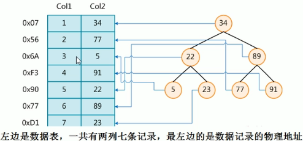
    - 为了加快Col2的查找，可以维护一个类似右边的二叉搜索树，每个节点分别包含索引键值和一个指向对应数据记录物理地址的指针，这样就可以快速的检索出符号条件的记录
  - 索引本身也很大，不可能全部存储在内存中，因此索引往往以索引文件的形式存储在磁盘上
  - 一般索引都是指B树结构组织的索引，其中：聚集索引、次要索引、覆盖索引、复合索引、前缀索引、唯一索引这些默认是使用B+树索引，也有一些是哈希索引

- 索引的目的？

  - 排序=》提高查找效率

- 优点：

  - 提高数据检索效率、降低数据库的IO成本
  - 通过索引列对数据进行排序，降低数据排序成本，降低CPU消耗

- 缺点：

  - 因为索引也是一张表，保存了主键与索引字段，并且指向实体表的记录，所以索引也会占用空间
  - 索引虽然会提高查询速度，同时却会降低更新表的速度，如对表进行增删改时，MySQL不仅要保存数据，还要保存索引文件每次更新添加了索引列的字段，需要调整因为更新所带来的键值变换后的索引信息
  - 如果MySQL有大数据量的表，就需要花时间去建立最优秀的索引、或者优化查询

- 索引的分类：

  - 单值索引：一个索引只包含单个列，一个表可以有多个单列索引
  - 唯一索引：索引列的值必须唯一，都允许空值
  - 复合索引：一个索引包含多个列

- 基本语法：

  - ```mysql
    # 创建
    # 法一：
    CREATE [UNIQUE] INDEX indexName ON mytable(columnname(length));
    # 法二：
    ALTER mytable ADD [UNIQUE] INDEX [indexName] ON (columnname(length));
    
    # 删除
    DROP INDEX [indexName] ON mytable;
    
    # 查看
    SHOW INDEX FROM table_name;
    
    # alter的使用=》添加数据表的索引
    # 该语句添加一个主键，这意味着索引值必须是唯一的，且不能为NULL。
    ALTER TABLE tbl_name ADD PRIMARY KEY (column_list);
    
    # 这条语句创建索引的值必须是唯一的(除了NULL外，NULL可能会出现多次)；
    ALTER TABLE tol_name ADD UNICUE index_name (colum_list);
    
    # 加普通索引，索引值可出现多次
    ALTER TABLE tbl_name ADD INDEX index_name (column_list);
    
    # 该语句指定了索引为FULLTEXT，用于全文索引
    ALTER TABLE tbl_name ADD FULLTEXT index_name (column_list);
    
    ```

- 索引结构：

  - BTree索引
    - 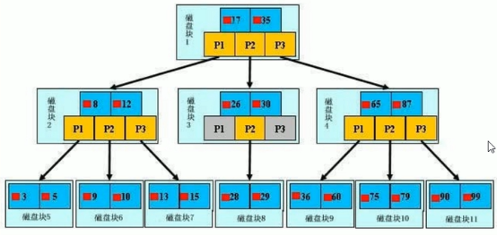
    - 深蓝色：数据项
    - 黄色：指针
    - b+树：真实的数据存储在叶子节点，非叶子节点不存储真实的数据，而是只存储指向搜索方向的数据项，如：17、35并不真实的存在与数据表
    - 查找过程：
      - 如果要查找数据项29，那么首先会把磁盘块1由磁盘加载到内存，此时发生一次IO，在内存中用二分查找确定29在17和35之间，锁定磁盘块1的P2指针，内存时间因为非常短（相比磁盘的I0)可以忽略不计，通过磁盘块1的P2指针的磁盘地址把磁盘块3由磁盘加载到内存，发生第二次IO，29在26和30之间，锁定磁盘块3的P2指针，通过指针加载磁盘块8到内存，发生第三次IO，同时内存中做二分查找找到29，结束查询，总计三次IO。
      - 真实的情况是，3层的b+树可以表示上百万的数据，如果上百万的数据查找只需要三次IO，性能提高将是巨大的，如果没有索引，数据项都要发生一次IO，那么总共需要百万次的IO，显然成本非常非常高。
  - Hash索引
  - full-text索引
  - R-Tree索引

- 什么时候建索引？

  - 主键会自动创建唯一索引
  - 频繁作为查询条件的字段应该会创建索引
  - 查询中与其他表关联的字段=》外键关系建立索引
  - 频繁更新的字段不适合创建索引=》因为每次更新不仅要更新记录，还要更新索引
  - Where条件里面用不到的字段不创建索引
  - 单值、组合索引的选择问题？
    - 高并发下倾向创建组合索引
  - 查询中排序的字段也最好创建索引=》因为排序字段如果通过索引去访问将大大提高排序速度
  - 查询中统计或者分组的字段最好创建索引

- 什么时候不建索引？

  - 表记录太少
  - 经常增删改的表
    - 因为MySQL不仅要保存数据、还要保存对应的索引文件
  - 数据重复并且分布平均的表字段，建立索引没有太大的实际效果
    - 假如一个表有10万行记录，有一个字段A只有T和F两种值，且每个值的分布概率天约为50%，那么对这种表A字段建索引一般不会提高数据库的查询速度。
    - 索引的选择性是指索引列中不同值的数目与表中记录数的比。如果一个表中有2000条记录，表索引列有1980个不同的值，那么这个索引的选择性就是1980/2000=0.99。一个索引的选择性越接近于1，这个索引的效率就越高。

### 2.3 性能分析

- MySQL Query Optimizer：
  - MySQL中有专门优化SELECT语句的优化器模块：
    - 通过计算分析系统中收集到的统计信息，为客户端请求的Query提供他认为最优的执行计划（他认为最优的数据检索方式，但不见得是DBA认为是最优的，I这部分最耗费时间)
    - 当客户端向MySQL请求一条Query，命令解析器模块完成请求分类，区别出是SELECT并转发给MySQL Query Optimizer时，MySQL Query Optimizer首先会对整条Query进行优化，处理掉一些常量表达式的预算，直接换算成常量值。并对Query中的查询条件进行简化和转换，如去掉一些无用或显而易见的条件、结构调整等。然后分析Query中的 Hint信息(如果有)，看显示Hint信息是否可以完全确定该Query 的执行计划。如果没有Hint或Hint 信息还不足以完全确定执行计划，则会读取所涉及对象的统计信息，根据Query进行写相应的计算分析,然后再得出最后的执行计划。
- MySQL常见瓶颈：
  - CPU：CPU的饱和：一般发生在数据装入内存或者从磁盘中读取数据的时候
  - IO：磁盘I/O瓶颈：一般发生在装入数据远大于内存容量的时候
  - 服务器硬件性能瓶颈：top、freee、iostat和vmstat来查看系统的性能状态

#### 2.3.1 Explain

- 是什么？Explain：查看执行计划

  - 使用Explain关键字可以模拟优化器执行SQL查询语句，从而知道MySQL是如何处理SQL语句，分析查询语句或者是表结构的性能瓶颈

- 有什么用？

  - 表的读取顺序=》id
  - 数据读取操作的操作类型=>select_type
  - 哪些索引可以使用=》possiblie_keys
  - 哪些索引被实际使用=》key
  - 表之间的引用=》ref
  - 每张表有多少行被优化器查询=》rows

- 怎么用？

  - Explain + SQL语句

  - 执行计划包含的信息

  - ```mysql
    
    mysql> explain select * from tbl_emp;
    +----+-------------+---------+------+---------------+------+---------+------+------+-------+
    | id | select_type | table   | type | possible_keys | key  | key_len | ref  | rows | Extra |
    +----+-------------+---------+------+---------------+------+---------+------+------+-------+
    |  1 | SIMPLE      | tbl_emp | ALL  | NULL          | NULL | NULL    | NULL |    8 |       |
    +----+-------------+---------+------+---------------+------+---------+------+------+-------+
    ```

  - 字段含义：

  - id：select查询的序列号，表示查询中执行select子句或者操作表的顺序

    - 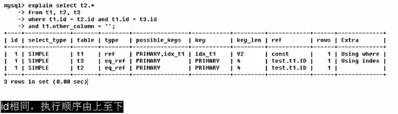
    - 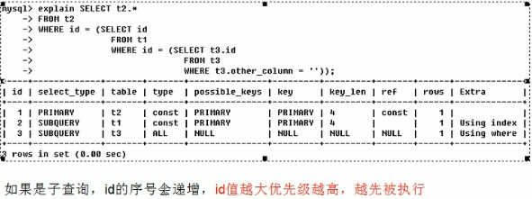
    - 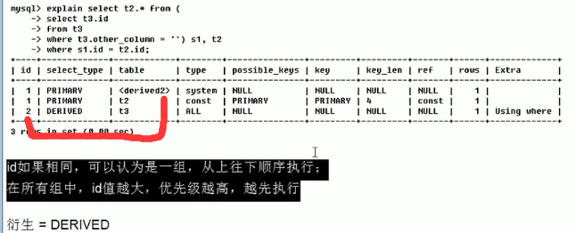

  - select_type：查询的类型，主要是用于区别普通查询、联合查询、子查询等复杂查询

    - SIMPLE：简单的select查询，查询中不包含子查询或者UNION
    - PRIMARY：查询中如果包含任何复杂的子部分，最外层查询则被标记为PRIMARY
    - SUBQUERY：在SELECT或WHERE列表中包含了子查询
    - DERIVED：在FROM列表中包含的子查询会被标记为DERIVED(衍生)，MySQL会递归执行这些子查询，把结果放在临时表中(衍生表)
    - UNION：如果第二个SELECT出现在UNION之后，则被标记为UNION；如果UNION包含在FROM子句的子查询中，外层的SELECT被标记为：DERIVED
    - UNION RESULT：从UNION表获取结果的SELECT

  - table：表示这一行的数据是关于哪一张表的

  - type：表示访问类型

    - 类型从好到坏的排列：system>const>eq_ref>ref>range>index>ALL

      - 完整的：system>const>eq_ref>ref>fulltext>ref_or_null>index_merge>unique_subquery>index_subquery>range>index>ALL
      - 一般来说：得保证查询至少达到range级别，最好能到达ref级别

    - ```mysql
      system：表只有一行数据(等于系统表)，这是const类型的特例，平时不会出现，可以忽略不记
      
      const：表示通过索引一次就找到了，const用于比较primary kye或者unique索引，因为只匹配一行数据，所以很快！如：where查询中使用主键，MYSQL就能够将该查询转换为一个const
      
      eq_ref：唯一性索引扫描，对于每个索引建，表中只有一条记录与之匹配，常见于主键、唯一索引扫描
      
      ref：非唯一性索引扫描，返回匹配某个单独值的所有行.本质上也是一种索引访问，它返回所有匹配某个单独值的行，然而，它可能会找到多个符合条件的行，所以应该属于查找和扫描的混合体
      
      range：只检索给定范围的行,使用一个索引来选择行。key列显示使用了哪个索引一般就是在你的where语句中出现了between、<、>、in等的查询这种范围扫描索引扫描比全表扫描要好，因为它只需要开始于索引的某一点，而结束语另一点，不用扫描全部索引。
      
      index：Full Index Scan，index与ALL区别为index类型只遍历索引树。这通常比ALL快，因为索引文件通常比数据文件小(也就是说虽然all和Index都是读全表，但index是从索引中读取的，而all是从硬盘中读的)
      
      ALL：Full Table Scan，将遍历全表去找到匹配的行
      ```

  - possible_keys：显示可能应用在这张表的索引，一个或者多个，查询涉及到的字段上若存在索引，则该索引将被列出，但是不一定被查询实际使用。

  - key：实际使用的索引

    - 如果没有使用索引：为NULL
    - 如果使用到了覆盖索引：则该索引仅出现在key列表中，也即：possible_keys为NULL，但是key不为NULL

  - key_len：表示索引中使用的字节数，可通过该列计算查询中使用的索引的长度。在不损失精确性的情况下，长度越短越好，key_len显示的值为索引字段的最大可能长度，并非实际使用长度，即key_len是根据表定义计算而得，不是通过表内检索出的

  - ref：显示索引的哪一列被使用了，如果可能的话最好是个常数。表示哪些列或常量被用于查找索引列上的值

    - 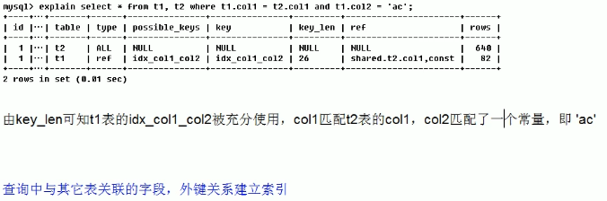

  - rows：根据表统计信息及索引选用情况，大致估算出找到所需的记录所需要读取的行数

    - 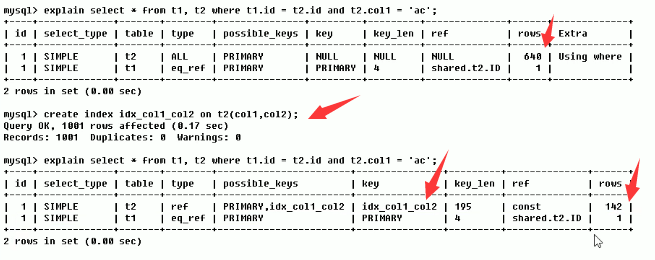

  - Extra：包含不适合在其他列中显示，但是又十分重要的额外信息

    - Using filesort：说明mysql会对数据使用一个外部的索引排序，而不是按照表内的索引顺序进行读取。MysQL中无法利用索引完成的排序操作称为"文件排序"，九死一生十分影响性能
      - 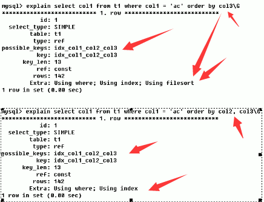
    - Using temporary：使了用临时表保存中间结果,MySQL在对查询结果排序时使用临时表。常见于排序order by和分组查询group by。十死无生肯定影响性能！
      - 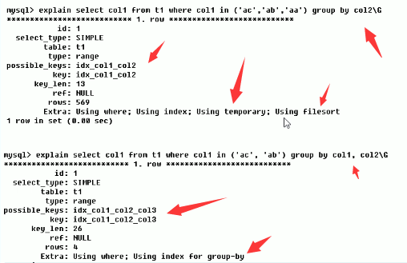
    - Using index：表示相应的select操作中使用了覆盖索引(Covering Index)，避免访问了表的数据行，效率不错!如果同时出现using where，表明索引被用来执行索引键值的查找;如果没有同时出现using where，表明索引用来读取数据而非执行查找动作。
      - 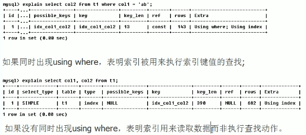
      - 索引覆盖：
      - 注意:如果要使用覆盖索引，一定要注意select列表中只取出需要的列，不可select*，因为如果将所有字段一起做索引会导致索引文件过大，查询性能下降。
      - 
    - Using where：表明使用了where过滤
    - using join buffer：表明使用了连接缓存
    - impossible where：where子句的值总是false，不能用来获取任何元组
    - select tables optimized away：在没有GROUPBY子句的情况下，基于索引优化MIN/MAX操作或者
      对于MyISAM存储引擎优化COUNT(*)操作，不必等到执行阶段再进行计算，查询执行计划生成的阶段即完成优化。
    - distinct：优化distinct操作，在找到第一匹配的元组后即停止找同样值的动作

- 实例：

  - 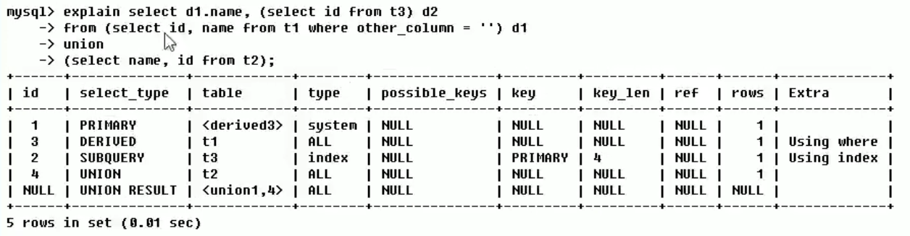
  - 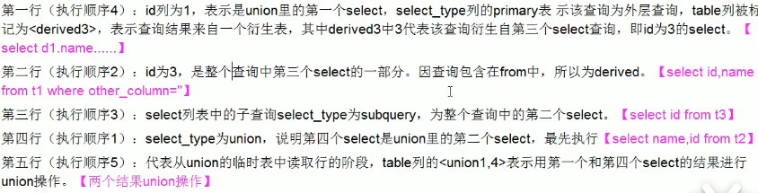

### 2.4 索引优化

#### 2.4.1 单表优化

- ```mysql
  CREATE TABLE IF NOT EXISTS `article`(
  `id` INT(10) UNSIGNED NOT NULL PRIMARY KEY AUTO_INCREMENT,
  `author_id` INT (10) UNSIGNED NOT NULL,
  `category_id` INT(10) UNSIGNED NOT NULL , 
  `views` INT(10) UNSIGNED NOT NULL , 
  `comments` INT(10) UNSIGNED NOT NULL,
  `title` VARBINARY(255) NOT NULL,
  `content` TEXT NOT NULL
  );
  INSERT INTO `article`(`author_id`,`category_id` ,`views` ,`comments` ,`title` ,`content` )VALUES
  (1,1,1,1,'1','1'),
  (2,2,2,2,'2','2'),
  (1,1,3,3,'3','3');
   
  SELECT * FROM article;
  
  # 查询category_id为1并且comments大于1的情况下，views最多的article_id
  SELECT id as article_id,author_id from article where category_id=1 AND comments>1 ORDER BY views DESC LIMIT 1;
  
  mysql> SELECT id as article_id,author_id from article where category_id=1 AND comments>1 ORDER BY views DESC;
  +------------+-----------+
  | article_id | author_id |
  +------------+-----------+
  |          3 |         1 |
  +------------+-----------+
  1 row in set (0.00 sec)
  
  # 查看执行计划
  mysql> explain SELECT id as article_id,author_id from article where category_id=1 AND comments>1 ORDER BY views DESC LIMIT 1;
  +----+-------------+---------+------+---------------+------+---------+------+------+-----------------------------+
  | id | select_type | table   | type | possible_keys | key  | key_len | ref  | rows | Extra                       |
  +----+-------------+---------+------+---------------+------+---------+------+------+-----------------------------+
  |  1 | SIMPLE      | article | ALL  | NULL          | NULL | NULL    | NULL |    3 | Using where; Using filesort |
  +----+-------------+---------+------+---------------+------+---------+------+------+-----------------------------+
  1 row in set (0.00 sec)
  # 可以看出：
  # type：ALL=>将遍历全表去找到匹配的行
  # Extra:
  	# Using Where=>表明使用了where过滤
  	# Using filesort=>说明mysql会对数据使用一个外部的索引排序，而不是按照表内的索引顺序进行读取。MysQL中无法利用索引完成的排序操作称为"文件排序"，九死一生十分影响性能
  
  # 查看索引
  mysql> show index from article;
  
  # 可以优化！
  # 1.1 尝试：新建索引+删除索引
  mysql> create index ind_article_ccv on article(category_id,comments,views);
  mysql> show index from article;
  
  # 此时再次查看执行计划
  mysql> explain SELECT id as article_id,author_id from article where category_id=1 AND comments>1 ORDER BY views DESC LIMIT 1;
  # 发现：用到了索引：type从ALL改成了range，但是Using filesort仍然存在！
  #type变成了range,这是可以忍受的。但是 extra里使用Using filesort 仍是无法接受的#但是我们已经建立了索引,为啥没用呢?
  #这是因为按照BTree索引的工作原理：先排序category_id
  	#如果遇到相同的category_id则再排序comments,如果遇到相同的comments则再排序views。
  	#当comments字段在联合索引里处于中间位置时，
  	#因comments >1条件是一个范围值(所谓range),
  #MySQL无法利用索引再对后面的views 部分进行检索,即range类型查询字段后面的索引无效。
  
  
  # 改变查询条件comment=1，查看执行计划
  mysql> explain SELECT id as article_id,author_id from article where category_id=1 AND comments=1 ORDER BY views DESC LIMIT 1;
  # 发现：type从range变成了ref，并且ref变成了const,Using filesort不存在了！
  
  # 综上两个可以明白：因为comment>1是一种范围，所以会导致ind_article_ccv索引中断失效
  # 删除之前的索引，重新建
  mysql> drop index ind_article_ccv on article;
  mysql> create index idx_article_cv on article(category_id,views);
  
  # 此时在查看执行计划
  mysql> explain SELECT id as article_id,author_id from article where category_id=1 AND comments>1 ORDER BY views DESC LIMIT 1;
  #发现：type变为了ref,Extra中的Using filesort也消失了,结果非常理想。
  
  
  
  ```

#### 2.4.2 两表优化

```mysql
CREATE TABLE IF NOT EXISTS `class`(
`id` INT(10) UNSIGNED NOT NULL PRIMARY KEY AUTO_INCREMENT,
`card` INT (10) UNSIGNED NOT NULL
);
CREATE TABLE IF NOT EXISTS `book`(
`bookid` INT(10) UNSIGNED NOT NULL PRIMARY KEY AUTO_INCREMENT,
`card` INT (10) UNSIGNED NOT NULL
);
INSERT INTO class(card)VALUES(FLOOR(1+(RAND()*20)));
INSERT INTO class(card)VALUES(FLOOR(1+(RAND()*20)));
INSERT INTO class(card)VALUES(FLOOR(1+(RAND()*20)));
INSERT INTO class(card)VALUES(FLOOR(1+(RAND()*20)));
INSERT INTO class(card)VALUES(FLOOR(1+(RAND()*20)));
INSERT INTO class(card)VALUES(FLOOR(1+(RAND()*20)));
INSERT INTO class(card)VALUES(FLOOR(1+(RAND()*20)));
INSERT INTO class(card)VALUES(FLOOR(1+(RAND()*20)));
INSERT INTO class(card)VALUES(FLOOR(1+(RAND()*20)));
INSERT INTO class(card)VALUES(FLOOR(1+(RAND()*20)));
INSERT INTO class(card)VALUES(FLOOR(1+(RAND()*20)));
INSERT INTO class(card)VALUES(FLOOR(1+(RAND()*20)));
INSERT INTO class(card)VALUES(FLOOR(1+(RAND()*20)));
INSERT INTO class(card)VALUES(FLOOR(1+(RAND()*20)));
INSERT INTO class(card)VALUES(FLOOR(1+(RAND()*20)));
INSERT INTO class(card)VALUES(FLOOR(1+(RAND()*20)));
INSERT INTO class(card)VALUES(FLOOR(1+(RAND()*20)));
INSERT INTO class(card)VALUES(FLOOR(1+(RAND()*20)));
INSERT INTO class(card)VALUES(FLOOR(1+(RAND()*20)));
INSERT INTO class(card)VALUES(FLOOR(1+(RAND()*20)));
 
INSERT INTO book(card)VALUES(FLOOR(1+(RAND()*20)));
INSERT INTO book(card)VALUES(FLOOR(1+(RAND()*20)));
INSERT INTO book(card)VALUES(FLOOR(1+(RAND()*20)));
INSERT INTO book(card)VALUES(FLOOR(1+(RAND()*20)));
INSERT INTO book(card)VALUES(FLOOR(1+(RAND()*20)));
INSERT INTO book(card)VALUES(FLOOR(1+(RAND()*20)));
INSERT INTO book(card)VALUES(FLOOR(1+(RAND()*20)));
INSERT INTO book(card)VALUES(FLOOR(1+(RAND()*20)));
INSERT INTO book(card)VALUES(FLOOR(1+(RAND()*20)));
INSERT INTO book(card)VALUES(FLOOR(1+(RAND()*20)));
INSERT INTO book(card)VALUES(FLOOR(1+(RAND()*20)));
INSERT INTO book(card)VALUES(FLOOR(1+(RAND()*20)));
INSERT INTO book(card)VALUES(FLOOR(1+(RAND()*20)));
INSERT INTO book(card)VALUES(FLOOR(1+(RAND()*20)));
INSERT INTO book(card)VALUES(FLOOR(1+(RAND()*20)));
INSERT INTO book(card)VALUES(FLOOR(1+(RAND()*20)));
INSERT INTO book(card)VALUES(FLOOR(1+(RAND()*20)));
INSERT INTO book(card)VALUES(FLOOR(1+(RAND()*20)));
INSERT INTO book(card)VALUES(FLOOR(1+(RAND()*20)));
INSERT INTO book(card)VALUES(FLOOR(1+(RAND()*20)));


# 执行语句
select * from class left join book on class.card=book.card;

# 查看执行计划
mysql> explain select * from class left join book on class.card=book.card;
# 发现：type有ALL

# book添加索引，进行优化
mysql> alter table book add index y (card);
mysql> show index from book;
mysql> explain select * from class left join book on class.card=book.card;
# 发现：第二行：type改为了ref，使用了索引！

# 继续尝试
mysql> drop index y on book;
mysql> show index from book;
# 索引加在class表中
mysql> alter table class add index y (card);
mysql> explain select * from class left join book on class.card=book.card;
# 发现：第一行：type改为了index,使用了索引，但是rows还是20，并且ref>index

# 结论：
#可以看到第二行的type 变为了ref,rows也变成了优化比较明显。
#这是由左连接特性决定的。LEFT JOIN条件用于确定如何从右表搜索行,左边一定都有
#所以右边是我们的关键点,一定需要建立索引。

# 同理，右连接也是要左边建立索引！
# 因为RIGHT JOIN条件用于确定如何从左表搜索行,右边一定都有,
# 所以左边是我们的关键点,一定需要建立索引。


```

#### 2.4.3 三表优化

```mysql
CREATE TABLE IF NOT EXISTS `phone`(
`phoneid` INT(10) UNSIGNED NOT NULL PRIMARY KEY AUTO_INCREMENT,
`card` INT (10) UNSIGNED NOT NULL
)ENGINE = INNODB;

INSERT INTO phone(card)VALUES(FLOOR(1+(RAND()*20)));
INSERT INTO phone(card)VALUES(FLOOR(1+(RAND()*20)));
INSERT INTO phone(card)VALUES(FLOOR(1+(RAND()*20)));
INSERT INTO phone(card)VALUES(FLOOR(1+(RAND()*20)));
INSERT INTO phone(card)VALUES(FLOOR(1+(RAND()*20)));
INSERT INTO phone(card)VALUES(FLOOR(1+(RAND()*20)));
INSERT INTO phone(card)VALUES(FLOOR(1+(RAND()*20)));
INSERT INTO phone(card)VALUES(FLOOR(1+(RAND()*20)));
INSERT INTO phone(card)VALUES(FLOOR(1+(RAND()*20)));
INSERT INTO phone(card)VALUES(FLOOR(1+(RAND()*20)));
INSERT INTO phone(card)VALUES(FLOOR(1+(RAND()*20)));
INSERT INTO phone(card)VALUES(FLOOR(1+(RAND()*20)));
INSERT INTO phone(card)VALUES(FLOOR(1+(RAND()*20)));
INSERT INTO phone(card)VALUES(FLOOR(1+(RAND()*20)));
INSERT INTO phone(card)VALUES(FLOOR(1+(RAND()*20)));
INSERT INTO phone(card)VALUES(FLOOR(1+(RAND()*20)));
INSERT INTO phone(card)VALUES(FLOOR(1+(RAND()*20)));
INSERT INTO phone(card)VALUES(FLOOR(1+(RAND()*20)));
INSERT INTO phone(card)VALUES(FLOOR(1+(RAND()*20)));
INSERT INTO phone(card)VALUES(FLOOR(1+(RAND()*20)));


# 先将之前建立的索引删除
mysql> drop index y on class;

# SQL语句
select * from class left join book on class.card=book.card left join phone on book.card=phone.card;

# 查看对应的执行计划
explain select * from class left join book on class.card=book.card left join phone on book.card=phone.card;
# 发现：type全部都是ALL

# 新建索引
alter table phone add index z (card);
alter table book add index y (card);
# 查看对应的执行计划
explain select * from class left join book on class.card=book.card left join phone on book.card=phone.card;
# 发现：后2行的type 都是ref且总 rows优化很好,效果不错。因此索引最好设置在需要经常查询的字段中。

# 结论 
# Join语句的优化
# 尽可能减少Join语句中的Nested Loop(嵌套循环)的循环总次数;“永远用小结果集驱动大的结果集”。优先优化Nested Loop的内层循环;
# 保证Join语句中被驱动表上Join条件字段已经被索引;
# 当无法保证被驱动表的Join条件字段被索引且内存资源充足的前提下，不要太吝惜JoinBuffer的谈置;

```

#### 2.4.4 索引失效？

-  建了索引，但是没有用！

- ```mysql
  # 实例：
  CREATE TABLE staffs(
  id INT PRIMARY KEY AUTO_INCREMENT,
  `name` VARCHAR(24)NOT NULL DEFAULT'' COMMENT'姓名',
  `age` INT NOT NULL DEFAULT 0 COMMENT'年龄',
  `pos` VARCHAR(20) NOT NULL DEFAULT'' COMMENT'职位',
  `add_time` TIMESTAMP NOT NULL DEFAULT CURRENT_TIMESTAMP COMMENT'入职时间'
  )CHARSET utf8 COMMENT'员工记录表';
  INSERT INTO staffs(`name`,`age`,`pos`,`add_time`) VALUES('z3',22,'manager',NOW());
  INSERT INTO staffs(`name`,`age`,`pos`,`add_time`) VALUES('July',23,'dev',NOW());
  INSERT INTO staffs(`name`,`age`,`pos`,`add_time`) VALUES('2000',23,'dev',NOW());
  
  ALTER TABLE staffs ADD INDEX index_staffs_nameAgePos(`name`,`age`,`pos`);
  
  # 1.全值匹配我最爱
  explain select * from staffs where name = 'July';
  explain select * from staffs where name = 'July' and age = 25;
  explain select * from staffs where name = 'July' and age = 25 and pos = 'dev';
  # 换个顺序=》type:ALL使用的是全表扫描，没有用到之前建立的索引
  explain select * from staffs where age = 25 and pos = 'dev';
  explain select * from staffs where pos = 'dev';
  # 结论：如果没有按最佳左前缀法则，则索引容易失效
  
  # 2.最佳左前缀法则：如果索引了多列，要遵守最左前缀法则。指的是查询从索引的最左前列开始，并且不跳过索引中的列。
  # 如果有开头，但是没有中间，会导致只使用部分索引(开头的)
  explain select * from staffs where name='July' and pos = 'dev';
  # 小总结：带头大哥不能死，中间兄弟不能断
  
  
  # 3.不在索引列上做任何操作（计算、函数、(自动or手动)类型转换），会导致索引失效而转向全表扫描
  # left(name,4)从name中从左到右裁剪4个字符
  # 下面两个结果相同
  select * from staffs where to name='July';
  select * from staffs where to left(name,4)='July';
  select * from staffs where to left(name,3)='July';
  # 查看执行计划=>发现性能不同
  explain select * from staffs where to name='July';
  explain select * from staffs where to left(name,4)='July';
  
  
  # 4.存储引擎不能使用索引中范围条件右边的列=>范围之后全失效
  explain select * from staffs where name = 'July';
  explain select * from staffs where name = 'July' and age = 25 and pos = 'manager';
  explain select * from staffs where name = 'July' and age > 25 and pos = 'manager';
  
  
  # 5.尽量使用覆盖索引(只访问索引的查询(索引列和查询列一致))，减少select *
  explain select * from staffs where name = 'July' and age = 25 and pos = 'manager';
  explain select name,age,pos from staffs where name = 'July' and age = 25 and pos = 'manager';
  explain select name,age,pos from staffs where name = 'July' and age > 25 and pos = 'manager';
  explain select name from staffs where name = 'July' and age > 25 and pos = 'manager';
  
  # 6. mysql在使用不等于(!=或者<>)的时候无法使用索引会导致全表扫描
  explain select * from staffs where name != 'July';
  explain select * from staffs where name <> 'July';
  
  # 7. is null ,is not null 也无法使用索引
  explain select * from staffs where name is null;
  
  # 8. like以通配符开头('%abc...' )mysql索引失效会变成全表扫描的操作
  explain select * from staffs where name like '%July%';
  explain select * from staffs where name like '%July';
  # %不在开头，可以使用索引
  explain select * from staffs where name like 'July%';
  
  
  # 问题:解决like "%字符串%'时索引不被使用的方法??=》使用覆盖索引
  CREATE TABLE `tbl_user`(
  `id` INT(11) NOT NULL AUTO_INCREMENT,
  `name` VARCHAR(20) DEFAULT NULL,
  `age`INT(11) DEFAULT NULL,
  `email` VARCHAR(20) DEFAULT NULL,
  PRIMARY KEY(`id`)
  )ENGINE=INNODB AUTO_INCREMENT=1 DEFAULT CHARSET=utf8;
  
  INSERT INTO tbl_user(`name`,`age`,`email`)VALUES('1aa1',21,'a@163.com');
  INSERT INTO tbl_user(`name`,`age`,`email`)VALUES('2bb2',23,'b@163.com');
  INSERT INTO tbl_user(`name`,`age`,`email`)VALUES('3cc3',24,'c@163.com');
  INSERT INTO tbl_user(`name`,`age`,`email`)VALUES('4dd4',26,'d@163.com');
  
  # 结果不一样
  select * from tbl_user where name like '%aa%';
  select * from tbl_user where name like 'aa%';
  select * from tbl_user where name like '%aa';
  
  # 查看执行计划=>此时只有主键有索引，但是事实上都没有使用到索引
  explain select name,age from tbl_user where name like '%aa%';
  explain select id from tbl_user where name like '%aa%';
  explain select name from tbl_user where name like '%aa%';
  explain select age from tbl_user where name like '%aa%';
  explain select id,name from tbl_user where name like '%aa%';
  explain select id,name,age from tbl_user where name like '%aa%';
  explain select * from tbl_user where name like '%aa%';
  explain select id,name,age,email from tbl_user where name like '%aa%';
  
  # 创建一个索引(覆盖索引)
  create index idx_user_nameAge on tbl_user(name,age);
  # 之后再查看执行计划
  # 以下几个都使用了索引
  explain select name,age from tbl_user where name like '%aa%';
  explain select id from tbl_user where name like '%aa%';
  explain select name from tbl_user where name like '%aa%';
  explain select age from tbl_user where name like '%aa%';
  explain select id,name from tbl_user where name like '%aa%';
  explain select id,name,age from tbl_user where name like '%aa%';
  
  # 以下都没有使用索引
  explain select * from tbl_user where name like '%aa%';
  explain select id,name,age,email from tbl_user where name like '%aa%';
  
  
  # 9.字符串不加单引号索引失效
  # 都可以查出答案
  select * from staffs where name = '2000';
  # 隐式的做了类型转换
select * from staffs where name = 2000;
  # 查看执行计划：
  explain select * from staffs where name = '2000';
  # 索引失效
  explain select * from staffs where name = 2000;
  
  
  # 10.少用or,用它来连接时会索引失效
  explain select * from staffs where name='July' or name='z3';
  ```
  
- 小总结：

  -  全值匹配我最爱，最左前缀要遵守；
     带头大哥不能死，中间兄弟不能断；
     索引列上少计算，范围之后全失效；
     Like百分写最右，覆盖索引不写星；
     不等空值还有or，索引失效要少用；
     VAR引号不可丢，SQL高级也不难！

-  面试题解：

   -  ```mysql
      create table test03(
      id int primary key not null auto_increment,
      c1 char(10),
      c2 char(10),
      c3 char(10),
      c4 char(10),
      c5 char(10)
      );
       
      insert into test03(c1,c2,c3,c4,c5)values('a1','a2','a3','a4','a5');
      insert into test03(c1,c2,c3,c4,c5)values('b1','b2','b3','b4','b5');
      insert into test03(c1,c2,c3,c4,c5)values('c1','c2','c3','c4','c5');
      insert into test03(c1,c2,c3,c4,c5)values('d1','d2','d3','d4','d5');
      insert into test03(c1,c2,c3,c4,c5)values('e1','e2','e3','e4','e5');
      
      select * from test03;
      
      # 建立索引
      create index idx_test03_c1234 on test03 (c1,c2,c3,c4);
      show index from test03;
      
      # 问题:创建了复合索引idx_test03_c1234 ,根据以下SQL分析下索引使用情况?
      explain select * from test03 where c1='a1';
      explain select * from test03 where c1='a1' and c2='a2';
      explain select * from test03 where c1='a1' and c2='a2' and c3='a3' and c4='a4';
      
      # 1. 即使顺序不一样，都使用到了复合索引，=>mysql的查询优化器会自动进行优化
      explain select * from test03 where c1='a1' and c2='a2' and c4='a4' and c3='a3';
      explain select * from test03 where c4='a4' and c3='a3' and c2='a2' and c1='a1';
      
      # 2. 范围之后全失效，只使用了2个索引
      explain select * from test03 where c1='a1' and c2='a2' and c3>'a3' and c4='a4';
      
      # 3. 范围之后全失效，但是还是使用了3个索引(因为mysql的查询优化器进行了优化)
      explain select * from test03 where c1='a1' and c2='a2' and c4>'a4' and c3='a3';
      
      # 4. 只用上了2个索引，进行查找，但是c3也用到了，不过是排序而已，没有被explain统计到ref中
      explain select * from test03 where c1='a1' and c2='a2' and c4='a4' order by c3;
      
      # 5.和上面一样，只用上了2个索引，进行查找，但是c3也用到了，不过是排序而已，没有被explain统计到ref中
      explain select * from test03 where c1='a1' and c2='a2' order by c3;
      
      # 6.使用了2个索引，但是使用了Using filesort!
      explain select * from test03 where c1='a1' and c2='a2' order by c4;
      
      # 7.1 使用了1个索引，但是c2、c3用于排序，因此无Using filesort
      explain select * from test03 where c1='a1' and c5='a5' order by c2,c3;
      
      # 7.2 使用了1个索引，出现了Using filesort！
      explain select * from test03 where c1='a1' and c5='a5' order by c3,c2;
      
      # 7.3 使用了2个索引，很和谐
      explain select * from test03 where c1='a1' and c2='a2' order by c2,c3;
      
      # 7.4 使用了2个索引，很和谐，c1,c2两个索引用于查找，c2,c3用于排序，无Using filesort
      explain select * from test03 where c1='a1' and c2='a2' and c5='a5' order by c2,c3;
      
      # 7.5 对比于7.2 没有出现Using filesot，why？
      # 因为排序字段已经一个固定值、常量值了！
      explain select * from test03 where c1='a1' and c2='a2' and c5='a5' order by c3,c2;
      
      # 8. 使用了一个索引
      explain select * from test03 where c1='a1' and c4='a4' group by c2,c3;
      
      # 9. 使用了一个索引，但是出现了Using temporary; Using filesort！！！
      explain select * from test03 where c1='a1' and c4='a4' group by c3,c2;
      # group by 先排序后分组！，如果索引顺序错乱 会有临时表产生！
      # 所以：group by 和 order by 类似
      ```

#### 2.4.5 总结

- 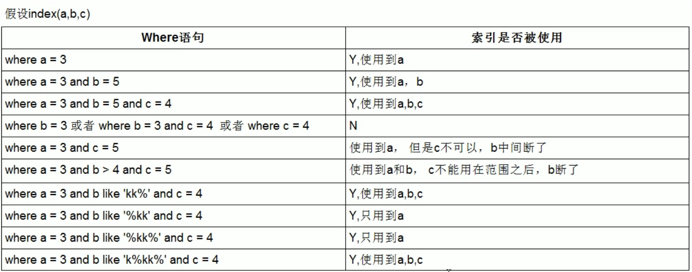

- 一般建议：
  - 对于单键索引，尽量选择针对当前query过滤性更好的索引
  - 在选择组合索引的时候，当前Query中过滤性最好的字段在索引字段顺序中，位置越靠前(左)越好。
  - 在选择组合索引的时候，尽量选择可以能够包含当前query中的where字句中更多字段的索引
  - 尽可能通过分析统计信息和调整query的写法来达到选择合适索引的目的

## 3. 查询截取分析

- 分析：
  - 观察、至少跑1天，看看生产的慢SQL情况
  - 开启慢查询日志，设置阈值，比如：超过5秒的就是慢SQL，并将它抓取出来
  - explain + 慢SQL分析
  - show profile
  - DBA、运维经理进行SQL数据库服务器的参数调优
- 总结上述：
  1. 慢查询的开启并捕获
  2. explain+慢SQL分析
  3. show profile查询SQL在MySQL服务器里面的执行细节和生命周期情况
  4. SQL数据库服务器的参数调优

### 3.1 查询优化

- MySQL基础学习了select => where
- 在此之前的优化：where=>gourp by/order by
- 目前再学习gourp by/order by之后的优化

#### 3.1.1 小表驱动大表

- 也即：小的数据集驱动大的数据集

- ```mysql
  select * from A where id in (select id from B);
  # 等价于：
  for select id from B
  	for select * from A where A.id = B.id;
  # 当B表数据集小于A表数据集时，性能高，并且用in优于exists
  
  select * from A where exists (select 1 from B B.id=A.id);
  # 等价于
  for select * from A
  	for select * from B where B.id=A.id;
  # 当A表的数据集小于B表的数据集时，用exists优于in
  
  # 注意：A、B表的ID字段应该建立索引
  
  
  # EXISTS说明：
  SELECT ...FROM table WHERE EXISTS (subquery)
  # 该语法可以理解为：将主查询的数据，放到子查询中做条件验证，根据验证结果(TRUE或FALSE)来决定主查询的数据结果是否得以保留。
  # 因此：
  # 1. EXSTS (subquey)只返回TRUE或FALSE，因此子查询中的SELECT*也可以是SELECT1或select 'X，官方说法是实际执行时会忽略SELECT清单，因此没有区别
  # 2. EXISTS子查询的实际执行过程可能经过了优化而不是我们理解上的逐联对比，如果担忧效率问题，可进行实际检验以确定是否有效率问题。
  # 3. EXISTS子查询往往也可以用条件表达式、其他子查询或者JOIN来替代，何种最优需要具体问题具体分析
  
  # 实例
  select * from tbl_emp;
  select * from tbl_dept;
  
  select * from tbl_emp e where e.deptId in (select id from tbl_dept d);
  select * from tbl_emp e where exists(select 'x' from tbl_dept d where d.id=e.deptId);
  ```

#### 3.1.2 order by 优化

- 尽量使用index方式进行排序，避免使用filesort方式排序

  - ```mysql
    create table tblA(
    #id int primary key not null auto_increment,
    age int,
    birth timestamp not null
    );
    
    insert into tblA(age, birth) values(22, now());
    insert into tblA(age, birth) values(23, now());
    insert into tblA(age, birth) values(24, now());
    
    create index idx_A_ageBirth on tblA(age, birth);
    
    select * from tblA;
    
    # 使用到了index,不会产生filesort
    explain select * from tblA where age>20 order by age;
    explain select * from tblA where age>20 order by age,birth;
    
    # 会出现Using index,也会出现Using filesort
    explain select * from tblA where age>20 order by birth;
    explain select * from tblA where age>20 order by birth,age;
    explain select * from tblA order by birth;
    explain select * from tblA where birth>'2016-01-28 00:00:00' order by birth;
    explain select * from tblA order by age ASC,birth DESC;
    
    # 使用到了Using index，并且不会产生filesort
    explain select * from tblA where birth>'2016-01-28 00:00:00' order by age;
    ```

- MySQL支持两种方式的排序，FileSort和Index

  - Index效率高：是指MySQL扫描索引本身完成排序
  - FileSort效率低：是因为需要重新排列

- ORDER BY满足两情况，会使用Index方式排序:

  - ORDER BY语句使用索引最左前列=》最佳左前缀原则
  - 使用Where子句与Order BY子句条件列组合满足索引最左前列=》最佳左前缀原则

- 尽可能在索引列上完成排序操作，按照索引键的最佳左前缀

- 如果不在索引列上，filesort有两种算法：

  - 双路排序：
    - MySQL4.1之前是使用双路排序,字面意思就是两次扫描磁盘，最终得到数据，读取行指针和orderby列，对他们进行排序，然后扫描已经排序好的列表，按照列表中的值重新从列表中读取对应的数据输出
    - 从磁盘取排序字段，在buffer进行排序，再从磁盘取其他字段。
  - 单路排序：
    - 从磁盘读取查询需要的所有列，按照order by列在buffer对它们进行排序，然后扫描排序后的列表进行输出，它的效率更快一些，避免了第二次读取数据。并且把随机IO变成了顺序IO
    - 但是它会使用更多的空间，因为它把每一行都保存在内存中了。
  - 存在的问题：
    - 在sort_buffer中，单路排序比双路排序要多占用很多空间，因为单路排序是把所有字段都取出,所以有可能取出的数据的总大小超出了sort_buffer的容量，导致每次只能取sort_buffer容量大小的数据，进行排序（创建tmp文件，多路合并），排完再取取sort_buffer容量大小，再排……从而多次IO.
    - 本来想省一次I/O操作，反而导致了大量的IO操作，反而得不偿失。

- 优化策略：

  - 增大sort_buffer_size参数的设置
  - 增大max_length_for_sort_data参数设置
  - 为什么？
    - 提高Order By的速度
    - Order by时select是一个大忌只Query需要的字段，这点非常重要。在这里的影响是:
      - 当Query的字段大小总和小于mak_length_for_sort_data而且排序字段不是TEXTIBLOB类型时，会用改进后的算法一—单路排序，否则用老算法——多路排序。
      - 两种算法的数据都有可能超出sort_buffer的容量，超出之后，会创建tmp文件进行合并排序，导致多次I/O，但是用单路排序算法的风险会更大一些,所以要提高sort_buffer_size.
    - 尝试提高sort_buffer_size
      - 不管用哪种算法，提高这个参数都会提高效率，当然，要根据系统的能力去提高，因为这个参数是针对每个进程的
    - 尝试提高max_length_for_sort_data
      - 提高这个参数，会增加用改进算法的概率。但是如果设的太高，数据总容量超出sort_buffer_size的概率就增大，明显症状是高的磁盘IO活动和低的处理器使用率.

- 小结：

  - 为排序使用索引：
    - MySQL两种排序方式：文件排序FileSort和扫描有序索引排序Index
    - MySQL能够为排序和查询使用相同的索引
    - 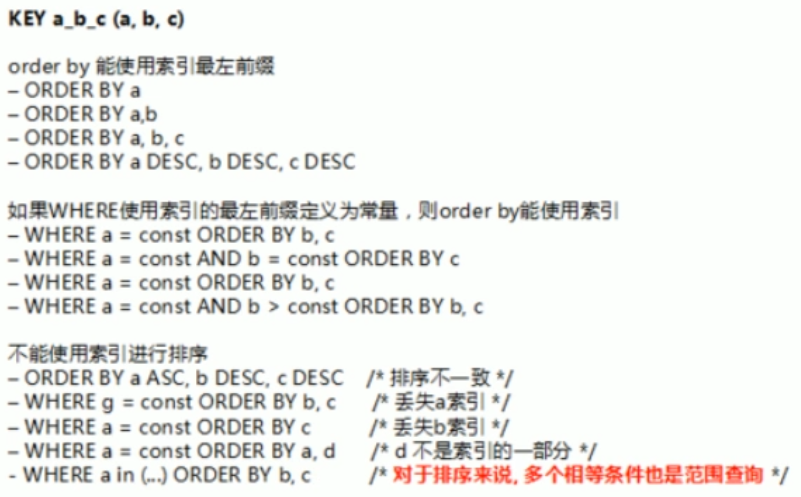

#### 3.1.3 group by 优化

- group by 实质是先排序后分组，按照索引建的最佳左前缀法则
- 其他的与order by类似
- 当无法使用索引列，增大max_length_for_sort_data参数的设置+增大sort_buffer_size参数的设置
- where高于having，能写在where限定的条件就不要去having限定了。

### 3.2 慢查询日志

- 是什么？

  - MySQL的慢查询日志是MySQL提供的一种日志记录，它用来记录在MySQL中响应时间超过阀值的语句，具体指运行时间超过long_query_time值的SQL，则会被记录到慢查询日志中。
  - 具体指运行时间超过long_query_time值的SQL，则会被记录到慢查询日志中。long_query_time的默认值为10，意思是运行10秒以上的语句。
  - 由他来查看哪些SQL超出了我们的最大忍耐时间值，比如一条sql执行超过5秒钟，我们就算慢SQL，希望能收集超过5秒的sql，结合之前explain进行全面分析。

- 怎么用？

  - 默认情况下MySQL没有开启慢查询日志，需要手动设置这个参数，当然，如果不是调优需要的话，一般不建议启动该参数，因为开启慢查询日志会或多或少带来一定的性能影响。慢查询日志支持将日志记录写入文件

  - 如何开启：

    - ```mysql
      # 查看是否开启 
      show variables like '%slow_query_log%';
      # 开启,只对当前数据库生效，如果MySQL重启后则会失效
      set global slow_query_log = 1;
      
      # 如果需要永久生效，则必须修改配置文件my.cnf
      # 修改my.cnf文件，[mysqld]下增加或修改参数
      # slow_query_log 和slow_query_log_file后，然后重启MySQL服务器
      # 也即将如下两行配置进my.cnf文件
      # slow_query_log =1
      # slow_query_log_file=/var/lib/mysql/atguigu-slow.log
      # 关于慢查询的参数slow_query_log_file，它指定慢查询日志文件的存放路径，系统默认会给一个缺省的文件host_name-slow.log (如果没有指定参数slow_query_log_file的话)
      ```

  - 开启后，什么SQL语句才会保存到该慢查询日志中？

    - ```mysql
      # 查看阈值
      show variables like 'long_query_time%';
      # 也可以在my.cnf参数中修改
      # 假如运行时间正好等于long_query_time的情况，并不会被记录下来。也就是说，在mysql源码里是判断大于long_query_time，而非大于等于。
      
      # 设置阈值，修改为超过3秒的就是慢sql
      set global long_query_time = 3;
      
      # 修改了空量long_query_time，但是查询变量long_query_time的值还是10，莫非修改无效
      # 为什么设置后看不出变换？
      # 需要重新连接或者新开一个会话才可以看到修改值！
      # 也可以使用这个命令查看
      show global variables like 'long_query_time%';
      ```

  - 简单例子，查看日志：记录慢SQL并且后续分析

    - ```mysql
      mysql> show variables like '%slow_query_log%';
      +---------------------+-------------------------------------------------+
      | Variable_name       | Value                                           |
      +---------------------+-------------------------------------------------+
      | slow_query_log      | ON                                              |
      | slow_query_log_file | /var/lib/mysql/izwz94aowfpx0xt7uw61tbz-slow.log |
      +---------------------+-------------------------------------------------+
      2 rows in set (0.00 sec)
      
      mysql> select sleep(4)
          -> ;
      +----------+
      | sleep(4) |
      +----------+
      |        0 |
      +----------+
      1 row in set (4.00 sec)
      
      [root@izwz94aowfpx0xt7uw61tbz ~]# cd /var/lib/mysql
      
      [root@izwz94aowfpx0xt7uw61tbz mysql]# cat izwz94aowfpx0xt7uw61tbz-slow.log
      /usr/sbin/mysqld, Version: 5.5.48-log (MySQL Community Server (GPL)). started with:
      Tcp port: 3306  Unix socket: /var/lib/mysql/mysql.sock
      Time                 Id Command    Argument
      # Time: 211022 10:19:34
      # User@Host: root[root] @ localhost []
      # Query_time: 4.000199  Lock_time: 0.000000 Rows_sent: 1  Rows_examined: 0
      use indopt;
      SET timestamp=1634869174;
      select sleep(4);
      
      ```

  - 查询当前系统中有多少条慢查询记录

    - ```mysql
      show global status like '%Slow_queries%';
      ```

  - 配置文件的慢查询日志的修改配置

    - ```mysql
      slow_query_log=1,
      slow_query_log_file=/var/lib/mysql/atguigu-slow.log
      long_query_time=3;
      log_output=FILE
      ```

- 日志分析工具：mysqldumpslow

  - 在生产环境中，如果要手工分析日志，查找、分析SQL，显然是个体力活，MysQL提供了日志分析工具mysqldumpslow。

  - ```mysql
    # 基本使用
    [root@izwz94aowfpx0xt7uw61tbz mysql]# mysqldumpslow --help
    Usage: mysqldumpslow [ OPTS... ] [ LOGS... ]
    
    Parse and summarize the MySQL slow query log. Options are
    
      --verbose    verbose
      --debug      debug
      --help       write this text to standard output
    
      -v           verbose
      -d           debug
      -s ORDER     what to sort by (al, at, ar, c, l, r, t), 'at' is default
                    al: average lock time
                    ar: average rows sent
                    at: average query time
                     c: count
                     l: lock time
                     r: rows sent
                     t: query time
      -r           reverse the sort order (largest last instead of first)
      -t NUM       just show the top n queries
      -a           don't abstract all numbers to N and strings to 'S'
      -n NUM       abstract numbers with at least n digits within names
      -g PATTERN   grep: only consider stmts that include this string
      -h HOSTNAME  hostname of db server for *-slow.log filename (can be wildcard),
                   default is '*', i.e. match all
      -i NAME      name of server instance (if using mysql.server startup script)
      -l           don't subtract lock time from total time
    
    
    # 得到返回记录集最多的10个sQL
    mysqldumpslow -s r-t 10 /var/lib/mysql/atguigu-slow.log
    
    # 得到访问次数最多的10个SQL
    mysqldumpslow -s c -t 10 /var/lib/mysql/atguigu-slow.log
    
    # 得到按照时间排序的前10条里面含有左连接的查询语句
    mysqldumpslow -s t -t 10 -g "left join" /var/lib/mysql/atguigu-slow.log
    
    # 建议：在使用这些命令时结合│和more 使用，否则有可能出现爆屏情况
    mysqldumpslow -s r-t 10 /var/lib/mysql/atguigu-slow.log | more
    
    ```

### 3.3 批量数据脚本

- 目标：插入1000w数据

- ```mysql
  # 1. 建库建表
  create database bigData;
  use bigData;
  
  create table dept(
  id int unsigned primary key auto_increment,
  deptno mediumint unsigned not null default 0,
  dname varchar(20) not null default "",
  loc varchar(13) not null default ""
  )engine=innodb default charset=GBK;
  
  CREATE TABLE emp(
  id int unsigned primary key auto_increment,
  empno mediumint unsigned not null default 0,
  ename varchar(20) not null default "",
  job varchar(9) not null default "",
  mgr mediumint unsigned not null default 0,
  hiredate date not null,
  sal decimal(7,2) not null,
  comm decimal(7,2) not null,
  deptno mediumint unsigned not null default 0
  )ENGINE=INNODB DEFAULT CHARSET=GBK;
  
  # 2. 设置参数log_bin_trust_function_creators;
  # 创建函数，假如报错:This function has-none of DETERMINISTIC......
  # 由于开启过慢查询日志，因为我们开启了bin-log,我们就必须为我们的function指定一个参数。
  show variables like 'log_bin_trust_function_creators';
  set global log_bin_trust_function_creators=1;
  
  #这样添加了参数以后，如果mysqld重启，上述参数又会消失，永久方法:
  # windows 下my.ini[mysqld]加上log_bin_trust_function_creators=1
  # linux下letc/my.cnf 下my.cnf[mysqld]加上log_bin_trust_function_creators=1
  
  
  # 3. 创建函数，保证每条数据都不同
  # 将默认的;结束符改为$$
  delimiter $$
  # 3.1 随机产生字符串函数
  create function ran_string(n int) returns varchar(255)
  begin
  declare chars_str varchar(100) default 'abcdefghijklmnopqrstuvwxyzABCDEFGHIJKLMNOPQRSTUVWXYZ';
  declare return_str varchar(255) default '';
  declare i int default 0;
  while i < n do
  set return_str = concat(return_str,substring(chars_str,floor(1+rand()*52),1));
  set i=i+1;
  end while;
  return return_str;
  end $$
  
  # 3.2 随机产生部门编号
  delimiter $$
  create function rand_num() returns int(5)
  begin
  declare i int default 0;
  set i=floor(100+rand()*10);
  return i;
  end $$
  
  # 4. 创建存储过程=>无返回值
  # 4.1 创建往emp表中插入数据的存储过程
  delimiter $$ 
  create procedure insert_emp(in start int(10),in max_num int(10))
  begin
  declare i int default 0;
  # 将自动提交事务关闭，防止插入一条数据就提交一次事务
  set autocommit = 0;
  repeat
  set i = i+1;
  insert into emp(empno,ename,job,mgr,hiredate,sal,comm,deptno) values((start+i),ran_string(6),'salesman',0001,curdate(),2000,400,rand_num());
  until i=max_num
  end repeat;
  commit;
  end $$
  
  
  # 4.2 创建往dept表添加随机数据的存储过程
  delimiter $$ 
  create procedure insert_dept(in start int(10),in max_num int(10))
  begin
  declare i int default 0;
  set autocommit = 0;
  repeat
  set i = i+1;
  insert into dept(deptno,dname,loc) values((start+i),ran_string(10),ran_string(8));
  until i=max_num
  end repeat;
  commit;
  end $$
  
  # 5. 调用存储过程
  # 先插入dept表
  # 从100编号开始插入10条数据
  DELIMITER ;
  CALL insert_dept(100,10);
  select * from dept;
  
  # 往emp表中添加50万条数据
  DELIMITER ;
  CALL insert_emp(100001,500000);
  select * from emp;
  ```

### 3.4 Show Profile

- 是什么？

  - MySQL提供可以用来分析当前会话中语句执行的资源消耗情况，可以用于SQL的调优测量
  - http://dev.mysql.com/doc/refman/5.5/en/show-profile.html

- 默认情况下：是关闭状态，开启后默认保存最近15次的运行结果

- 分析步骤：

  - 是否支持，看看当前的MySQL版本是否支持show profile

    - ```mysql
      # 查看是否开启
      show variables like 'profiling';
      ```

  - 使用前将其开启：

    - ```mysql
      # 设置开启
      set profiling=on;
      
      ```

  - 运行SQL

    - ```mysql
      # 为了耗时：id取余
      select * from emp group by id%10 limit 150000;
      
      
      select * from emp group by id%20 order by 5;
      ```

  - 检查运行结果：show profiles;

    - ```mysql
      mysql> show profiles;
      +----------+------------+-----------------------------------------------+
      | Query_ID | Duration   | Query                                         |
      +----------+------------+-----------------------------------------------+
      |        1 | 0.00035050 | show variables like 'profiling'               |
      |        2 | 0.33684075 | select * from emp group by id%10 limit 150000 |
      |        3 | 0.33502675 | select * from emp group by id%10              |
      |        4 | 0.38469600 | select * from emp group by id%20 order by 5   |
      +----------+------------+-----------------------------------------------+
      4 rows in set (0.00 sec)
      
      
      ```

  - 诊断SQL：

    - ```mysql
      # show profile cpu,block io for query Query_ID(上一步前面的问题SQL数字号码)
      show profile cpu,block io for query 2;
      # 一些其他参数
      #type:
      	# ALL--显示所有的开销信息
      	# BLoCk Io--显示块IO相关开销
      	# CONTEXT SWITCHES --上下文切换相关开销
          # CPU --显示CPU相关开销信息
      	# lPC --显示发送和接收相关开销信息
      	# MEMORY--显示内存相关开销信息
      	# PAGE FAULTS--显示页面错误相关开销信息
      	# SOURCE --显示和Source_function，Source_file，Source_line相关的开销信息
      	# SWAPS --显示交换次数相关开销的信息
      
      ```

  - 日常开发需要注意的结论：

    - ```mysql
      # show profile cpu,block io for query Query_ID中的Status列出现：必须优化！！！
      
      # 1. converting HEAP to MYISAM :查询结果太大，内存都不够用了往磁盘上搬了
      
      # 2. Creating tmp table：创建临时表。拷贝数据到临时表，用完再删除
      
      # 3. Copyint to tmp table on disk：把内存中临时表复制到磁盘，危险！
      
      # 4. locked
      ```

### 3.5 全局查询日志
- 永远不要再生产环境开启这个功能，是在测试环境中使用的！

- 配置启用：

  - ```mysql
    # 在mysql的my.cn中，设置如下:
    #开启
    general_log=1
    # 记录日志文件的路径
    general_log_file=/path/logfile
    #输出格式
    log_output=FILE
    
    ```

- 编码启用

  - ```mysql
    set global general_log =1;
    set global log_output='TABLE';
    # 此后，你所编写的sql语句，将会记录到mysql库里的general_log表
    # 可以用下面的命令查看. 
    select * from mysql.general_log;
    
    ```

## 4. MySQL锁机制

- 锁是什么？
  - 锁是计算机协调多个进程或线程并发访问某一资源的机制。
  - 在数据库中，除传统的计算资源（如CPU、RAM、IO等）的争用以外，数据也是一种供许多用户共享的资源。如何保证数据并发访问的一致性、有效性是所有数据库必须解决的一个问题，锁冲突也是影响数据库并发访问性能的一个重要因素。从这个角度来说，锁对数据库而言显得尤其重要，也更加复杂。
- 锁的分类：
  - 按照对数据操作(读/写)的类型分类：
    - 读锁（共享锁）：针对同一份数据，多个读操作可以同时进行而不会相互影响
    - 写锁（排他锁）：当前写操作没有完成前，会阻断其他写锁和读锁
  - 按照对数据操作的粒度分类：
    - 表锁：
    - 行锁：
    - 全局锁：对整个数据库实例加锁

### 4.1 表锁（偏读）

- 特点：
  
- 偏向MyISAM存储引擎，开销效，加锁快，无死锁，锁定粒度大，发生锁冲突的概率最高，并发度最低
  
- 实例：

  - ```mysql
    create table mylock (
    id int not null primary key auto_increment,
    name varchar(20) default ''
    ) engine myisam;
    
    insert into mylock(name) values('a');
    insert into mylock(name) values('b');
    insert into mylock(name) values('c');
    insert into mylock(name) values('d');
    insert into mylock(name) values('e');
    
    # 手动增加表锁
    lock table 表名 read(write), 表名2 read(write),...;
    lock table mylock read, book write;
    
    # 查看表上加过的锁
    show open tables;
    
    # 释放表锁
    unlock tables;
    
    # 1.给mylock表添加 读锁
    lock table mylock read;
    # 1.1 同时的session1会话中使用
    # 可以读
    select * from mylock;
    # 不可更新，会报错
    update mylock set name='a2' where id = 1;
    # 此时也不可以读取没有加锁的其他表
    select * from book;
    # 1.2 同时的session2会话中使用
    # 可以读
    select * from mylock;
    # 此时可以读取其他表
    select * from book;
    # 会阻塞！！！等待=》导致性能下降
    update mylock set name='a3' where id = 1;
    
    # sesion1中解锁，session2中的更新语句会马上执行,插入操作完成
    unlock tables;
    
    # ------------
    # 2. 给mylock表添加 写锁
    lock table mylock write;
    # 2.1 同时的session1会话中使用
    # 可以读
    select * from mylock;
    # 可以改
    update mylock set name='a4' where id = 1;
    # 此时也不可以读取没有加锁的其他表
    select * from book;
    # 2.2 同时的session2会话中使用
    # 阻塞！！！等待=》导致性能下降，sesion1中解锁，session2中的语句会马上执行,查询操作完成
    select * from mylock;
    # 此时可以读取其他表
    select * from book;
    # 会阻塞！！！等待=》导致性能下降，sesion1中解锁，session2中的更新语句会马上执行,插入操作完成
    update mylock set name='a3' where id = 1;
    ```

- 案例结论：

  - MyISAM在执行查询语句前（SELECT），会自动给涉及到的所有表加读锁，在执行增删改操作前，会自动给涉及到的表加写锁
  - MySQL的表级锁有两种模式：
    - 表共享读锁（Table Read Lock）
    - 表独占写锁（Table Write Lock）
  - 结论:
    - 对MyISAM表进行操作，会有以下情况:
      - 对MyISAM表的读操作（加读锁)，不会阻塞其他进程对同一表的读请求，但会阻塞对同一表的写请求。只有当读锁释放后，才会执行其它进程的写操作。
      - 对MyISAM表的写操作（加写锁)，会阻塞其他进程对同一表的读和写操作，只有当写锁释放后，才会执行其它进程的读写操作。
    - 简而言之，就是读锁会阻塞写，但是不会堵塞读。而写锁则会把读和写都堵塞

- 表锁分析：

  - ```mysql
    # 查看哪些表被加锁了
    show open tables;
    
    # 【如何分析表锁定】
    # 可以通过检查table_locks_waited和table_locks_immediate状态变量来分析系统上的表锁定:
    show status like 'table%';
    # 这里有两个状态变量记录MySQL内部表级锁定的情况，两个变量说明如下:
    # Table_locks_immediate:
    	# 产生表级锁定的次数，表示可以立即获取锁的查询次数，每立即获取锁值加1;
    # Table_locks_waited:
    	# 出现表级锁定争用而发生等待的次数(不能立即获取锁的次数，每等待一次锁值加1)，此值高则说明存在着较严重的表级锁争用情况;
    
    ```

  - MyISAM的读写锁调度是写优先的，这也是为什么MyISAM不适合做写为主表的引擎，因为写锁后，其他线程不可以做任何操作，大量的更新会使得查询很难获取锁，从而造成永久堵塞

### 4.2 行锁（偏写）

- 特点：

  - 偏向InnoDB存储引擎，开销大，加锁慢;会出现死锁；锁定粒度最小，发生锁冲突的概率最低,并发度也最高。
  - InnoDB与MyISAM的最大不同有两点:一是支持事务(TRANSACTION)﹔二是采用了行级锁

- 下一节将要学习！

  - 事务：
    - ACID
  - 并发事务处理带来的问题：
    - 更新丢失(Lost Update)
    - 脏读(Dirty Reads)
    - 不可重复读(Non-Repeatable Reads)
    - 幻读(Phantom Reads)
  - 事务隔离级别：
    - 读未提交(Read uncommitted)
    - 读已提交(Read committed)
    - 可重复读(Repeatable read)
    - 可序列化(Serializable)

- 案例分析：

  - ```mysql
    CREATE TABLE test_innodb_lock (a INT(11),b VARCHAR(16))ENGINE=INNODB;
    INSERT INTO test_innodb_lock VALUES(1,'b2');
    INSERT INTO test_innodb_lock VALUES(3,'3');
    INSERT INTO test_innodb_lock VALUES(4, '4000');
    INSERT INTO test_innodb_lock VALUES(5,'5000');
    INSERT INTO test_innodb_lock VALUES(6, '6000');
    INSERT INTO test_innodb_lock VALUES(7,'7000');
    INSERT INTO test_innodb_lock VALUES(8, '8000');
    INSERT INTO test_innodb_lock VALUES(9,'9000');
    INSERT INTO test_innodb_lock VALUES(1,'b1');
    CREATE INDEX test_innodb_a_ind ON test_innodb_lock(a);
    CREATE INDEX test_innodb_lock_b_ind ON test_innodb_lock(b);
    
    # 两个session都关闭自动提交
    SET autocommit=0;
    
    # 1.行锁基本演示
    # session1进行修改
    update test_innodb_lock set b='4001' where a = 4;
    # 可以看到已经修改成功
    select * from test_innodb_lock;
    
    # 同时session2查询,看不到session1做出的修改，因为session1没有commit
    select * from test_innodb_lock;
    
    # 之后session1和session2都
    commit;
    # 在session2再次查询,可以查看到session1做出的修改
    select * from test_innodb_lock;
    
    
    # session1进行更新，但是不提交
    update test_innodb_lock set b='4002' where a = 4;
    # 同时，session2进行更新，会阻塞
    update test_innodb_lock set b='4003' where a = 4;
    # 当session1提交后，session2的更新才能正常执行
    commit;
    # session2提交，
    commit
    # 两边都可以看到修改后的结果
    select * from test_innodb_lock;
    
    # session1对4进行操作，session2对9进行操作，不是同一行，未提交前也不会阻塞
    # session1语句：
    update test_innodb_lock set b='4004' where a = 4;
    # session2语句：
    update test_innodb_lock set b='9001' where a = 9;
    
    # 2.无索引行行锁升级为表锁
    show index from test_innodb_lock;
    # 两边同时进行更新
    # session1语句：
    update test_innodb_lock set a=41 where b='4000';
    # session2语句：不会阻塞，正常执行，因为是对不同的行进行操作
    update test_innodb_lock set b='9001' where a=9;
    # 两边都提交
    commit;
    
    # 但是把b的索引弄失效的话：varchar类型不写引号
    # 两边同时进行更新
    # session1语句：
    update test_innodb_lock set a=21 where b=4000;
    # session2语句：会阻塞，即使是对不同的行进行操作
    update test_innodb_lock set b='9001' where a=9;
    # session1提交，session2的更新语句才会执行
    commit;
    
    # 3.间隙锁的危害！此时数据表中没有a=2的记录
    # session1中查看
    select * from test_innodb_lock;
    # session1中修改一个范围的数据:执行，未提交
    update test_innodb_lock set b = '0629' where a>1 and a<6;
    # 同时，session2中插入一条数据：会阻塞！！！
    insert into test_innodb_lock values(2,'20002');
    # session1提交后，session2中的插入语句才会执行
    commit;
    # session2提交
    commit;
    ```

- 什么是间隙锁？

  - 当我们用范围条件而不是相等条件检索数据，并请求共享或排他锁时，InnoDB会给符合条件的已有数据记录的索引项加锁，对于键值在条件范围内但并不存在的记录，叫做“间隙(GAP)”，
    InnoDB也会对这个“间隙”加锁，这种锁机制就是所谓的间隙锁(Next-Key锁)。
  - 危害：
    - 因为Query执行过程中通过过范围查找的话，他会锁定整个范围内所有的索引键值，即使这个键值并不存在。
    - 间隙锁有一个比较致命的弱点，就是当锁定一个范围键值之后，即使某些不存在的键值也会被无辜的锁定，而造成在锁定的时候无法插入锁定键值范围内的任何数据。在某些场景下这可能会对性能造成很大的危害

- 如何锁定一行记录？

  - 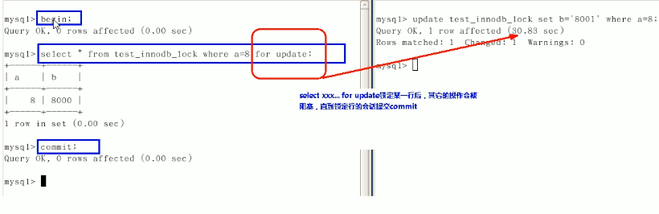
  - begin+for update！（无论有没有set autocommit=0,begin都会开启一个事务！）

- 案例结论：

  - lInnodb存储引擎由于实现了行级锁定，虽然在锁定机制的实现方面所带来的性能损耗可能比表级锁定会要更高一些，但是在整体并发处理能力方面要远远优于MyISAM的表级锁定的。当系统并发量较高的时候，Innodb的整体性能和MyIlSAM相比就会有比较明显的优势了。
  - 但是，Innodb的行级锁定同样也有其脆弱的一面，当我们使用不当的时候，可能会让Innodb的整体性能表现不仅不能比MyISAM高，甚至可能会更差。

- 行锁分析：

  - ```mysql
    # 如何分析行锁定
    # 通过检查InnoDB_row_lock状态变量来分析系统上的行锁的争夺情况
    show status like 'innodb_row_lock%';
    # 对应的状态量说明：
    # lnnodb_row_lock_current_waits:
    	# 当前正在等待锁定的数量;
    # Innodb_row_lock_time:
    	# 从系统启动到现在锁定总时间长度;
    # lnnodb_row_lock_time_avg:
    	# 每次等待所花平均时间;
    # Innodb_row_lock_time_max:
    	# 从系统启动到现在等待最长的一次所花的时间;
    # Innodb_row_lock_waits:
    	# 系统启动后到现在总共等待的次数;
    
    # 对于这5个状态变量，比较重要的主要是
    # lnnodb_row_lock_time_avg（等待平均时长），
    # Innodb_row_lock_waits（等待总次数)
    # lnnodb_row_lock_time(等待总时长〉这三项。
    # 尤其是当等待次数很高，而且每次等待时长也不小的时候，
    # 我们就需要分析系统中为什么会有如此多的等待，然后根据分析结果着手指定优化计划。
    
    ```

- 优化建议：

  - 尽可能让所有数据检索都通过索引来完成，避免无索引行锁升级为表锁。
  - 合理设计索引，尽量缩小锁的范围
  - 尽可能较少检索条件，避免间隙锁
  - 尽量控制事务大小，减少锁定资源量和时间长度
  - 尽可能低级别事务隔离

### 4.3 页锁

- 开销和加锁时间界于表锁和行锁之间;会出现死锁;锁定粒度界于表锁和行锁之间，并发度一般。

## 5. 主从复制-学完redis再来

- 

