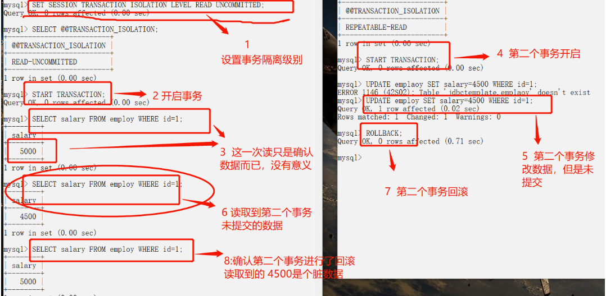
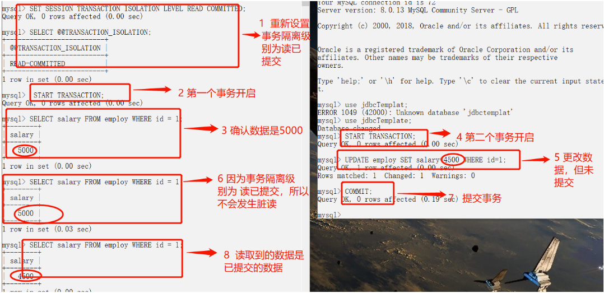
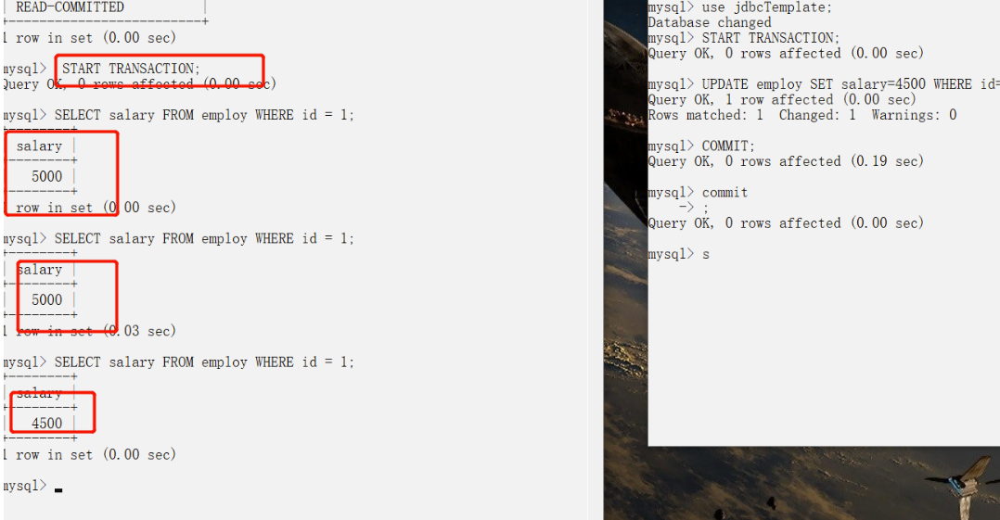
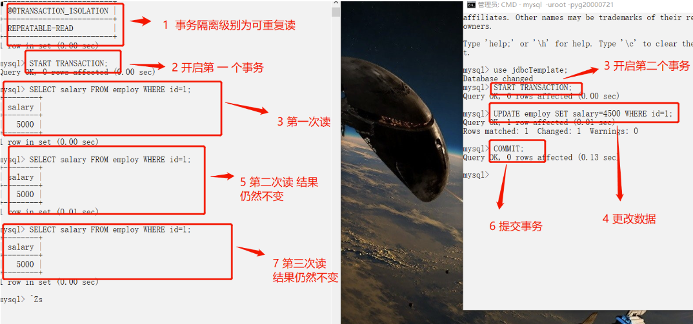
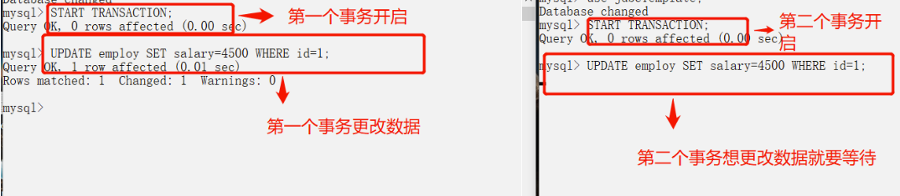

# MySQL事务详解

- 主要参考自：https://github.com/Snailclimb/JavaGuide/blob/master/docs/database/

## 1. 什么是事务？

- 事务是逻辑上的一组操作：要不都执行，要不都不执行
- 生活实例：假如小明要给小红转账1000元，这个转账会涉及到两个关键操作就是：将小明的余额减少1000元，将小红的余额增加1000元。万一在这两个操作之间突然出现错误比如银行系统崩溃，导致小明余额减少而小红的余额没有增加，这样就不对了。事务就是保证这两个关键操作要么都成功，要么都要失败。

## 2. 事务的特性

- 原子性(A)：事务是最小的执行单位，不允许分割。
  - 主要确保事务要不全部完成，要不不起作用
- 一致性(C)：执行事务前后，数据保持一致
  - 例如转账业务中，无论事务是否成功，转账者和收款人的总额应该是不变的
- 隔离性(I)：并发访问数据库时，一个用户的事务不会被其他事务所干扰
  - 各并发事务之间数据库是独立的
- 持久性(D)：一个事务被提交后，对数据库中的数据的改变是持久的
  - 即使数据库中发生故障也不应该会对其有任何影响

## 3. 并发事务引发的问题

- **脏读（Dirty read）：**
  - 当事务正在访问数据并且对数据进行了修改，但是这种修改(修改后的数据)还没有提交到数据库中。
  - 此时：另一个事务也访问了这个数据(修改后的数据)，然后使用了这个数据(修改后的数据)
  - 因为这个数据(修改后的数据)是还没有提交的数据，那么另一个事务读到的这个数据是脏数据，依据脏数据所做的操作可能是不正确的
- **丢失修改（Lost to modify）：**
  - 在一个事务读取一个数据时，另一个事务也读取了这个数据
  - 此时第一个事务中修改了这个数据，第二个事务也修改了这个数据
  - 这样第一个事务内修改结果就被丢失了，因此被称为丢失修改
  - 如：事务1读取某表中的数据A=20，事务2也读取A=20，事务1修改A=A-1，事务2也修改A=A-1，最终结果A=19，事务1的修改被丢失。
- **不可重复读（Unrepeatable read）：**
  - 一个事务内多次读同一数据，在这个事务还没有结束时
  - 此时另一个事务也访问这个数据。
  - 在第一个事务中的两次读数据之间，第二个事务的修改导致第一个事务两次读取的数据可能不太一样
  - 这样就发生了一个事务内两次读取到的数据是不一样的，因此被称为不可重复读
- **幻读（Phantom read）：**
  - 一个事务内多次读取数据，在这个事务还没有结束时
  - 此时另一个事务插入了一些数据，
  - 在第一个事务中的两次读数据之间，第二个事务的插入导致第一个事务两次读取的数据多了原本不存在的记录
  - 就好像发生了幻觉，因此被称为幻读
- 不可重复读和幻读的区别？
  - 不可重复读重点是：修改
  - 幻读重点是：删除和新增
  - 如：
    - 例1（同样的条件, 你读取过的数据, 再次读取出来发现值不一样了 ）：事务1中的A先生读取自己的工资为 1000的操作还没完成，事务2中的B先生就修改了A的工资为2000，导 致A再读自己的工资时工资变为 2000；这就是不可重复读。
    - 例2（同样的条件, 第1次和第2次读出来的记录数不一样 ）：假某工资单表中工资大于3000的有4人，事务1读取了所有工资大于3000的人，共查到4条记录，这时事务2 又插入了一条工资大于3000的记录，事务1再次读取时查到的记录就变为了5条，这样就导致了幻读。

## 4. 事务隔离级别

- SQL标准定义了四个隔离级别

- **读未提交(Read Uncommitted)：**

  - 最低的隔离级别，允许读取尚未提交的数据变更，所以可能会导致：脏读、不可重复读、幻读
    - 脏读：一个事务中修改了数据并且未提交，另一个事务读取到了修改未提交的数据
    - 不可重复读：一个事务中多次读取数据，另一个事务中修改了数据并提交了，导致第一个事务两次读取结果不一样
    - 幻读：一个事务中多次读取数据，另一个事务中新增或者修改了数据，导致第一个事务两次读取的结果数量上不一样

- **读已提交(Read Committed)：**

  - 允许读取并发事务已经提交的数据，可以阻止脏读，可能会导致：不可重复读、幻读

- **可重复读(Repeatable read)：**

  - 对同一字段的多次读取结果是一致的，除非数据是被本身事务自己修改，可以阻止脏读和不可重复读，可能会导致幻读

- **可串行化(Serializable)：**

  - 最高隔离级别，完全服从ACID，所有的事务依次执行，这样的事务不可能产生干扰，可以防止脏读、不可重复读、幻读

- 总结：

- ------

  | 隔离级别         | 脏读 | 不可重复读 | 幻读 |
  | ---------------- | ---- | ---------- | ---- |
  | READ-UNCOMMITTED | √    | √          | √    |
  | READ-COMMITTED   | ×    | √          | √    |
  | REPEATABLE-READ  | ×    | ×          | √    |
  | SERIALIZABLE     | ×    | ×          | ×    |

- MySQL InnoDB存储引擎默认支持的隔离级别是REPEATABLE-READ，也就是可重复读，可以解决脏读、不可重复读的问题，但是不能解决幻读的问题

  - ```mysql
    # 查看默认的事务隔离级别
    SELECT @@tx_isolation;
    # MySQL 8.0之后
    SELECT @@transaction_isolation;
    ```

- MySQL InnoDB存储引擎任何保证避免幻读？

  - 使用加锁的方法来保证！
  - Next-Key Locks！！！

- MySQL InnoDB存储引擎的优点？

  - 因为隔离级别越低，事务请求的锁越少，所以大部分数据库系统的隔离级别都是 **READ-COMMITTED(读取提交内容)** ，
  - 但是 InnoDB 存储引擎默认使用 **REPEATABLE-READ（可重读）** 并不会有任何性能损失。

- MySQL InnoDB存储引擎在分布式事务中？

  - InnoDB 存储引擎提供了对 XA 事务的支持，并通过 XA 事务来支持分布式事务的实现。
  - 分布式事务指的是允许多个独立的事务资源（transactional resources）参与到一个全局的事务中。
  - 事务资源通常是关系型数据库系统，但也可以是其他类型的资源。全局事务要求在其中的所有参与的事务要么都提交，要么都回滚，这对于事务原有的 ACID 要求又有了提高。另外，在使用分布式事务时，InnoDB 存储引擎的事务隔离级别必须设置为 SERIALIZABLE。

## 5. 实际演示并发下的问题

- 显示开启一个事务

  - ```mysql
    start transaction;
    ```

- 设置隔离级别

  - ```mysql
    SET [SESSION|GLOBAL] TRANSACTION ISOLATION LEVEL [READ UNCOMMITTED|READ COMMITTED|REPEATABLE READ|SERIALIZABLE]
    ```

- 提交、回滚事务：

  - ```mysql
    # 提交事务，使得对数据库做的所有修改成为永久性。
    commit;
    # 回滚会结束用户的事务，并撤销正在进行的所有未提交的修改
    rollback;
    ```

- 读未提交=》脏读

  - 

- 读已提交=》来避免脏读

  - 

- 读已提交=》不可重复读

  - 

- 可重复读=》避免不可重复读
  
  - 
- 可重复读=》防止幻读？未完待续
  
  - 

## 6. 再次理解不可重复读和幻读的区别？

- 不可重复读重点在于update和delete，而幻读的重点在于insert。
- 如果使用锁机制来实现这两种隔离级别：
  - 在可重复读中，该sql第一次读取到数据后，就将这些数据加锁，其它事务无法修改这些数据，就可以实现可重复读了。
  - 但这种方法却无法锁住insert的数据，所以当事务A先前读取了数据，或者修改了全部数据，事务B还是可以insert数据提交，这时事务A就会发现莫名其妙多了一条之前没有的数据，
  - 这就是幻读，不能通过行锁来避免。
  - 需要Serializable隔离级别 ，读用读锁，写用写锁，读锁和写锁互斥，这么做可以有效的避免幻读、不可重复读、脏读等问题，但会极大的降低数据库的并发能力。
  - 所以说不可重复读和幻读最大的区别，就在于如何通过锁机制来解决他们产生的问题