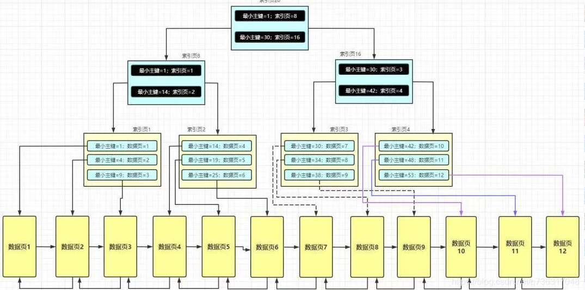
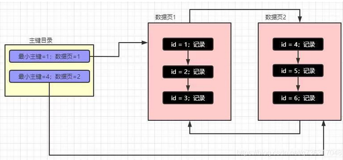
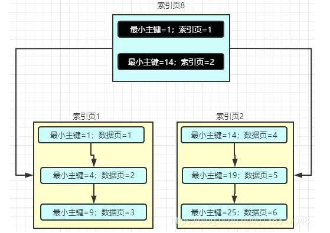
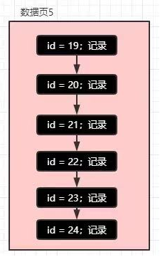
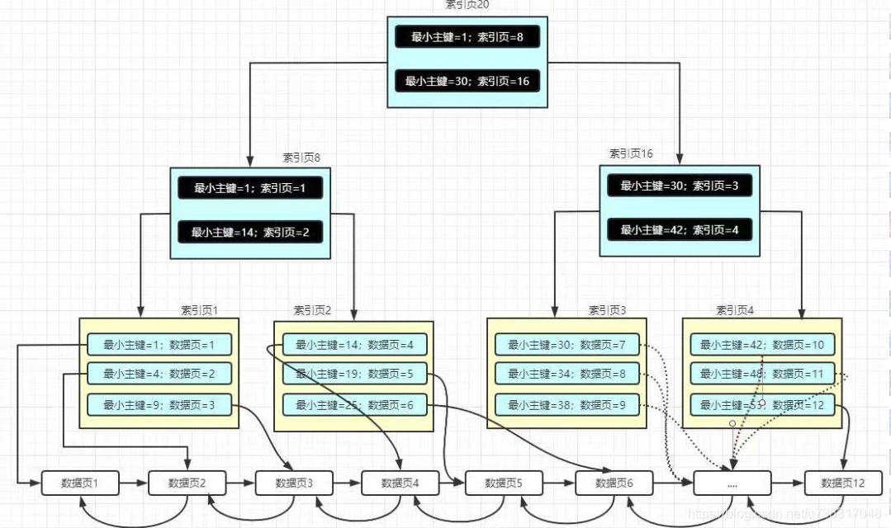
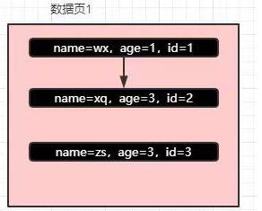

# 索引理解

- 主要参考自：https://blog.csdn.net/q736317048/article/details/114415571
- 建议先理解：二叉查找树、平衡二叉树、B树、B+树基本思想

## 1. 索引是什么？

- 索引：能够帮助MySQL高效获取数据的数据结构！是排好序的快速查找的数据结构

## 2. 索引分类

- 普通索引 index：加速查找
- 唯一索引
  - 主键索引：primary key：加速查找+约束（不为空且唯一）
  - 唯一索引：unique：加速查找+约束（唯一）
- 联合索引
  - primary key(id,name)：联合主键索引
  - unique(id,name)：联合唯一索引
  - index(id,name)：联合普通索引
- 全文索引 fulltext：用于搜索很长的一篇文章的时候，效果最好
- 空间索引 spatial：了解就好

## 3. 索引使用的数据结构

### 3.1 Hash索引

- 什么是Hash索引？
  - 直接使用Hash表建立索引
  - Hash索引不是最常用的数据库索引类型，
  - 常用Innodb引擎就不支持Hash索引
- 优点：
  - 单条查询效率很高，时间复杂度为1
  - **Hash索引适合精确查找，但是范围查找不适合**
- 那什么情况使用哈希索引呢？
  - select … from user where user_id = ? 这种等查询非常适合hash索引
  - 因为只需要经过一次算法即可找到相应的键值；前提是键值都是唯一的。如果键值不唯一就需要先找到该键值所在位置，然后再根据链表往后扫描，直到找到相应的数据

### 3.2 B+树

- B+树特性：
  - 在 B+ 树中，所有数据记录节点都是按照键值的大小存放在同一层的叶子节点上，而非叶子结点只存储key的信息，这样可以大大减少每个节点的存储的key的数量，降低B+ 树的高度
  - B+ 树叶子节点的关键字从小到大有序排列，左边结尾数据都会保存右边节点开始数据的指针
  - B+ 树的层级更少：相较于 B 树 B+ 每个非叶子节点存储的关键字数更多，树的层级更少所以查询数据更快
  - B+ 树查询速度更稳定：B+ 所有关键字数据地址都存在叶子节点上，所以每次查找的次数都相同所以查询速度要比B树更稳定;
  - B+ 树天然具备排序功能：B+ 树所有的叶子节点数据构成了一个有序链表，在查询大小区间的数据时候更方便，数据紧密性很高，缓存的命中率也会比B树高。
  - B+ 树全节点遍历更快：B+ 树遍历整棵树只需要遍历所有的叶子节点即可，而不需要像 B 树一样需要对每一层进行遍历，这有利于数据库做全表扫描。
- 

#### 3.2.1 主键目录=》主键索引

- 
- 将上图的数据页拿出来细分，就形成了上面的主键目录
- MySQL 在存储数据的时候是以**数据页**为最小单位的，且数据在数据页中的存储是**连续**的，数据页中的数据是按照主键排序的（没有主键是由 MySQL自己维护的 ROW_ID 来排序的），数据页和数据页之间是通过**双向链表**来关联的，数据与数据之间是通过**单向链表**来关联的。
- 也就是说有一个在每个数据页中，他必然就有一个最小的主键，然后每个数据页的页号和最小的主键会组成一个主键目录（就像上图中的左边部分，最终叫做索引页）
  - 假设现在要查找主键为 2 的数据，通过二分查找法最后确定下主键为 2 的记录在数据页 1 中，此时就会定位到数据页 1 接着再去定位主键为 2 的记录

#### 3.2.2 索引页

- 上面的问题？
  - 那假设有很多数据页呢？那是不是对应的主键目录会不会也很大呢？
  - 那假设有1000万记录、5000万记录呢？就算用二分法查询，其效率也依旧很低的
- 了解决这种情况Mysql又设计出了新的存储结构-**索引页**。看下图（主键目录不再存储数据页，而是变为存储索引页）将里面的记录拆分成不同的索引页中
- 
- 索引页中记录的是每页数据页的页号和该数据页中最小的主键的记录，也就是说最小主键和数据页号不是单纯的维护在主键目录中了，而是演变成了索引页，索引页和数据页类似，一张不够存就分裂到下一张。
- 
- 也就是说维护索引页的索引页是在真正存储记录和数据页的索引页的上一层
- 现在如果想查找 id=20 的这条记录：
  - 那就是从最上层的索引页开始查找，通过二分法查找，很快就能够定位到 id=20 s这条记录是在索引页 2 上，然后到就索引页 2 上面查找，接着就是和之前一样了（注意，索引页中的记录也是通过单向链表连接的），根据各个最小的主键能够定位到 id=20 是在数据页5上，假设数据页5是这样子的 。所以B+树中的索引定位就是这个样子的
  - 
- 
- 模拟一个查找的过程，假设你要查找 37 这条记录：
  - 说实话根本不知道这条记录在哪里。好，现在我们就来模拟 MySQL 的查找过程，首先从最顶层的索引页开始查找，因为 id=37，因此定位到了索引页16，然后到索引页 16 中继续查找，此时同样能够定位到 id=37 在索引页 3 中，然后继续查找，最终能够定位到数据实在数据页 8 中，然后再在数据页中二分查找即可
- 这种**索引页+数据页**组成的组成的B+树就是**聚簇索引**
  - 聚簇索引是Mysql基于主键索引结构创建的

#### 3.2.3 非主键索引

- 非主键索引其原理是一样的：MySQL 都是去维护一颗 B+ 树，
  
  - 说白了：建立多少个索引，MySQL 就会帮你维护多少的B+树
  - （这下是不是也突然想明白了为什么索引不能建立太多了？以前就知道不能建立太多索引，因为索引也会占用空间，实际上这就是根本原因）

- 假如现在真的对 name+age 建立索引，那此时是存放的呢？此时 MySQL 根据 name+age 维护一个单独的 B+ 树结构，数据依旧是存放在数据页中的，只不过是原来数据中的每条记录写的是 id=xx，现在写的是name=xx，age=xx，id=xx，不管怎么样，主键肯定会存放的：
  
  - 

- 在插入数据的时候，MySQL 首先会根据 name 进行排序，如果 name 一样，就根据联合索引中的 age 去排序，如果还一样，那么就会根据 主键 字段去排序。插入的原理就是这样子的。

- 此时每个数据页中的记录存放的实际是**索引字段**和主键字段
  
  - **而其他字段是不存的**
  - （为什么不存放？一样的数据到处存放很浪费空间的，也没必要，所以才会有下面的索引优化）

- 如：
  
  - ```mysql
    select name from student where name = '张三'
    ```
  
  - 那么此时查询是完美的，使用到了索引且不需要回表

- 什么是回表？
  
  - 因为联合索引中的记录也仅仅有 name，age，id，所以在查询的如果也仅仅查询这三个字段，那么在该B+树中就能够查询到想要的结果了。
  
  - 如果查询语句变为了:
    
    - ```mysql
      select * from student where name = '张三'
      ```
  
  - 虽然根据 name 很快的定位到了该条记录，但是因为 name+age 不是聚簇索引，此时的 B+ 树的数据页中存放的仅仅是自己关联的索引和主键索引字段，并不会存其他的字段，所以这个时候其他的属性值是获取不到的，这时候该怎么办？
  
  - 这种情况下，MySQL 就需要进行回表查询了。此时 MySQL 就会根据定位到的某条记录中的 id 再次进行聚簇索引查找，也就是说会根据 id 去维护 id 的那么 B+ 树中查找。因为聚簇索引中数据页记录的是一条记录的完整的记录，这个过程就叫回表。

- **根据非主键索引查询到的结果并没有查找的字段值，此时就需要再次根据主键从聚簇索引的根节点开始查找，这样再次查找到的记录才是完成的。**

- MySQL 对于非主键索引的维护过程：
  
  - 对于非主键索引（一般都是联合索引），在维护 B+ 树的时候，会根据联合索引的字段依次去判断
  - 假设联合索引为：name + address + age，那么 MySQL 在维护该索引的 B+ 树的时候，首先会根据 name 进行排序，name 相同的话会根据第二个 address 排序，如果 address 也一样，那么就会根据 age 去排序，如果 age 也一样，那么就会根据主键字段值去排序，且对于非主键索引，MySQL 在维护 B+ 树的时候，仅仅是维护索引字段和主键字段。

## 4. 索引匹配规范

- 最左前缀匹配原则，非常重要的原则。上面的组合索引提到了，如果不遵循是不走索引的
  - create index ne on s1(name,age)
- mysql会向右一直匹配到 直到遇到范围查询（>、<、between、like）就会停止匹配
  - 比如a = 1 and b = 2 and c > 3 and d = 4,如果建立索引（a,b,c,d）顺序的索引，d是用不到索引的，如果建立（a,b,d,c）的索引则都可以用到，a.b.d的顺序可以任意调整
- **=和in可以乱序**
  - 比如a = 1and b = 2 and c = 3 建立(a,b,c)索引可以任意调整，Mysql的查询优化器会帮你优化索引可以识别的形式
- 尽量选择分区度高的字段作为索引
  - 区分度的公式是count (distinct col) / count(*)。也就是取值离散大的字段
  - 表示字段不重复的比例，比例越大我们扫描的记录数越少，唯一键的区分度是1，而一些状态、性别字段可能在大数据面前区分度就是0，那可能有人会问，这个比例有什么经验值吗？使用场景不同，这个值也很难确定，一般需要join的字段我们都要求是0.1以上，即平均1条扫描10条记录
- 索引列不能参与计算，保持列“干净”
  - 比如from_unixtime(create_time) = ‘2021-03-05’
  - 就不能使用索引，原因很简单，B+树中存的都是数据表中的字段值，但进行检索时，需要把所有元素都应用到函数才能比较，显然成本太大了。所以语句可以改成create_time = unixtime(‘2021-03-05’)

### 4.1 索引无法命中

- **like '%xx’**
- **使用函数**
- **or**
  - 当or条件中有未建立的索引列才会失效！！！
- **类型不一致**
  - 如果列是字符串类型，传入条件必须用引号引起来！
  - select * from student where name = 999
- **普通索引的不等于不会走索引**
  - select * from student where name != ‘张三’
- **如果是主键索引，则还是会走索引**
  - select * from student where id !=123
  - 如果主键或索引是整数倍，则还是会走索引
  - select * from student where id > 123
  - select * from student where age > 123
- **order by 排序条件为索引，则select字段必须也是索引字段，否则无法命中**
  - 当索引排序的时候，select查询的字段不是索引，则不走索引
  - **如果对主键排序，则还是走索引**
    - select * from student order by id desc;
- **组合索引最左前缀**
  - 如果组合索引：（name,age）
  - name and age ：走索引
  - name ：走索引
  - age ：不走索引
- **count(1)或count(列)代替count(\*)在mysql中没有差别**
- **避免使用select \* 因为可能会回表操作放弃使用索引**
- **表的字段顺序固定长度的字段优先**
- **尽量使用短索引**
- **使用连接（join）代替子查询**
- **连表时注意条件类型需要一致**
