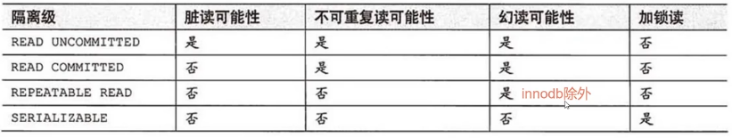
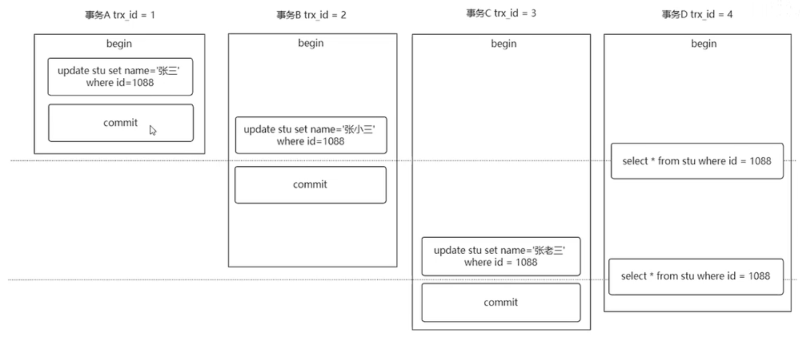
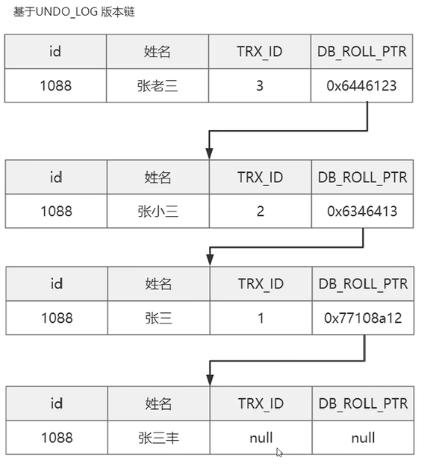
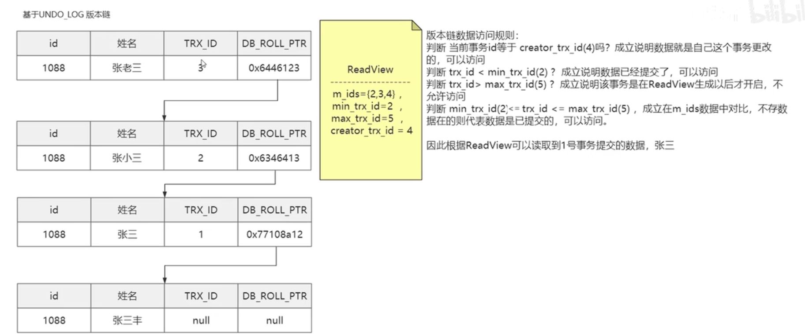
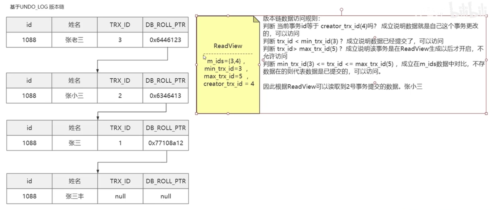
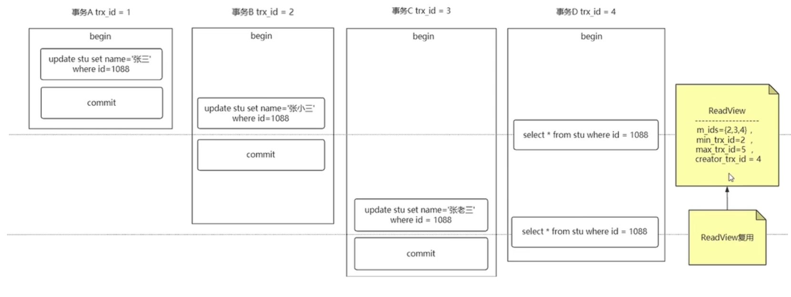
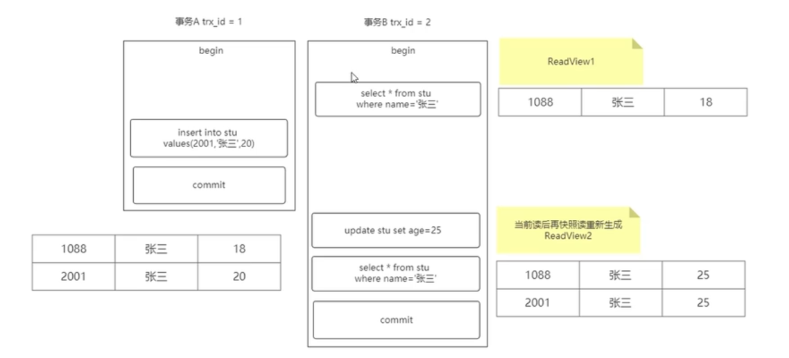

# MVCC-再学

- 主要参考自：https://www.bilibili.com/video/BV1hL411479T?from=search&seid=7688492991468626002&spm_id_from=333.337.0.0
- 看完后应该了解：
  - InnoDB如何实现MVCC？
    - undo log + ReadView
  - 什么是当前读？快照读？
  - 为什么RC和RR下会产生不同的结果？
    - RC：会出现不可重复读
    - RR：
      - 快照读：部分解决幻读，解决不可重复读
      - 当前读：使用Next Key Lock机制解决幻读，解决不可重复读
    - 根本原因：ReadView生成时机的不同！
  - RR级别，当前读如何实现？
    - 使用Next Key Lock实现当前读，也就是record lock + gap lock
  - RR级别，快照读如何实现？
    - 使用MVCC实现

# 1. 概述

- 高并发下：事务会出现什么问题？
  - 脏读
  - 丢失修改
  - 不可重复读
  - 幻读
- 如何解决这些问题：
  - MySQL提供了四种隔离级别：
  - 

- 什么是MVCC？
  - MVCC是基于 数据版本 对并发事务进行访问
  - 一种提高并发的技术。最早的数据库系统，只有读读之间可以并发，读写，写读，写写都要阻塞。引入多版本之后，只有写写之间相互阻塞，其他三种操作都可以并行，这样就可以大幅度提高了InnoDB的并发度。
  - 在MySQL InnoDB存储引擎下RC、RR基于MVCC进行并发事务控制

# 2. 实例讲解

- 
- 在RR级别时：事务D得到的结果：都是 张三
- 在RC级别时：事务D得到了：select1=张三 ，select2=张小三
- RC级别下出现了 不可重复读

## 2.1 UNDO_LOG

- 查看该实例的版本链

- 
- UNDO_LOG不是会被删除吗？中间数据万一被删了版本链不就断了？
  - UNDO_ LOG版本链不是立即删除，
  - MySQL确保版本链数据不再被“引用"后再进行删除。

## 2.2 ReadView

- 什么是ReadView？
  - 就是一个数据结构，辅助MVCC进行判断读取那个数据
- ReadView有什么用？
  - ReadView可以在快照读SQL执行时为MVCC提供数据依据
  - 也就是说只有快照读的时候 通过ReadView来实现MVCC
- 什么是快照读？
  - 最普通的Select查询语句
  - 在RR级别下，使用MVCC进行数据读取
- 什么是当前读？
  - 执行下列语句时，进行数据读取的方式
  - insert、update、delete、select ... for update、select ... lock in share mode
  - 在RR级别下，使用Next Key Lock进行数据读取
- ReadView的具体组成？
  - 是一个数据结构，包含4个字段
    - m_ids：当前活跃的事务编号集合
    - min_trx_id：最小活跃事务编号
    - max_trx_id：预分配事务编号，当前最大事务编号+1
    - creator_trx_id：ReadView创建者的事务编号
- ReadView何时创建？
  - 读已提交(RC)：在每次执行快照读时生成一个全新的ReadView
  - 可重复读(RR)：在第一次执行快照读的时候生成ReadView，后续快照读复用

## 2.3 ReadView创建时机-RC级别

- **读已提交(RC)：在每次执行快照读时生成一个全新的ReadView**

- 
- 此时如何查询数据？
  - 根据undo log版本链+ReadView进行数据提取
  - 
  - 
- 小结：
  - 在读已提交的隔离级别下：会存在不可重复读问题！
  - 为什么？ReadView的创建时机产生的问题

## 2.4 ReadView创建时机-RR级别

- **可重复读(RR)：在第一次执行快照读的时候生成ReadView，后续快照读复用**(有例外)
- 
- 此时查询数据？
  - 和RC级别类似，但是因为ReadView被复用了，因此可以解决不可重复读问题
- RR级别下使用MVCC能够避免幻读吗？
  - 能，但是不完全能
  - 为什么？
    - 因为MVCC不是通过锁的机制完全来数据和事务进行隔离
    - 而是采用版本控制的方式变相的解决幻读的问题，因为ReadView没有发生变化，那么无论其他事务是否进行过增删改查，都不会影响本事务的查询
- RR级别下使用MVCC为什么会产生幻读？
  - 连续多次快照读，ReadView会产生复用，没有幻读
  - **特例：当两次快照读之间存在当前读，ReadView会重新生成，导致产生幻读**

## 2.5　幻读产生实例

- **当两次快照读之间存在当前读，ReadView会重新生成，导致产生幻读**
- 

