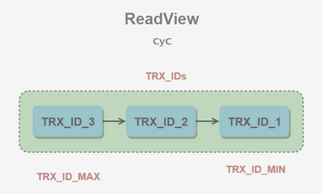

# MySQL再概览

- 主要参考自：http://www.cyc2018.xyz
- 前提知识：
  - MySQL的基本的CRUD都知道
  - MySQL的进阶知识略了解：优化、原理、并发
- 主要学习：
  - MySQL是怎么处理多线程？怎么加快搜索？
  - MySQL设计原理、并发处理、索引优化

# 1. 事务

- 什么是事务？
  - **事务指的是满足 ACID 特性的一组操作**，可以通过 Commit 提交一个事务，也可以使用 Rollback 进行回滚。
  - 要不不提交，要不全部提交
- 什么是ACID？
  - Atomicity：原子性：**事务是最小的执行单位，不允许分割。**
    - 事务被视为不可分割的最小单元，事务的所有操作要么全部提交成功，要么全部失败回滚。
    - 回滚可以用回滚日志（Undo Log）来实现，回滚日志记录着事务所执行的修改操作，在回滚时反向执行这些修改操作即可
  - Consistency：一致性：**执行事务前后，数据保持一致**
    - 数据库在事务执行前后都保持一致性状态。在一致性状态下，所有事务对同一个数据的读取结果都是相同的。
  - Isolation：隔离性：**访问数据库时，一个用户的事务不会被其他事务所干扰**
    - 一个事务所做的修改在最终提交以前，对其它事务是不可见的。
  - Durability：持久性：**一个事务被提交后，对数据库中的数据的改变是持久的**
    - 一旦事务提交，则其所做的修改将会永远保存到数据库中。即使系统发生崩溃，事务执行的结果也不能丢失。
    - 系统发生崩溃可以用重做日志（Redo Log）进行恢复，从而实现持久性。与回滚日志记录数据的逻辑修改不同，重做日志记录的是数据页的物理修改。
- ACID的关系？
  - ACID是相互交织的！
  - 只有满足了一致性，事务的执行结果才是正确的
  - 在无并发的情况下，事务串行执行，隔离性一定能够满足，此时只要能够满足原子性，就一定能够满足一致性
  - 在并发情况下，多个事务并行执行，事务不仅要满足原子性，还需要满足隔离性，才能满足一致性
  - 事务满足持久化是为了能够处理系统奔溃的情况
  - 
- MySQL如何开启事务？
  - MySQL 默认采用自动提交模式。也就是说，如果不显式使用`START TRANSACTION`语句来开始一个事务，那么每个查询操作都会被当做一个事务并自动提交。

# 2. 并发一致性问题

- 为什么会产生并发一致性问题？
  - 在并发环境下，事务的隔离性很难保证，因此导致出现很多并发一致性问题！
  - 也就是并发环境下，破坏了事务的隔离性！从而导致一致性也遭到了破坏
- 如何解决并发一致性问题？
  - 问题的核心是隔离性的保持
  - 通过并发控制来保证隔离性
- 如何进行并发控制？
  - 并发控制可以通过锁机制来实现，但是锁操作如果让用户自己控制，就会很复杂
  - MySQL提供了事务的隔离级别，让用户更轻松的处理并发一致性问题

## 2.1 丢失修改

- 丢失修改指一个事务的更新操作被另外一个事务的更新操作替换。
- 一般在现实生活中常会遇到，例如：T1 和 T2 两个事务都对一个数据进行修改，T1 先修改并提交生效，T2 随后修改，T2 的修改覆盖了 T1 的修改。
- 

## 2.2 脏读

- 读脏数据指在不同的事务下，当前事务可以读到另外事务未提交的数据。
- 例如：T1 修改一个数据但未提交，T2 随后读取这个数据。如果 T1 撤销了这次修改，那么 T2 读取的数据是脏数据。
- 

## 2.3 不可重复读

- 不可重复读指在一个事务内多次读取同一数据集合。在这一事务还未结束前，另一事务也访问了该同一数据集合并做了修改，由于第二个事务的修改，第一次事务的两次读取的数据可能不一致。
- 例如：T2 读取一个数据，T1 对该数据做了修改。如果 T2 再次读取这个数据，此时读取的结果和第一次读取的结果不同。
- 

## 2.4 幻读

- 一个事务内多次读取数据，在这个事务还没有结束时，此时另一个事务插入了一些数据，在第一个事务中的两次读数据之间，第二个事务的插入导致第一个事务两次读取的数据多了原本不存在的记录，就好像发生了幻觉，因此被称为幻读

- 幻读本质上也属于不可重复读的情况，T1 读取某个范围的数据，T2 在这个范围内插入新的数据，T1 再次读取这个范围的数据，此时读取的结果和和第一次读取的结果不同。
- 

# 3. 锁

## 3.1 封锁粒度

- MySQL提供了两种封锁粒度
  - 行级锁
  - 表级锁
- 应该尽量只锁定需要修改的那部分数据，而不是所有的资源。锁定的数据量越少，发生锁争用的可能就越小，系统的并发程度就越高。
- 但是加锁需要消耗资源，锁的各种操作（包括获取锁、释放锁、以及检查锁状态）都会增加系统开销。因此封锁粒度越小，系统开销就越大。
- 在选择封锁粒度时，需要在锁开销和并发程度之间做一个权衡

## 3.2 封锁类型

- **读写锁：**
  - 互斥锁（Exclusive），简写为 X 锁，又称写锁。
  - 共享锁（Shared），简写为 S 锁，又称读锁。
  - 一个事务对数据对象 A 加了 X 锁，就可以对 A 进行读取和更新。加锁期间其它事务不能对 A 加任何锁。
  - 一个事务对数据对象 A 加了 S 锁，可以对 A 进行读取操作，但是不能进行更新操作。加锁期间其它事务能对 A 加 S 锁，但是不能加 X 锁。
- **意向锁：**
  - 使用意向锁（Intention Locks）可以更容易地支持多粒度封锁。
  - 为什么会有意向锁？
    - 在存在行级锁和表级锁的情况下，事务 T 想要对表 A 加 X 锁，就需要先检测是否有其它事务对表 A 或者表 A 中的任意一行加了锁，那么就需要对表 A 的每一行都检测一次，这是非常耗时的。
  - 意向锁的使用：
    - 意向锁在原来的 X/S 锁之上引入了 IX/IS，IX/IS 都是表锁，用来表示一个事务想要在表中的某个数据行上加 X 锁或 S 锁。有以下两个规定：
      - 一个事务在获得某个数据行对象的 S 锁之前，必须先获得表的 IS 锁或者更强的锁；
      - 一个事务在获得某个数据行对象的 X 锁之前，必须先获得表的 IX 锁。
    - 通过引入意向锁，事务 T 想要对表 A 加 X 锁，只需要先检测是否有其它事务对表 A 加了 X/IX/S/IS 锁，如果加了就表示有其它事务正在使用这个表或者表中某一行的锁，因此事务 T 加 X 锁失败。节省时间！
- **各种锁的兼容关系：**
  - 
  - 任意 IS/IX 锁之间都是兼容的，因为它们只表示想要对表加锁，而不是真正加锁；
  - 这里兼容关系针对的是表级锁，而表级的 IX 锁和行级的 X 锁兼容，两个事务可以对两个数据行加 X 锁。（事务 T1 想要对数据行 R1 加 X 锁，事务 T2 想要对同一个表的数据行 R2 加 X 锁，两个事务都需要对该表加 IX 锁，但是 IX 锁是兼容的，并且 IX 锁与行级的 X 锁也是兼容的，因此两个事务都能加锁成功，对同一个表中的两个数据行做修改。）

## 3.3 封锁协议

- **一级封锁协议：**

  - 事务 T 要修改数据 A 时必须加 X 锁，直到 T 结束才释放锁。
  - 可以解决丢失修改问题，因为不能同时有两个事务对同一个数据进行修改，那么事务的修改就不会被覆盖。
  - 

- **二级封锁协议：**

  - 在一级的基础上，要求读取数据 A 时必须加 S 锁，读取完马上释放 S 锁。
  - 可以解决读脏数据问题，因为如果一个事务在对数据 A 进行修改，根据 1 级封锁协议，会加 X 锁，那么就不能再加 S 锁了，也就是不会读入数据。
  - 

- **三级封锁协议：**

  - 在二级的基础上，要求读取数据 A 时必须加 S 锁，直到事务结束了才能释放 S 锁。
  - 可以解决不可重复读的问题，因为读 A 时，其它事务不能对 A 加 X 锁，从而避免了在读的期间数据发生改变。
  - 

- **两阶段锁协议：**

  - 加锁和解锁分为两个阶段进行。
  - 什么是可串行化调度？
    - 可串行化调度是指，通过并发控制，使得并发执行的事务结果与某个串行执行的事务结果相同。串行执行的事务互不干扰，不会出现并发一致性问题。
  - 事务如何遵循两阶段锁协议？
    - 事务遵循两段锁协议是保证可串行化调度的充分条件。

- **MySQL如何上锁？**

  - MySQL 的 InnoDB 存储引擎采用两段锁协议，会根据隔离级别在需要的时候自动加锁，并且所有的锁都是在同一时刻被释放，这被称为隐式锁定。

  - InnoDB 也可以使用特定的语句进行显示锁定：

    - ```mysql
      SELECT ... LOCK In SHARE MODE;
      SELECT ... FOR UPDATE;
      ```

# 4. 隔离级别

- **读未提交(Read Uncommitted)：**
  - 最低的隔离级别，允许读取尚未提交的数据变更，所以可能会导致：脏读、不可重复读、幻读
    - 脏读：一个事务中修改了数据并且未提交，另一个事务读取到了修改未提交的数据
    - 不可重复读：一个事务中多次读取数据，另一个事务中修改了数据并提交了，导致第一个事务两次读取结果不一样
    - 幻读：一个事务中多次读取数据，另一个事务中新增或者修改了数据，导致第一个事务两次读取的结果数量上不一样
- **读已提交(Read Committed)：**

  - 允许读取并发事务已经提交的数据，可以阻止脏读，可能会导致：不可重复读、幻读
- **可重复读(Repeatable read)：**

  - 对同一字段的多次读取结果是一致的，除非数据是被本身事务自己修改，可以阻止脏读和不可重复读，可能会导致幻读
- **可串行化(Serializable)：**

  - 最高隔离级别，完全服从ACID，所有的事务依次执行，这样的事务不可能产生干扰，可以防止脏读、不可重复读、幻读
- 

# 5. MVCC

- 什么是MVCC？

  - 多版本并发控制（Multi-Version Concurrency Control, MVCC）是 MySQL 的 InnoDB  存储引擎实现隔离级别的一种具体方式，用于实现提交读和可重复读这两种隔离级别。RR、RC
  - 而未提交读隔离级别总是读取最新的数据行，要求很低，无需使用  MVCC。RU
  - 可串行化隔离级别需要对所有读取的行都加锁，单纯使用 MVCC 无法实现。S

- MVCC基本思想？为什么需要MVCC？

  - 实际场景：读操作多于写操作，为了实现事务的隔离性，需要加读写锁来实现，但是此时读读不互斥，读写互斥，效率不高！
  - MVCC：利用多版本的思想：
    - 写操作时更新最新的版本快照
    - 读操作时去读旧版本快照
    - 从而解开读写锁中的读写互斥，自此可以读读、读写、写读同时进行，提升效率！
  - 脏读和不可重复读最根本的原因是事务读取到其它事务未提交的修改。在事务进行读取操作时，为了解决脏读和不可重复读问题，MVCC 规定只能读取已经提交的快照。当然一个事务可以读取自身未提交的快照，这不算是脏读。

- 什么是快照？

  - 一个数据的完整可用的拷贝，数据的一个副本！

- 什么是版本号？

  - 系统版本号 SYS_ID：是一个递增的数字，每开始一个新的事务，系统版本号就会自动递增。
  - 事务版本号 TRX_ID ：事务开始时的系统版本号。

- 什么是Undo log？

  - MVCC 的多版本指的是多个版本的快照，快照存储在 Undo 日志中，该日志通过回滚指针 ROLL_PTR 把一个数据行的所有快照连接起来。

  - 实例：

    - 例如在 MySQL 创建一个表 t，包含主键 id 和一个字段 x。我们先插入一个数据行，然后对该数据行执行两次更新操作。

    - ```mysql
      INSERT INTO t(id, x) VALUES(1, "a");
      UPDATE t SET x="b" WHERE id=1;
      UPDATE t SET x="c" WHERE id=1;
      ```

    - 因为没有使用 `START TRANSACTION` 将上面的操作当成一个事务来执行，根据 MySQL 的  AUTOCOMMIT 机制，每个操作都会被当成一个事务来执行，所以上面的操作总共涉及到三个事务。快照中除了记录事务版本号 TRX_ID  和操作之外，还记录了一个 bit 的 DEL 字段，用于标记是否被删除。

    - 

    - INSERT、UPDATE、DELETE 操作会创建一个日志，并将事务版本号 TRX_ID  写入。DELETE 可以看成是一个特殊的 UPDATE，还会额外将 DEL 字段设置为 1。

- 什么是ReadView？

  - MVCC维护的一个数据结构
  - 主要包含了当前系统未提交的事务列表 TRX_IDs {TRX_ID_1, TRX_ID_2, ...}，还有该列表的最小值 TRX_ID_MIN 和 TRX_ID_MAX。
  - 

- ReadView有什么用？

  - 联系Undo log中的快照进行版本控制！判断到底应该读取哪个旧版本中的数据(快照)，从而避免读写互斥！
  - 具体算法：
    - 在进行 SELECT 操作时，根据数据行快照的 TRX_ID 与 TRX_ID_MIN 和 TRX_ID_MAX 之间的关系，从而判断数据行快照是否可以使用：
    - TRX_ID < TRX_ID_MIN，表示该数据行快照时在当前所有未提交事务之前进行更改的，因此可以使用。
    - TRX_ID > TRX_ID_MAX，表示该数据行快照是在事务启动之后被更改的，因此不可使用。
    - TRX_ID_MIN <= TRX_ID <= TRX_ID_MAX，需要根据隔离级别再进行判断：
      - 提交读：如果 TRX_ID  在 TRX_IDs  列表中，表示该数据行快照对应的事务还未提交，则该快照不可使用。否则表示已经提交，可以使用。
      - 可重复读：都不可以使用。因为如果可以使用的话，那么其它事务也可以读到这个数据行快照并进行修改，那么当前事务再去读这个数据行得到的值就会发生改变，也就是出现了不可重复读问题。
    - 在数据行快照不可使用的情况下，需要沿着 Undo Log 的回滚指针 ROLL_PTR  找到下一个快照，再进行上面的判断。

- 什么是快照读？什么是当前读？

  - 快照读：MVCC 的 SELECT 操作是快照中的数据，不需要进行加锁操作。

  - 当前读：MVCC 其它会对数据库进行修改的操作（INSERT、UPDATE、DELETE）需要进行加锁操作，从而读取最新的数据。

    - 在进行 SELECT 操作时，可以强制指定进行加锁操作。以下第一个语句需要加 S 锁，第二个需要加 X 锁。

    - ```mysql
      SELECT * FROM table WHERE ? lock in share mode;
      SELECT * FROM table WHERE ? for update;
      ```

- 为什么RC级别下MVCC会产生不可重复读？而在RR级别下MVCC可以解决不可重复读和避免部分幻读？

  - 根本原因是：ReadView生成的时机不懂导致的！
  - RC级别下：在每次执行快照读时生成一个全新的ReadView
  - RR级别下：在第一次执行快照读的时候生成ReadView，后续快照读复用，
    - 当两次快照读之间存在当前读，ReadView会重新生成，导致产生幻读

- MVCC小结：

  - 可以看到 MVCC 并不是完全不用加锁，而只是避免了 SELECT 的加锁操作。
  - **也就是：快照读可以实现读写不互斥，但是当前读还是需要加锁！**
  - MVCC的实现原理：
    - 每行数据都存在一个版本
    - 每次数据更新时都更新该版本
    - 每次数据修改时，就复制出当前版本，然后可以随意修改，各个事务之间无干扰
    - 每次数据保存时，比较版本号，
      - 如果成功就commit，覆盖原记录
      - 如果失败就放弃,回滚数据
    - 每行都有版本号，保存时根据版本号决定是否成功，**听起来含有乐观锁的味道, 因为这看起来正是，在提交的时候才能知道到底能否提交成功**

# 6. Next-Key Locks

- 什么是Next-Key Locks？

  - Next-Key Locks 是 MySQL 的 InnoDB 存储引擎的一种锁实现。

- 为什么需要Next-Key Locks？

  - MVCC 不能解决幻影读问题，Next-Key Locks 就是为了解决这个问题而存在的。
  - 在可重复读（REPEATABLE READ）隔离级别下，使用 MVCC + Next-Key Locks 可以解决幻读问题

- 什么是Record Locks？

  - 锁定一个记录上的索引，而不是记录本身。
  - 如果表没有设置索引，InnoDB 会自动在主键上创建隐藏的聚簇索引，因此 Record Locks 依然可以使用。

- 什么是Gap Locks？

  - 锁定索引之间的间隙，但是不包含索引本身。例如当一个事务执行以下语句，其它事务就不能在 t.c 中插入 15。

  - ```mysql
    SELECT c FROM t WHERE c BETWEEN 10 and 20 FOR UPDATE;
    ```

- 什么是Next-Key Locks？

  - 它是 Record Locks 和 Gap Locks 的结合，不仅锁定一个记录上的索引，也锁定索引之间的间隙。它锁定一个前开后闭区间，例如一个索引包含以下值：10, 11, 13, and 20，那么就需要锁定以下区间：

  - ```mysql
    (-∞, 10]
    (10, 11]
    (11, 13]
    (13, 20]
    (20, +∞)
    ```

# 7. 关系数据库设计理论

- 什么是函数依赖？

  - 记 A->B 表示 A 函数决定 B，也可以说 B 函数依赖于 A。
  - 如果 {A1，A2，... ，An} 是关系的一个或多个属性的集合，该集合函数决定了关系的其它所有属性并且是最小的，那么该集合就称为**键码**。
  - 对于 A->B，如果能找到 A 的真子集 A'，使得 A'-> B，那么 A->B 就是部分函数依赖，否则就是完全函数依赖。
  - 对于 A->B，B->C，则 A->C 是一个传递函数依赖

- 数据库设计异常？

  - 以下的学生课程关系的函数依赖为 {Sno, Cname} -> {Sname, Sdept, Mname, Grade}，键码为 {Sno, Cname}。也就是说，确定学生和课程之后，就能确定其它信息。

  - | Sno  | Sname  | Sdept  | Mname  | Cname  | Grade |
    | :--: | :----: | :----: | :----: | :----: | :---: |
    |  1   | 学生-1 | 学院-1 | 院长-1 | 课程-1 |  90   |
    |  2   | 学生-2 | 学院-2 | 院长-2 | 课程-2 |  80   |
    |  2   | 学生-2 | 学院-2 | 院长-2 | 课程-1 |  100  |
    |  3   | 学生-3 | 学院-2 | 院长-2 | 课程-2 |  95   |

  - 不符合范式的关系，会产生很多异常，主要有以下四种异常：

    - **冗余数据**：例如 `学生-2` 出现了两次。
    - **修改异常**：修改了一个记录中的信息，但是另一个记录中相同的信息却没有被修改。
    - **删除异常**：删除一个信息，那么也会丢失其它信息。例如删除了 `课程-1` 需要删除第一行和第三行，那么 `学生-1` 的信息就会丢失。
    - **插入异常**：例如想要插入一个学生的信息，如果这个学生还没选课，那么就无法插入。

- 什么是范式？

  - 范式理论是为了解决以上提到四种异常。高级别范式的依赖于低级别的范式，1NF 是最低级别的范式。

  - **第一范式 (1NF)**

    - 属性不可分。

  - **第二范式 (2NF)**

    - 每个非主属性完全函数依赖于键码。

    - 可以通过分解来满足

    - 实例：以上学生课程关系中，{Sno, Cname} 为键码，有如下函数依赖：

      - Sno -> Sname, Sdept
      - Sdept -> Mname
      - Sno, Cname-> Grade
      - Grade 完全函数依赖于键码，它没有任何冗余数据，每个学生的每门课都有特定的成绩。
      - Sname, Sdept 和 Mname 都部分依赖于键码，当一个学生选修了多门课时，这些数据就会出现多次，造成大量冗余数据。

    - 分解后：

      - | Sno  | Sname  | Sdept  | Mname  |
        | :--: | :----: | :----: | :----: |
        |  1   | 学生-1 | 学院-1 | 院长-1 |
        |  2   | 学生-2 | 学院-2 | 院长-2 |
        |  3   | 学生-3 | 学院-2 | 院长-2 |

      - 有以下函数依赖：

        - Sno -> Sname, Sdept
        - Sdept -> Mname

      - | Sno  | Cname  | Grade |
        | :--: | :----: | :---: |
        |  1   | 课程-1 |  90   |
        |  2   | 课程-2 |  80   |
        |  2   | 课程-1 |  100  |
        |  3   | 课程-2 |  95   |

      - 有以下函数依赖：

        - Sno, Cname ->  Grade

  - **第三范式 (3NF)**

    - 非主属性不传递函数依赖于键码。

    - 实例：上面的 关系中存在以下传递函数依赖：
      - Sno -> Sdept -> Mname

    - 可以进行以下分解：

    - | Sno  | Sname  | Sdept  |
      | :--: | :----: | :----: |
      |  1   | 学生-1 | 学院-1 |
      |  2   | 学生-2 | 学院-2 |
      |  3   | 学生-3 | 学院-2 |

    - | Sdept  | Mname  |
      | :----: | :----: |
      | 学院-1 | 院长-1 |
      | 学院-2 | 院长-2 |

# 8. ER图

- 什么是ER图？
  - Entity-Relationship，有三个组成部分：实体、属性、联系。
  - 用来进行关系型数据库系统的概念设计。
- 实体的联系？
  - 包含一对一，一对多，多对多三种。
    - 如果 A 到 B 是一对多关系，那么画个带箭头的线段指向 B；
    - 如果是一对一，画两个带箭头的线段；
    - 如果是多对多，画两个不带箭头的线段。
  - 如何表示出现多次的关系？
    - 一个实体在联系出现几次，就要用几条线连接。
    - 下图表示一个课程的先修关系，先修关系出现两个 Course 实体，第一个是先修课程，后一个是后修课程，因此需要用两条线来表示这种关系。
    - 
- 联系的多向性？
  - 虽然老师可以开设多门课，并且可以教授多名学生，但是对于特定的学生和课程，只有一个老师教授，这就构成了一个三元联系。
  - 
- 表示子类？
  - 用一个三角形和两条线来连接类和子类，与子类有关的属性和联系都连到子类上，而与父类和子类都有关的连到父类上。
  - 

# 9. 索引

- 为什么需要索引？
  - 数据库的目标是什么？存储数据、查找数据
  - 索引的目的就是为了加速查找数据的过程
- 如何加速查找数据的过程？
  - Hash？
  - 排序？

## 9.1 B+树原理

- B+树的数据结构？
  - B Tree 指的是 Balance Tree，也就是平衡树。平衡树是一颗查找树，并且所有叶子节点位于同一层。
  - B+ Tree 是基于 B Tree 和叶子节点顺序访问指针进行实现，它具有 B Tree 的平衡性，并且通过顺序访问指针来提高区间查询的性能。
  - 在 B+ Tree 中，一个节点中的 key 从左到右非递减排列，如果某个指针的左右相邻 key 分别是 keyi 和 keyi+1，且不为 null，则该指针指向节点的所有 key 大于等于 keyi 且小于等于 keyi+1。
  - 
- B+树的操作？
  - 进行查找操作时，首先在根节点进行二分查找，找到一个 key 所在的指针，然后递归地在指针所指向的节点进行查找。直到查找到叶子节点，然后在叶子节点上进行二分查找，找出 key 所对应的 data。
  - 插入删除操作会破坏平衡树的平衡性，因此在进行插入删除操作之后，需要对树进行分裂、合并、旋转等操作来维护平衡性。
- 相比于红黑树？
  - 红黑树等平衡树也可以用来实现索引，但是文件系统及数据库系统普遍采用 B+ Tree 作为索引结构，这是因为使用 B+ 树访问磁盘数据有更高的性能。
  - B+ 树有更低的树高：
    - 平衡树的树高 O(h)=O(logdN)，其中 d 为每个节点的出度。红黑树的出度为 2，而 B+ Tree 的出度一般都非常大，所以红黑树的树高 h 很明显比 B+ Tree 大非常多。
  - 磁盘访问原理：
    - 操作系统一般将内存和磁盘分割成固定大小的块，每一块称为一页，内存与磁盘以页为单位交换数据。数据库系统将索引的一个节点的大小设置为页的大小，使得一次 I/O 就能完全载入一个节点。
    - 如果数据不在同一个磁盘块上，那么通常需要移动制动手臂进行寻道，而制动手臂因为其物理结构导致了移动效率低下，从而增加磁盘数据读取时间。
    - B+ 树相对于红黑树有更低的树高，进行寻道的次数与树高成正比，在同一个磁盘块上进行访问只需要很短的磁盘旋转时间，所以 B+ 树更适合磁盘数据的读取。
  - 磁盘预读特性：
    - 为了减少磁盘 I/O 操作，磁盘往往不是严格按需读取，而是每次都会预读。预读过程中，磁盘进行顺序读取，顺序读取不需要进行磁盘寻道，并且只需要很短的磁盘旋转时间，速度会非常快。并且可以利用预读特性，相邻的节点也能够被预先载入。

## 9.2 MySQL索引

- 索引是在存储引擎层实现的，而不是在服务器层实现的，所以不同存储引擎具有不同的索引类型和实现。
- B+Tree 索引：
  - B+ Tree是大多数 MySQL 存储引擎的默认索引类型。因为不再需要进行全表扫描，只需要对树进行搜索即可，所以查找速度快很多。
  - 因为 B+ Tree 的有序性，所以除了用于查找，还可以用于排序和分组。可以指定多个列作为索引列，多个索引列共同组成键。
  - 适用于全键值、键值范围和键前缀查找，其中键前缀查找只适用于最左前缀查找。如果不是按照索引列的顺序进行查找，则无法使用索引。
  - InnoDB 的 B+Tree 索引分为主索引和辅助索引。**主索引的叶子节点 data 域记录着完整的数据记录，这种索引方式被称为聚簇索引**。因为无法把数据行存放在两个不同的地方，所以一个表只能有一个聚簇索引。辅助索引的叶子节点的 data 域记录着主键的值，因此在使用辅助索引进行查找时，需要先查找到主键值，然后再到主索引中进行查找。
- 哈希索引：
  - 哈希索引能以 O(1) 时间进行查找，但是失去了有序性：
    - 无法用于排序与分组；
    - 只支持精确查找，无法用于部分查找和范围查找。
  - InnoDB 存储引擎有一个特殊的功能叫“自适应哈希索引”，当某个索引值被使用的非常频繁时，会在 B+Tree 索引之上再创建一个哈希索引，这样就让 B+Tree 索引具有哈希索引的一些优点，比如快速的哈希查找。
- 全文索引：
  - MyISAM 存储引擎支持全文索引，用于查找文本中的关键词，而不是直接比较是否相等。
  - 查找条件使用 MATCH AGAINST，而不是普通的 WHERE。
  - 全文索引使用倒排索引实现，它记录着关键词到其所在文档的映射。
  - InnoDB 存储引擎在 MySQL 5.6.4 版本中也开始支持全文索引。
- 空间数据索引：
  - MyISAM 存储引擎支持空间数据索引（R-Tree），可以用于地理数据存储。空间数据索引会从所有维度来索引数据，可以有效地使用任意维度来进行组合查询。
  - 必须使用 GIS 相关的函数来维护数据。

## 9.3 索引优化

- 独立的列：
  - 在进行查询时，索引列不能是表达式的一部分，也不能是函数的参数，否则无法使用索引。
- 多列索引：
  - 在需要使用多个列作为条件进行查询时，使用多列索引比使用多个单列索引性能更好。
- 索引列的顺序：
  - 让选择性最强的索引列放在前面。、
  - 索引的选择性是指：不重复的索引值和记录总数的比值。最大值为 1，此时每个记录都有唯一的索引与其对应。选择性越高，每个记录的区分度越高，查询效率也越高。
- 前缀索引：
  - 对于 BLOB、TEXT 和 VARCHAR 类型的列，必须使用前缀索引，只索引开始的部分字符。
  - 前缀长度的选取需要根据索引选择性来确定。
- 覆盖索引：
  - 索引包含所有需要查询的字段的值。
  - 优点：
    - 索引通常远小于数据行的大小，只读取索引能大大减少数据访问量。
    - 一些存储引擎（例如 MyISAM）在内存中只缓存索引，而数据依赖于操作系统来缓存。因此，只访问索引可以不使用系统调用（通常比较费时）。
    - 对于 InnoDB 引擎，若辅助索引能够覆盖查询，则无需访问主索引。
- 索引的优点：
  - 大大减少了服务器需要扫描的数据行数。
  - 帮助服务器避免进行排序和分组，以及避免创建临时表（B+Tree 索引是有序的，可以用于 ORDER BY 和 GROUP BY 操作。临时表主要是在排序和分组过程中创建，不需要排序和分组，也就不需要创建临时表）。
  - 将随机 I/O 变为顺序 I/O（B+Tree 索引是有序的，会将相邻的数据都存储在一起）。
- 索引的使用条件：
  - 对于非常小的表、大部分情况下简单的全表扫描比建立索引更高效；
  - 对于中到大型的表，索引就非常有效；
  - 但是对于特大型的表，建立和维护索引的代价将会随之增长。这种情况下，需要用到一种技术可以直接区分出需要查询的一组数据，而不是一条记录一条记录地匹配，例如可以使用分区技术

# 10. 查询性能优化

- 建议可以先看[mysql进阶](./2_mysql进阶.md)

- 如何进行查询语句的性能分析？	
  - 开发人员可以通过分析 Explain 结果来优化查询语句。
  - 比较重要的字段有：
    - select_type : 查询类型，有简单查询、联合查询、子查询等
    - key : 使用的索引
      - 类型从好到坏的排列：system>const>eq_ref>ref>range>index>ALL
    - rows : 扫描的行数
- 优化数据访问？
  - **减少请求的数据量**
    - 只返回必要的列：最好不要使用 SELECT * 语句。
    - 只返回必要的行：使用 LIMIT 语句来限制返回的数据。
    - 缓存重复查询的数据：使用缓存可以避免在数据库中进行查询，特别在要查询的数据经常被重复查询时，缓存带来的查询性能提升将会是非常明显的。
  - **减少服务器端扫描的行数**
    - 最有效的方式是使用索引来覆盖查询
- 重构查询方式？
  - **切分大查询**
    - 一个大查询如果一次性执行的话，可能一次锁住很多数据、占满整个事务日志、耗尽系统资源、阻塞很多小的但重要的查询。
  - **分解大连接查询**
    - 将一个大连接查询分解成对每一个表进行一次单表查询，然后在应用程序中进行关联，这样做的好处有：
      - 让缓存更高效。对于连接查询，如果其中一个表发生变化，那么整个查询缓存就无法使用。而分解后的多个查询，即使其中一个表发生变化，对其它表的查询缓存依然可以使用。
      - 分解成多个单表查询，这些单表查询的缓存结果更可能被其它查询使用到，从而减少冗余记录的查询。
      - 减少锁竞争；
      - 在应用层进行连接，可以更容易对数据库进行拆分，从而更容易做到高性能和可伸缩。
      - 查询本身效率也可能会有所提升。

# 11. 存储引擎

- **InnoDB：**
  - 是 MySQL 默认的事务型存储引擎，只有在需要它不支持的特性时，才考虑使用其它存储引擎。
  - 实现了四个标准的隔离级别，默认级别是可重复读（REPEATABLE READ）。在可重复读隔离级别下，通过多版本并发控制（MVCC）+ Next-Key Locking 防止幻读。
  - 主索引是聚簇索引，在索引中保存了数据，从而避免直接读取磁盘，因此对查询性能有很大的提升。
  - 内部做了很多优化，包括从磁盘读取数据时采用的可预测性读、能够加快读操作并且自动创建的自适应哈希索引、能够加速插入操作的插入缓冲区等。
  - 支持真正的在线热备份。其它存储引擎不支持在线热备份，要获取一致性视图需要停止对所有表的写入，而在读写混合场景中，停止写入可能也意味着停止读取。
- **MyISAM：**
  - 设计简单，数据以紧密格式存储。对于只读数据，或者表比较小、可以容忍修复操作，则依然可以使用它。
  - 提供了大量的特性，包括压缩表、空间数据索引等。
  - 不支持事务。
  - 不支持行级锁，只能对整张表加锁，读取时会对需要读到的所有表加共享锁，写入时则对表加排它锁。但在表有读取操作的同时，也可以往表中插入新的记录，这被称为并发插入（CONCURRENT INSERT）。
  - 可以手工或者自动执行检查和修复操作，但是和事务恢复以及崩溃恢复不同，可能导致一些数据丢失，而且修复操作是非常慢的。
  - 如果指定了 DELAY_KEY_WRITE  选项，在每次修改执行完成时，不会立即将修改的索引数据写入磁盘，而是会写到内存中的键缓冲区，只有在清理键缓冲区或者关闭表的时候才会将对应的索引块写入磁盘。这种方式可以极大的提升写入性能，但是在数据库或者主机崩溃时会造成索引损坏，需要执行修复操作。
- **MyISAN和InnoDB对比**
  - 事务：InnoDB支持事务，MyISAM不支持事务
  - 并发：InnoDB支持更细的锁粒度，MyISAM只支持表级锁
  - 外键：InnoDB支持外键，MyISAM不支持
    - 一般也不使用外键，一般在应用层面进行连接！
  - 备份：InnoDB支持在线热备份，MyISAM不支持
  - 崩溃恢复：MyISAM 崩溃后发生损坏的概率比 InnoDB 高很多，而且恢复的速度也更慢。
  - 其他：MyISAM 支持压缩表和空间数据索引。

# 12. 数据类型

- **整型：**
  - TINYINT, SMALLINT, MEDIUMINT, INT, BIGINT 分别使用 8, 16, 24, 32, 64 位存储空间，一般情况下越小的列越好。
  - INT(11) 中的数字只是规定了交互工具显示字符的个数，对于存储和计算来说是没有意义的。
- **浮点数：**
  - FLOAT 和 DOUBLE 为浮点类型，DECIMAL 为高精度小数类型。CPU 原生支持浮点运算，但是不支持 DECIMAl 类型的计算，因此 DECIMAL 的计算比浮点类型需要更高的代价。
  - FLOAT、DOUBLE 和 DECIMAL 都可以指定列宽，例如 DECIMAL(18, 9) 表示总共 18 位，取 9 位存储小数部分，剩下 9 位存储整数部分。
- **字符串：**
  - 主要有 CHAR 和 VARCHAR 两种类型，一种是定长的，一种是变长的。
  - VARCHAR 这种变长类型能够节省空间，因为只需要存储必要的内容。但是在执行 UPDATE 时可能会使行变得比原来长，当超出一个页所能容纳的大小时，就要执行额外的操作。MyISAM 会将行拆成不同的片段存储，而 InnoDB 则需要分裂页来使行放进页内。
  - 在进行存储和检索时，会保留 VARCHAR 末尾的空格，而会删除 CHAR 末尾的空格。
- **时间和日期：**
  - MySQL 提供了两种相似的日期时间类型：DATETIME 和 TIMESTAMP。
  - DATETIME：
    - 能够保存从 1000 年到 9999 年的日期和时间，精度为秒，使用 8 字节的存储空间。
    - 它与时区无关。
    - 默认情况下，MySQL 以一种可排序的、无歧义的格式显示 DATETIME 值，例如“2008-01-16 22:37:08”，这是 ANSI 标准定义的日期和时间表示方法。
  - TIMESTAMP
    - 和 UNIX 时间戳相同，保存从 1970 年 1 月 1 日午夜（格林威治时间）以来的秒数，使用 4 个字节，只能表示从 1970 年到 2038 年。
    - 它和时区有关，也就是说一个时间戳在不同的时区所代表的具体时间是不同的。
    - MySQL 提供了 FROM_UNIXTIME() 函数把 UNIX 时间戳转换为日期，并提供了 UNIX_TIMESTAMP() 函数把日期转换为 UNIX 时间戳。
    - 默认情况下，如果插入时没有指定 TIMESTAMP 列的值，会将这个值设置为当前时间。
    - 应该尽量使用 TIMESTAMP，因为它比 DATETIME 空间效率更高。

# 13. 切分

- **水平切分：**
  - 水平切分又称为 Sharding，它是将同一个表中的记录拆分到多个结构相同的表中。
  - 当一个表的数据不断增多时，Sharding 是必然的选择，它可以将数据分布到集群的不同节点上，从而缓存单个数据库的压力。
  - 
- **垂直切分：**
  - 垂直切分是将一张表按列切分成多个表，通常是按照列的关系密集程度进行切分，也可以利用垂直切分将经常被使用的列和不经常被使用的列切分到不同的表中。
  - 在数据库的层面使用垂直切分将按数据库中表的密集程度部署到不同的库中，例如将原来的电商数据库垂直切分成商品数据库、用户数据库等。
  - 
- **水平切分策略？sharding策略？**
  - 哈希取模：hash(key) % N；
  - 范围：可以是 ID 范围也可以是时间范围；
  - 映射表：使用单独的一个数据库来存储映射关系。
- **水平切分存在的问题？**
  - 事务问题：使用分布式事务来解决，比如 XA 接口。
  - 连接问题：可以将原来的连接分解成多个单表查询，然后在用户程序中进行连接。
  - ID唯一性问题：
    - 使用全局唯一 ID（GUID）
    - 为每个分片指定一个 ID 范围
    - 分布式 ID 生成器 (如 Twitter 的 Snowflake 算法)

# 14. 复制

## 14.1 主从复制

- 主要涉及三个线程：binlog 线程、I/O 线程和 SQL 线程。
  - **binlog 线程**  ：负责将主服务器上的数据更改写入二进制日志（Binary log）中。
  - **I/O 线程**  ：负责从主服务器上读取二进制日志，并写入从服务器的中继日志（Relay log）。
  - **SQL 线程**  ：负责读取中继日志，解析出主服务器已经执行的数据更改并在从服务器中重放（Replay）
  - 

## 14.2 读写分离

- 主服务器处理写操作以及实时性要求比较高的读操作，而从服务器处理读操作。
- 读写分离能提高性能的原因在于：
  - 主从服务器负责各自的读和写，极大程度缓解了锁的争用；
  - 从服务器可以使用 MyISAM，提升查询性能以及节约系统开销；
  - 增加冗余，提高可用性。
- 读写分离常用代理方式来实现，代理服务器接收应用层传来的读写请求，然后决定转发到哪个服务器。
  - 

