# Redis基础

- 主要参考自：https://www.bilibili.com/video/BV1S54y1R7SB?spm_id_from=333.999.0.0

## 1. Nosql概述

### 1.1 为什么要使用Nosql

> 1.单机MySQL的时代
> 
> - 90年代，一个基本的网站访问量一般不会太大，单个数据库完全足够

- 
- 那个时候，更多的去使用静态网页 Html-服务器根本没有太大的压力!思考一下，
- 这种情况下:整个网站的瓶颈是什么?
  - 数据量如果太大、一个机器放不下了!
  - 数据的索引（ B+ Tree ) ，一个机器内存也放不下，MySQL 300万数据的时候如果不建立索引，效率会很慢
  - 访问量=》读写混合、一个服务器承受不了

> 2.Memcached(缓存)+MySQL+垂直拆分(读写分离)

- 网站80%的情况都是在读取数据，每次都要去查询数据库的话就十分的麻烦，因此希望减轻数据的压力，可以使用缓存来保证效率

- 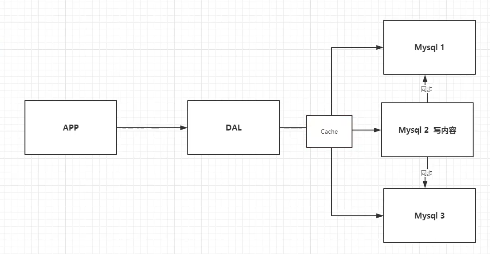

- 发展过程：
  
  - 优化数据结构和索引-》文件缓存(I/O)=》Memcached(当时最热门的技术)

> 3.分库分表+水平拆分(MySQL集群)

- 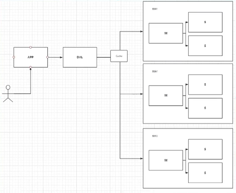
- 数据库的本质：读+写
  - MyISAM：表锁=》十分影响效率，高并发下回出现严重的锁的问题
  - InnoDB：行数
  - 再使用：cache解决读的问题，分库分表解决写的问题=》Mysql当时推出了表分区，但是并没有多少公司使用，提出了MySQL集群，很好的满足了那个年代的需求

> 4.如今

- MySQL等关系型数据库已经不够用了，数据量多、变化快
  - MySQL来存储一些比较大的文件，博客，图片!数据库表很大，效率就低了!
  - 如果有一种数据库来专门处理这种数据.MySQL压力就变得十分小
  - (研究如何处理这些问题!)
    - 如大数据的IO压力下，表结构几乎没法更改，如1亿数据量加列
- 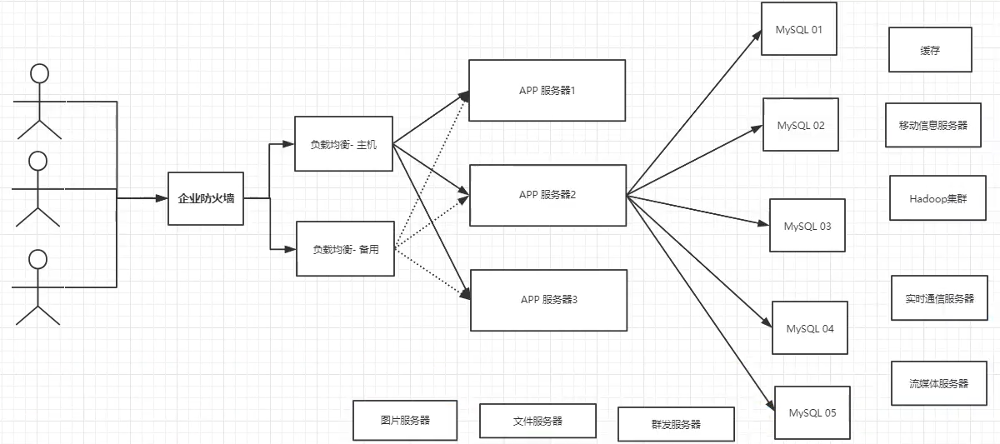

> 为什么要用NoSQL？

- 用户的个人信息，社交网络，地理位置。用户自己产生的数据，用户日志等等爆发式增长!
- 这时候我们就需要使用NoSQL数据库的，Nosql可以很好的处理以上的情况!

### 1.2 什么是NoSQL?

- NoSQL=Not Only SQL =>不仅仅是SQL
  
  - 泛指非关系型数据库，随着web2.0互联网的诞生!传统的关系型数据库很难对付web2.0时代!
  - 尤其是超大规模的高并发的社区!暴露出来很多难以克服的问题，NoSQL在当今大数据环境下发展的十分迅速，Redis是发展最快的，而且是当下必须要掌握的一个技术
  - 很多的数据类型：用户的个人信息，社交网络，地理位置。这些数据类型的存储不需要一个固定的格式!不需要多余的操作就可以横向扩展的，如：Map<String,Object>使用键值对来控制!

- NoSQL特点？
  
  - 方便扩展：数据之间没有关系，很好拓展！
  - 大数据量高性能(Redis 一秒写8万，读取11万，NoSQL的缓存记录级，细粒度的缓存，性能高)
  - 数据类型多样，不需要事先设计数据库！随取随用！（如果是数据量十分大的表，很多人就无法设计了）

- 传统的关系型数据库和NoSQL？
  
  - ```xml
    传统的RDBMS
    - 结构化组织
    - SQL
    - 数据和关系都存在单独的表种
    - DML、DCL
    - 严格的一致性
    - 基础的事务
    -...
    ```
  
  - ```xml
    NoSQL
    - 不仅仅是数据
    - 没有固定的查询语言
    - 键值对存储，列存储，文档存储，图形数据库
    - 最终一致性
    - CAP定理和BASE =》异地多活，
    - 高性能、高可用、高可扩
    - ....
    ```

- 了解3V+3高？
  
  - 大数据时代的3V:
    - 主要是描述问题的
    - 1.海量Volume
    - 2多样Variety
    - 3.实时Velocity
  - 大数据时代的3高:
    - 主要是对程序的要求
    - 1.高并发
    - 2.高可拓
    - 3.高性能

### 1.3 阿里巴巴演进分析

- 建议看视频：https://www.bilibili.com/video/BV1S54y1R7SB?p=5

- 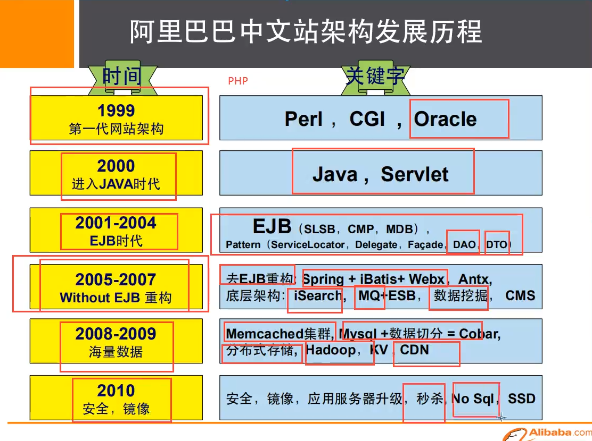

- 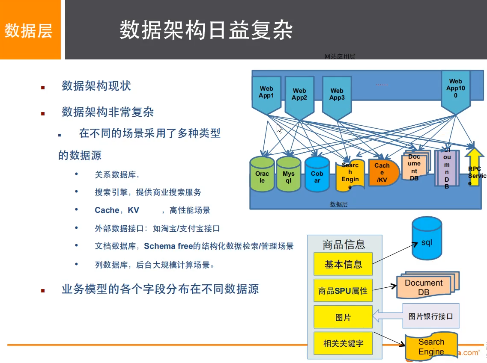

- ```bash
  #1、商品的基本信息
      名称、价格、商家信息;
      关系型数据库就可以解决了! MysQL / oracle（淘宝早年就去IOE了! -王坚:推荐文章:阿里云的这群疯子:40分钟重要!)
      淘宝内部的MysQL不是大家用的MysQL
  #2、商品的描述、评论（文字比较多)
      文档型数据库中，MongoDB
  #3、图片
      分布式文件系统FastDFS
      -淘宝自己的 TFS
      - Google的GFS
      - Hadoop HDFS
      -阿里云的oss
  #4、商品的关键字(搜索)
      -搜索引擎 solr elasticsearch
      - Iserach: 多隆（多去了解一下这些技术大佬!)
  # 5、商品热门的波段信息
      -内存数据库
      - Redis Tair.Memache. . .
  #6、商品的交易,外部的支付接口
      -三方应用
  ```

- 大型互联网应用的问题：
  
  - 数据类型太多了
  - 数据源繁多，经常重构
  - 数据要改造，大面积改造？

- 解决问题：
  
  - 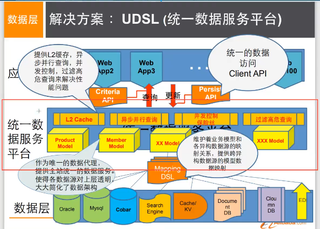
  - 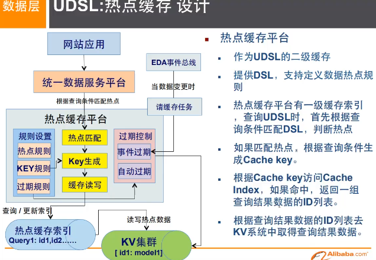

### 1.4 NoSQL的四大分类

- KV键值对：
  - 新浪：Redis
  - 美团：Redis+Tair
  - 阿里、百度：Redis+memecache
- 文档型数据库（bson格式和json一样）：
  - MongoDB:
    - 一个基于分布式文件存储的数据库，C++编写，用来处理大量的文档
    - 一个介于关系型数据库和非关系数据库的中间产品，MongoDB是非关系型数据库中功能最丰富，最像关系型数据库的
  - ConthDB
- 列存储数据库
  - HBase
  - 分布式文件系统
- 图关系数据库
  - 用来存储关系，社交网络相关的！
  - Neo4j，InfoGrid
- 详细区别建议：自己百度看！
- 

## 2. Redis 入门

- Redis是什么？
  - Redis ( Remote Dictionary Server )，即远程字典服务!
  - 是一个开源的使用C语言编写、支持网络、可基于内存亦可持久化的日志型、Key-value数据库，并提供多种语言的API.
  - 区别的是redis会周期性的把更新的数据写入磁盘或者把修改操作写入追加的记录文件，并且在此基础上实现了master-slave(主从)同步。
  - 免费和开源!是当下最热门的NoSQL技术之一!也被人们称之为结构化数据库!
- Redis能干什么？
  - 内存存储、持久化,内存中是断电即失、所以说持久化很重要( rdb、aof )
  - 效率高，可以用于高速缓存
  - 发布订阅系统
  - 地图信息分析
  - 计时器、计数器（浏览量!)
  - ...
- Redis特性：
  - 多样的数据类型
  - 持久化
  - 集群
  - 事务
  - ...

### 2.1 安装

- windows安装：建议看视频或者百度教程：https://www.bilibili.com/video/BV1S54y1R7SB?p=8&spm_id_from=pageDriver
  
  - 下载、解压到环境目录即可
  
  - 开启Redis，运行服务器
  
  - 使用redis客户端，双击即可
  
  - ```bash
    # 测试是否连接，返回PONG，已经连接到redis服务器
    ping 
    # 基本使用 k-v使用
    set name sadsd
    get name
    ```

- linux安装：
  
  - 官网下载安装包
  
  - 解压Redis安装包，程序一般在/opt目录
    
    - ```bash
      mv redis-6.2.6.tar.gz /opt
      tar -zxvf redis-6.2.6.tar.gz
      ```
  
  - 进入解压后的文件，可以看到redis.conf，配置文件
  
  - 基本的环境安装
    
    - ```bash
      yum install gcc-c++
      # 然后直接输入make或者make install ,完成之后可以redis文件夹下面就多了src目录
      make 
      ```
  
  - redis的默认安装路径：/usr/local/bin
  
  - 将redis配置文件拷贝到安装路径下
    
    - ```bash
      # 在默认安装路径下新建一个文件夹
      mkdir kingconfig
      # 把配置文件复制过来
      [root@izwz94aowfpx0xt7uw61tbz bin]# cp /opt/redis-6.2.6/redis.conf kingconfig
      # 以后就改这个配置文件即可
      ```
  
  - redis默认不是后台启动的，要设置后台启动，需要修改配置文件
    
    - ```bash
      vim redis.conf
      # 改为yes即可
      daemonize yes
      ```
  
  - 启动redis
    
    - 
    - 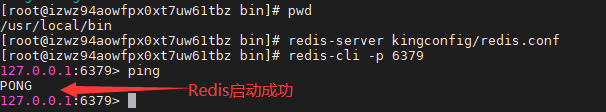
    - 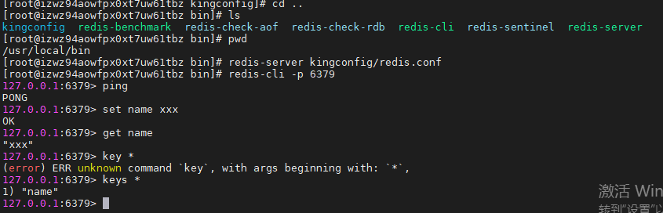
  
  - 查看redis进程是否开启
    
    - ```bash
      ps -ef|greo redis
      ```
  
  - 如何关闭redis服务:shutdown（关闭redis）然后exit即可
    
    - 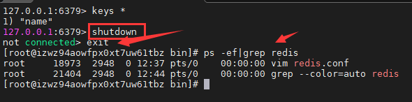

### 2.2 性能测试

- 使用redis安装后自带的redis-benchmark：压力测试工具

- 使用：
  
  - redis-benchmark 命令参数即可=》可以自行百度
  
  - ```bash
    # 简单测试一下
    # 测试试: 100个并发连接100000请求
    redis-benchmark -h localhost -p 6379 -c 100 -n 100000
    ```

- 如何查看分析：
  
  - 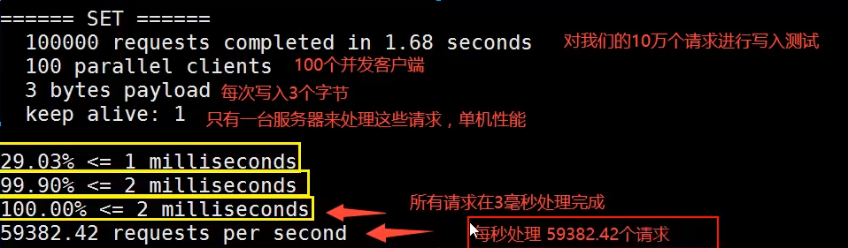

### 2.3 基础知识

- 基本使用
  
  - ```bash
    # 默认有16个数据库,
    # 查看配置文件即可
    vim kingconf/redis.conf
    # databases 16
    # 默认使用的是第0个
    # 服务端启动后，启动客户端
    redis-cli -p 6379
    
    # 使用select切换数据库
    select 3
    
    # 查看当前数据库大小
    dbsize
    
    # 查看所有的key
    keys *
    
    # 通过get的方式获取对应的值
    get name
    
    # 清空当前库
    flushdb
    
    # 清空所有的库
    flushall
    ```

- 为什么Redis是单线程的？
  
  - 官方：Redis是基于内存操作的，CPU不是Redis性能瓶颈，Redis的瓶颈是根据机器的内存和网络带宽，既然可以使用单线程来实现，就使用单线程了

- Redis是C语言写的，官方提供的数据为100000+的QPS，完全不比同样是使用key-vale的Memecache差!

- Redis为什么单线程还这么快?
  
  - 误区1：高性能的服务器一定是多线程的?
  - 误区2：多线程一定比单线程效率高？=》多线程的上下文切换很消耗资源
  - 核心：Redis是将所有的数据全部放到内存中的，所以说使用单线程去操作效率就是最高的，对于内存系统来说，如果没有上下文切换效率就是最高的，多次读写都是在CPU上进行的，在内存情况下，这个就是最佳的方案

## 3. 五大数据类型

- 看官方文档！
- Redis 是一个开源（BSD许可）的，内存中的数据结构存储系统，它可以用作数据库、缓存和消息中间件。        它支持多种类型的数据结构，如            [字符串（strings）](http://www.redis.cn/topics/data-types-intro.html#strings)，    [散列（hashes）](http://www.redis.cn/topics/data-types-intro.html#hashes)，    [列表（lists）](http://www.redis.cn/topics/data-types-intro.html#lists)，    [集合（sets）](http://www.redis.cn/topics/data-types-intro.html#sets)，    [有序集合（sorted sets）](http://www.redis.cn/topics/data-types-intro.html#sorted-sets) 与范围查询，    [bitmaps](http://www.redis.cn/topics/data-types-intro.html#bitmaps)，    [hyperloglogs](http://www.redis.cn/topics/data-types-intro.html#hyperloglogs) 和     [地理空间（geospatial）](http://www.redis.cn/commands/geoadd.html) 索引半径查询。     Redis 内置了    [复制（replication）](http://www.redis.cn/topics/replication.html)，[LUA脚本（Lua scripting）](http://www.redis.cn/commands/eval.html)，    [LRU驱动事件（LRU eviction）](http://www.redis.cn/topics/lru-cache.html)，[事务（transactions）](http://www.redis.cn/topics/transactions.html)    和不同级别的    [磁盘持久化（persistence）](http://www.redis.cn/topics/persistence.html)，    并通过    [Redis哨兵（Sentinel）](http://www.redis.cn/topics/sentinel.html)和自动    [分区（Cluster）](http://www.redis.cn/topics/cluster-tutorial.html)提供高可用性（high availability）。
- 命令：看官方文档！
- Key

```bash
127.0.0.1:6379> keys * # 查看所有key
(empty array) 
127.0.0.1:6379> set name king # set 一个key
OK
127.0.0.1:6379> keys *
1) "name"
127.0.0.1:6379> exists name # 判断key是否存在
(integer) 1
127.0.0.1:6379> move name 1 # 移除一个key
(integer) 0
127.0.0.1:6379> exists name
(integer) 1
127.0.0.1:6379> move name 1
(integer) 0
127.0.0.1:6379> keys *
1) "name"
127.0.0.1:6379> exists name
(integer) 1
127.0.0.1:6379> expire age 10 
(integer) 0
127.0.0.1:6379> set age 16
OK
127.0.0.1:6379> keys *
1) "age"
2) "name"
127.0.0.1:6379> expire age 10 # 设置key的过期时间，单位秒
(integer) 1
127.0.0.1:6379> ttl age # 查看key的剩余时间
(integer) 6
127.0.0.1:6379> ttl age
(integer) 5
127.0.0.1:6379>

127.0.0.1:6379> keys *
1) "name"
127.0.0.1:6379> type name # 查看key的类型
string
127.0.0.1:6379> set age 1555
OK
127.0.0.1:6379> type age
string
127.0.0.1:6379>
```

### 3.1 String

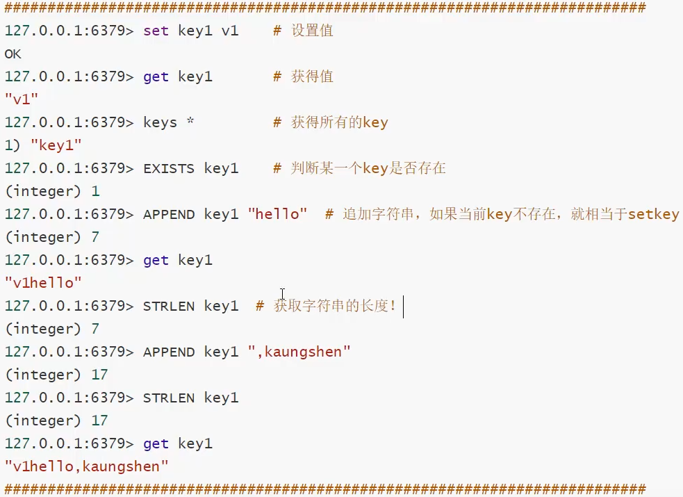

```bash
# +1  -1 步长操作
127.0.0.1:6379> keys *
(empty array)
127.0.0.1:6379> set views 0
OK
127.0.0.1:6379> keys *
1) "views"
127.0.0.1:6379> get views
"0"
127.0.0.1:6379> get views;
(nil)
127.0.0.1:6379> incr views; # +1
(integer) 1
127.0.0.1:6379> incr views;
(integer) 2
127.0.0.1:6379> incr views;
(integer) 3
127.0.0.1:6379> get views
"0"
127.0.0.1:6379> decr views # -1
(integer) -1
127.0.0.1:6379> decrby views 10 # 指定步长为10，进行减少
(integer) -11
127.0.0.1:6379> decrby view 10
(integer) -10
127.0.0.1:6379> keys *
1) "view"
2) "views;"
3) "views"
########################################################
# 获取范围字符串：getrange
127.0.0.1:6379> keys *
(empty array)
127.0.0.1:6379> set key1 123456789
OK
127.0.0.1:6379> get key1
"123456789"
127.0.0.1:6379> getrange key1 0 3
"1234"
127.0.0.1:6379> getrange key1 0 -1
"123456789"
127.0.0.1:6379> getrange key1 2 -1
"3456789"

# 设置范围字符串：setrange
127.0.0.1:6379> set key2 abcderf
OK
127.0.0.1:6379> setrange key2 1 xxx
(integer) 7
127.0.0.1:6379> get key2
"axxxerf"
########################################################
# setex (set with expire) # 设置过期时间
# setnx (set if not exist) # 不存在设置，如果存在则创建失败=》在分布式锁中经常使用
127.0.0.1:6379> keys *
1) "key2"
127.0.0.1:6379> setex key3 30 "hello"
OK
127.0.0.1:6379> ttl key3
(integer) 26
127.0.0.1:6379> get key3
"hello"
127.0.0.1:6379> setnx mykey "redis"
(integer) 1
127.0.0.1:6379> keys *
1) "key3"
2) "key2"
3) "mykey"
127.0.0.1:6379> setnx mykey "mongodb"
(integer) 0
127.0.0.1:6379> get mykey
"redis"
########################################################
# 批量创建，获取
# mset
# mget
# msetnx=>原子性操作，要不一起成功，要不一起失败
127.0.0.1:6379> flushdb
OK
127.0.0.1:6379> mset k1 v1 k2 v2
OK
127.0.0.1:6379> keys *
1) "k1"
2) "k2"
127.0.0.1:6379> mget k1 k2
1) "v1"
2) "v2"
127.0.0.1:6379> msetnx k1 v1 k2 v2
(integer) 0
127.0.0.1:6379> mget k1 k2
1) "v1"
2) "v2"
127.0.0.1:6379> keys *
1) "k1"
2) "k2"
127.0.0.1:6379> msetnx k1 v1 k2 v2 k3 v3
(integer) 0
127.0.0.1:6379> keys *
1) "k1"
2) "k2"
########################################################
# 创建对象：
# key的设计：user:{id}:{filed}
# set user:1{name:zhangsan,age:3} # 设置一个user:1对象，值为json字符串来保存一个对象
127.0.0.1:6379> flushdb
OK
127.0.0.1:6379> keys *
(empty array)
127.0.0.1:6379> mset user:1:name zhangsan user:1:age 2
OK
127.0.0.1:6379> keys *
1) "user:1:age"
2) "user:1:name"
127.0.0.1:6379> mget user:1:name user:1:name
1) "zhangsan"
2) "zhangsan"
127.0.0.1:6379> set user:2:{name:lis age:18}
OK
127.0.0.1:6379> keys *
1) "user:1:age"
2) "user:1:name"
3) "user:2:{name:lis"
########################################################
# getset 先get然后在set
127.0.0.1:6379> flushdb
OK
127.0.0.1:6379> getset db redis # 如果不存在值，则返回nil
(nil)
127.0.0.1:6379> keys *
1) "db"
127.0.0.1:6379> getset db redis
"redis"
127.0.0.1:6379> getset db mongodb# 如果存在值，获取原来的值，并且设置新的值
"redis"
127.0.0.1:6379> getset db mongodb
"mongodb"
```

- String类似使用的场景：
  - value还可以是数字
  - 计数器
  - 统计多单位的数量
  - 粉丝数
  - 对象缓存存储

### 3.2 List

```bash
# 所有的list命令都是l开头的
########################################################
# lpush：类似栈的push=》插入到列表头部
# lrange:类似与以栈打印信息
# rpush：插入到列表的尾部
127.0.0.1:6379> keys *
(empty array)
127.0.0.1:6379> lpush list one
(integer) 1
127.0.0.1:6379> lpush list two
(integer) 2
127.0.0.1:6379> keys *
1) "list"
127.0.0.1:6379> lrange list 0 -1
1) "two"
2) "one"
127.0.0.1:6379> lrange list 0 2
1) "two"
2) "one"
127.0.0.1:6379> lrange list 0 1
1) "two"
127.0.0.1:6379> rpush list three
(integer) 3
127.0.0.1:6379> lrange list 0 -1
1) "two"
2) "one"
3) "three"
########################################################
# lpop : 移除最左边：上面
# rpop ：移除最右边：下面
127.0.0.1:6379> lrange list 0 -1
1) "two"
2) "one"
3) "three"
127.0.0.1:6379> lpop list
"two"
127.0.0.1:6379> lrange list 0 -1
1) "one"
2) "three"
127.0.0.1:6379> rpop list
"three"
127.0.0.1:6379> lrange list 0 -1
1) "one"
########################################################
# lindex ：通过下标获取值
127.0.0.1:6379> lrange list 0 -1
1) "one"
127.0.0.1:6379> lpush list two
(integer) 2
127.0.0.1:6379> lpush list three
(integer) 3
127.0.0.1:6379> lrange list 0 -1
1) "three"
2) "two"
3) "one"
127.0.0.1:6379> lindex list 1
"two"
127.0.0.1:6379> lindex list 0
"three"
127.0.0.1:6379> rindex list 0
(error) ERR unknown command `rindex`, with args beginning with: `list`, `0`,
########################################################
# llen：查看list长度
# lrem：移除选定值
127.0.0.1:6379> flushdb
OK
127.0.0.1:6379> lpush list one
(integer) 1
127.0.0.1:6379> lpush list two
(integer) 2
127.0.0.1:6379> lpush list three
(integer) 3
127.0.0.1:6379> lrange list 0 -1
1) "three"
2) "two"
3) "one"
127.0.0.1:6379> lrem list 1
(error) ERR wrong number of arguments for 'lrem' command
127.0.0.1:6379> lrem list 1 two
(integer) 1
127.0.0.1:6379> lrange list 0 -1
1) "three"
2) "one"
127.0.0.1:6379> lpush list three
(integer) 3
127.0.0.1:6379> lrange list 0 -1
1) "three"
2) "three"
3) "one"
127.0.0.1:6379> lrem list 2 three
(integer) 2
127.0.0.1:6379> lrange list 0 -1
1) "one"
########################################################
# ltrim：通过下标截取指定数组
127.0.0.1:6379> flushdb
OK
127.0.0.1:6379> lpush list one
(integer) 1
127.0.0.1:6379> lpush list two
(integer) 2
127.0.0.1:6379> lpush list three
(integer) 3
127.0.0.1:6379> lpush list four
(integer) 4
127.0.0.1:6379> lrange list 0 -1
1) "four"
2) "three"
3) "two"
4) "one"
127.0.0.1:6379> ltrim list 1 2
OK
127.0.0.1:6379> lrange list 0 -1
1) "three"
2) "two"
########################################################
# rpoplpush :移除列表最后一个元素，并且放到另一个列表中，如果列表不存在则回创建
127.0.0.1:6379> lpush list one
(integer) 1
127.0.0.1:6379> lpush list one
(integer) 2
127.0.0.1:6379> lpush list two
(integer) 3
127.0.0.1:6379> lpush list three
(integer) 4
127.0.0.1:6379> lrange list 0 -1
1) "three"
2) "two"
3) "one"
4) "one"
127.0.0.1:6379> lpoprpush list list2
(error) ERR unknown command `lpoprpush`, with args beginning with: `list`, `list2`,
127.0.0.1:6379> rpoplpush list list2
"one"
127.0.0.1:6379> keys *
1) "list2"
2) "list"
127.0.0.1:6379> lrange list2
(error) ERR wrong number of arguments for 'lrange' command
127.0.0.1:6379> lrange list2 0 -1
1) "one"
127.0.0.1:6379> lrange list1 0 -1
(empty array)
127.0.0.1:6379> lrange list2 0 -1
1) "one"
127.0.0.1:6379> lrange list 0 -1
1) "three"
2) "two"
3) "one"
########################################################
# lset：改变列表指定下标的元素，如果列表不存在会报错
127.0.0.1:6379> lrange list 0 -1
1) "three"
2) "two"
3) "one"
127.0.0.1:6379> lset list 1 xxx
OK
127.0.0.1:6379> lrange list 0 -1
1) "three"
2) "xxx"
3) "one"
#######################################################
# linsert：指定某个元素之前或者之后插入某个值
127.0.0.1:6379> lrange list 0 -1
1) "three"
2) "xxx"
3) "one"
127.0.0.1:6379> linsert list before xxx yyyy
(integer) 4
127.0.0.1:6379> lrange list 0 -1
1) "three"
2) "yyyy"
3) "xxx"
4) "one"
#######################################################
```

- 总结：
  - 事实上是一个链表：before、after、left、right都可以插入值
  - 如果key不存在，创建新的链表
  - 如果key存在，新增内容
  - 如果移除了所有值，空链表，也代表不存在!
  - 在两边插入或者改动值，效率最高!中间元素，相对来说效率会低一点~
- 用途：
  - 消息队列、栈

### 3.3 Set

```bash
########################################################
# sadd ： 往集合里面添加值
# smembers ： 查看集合的元素
# sismembers：判断元素是否剩余集合中
127.0.0.1:6379> flushdb
OK
127.0.0.1:6379> sadd myset 1
(integer) 1
127.0.0.1:6379> sadd myset 2
(integer) 1
127.0.0.1:6379> sadd myset 3
(integer) 1
127.0.0.1:6379> sadd myset 3
(integer) 0
127.0.0.1:6379> smembers myset
1) "1"
2) "2"
3) "3"
127.0.0.1:6379> sismember myset 1
(integer) 1
127.0.0.1:6379> sismember myset 2
(integer) 1
127.0.0.1:6379> sismember myset 0
(integer) 0
########################################################
# scard：查看集合个数
# srem : 移除指定元素
127.0.0.1:6379> smembers myset
1) "1"
2) "2"
3) "3"
127.0.0.1:6379> scard myset
(integer) 3
127.0.0.1:6379> srem 1
(error) ERR wrong number of arguments for 'srem' command
127.0.0.1:6379> srem myset 1
(integer) 1
127.0.0.1:6379> smembers myset
1) "2"
2) "3"
########################################################
# srandmember : 随机获取集合中的一个元素
127.0.0.1:6379> SRANDMEMBER myset
"2"
127.0.0.1:6379> SRANDMEMBER myset
"3"
127.0.0.1:6379> smembers myset
1) "2"
2) "3"
127.0.0.1:6379> SRANDMEMBER myset
"3"
########################################################
# spop : 随机移除一个元素
127.0.0.1:6379> SMEMBERS myset
1) "2"
2) "3"
127.0.0.1:6379> spop myset
"2"
127.0.0.1:6379> SMEMBERS myset
1) "3"
########################################################
# smove ： 将一个集合中的元素移到指定的集合中
127.0.0.1:6379> sadd myset 1
(integer) 1
127.0.0.1:6379> sadd myset 2
(integer) 1
127.0.0.1:6379> sadd myset 3
(integer) 1
127.0.0.1:6379> sadd myset2 4
(integer) 1
127.0.0.1:6379> sadd myset2 5
(integer) 1
127.0.0.1:6379> SMEMBERS myset
1) "1"
2) "2"
3) "3"
127.0.0.1:6379> SMEMBERS myset2
1) "4"
2) "5"
127.0.0.1:6379> smove myset myset2 1
(integer) 1
127.0.0.1:6379> SMEMBERS myset
1) "2"
2) "3"
127.0.0.1:6379> SMEMBERS myset2
1) "1"
2) "4"
3) "5"
########################################################
# sdiff : 差集
# sinter : 交集
# sunion : 并集
127.0.0.1:6379> SMEMBERS myset
1) "1"
2) "2"
3) "3"
127.0.0.1:6379> SMEMBERS myset2
1) "1"
2) "4"
3) "5"
127.0.0.1:6379> sdiff myset myset2
1) "2"
2) "3"
127.0.0.1:6379> sinter myset myset2
1) "1"
127.0.0.1:6379> sunion myset myset2
1) "1"
2) "2"
3) "3"
4) "4"
5) "5"
########################################################
```

### 3.4 Hash

- 类似Map集合：key-map，

```bash
########################################################
# hset : 往hash中添加元素
# hget : 从hash中获取指定key的值
# hmset、hmget：多个
# hgetall : 获取所有的键值对
127.0.0.1:6379> flushdb
OK
127.0.0.1:6379> hset myhash field1 xx
(integer) 1
127.0.0.1:6379> keys *
1) "myhash"
127.0.0.1:6379> hget myhash
(error) ERR wrong number of arguments for 'hget' command
127.0.0.1:6379> hget myhash field1
"xx"
127.0.0.1:6379> hmset myhash field1 aa field2 world
OK
127.0.0.1:6379> hmget myhash field1 field2
1) "aa"
2) "world"
########################################################
# hdel : 删除hash指定的key,对应的value也被删除了
127.0.0.1:6379> hdel myhash field1
(integer) 1
127.0.0.1:6379> hgetall
(error) ERR wrong number of arguments for 'hgetall' command
127.0.0.1:6379> hgetall myhash
1) "field2"
2) "world"
########################################################
# hlen : 查看指定hash的长度
# hexists:判断hash中的某个key是否存在
# hkeys : 查看指定hash的所有的key
# hvals : 查看指定hash的所有的val

127.0.0.1:6379> hgetall myhash
1) "field2"
2) "world"
127.0.0.1:6379> hlen myhash
(integer) 1
127.0.0.1:6379> hmset myhash field1 aa field2 world
OK
127.0.0.1:6379> hgetall myhash
1) "field2"
2) "world"
3) "field1"
4) "aa"
127.0.0.1:6379> hlen myhash
(integer) 2
127.0.0.1:6379> HEXISTS myhash field1
(integer) 1
127.0.0.1:6379> HEXISTS myhash field3
(integer) 0
127.0.0.1:6379> hkeys myhash
1) "field2"
2) "field1"
127.0.0.1:6379> hvals myhash
1) "world"
2) "aa"
########################################################
# hincr、hdecr、hincrby、hdecrby : 指定下降或者自增
# hsetnx：创建一个key，如果不存在则创建成功，如果存在则创建失败
127.0.0.1:6379> hgetall myhash
1) "field2"
2) "world"
3) "field1"
4) "aa"
127.0.0.1:6379> hincrby myhash field1
(error) ERR wrong number of arguments for 'hincrby' command
127.0.0.1:6379> HINCRBY myhash field1
(error) ERR wrong number of arguments for 'hincrby' command
127.0.0.1:6379> hset myhash field3 5
(integer) 1
127.0.0.1:6379> HINCRBY myhash field3
(error) ERR wrong number of arguments for 'hincrby' command
127.0.0.1:6379> HINCRBY myhash field3 1 # 指定增量
(integer) 6
127.0.0.1:6379> hgetall myhash
1) "field2"
2) "world"
3) "field1"
4) "aa"
5) "field3"
6) "6"
127.0.0.1:6379> hsetnx myhash field4 hh
(integer) 1
127.0.0.1:6379> hsetnx myhash field4 aa
(integer) 0
########################################################
```

- 应用：
  - 经常变动的消息，如：用户信息、适合对象的存储

### 3.5 Zset

- 在set的基础上，增加了一个值，
- set k1 v1 变成了zset k1 score1 v1

```bash
########################################################
# zadd : 创建并且添加值
127.0.0.1:6379> zadd myset 1 one
(integer) 1
127.0.0.1:6379> zadd myset 2 two 3 three
(integer) 2
127.0.0.1:6379> zrange myset 0 -1
1) "one"
2) "two"
3) "three"
########################################################
# zrange:查看元素
# zrangebyscore:排序，可以设置是否自带score，正序
# zrevrange:逆序排序
127.0.0.1:6379> zrange myset 0 -1
1) "one"
2) "two"
3) "three"
127.0.0.1:6379> zrangebyscore myset -inf +inf
1) "one"
2) "two"
3) "three"
127.0.0.1:6379> zrangebyscore myset -inf +inf withscores
1) "one"
2) "1"
3) "two"
4) "2"
5) "three"
6) "3"
127.0.0.1:6379> zrangebyscore myset -inf 100 withscores
1) "one"
2) "1"
3) "two"
4) "2"
5) "three"
6) "3"
127.0.0.1:6379> zrevrange myset 0 -1
1) "three"
2) "two"

########################################################
# zrem：移除有序集合中的元素
# zcard:查看有序集合中的个数
127.0.0.1:6379> zrange myset 0 -1
1) "one"
2) "two"
3) "three"
127.0.0.1:6379> zrem myset one
(integer) 1
127.0.0.1:6379> zrange myset 0 -1
1) "two"
2) "three"
########################################################
# zcount : 获取指定score区间的元素个数
127.0.0.1:6379> zrange myset 0 -1
1) "two"
2) "three"
127.0.0.1:6379> zcount myset 1 3
(integer) 2
127.0.0.1:6379> zcount myset 1 1
(integer) 0

########################################################
########################################################
```

- 应用：
  - set排序、加权判断、排行榜

## 4. 三种特殊数据类型

### 4.1 geosptial地理位置

- 看官方文档，只有6个命令！
- key=>经纬度 名称

### 4.2 Hyperloglog

- 基数=》不重复的元素
- Redis Hyperloglog：基数统计的算法！
  - 网页的访问量：一个人访问一个网站多次，但是还是算一个人
  - 传统方式：set保护用户id，如果保存大量的用户id，就会很麻烦，目的是计数！
- Hyperloglog优点：
  - 占用内存是固定的，2*64不同的元素技术，只要消耗12KB内存即可
  - 0.81%的错误率
- 看官网，命令！

### 4.3 Bitmaps

- 位存储
- 如：
  - 统计疫情感染人数： 0 1 0 1 0 1 
  - 用户信息：活跃、不活跃、登录、未登录、打卡、未打卡
  - 365天=365bit，1字节=8bit
- Bitmap 位图：一种数据结构，都是操作二进制位来进行记录的，只有0和1两种状态

## 5. 事务

- Redis单条命令是保证原子性，但是事务不保证原子性
- Redis事务本质：一组命令的集合！
  - 一个事务中的所有命令都会被序列化，在事务执行过程中，会按照顺序执行
  - 一次性、顺序性、排他性
- Redis事务没有隔离级别的概念！
  - 所有的命令在事务中，并没有被执行！只有发起执行命令的时候才会执行！Exec
- Redis事务：
  - 开启事务：multi
  - 命令入队：..
  - 执行事务：exec
  - 放弃事务：discard 队列中的命令都不会被执行
- Redis异常：
  - 类似于Java的编译型异常，代码有问题，命令有错，事务中的所有命令都不会执行
  - 类似于Java中给的运行时异常，如果事务队列中存在逻辑错误，那么执行命令的时候，其他命令是可以正常执行的，错误命令抛出异常
- 监控：
  - 悲观锁：很悲观，认为什么时候都会出现问题，无论做什么都会加锁
  - 乐观锁：很乐观，认为什么时候回都不会出现问题，所以不会上锁，更新数据的时候在判断一下，在此期间是否有人修改过这个数据
- Redis乐观锁实现：
  - 获取version
  - 更新的时候比较version
  - 使用watch来监控对应的key，如果在该线程中执行事务，并且还未提交，另一个线程又修改了这个key，则之前使用watch来监控事务的那个事务会执行失败。相当于乐观锁操作
  - 如果事务执行失败，要进行继续的监视或者执行事务，需要先解锁 unwatch，再次watch，获取最新的值，再执行事务

## 6. Jedis

- 是Redis官方推荐的java连接开发工具，使用java操作Redis的中间件
- 建议看视频：https://www.bilibili.com/video/BV1S54y1R7SB?p=23&spm_id_from=pageDriver
- 一般步骤：
  - 导入依赖
  - 编码测试：
    - 连接数据库：new jedis即可
    - 操作命令：之前学习的命令即可
    - 断开连接

## 7. SpringBoot集成Redis

- 建议看视频：https://www.bilibili.com/video/BV1S54y1R7SB?p=25

## 8.Redis.conf详解

- 建议看视频，或者直接百度

- 启动的时候就需要指定这个conf！
  
  - 配置文件：unit单位大小写不敏感
  - 可以包含其他配置文件

- > 快照：
  
  - 持久化，在规定的时间内，执行了多少次操作，则会持久化到文件 .rbd .aof中
  
  - 因为redis是内存数据库，如果没有持久化，那么数据将会断点即失
  
  - ```bash
    # 如果900s内，至少有1个key进行了修改，则进行持久化操作
    save 900 1
    # 如果300s内，至少有10个key进行了修改，则进行持久化操作
    save 300 10
    # 如果60s内，至少有100000个key进行了修改，则进行持久化操作
    save 60 100000
    # 后续可能要自己设置
    
    # 持久化如果出错，是否还需要继续工作
    stop-writes-on-bgsave-error yes 
    
    # 是否压缩rbd文件，需要消耗一些cpu资源
    rdbcompression yes
    
    # 保存rdb文件的时候，是否进行错误的校验
    rdbchecksum yes
    
    # rdb保存的目录
    dir ./
    ```

- > SECURITY 安全
  
  - 可以设置登录密码，也可以在命令行中设置，默认没有密码

- > APPEND ONLY 模式 aof配置
  
  - ```bash
    appendonly on # 默认不开启 因为一般情况下是使用rdb方式持久化的，rdb一般都够用了！
    appendfilename "appendonly.aof" # 持久化文件的名字
    
    appendfsync everysec # 每秒执行一次sync，可能会丢失这1s的数据
    #             always：每次修改都会同步，消耗性能
    #             on ： 不同步
    ```

## 9. Redis持久化

- Redis是内存数据库，如果不将内存中的数据库状态保存到磁盘，那么一旦服务器退出，服务器中的数据库状态也会消失，所以Redis提供了持久化功能

### 9.1 什么是RDB？

- RDB：Redis DataBase

- 在指定的时间间隔内将内存中的数据集快照写入磁盘，也就是行话讲的Snapshot快照，它恢复时是将快照文件直接读到内存里。

- Redis会单独创建 ( fork )一个子进程来进行持久化，会先将数据写入到一个临时文件中，待持久化过程都结束了，再用这个临时文件替换上次持久化好的文件。整个过程中，主进程是不进行任何IO操作的。这就确保了极高的性能。如果需要进行大规模数据的恢复，且对于数据恢复的完整性不是非常敏感，那RDB方式要比AOF方式更加的高效。RDB的缺点是最后一次持久化后的数据可能丢失。我们默认的就是RDB，一般情况下不需要修改这个配置!

- rdb保存的文件是dump.rdb

- 

- 可以直接在配置文件中修改对应配置即可

- 触发机制：
  
  1. save的规则满足的情况下，会自动产生rdb文件
  2. 执行flushall命令，也会产生rdb文件
  3. 退出redis的时候，也会产生rdb文件
  4. 就是自动生成一个dump.rdb文件

- 如何恢复rdb文件？
  
  - 只需要将rdb文件放到redis启动目录就可以了，redis启动的时候会自动检查dump.rdb文件，恢复其中的数据
  
  - 查看需要存放的位置：
    
    - ```bash
      127.0.0.1:6379> config get dir
      1) "dir"
      2) "/usr/local/bin" # 如果在这个目录下存在dump.rdb文件，就会自动读取该文件，恢复其中的数据
      ```

- 优点：
  
  - 适合大规模的数据恢复
  - 对数据完整性要求不高，很合适

- 缺点：
  
  - 需要一定的时间间隔，因为进程操作！如果redis意外宕机了，这个最后一次修改数据就没有了
  - fork进程的时候，会占用一定的内存空间

### 9.2 什么是AOF？

- AOF：Append Only File：将所有命令都记录下来，恢复的时候把这个文件里面的操作全部再执行一遍即可

- 

- 以日志的形式来记录每个写操作，将Redis执行过的所有指令记录下来(读操作不记录），只许追加文件但不可以改写文件，redis启动之初会读取该文件重新构建数据，换言之，redis重启的话就根据日志文件的内容将写指令从前到后执行一次以完成数据的恢复工作

- Aof保存的是appendonly.aof文件

- 配置文件中的位置：APPEND ONLY FILE
  
  - 默认是不开启的，需要手动开启
  - 重启后就生效了

- 如果没有了dump.rdb文件，只有appendonly.aof文件，并且改文件被修改过，那么就不能正常启动redis：
  
  - 需要修复这个aof文件，可以使用 redis-check-aof --fix 文件名 可以进行修复

- ```bash
  # 配置文件
  appendonly on # 默认不开启 因为一般情况下是使用rdb方式持久化的，rdb一般都够用了！
  appendfilename "appendonly.aof" # 持久化文件的名字
  
  appendfsync everysec # 每秒执行一次sync，可能会丢失这1s的数据
  #             always：每次修改都会同步，消耗性能
  #             on ： 不同步
  
  # 重写规则:如果aof文件大于64m，太大了，fork一个新的进程来对我们的文件进行读写
  auto-aof-rewrite-percentage 100
  auto-aof-rewrite-min-size 64mb
  ```

- 优点：
  
  - 每一次修改都同步，文件的完整性会更好
  - 每秒同步一次，可能会丢失1秒的数据
  - 从不同步，效率最高

- 缺点：
  
  - Aof远大于rbd，修复速度也比rdb慢
  - Aof运行效率也比rdb慢，所以我们redis默认的配置就是rdb持久化

- 扩展：
  
  - ```bash
    # 1、RDB持久化方式能够在指定的时间间隔内对你的数据进行快照存储
    # 2、AOF持久化方式记录每次对服务器写的操作，当服务器重启的时候会重新执行这些命令来恢复原始的数据，AOF命令以Redis 协议追加保存每次写的操作到文件末尾，Redis还能对AOF文件进行后台重写，使得AOF文件的体积不至于过大。
    # 3、只做缓存，如果你只希望你的数据在服务器运行的时候存在，你也可以不使用任何持久化
    # 4、同时开启两种持久化方式
        # 在这种情况下，当redis重启的时候会优先载入AOF文件来恢复原始的数据，因为在通常情况下AOF文件保存的数据集要比RDB文件保存的数据集要完整。
        # RDB的数据不实时，同时使用两者时服务器重启也只会找AOF文件，那要不要只使用AOF呢?作者建议不要，因为RDB更适合用于备份数据库（AOF在不断变化不好备份），快速重启，而且不会有AOF可能潜在的Bug，留着作为一个万一的手段。
    ```
  
  - ```bash
    # 因为RDB文件只用作后备用途，建议只在Slave上持久化RDB文件，而且只要15分钟备份一次就够了，只保留save 9001这条规则。
    # 如果Enable AOF，好处是在最恶劣情况下也只会丢失不超过两秒数据，启动脚本较简单只load自己的AOF文件就可以了，代价一是带来了持续的IO，二是AOF rewrite 的最后将rewrite过程中产生的新数据写到新文件造成的阻塞几乎是不可避免的。只要硬盘许可，应该尽量减少AOF rewrite的频率，AOF重写的基础大小默认值64M太小了，可以设到5G以上，默认超过原大小100%大小重写可以改到适当的数值。
    # 如果不Enable AOF，仅靠Master-Slave Repllcation 实现高可用性也可以，能省掉一大笔IO，也减少了rewrite时带来的系统波动。代价是如果Master/Slave同时倒掉，会丢失十几分钟的数据，启动脚本也要比较两个Master/Slave 中的 RDB文件，载入较新的那个，微博就是这种架构。
    ```

## 10. Redis发布订阅

- 是什么？pub/sub
  
  - 一种消息通信模式：发布者发布消息，订阅者接收消息

- Redis客户端可以订阅任意数量的频道

- 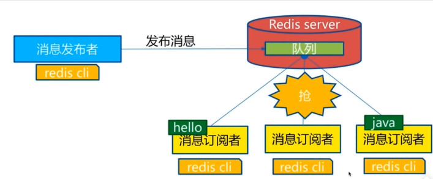

- 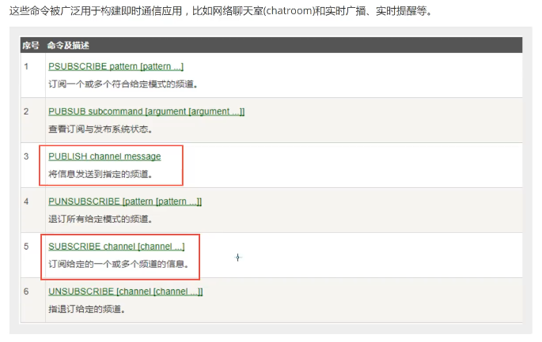

- ```bash
  # 一个session订阅一个频道，等待消息
  127.0.0.1:6379> SUBSCRIBE wsd
  Reading messages... (press Ctrl-C to quit)
  1) "subscribe"
  2) "wsd"
  3) (integer) 1
  # 等待推送的消息
  1) "message" # 消息
  2) "wsd"    # 那个频道的消息
  3) "helloworld" # 内容
  1) "message"
  2) "wsd"
  3) "hello,nhaoya"
  
  # 另一个session在这个频道：发布几条信息
  127.0.0.1:6379> PUBLISH wsd hello world
  (error) ERR wrong number of arguments for 'publish' command
  127.0.0.1:6379> PUBLISH wsd helloworld
  (integer) 1
  127.0.0.1:6379> PUBLISH wsd hello,nhaoya
  (integer) 1
  127.0.0.1:6379>
  ```

- 原理：
  
  - Redis是使用C实现的，通过分析Redis 源码里的 pubsub.c文件，了解发布和订阅机制的底层实现，籍此加深对Redis的理解。Redis 通过PUBLISH、SUBSCRIBE 和PSUBSCRIBE等命令实现发布和订阅功能。
  - 通过SUBSCRIBE命令订阅某频道后，redis-server里维护了一个字典，字典的键就是一个个channel!，而字典的值则是一个链表，链表中保存了所有订阅这个channel的客户端。SUBSCRIBE命令的关键，就是将客户端添加到给定channel 的订阅链表中。通过PUBLISH命令向订阅者发送消息，redis-server会使用给定的频道作为键，在它所维护的channel字典中查找记录了订阅这个频道的所有客户端的链表，遍历这个链表，将消息发布给所有订阅者。
  - Pub/Sub从字面上理解就是发布( Publish )与订阅( Subscribe )，在Redis中，你可以设定对某一个key值进行消息发布及消息订阅，当一个key值上进行了消息发布后，所有订阅它的客户端都会收到相应的消息。这一功能最明显的用法就是用作实时消息系统，比如普通的即时聊天，群聊等功能。

- 应用：
  
  - 实时消息系统
  - 群聊天室
  - 订阅、关注系统
  - 复杂的则是通过消息中间件来完成，如：MQ、kafak

## 11. Redis主从复制

- 是什么？
  
  - 主从复制，是指将一台Redis服务器的数据，复制到其他的Redis服务器。前者称为主节点(masterleader)，后者称为从节点(slave/follower);**数据的复制是单向的**，只能由主节点到从节点。Master以写为主，Slave 以读为主。
  - 默认情况下，每台Redis服务器都是主节点;且一个主节点可以有多个从节点(或没有从节点)，但一个从节点只能有一个主节点。
  - 一般至少要求三台！一主二从

- 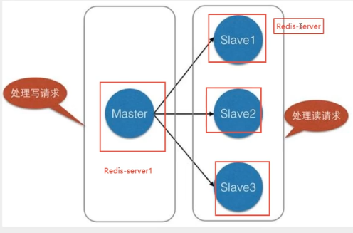

- 主从复制的作用主要包括︰
  
  - 读写分离！因为80%都是读操作，减缓服务器的压力
  - 数据冗余：主从复制实现了数据的热备份，是持久化之外一种数据冗余方式。
  - 故障恢复：当主节点出现问题时，可以由从节点提供服务，实现快速的故障恢复;实际上是一种服务的冗余。
  - 负载均衡：在主从复制的基础上，配合读写分离，可以由主节点提供写服务，由从节点提供读服务（即写Redis数据时应用连接主节点，读Redis数据时应用连接从节点)，分担服务器负载;尤其是在写少读多的场景下，通过多个从节点分担读负载，可以大大提高Redis服务器的并发量。
  - 高可用基石：除了上述作用以外，主从复制还是哨兵和集群能够实施的基础，因此说主从复制是Redis高可用的基础。

- 一般来说，要将Redis运用于工程项目中，只使用一台Redis是万万不能的，原因如下:
  
  - 从结构上，单个Redis服务器会发生单点故障，并且一台服务器需要处理所有的请求负载，压力较大;
  - 从容量上，单个Redis服务器内存容量有限，就算一台Redis服务器内存容量为256G，也不能将所有内存用作Redis存储内存，一般来说，**单台Redis最大使用内存不应该超过20G。**
  - 如：电商网站上的商品，一般都是一次上传，无数次浏览的，说专业点也就是"多读少写"。对于这种场景，一般需要使用三台以上的redis服务器，实现主从复制，读写分离，保证....

- 环境配置：

- ```bash
  # 查看当前redis库的信息
  [root@izwz94aowfpx0xt7uw61tbz bin]# redis-server kingconfig/redis.conf
  [root@izwz94aowfpx0xt7uw61tbz bin]# redis-cli
  127.0.0.1:6379> info replication # 查看当前redis库的信息
  # Replication
  role:master # 角色
  connected_slaves:0 # 没有从机
  master_failover_state:no-failover
  master_replid:2ca50f9765a07e28920b6ca4b657737f18b9be5e
  master_replid2:0000000000000000000000000000000000000000
  master_repl_offset:0
  second_repl_offset:-1
  repl_backlog_active:0
  repl_backlog_size:1048576
  repl_backlog_first_byte_offset:0
  repl_backlog_histlen:0
  
  # 复制几个配置文件，然后修改对应的信息
  # 端口
  # pid名字
  # log文件名字
  # dump.rdb名字
  [root@izwz94aowfpx0xt7uw61tbz kingconfig]# cp redis.conf redis-1.conf
  [root@izwz94aowfpx0xt7uw61tbz kingconfig]# cp redis.conf redis-79.conf
  [root@izwz94aowfpx0xt7uw61tbz kingconfig]# cp redis.conf redis-80.conf
  [root@izwz94aowfpx0xt7uw61tbz kingconfig]# cp redis.conf redis-81.conf
  [root@izwz94aowfpx0xt7uw61tbz kingconfig]# ls
  redis-1.conf  redis-79.conf  redis-80.conf  redis-81.conf  redis.conf
  [root@izwz94aowfpx0xt7uw61tbz kingconfig]# rm -rf redis-1.conf
  [root@izwz94aowfpx0xt7uw61tbz kingconfig]# ls
  redis-79.conf  redis-80.conf  redis-81.conf  redis.conf
  [root@izwz94aowfpx0xt7uw61tbz kingconfig]# vim redis-79.conf
  [root@izwz94aowfpx0xt7uw61tbz kingconfig]# vim redis-80.conf
  [root@izwz94aowfpx0xt7uw61tbz kingconfig]# vim redis-81.conf
  [root@izwz94aowfpx0xt7uw61tbz kingconfig]# ls
  redis-79.conf  redis-80.conf  redis-81.conf  redis.conf
  
  # 根据配置文件启动对应的redis服务器
  
  [root@izwz94aowfpx0xt7uw61tbz bin]# redis-server kingconfig/redis-79.conf
  [root@izwz94aowfpx0xt7uw61tbz bin]# redis-server kingconfig/redis-80.conf
  [root@izwz94aowfpx0xt7uw61tbz bin]# redis-server kingconfig/redis-81.conf
  [root@izwz94aowfpx0xt7uw61tbz bin]# ps -ef|grep redis
  root     27241     1  0 13:15 ?        00:00:00 redis-server 127.0.0.1:6379
  root     27270 24237  0 13:15 pts/0    00:00:00 redis-cli
  root     31140     1  0 13:26 ?        00:00:00 redis-server 127.0.0.1:6380
  root     31170     1  0 13:26 ?        00:00:00 redis-server 127.0.0.1:6381
  root     31277 27911  0 13:26 pts/2    00:00:00 grep --color=auto redis
  ```

```
### 11.1 一主二从

- 默认情况下，每一台Redis服务器都是主节点

- 一般配置从机即可！认老大

- ```bash
# 查看复制信息，多开几个session或者远程连接不同的服务器即可

127.0.0.1:6379> info replication
# Replication
role:master
connected_slaves:0
master_failover_state:no-failover
master_replid:2ca50f9765a07e28920b6ca4b657737f18b9be5e
master_replid2:0000000000000000000000000000000000000000
master_repl_offset:0
second_repl_offset:-1
repl_backlog_active:0
repl_backlog_size:1048576
repl_backlog_first_byte_offset:0
repl_backlog_histlen:0
127.0.0.1:6379>


[root@izwz94aowfpx0xt7uw61tbz bin]# redis-cli -p 6380
127.0.0.1:6380> ping
PONG
127.0.0.1:6380> info replication
# Replication
role:master
connected_slaves:0
master_failover_state:no-failover
master_replid:6b78d9cb86ae75c3c4a916acb4434a240dc6fd90
master_replid2:0000000000000000000000000000000000000000
master_repl_offset:0
second_repl_offset:-1
repl_backlog_active:0
repl_backlog_size:1048576
repl_backlog_first_byte_offset:0
repl_backlog_histlen:0
127.0.0.1:6380>


127.0.0.1:6381> info replication
# Replication
role:master
connected_slaves:0
master_failover_state:no-failover
master_replid:35f156b2207116fbb54a1d2153b6beddc7b6688a
master_replid2:0000000000000000000000000000000000000000
master_repl_offset:0
second_repl_offset:-1
repl_backlog_active:0
repl_backlog_size:1048576
repl_backlog_first_byte_offset:0
repl_backlog_histlen:0
127.0.0.1:6381>
```

- ```bash
  # 开始配置主从复制：认老大
  127.0.0.1:6380> SLAVEOF 127.0.0.1 6379
  OK
  ```
  
  127.0.0.1:6381> SLAVEOF 127.0.0.1 6379
  OK

# 此时再次查看复制信息:

  127.0.0.1:6379> info replication

# Replication

  role:master
  connected_slaves:2
  slave0:ip=127.0.0.1,port=6380,state=online,offset=70,lag=0
  slave1:ip=127.0.0.1,port=6381,state=online,offset=70,lag=0
  master_failover_state:no-failover
  master_replid:b007e5eb94a2f1ffb66be4388e802a4da2731978
  master_replid2:0000000000000000000000000000000000000000
  master_repl_offset:70
  second_repl_offset:-1
  repl_backlog_active:1
  repl_backlog_size:1048576
  repl_backlog_first_byte_offset:1
  repl_backlog_histlen:70

  127.0.0.1:6380> info replication

# Replication

  role:slave
  master_host:127.0.0.1
  master_port:6379
  master_link_status:up
  master_last_io_seconds_ago:1
  master_sync_in_progress:0
  slave_read_repl_offset:56
  slave_repl_offset:56
  slave_priority:100
  slave_read_only:1
  replica_announced:1
  connected_slaves:0
  master_failover_state:no-failover
  master_replid:b007e5eb94a2f1ffb66be4388e802a4da2731978
  master_replid2:0000000000000000000000000000000000000000
  master_repl_offset:56
  second_repl_offset:-1
  repl_backlog_active:1
  repl_backlog_size:1048576
  repl_backlog_first_byte_offset:1
  repl_backlog_histlen:56

  ```

- 真实的主从复制应该是在配置文件中配置，这样的话就是永久的，我们这里使用的是命令行的方式，是暂时的

- **细节：**
  
  - 主机可以写可以读，从机只能读！
  - 主机中所有的信息和数据，都会自动被从机保存

- **测试：**
  
  - 主机断开连接。从机依旧连接到主机，只是没有写操作了
  - 此时如果主机回来了，并且写入数据，此时从机依旧可以直接获取到主机写的信息
  - 如果是使用了命令行的方式来配置从机，从机重启后就会变为主机。但是只要又变成了对应主机的从机，立马就会从主机中同步数据，获取值。

- 复制原理：
  
  - Slave启动成功连接到Master后会发生一个sync同步命令
  - Master接到命令，启动后台的存盘进程，同时收集所有接收到的用于修改数据集命令，在后台进程执行完毕之后，**master将传送整个数据文件到slave，并完成一次完全同步。（全量复制）**
  - 全量复制︰而slave服务在接收到数据库文件数据后，将其存盘并加载到内存中。
  - 增量复制：Master继续将新的所有收集到的修改命令依次传给slave，完成同步
  - 但是只要是重新连接master，一次完全同步（全量复制）将被自动执行，确保我们的数据一定会在从机中看到

- 层层链路：
  
  - 之前的Master和Slave是一个M连接两个S
  - 如果改为：M-》S，M-》S：就是中间这个服务器即当上一个节点的从机，也是下一个节点的主机，此时info replication打印发现仍然是从机，不能写入，但是仍然可以完成主从复制

- 问题：如果主机宕机了，没有老大了，岂不是不能写了？
  
  - 没有哨兵模式下，一般是手动从从机中选择一个主机
  
  - ```bash
    # 使用以下命令，可以将该从机设置为一个主机，并且连接剩余的从机
    slaveof no one
    # 并且此时如果原来的主机又修复了，此时这个主机也不再是主机了，需要重新配置
    ```

### 11.2 哨兵模式

- 也就是自动选举老大！

- 主从切换技术的方法是︰当主服务器宕机后，需要手动把一台从服务器切换为主服务器，这就需要人工干预，费事费力，还会造成一段时间内服务不可用。这不是一种推荐的方式，更多时候，我们优先考虑哨兵模式。Redis从2.8开始正式提供了Sentinel (哨兵）架构来解决这个问题。

- 谋朝篡位的自动版，能够后台监控主机是否故障，如果故障了根据投票数自动将从库转换为主库。

- 哨兵模式是一种特殊的模式，首先Redis提供了哨兵的命令，哨兵是一个独立的进程，作为进程，它会独立运行。其原理是**哨兵通过发送命令，等待Redis服务器响应，从而监控运行的多个Redis实例**。

- 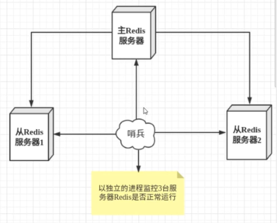

- 哨兵的作用：
  
  - 通过发送命令，让Redis服务器返回监控其运行状态，包括主服务器和从服务器,
  - 当哨兵监测到master宕机，会自动将slave切换成master，然后通过发布订阅模式通知其他的从服务器，修改配置文件，让它们切换主机。

- 问题：哨兵宕机了怎么办？？？
  
  - 采用多哨兵模式
  - 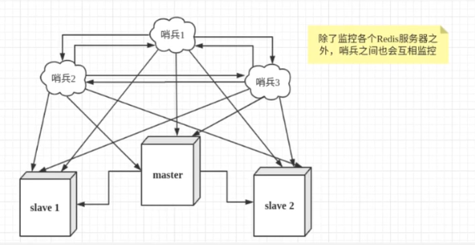

- 假设主服务器宕机，哨兵1先检测到这个结果，系统并不会马上进行**fail over[故障转移]**过程，因为仅仅是哨兵1主观的认为主服务器不可用，这个现象成为**主观下线**。

- 当后面的哨兵也检测到主服务器不可用，并且数量达到一定值时，那么哨兵之间就会进行一次投票，投票的结果由一个哨兵发起，进行**fail over[故障转移]**操作。切换成功后，就会通过发布订阅模式，让各个哨兵把自己监控的从服务器实现切换主机，这个过程称为**客观下线**。

- 测试：
  
  - ```bash
    # 目前的状态：一主(6379)二从(6380,6381)
    # 配置哨兵文件
    vim sentinel.conf
    # 输入：sentinel monitor 被监控的主机名称(自定义即可) host post 1 
    # 1代表主机宕机了，slave投票看让谁接替主机，谁的票数多，谁就会成为主机
    sentinel monitor myredis 127.0.0.1 6379 1
    ```
    
    [root@izwz94aowfpx0xt7uw61tbz kingconfig]# vim sentinel.conf
    [root@izwz94aowfpx0xt7uw61tbz kingconfig]# cd ..
    [root@izwz94aowfpx0xt7uw61tbz bin]# ls
    6379.log  6381.log      dump6381.rdb  kingconfig       redis-check-aof  redis-cli       redis-server
    6380.log  dump6380.rdb  dump.rdb      redis-benchmark  redis-check-rdb  redis-sentinel
    
    # 启动哨兵
    
    [root@izwz94aowfpx0xt7uw61tbz bin]# redis-sentinel kingconfig/sentinel.conf
    16631:X 26 Oct 2021 14:15:11.407 # oO0OoO0OoO0Oo Redis is starting oO0OoO0OoO0Oo
    16631:X 26 Oct 2021 14:15:11.407 # Redis version=6.2.6, bits=64, commit=00000000, modified=0, pid=16631, just started
    16631:X 26 Oct 2021 14:15:11.408 # Configuration loaded
    16631:X 26 Oct 2021 14:15:11.408 * monotonic clock: POSIX clock_gettime
    
                    _._
               _.-``__ ''-._
          _.-``    `.  `_.  ''-._           Redis 6.2.6 (00000000/0) 64 bit
    
      .-`` .-```.  ```\/    _.,_ ''-._
     (    '      ,       .-`  | `,    )     Running in sentinel mode
     |`-._`-...-` __...-.``-._|'` _.-'|     Port: 26379
     |    `-._   `._    /     _.-'    |     PID: 16631
      `-._    `-._  `-./  _.-'    _.-'
     |`-._`-._    `-.__.-'    _.-'_.-'|
     |    `-._`-._        _.-'_.-'    |           https://redis.io
      `-._    `-._`-.__.-'_.-'    _.-'
     |`-._`-._    `-.__.-'    _.-'_.-'|
     |    `-._`-._        _.-'_.-'    |
      `-._    `-._`-.__.-'_.-'    _.-'
    
          `-._    `-.__.-'    _.-'
              `-._        _.-'
                  `-.__.-'
    
    16631:X 26 Oct 2021 14:15:11.409 # WARNING: The TCP backlog setting of 511 cannot be enforced because /proc/sys/net/core/somaxconn is set to the lower value of 128.
    
    16631:X 26 Oct 2021 14:15:11.412 # Sentinel ID is bfae6272373bd357bee1c4ec499457add323b8e3
    16631:X 26 Oct 2021 14:15:11.412 # +monitor master myredis 127.0.0.1 6379 quorum 1
    16631:X 26 Oct 2021 14:15:11.413 * +slave slave 127.0.0.1:6380 127.0.0.1 6380 @ myredis 127.0.0.1 6379
    16631:X 26 Oct 2021 14:16:21.735 * +slave slave 127.0.0.1:6381 127.0.0.1 6381 @ myredis 127.0.0.1 6379
    16631:X 26 Oct 2021 14:17:09.752 # +sdown master myredis 127.0.0.1 6379
    16631:X 26 Oct 2021 14:17:09.752 # +odown master myredis 127.0.0.1 6379 #quorum 1/1
    16631:X 26 Oct 2021 14:17:09.752 # +new-epoch 1
    16631:X 26 Oct 2021 14:17:09.752 # +try-failover master myredis 127.0.0.1 6379
    16631:X 26 Oct 2021 14:17:09.755 # +vote-for-leader bfae6272373bd357bee1c4ec499457add323b8e3 1
    16631:X 26 Oct 2021 14:17:09.755 # +elected-leader master myredis 127.0.0.1 6379
    16631:X 26 Oct 2021 14:17:09.755 # +failover-state-select-slave master myredis 127.0.0.1 6379
    16631:X 26 Oct 2021 14:17:09.821 # +selected-slave slave 127.0.0.1:6381 127.0.0.1 6381 @ myredis 127.0.0.1 6379
    16631:X 26 Oct 2021 14:17:09.822 * +failover-state-send-slaveof-noone slave 127.0.0.1:6381 127.0.0.1 6381 @ myredis 127.0.0.1 6379
    16631:X 26 Oct 2021 14:17:09.888 * +failover-state-wait-promotion slave 127.0.0.1:6381 127.0.0.1 6381 @ myredis 127.0.0.1 6379
    16631:X 26 Oct 2021 14:17:10.842 # +promoted-slave slave 127.0.0.1:6381 127.0.0.1 6381 @ myredis 127.0.0.1 6379
    16631:X 26 Oct 2021 14:17:10.842 # +failover-state-reconf-slaves master myredis 127.0.0.1 6379
    16631:X 26 Oct 2021 14:17:10.929 * +slave-reconf-sent slave 127.0.0.1:6380 127.0.0.1 6380 @ myredis 127.0.0.1 6379
    16631:X 26 Oct 2021 14:17:11.732 * +slave-reconf-inprog slave 127.0.0.1:6380 127.0.0.1 6380 @ myredis 127.0.0.1 6379
    16631:X 26 Oct 2021 14:17:11.732 * +slave-reconf-done slave 127.0.0.1:6380 127.0.0.1 6380 @ myredis 127.0.0.1 6379
    16631:X 26 Oct 2021 14:17:11.798 # +failover-end master myredis 127.0.0.1 6379
    16631:X 26 Oct 2021 14:17:11.798 # +switch-master myredis 127.0.0.1 6379 127.0.0.1 6381
    16631:X 26 Oct 2021 14:17:11.798 * +slave slave 127.0.0.1:6380 127.0.0.1 6380 @ myredis 127.0.0.1 6381
    16631:X 26 Oct 2021 14:17:11.798 * +slave slave 127.0.0.1:6379 127.0.0.1 6379 @ myredis 127.0.0.1 6381
    16631:X 26 Oct 2021 14:17:41.814 # +sdown slave 127.0.0.1:6379 127.0.0.1 6379 @ myredis 127.0.0.1 6381
    
    ```
    
    ```

- 如果Master节点断开了，这个时候就会从从机中随机选择一个服务器，（投票算法，未完待续）

- 如果Master节点断开又回来了，此时就不再是主机了，而是新投票出来的节点作为Master，而之前的Master作为从机

- 优点：
  
  - 哨兵集群，基于主从复制模式，所有的主从配置优点都有
  - 主从可以切换，故障可以转移，系统的可用性就会很好
  - 哨兵模式就是主从模式的设计，手动升级到自动，更加健壮

- 缺点：
  
  - Redis不好在线扩容，集群容量一旦到达上限，在线扩容就十分麻烦
  - 实现哨兵模式的配置其实是很麻烦的，里面很多选择：建议百度or官方！

## 12. Redis缓存穿和崩

- Redis缓存的使用，极大的提升了应用程序的性能和效率，特别是数据查询方面。但同时，它也带来了一些问题。其中，最要害的问题，就是数据的一致性问题，从严格意义上讲，这个问题无解。如果对数据的一致性要求很高，那么就不能使用缓存。
- 另外的一些典型问题就是，缓存穿透、缓存雪崩和缓存击穿。目前，业界也都有比较流行的解决方案。

### 12.1 缓存穿透

- 可用想象为：广度，超多的不存在数据的查询

- 概念：
  
  - 缓存穿透的概念很简单，用户想要查询一个数据，发现redis内存数据库没有，也就是缓存没有命中，于是向持久层数据库查询。发现也没有，于是本次查询失败。当用户很多的时候，缓存都没有命中（秒杀），于是都去请求了持久层数据库。这会给持久层数据库造成很大的压力，这时候就相当于出现了缓存穿透。

- 解决方案：
  
  - 布隆过滤器：布隆过滤器是一种数据结构，对所有可能查询的参数以hash形式存储，在控制层先进行校验，不符合则丢弃，从而避免了对底层存储系统的查询压力
    - 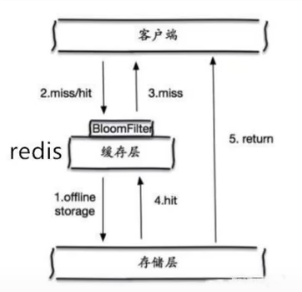
  - 缓存空对象：当存储层不命中后，即使返回的空对象也将其缓存起来，同时会设置一个过期时间，之后再访问这个数据将会从缓存中获取，保护了后端数据源
    - 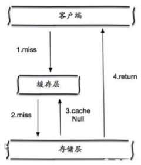

- 仍然存在的问题：
  
  - 如果空值能够被缓存起来，这就意味着缓存需要更多的空间存储更多的键，因为这当中可能会有很多的空值的键;
  - 即使对空值设置了过期时间，还是会存在缓存层和存储层的数据会有一段时间窗口的不一致，这对于需要保持一致性的业务会有影响。

### 12.2 缓存击穿

- 可用想象为：深度，超多的存在数据的查询，缓存过期的一瞬间击穿缓存，到达数据库

- 概念：
  
  - 这里需要注意和缓存击穿的区别，缓存击穿，是指一个key非常热点，在不停的扛着大并发，大并发集中对这一个点进行访问，当这个key在失效的瞬间，持续的大并发就穿破缓存，直接请求数据库，就像在一个屏障上凿开了一个洞。
  - 当某个key在过期的瞬间，有大量的请求并发访问，这类数据一般是热点数据，由于缓存过期，会同时访问数据库来查询最新数据，并且回写缓存，会导使数据库瞬间压力过大。

- 解决方案：
  
  - 设置热点数据不过期：
    - 从缓存层面来看，没有设置过期时间，所以不会出现热点key过期后产生的问题。
  - 加互斥锁：
    - 分布式锁∶使用分布式锁，保证对于每个key同时只有一个线程去查询后端服务（就算击穿了缓存，MySQL也能加锁保证只有一个线程能够查询），其他线程没有获得分布式锁的权限，因此只需要等待即可。这种方式将高并发的压力转移到了分布式锁，因此对分布式锁的考验很大。

### 12.3 缓存雪崩

- 概念：
  - 缓存雪崩，是指在某一个时间段，缓存集中过期失效。Redis集体宕机
  - 产生雪崩的原因之一，比如在写本文的时候，马上就要到双十二零点，很快就会迎来一波抢购，这波商品时间比较集中的放入了缓存，假设缓存一个小时。那么到了凌晨一点钟的时候，这批商品的缓存就都过期了。而之后对这批商品的访问查询，都落到了数据库上，对于数据库而言，就会产生周期性的压力波峰。于是所有的请求都会达到存储层，存储层的调用量会暴增，造成存储层也会挂掉的情况。
  - 
- 其实集中过期，倒不是非常致命，比较致命的缓存雪崩，是缓存服务器某个节点宕机或断网。因为自然形成的缓存雪崩，一定是在某个时间段集中创建缓存，这个时候，数据库也是可以顶住压力的。无非就是对数据库产生周期性的压力而已。而缓存服务节点的宕机，对数据库服务器造成的压力是不可预知的，很有可能瞬间就把数据库压垮。
- 解决方案：
  - redis高可用：
    - 既然redis有可能挂掉，那我多增设几台redis，这样一台挂掉之后其他的还可以继续工作，其实就是搭建的集群（异地多活）。
  - 限流降级（SpringCloud有讲解）：
    - 在缓存失效后，通过加锁或者队列来控制读数据库写缓存的线程数量。比如对某个key只允许一个线程查询数据和写缓存，其他线程等待。
  - 数据预热：
    - 在正式部署之前，我先把可能的数据先预先访问一遍，这样部分可能大量访问的数据就会加载到缓存中。在即将发生大并发访问前手动触发加载缓存不同的key，设置不同的过期时间，让缓存失效的时间点尽量均匀。