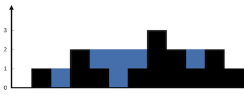
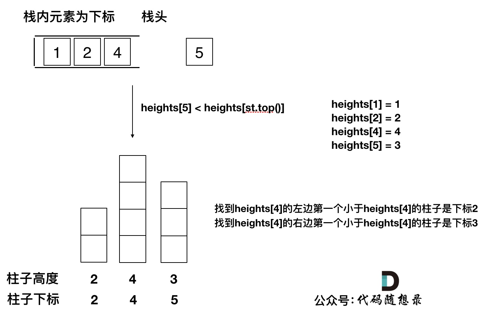

# 单调栈理解

- 主要参考自：https://programmercarl.com/0739.%E6%AF%8F%E6%97%A5%E6%B8%A9%E5%BA%A6.html#%E6%80%9D%E8%B7%AF

## 1.单调栈是什么？

- 顾名思义：就是栈中的数据是有序的！
- 待续！

## 2. 入门实例

> - leetcode：https://leetcode-cn.com/problems/daily-temperatures/
> 
> - 请根据每日 气温 列表，重新生成一个列表。对应位置的输出为：要想观测到更高的气温，至少需要等待的天数。如果气温在这之后都不会升高，请在该位置用 0 来代替。
>   
>   例如，给定一个列表 temperatures = [73, 74, 75, 71, 69, 72, 76, 73]，你的输出应该是 [1, 1, 4, 2, 1, 1, 0, 0]。
>   
>   提示：气温 列表长度的范围是 [1, 30000]。每个气温的值的均为华氏度，都是在 [30, 100] 范围内的整数

- 分析：
  
  - 什么时候可用使用单调栈？
    - 通常是一维数组，要寻找任一一个元素的右边或者左边第一个比自己大或者小的元素位置时，就可用使用单调栈！
  - 本题题意：找一个元素右边比自己大的元素
  - 单调栈的原理？为什么时间复杂度是O(n)就可以找到每一个元素的右边第一个比它大的元素位置呢？
    - 单调栈的本质是：空间换时间，因为在遍历过程中需要用一个栈来记录右边第一个比当前元素大的元素
    - 单调栈的优点是：只需要遍历一次！
  - 使用单调栈：
    - 明确单调栈里面存放什么？
      - 单调栈里只需要存放元素的下标i就可以了，如果需要使用对应的元素，直接T[i]就可以获取。
    - 单调栈里元素是递增呢？ 还是递减呢？**注意顺序为 从栈顶到栈底的顺序**，
      - 递增循序（再强调一下是指从栈头到栈底的顺序），因为只有递增的时候，加入一个元素i，才知道栈顶元素在数组中右面第一个比栈顶元素大的元素是i。
  - 理解单调栈：
    - 主要判断三个条件：
      - 当前遍历的元素T[i]小于栈顶元素T[st.top()]的情况
        - 加入栈中即可
      - 当前遍历的元素T[i]等于栈顶元素T[st.top()]的情况
        - 加入栈中即可，因为我们是要求右边第一个大于本元素的数值！而不是大于等于
      - 当前遍历的元素T[i]大于栈顶元素T[st.top()]的情况
        - 弹出栈顶st.top()，计算结果数组result(st.top)，T[i]继续判断和栈顶元素的关系

- 单调栈模拟过程：
  
  - 建议看原文！https://programmercarl.com/0739.%E6%AF%8F%E6%97%A5%E6%B8%A9%E5%BA%A6.html#%E6%80%9D%E8%B7%AF

- ```java
  class Solution {
      public int[] dailyTemperatures(int[] temperatures) {
          Deque<Integer> stack = new LinkedList<>();
          int[] ans = new int[temperatures.length];
          stack.push(0);
          for(int i=1;i<temperatures.length;i++){
              // 如果当前元素比栈顶元素大，说明找到了栈顶元素 最右边比它大的元素
              // 计算下标，并且出栈，再判断下一个，只到当前元素比栈顶元素小于等于就入栈=》所以是一个单调递减的栈，从栈低到栈顶来看的话
              while(!stack.isEmpty()&&temperatures[i]>temperatures[stack.peek()]){
                  int index=stack.pop();
                  ans[index]=i-index;
              }
              if(stack.isEmpty()||temperatures[i]<=temperatures[stack.peek()]){
                  stack.push(i);
              }
          }
          return ans;
  
      }
  }
  ```

---

> - leetcode：https://leetcode-cn.com/problems/next-greater-element-i/
> 
> - 给你两个 没有重复元素 的数组 nums1 和 nums2 ，其中nums1 是 nums2 的子集。
>   
>   请你找出 nums1 中每个元素在 nums2 中的下一个比其大的值。
>   
>   nums1 中数字 x 的下一个更大元素是指 x 在 nums2 中对应位置的右边的第一个比 x 大的元素。如果不存在，对应位置输出 -1 。
>   
>   示例 1:
>   
>   输入: nums1 = [4,1,2], nums2 = [1,3,4,2].
>    输出: [-1,3,-1]
>    解释:
>    对于 num1 中的数字 4 ，你无法在第二个数组中找到下一个更大的数字，因此输出 -1 。
>    对于 num1 中的数字 1 ，第二个数组中数字1右边的下一个较大数字是 3 。
>    对于 num1 中的数字 2 ，第二个数组中没有下一个更大的数字，因此输出 -1 。
>   
>   示例 2:
>    输入: nums1 = [2,4], nums2 = [1,2,3,4].
>    输出: [3,-1]
>    解释:
>    对于 num1 中的数字 2 ，第二个数组中的下一个较大数字是 3 。
>    对于 num1 中的数字 4 ，第二个数组中没有下一个更大的数字，因此输出-1 。
>   
>   提示：
>   
>   - 1 <= nums1.length <= nums2.length <= 1000
>   - 0 <= nums1[i], nums2[i] <= 10^4
>   - nums1和nums2中所有整数 互不相同
>   - nums1 中的所有整数同样出现在 nums2 中

- 分析：
  
  - 还是使用单调栈的思想，但是有两个数组？
    - 先求完整数组nums2的右边最大，再通过Map映射会要求的num1

- ```java
  class Solution {
      public int[] nextGreaterElement(int[] nums1, int[] nums2) {
          // 单调栈
          Deque<Integer> stack = new LinkedList<>();
          // 用来存储nums2中每个元素的右边最大值，// 默认为-1;
          Map<Integer,Integer> nextGreat = new HashMap<>();
          for(int i=0;i<nums2.length;i++){
              nextGreat.put(nums2[i],-1);
          }
          for(int i=0;i<nums2.length;i++){
              // 如果当前栈顶元素比目前遍历的元素小，说明已经找到了这个栈顶元素对应的右边最大的元素！
              while(!stack.isEmpty()&&nums2[i]>nums2[stack.peek()]){
                  int index = stack.pop();
                  nextGreat.put(nums2[index],nums2[i]);
              }
              stack.push(i);
          }
          // for(int i=0;i<nums2.length;i++){
          //     System.out.println(nums2[i]+"===="+nextGreat.get(nums2[i]));
          // }
          // 然后根据nums1在map中找对应的value即可
          int[] ans = new int[nums1.length];
          for(int i=0;i<nums1.length;i++){
              ans[i]=nextGreat.get(nums1[i]);
          }
          return ans;
      }
  }
  ```

- 改进：
  
  - Map作为num1的值和下标的索引，
  - 但是核心还是求解nums2的最大右元素，再判断是不是num1中的，如果是赋值，如果不是继续操作即可

- ```java
  class Solution {
      public int[] nextGreaterElement(int[] nums1, int[] nums2) {
          // 单调栈
          Deque<Integer> stack = new LinkedList<>();
          int[] res = new int[nums1.length];
          Arrays.fill(res,-1);
          // 用来记录nums1中元素对应的位置
          HashMap<Integer,Integer> hashMap = new HashMap<>();
          for(int i=0;i<nums1.length;i++){
              hashMap.put(nums[i],i);
          }
          stack.add(0);
          for(int i=1;i<nums2.length;i++){
              // 如果当前元素小于等于栈顶元素，说明不是右边最大，放入栈中即可
              if(nums2[i]<=nums2[stack.peek()]){
                  stack.push(i);
              }else{
                  // 如果当前元素大于栈顶元素，说明是右边最大，弹出，并且判断是否是所求
                  while(!stack.isEmpty()&&nums2[stack.peek()]<nums2[i]){
                      if(hashMap.containsKey(nums2[stack.peek()])){
                          // 获取nusm1中的索引，并且赋值
                          Integer index = hashMap.get(nums2[stack.peek()]);
                          res[index]=nums[i];
                      }
                         stack.pop();
                  }
                  stack.push(i);
              }
          }
          return res;
      }
  }
  ```

---

> - leetcode：https://leetcode-cn.com/problems/next-greater-element-ii/
> 
> - 给定一个循环数组（最后一个元素的下一个元素是数组的第一个元素），输出每个元素的下一个更大元素。数字 x 的下一个更大的元素是按数组遍历顺序，这个数字之后的第一个比它更大的数，这意味着你应该循环地搜索它的下一个更大的数。如果不存在，则输出 -1。
>   
>   示例 1:
>   
>   - 输入: [1,2,1]
>   - 输出: [2,-1,2]
>   - 解释: 第一个 1 的下一个更大的数是 2；数字 2 找不到下一个更大的数；第二个 1 的下一个最大的数需要循环搜索，结果也是 2。

- 思路：
  
  - 使用单调栈，重点是如何处理循环数组？？？
    - 法一：两个数组拼接，求解！=>空间
    - 法二：在遍历过程中模拟走两边数组=>for循环2*nums.length，时间

- ```java
  class Solution{
      public int[] nextGreaterElements(int[] nums){
          // 边界判断
          if(nums==null||nums.length<=1){
              return new int[]{-1};
          }
          int size = nums.length;
          int[] res = new int[size];
          Arrays.fill(res,-1);
          Stack<Integer> st = new Stack<>();
          for(int i=0;i<2*size;i++){
              // 如果当前元素大于栈顶元素，则找到了对应的右边最大的元素
              while(!st.isEmpty()&&nums[i%size]>nums[st.peek()]){
                  res[st.peek()]=nums[i%size];
                  st.pop();
              }
              st.push(i%size);
          }
          return res;
      }
  }
  ```

---

> - leetcode：https://leetcode-cn.com/problems/trapping-rain-water/
> - 
> - 给定 n 个非负整数表示每个宽度为 1 的柱子的高度图，计算按此排列的柱子，下雨之后能接多少雨水。
> - 输入：height = [0,1,0,2,1,0,1,3,2,1,2,1]
> - 输出：6
> - 解释：上面是由数组 [0,1,0,2,1,0,1,3,2,1,2,1] 表示的高度图，在这种情况下，可以接 6 个单位的雨水（蓝色部分表示雨水）。
> 
> 示例 2：
> 
> - 输入：height = [4,2,0,3,2,5]
> - 输出：9

- 分析：
  
  - 很难，有很多种方法，但是核心是怎么计算面积！
  - 是根据一行一行的计算还是一列一列的计算！

- 双指针法：
  
  - 

- ```java
  class Solution{
      public int trap(int[] height){
          int sum = 0;
          for(int i=0;i<height.length;i++){
              // 第一个和最后一个柱子不接水
              if(i==0||i==height.length-1){
                  continue;
              }
  
              // 用于记录左右两边住子的最高高度
              int rHeight= height[i];
              int lHeight = height[i];
              // 往右边找最高的值
              for(int r=i+1;r<height.length;r++){
                  if(height[r]>rHeight){
                      rHeight = height[r];
                  }
              }
              // 往左边找最高的值
              for(int l=i-1;l>=0;l--){
                  if(height[l]>lHeight){
                      lHeight=height[l];
                  }
              }
              // System.out.println("此时在找下标为："+i+"的左右两边的最高高度为：["+lHeight+"->"+rHeight+"]");
              // 找到了凹谷，计算面积
              int h = Math.min(lHeight,rHeight)-height[i];
              if(h>0){
                  sum+=h;
              }
  
          }
          return sum;
      }
  }
  ```

- 单调栈法：
  
  - 根据凹槽来计算，也是行来计算
  - 
  - 

- ```java
  class Solution{
      public int trap(int[] height){
          // 单调栈
          Stack<Integer> stack = new Stack<>();
          stack.push(0);
          int sum = 0;
          for(int i=1;i<height.length;i++){
              // 当前元素小于栈顶元素，不会构成凹槽
              if(height[i]<height[stack.peek()]){
                  stack.push(i);
              }else if (height[i]==height[stack.peek()]){
                  // 当前元素等于栈顶元素，去重，无用
                  stack.pop();
                  stack.push(i);
              }else{
                  // 开始获取凹槽
                  // 当前元素大于栈顶元素，根据单调栈的构造，如果栈里面不是只有一个元素的话！
                  // 肯定会构成凹槽
                  while(!stack.isEmpty()&&height[i]>height[stack.peek()]){
                      int mid = stack.pop();
                      if(!stack.isEmpty()){
                          int h = Math.min(height[stack.peek()],height[i])-height[mid];
                          int w = i - stack.peek()-1;
                          sum+=h*w;
                      }
                  }
                  stack.push(i);
              }
          }
          return sum;
      }
  }
  ```

---

> - leetcode：https://leetcode-cn.com/problems/largest-rectangle-in-histogram/
> 
> - 给定 *n* 个非负整数，用来表示柱状图中各个柱子的高度。每个柱子彼此相邻，且宽度为 1 。
>   
>   求在该柱状图中，能够勾勒出来的矩形的最大面积。
> 
> - ```
>   输入：heights = [2,1,5,6,2,3]
>   输出：10
>   解释：最大的矩形为图中红色区域，面积为 10
>   ```

- 分析：
  
  - 与上一题类似！
  - 上一题：找每个柱子只有两边第一个大于该柱子高度的柱子=>栈底到栈顶是从大到小的！
  - 而本题：找每个柱子左右两边第一个小于该柱子的柱子=>栈底到栈顶是从小到大的！
  - 认真查看！
  - 

- ```java
  class Solution{
      public int largestRectangleArea(int[] heights){
          Stack<Integer> stack = new Stack<>();
          int[] temp = new int[heights.length+2];
          for(int i=1;i<=heights.length;i++){
              temp[i]=heights[i-1];
          }
          // for(int n:temp){
          //     System.out.println(n);
          // }
  ```
  
          stack.push(0);
          int result = 0;
          for(int i=1;i<temp.length;i++){
              // 使栈种始终保存从小到大的顺序，栈底到栈顶
              if(temp[i]>temp[stack.peek()]){
                  stack.push(i);
              }else if(temp[i]==temp[stack.peek()]){
                  stack.pop();
                  stack.push(i);
              }else{
                  // 如果当前元素小于栈顶元素，此时就应该计算面积
                  while(!stack.isEmpty()&&temp[i]<temp[stack.peek()]){
                      int mid = stack.pop();// 3 6 2 5
                      if(!stack.isEmpty()){
                          int left = stack.peek(); // 2 5 1 1
                          int right = i; // 4 2 
                          int w = right -left -1;// 2
                          int h = temp[mid];// 5 
                          result = Math.max(result,w*h);//6
                      }
                  }
                   stack.push(i);
              }
      
          }
          return result;
      }
  
  }

```
- 
```
