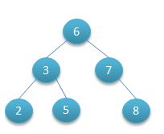
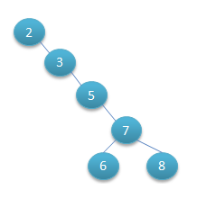
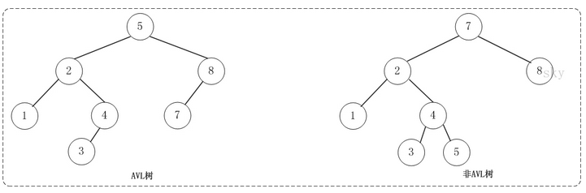
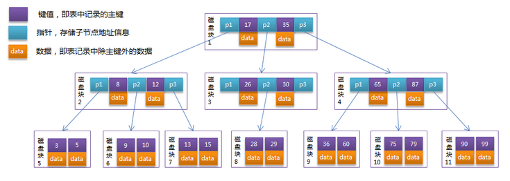
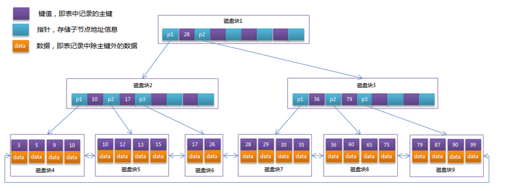
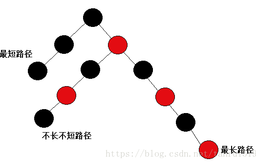

# 树型数据结构理解

- 主要参考自：https://blog.csdn.net/u013235478/article/details/50625677
- 这种数据结构的目的：
  - **用二分法和数据平衡策略来提升查找数据的速度**
  - 方便查找！！！

## 1. 二叉查找树

- 什么是二叉查找树？
  - 其实也叫二叉搜索树
  - 具有以下性质的二叉树：就是二叉查找树
    - 左子树的键值小于根的键值，右子树的键值大于根的键值
- 
- 问题：
  - 二叉查找树容易退化为有序数组=》导致查找效率变低！
- 

## 2. 平衡二叉树

- 为了解决二叉查找树退化问题
  - 解决了排序的基本问题，但是由于无法保证平衡，可能退化为链表
- 什么是平衡二叉树？
  - 在符号二叉查找树的前提下，还需要满足：
    - 任何节点的两个子树的高度最大差为1
- 
- 在进行平衡二叉树的插入或者删除时，会导致原来的平衡二叉树不平衡：
  - **LL**：LeftLeft，也称“左左”。插入或删除一个节点后，根节点的左孩子（Left Child）的左孩子（Left Child）还有非空节点，导致根节点的左子树高度比右子树高度高2，AVL树失去平衡。
  - **RR**：RightRight，也称“右右”。插入或删除一个节点后，根节点的右孩子（Right Child）的右孩子（Right Child）还有非空节点，导致根节点的右子树高度比左子树高度高2，AVL树失去平衡。
  - **LR**：LeftRight，也称“左右”。插入或删除一个节点后，根节点的左孩子（Left Child）的右孩子（Right Child）还有非空节点，导致根节点的左子树高度比右子树高度高2，AVL树失去平衡。
  - **RL**：RightLeft，也称“右左”。插入或删除一个节点后，根节点的右孩子（Right Child）的左孩子（Left Child）还有非空节点，导致根节点的右子树高度比左子树高度高2，AVL树失去平衡。
- AVL树失去平衡之后，可以通过旋转使其恢复平衡：
  - **LL的旋转**。LL失去平衡的情况下，可以通过一次旋转让AVL树恢复平衡。步骤如下：
    1. 将根节点的左孩子作为新根节点。
    2. 将新根节点的右孩子作为原根节点的左孩子。
    3. 将原根节点作为新根节点的右孩子。
  - **RR的旋转**：RR失去平衡的情况下，旋转方法与LL旋转对称，步骤如下：
    1. 将根节点的右孩子作为新根节点。
    2. 将新根节点的左孩子作为原根节点的右孩子。
    3. 将原根节点作为新根节点的左孩子。
  - **LR的旋转**：LR失去平衡的情况下，需要进行两次旋转，步骤如下：
    1. 围绕根节点的左孩子进行RR旋转。
    2. 围绕根节点进行LL旋转。
  - **RL的旋转**：RL失去平衡的情况下也需要进行两次旋转，旋转方法与LR旋转对称，步骤如下：
    1. 围绕根节点的右孩子进行LL旋转。
    2. 围绕根节点进行RR旋转。
- 存在问题：
  - 当数据量庞大时，构建的平衡二叉树也会极深，IO次数太多

## 3. B树

- 为了解决平衡二叉树太高、导致的IO次数过多问题
  - 通过旋转解决了平衡的问题，但是旋转操作效率太低

- 什么是B树？
  - 也称：平衡多路查找树=》也就是查找路径不只两个的平衡树
  - 也称：2-3树：每个节点有两个关键字，三个分支(M=3)=>也称3阶B树(M=3)
  - 具有以下特性的树：称为B树
    -  排序方式：所有节点关键字是按递增次序排列，并遵循左小右大原则；
    - 子节点数：非叶节点的子节点数>1，且<=M ，且M>=2，空树除外（注：M阶代表一个树节点最多有多少个查找路径，M=M路,当M=2则是2叉树,M=3则是3叉）；
    - 关键字数：枝节点的关键字数量大于等于ceil(m/2)-1个且小于等于M-1个（注：ceil()是个朝正无穷方向取整的函数 如ceil(1.1)结果为2);
    - 所有叶子节点均在同一层、叶子节点除了包含了关键字和关键字记录的指针外也有指向其子节点的指针只不过其指针地址都为null对应下图最后一层节点的空格子
- B树在MySQL中的应用：
  - 系统如何从磁盘中读取文件？
    - 系统从磁盘读取数据到内存时是以磁盘块（block）为基本单位的，位于同一个磁盘块中的数据会被一次性读取出来，而不是需要什么取什么。
  - InnoDB如何划分数据、存储数据？
    - InnoDB存储引擎中有页（Page）的概念，页是其磁盘管理的最小单位。InnoDB存储引擎中默认每个页的大小为16KB，可通过参数innodb_page_size将页的大小设置为4K、8K、16K，
    - InnoDB每次申请磁盘空间时都会是若干地址连续磁盘块来达到页的大小16KB。InnoDB在把磁盘数据读入到磁盘时会以页为基本单位，在查询数据时如果一个页中的每条数据都能有助于定位数据记录的位置，这将会减少磁盘I/O次数，提高查询效率。
- 
- 说明：
  - 每个节点占用一个盘块的磁盘空间，一个节点上有两个升序排序的关键字和三个指向子树根节点的指针，指针存储的是子节点所在磁盘块的地址。两个关键词划分成的三个范围域对应三个指针指向的子树的数据的范围域。以根节点为例，关键字为17和35，P1指针指向的子树的数据范围为小于17，P2指针指向的子树的数据范围为17~35，P3指针指向的子树的数据范围为大于35。
  - 模拟查找关键字29的过程：
    - 根据根节点找到磁盘块1，读入内存。【磁盘I/O操作第1次】
    - 比较关键字29在区间（17,35），找到磁盘块1的指针P2。
    - 根据P2指针找到磁盘块3，读入内存。【磁盘I/O操作第2次】
    - 比较关键字29在区间（26,30），找到磁盘块3的指针P2。
    - 根据P2指针找到磁盘块8，读入内存。【磁盘I/O操作第3次】
    - 在磁盘块8中的关键字列表中找到关键字29。
- B-Tree相对于AVLTree缩减了节点个数，使每次磁盘I/O取到内存的数据都发挥了作用，从而提高了查询效率
- 存在的问题：
  - 每个节点不仅包含数据的Key值，还包含data数据
  - 但是每一页的存储框架是有限的，如果data数据较大，就会导致每个节点能存储的key值很小
  - 当存储的数据量很大时同样会导致B-Tree的深度较大，增大查询时的磁盘I/O次数，进而影响查询效率。

## 4. B+树

- 为了解决B树的高度受data大小的影响导致树太高=》IO次数也变多的问题
  - 所有数据记录节点都是按照键值大小顺序存放在同一层的叶子节点上，而非叶子节点上只存储key值信息，这样可以大大加大每个节点存储的key值数量，降低B+Tree的高度。
- 什么是B+树？
  - B+跟B树不同B+树的**非叶子**节点不保存关键字记录的指针，只进行数据索引，这样使得B+树每个**非叶子**节点所能保存的关键字大大增加；=》非叶子节点只存储键值信息。
  - B+树**叶子**节点保存了父节点的所有关键字记录的指针，所有数据地址必须要到叶子节点才能获取到。所以每次数据查询的次数都一样；=》数据记录都存放在叶子节点中
  - B+树叶子节点的关键字从小到大有序排列，左边结尾数据都会保存右边节点开始数据的指针。=》所有叶子节点之间都有一个链指针。
- 
- 通常在B+Tree上有两个头指针，一个指向根节点，另一个指向关键字最小的叶子节点，而且所有叶子节点（即数据节点）之间是一种链式环结构。
  - 因此可以对B+Tree进行两种查找运算：
    - 一种是对于主键的范围查找和分页查找，
    - 另一种是从根节点开始，进行随机查找。 
- **B树**相对于**B+树**的优点是，如果经常访问的数据离根节点很近，而**B树**的**非叶子**节点本身存有关键字其数据的地址，所以这种数据检索的时候会要比**B+树**快。
- 在B树的基础上，将非叶节点改造为不存储数据的纯索引节点，进一步降低了树的高度；此外将叶节点使用指针连接成链表，范围查询更加高效。

## 5. 红黑树

- 为什么需要红黑树？
  - 二叉搜索树会退化为链表
  - 平衡二叉树：插入和删除代价太大！
  - 红黑树并不追求严格的平衡，而是大致的平衡：只是确保从根到叶子的最长的可能路径不多于最短的可能路径的两倍长
- 红黑树和AVL树：
  - 与AVL树相比，红黑树的查询效率会有所下降，这是因为树的平衡性变差，高度更高。
  - 但红黑树的删除效率大大提高了，因为红黑树同时引入了颜色，当插入或删除数据时，只需要进行O(1)次数的旋转以及变色就能保证基本的平衡，不需要像AVL树进行O(lgn)次数的旋转。总的来说，红黑树的统计性能高于AVL。
  - 红黑树的插入删除效率更高，任何不平衡都会在三次旋转内解决
  - 二叉平衡树比红黑树更为平衡，因此插入或删除时变动频次更高，但查找效率也更高
- 什么是红黑树？
  - 在二叉树的基础之上，添加以下性质：
    - 节点是红色或黑色
    - 根节点是黑色
    - 每个为空的叶子节点是黑色的
    - 每个红色节点的两个子节点都是黑色
    - 从任一节点到其每个叶子节点的所有路径都包含相同数目的黑色节点
  - 因此可以保证：最长路径不超过最短路径的二倍，因而近似平衡。
- 
- 

