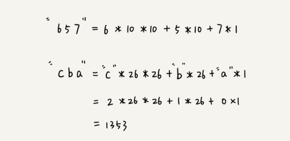
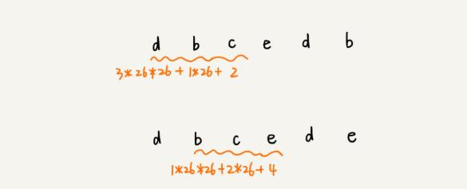
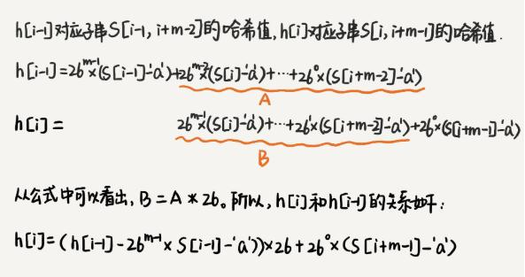

# 字符串匹配算法

- 主要参考自：https://www.pianshen.com/article/78121497453/

# 1. Rabin-Krap算法

- 前提回顾：

  - 字符串匹配：长度为n的主串和长度为m的模式串，寻找主串中是否存在模式串
  - 使用暴力匹配字符串的算法时，如果主串长度为n，模式串长度为m，那么在主串中就会存在n-m+1个长度为m的子串，一一匹配即可求解答案

- RK算法的主要思路：

  - 通过哈希函数对主串中的n-m+1个子串分别求解hash值，然后逐个和模式串的hash值进行匹配，只要hash值相等就表示匹配到了模式串
  - 因为哈希值是一个数字，因此模式串和子串的匹配效率会很快
  - 但是哈希函数如何选择是一个重点，虽然匹配效率能够提高，但是算法整体的暴力匹配的思想还是没有变，需要想办法提高哈希函数计算子串哈希值的效率！

- 如何设计一个和子串有关的哈希函数？

  - 假设：需要匹配的字符串的字符集中只包含K个字符，就可以用K进制数来表示一个子串，把这个K进制数转换为十进制数作为哈希值即可！
  - 
  - 采用这样的哈希函数：相邻两个子串的哈希值是存在一定的关系，可以类似滑动窗口的思想，没有必要每次都重新计算每个子串的hash值
  - 
  - 也就是有如下规律：
  - 
  - 产生hash冲突怎么办？
    - 再进行一次字符串相等判断即可！

- 具体代码：

  - ```java
    public class RabinKrap {
    
        public static int rabinKrap(String str,String pattern){
            int n = str.length();
            int m = pattern.length();
    
            // 只有26个小写字母，因此就26进制
            int d = 26;
    
            // 防止hash之后的值超出存储范围，对最后的hash取模
            // mod取随机素数，满足q*d<INT_MAX即可
            int mod = 1000000009;
    
            // d的m-1的幂
            long power = 1;
            // 获取最高位的幂；
            for(int i=0;i<m;i++){
                power = (power*d)%mod;
            }
            // 计算目标子串的hash值
            // 'abc'=a*26^2+b*26^1+c*26^0
            // "abc"=((a*26^0)+b)
            long patternCode = 0;
            for(int i=0;i<m;i++){
                patternCode = (patternCode*d+pattern.charAt(i)-'a')%mod;
                // a
                // a*26 + b
                // (a*26+b)*26 + c
            }
            // 滑动窗口
            long strCode = 0;
            for(int i=0;i<n;i++){
                strCode = (strCode*d+str.charAt(i)-'a')%mod;
                if(i<m-1){
                    System.out.println(str.substring(0,i)+"的hash值为："+strCode);
                    continue;
                }
                if(i>m-1){
                    // 减再+回来
                    strCode = (strCode -((str.charAt(i-m)-'a')*power)) %mod;
                    System.out.println(str.substring(i-m,i)+"的hash值为："+strCode);
                    if(strCode<0){
                        strCode+=mod;
                    }
                }
                if(strCode==patternCode&&ensureMatching(i-m+1,str,pattern)){
                    return i-m+1;
                }
            }
            return -1;
        }
    
        public static boolean ensureMatching(int i,String str,String pattern){
            String strSub = str.substring(i,i+pattern.length());
            return strSub.equals(pattern);
        }
    
        public static void main(String[] args) {
            String str = "abcabcabcdefghijklmnopqrstuvwxabcabcdefghijklmnopqrstuvwxabcdefghijklmnopqrstuvwxyzyzabcdefghijklmnopqrstuvwxyz";
            String pattern = "abcdefghijklmnopqrstuvwxyz";
            int index = rabinKrap(str,pattern);
            System.out.println(str.substring(index,index+pattern.length()));
        }
    
    
    }
    ```