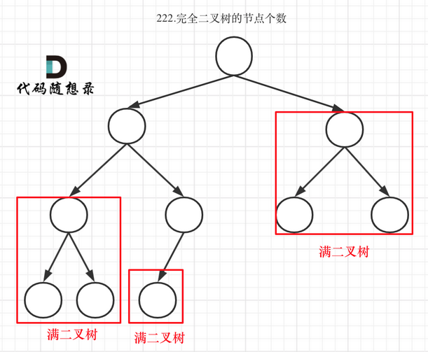

# 二叉树的理解

- 主要参考自：https://programmercarl.com/%E4%BA%8C%E5%8F%89%E6%A0%91%E7%90%86%E8%AE%BA%E5%9F%BA%E7%A1%80.html#%E4%BA%8C%E5%8F%89%E6%A0%91%E7%9A%84%E7%A7%8D%E7%B1%BB

## 1. 二叉树是什么？

- 树就是树啊，最多就是倒着的树，建议百度！

- 二叉树的种类：

  - 满二叉树：
    - 如果一颗二叉树只有度为0和2的节点，并且度为0的节点在同一层上，则这个二叉树为满二叉树
  - 完全二叉树：
    - 除了最底层节点可能没填满外，其余每层节点数都达到最大值，并且最下面一层的节点都集中在该层最左边的若干位置。若最底层为第 h 层，则该层包含 1~ 2^h -1  个节点。
    - 可以想象成从左到右，自上而下都不会存在空缺，当为空时，就已经到了最后一层
  - 堆就是一颗完全二叉树，并且能够保证父子节点的顺序关系
  - 二叉搜索树：
    - 是一个有序树，也叫二叉排序树
      - 若它的左子树不空，则左子树上所有结点的值均小于它的根结点的值；
      - 若它的右子树不空，则右子树上所有结点的值均大于它的根结点的值；
      - 它的左、右子树也分别为二叉排序树
  - 平衡二叉搜索树：
    - 也被称为AVL树：
      - 它是一棵空树或它的左右两个子树的高度差的绝对值不超过1，并且左右两个子树都是一棵平衡二叉树。

- 二叉树的存储方式：

  - 链式存储：使用指针
  - 顺序存储：使用数组
    - **如果父节点的数组下表是i，那么它的左孩子就是i \* 2 + 1，右孩子就是 i \* 2 + 2。**

- 二叉树的遍历方式：

  - 深度优先遍历：先往深走，遇到叶子节点再往回走
    - 前序遍历：递归法、迭代法
    - 中序遍历：递归法、迭代法
    - 后序遍历：递归法、迭代法
  - 广度优先遍历：一层一层的去遍历
    - 层次遍历：迭代法
  - 这些遍历方式可以说是：栈和队列的具体应用！
    - 栈可以说是递归的一种实现结构！
    - 广度优先遍历一般使用队列来实现，因为队列的先进先出的特性！

- 前中后序遍历理解：

  - 前中后指的是中间节点的遍历顺序：
    - 前序遍历：中左右
    - 中序遍历：左中右
    - 后序遍历：左右中
  - 如图：
    - 

- 二叉树的定义：

  - ```java
    public class TreeNode{
        int val;
        TreeNode left;
        TreeNode right;
        TreeNode(){
            
        }
        TreeNode(int val){
            this.val = val;
        }
        TreeNode(int val,TreeNode left,TreeNode right){
            this.val=val;
            this.left = left;
            this.right = right;
        }
    }
    ```

## 2. 二叉树的递归遍历

- 什么是递归？如何写递归？

  - **确定递归函数的参数和返回值**：确定哪些参数是递归过程中需要处理的，那么就在递归函数里加上这个参数，并且还要明确每次递归的返回值是什么进而确定递归函数的返回类型！
  - **确定终止条件：**写完递归算法运行测试时，容易遇到栈溢出的错误，大概率是没写终止条件或者终止条件错误等问题。操作系统也是使用栈结构来保存每一层递归的信息，如果递归没有终止，操作系统的内存栈必然就会溢出，然后报栈溢出错误
  - **确定单层递归的逻辑：**确定每一层递归需要处理的信息，在这里也就是会重复调用自己来实现递归过程

- 二叉树的前序遍历：

  - **确定递归函数的参数和返回值：**因为要打印处前序遍历节点的数值，所以参数里需要包含节点数值的数据类型用来存放节点数值，和节点数据，并且发现不用再处理其他数据，也不需要返回值，因此确定：

    - 参数：节点

    - 返回值：空

    - ```java
      void traversal(TreeNode cur,ArrayList<Integer> result);
      ```

  - **确定终止条件：**在递归的过程中，如何才算是递归结束了呢？当前遍历的节点是空节点时，就结束即可

    - ```java
      if(cur==NUll) return;
      ```

  - **确定单层递归的逻辑（确定递归函数的功能）：**前序遍历是中左右的顺序，因此在单层递归的逻辑中，是要先取中节点的数值

    - ```java
      result.add(cur.val);
      traversal(cur.left,result);
      traversal(cur.right,result);
      ```

- 二叉树的其他遍历过程也类似

- 代码实例：

- ```java
  // 前序遍历
  class Solution{
      // 递归函数：确定参数和返回值，确定终止条件，确定递归逻辑
      void preOrder(TreeNode root,ArrayList<Integer> result){
          if(root==null){
              return ;
          }
          result.add(root.val);
          preOrder(root.left,result);
          preOrder(root.right,result);
      }
      ArrayList<Integer> preOrderReverse(TreeNode root){
          ArrayList<Integer> result = new ArrayList<>();
          preOrder(root,result);
          return result;
      }
  }
  
  // 中序遍历
  class Solution{
      // 递归函数：确定参数和返回值，确定终止条件，确定递归逻辑
      void inOrder(TreeNode root,ArrayList<Integer> result){
          if(root == null){
              return ;
          }
          inOrder(root.left,result);
          result.add(root.val);
          inOrder(root.right,result);
      }
      
      public List<Integer> inorderTraversal(TreeNode root){
          List<Integer> res = new ArrayList<>();
          inOrder(root,res);
          return res;
      }
  }
  
  // 后序遍历
  class Solution{
      // 递归函数：确定参数和返回值，确定终止条件，确定递归逻辑
      void postOrder(TreeNode root,List<Integer> list){
          if(root==null){
              return;
          }
          postOrder(root.left,list);
          postOrder(root.right,list);
          list.add(root.val);
      }
      
      public List<Integer> postOrderTraversal(TreeNode root){
          List<Integer> res = new ArrayList<>();
          postOrder(root,res);
          return res;
      }
  }
  ```

## 3. 二叉树的迭代遍历

- 递归的实现：就是每一层递归调用都会把函数的局部遍历，参数值和返回地址等信息压入调用栈中，然后递归返回的时候，再从栈顶弹出上一次递归的各项参数，所以这就是递归为什么可以返回上一层位置的元素。

- 因此一般能够使用递归来实现的都可以用迭代来实现

- 二叉树的前序遍历：

  - 前序遍历是中左右，每次先处理的是中间节点，
  - 那么用栈实现就是：先将根节点放入栈，再放入右节点，再加入左节点
  - 为什么要先加右节点、再加左节点呢？
    - 因为这样才可以统一的定义出栈顺序为：中左右
  - 如图：
    - 

- 代码实例：

- ```java
  // 前序遍历顺序：中-左-右=》入栈顺序：中-右-左
  class Solution{
      public List<Integer> preorderTraversal(TreeNode root){
          List<Integer> result = new ArrayList<>();
          if(root==null){
              return result;
          }
          Deque<TreeNode> stack = new Deque<>();
          stack.push(root);
          while(!stack.isEmpty()){
              TreeNode node = stack.pop();
              result.add(node.val);
              if(node.right!=null){
                  stack.push(node.right);
              }
              if(node.left!=null){
                  stack.push(node.left);
              }
          }
          return result;
            
      }
  }
  ```

- 二叉树的中序遍历：

  - 在使用迭代的方式进行前序遍历的时候，主要可以分解为两个步骤：
    - 处理：将节点元素的值放入结果数值中
    - 访问：使用栈结构来组织对节点的遍历
  - 为什么不能使用前序遍历和中序遍历的代码逻辑不能通用？
    - 因为前序遍历的顺序是中左右，先访问的元素是中间节点，要处理的节点也是中间节点，所以前序遍历的代码相对简洁，因为要访问的元素和要处理的元素顺序是一致的，都是中间节点
    - 再看中序遍历，顺序是左中右，先访问的是二叉树顶部的节点，然后一层层向下访问，直到达到树左边的最底部，再开始处理节点（将节点元素的值放入结果数值中），这就造成了处理顺序和访问顺序是不一致的
  - 因此在中序遍历中，需要借助指针的遍历的帮助访问节点，栈用来处理节点上的元素！
  - 

- 代码实例

- ```java
  // 中序遍历顺序：左-中-右 入栈顺序：左-右
  class Solution{
      public List<Integer> inorderTraversal(TreeNode root){
          List<Integer> result = new ArrayList<>();
          if(root==null){
              return result;
          }
          Stack<TreeNode> stack = new Stack<>();
          TreeNode cur = root;
          while(cur!=null||!stack.isEmpty()){
              if(cur!=null){
                  stack.push(cur);
                  cur = cur.left;
              }else{
                  cur = stack.pop();
                  result.add(cur.val);
                  cur = cur.right;
              }
          }
          return result;
      }
  }
  ```

- 后序遍历：

  - 我们知道
    - 前序遍历：中左右
    - 后序遍历：左右中
    - 因此只需要调整一下前序遍历的代码顺序，就可以变成中右左的遍历顺序，再反转一下result数值，输出的结果就是左右中了！妙

- 代码实例

- ```java
  // 后序遍历顺序：左-右-中 入栈顺序：中-左-右，此时出栈顺序：中-右-左，最后反转即可
  class Solution{
      public List<Integer> postorderTraversal(TreeNode root){
          List<Integer> result = new ArrayList<>();
          if(root==null){
              return result;
          }
          Stack<TreeNode> stack = new Stack<>();
          stack.push(root);
          while(!stack.isEmpty()){
              TreeNode temp = stack.pop();
              result.add(temp.val);
              if(temp.left!=null){
                  stack.push(temp.left);
              }
              if(temp.right!=null){
                  stack.push(temp.right);
              }
          }
          // 反转！=>也可以使用双指针
          Collections.reverse(result);
          return result;
      }
  }
  ```

- 拓展总结

  - 用迭代法写出了二叉树的前后中序遍历，大家可以看出前序和中序是完全两种代码风格，并不像递归写法那样代码稍做调整，就可以实现前后中序。

    **这是因为前序遍历中访问节点（遍历节点）和处理节点（将元素放进result数组中）可以同步处理，但是中序就无法做到同步！**

  - **，难道 二叉树前后中序遍历的迭代法实现，就不能风格统一么（即前序遍历 改变代码顺序就可以实现中序 和 后序）？**

  - 可以，但是代码可读性较差

## 4.二叉树遍历的统一迭代方法

- 在上面的学习中，我们发现递归实现二叉树的遍历代码较为统一，但是使用迭代法实现的前中后序方法不统一，一会使用栈来遍历，一会使用指针来遍历

- 统一迭代写法！

  - 中序遍历与其他几个遍历不同的情况是：无法同时解决访问节点(遍历节点)和处理节点(将元素放入结果集)不一致的情况
  - 那么我们可以尝试使其同时进行访问和处理
    - 将访问的节点放入栈中，把要处理的节点也放入栈中，但是要做标记！
    - 但是如何标记呢？
      - 可以把要处理的节点放入栈后，紧接着放入一个空指针作为标记，这种方法也可以叫做标记法！，因为正在遍历的节点既有可能是中节点，也有可能是左节点，也有可能是右节点
    - 核心思路就是：
      - 结合空指针的标记，构造一个出栈顺序符合遍历规则的栈即可！！！
      - 如果不是空指针，就构造栈，使其出栈的时候符合遍历规则
        - 如：
          - 前序遍历：中-左-右：
            - 栈的构造就需要：入栈：右-左-中-null
          - 中序遍历：左-中-右：
            - 栈的构造就需要：入栈：右-中-null-左
          - 后序遍历：左-右-中：
            - 栈的构造就需要：入栈：中-null-右-左
      - 如果是空指针：就意味着下一个节点就是待处理节点，需要弹出，并且放入到结果集中

- 代码实例

- ```java
  // 中序遍历
  class Solution{
      public List<Integer> preorderTraversal(TreeNode root){
          List<Integer> result = new LinkedList<>();
          Stack<TreeNode> st = new Stack<>();
          if(root!=null){
              st.push(root);
          }
          while(!st.isEmpty()){
              TreeNode node = st.peek();
              if(node!=null){
                  // 右-中-null-左
                  
                  // 将该节点弹出，避免重复操作，
                  // 下面再将右中左节点添加进去
                  st.pop();
                  // 添加右节点
                  if(node.right!=null){
                      st.push(node.right);
                  }
                  // 添加中节点
                  st.push(node);
                  // 因为中节点已经访问过了，但是还没有处理，所以可以加入空节点标记
                  st.push(null);
                  if(node.left!=null){
                      st.push(node.left);
                  }
              }else{
                  // 只有遇到空节点时，才将下一个节点放入结果集中
                  st.pop();
                  node = st.pop();
                  result.add(node.val);
              }
          }
          return result;
      }
  }
  ```

- 图像理解

  - 
  - 此时将访问的节点直接加入到栈中，但是如果是要处理的节点，就在后面放入一个空节点，这样只有空节点弹出的时候，才将下一个节点的元素值放入结果集中

- 其他遍历方式实例

- ```java
  // 前序遍历
  class Solution{
      public List<Integer> preorderTraversal(TreeNode root){
          List<Integer> result = new LinkedList<>();
          Stack<TreeNode> st = new Stack<>();
          if(root!=null){
              st.push(root);
          }
          while(!st.isEmpty()){
              TreeNode node = st.peek();
              if(node!=null){
                  // 右-左-中-null
                  st.pop;
                  if(node.right!=null){
                      st.push(node.right);
                  }
                  if(node.left!=null){
                      st.push(node.left);
                  }
                  st.push(node);
                  st.push(null);
              }else{
                  // 遇到空节点时，才将下一个节点放入结果集
                  st.pop();
                  node = st.pop();
                  result.add(node.val);
              }
          }
      }
  }
  ```

- ```java
  // 后序遍历：右-左-中 =
  class Solution{
      public List<Integer> postorderTraversal(TreeNode root){
          List<Integer> result = new LinkedList<>();
          Deque<TreeNode> stack = new Deque<>();
          if(root!=null){
              stack.posh(root);
          }
          while(!stack.isEmpty()){
              // 此时一般都是中节点
              TreeNode node = stack.peek();
              if(node!=null){
                  // 中-null-右-左
                  
                  stack.pop();
                  // 添加中节点
                  stack.push(node);
                  stack.push(null);
                  if(node.right!=null){
                      stack.push(node.right);
                  }
                  if(node.left!=null){
                      stack.push(node.left);
                  }
                  
              }else{
                  st.pop();
                  node = stack.pop();
                  result.add(node.val);
              }
          }
          return result;
      }
  }
  ```
## 5.二叉树的层序遍历

- 层序遍历一个二叉树，就是从左到右一层层的去遍历二叉树

  - 因此一般需要使用变量来记录此时的层次信息

- 一般需要借助一个队列来实现：队列先进先出，符合一层层遍历的逻辑，而用栈先进后出适合模拟深度优先遍历也就是递归的逻辑

- 层序遍历的方式：也可以被看做图论中广度优先遍历

- 代码实例

- ```java
  class Solution{
      public List<List<Integer>> resList = new ArrayList<List<Integer>>();
      // 递归方式：确定递归参数、返回值，递归条件、递归逻辑
      // DFS
      public void dfs(TreeNode node,Integer deep){
          if(node == null){
              return ;
          }
          // 保存深度值
          deep++;
          if(resList.size()<deep){
              // 当层级增加时，List的Item也增加，利用list的索引值进行层级界定
              List<Integer> item = new ArrayList<Integer>();
              resList.add(item);
          }
          // 添加元素值
          resList.get(deep-1).add(node.val);
          dfs(node.left,deep);
          dfs(node.right,deep);
      }
      
      public List<List<Integer>> levelOrder(TreeNode root){
  		Integer deep = 0;
          dfs(root,deep);
      }
      
      // 使用迭代方式：借助队列
      // BFS
      public void bfs(TreeNode node){
          if(node ==null){
              return;
          }
          Deque<TreeNode> que = new LinkedList<>();
          while(!que.isEmpty()){
              List<Integer> itemList = new ArrayList<Integer>();
              int len = que.size();
              while(len>0){
                  TreeNode tempNode = que.poll();
                  itemList.add(tempNode.val);
                  if(tempNode.left!=null){
                      que.offer(tempNode.left);
                  }
                  if(tempNode.right!=null){
                      que.offer(tempNode.right);
                  }
                  len--;
              }
              resList.add(itemList);
          }
      }
  }
  ```

- 根据以上思想和代码模板，可以解决以下题目！

  - 102.二叉树的层序遍历：https://leetcode-cn.com/problems/binary-tree-level-order-traversal/
  - 107.二叉树的层次遍历II：https://leetcode-cn.com/problems/binary-tree-level-order-traversal-ii/
  - 199.二叉树的右视图：https://leetcode-cn.com/problems/binary-tree-right-side-view/
  - 637.二叉树的层平均值：https://leetcode-cn.com/problems/average-of-levels-in-binary-tree/
  - 429.N叉树的前序遍历：https://leetcode-cn.com/problems/n-ary-tree-level-order-traversal/
  - 515.在每个树行中找最大值：https://leetcode-cn.com/problems/find-largest-value-in-each-tree-row/
  - 116.填充每个节点的下一个右侧节点指针：https://leetcode-cn.com/problems/populating-next-right-pointers-in-each-node/
  - 117.填充每个节点的下一个右侧节点指针II：https://leetcode-cn.com/problems/populating-next-right-pointers-in-each-node-ii/
  - 104.二叉树的最大深度：https://leetcode-cn.com/problems/maximum-depth-of-binary-tree/
  - 111.二叉树的最小深度：https://leetcode-cn.com/problems/minimum-depth-of-binary-tree/

## 6. 翻转二叉树

> - leetcode：https://leetcode-cn.com/problems/invert-binary-tree/
>
> - 翻转一棵二叉树。
>
> - 示例：
>
>   输入：
>
>        4
>      /   \
>     2     7
>    / \   / \
>   1   3 6   9
>
>   输出：
>
>        4
>      /   \
>     7     2
>    / \   / \
>   9   6 3   1

- 分析：

  - 根据模拟思考：翻转二叉树只需要将每个节点的左右孩子交换一下就可以实现翻转整颗二叉树的效果了
    - 局部翻转=》整体翻转=》回顾字符串！！！
  - 那么如何遍历获取每个节点？并且**同时**进行翻转呢？
    - 前序遍历、后序遍历、层次遍历都可以
    - 中序遍历不可！因为会把某些节点的左右孩子翻转两次！

- 递归法：递归三步曲

  - 1.确定递归函数的参数和返回值

  - 2.确定终止条件

  - 3.确定单层递归的逻辑

  - 代码示例

  - ```java
    // DFS 递归
    class Solution{
        //前后序遍历都可以，中序不行，因为先左孩子交换，再根交换孩子
        // 做完后，右孩子已经变成了原来的左孩子），再右孩子交换孩子（此时其实是对原来的左孩子做交换）
        public TreeNode inverTree(TrNode root){
            if(root==null){
                return null;
            }
            // 此时是后序遍历的递归 左-右-中
            inverTree(root.left);
            inverTree(root.right);
            swapChilder(root);
            return root;
        }
        private void swapChilder(TreeNode root){
            TreeNode temp = root.left;
            root.left = root.right;
            root.right = temp;
        }
    }
    ```

- 迭代法：

  - 使用前序、后序的迭代法或者使用空指针标记的统一遍历迭代法、层次遍历都可

  - 此时使用空指针遍历的统一遍历的迭代法可以使用中序遍历来完成翻转

    - 因为是用栈遍历，并且不是同时操作(翻转)

  - 代码示例

  - ```java
    // 常规迭代法
    class Solution{
        // 前序遍历
        public TreeNode inverTree(TreeNode root){
            if(root==null){
                return root;
            }
            Deque<TreeNode> stack = new LinkedList<>();
            stack.push(root);
            while(!stack.isEmpty()){
                //前序遍历是：中=左=右：入栈顺序是：中=右=左
                TreeNode node = st.pop();
                swap(node.left,node.right);
                if(node.right!=null){
                    stack.push(node.right);
                }
                if(node.left!=null){
                    stack.push(node.left);
                }
            }
            return root;
        }
    }
    ```

  - ```java
    // 统一迭代法
    class Solution{
        // 前序遍历
        public TreeNode inverTree(TreeNode root){
            Deque<TreeNode> stack = new LinkedList<>();
            if(root!=null){
                stack.push(root);
            }
            while(!stack.isEmpty()){
                TreeNode node = stack.pop();
    			// 前序遍历：出栈：中-左-右；入栈：右-左-中-null
                if(node!=null){
                    if(node.right!=null){
                        stack.push(node.right);
                    }
                    if(node.left!=null){
                        stack.push(node.left);
                    }
                    stack.push(node);
                    stack.push(null);
                }else{
                    node = stack.pop();
                    // 要用node，不能用两个参数，因为似乎好像不会换值
                    // swap(node.left,node.right);
                    swap(node);
                }
            }
            
            return root;
        }
    }
    ```

  - ```java
    // 层次遍历 ： BFS
    class Solution{
        public TreeNode invertTree(TreeNode root){
            Deque<TreeNode> que = new LinkedList<>();
            if(root!=null){
                que.offer(root);
            }
            while(!que.isEmpty()){
                int len = que.size();
                while(len>0){
                    TreeNode node = que.poll();
                    swap(node);
                    if(node.left!=null) que.offer(node.left);
                    if(node.right!=null) que.offer(node.right);
                    len--;
                }
            }
            return root;
        }
    }
    ```

## 7. 进阶实操

> - leetcode：https://leetcode-cn.com/problems/symmetric-tree/
>
> - 例如，二叉树 [1,2,2,3,4,4,3] 是对称的。
>
>       1
>      / \
>     2   2
>    / \ / \
>   3  4 4  3
>
>    
>
>   但是下面这个 [1,2,2,null,3,null,3] 则不是镜像对称的:
>
>       1
>      / \
>     2   2
>      \   \
>      3    3

- 分析：

  - 分析清楚题意：理解对称二叉树要比较的是哪两个节点，而不是单纯的左右节点
    - 对于二叉树是否对称，要比较的是根节点的左子树和右子树是不是相互翻转的，所以也就是比较的是两个树，所以可以考虑递归遍历着两颗树
  - 那么如何比较呢？
    - 比较的是两个子树的里侧和外侧的元素是否相等
    - 那么如何遍历呢？
    - 一棵树遍历顺序是：左-右-中，另一颗树遍历顺序是：右-左-中，此时就可以同时比较两颗子树对称位置的节点值了！

- 递归法：递归三部曲

  1. 确定递归函数的参数和返回值
     - 因为我们要比较的是根节点的两个子树是否可以相互翻转，进而判断这棵树是不是对称树，所以要比较的是两颗树，参数自然就是左子树节点和右子树节点
     - 返回值是：boolean类型
  2. 确定终止条件
     - 要比较的两个节点值数值想不想同，首先要把两个节点为空的情况考虑清楚，
       - 节点为空的情况有：
         - 左子树的子节点(后面统称为左节点)为空，右子树对应位置的子节点(后面统称为右节点)不为空，不对称=》返回false
         - 左节点不为空，右节点为空，不对称=》返回fase
         - 左节点为空，右节点为空，对称=》返回true
       - 节点都不为空的情况，比较数值，数值相同就继续比较，不相同就返回false
  3. 确定单层遍历逻辑
     - 此时就是需要处理两个节点都不为空，并且数值都相同的情况
       - 比较二叉树外侧是否对称：传入左节点的左孩子，右节点的右孩子
       - 比较二叉树内测是否对称：传入左节点的右孩子，右节点的左孩子
       - 如果左右两边都true就返回true，否则返回false

- 代码示例：

- ```java
  class Solution{
      // 递归法
      private boolean compare(TreeNode left, TreeNode right){
          if(left==null&&right!=null){
              return false;
          }
          if(left!=null && right==null){
              return false;
          }
          if(left==null && right==null){
              return true;
          }
          if(left.val!=right.val){
              return false;
          }
          
          // 比较外侧
          boolean compareOutside = compare(left.left,right.right);
          // 比较内测
          boolean compareInside = compare(left.right,right.left);
          return compareOutside && compareInside;
      }
      public boolean isSymmetric(TreeNode root){
          return compare(root.left,root.right);
      }
      
  }
  ```

- 迭代法

  - 通过前面的分析，我们发现其核心是需要找到对应两个子树的节点能够进行对比并且遍历下去的规则，进行遍历对比，因此这些不是单纯的二叉树遍历前中后、层次的逻辑了！
  - 使用队列实现遍历对比逻辑：
    - 
  - 使用栈实现遍历对比逻辑
    - 根据队列法，也当然也可以转换为栈！

- 代码示例

- ```java
  // 使用队列
  public boolean isSymmeric(TreeNode root){
      if(root==null){
          return true;
      }
      Deque<TreeNode> que = new LinkedList<>();
  	que.offer(root.left);
      que.offer(root.right);
      while(!que.isEmpty()){
          TreeNode leftNode = que.poll();
          TreeNode rightNode =que.poll();
          if(leftNode==null&&rightNode==null){
              continue;
          }
          if(leftNode!=null&&rightNode==null){
              return false;
          }
          if(leftNode==null&&rightNode!=null){
              return false;
          }
          if(leftNode.val!=rightNode.val){
              return false;
          }
          que.offer(leftNode.left);
          que.offer(rigthNode.right);
          que.offer(leftNode.right);
          que.offer(rightNode.left);
      }
      return true;
  }
  
  // 使用栈，双栈
  public boolean isSymmetric(TreeNode root){
      Deque<TreeNode> DeStack = new LinkedList<>();
      DeStack.offerFirst(root.left);
      DeStack.offerLast(root.right);
      while(!DeStack.isEmpty()){
          TreeNode leftNode = DeStack.pollFirst();
          TreeNode rightNode = DeStack.pollLast();
          if(leftNode==null&&rightNode==null){
              continue;
          }
          if(leftNode==null||rightNode==null||leftNode.val!=rightNode.val){
              return false;
          }
          DeStack.offerFirst(leftNode.left);
          DeStack.offerLast(rightNode.right);
          DeStack.offerFirst(leftNode.right);
          DeStack.offerLast(rightNOde.left);
      }
      return true;
  }
  ```

- 根据以上例题，可以解决：

  - 100.相同的树：https://leetcode-cn.com/problems/same-tree/
  - 572.另一个树的子树：https://leetcode-cn.com/problems/subtree-of-another-tree/

---

> - leetcode：https://leetcode-cn.com/problems/maximum-depth-of-binary-tree/
>
> - 给定一个二叉树，找出其最大深度。
>
>   二叉树的深度为根节点到最远叶子节点的最长路径上的节点数。
>
>   说明: 叶子节点是指没有子节点的节点。
>
>   示例：
>   给定二叉树 [3,9,20,null,null,15,7]，
>
>       3
>      / \
>     9  20
>       /  \
>      15   7
>
>   返回它的最大深度 3 

- 分析：

  - 之前学习完层次遍历后，即可解决本题，但是本次考虑使用递归的方式求解
  - 前序遍历：中-左-右=》求的就是深度
  - 后序遍历：左-右-中=》求的就是高度
  - 根节点的高度就是二叉树的最大深度=》所以本题通过后序遍历求根节点高度来求二叉树的最大深度即可

- 递归思路：

  1. 确定递归函数的参数和返回值：参数计算传入树的根节点，返回就返回这颗树的深度
  2. 确定终止条件：如果为空节点就返回0，表示高度为0
  3. 确定单层遍历逻辑：先求左子树的深度，再求右子树的深度，最后取左右深度值最大的数值+1就是根节点的深度

- 代码实例

- ```java
  class Solution{
      // 后序遍历求解深度
      public int getDepth(TreeNode node){
          if(node==null){
              return 0;
          }
          int leftDepth = getDepth(node.left);
          int rightDepth = getDepth(node.right);
          int depth = 1 + max(leftDepth,rightDepth);
          return depth;
      }
      int maxDepth(TreeNode root){
          return maxDepth(root);
      }
      
      // 前序+递归+回溯
      int result;
      public void getDepth(TreeNode node,int depth){
          // 判断中间节点，并且计算此时的最大深度
          result=depth>result?depth:result;
          if(node.left==null&&node.right=null){
              return ;
          }
          if(node.left!=null){
              depth++;
              getDepth(node.left,depth);
              depth--;
          }
          if(node.right!=null){
              depth++;
              getDepth(node.right,depth);
              depth--;
          }
          return ;
      }
      public int maxDepth(TreeNode root){
          result = 0;
          if(root==0){
              return result;
          }
          getDepth(root,1);
          return result;
      }
  }
  ```

---

> - leetcode：https://leetcode-cn.com/problems/minimum-depth-of-binary-tree/
>
> - 给定一个二叉树，找出其最小深度。
>
>   最小深度是从根节点到最近叶子节点的最短路径上的节点数量。
>
>   **说明：**叶子节点是指没有子节点的节点。

- 分析：

  - 似乎和上题，求解最大深度差不多，但是事实上还是有差距的，因为：**最小深度是从根节点到最近叶子节点的最短路径上的节点数量。**，注意是**叶子节点**。
  - 所以如何找到最近的叶子节点是关键！

- 递归法：

  1. 确定递归函数的参数和返回值：参数为要传入的二叉树根节点，返回的是int类型的深度
  2. 确定终止条件：遇到空节点为0，表示当前节点的高度为0
  3. 确定单层递归逻辑：
     - 不能将求解最大速度中的max(leftDepth,rightDepth)改为min，因为会导致没有左孩子的分支被算成最短深度，这是错误的！、
     - 所以还需要添加一层逻辑判断：
       - 如果左子树为空，右子树不为空，说明最小速度是1+右子树的最小深度
       - 右子树为空，左子树不为空，最小深度是 1 + 左子树的最小深度。 
       - 最后如果左右子树都不为空，返回左右子树深度最小值 + 1 。

- 代码示例

- ```java
  class Solution{
      // 后序遍历+深度获取
      public int getDepth(TreeNode node){
          if(node ==null){
              return 0;
          }
          int leftDepth = getDepth(node.left);
          int rightDepth = getDepth(node.right);
          
          if(node.left==null&&node.right!=null){
              return 1+rightDepth;
          }
          if(node.left!=null&&node.right==null){
              return 1+leftDepth;
          }
          int result = 1+min(leftDepth,rightDepth);
          return result;
      }
      
      int minDepth(TreeNode root){
          return getDepth(root);
      }
  }
  ```

---

> - leetcode：https://leetcode-cn.com/problems/count-complete-tree-nodes/
>
> - 给出一个完全二叉树，求出该树的节点个数。
>
>   示例 1：
>
>   - 输入：root = [1,2,3,4,5,6]
>   - 输出：6
>
>   示例 2：
>
>   - 输入：root = []
>   - 输出：0
>
>   示例 3：
>
>   - 输入：root = [1]
>   - 输出：1
>
>   提示：
>
>   - 树中节点的数目范围是[0, 5 * 10^4]
>   - 0 <= Node.val <= 5 * 10^4
>   - 题目数据保证输入的树是 完全二叉树

- 分析：

  - 使用普通的二叉树的思路求解：后序+递归
  - 递归思路：
    1. 确定递归函数的参数和返回值：参数就是传入树的根节点，返回就返回以该节点为根节点的二叉树的节点数量
    2. 确定终止条件：如果为空节点的话，就返回0，表示节点数为0
    3. 确定单层递归逻辑：先求它的左子树的节点数量，再求右子树节点数量，最后再求和+1

- 代码示例：

- ```java
  class Solution{
      public int getNodesNum(TreeNode root){
          if(cur==null){
              return 0;
          }
          int leftNum = getNodesNum(root.left);
          int rightNum = getNodesNum(root.right);
          int treeNum = leftNum+rightNum+1;
          return treeNum;
      }
      
      public int countNodes(TreeNode root){
          return getNodesNum(root);
      }
  }
  ```

  - 使用完全二叉树的思路求解
    - 完全二叉树只存在两种情况：
      - 满二叉树：节点数量=2^深度-1
      - 最后一层的叶子没有满：可以分别递归左、右孩子，递归到某一深度一定会有左孩子或者右孩子为满二叉树，然后再使用上一种情况计算

- 代码示例

- ```java
  class Solution{
      public int getDepth(TreeNode root){
          int depth =0;
          while(root!=null){
              root=root.left;
              depth++;
          }
          return depth;
      }
      
      // 递归方法
      // 1.确定递归参数和返回值
      // 2.确定终止条件
      // 3.确定单层递归逻辑
      public int countNodes(TreeNode root){
          if(root==null){
              return 0;
          }
          int leftDepth = getDepth(root.left);
          int rightDepth = getDepth(root.right);
          if(leftDepth==rightDepth){
              // 左子树是满二叉树
              // 2^leftDepth其实是 （2^leftDepth - 1） + 1 ，
              // (1<<leftDepth)=>左子树 + 根结点
              return (1<<leftDepth)+countNodes(root.right);
          }else{
              // 右子树是满二叉树
              return (1<<rightDepth)+countNodes(root.left);
          }
      }
  }
  ```

- 配合下图更好理解：
  
  - 

---

> - leetcode：https://leetcode-cn.com/problems/balanced-binary-tree/
>
> - 给定一个二叉树，判断它是否是高度平衡的二叉树。
>
>   本题中，一棵高度平衡二叉树定义为：一个二叉树每个节点 的左右两个子树的高度差的绝对值不超过1。
>
>   示例 1:
>
>   给定二叉树 [3,9,20,null,null,15,7]
>
>   返回 true

- 分析：
  - 首先需要分清楚：深度和高度的区别
    - 二叉树节点的深度：指从根节点到该节点的最长简单路径边的条数
    - 二叉树节点的高度：指从该节点到叶子节点的最长简单路径边的条数
    - 但是一般也可以根据节点来计算
  - 如图：
  - 
  - 因为求深度可以从上到下去查，可以使用前序遍历，而高度只能从下往上去查，所以只能后序遍历
    - 为什么[104.二叉树的最大深度](https://programmercarl.com/0104.二叉树的最大深度.html)中求的是二叉树的最大深度，也用的是后序遍历。
    - **那是因为代码的逻辑其实是求的根节点的高度，而根节点的高度就是这颗树的最大深度，所以才可以使用后序遍历。一般是使用前序遍历进行递归回溯求解！**
  - 递归思路：
    - 明确递归函数的参数和返回值：
      - 参数：为传入的节点指针，
      - 返回值：返回传入的节点为根节点的树的高度，-1来标记是否符合平衡树规则
    - 明确终止条件：
      - 递归的过程中依然是遇到空节点了为终止，返回0，表示当前节点为根节点的树高度为0
    - 明确单层递归逻辑
      - 如何判断当前传入节点为根节点的二叉树是否是平衡二叉树呢，当然是左子树高度和右子树高度相差。
      - 分别求出左右子树的高度，然后如果差值小于等于1，则返回当前二叉树的高度，否则则返回-1，表示已经不是平衡二叉树了。
  
- 代码示例

- ```java
  class Solution{
      public int getDepth(TreeNode node){
          if(node==null){
              return 0;
          }
          int leftDepth = getDepth(node.left);
  		// 说明已经不是二叉平衡树了
          if(leftDepth==-1){
              return -1;
          }
          int rightDepth = getDepth(node.right);
          if(rightDepth==-1){
              return -1;
          }
          return abs(leftDepth-right)>1 ? -1 : 1+max(leftDepth,rightDepth);
      }
      public boolean isBalanced(TreeNode root){
          return getDepth(root)==-1 ? false:true;
      }
  }
  ```

- 使用迭代法也可以，但是需要重复的计算每个节点的深度(高度)，效率低，而递归的求解可以避免该问题！

---

> - leetcode：https://leetcode-cn.com/problems/binary-tree-paths/
>
> - 给定一个二叉树，返回所有从根节点到叶子节点的路径。
>
>   说明: 叶子节点是指没有子节点的节点。
>
> - ```
>   输入：root = [1,2,3,null,5]
>   输出：["1->2->5","1->3"]
>   ```

- 分析：

  - 需要记录从根节点到叶子节点的路径，所以需要前序遍历：中-左-右，这样才方便让父节点指向孩子节点，找到对应的路径
  - 并且不仅需要把路径记录下来，还需要回溯来回退到上一个节点进入到另一条路径
  - 具体过程如下：
    - 

- 递归分析：递归、回溯一般为一体！

  1. 确定递归函数的参数以及返回值
     - 参数：根节点、记录每一条路径的path，存放结果集的result
     - 返回值：在参数中已经保存了结果，因此可以不需要返回值
  2. 确定终止条件
     - 当找到叶子节点的时候才终止
     - 万一此时的节点为空怎么办？可以在第三步进行判断过滤！
  3. 确定单层递归逻辑
     - 因为是前序遍历，需要先处理中间节点，也就是需要记录的节点，放入path中，之后判断左右孩子是否为空，再进行递归
     - 因为path不能一直加入节点，还需要删除节点，才能加入新的节点，因此需要回溯
       - **一个递归就要有一个回溯！！！**

- 代码示例

- ```java
  class Solution{
      // 前序遍历+递归+回溯
      public void traversal(TreeNode root,List<Integer> paths,List<String> res){
          // 加入到路径中
          paths.add(root.val);
          // 判断是否为叶子节点
          if(root.left==null&&root.right==null){
              // 是叶子节点，此条路径遍历完毕，需要删除
              StringBuilder sb = new StringBuilder();
              for(int i=0;i<paths.size()-1;i++){
                  sb.append(paths.get(i)).append("->");
                  
              }
              sb.append(paths.get(paths.size()-1));
              res.add(sb.toString());
              return ;
          }
          
          // 如果不是叶子节点，继续递归遍历
          if(root.left!=null){
              traversal(root.left,paths,res);
              // 回溯
              paths.remove(path.size()-1);
          }
          if(root.right!=null){
              traversal(roo.right,path,res);
              // 回溯
              paths.remove(path.size()-1);
          }
          
      }
      public List<String> binaryTreePaths(TreeNode root){
          List<String> res = new ArrayList<>();
          if(root==null){
              return res;
          }
          List<Integer> paths = new ArrayList<>();
          traversal(root,paths,res);
          return res;
      }
  }
  ```

- 迭代法：

  - 一般可以使用递归的方法都可以使用迭代法，但是在本题中，除了需要模拟递归的栈知网，还需要一个栈来存放对应的遍历路径

- 代码示例

- ```java
  class Solution{
      public List<String> binaryTreePaths(TreeNode root){
          Stack<TreeNode> treeSt=new Stack<>();// 保存树的遍历节点
          Stack<String> paths = new Stack<>();// 保存遍历路径的节点
          List<String> res = new ArrayList<>();
          if(root==null){
              return res;
          }
          treeSt.push(root);
          paths.push(String.valueOf(root.val));
          // 开始前序遍历
          while(!treeSt.isEmpty()){
              TreeNode node =treeSt.pop();
              String path = paths.pop();
              // 此时这个节点是叶子节点
              if(node.left==null&&node.right==null){
                  res.add(path);
              }
              // 右
              if(node.right!=null){
                  treeSt.push(node.right);
                  paths.push(path+"->"+String.valueOf(node.right.val));
              }
              // 左
              if(node.left!=null){
                  treeSt.push(node.left);
                  paths.push(path+"->"+String.valueOf(node.left.val));
              }
  
              
          }
          return res;
          
      }
  }
  ```


---

> - leetcode：https://leetcode-cn.com/problems/sum-of-left-leaves/
>
> - 计算给定二叉树的所有左叶子之和。
>
>   示例：
>
>       3
>      / \
>     9  20
>       /  \
>      15   7
>
>   在这个二叉树中，有两个左叶子，分别是 9 和 15，所以返回 24

- 分析：

  - 首先需要明确问题：左叶子是什么？
    - **如果左节点不为空，且左节点没有左右孩子，那么这个节点就是左叶子**
  - 如何判断是否是左叶子？
    - 单纯的判断当前节点是不是左叶子是无法判断的，必须要通过节点的父节点来判断其左孩子是否是左叶子才可！

- 递归法：

  - 递归的遍历顺序为后序遍历：左右中，因为需要通过递归函数的返回值来累计求取左叶子的数值之和
    - 其实前序遍历也可，重点就是单层递归逻辑中不会重复计算即可！
  - 递归三部曲：
    - 确定递归函数的参数和返回值
      - 参数：判断一个树的左叶子节点之和，需要传入树的根节点
      - 返回值为数值之和
    - 确定终止条件
      - 当节点为空时返回0
    - 确定单层遍历逻辑
      - 当遇到左叶子节点的时候，记录数值，然后通过递归获取左子树左叶子之和和右子树左叶子之和，相加就是整个树的左叶子之和

- ```java
  class Solution{
      public int sumOfLeftLeaves(TreeNode root){
          if(root==null){
              return 0;
          }
          int leftValue = sumOfLeftLeaves(root.left);
          int rightValue = sumOfLeftLeaves(root.right);
          
          int midValue = 0;
          if(root.left!=null&&root.left.left==null&&root.left.right==null){
              midValue = root.left.val;
          }
          int sum = midValue+leftValue+rightValue;
          return sum;
      }
  }
  ```

- 迭代法：

  - 只需要把左叶子节点统计出来求和即可！

- ```java
  class Solution{
      public int sumOfLeftLeaves(TreeNode root){
          Deque<TreeNode> stack = new LinkedList<>();
          if(root==null){
              return 0;
          }
          stack.push();
          int sum = 0;
          while(!st.empty()){
              TreeNode node = stack.pop();
              if(node.left!=null&&node.left.left==null&&node.left.right==null){
                  sum+=node.left.val;
              }
              if(node.right!=null){
                  stack.push(node.right);
              }
              if(node.left){
                  stack.push(node.left);
              }
          }
          return result;
              
      }
  }
  ```

---

> - leetcode：https://leetcode-cn.com/problems/find-bottom-left-tree-value/](https://leetcode-cn.com/problems/find-bottom-left-tree-value/v)
>
> - 给定一个二叉树的 根节点 root，请找出该二叉树的 最底层 最左边 节点的值。
>
>   假设二叉树中至少有一个节点。
>
>   示例 1:
>
>   输入: root = [2,1,3]
>   输出: 1

- 分析：

  - 根据题意，找出树的最后一行的最左边的值，使用层次遍历非常简单，但是如何使用递归实现呢？
  - 如果用递归的话，一直向左遍历，最后一个就是答案了呗？
    - 此时的最后一个未必是最后一行！
    - 所以应该是先找到最后一行，再找最左边的值！
  - 使用递归法如何判断是最后一行呢？
    - 深度值最大的叶子节点一定是最后一行！
  - 如何找最左边呢？
    - 使用前序遍历，优先左边搜索，然后记录深度最大的叶子节点即可

- 递归：

  1. 确定递归函数的参数和返回值：
     - 参数：必要有要遍历的树的根节点，和一个记录最长深度的遍历
     - 返回值：可以无需返回值
       - 对递归函数什么时候要有返回值，什么时候不能有返回值？
       - **如果需要遍历整颗树，递归函数就不能有返回值。如果需要遍历某一条固定路线，递归函数就一定要有返回值！**
     - 全局变量：记录最大深度和最大深度最左节点的数值！
  2. 确定终止条件
     - 当遇到叶子节点的时候，就需要统计一下最大深度了，
  3. 确定单层递归逻辑
     - 在找最大深度的时候，递归过程中仍然要使用到回溯！

- ```java
  class Solution{
      public int maxLen = 1111111111;
      public int maxleftValue;
      void traversal(TreeNode root,inr leftLen){
          if(root.left==null&&root.left==null){
              if(leftLen>maxLen){
                  maxLen = leftLen;
                  maxleftValue = root.val;
              }
              return;
          }
          if(root.left!=null){
              leftLen++;
              traversal(root.left,leftLen);
              leftLen--; // 回溯
          }
          if(root.right!=null){
              leftLen++;
              traversal(root.left,leftLen);
              leftLen--;
          }
          return;
      }
      public int findBottomLeftValue(TreeNode root){
          traversal(root,0);
          return maxleftValue;
      }
  }
  ```

---

> - leetcode：https://leetcode-cn.com/problems/path-sum/
>
> - 给你二叉树的根节点 root 和一个表示目标和的整数 targetSum ，判断该树中是否存在 根节点到叶子节点 的路径，这条路径上所有节点值相加等于目标和 targetSum 。
>
>   叶子节点 是指没有子节点的节点。
>
>   示例 1：
>
>   输入：root = [5,4,8,11,null,13,4,7,2,null,null,null,1], targetSum = 22
>   输出：true

- 分析：

  - 遍历从根节点到叶子节点的路径，查看总和是否为目标和！

- 递归法

  - 前中后序都可以，因为中节点没有处理逻辑
  - 1.确定递归函数的参数和返回值：
    - 参数：需要二叉树的根节点，和此时路径的和
    - 返回值：
      - 递归函数什么时候需要返回值？什么时候不需要返回值？
      - 如果需要搜索整颗二叉树且不用处理递归返回值，递归函数就不要返回值(leetcode:113)
      - 如果需要搜索整颗二叉树且需要处理递归返回值，递归函数就需要返回值(leetcode:236)
      - 如果要搜索其中一条符合条件的路径，那么递归一定需要返回值，因为遇到符合条件的路径了就要及时返回。(leetcode:112)
      - 本题我们要找一条符合条件的路径，所以递归函数需要返回值，及时返回
  - 2.确定终止条件：
    - 反向思考，没必要累计！
    - 让计数器count初始为目标和，然后每次减去遍历路径节点上的数值。
    - 如果最后count == 0，同时到了叶子节点的话，说明找到了目标和。
    - 如果遍历到了叶子节点，count不为0，就是没找到。
  - 3.确定单层递归逻辑：
    - 因为终止条件是判断叶子节点，所以递归的过程中就不要让空节点进入递归了。
    - 递归函数是有返回值的，如果递归函数返回true，说明找到了合适的路径，应该立刻返回。

- ```java
  class Solution{
      public boolean traversal(TreeNode cur,int count){
          if(cur.left==null&&cur.right==null&&count==0){
              return true;
          }
          if(cur.left==null&&cur.right==null){
              return false;
          }
          if(cur.left!=null){
              count = count - cur.left.val;
              // 递归处理节点
              boolean flag = traversal(cur.left,count);
              if(flag) return flag;
              // 回溯撤销处理结果
              count = count + cur.left.val;
          }
          if(cur.right!=null){
              count = count - cur.right.val;
              // 递归处理节点
              boolean flag = traversal(cur.right,count);
              if(flag) return flag;
              // 回溯撤销处理结果
              count = count + cur.right.val;
          }
          return false;
      }
      
      public bool hasPathSum(TreeNode root, int sum){
          if(root==null){
              return false;
          }
          return traversal(root,sum-root.val);
      }
  }
  ```

---

> - leetcode：https://leetcode-cn.com/problems/path-sum-ii/
>
> - 给你二叉树的根节点 root 和一个整数目标和 targetSum ，找出所有 从根节点到叶子节点 路径总和等于给定目标和的路径。
>
>   叶子节点 是指没有子节点的节点。
>
>   示例 1：
>
>   输入：root = [5,4,8,11,null,13,4,7,2,null,null,5,1], targetSum = 22
>   输出：[[5,4,11,2],[5,8,4,5]]

- 分析：

  - 采取递归法时，递归函数什么时候需要返回值？什么时候不需要返回值？
    - 如果需要搜索整颗二叉树并且不用处理递归返回值，递归函数就void
    - 如果需要搜索整颗二叉树并且需要处理递归返回值，递归函数就要返回值
    - 如果搜索其中一条符合条件的路径，那么递归函数就一定要返回值，因为遇到符合条件的路径需要及时返回！
  - 本题是需要搜索整颗二叉树，并且无需处理递归返回值，使用全局变量代替或者数据结构的引用

- ```java
  class Solution{
      public void preorderDFS(TreeNode root,int targetSum,List<List<Integer>>> res,list<Integer> path){
          path.add(root.val);
          // 遇到了叶子节点
          if(root.left==null&&root.right==null){
              // 找到和为target的路径
              if(targetSum-root.val==0){
                  res.add(new arrayList<>(path));
              }
              return ;// 然后和不为tager直接返回即可
          }
  		if(root.left!=null){
              preorderDFS(root.left,targetSum-root.val,res,path);
              // 回溯
              path.remove(path.size()-1);
          }
          if(root.right!=null){
              preorderDFS(root.right,targetSum-root.val,res,path);
              // 回溯
              path.remove(path.size()-1);
          }
          return ; 
      }
      
      public List<List<Integer>> pathSum(TreeNode root,int targetSum){
          List<List<Integer>> res = new ArrayList<>();
          if(root==null){
              return res;
          }
          List<Integer> path = new LinkedList<>();
          preorderDFS(root,targetSum,res,path);
          return res;
          
      }
      
     
  }
  ```

---

> - leetcode：https://leetcode-cn.com/problems/construct-binary-tree-from-inorder-and-postorder-traversal/
>
> - 根据一棵树的中序遍历与后序遍历构造二叉树。
>
>   注意:
>   你可以假设树中没有重复的元素。
>
>   例如，给出
>
>   中序遍历 inorder = [9,3,15,20,7]
>   后序遍历 postorder = [9,15,7,20,3]
>
>   返回如下的二叉树：
>
>       3
>      / \
>     9  20
>       /  \
>      15   7

- 分析：

  - 思考如何根据两个顺序构造一个唯一的二叉树：
    - 以后序数组的最后一个元素为切割点，先切中序数组，根据中序数组反过来切后序数组，一层层切下去，每次后序数组最后一个元素就是节点元素
    - 
  - 如何一层层的切割？？？
  - 递归！
    - 第一步：如果数组大小为0，是空节点
    - 第二步：如果不为空，那么取后序数组最后一个元素作为节点元素
    - 第三步：找到后序数组最后一个元素在中序数组的位置，作为切割点
    - 第四步：切割中序数组=》中序左数组+中序后数组
    - 第五步：切割后序数组=》后序左数组+后序右数组
    - 第六步：递归处理左区间和右区间
  - 如何切割？边界值如何查找？
    - 需要确定切割的标准，是左闭右开还是左开又闭，这个标准是循环不变量(递归不变量)，如果没有统一标准，一定会错！
  - 总结过程：
    - 获取后序数组的最后一个元素，用来切割中序数组
    - 在中序数组中找到切割点(后序数组的最后一个元素)在中序数组的位置，（坚持左闭右开）的原则
    - 切割后序数组：
      - 最后一个元素作为中序数组的切割点，已经使用过了，不用！
      - 那么要如何切割？
        - 中序数组大小一定和后序数组大小相同！！！
        - 而中序数组已经被切割成了左中序数组和右中序数组，因此根据这两个数组的大小，切割出左后序数组和右后序数组
    - 接下来递归即可！

- ```java
  /**
   * Definition for a binary tree node.
   * public class TreeNode {
   *     int val;
   *     TreeNode left;
   *     TreeNode right;
   *     TreeNode() {}
   *     TreeNode(int val) { this.val = val; }
   *     TreeNode(int val, TreeNode left, TreeNode right) {
   *         this.val = val;
   *         this.left = left;
   *         this.right = right;
   *     }
   * }
   */
  class Solution {
  
      // 递归：分割构建二叉树！
      // 保持递归不变量：递归不变区间！左闭右开！
      public TreeNode builder(int[] inorder,int inLeft,int inRight,int[] postorder,int postLeft,int postRight){
          if(inRight-inLeft<1){
              return null;
          }
          if(inRight-inLeft==1){
              return new TreeNode(inorder[inLeft]);
          }
          // 寻找根节点，并且进行切割
          int rootVal = postorder[postRight-1];
          TreeNode root = new TreeNode(rootVal);
          // 分割中序数组
          int rootIndex = 0;
          for(int i = inLeft;i<inRight;i++){
              if(inorder[i]==rootVal){
                  rootIndex=i;
                  break;
              }
          }
          // 打印分割的左中序是否正确！
          System.out.println("此时的根节点为："+rootVal);
          System.out.println("此时的根节点在中序数组中的位置："+rootIndex);
          System.out.println("左边切割中序数组为：");
          for(int i=inLeft;i<rootIndex;i++){
              System.out.println("-"+inorder[i]);
          }
          System.out.println("右边切割中序数组为：");
          for(int i=rootIndex+1;i<inRight;i++){
              System.out.println("-"+inorder[i]);
          }
           System.out.println("======================");
           System.out.println("右边切割后序数组为：");
          for(int i=postLeft;i<postLeft+(rootIndex-inLeft);i++){
              System.out.println("-"+postorder[i]);
          }
          System.out.println("右边切割后序数组为：");
          for(int i=postLeft+(rootIndex-inLeft);i<postRight-1;i++){
              System.out.println("-"+postorder[i]);
          }
  
  
  
          // 开始递归构造二叉树
          root.left = builder(inorder,inLeft,rootIndex,postorder,postLeft,postLeft+(rootIndex-inLeft));
          
          root.right = builder(inorder,rootIndex+1,inRight,postorder,postLeft+(rootIndex-inLeft),postRight-1);
          return root;
      }
      public TreeNode buildTree(int[] inorder, int[] postorder) {
          return builder(inorder,0,inorder.length,postorder,0,postorder.length);
      }
  }
  ```

---

> - leetcode：https://leetcode-cn.com/problems/construct-binary-tree-from-preorder-and-inorder-traversal/
>
> - 给定一棵树的前序遍历 preorder 与中序遍历  inorder。请构造二叉树并返回其根节点
>
>   示例 1:
>
>   Input: preorder = [3,9,20,15,7], inorder = [9,3,15,20,7]
>   Output: [3,9,20,null,null,15,7]

- 分析：

  - 分割方法与：后序+中序构建二叉树类似！！！
  - 注意确定好递归不变量！！！
  - 思考：前序和后序可以确定一颗唯一的二叉树吗？
    - 不行，因为没有中序遍历就无法确认左右部分，也即无法进行分割重建

- ```java
  class Solution{
      // 递归：
      // 确定递归参数和返回值
      // 确定终止条件
      // 确定单层递归逻辑
      public TreeNode buildTree1(int[] preorder,int preLeft,int preRight,int[] inorder,int inLeft,int inRight){
          // 区间内没有元素了，就返回空
          if(inRight-inLeft<1){
              return null;
          }
          // 还有一个元素
          if(inRight-inLeft==1){
              return new TreeNode(inorder[inLeft]);
          }
          // 前序数组的第一个点即为根节点
          int rootVal = preorder[preLeft];
          TreeNode root = new TreeNode(rootVal);
          int rootIndex =0;
          // 分割中序数组
          for(int i=inLeft;i<inRight;i++){
  			if(inorder[i]==rootVal){
                  rootIndex=i;
                  break;
              }
          }
          // 根据分割点和区间大小，再次划分左右子树，构建树
          // 前序的左区间+1：是因为已经是头节点了，无需遍历了
          root.left = buildTree1(preorder,preLeft+1,preLeft+(rootIndex-inLeft),inorder,inLeft,rootIndex);
          root.right = buildTree1(preorder,preLeft+(rootIndex-inLeft),preRight,inorder,rootIndex+1,inRight);
      }
      
  }
  ==》leetcode版
  /**
   * Definition for a binary tree node.
   * public class TreeNode {
   *     int val;
   *     TreeNode left;
   *     TreeNode right;
   *     TreeNode() {}
   *     TreeNode(int val) { this.val = val; }
   *     TreeNode(int val, TreeNode left, TreeNode right) {
   *         this.val = val;
   *         this.left = left;
   *         this.right = right;
   *     }
   * }
   */
  class Solution {
      public TreeNode builder(int[] preoder,int preLeft,int preRight,int[] inorder,int inLeft,int inRight){
          if(inRight-inLeft<1){
              return null;
          }
          if(inRight-inLeft==1){
              return new TreeNode(inorder[inLeft]);
          }
  
          int rootVal = preoder[preLeft];
          TreeNode root = new TreeNode(rootVal);
          int rootIndex = 0;
          for(int i= inLeft;i<inRight;i++){
              if(inorder[i]==rootVal){
                  rootIndex=i;
                  break;
              }
          }
          //  打印分割的左中序是否正确！
          System.out.println("此时的根节点为："+rootVal);
          System.out.println("此时的根节点在中序数组中的位置："+rootIndex);
          System.out.println("左边切割中序数组为：");
          for(int i=inLeft;i<rootIndex;i++){
              System.out.println("-"+inorder[i]);
          }
          System.out.println("右边切割中序数组为：");
          for(int i=rootIndex+1;i<inRight;i++){
              System.out.println("-"+inorder[i]);
          }
           System.out.println("======================");
           System.out.println("右边切割前序序数组为：");
          for(int i=preLeft+1;i<preLeft+1+(rootIndex-inLeft);i++){
              System.out.println("-"+preoder[i]);
          }
          System.out.println("右边切割前序数组为：");
          for(int i=preLeft+1+(rootIndex-inLeft);i<preRight;i++){
              System.out.println("-"+preoder[i]);
          }
  
          root.left = builder(preoder,preLeft+1,preLeft+1+(rootIndex-inLeft),inorder,inLeft,rootIndex);
          root.right = builder(preoder,preLeft+1+(rootIndex-inLeft),preRight,inorder,rootIndex+1,inRight);
          return root;
      }
      public TreeNode buildTree(int[] preorder, int[] inorder) {
          return builder(preorder,0,preorder.length,inorder,0,inorder.length);
      }
  }
  ```


---

> - leetcode：https://leetcode-cn.com/problems/maximum-binary-tree/给定一个不含重复元素的整数数组 nums 。一个以此数组直接递归构建的 最大二叉树 定义如下：
>
>       二叉树的根是数组 nums 中的最大元素。
>       左子树是通过数组中 最大值左边部分 递归构造出的最大二叉树。
>       右子树是通过数组中 最大值右边部分 递归构造出的最大二叉树。
>
>   返回有给定数组 nums 构建的 最大二叉树 。
>
>   示例 1：
>
>   输入：nums = [3,2,1,6,0,5]
>   输出：[6,3,5,null,2,0,null,null,1]
>   解释：递归调用如下所示：
>   - [3,2,1,6,0,5] 中的最大值是 6 ，左边部分是 [3,2,1] ，右边部分是 [0,5] 。
>       - [3,2,1] 中的最大值是 3 ，左边部分是 [] ，右边部分是 [2,1] 。
>           - 空数组，无子节点。
>           - [2,1] 中的最大值是 2 ，左边部分是 [] ，右边部分是 [1] 。
>               - 空数组，无子节点。
>               - 只有一个元素，所以子节点是一个值为 1 的节点。
>       - [0,5] 中的最大值是 5 ，左边部分是 [0] ，右边部分是 [] 。
>           - 只有一个元素，所以子节点是一个值为 0 的节点。
>           - 空数组，无子节
>

- 分析：

  - 最大二叉树的构建过程其实与根据前序和中序构造二叉树类似：
    - 
  - 构造树一般采用的是前序遍历，因为先构造中间节点，然后递归的构造左右子树即可

- 递归法：

  1. 确定递归函数的参数和返回值
     - 参数：存放元素的数组，
     - 返回：该数组构造的二叉树的头节点
  2. 确定终止条件
     - 题目中说了输入的数组大小一定是大于等于1的，所以我们不用考虑小于1的情况，
     - 那么当递归遍历的时候，如果传入的数组大小为1，说明遍历到了叶子节点了。那么应该定义一个新的节点，并把这个数组的数值赋给新的节点，然后返回这个节点。 这表示一个数组大小是1的时候，构造了一个新的节点，并返回。
  3. 确定单层遍历逻辑
     - 要找到数组最大值和对应的下标，构造根节点，并且分割数组
     - 并且保证分割的区间至少有一个数值！=》可以使用if判断截取，也可以根据左闭右开区间递归不变的判断！

- 注意：

  - 上述的方法是期望不断传入新的数组进行构建，但是分割数组可以采用下标索引在原数组上进行操作，可以节省时间和空间上的开销
  - 递归函数前面加if和不加if的区别？
    - 如果让空节点入递归，就可以不加if
    - 如果不让空节点入递归，就加if限制，并且终止条件也要相应的调整

- ```java
  /**
   * Definition for a binary tree node.
   * public class TreeNode {
   *     int val;
   *     TreeNode left;
   *     TreeNode right;
   *     TreeNode() {}
   *     TreeNode(int val) { this.val = val; }
   *     TreeNode(int val, TreeNode left, TreeNode right) {
   *         this.val = val;
   *         this.left = left;
   *         this.right = right;
   *     }
   * }
   */
  class Solution {
      // 确定递归参数和返回值
      // 确定终止条件
      // 确定单层递归逻辑
      // 确定递归不变量：左闭右开
      public TreeNode recursionBuild(int[] nums,int left,int right){
          if(right-left<1){
              return null;
          }
          if(right-left==1){
              return new TreeNode(nums[left]);
          }
          // 找最大值和索引，构建根节点和分割区间
          int maxVal = nums[left];
          int maxIndex = left;
          for(int i= left+1;i<right;i++){
              if(maxVal<nums[i]){
                  maxVal=nums[i];
                  maxIndex=i;
              }
          }
  
          TreeNode root = new TreeNode(maxVal);
          root.left=recursionBuild(nums,left,maxIndex);
          root.right = recursionBuild(nums,maxIndex+1,right);
          return root;
  
      }
  
      public TreeNode constructMaximumBinaryTree(int[] nums) {
          return recursionBuild(nums,0,nums.length);
      }
  }
  ```

---

> - leetcode：https://leetcode-cn.com/problems/merge-two-binary-trees/
>
> - 给定两个二叉树，想象当你将它们中的一个覆盖到另一个上时，两个二叉树的一些节点便会重叠。
>
>   你需要将他们合并为一个新的二叉树。合并的规则是如果两个节点重叠，那么将他们的值相加作为节点合并后的新值，否则不为 NULL 的节点将直接作为新二叉树的节点。
>
>   示例 1:
>
>   输入: 
>   	Tree 1                     Tree 2                  
>             1                         2                             
>            / \                       / \                            
>           3   2                     1   3                        
>          /                           \   \                      
>         5                             4   7                  
>   输出: 
>   合并后的树:
>   	     3
>   	    / \
>   	   4   5
>   	  / \   \ 
>   	 5   4   7

- 分析：

  - 重点似乎是：如何同时遍历两个二叉树？
    - 因为只要两个树同时遍历，那么其遍历顺序肯定是一致的，那么意味着在同一时间段内，获取的节点都是在二叉树的同一位置，进而可以对两个节点进行合并！
    - 传入两个根节点，同时操作
  - 二叉树使用递归，就需要思考使用什么遍历方式？
    - 那种遍历都可，
    - 以前序遍历为例！
    - 

- 递归：

  1. 确定递归参数和返回值：
     - 参数：两个二叉树的根节点
     - 返回值：合并之后二叉树的根节点
  2. 确定终止条件：
     - 因为传入两个树，就有两个树遍历的节点t1，t2
       - 如果：t1==null，t2!=null，则树合并之后就是t2，反之亦反
  3. 确定单层递归逻辑：
     - 这里可以重复利用t1这棵树节点，来表示合并之后的树节点，改变其数值即可

- ```java
  class Solution{
      // 递归法
      // 确定递归参数和返回值
      // 确定终止条件
      // 确定单层递归逻辑
      public TreeNode mergeTrees(TreeNode root1,TreeNode root2){
          //如果t1为空，合并之后肯定就是t2,无论t2是不是null
          if(root1==null){
              return root2;
          }
          // 如果t2为空，合并之后肯定是t1
          if(root2==null){
              retrun root1;
          }
          TreeNode newRoot = new TreeNode(roo1.val+root2.val);
          newRoot.left=mergeTrees(root1.left,root2.left);
          newRoot.right = mergeTrees(root1.right,root2.right);
          return newRoot;
      }
  }
  ```

- 迭代法：

  - 只要保证在同一时间内，获取的节点是在相同位置即可！！！

- ```java
  class Solution{
      // 采用前序遍历
      public TreeNode mergeTrees(TreeNode t1,TreeNode t2){
          if(t1==null){
              return t2;
          }
          if(t2==null){
              return t1;
          }
          Deque<TreeNode> stack = new LinkedList<>();
          stack.push(t1);
          stack.push(t2);
          while(!stack.isEmpty()){
              TreeNode node1 = stack.pop();
              TreeNode node2 = stack.pop();
              node1.val +=node2.val;
  			// 如果两颗树的右节点都不为空,就都放进去，确保下次取出都是二叉树的同一位置
              if(node2.right!=null&&node1.right!=null){
                  stack.push(node2.right);
                  stack.push(node1.right);
              }else{
                  // 如果有一颗为空，则进行赋值
                  if(node1.right==null){
                      node1.right=node2.right;
                  }
              }
              // 同理
              if(node2.left!=null&&node1.left!=null){
                  stack.push(node2.left);
                  stack.push(node1.left);
              }else{
                  if(node1.left==null){
                      node1.left=node2.left;
                  }
              }
              
          }
          return t1;
      }
  }
  ```

---

> - leetcode：https://leetcode-cn.com/problems/search-in-a-binary-search-tree/
>
> - 给定二叉搜索树（BST）的根节点和一个值。 你需要在BST中找到节点值等于给定值的节点。 返回以该节点为根的子树。 如果节点不存在，则返回 NULL。
>
>   例如，
>
>   给定二叉搜索树:
>
>           4
>          / \
>         2   7
>        / \
>       1   3
>
>   和值: 2
>
>   你应该返回如下子树:
>
>         2     
>        / \   
>       1   3
>

- 分析：

  - 什么叫二叉搜索树？
    - 如果二叉搜索树的左子树不空，则左子树上所有节点的值均小于它的根节点的值
    - 如果二叉搜索树的右子树不空，则右子树上所有节点的值均大于它的根节点的值
    - 并且二叉搜索树的子树都是二叉搜索树
  - 因此二叉搜索树的遍历和递归遍历与普通的二叉树不同！因为更方便！

- 递归法：

  1. 确定递归函数的参数和返回值
     - 参数：根节点和要搜索的数值
     - 返回值：搜索数值所在的节点
  2. 确定终止条件
     - 如果root为空，或者找到这个数值了就可以返回了
  3. 确定单层遍历逻辑
     - 因为二叉搜索树是有序的，因此可以有方向的去搜索！根据值的大小来选择左右子树
     - 如果搜索到最后都没有搜索到，就返回NULL

- ```java
  class Solution{
      public TreeNode searchBST(TreeNode root,int val){
          if(root==null||root.val==val){
              return root;
          }
          if(root.val>val){
              return searchBST(root.left,val);
          }
          if(root.val<val){
              return searchBST(root.right,val);
          }
          return null;
      }
  }
  ```

- 迭代法：

  - 二叉树的遍历：
    - 栈来模拟深度遍历
    - 队列来模拟广度遍历
  - 二叉搜索树：
    - 有序性，可以不使用栈或队列进行迭代遍历来找目标节点

- ```java
  class Solution{
      public TreeNode searchBST(TreeNode root,int val){
          while(root!=null){
              if(root.val>val){
                  root=root.left;
              }else if(root.val<val){
                  root=root.right;
              }else{
                  return root;
              }
              
          }
          return root;
      }
  }
  ```

---

> - leetcode：https://leetcode-cn.com/problems/validate-binary-search-tree/
>
> - 给你一个二叉树的根节点 root ，判断其是否是一个有效的二叉搜索树。
>
>   有效 二叉搜索树定义如下：
>
>       节点的左子树只包含 小于 当前节点的数。
>       节点的右子树只包含 大于 当前节点的数。
>       所有左子树和右子树自身必须也是二叉搜索树。
>
>
>   示例 1：
>
>   输入：root = [2,1,3]
>   输出：true

- 分析：

  - 中序遍历下，输出的二叉搜索树的节点数值是有序序列
  - 此时就可以把问题转为：判断一个序列是不是有序的即可！
    - 二叉树=》数组
    - 数组=》判断有序？
  - 但是可以无需转化为数组，直接在递归遍历的过程中判断是否有序

- 递归法：

  - 陷阱1：不能单纯的比较左节点小于中间节点，右节点大于中间节点！
    - 真正要比较的是 左子树所有节点小于中间节点，右子树所有节点大于中间节点。
  - 陷阱2：样例中最小节点 可能是int的最小值，如果这样使用最小的int来比较也是不行的。
    - 此时可以初始化比较元素为longlong的最小值。
    - 问题可以进一步演进：如果样例中根节点的val 可能是long long的最小值又要怎么办呢？

- 递归三部曲：

  1. 确定递归函数的参数和返回值
     - 需要定义一个long long类型的全局遍历，用来比较遍历的节点是否有序，因为节点数据存在int的最小值，因此需要定义为long long 类型，并且初始化为long long最小值
     - 参数：树的根节点
     - 返回值：boolean；因为当寻找某一条边的时候，递归函数会有返回值，一旦不符合就返回
  2. 确定终止条件
     - 空节点也是二叉搜索树！
  3. 确定单层递归逻辑
     - 中序遍历，一直更新maxVal，一旦发现maxVal>=root.val就可以返回flase！

- 因为后台数据有int最小值测试用例，所以都把maxVal改成了longlong最小值。

  - 如果测试数据中有 longlong的最小值，怎么办？
  - 不可能在初始化一个更小的值了吧。 建议避免 初始化最小值，如下方法取到最左面节点的数值来比较。

- ```java
  /**
   * Definition for a binary tree node.
   * public class TreeNode {
   *     int val;
   *     TreeNode left;
   *     TreeNode right;
   *     TreeNode() {}
   *     TreeNode(int val) { this.val = val; }
   *     TreeNode(int val, TreeNode left, TreeNode right) {
   *         this.val = val;
   *         this.left = left;
   *         this.right = right;
   *     }
   * }
   */
  class Solution {
      TreeNode pre;
      // 递归：
      // 确定递归参数和返回值
      // 确定终止条件
      // 确定单层递归逻辑
      public boolean isValidBST(TreeNode root) {
          if(root==null){
              return true;
          }
          boolean left = isValidBST(root.left);
          if(left==false){
              return false;
          }
          if(pre!=null&&pre.val>=root.val){
              return false;
          }
          pre=root;
  
          boolean right = isValidBST(root.right);
  
          return right;
  
      }
  }
  ```

- 迭代法：

- ```java
  class Solution{
      // 中序遍历的迭代法
      public bool isValidBST(TreeNode root){
          if(root==null){
              return true;
          }
          Deque<TreeNode> stack = new LinkedList<>();
          TreeNode pre =null;
          whlie(root!=null||!stack.isEmpty()){
              while(root!=null){
                  stack.push(root);
                  root=root.left
              }
              // 处理中间节点
              TreeNode pop = stack.pop();
              if(pre!=null&&pop.val<=pre.val){
                  return false;
              }
              pre=pop;
              root = pop.right;
          }
          return true;
      }
  }
  ```

---

> - leetcode：https://leetcode-cn.com/problems/minimum-absolute-difference-in-bst/
>
> - 给你一棵所有节点为非负值的二叉搜索树，请你计算树中任意两节点的差的绝对值的最小值。
>
>    
>
>   示例：
>
>   输入：
>
>      1
>       \
>        3
>       /
>      2
>
>   输出：
>   1
>
>   解释：
>   最小绝对差为 1，其中 2 和 1 的差的绝对值为 1（或者 2 和 3）。

- 分析：

  - 二叉搜索树=》中序遍历：有序数组=》统计处理即可
  - 但是在中序遍历的过程中就可以直接计算！
    - 需要使用pre节点记录cur节点的前一个节点即可
    - 

- ```java
  class Solution {
      // 递归：
      // 确定参数和返回值=>因为要遍历整颗树才知道，因此返回值为void，并且使用全局遍历来接收和判断条件
      // 确定终止条件
      // 确定单层递归逻辑
      TreeNode pre=null;
      int result = Integer.MAX_VALUE;
      public void traversal(TreeNode cur){
          if(cur==null){
              return;
          }
          traversal(cur.left);
          if(pre==null){
              pre=cur;
          }else{
              result = Math.min(result,cur.val-pre.val);
              pre=cur;
          }
          traversal(cur.right);
      }
      public int getMinimumDifference(TreeNode root) {
         traversal(root);
         return result;
      }
  }
  ```

- 迭代法也类似：

  - 主要是要保持前一个和现在的信息，才好进行计算差值

- ```java
  class Solution {
      public int getMinimumDifference(TreeNode root) {
          // 统一迭代法：中序：出栈：左-中-右：入栈：右-中-null-左
          int preVal = -1;
          int diff = Integer.MAX_VALUE;
          Deque<TreeNode> stack = new LinkedList<>();
          stack.push(root);
          while(!stack.isEmpty()){
              TreeNode node = stack.pop();
              if(node!=null){
                  if(node.right!=null){
                      stack.push(node.right);
                  }
                  stack.push(node);
                  stack.push(null);
                  if(node.left!=null){
                      stack.push(node.left);
                  }
              }else{
                  TreeNode inNode = stack.pop();
                  // System.out.println(inNode.val);
                  if(preVal==-1){
                      preVal=inNode.val;
                  }else{
                      diff=Math.min(diff,inNode.val-preVal);
                      preVal=inNode.val;
                  }
              }
          }
          return diff;
      }
  }
  ```


---

> - leetcode：https://leetcode-cn.com/problems/find-mode-in-binary-search-tree/solution/
>
> - 给定一个有相同值的二叉搜索树（BST），找出 BST 中的所有众数（出现频率最高的元素）。
>
>   假定 BST 有如下定义：
>
>       结点左子树中所含结点的值小于等于当前结点的值
>       结点右子树中所含结点的值大于等于当前结点的值
>       左子树和右子树都是二叉搜索树
>
>   例如：
>   给定 BST [1,null,2,2],
>
>      1
>       \
>        2
>       /
>      2
>
>   返回[2].
>
>   提示：如果众数超过1个，不需考虑输出顺序

- 分析：

  - 因为是二叉搜索树，其中序遍历是有序的，所以无需使用二叉树遍历统计的方法
  - 遍历有序数组的元素出现的频率：从头遍历，相邻元素比较，把出现频率最高的输出即可！
  - 但是是要求最大频率的元素集合，因此可以先找出最大频率，再重新遍历把频率为最大频率的都放入集合即可！
    - 也可以只遍历一遍就把所有频率最大的元素集合全部获取：
      - 如果 频率count 等于 maxCount（最大频率），当然要把这个元素加入到结果集合中
      - 频率count 大于 maxCount的时候，不仅要更新maxCount，而且要清空结果集，因为结果集之前的元素都失效了。

- ```java
  class Solution{
      ArrayList<Integer> resList;
      int maxCount;
      int count;
      TreeNode pre;
      public void recursion(TreeNode root){
          if(root==null){
              return ;
          }
          recursion(root.left);
          int rootValue = root.val;
          // 计数
          if(pre==null||rootValue!=pre.val){
              count=1;
          }else{
              count++;
          }
          // 更新结果以及maxCount
          if(count>maxCount){
              resList.clear();
              resList.add(rootValue);
              maxCount=count;
          }else if(count==maxCount){
              resList.add(rootValue);
          }
          pre=root;
          recursion(root.right);
      }
      public int[] findMode(TreeNode root){
          resList = new ArrayList<>();
          maxCount = 0;
          count=0;
          pre=null;
          recursion(root);
          int[] res = new int[resList.size()];
          for(int i=0;i<resList.size();i++){
              res[i]=resList.get(i);
          }
          return res;
      }
  }
  ```

---

> - leetcode：https://leetcode-cn.com/problems/lowest-common-ancestor-of-a-binary-tree/
>
> - 给定一个二叉树, 找到该树中两个指定节点的最近公共祖先。
>
>   百度百科中最近公共祖先的定义为：“对于有根树 T 的两个节点 p、q，最近公共祖先表示为一个节点 x，满足 x 是 p、q 的祖先且 x 的深度尽可能大（一个节点也可以是它自己的祖先）。”
>
>   示例 1：
>
>   输入：root = [3,5,1,6,2,0,8,null,null,7,4], p = 5, q = 1
>   输出：3
>   解释：节点 5 和节点 1 的最近公共祖先是节点 3 。

- 分析：

  - 如果能够自底向上查找就可以很容易的找到公共祖先！
  - 那么二叉树如何自底向上的查找呢？
    - 回溯！二叉树的回溯过程就是自底向上的
    - 后序遍历是一个天然的回溯过程，最先处理的一定是叶子节点
  - 如何判断一个节点是节点q和节点p的公共祖先呢？
    - **如果找到一个节点，发现左子树出现结点p，右子树出现节点q，或者 左子树出现结点q，右子树出现节点p，那么该节点就是节点p和q的最近公共祖先。**

- 递归法：

  - 确定递归函数的参数和返回值：
    - 返回值：需要告诉我们是否找到节点q或者p，返回bool类型即可，但是需要返回最近的公共节点，因此遇到p或者q，再将其返回即可！
    - 参数：根节点、q、p节点
  - 确定终止条件
    - 如果找到了 节点p或者q，或者遇到空节点，就返回。
  - 确定单层递归逻辑
    - **在递归函数有返回值的情况下：如果要搜索一条边，递归函数返回值不为空的时候，立刻返回。如果搜索整个树，直接用一个变量left、right接住返回值，这个left、right后序还有逻辑处理的需要，也就是后序遍历中处理中间节点的逻辑（也是回溯）**。

- 

- ```java
  class Solution {
      // 自底向上！=>后序遍历=>递归
      // 递归参数和返回值
      // 确定终止条件
      // 确定单层递归逻辑
      public TreeNode recursion(TreeNode root,TreeNode p,TreeNode q){
          if(root==null||root==p||root==q){
              return root;
          }
          // 左右子树分别找到了，说明root就是此时的最近公共祖先
          TreeNode left = recursion(root.left,p,q);
          TreeNode right =recursion(root.right,p,q);
          if(left!=null&&right!=null){
              return root;
          }
          // 如果有不为空的，至少知道这条路径存在某个节点
          if(left==null){
              return right;
          }
          return left;
      }
      public TreeNode lowestCommonAncestor(TreeNode root, TreeNode p, TreeNode q) {
          return recursion(root,p,q);
      }
  }
  ```

---

> - leetcode：https://leetcode-cn.com/problems/lowest-common-ancestor-of-a-binary-search-tree/
>
> - 给定一个二叉搜索树, 找到该树中两个指定节点的最近公共祖先。
>
>   百度百科中最近公共祖先的定义为：“对于有根树 T 的两个结点 p、q，最近公共祖先表示为一个结点 x，满足 x 是 p、q 的祖先且 x 的深度尽可能大（一个节点也可以是它自己的祖先）。”
>
>   示例 1:
>
>   输入: root = [6,2,8,0,4,7,9,null,null,3,5], p = 2, q = 8
>   输出: 6 
>   解释: 节点 2 和节点 8 的最近公共祖先是 6。
>
> - **说明:**
>
>   - 所有节点的值都是唯一的。
>   - p、q 为不同节点且均存在于给定的二叉搜索树中。

- 分析：

  - 可以使用二叉树的回溯自底向上搜索，但是是二叉搜索树，可以使用二叉搜索树的性质！
  - 只要从上到下遍历的时候：cur节点的数组在[p,q]区间内，就说明该节点cur就是最近公共祖先
    - 普通二叉树求最近公共祖先需要使用回溯，从底向上来查找，二叉搜索树就不用了，因为搜索树有序（相当于自带方向），那么只要从上向下遍历就可以了。

- 递归：

  - 确定递归函数的返回值和参数：
    - 参数：当前节点和两个节点p，q
    - 返回值：返回最近公共祖先
  - 确定终止条件：
    - 为空返回即可
  - 确定单层递归逻辑
    - 在遍历二叉搜索树的时候就是寻找区间[p->val, q->val]（注意这里是左闭右闭）
      - 如果 cur->val 大于 p->val，同时 cur->val 大于q->val，那么就应该向左遍历（说明目标区间在左子树上）。
      - 如果 cur->val 小于 p->val，同时 cur->val 小于 q->val，那么就应该向右遍历（目标区间在右子树）。
      - 就是cur节点在区间（p->val <=  cur->val && cur->val <=  q->val）或者 （q->val <=  cur->val && cur->val <=  p->val）中，那么cur就是最近公共祖先了，直接返回cur。

- ```java
  class Solution{
      // 前序遍历
      public TreeNode traversal(TreeNode cur,TreeNode p,TreeNode q){
          if(cur==null){
              return cur;
          }
          // 往左遍历
          if(cur.val>p.val&&cur.val>q.val){
              TreeNode left = traversal(cur.left,p,q);
              if(left!=null){
  				return left;
              }
          }
          // 往右遍历
          if(cur.val<p.val&&cur.val<q.val){
              TreeNode right = traversal(cur.right,p,q);
              if(right!=null){
                  return right;
              }
          }
          return cur;
      }
      public TreeNode lowestCommonAncestor(TreeNode root,TreeNode p,TreeNode q){
          return traversal(root,p,q);
      }
  }
  ```

## 8.二叉搜索树的增删改查操作

### 8.1 二叉搜索树的插入

> - leetcode：https://leetcode-cn.com/problems/insert-into-a-binary-search-tree/
>
> - 给定二叉搜索树（BST）的根节点和要插入树中的值，将值插入二叉搜索树。 返回插入后二叉搜索树的根节点。 输入数据 保证 ，新值和原始二叉搜索树中的任意节点值都不同。
>
>   注意，可能存在多种有效的插入方式，只要树在插入后仍保持为二叉搜索树即可。 你可以返回 任意有效的结果 。
>
>   示例 1：
>
>   输入：root = [4,2,7,1,3], val = 5
>   输出：[4,2,7,1,3,5]
>   解释：另一个满足题目要求可以通过的树是：...

- 分析：

  - 先无需修改二叉树结构，实现最简单的插入节点即可

- 递归：

  - 确定递归函数的参数和返回值
    - 参数：根节点和插入元素
    - 返回值：可以有也可以没有，具体看单层遍历逻辑！
      - 有返回值：可以利用返回值完成新加入节点与其父节点的赋值操作
  - 确定终止条件：
    - 当遍历的节点为null的时候就是要插入节点位置的时候，把插入节点返回即可
  - 确定单层递归逻辑
    - 首先明确无需遍历整颗树，所以有返回值就可以返回！

- ```java
  // 有返回值的递归方法
  class Solution{
      publib TreeNode insertIntoBST(TreeNode root,int val){
          if(root==null){
              return new TreeNode(val);
          }
          if(root.val>val){
              root.left = insertIntoBST(root.left,val);
          }
          if(root.val<val){
              root.right = insertIntoBST(root.right,val);
          }
          return root;
      }
  }
  ```

- ```java
  // 递归函数不用返回值也可以，找到插入的节点位置，直接让其父节点指向插入节点，结束递归，也是可以的。
  class Solution{
      TreeNode parent;
      public void traversal(TreeNode cur,int val){
          if(cur==null){
              TreeNode node = new TreeNode(val);
              if(val>parent.val){
                  parent.right = node;
              }else{
                  parent.left=node;
              }
              return ;
          }
          parent =cur;
          if(cur.val>val){
              traversal(cur.left,val);
          }
          if(cur.val<val){
              traversal(cur.right,val);
          }
          return ;
      }
      public TreeNode inserIntoBST(TreeNode root,int val){
          parent = new TreeNode(0);
          if(root==null){
              root = new TreeNode(val);
          }
          traversal(root,val);
          return root;
      }
  }
  ```

- ```java
  // 迭代法
  class Solution{
      public TreeNode insertIntoBST(TreeNode root,int val){
          if(root==null){
              return new TreeNode(val);
          }
          TreeNode newRoot = root;
          TreeNode pre = root;
          while(root!=null){
              pre=root;
              if(root.val>val){
                  root = root.left;
              }else if(root.val<val){
                  root = root.right;
              }
              
          }
          if(pre.val>val){
              pre.left = new TreeNode(val);
          }else{
              pre.right = new TreeNode(val);
          }
          return newRoot;
      }
  }
  ```


### 8.2 二叉搜索树的删除

> - leetcode：https://leetcode-cn.com/problems/delete-node-in-a-bst/
>
> - 给定一个二叉搜索树的根节点 root 和一个值 key，删除二叉搜索树中的 key 对应的节点，并保证二叉搜索树的性质不变。返回二叉搜索树（有可能被更新）的根节点的引用。
>
>   一般来说，删除节点可分为两个步骤：
>
>       首先找到需要删除的节点；
>       如果找到了，删除它。
>
>
>   示例 1:
>
>   输入：root = [5,3,6,2,4,null,7], key = 3
>   输出：[5,4,6,2,null,null,7]
>   解释：给定需要删除的节点值是 3，所以我们首先找到 3 这个节点，然后删除它。
>   一个正确的答案是 [5,4,6,2,null,null,7], 如下图所示。
>   另一个正确答案是 [5,2,6,null,4,null,7]

- 分析：

  - 递归三部曲：
    - 确定递归参数和返回值
    - 确定终止条件：遇到空返回
    - 确定单层递归逻辑
      - 分情况讨论即可
      - 第一种情况：没有找到要删除的节点，遍历到空节点直接返回即可
      - 找到删除节点：
        - 第二种情况：左右孩子都为空，是叶子节点，直接删除，返回null
        - 第三种情况：左孩子为空，右孩子不为空，删除节点，右孩子补位，返回右孩子为根节点
        - 第四种情况：右孩子为空，左孩子不为空，删除节点，左孩子补位，返回左孩子为根节点
        - 第五种情况：左右孩子都不为空，则将删除节点的左子树头节点放到删除节点的右子树的最左面节点的左孩子上，返回删除节点右孩子为新的根节点
        - 

- ```java
  class Solution{
          // 递归法
      // 确定递归参数和返回值
          // 返回值：找得到：返回要删除节点后的节点(因为递归赋值修改指针，进行删除节点),而不是父节点！
      // 确定终止条件
      // 确定单层递归逻辑：分五种情况讨论
      public TreeNode deleteNode(TreeNode root,int key){
  		// 第一种情况，没有找到删除的节点
          if(root==null){
              return root;
          }
          if（root.val>key){
              // 在左子树寻找，并且赋值！
              root.left = deleteNode(root.left,key);
          }else if(root.val<key){
              root.right=deleteNode(root.right,key);
          }else{
              // 第二种情况：左右孩子都为空（叶子节点），直接删除节点， 返回NULL为根节点
              // 以下都能够处理左右孩子都为空的情况
              // 第三种情况：如果左孩子
              if(root.left==null){
                  return root.right;
              }else if(root.right==null){
                  return root.left;
              }else{
                  // 寻找右子树最左面的节点
                  TreeNode cur = root.right;
                  while(cur.left!=null){
                      cur = cur.left;
                  }
                  // 把要删除的节点(root)左子树移到cur的左孩子下
                  cur.left = root.left;
                  // 把root节点保存一下，进行删除
                  //TreeNode temp = root;
                  root = root.right;
                  return root;
              }
          }
        return root;
      }
  }
  ```
  
- ```java
  // 迭代法删除
  class Solution{
      // 将目标节点（删除节点）的左子树放到 目标节点的右子树的最左面节点的左孩子位置上
      // 并返回目标节点右孩子为新的根节点
      public TreeNode deleteOneNode(TreeNode target){
          if(target==null){
              return target;
          }
          if(target.right==null){
              return target.left;
          }
          TreeNode cur = target.right;
          while(cur.left!=null){
              cur = cur.left
          }
          cur.left = target.left;
          return target.right;
      }
      
      public TreeNode deleteNode(TreeNode root,int key){
          if(root==null){
              return root;
          }
          TreeNode cur = root;
          TreeNode pre;
          while(cur!=null){
              if(cur.val==key){
                  break;
              }
              pre = cur;
              if(cur.val>key){
                  cur=cur.left;
              }else{
                  cur = cur.right;
              }
          }
          // 如果搜索树只有头节点
          if(pre==null){
              return deleteOneNode(cur);
          }
          // pre要知道是删除左孩子还是右孩子
          if(pre.left!=null&&pre.left.val==key){
              pre.left=deleteOneNode(cur);
          }
          if(pre.right&&pre.right.val==key){
              pre.right=deleteNode(cur);
          }
          return root;
      }
  }
  ```

### 8.3 构造平衡二叉搜索树

> - leetcode：https://leetcode-cn.com/problems/convert-sorted-array-to-binary-search-tree/
>
> - 给你一个整数数组 nums ，其中元素已经按 升序 排列，请你将其转换为一棵 高度平衡 二叉搜索树。
>
>   高度平衡 二叉树是一棵满足「每个节点的左右两个子树的高度差的绝对值不超过 1 」的二叉树。
>
>   示例 1：
>
>   输入：nums = [-10,-3,0,5,9]
>   输出：[0,-3,9,-10,null,5]
>   解释：[0,-10,5,null,-3,null,9] 也将被视为正确答案

- 分析：

  - 在之前的学习中，根据数组构造二叉树本质就是：**寻找分割点，分割点作为当前节点，然后递归左区间和右区间**。
  - 有序数组构造二叉搜索树，分割点就是数组位置的中点，但是如果数组长度为偶数，中间节点有两个，应该取哪一个呢？
    - 取哪一个都可以，只是会构造出不同的平衡二叉树而已！

- 递归法：

  - 确定递归参数和返回值
    - 删除二叉树节点、增加二叉树节点，都是使用递归函数的返回值来完成，这是很方便的！
    - 返回值：节点
    - 参数：数组和对应范围的下标
      - 确定递归不变量：左闭右闭区间！
  - 确定终止条件
    - 因为是左闭右闭区间，因此当left<right的时候就是空节点了
  - 确定单层递归逻辑
    - 首先取数组中间元素的位置，不难写出`int mid = (left + right) / 2;`**这么写其实有一个问题，就是数值越界，例如left和right都是最大int，这么操作就越界了，**
      - 所以可以这么写：`int mid = left + ((right - left) / 2);`
      - 相当于是如果数组长度为偶数，中间位置有两个元素，取靠左边的。
    - 取中间元素构造根节点
    - 划分区间构造左右孩子节点

- ```java
  class Solution{
      public TreeNode traversal(int[] nums,int left,int right){
          if(left>right){
              return null;
          }
          int mid = left+((right-left)/2);
          TreeNode root = new TreeNode(nums[mid]);
          root.left =traversal(nums,left,mid-1);
          root.right = traversal(nums,mid+1,right);
          return root;
      }
      public TreeNode sortedArrayToBST(int[] nums){
          return traversal(nums,0,num.length-1);
      }
  }
  ```

- 迭代法：

  - 通过三个队列进行模拟：
    - 一个队列放遍历的节点
    - 一个队列放左区间下标
    - 一个队列了放右区间下标

- ```java
  class Solution{
      public TreeNode sortedArrayToBST(int[] nums){
          if(nums.length==0){
              return null;
          }
          // 初始化根节点
          TreeNode root = new TreeNode(0);
          // 放遍历的节点
          Deque<TreeNode> nodeQue=new LinkedList<>();
          // 放左区间下标
          Deque<Integer> leftQue=new LinkedList<>();
          // 放右区间下标
          Deque<Integer< rightQue = new LinkedList<>();
          // 根节点入队列
          nodeQue.push(root);
          // 左右区间初始位置
          leftQue.push(0);
          rightQue.push(nums.lenght-1);
          while(!nodeQue.isEmpty()){
              TreeNode curNode = nodeQue.poll();
              int left = leftQue.poll();
              int right = rightQue.poll();
              int mid = left+((right-left)/2);
              curNode,val = nums[mid];
              if(left<=mid-1){
                  curNode.left = new TreeNode(0);
                  nodeQue.offer(curNode.left);
                  leftQue.offer(curNode.left);
                  rightQue.offer(mid-1);
              }
              if(right>=mid+1){
                  curNode.right = new TreeNode(0);
                  nodeQue.offer(curNode.right);
                  leftQue.offer(mid+1);
                  rightQue.offer(right);
              }
          }
          return root;
          
      }
  }
  ```

### 8.4 二叉搜索树的转换

> - leetcode：https://leetcode-cn.com/problems/convert-bst-to-greater-tree/
>
> - 给出二叉 搜索 树的根节点，该树的节点值各不相同，请你将其转换为累加树（Greater Sum Tree），使每个节点 node 的新值等于原树中大于或等于 node.val 的值之和。
>
>   提醒一下，二叉搜索树满足下列约束条件：
>
>   ```xml
>   节点的左子树仅包含键 小于 节点键的节点。
>   节点的右子树仅包含键 大于 节点键的节点。
>   左右子树也必须是二叉搜索树。
>   ```
>
>   示例 1：
>
>   输入：[4,1,6,0,2,5,7,null,null,null,3,null,null,null,8]
>   输出：[30,36,21,36,35,26,15,null,null,null,33,null,null,null,8]

- 分析：

  - 简单模拟：如何累加？遇到一个节点就遍历其他节点累计？
  - 二叉搜索树累加！！！
    - 有序元素如何求累加？
      - 从后往前，挨个累加即可！
  - 如何遍历二叉树使其能够从后往前？
    - 在树种累加顺序是：右种左！，所以反中序遍历这颗树，然后顺序累加即可！
    - 此时需要一个pre指针记录当前遍历节点cur的前一个节点，更方便做累加

- 递归：

  - 递归参数和返回值
    - 返回值：无需返回值，因为要遍历整颗树！，但是需要全局遍历来保存前一个节点的数值！
    - 参数：根节点
  - 确定终止条件
    - 为空时就终止
  - 确定单层递归逻辑
    - 右中左遍历二叉树，并且当前节点的数值加上上一个节点的数值

- ```java
  class Solution{
      int pre;
      public void traversal(TreeNode cur){
          if(cur==null){
              return null;
          }
          // 右中左遍历
          traversal(cur.right);
          cur.val =cur.val+pre;
          pre = cur.val;
          traversal(cur.left);
      }
      public TreeNode convertBST(TreeNode root){
          pre=0;
          traversal(root);
          return root;
      }
  }
  ```

- 迭代法：

  - 中序遍历的模板即可

- ```java
  class Solution{
      public TreeNode convertBST(TreeNode root){
          int pre =0;
          Deque<TreeNode> stack = new LinkedList<>();
          TreeNode cur = root;
          whlie(cur!=null||!stack.isEmpty()){
              if(cur!=null){
                  stack.push(cur);
                  cur=cur.right;// 右
              }else{
                  cur=stack.pop();// 中
                  cur.val=cur.val+pre;
                  pre = cur.val;
                  cur=cur.left;// 左
              }
          }
          return root;
      }
  }
  ```

- 

