# 计算机网络概览

- 主要参考自：http://www.cyc2018.xyz/

# 0. 概述

- 什么是计算机网络？
  - **实现计算机之间的数据传输！**

- 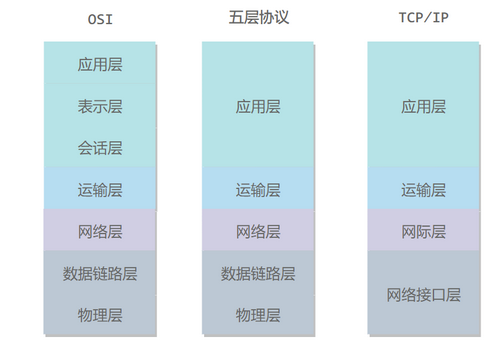
- OSI：
  - 应用层：为特定的应用程序提供数据传输服务
    - 如：HTTP、DNS
  - 表示层：数据压缩、加密、描述，使应用程序无需关心在各台主机中数据内部格式不同的问题
  - 会话层：建立以及管理会话
  - 传输层：为进程提供通用数据传输服务。
    - 因为应用层协议很多，定义通用的传输层协议就可以支持不断增多的应用层协议
    - 如：TCP：完整性、UDP：及时性、
  - 网络层：为主机提供数据传输服务
    - 传输层协议是为主机中的进程提供数据传输服务，网络层把传输层传递下来的报文段或者用户数据包封装成IP分组，进行传输
  - 数据链路层：为主机的多条链路提供数据传输服务
    - 网络层针对的是主机之间的数据传输服务，而主机之间可以用很多链路，链路层协议是为了同一链路的主机提供数据传输服务
    - 数据链路层把网络层传下来的分组封装成帧
  - 物理层：解决在传输媒介中传输比特流，尽可能屏蔽传输媒介和通信手段的差异，使数据链路层感觉不到这些差异
- 五层协议：
  - 没有表示层和会话层，这些交给应用程序开发者自己处理
- TCP/IP：
  - 相当于五层协议中数据链路层和物理层合并为了网络接口层
- 数据在各层之间的传递过程：
  - 自顶向下：不断添加下层协议所需要的首部、尾部
  - 自向而上：不断拆开首部和尾部
  - 路由器：只有下面三层协议，因为无需为进程或者应用程序提供服务！

# 1. 物理层

- 解决如何在传输媒介中传输比特流，并且避免底层物理的差异！
  - 如：如何在双绞线、同轴电缆、光纤实现比特流传输？
- 解决传输比特流的问题：
  - 带通调制：将数字信号转换为模拟信号，进行实际的数据传输
    - 模拟信号：信号的频率、幅度、相位
    - 数字信号：010101比特序列
  - 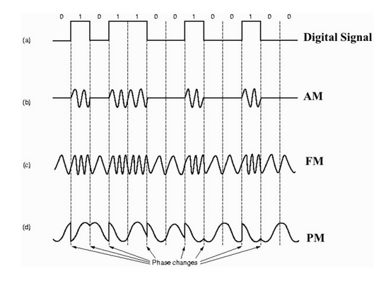
- 通信方式：解决比特流传输的效率问题：
  - 单工通信：单向传输
  - 半双工通信：双向交替传输
  - 全双工通信：双向同时传输

# 2. 数据链路层

- 为两个主机节点的单条链路提供数据传输服务
- 主要是解决：
  - 如何封装数据？：帧
  - 如何透明传输？：定界符+转义符
  - 如何进行差错检测？：CRC
  - 如何进行数据传输？
    - 信道如何划分？广播、点对点
    - 信道如何复用？
      - 频分、时分、统计时分、波分、码分
    - 何时发送数据？避免冲突？
      - 信道复用技术
      - CSMA/CD协议：载波监听多点接入 / 碰撞检测。
    - 具体传输过程？
      - 交换机：存储MAC地址到接口的映射
  - 如何唯一标识网络？主机？
    - MAC地址
    - 笔记本电脑普遍存在无线网络适配器和有线网络适配器，因此就有两个 MAC 地址。

# 3.网络层

- 提供合适的路由和交换节点，确保数据及时传输
- 数据如何传输？
  - 封装成IP数据报：IP协议
- 数据传输到哪？
  - IP协议中：表明源和目的的IP地址
  - IP地址如何编码？
    - 分类、子网划分、无类域间路由CIDR
- 网络层可以实现主机之间的数据传输，但是具体数据的传输还是需要交给链路层来做，IP地址不变，但是MAC地址会不断变化，因此如何通过IP地址来确定MAC地址？
  - ARP：地址解析协议，一般有ARP高速缓存，有对应的映射表
    - IP地址获取MAC地址
    - 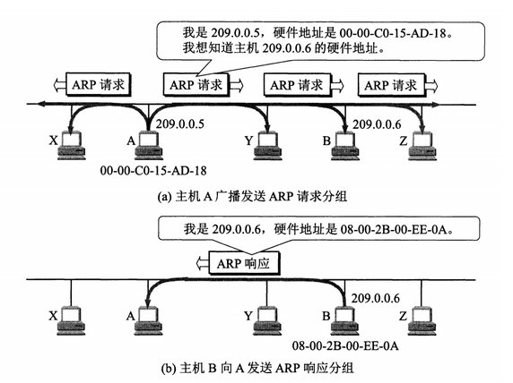
- 数据传输是否可达？是否可以成功？
  - ICMP协议：网际控制报文协议
    - 更有效地转发 IP 数据报和提高交付成功的机会
    - 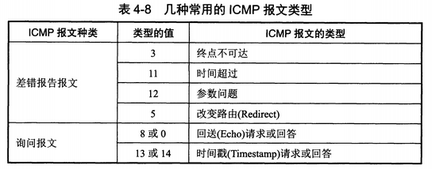
  - 实际应用：
    - Ping
    - Traceroute
- IP地址紧缺怎么办？
  - VPN：虚拟专用网！
    - 一个机构并不需要把所有的主机接入到外部的互联网中，机构内的计算机可以使用仅在本机构有效的 IP 地址（专用地址）。
    - 专用：指机构内的主机只与本机构内的其它主机通信
    - 虚拟：指好像是，而实际上并不是，它有经过公用的互联网。
    - 有三个专用地址块：
      - 10.0.0.0 ~ 10.255.255.255
      - 172.16.0.0 ~ 172.31.255.255
      - 192.168.0.0 ~ 192.168.255.255
    - 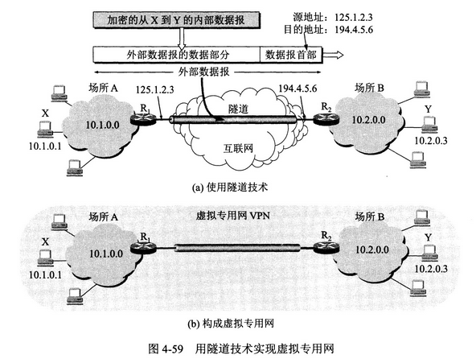
  - NAT：网络地址转换！
    - 为了解决VPN中的主机可以和互联网上的主机进行通信
    - 作用：将本地 IP 转换为全球 IP。
- 路由器？
  - 主要功能：路由选择和分组转发
  - 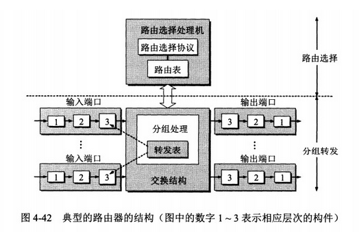
  - 路由选择协议？
    - 为了更安全、更快捷的数据传输
    - 网际组管理协议 IGMP（Internet Group Management Protocol）
    - 自治系统内部的路由选择：RIP 和 OSPF
    - 自治系统间的路由选择：BGP
  - RIP？内部网关协议
    - RIP：
      - 基于距离向量的路由选择协议
      - 距离是指跳数，直接相连的路由器跳数为 1。跳数最多为 15，超过 15 表示不可达。
    - RIP 协议实现简单，开销小。但是 RIP 能使用的最大距离为 15，限制了网络的规模。并且当网络出现故障时，要经过比较长的时间才能将此消息传送到所有路由器。
  - OSPF？内部网关协议
    - OSPF：
      - 开放最短路径优先 OSPF，采用 Dijkstra 提出的最短路径算法 OSPF
    - 所有路由器都具有全网的拓扑结构图，并且是一致的。相比于 RIP，OSPF 的更新过程收敛的很快
  - BGR？外部网关协议
    - BGP（Border Gateway Protocol，边界网关协议）
      - BGP 只能寻找一条比较好的路由，而不是最佳路由。
    - 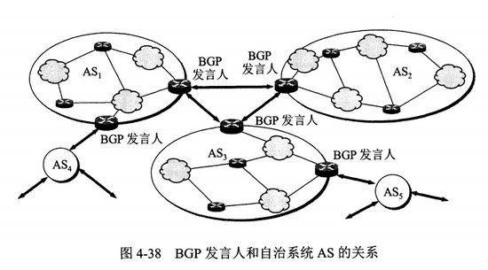

# 4. 传输层

- 为两台主机进程之间提供通用的数据传输服务，屏蔽底层细节，使应用程序看起来像是在两个传输层实体之间有一条端到端的逻辑通信信道
- 如何提供通用的数据传输服务？
  - UDP协议(User Datagram Protocol)：无连接、尽可能交付、没有拥塞控制、不合并拆分、面向报文
  - TCP协议(Transmission Control Protocol)：面向连接、提供可靠交付、流量控制、拥塞控制、提供全双工通信、面向字节流、一对一
- UDP报文结构：
  - 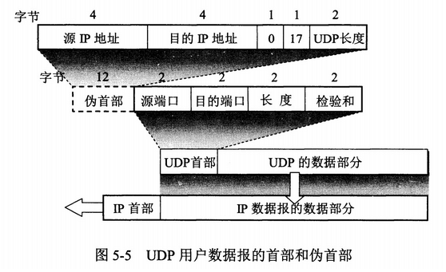
  - 首部字段只有 8 个字节，包括源端口、目的端口、长度、检验和。12 字节的伪首部是为了计算检验和临时添加的。
- TCP报文结构：
  - 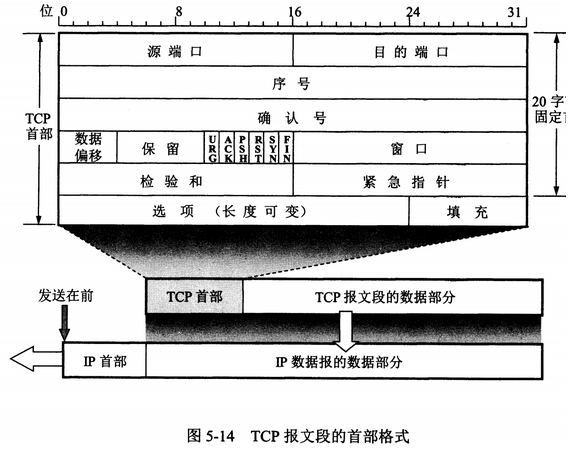
- TCP的三次握手？
  - 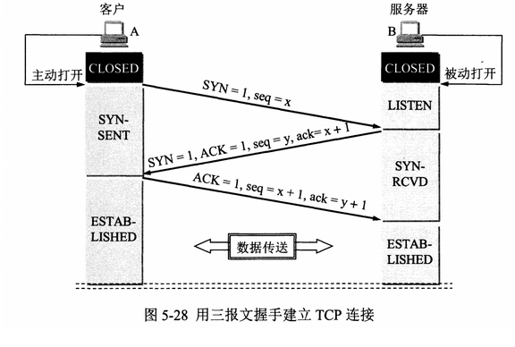
- 为什么要三次握手？
  - 主要是防止失效的连接请求到达服务，让服务器错误建立连接，浪费资源
  - 客户端发送的连接请求如果在网络中滞留，那么就会隔很长一段时间才能收到服务器端发回的连接确认。客户端等待一个超时重传时间之后，就会重新请求连接。但是这个滞留的连接请求最后还是会到达服务器，如果不进行三次握手，那么服务器就会打开两个连接。如果有第三次握手，客户端会忽略服务器之后发送的对滞留连接请求的连接确认，不进行第三次握手，因此就不会再次打开连接。
- TCP四次挥手？
  - 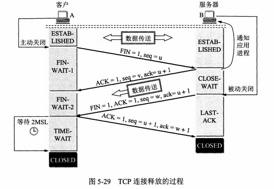
- 为什么要四次挥手？
  - 因为要让服务器端发送还未传送完毕的数据
- 为什么要等待2MSL？
  - 确保最后一个确认报文可以到达服务端
  - 确保本次连接产生的所有报文都从网络中消失，使得新的连接不会出现旧的连接请求报文
- ARQ协议：确保TCP的可靠传输
  - Automatic Repeat-reQuest：自动重传请求、
    - 使用确认和超时两个机制，在不可靠服务的基础上实现可靠的信息传输。如果发送方在发送后一段时间没有收到确认帧，通常会重新发送。
  - 停止等待ARQ、连续ARQ
- 滑动窗口协议：确保TCP的流量控制
  - TCP利用滑动窗口来实现流量控制，进而控制发送方发送速率，来确保接收方来得及接收。接收方可以通过确认报文中的窗口字段来控制发送方窗口大小，从而影响发送方的发送速率
  - 停止等待协议、后退N帧协议、选择重传协议
- 拥塞控制：确保TCP的稳定传输
  - 为了降低整个网络的拥塞程度。防止过多的数据发送到网络，防止路由器或者链路过载
  - 具体实现：
    - TCP 发送方要维持一个 **拥塞窗口(cwnd)** 的状态变量。拥塞控制窗口的大小取决于网络的拥塞程度，并且动态变化。发送方让自己的发送窗口取为拥塞窗口和接收方的接受窗口中较小的一个。
    - TCP的拥塞控制采用了四种算法：慢开始、拥塞避免、快重传、快恢复
    - 在网络层也可以使用路由器采用适当的分组丢弃策略来减少网络拥塞的发送
  - 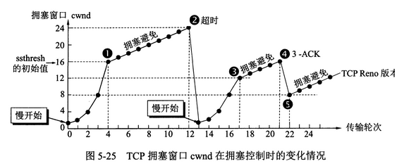
    - 超时：说明网络拥塞了，所以修改ssthresh，然后重新慢开始
    - 3-ACK：说明报文段丢失，不是网络拥塞，因此可以快恢复，修改ssthresh=cwdn/2、cwdn=ssthresh
    - 慢开始和快恢复是指cwnd的设定值，而不是增长速度

# 5. 应用层

- 两个主机应用进程之间的通信，来实现特定的应用程序
- 域名解析协议？DNS？
  - 提供主机名和IP地址相互转换的服务
  - 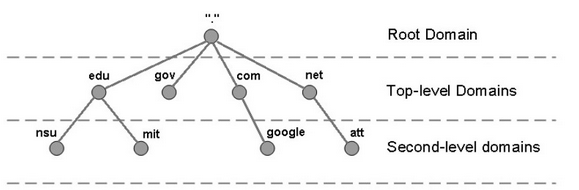
  - 端口号：53
  - 可以使用 UDP 或者 TCP 进行传输，大多数情况下 DNS 使用 UDP 进行传输，这就要求域名解析器和域名服务器都必须自己处理超时和重传从而保证可靠性。在两种情况下会使用 TCP 进行传输：
    - 如果返回的响应超过的 512 字节（UDP 最大只支持 512 字节的数据）。
    - 区域传送（区域传送是主域名服务器向辅助域名服务器传送变化的那部分数据）
- 文件传输协议？FTP？
  - 使用TCP，两个连接来实现文件传输
    - 控制连接：服务器打开端口号 21 等待客户端的连接，客户端主动建立连接后，使用这个连接将客户端的命令传送给服务器，并传回服务器的应答。
    - 数据连接：用来传送一个文件数据。端口20
  - 根据数据连接是否是服务器端主动建立，FTP 有主动和被动两种模式
- 动态主机配置协议？DHCP？
  - 提供即插即用的联网方式，无需用户手动配置IP地址等信息
  - DHCP：配置IP地址、子网掩码、网关IP地址
  - 端口：67/68
  - 工作过程：
    - 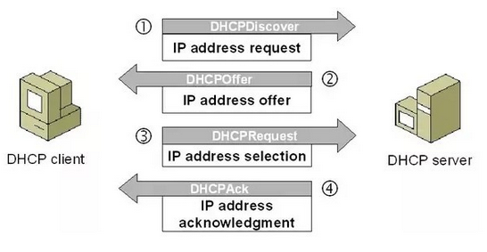
- 远程登录协议？TELNET？
  - 提供登录远程主机的服务
  - 端口：23
- 电子邮件协议？
  - 组成：用户代理、邮件服务器、邮件协议（发送协议SMTP、读取协议POP3、IMAP）
  - 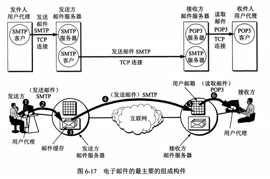
  - 发送协议：SMTP：
    - SMTP 只能发送 ASCII 码，而互联网邮件扩充 MIME 可以发送二进制文件。MIME 并没有改动或者取代 SMTP，而是增加邮件主体的结构，定义了非 ASCII 码的编码规则
    - 端口：25
  - 读取协议：POP3：
    - POP3 的特点是只要用户从服务器上读取了邮件，就把该邮件删除。但最新版本的 POP3 可以不删除邮件。
    - 端口：110
  - 读取协议：IMAP：
    - IMAP 协议中客户端和服务器上的邮件保持同步，如果不手动删除邮件，那么服务器上的邮件也不会被删除。IMAP 这种做法可以让用户随时随地去访问服务器上的邮件。
    - 端口：143

# 6. Web页面请求过程

## 6.1 DHCP配置主机信息-主机刚上线准备联网

- 主机生成一个DHCP请求报文，并且将这个报文放入具有目的端口67和源端口68的UDP报文段中=》应用层+传输层
- 该报文段被放入一个具有广播IP目的地址(255.255.255.255)和源IP地址(0.0.0.0)的IP数据报中=》网络层
- 该数据报被放入一个MAC帧中，广播到与交换机连接的所有设备=》数据链路层+物理层
- 连接在交换机的DHCP服务器收到这个广播帧后，不断拆分：IP数据报、UDP报文段、DHCP请求报文，然后生成DHCP ACK报文，提供：IP地址、DNS服务器的IP地址、默认网关路由器的IP地址、子网掩码。然后放入UDP报文段中，再放入IP数据报中，再放入MAC帧中
- 该帧的目的地址是请求主机的 MAC 地址，因为交换机具有自学习能力，之前主机发送了广播帧之后就记录了 MAC 地址到其转发接口的交换表项，因此现在交换机就可以直接知道应该向哪个接口发送该帧。
- 主机收到该帧后，不断拆分得到DHCP报文，之后配置主机的IP地址、子网掩码、DNS服务器的IP地址、并且再其IP转发表中安装默认网关。
- 然后再给DHCP服务器发送消息，告诉DHCP服务器，主机选择了哪个IP地址，然后DHCP服务器响应说我知道了，至此该主机可以上网了！

## 6.2 DNS解析域名

- 主机生成一个 DNS 查询报文，该报文具有 53 号端口，因为 DNS 服务器的端口号是 53。=>应用层+传输层
- 该 DNS 查询报文被放入目的地址为 DNS 服务器 IP 地址的 IP 数据报中。=>网络层
- 该 IP 数据报被放入一个以太网帧中，该帧将发送到网关路由器。=》数据链路层+物理层
- DHCP 过程只知道网关路由器的 IP 地址，为了获取网关路由器的 MAC 地址，需要使用 ARP 协议。
  - 主机生成一个包含目的地址为网关路由器 IP 地址的 **ARP 查询报文**，将该 ARP  查询报文放入一个具有广播目的地址（FF:<zero-width space>FF:<zero-width  space>FF:<zero-width space>FF:<zero-width  space>FF:FF）的以太网帧中，并向交换机发送该以太网帧，交换机将**该帧转发给所有的连接设备**，包括网关路由器。
  - 网关路由器接收到该帧后，不断向上分解得到 ARP 报文，发现其中的 IP 地址与其接口的 IP 地址匹配，因此就发送一个 ARP 回答报文，包含了它的 MAC 地址，发回给主机。
- 网关路由器接收到包含 DNS 查询报文的以太网帧后，抽取出 IP 数据报，并根据转发表决定该 IP 数据报应该转发的路由器。
- 因为路由器具有内部网关协议（RIP、OSPF）和外部网关协议（BGP）这两种路由选择协议，因此路由表中已经配置了网关路由器到达 DNS 服务器的路由表项。
- 到达 DNS 服务器之后，DNS 服务器抽取出 DNS 查询报文，并在 DNS 数据库中查找待解析的域名。
- 找到 DNS 记录之后，发送 DNS 回答报文，将该回答报文放入 UDP 报文段中，然后放入 IP 数据报中，通过路由器反向转发回网关路由器，并经过以太网交换机到达主机。

## 6.3 HTTP请求页面

- 有了 HTTP 服务器的 IP 地址之后，主机就能够生成 TCP 套接字，该套接字将用于向 Web 服务器发送 HTTP GET 报文。
- 在生成 TCP 套接字之前，必须先与 HTTP 服务器进行三次握手来建立连接。生成一个具有目的端口 80 的 TCP SYN 报文段，并向 HTTP 服务器发送该报文段。
- HTTP 服务器收到该报文段之后，生成 TCP SYN ACK 报文段，发回给主机。
- 连接建立之后，浏览器生成 HTTP GET 报文，并交付给 HTTP 服务器。
- HTTP 服务器从 TCP 套接字读取 HTTP GET 报文，生成一个 HTTP 响应报文，将 Web 页面内容放入报文主体中，发回给主机。
- 浏览器收到 HTTP 响应报文后，抽取出 Web 页面内容，之后进行渲染，显示 Web 页面。

