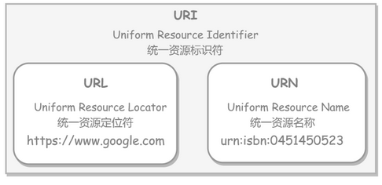
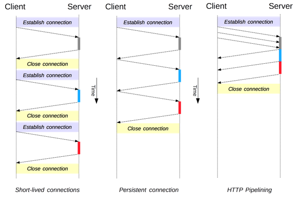
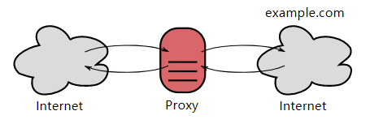
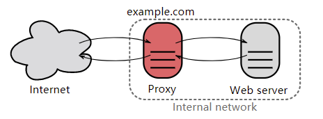
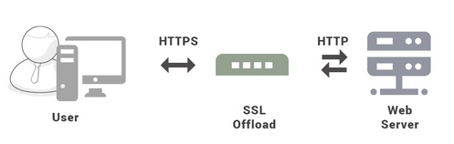
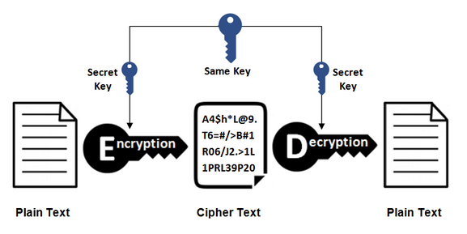
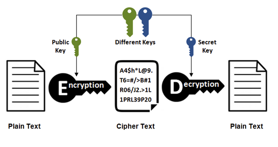
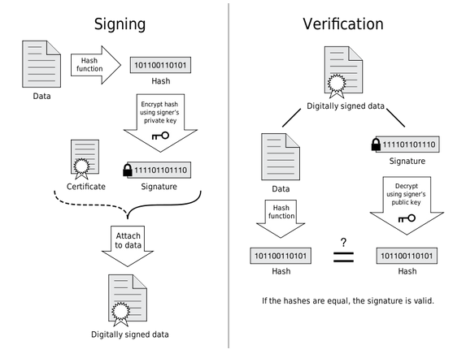

# 计算机网络-HTTP

- 主要参考自：http://www.cyc2018.xyz/%E8%AE%A1%E7%AE%97%E6%9C%BA%E5%9F%BA%E7%A1%80/HTTP/HTTP.html

# 1. HTTP概览

- 什么是HTTP？

  - HTTP(Hypertext transfer protocol)超文本传输协议，通过浏览器和服务器进行数据交互，进行超文本（文本、图片、视频等）传输的规定。
  - 客户端发送一个请求报文给服务器，服务器根据请求报文中的信息进行处理，并将处理结果放入响应报文中返回给客户端。

- HTTP请求报文：

  - 请求行：

    - 包含请求方法、URL、协议版本

  - 请求头：

    - 格式为：k-v键值对的形式，服务器可以根据请求头获取客户端的信息

  - 请求体：

    - 用空行分割请求头和请求体
    - 存放用户的请求的数据

  - ```html
    GET http://www.example.com/ HTTP/1.1
    Accept: text/html,application/xhtml+xml,application/xml;q=0.9,image/webp,image/apng,*/*;q=0.8,application/signed-exchange;v=b3;q=0.9
    Accept-Encoding: gzip, deflate
    Accept-Language: zh-CN,zh;q=0.9,en;q=0.8
    Cache-Control: max-age=0
    Host: www.example.com
    If-Modified-Since: Thu, 17 Oct 2019 07:18:26 GMT
    If-None-Match: "3147526947+gzip"
    Proxy-Connection: keep-alive
    Upgrade-Insecure-Requests: 1
    User-Agent: Mozilla/5.0 xxx
    
    param1=1&param2=2
    ```

- HTTP响应报文：

  - 状态行：

    - 包含协议版本、状态码以及描述，

  - 响应头

    - 和请求头类似，也是以k-v键值对的形式存储服务器的信息

  - 响应体

    - 用空行分割请求头和请求体
    - 存放服务器的响应的数据

  - ```xml
    HTTP/1.1 200 OK
    Age: 529651
    Cache-Control: max-age=604800
    Connection: keep-alive
    Content-Encoding: gzip
    Content-Length: 648
    Content-Type: text/html; charset=UTF-8
    Date: Mon, 02 Nov 2020 17:53:39 GMT
    Etag: "3147526947+ident+gzip"
    Expires: Mon, 09 Nov 2020 17:53:39 GMT
    Keep-Alive: timeout=4
    Last-Modified: Thu, 17 Oct 2019 07:18:26 GMT
    Proxy-Connection: keep-alive
    Server: ECS (sjc/16DF)
    Vary: Accept-Encoding
    X-Cache: HIT
    
    <!doctype html>
    <html>
    <head>
        <title>Example Domain</title>
    	// 省略... 
    </body>
    </html>
    ```

- 什么是URL、有什么用？

  - URI：Uniform Resource Identifier：统一资源标志符，可以唯一标识一个资源
  - URL：Uniform Resource Location：统一资源定位符，可以提供该资源的路径，是一个具体的URI，可以用来标识一个资源，并且还可以指明如何定位这个资源
  - URL是URI的子集，URL在URI的基础上增加了定位的功能，URI 除了包含 URL，还包含 URN（Uniform Resource Name，统一资源名称），它只是用来定义一个资源的名称，并不具备定位该资源的能力。
  - 
  - HTTP通过使用URL来定位资源

# 2. HTTP方法

- 客户端发送的请求报文中的请求行，就包含了使用哪个HTTP方法的描述字段，也叫方法字段
- GET方法：获取资源
- HEAD方法：获取报文首部，不返回报文主体部分
  - 目的：确认URL的有效性以及资源更新的时间日期等
- POST方法：传输实体主体
  - POST主要用来传输数据、GET主要是用获取资源
- PUT方法：上传文件
  - 由于自身不带验证机制，任何人都可以上传文件，因此存在安全性问题，一般不使用该方
- PATCH方法：对资源进行部分修改
  - PUT 也可以用于修改资源，但是只能完全替代原始资源，PATCH 允许部分修改。
- DELETE方法：删除文件
  - 与 PUT 功能相反，并且同样不带验证机制。
- OPTIONS方法：查询支持的方法
  - 查询指定的 URL 能够支持的方法。
  - 会返回 `Allow: GET, POST, HEAD, OPTIONS` 这样的内容。
- CONNECT方法：要求在与代理服务器通信时建立隧道
  - 使用 SSL（Secure Sockets Layer，安全套接层）和 TLS（Transport Layer Security，传输层安全）协议把通信内容加密后经网络隧道传输。
- TRACE方法：追踪路径
  - 服务器会将通信路径返回给客户端。
  - 发送请求时，在 Max-Forwards 首部字段中填入数值，每经过一个服务器就会减 1，当数值为 0 时就停止传输。
  - 通常不会使用 TRACE，并且它容易受到 XST 攻击（Cross-Site Tracing，跨站追踪）

# 3. HTPP状态码

- 服务器返回的HTTP响应报文的状态行，就包含了状态码以及原因原语，用来告知客户端请求的结构
- 1XX信息：
  - **100 Continue**  ：表明到目前为止都很正常，客户端可以继续发送请求或者忽略这个响应。
- 2XX成功：
  - **200 OK**
  - **204 No Content**  ：请求已经成功处理，但是返回的响应报文不包含实体的主体部分。一般在只需要从客户端往服务器发送信息，而不需要返回数据时使用。
  - **206 Partial Content**  ：表示客户端进行了范围请求，响应报文包含由 Content-Range 指定范围的实体内容。
- 3XX重定向：
  - **301 Moved Permanently**  ：永久性重定向
  - **302 Found**  ：临时性重定向
  - **303 See Other**  ：和 302 有着相同的功能，但是 303 明确要求客户端应该采用 GET 方法获取资源。
    - 注：虽然 HTTP 协议规定 301、302 状态下重定向时不允许把 POST 方法改成 GET 方法，但是大多数浏览器都会在 301、302 和 303 状态下的重定向把 POST 方法改成 GET 方法。
  - **304 Not Modified**  ：如果请求报文首部包含一些条件，例如：If-Match，If-Modified-Since，If-None-Match，If-Range，If-Unmodified-Since，如果不满足条件，则服务器会返回 304 状态码。
  - **307 Temporary Redirect**  ：临时重定向，与 302 的含义类似，但是 307 要求浏览器不会把重定向请求的 POST 方法改成 GET 方法
- 4XX客户端错误：
  - **400 Bad Request**  ：请求报文中存在语法错误。
  - **401 Unauthorized**  ：该状态码表示发送的请求需要有认证信息（BASIC 认证、DIGEST 认证）。如果之前已进行过一次请求，则表示用户认证失败。
  - **403 Forbidden**  ：请求被拒绝。
  - **404 Not Found**
- 5XX服务器错误：
  - **500 Internal Server Error**  ：服务器正在执行请求时发生错误。
  - **503 Service Unavailable**  ：服务器暂时处于超负载或正在进行停机维护，现在无法处理请求。

# 4. HTTP首部

- HTTP协议有四种类型的首部字段

  - 通用首部字段
  - 请求首部字段
  - 响应首部字段
  - 实体首部字段

-  通用首部字段

  |    首部字段名     |                    说明                    |
  | :---------------: | :----------------------------------------: |
  |   Cache-Control   |               控制缓存的行为               |
  |    Connection     | 控制不再转发给代理的首部字段、管理持久连接 |
  |       Date        |             创建报文的日期时间             |
  |      Pragma       |                  报文指令                  |
  |      Trailer      |             报文末端的首部一览             |
  | Transfer-Encoding |         指定报文主体的传输编码方式         |
  |      Upgrade      |               升级为其他协议               |
  |        Via        |            代理服务器的相关信息            |
  |      Warning      |                  错误通知                  |

- 请求首部字段

  |     首部字段名      |                      说明                       |
  | :-----------------: | :---------------------------------------------: |
  |       Accept        |            用户代理可处理的媒体类型             |
  |   Accept-Charset    |                  优先的字符集                   |
  |   Accept-Encoding   |                 优先的内容编码                  |
  |   Accept-Language   |             优先的语言（自然语言）              |
  |    Authorization    |                  Web 认证信息                   |
  |       Expect        |              期待服务器的特定行为               |
  |        From         |               用户的电子邮箱地址                |
  |        Host         |               请求资源所在服务器                |
  |      If-Match       |              比较实体标记（ETag）               |
  |  If-Modified-Since  |               比较资源的更新时间                |
  |    If-None-Match    |        比较实体标记（与 If-Match 相反）         |
  |      If-Range       |      资源未更新时发送实体 Byte 的范围请求       |
  | If-Unmodified-Since | 比较资源的更新时间（与 If-Modified-Since 相反） |
  |    Max-Forwards     |                 最大传输逐跳数                  |
  | Proxy-Authorization |         代理服务器要求客户端的认证信息          |
  |        Range        |               实体的字节范围请求                |
  |       Referer       |            对请求中 URI 的原始获取方            |
  |         TE          |                传输编码的优先级                 |
  |     User-Agent      |              HTTP 客户端程序的信息              |

- 响应首部字段

  |     首部字段名     |             说明             |
  | :----------------: | :--------------------------: |
  |   Accept-Ranges    |     是否接受字节范围请求     |
  |        Age         |     推算资源创建经过时间     |
  |        ETag        |        资源的匹配信息        |
  |      Location      |   令客户端重定向至指定 URI   |
  | Proxy-Authenticate | 代理服务器对客户端的认证信息 |
  |    Retry-After     |   对再次发起请求的时机要求   |
  |       Server       |    HTTP 服务器的安装信息     |
  |        Vary        |   代理服务器缓存的管理信息   |
  |  WWW-Authenticate  |   服务器对客户端的认证信息   |

- 实体首部字段

  |    首部字段名    |          说明          |
  | :--------------: | :--------------------: |
  |      Allow       | 资源可支持的 HTTP 方法 |
  | Content-Encoding | 实体主体适用的编码方式 |
  | Content-Language |   实体主体的自然语言   |
  |  Content-Length  |     实体主体的大小     |
  | Content-Location |   替代对应资源的 URI   |
  |   Content-MD5    |   实体主体的报文摘要   |
  |  Content-Range   |   实体主体的位置范围   |
  |   Content-Type   |   实体主体的媒体类型   |
  |     Expires      | 实体主体过期的日期时间 |
  |  Last-Modified   |  资源的最后修改日期时  |

# 5. HTTP通信管理

## 5.1 HTTP连接管理

- 
- HTTP/1.0：采用的就是短连接：客户端和服务器每进行一次HTTP操作，就建立一次连接，任务完成后就断开连接
  - 当客户端浏览器访问的某个HTML或其他类型的Web页中包含有其他的Web资源（如JavaScript文件、图像文件、CSS文件等），每遇到这样一个Web资源，浏览器就会重新建立一个HTTP会话。
- HTTP/1.1：采用的就是长连接，保持连接特性
  - 在使用长连接的情况下，当一个网页打开完成后，客户端和服务器之间用于传输HTTP数据的TCP连接不会关闭，客户端再次访问这个服务器时，会继续使用这一条已经建立的连接。Keep-Alive不会永久保持连接，它有一个保持时间，可以在不同的服务器软件（如Apache）中设定这个时间。实现长连接需要客户端和服务端都支持长连接。
  - 流水线方式：客户端在收到HTTP的响应报文之前就可以接着给服务端发送新的请求报文
  - 非流水线发送：客户端在收到前一个响应后才能发送下一个请求

## 5.2 HTTP状态信息管理

- HTTP 协议是无状态的，主要是为了让 HTTP 协议尽可能简单，使得它能够处理大量事务。HTTP/1.1 引入 Cookie 来保存状态信息。
- 什么是Cookie？
  - Cookie 是服务器发送到用户浏览器并保存在本地的一小块数据，它会在浏览器之后向同一服务器再次发起请求时被携带上，用于告知服务端两个请求是否来自同一浏览器。由于之后每次请求都会需要携带 Cookie 数据，因此会带来额外的性能开销（尤其是在移动环境下）。
  - Cookie 曾一度用于客户端数据的存储，因为当时并没有其它合适的存储办法而作为唯一的存储手段，但现在随着现代浏览器开始支持各种各样的存储方式，Cookie 渐渐被淘汰。新的浏览器 API 已经允许开发者直接将数据存储到本地，如使用 Web storage API（本地存储和会话存储）或  IndexedDB
- Cookie有什么用？
  - 会话状态管理（如用户登录状态、购物车、游戏分数或其它需要记录的信息）
  - 个性化设置（如用户自定义设置、主题等）
  - 浏览器行为跟踪（如跟踪分析用户行为等）
- Cookie的创建？
  - 服务器发送的响应报文包含 Set-Cookie 首部字段，客户端得到响应报文后把 Cookie 内容保存到浏览器中。
  - 客户端之后对同一个服务器发送请求时，会从浏览器中取出 Cookie 信息并通过 Cookie 请求首部字段发送给服务器。
  - 浏览器通过 `document.cookie` 属性可创建新的 Cookie，也可通过该属性访问非 HttpOnly 标记的 Cookie。
  - 标记为 HttpOnly 的 Cookie 不能被 JavaScript 脚本调用。跨站脚本攻击 (XSS) 常常使用 JavaScript 的 `document.cookie` API 窃取用户的 Cookie 信息，因此使用 HttpOnly 标记可以在一定程度上避免 XSS 攻击。
- Cookie的分类？
  - 会话期 Cookie：浏览器关闭之后它会被自动删除，也就是说它仅在会话期内有效。
  - 持久性 Cookie：指定过期时间（Expires）或有效期（max-age）之后就成为了持久性的 Cookie。
- Cookie的作用域？
  - Domain 标识指定了哪些主机可以接受 Cookie。如果不指定，默认为当前文档的主机（不包含子域名）。如果指定了  Domain，则一般包含子域名。例如，如果设置 Domain=mozilla.org，则 Cookie 也包含在子域名中（如  developer.mozilla.org）。
  - Path 标识指定了主机下的哪些路径可以接受 Cookie（该 URL 路径必须存在于请求 URL 中）。以字符 %x2F ("/") 作为路径分隔符，子路径也会被匹配。例如，设置 Path=/docs，则以下地址都会匹配：
    - /docs
    - /docs/Web/
    - /docs/Web/HTTP
- Secure标记？
  - 标记为 Secure 的 Cookie 只能通过被 HTTPS 协议加密过的请求发送给服务端。但即便设置了 Secure 标记，敏感信息也不应该通过 Cookie 传输，因为 Cookie 有其固有的不安全性，Secure 标记也无法提供确实的安全保障。
- Session?
  - 除了可以将用户信息通过 Cookie 存储在用户浏览器中，也可以利用 Session 存储在服务器端，存储在服务器端的信息更加安全。
  - Session 可以存储在服务器上的文件、数据库或者内存中。也可以将 Session 存储在 Redis 这种内存型数据库中，效率会更高。
- Session的使用？
  - 使用 Session 维护用户登录状态的过程如下：
    - 用户进行登录时，用户提交包含用户名和密码的表单，放入 HTTP 请求报文中；
    - 服务器验证该用户名和密码，如果正确则把用户信息存储到 Redis 中，它在 Redis 中的 Key 称为 Session ID；
    - 服务器返回的响应报文的 Set-Cookie 首部字段包含了这个 Session ID，客户端收到响应报文之后将该 Cookie 值存入浏览器中；
    - 客户端之后对同一个服务器进行请求时会包含该 Cookie 值，服务器收到之后提取出 Session ID，从 Redis 中取出用户信息，继续之前的业务操作。
- 如何确保Session ID 的安全？
  - 应该注意 Session ID 的安全性问题，不能让它被恶意攻击者轻易获取，那么就不能产生一个容易被猜到的 Session ID  值。
  - 还需要经常重新生成 Session ID。在对安全性要求极高的场景下，例如转账等操作，
  - 除了使用 Session  管理用户状态之外，还需要对用户进行重新验证，比如重新输入密码，或者使用短信验证码等方式。
- 浏览器会禁用Cookie怎么办？
  - 此时无法使用 Cookie 来保存用户信息，只能使用 Session。除此之外，不能再将 Session ID 存放到 Cookie 中，而是使用 URL 重写技术，将 Session ID 作为 URL 的参数进行传递。
- 如何选择Cookie和Session？
  - Cookie 只能存储 ASCII 码字符串，而 Session 则可以存储任何类型的数据，因此在考虑数据复杂性时首选 Session；
  - Cookie 存储在浏览器中，容易被恶意查看。如果非要将一些隐私数据存在 Cookie 中，可以将 Cookie 值进行加密，然后在服务器进行解密；
  - 对于大型网站，如果用户所有的信息都存储在 Session 中，那么开销是非常大的，因此不建议将所有的用户信息都存储到 Session 中。

## 5.3 HTTP缓存

- 为什么要使用缓存？

  - 缓解服务器压力；
  - 降低客户端获取资源的延迟：缓存通常位于内存中，读取缓存的速度更快。并且缓存服务器在地理位置上也有可能比源服务器来得近，例如浏览器缓存。

- 如何实现缓存？

  - 让代理服务器进行缓存；
  - 让客户端浏览器进行缓存。

- 如何控制缓存？

  - HTTP/1.1 通过 Cache-Control 首部字段来控制缓存。

  - Cache-Control : no-store 指令规定不能对请求或响应的任何一部分进行缓存。

  - Cache-Control : no-cache 指令规定缓存服务器需要先向源服务器验证缓存资源的有效性，只有当缓存资源有效时才能使用该缓存对客户端的请求进行响应。

  - Cache-Control : private 指令规定了将资源作为私有缓存，只能被单独用户使用，一般存储在用户浏览器中。

  - Cache-Control : public 指令规定了将资源作为公共缓存，可以被多个用户使用，一般存储在代理服务器中。

  - 缓存过期机制：

    - max-age 指令出现在请求报文，并且缓存资源的缓存时间小于该指令指定的时间，那么就能接受该缓存。

    - max-age 指令出现在响应报文，表示缓存资源在缓存服务器中保存的时间。

    - ```html
      Cache-Control: max-age=31536000
      ```

    - Expires 首部字段也可以用于告知缓存服务器该资源什么时候会过期。

    - ```html
      Expires: Wed, 04 Jul 2012 08:26:05 GMT
      ```

    - 在 HTTP/1.1 中，会优先处理 max-age 指令；

    - 在 HTTP/1.0 中，max-age 指令会被忽略掉。

- 缓存如何验证？

  - ETag首部字段的意义？
    - ETag是资源的唯一标识。URL 不能唯一表示资源，例如 `http://www.google.com/` 有中文和英文两个资源，只有 ETag 才能对这两个资源进行唯一标识。
  - 可以将缓存资源的 ETag 值放入 If-None-Match 首部，服务器收到该请求后，判断缓存资源的 ETag 值和资源的最新 ETag 值是否一致，如果一致则表示缓存资源有效，返回 304 Not Modified。
  - Last-Modified  首部字段也可以用于缓存验证，它包含在源服务器发送的响应报文中，指示源服务器对资源的最后修改时间。但是它是一种弱校验器，因为只能精确到一秒，所以它通常作为 ETag 的备用方案。如果响应首部字段里含有这个信息，客户端可以在后续的请求中带上 If-Modified-Since  来验证缓存。服务器只在所请求的资源在给定的日期时间之后对内容进行过修改的情况下才会将资源返回，状态码为 200  OK。如果请求的资源从那时起未经修改，那么返回一个不带有实体主体的 304 Not Modified 响应报文。

## 5.4 HTTP内容协商

- 通过内容协商返回最合适的内容，例如根据浏览器的默认语言选择返回中文界面还是英文界面。
- 类型：
  - **服务端驱动型**
    - 客户端设置特定的 HTTP 首部字段，例如 Accept、Accept-Charset、Accept-Encoding、Accept-Language，服务器根据这些字段返回特定的资源。
    - 它存在以下问题：
      - 服务器很难知道客户端浏览器的全部信息；
      - 客户端提供的信息相当冗长（HTTP/2 协议的首部压缩机制缓解了这个问题），并且存在隐私风险（HTTP 指纹识别技术）；
      - 给定的资源需要返回不同的展现形式，共享缓存的效率会降低，而服务器端的实现会越来越复杂。
  - **代理驱动型**
    - 服务器返回 300 Multiple Choices 或者 406 Not Acceptable，客户端从中选出最合适的那个资源
- 内容协商下如何使用缓存？
  - 只有当缓存服务器中的缓存满足内容协商条件时，才能使用该缓存，否则应该向源服务器请求该资源。
  - 例如，一个客户端发送了一个包含 Accept-Language 首部字段的请求之后，源服务器返回的响应包含 `Vary: Accept-Language` 内容，缓存服务器对这个响应进行缓存之后，在客户端下一次访问同一个 URL 资源，并且 Accept-Language 与缓存中的对应的值相同时才会返回该缓存。

## 5.5 HTTP内容编码

- 内容编码将实体主体进行压缩，从而减少传输的数据量
- 常用的内容编码有：gzip、compress、deflate、identity。
- 如何实现内容编码？
  - 浏览器发送 Accept-Encoding  首部，其中包含有它所支持的压缩算法，以及各自的优先级。
  - 服务器则从中选择一种，使用该算法对响应的消息主体进行压缩，并且发送  Content-Encoding 首部来告知浏览器它选择了哪一种算法。
  - 由于该内容协商过程是基于编码类型来选择资源的展现形式的，响应报文的  Vary 首部字段至少要包含 Content-Encoding。

## 5.6 HTTP范围请求

- 如果网络出现中断，服务器只发送了一部分数据，范围请求可以使得客户端只请求服务器未发送的那部分数据，从而避免服务器重新发送所有数据。

- 如何实现范围请求？

  - 1、Range：在请求报文中添加 Range 首部字段指定请求的范围。

    - ```html
      GET /z4d4kWk.jpg HTTP/1.1
      Host: i.imgur.com
      Range: bytes=0-1023
      ```

    - 请求成功的话服务器返回的响应包含 206 Partial Content 状态码。

    - ```html
      HTTP/1.1 206 Partial Content
      Content-Range: bytes 0-1023/146515
      Content-Length: 1024
      ...
      (binary content)
      ```

  - 2、Accept-Ranges：响应首部字段 Accept-Ranges 用于告知客户端是否能处理范围请求，可以处理使用 bytes，否则使用 none。

    - ```html
      Accept-Ranges: bytes
      ```

- 进行范围请求的响应状态码？

  - 在请求成功的情况下，服务器会返回 206 Partial Content 状态码。
  - 在请求的范围越界的情况下，服务器会返回 416 Requested Range Not Satisfiable 状态码。
  - 在不支持范围请求的情况下，服务器会返回 200 OK 状态码

## 5.7 HTTP分块传输编码

- Chunked Transfer Encoding，可以把数据分割成多块，让浏览器逐步显示页面

## 5.8 HTTP多部分对象集合

- 一份报文主体内可含有多种类型的实体同时发送，每个部分之间用 boundary 字段定义的分隔符进行分隔，每个部分都可以有首部字段。

- 例如，上传多个表单时可以使用如下方式：

- ```html
  Content-Type: multipart/form-data; boundary=AaB03x
  
  --AaB03x
  Content-Disposition: form-data; name="submit-name"
  
  Larry
  --AaB03x
  Content-Disposition: form-data; name="files"; filename="file1.txt"
  Content-Type: text/plain
  
  ... contents of file1.txt ...
  --AaB03x--
  ```

## 5.9 HTTP 虚拟主机

- HTTP/1.1 使用虚拟主机技术，使得一台服务器拥有多个域名，并且在逻辑上可以看成多个服务器。

## 5.10 HTTP通信数据转发

- 如何实现数据转发？
  - 1、代理：代理服务器接受客户端的请求，并且转发给其它服务器。
    - 使用代理的主要目的是：
      - 缓存
      - 负载均衡
      - 网络访问控制
      - 访问日志记录
    - 代理服务器分为正向代理和反向代理两种：
      - 用户察觉得到正向代理的存在。
      - 
      - 而反向代理一般位于内部网络中，用户察觉不到。
      - 
  - 2、网关：
    - 与代理服务器不同的是，网关服务器会将 HTTP 转化为其它协议进行通信，从而请求其它非 HTTP 服务器的服务。
  - 3、隧道：
    - 使用 SSL 等加密手段，在客户端和服务器之间建立一条安全的通信线路。

# 6.HTTPS概览

- 为什么会有HTTPS？
- HTTP有什么问题？
  - 进行明文进行通信、内容可能被监听
  - 不验证通信方的身份，而通信方的身份有可能被伪装
  - 无法验证报文的完整性，报文有可能遭篡改
- 什么是HTTPS？
  - HTTPS协议运行在SSL/TLS之上的HTTP协议，SSL/TLS（在会话层）运行在TCP之上，所有传输的内容都经过加密，加密采用对称加密，但对称加密的密钥用服务器方的证书采用了非对称加密
  - HTTP先和SSL通信，在由SSL和TCP通信，也就是HTTPS使用了隧道进行通信
  - 通过使用SSL，HTTPS具有了加密=防窃听、认证=防伪装、完整性保护=防篡改
  - 

## 6.0 SSL/TLS

- 主要参考自：https://www.jianshu.com/p/93e0faf5edb8

- 什么是TLS？
  - 安全传输层协议：Transport Layer Security
  -  安全传输层协议（TLS）用于在两个通信应用程序之间提供保密性和数据完整性。该协议由两层组成： 
    - TLS 记录协议（TLS Record）
    - TLS 握手协议（TLS Handshake）。
    - 较低的层为 TLS 记录协议，位于某个可靠的传输协议（例如 TCP）上面
- 什么是SSL？
  - SSL：（Secure Socket Layer，安全套接字层），位于可靠的面向连接的网络层协议和应用层协议之间的一种协议层。
  - SSL通过互相认证、使用数字签名确保完整性、使用加密确保私密性，以实现客户端和服务器之间的安全通讯。
  - 该协议由两层组成：SSL记录协议和SSL握手协议。

- SSL和TLS的区别？
  - TLS应该是SSL的升级版

## 6.1 加密-防止窃听

- 对称密钥加密：
  - 对称密钥加密（Symmetric-Key Encryption），加密和解密使用同一密钥。
    - 优点：运算速度快；
    - 缺点：无法安全地将密钥传输给通信方。
    - 典型的对称加密算法有DES、AES等
  - 
- 非对称密钥加密：
  - 非对称密钥加密，又称公开密钥加密（Public-Key Encryption），加密和解密使用不同的密钥。
    - 优点：更加安全
    - 缺点：运算速度慢
    - 典型的非对称加密算法有RSA、DSA等。
  - 公开密钥：所有人都可以获得，通信发送方获得接收方的公开密钥后，就可以使用公开密钥进行加密
    - 接收方收到通信内容后使用私有密钥解密
  - 非对称密钥除了用来加密，还可以用来进行签名。因为私有密钥无法被其他人获取，因此通信发送方使用其私有密钥进行签名，通信接收方使用发送方的公开密钥对签名进行解密，就能判断这个签名是否正确。
  - 
- HTTPS采用的加密方式？
  - 对称密钥加密方式的传输效率更高，但是无法安全地将密钥 Secret Key 传输给通信方。
  - 非对称密钥加密方式可以保证传输的安全性
  - HTTPS 采用混合的加密机制：
    - 使用非对称密钥加密方式，传输对称密钥加密方式所需要的 Secret Key，从而保证安全性;
    - 获取到 Secret Key 后，再使用对称密钥加密方式进行通信，从而保证效率。（下图中的 Session Key 就是 Secret Key）
  - 

## 6.2 认证-防伪装

- 如何进行认证？
  - 使用证书的方式来对通信方(客户端)进行认证
- 什么是CA？
  - 数字证书认证机构（CA，Certificate Authority）是客户端与服务器双方都可信赖的第三方机构。
  - 服务器的运营人员向 CA 提出公开密钥的申请，CA 在判明提出申请者的身份之后，会对已申请的公开密钥做数字签名，然后分配这个已签名的公开密钥，并将该公开密钥放入公开密钥证书后绑定在一起。
- HTTPS如何进行认证？
  - 进行 HTTPS 通信时，服务器会把证书发送给客户端。这个证书其实就是公钥，只是包含了很多信息，如证书的颁发机构，过期时间等等。
  - 客户端解析证书：由客户端的TLS来完成的，首先会验证公钥是否有效，比如颁发机构，过期时间等等，如果发现异常，则会弹出一个警告框，提示证书存在问题。如果证书没有问题，那么就生成一个随即值。然后用证书（公钥）对该随机值进行加密。就好像上面说的，把随机值用锁头锁起来，这样除非有私有密钥，不然看不到被锁住的内容。
  - 传输加密信息：传送的是用证书加密后的随机值，目的就是让服务端得到这个随机值，以后客户端和服务端的通信就可以通过这个随机值来进行加密解密了（也就是对称加密的密钥）
  - 服务端解密信息：服务端用私钥解密后，得到了客户端传过来的随机值(私钥)，然后把内容通过该值进行对称加密。
  - 
  - 

## 6.3 完整性保护-防篡改

- SSL 提供报文摘要功能来进行完整性保护。
- HTTP 也提供了 MD5 报文摘要功能，但不是安全的。例如报文内容被篡改之后，同时重新计算 MD5 的值，通信接收方是无法意识到发生了篡改。
- HTTPS 的报文摘要功能之所以安全，是因为它结合了加密和认证这两个操作。试想一下，加密之后的报文，遭到篡改之后，也很难重新计算报文摘要，因为无法轻易获取明文。

## 6.4 HTTPS缺点

- 因为需要进行加密解密等过程，因此速度会更慢；
- 需要支付证书授权的高额费用。

# 7. HTTP2.0概览

- HTTP1.x的缺点？
  - 客户端需要使用多个连接才可以实现并发和缩短延迟＝》采用双向数据流
  - 不会压缩请求和响应首部，导致不必要的网络流量＝》采用首部压缩、帧
  - 不支持有效的资源优先级，导致底层TCP连接的利用率低下＝》采用双向数据流
- HTTP2.0报文结构：
  - 将报文分成了HEADERS帧和DATA帧，并且采用二进制格式
  - 
- HTTP2.0的通信过程：
  - 只会有一个 TCP 连接存在，它承载了任意数量的双向数据流（Stream）。
  - 一个数据流（Stream）都有一个唯一标识符和可选的优先级信息，用于承载双向信息。
  - 消息（Message）是与逻辑请求或响应对应的完整的一系列帧。
  - 帧（Frame）是最小的通信单位，来自不同数据流的帧可以交错发送，然后再根据每个帧头的数据流标识符重新组装。
  - 
- HTTP2.0的服务端推送？
  - HTTP/2.0 在客户端请求一个资源时，会把相关的资源一起发送给客户端，客户端就不需要再次发起请求了。例如客户端请求 page.html 页面，服务端就把 script.js 和 style.css 等与之相关的资源一起发给客户端。
  - 
- HTTP2.0首部压缩？
  - HTTP/1.1 的首部带有大量信息，而且每次都要重复发送。
  - HTTP/2.0 要求客户端和服务器同时维护和更新一个包含之前见过的首部字段表，从而避免了重复传输。
  - 不仅如此，HTTP/2.0 也使用 Huffman 编码对首部字段进行压缩。
  - 

# 8. HTTP1.1信特性

- 长连接、流水线
- 支持同时打开多个TCP连接
- 支持虚拟机
- 新增状态码100
- 支持分块传输
- 新增缓存处理指令max-age

# 9. GET和POST的区别

- 作用？
  - GET用于获取资源
  - POST用于传输实体主体
- 参数？
  - GET 的参数是以查询字符串出现在 URL 中
  - POST 的参数存储在实体主体中，照样可以通过一些抓包工具（Fiddler）查看。
  - 因为 URL 只支持 ASCII 码，因此 GET 的参数中如果存在中文等字符就需要先进行编码。例如 `中文` 会转换为 `%E4%B8%AD%E6%96%87`，而空格会转换为 `%20`。POST 参数支持标准字符集。
- 安全？
  - 什么叫安全的HTTP方法？
    - 不会改变服务器的状态，也就是该方法只是可读的
  - 安全的方法除了 GET 之外还有：HEAD、OPTIONS。
  - 不安全的方法除了 POST 之外还有 PUT、DELETE。
    - 因为 POST 的目的是传送实体主体内容，这个内容可能是用户上传的表单数据，上传成功之后，服务器可能把这个数据存储到数据库中，因此状态也就发生了改变。
- 幂等性？
  - 什么是幂等性？
    - 同样的请求被执行一次与连续执行多次的效果是一样的，服务器的状态也是一样的。
  - 所有的安全方法也都是幂等的。在正确实现的条件下，GET，HEAD，PUT 和 DELETE 等方法都是幂等的
  - POST方法不是幂等的
- 可缓存？
  - 请求报文的 HTTP 方法本身是可缓存的，包括 GET 和 HEAD，
  - PUT 和 DELETE 不可缓存，POST 在多数情况下不可缓存的。
  - 响应报文的状态码是可缓存的，包括：200, 203, 204, 206, 300, 301, 404, 405, 410, 414, and 501。
  - 响应报文的 Cache-Control 首部字段没有指定不进行缓存。
- XMLHttpRequest？
  - 什么是XMLHttpRequest？
    - XMLHttpRequest 是一个 API，它为客户端提供了在客户端和服务器之间传输数据的功能。它提供了一个通过 URL  来获取数据的简单方式，并且不会使整个页面刷新。这使得网页只更新一部分页面而不会打扰到用户。XMLHttpRequest 在 AJAX  中被大量使用。
  - 在使用XMLHttpRequest的POST方法时，浏览器会先发送Header再发送Data，但是并不是所有浏览器都会这样做，火狐浏览器就不会
  - 使用GET方法Header和Data会一起发送！