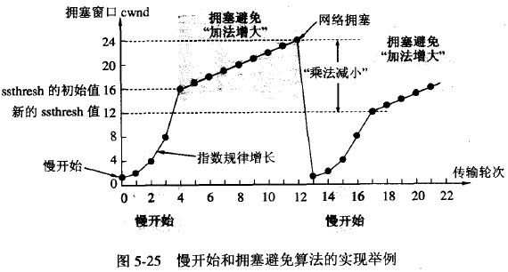

# 计算机网络理解

- 主要参考自：https://snailclimb.gitee.io/javaguide-interview/#/./docs/c-1%E8%AE%A1%E7%AE%97%E6%9C%BA%E7%BD%91%E7%BB%9C

## 1.OSI和TCP/IP协议

- 
- **应用层：**
  - 主要任务：通过**应用进程**间的交互来完成特定的网络应用
  - 应用层协议定义的是应用进程间的通信和交互规则，对于不同的网络应用需要不同的应用层协议
  - 如：
    - 域名解析协议：DNS：Domain Name System：将域名和IP地址相互映射的一个分布式数据库，能够使人更加方便的访问互联网
    - 支持万维网的HTTP协议：HtyperText Transfer Protocol
      - 互联网上应用最为广泛的一种网络协议。所有的 WWW（万维网） 文件都必须遵守这个标准。设计 HTTP 最初的目的是为了提供一种发布和接收 HTML 页面的方法。
    - 支持电子邮件的SMTP协议
  - 应用层交互的数据单元：报文
- **传输层：**
  - 主要任务：负责两台**主机进程**之间的通信，提供通用的数据传输服务
  - 通用：多种应用可以使用同一个传输层服务。由于一台主机可以同时运行多个线程，因此传输层具有复用和分用的功能
    - 复用：多个应用层进程可以同时使用下面的传输层服务
    - 分用：传输层把收到的信息分别交付给上面应用层中的相应进程
  - TCP协议：Transmission Control Protocol：传输控制协议
    - 面向连接的可靠数据传输
  - UDP协议：User Datagram Protocol：用户数据协议
    - 无连接的不可靠数据传输
- **网络层：**
  - 互联网是由大量的异构网络通过路由器相互连接起来的，互联网使用的网络层协议是无连接的网际协议和许多路由选择协议，因此互联网的网络层也可以被称为网际层或者IP层
  - 主要任务：选择合适的网间路由和交换节点，确保数据及时传送
  - 在发送数据时，网络层把传输层产生的报文段(用户数据报)封装成：分组和包进行传输
  - IP协议：网络层使用的协议，因此分组也被称为：IP数据报，简称数据报
  - 注意：**不要把运输层的“用户数据报 UDP ”和网络层的“ IP 数据报”弄混**。另外，无论是哪一层的数据单元，都可笼统地用“分组”来表示。
- **数据链路层：**
  - 主要任务：两台主机之间的数据传输，总是在一段段的链路上传输，此时就需要使用专门的链路层协议
  - 在两个相邻节点之间传输数据时，数据链路层将网络层交下来的IP数据报组装成帧，在两个相邻节点间的链路上传输，每一帧包括数据和必要的控制信息（同步信息、地址信息、差错控制等）
  - 在另一个台主机接收数据时，控制信息可以时接收端能够知道一个帧从哪个比特开始到哪个比特结束，这样数据链路层在收到对应的帧后，就可以从中提取数据部分，交给网络层。控制信息还可以检测所收到的帧种是否由差错，如果发现差错，就直接丢弃，避免继续在网络传输中浪费网络资源。
  - 如果需要改正数据在链路层传输时出现差错（这就是说，数据链路层不仅要检错，而且还要纠错），那么就要采用可靠性传输协议来纠正出现的差错。这种方法会使链路层的协议复杂些。
- **物理层：**
  - 主要任务：**实现相邻计算机节点之间的比特流传输**，尽可能屏蔽具体传输介质和物理设备的的差异
  - 可以让上面的数据链路层不必考虑网络的具体传输介质是什么
  - “透明传送比特流”表示经实际电路传送后的比特流没有发生变化，对传送的比特流来说，这个电路好像是看不见的。
  - 在互联网使用的各种协中最重要和最著名的就是 TCP/IP 两个协议。现在人们经常提到的TCP/IP并不一定单指TCP和IP这两个具体的协议，而往往表示互联网所使用的整个TCP/IP协议族。
- 

## 2.TCP连接？三四？

- 主要参考：https://blog.csdn.net/qzcsu/article/details/72861891

### 2.1 三次握手连接

- 
- 
- TCP标志位，有6种标示：SYN(synchronous建立联机) ACK(acknowledgement 确认) PSH(push传送) FIN(finish结束) RST(reset重置) URG(urgent紧急)Sequence number(顺序号码) Acknowledge number(确认号码)
- 三次握手：
  - 客户端发送带有SYN标志的数据包：对服务端进行第一次握手
    - 客户端进入：SYN-SENT状态：同步已发送状态
  - 服务端发送带有SYN/ACK标志的数据包：对客户端进行第二次握手
    - 服务端进入：SYN-RCVD状态：同步收到状态
  - 客户端发送带有ACK标志的数据包：对服务端进行第三次握手
    - 客户端进入：ESTABLISHED状态：已建立连接状态
    - 服务端收到后，也进入ESTABLISHED状态
- 为什么要三次握手？
  - 三次握手的目的：建立可靠的通信信道，确保客户端和服务端的发送和接收是正常的
  - 第一次握手：客户端什么都不能确定，服务端可以确定客户端发送正常，自己接收正常
  - 第二次握手：
    - 客户端知道：自己发送，接收正常，服务端发送，接收正常
    - 此时服务端知道：客户端发送正常，自己接收正常，但是并不知道自己发送是否正常？
  - 第三次握手：
    - 能够确定双方的收发功能都正常
- 为什么要传回SYN？
  - 服务端传回客户端发送的SYN是为了告诉客户端：我服务端接收到的信息确定就是客户端你发送的信号了！
  - SYN：
    - 是TCP/IP建立连接时使用的握手信号，在客户端和服务器之间建立一个正常的TCP网络连接时，客户端首先发出一个SYN信息，
    - 服务端使用SYN-ACK应答：表示接收到了这个消息
    - 最后客户端再以ACK消息响应
    - 这样一来客户端和服务器之间才能建立可靠的TCP连接，数据就可以在客户端和服务器之间传递！
- 传了SYN，为什么还要传ACK？
  - 双方通信无误必须是两者相互发送信息都无误，传了SYN证明：发送方到接收方的通道没有问题，但是接收方到发送方的通道还需要ACK信号进行验证
- 两次握手可以吗？
  - 三次握手主要是为了防止失效的连接请求报文段突然又传输回了服务端，导致产生问题
    - 如：客户端A发出了连接请求，可能因为网络阻塞原因，A没有收到确认报文，于是A再次重新发生连接请求，
    - 连接成功，等待数据传输完毕后，就释放连接
    - 然后此时A发出的第一个连接请求等到连接释放以后的某个时间才到达服务端B，此时服务端B误认为A又发出了新的连接请求，于是向A发出了确认报文段
    - 如果不采用三次握手，只要服务端B发出了确认报文段，就建立连接，处于建立状态，但是事实上客户端A并不会响应B的确认，并且不会发送数据给服务端，则B一直等待A发送数据，浪费资源

### 2.2 四次挥手断开

- 
- 
- 四次挥手：
  - 客户端发送一个FIN(连接释放报文)并且停止发送数据，用来关闭客户端到服务器的数据传送
    - 客户端进入：FIN-WAIT-1状态：终止等待1状态
  - 服务端接收到FIN，发回一个ACK，ack=u+1，并且加上自己的seq=v，并且通知高层的应用进程：客户端向服务端的连接释放了：也就是客户端没有数据要发送了，但是服务端如果要发送数据，客户端依然可以接收，可以持续一段时间
    - 服务端进入：COLSE-WAIT状态：关闭等待状态
    - 客户端收到服务端的确认请求后，等待服务器发送连接释放报文
      - 客户端进入：FIN-WAIT-2状态：终止等待2状态
  - 服务器将最后的数据发送完毕后，向客户端发送释放连接报文：FIN=1，ack=u+1,seq=w
    - 服务端进入：LAST-ACK状态：最后确认状态
    - 客户端收到服务端的连接释放报文后，发出确认报文：ACK=1，ack=w+1,seq=u+1,经过2**MSL(最长报文段寿命)的时间后，撤销TCB(传输控制块)后，进入CLOSED状态
      - 客户端进入：TIME-WAIT状态：时间等待状态
  - 服务器收到客户端发出的确认，立即进入CLOSED状态，撤销TCB后，就结束了此次TCP连接
- 为什么建立连接是三次握手，关闭连接却要四次挥手？
  - 连接建立的时候，服务端在LISTEN状态下，收到建立连接请求的SYN报文后，把ACK和SYN放入到一个报文里面发给客户端
  - 关闭连接时，服务器收到客户端的FIN报文时，仅仅表示客户端不发数据给服务端，但是客户端还是可以接收数据，因此等服务端把数据发送完毕后，再发送FIN报文给客户端来表示同意现在关闭连接，也就是意味着ACK和FIN分开发送，从而导致多了一次
- 为什么要等待2MSL？
  - **保证客户端发送的最后一个ACK报文段能够到达服务端：**因为这个ACK报文段可能会丢失，服务端收不到这个确认报文段就会超时重传连接释放报文段，然后客户端能够在2MSL时间段内收到这个重传的连接释放报文段，接着客户端再重传一次，重新启动2MSL计数器，最后客户端和服务端都进入到CLOSED状态
    - 如果客户端在TIME-WAIT状态不等待一段时间，而是发送完ACK报文段后立即释放连接，则无法收到B重传的连接释放报文段，所以不会再发送一次确认报文，服务端就无法正常进入到CLOSED状态
  - **防止已失效的连接请求报文段出现在本连接中：**
    - 客户端在发送完最后一个ACK段后，再经过2MSL，就可以使这个连接所产生的所有报文段都从网络中消失，使下一个新的连接中不会出现旧的连接请求报文段。

## 3. TCP和UDP？

- UDP在传输数据之前不需要先建立连接，远程主机在收到UDP报文后，不需要给出任何确认。
  - 虽然UDP不提供可靠交付，但是在某些情况下UDP确实是一种最优效的工作方式：即时通信：QQ 语音、 QQ 视频 、直播等等
- TCP提供面向连接的服务，在传输数据之前必须先建立连接，数据传输接收后要释放连接。
  - TCP不提供广播或者多播服务，而是提供有效可靠的，面向连接的服务：
    - 数据连接：三次握手
    - 数据传输：
      - 确认、窗口、重传、拥塞控制等
    - 数据结束：四次挥手
  - 这些都会造成一定的资源开销，占用CPU资源，因此TCP一般用于文件传输、发送和接收邮件、远程登录等场景

## 4. TCP协议如何保证可靠传输？

- 主要是从：数据传输：差错控制、重复数据、流量控制、拥塞控制、确认机制、重传机制等方面

- 应用数据被分割成TCP认为最合适发送的数据块

- TCP给发送的每个包进行编号，接收方对数据包进行排序，把有序数据传输给应用层

- 校验和：TCP将报错它首部和数据的校验和。这是一个端到端的校验和，目的是检测数据在传输过程中的是否有变化
  
  - 如果收到的数据检测和有差错，TCP将丢弃这个报文段和不确认收到此数据

- TCP的接收端会丢弃重复数据

- 流量控制：TCP连接的每一方都有固定大小的缓冲空间，TCP的接收端只允许发送端发送接收端缓冲区可以接纳的数据。
  
  - 当接收方来不及处理发送方的数据，能够提升发送方降低发送的速率，防止包丢失
  - TCP 利用滑动窗口实现流量控制

- 拥塞控制：当网络拥塞时，减少数据的发送

- ARQ协议：每发送完一个分组就停止发送，等待对方确认，在收到确认后再发下一个分组

- 超时重传：当TCP发出一个段后，它启动一个定时器，等待接收端确认收到这个报文段，如果不能及时收到一个确认，就将重发这个报文段

## 5.ARQ协议-保证发送可靠

- ARQ：Automatic Repeat-reQuest：自动重传请求：是OSI模型中数据链路层和传输层的错误纠正协议之一、
- 核心思想：使用确认和超时两个机制，在不可靠服务的基础上实现可靠的信息传输。如果发送方在发送后一段时间没有收到确认帧，通常会重新发送。

### 5.1　停止等待ARQ协议

- 目的：为了实现可靠传输！
- 基本原理：每发完一个分组就停止发送，等待对方确认(回复ACK)，如果过了一段时间没有收到ACK回复，就说明没有发送成功，需要重新发送，直到收到确认后再发下一个分组。如果接收方收到重复分组，就应该丢弃该分组，但同时还需要发送确认
- 优点：简单
- 缺点：信道利用率低，等待时间长
- 传输无差错情况：
  - 发送方发送分组,接收方在规定时间内收到,并且回复确认.发送方再次发送。
- 传输有差错情况：
  - 超时重传：停止等待协议中超时重传是指只要超过一段时间仍然没有收到确认，就重传前面发送过的分组（认为刚才发送过的分组丢失了）。因此每发送完一个分组需要设置一个超时计时器，其重传时间应比数据在分组传输的平均往返时间更长一些。这种自动重传方式也被称为自动重传请求ARQ
  - 确认丢失：确认消息在传输过程丢失。当A发送M1消息，B收到后，B向A发送了一个M1确认消息，但却在传输过程中丢失。而A并不知道，在超时计时过后，A重传M1消息，B再次收到该消息后采取以下两点措施：1. 丢弃这个重复的M1消息，不向上层交付。 2. 向A发送确认消息。（不会认为已经发送过了，就不再发送。A能重传，就证明B的确认消息丢失）。
  - 确认迟到：确认消息在传输过程中迟到。A发送M1消息，B收到并发送确认。在超时时间内没有收到确认消息，A重传M1消息，B仍然收到并继续发送确认消息（B收到了2份M1）。此时A收到了B第二次发送的确认消息。接着发送其他数据。过了一会，A收到了B第一次发送的对M1的确认消息（A也收到了2份确认消息）。处理如下：1. A收到重复的确认后，直接丢弃。2. B收到重复的M1后，也直接丢弃重复的M1。

### 5.2 连续ARQ协议

- 连续ARQ协议：主要可以提高信道利用率。发送方维持一个发送窗口，只要在发送窗口内的分组都可以连续发送出去，而不需要等待对方确认。接收方使用累计确认，对按序到达的最后一个分组确认，表名这个分组为止的所有分组都已经确认收到了
- 优点：信道利用率高，容易实现，即使确认丢失，也不必重传
- 缺点：
  - 不能向发送方反映出接收方已经正确收到的所有分组的信息。 比如：发送方发送了 5条  消息，中间第三条丢失（3号），这时接收方只能对前两个发送确认。发送方无法知道后三个分组的下落，而只好把后三个全部重传一次。这也叫  Go-Back-N（回退 N），表示需要退回来重传已经发送过的 N 个消息

## 6.滑动窗口协议-保证流量控制

- 主要作用：TCP利用滑动窗口来实现流量控制，进而控制发送方发送速率，来确保接收方来得及接收。
  - 接收方可以通过确认报文中的窗口字段来控制发送方窗口大小，从而影响发送方的发送速率
- 具体实现和分类：https://blog.csdn.net/xiaojie_570/article/details/87904328
  - 停止等待协议：发送窗口大小＝１，接收窗口大小＝１
  - 后退N帧协议：发送窗口大小＞１，接收窗口大小＝１
  - 选择重传协议：发送窗口大小＞１，接收窗口大小＞１

## 7. 拥塞控制

- 拥塞：在某段时间内，对网络中的某一资源需求超过了该资源能够提供的可用部分，网络性能就会下降，这种情况就称为拥塞
- 拥塞控制：防止过多的数据发送到网络，防止路由器或者链路过载
- 拥塞控制：是一个全局性的过程，涉及到所有的主机，所有的路由器，以及与降低网络传输性能有关的所有因素。
- 流量控制：是点对点通信量的控制，是个端到端的问题。流量控制所要做到的就是抑制发送端发送数据的速率，以便使接收端来得及接收。
- 实现拥塞控制：
  - TCP 发送方要维持一个 **拥塞窗口(cwnd)** 的状态变量。拥塞控制窗口的大小取决于网络的拥塞程度，并且动态变化。发送方让自己的发送窗口取为拥塞窗口和接收方的接受窗口中较小的一个。
  - TCP的拥塞控制采用了四种算法：慢开始、拥塞避免、快重传、快恢复
  - 在网络层也可以使用路由器采用适当的分组丢弃策略来减少网络拥塞的发送
- 慢开始：
  - 当主机开始发送数据时：
    - 如果立即把大量数据字节注入到网络，那么可能会引起网络阻塞，因为现在还不知道网络的符合情况。
    - 由小到大逐渐增大发送窗口，cwnd初始值为1，每经过一次传输，cnwd加倍
- 拥塞避免：
  - cwnd逐渐增大，每经过一个往返时间RTT，就把cwnd+1
- 
- 快重传和快恢复：
  - 快速重传和恢复（fast retransmit and recovery，FRR）是一种拥塞控制算法，它能快速恢复丢失的数据包。
  - 快重传：当出现三个重复的ACK报文时，直接重传对方尚未接收到的报文段
  - 快恢复：当出现三个重复的ACK报文时，开始使用快恢复算法，将拥塞窗口变为原来的一半，开始使用拥塞避免算法
  - 如果没有FRR，数据包丢失，TCP就会使用定时器来要求传输暂停
  - 使用FRR：如果接收端接收到一个不按顺序的数据段，它会立即给发送机发送一个重复确认。如果发送端接收到三个重复确认，发送端就会假定确认件指出的数据段丢失了，并立即重传这些丢失的数据段。
  - 有了 FRR，就不会因为重传时要求的暂停被耽误。  当有单独的数据包丢失时，快速重传和恢复（FRR）能最有效地工作。当有多个数据信息包在某一段很短的时间内丢失时，FRR则不能很有效地工作。
- 

## 8. 浏览器URL过程

- 详细可以参考：https://segmentfault.com/a/1190000006879700
- 
- 浏览器查找域名的IP地址
  - DNS查找过程：浏览器缓存-》路由器缓存-》DNS缓存
- 浏览器根据IP地址向Web服务器发送一个HTTP请求=》应用层
  - 此时Cookie也会随着请求发送给服务器
  - HTTP协议封装数据
  - TCP：与服务器建立TCP连接=》传输层
  - IP：建立TCP协议时，需要发送数据，发送数据在网络层使用IP协议=》网络层
    - OPSF：IP数据包在路由器之间传输，使用OPSF协议
  - ARP协议：将IP地址转换为MAC地址=》数据链路层
- 服务器处理请求
  - 根据参数、cookies处理请求，生成HTML响应
- 服务器发回一个HTML响应
- 浏览器解析渲染显示HTML
- 连接结束

## 9. HTTP状态码

- 

## 10. HTTP长短连接？

- 可以参考：https://www.cnblogs.com/gotodsp/p/6366163.html

- HTTP/1.0：采用的就是短连接：客户端和服务器每进行一次HTTP操作，就建立一次连接，任务完成后就断开连接
  
  - 当客户端浏览器访问的某个HTML或其他类型的Web页中包含有其他的Web资源（如JavaScript文件、图像文件、CSS文件等），每遇到这样一个Web资源，浏览器就会重新建立一个HTTP会话。

- HTTP/1.1：采用的就是长连接，保持连接特性
  
  - 在使用长连接的情况下，当一个网页打开完成后，客户端和服务器之间用于传输HTTP数据的TCP连接不会关闭，客户端再次访问这个服务器时，会继续使用这一条已经建立的连接。Keep-Alive不会永久保持连接，它有一个保持时间，可以在不同的服务器软件（如Apache）中设定这个时间。实现长连接需要客户端和服务端都支持长连接。

- HTTP/1.0和HTTP1.1的区别：
  
  - 连接方面：
    - HTTP/1.0：短连接
    - HTTP/1.1：长连接，一种持续连接方式，分为非流水线方式和流水线方式
      - 流水线方式：客户端在收到HTTP的响应报文之前就可以接着给服务端发送新的请求报文
      - 非流水线发送：客户端在收到前一个响应后才能发送下一个请求
  - 错误响应码方面：
    - HTTP/1.1新增了24个错误状态响应码：409(Conflict)表示请求的资源与当前状态发生冲突，410(Gone)表示服务器上的某个资源被永久性的删除了
  - 缓存处理：
    - 在HTTP1.0中主要使用header里的If-Modified-Since,Expires来做为缓存判断的标准
    - HTTP1.1则引入了更多的缓存控制策略例如Entity tag，If-Unmodified-Since, If-Match, If-None-Match等更多可供选择的缓存头来控制缓存策略。
  - 带宽优化以及网络连接的使用：
    - HTTP1.0中，存在一些浪费带宽的现象，例如客户端只是需要某个对象的一部分，而服务器却将整个对象送过来了，并且不支持断点续传功能
    - HTTP1.1则在请求头引入了range头域，它允许只请求资源的某个部分，即返回码是206（Partial Content），这样就方便了开发者自由的选择以便于充分利用带宽和连接。

## 11. URI？URL？

- URI：Uniform Resource Identifier：统一资源标志符，可以唯一标识一个资源
- URL：Uniform Resource Location：统一资源定位符，可以提供该资源的路径，是一个具体的URI，可以用来标识一个资源，并且还可以指明如何定位这个资源

## 12. HTTP？HTTPS？

- 端口：
  - HTTP的URL是由：http:// 起始并且默认端口号是80
  - HTTPS的URL是由：https:// 起始并且默认端口号是443
- 安全性和资源消耗：
  - HTTP协议运行在TCP协议之上，所有传输的内容都是明文，客户端和服务器都无法验证对方的身份
  - HTTPS协议运行在SSL/TLS之上的HTTP协议，SSL/TLS（在会话层）运行在TCP之上，所有传输的内容都经过加密，加密采用对称加密，但对称加密的密钥用服务器方的证书采用了非对称加密
    - 对称加密：密钥只有一个，加密解密为同一个密码，且加解密速度快，典型的对称加密算法有DES、AES等；
    - 非对称加密：密钥成对出现（且根据公钥无法推知私钥，根据私钥也无法推知公钥），加密解密使用不同密钥（公钥加密需要私钥解密，私钥加密需要公钥解密），相对对称加密速度较慢，典型的非对称加密算法有RSA、DSA等。

## 13. HTTP如何保持用户状态？

- HTTP是一种不保持状态协议，也即是HTTP协议自身不对请求和响应之间的通信状态进行保存
- Session机制的存在就是为了解决保存用户状态问题
  - 主要作用：通过服务端记录用户的状态
- 应用场景：
  - 当你要添加商品到购物车的时候，系统不知道是哪个用户操作的，因为 HTTP 协议是无状态的。服务端给特定的用户创建特定的 Session  之后就可以标识这个用户并且跟踪这个用户了（一般情况下，服务器会在一定时间内保存这个 Session，过了时间限制，就会销毁这个Session）。
- 在服务端保存 Session 的方法很多，最常用的就是内存和数据库(比如是使用内存数据库redis保存)。
- 既然 Session  存放在服务器端，那么我们如何实现 Session 跟踪呢？
  - 大部分情况下，我们都是通过在 Cookie 中附加一个 Session ID  来方式来跟踪。
- 如果Cookie被禁用怎么办？
  - 利用URL重写把Session ID 直接附加在URL路径上也可以

## 14. Cookie和Session?

- Cookie 和 Session都是用来跟踪浏览器用户身份的会话方式，但是两者的应用场景不太一样。
- Cookie：一般用来保存用户信息
  - 实例：
    - 我们在 Cookie 中保存已经登录过得用户信息，下次访问网站的时候页面可以自动帮你登录的一些基本信息给填了
    - 一般的网站都会有保持登录也就是说下次你再访问网站的时候就不需要重新登录了，这是因为用户登录的时候我们可以存放了一个 Token 在 Cookie 中，下次登录的时候只需要根据 Token 值来查找用户即可(为了安全考虑，重新登录一般要将 Token 重写)
    - 登录一次网站后访问网站其他页面不需要重新登录。
- Session：一般是通过服务端记录用户信息
  - 实例：
    - 当你要添加商品到购物车的时候，系统不知道是哪个用户操作的，因为 HTTP 协议是无状态的。服务端给特定的用户创建特定的 Session 之后就可以标识这个用户并且跟踪这个用户了。
- 区别：
  - 存储位置：
    - Cookie数据保存在客户端
    - Session数据保存在服务器端
  - 安全性：
    - Cookie保存在客户端，安全性比较低，一般敏感数据都是先加密，然后使用的时候再到服务端进行解密
    - Session保存在服务器端，安全性比较高

## 15. HTTP报文格式

- HTTP请求报文的组成？
  - 请求行：
    - 包括请求方法，访问的资源URL，使用的HTTP版本。`GET`和`POST`是最常见的HTTP方法，除此以外还包括`DELETE、HEAD、OPTIONS、PUT、TRACE`。 
  - 请求头：
    - 格式为“属性名:属性值”，服务端根据请求头获取客户端的信息，主要有`cookie、host、connection、accept-language、accept-encoding、user-agent`。
  - 请求体：
    - 用户的请求数据如用户名，密码等。
- HTTP响应报文的组成？
  - 状态行：
    - 协议版本，状态码及状态描述。 
  - 响应头：
    - 响应头字段主要有`connection、content-type、content-encoding、content-length、set-cookie、Last-Modified，、Cache-Control、Expires`
  - 响应体：
    - 服务器返回给客户端的内容

## 16. POST和GET

- 传递数据：
  - GET请求参数通过URL传递，POST的参数放在请求体中。 
- 发送报文：
  - GET产生一个TCP数据包；浏览器会把请求头和请求体一并发送出去；
  - POST产生两个TCP数据包。对于POST，浏览器先发送请求头，服务器响应100 continue，浏览器再发送请求体
- 缓存：
  - GET请求会被浏览器主动缓存，而POST不会，除非手动设置。 
- 编码：
  - GET请求只能进行url编码，而POST支持多种编码方式。 
- 历史记录：
  - GET请求参数会被完整保留在浏览器历史记录里，而POST中的参数不会被保留。

## 17. HTTP1.1？HTTP2.0？

- **新的二进制格式**：HTTP1.1 基于文本格式传输数据；HTTP2.0采用二进制格式传输数据，解析更高效。

- **多路复用**：在一个连接里，允许同时发送多个请求或响应，**并且这些请求或响应能够并行的传输而不被阻塞**，避免 HTTP1.1 出现的”队头堵塞”问题。

- **头部压缩**，HTTP1.1的header带有大量信息，而且每次都要重复发送；HTTP2.0 把header从数据中分离，并封装成头帧和数据帧，**使用特定[算法]()压缩头帧**，有效减少头信息大小。并且HTTP2.0**在客户端和服务器端记录了之前发送的键值对，对于相同的数据，不会重复发送。**比如请求a发送了所有的头信息字段，请求b则**只需要发送差异数据**，这样可以减少冗余数据，降低开销。

- **服务端推送**：HTTP2.0允许服务器向客户端推送资源，无需客户端发送请求到服务器获取。