# 设计模式前置知识

- 主要参考自：https://www.bilibili.com/video/BV1G4411c7N4?p=5

## 1. 七大原则

### 1.1 单一职责原则-高内聚

- 简单定义：对类(方法)来说，一个类(方法)应该只负责一项职责
  - 如果类A负责两个不同的职责：职责1、职责2
  - 当职责1需求变更而改变A时，可能会造成职责2执行错误
  - 因此需要将类A的粒度分解为A1和A2
- 注意：
  - 降低类的复杂度，一个类只负责一项职责。
  - 提高类的可读性,可维护性
  - 降低变更引起的风险
  - 通常情况下，我们应当遵守单一职责原则，只有逻辑足够简单，才可以在代码级违反单一职责原则;只有类中方法数量足够少，可以在方法级别保持单一职责原则

### 1.2 接口隔离原则-减少代码冗余

- 简单定义：客户端不应该依赖它不需要的接口！
  - 也就是：一个类对另一个类的依赖(通过接口使用这另一个类)应该建立在最小接口上！！！
- 实例：
- 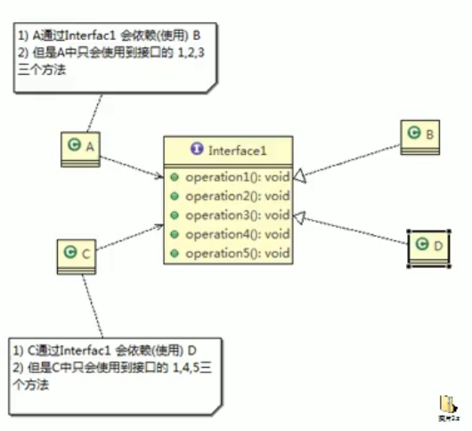
- 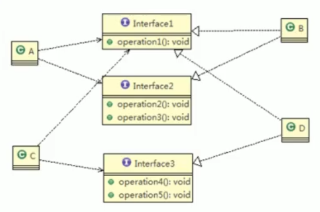

### 1.3 依赖倒置原则-面向接口多态

- 简单定义：
  - 高层模块不应该依赖底层模块，二者都依赖其抽象(抽象类或者接口)
  - **抽象不应该依赖细节，细节应该依赖抽象**
  - 依赖倒转(倒置)的中心思想是面向接口编程
  - 依赖倒转原则是基于这样的设计理念：相对于细节的多变性，抽象的东西要稳定的多。以抽象为基础搭建的架构比以细节为基础的架构要稳定的多。在java中，抽象指的是接口或抽象类,细节就是具体的实现类
  - 使用接口或抽象类的目的是制定好规范，而不涉及任何具体的操作，把展现细节的任务交给他们的实现类去完成
- 举例：
  - Person类要实现能够接收消息的功能
  - 实现法一：
    - Person类中的receive方法直接接收email对象来getInfo
    - 问题：如果期望接收微信、QQ消息就要重新写方法
  - 实现法二：实现依赖倒置
    - 将email中的核心方法抽象出一个接口 IReceiver定义getInfo方法
    - 每个消息类：email、微信、QQ实现IReceiver这个接口就可以
    - Person类中的receive方法直接接收这个接口=》多态，来获取对应消息对象的消息即可！
- 实现依赖倒置的三种方式：
  - 接口传递
  - 构造方法传递
  - setter方式传递
- 注意：
  - 低层模块尽量都要有抽象类或接口，或者两者都有，程序稳定性更好.
  - 变量的声明类型尽量是抽象类或接口，这样我们的变量引用和实际对象间，就存在一个缓冲层，利于程序扩展和优化
  - 继承时遵循里氏替换原则

### 1.4 里氏替换原则-正确使用继承

- 使用继承会存在的问题？
  - 继承包含这样一层含义:父类中凡是已经实现好的方法，实际上是在设定规范和契约，虽然它不强制要求所有的子类必须遵循这些契约，但是如果子类对这些已经实现的方法任意修改，就会对整个继承体系造成破坏。
  - 继承在给程序设计带来便利的同时，也带来了弊端。比如使用继承会给程序带来侵入性，程序的可移植性降低，增加对象间的耦合性，如果一个类被其他的类所继承，则当这个类需要修改时，必须考虑到所有的子类，并且父类修改后，所有涉及到子类的功能都有可能产生故障
  - 问题提出:在编程中，如何正确的使用继承?->里氏替换原则
- 简单定义：
  - 如果对每个类型为T1的对象o1，都有类型为T2的对象o2，使得以T1定义的所有程序Р在所有的对象o1都代换成o2时，程序Р的行为没有发生变化，那么类型T2是类型T1的子类型。换句话说，**所有引用基类的地方必须能透明地使用其子类的对象。**
  - 在使用继承时，遵循里氏替换原则，在子类中尽量不要重写父类的方法
  - 里氏替换原则告诉我们，继承实际上让两个类耦合性增强了，在适当的情况下，可以通过聚合，组合（定义要使用这个类的对象，作为一个类的成员变量来操作），依赖来解决问题。

### 1.5 开闭原则-最终目标

- 简单定义：
  - 开闭原则(Open Closed Principle）是编程中最基础、最重要的设计原则
  - 一个软件实体如类，模块和函数应该对**扩展开放(对提供方)**，对**修改关闭(对使用方)**。**用抽象构建框架，用实现扩展细节**。
  - 当软件需要变化时，尽量通过扩展软件实体的行为来实现变化，而不是通过修改已有的代码来实现变化。
  - 编程中遵循其它原则，以及使用设计模式的目的就是遵循开闭原则。

### 1.6 迪米特法则-低耦合

- 简单定义：
  - 一个对象应该对其他对象保持最少的了解
  - 类与类关系越密切，耦合度越大
  - 迪米特法则(Demeter Principle)又叫**最少知道原则**，即一个类对自己依赖的类知道的越少越好。也就是说，**对于被依赖的类不管多么复杂，都尽量将逻辑封装在类的内部。对外除了提供的public方法，不对外泄露任何信息**
  - 迪米特法则还有个更简单的定义:只与直接的朋友通信
- **直接的朋友**：每个对象都会与其他对象有耦合关系，只要两个对象之间有耦合关系,我们就说这两个对象之间是朋友关系。耦合的方式很多，依赖，关联，组合，聚合等。其中，我们称出现**成员变量，方法参数，方法返回值中的类为直接的朋友**，而出现在**局部变量中的类不是直接的朋友**。也就是说，陌生的类最好不要以局部变量的形式出现在类的内部。
- 实例：
  - 一个类的方法中new 了另一个类=》局部变量，并且进行处理！=》违背了迪米特法则
  - 如：打印总部员工ID和分部员工ID
  - 在总部类中实现以上方法，并且在该方法中new 一个分部类，以获取分部员工ID
  - 此时：这个分部类就不是直接朋友！如果要修改方法和信息的话，既要修改分部类，又要修改总部类！
  - 改进：将new 一个分部类要实现的功能移到分部类中实现！**都尽量将逻辑封装在类的内部。对外除了提供的public方法，不对外泄露任何信息**
- 注意：
  - 迪米特法则的核心是降低之间的耦合
  - 但是注意：由于每个类都减少了不必要的依赖，因此迪米特法则只是要求降低类间(对象间)耦合关系，并不是要求完全没有依赖关系

### 1.7合成复用原则-不使用继承

- 简单定义：
  - 尽量使用合成、聚合的方式使用类，而不是继承
- 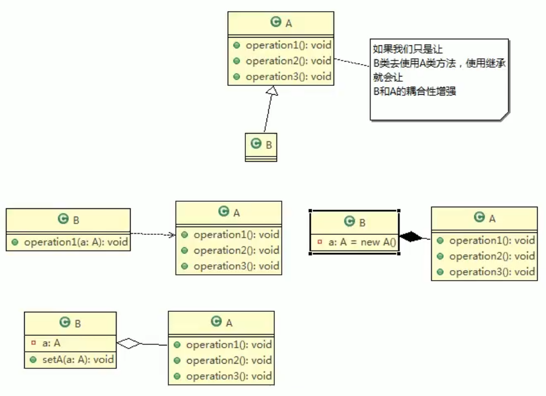

### 1.8 设计原则核心思想

- 找出应用中可能需要变化之处，把它们独立出来，不要和那些不需要变化的代码混在一起。
- 针对接口编程，而不是针对实现编程 。
- 为了交互对象之间的松耦合设计而努力

## 2. UML类图

### 2.1 什么是UML？

- UML——Unified modeling language UML(统一建模语言)，是一种用于软件系统分析和设计的语言工具，它用于帮助软件开发人员进行思考和记录思路的结果
- UML本身是一套符号的规定，就像数学符号和化学符号一样,这些符号用于描述软件模型中的各个元素和他们之间的关系,比如类、接口、实现、泛化、依赖、组合、聚合等，如右图:
- 使用UML来建模，常用的工具有 RationalRose ,也可以使用一些插件来建模
- 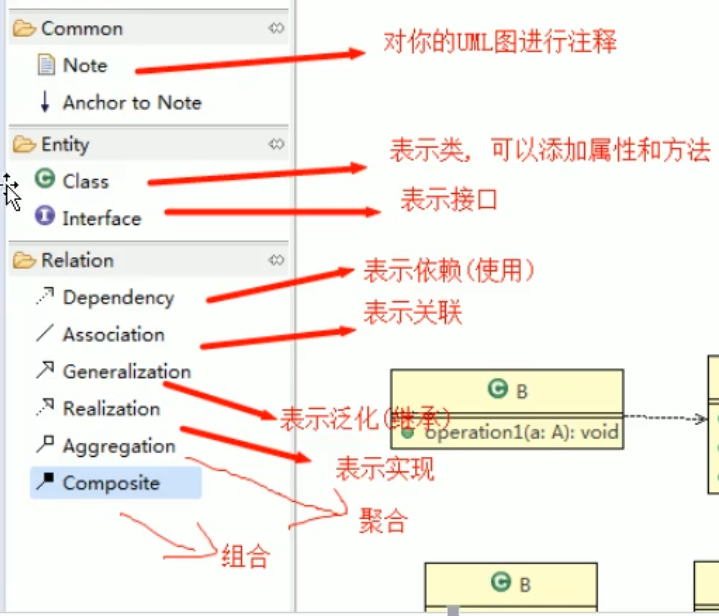

### 2.2 UML图

- 画UML图与写文章差不多，都是把自己的思想描述给别人看，关键在于思路和条理
- UML图分类:
  - 用例图(use case)
  - 静态结构图：**类图**、对象图、包图、组件图、部署图
  - 动态行为图：交互图(时序图与协作图)、状态图、活动图
  - 说明:
    - 类图是描述类与类之间的关系的,是UML图中最核心的
- 什么是UML类图？
  - 用于描述系统中的类(对象)本身的组成和类(对象)之间的各种静态关系。
  - 类之间的关系:依赖、泛化（继承）、实现、关联、聚合与组合

### 2.3 UML类图关系-六大关系

- **依赖关系(Dependence)：**
  - 只要是在类中用到了对方，那么他们之间就存在依赖关系。如果没有对方，连编绎都通过不了。
    - 类中用到了对方
    - 如果是类的成员属性
    - 如果是方法的返回类型
    - 方法接收的参数类型方法中使用到
  - 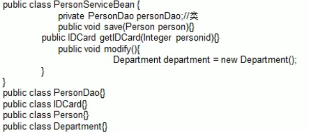
  - 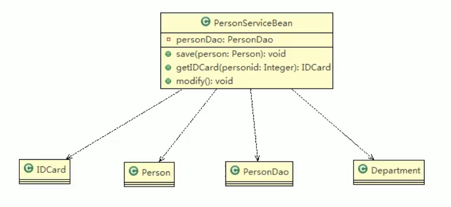
- **泛化关系(Generalization)：**
  - 实际就是继承关系，是依赖的特例
  - 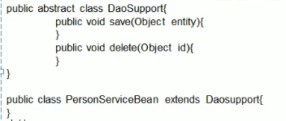
  - 
- **实现关系(Implementation)：**
  - 实现关系实际上就是A类实现B接口，他是依赖关系的特例
  - 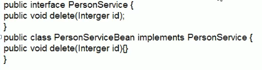
  - 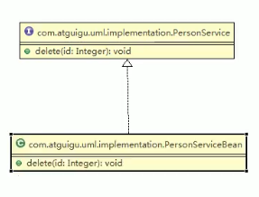
- **关联关系(Association)：**
  - 关联关系实际上就是类与类之间的联系，他是依赖关系的特例
  - 关联具有导航性：即双向关系或单向关系
  - 关系具有多重性:如“1”(表示有且仅有一个），“0...”(表示0个或者多个），“O，1”(表示0个或者一个),“n...m”(表示n到 m个都可以), "m.….*”(表示至少m个)）。
  - 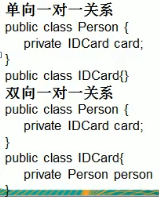
  - 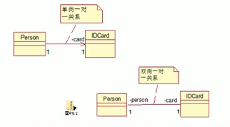
- **聚合关系(Aggregation)：**
  - 聚合关系(Aggregation）表示的是整体和部分的关系，整体与部分可以分开。聚合关系是关联关系的特例，所以他具有关联的导航性与多重性。
  - 如:一台电脑由键盘(keyboard)、显示器(monitor)，鼠标等组成；组成电脑的各个配件是可以从电脑上分离出来的，使用带空心菱形的实线来表示；
  - 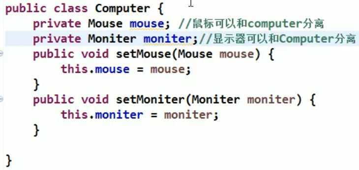
  - 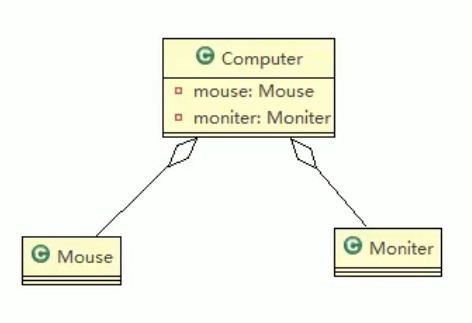
- **组合关系：**
  - 不可分离的聚合关系，即升级为组合关系
  - 也就是：一样是整体和部分的关系，但是整体与部分不可以分开
  - 如果Mouse,Monitor和Computer是不可分离的，则升级为组合关系
  - 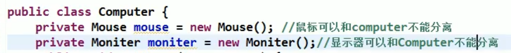
  - 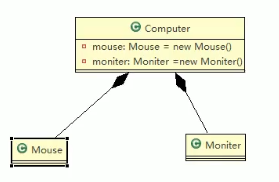

