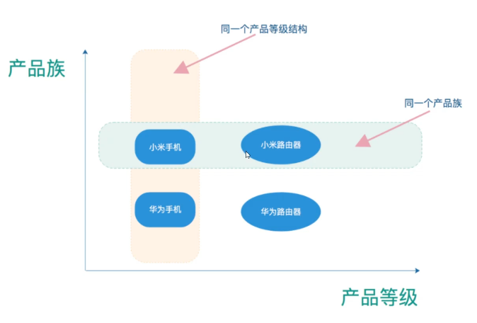
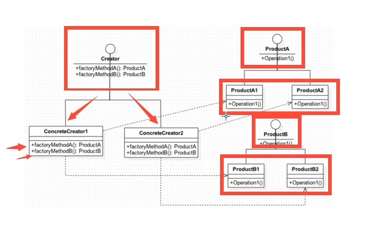
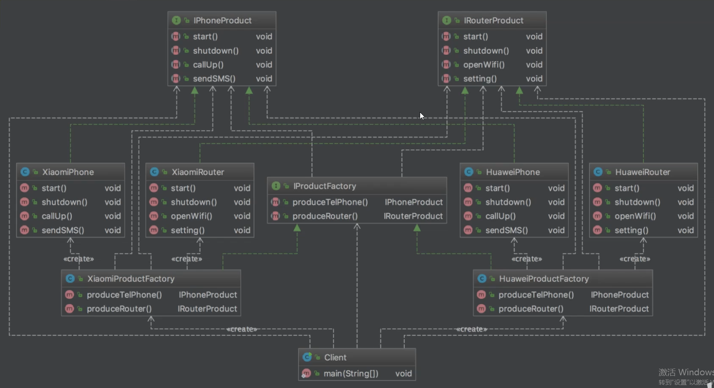
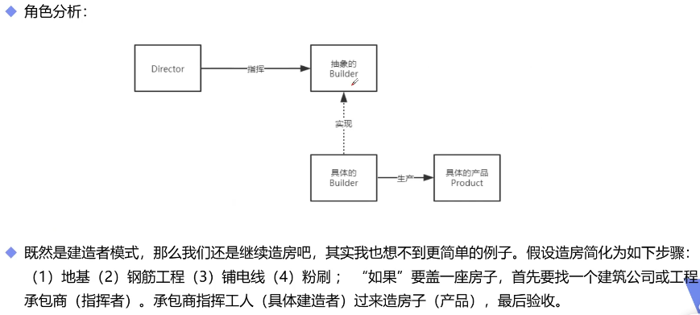
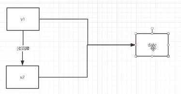
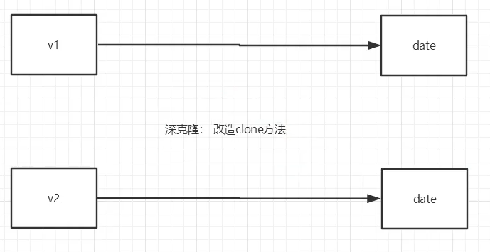
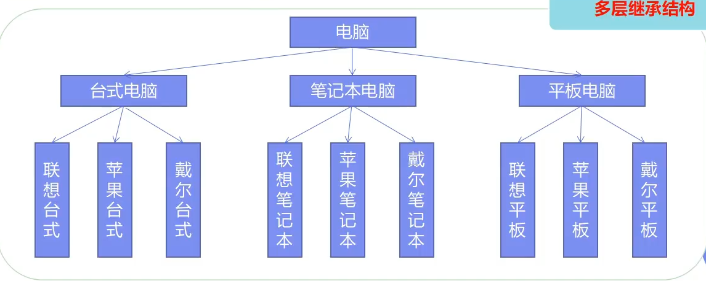
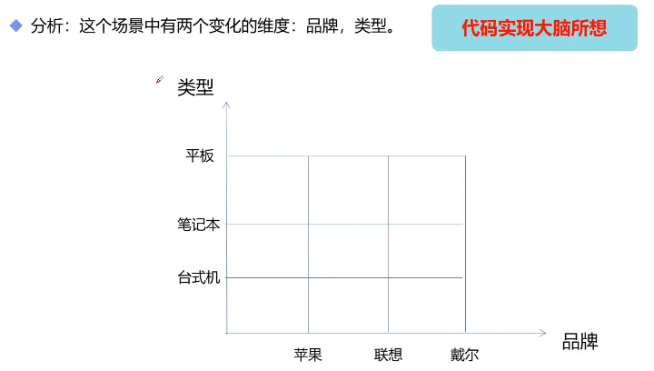
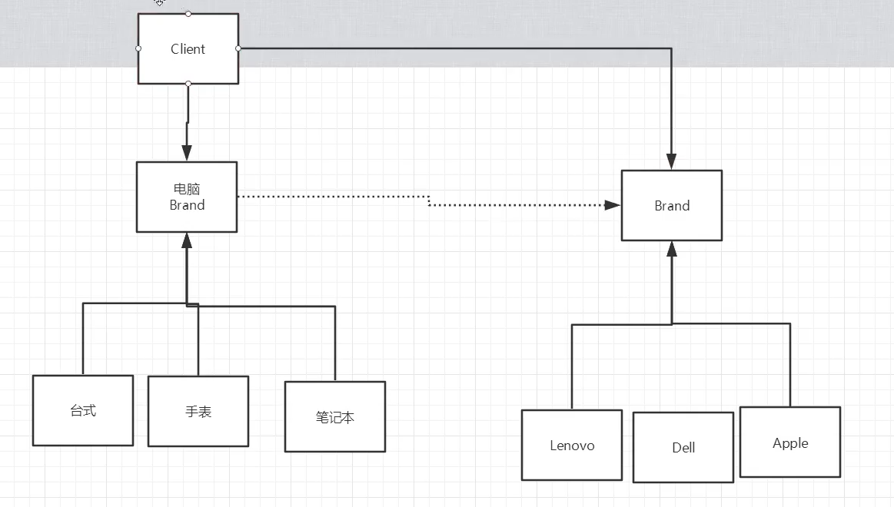

# 设计模式-基础理解

- 主要参考自：
  - 师兄的笔记
  - https://www.bilibili.com/video/BV1mc411h719?p=3

## 1. 设计模式的原则

- 面向对象编程有七大原则，其根本原因是为了：代码复用、增加可维护性！
  - **单一职责原则(Single-responsiblity principle)：** 一个类只有一个引起它变化的原因(职责)，解耦，增强内聚性       
  - **开闭原则(Open-closed principle)：** 软件实体(包括类、模块、函数等)应该`对于扩展开放，对于修改封闭`        
  - **里氏代换原则(Liskov substitution principle)：** 任何父类可以出现的地方，子类一定也可以出现。即是派生类可以替换掉基类。`子类尽量不要重写父类的方法`，解决办法是抽象出一个更基础的类，让父类和子类都去继承那个更基础的类                
  - **接口隔离原则(Interface segregation principle)：** 使用多个隔离的接口比使用单接口好，目的就是降低类之间的耦合度，便于软件升级和维护。`接口最小化`
  - **依赖倒置原则(Dependency inversion principle)：** 开闭原则的基础，要求调用者和被调用者都依赖抽象，两者没有直接的关联和接触，一方变动不会影响另一方的变动。因为抽象的东西要稳定得多。`面向接口编程`          
  - **迪米特原则(Least Knowledge Principle)：** `一个对象应对其他对象有尽可能少的了解`，使系统的功能模块功能独立，相互之间很少有依赖关系         
  - **合成/聚合复用原则(Composite Reuse Principle)：** 合成复用原则，继承的耦合性比组合更大，组合只是引用类的方法，可以减少耦合，同时也实现了复用。`使用组合关系而不是继承关系，以减少耦合`  
- 说人话：一个类就负责一个东西，可拓展但是不可修改，父类子类可用替换使用，接口最小化，抽象=》面向接口编程，两个类无依赖、使用组合聚合而非继承
- 23种设计模式，可用分为三个类别：
  - 创建型模式：单例、工厂、抽象工厂、建造者、原型模式
  - 结构型模式：适配器、装饰器、代理、外观、组合、桥接、享元模式
  - 行为型模式：策略、命令、状态、观察者、模板方法、迭代器、中介者、备忘录、解释器、职责链、访问者模式

## 2. 创建型模式-如何new对象

### 2.1 单例模式

- 定义：确保某一个类只有一个实例，并自行实例化。可用向整个系统提供整个实例，可用直接访问，不需要调用者实例化这个类对象(也即不需要new XXX)
- 关键实现：
  - 构造方法私有化、判断是否存在单例
- 一般直接使用饿汉式=》因为简单！
- 有懒加载需求的时候可用使用：静态内部类的懒汉式

#### 2.1.1 饿汉式

- 简单，但是很容易产生垃圾对象

- 优点：没有加锁，执行效率高

- 缺点：类加载时就会初始化，浪费内存

- ```java
  public class Singleton{
      private static Singleton instance = new Singleton();
      private Singleton(){}
      public static Singleton getIntance(){
          return instance;
      }
  }
  ```

#### 2.1.2 懒汉式

- 具备很好的lazy loading，可用在多线程中很好的工作，但是效率很低

- 优点：第一次调用才初始化，避免浪费内存

- 缺点：必须加锁synchronized才能保证单例，但加锁会影响效率

- ```java
  // 单线程可用，但是多线程会有问题
  public class Singleton{
      private static Singleton instance;
      private Singleton(){
  
      }
      public static Singleton getInstance(){
          if(instance==null){
              instance = new Singleton();
          }
          return instance;
      }
  }
  
  // 加synchronized
  public class Singleton{
      private static Singleton instance;
      private Singleton(){}
      public static synchronized Singleton getIntance(){
          if(instance==null){
              instance=new Singleton();
          }
          return instance;
      }
  }
  ```

- **双重检测锁(DCL)懒汉式**：
  
  - 采用双锁机制
  - synchronize+volatile实现：synchronized保证单例，volatile保证可见性和禁止指令重排
  - 优点：
    - 安全、多线程情况下也可以保持高性能

- ```java
  public class Singleton{
      private Singleton(){}
      private volatile static Singleton instance = null;
      public static Singleton getInstance(){
          if(instance==null){
              synchronized(Singleton.class){
                  if(instacne==null){ // 双重检测机制，避免第一次判空的线程拿到锁后new 出线程
                       /**
                       * 1.分配内存空间
                       * 2.执行构造方法，初始化对象
                       * 3.把这个对指向这个空间
                       * 指令重排！！！
                       * 132 线程AA
                       *此时线程B会直接return ，但是lazyMan还没有完成构造(2步骤)
                       */
                      instance = new Singleton();
                  }
              }
          }
          return instance;
      }
  }
  ```

- **静态内部类实现懒汉单例：**
  
  - 主要是利用加载一个类的时候，其内部类不会同时被加载。
  - INSTANCE对象初始化的时机并不是在单例类Singleton被加载的时候，而是在调用getInstance方法，使得静态内部类LazyHolder被加载的时候。因此这种实现方式是利用classloader的加载机制来实现懒加载，并保证构建单例的线程安全  

- ```java
  public class Singleton{
      private static class LazyHolder{
          private static final Singleton INSTANCE = new Singleton();
      }
      private Singleton(){}
      public static Singleton getIntance(){
          return LazyHolder.INSTANCE;
      }
  }
  ```

- **注意：** 以上4种方式都无法防止利用反射来构建对象

- ```java
  Constructor con = Singleton.class.getDeclaredConstructor();     //获得构造器
  con.setAccessible(true);    //设置为可访问
  Singleton singleton1 = (Singleton)con.newInstance();//构造两个不同的对象
  Singleton singleton2 = (Singleton)con.newInstance();
  System.out.println(singleton1.equals(singleton2));//验证是否是不同对象
  ```

- **枚举实现单例模式：** 防止利用反射机制构建对象
  
  - 枚举实现单例模式：这种实现方式还没有被广泛采用，但这是实现单例模式的最佳方法。它更简洁，自动支持序列化机制，绝对防止多次实例化      
  - 缺点：不是懒加载，单例对象在枚举类被加载的时候进行初始化！

- ```java
  public enum SingletonEnum{
      INSTANCE;
  }
  ```

### 2.2 工厂模式

- 作用：实现了创建者和调用者的分离
- 分类：
  - 简单工厂模式
    - 用来生产同一等级结构中的任意代码：对于新增加的产品，需要覆盖已有代码
  - 工厂方法模式
    - 用来生产同一等级结构中固定的产品：支持增加任意产品
  - 抽象工厂模式
    - 围绕一个超级工厂创建其他的工厂，
- 符合的规则
  - 开闭原则:一个软件的实体应当对扩展开放，对修改关闭
  - 依赖倒转原则:要针对接口编程，不要针对实现编程
  - 迪米特法则:只与你直接的朋友通信，而避免和陌生人通信
- 本质：
  - 实例化对象不使用new，而是使用工厂方法代替
  - 选择实现类、创建对象统一管理和控制，从而将调用者和实现类解耦

#### 2.2.1 简单工厂模式


```java
package factory.sinple;

public interface Car {
    public void name();
}

package factory.sinple;

public class Tesla implements Car{
    public void name() {
        System.out.println("我是特斯拉");
    }
}

package factory.sinple;

public class Wuling implements Car{
    public void name() {
        System.out.println("我是五菱宏光");
    }
}

package factory.sinple;

// 简单工厂模式：静态工厂模式
// 增加一个新的产品，如果不修改代码，根本做不到
// 但是修改代码就违背了：开闭原则

public class CatFactory {
    public static Car getCar(String car){
        if(car.equals("五菱宏光")){
            return new Wuling();
        }else if(car.equals("特斯拉")){
            return new Tesla();
        }else{
            return null;
        }
    }
}

package factory.sinple;

public class Consumer {
    public static void main(String[] args) {
        // 1.老方法：每次获取Car的子类对象都需要new 一个不同的对象
//        Car car = new Tesla();
//        Car car2 = new Wuling();

        // 2.简单工厂模式(静态工厂模式)：通过工厂+参数：获取需要的对象
        // 问题：如果新增一个子类，需要修改工厂里面的代码逻辑
        // 违反开闭原则！
        Car car = CatFactory.getCar("特斯拉");
        Car car2 = CatFactory.getCar("五菱宏光");

        car.name();
        car2.name();
    }
}
```

#### 2.2.2 工厂方法模式


```java
package factory.method;

public interface Car {
    public void name();
}

package factory.method;

public class Wuling implements Car {
    public void name() {
        System.out.println("我是五菱宏光");
    }
}

package factory.method;

public class Tesla implements Car {
    public void name() {
        System.out.println("我是特斯拉");
    }
}

package factory.method;

// 工厂方法模式
public interface CatFactory {
    public  Car getCar();
}

package factory.method;

public class TeslaFactory implements CatFactory{
    public Car getCar() {
        return new Tesla();
    }
}

package factory.method;

public class WulingFactory implements CatFactory{
    public Car getCar() {
        return new Wuling();
    }
}

package factory.method;

public class Consumer {
    public static void main(String[] args) {
        // 1.老方法：每次获取Car的子类对象都需要new 一个不同的对象
//        Car car = new Tesla();
//        Car car2 = new Wuling();

        // 2.简单工厂模式(静态工厂模式)：通过工厂+参数：获取需要的对象
        // 问题：如果新增一个子类，需要修改工厂里面的代码逻辑
        // 违反开闭原则！
//        Car car = CatFactory.getCar("特斯拉");
//        Car car2 = CatFactory.getCar("五菱宏光");

        // 3.工厂方法模式：抽象出工厂接口，实现不同车的工厂类
        // 如果新增一个子类，只需要实现对应的子类和工厂类即可
        // 问题：类会越来越多，每加一个类，都要实现对应的工厂类
        Car car = new WulingFactory().getCar();
        Car car2 = new TeslaFactory().getCar();
        car.name();
        car2.name();
    }
}
```

- 简单工厂模式和工厂方法模式对比：
  - 结构复杂度：简单工厂好
  - 代码复杂度：简单工厂好
  - 编程复杂度：简单工厂好
  - 管理复杂度：简单工厂好
  - 根据设计原则：使用工厂方法模式
  - 根据实际业务：使用简单工厂模式

### 2.3 抽象工厂模式

- 定义：提供了一个创建一系列相关或者相互依赖对象的接口，无需指定它们具体的类
  - 围绕一个超级工厂创建其他工厂







```java
package factory.abstract1;

// 手机产品接口
public interface IphoneProduct {
    void start();
    void shutdown();
    void callup();
    void sendSMS();
}

package factory.abstract1;

// 路由器接口
public interface IRouterProduct {
    void start();
    void shutdown();
    void openWifi();
    void setting();
}

package factory.abstract1;

// 小米手机
public class XiaomiPhone implements IphoneProduct{
    public void start() {
        System.out.println("开启小米手机");
    }

    public void shutdown() {
        System.out.println("关闭小米手机");
    }

    public void callup() {
        System.out.println("小米手机打电话");
    }

    public void sendSMS() {
        System.out.println("小米手机发短信");
    }
}

package factory.abstract1;

// 小米路由器
public class XiaomiRouter implements IRouterProduct{
    public void start() {
        System.out.println("开启小米路由器");
    }

    public void shutdown() {
        System.out.println("关闭小米路由器");
    }

    public void openWifi() {
        System.out.println("小米路由器开启wifi");
    }

    public void setting() {
        System.out.println("设置小米路由器");
    }

}

package factory.abstract1;

// 华为手机
public class HuaweiPhone implements IphoneProduct{
    public void start() {
        System.out.println("开启华为手机");
    }

    public void shutdown() {
        System.out.println("关闭华为手机");
    }

    public void callup() {
        System.out.println("华为手机打电话");
    }

    public void sendSMS() {
        System.out.println("华为手机发短信");
    }
}

package factory.abstract1;

// 华为路由器
public class HuaweiRouter implements IRouterProduct{
    public void start() {
        System.out.println("开启华为路由器");
    }

    public void shutdown() {
        System.out.println("关闭华为路由器");
    }

    public void openWifi() {
        System.out.println("华为路由器开启wifi");
    }

    public void setting() {
        System.out.println("设置华为路由器");
    }

}


package factory.abstract1;

// 抽象产品工厂
public interface IProductFactory {

    // 生产手机
    IphoneProduct iphoneProduct();

    // 生产路由器
    IRouterProduct routerProduct();
}

package factory.abstract1;

public class HuaweiFactory implements IProductFactory{
    public IphoneProduct iphoneProduct() {
        return new HuaweiPhone()
                ;
    }

    public IRouterProduct routerProduct() {
        return new HuaweiRouter();
    }
}

package factory.abstract1;

public class XiaomiFactory implements IProductFactory{
    public IphoneProduct iphoneProduct() {
        return new XiaomiPhone();
    }

    public IRouterProduct routerProduct() {
        return new XiaomiRouter();
    }
}

package factory.abstract1;

public class Consumer {
    public static void main(String[] args) {
        System.out.println("小米系列产品========");
        // 小米工厂
        XiaomiFactory xiaomiFactory = new XiaomiFactory();

        // 生产小米系列的东西
        IphoneProduct iphoneProduct = xiaomiFactory.iphoneProduct();
        IRouterProduct iRouterProduct = xiaomiFactory.routerProduct();

        iphoneProduct.callup();

        iRouterProduct.openWifi();
    }
}
```

- 适用场景：
  - 客户端（应用层)不依赖于产品类实例如何被创建、实现等细节
  - 强调一系列相关的产品对象（属于同一产品族）一起使用创建对象需要大量的重复代
  - 提供一个产品类的库，所有的产品以同样的接口出现，从而使得客户端不依赖于具体的实现
- 优点：
  - 具体产品在应用层的代码隔离，无需关心创建细节
  - 将一系列的产品统一到一起创建
- 缺点：
  - 规定了所有可能被创建的产品的集合，产品簇中扩展新的产品困难
  - 增加了系统的抽象性和理解难度
- 总结：
  - 简单工厂模式(静态工厂模式)：虽然某种程度上不符合设计原则，但实际使用最多!
  - 工厂方法模式：不修改已有类的前提下，通过增加新的工厂类实现扩展。
  - 抽象工厂模式：不可以增加产品，可以增加产品族!
- 应用场景：
  - JDK中的Calendar的getInstance方法
  - JDBC中的Connextion对象的获取
  - Spring中的IOC容器创建管理bean对象
  - 反射中Class对象的newInstance方法

### 2.4 建造者模式

- 提供一种创建对象的最佳方式
- 定义：将一个复杂对象的创建和表示分离，使得同样的构建过程可以创建不同的表示
- 作用：在用户不知道对象的建造工程和细节的情况下，就可以直接创建复杂的对象
  - 用户只需要给出指定复杂对象的类型和内容，建造者模式负责按顺序创建复杂对象（把内部的建造过程和细节隐藏起来)
- 例子:
  - 工厂(建造者模式)︰负责制造汽车（组装过程和细节在工厂内)
  - 汽车购买者（用户)∶你只需要说出你需要的型号(对象的类型和内容)，然后直接购买就可以使用了(不需要知道汽车是怎么组装的（车轮、车门、>发动机、方向盘等等))
- 

```java
package factory.builder.Demo;

// 房子
public class Product {

    private String buildA;
    private String buildB;
    private String buildC;
    private String buildD;

    public String getBuildA() {
        return buildA;
    }

    @Override
    public String toString() {
        return "Product{" +
                "buildA='" + buildA + '\'' +
                ", buildB='" + buildB + '\'' +
                ", buildC='" + buildC + '\'' +
                ", buildD='" + buildD + '\'' +
                '}';
    }

    public void setBuildA(String buildA) {
        this.buildA = buildA;
    }

    public String getBuildB() {
        return buildB;
    }

    public void setBuildB(String buildB) {
        this.buildB = buildB;
    }

    public String getBuildC() {
        return buildC;
    }

    public void setBuildC(String buildC) {
        this.buildC = buildC;
    }

    public String getBuildD() {
        return buildD;
    }

    public void setBuildD(String buildD) {
        this.buildD = buildD;
    }

    public Product() {
    }
}


package factory.builder.Demo;

// 抽象的建造者：主要提供一系列的方法
public abstract class Builder {

    abstract void buildA();// 地基
    abstract void buildB();// 钢筋工程
    abstract void buildC();// 铺电线
    abstract void buildD();// 装修

    // 完工，得到产品
    abstract Product getProduct();
}


package factory.builder.Demo;

// 具体的建造者
public class Worker extends Builder{

    private Product product;
    // 工人负责创建产品
    public Worker(){
        product=new Product();
    }
    void buildA() {
        product.setBuildA("地基");
        System.out.println("地基构建完毕");
    }

    void buildB() {
        product.setBuildB("钢筋工程");
        System.out.println("钢筋工程构建完毕");
    }

    void buildC() {
        product.setBuildC("铺电线");
        System.out.println("铺电线构建完毕");
    }

    void buildD() {
        product.setBuildD("装修");
        System.out.println("装修完毕");
    }

    Product getProduct() {
        return product;
    }
}

package factory.builder.Demo;

// 指挥：核心，负责构建一个工程，工程如何构建，由他决定
public class Director {

    // 指挥工人：按照一定的步骤完成产品
    public Product build(Builder builder){
        builder.buildA();
        builder.buildA();
        builder.buildB();
        builder.buildC();

        builder.buildD();
        return builder.getProduct();
    }
}

package factory.builder.Demo;

public class Test {
    public static void main(String[] args) {
        // 指挥
        Director director = new Director();
        // 指挥工人
        Product product = director.build(new Worker());
        System.out.println(product);
    }
}
```

- 以上，我们可以看出：Director类在Builder模式中具有很重要的作用，用于指导具体的构建者如何构建产品，控制调用的先后顺序，并且向调用者返回完整的产品
- 有些情况下：需要简化系统结构，将Director和抽象的建造者进行合并
- 通过静态内部类方式实现零件无序装配构造，这种方式使用更加灵活，更符合定义。内部有复杂对象的默认实现，使用时可以根据用户需求自由定义更改内容，并且无需改变具体的构造方式。就可以生产出不同复杂产品
- 比如：麦当劳的套餐，服务员（具体建造者）可以随意搭配任意几种产品(零件）组成一款套餐（产品)，然后出售给客户。比第一种方式少了指挥者，主要是因为第二种方式把指挥者交给用户来操作，使得产品的创建更加简单灵活。

```java
package factory.builder.Demo1;

// 建造者提供的产品
public class Product {
    private String buildA="汉堡包";
    private String buildB="炸鸡";
    private String buildC="可乐";

    @Override
    public String toString() {
        return "Product{" +
                "buildA='" + buildA + '\'' +
                ", buildB='" + buildB + '\'' +
                ", buildC='" + buildC + '\'' +
                '}';
    }

    public String getBuildA() {
        return buildA;
    }

    public void setBuildA(String buildA) {
        this.buildA = buildA;
    }

    public String getBuildB() {
        return buildB;
    }

    public void setBuildB(String buildB) {
        this.buildB = buildB;
    }

    public String getBuildC() {
        return buildC;
    }

    public void setBuildC(String buildC) {
        this.buildC = buildC;
    }
}


package factory.builder.Demo1;

// 抽象的建造者：定义提供可以选择的一系列服务
public abstract class Builder {

    abstract Builder buildA(String msg);// 汉堡包
    abstract Builder buildB(String msg);// 炸鸡
    abstract Builder buildC(String msg);// 可乐

    // 服务完成，最终提供服务
    abstract Product getProduct();
}


package factory.builder.Demo1;


// 具体的服务者：提供服务
public class Worker extends Builder{
    private Product product;
    Worker(){
        product=new Product();
    }
    Builder buildA(String msg) {
        product.setBuildA(msg);
        return this;
    }

    Builder buildB(String msg) {
        product.setBuildB(msg);
        return this;
    }

    Builder buildC(String msg) {
        product.setBuildC(msg);
        return this;
    }

    Product getProduct() {
        return product;
    }
}

package factory.builder.Demo1;

public class Consumer {
    public static void main(String[] args) {
        Builder worker = new Worker();
        Product product = worker.buildA("大汉堡").buildC("咖啡").getProduct();
        System.out.println(product);
    }
}
```

- 优点:
  - 产品的建造和表示分离，实现了解耦。使用建造者模式可以使客户端不必知道产品内部组成的细节。
  - 将复杂产品的创建步骤分解在不同的方法中，使得创建过程更加清晰
  - 具体的建造者类之间是相互独立的，这有利于系统的扩展。增加新的具体建造者无需修改原有类库的代码，符合“开闭原则“。
- 缺点:
  - 建造者模式所创建的产品一般具有较多的共同点，其组成部分相似;如果产品之间的差异性很大，则不适合使用建造者模式，因此其使用范围受到一定的限制。
  - 如果产品的内部变化复杂，可能会导致需要定义很多具体建造者类来实现这种变化，导致系统变得很庞大。
- 应用场景:
  - 需要生成的产品对象有复杂的内部结构，这些产品对象具备共性;
  - 隔离复杂对象的创建和使用，并使得相同的创建过程可以创建不同的产品。
  - 适合于一个具有较多的零件（属性)的产品（对象)的创建过程。
- 建造者与抽象工厂模式的比较:
  - 与抽象工厂模式相比，建造者模式返回一个组装好的完整产品，
  - 而抽象工厂模式返回一系列相关的产品，这些产品位于不同的产品等级结构，构成了一个产品族。
  - 在抽象工厂模式中，客户端实例化工厂类，然后调用工厂方法获取所需产品对象，而在建造者模式中客户端可以不直接调用建造者的相关方法，而是通过指挥者类来指导如何生成对象，包括对象的组装过程和建造步骤，它侧重于一步步构造一个复杂对象，返回一个完整的对象。
  - 如果将抽象工厂模式看成汽车配件生产工厂，生产一个产品族的产品，那么建造者模式就是一个汽车组装工厂，通过对部件的组装可以返回一辆完整的汽车!

### 2.5 原型模式

- new生产出一个复杂对象后，可以这个原型去clone出新的对象即可，提高执行效率

- 

- 

- ```java
  package prototype.demo1;
  
  import java.util.Date;
  
  /*
  产生可以克隆的对象：
  1.实现一个接口
  2.重写一个方法
   */
  
  // Video属性
  public class Video implements Cloneable {
      private String name;
      private Date createTime;
  
      public String getName() {
          return name;
      }
  
      @Override
      public String toString() {
          return "Video{" +
                  "name='" + name + '\'' +
                  ", createTime=" + createTime +
                  '}';
      }
  
      public void setName(String name) {
          this.name = name;
      }
  
      public Date getCreateTime() {
          return createTime;
      }
  
      public void setCreateTime(Date createTime) {
          this.createTime = createTime;
      }
  
      public Video(String name, Date createTime) {
          this.name = name;
          this.createTime = createTime;
      }
  
      public Video() {
      }
  
      @Override
      protected Object clone() throws CloneNotSupportedException {
          return super.clone();
      }
  }
  
  // ======================
  // 1.实现一个接口
  // 2.重写一个方法=》简单重写，只能实现浅复制
  package prototype.demo1;
  import java.util.Date;
  
  // 客户端，实现克隆
  public class Consumer {
      public static void main(String[] args) throws CloneNotSupportedException {
          // 原型对象
          Date date = new Date();
          Video v1 = new Video("哈哈哈", date);
          System.out.println(v1);
          System.out.println(v1.hashCode());
          // v1克隆v2
          Video v2 = (Video)v1.clone();
          System.out.println(v2);
          System.out.println(v2.hashCode());
  
          // 浅拷贝
          date.setTime(23333331);
          v2.setName("盗版的");
          System.out.println(v1);
          System.out.println(v1.hashCode());
          System.out.println(v2);
          System.out.println(v2.hashCode());
      }
  }
  ```

  package prototype.demo2;

  import java.util.Date;

  // ======================
  /*
  产生可以克隆的对象：
  1.实现一个接口
  2.重写一个方法=》此时给属性重新克隆，实现深复制，也可以使用序列化和反序列化实现深复制
   */

  // Video属性
  public class Video implements Cloneable {
      private String name;
      private Date createTime;

      public String getName() {
          return name;
      }
    
      @Override
      public String toString() {
          return "Video{" +
                  "name='" + name + '\'' +
                  ", createTime=" + createTime +
                  '}';
      }
    
      public void setName(String name) {
          this.name = name;
      }
    
      public Date getCreateTime() {
          return createTime;
      }
    
      public void setCreateTime(Date createTime) {
          this.createTime = createTime;
      }
    
      public Video(String name, Date createTime) {
          this.name = name;
          this.createTime = createTime;
      }
    
      public Video() {
      }
    
      @Override
      protected Object clone() throws CloneNotSupportedException {
          Object clone = super.clone();
          Video video = (Video)clone;
          // 实现深克隆 或者序列化+反序列化
          // 将对象的引用也克隆
          video.createTime=(Date) this.createTime.clone();
    
          return clone;
      }

  }

  package prototype.demo2;

  import java.util.Date;

  // Spring Bean：单例模式，原型模式
  // 原型模式+工厂模式=>改进new

  // 客户端，实现克隆
  public class Consumer {
      public static void main(String[] args) throws CloneNotSupportedException {
          // 原型对象
          Date date = new Date();
          Video v1 = new Video("哈哈哈", date);
          System.out.println(v1);
          System.out.println(v1.hashCode());
          // v1克隆v2
          Video v2 = (Video)v1.clone();
          System.out.println(v2);
          System.out.println(v2.hashCode());

          // 浅拷贝
          date.setTime(23333331);
          v2.setName("盗版的");
          System.out.println(v1);
          System.out.println(v1.hashCode());
          System.out.println(v2);
          System.out.println(v2.hashCode());
      }

  }

```
- 

## 3.结构性模式

- 作用：从程序的结构上实现松耦合，从而可以扩大整体的类结构，用来解决更大的问题

### 3.1适配器模式

- 作用：将一个类的接口转换为客户希望的另一个接口。能够使得原本由于接口不兼容而不能一起工作的类可以一起工作
- 角色分析：
- 目标接口：客户所期待的接口，目标可以是具体的或抽象的类，也可以是接口。=》电脑只可以使用转接头的handleRequest方法进行连接,USB接口
- 需要适配的类：需要适配的类或适配者类。=》网线可以用request()上网
- 适配器:通过包装一个需要适配的对象，把原接口转换成目标对象=》实现电脑的handleRequest方法，内部去实现request方法，包装网线，使其可以在USB上使用

- 

- ```java
package adapter;

// 要适配的类：网线
public class Adaptee {
    public void request(){
        System.out.println("连接网线上网");
    }
}

package adapter;

// 接口转换器的抽象实现
public interface NetToUsb {
    // 作用：处理请求，
    public void handleRequest();
}

package adapter;

// 客户端类：想上网，可是插不上网线,因为只能调用适配器的handleRequest()方法
public class Computer {
    public void net(NetToUsb adapter){
        // 上网的具体实现，找一个转接头
        adapter.handleRequest();
    }
}


// 在适配器中实现调用目标接口
package adapter;

// 实现适配器的方式：
// 1.继承：也叫类适配器，因为单继承

// 真正的适配器，要连接USB，连接网线
public class Adapter extends Adaptee implements NetToUsb{

    public void handleRequest() {
        super.request();// 可以上网了
    }
}

package adapter;

// 实现适配器的方式：
// 2.组合：对象适配器，常用

// 真正的适配器，要连接USB，连接网线
public class Adapter2  implements NetToUsb{
    // 网线
    private  Adaptee adaptee;
    public Adapter2(Adaptee adaptee){
        this.adaptee=adaptee;
    }
    public void handleRequest() {
        adaptee.request();// 可以上网了
    }
}

public static void main(String[] args) {
        // 电脑，适配器，网线
        Computer computer = new Computer();
        Adaptee adaptee = new Adaptee();
        Adapter adapter = new Adapter();

        computer.net(adapter);

        // 转接器
        Adapter2 adapter2 = new Adapter2(adaptee);
        computer.net(adapter2);
    }
```

- 对象适配器优点
  
  - 一个对象适配器可以把多个不同的适配者适配到同一个目标
  - 可以适配一个适配者的子类，由于适配器和适配者之间是关联关系，根据“里氏代换原则”，适配者的子类也可通过该适配器进行适配。

- 类适配器缺点
  
  - 对于Java、C#等不支持多重类继承的语言，一次最多只能适配一个适配者类，不能同时适配多个适配者;
  - 在Java、C#等语言中，类适配器模式中的目标抽象类只能为接口，不能为类，其使用有一定的局限性

- 适用场景
  
  - 系统需要使用一些现有的类，而这些类的接口(如方法名）不符合系统的需要，甚至没有这些类的源代码。
  - 想创建一个可以重复使用的类，用于与一些彼此之间没有太大关联的一些类，包括一些可能在将来引进的类一起工作。
  - 如：
    - InputStreamReader(InputStream)
    - Spring MVC 

### 3.2 桥接模式

- 将抽象部分与它的实现部分分离，使其都可以独立的变化，是一种对象结构型模式，也称为：柄体模式或者接口模式

- 

- 

- 

- ```java
  package bridge;
  
  // 品牌
  public interface Brand {
      public void info();
  }
  
  package bridge;
  
  public class Apple implements Brand{
  
      public void info() {
          System.out.println("苹果");
      }
  }
  
  package bridge;
  
  public class Lenovo implements Brand{
  
      public void info() {
          System.out.println("联想");
      }
  }
  
  // 开始桥接==============
  package bridge;
  
  // 桥接品牌
  public abstract class Computer {
      // 组合，品牌
      // 使其子类也可以使用
      protected Brand brand;
  
      public Computer(Brand brand) {
          this.brand = brand;
      }
  
      public void info(){
          // 自带品牌
          brand.info();
      }
  }
  
  class  Desktop extends Computer{
  
      public Desktop(Brand brand) {
          super(brand);
      }
  
      @Override
      public void info() {
          super.info();
          System.out.println("台式机");
      }
  }
  
  class  Laptop extends Computer{
  
      public Laptop(Brand brand) {
          super(brand);
      }
  
      @Override
      public void info() {
          super.info();
          System.out.println("笔记本");
      }
  }
  ```

  package bridge;

  public class Consumer {
      public static void main(String[] args) {
          // 苹果笔记本
          Laptop laptop = new Laptop(new Apple());
          // 联想台式机
          Desktop desktop = new Desktop(new Lenovo());

          laptop.info();
          desktop.info();
      }

  }

```
- 优点:

- 桥接模式偶尔类似于多继承方案，但是多继承方案违背了类的单一职责原则，复用性比较差，类的个数也非常多，桥接模式是比多继承方案更好的解决方法。极大的减少了子类的个数，从而降低管理和维护的成本
- 桥接模式提高了系统的可扩充性，在两个变化维度中任意扩展一个维度，都不需要修改原有系统。符合开闭原则，就像一座桥，可以把两个变化的维度连接起来!

- 缺点:

- 桥接模式的引入会增加系统的理解与设计难度，由于聚合关联关系建立在抽象层，要求开发者针对抽象进行设计与编程。
- 桥接模式要求正确识别出系统中两个独立变化的维度，因此其使用范围具有一定的局限性。

- 最佳实践:

- 如果一个系统需要在构建的抽象化角色和具体化角色之间增加更多的灵活性，避免在两个层次之间建立静态的继承联系，通过桥接模式可以使它们在抽象层建立一个关联关系。抽象化角色和实现化角色可以以继承的方式独立扩展而互不影响，在程序运行时可以动态将一个抽象化子类的对象和一个实现化子类的对象进行组合，即系统需要对抽象化角色和实现化角色进行动态耦合。
- 一个类存在两个独立变化的维度，且这两个维度都需要进行扩展。
- 虽然在系统中使用继承是没有问题的，但是由于抽象化角色和具体化角色需要独立变化，设计要求需要独立管理这两者。对于那些不希望使用继承或因为多层次继承导致系统类的个数急剧增加的系统，桥接模式尤为适用。

- 场景:

- Java语言通过Java虚拟机实现了平台的无关。
- AWT中的Peer架构
- JDBC驱动程序也是桥接模式的应用之一。
```
