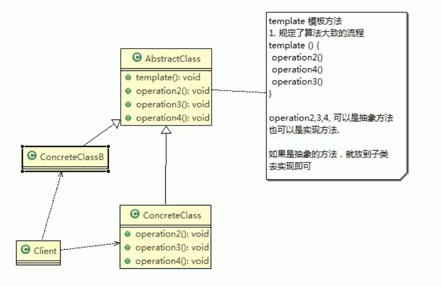

# 从Spring角度了解设计模式

- 主要参考自：
  - https://mp.weixin.qq.com/s?__biz=Mzg2OTA0Njk0OA==&mid=2247485303&idx=1&sn=9e4626a1e3f001f9b0d84a6fa0cff04a&chksm=cea248bcf9d5c1aaf48b67cc52bac74eb29d6037848d6cf213b0e5466f2d1fda970db700ba41&token=255050878&lang=zh_CN#rd
  - https://www.bilibili.com/video/BV1G4411c7N4?from=search&seid=7333402617635914123&spm_id_from=333.337.0.0
- 23种设计模式，可用分为三个类别：
  - 创建型模式：单例、工厂、抽象工厂、建造者、原型模式
  - 结构型模式：适配器、装饰器、代理、外观、组合、桥接、享元模式
  - 行为型模式：策略、命令、状态、观察者、模板方法、迭代器、中介者、备忘录、解释器、职责链、访问者模式
- Spring 框架中用到了哪些设计模式：
  - **工厂设计模式** : Spring使用工厂模式通过 `BeanFactory`、`ApplicationContext` 创建 bean 对象。
  - **代理设计模式** : Spring AOP 功能的实现。
  - **单例设计模式** : Spring 中的 Bean 默认都是单例的。
  - **模板方法模式** : Spring 中 `jdbcTemplate`、`hibernateTemplate` 等以 Template 结尾的对数据库操作的类，它们就使用到了模板模式。getBeanFactory也是一个采用模板方法模式的抽象类
  - **包装器设计模式** : 我们的项目需要连接多个数据库，而且不同的客户在每次访问中根据需要会去访问不同的数据库。这种模式让我们可以根据客户的需求能够动态切换不同的数据源。
  - **观察者模式:** Spring 事件驱动模型就是观察者模式很经典的一个应用。
  - **适配器模式** :Spring AOP 的增强或通知(Advice)使用到了适配器模式、spring MVC 中也是用到了适配器模式适配`Controller`。

## 1. 模板方法模式-行为型模式

- 提出问题：
  - 编写制作豆浆的程序，说明如下:
  - 制作豆浆的流程选材--->添加配料--->浸泡--->放到豆浆机打碎通过添加不同的配料，可以制作出不同口味的豆浆
  - 选材、浸泡和放到豆浆机打碎这几个步骤对于制作每种口味的豆浆都是一样的
- 模板方法简单定义：
  - 模板方法模式(Template Method Pattern)，也叫模板模式(Template Pattern)，在一个抽象类中公开定义执行它的方法的模板，子类可以按照需要重写方法的实现，但是调用将以抽象类中定义的模板的方式进行
  - 也就是：模板方法模式定义一个操作中的算法骨架，将一些步骤延迟到子类中，使得子类可以不改变一个算法的结构就可以重新定义该方法的某些特定步骤
- 
- 对原理类图的说明：
  - AbstarctClass抽象类：类中实现了模板方法(template)，定义算法的骨架，具体子类需要去实现 其他的抽象方法
  - ConcreteClass 实现抽象方法中的operation2,3,4，以完成算法中特定子类的步骤
- 模板方法模式中的钩子方法：
  - 钩子方法：默认不做任何事情，子类可以视情况要不要覆盖它
    - 一般用于判断template这个算法骨架中是否要执行该步骤
      - 如果不执行，子类就不用重写，不用覆盖，只需要设置对应的flag即可
      - 如果要执行：重写即可
  - 如：做豆浆的例子：还希望制作纯豆浆，不添加任何的配料
    - 可以使用钩子方法