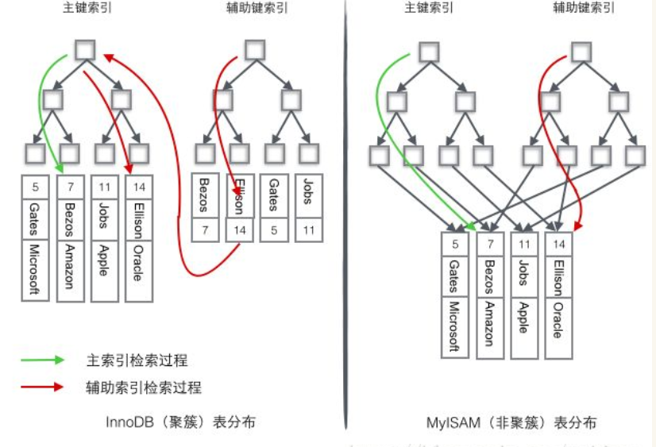
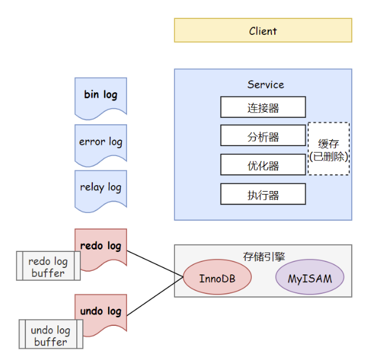
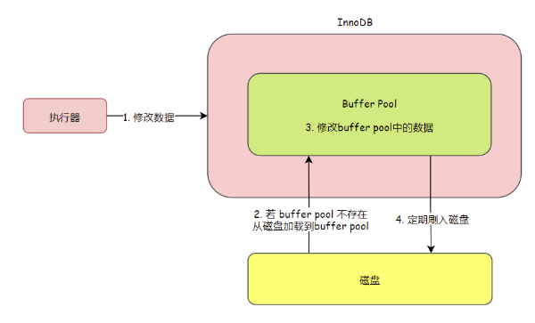
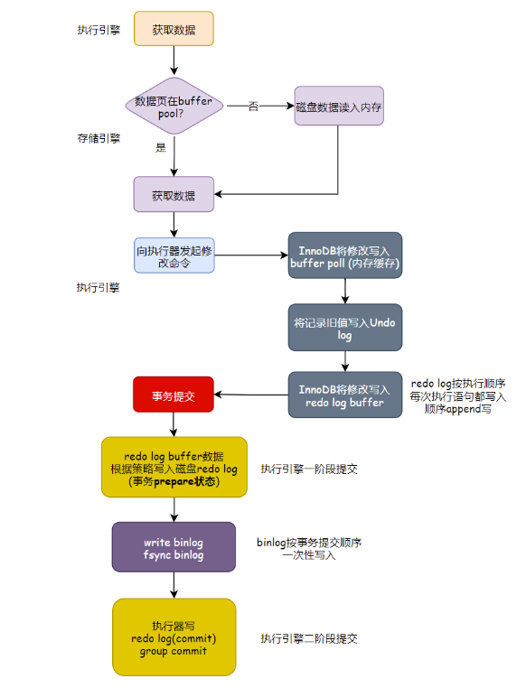
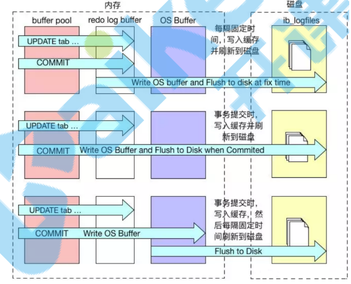
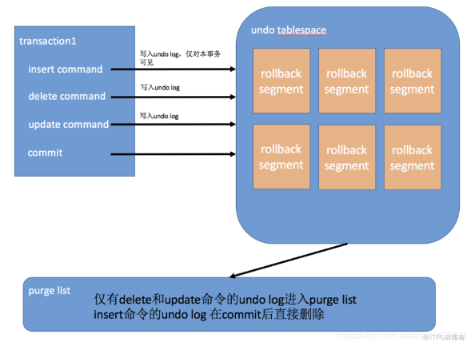
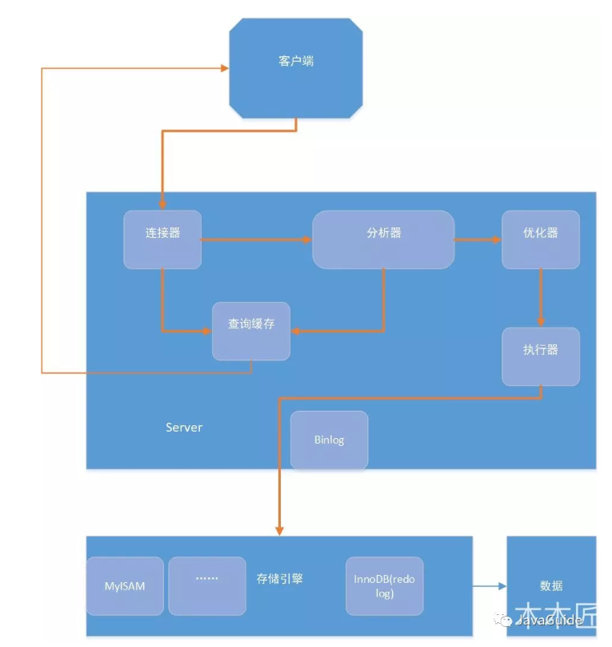

# MySQL问答

- 主要参考自：https://snailclimb.gitee.io/javaguide-interview/#/./docs/d-1-mysql

## 1. 什么是MySQL?

- MySQL是一种关系型数据库，开源免费、方便扩展、稳定。默认端口号是3306

## 2. MySQL的存储引擎？

### 2.1 查看MySQL使用的存储引擎

```mysql
# 查看MySQL默认的存储引擎：InnoDB
show engines;

# 查看MySQL当前默认的存储引擎
show variables like '%storage_engine%';

# 查看表的存储引擎
show table status like 'table_name';
```

### 2.2 MyISAM和InnoDB的区别

- 在MySQL5.5之前，MyISAM是MySQL默认的数据库引擎，虽然性能极佳，提供大量的特性：如全文索引、压缩、空间函数等，但是MyISAM不支持事务和行级锁，并且最大的缺陷是奔溃后无法安全恢复，适用于读密集的情况
- 在MySQL5.5之后，引入InnoDB作为MySQL默认的数据库引擎。
- 两者对比：
  - 是否支持行级锁：
    - MyISAM只有表级锁
    - InnoDB支持行级锁和表级锁，默认为行级锁
  - 是否支持事务和奔溃后安全恢复：
    - MyISAM强调的是性能，每次查询具有原子性，执行速度比InnoDB快，但是不提供事务支持
    - InnoDB提供事务，外部键等高级数据库功能，具有事务、回滚、奔溃修复能力的事务安全型表
  - 是否支持外键：
    - MyISAM不支持外键
    - InnoDB支持外键
  - 是否支持MVCC：
    - 只有InnoDB支持，用于应对高并发的事务，MVCC比单纯的加锁更高效
    - MVCC只在Read Committed和Repeatable Read两个隔离级别下工作
    - MVCC可以使用乐观锁和悲观锁来实现，各个数据库MVCC实现并不统一
    - 更多了解可以：https://segmentfault.com/a/1190000012650596

## 3. 字符集及校对规则

- 建议参考：https://www.cnblogs.com/geaozhang/p/6724393.html#MySQLyuzifuji

- 什么是字符集？
  
  - 一种从二进制编码到某类字符符号的映射

- 什么是校对规则？
  
  - 某种字符集下的排序规则
  - MySQL中每一种字符集都会对应一系列的校对规则

- MySQL采用的是类似继承的方式指定字符集的默认值，每个数据库以及每张数据表都有自己的默认值，会逐层继承：
  
  - 如：个库中所有表的默认字符集将是该数据库所指定的字符集（这些表在没有指定字符集的情况下，才会采用默认字符集）

## 4. 索引

- MySQL索引使用的数据结构主要有：
  - BTree索引：大部分场景都使用
  - 哈希索引：底层的数据结构就是哈希表，在绝大多数需求为单条记录查询的时候，可用选择哈希索引，查询性能最快
- MySQL的BTree索引使用的是B树种的B+Tree，但是两种不同的存储引擎实现方式是不同的：
  - MyISAM：B+Tree叶节点的data域存放的是数据记录地址。索引文件和数据文件是分离的
    - 在索引检索的时候，首先按照B+Tree搜索算法搜索索引
    - 如果指定的key存在，则取出对应的data域的值，然后以data域的值为地址读取相应的数据记录。
    - 这种被称为**非聚簇索引**
  - InnoDB：数据文件本身就是索引文件
    - 表数据本身就是按照B+Tree组织的索引结构，树的叶节点data域保存了完整的数据记录，这个索引的key就是数据表的主键
    - 因此表数据文件本身就是主索引，这种被称为**聚簇索引**
    - 其他索引都是作为辅助索引，辅助索引的data域存储相应记录主键的值而不是地址！
    - 在根据主索引搜索时，直接找到key所在的节点取出即可
    - 在根据辅助索引搜索时，需要先找到主键的值，再走一遍主索引
    - 因此：再设计表的时候，不建议使用过长的字段作为主键，也不建议使用非单调字段作为主键，这样容易引起主索引频繁分裂
- 

## 5. 查询缓存

- 在执行查询语句时，会先查询缓存，MySQL8.0之后移除=>也许是因为Redis数据库的存在

- ```mysql
  # my.cnf加入以下配置，重启MySQL开启查询缓存
  query_cache_type=1
  query_cache_size=600000
  # MySQL执行以下命令也可以开启查询缓存
  set global  query_cache_type=1;
  set global  query_cache_size=600000;
  ```

- **开启查询缓存后在同样的查询条件以及数据情况下，会直接在缓存中返回结果**。这里的查询条件包括查询本身、当前要查询的数据库、客户端协议版本号等一些可能影响结果的信息。因此任何两个查询在任何字符上的不同都会导致缓存不命中。此外，如果查询中包含任何用户自定义函数、存储函数、用户变量、临时表、MySQL库中的系统表，其查询结果也不会被缓存。

- 缓存建立之后，MySQL的查询缓存系统会跟踪查询中涉及的每张表，如果这些表（数据或结构）发生变化，那么和这张表相关的所有缓存数据都将失效。

- **缓存虽然能够提升数据库的查询性能，但是缓存同时也带来了额外的开销，每次查询后都要做一次缓存操作，失效后还要销毁。** 因此，开启缓存查询要谨慎，尤其对于写密集的应用来说更是如此。如果开启，要注意合理控制缓存空间大小，一般来说其大小设置为几十MB比较合适。此外，

- **还可以通过sql_cache和sql_no_cache来控制某个查询语句是否需要缓存：**

- ```mysql
  select sql_no_cache count(*) from usr;
  ```

## 6. 事务？

- 什么是事务？
  - 事务是逻辑上的一组操作，要不都执行，要不都不执行

### 6.1 事务的ACID

- 原子性(Atomicity)：事务是最小的执行单位，不允许分割，确保事务的要不都执行，要不都不执行
- 一致性(Consistency)：执行事务前后，数据保存一致，多个事务对同一个数据读取的结果是相同的
- 隔离性(Isolation)：并发访问数据库时，一个用户的事务不被其他事务干扰，各并发事务之间数据库是独立的
- 持久性(Durability)：一个事务被提交之后，对数据库种的数据的改变是持久的，即使数据库发生故障也不会对其有任何影响

### 6.2 并发事务的问题

- 脏读(Dirty Read)：
  - 当一个事务正在访问数据并且对数据进行了修改，并且未提交
  - 此时另一个事务也访问这个数据，并且读取到了上一个事务修改后的数据
  - 因此：另一个事务读取到的数据是脏数据！
- 丢失修改(Lost to modify)：
  - 一个事务读取一个数据时，另一个事务也读取了该数据
  - 第一个事务修改了这个数据，另一个事务也修改了这个数据
  - 结果：第一个事务修改的数据被丢失=》丢失修改
- 不可重复读(Unrepeatable read)：
  - 当一个事务多次读取同一个数据，并且还未提交
  - 另一个事务也读取该数据，并且进行修改
  - 导致：第一个事务两次读取的数据不一样=》不可重复读
- 幻读(Phantom read)：
  - 当一个事务直多次读取同一个数据，并且还未提交
  - 另一个事务插入了或者删除了一些数据
  - 导致：第一个事务再次读取时，发现数据多了或者少了=》幻读

### 6.3 事务隔离级别

- SQL标准定义了四个隔离级别：
  - 读未提交(Read Uncommitted)：
    - 最低的隔离级别，允许读取尚未提交的数据变更
    - 会导致：脏读、幻读、不可重复读
  - 读已提交(Read committed)：
    - 允许读取并发事务已经提交的数据
    - 可以阻止：脏读
    - 会导致：幻读、不可重复读
  - 可重复读(Repeatable read)：
    - 对同一个字段的多次读取都是一样的，除非数据是被本身事务自己所修改
    - 可以阻止：脏读、不可重复读
    - 会导致：幻读
  - 可串行化(Serializable)：
    - 最高的隔离级别，完全服从ACID的隔离级别，所有事务串行执行
- MySQL InnoDB默认支持的隔离级别是Repeatable Read：可重复读
  - InnoDB的可重复使用的是Next-Key Lock锁释放，可以避免幻读的产生
  - InnoDB 存储引擎的默认支持的隔离级别是 **REPEATABLE-READ（可重读）** 已经可以完全保证事务的隔离性要求，即达到了 SQL标准的 **SERIALIZABLE(可串行化)** 隔离级别。
  - 因为隔离级别越低，事务请求的锁越少，所以大部分数据库系统的隔离级别都是 **READ-COMMITTED(读取提交内容)** 
  - InnoDB 存储引擎在 **分布式事务** 的情况下一般会用到 **SERIALIZABLE(可串行化)** 隔离级别。

## 7. 锁机制和锁算法

- 使用的锁？
  - MyISAM：使用表级锁
  - InnoDB：默认使用行级锁，支持：表级锁和行级锁
- 表级锁：
  - MySQL中锁定粒度最大的锁，对当前操作的整张表加锁
  - 实现简单、资源消耗少，加锁快，不会出现死锁、
  - 锁定粒度最大、触发锁冲突的概率最高，并发度最低
- 行级锁：
  - MySQL中锁定粒度最小的锁，只针对当前操作的行进行加锁
  - 加锁粒度小、并发度高
  - 加锁开销大、加锁慢、会发生死锁
- InnoDB存储引擎的锁算法：
  - Record Lock：单个行记录上的锁
  - Gap Lock：间隙锁，锁定一个范围，不包括记录本身
  - Next-Key Lock：record + gap：锁定一个访问，包括记录本身
- InnoDB存储引擎锁相关：
  - 对行的查询使用的是Next-key Lock
  - Next-key Lock可以解决幻读问题
  - 当查询的索引含有唯一索引时，将Next-key lock降级为Record key
  - Gap锁设计的目的是为了阻止多个事务将记录插入到同一范围，从而导致幻读
  - 两种显示设置关闭Gap锁：
    - 将事务隔离级别设置为RC
    - 将参数innodb_locks_unsafe_for_binlog设置为1

## 8. 大表优化

- 可以参考：https://segmentfault.com/a/1190000006158186

- 当MySQL单表记录数过大时，数据库的CRUD性能会明显下降，此时可以采取以下策略：

- 限定数据的范围：
  
  - 务必禁止不带任何限制数据范围条件的查询语句。比如：我们当用户在查询订单历史的时候，我们可以控制在一个月的范围内；

- 读写分离：
  
  - 经典的数据库拆分方案，主库负责写，从库负责读；

- 垂直拆分：
  
  - **根据数据库里面数据表的相关性进行拆分。** 例如，用户表中既有用户的登录信息又有用户的基本信息，可以将用户表拆分成两个单独的表，甚至放到单独的库做分库。
  - **简单来说垂直拆分是指数据表列的拆分，把一张列比较多的表拆分为多张表。**
  - **垂直拆分的优点：** 可以使得列数据变小，在查询时减少读取的Block数，减少I/O次数。此外，垂直分区可以简化表的结构，易于维护。
  - **垂直拆分的缺点：** 主键会出现冗余，需要管理冗余列，并会引起Join操作，可以通过在应用层进行Join来解决。此外，垂直分区会让事务变得更加复杂；

- 水平拆分：
  
  - **保持数据表结构不变，通过某种策略存储数据分片。这样每一片数据分散到不同的表或者库中，达到了分布式的目的。 水平拆分可以支撑非常大的数据量。**
  - 的行数超过200万行时，就会变慢，这时可以把一张的表的数据拆成多张表来存放。举个例子：我们可以将用户信息表拆分成多个用户信息表，这样就可以避免单一表数据量过大对性能造成影响。
  - 水平拆分可以支持非常大的数据量。需要注意的一点是：分表仅仅是解决了单一表数据过大的问题，但由于表的数据还是在同一台机器上，其实对于提升MySQL并发能力没有什么意义，所以 **水平拆分最好分库** 。
  - 水平拆分能够 **支持非常大的数据量存储，应用端改造也少**，但 **分片事务难以解决**  ，跨节点Join性能较差，逻辑复杂。《Java工程师修炼之道》的作者推荐 **尽量不要对数据进行分片，因为拆分会带来逻辑、部署、运维的各种复杂度** ，一般的数据表在优化得当的情况下支撑千万以下的数据量是没有太大问题的。如果实在要分片，尽量选择客户端分片架构，这样可以减少一次和中间件的网络I/O

## 9. 池化设计思想？

- 池化设计？
  - 可以初始预设资源，可以抵消每次获取资源的消耗
  - 方便管理维护
- 具体实现？
  - java线程池、jdbc连接池、redis连接池
- 数据库连接池？
  - 数据库连接本质就是一个 socket 的连接。数据库服务端还要维护一些缓存和用户权限信息之类的  所以占用了一些内存。
  - 可以把数据库连接池是看做是维护的数据库连接的缓存，以便将来需要对数据库的请求时可以重用这些连接。
- 为什么要数据库连接池？
  - 为每个用户打开和维护数据库连接，尤其是对动态数据库驱动的网站应用程序的请求，既昂贵又浪费资源。**在连接池中，创建连接后，将其放置在池中，并再次使用它，因此不必建立新的连接。如果使用了所有连接，则会建立一个新连接并将其添加到池中。 **连接池还减少了用户必须等待建立与数据库的连接的时间。

## 10. 分库分表后，id主键如何处理？

- 此时需要一个全局唯一的id来支持
- 生成全局id的方式：
  - **UUID**：不适合作为主键，因为太长了，并且无序不可读，查询效率低。比较适合用于生成唯一的名字的标示比如文件的名字。
  - **数据库自增 id** : 两台数据库分别设置不同步长，生成不重复ID的策略来实现高可用。这种方式生成的 id 有序，但是需要独立部署数据库实例，成本高，还会有性能瓶颈。
  - **利用 redis 生成 id :** 性能比较好，灵活方便，不依赖于数据库。但是，引入了新的组件造成系统更加复杂，可用性降低，编码更加复杂，增加了系统成本。
  - **Twitter的snowflake算法** ：Github 地址：https://github.com/twitter-archive/snowflake。
  - **美团的[Leaf](https://tech.meituan.com/2017/04/21/mt-leaf.html)分布式ID生成系统** ：Leaf 是美团开源的分布式ID生成器，能保证全局唯一性、趋势递增、单调递增、信息安全，里面也提到了几种分布式方案的对比，但也需要依赖关系数据库、Zookeeper等中间件。感觉还不错。美团技术团队的一篇文章：https://tech.meituan.com/2017/04/21/mt-leaf.html 。

## 11. MySQL日志文件

- 

### 11.1 缓存

- `buffer pool`：如果mysql不使用内存缓冲池，每次读取数据时，都需要访问磁盘，会大大的增加磁盘的IO请求，导致效率低下；在Innodb引擎在读取数据的时候，**把相应的数据和索引载入到内存的缓冲池（buffer pool）中**，一定程度的提高了数据的读写速度
- buffer pool用来存放**各种数据的缓存**包括：**索引页，数据页，undo页，插入缓冲，自适应哈希索引，innodb存储的锁信息，数据字典等**。工作方式是将数据库文件**按照页（每页16k）读取到缓冲池**，然后按照最近最少使用算法（`LRU`）来保留缓冲池中的缓冲数据。如果数据库文件需要修改，总是首先修改在缓冲池中的页（发生修改后即成为`脏页`），然后在按照一定的频率将缓冲池中的脏页刷新到文件
- 
- 缺点：
  - 数据更新不会即使持久化到硬盘，**当系统崩溃时，buffer pool中没有持久化的数据就丢失了**。
- 解决以上缺点：
  - 引入了redo log ，将buffer pool中的修改持久化到rodo log中

### 11.2 redo log、undo log、bin log

- 什么是redo log？
  
  - 是物理文件，记录某个数据页上所做的修改，记录的是新数据的备份
  - 在事务执行过程中不断的写 redo log buffer，事务提交后将redo log buffer的数据写入到 redo log 文件
  - 在事务提交前，只要将redo log持久化即可，不需要将数据持久化，当系统崩溃的时候，虽然数据没有持久化，但是redo log已经持久化了，系统可以根据redo log的内容将所有数据恢复到最新的状态

- 什么是undo log？
  
  - 是物理文件，保存数据内容
  - undo log本身的操作都会记录到redo log，因此undo log可以不必立即持久化到磁盘中，因为undo log即便丢失了也可以通过redo log将其恢复

- 什么是bin log？
  
  - 归档日志，是属于逻辑日志，二进制的形式记录语句的原始逻辑，不记录真实数据，因此依靠bin log是没有crash-safe的能力的
  - bin log是**`追加写`的方式**，一份文件写到一定的大小就会更换下一份文件，**不会覆盖**

- 因此插入记录时：
  
  1. 向 undo log 插入一条 undo log记录
  2. 向 redo log 插入一条"插入undo log记录"的redo log记录
  3. 插入数据
  4. 向 redo log 插入一条 "insert" 的redo log 记录

- redo log什么时候写回到磁盘？
  
  - **回写到磁盘：** 当redo log满了，或者系统比较闲的时候，就会对redo log中的内容进行读取，对完整的trx_id对应的信息进行处理，如果数据页1在内存中还存在，直接将数据页1的信息回写到所在磁盘位置，如果不存在则将数据页1从磁盘中加载到内存，通过redo log中信息在内存中对数据页1进行修改，回写到磁盘。然后释放redo log中trx_id=10的空间区域。如果redo log中对应的trx_id没有end，则跳过不处理
  - redo文件是循环利用的，即文件写满了，就会从头开始写，重复利用空间。在很多资料上，Redo Log文件都会被画成一个环，实际上也确实如此

- redo log和bin log的区别？
  
  - 为什么会有这两份日志？
    - 一开始MySQL 里并没有 InnoDB 引擎。MySQL 自带的引擎是 MyISAM，但是 MyISAM 没有 crash-safe 的能力，binlog 日志只能用于**归档**。而 InnoDB 是另一个公司以插件形式引入 MySQL 的，既然只依靠 bin log 是没有 crash-safe 能力的，所以 InnoDB 使用另外一套日志系统——也就是 redo log 来实现 crash-safe 能力
  - 区别：
    - redo log是**InnoDB引擎层**的日志，而bin log是**MySQL Server层**记录的日志，虽然记录有重复，但是格式是不一样的
    - redo log记录数据的修改，**不管事务是否提交都会记录下来**。是**物理日志**，记录对于每个数据页的**修改**，用于数据库异常重启的时候进行恢复，**redo log日志的大小是固定的，记录满了以后就要从头`循环写`**，当然覆盖之前会保证更新到磁盘先
    - bin log又称为归档日志，属于**逻辑日志**，二进制形式记录的是语句的**原始逻辑**。不记录真实数据，所以**依靠binlog是没有crash-safe的能力的**，bin log是**`追加写`的方式**，一份文件写到一定的大小就会更换下一份文件，**不会覆盖**
    - 写入时机：binlog只在事务提交后进行一次写入，而redolog在事务进行中不断写入（redolog不是随事务提交顺序写入的，而是按实际语句的执行顺序）。而这也是后面RR级别的binlog的statement格式在主从复制有问题的原因！
    - bin log可以用作恢复数据的时候使用，也可以用作主从复制，而redo log用于异常宕机或者介质故障后的数据恢复使用

### 11.3 redo log两阶段提交

```mysql
update t1 set c=c+1 where ID=2;
```

1. **执行器**首先找存储引擎取ID=2的这一行，**存储引擎**进行搜索，如果ID=2在内存中，就直接返回，否则从磁盘读入内存，然后返回
2. **执行器**拿到存储引擎给的数据，将c进行`加1`，得到新的一行数据，再次调用**存储引擎**进行`写入`
3. **存储引擎将**这行新的数据`更新到内存`，同时将这个更新操作`记录到redo log`文件中，此时redo log处于prepare阶段，然后告知执行器执行完成
4. **执行器**生成这个操作的`bin log`，并把bin log`写入磁盘`
5. 执行器调用**存储引擎**的提交事务接口，把刚刚写入的`redo log改成commit`状态



**Flush阶段**：将redo log中prepare阶段的数据flush刷盘(组提交)， 同时将bin log数据写入缓冲区

- redo log 从 redo log buffer 写入到os的文件系统缓存后，为了确保写入磁盘，必须进行一次 `fsync`操作，由于fsync效率取决于磁盘性能，因此磁盘性能决定了事务提交的性能，为了避免频繁多次刷盘，redo log 可以进行组提交
- 若完成后崩溃，则binlog不保证有该事务，MySQL重启之后可能会回滚该事务
- `innodb_flush_log_at_trx_commit`参数（默认1）：
  - 为0时：**延迟写**，每隔一秒交给redo log buffer的数据写入os buffer，然后写入磁盘的redo log文件，写入效率最高，但是安全性最低
  - 为1时，**实时写实时刷**，事务每次提交都将redolog写入文件系统缓存，并且调用`fsync()`将文件系统缓冲区中的数据真正写入磁盘，确保不会丢失数据。写入效率最低，但是安全性最高。设置为1才能保证事务的持久性
  - 为2时，**实时写延时刷**，事务提交也会写入到redolog buffer 和 os的文件buffer，但是不会调用`fsync()`，而是让文件系统自己去判断何时将缓存写入磁盘，属于是平衡效率和安全性



- **Sync阶段**：对bin log的组提交，若完成后数据库崩溃，由于binlog已经记录了事务，重启后可以通过redo log继续进行事务提交
  
  - binlog_group_commit_sync_delay=N：在等待N μs后，开始事务刷盘(图中Sync binlog)
  - binlog_group_commit_sync_no_delay_count=N：如果队列中的事务数达到N个，就忽视binlog_group_commit_sync_delay的设置，直接开始刷盘(图中Sync binlog)

- **commit阶段**：将redo log中已经prepare的事务在引擎中提交。无需刷盘了，Flush的redo log已经够保证数据库崩溃的数据安全。完成最后的引擎提交使Sync可以进行下一组事务的处理

- **直接写完redo log提交commit再写binlog的问题**：redo写完，事务提交，binlog还没写完，系统崩溃，此时可以通过redo恢复。但是由于binlog没写完，binlog里缺少sql语句，因此，之后备份日志的时候，存起来的binlog就缺少了这条语句，如果用binlog恢复临时库就会缺少更新，与原库数据不同

- **先写完binlog提交再写redo log的问题**：binlog写完如果crash，redo没写完，所以崩溃之后这个事务无效，之后用binlog恢复的时候就多出了一个事务，恢复的依然与原数据库不同

- **只有两个日志都写完之后才能提交事务**

- 那么他们俩是如何配合进行**故障恢复**来保证crash-safe的呢？
  
  - 它们有一个共同的事务ID字段TRX_ID。崩溃恢复的时候，会按顺序扫描 redo log
    - 如果在prepare阶段就crash，则该事务是不会被持久化为prepare状态到    redo log的
    - 如果碰到既有 prepare、又有 commit 的 redo log，就直接提交
    - 如果碰到只有 parepare、而没有 commit 的 redo log，就拿着 TRX_ID 去 binlog 找对应的事务，**由binlog决定提交还是回滚**，如果binlog中存在该事务则commit提交，否则回滚事务

- **MySQL如何判断一个事务的bin log是否完整?**
  
  - row 格式的 binlog，最后会有一个 XID event
  - statement 格式的 binlog，最后会有 COMMIT

- **什么是crash safe？**
  
  - CrashSafe指MySQL服务器宕机重启后，能够保证：`所有已经提交的事务的数据仍然存在。所有没有提交的事务的数据自动回滚`。

- **如果只使用binlog可以实现crash safe嘛？**
  
  - 不能
  - 已经刷盘的数据，redolog会进行标记（chickpoint机制和LSN机制），而binlog没有这种机制，所以crash后binlog无法判断事务中哪些刷盘了哪些没刷盘，就没办法进行正常的恢复
  - 如果 binlog 写入成功了（write），数据还没写入磁盘（fsync），数据库异常崩溃，重启后主库没有这部分数据，而通过 binlog 同步的从库却有了这部分配置，**导致主从数据不一致**

- **如果只使用redolog可以实现crash safe嘛？**
  
  - 可以的，但是bin log有着redo log无法替代的功能：`归档`(因为redo log会循环写，日志历史没法保留)，`高可用系统的实现`(MySQL集群基于binlog的复制)，因为历史原因，mysql系统很多方面都依赖于binlog，是mysql一开始就有的功能，所以没有办法去替代这些功能

### 11.4 数据恢复

- 数据库宕机后redo log怎么判断哪些数据需要刷盘？
- **LSN概念**：即`Log Sequence Number`，标记了**日志的序列号**，是一个单调递增的64位无符号整数，LSN表示**事务写入redo log的字节总量**
  - 此外，**每个数据页也记录了LSN**，该页的LSN用来判断是否需要恢复操作
- **Chickpoint概念**：一个保存点，在这个点之前的数据修改页（redo log LSN < Chickpoint LSN）都已经写入到磁盘文件了，**InnoDB每次刷盘都会更新Chickpoint**，即把`此次更新中最新的 redo log LSN`更新到`Chickpoint LSN`中，方便恢复数据的时候作为起始点的判断
- 一般来说，磁盘文件页中的`LSN`都会小于Redo中`最新的redo log LSN`，那么这两者之间的数据块，就是没有刷入磁盘数据文件的数据块了，在崩溃重启后，数据库只需要将redo中这部分没有刷入磁盘的数据块刷到数据文件中就可以了（当然还要利用binlog判断该redolog到底是否是成功的事务），这样崩溃恢复的速度就会大大提高
- **恢复**
  - InnoDB引擎在启动时，保护管上次数据库运行时是否正常，都会尝试进行恢复操作。
  - redo log记录的是物理日志，恢复速度比 binlog 的逻辑日志快很多

### 11.5 WAL机制和组提交

- WAL：
  
  - WAL机制 (Write Ahead Log)定义:
    - WAL指的是**对数据文件进行修改前，必须将修改先记录到日志**。MySQL为了保证ACID中的一致性和持久性，使用了WAL
  - Redo log的作用:
    - Redo log就是一种WAL的应用。当数据库忽然掉电，再重新启动时，MySQL可以通过Redo log还原数据。也就是说，每次事务提交时，不用同步刷新磁盘数据文件，只需要同步刷新Redo log就足够了。**相比写数据文件时的随机IO，写Redo log时的顺序IO能够提高事务提交速度**

- 组提交：
  
  - 若事务为非只读事务，则事务每次提交都需要fsync操作，以保证redolog都已经写入磁盘。磁盘的fsync性能有限，为了提高磁盘fsync效率，数据库提供了group commit的功能，即一次fsync操作可以刷新确保多个事务的日志被写入文件

- 在没有开启binlog时
  
  - **Redo log的刷盘操作将会是最终影响MySQL TPS的瓶颈所在**。为了缓解这一问题，MySQL使用了组提交，将多个刷盘操作合并成一个，如果说10个事务依次排队刷盘的时间成本是10，那么将这10个事务一次性一起刷盘的时间成本则近似于1。

- 当开启binlog时
  
  - 为了保证Redo log和binlog的数据一致性，MySQL使用了二阶段提交，由binlog作为事务的协调者。而 引入二阶段提交 使得binlog又成为了性能瓶颈，先前的Redo log 组提交 也成了摆设。为了再次缓解这一问题，**MySQL增加了binlog的组提交**，目的同样是将binlog的多个刷盘操作合并成一个，结合Redo log本身已经实现的 组提交，分为三个阶段(Flush 阶段、Sync 阶段、Commit 阶段)完成binlog 组提交，最大化每次刷盘的收益，弱化磁盘瓶颈，提高性能

### 11.6 undo log 、slow log

- 什么是undo log？
  
  - 是逻辑日志，可以保存数据内容
  - undo log本身的操作都会记录到redo log，因此undo log可以不必立即持久化到磁盘中，因为undo log即便丢失了也可以通过redo log将其恢复

- undo log的作用？
  
  - undo log是为了实现事务的`原子性`，在MySQL的InnoDB存储引擎中用还用undo log来实现`多版本并发控制(MVCC)`
  - 保证`事务`进行`rollback`时的`原子性和一致性`，当事务进行`回滚`的时候可以用undo log的数据进行`恢复`。
  - 用于MVCC`快照读`的数据，在MVCC多版本控制中，通过读取`undo log`的`历史版本数据`可以实现`不同事务版本号`都拥有自己`独立的快照数据版本`。

- undo log如何保证原子性和一致性？
  
  - **为了满足事务原子性，每次对记录操作前，都会把旧值备份到undo log，如果执行出错或者用户主动执行rollback，系统可以利用undo log中的备份将数据恢复到事务开始之前的状态**，备份之后才进行数据的修改
  - redo log基本上都是是顺序写的，而undo log是需要进行**随机读写**的
  - **磁盘上不存在单独的 undo log 文件**，它存放在数据库内部的特殊段(segment)中，这称之为 **undo 段**，innodb为每行undo log记录都实现了三个隐藏字段
    - 6字节的事务ID (`DB_TRX_ID`)
    - 7字节的回滚指针 (`DB_ROLL_PTR`)
    - 隐藏的ID
  - **undo log会产生redo log**，也就是说undo log的产生会伴随着redo log的产生，因为undo log也需要持久性的保护

- undo log分类：
  
  - `insert undo log`：代表事务在insert新记录时产生的undo log , 由于insert操作只对事务自己可见，所以在事务提交后可以立即删除
  - `update undo log（主要）`：事务在进行update或delete时产生的undo log ; 这种undo log可能需要提供MVCC机制，不仅在事务回滚时需要，在快照读时也需要，所以不能在事务提交时删除。只有在快照读或事务回滚不涉及该日志时，对应的日志才会被purge线程统一清除

- undo log什么时候删除？
  
  - 当事务提交的时候，innodb不会立即删除undo log，因为后续还可能会用到undo log，如隔离级别为repeatable read时，事务读取的都是开启事务时的最新提交行版本，只要该事务不结束，该行版本就不能删除，即undo log不能删除。但是在事务提交的时候，会将该事务对应的undo log放入到删除列表中，未来通过purge来删除
    
    - delete操作实际上不会直接删除，而是将delete对象打上delete flag，标记为删除，最终的删除操作是purge线程完成的。
    
    - update分为两种情况：update的列是否是主键列
      
      - 如果不是主键列，在undo log中直接反向记录是如何update的。即update是直接进行的
      - 如果是主键列，update分两部执行：先删除该行，再插入一行目标行
  
  - 

- 什么是slow log？
  
  - MySQL的慢查询日志是MySQL提供的一种日志记录，用来记录在MySQL中响应时间超过阀值的语句，具体指运行时间超过long_query_time值的SQL，则会被记录到慢查询日志中。

- 怎么使用？相关参数？
  
  - 相关参数：
    
    - `slow_query_log`：是否开启慢查询日志，1表示开启，0表示关闭。
    - log-slow-queries：旧版（5.6以下版本）MySQL数据库慢查询日志存储路径。可以不设置该参数，系统则会默认给一个缺省的文件host_name-slow.log
    - `slow-query-log-file`：新版（5.6及以上版本）MySQL数据库慢查询日志存储路径。可以不设置该参数，系统则会默认给一个缺省的文件host_name-slow.log
    - `long_query_time`：慢查询阈值，当查询时间高于设定的阈值时，记录到日志
    - `log_queries_not_using_indexes`：未使用索引的查询也被记录到慢查询日志中（可选项）
  
  - 默认情况下慢查询日志是禁用的，需要手动开启
  
  - 默认情况下`long_query_time`的值是10秒，可以修改，一般设置为1秒，业务敏感还可以设置更低

## 12. 一条SQL语句在MySQL中的运行过程

- 参考：https://mp.weixin.qq.com/s?__biz=Mzg2OTA0Njk0OA==&mid=2247485097&idx=1&sn=84c89da477b1338bdf3e9fcd65514ac1&chksm=cea24962f9d5c074d8d3ff1ab04ee8f0d6486e3d015cfd783503685986485c11738ccb542ba7&token=79317275&lang=zh_CN#rd

- 

- SQL 等执行过程分为两类，
  
  - 一类对于查询等过程如下：
    - 权限校验---》查询缓存---》分析器---》优化器---》权限校验---》执行器---》引擎
  - 对于更新等语句执行流程如下：
    - 分析器----》权限校验----》执行器---》引擎---redo log prepare---》binlog---》redo log commit

- 分析器：
  
  - MySQL 没有命中缓存，那么就会进入分析器，分析器主要是用来分析 SQL 语句是来干嘛的，分析器也会分为几步：
  - **第一步，词法分析**，一条 SQL 语句有多个字符串组成，首先要提取关键字，比如 select，提出查询的表，提出字段名，提出查询条件等等。做完这些操作后，就会进入第二步。
  - **第二步，语法分析**，主要就是判断你输入的 sql 是否正确，是否符合 MySQL 的语法。
  - 完成这 2 步之后，MySQL 就准备开始执行了，但是如何执行，怎么执行是最好的结果呢？这个时候就需要优化器上场了。

- 优化器
  
  - 优化器的作用就是它认为的最优的执行方案去执行（有时候可能也不是最优，这篇文章涉及对这部分知识的深入讲解），比如多个索引的时候该如何选择索引，多表查询的时候如何选择关联顺序等。
  - 可以说，经过了优化器之后可以说这个语句具体该如何执行就已经定下来。

- 执行器
  
  - 当选择了执行方案后，MySQL 就准备开始执行了，首先执行前会校验该用户有没有权限，如果没有权限，就会返回错误信息，如果有权限，就会去调用引擎的接口，返回接口执行的结果。

- 语句分析：

- ```mysql
  update tb_student A set A.age='19' where A.name=' 张三 ';
  ```

- MySQL 自带的日志模块式 **binlog（归档日志）** ，所有的存储引擎都可以使用，

- InnoDB 引擎还自带了一个日志模块 **redo log（重做日志）**，我们就以 InnoDB 模式下来探讨这个语句的执行流程。流程如下：
  
  - 先查询到张三这一条数据，如果有缓存，也是会用到**缓存**。
  - 然后拿到查询的语句，把 age 改为 19，然后调用引擎 API 接口，写入这一行数据，InnoDB 引擎把数据保存在内存中，同时记录 redo log，此时 redo log 进入 prepare 状态，
  - 然后告诉**执行器**，执行完成了，随时可以提交。
  - 执行器收到通知后记录 binlog，然后调用引擎接口，提交 redo log 为提交状态。
  - 更新完成

## 13. 小结

- SQL语句的执行过程：
- 查询语句：权限校验=》查询缓存=》分析器=》优化器=》权限校验=》执行器=》引擎
  - 因此需要：
    - 优化器：索引、索引优化
    - 执行器调用执行引擎：并发事务处理、
- 更新语句：分析器=》权限校验=》执行器=》引擎--redo log prepare=》bin log=》redo log commit
  - 因此需要：
    - 执行器调用执行引擎：并发事务处理、事务ACID原则、崩溃后安全恢复、